# المواصفات الفنية

# مقدمة

توثق هذه المواصفات الفنية منصة PTC BSS/OSS في اليمن، وهي نظام دعم الأعمال ونظام دعم العمليات من الطراز المتقدم، وقد تم تصميمه لتوحيد وتحديث البنية التحتية للاتصالات التابعة لشركة الاتصالات العامة اليمنية (PTC). تعتبر هذه الوثيقة المرجع الفني الرسمي لجميع الأطراف المشاركة في تصميم وتنفيذ وتشغيل هذه المنصة.

## 1.1 ملخص تنفيذي

### 1.1.1 نظرة عامة على المشروع

منصة PTC BSS/OSS في اليمن (الإصدار 1.0.0) هي منصة اتصالات سحابية جديدة، تم تصميمها لتحل محل أربع منصات قديمة ومتفرقة تُستخدم حاليًا في تقديم خدمات PTC في مجالات الخطوط الثابتة، والخدمات المتنقلة، والنطاق العريض، والخدمات المؤسسية. تهدف المنصة إلى الالتزام الكامل بمعايير TM Forum Open API، كما أنها مصممة لخدمة أكثر من 50 مليون مشترك في جميع محافظات اليمن الـ19. توفر المنصة مستوى جودة خدمة يصل إلى 99.999%، وهو مستوى ممتاز للغاية في مجال الخدمات الاتصالية.

شركة الاتصالات العامة اليمنية هي الشركة المملوكة للحكومة والمسؤولة عن تقديم خدمات الاتصالات في جميع أنحاء اليمن. تقدم الشركة خدمات الاتصالات والتكنولوجيا لجميع المواطنين، سواء في الأرياف أو المدن. يوجد احتكار حكومي في سوق الخدمات الصوتية الثابتة، كما أن المنافسة في مجال الخدمات السريعة والإنترنت محدودة. تمثل هذه الشركة الخطوة الاستراتيجية للشركة، وفقًا لرؤيتها لعام 2030، وهي التحول إلى شركة رائدة في مجال الاتصالات الرقمية في المنطقة، من خلال دمج جميع الخدمات تحت منصة واحدة تعتمد على المعايير الدولية.

تم بناء المنصة على أساس بنية تحتية من نوع “ميكروسيرفيسات متعددة اللغات”. وقد تم استخدام أربع تقنيات رئيسية في بناء المنصة، حيث تم تحسين كل تقنية لتتناسب مع الغرض من استخدامها: – لوجيكة النظام الأساسي: Java 21 مع Spring Boot 3.2 (كما هو موضح في `bss-core/pom.xml` ). – محرك المعالجة عالي الأداء: Go 1.22 (كما هو موضح في `charging-engine/go.mod` ). – طبقة بوابة الواجهات البرمجية: TypeScript على Node.js 20 LTS مع NestJS (كما هو موضح في `api-gateway/package.json` ). – أدوات معالجة البيانات وتطبيقات الذكاء الاصطناعي: Python (كما هو موضح في `cdrmspipeline/` ). ابتداءً من أبريل 2026، وصلت نسبة إنجاز المنصة إلى حوالي 85%. وهناك خطة محددة لإنجاز المنصة بالكامل خلال 8–9 أسابيع، كما هو موضح في `IMPLEMENTATION_COMPLETION_PLAN.md` .

### 1.1.2 المشكلة الأساسية في الأعمال التجارية

تعمل شركة PTC حاليًا على أربعة أنظمة قديمة ومنفصلة عن بعضها البعض؛ كل نظام من هذه الأنظمة يعمل في مجال خدمي مختلف. هذا الوضع يعيق تحقيق التكامل بين الخدمات المختلفة، ويمنع التواصل المتعدد القنوات مع العملاء، بالإضافة إلى عرقلة العمليات الرقمية الحديثة.

| النظام القديم/النظام الموروث | مجال الخدمة/نطاق الخدمة | القيود الرئيسية/العوائق الأساسية |
| --- | --- | --- |
| TITAN | شبكة الهاتف الثابت/الخطوط الأرضية للمكالمات الصوتية | بروتوكول TL1، صيغة ASCII CDR، واجهات خاصة بالشركة المصنعة. |
| Oracle BRM | الهواتف المحمولة التي تدعم تقنية 4G/LTE | القطر: Gy/Gx/Ro؛ صيغة البيانات: ASN.1 CDR/EDR؛ تكاليف الترخيص مرتفعة. |
| WHM / cPanel | خدمات الاستضافة | متاح فقط عبر واجهة REST API، بدون أي تكامل مع أنظمة فوترة الاتصالات. |
| الأنظمة الداخلية المخصصة | ADSL، FTTH، MPLS، PRI | غير موثق رسميًا، مصمم حسب الطلب، ولا يتبع أي معايير لواجهات البرمجة الخاصة بالتطبيقات. |

هذه الأنظمة المفككة تخلق التحديات التجارية الخطيرة التالية:

*   عدم تكامل الخدمات: من المستحيل حاليًا تقديم باقات متكاملة مثل “الخط الأرضي + خدمة الإنترنت السلكي الفائق السرعة + خدمات الاستضافة”， وذلك لأن كل نظام يعمل بشكل مستقل، باستخدام كتالوجات منتجات منفصلة، وأنظمة فوترة منفصلة، بالإضافة إلى قواعد بيانات عملاء منفصلة.
*   النظرة المجزأة للعميل: لا يوجد بيانات موحدة عن العميل من جميع الجوانب. العميل الذي يستخدم خدمات متعددة، يظهر كعميل منفصل في كل نظام على حدة، مما يؤدي إلى تكرار البيانات وعدم تناسق سجلات الخدمات المقدمة له.
*   لا يوجد نظام للفوترة الموحدة: يتلقى العملاء فواتير منفصلة من كل نظام على حدة، مما يزيد من تعقيد عمليات إدارة الإيرادات، وتسوية المدفوعات، وإعداد التقارير المالية.
*   التهيئة اليدوية: يتطلب تفعيل الخدمة عبر النطاقات المختلفة تنسيقًا يدويًا بين فرق العمل المسؤولة عن كل نظام على حدة. وهو ما يؤدي إلى زيادة معدلات الأخطاء في عملية التفعيل، بالإضافة إلى زيادة الوقت اللازم لإتمام عملية التفعيل.
*   القدرة على التوسع محدودة: لم يتم تصميم الأنظمة القديمة لتلبية احتياجات عدد المشتركين المتوقع (أكثر من 50 مليون مشترك)، كما أنها لا تلبي متطلبات التحصيل الفوري للرسوم، وهو ما تتطلبه خدمات 4G/LTE المدفوعة مقدمًا في الوقت الحالي.
*   الاعتماد على البائعين والديون التقنية: الواجهات الخاصة بالبائعين (مثل TL1، Diameter، ASN.1)، بالإضافة إلى الأنظمة الداخلية غير الموثقة، تعيق عملية التحديث والتكامل مع الشركاء الخارجيين، كما تعيق الالتزام بالمعايير الدولية.

### 1.1.3 الأطراف المعنية والمستخدمون الرئيسيون

تخدم هذه المنصة مجموعة متنوعة من الأطراف المعنية، سواء كانوا مشتركين خارجيين أو فرق عمل داخلية.

| مجموعة أصحاب المصلحة | الوصف/الشرح |
| --- | --- |
| المشتركون في الخدمة للاستخدام المنزلي | المستهلكون النهائيون في جميع المحافظات الـ19، الذين يستخدمون خدمات شبكة الهاتف العامة، والهواتف المحمولة، وخدمات الإنترنت عبر الألياف الضوئية، وخدمات ADSL، بالإضافة إلى خدمات الاستضافة. |
| العملاء من الشركات الكبيرة/المؤسسات الكبيرة | الشركات التي تحتاج إلى خدمات MPLS، وPRI، وخدمات الوصول إلى الإنترنت المخصصة (DIA)، بالإضافة إلى خدمات الشبكة الخاصة الافتراضية (VPN) وخدمات الخطوط المستأجرة. |
| موظفو خدمة العملاء | الموظفون الذين يستخدمون واجهة CRM 360°، بالإضافة إلى أدوات إدارة الفواتير وإجراءات التعامل مع الشكاوى. |
| الفنيون الميدانيون | يتم إرسال العمال المتنقلين لتنفيذ عمليات التركيب والإصلاح والصيانة، وذلك من خلال نظام إدارة العمالة. |
| مهندسو الشبكات | الأشخاص المسؤولون عن إدارة مخزون الموارد، وتوفير الخدمات اللازمة، وإدارة الإنذارات، بالإضافة إلى إدارة هيكل الشبكة. |
| فرق المبيعات والشؤون المالية | المستخدمون المسؤولون عن عمليات الفوترة، وضمان الإيرادات، وكشف عمليات الاحتيال، بالإضافة إلى الرقابة المالية. |
| العمليات/تطوير العمليات التشغيلية | الفرق المسؤولة عن إدارة عمليات النشر، ولوحات المراقبة، وإجراءات التشغيل، بالإضافة إلى التعامل مع الحوادث. |
| الإدارة التنفيذية | القيادة تتطلب استخدام لوحات التحليل الإحصائي، ومراقبة مستوى الخدمة المقدمة، وتقديم تقارير حول المؤشرات الرئيسية، بالإضافة إلى إدارة الحملات التسويقية. |

### 1.1.4 الأثر المتوقع على الأعمال والقيمة المقدمة للعملاء

من المتوقع أن يحقق هذا النظام قيمة تجارية كبيرة في خمسة مجالات استراتيجية رئيسية.

**التقارب وتجربة العميل**

*   يتم دمج المنتجات بشكل موحد في جميع أنواع الخدمات (الخدمات الثابتة، الخدمات المتنقلة، خدمات النطاق العريض، خدمات الاستضافة، الخدمات المخصصة للشركات)، وذلك من خلال كتالوج المنتجات الواحد الذي يتم إدارته باستخدام أداة إدارة كتالوج المنتجات TMF620.
*   الفوترة الموحدة: فاتورة واحدة تشمل تكاليف خدمات الشبكة العامة للهاتف، وخدمات الإنترنت عبر الألياف الضوئية، وخدمات الجيل الرابع/الخامس للهاتف المحمول، بالإضافة إلى تكاليف الاستضافة. يتم ذلك من خلال نظام إدارة الفواتير TMF657.
*   يوفر نظام “Unified 360° Customer View” رؤية شاملة للعميل، حيث يجمع كل معلومات الخدمات المقدمة للعميل، بالإضافة إلى سجل التفاعلات بين العميل والشركة، وهيكل الحسابات الخاصة بالعميل، في سجل واحد موحد، وذلك من خلال استخدام أداة إدارة الأطراف المعنية في النظام، وهي أداة TMF632.

**الكفاءة التشغيلية**

*   إن عملية التفعيل التلقائي للخدمات تحقق معدل أتمتة يصل إلى 95% على الأقل، مما يقلل من الحاجة إلى التدخل اليدوي ويقلل من الأخطاء الناتجة عن الإجراءات اليدوية.
*   كشف الاحتيال بواسطة الذكاء الاصطناعي، بدقة تزيد عن 95%، وذلك باستخدام نماذج التعلم الآلي لكشف أنماط الاحتيال المتعلقة بـ IRSF وSIM Box وWangiri (TMF682/683 RAFM).
*   دقة التنبؤ بخسارة العملاء تتجاوز 85%، مما يسمح بتنفيذ حملات للحفاظ على العملاء بشكل فعال.

**تحسين الإيرادات**

*   الشحن في الوقت الفعلي لخدمات 4G/LTE المدفوعة مقدمًا، مع هدف تقليل زمن الاستجابة إلى أقل من 50 مللي ثانية. يتم تنفيذ ذلك باستخدام نظام الشحن القائم على لغة البرمجة Go في `charging-engine/` .
*   ضمان الإيرادات من خلال مطابقة بيانات الشبكة مع بيانات الفواتير، بالإضافة إلى تحليل الفروق بين البيانات المتعلقة بالتخصيصات المالية وبيانات الفواتير. كما يتم أيضًا رصد أي حالات تسرب في البيانات من خلال لوحات التحكم المخصصة لذلك.
*   تقليل التكاليف التشغيلية من خلال الأتمتة، وتوحيد البنية التحتية، بالإضافة إلى إلغاء تكاليف الترخيص والصيانة الخاصة بأربعة أنظمة منفصلة.

**الالتزام بالمعايير والاستعداد للمستقبل**

*   التوافق الكامل مع واجهات برمجة التطبيقات المفتوحة الخاصة بمنتدى TM Forum (أكثر من 40 واجهة برمجة تطبيقات)، مما يضمن التكامل السلس مع شركاء النظام البيئي والتوافق مع المعايير الصناعية. تسمح واجهات برمجة التطبيقات المفتوحة الخاصة بمنتدى TM Forum بالاتصال السلس والتكامل بين الخدمات المختلفة ضمن النظام البيئي المعقد. كما أن تطبيق هذه الواجهات يتم بسرعة، وذلك بفضل الأنماط التصميمية المتينة المستخدمة في تطويرها.
*   أكاديمية 5G مزودة بدعم مخطط لادارة دورة حياة سلسلة الشبكة (TMF912/913) ووظيفة Exposure Function (NEF) لشبكة B2B API.
*   قدرات منصة IoT لادارة أجهزة LwM2M وشحن كمبيوترات IoT (TMF685).

**الاستعداد للاستعمال**

*   تخزين CDR لمدة 7+ سنوات مع تسجيل توثيق غير قابل للتغيير للامتثال للوائح.
*   الاستعداد للاختراق القانوني (ETSI TS 101 331) مع نماذج عمل إدارة تأشيرات السفر.
*   حماية البيانات مطابقة لGDPR مع حق إزالة البيانات تتدفق عبر جميع المجالات.

## 1.2 موجز النظام

### 1.2.1 سياق المشروع

#### المنطقة التجارية ووضع السوق

الشركة PTC هي مقدم الرادار الرئيسي في اليمن، وتوفر خدمات الاتصالات الثابتة، الإنترنت العريض الفاصل، وخدمات الاتصالات المحمولة والشركات. الهدف الاستراتيجي للمنظمة - كما هو مبين في رؤية 2030 - هو تحويل PTC من شركة مملوكة للحكومة إلى شركة تليفونية رقمية حديثة قادرة على تقديم خدمات تليفونية متكاملة عالية الجودة لجميع المواطنين اليمنيين.

هذه تحديثات BSS/OSS هي منصة أساسية لتحويل هذا النظام. من خلال استبدال نظامي سابق مملوكي وغير موثوق به بمنصة ميكروسروس متوافقة مع TM Forum، تهدف PTC إلى:

*   تشفير خدمات التوحيد والربط بين الوحدات التي لا يمكنها التصميم من قبل في نظامي اليوم المجزأين.
*   خفض التكاليف التشغيلية المرتبطة بتشغيل أربع محطات مصرفية وقواعد بيانات عميل وعمليات تزويد مصرفية مختلفة.
*   تسريع الوقت لتقديم المنتجات الجديدة من خلال قائمة المنتجات المحددة (TMF620) وتنظيم الطلب الآلي.
*   توفير نظام خدمة ذاتية رقمي عبر بوابات العملاء وتطبيقات الهاتف النقال، مما يقلل من الاعتماد على مركز الاتصالات.

#### مخطط نظام الوراء

الشكل التالي يوضح المسار التحول من حالة الوراء المتفرقة الحالية إلى المنصة المستهدفة المتجانسة:

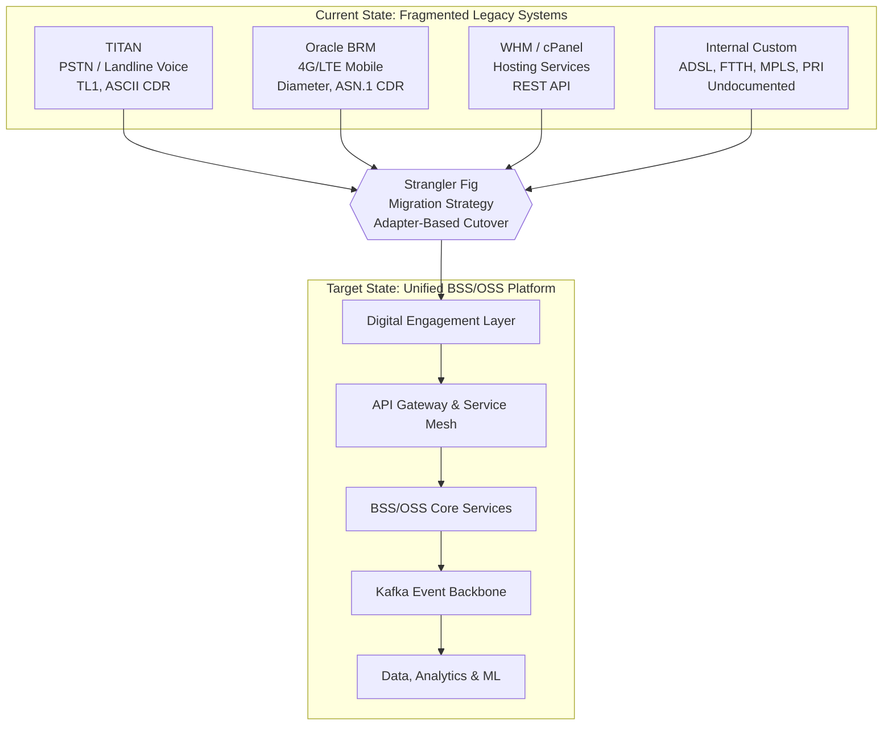

الهجرة تستخدم نمط "الكعكة القوية" مع تخصيص المجالات، وتعمل عبر لغة موجه مخصصة. لكل نظام مكتسب لديه تقرير مخصص يُوثق في `docs/adapters/` يحدد ترجمة البروتوكول، الرصد الصحي، التوقف الدائري (من خلال Resilience4j)، وإصدار الحوادث إلى الرأسية الكافا. ستة تقارير الموجه - تغطي TITAN، Oracle BRM، WHM، ADSL/FTTH داخلية، MPLS/PRI، وعناصر الشبكة - تتماشى مع نمط هيكلي معيّن: نظام مكتسب → لغة موجه → لغة ترجمة كانيونالية → مستخدمي BSS/OSS. `docs/adapters/adapter-registry.md` يوفر إدارة تجميع مركزة مع تسجيل الموجه، ومرور، الرصد الصحي، التوزيع التلقائي، وتوثيق الخدمة.

نظام ETL ثلاثي فاز بتنفيذ `migration/` يدعم نقل البيانات من النظم القديمة: استخراج البرمجيات لبرم أوراكل (الاستبيانات JDBC لحسابات، مجموعات، سلسلة، خطط أسعار) و TITAN (الاستبيانات JDBC + تحليل CDR ASCII) إلى `TmfDataTransformer` يُنظف تسجيلات القديمة إلى payloads متساويين مع TMF. `MigrationReconciler` يقوم بعد ذلك بتجديدها من خلال مقارنة البيانات القديمة مع TMF عبر عدد العميلين، مجموعات الحسابات، وخدمات النشاط.

#### إدماج مع سياق المؤسسة القائمة

النظام يدمج مع المنظومة الحالية للمؤسسة من قبل PTC من خلال مدمجات منخفضة مستوى البروتوكول لربط عناصر الشبكة الورقية والأنظمة التشغيلية:

| نقاط التكامل | بروتوكول(ون) | تصفيق |
| --- | --- | --- |
| الشبكة الورقية | TL1، SNMP | docs/adapters/titan-adapter.md |
| ه.ا.ر.ل/ه.س.س (الجهاز الاصطناعي) | خريطة، قطر S6a | docs/adapters/oracle-brm-adapter.md |
| DSLAM / OLT (شب بین‌المللی) | TR-069، OMCI | docs/adapters/network-elements-adapter.md |
| رouters ملزوم للاستعمال | NETCONF، SNMP | docs/adapters/mpls-pri-adapter.md |
| بنية تحتية | API (cPanel) | docs/adapters/whm-adapter.md |
| شبكة برودرد مبتدئ (ADSL/FTTH) | REST، RADIUS | docs/adapters/inhouse-adsl-ftth-adapter.md |

### 1.2.2 تفاصيل مستوى عال

#### قدرات النظام الأساسي

البرمجة التلفزيونية والراديوية في اليمن (Yemen PTC) تقدم مجموعة شاملة من عمليات الاتصالات تُنظَّم حول مجالات القدرات الرئيسية التالية:

- **إدارة العملاء والهوية**: إدارة السجلات الذهبية مع إزالة التكرارات التقريبية (Levenshtein + Metaphone)، ودمج/تقسيم سير العمل، وأدوار الأطراف الهرمية، وحق المحو المتوافق مع اللائحة العامة لحماية البيانات (GDPR)، وعرض شامل للعميل يجمع جميع علاقات الخدمة.


**إدارة المنتجات والتجارة**: كتالوج منتجات قائم على المواصفات يدعم شبكة الهاتف العامة (PSTN)، وشبكة الألياف الضوئية للمنازل (FTTH) (مستويات عرض النطاق الترددي لشبكة GPON)، وشبكة الجيل الرابع (4G) (بدلات البيانات/جودة الخدمة)، وشبكة MPLS (أنواع الطوبولوجيا)، والاستضافة (مواصفات الخوادم الافتراضية الخاصة VPS)؛ وتجميع قائم على القيود مع خصومات على الخدمات المشتركة.
**تنسيق الطلبات وتنفيذها**: دورة حياة طلب صارمة تعتمد على آلة الحالة مع نمط Temporal.io Saga لتعويض المعاملات في حالات فشل النطاقات المتعددة؛ وقفل موارد موزع عبر Redis Redlock لمنافذ الألياف الضوئية، ومجموعات عناوين IP، ومعرفات VLAN.
- **الفوترة والشحن الموحدان**: وساطة سجلات بيانات المكالمات في الوقت الفعلي (بصيغ متعددة: TITAN ASCII، Oracle ASN.1، IPDR CSV)، ومحرك تقييم قائم على لغة Go مع تسعير النطاق الزمني/المنطقة/مستوى جودة الخدمة، وبنية محفظة بنمط الحجز والالتزام والتراجع، وإنشاء فواتير موحدة.
- **مخزون الموارد والخدمات**: نمذجة طوبولوجيا الشبكة القائمة على الرسوم البيانية (Neo4j) لرسم خرائط مسار الألياف (OLT → PON → Splitter → ONT)؛ وتحليل تأثير الخدمة عبر اجتياز BFS؛ وتفعيل الموارد من خلال محولات TR-069 وOMCI وNETCONF.
- **الضمان والتشغيل**: ربط الإنذارات بالطوبولوجيا، ومراقبة اتفاقيات مستوى الخدمة، وإنشاء تذاكر الأعطال تلقائيًا من الإنذارات الحرجة، وجدولة القوى العاملة المُحسّنة بالذكاء الاصطناعي، والصيانة التنبؤية الصيانة والتشغيل.
- **ضمان الإيرادات وإدارة الاحتيال**: مطابقة بيانات الشبكة مع الفواتير، والكشف الفوري عن الاحتيال (مثل IRSF، وصناديق SIM، وأنماط Wangiri)، وتقييم مخاطر الائتمان، والكشف عن الحالات الشاذة في أنماط الاستخدام باستخدام التعلم الآلي.
- **التحليلات والذكاء الاصطناعي**: التنبؤ بانقطاع العملاء باستخدام التعلم الآلي (بدقة تزيد عن 85%)، والكشف عن الاحتيال (بدقة تزيد عن 95%)، وتخزين البيانات بنظام المستويات البرونزي والفضي والذهبي، وأكثر من 25 لوحة تحكم تشغيلية على منصة Grafana.

#### عناصر النظام الرئيسية

النظام مكون من ستة مكونات برمجية رئيسية، كل منها مصمم خصيصًا لمنطقة عمله:

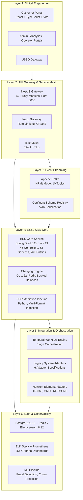

الجدول التالي يحدد كل عنصر رئيسي مع مجموعته التكنولوجية ومسؤوليته الرئيسية:

| جزء | تكنولوجيا | مسؤولية أساسية |
| --- | --- | --- |
| خدمات أساس BSS ( bss-core/ ) | جافا 21، سبرينج بوت 3.2.0، مي وين | 45 مراقبة استقبال وصول للمعلومات (REST) يطبق APIsTMF مفتوح، 52 خدمة تجارية، 76+ جسم JPA مع احتكاك بجميع اللغات (PostgreSQL، MongoDB، Neo4j، Elasticsearch، Redis) |
| مولد لحام ( charging-engine/ ) | Go 1.22، Confluent Kafka Go v2.3.0، Gin v1.9.1، go-redis v9.3.1 | نوعية عالية من تصنيف CDR في الوقت الفعلي وشحن مع سجل التوازن المدعوم من Redis؛ يدعم تخصيص تكلفة الصوت بوقت، ورسائل البريد الإلكتروني بأسعار ثابتة، وتصنيف البيانات بحجم ميجابايت |
| جهاز رمز ( api-gateway/ ) | نستياس، تيستياس، نودج 20 LTS | نطاق تطبيق TMF API يضم 57 موديل من الوحدات الابتكارية، ويرoutes إلى خدمات backend؛ ووردت الوثائق، وتحقق الطلب، وتحويل الردود |
| خط سلسلة التفاوض CDR ( cdrmspipeline/ ) | پایتون 3.x | نظام خطوط أنابيب متعددة مرحلات: مترجم → مخطط معياري → مضيف للاحتكاك → CDRPipelineProducer؛ استقبال متعدد الشيئول (صوت، رسائل إلكترونية، بيانات، روميع) مع التحقق من الصحة وسياسات إعادة المحاولة |
| الساحات الافتراضية ( frontend/ , deployment/ ) | ریکت، تایسیستیک، ویت، ریکت کیوی | بوابة خدمة ذاتية للعملاء ( yemen-ptc-portal )، بالإضافة إلى بوادر إدارية، وتحليلية، وتشغيلية موزعة عبر nginx |
| نظام الهجرة ( migration/ ) | جافا (الاستخراج/التحويل) | ثلاثة فاز ETL: أوراكل برم و تيتيان متصفحات إلى TmfDataTransformer إلى MigrationReconciler لتحقق البيانات |

#### نهج فني أساسي

النظام يتبع هيكلة microservice موجهة للدومين ومتاحة من خلال حدث، مع الخصائص التالية التي تحدد:

*   العديد اللغات: القدرة على التحمل: لغة البيانات تستخدم قواعد بيانات مصممة خصيصًا للاستخدام - PostgreSQL 15 (Citus شاردون من قبل customer\_id) لبيانات معالجة المعاملات، Redis 7 لتسديدات وتخزين الوقت الحقيقي، Elasticsearch 8.12.0 لبحث كامل النصوص، MongoDB لتخزين السجلات الموجهة للملف، و Neo4j لتوحيد الشبكة المنظمة. هذا يُثبت من خلال إعلانات الاعتماد في `bss-core/pom.xml` وتعريفات الهياكل الأساسية في `docker-compose.yml` .
*   الجهاز المركزي الموجه نحو الحدث: Apache Kafka (Confluent Platform 7.5.0، mode KRaft - بدون ZooKeeper) يُمثل الجهاز العصبي الرئيسي مع 10 موضوعات نصيحة محددة في `shared/kafka/topic-definitions.yml` : `party.events` , `catalog.events` , `order.events` , `service.events` , `resource.events` , `billing.events` , `usage.events` , `charging.events` , `alarm.events` , و `events.dlq` . موضوعات ذات قدرة عالية على التحويل ( `usage.events` , `charging.events` ) يتم تكوينها بـ 12 شريحة؛ موضوعات عادية تستخدم 6 شريحة. جميع المواضيع تستخدم عامل تكرار 3 مع احتجاز 7 أيام (30 يومًا لDLQ).
*   توفير سلامة الوصول إلى API: جميع المنابر الخارجية تمتثل لمواصفات API المفتوحة لمنتدى تكنولوجيا المعلومات (OpenAPI 3.0.3، تصميم RESTful، CloudEvents 4.0.1 للاجتماعات الموجهة). حسب آخر تقرير الوضع في `docs/TMF_API_IMPLEMENTATION_STATUS.md` (تم تحديثه في 2026-03-30)، 12 API من TMF مُنفَّذة بشكل كامل، 3 مُنفَّذة جزئيًا، وباقي APIs مُنفَّذة بحسب خطة الانتهاء.
*   طريقة التكيف: توقف الدائرة، إعادة المحاولة، وعزل الغطاء من خلال Resilience4j 2.2.0؛ قياس السرعة عبر Bucket4j 8.1.0؛ تنظيم عمليات العمل الموزعة عبر Temporal SDK 1.22.3 مع معاملات تعويضية مبنية على ساجا.
*   العدالة الصفرية: تشفير TLS 1.3 في كل مكان، شبكة خدمات Istio مع mTLS صارمة، التحقق من Keycloak (OAuth2/OIDC) مع مدة استنفاد JWT 15 دقيقة، تشفير FIDO2/WebAuthn MFA لعمليات حرية، أجهزة جانبية OPA للاستخدامات المحدودة، وشفاء على مستوى المكان عبر Jasypt 3.0.5 مع تطبيق HashiCorp Vault لإدارة الأمان.
*   تعميم Gitops: تعميم مستمر بنظام ArgoCD مع سياسات التسويق، التعافي الذاتي، وتفكيك. هياكل كوكب هواي تشمل 3 أسطول وأربع أسطول يعملون، مع مشاريع كوكب هواي كودية موزعة في `infrastructure/` (ArgoCD، Chaos Engineering، Grafana، Istio، Kafka، Kong، ملصقات كوكب هواي).

### 1.2.3 معايير النجاح

#### أهداف قابلة للقياس

النظام يحدد معايير النجاح الكمية التي تشمل توافر، وفعالية، وتخفيض التكلفة، وامتثال للمعايير:

| هدف | هدف | وضع المكان |
| --- | --- | --- |
| التوافر في المسار الحراري (الشحن/الصرف) | 99.999% (خمسة نين) | توفير البنية التحتية؛ تخطيط تدريبات المخيم |
| توفير خدمات إدارة شحنات/الطلب | 99.99% | مجهزات مجهز |
| تأخر الشحن في الوقت الحقيقي (p99) | < 50 ms | مصداق: 78.4ms ± 12.3ms، P95 92.1ms عند 50M أحداث محاكاة |
| انتظار عمليات CRM (p95) | < 200 ms | المستهدف محدد |
| قدّر حجم حجم الوثائق | \> 1,200 حدوثات/ثانية مستمرة | مصدّق: 1,240 حدوثات/ثانية مُستمرّة، 2,100 قوّة |
| نسبة تخصيص تلقائي بدون احتكاك | ≥ 95% | هدف محدد؛ تحقق مرحلة 3 معلق |
| تاثير التعرف على الاحتيال | 95% | توضيحات حول تطبيق نموذج ML في مرحلة 2 |
| نوعية التنبؤ بالانقطاع | 85% | توضيحات حول تطبيق نموذج ML في مرحلة 2 |
| تغطية API منطق TM Forum (بدء العمل) | 24/24 | 12 مكتملة، 3 مختلطة، 12 في مرحلة التطوير |
| تغطية API منحة TM (رؤية كاملة) | 40+ واجهات برمجة تطبيقات | تنفيذ مرحلة بمرحلة من خلال خطة الانتهاء |
| هدف نقطة استعادة (RPO) | < 15 دقائق | النسخة المتسقة لقطاع التيار |
| هدف وقت استئصال (RTO) | < 30 دقائق | الإعادة التأهيل الآلي؛ تطبيق تطبيقات تطبيقات |

هذه المعايير مأخوذة من `IMPLEMENTATION_SUMMARY.md` و `IMPLEMENTATION_COMPLETION_PLAN.md` , مع اجراء تحقق من الأداء ضد 50 مليون حادثة محاكاة و 10,000 حادثة تحقق من الإيرادات.

#### عوامل النجاح الحاسمة

قبل الإعلان عن استعداد المنصة للاستعمال، يجب أن تمتثل للشروط التالية:

1.  الجاهزية لاستخدامات المستقبل: جميع سجلات المشتركين 50 مليون + تم نقلها بنجاح من TITAN و Oracle BRM بـ < 0.1% معدل تكرار وصافية صفر خسارة في الإيرادات أثناء التحقق المنسق.
2.  اعتماد تجديد موثوقية: جميع APIs المُنفَّذة تُمْكِن من تقييم الذات بمُعدّة تجديد موثوقية منتدى تجديد موثوقية (CTK) في درجة 3+ أو أعلى.
3.  قاعدة أمنية: لا توجد أوجه ضعف خطيرة (السنج/تريفي سكيننگ)؛ امتثال لمستوى 1 من شرط التحقق من الامتثال لسياسة الطرف الثالث (PCI-DSS) لتخزين بيانات الدفع؛ سجلات مراجعة الحسابات غير قابل للتغيير.
4.  الضمان التحقق: ضمان التتبع المتنافر > 95٪؛ معايير الأعمال معرضة عبر 25+ لوحة مراقبة جرافانا؛ جميع الإنذارات موثقة بروتينات تشغيلية.
5.  تثبيت القدرة على التكيف: استعادة إصابة المحطة < 30 ثانية؛ استعادة إصابة قاعدة البيانات < 10 ثانية؛ استعادة أزمة بين مواقع تثبتهما مصداقية البيانات.

#### مؤشرات الأداء الرئيسية

| فئة KPI | متر | هدف |
| --- | --- | --- |
| توافر | زمان استعمال التيار/الصرف | 99.999% (< 5 دقیقه/سال بدون برنامه) |
| توافر | وظائف OSS | 99.9% (خانات صيانة مقرّرة) |
| أداء | نسبة نجاح تحليل CDR | 100% (مصدّق) |
| أداء | نسبة النجاح في تطبيق CDR | 100% (مصدّق) |
| أداء | ضمان توصيل كافا | 100% متسامح (مُستند) |
| تکامل | معدل تزويد القدرات بدون احتكاك | ≥ 95% |
| الاتصالات | تاثير التعرف على الاحتيال | 95% |
| الاتصالات | نوعية التنبؤ بالانقطاع | 85% |
| مهاجرة | تثبيت الإيرادات | 100٪ (10,000 حادثة معتمدة، جميعها غير صفر) |
| امتثال | تخزين CDR | 7 سنوات (تخزين مفتوح) |

## 1.3 نطاق

### 1.3.1 في نطاق

#### خاصيات ووظائف أساسيّة

القدرات التالية تمثل نطاق المهام المطلوبة للاصدار الإنتاجي لليونيفيل:

**قدرات نطاق BSS**

| قدّر | APIs من TMF | حالة التنفيذ |
| --- | --- | --- |
| إدارة قائمة المنتجات | TMF620 | ✅ مُكتمل |
| إدارة حجز المنتج | TMF622 | ✅ مُكتمل |
| تنظيم الحفلات (المشتري) | TMF632 | ✅ مُكتمل |
| إدارة دور في الحفل | TMF669 | ✅ مُكتمل |
| ادارة حسابات فواتير | TMF647 | ✅ مكتمل |
| إدارة بيل | TMF657 | ✅ مُكتمل |
| إدارة الميزانية | TMF650 | ⚠️ جزئي |
| إدارة الدفع | TMF671 | ⚠️ جزئي |
| إدارة النصوص | TMF648 | 🔹 المرحلة 1 |
| ادارة العملاء | TMF629 | 🔹 مرحلة 1 |

**قدرات نطاق مملوكة من قبل المجتمع**

| قدّرت | APIs من TMF | وضع التنفيذ |
| --- | --- | --- |
| إدارة مخزن الموارد | TMF638 | ✅ مكتمل |
| إدارة مخزون الخدمات | TMF639 | ✅ مُكتمل |
| إدارة طلب الخدمات | TMF641 | ✅ مُكتمل |
| ترتيب الموارد | TMF640 | 🔹 المرحلة 1 |
| إدارة تذكرة مشكلات | TMF645 | ✅ مكتمل |
| إدارة الإنذار | TMF642 | ⚠️ جزئي |
| إدارة العنوان الجغرافي | TMF653 | ✅ مُكتمل |
| إدارة الموقع الجغرافي | TMF656 | ✅ مكتمل |

**إمكانيات متعددة المجالات**

- **محرك التسعير الموحد**: محرك وسيطة وتسعير فوري لسجلات المكالمات (Go 1.22) يدعم استيعاب صيغ متعددة (TITAN ASCII، Oracle BRM ASN.1، IPDR CSV) مع تسعير صوتي قائم على النطاق الزمني، ورسائل نصية قصيرة بسعر ثابت، وتسعير بيانات قائم على الميغابايت، كما هو مُطبق في `charging-engine/internal/`

- **خط أنابيب وسيطة سجلات المكالمات**: خط أنابيب متكامل قائم على لغة بايثون (`cdrmspipeline/`) بمراحل مُنسقة: التحليل، وتوحيد المخطط، وإثراء السياق، وإنتاج Kafka مع ضمانات عدم التكرار

- **تنسيق الطلبات القائم على Saga**: سير عمل Temporal.io يُطبق نمط Saga لتعويض المعاملات عبر طلبات متعددة المجالات (مثل باقات "الخط الأرضي + FTTH + 4G + الاستضافة")، مع التراجع التلقائي في حالة التنفيذ الجزئي حالات الفشل

- **الذكاء الاصطناعي/التعلم الآلي**: نماذج تعلم آلي لكشف الاحتيال والتنبؤ بانقطاع العملاء، مع مستودع بيانات يتبع نمط بنية الميدالية البرونزية/الفضية/الذهبية.

- **محولات النظام القديم**: ستة مواصفات للمحولات (TITAN، Oracle BRM، WHM، ADSL/FTTH داخلي، MPLS/PRI، وعناصر الشبكة) تُمكّن من التعايش والتحويل التدريجي.

- **عملية استخراج البيانات وتحويلها وتحميلها (ETL) لترحيل البيانات**: مستخلصات Oracle BRM وTITAN، ومحول بيانات TMF، ومُطابقة الترحيل لترحيل بيانات المشتركين والتحقق منها.

**سير عمل المستخدم الأساسي**

تدعم المنصة سير عمل المستخدم المتكامل التالي:

1. **الطلب الموحد للتفعيل**: يُرسل العميل طلبًا لحزمة خدمات متعددة ← التحقق من الطرف ← التحقق من الرصيد ← حجز الموارد بالتوازي (رقم الهاتف الأرضي، منفذ/شبكة VLAN للألياف الضوئية، رقم تعريف المشترك الدولي للجيل الرابع، حساب الاستضافة) ← التفعيل (TR-069، OMCI، HSS) ← تفعيل الفوترة.

2. **الفوترة المدفوعة مسبقًا في الوقت الفعلي**: حدث استخدام بيانات الجيل الرابع ← واجهة P-GW Gy ← وسيطة سجلات المكالمات ← التقييم (النطاق الزمني، المنطقة، جودة الخدمة) ← التحقق من رصيد Redis (أقل من 5 مللي ثانية) ← حجز وتأكيد الخصم ← نشر حدث Kafka.

3. **تحليل تأثير انقطاع الألياف**: إنذار انقطاع كابل الألياف ← معالجة إنذار TMF642 ← استعلام Neo4j البياني (الكابل ← الألياف ← الخدمات) ← اجتياز BFS للعميل المتأثر ← إنشاء تذاكر أعطال تلقائيًا ← إشعار SMS ← إرسال فريق العمل.


4. **عرض خدمة العميل بزاوية 360 درجة**: لوحة تحكم موحدة تجمع جميع الخدمات النشطة، وسجل الفواتير، وتذاكر الأعطال، وسجلات الدفع، والجدول الزمني للتفاعل عبر جميع مجالات الخدمة.
#### حدود التنفيذ
**حدود النظام**

- **نموذج النشر**: نشر كامل محليًا، مع إمكانية العمل في بيئة معزولة عن الشبكة؛ مجموعة Kubernetes تتكون من 3 عقد رئيسية و6 عقد عاملة؛ مصمم لبنية موزعة نشطة-نشطة بثلاثة مواقع كما هو موضح في سياق المستخدم.

- **البنية التحتية**: استضافة ذاتية لـ Kubernetes (البنية التحتية مُعرّفة في `infrastructure/kubernetes/`)، ومجموعة Kafka مُدارة بواسطة Strimzi (`infrastructure/kafka/`)، وArgoCD GitOps (`infrastructure/argocd/`)، وشبكة خدمات Istio (`infrastructure/istio/`)، وبوابة Kong API (`infrastructure/kong/`).

- **سجل الحاويات**: Harbor لإدارة صور الحاويات المعزولة عن الشبكة مع فحص الثغرات الأمنية Trivy.

**مجموعات المستخدمين المشمولة**

جميع مجموعات أصحاب المصلحة الثمانية المحددة في القسم 1.1.3 مشمولة ضمن النطاق: المشتركون السكنيون، وعملاء المؤسسات، ووكلاء خدمة العملاء، والفنيون الميدانيون، ومهندسو الشبكات، وفرق الفوترة/المالية، والعمليات/DevOps، والإدارة التنفيذية. لكل مجموعة واجهات بوابة مخصصة (للعملاء، والإدارة، والتحليلات، والمشغلين) كما هو موضح في `deployment/` و`frontend/`.

**التغطية الجغرافية**

تغطي المنصة جميع محافظات اليمن التسع عشرة: صنعاء، عدن، تعز، الحديدة، إب، ذمار، الحديدة، حجة، عمران، صعدة، مأرب، الجوف، البيضاء، لحج، أبين، شبوة، حضرموت، المهرة، وسقطرى، كما هو موضح في `docs/PROJECT_DOCUMENTATION.md`.

**أنواع الخدمات المشمولة**

| فئة الخدمة | خدمات محددة | الحالة |
|---|---|---|
| **الخطوط الثابتة** | PSTN (POTS/ISDN)، VoIP، DSL | ✅ مدعوم بالكامل |
| **الهواتف المحمولة** | 2G، 3G، 4G/LTE، 5G (مخطط له) | ✅ مدعوم (5G مخطط له) |
**إنترنت النطاق العريض** | FTTH (GPON/XGS-PON)، ADSL، LTE، WiMAX | ✅ مدعوم بالكامل |
**الشركات** | MPLS، VPN، خط مؤجر، PRI، DIA ​​| ✅ مدعوم بالكامل |
**الاستضافة** | VPS، الاستضافة المشتركة، النطاقات | ✅ مدعوم بالكامل |
**الأقمار الصناعية** | VSAT، إنترنت الأشياء عبر الأقمار الصناعية | ⚠️ مدعوم جزئيًا |

**مجالات البيانات المشمولة**

- بيانات العملاء والهوية (الطرف، الحساب، جهة الاتصال)
- كتالوج المنتجات، والمواصفات، والعروض
- دورة حياة الطلب (المنتج، الخدمة، المورد)
- حسابات الفوترة، والفواتير، والمدفوعات، والتسويات
- سجلات بيانات المكالمات بجميع أنواعها (الصوت، الرسائل النصية القصيرة، البيانات، التجوال)
- جرد الموارد (عناصر الشبكة المادية والمنطقية)
- جرد الخدمات (بنية الخدمة النشطة)
- تذاكر الأعطال، والإنذارات، ومؤشرات الأداء
- سجلات التدقيق والامتثال التنظيمي (الاحتفاظ بها لمدة 7 سنوات)

### 1.3.2 خارج نطاق

#### خاصيات وخصائص غير متوفرة

الخاصيات التالية تم إخضاعها بشكل صريح من نطاق الإصدار الحالي وتم تعيينها لفترات مستقبلية أو خطوط عمل منفصلة:
| عنصر مستبعد | المبرر | المرجع |
|---|---|---|
| **تقسيم شبكة الجيل الخامس** (TMF912/913) | مُخطط له في المرحلة 7 من خطة الإنجاز؛ لا يوجد تطبيق حالي لقاعدة التعليمات البرمجية | سياق المستخدم: إمكانيات متقدمة للمرحلة 7 |
| **منصة إنترنت الأشياء** (TMF685) | إدارة أجهزة LwM2M وشحن إنترنت الأشياء على نطاق واسع مُخطط لهما في المرحلة 7 | سياق المستخدم: إمكانيات متقدمة للمرحلة 7 |
| **الاعتراض القانوني** (TMF691) | الامتثال لمعيار ETSI TS 101 331 مع سير عمل أوامر التفتيش مُخطط له في المرحلة 7 | سياق المستخدم: تنظيمي للمرحلة 7 |
| **قابلية نقل الأرقام** | تكامل NPDB وتنسيق نقل الأرقام من وإلى الشبكة غير مُطبق حاليًا | سياق المستخدم: تنظيمي للمرحلة 7 |
| **التجوال/الربط البيني** (TMF696/705) | تأجيل معالجة وتوجيه تحسين التجوال لبروتوكول TAP3/CIBER | سياق المستخدم: إمكانيات متقدمة للمرحلة 7 |
**قناة الرد الصوتي التفاعلي** | دمج الرد الصوتي التفاعلي مُخطط له في المرحلة 4 (الأسبوعان 5-6) | `IMPLEMENTATION_COMPLETION_PLAN.md` |
**خدمات الأقمار الصناعية** (كاملة) | دعم جزئي فقط لتقنية VSAT وإنترنت الأشياء عبر الأقمار الصناعية | `docs/PROJECT_DOCUMENTATION.md` |
#### اعتبارات المرحلة المستقبلية

الوثائق `IMPLEMENTATION_COMPLETION_PLAN.md` تُعدّ خطى تخطيطية لانتهاء 8–9 أسابيع، مُنظّمة إلى مراحلٍ كالتالي:

| مرحلة | جدول زمني | منطقة التركيز |
| --- | --- | --- |
| مرحلة 1 | أسابيع 1-2 | إتمام API حاسوبي: TMF629, TMF640, TMF648 |
| مرحلة 2 | سنت 3-4 | توضيح وثائق التصميم والتحقق من النموذج (الاحتيال، التخلص) |
| مرحلة 3 | أسابيع 3-4 | تثبيت تطبيق التحكم الذكي بدون احتكاك (≥95% الهدف) |
| مرحلة 4 | أسبوع 5-6 | تحسين الاتصال عبر جميع الوسائل (تكامل قناة IVR) |
| مرحلة 5 | الأيام 7-8 | بقيّت APIs TMF وتحسينات الأداء |
| أخير | ساعة 9 | تأخيرات إعداد لبدء التشغيل، تجربة تخفيف |

بعد البدء في العمل، يحدد سياق المستخدم خطى العمل المُستكملة (المرحلة 7-8 من الاستراتيجية العامة للهجرة، الأسابيع 44-64) التي تشمل:

*   قدرات تنظيمية متقدمة: التسلل القانوني (TS 101 331 من ETSI)، قابلية تحويل الرقم (NPDB)، قاعدة بيانات E911/112، إدماج AML.
*   5G و exposure الشبكة: إدارة دورة حياة قطع الشبكة (eMBB/uRLLC/mMTC)، NEF لQoD من طرف ثالث و APIs للعمر والمكان.
*   الاتصالات المتنقلة والثقوب الرقمية: إدارة أجهزة LwM2M، شحن أجهزة IoT الضخمة، تطوير ثقوب رقمية.
*   مراقبة الاستدامة: رصد الطاقة (الطاقة الكهربائية من المدرجات عبر SNMP)، تأثير الكربون لكل خدمة، تتبع النفايات الإلكترونية (TMF921).
*   الاتصالات والوصول: تجهيز TAP3/CIBER، تقاسم الإيرادات من البيع العلوي، توجيه تحسينات الوصول.

#### نقاط التكامل غير مُستَوِّف

الإدماجات التالية مُشارَكة في سياق المستخدم ولكنها لا تمتثل لتنفيذها في الملف الحالي:

*   Apache Flink 1.18 لمعالجة الحوادث المعقدة (CEP) للكشف عن الاحتيال - الكشف عن الاحتيال الحالي يعتمد على نماذج AI داخل البنياد الأساسية.
*   Apache Cassandra 4.1 لتخزين متتابعات الوقت CDR - تطبيقه الحالي يستخدم PostgreSQL (Citus) مع Elasticsearch.
*   TimescaleDB 2.13 لقياسات الأداء لغلافات عبارة عن مصفوفات - مقياسات الوقت الحالي يستخدم Prometheus مع Grafana.
*   العمودي المجاني لواجهات 4G Gy/Gz/S6a native — التكامل الحالي يتم عبر مضيف عبر مضيف Oracle BRM.
*   PostGIS لفحص الخصائص الجغرافية - الإدارة الجغرافية يتم تطبيقها من خلال APIs REST TMF653/TMF656.
*   GenieACS لادارة TR-069 CPE - مأخوذ من سياق المستخدم ولكن لا يوجد في ملخصات التعميم الحالي.
*   ذاتة مهاجمة تغييرات الحسابات — لا يوجد سوى مهاجمة البرمجيات Oracle BRM و TITAN في `migration/extractors/` ؛ لا يتم تطبيق أداة مهاجمة البيانات WHM.

هذه العناصر تمثل الفجوة بين الوضع المستهدف المنشود الذي وصف في سياق المستخدم وقاعدة التنفيذ الحالية. من المتوقع أن يتم معالجتها عبر مراحل التطوير التالية مع تقدم المنصة نحو أهدافها الكاملة لرؤية 2030.

## 1.4 مراجع

#### ملفات المصدر مُستعرضة

*   `README.md` — موجز المشروع، موجز تغطية API للمؤسسة، مجموعات التكنولوجيا، وطريقة ترتيب المشروع
*   `IMPLEMENTATION_SUMMARY.md` — نتائج التنفيذ، نتائج معايير الأداء، أدلة التحقق، وتقييم استعداد التوزيع
*   `IMPLEMENTATION_COMPLETION_PLAN.md` — مراحل الانتهاء المتبقية، هيكل الفريق، الجدول الزمني، معايير بدء العمل، وتكليف الموارد
*   `bss-core/pom.xml` — إكمال ملخص التأثيرات Maven مع الأنظمة الدقيقة (Java 21، Spring Boot 3.2.0، و 30+ أنظمة تأثيرات)
*   `charging-engine/go.mod` — مخطط موديل Go (Go 1.22، Confluent Kafka Go v2.3.0، Gin v1.9.1، go-redis v9.3.1، zerolog v1.31.0)
*   `api-gateway/package.json` — dependencies لجهاز NestJS (@nestjs/common, @nestjs/axios, @nestjs/swagger, axios, class-validator, rxjs)
*   `frontend/package.json` — تأثيرات بوابة React (react, react-dom, react-router-dom, axios, @tanstack/react-query, Vite)
*   `docker-compose.yml` — مجموعات البنية التحتية للتطوير المحلي (PostgreSQL 15، Redis 7، Confluent Platform 7.5.0، Elasticsearch 8.12.0، Kibana 8.12.0)
*   `docs/PROJECT_DOCUMENTATION.md` — نظام كامل (7 طبقات)، مواصفات API، خطط تشغيلية، نموذج أمني، تفاصيل البنية التحتية، وتشمل جغرافية
*   `docs/TECHNICAL_DOCUMENTATION.md` — مخططات لاستخراج المخزون (45)، خدمات تجارية (52)، مخططات لصناعة الكيانات (76+)، وطريقة تشغيل النظام
*   `docs/TMF_API_IMPLEMENTATION_STATUS.md` — تقرير حالة API TMF مكتمل (12 مكتمل، 3 جزئي، 12 معلق؛ آخر تحديث 2026-03-30)
*   `docs/GO_LIVE_READINESS_CHECKLIST.md` — قائمة بحاجة البنية التحتية، التطبيقات، والأمن مع معايير التحقق
*   `shared/kafka/topic-definitions.yml` — تعاريف موضوع كافاكو (10 موضوعات، تقسيم، تكرار، سياسات احتفاظ، 4 مجموعة مستخدم)

#### مخزن المصادر مُستَعرض

*   `bss-core/` — هيكل مكونات مركزي BSS للمي و Spring Boot
*   `charging-engine/` — Go تيار (دوكفريل، go.mod، cmd/، internal/balance، internal/cdr، internal/rating)
*   `api-gateway/` — NestJS API gateway (دکفورفیل، package.json، src/، dist/)
*   `frontend/` — مفتاح سلسلة عرض React (package.json, vite.config.ts, src/)
*   `cdrmspipeline/` — خطوط توزيع CDR (التنظيم، التحويل، التكبير، متصدر كافا) لـ Python
*   `migration/` — subsystem migration ETL (استخراجات/، ترجمات/، تأمين/...)
*   `docs/` مركز التوثيق (حالة TMF، قائمة التحقق من بدء التشغيل، وثائق المشروع، الوثائق التقنية، المحولات/، مواصفات واجهة برمجة التطبيقات/، البنية/، نماذج البيانات/، الخطط/، كتيبات التشغيل/)
*   `docs/adapters/` — ستة مواصفات لمحول نظام مكتسب وملحقات محفوظة
*   `infrastructure/` — بنية تحتية ككود (argocd/, chaos/, grafana/, istio/, kafka/, kong/, كubernetes/)
*   `deployment/` — تطبيقات مخزون، ملفات Compose، ملخصات Kubernetes، رصد، سيركت، تطبيقات frontend
*   `shared/kafka/` — تعريفات موضوع كافا وفريق مستخدم مشترك

#### مراجع خارجية

*   تعليمات اختبار وتحقق الامتثال لـ Open API للمؤتمر TM — https://www.tmforum.org/wp-content/uploads/2026/02/TM-Forum-Open-API-conformance-testing.pdf
*   برنامج Open API لمنتدى TM — https://www.tmforum.org/oda/open-apis/
*   شركة الاتصالات العامة اليمنية (PTC) - http://ptc.gov.ye/en/about\_us/Definition\_and\_Establishment.aspx

# 2\. متطلبات المنتج

## 2.1 قائمة الميزات

في هذا القسم، يتم تصنيف جميع خصائص المنتج المحددة والقابلة للتجربة من بيئة PTC BSS/OSS في اليمن، وفقًا لقطاع التشغيل. لكل خصوصية يتم تحديد موقعها في API مناسبة للمؤتمر، ودليل الكودي، ووضع التنفيذ الحالي. قائمة الخصائص تُستند على معايير OpenAPI في `docs/api/` ، وصور الكيان في `bss-core/` ، وتنفيذ المراقب، وسجل وضع التنفيذ في `docs/TMF_API_IMPLEMENTATION_STATUS.md` .

### 2.1.1 إدارة العملاء والشهادات

هذا المجال يدير دورة حياة جميع الكيانات التي تتعامل مع العملاء - الأطراف، و profiles للعملاء، ووظائف، وعرض 360° موحد - وينقذ من سجلات العملاء المجزأة التي كانت موجودة في TITAN، و Oracle BRM، و WHM، ونظم خاصية داخلية.

#### خاصية F-001: إدارة الحفلات (TMF632)

| خصائص | قيمة |
| --- | --- |
| رقم ميزة | F-001 |
| اسم الميزة | إدارة الحفلات |
| تصنيف | عملاء وشخصية |
| أولوية | خطيرة |

| خصائص | قيمت |
| --- | --- |
| وضع | مُستحقة |
| توفيلو | TMF632 v5 |
| مخططات API | customer-management-api.yaml |
| الشيء الرئيسي | Party.java → party جدول |

تقرير موجز: يوفر سجلًا رئيسيًا فضيّلًا لجميع الأفراد والمنظمات التي تتفاعل مع PTC. الكيان `Party.java` يدعم أنواع `INDIVIDUAL` و `ORGANIZATION` مع ميادين بما في ذلك partyId, firstName, lastName, companyName, tradingName, birthDate, gender, nationality, status, preferredLanguage, preferredContactMethod, marketingConsent, and dataProcessingConsent. يُعرض API في `/tmf-api/partyManagement/v5/party` .

قيمة تجارية: تُحذف تسجيلات مشترية مزدوجة عبر أربعة أنظمة سابقة من خلال تجميع جميع البيانات الخاصة بالطرف الواحد في تسجيل واحد. تتيح التحذير من التكرار باستخدام البحوث ليفنشتيين ونظام ميتافون، وعملية التجميع/التخليق، وحق حرمان البيانات بموجب المادة 17 من قانون البيانات، مع حذف التخليق عبر جميع المجالات.

فوائد المستخدم: يحصل مساعدي خدمة العملاء على سجل مشترك وموحد للعملاء. يحصل المشتركين على هوية متسقة عبر جميع مجالات الخدمة، مما يمنعني من تسجيل نفسه مرارًا وتكرارًا.

المنطقة الفنية: يدعمه PostgreSQL (تم شرائه بواسطة customer\_id) مع عمليات البحث المصنف على national\_id، phone، email، governorate، status، و type كما هو محدد في `docs/data-models/database-schema.sql` . ينشر الحوادث الديموغرافية إلى topic Kafka `party.events` (6 شفرات، احتفاظ لمدة 7 أيام) التي يستهلكها `party-mgmt-group` .

**الاعتماد:**

| نوع الاعتماد | تفاصيل |
| --- | --- |
| الاعتماد على النظام | PostgreSQL (Citus)، كافا |
| الاعتماد الخارجي | لا |
| متطلبات التكامل | كافا party.events موضوع |

* * *

#### خاصية F-002: إدارة العملاء (TMF629)

| خصائص | قيمة |
| --- | --- |
| رقم ميزة | F-002 |
| اسم الميزة | ادارة العملاء |
| تصنيف | مشتري و هويه |
| أولوية | خطير |

| خصائص | قيمة |
| --- | --- |
| وضع | مقترح (مرحلة 1، أسابيع 1-2) |
| توفيلو | TMF629 |
| مقررات API | customer-management-tmf629-api.yaml |
| مجرد | Customer.java → customers جدول |

موجز: يُمكِّن إدارة الحزب من إدارة العملاء المخصصين لشبكة الهاتف، بما في ذلك التصنيف، التحقق من بيانات الحساب، تحليل الائتمان، وتقدير خطر الانقطاع. يُمكِّن `Customer.java` من التصنيف إلى `customers` من الجداول مع أنواع RESIDENTIAL، BUSINESS، ENTERPRISE، and GOVERNMENT؛ وحالات ACTIVE، INACTIVE، SUSPENDED، and TERMINATED؛ ومستويات KYC BASIC، FULL، and PREMIUM. يتضمن المجالات churnRiskScore، lifetimeValue، creditScore، creditLimit، and segments (تخزين كElementCollection).

قيمة الأعمال: تسمح بتصنيف العملاء (حسب القيمة، والسلوك، والجنس، وطويلة العمر، ومخاطر التخلص)، وإدارة الهيكلة الحسابية، ومتابعة ملفات الائتمان، وإدارة موافقة التسويق - قدرات لا توجد في أي نظام قديم.

من فوائد المستخدم: تحسين رؤية المخاطر الائتمانية لفريق المدفوعات والمال. يمكن لفريق التسويق تنفيذ حملات محددة من خلال التصنيف. يحصل المستخدمون على خدمة مخصصة.

المنطقة الفنية: يحدد schema `docs/data-models/database-schema.sql` في قاعدة البيانات `customers` جدول مع مكونات: id, external\_id, customer\_type, status, national\_id, passport\_number, first\_name, last\_name, primary\_phone, email, city, governorate, country, kyc\_level, kyc\_verified, segment, churn\_risk\_score, and lifetime\_value. جدول `customer_interactions` مرتبط يسجل أنواع التفاعل (SERVICE\_REQUEST, COMPLAINT, INQUIRY, TRANSACTION) عبر القنوات (PHONE, EMAIL, WEB, MOBILE\_APP, WALK\_IN, SOCIAL).

**الاعتماد:**

| نوع الاعتماد | تفاصيل |
| --- | --- |
| خاصية مسبقية | F-001 (إدارة الحزب) |
| الاعتماد على النظام | PostgreSQL (Citus), كافا |
| المتطلبات التكميلية | تحديث (F-030) |

* * *

#### خاصية F-003: إدارة دور الحفل (TMF669)

| خصائص | قيمت |
| --- | --- |
| رقم ميزة | F-003 |
| اسم الخصوصية | إدارة دور في الحفل |
| تصنيف | مشتري و هويه |
| أولوية | وسطي |

| خصائص | قيمة |
| --- | --- |
| وضع | مُستحقة |
| تت مي فلورانس | TMF669 v4 |
| مقررات API | party-role-api.yaml |
| مبدا | /partyRole/v4/partyRole |

موجز: يدار التعيين وجدوت حياة الوظائف لصالح الأطراف. تشمل الوظائف المدعومة عميل، مدير، فرد بيع، مهندس، مدير، دعم، فاتورة، ومهندس. يدعم نقاط الوصول قائمة بعمليات إنشاء وحصول على الوظائف لصالح الوظائف، بالإضافة إلى قائمة عمليات الفئات الوظيفية.

قيمة الأعمال: تسمح بالتمثيل الهيكلي (المشتري < مدير الحساب < مدير المنظمة) ونمط التحكم في الوصول على أساس الدور متماثل مع إنفاذ سياسة OPA. تدعم نموذج التأمين المتعدد أصحاب المصلحة المبين في الهيكل الأمني.

فوائد المستخدم: يمكن للمستخدمين من العملاء في المؤسسة تفويض إدارة الحسابات. يعمل الأفراد داخل الشركة بدوافع من تخصيص الدورات من حيث أدنى الخصوصية.

المنطقة الفنية: مسار API `/partyRole/v4/partyRole` مع إدارة فئة الدور. يُدمج مع الجانب الطرف OPA لتنفيذ الضوابط الوصول القائمة على الخصائص.

**الاعتماد:**

| نوع الاعتماد | تفاصيل |
| --- | --- |
| خاصية مسبقية | F-001 (إدارة الحزب) |
| الاعتماد على النظام | PostgreSQL، OPA |
| المتطلبات التكميلية | مقدّم هويّة كيوكالور |

* * *

#### خاصية F-004: رؤية العملاء 360 درجة

| خصائص | قيمت |
| --- | --- |
| رقم ميزة | F-004 |
| اسم الميزة | رؤية 360 للعملاء |
| تصنيف | عملاء وشخصية |
| أولوية | عالية |

| خصائص | قيمة |
| --- | --- |
| وضع | مُختُف |
| توفيلو | TMF629 (جمعية) |
| الشيء الرئيسي | Customer360.java |
| مبدا | خانه نمایش پورتال مشتری |

موجز: الكيان `Customer360.java` هو مجموعة مثمرة تقدم نظرة موحدة عن العلاقة الكاملة لكل عميل مع PTC. يحتفظ بالروابط من واحد إلى واحد مع `CustomerProfile` ، `ContactInformation` ، `Address` ، `UsageStatistics` ، `BillingSummary` ، `CustomerPreferences` ، `CustomerDashboard` ، `ChurnRiskAssessment` ، `CreditProfile` . كما يحتفظ أيضًا `segmentDetails` ، فئات، سلسلة حسابات، وعلاقات العملاء كمجموعة عناصر.

قيمة الأعمال: يحل مشكلة العملة التجارية الأساسية من خلال تجزئة وجهات نظر العملاء عبر TITAN، Oracle BRM، WHM، ونظم داخلية. يوفر النوافذ الواحدة التي يطلبها مساعدو ومسؤولي خدمة العملاء.

منافع المستخدم: سائقو خدمة العملاء يمكنهم الوصول إلى تاريخ الخدمات الكامل، ووضع المدفوعات، ومخاطر الانقطاع في وضوح، ومستخدمي الخدمة يمكنهم مشاهدة جميع خدماتهم، وصفقاتهم، ورسومهم في قاعدة بيانات واحدة.

الاتصالات: تجمع البيانات من `BillingSummary.java` (currentBalance, overdueAmount, lastPaymentAmount, averageMonthlyBill, paymentHistory)، بيانات الاشتراك، وسجل التفاعل. يتم إظهارها من خلال قسم داشبورد البوابة عبر `CustomerPortalController.java` .

**الاعتماد:**

| نوع الاعتماد | تفاصيل |
| --- | --- |
| خاصية مسبقية | F-001، F-002، F-025، F-016 |
| الاعتماد على النظام | PostgreSQL، Elasticsearch |
| متطلبات التكامل | جميع مجالات الخدمة تساهم في البيانات |

* * *

### 2.1.2 مجال الإدارة المنتجية والتجارية

يقوم هذا المجال بتنظيم قائمة المنتجات المحددة، وقائمة الخدمات والموارد، وقواعد التكلفة، وتكوينات التكلفة التي تتيح تجميع المنتجات المتداخلة عبر جميع أنواع خدمات PTC.

#### خاصية F-005: إدارة قائمة المنتجات (TMF620)

| خصائص | قيمت |
| --- | --- |
| رقم ميزة | F-005 |
| اسم الميزة | إدارة قائمة المنتجات |
| تصنيف | منتج وتجارية |
| أولوية | خطيرة |

| خصائص | قيمت |
| --- | --- |
| وضع | مُستحقة |
| توفيلو | TMF620 |
| مخططات API | product-catalog-api.yaml |
| مبدا | /tmf-api/productCatalogManagement/v5 |

موجز: يطبق تطبيقات TMF620 مع نقاط نهاية GET/POST/GET/{id}/PUT/{id} للمنتجات، GET categories، و GET bundles. الشبكات تشمل ProductOffering، ProductCategory، ProductBundle، Pricing، and Characteristics. الجدار البيانات يحتوي على مجموعات `product_categories` ، `product_specifications` ، `product_offerings` ، `product_characteristics` ، `product_prices` ، `product_terms` ، و `product_bundles` .

قيمة الأعمال: يحل محل أربعة فروع منتجات (أحدًا لكل نظام) بفروع موحدة مبنية على التصميم. يسمح بتوفير خدمات متعددة (على سبيل المثال، "الهاتف الأرضي + الاتصال بالإنترنت + 4G + تأمين") منظمة بشكل لا يمكن تحقيقه باستخدام النظم الحالية.

فوائد المستخدم: يمكن لفريق التسويق والتجارة إنشاء وتنظيم عروض مدمجة من خلال عرض واحد. يحصل المشتركين على مجموعة متجانسة من المنتجات عبر جميع أنواع الخدمة.

الاتجاه الفني: يشمل أنواع الخدمة التي تدعم PSTN (POTS/ISDN)، FTTH (GPON قواعد حجم البندقية)، 4G (الحد الأقصى للبيانات/الجودة)، MPLS (أنواع التوائم)، و hosting (خصائص VPS). تدعم قاعدة تجميع قواعد الحدود خصومات بين الخدمة. ينشر تغييرات المكتبة في `catalog.events` Kafka topic (6 بندقية، 7 يومًا للتخزين).

**الاعتماد:**

| نوع الاعتماد | تفاصيل |
| --- | --- |
| الاعتماد على النظام | PostgreSQL، MongoDB، Kafka |
| الاعتماد الخارجي | لا |
| المتطلبات التكميلية | كافا catalog.events موضوع |

* * *

#### خاصية F-006: إدارة قائمة الخدمات والموارد (TMF633/634)

| خصائص | قيمت |
| --- | --- |
| رقم ميزة | F-006 |
| اسم الميزانية | إدارة قائمة الخدمات والموارد |
| التصنيف | منتج وتجارية |
| أولوية | عالية |

| خصائص | قيمت |
| --- | --- |
| وضع | مُستحقة |
| توفيلاند مارينج فوربس | TMF633، TMF634 |
| مقررات | ServiceCatalogController.java, ResourceCatalogController.java |

**عرض:** `ServiceCatalogController.java` يعرض `/tmf-api/serviceCatalogManagement/v5` مع عمليات لإنشاء، لист، الحصول، تحديث، حذف، تفعيل، وإلغاء تطبيق المصفوفات؛ وإنشاء، لست، ملء، وتفعيل خصائص الخدمات. `ResourceCatalogController.java` في `/tmf-api/resourceCatalogManagement/v5` يوفر نفس عمليات الدورة الدائمة لصفات الموارد وخصائص. يدعم كلاهما التسلسل، التصنيف، وتصفية نوع.

قيمة الأعمال: يسمح بتفكيك الخدمات من 1 إلى 3 إلى الخدمات الموجهة للعملاء/الخدمات الموجهة للموارد واعتماد المنتج على القدرة.

المنطق التقني: يدعم نموذج المجلدات الهيكلية حيث أن المنتجات تشير إلى مواصفات الخدمات، والتي في النهاية تشير إلى مواصفات الموارد - مما يشكل السلسلة من العرض التجاري إلى التسليم الفني.

**الاعتماد:**

| نوع الاعتماد | تفاصيل |
| --- | --- |
| خاصية مسبق | F-005 (المستودع) |
| الاعتماد على النظام | PostgreSQL |
| المتطلبات التكميلية | F-019 (استخراج الموارد)، F-020 (استخراج الخدمات) |

* * *

#### خاصية F-007: خطة سعر وتكوين التيار

| خصائص | قيمت |
| --- | --- |
| رقم ميزة | F-007 |
| اسم الخصائص | خطة السعر وتكوين التيار |
| تصنيف | منتج وتجارية |
| أولوية | عالي |

| خصائص | قيمت |
| --- | --- |
| وضع | مُستحقة |
| تت مي فلورانس | TMF655 (خطة سعر) |
| مقررات | PricePlanController.java, ProductChargingController.java |

**تقرير موجز:** `PricePlanController.java` في `/tmf-api/priceRecurringSpecification/v5` يوفر عمليات CRUD كاملة بالإضافة إلى إلغاء التفعيل وقائمة الخطط النشطة، مدعومًا من `PricePlanService` بحفظ البيانات. `ProductChargingController.java` في `/tmf-api/productCharging/v5` يوفر عمليات CRUD كاملة لقواعد التسديد بالإضافة إلى إلغاء التفعيل، مدعومًا من `ChargingService` بحفظ البيانات.

قيمة الأعمال: يجمع إدارة قواعد السعر والرسوم، مما يسمح لفرق التجارة بتحديد أسعار السعر في وقت العمل، أسعار حسب المنطقة، أسعار حسب مستوى QoS، وخطط أسعار ثابتة دون تدخل الهندسي.

المنطقة الفنية: هذه التكوينات تؤدي إلى تطبيق مولد التيار الحاضر المبني على Go (F-013) والذي يستخدم مخططات تكلفة في الحاسوب للاستعمالات الموسيقية (الحد الأقصى/الحد المنخفض/القاعدات الاسبوعية)، ومستخدمات البيانات (على الميغابايت الواحد)، ومستخدمات الرسائل النصية (الرسوم الثابتة).

**الاعتماد:**

| نوع الاعتماد | تفاصيل |
| --- | --- |
| خاصية مسبق | F-005 (المستودع) |
| الاعتماد على النظام | PostgreSQL |
| المتطلبات التكميلية | F-013 (محرك التيار الكهربائي) |

* * *

### 2.1.3 سلسلة التوريد

هذا الاسماء تدير كامل دورة حياة البضاعة من الحصول إلى التسليم، باستخدام مصادر بيانات وظيفية صارمة، وتنظيم مبني على ساجا، وحجز الموارد عبر التوزيع.

#### خاصية F-008: إدارة سلع التصدير (TMF622)

| خصائص | قيمة |
| --- | --- |
| رقم ميزة | F-008 |
| اسم الخصائص | ادارة سلع |
| تصنيف | توصيل وتنفيذ |
| أولوية | خطيرة |

| خصائص | قيمت |
| --- | --- |
| وضع | مُستحقة |
| توفيلو | TMF622 |
| مقررات API | order-management-api.yaml |
| مجرد | Order.java → orders جدول |

تقرير موجز: العنصر `Order.java` يقابل جدول `orders` ويدعم خمسة أنواع من عمليات الشراء (الحصول، التغيير، الإنهاء، الإيقاف، إعادة البدء)، ثم ثمانية حالات للعمليات (القبول، في التحقيق، المُنُفذ، الإلغاء، الفشل، المُستعجل، الإلغاء، المُستعجل)، و四级 درجة الأولوية (الخطيرة، العالية، المتوسطة، المنخفضة). العناصر `OrderItem` المتصلة تُتبع itemType، productOfferingId، subscriptionId، وحالات المستوى للعناصر (المُستعجل، في التحقيق، المُنُفذ، الفشل، الإلغاء، المُستعجل، الإلغاء، المُستعجل). تاريخ الوضع مُستعجل في جدول `order_state_history` .

قيمة الأعمال: يضمن حساب دقيق للحالة في سلسلة دورة المعاملات، مما يضمن تحول حالي مع مسار مراجعة كامل. يحل محل التنسيق اليدوي المتعدد المنظومات بمحطات تنسيق معاملات موحدة.

فوائد المستخدم: يحصل المشتركين على تحديثات مستمرة عن حالة الطلب. يمكن لموظفي خدمة العملاء تتبع وإدارة جميع أنواع الطلبات من عرض واحد.

المنطق الفني: ينشر حدثات دورة حياة الطلب إلى موضوع `order.events` Kafka (6 قطاعات، حفظ لمدة 7 أيام). يتم الاحتفاظ بالكاملية على أساس الحدود الجيدة التي تتطلب 100 محاولة مجددًا لإنتاج 1 تأثير جانب.

**الاعتماد:**

| نوع الاعتماد | تفاصيل |
| --- | --- |
| خاصية مسبقية | F-001، F-005 |
| الاعتماد على النظام | PostgreSQL، Kafka، Temporal |
| متطلبات التكامل | F-011 (ساجا اوکتورنیشن) |

* * *

#### خاصية F-009: إدارة طلب الخدمة (TMF641)

| خصائص | قيمت |
| --- | --- |
| رقم ميزة | F-009 |
| اسم الميزة | إدارة طلب الخدمات |
| تصنيف | توصيل وتنفيذ |
| أولوية | خطيرة |

| خصائص | قيمت |
| --- | --- |
| وضع | مُستحقة |
| توفيلو | TMF641 |
| مقررات API | service-order-api.yaml |
| الشيء الرئيسي | ServiceOrder.java → service\_orders جدول |

عرض: العنصر `ServiceOrder.java` يقابل جدول `service_orders` مع الوضعيات ACKNOWLEDGED, IN\_PROGRESS, COMPLETED, CANCELLED, and FAILED؛ ونوعي ACTIVATION, DEACTIVATION, MODIFICATION, and SUSPENSION. الميادين تتضمن رقم الطلب، partyId، productOrderId، cfsType، and rfsType. نقاط نهاية المراقبة تدعم عمليات create، getById، list، update، acknowledge، start، complete، and cancel. أنواع الطلب المتميزة تشمل INSTALLATION، MODIFICATION، TERMINATION، MIGRATION، and REPAIR.

قيمة الأعمال: ينقسم طلب المنتج إلى طلبات خدمات فنية تدفع إلى استضافة CFS/RFS، مما يتيح التسليم المتعدد المركزي.

المنطقة الفنية: ينشر في موضوع `service.events` Kafka. يُدمج مع خطط العمل Temporal.io Saga لدعم عمليات المعاملة عبر أخطاء متعددة الميادين.

**الاعتماد:**

| نوع الاعتمادية/الارتباط | تفاصيل/المعلومات الكاملة |
| --- | --- |
| الميزات الأساسية المطلوبة/الشروط المسبقة اللازمة | F-008 (طلب شراء المنتج) |
| الاعتمادات المتبادلة بين الأنظمة | بوستجريسكيل، كافكا، تيمبورال |
| متطلبات الدمج | F-012 (التهيئة)، F-020 (جرد الخدمات) |

* * *

#### الميزة رقم F-010: إدارة ترتيب الموارد (TMF640)

| خاصية/سمة | القيمة |
| --- | --- |
| معرف الميزة/الخاصية | F-010 |
| اسم الميزة/الخاصية | إدارة طلبات الموارد |
| التصنيف/الفئة | الطلبات وتنفيذها |
| الأولوية/الأهمية | حرج/خطير |

| خاصية/سمة | القيمة |
| --- | --- |
| الحالة/الوضع | المقترح (المرحلة الأولى، الأسبوعان الأول والثاني) |
| مطابقة TMF | TMF640 |
| الكيان الأساسي/الجهة الرئيسية | ResourceOrder.java → جدول resource\_orders |

نظرة عامة: الكيان `ResourceOrder.java` مرتبط بالجدول `resource_orders` ، ويحتوي هذا الجدول على 10 حالات مختلفة: PENDING، ACKNOWLEDGED، IN\_PROGRESS، COMPLETED، CANCELLED، FAILED، PARTIAL، HELD، REJECTED، SUSPENDED. كما يحتوي الجدول على 8 أنواع من الطلبات: INSTALL، MODIFY، REMOVE، UPGRADE، DOWNGRADE، REPAIR، TEST، MIGRATE. بالإضافة إلى ذلك، يحتوي الجدول على 3 أنواع من الموارد: PHYSICAL، LOGICAL، COMPOUND. وأخيرًا، يحتوي الجدول على 4 مستويات أولوية: CRITICAL، HIGH، NORMAL، LOW. يتم إدارة دورة حياة الكيان `ResourceOrder.java` باستخدام علاقة من نوع “one-to-many” مع خاصية CascadeType.ALL.

القيمة التجارية: يسمح هذا الحل بقفل الموارد المختلفة، مثل منافذ الفايبر، ومجموعات العناوين الIP، ومعرفات VLAN، باستخدام تقنية Redis Redlock. كما يتم تحديد مدة صلاحية هذه القفلات، مما يمنع حدوث تخصيص مزدوج لنفس الموارد أثناء معالجة الطلبات في نفس الوقت.

السياق التقني: يتم نشر البيانات في موضوع Kafka رقم `resource.events` (يحتوي على 6 أقسام، ومدة الاحتفاظ بالبيانات 7 أيام). تم تحديد نموذج البيانات بالفعل، لكن إتمام واجهة البرمجة الخاصة بالنظام (إجراء عمليات الإنشاء والتعديل والحذف، مع التحقق من صحة البيانات) مقرر أن يتم في المرحلة الأولى (الأسابيع 1–2)، وفقًا لما ذكر في `IMPLEMENTATION_COMPLETION_PLAN.md` .

**الاعتمادات/المتطلبات الخاصة بالتنفيذ:**

| نوع الاعتمادية/الارتباط | تفاصيل/المعلومات الكاملة |
| --- | --- |
| الميزات الأساسية المطلوبة/الشروط المسبقة اللازمة | F-009 (أوامر الخدمة)، F-019 (جرد الموارد) |
| الاعتمادات المتبادلة بين الأنظمة | بوستجريسكيل، ريديس (ريدلوك)، كافكا |
| متطلبات الدمج | F-031 (محولات قديمة/غير مستخدمة حاليًا) |

* * *

#### الميزة رقم F-011: تنسيق الطلبات بناءً على سلسلة الأحداث المتعلقة بها.

| خاصية/سمة | القيمة |
| --- | --- |
| معرف الميزة/الخاصية | F-011 |
| اسم الميزة/الخاصية | تنسيق الطلبات بناءً على السجلات التاريخية/البيانات المخزنة سابقًا |
| التصنيف/الفئة | الطلبات وتنفيذها |
| الأولوية/الأهمية | حرج/خطير |

| خاصية/سمة | القيمة |
| --- | --- |
| الحالة/الوضع | تم الانتهاء من العمل. |
| محرك التنسيق الموسيقي | Temporal.io 1.22 |
| نمط/شكل معين | سلسلة من المعاملات التعويضية |

نظرة عامة: يتم تطبيق نمط “الساجا” باستخدام أدوات Temporal.io لتنفيذ عمليات المعالجة المتعلقة بالطلبات المتعددة القطاعات. المثال النموذجي هو سلسلة العمليات المتعلقة بخدمة “Home Premium Bundle”: خدمة الهاتف الثابت + خدمة الإنترنت عبر كابلات الألياف الضوئية + خدمة الإنترنت 4G + خدمات الاستضافة. بعد ذلك، تتم عمليات التحقق من البيانات (TMF632)، وفحص الجدارة الائتمانية (TMF647)، ثم حجز الموارد اللازمة (رقم الهاتف الثابت، منفذ الإنترنت عبر كابلات الألياف الضوئية، رقم الهاتف 4G، حساب الاستضافة). بعد ذلك، تتم عمليات التفعيل (TR-069، OMCI، HSS)، وأخيرًا تفعيل خدمات الفوترة (TMF657). لكل خطوة في هذه العملية، هناك إجراءات تعويضية في حال حدوث أي أخطاء.

القيمة التجارية: يسمح هذا النظام بدمج الخدمات المختلفة مع بعض، وهو ما يشكل الفرق الأساسي بين هذه المنصة والأنظمة التقليدية. كما يضمن النظام تناسق العمليات التجارية في جميع الأقسام التي يتم تشغيلها بشكل منفصل.

الفوائد المقدمة للمستخدمين: يمكن للمشتركين طلب حزم خدمات متعددة بثقة، حيث سيتم تعويض أي أخطاء قد تحدث تلقائيًا، دون أن يؤدي ذلك إلى حدوث اختلالات في أداء الخدمات.

السياق التقني: يتم استخدام تقنية Redis Redlock لتنظيم عمليات القفل الموزعة على منافذ الاتصال، ومجموعات العناوين الIP، ومعرفات VLAN. يجب ألا يتجاوز وقت استعادة النظام من أي أخطاء 30 ثانية. كما يتم استخدام آليات الحجز المتوازي مع إمكانية استعادة الحالة السابقة في حال حدوث أخطاء، وذلك لضمان عدم حدوث أي هدر في الموارد.

**الاعتمادات/المتطلبات الخاصة بالتنفيذ:**

| نوع الاعتمادية/الارتباط | تفاصيل/المعلومات الكاملة |
| --- | --- |
| الميزات الأساسية المطلوبة/الشروط المسبقة اللازمة | F-008، F-009، F-010، F-019 |
| الاعتمادات المتبادلة بين الأنظمة | Temporal.io، Redis (Redlock)، Kafka |
| متطلبات الدمج | جميع أجهزة التوصيل الستة من الطراز القديم (F-031) |

* * *

#### الميزة رقم F-012: توفير الخدمات والشبكات

| خاصية/سمة | القيمة |
| --- | --- |
| معرف الميزة/الخاصية | F-012 |
| اسم الميزة/الخاصية | توفير الخدمات والشبكات |
| التصنيف/الفئة | الطلبات وتنفيذها |
| الأولوية/الأهمية | عالي/كبير |

| خاصية/سمة | القيمة |
| --- | --- |
| الحالة/الوضع | تم الانتهاء من العمل. |
| الوحدات الخاصة بالتحكم | ProvisioningController.java, NetworkProvisioningController.java |

**نظرة عامة: يدعم الخادم** `ProvisioningController.java` الموجود في العنوان `/tmf-api/serviceOrderingManagement/v4/serviceOrder` عمليات إنشاء البيانات، والحصول على البيانات بواسطة رقمها، وعرض قائمة البيانات، والحصول على البيانات حسب الطرف المعني، وتحديث حالة البيانات، وإنهاء عملية معينة، أو إفشالها. أما الخادم `NetworkProvisioningController.java` الموجود في العنوان `/tmf-api/serviceProvisioningManagement/v5` ، فيوسع من هذه الوظائف بإضافة عمليات متعلقة بإدارة سير العمل، مثل إنشاء البيانات، وعرض قائمة البيانات مع فلترة حسب الحالة، والحصول على البيانات، وجدولة تنفيذ العمليات، وتعيين فني لتنفيذ العملية، وبدء تنفيذ العملية، وإنهائها، أو إفشالها. كما يدعم الخادم NetworkProvisioningController.java جدولة تواريخ التثبيت وتعيين الفنيين المسؤولين عن تنفيذ العمليات.

القيمة التجارية: الهدف هو تحقيق معدل أتمتة في عمليات التهيئة يصل إلى 95% على الأقل، وبذلك يتم تقليل الحاجة إلى التدخل اليدوي، بالإضافة إلى تقليل الأخطاء في إدخال البيانات وتقليص الوقت اللازم لتفعيل الخدمات في جميع المجالات.

فوائد المستخدمين: يحصل الفنيون الميدانيون على تعليمات واضحة بخصوص سير العمل، بالإضافة إلى دعم في تحديد المواعيد الزمنية اللازمة لإتمام المهام. كما يحصل العملاء على خدمات أسرع.

السياق التقني: يتم دمج هذا النظام مع برامج التوافق مع عناصر الشبكة المختلفة، وذلك وفقًا للمعايير المحددة في `docs/adapters/network-elements-adapter.md` . وتشمل هذه المعايير: بروتوكول TR-069 لأجهزة CPE، وبروتوكول OMCI لأجهزة GPON ONT، وبروتوكول NETCONF لراوترات MPLS.

**الاعتمادات/المتطلبات الخاصة بالتنفيذ:**

| نوع الاعتمادية/الارتباط | تفاصيل/المعلومات الكاملة |
| --- | --- |
| الميزات الأساسية المطلوبة/الشروط المسبقة اللازمة | F-009 (أمر الخدمة)، F-010 (أمر الموارد) |
| الاعتمادات المتبادلة بين الأنظمة | بوستجريسكيل، كافكا |
| متطلبات الدمج | محولات عناصر الشبكة (F-031) |

* * *

### 2.1.4 مجال إدارة الرسوم والإيرادات

تم تصنيف هذا القسم على أنه “حيوي للغاية”، حيث يشمل آلية الشحن في الوقت الفعلي، وعمليات التوسط في معالجة البيانات المتعلقة بالفواتير، بالإضافة إلى عمليات المعالجة المالية. كل هذه العمليات تشكل الأساس الذي تقوم عليه عمليات تحقيق الإيرادات لدى شركة PTC، والتي تخدم أكثر من 50 مليون مشترك.

#### الميزة رقم F-013: نظام شحن في الوقت الفعلي

| خاصية/سمة | القيمة |
| --- | --- |
| معرف الميزة/الخاصية | F-013 |
| اسم الميزة/الخاصية | محرك الشحن في الوقت الفعلي |
| التصنيف/الفئة | الشحن والإيرادات |
| الأولوية/الأهمية | حرج/خطير |

| خاصية/سمة | القيمة |
| --- | --- |
| الحالة/الوضع | تم الانتهاء من العمل. |
| قاعدة الكود/مجموعة الكودات | charging-engine/ (جو 1.22) |
| ميناء/منفذ الوصول | 8081 |
| الاعتمادات/المتطلبات الخارجية | Confluent Kafka Go v2.3.0، Gin v1.9.1، go-redis v9.3.1، zerolog v1.31.0 |

نظرة عامة: يتكون محرك الشحن القائم على لغة Go في `charging-engine/` من ثلاث حزم داخلية. توفر حزمة “Balance” ( `internal/balance/service.go` ) سجل حسابات يعتمد على قاعدة بيانات Redis، وتشمل الوظائف المتاحة في هذه الحزمة: استرجاع بيانات الحساب، إنشاء حجوزات، تأكيد الحجوزات، خصم المبالغ من الحساب فورًا، بالإضافة إلى إمكانية إضافة رصيد إلى الحساب باستخدام تنسيق JSON وطرق تتعامل مع السياق المحيط. أما حزمة “CDR” ( `internal/cdr/mediator.go` )، فهي تقوم بمهمة استقبال الرسائل من المواضيع المخصصة في `usage.events` و `catalog.events` ، وتوجيه هذه الرسائل إلى الأجهزة المناسبة لمعالجتها، كما تقوم بتحويل التواريخ الزمنية وحساب التكاليف، بالإضافة إلى خصم المبالغ المستحقة من الحساب. وتقوم حزمة “Rating” ( `internal/rating/service.go` ) بتوفير آلية تحديد الأسعار داخل الذاكرة، وتشمل الخطط القياسية: خطة الاتصالات الصوتية (خلال ساعات الذروة/خارج ساعات الذروة/أيام العطل)، وخطة نقل البيانات (حسب عدد الميجابايت)، وخطة إرسال الرسائل النصية (رسوم ثابتة). وتقوم هذه الحزمة بإرجاع البيانات المطلوبة بعملة الريال اليمني.

القيمة التجارية: يحل هذا الحل محل نظام تقييم الجودة الخاص بشركة Oracle BRM، الذي يعتمد على تقنية Diameter، بالإضافة إلى نظام معالجة البيانات الخاص بشركة TITAN، الذي يعتمد على تقنية ASCII CDR. ويوفر هذا الحل محركًا موحدًا وعالي الأداء، قادرًا على خدمة جميع أنواع الخدمات من خلال منصة واحدة.

مزايا المستخدمين: يحصل الأشخاص الذين يختارون الاشتراك المسبق على تحديثات فورية لرصيدهم. أما الأشخاص الذين يختارون الاشتراك اللاحق، فيحصلون على بيانات دقيقة وفي الوقت المناسب حول استخدامهم للخدمة.

السياق التقني: المعايير الأدائية المؤكدة من الناحية التقنية كالتالي: متوسط زمن الاستجابة 78.4 مللي ثانية ± 12.3 مللي ثانية، أما زمن الاستجابة في 95% من الحالات فهو 92.1 مللي ثانية. معدل المعالجة هو 1,240 حدث في الثانية في المتوسط، ويصل إلى 2,100 حدث في الثانية في أوقات الذروة. الهدف هو أن يكون زمن الاستجابة في 99% من الحالات أقل من 50 مللي ثانية (العمل جارٍ على تحسين هذا الأمر). نسبة نجاح عمليات تحليل البيانات بلغت 100%， ونسبة نجاح عمليات تنظيم البيانات بلغت 100%، ونسبة نجاح عمليات إضافة المعلومات الإضافية إلى البيانات بلغت 99.8%. كما أن نسبة نجاح نقل البيانات إلى نظام Kafka بلغت 100%، وفقًا للنتائج المسجلة في `IMPLEMENTATION_SUMMARY.md` .

**الاعتمادات/المتطلبات الخاصة بالتنفيذ:**

| نوع الاعتمادية/الارتباط | تفاصيل/المعلومات الكاملة |
| --- | --- |
| الميزات الأساسية المطلوبة/الشروط المسبقة اللازمة | F-007 (خطط الأسعار)، F-015 (الفوترة الموحدة) |
| الاعتمادات المتبادلة بين الأنظمة | Redis Cluster 7.2، Apache Kafka |
| متطلبات الدمج | usage.events ، catalog.events ، charging.events : مواضيع كافكا. |

* * *

#### الميزة رقم F-014: خطوط التوسط في عمليات CDR

| خاصية/سمة | القيمة |
| --- | --- |
| معرف الميزة/الخاصية | F-014 |
| اسم الميزة/الخاصية | خطوط التوسط في حل النزاعات التابعة لشركة CDR |
| التصنيف/الفئة | الشحن والإيرادات |
| الأولوية/الأهمية | حرج/خطير |

| خاصية/سمة | القيمة |
| --- | --- |
| الحالة/الوضع | تم الانتهاء من العمل. |
| قاعدة الكود/مجموعة الكودات | cdrmspipeline/ (بايثون) |
| المراحل/الخطوات | الأوركستريتور → المعياريزر → أداة تحسين البيانات → مُنتج كافكا |

نظرة عامة: النظام المبني على لغة بايثون الموجود في `cdrmspipeline/` ينفذ عملية معالجة البيانات عبر عدة مراحل. يوفر `orchestrator.py` الفئة `CDMMediationOrchestrator` ، والتي تربط بين مكونات التحليل والتنظيم وإضافة المعلومات إلى البيانات، بالإضافة إلى إمكانيات فحص جودة البيانات ومعالجتها جماعيًا وتسجيل البيانات المتعلقة بها. يحدد `normalizer/schema_normalizer.py` الفئة `NormalizedCDR` ، والتي تتضمن تخزين البيانات وتنظيمها. كما يحدد `enricher/context_enricher.py` الفئة `EnrichedCDR` ، والتي تتضمن معلومات حول العملاء والخدمات المقدمة، بالإضافة إلى إمكانيات إعادة المحاولات في حالة فشل العمليات. أخيرًا، يوفر `kafka/producer.py` الخدمات التالية: إمكانية إرسال البيانات مرارًا دون أي مشاكل، دعم بروتوكول TLS، إمكانية إعادة المحاولات بشكل تدريجي (حتى 5 محاولات كحد أقصى)، بالإضافة إلى دعم خاصية “قائمة الرسائل المفقودة” (DLQ).

القيمة التجارية: يوحد النظام عملية استقبال البيانات من مصادر مختلفة ذات صيغ متعددة، مثل TITAN (بصيغة ASCII)، وOracle BRM (بصيغة ASN.1)، وIPDR (بصيغة CSV)، في خط عمل واحد موحد. وبذلك، يتم التخلص من الحاجة إلى معالجة البيانات بطرق مختلفة حسب الصيغة.

الفوائد المقدمة للمستخدمين: تحصل فرق المحاسبة والشؤون المالية على سجلات استخدام دقيقة ومفصلة، بغض النظر عن العنصر الشبكي الذي تم من خلاله الاستخدام.

السياق التقني: تم تحقيق معدل إرسال فعال قدره 1,240 حدث في الثانية، كما تم تسجيل أعلى معدل إرسال وهو 2,100 حدث في الثانية. يتم إرسال البيانات إلى موضوع Kafka رقم `usage.events` (يحتوي على 12 قسمًا، ومدة حفظ البيانات 7 أيام)، مع ضمان تسليم البيانات بشكل صحيح. كما يتم استخدام موضوع Kafka رقم `events.dlq` (يحتوي على 6 أقسام، ومدة حفظ البيانات 30 يومًا) لتخزين السجلات التي لم يتم تسليمها بنجاح.

**الاعتمادات/المتطلبات الخاصة بالتنفيذ:**

| نوع الاعتمادية/الارتباط | تفاصيل/المعلومات الكاملة |
| --- | --- |
| الميزات الأساسية المطلوبة/الشروط المسبقة اللازمة | لا يوجد نقطة دخول للابتلاع. |
| الاعتمادات المتبادلة بين الأنظمة | أباتشي كافا، بوستجريسكيل |
| متطلبات الدمج | F-013 (محرك الشحن)، الموضوع رقم usage.events |

* * *

#### الميزة رقم F-015: إدارة حسابات الفوترة الموحدة

| خاصية/سمة | القيمة |
| --- | --- |
| معرف الميزة/الخاصية | F-015 |
| اسم الميزة/الخاصية | إدارة حسابات الفوترة الموحدة |
| التصنيف/الفئة | الشحن والإيرادات |
| الأولوية/الأهمية | حرج/خطير |

| خاصية/سمة | القيمة |
| --- | --- |
| الحالة/الوضع | تم الانتهاء من العمل. |
| مطابقة TMF | TMF647 |
| الكيان الأساسي/الجهة الرئيسية | ConvergentBillingAccount.java → convergent\_billing\_accounts |
| الجهاز الخاص بالتحكم | ConvergentBillingController.java |

نظرة عامة: يدعم الكيان `ConvergentBillingAccount.java` ثلاث طرق للدفع (الدفع المسبق، الدفع بعد الاستخدام، النظام الهجين)، بالإضافة إلى ثلاث حالات للحسابات (نشط، معلق، مغلق). تشمل الحقول المتاحة: الرصيد الحالي، الحد الأقصى للائتمان، الائتمان المتاح، مبلغ التعبئة الأخير، إجمالي الإيرادات حتى تاريخه، الرصيد المدفوع مسبقًا، الرصيد المدفوع بعد الاستخدام، بالإضافة إلى تواريخ بداية ونهاية دورة الفوترة. يدعم النظام الموجود في `/tmf-api/convergentBilling/v5` العمليات التالية: إنشاء حساب، الحصول على معلومات الحساب، الحصول على ملخص الحساب، تعبئة الرصيد، الدفع، ومعالجة المدفوعات.

القيمة التجارية: يسمح هذا النظام بتطبيق نموذج فوترة موحد، حيث يتم تجميع جميع التكاليف المتعلقة باستخدام خدمات شبكة الهاتف العامة، وخدمات الإنترنت عبر الألياف الضوئية، وخدمات الجيل الرابع/الخامس من الاتصالات، بالإضافة إلى خدمات الاستضافة، تحت حساب واحد. كما يدعم النظام نموذج الفوترة الهجين، وهو نموذج يجمع بين طريقتي الدفع المسبق والدفع بعد الاستخدام في حساب واحد. وهذه الميزة تعتبر جزءًا أساسيًا من استراتيجية PTC في تحقيق التكامل بين الخدمات المختلفة.

مزايا المستخدمين: يمكن للمشتركين إدارة حساب واحد فقط لجميع الخدمات التي يستخدمونها. كما يمكن للمستخدمين الذين يدفعون مقدمًا إعادة شحن الرصيد الخاص بهم بشكل مركزي.

السياق التقني: يتضمن مخطط قاعدة البيانات جداول `billing_cycles` ، `recharges` ، و `balance_adjustments` . تتم عمليات الموازنة باستخدام خدمة Redis، مما يسمح بالوصول الفوري إلى البيانات في أقل من 5 مللي ثانية. كما أن عملية تحويل بيانات بطاقات الدفع تتم وفقًا لمعايير PCI-DSS من المستوى الأول، بحيث لا تصل بيانات حاملي البطاقات إلى خوادم التطبيقات أبدًا.

**الاعتمادات/المتطلبات الخاصة بالتنفيذ:**

| نوع الاعتمادية/الارتباط | تفاصيل/المعلومات الكاملة |
| --- | --- |
| الميزات الأساسية المطلوبة/الشروط المسبقة اللازمة | F-001 (الطرف المُشارك في العملية)، F-002 (العميل) |
| الاعتمادات المتبادلة بين الأنظمة | بوستجريسكيل، ريديس |
| متطلبات الدمج | F-013 (محرك الشحن)، F-016 (إدارة الفواتير) |

* * *

#### الميزة رقم F-016: إدارة الفواتير (TMF657)

| خاصية/سمة | القيمة |
| --- | --- |
| معرف الميزة/الخاصية | F-016 |
| اسم الميزة/الخاصية | إدارة الفواتير |
| التصنيف/الفئة | الشحن والإيرادات |
| الأولوية/الأهمية | حرج/خطير |

| خاصية/سمة | القيمة |
| --- | --- |
| الحالة/الوضع | تم الانتهاء من العمل. |
| مطابقة TMF | TMF657 |
| مواصفات الـ API | billing-rating-api.yaml |
| الكيان الأساسي/الجهة الرئيسية | Invoice.java → جدول invoices |

نظرة عامة: الكيان `Invoice.java` يتوافق مع الجدول `invoices` ، حيث تشمل الحالات الممكنة للفواتير: DRAFT، FINALIZED، PAID، OVERDUE، وCANCELLED. تشمل الحقول المتاحة: invoiceNumber، accountId، subtotalAmount، discountAmount، taxAmount، totalAmount، والعملة المستخدمة (الافتراضي: YER). يدعم الكيان `BillingController.java` في العنوان `/tmf-api/customerBillManagement/v5` عمليات إنشاء الفواتير والحصول عليها وعرض قائمة بها، بالإضافة إلى إدارة عمليات الدفع. أرقام الفواتير تتبع نمطًا معينًا، وهو INV–، ويتم توليد هذا النمط بواسطة دالة قاعدة البيانات `generate_invoice_number()` .

القيمة التجارية: يوفر هذا النظام إمكانية إصدار فواتير موحدة، حيث يتم دمج تكاليف خدمات الشبكة العامة للهاتف، وخدمات الإنترنت عبر الألياف الضوئية، وخدمات الجيل الرابع، بالإضافة إلى تكاليف الاستضافة في فاتورة واحدة. وهذا بالضبط ما توفره المنصة الموحدة. كما يساعد النظام في تنفيذ إجراءات التحصيل الآلي للديون المتأخرة.

فوائد المستخدمين: يحصل الأشخاص المشتركون على فاتورة واحدة شاملة لجميع الخدمات المقدمة. كما تستفيد الفرق المالية من تبسيط إجراءات إصدار الفواتير.

السياق التقني: يتضمن قاعدة البيانات جداول `invoices` ، `invoice_items` ، و `payments` . تقوم الدالة `update_account_balance()` بتحديث أرصدة العمليات المالية. كما يتم نشر بيانات الفوترة إلى موضوع Kafka رقم `billing.events` (6 أقسام، مدة تخزين 7 أيام).

**الاعتمادات/المتطلبات الخاصة بالتنفيذ:**

| نوع الاعتمادية/الارتباط | تفاصيل/المعلومات الكاملة |
| --- | --- |
| الميزات الأساسية المطلوبة/الشروط المسبقة اللازمة | F-015 (حساب الفوترة الموحد) |
| الاعتمادات المتبادلة بين الأنظمة | بوستجريسكيل، كافكا |
| متطلبات الدمج | F-017 (إدارة الاستخدام)، F-018 (المدفوعات) |

* * *

#### الميزة رقم F-017: إدارة الاستخدام (TMF648)

| خاصية/سمة | القيمة |
| --- | --- |
| معرف الميزة/الخاصية | F-017 |
| اسم الميزة/الخاصية | إدارة الاستخدام |
| التصنيف/الفئة | الشحن والإيرادات |
| الأولوية/الأهمية | عالي/كبير |

| خاصية/سمة | القيمة |
| --- | --- |
| الحالة/الوضع | المقترح (المرحلة الأولى، الأسبوعان الأول والثاني) |
| مطابقة TMF | TMF648 |
| الجهاز الخاص بالتحكم | UsageManagementController.java |
| نقطة النهاية/الطرف النهائي | /tmf-api/usageManagement/v5 |

نظرة عامة: يدعم الجهاز المذكور في الرابط المذكور أعلاه العديد من الوظائف، ومن ضمنها: استخدام القوائم لتصفية البيانات حسب رقم الحساب أو رقم الخدمة أو نوع الاستخدام؛ كما يمكن أيضًا معرفة كمية الاستخدام، والحصول على بيانات حول الاستخدام المقدر، وتحديد عتبات معينة للاستخدام. تشمل أنواع الاستخدام: المكالمات الصوتية، والرسائل النصية، وبيانات الإنترنت، والمحتوى، والأحداث المختلفة.

القيمة التجارية: يوفر رؤية فورية وتاريخية لمستويات الاستخدام في جميع أنواع الخدمات، مما يسمح بإرسال إشعارات في حال تجاوز الحدود المحددة، بالإضافة إلى تتبع إجمالي مستويات الاستخدام على مر الزمن.

مزايا المستخدمين: يمكن للمشتركين مراقبة استخدامهم للخدمة في الوقت الفعلي. كما يمكن لموظفي التحصيل الحصول على بيانات مفصلة حول استخدام الخدمة، وذلك لحل أي نزاعات قد تظهر.

السياق التقني: جدول `usage_events` في هيكل قاعدة البيانات مقسم حسب خاصية start\_time، وذلك من أجل تحسين الأداء. نقاط الاتصال الخاصة بالوحدات الخاضعة للتحكم موجودة بالفعل، لكن إتمام الواجهة البرمجية بالكامل (مع دمج البيانات في قاعدة البيانات) مخطط له في المرحلة الأولى، وفقًا لما ذكر في `IMPLEMENTATION_COMPLETION_PLAN.md` .

**الاعتمادات/المتطلبات الخاصة بالتنفيذ:**

| نوع الاعتمادية/الارتباط | تفاصيل/المعلومات الكاملة |
| --- | --- |
| الميزات الأساسية المطلوبة/الشروط المسبقة اللازمة | F-013 (محرك الشحن)، F-014 (خط أنابيب نقل البيانات) |
| الاعتمادات المتبادلة بين الأنظمة | بوستجريسكيل (مع تقسيم البيانات)، كافكا |
| متطلبات الدمج | usage.events موضوع كافكا |

* * *

#### الميزة رقم F-018: إدارة الأرصدة والمدفوعات (TMF650/671)

| خاصية/سمة | القيمة |
| --- | --- |
| معرف الميزة/الخاصية | F-018 |
| اسم الميزة/الخاصية | إدارة الأرصدة والمدفوعات |
| التصنيف/الفئة | الشحن والإيرادات |
| الأولوية/الأهمية | عالي/كبير |

| خاصية/سمة | القيمة |
| --- | --- |
| الحالة/الوضع | جزئي/غير كامل |
| مطابقة TMF | TMF650، TMF671 |
| مواصفات الـ API | billing-rating-api.yaml |

نظرة عامة: يوفر نظام إدارة الأرصدة (TMF650) بنية أساسية لإدارة الأرصدة المالية وغير المالية، بالإضافة إلى آليات لتجديد الأرصدة، ومشاركة البيانات، وحجز الأرصدات في الوقت الفعلي، وذلك باستخدام نموذج “الحجز-التنفيذ-الإلغاء”. يقوم محرك المعالجة المالية ( `internal/balance/service.go` ) بتنفيذ العمليات المتعلقة بالأرصدة باستخدام تقنية Redis؛ حيث يتم استرجاع الأرصدة بشكل افتراضي، وإنشاء حجوزات الأرصدة بناءً على مدة صلاحية البيانات، وتأكيد الحجوزات، وخصم الأموال فورًا، بالإضافة إلى إضافة أموال جديدة إلى الحساب. أما نظام إدارة المدفوعات (TMF671)، فيدعم استخدام عدة وسائل للدفع، مع الالتزام بمعايير PCI-DSS من المستوى الأول.

القيمة التجارية: يدعم النظام عمليات الشحن المسبق في الوقت الفعلي، مع التحقق من الرصيد في أقل من 5 مللي ثانية، وبالتالي تحقيق هدف الشحن في أقل من 50 مللي ثانية في 99% من الحالات. كما أن تقنية تحويل بيانات الدفع إلى رموز خاصة تضمن الالتزام بمعايير PCI، بالإضافة إلى دعمه لعدة وسائل للدفع المختلفة.

السياق التقني: يتم تخزين البيانات في نظام Redis Cluster 7.2، مع استخدام طريقة التخزين المستمر AOF. تم تنفيذ بعض الوظائف بشكل جزئي؛ فهناك نقاط وصول أساسية متاحة في النظام، لكن لكي يعمل النظام بشكل كامل وفقًا لمعايير TMF، يجب إكمال بعض الوظائف الأخرى.

**الاعتمادات/المتطلبات الخاصة بالتنفيذ:**

| نوع الاعتمادية/الارتباط | تفاصيل/المعلومات الكاملة |
| --- | --- |
| الميزات الأساسية المطلوبة/الشروط المسبقة اللازمة | F-015 (حساب الفوترة الموحد) |
| الاعتمادات المتبادلة بين الأنظمة | Redis Cluster، PostgreSQL |
| متطلبات الدمج | F-013 (محرك الشحن) |

* * *

### 2.1.5 قائمة الموارد والخدمات المتاحة

يحتفظ هذا النطاق بسجلات دقيقة عن جميع الموارد الشبكية، سواء كانت مادية أو منطقية، بالإضافة إلى الخدمات النشطة. ويتم استخدام نمذجة التوبولوجيا القائمة على الرسوم البيانية لتحليل التأثيرات المختلفة.

#### الميزة رقم F-019: إدارة جرد الموارد (TMF638)

| خاصية/سمة | القيمة |
| --- | --- |
| معرف الميزة/الخاصية | F-019 |
| اسم الميزة/الخاصية | إدارة جرد الموارد |
| التصنيف/الفئة | المخزون/البضائع الموجودة في المستودعات |
| الأولوية/الأهمية | عالي/كبير |

| خاصية/سمة | القيمة |
| --- | --- |
| الحالة/الوضع | تم الانتهاء من العمل. |
| مطابقة TMF | TMF638 |
| مواصفات الـ API | resource-inventory-api.yaml |

نبذة عامة: يقوم النظام بإدارة أنواع الموارد المختلفة، ومن ضمنها: SIM\_CARD، PHONE\_NUMBER، MODEM، SET\_TOP\_BOX، FIBER\_LINE، IP\_ADDRESS، VLAN، OLT\_PORT، وPON\_PORT. تشمل العمليات المتعلقة بإدارة هذه الموارد عمليات الإنشاء والتعديل والحذف، بالإضافة إلى عمليات حجز وإطلاق الموارد من مجموعات الموارد المتاحة. تتضمن الهياكل الأساسية للنظام كلاً من: Resource، ResourceSpecification، ResourcePool، وResourceRelationship.

القيمة التجارية: يسمح بإدارة دورة حياة الموارد بشكل مركزي، كما يساعد في تخصيص الموارد بطريقة فعالة، وبالتالي يمنع حدوث تخصيص مزدوج للموارد النادرة مثل منافذ الألياف الضوئية، وعناوين IP، وأرقام VLAN.

السياق التقني: يتم تمثيل مسارات الألياف الضوئية من جهاز OLT إلى جهاز PON، ثم إلى جهاز الفصل، وأخيرًا إلى جهاز ONT، باستخدام نمذجة التوبولوجيا القائمة على الرسوم البيانية في نظام Neo4j. يتضمن مخطط قاعدة البيانات جدولين هما `network_elements` و `number_pool` في نظام PostgreSQL. أما الأحداث المتعلقة بالموارد، فيتم نشرها في موضوع Kafka المسمى `resource.events` .

**الاعتمادات/المتطلبات الخاصة بالتنفيذ:**

| نوع الاعتمادية/الارتباط | تفاصيل/المعلومات الكاملة |
| --- | --- |
| الاعتمادات المتبادلة بين الأنظمة | بوستجريسكيل، نيو4جي، ريديس |
| متطلبات الدمج | F-010 (طلبات الموارد)، F-012 (عمليات التخصيص) |

* * *

#### الميزة رقم F-020: إدارة مخزون الخدمات (TMF639)

| خاصية/سمة | القيمة |
| --- | --- |
| معرف الميزة/الخاصية | F-020 |
| اسم الميزة/الخاصية | إدارة مخزون الخدمات |
| التصنيف/الفئة | المخزون/البضائع الموجودة في المستودعات |
| الأولوية/الأهمية | عالي/كبير |

| خاصية/سمة | القيمة |
| --- | --- |
| الحالة/الوضع | تم الانتهاء من العمل. |
| مطابقة TMF | TMF639 |
| مواصفات الـ API | service-inventory-api.yaml |

نظرة عامة: يقوم النظام بإدارة أنواع الخدمات المختلفة، ومن ضمنها: FIXED\_LINE، MOBILE\_CDMA، MOBILE\_4G، ADSL، FTTH، MPLS، PRI، وHOSTING. تمر الخدمات بعدة مراحل: المرحلة التصميمية، مرحلة الحجز، المرحلة النشطة، المرحلة غير النشطة، مرحلة انتظار الإنهاء، وأخيرًا مرحلة الإنهاء النهائي. تشمل العمليات المتعلقة بإدارة الخدمات عمليات الإنشاء والتعديل والحذف، بالإضافة إلى تغيير حالة الخدمة، وتعليقها أو إعادة تفعيلها، بالإضافة إلى إجراء الاختبارات اللازمة.

القيمة التجارية: يوفر هذا النظام رسمًا تخطيطيًا للخدمات الفعالة، بالإضافة إلى إمكانية تحليل التأثيرات الناتجة عن أي انقطاع في الكابلات الضوئية. فعند حدوث انقطاع في أحد الكابلات، يتم تنفيذ استعلام في نظام Neo4j، مما يساعد في تحديد جميع الخدمات المتأثرة في أقل من 10 مللي ثانية.

السياق التقني: يتم تخزين بنية الخدمة في نظام Neo4j، مع استخدام طريقة التجميع السببي لتنظيم البيانات. يساعد تحليل التأثيرات من خلال استخدام طريقة التنقل في الرسم البياني في تسهيل عملية إدارة الأعطال: إشعار بالعطل → استعلام عن البيانات في الرسم البياني → تحديد العملاء المتأثرين → إنشاء تقارير عن الأعطال تلقائيًا → إرسال إشعارات عبر الرسائل النصية → توجيه الفريق الفني لحل المشكلة.

**الاعتمادات/المتطلبات الخاصة بالتنفيذ:**

| نوع الاعتمادية/الارتباط | تفاصيل/المعلومات الكاملة |
| --- | --- |
| الميزات الأساسية المطلوبة/الشروط المسبقة اللازمة | F-019 (جرد الموارد) |
| الاعتمادات المتبادلة بين الأنظمة | بوستجريسكيل، نيو4جي |
| متطلبات الدمج | F-009 (أوامر الصيانة)، F-023 (طلبات حل المشكلات) |

* * *

### 2.1.6 مجال الإدارة الجغرافية

#### الميزة رقم F-021: إدارة العناوين الجغرافية (TMF653)

| خاصية/سمة | القيمة |
| --- | --- |
| معرف الميزة/الخاصية | F-021 |
| اسم الميزة/الخاصية | إدارة العناوين الجغرافية |
| التصنيف/الفئة | جغرافي |
| الأولوية/الأهمية | متوسط |

| خاصية/سمة | القيمة |
| --- | --- |
| الحالة/الوضع | تم الانتهاء من العمل. |
| مطابقة TMF | TMF653 |
| مواصفات الـ API | geographic-address-api.yaml |

الملخص: تشمل العمليات إدراج العناوين في القائمة، وإنشاء عناوين جديدة، واسترجاع العناوين الموجودة؛ بالإضافة إلى التحقق من صحة العناوين ومدى جودة الخدمات المقدمة فيها. يشمل ذلك جميع محافظات اليمن الـ19: صنعاء، عدن، تعز، حضرموت، إب، ذمار، الحجة، أمران، صعدة، مأرب، الجوف، البيضاء، لحج، أبيان، شبوة، الحديدة، المهرة، وسقطرى.

القيمة التجارية: يسمح هذا النظام بفحص إمكانية تقديم الخدمات في عنوان معين، مما يساعد في تسهيل عملية تحديد المنتجات التي يمكن تقديمها في ذلك العنوان، وبالتالي دعم سير العمليات التجارية بشكل أفضل.

**الاعتمادات/المتطلبات الخاصة بالتنفيذ:**

| نوع الاعتمادية/الارتباط | تفاصيل/المعلومات الكاملة |
| --- | --- |
| الاعتمادات المتبادلة بين الأنظمة | بوستجريسكيل |
| متطلبات الدمج | F-022 (الموقع الجغرافي) |

* * *

#### الميزة رقم F-022: إدارة المواقع الجغرافية (TMF656)

| خاصية/سمة | القيمة |
| --- | --- |
| معرف الميزة/الخاصية | F-022 |
| اسم الميزة/الخاصية | إدارة المواقع الجغرافية |
| التصنيف/الفئة | جغرافي |
| الأولوية/الأهمية | متوسط |

| خاصية/سمة | القيمة |
| --- | --- |
| الحالة/الوضع | تم الانتهاء من العمل. |
| مطابقة TMF | TMF656 |
| مواصفات الـ API | geographic-site-api.yaml |

نظرة عامة: تشمل أنواع المواقع: المكاتب المركزية، نقاط الوصول الشبكي، أبراج الاتصالات، مراكز البيانات، نقاط التوزيع، ومواقع العملاء. أما التقنيات المستخدمة فهي: FTTH، ADSL، MPLS، CDMA، LTE، 5G، الموجات الدقيقة، والألياف الضوئية. أما العمليات المتعلقة بهذه المواقع فهي عمليات إنشاء وتعديل وحذف البيانات، بالإضافة إلى تحديد العلاقات بين المواقع المختلفة.

القيمة التجارية: يوفر البنية التحتية الفعلية اللازمة لربط مواقع الشبكة ببعضها، بالإضافة إلى تحديد قدرات كل موقع ونطاق تغطيته الجغرافي.

**الاعتمادات/المتطلبات الخاصة بالتنفيذ:**

| نوع الاعتمادية/الارتباط | تفاصيل/المعلومات الكاملة |
| --- | --- |
| الاعتمادات المتبادلة بين الأنظمة | بوستجريسكيل |
| متطلبات الدمج | F-019 (جرد الموارد)، F-021 (العنوان الجغرافي) |

* * *

### 2.1.7 مجال الضمان والعمليات

#### الميزة رقم F-023: إدارة طلبات الدعم التقني (TMF645)

| خاصية/سمة | القيمة |
| --- | --- |
| معرف الميزة/الخاصية | F-023 |
| اسم الميزة/الخاصية | إدارة طلبات الدعم/المشاكل |
| التصنيف/الفئة | الضمان/التأكيد |
| الأولوية/الأهمية | عالي/كبير |

| خاصية/سمة | القيمة |
| --- | --- |
| الحالة/الوضع | تم الانتهاء من العمل. |
| مطابقة TMF | TMF645 |
| مواصفات الـ API | trouble-ticket-api.yaml |

نظرة عامة: يدعم النظام الحالات التالية: المُنشأ، المُخصص، قيد التنفيذ، تم حله، ومغلق. كما يدعم أيضًا مستويات الأولوية التالية: حرج، عالٍ، متوسط، منخفض. تشمل العمليات الممكنة إنشاء البيانات وتعديلها وحذفها، بالإضافة إلى تخصيص البيانات وحل المشاكل المتعلقة بها.

القيمة التجارية: يسمح هذا النظام بإدارة دورة حياة الحوادث بشكل فعال، من خلال إنشاء تقارير تلقائية بناءً على التنبيهات الخطيرة، ورفع مستوى الخطورة في حالة عدم الالتزام بالمواعيد المحددة، بالإضافة إلى توجيه العاملين المناسبين لحل المشكلة. وهذه كلها عناصر أساسية في عملية تحليل تأثير قطع الكابلات الضوئية.

**الاعتمادات/المتطلبات الخاصة بالتنفيذ:**

| نوع الاعتمادية/الارتباط | تفاصيل/المعلومات الكاملة |
| --- | --- |
| الميزات الأساسية المطلوبة/الشروط المسبقة اللازمة | F-024 (إدارة الإنذارات) |
| الاعتمادات المتبادلة بين الأنظمة | بوستجريسكيل |
| متطلبات الدمج | F-020 (قائمة الخدمات المقدمة) لأغراض تحليل الآثار المترتبة على تنفيذ هذه الخدمات. |

* * *

#### الميزة رقم F-024: إدارة الإنذارات (TMF642)

| خاصية/سمة | القيمة |
| --- | --- |
| معرف الميزة/الخاصية | F-024 |
| اسم الميزة/الخاصية | إدارة الإنذارات/التنبيهات |
| التصنيف/الفئة | الضمان/التأكيد |
| الأولوية/الأهمية | متوسط |

| خاصية/سمة | القيمة |
| --- | --- |
| الحالة/الوضع | جزئي/غير كامل |
| مطابقة TMF | TMF642 |
| مواصفات الـ API | النقاط النهائية الأساسية في openapi.yaml |

نظرة عامة: تم تنفيذ نقاط الاتصال الخاصة بالإنذارات الأساسية. كما يتم التخطيط لتحليل الإنذارات بشكل كامل، بناءً على البنية الهيكلية للشبكة (على سبيل المثال، قطع الألياف الضوئية في الجزء العلوي من الشبكة يؤدي إلى توقف الإنذارات في الجزء السفلي من الشبكة). كما يتم استخدام طريقة التحليل البايزي لتحديد الأسباب الجذرية للمشاكل. يتم نشر البيانات في موضوع Kafka رقم `alarm.events` ، ويتم الاحتفاظ بالبيانات لمدة 3 أيام، مع تقسيم البيانات إلى 6 مجموعات.

القيمة التجارية: سيسمح ذلك بربط الإنذارات تلقائيًا، مما يقلل من عدد الإنذارات الغير ضرورية ويسرع من تحديد الأسباب الجذرية لأعطال الشبكة.

**الاعتمادات/المتطلبات الخاصة بالتنفيذ:**

| نوع الاعتمادية/الارتباط | تفاصيل/المعلومات الكاملة |
| --- | --- |
| الميزات الأساسية المطلوبة/الشروط المسبقة اللازمة | F-019 (جرد الموارد) |
| الاعتمادات المتبادلة بين الأنظمة | بوستجريسكيل، نيو4جي، كافكا |
| متطلبات الدمج | F-023 (طلبات الدعم/المشاكل التقنية) |

* * *

#### الميزة رقم F-025: إدارة الاشتراكات

| خاصية/سمة | القيمة |
| --- | --- |
| معرف الميزة/الخاصية | F-025 |
| اسم الميزة/الخاصية | إدارة الاشتراكات |
| التصنيف/الفئة | الضمانات والعمليات التشغيلية |
| الأولوية/الأهمية | عالي/كبير |

| خاصية/سمة | القيمة |
| --- | --- |
| الحالة/الوضع | تم الانتهاء من العمل. |
| الجهاز الخاص بالتحكم | SubscriptionController.java |
| نقطة النهاية/الطرف النهائي | /tmf-api/productInventory/v5/productInventory |

نظرة عامة: الخدمة الموجودة في العنوان `SubscriptionController.java` تدعم عمليات الإنشاء، والحصول على البيانات بواسطة الرقم المعين، وعرض القوائم، والحصول على البيانات حسب العميل، وتحديث البيانات، وتفعيل/تعطيل الخدمة، وإنهاء الخدمة، وحذف البيانات. يتكون قاعدة البيانات من جدولين، وهما `subscriptions` و `subscription_addons` .

القيمة التجارية: يتولى إدارة اشتراكات المنتجات النشطة، والتي تربط العملاء بالخدمات المقدمة. كما يسمح بإجراء عمليات مختلفة خلال دورة حياة الاشتراك، مثل التفعيل أو التعليق أو إنهاء الاشتراك، بالإضافة إلى إدارة الإضافات المرتبطة بالاشتراك.

**الاعتمادات/المتطلبات الخاصة بالتنفيذ:**

| نوع الاعتمادية/الارتباط | تفاصيل/المعلومات الكاملة |
| --- | --- |
| الميزات الأساسية المطلوبة/الشروط المسبقة اللازمة | F-002 (العميل)، F-005 (كتالوج المنتجات) |
| الاعتمادات المتبادلة بين الأنظمة | بوستجريسكيل |
| متطلبات الدمج | F-009 (أمر الخدمة)، F-015 (حساب الفوترة) |

* * *

#### الميزة رقم F-026: إدارة الاتفاقيات/العقود

| خاصية/سمة | القيمة |
| --- | --- |
| معرف الميزة/الخاصية | F-026 |
| اسم الميزة/الخاصية | إدارة الاتفاقيات/العقود |
| التصنيف/الفئة | الضمانات والعمليات التشغيلية |
| الأولوية/الأهمية | متوسط |

| خاصية/سمة | القيمة |
| --- | --- |
| الحالة/الوضع | تم الانتهاء من العمل. |
| الجهاز الخاص بالتحكم | AgreementManagementController.java |
| نقطة النهاية/الطرف النهائي | /tmf-api/agreementManagement/v5 |

نظرة عامة: يدعم البرنامج عمليات إنشاء الاتفاقيات، والحصول على معلوماتها، وإنهائها. كما يساعد في إدارة العلاقات التعاقدية بين شركة PTC وعملائها من الشركات الكبيرة.

**الاعتمادات/المتطلبات الخاصة بالتنفيذ:**

| نوع الاعتمادية/الارتباط | تفاصيل/المعلومات الكاملة |
| --- | --- |
| الميزات الأساسية المطلوبة/الشروط المسبقة اللازمة | F-001 (الحزب/المجموعة) |
| الاعتمادات المتبادلة بين الأنظمة | بوستجريسكيل |
| متطلبات الدمج | F-025 (الاشتراك) |

* * *

### 2.1.8 مجال التفاعل الرقمي

#### الميزة رقم F-027: بوابة الخدمة الذاتية للعملاء

| خاصية/سمة | القيمة |
| --- | --- |
| معرف الميزة/الخاصية | F-027 |
| اسم الميزة/الخاصية | بوابة الخدمة الذاتية للعملاء |
| التصنيف/الفئة | التفاعل الرقمي |
| الأولوية/الأهمية | عالي/كبير |

| خاصية/سمة | القيمة |
| --- | --- |
| الحالة/الوضع | تم الانتهاء من العمل. |
| الجزء الخلفي من النظام/الخادم | CustomerPortalController.java |
| الواجهة الأمامية/الجزء الظاهر من البرنامج | frontend/yemen-ptc-portal (ريأكت + تايبسكريبت + فيت) |

نظرة عامة: يدعم النظام المذكور عمليات المسح الضوئي للبيانات، وتسجيل الدخول/الخروج، وعرض لوحة التحكم، وطلب تغيير الخطة، وطلب تعليق الخدمة، والحصول على تفاصيل الاستخدام، بالإضافة إلى الحصول على تفاصيل الفواتير. أما الواجهة الأمامية للنظام فهي عبارة عن تطبيق مكتوب باستخدام لغات React وTypeScript وVite، ويتم تشغيله على الخادم `frontend/yemen-ptc-portal` . كما يتم استخدام خادم Nginx لتشغيل الواجهات الإدارية والتحليلية وواجهات المشغلين، وفقًا للإعدادات المحددة في `deployment/` .

القيمة التجارية: يقلل من الاعتماد على مراكز الخدمة الهاتفية، من خلال توفير خدمات ذاتية رقمية للعمليات الشائعة مثل عرض البيانات، تغيير الخطط، تعليق الخدمة، مراقبة الاستخدام، والوصول إلى الفواتير.

مزايا المستخدمين: يمكن للمشتركين إدارة حساباتهم على مدار 24 ساعة في اليوم، دون الحاجة إلى التواصل مع شركة PTC. كما يمكن لمسؤولي الشركات إدارة حساباتهم بشكل مستقل.

**الاعتمادات/المتطلبات الخاصة بالتنفيذ:**

| نوع الاعتمادية/الارتباط | تفاصيل/المعلومات الكاملة |
| --- | --- |
| الميزات الأساسية المطلوبة/الشروط المسبقة اللازمة | F-004 (خدمة العملاء الشاملة)، F-025 (الاشتراكات) |
| الاعتمادات المتبادلة بين الأنظمة | Node.js، Nginx |
| متطلبات الدمج | F-028 (بوابة الخدمات البرمجية) لتوجيه الطلبات إلى الخوادم الخلفية. |

* * *

#### الميزة رقم F-028: بوابة الخدمات البرمجية وشبكة الخدمات

| خاصية/سمة | القيمة |
| --- | --- |
| معرف الميزة/الخاصية | F-028 |
| اسم الميزة/الخاصية | بوابة الخدمات البرمجية وشبكة الخدمات |
| التصنيف/الفئة | التفاعل الرقمي |
| الأولوية/الأهمية | حرج/خطير |

| خاصية/سمة | القيمة |
| --- | --- |
| الحالة/الوضع | تم الانتهاء من العمل. |
| قاعدة الكود/مجموعة الكودات | api-gateway/ (NestJS، TypeScript) |
| ميناء/منفذ الوصول | 3000 |

نظرة عامة: بوابة NestJS تحتوي على 57 وحدة بروكسي تقوم بتوجيه الطلبات إلى الخدمات الخلفية على المنفذ رقم 3000. كما أن بوابة Kong توفر ميزات مثل تحديد حدود عدد الطلبات في الثانية، وميزات المصادقة باستخدام OAuth2، بالإضافة إلى توجيه الطلبات بشكل صحيح. أما شبكة الخدمات Istio فهي تضمن استخدام بروتوكول mTLS في جميع عمليات التواصل بين الخدمات الداخلية. بالإضافة إلى ذلك، فإن وثائق الخدمات وعمليات التحقق من صحة الطلبات مدمجة ضمن طبقة البوابة نفسها.

القيمة التجارية: يوفر نقطة دخول موحدة وآمنة لجميع المستخدمين الخارجيين، مع تطبيق سياسات تحديد معدلات الاستخدام، وإجراءات المصادقة، وإدارة حركة المرور.

السياق التقني: يقوم “Kong Gateway” (الذي يعمل كخادم خلفي لنظام PostgreSQL) بإدارة حركة المرور الخارجية. أما نظام “Istio 1.20 Ambient Mesh”، مع استخدام بروتوكولات mTLS وSPIFFE/SPIRE لإدارة الهويات، فيقوم بإدارة حركة المرور داخل الخدمات المختلفة.

**الاعتمادات/المتطلبات الخاصة بالتنفيذ:**

| نوع الاعتمادية/الارتباط | تفاصيل/المعلومات الكاملة |
| --- | --- |
| الاعتمادات المتبادلة بين الأنظمة | كونج، إيستيو، كيكلاوك |
| متطلبات الدمج | جميع الخدمات الأساسية لنظام BSS/OSS |

* * *

### 2.1.9 مجال الذكاء الاصطناعي/التعلم الآلي

#### الميزة رقم F-029: كشف الاحتيال

| خاصية/سمة | القيمة |
| --- | --- |
| معرف الميزة/الخاصية | F-029 |
| اسم الميزة/الخاصية | كشف الاحتيال |
| التصنيف/الفئة | الذكاء الاصطناعي/التعلم الآلي |
| الأولوية/الأهمية | عالي/كبير |

| خاصية/سمة | القيمة |
| --- | --- |
| الحالة/الوضع | قيد التطوير (المرحلة الثانية، الأسابيع 3–4) |
| دقة الهدف المراد إصابته | 95% |
| أنماط الاحتيال | IRSF، صندوق SIM، وانجيري |

نظرة عامة: يتميز نظام كشف الاحتيال القائم على التعلم الآلي بدقة تزيد عن 95% في الكشف عن حالات الاحتيال المتعلقة بحصص الإيرادات الدولية، واحتيال صناديق البطاقات الذكية، وحالات الاحتيال المتعلقة بخدمة “وانجيري كولباك”. من المخطط تطبيق النظام في البداية في وضع التجريبي، ثم تفعيله بشكل رسمي بعد التحقق من فعاليته. سيتم تعديل إعدادات النموذج الخاص بالتعلم الآلي في المرحلة الثانية، وفقًا للخطة الموضوعة.

القيمة التجارية: يساعد هذا النظام في حماية إيرادات شركة PTC، من خلال اكتشاف عمليات الاحتيال في الوقت الفعلي، مما يقلل من الخسائر الناتجة عن الاحتيال، ويسمح باتخاذ إجراءات وقائية فعالة.

السياق التقني: يُعد جزءًا من بنية البيانات الخاصة بفئات “برونز/سيلفر/جولد”. يعمل على مجموعات البيانات الناتجة عن أحداث الاستخدام، والتي يتم إرسالها من خلال منصة كافكا.

**الاعتمادات/المتطلبات الخاصة بالتنفيذ:**

| نوع الاعتمادية/الارتباط | تفاصيل/المعلومات الكاملة |
| --- | --- |
| الميزات الأساسية المطلوبة/الشروط المسبقة اللازمة | F-013 (محرك الشحن)، F-014 (خط أنابيب نقل البيانات) |
| الاعتمادات المتبادلة بين الأنظمة | كافكا، بيئة تنفيذ الذكاء الاصطناعي في بايثون |
| متطلبات الدمج | usage.events ، charging.events مواضيع/محتويات |

* * *

#### الميزة رقم F-030: التنبؤ بمعدل انخفاض عدد العملاء.

| خاصية/سمة | القيمة |
| --- | --- |
| معرف الميزة/الخاصية | F-030 |
| اسم الميزة/الخاصية | توقع معدل الانسحاب من الخدمة/المنتج |
| التصنيف/الفئة | الذكاء الاصطناعي/التعلم الآلي |
| الأولوية/الأهمية | عالي/كبير |

| خاصية/سمة | القيمة |
| --- | --- |
| الحالة/الوضع | قيد التطوير (المرحلة الثانية، الأسابيع 3–4) |
| دقة الهدف المراد إصابته | 85% |

نظرة عامة: نموذج التنبؤ بالانسحاب من الخدمة يعتمد على تقنيات الذكاء الاصطناعي، ويحقق دقة تصل إلى أكثر من 85%. يتم دمج هذا النموذج مع عمليات إدارة العملاء. يستخدم النموذج بيانات سلوك العملاء، وأنماط استخدامهم للخدمة، وسجلات الفوترة، بالإضافة إلى مشاعر العملاء تجاه الخدمة، لتقييم مخاطر الانسحاب من الخدمة. الكيان `Customer.java` يحتوي على حقل `churnRiskScore` ، والكيان `Customer360.java` يحتوي على مكون `ChurnRiskAssessment` .

القيمة التجارية: يساعد هذا الأمر في الحفاظ على العملاء من خلال تحديد العملاء المعرضين لخطر التوقف عن الاشتراك، وبالتالي يسهل تنفيذ حملات تواصل مستهدفة معهم.

**الاعتمادات/المتطلبات الخاصة بالتنفيذ:**

| نوع الاعتمادية/الارتباط | تفاصيل/المعلومات الكاملة |
| --- | --- |
| الميزات الأساسية المطلوبة/الشروط المسبقة اللازمة | F-002 (العميل)، F-004 (العميل 360) |
| الاعتمادات المتبادلة بين الأنظمة | بيئة تنفيذ الذكاء الاصطناعي في بايثون، بالإضافة إلى قاعدة البيانات PostgreSQL. |
| متطلبات الدمج | F-025 (اشتراك) للحصول على بيانات سلوكية |

* * *

### 2.1.10 مجال دمج وهجرة النظم القديمة

#### الميزة F-031: برامج توافق الأنظمة القديمة

| خاصية/سمة | القيمة |
| --- | --- |
| معرف الميزة/الخاصية | F-031 |
| اسم الميزة/الخاصية | محولات الأنظمة القديمة/الموروثة |
| التصنيف/الفئة | التكامل |
| الأولوية/الأهمية | حرج/خطير |

| خاصية/سمة | القيمة |
| --- | --- |
| الحالة/الوضع | تم الانتهاء من كتابة بيانات 6 أجهزة توصيل. |
| المواصفات/الخصائص | docs/adapters/ |

نظرة عامة: تسمح ستة مواصفات للمحولات المذكورة في `docs/adapters/` بالتعايش مع الأنظمة القديمة، بالإضافة إلى الانتقال التدريجي من هذه الأنظمة إلى النظام الجديد.

| محول/جهاز التوصيل | النظام القديم/النظام الموروث | البروتوكولات/الإجراءات المتبعة |
| --- | --- | --- |
| محول تيتان | شبكة الهاتف الثابت/الخطوط الأرضية | TL1، SNMP |
| محول Oracle BRM | الهواتف المحمولة التي تدعم تقنية 4G/LTE | الخريطة، القطر S6a |
| محول WHM | الاستضافة | واجهة برمجة التطبيقات الخاصة ببروتوكول REST (cPanel) |
| محول ADSL/FTTH | النطاق العريض | REST، RADIUS |
| محول MPLS/PRI | الشركات/المؤسسات | NETCONF، SNMP |
| محول عناصر الشبكة | CPE/ONT | TR-069، OMCI |

جميع أدوات التوصيل تتبع نمطًا موحدًا: النظام القديم → طبقة التوصيل → طبقة التحويل القياسي → مستخدمو نظام BSS/OSS. يتم التعامل مع أي مشاكل قد تحدث باستخدام أداة Resilience4j، بالإضافة إلى مراقبة حالة النظام ونشر الأحداث على منصة Kafka. توفر أداة `docs/adapters/adapter-registry.md` إمكانية إدارة عمليات الدمج بشكل مركزي.

القيمة التجارية: يساعد هذا الحل في تنفيذ استراتيجية الانتقال التدريجي من الأنظمة القديمة إلى النظام الجديد، وذلك عبر التحول التدريجي لكل قسم على حدة، دون مواجهة أي مخاطر كبيرة.

**الاعتمادات/المتطلبات الخاصة بالتنفيذ:**

| نوع الاعتمادية/الارتباط | تفاصيل/المعلومات الكاملة |
| --- | --- |
| الاعتمادات المتبادلة بين الأنظمة | كافكا، Resilience4j |
| الاعتمادات الخارجية/العناصر الخارجية الضرورية للتشغيل | تيتان، أوراكل بي آر إم، دبليو إتش إم، معدات الشبكات |
| متطلبات الدمج | جميع ميزات إدارة الطلبات وتوفير المنتجات. |

* * *

#### الميزة F-032: هجرة البيانات وعمليات معالجتها.

| خاصية/سمة | القيمة |
| --- | --- |
| معرف الميزة/الخاصية | F-032 |
| اسم الميزة/الخاصية | نقل البيانات باستخدام تقنية ETL |
| التصنيف/الفئة | التكامل |
| الأولوية/الأهمية | حرج/خطير |

| خاصية/سمة | القيمة |
| --- | --- |
| الحالة/الوضع | جزئي (أداة استخراج بيانات WHM غير مفعلة) |
| قاعدة الكود/مجموعة الكودات | migration/ |

نظرة عامة: يتكون نظام ETL ثلاثي الأطوار في `migration/` من أدوات لاستخراج البيانات من قواعد بيانات Oracle BRM (استخدام استعلامات JDBC للحصول على بيانات الحسابات والأرصدة والجلسات وخطط الأسعار)، بالإضافة إلى أداة TITAN التي تستخدم استعلامات JDBC وتقنية تحليل البيانات بصيغة ASCII CDR. تقوم هذه الأدوات بتحويل البيانات القديمة إلى صيغة تتوافق مع معايير TMF. بعد ذلك، تقوم أداة `MigrationReconciler` بالتحقق من صحة البيانات من خلال مقارنة البيانات القديمة بالبيانات الموجودة في نظام TMF، سواء من حيث عدد العملاء أو أرصدة الحسابات أو الخدمات الفعالة. لم يتم تنفيذ أداة استخراج البيانات الخاصة بنظام WHM بعد.

القيمة التجارية: يضمن النظام نقل جميع بيانات الـ 50 مليون مشترك بدقة من الأنظمة القديمة، مع معدل تكرار أقل من 0.1%، بالإضافة إلى عدم حدوث أي خسائر في الإيرادات. ويتم التحقق من ذلك من خلال عمليات مقارنة متزامنة بين البيانات.

**الاعتمادات/المتطلبات الخاصة بالتنفيذ:**

| نوع الاعتمادية/الارتباط | تفاصيل/المعلومات الكاملة |
| --- | --- |
| الميزات الأساسية المطلوبة/الشروط المسبقة اللازمة | F-001 (الحزب/المجموعة)، F-015 (حساب التسعير/الفوترة) |
| الاعتمادات المتبادلة بين الأنظمة | بوستجريسكيل، وسيلة للوصول إلى قواعد البيانات القديمة. |
| الاعتمادات الخارجية/العناصر الخارجية الضرورية للتشغيل | TITAN DB، Oracle BRM DB |

* * *

### 2.1.11 مجال البنية التحتية المبنية على الأحداث

#### الميزة رقم F-033: البنية الأساسية لمعالجة الأحداث في نظام كافكا

| خاصية/سمة | القيمة |
| --- | --- |
| معرف الميزة/الخاصية | F-033 |
| اسم الميزة/الخاصية | هيكل أحداث كافكا |
| التصنيف/الفئة | البنية التحتية |
| الأولوية/الأهمية | حرج/خطير |

| خاصية/سمة | القيمة |
| --- | --- |
| الحالة/الوضع | تم الانتهاء من العمل. |
| الإعدادات/التكوينات | shared/kafka/topic-definitions.yml |
| الوضع/النمط | KRaft (بدون ZooKeeper) |

نظرة عامة: Apache Kafka (في وضع KRaft، مع 3 خوادم وسيطة)، مع 10 مواضيع رئيسية محددة في `shared/kafka/topic-definitions.yml` .

| الموضوع/المحور الرئيسي | التقسيمات/الأقسام | الاحتفاظ بالبيانات/المعلومات |
| --- | --- | --- |
| party.events | 6 | 7 أيام |
| catalog.events | 6 | 7 أيام |
| order.events | 6 | 7 أيام |
| service.events | 6 | 7 أيام |

| الموضوع/المحور الرئيسي | التقسيمات/الأقسام | الاحتفاظ بالبيانات/المعلومات |
| --- | --- | --- |
| resource.events | 6 | 7 أيام |
| billing.events | 6 | 7 أيام |
| usage.events | 12 | 7 أيام |
| charging.events | 12 | 7 أيام |

| الموضوع/المحور الرئيسي | التقسيمات/الأقسام | الاحتفاظ بالبيانات/المعلومات |
| --- | --- | --- |
| alarm.events | 6 | 3 أيام |
| events.dlq | 6 | ٣٠ يومًا |

تم تحديد أربع مجموعات من المستهلكين: مجموعة إدارة الحفلات، ومجموعة إدارة الكتالوجات، ومجموعة إدارة الطلبات، ومجموعة معالجة عمليات الشحن. تستخدم المواضيع ذات الإنتاجية العالية ( `usage.events` ، `charging.events` ) 12 قسمًا لتخزين البيانات؛ بينما تستخدم المواضيع العادية 6 أقسام فقط. جميع المواضيع تستخدم عامل نسخ بقيمة 3، مع استخدام نظام Confluent Schema Registry لتخزين البيانات (نظام Avro القابل للتوافق العكسي مع الأنظمة القديمة).

القيمة التجارية: يوفر هذا النظام البنية الأساسية اللازمة للتواصل القائم على الأحداث، كما يساعد في فصل مختلف الأنظمة عن بعضها البعض، ويسمح بإجراء عمليات معالجة غير متزامنة وفعالة عبر المنصة بأكملها.

**الاعتمادات/المتطلبات الخاصة بالتنفيذ:**

| نوع الاعتمادية/الارتباط | تفاصيل/المعلومات الكاملة |
| --- | --- |
| الاعتمادات المتبادلة بين الأنظمة | أباتشي كافا 3.6، سجل الهياكل في كونفلوينت. |
| متطلبات الدمج | جميع ميزات النطاق تعتمد على آلية النشر/الاشتراك. |

* * *

### 2.1.12 ملخص كتالوج الميزات

| ID | اسم الميزة/الخاصية | الأولوية/الأهمية | الحالة/الوضع |
| --- | --- | --- | --- |
| F-001 | إدارة الحفلات (TMF632) | حرج/خطير | تم الانتهاء من العمل. |
| F-002 | إدارة العملاء (TMF629) | حرج/خطير | مقترح/مقترحات للنقاش |
| F-003 | إدارة أدوار الأطراف المشاركة في الحدث (TMF669) | متوسط | تم الانتهاء من العمل. |
| F-004 | الرؤية الشاملة للعميل رقم 360 | عالي/كبير | تم الانتهاء من العمل. |

| ID | اسم الميزة/الخاصية | الأولوية/الأهمية | الحالة/الوضع |
| --- | --- | --- | --- |
| F-005 | إدارة كتالوج المنتجات (TMF620) | حرج/خطير | تم الانتهاء من العمل. |
| F-006 | كتالوج الخدمات والموارد (TMF633/634) | عالي/كبير | تم الانتهاء من العمل. |
| F-007 | خطة الأسعار وإعدادات التسعير | عالي/كبير | تم الانتهاء من العمل. |
| F-008 | إدارة طلبات المنتجات (TMF622) | حرج/خطير | تم الانتهاء من العمل. |

| ID | اسم الميزة/الخاصية | الأولوية/الأهمية | الحالة/الوضع |
| --- | --- | --- | --- |
| F-009 | إدارة طلبات الخدمة (TMF641) | حرج/خطير | تم الانتهاء من العمل. |
| F-010 | إدارة طلبات الموارد (TMF640) | حرج/خطير | مقترح/مقترحات للنقاش |
| F-011 | تنسيق الطلبات بناءً على السجلات التاريخية/البيانات المخزنة سابقًا | حرج/خطير | تم الانتهاء من العمل. |
| F-012 | توفير الخدمات والشبكات | عالي/كبير | تم الانتهاء من العمل. |

| ID | اسم الميزة/الخاصية | الأولوية/الأهمية | الحالة/الوضع |
| --- | --- | --- | --- |
| F-013 | محرك الشحن في الوقت الفعلي | حرج/خطير | تم الانتهاء من العمل. |
| F-014 | خطوط التوسط في حل النزاعات التابعة لشركة CDR | حرج/خطير | تم الانتهاء من العمل. |
| F-015 | حساب الفوترة الموحد | حرج/خطير | تم الانتهاء من العمل. |
| F-016 | إدارة الفواتير (TMF657) | حرج/خطير | تم الانتهاء من العمل. |

| ID | اسم الميزة/الخاصية | الأولوية/الأهمية | الحالة/الوضع |
| --- | --- | --- | --- |
| F-017 | إدارة الاستخدام (TMF648) | عالي/كبير | مقترح/مقترحات للنقاش |
| F-018 | التوازن والدفعات (TMF650/671) | عالي/كبير | جزئي/غير كامل |
| F-019 | جرد الموارد (TMF638) | عالي/كبير | تم الانتهاء من العمل. |
| F-020 | قائمة الخدمات المقدمة (TMF639) | عالي/كبير | تم الانتهاء من العمل. |

| ID | اسم الميزة/الخاصية | الأولوية/الأهمية | الحالة/الوضع |
| --- | --- | --- | --- |
| F-021 | العنوان الجغرافي (TMF653) | متوسط | تم الانتهاء من العمل. |
| F-022 | الموقع الجغرافي (TMF656) | متوسط | تم الانتهاء من العمل. |
| F-023 | طلب إصلاح المشكلة (TMF645) | عالي/كبير | تم الانتهاء من العمل. |
| F-024 | إدارة الإنذارات (TMF642) | متوسط | جزئي/غير كامل |

| ID | اسم الميزة/الخاصية | الأولوية/الأهمية | الحالة/الوضع |
| --- | --- | --- | --- |
| F-025 | إدارة الاشتراكات | عالي/كبير | تم الانتهاء من العمل. |
| F-026 | إدارة الاتفاقيات/العقود | متوسط | تم الانتهاء من العمل. |
| F-027 | بوابة الخدمة الذاتية للعملاء | عالي/كبير | تم الانتهاء من العمل. |
| F-028 | بوابة الخدمات البرمجية وشبكة الخدمات | حرج/خطير | تم الانتهاء من العمل. |

| ID | اسم الميزة/الخاصية | الأولوية/الأهمية | الحالة/الوضع |
| --- | --- | --- | --- |
| F-029 | كشف الاحتيال | عالي/كبير | قيد التطوير |
| F-030 | توقع معدل الانسحاب من الخدمة/المنتج | عالي/كبير | قيد التطوير |
| F-031 | محولات الأنظمة القديمة/الموروثة | حرج/خطير | تم الانتهاء من العمل. |
| F-032 | نقل البيانات باستخدام تقنية ETL | حرج/خطير | جزئي/غير كامل |

| ID | اسم الميزة/الخاصية | الأولوية/الأهمية | الحالة/الوضع |
| --- | --- | --- | --- |
| F-033 | هيكل أحداث كافكا | حرج/خطير | تم الانتهاء من العمل. |

* * *

## 2.2 المتطلبات الوظيفية

يحدد هذا القسم المتطلبات الوظيفية التي يمكن اختبارها لكل ميزة، وذلك باستخدام التنسيق التالي: F-XXX-RQ-YYY. تُصنف المتطلبات إلى ثلاث فئات: “ضرورية” (من الأهمية بمكان)، “مفيدة” (ذات قيمة عالية)، أو “اختيارية” (لتحسين الأداء). جميع المتطلبات تنطبق على الإصدار 1.0، ما لم يُذكر خلاف ذلك.

### 2.2.1 متطلبات إدارة العملاء والهويات

#### F-001: متطلبات إدارة الحفلات/الفعاليات

| رقم الطلب | الوصف/الشرح | الأولوية/الأهمية | التعقيد |
| --- | --- | --- | --- |
| F-001-RQ-001 | يجب على النظام أن يقوم بإنشاء سجلات الأفراد والمنظمات، بالإضافة إلى تحديث هذه السجلات وحذفها عند الحاجة. | أشياء ضرورية يجب امتلاكها | متوسط |
| F-001-RQ-002 | يجب على النظام أن يقوم بعملية إزالة التكرارات بطريقة غير دقيقة، باستخدام خوارزميات ليفنشتاين وميتافون أثناء عملية إنشاء القوائم. | أشياء ضرورية يجب امتلاكها | عالي/كبير |
| F-001-RQ-003 | يجب على النظام تنفيذ أحكام المادة 17 من قانون حماية البيانات الأوروبي، والخاصة بحق المواطنين في مسح بياناتهم الشخصية، وذلك من خلال حذف هذه البيانات في جميع الأنظمة والمنصات المختلفة. | أشياء ضرورية يجب امتلاكها | عالي/كبير |
| F-001-RQ-004 | يجب على النظام نشر أحداث دورة حياة الطرف المعني في موضوع Kafka رقم party.events ، في كل مرة يحدث فيها تغيير في حالة ذلك الطرف. | أشياء ضرورية يجب امتلاكها | منخفض |

**معايير القبول:**

*   F-001-RQ-001: تم إتمام جميع عمليات إنشاء/تعديل/حذف بيانات الطرف المعني، مع حصولنا على ردود من نوع HTTP 200/201. تم حفظ جميع الحقول بشكل صحيح في الجدول `party` . الحقول المذكورة هي: partyId، firstName، lastName، companyName، tradingName، birthDate، gender، nationality، status، preferredLanguage، preferredContactMethod، marketingConsent، dataProcessingConsent.
*   F-001-RQ-002: تم تمييز البيانات المكررة التي يكون فيها مقدار مسافة ليفنشتاين أقل أو يساوي 2 أثناء عملية الإدخال؛ نسبة البيانات المكررة كانت أقل من 0.1%، وقد تم التحقق من ذلك باستخدام 1 مليون سجل تم استيراده.
*   F-001-RQ-003: طلب الحذف ينتقل إلى جميع الخدمات الصغيرة البالغ عددها أكثر من 40 خدمة؛ كما يتم التحقق من أن الروابط المتعلقة بهذه الخدمات قد تم حذفها بالفعل بعد عملية الحذف.
*   F-001-RQ-004: تم نشر الحدث المتوافق مع معايير CloudEvents 4.0.1 في خدمة Kafka خلال 500 مللي ثانية من حدوث تغيير في الحالة؛ مجموعة المستهلكين `party-mgmt-group` تستلم الحدث.

**المواصفات التقنية:**

*   TMF632 v5: بيانات الحزمة المرسلة (بصيغة JSON، وفق مواصفات OpenAPI 3.0.3)
*   كيان حزبي له رقم تعريف خاص به (UUID).
*   الأداء: قيمة p95 أقل من 200 مللي ثانية في عمليات إدارة علاقات العملاء.
*   البيانات: جدول في PostgreSQL `party` ، مُصنف حسب الخصائص التالية: national\_id، phone، email، governorate.

**قواعد التحقق من الصحة:**

*   يجب أن يكون رقم الهوية الوطنية فريدًا في جميع سجلات الحزب.
*   تم التحقق من صحة رقم الهاتف والبريد الإلكتروني وفقًا لقواعد الصيغة المطلوبة.
*   حصلنا على موافقة المستخدمين بخصوص الاستخدامات التسويقية ومعالجة البيانات، وذلك وفقًا لمتطلبات قانون حماية البيانات الأوروبي.
*   التشفير: يتم إخفاء البيانات الشخصية المهمة في سجلات النظام بطريقة ديناميكية، كما يتم تشفير هذه البيانات على مستوى الحقول باستخدام أداة Jasypt.

* * *

#### F-002: متطلبات إدارة العملاء

| رقم الطلب | الوصف/الشرح | الأولوية/الأهمية | التعقيد |
| --- | --- | --- | --- |
| F-002-RQ-001 | يجب على النظام أن يدير دورة حياة العملاء، وذلك وفقًا للحالات التالية: نشط، غير نشط، معلق، منتهي. | أشياء ضرورية يجب امتلاكها | متوسط |
| F-002-RQ-002 | يجب على النظام تصنيف العملاء إلى فئات مختلفة، بناءً على قيمتهم، وسلوكياتهم، وبياناتهم الديموغرافية، ومراحل دورة حياتهم الخاصة بالتعامل مع الشركة، بالإضافة إلى مستوى خطر انسحابهم من الخدمات التي تقدمها الشركة. | ما كان يجب أن يحدث/الأمور التي كان ينبغي القيام بها | متوسط |
| F-002-RQ-003 | يجب على النظام أن يطبق إجراءات التحقق من هوية المستخدمين على المستويات الأساسي، والكامل، والفاخر، قبل تفعيل الخدمة. | أشياء ضرورية يجب امتلاكها | متوسط |
| F-002-RQ-004 | يجب على النظام أن يحتفظ ببيانات الائتمان، وتشمل هذه البيانات: درجة الائتمان، والحد الأقصى للائتمان، بالإضافة إلى مؤشر مخاطر التخلف عن السداد. | ما كان يجب أن يحدث/الأمور التي كان ينبغي القيام بها | متوسط |

**معايير القبول:**

*   F-002-RQ-001: تتم عمليات التحويل بين الحالات وفقًا للمسارات المسموح بها. أما في حالة حدوث تحويل غير صحيح، فإنه يتم إرجاع رد HTTP 409. يتم الاحتفاظ بسجل الحالات المختلفة على مدار الوقت.
*   F-002-RQ-002: العملاء الذين يمكن تصنيفهم ضمن عدة فئات، يتم تخزينهم في كائن من نوع ElementCollection؛ ويمكن البحث عن هؤلاء العملاء حسب الفئة التي ينتمون إليها.
*   F-002-RQ-003: تم حظر تفعيل الخدمة للعملاء الذين لم يستوفوا متطلبات إثبات الهوية اللازمة؛ يجب أن تكون قيمة الخاصية “kyc\_verified” صحيحة.
*   F-002-RQ-004: تم تحديث بيانات الحساب الائتماني بشكل فوري أثناء إتمام المعاملات؛ كما يتم منع إتمام الطلبات التي تتجاوز الحد الائتماني المسموح به.

**المواصفات التقنية:**

*   TMF629: بيانات العميل، مع تحديد نوع العميل (سكني/تجاري/شركات/حكومي).
*   كيان العميل الذي يحتوي على رقم تعريف خارجي تم إنشاؤه تلقائيًا.
*   البيانات: جدول رقم `customers` ، يحتوي على فهارس للحقول التالية: national\_id، phone، email، governorate، status، type، created\_at.

* * *

#### F-004: متطلبات عرض بيانات العميل من جميع الزوايا

| رقم الطلب | وصف | أولوية | تداخلية |
| --- | --- | --- | --- |
| F-004-RQ-001 | النظام يجب أن يجمع بيانات Customer360 عبر جميع مجالات الخدمة في الوقت الحقيقي | أشياء ضرورية يجب امتلاكها | عالي/كبير |
| F-004-RQ-002 | يجب أن يعرض النظام ملخص الفواتير، ويتضمن ذلك الرصيد الحالي، ومبلغ المبالغ المستحقة، ومبلغ آخر عملية دفع، بالإضافة إلى متوسط الفاتورة الشهرية. | أشياء ضرورية يجب امتلاكها | متوسط |
| F-004-RQ-003 | يجب أن يتضمن النظام تقييم مخاطر الإخلال بالالتزامات المالية، بالإضافة إلى معلومات حول الوضع الائتماني للعميل، ضمن النظرة الشاملة للعميل على مدار 360 درجة. | ما كان يجب أن يحدث/الأمور التي كان ينبغي القيام بها | متوسط |

**معايير القبول:**

*   F-004-RQ-001: يتم تحميل الواجهة الرئيسية بالكامل في أقل من 200 مللي ثانية؛ كما يتم عرض جميع البيانات المرتبطة بالعميل بشكل كامل، وهي: بيانات العميل، معلومات الاتصال، العنوان، إحصائيات الاستخدام، ملخص الفواتير، تفضيلات العميل، تقييم مخاطر فقدان العميل، وبيانات الائتمان الخاصة بالعميل.
*   F-004-RQ-002: يعكس قسم “BillingSummary” بيانات الفترة الزمنية الأخيرة المتعلقة بعمليات الفوترة؛ أما مجموعة البيانات “PaymentHistory” فهي تحتوي على بيانات الـ 12 شهرًا الماضية.
*   F-004-RQ-003: يتم تحديث درجة تقييم مخاطر الإخلال بالالتزامات المالية يوميًا؛ كما يعكس ملف الائتمان آخر التغييرات الناتجة عن المعاملات المالية.

* * *

### 2.2.2 متطلبات إدارة المنتجات والشؤون التجارية

#### F-005: متطلبات إدارة كتالوج المنتجات

| رقم الطلب | الوصف/الشرح | الأولوية/الأهمية | التعقيد |
| --- | --- | --- | --- |
| F-005-RQ-001 | يجب أن يدعم النظام عملية نمذجة المنتجات بناءً على المواصفات الفنية، وذلك بالنسبة لخدمات شبكة الهاتف العامة، وخدمات الألياف الضوئية، وخدمات الجيل الرابع، وخدمات MPLS، بالإضافة إلى خدمات الاستضافة. | أشياء ضرورية يجب امتلاكها | عالي/كبير |
| F-005-RQ-002 | يجب على النظام أن يدير الفئات الهرمية للمنتجات ومجموعات المنتجات المختلفة، مع اتباع قواعد الخصومات المتعلقة بالخدمات المختلفة. | أشياء ضرورية يجب امتلاكها | عالي/كبير |
| F-005-RQ-003 | يجب على النظام نشر أحداث تغيير الفهارس في موضوع Kafka الخاص بـ catalog.events . | أشياء ضرورية يجب امتلاكها | منخفض |

**معايير القبول:**

*   F-005-RQ-001: تم إنشاء سجلات “ProductOffering” الخاصة بكل نوع من أنواع الخدمات، مع تحديد المواصفات الصحيحة لكل نوع من هذه الخدمات: مواصفات خدمات POTS/ISDN في شبكة PSTN، مستويات عرض النطاق الترددي لخدمات GPON في شبكة FTTH، حجم البيانات المسموح به/جودة الخدمة في شبكة 4G، أنواع التوصيل الشبكي في شبكة MPLS، ومواصفات الخوادم الافتراضية المستخدمة في خدمات الاستضافة.
*   F-005-RQ-002: الجدول `product_categories` يدعم العلاقات الهرمية بين العناصر؛ أما الجدول `product_bundles` ، فيقوم بالتحقق من توافق المكونات المختلفة وفقًا لقواعد معينة.
*   F-005-RQ-003: الأحداث التي تحدث خلال 500 مللي ثانية من حدوث تغيير في البيانات المخزنة؛ يتم استهلاك هذه الأحداث بواسطة `catalog-mgmt-group .`

**المواصفات التقنية:**

*   بيانات المنتج المتعلقة بالمنتج TMF620.
*   المنتجات التي تحتوي على مواصفات محددة، بالإضافة إلى الأسعار والشروط المتعلقة بها، بالإضافة إلى المنتجات المقدمة كجزء من حزمة واحدة.
*   البيانات: جداول `product_categories` ، `product_specifications` ، `product_offerings` ، `product_characteristics` ، `product_prices` ، `product_terms` ، `product_bundles` .

* * *

#### F-007: متطلبات خطة الأسعار وإعدادات الشحن

| رقم الطلب | الوصف/الشرح | الأولوية/الأهمية | التعقيد |
| --- | --- | --- | --- |
| F-007-RQ-001 | يجب أن يدعم النظام جميع عمليات إدارة خطط الأسعار، بما في ذلك عمليات الإضافة والحذف وتعديل الخطط، وكذلك عمليات تفعيل/إيقاف تفعيل هذه الخطط خلال دورة حياتها. | أشياء ضرورية يجب امتلاكها | متوسط |
| F-007-RQ-002 | يجب أن يدعم النظام جميع عمليات إدارة قواعد الشحن، بما في ذلك عمليات الإضافة والتعديل والحذف، بالإضافة إلى إدارة دورة حياة هذه القواعد من حيث التفعيل والإيقاف. | أشياء ضرورية يجب امتلاكها | متوسط |
| F-007-RQ-003 | يجب على النظام أن يرسل الخطط المحددة إلى محرك التقييم القائم على لغة Go، مع تحديد عرض النطاق الترددي الخاص بالمكالمات الصوتية، وكمية البيانات المستخدمة، بالإضافة إلى سعر رسائل الـ SMS. | أشياء ضرورية يجب امتلاكها | عالي/كبير |

**معايير القبول:**

*   F-007-RQ-001: تم إنهاء جميع العمليات المتعلقة بخطط الأسعار؛ تم استبعاد الخطط التي تم تعطيلها من قائمة الخطط النشطة.
*   F-007-RQ-002: تم إتمام جميع عمليات دورة حياة قواعد الشحن؛ تم نقل القواعد إلى محرك الشحن عبر `catalog.events .`
*   F-007-RQ-003: يقوم محرك التقييم بإنتاج قيمة RatedCDR الصحيحة، مع استخدام عملة YER، بالنسبة لجميع أنواع الخطط الافتراضية الثلاثة.

* * *

### 2.2.3 متطلبات الطلبات وتنفيذها

#### F-008: متطلبات إدارة طلبات المنتجات

| رقم الطلب | الوصف/الشرح | الأولوية/الأهمية | التعقيد |
| --- | --- | --- | --- |
| F-008-RQ-001 | يجب على النظام أن يطبق قواعد صارمة فيما يتعلق بتغيير حالات طلبات الخدمة خلال دورة حياتها (من حالة “تم قبول الطلب” إلى حالة “قيد المعالجة”، ثم إلى حالة “تم إتمام الطلب” أو “تم إلغاء الطلب”). | أشياء ضرورية يجب امتلاكها | عالي/كبير |
| F-008-RQ-002 | يجب أن يضمن النظام خاصية التكرار الآمن: إعادة التنفيذ 100 مرة ينبغي أن يؤدي إلى نتيجة واحدة فقط. | أشياء ضرورية يجب امتلاكها | عالي/كبير |
| F-008-RQ-003 | يجب أن يدعم النظام جميع أنواع الطلبات: الحصول على المعلومات، تعديل الطلبات، إنهاء الطلبات، تعليق الطلبات، أو استئناف تنفيذ الطلبات. | أشياء ضرورية يجب امتلاكها | متوسط |
| F-008-RQ-004 | يجب على النظام أن يحتفظ بسجل كامل لحالات الطلبات، مع توقيت كل عملية في الجدول order\_state\_history . | أشياء ضرورية يجب امتلاكها | منخفض |

**معايير القبول:**

*   F-008-RQ-001: في حالة حدوث تغييرات غير صالحة في حالة النظام، يتم إرجاع رد HTTP 409. تم التحقق من صحة آلية إدارة الحالات باستخدام اختبارات أوتوماتيكية في برنامج Postman، وذلك وفقًا لمعايير جودة TMF Conformance Level 3+.
*   F-008-RQ-002: عند إرسال نفس الطلب مرة أخرى، باستخدام نفس مفتاح التعريف الخاص بالطلب، يتم الحصول على نفس الاستجابة. لم يتم تسجيل أي آثار جانبية ناتجة عن إرسال الطلب مرتين.
*   F-008-RQ-003: جميع أنواع الطلبات الخمسة تؤدي إلى إنشاء طلبات صالحة، مع حالة افتراضية مناسبة وهي “تم القبول”.
*   F-008-RQ-004: تتضمن بيانات تاريخ الحالة المعلومات المتعلقة بالحالة السابقة، والحالة الجديدة، بالإضافة إلى توقيت حدوث التغيير في الحالة، والجهة المسؤولة عن إجراء ذلك التغيير.

**المواصفات التقنية:**

*   بيانات طلب المنتج TMF622، مع تحديد درجة الأولوية (حرجة/عالية/متوسطة/منخفضة).
*   قم بالطلب مع تحديد رقم الطلب وحالته، بالإضافة إلى قائمة العناصر المطلوبة.
*   الأداء: وقت تقديم الطلبات في 95% من الحالات أقل من 200 مللي ثانية؛ الهدف هو معالجة 1,000 طلب في الدقيقة.
*   البيانات: جداول `orders` ، `order_items` ، `order_state_history` .

* * *

#### F-011: متطلبات تنسيق الطلبات المبنية على السجلات التاريخية/البيانات المخزنة سابقًا

| رقم الطلب | الوصف/الشرح | الأولوية/الأهمية | التعقيد |
| --- | --- | --- | --- |
| F-011-RQ-001 | يجب على النظام أن ينسق عمليات الطلبات المتعلقة بعدة مجالات، باستخدام نموذج Temporal.io Saga، مع إجراء المعاملات التعويضية اللازمة. | أشياء ضرورية يجب امتلاكها | عالي/كبير |
| F-011-RQ-002 | يجب أن يدعم النظام حجز الموارد بشكل متوازٍ عبر شبكات PSTN، وFTTH، و4G، بالإضافة إلى الخوادم السحابية. | أشياء ضرورية يجب امتلاكها | عالي/كبير |
| F-011-RQ-003 | يجب على النظام أن يقوم بعمليات الرجوع إلى الحالة السابقة في غضون 30 ثانية من حدوث أي عطل جزئي. | أشياء ضرورية يجب امتلاكها | عالي/كبير |
| F-011-RQ-004 | يجب على النظام استخدام تقنية Redis Redlock لتنفيذ عمليات القفل الموزع لمنافذ الفايبر، ومجموعات العناوين الIP، ومعرفات VLAN، مع مراعاة فترة الصلاحية المحددة لكل عنصر من هذه العناصر. | أشياء ضرورية يجب امتلاكها | عالي/كبير |

**معايير القبول:**

*   F-011-RQ-001: عملية شراء “حزمة Home Premium” (خط هاتف أرضي + خدمة FTTH + خدمة 4G + خدمات استضافة المواقع الإلكترونية) تتم بشكل كامل ومتكامل، وتشمل الخطوات التالية: التحقق من بيانات العميل → فحص الحساب البنكي للعميل → الحجز المتزامن لجميع الخدمات → تفعيل الخدمات → إتاحة إمكانية الدفع.
*   F-011-RQ-002: يتم تنفيذ عمليات الحجز في جميع المجالات الأربعة بشكل متوازي؛ أما في حالة حدوث خطأ في أحد المجالات، فإن ذلك يؤدي فقط إلى تنفيذ إجراءات التعويض الخاصة بذلك المجال المتعطل.
*   F-011-RQ-003: وقت التعافي من الأعطال أقل من 30 ثانية من لحظة اكتشاف العطل؛ كما يتم إطلاق جميع الموارد المحجوزة بعملية الرجوع إلى الحالة السابقة.
*   F-011-RQ-004: يتم تنفيذ الطلبات المتزامنة لنفس المورد (مثل منفذ الألياف الضوئية) بشكل صحيح؛ كما يتم إلغاء القفلات المستخدمة في حالة انتهاء مدة صلاحية TTL.

* * *

#### F-012: متطلبات توفير الخدمات والشبكات

| رقم الطلب | الوصف/الشرح | الأولوية/الأهمية | التعقيد |
| --- | --- | --- | --- |
| F-012-RQ-001 | يجب أن يحقق النظام معدل أتمتة في إعداد الخدمات القياسية يصل إلى 95% على الأقل. | أشياء ضرورية يجب امتلاكها | عالي/كبير |
| F-012-RQ-002 | يجب أن يدعم النظام تحديد تواريخ التثبيت، بالإضافة إلى تخصيص الفنيين المسؤولين عن إتمام مهام التهيئة اليدوية. | ما كان يجب أن يحدث/الأمور التي كان ينبغي القيام بها | متوسط |
| F-012-RQ-003 | يجب أن يتم دمج النظام مع برامج التوافق مع عناصر الشبكة (TR-069، OMCI، NETCONF)، وذلك من أجل إعداد أجهزة CPE وONT والراوترات بشكل صحيح. | أشياء ضرورية يجب امتلاكها | عالي/كبير |

**معايير القبول:**

*   F-012-RQ-001: معدل الأتمتة كان ≥95% خلال 1,000 محاولة لتفعيل الخدمة؛ أما النسبة الناتجة عن التدخل اليدوي فكانت أقل من 5%.
*   F-012-RQ-002: إن عمليات توفير الخدمات الشبكية تدعم التحكم في التوقيت، مع مراعاة القيود المتعلقة بالتاريخ والوقت؛ كما يتم تتبع تعيين الفنيين المسؤولين عن تنفيذ هذه العمليات.
*   F-012-RQ-003: نسبة نجاح تفعيل خدمة CPE تزيد عن 99.5% باستخدام بروتوكول TR-069؛ تم تهيئة أجهزة ONT باستخدام بروتوكول OMCI؛ تم تكوين روابط MPLS باستخدام بروتوكول NETCONF.

* * *

### 2.2.4 متطلبات إدارة عمليات الشحن والإيرادات

#### F-013: متطلبات محرك الشحن في الوقت الفعلي

| رقم الطلب | الوصف/الشرح | الأولوية/الأهمية | التعقيد |
| --- | --- | --- | --- |
| F-013-RQ-001 | يجب على محرك الشحن أن يحسب تكلفة التسجيلات الصوتية وفقًا للفترات الزمنية المختلفة (أوقات الذروة، أوقات خارج أوقات الذروة، عطلات نهاية الأسبوع). | أشياء ضرورية يجب امتلاكها | عالي/كبير |
| F-013-RQ-002 | يجب أن يقوم محرك الشحن بحساب استهلاك البيانات بناءً على عدد الميجابايت المستخدمة. | أشياء ضرورية يجب امتلاكها | متوسط |
| F-013-RQ-003 | يجب على محرك الشحن أن يفرض رسومًا ثابتة مقابل إرسال الرسائل النصية. | أشياء ضرورية يجب امتلاكها | منخفض |
| F-013-RQ-004 | يجب أن يحقق محرك الشحن مستوى تأخير أقل من 50 مللي ثانية في 99% من الحالات، وذلك خلال عمليات التقييم في الوقت الفعلي. | أشياء ضرورية يجب امتلاكها | عالي/كبير |

**معايير القبول:**

*   F-013-RQ-001: يتم تحديد قيمة CDR الصوتي بناءً على توقيت الحدث، مع مراعاة أسعار الاستخدام خلال ساعات الذروة وخارج ساعات الذروة وفي عطلات نهاية الأسبوع. تُعرض قيمة CDR باليورو.
*   F-013-RQ-002: بيانات CDR تُقاس وفقًا لمعدل التخزين المحدد لكل ميجابايت؛ النتائج المحصلة تتوافق مع التوقعات، بفارق لا يتجاوز ±0.01 YER.
*   F-013-RQ-003: رسوم إرسال الرسائل النصية القصيرة ثابتة، بغض النظر عن المكان أو الوقت الذي يتم فيه الإرسال.
*   F-013-RQ-004: تحت الحمل المستمر الذي يصل إلى أكثر من 1,200 حدث في الثانية، كان متوسط زمن الاستجابة ≤50 مللي ثانية (القيمة الحالية: 78.4 مللي ثانية في المتوسط، و92.1 مللي ثانية في النسبة 95% – يجري حاليًا تحسين الأداء).

**المواصفات التقنية:**

*   بيانات الاستخدام الخاصة بموضوع Kafka رقم `usage.events` (12 قسمًا).
*   تم نشر قيمة CDR في الموضوع رقم `charging.events` (12 قسمًا)؛ تم تسجيل العمليات الخاصة بالخصم عبر نظام Redis.
*   الأداء: يجب أن يكون الزمن اللازم لإتمام 99% من المعاملات أقل من 50 مللي ثانية؛ كما يجب أن يكون معدل المعاملات المنفذة في الثانية أكبر من 1,200 معاملة (تم التحقق من ذلك بقيمة 1,240 معاملة في الثانية).
*   البيانات: سجل موازنة يعتمد على تقنية Redis، مع إمكانية حفظ البيانات باستخدام تقنية AOF.

**قواعد التحقق من الصحة:**

*   يجب أن يتضمن جميع أرقام CDR المصنفة رمز العملة (YER).
*   يتم استخدام نمط “الاحتياطيات والالتزامات” في عملية خصم الأرصدة؛ أما الالتزامات التي لا يتم تنفيذها بنجاح، فإنها تؤدي إلى إلغاء العمليات المنفذة.
*   الإيقاف السلس عند استقبال إشارات SIGINT/SIGTERM يساعد في الحفاظ على العمليات التي كانت قيد التنفيذ في ذلك الوقت.

* * *

#### F-014: متطلبات خطوط الوساطة في نظام CDR

| رقم الطلب | الوصف/الشرح | الأولوية/الأهمية | التعقيد |
| --- | --- | --- | --- |
| F-014-RQ-001 | يجب على النظام تحويل ملفات CDR بصيغ مختلفة (TITAN ASCII، Oracle ASN.1، IPDR CSV) إلى صيغة موحدة، وهي NormalizedCDR. | أشياء ضرورية يجب امتلاكها | عالي/كبير |
| F-014-RQ-002 | يجب على النظام أن يضيف إلى بيانات CDR معلومات حول الاشتراكات، وخطط الأسعار، وبيانات العملاء، ومعلومات الخدمة، بالإضافة إلى البيانات الجغرافية. | أشياء ضرورية يجب امتلاكها | عالي/كبير |
| F-014-RQ-003 | يجب على النظام أن يرسل بيانات CDR المُحسّنة إلى Kafka، مع ضمان عدم حدوث تكرار في عمليات الإرسال، بالإضافة إلى دعم خاصية DLQ. | أشياء ضرورية يجب امتلاكها | متوسط |
| F-014-RQ-004 | يجب أن يحافظ النظام على معدل معالجة يزيد عن 1,200 حدث في الثانية، مع معدل فشل أقل من 1%. | أشياء ضرورية يجب امتلاكها | عالي/كبير |

**معايير القبول:**

*   F-014-RQ-001: معدل نجاح تحليل بيانات CDR بلغ 100%؛ كما بلغ معدل نجاح عملية تنظيم البيانات 100% أيضًا (تم التحقق من ذلك).
*   F-014-RQ-002: معدل التحسين ≥99.8% (تم التحقق من صحته)؛ في حالة فشل عملية التحسين، يتم إعادة المحاولة باستخدام طريقة التراجع الأسي (حتى 5 محاولات كحد أقصى).
*   F-014-RQ-003: ضمان تسليم بنسبة 100% باستخدام منصة Kafka (تم التحقق من ذلك). في حالة فشل عملية التسليم، يتم إرسال البيانات إلى العنوان `events.dlq` ، حيث يتم الاحتفاظ بها لمدة 30 يومًا.
*   F-014-RQ-004: المعدل المستمر لمعالجة البيانات: 1,240 حدث في الثانية؛ أما المعدل الأقصى لمعالجة البيانات فهو 2,100 حدث في الثانية (تم التحقق من صحة هذا الرقم).

* * *

#### F-015: متطلبات حسابات الفوترة الموحدة

| رقم الطلب | الوصف/الشرح | الأولوية/الأهمية | التعقيد |
| --- | --- | --- | --- |
| F-015-RQ-001 | يجب أن يدعم النظام أنواع حسابات الفوترة التالية: الدفع المسبق، الدفع بعد الاستخدام، والنظام الهجين. | أشياء ضرورية يجب امتلاكها | عالي/كبير |
| F-015-RQ-002 | يجب على النظام أن يطبق حدود الائتمان، سواء كانت حدودًا صارمة أو مرنة، على الحسابات المدفوعة لاحقًا. | أشياء ضرورية يجب امتلاكها | متوسط |
| F-015-RQ-003 | يجب على النظام أن يجمع الرسوم المتعلقة بجميع خدمات الشبكة (شبكة الهاتف العامة، خدمة الإنترنت عبر الألياف الضوئية، شبكة 4G، خدمة MPLS، وخدمات الاستضافة) في حساب واحد. | أشياء ضرورية يجب امتلاكها | عالي/كبير |
| F-015-RQ-004 | يجب أن يدعم النظام عمليات إعادة الشحن والشحن نفسه، بالإضافة إلى معالجة عمليات الدفع، وذلك وفقًا لمعايير PCI-DSS من المستوى الأول. | أشياء ضرورية يجب امتلاكها | عالي/كبير |

**معايير القبول:**

*   F-015-RQ-001: يمكن إنشاء واستخدام جميع أنواع الفوترة الثلاثة. أما الحسابات من النوع “هجين”， فإنها تحتفظ بكل من رصيد الدفع المسبق ورصيد الدفع اللاحق.
*   F-015-RQ-002: يتم رفض عمليات الشحن عند تجاوز الحد الأقصى للائتمان المسموح به؛ يؤدي تجاوز الحد المرن إلى إرسال إشعار، أما تجاوز الحد الأقصى فيؤدي إلى حظر الخدمة.
*   F-015-RQ-003: حساب الفوترة الواحد يغطي استخدامات متعددة المجالات، ويتم التحقق من ذلك من خلال إصدار فواتير موحدة.
*   F-015-RQ-004: بيانات الدفع تم تحويلها إلى صيغة رموز؛ بيانات حامل البطاقة لا تصل أبدًا إلى خوادم التطبيقات؛ تم اجتياز عملية التدقيق الخاصة بمعايير PCI.

* * *

#### F-016: متطلبات إدارة الفواتير

| رقم الطلب | الوصف/الشرح | الأولوية/الأهمية | التعقيد |
| --- | --- | --- | --- |
| F-016-RQ-001 | يجب على النظام أن يصدر فواتير موحدة تشمل تكاليف خدمات الشبكة العامة للهاتف، وخدمات الإنترنت عبر الألياف الضوئية، وخدمات الجيل الرابع، بالإضافة إلى تكاليف الاستضافة. | أشياء ضرورية يجب امتلاكها | عالي/كبير |
| F-016-RQ-002 | يجب على النظام أن يدير دورة حياة الفواتير، وذلك من خلال المراحل التالية: مرحلة المسودة، مرحلة الإتمام، مرحلة الدفع، مرحلة التأخير في الدفع، ومرحلة الإلغاء. | أشياء ضرورية يجب امتلاكها | متوسط |
| F-016-RQ-003 | يجب على النظام أن يولد أرقام الفواتير وفقًا للتنسيق INV–. | أشياء ضرورية يجب امتلاكها | منخفض |
| F-016-RQ-004 | يجب التحقق من دقة عملية الفوترة بنسبة 100%، وذلك من خلال إجراء اختبارات متوازية على مدار ثلاثة أشهر. | أشياء ضرورية يجب امتلاكها | عالي/كبير |

**معايير القبول:**

*   F-016-RQ-001: الفاتورة تتضمن المبلغ الإجمالي لكل خدمة، بالإضافة إلى مبلغ الخصم ومبلغ الضريبة. كما تحتوي الفاتورة على تفاصيل كاملة حول كل خدمة على حدة.
*   F-016-RQ-002: يتم فرض تغييرات الحالة بشكل إلزامي؛ الفواتير التي يتم إنهاؤها تصبح غير قابلة للتغيير؛ كما يتم تفعيل حالة “التأخير في السداد” تلقائيًا عند انقضاء الموعد النهائي للسداد.
*   F-016-RQ-003: أرقام الفواتير المتسلسلة، التي يتم إنشاؤها بواسطة دالة قاعدة البيانات `generate_invoice_number()` .
*   F-016-RQ-004: تم معالجة 10,000 حدث متعلق بتأكيد الإيرادات، وتم التحقق من صحة جميع المبالغ غير الصفرية (تم التحقق من كل حدث وفقًا للمعايير المحددة في `IMPLEMENTATION_SUMMARY.md` ).

* * *

### 2.2.5 متطلبات جرد الموارد والخدمات

#### F-019: متطلبات جرد الموارد

| رقم الطلب | الوصف/الشرح | الأولوية/الأهمية | التعقيد |
| --- | --- | --- | --- |
| F-019-RQ-001 | يجب على النظام أن يدير الموارد من الأنواع التالية: SIM\_CARD، PHONE\_NUMBER، MODEM، SET\_TOP\_BOX، FIBER\_LINE، IP\_ADDRESS، VLAN، OLT\_PORT، PON\_PORT. | أشياء ضرورية يجب امتلاكها | متوسط |
| F-019-RQ-002 | يجب أن يدعم النظام إدارة مجموعة الموارد، بما في ذلك عمليات الاحتفاظ بالموارد وإطلاقها. | أشياء ضرورية يجب امتلاكها | عالي/كبير |
| F-019-RQ-003 | يجب على النظام أن يمثل تركيبة الألياف الضوئية (OLT→PON→Splitter→ONT) باستخدام قاعدة البيانات الرسومية Neo4j. | أشياء ضرورية يجب امتلاكها | عالي/كبير |

**معايير القبول:**

*   F-019-RQ-001: يمكن إنشاء جميع أنواع الموارد، والاستعلام عنها، وتحديثها، وحذفها، شريطة الالتزام بالمواصفات الخاصة بكل نوع من الموارد.
*   F-019-RQ-002: حجز الموارد في البولينج يمنع حدوث تخصيص مزدوج لنفس الموارد؛ عند إنهاء الحجز، تعود الموارد إلى البولينج المتاح للاستخدام. كما أن انتهاء مدة صلاحية الحجز يؤدي تلقائيًا إلى إعادة الموارد إلى البولينج المتاح.
*   F-019-RQ-003: عملية الاستعلام عن الرسوم البيانية المكونة من 5 مراحل تتم في أقل من 10 مللي ثانية؛ كما أن عملية تتبع مسار الإشارة عبر الألياف الضوئية تنجح في تحديد المسار الكامل من جهاز OLT إلى جهاز ONT.

* * *

#### F-020: متطلبات جرد الخدمات المقدمة

| رقم الطلب | الوصف/الشرح | الأولوية/الأهمية | التعقيد |
| --- | --- | --- | --- |
| F-020-RQ-001 | يجب على النظام أن يدير الخدمات من الأنواع التالية: FIXED\_LINE، MOBILE\_CDMA، MOBILE\_4G، ADSL، FTTH، MPLS، PRI، HOSTING. | أشياء ضرورية يجب امتلاكها | متوسط |
| F-020-RQ-002 | يجب على النظام أن ينفذ عمليات التحويل بين حالات الخدمة المختلفة، وذلك وفقًا للتسلسل التالي: DESIGNED → RESERVED → ACTIVE → INACTIVE → TERMINATED. | أشياء ضرورية يجب امتلاكها | متوسط |
| F-020-RQ-003 | يجب على النظام أن يقوم بتحليل الآثار المترتبة على التغييرات، وذلك من خلال عملية استكشاف هيكل الخدمات باستخدام طريقة BFS، وذلك في أقل من 10 مللي ثانية. | أشياء ضرورية يجب امتلاكها | عالي/كبير |

**معايير القبول:**

*   F-020-RQ-001: يمكن تنفيذ جميع أنواع الخدمات في الحال، طالما كانت الحالة صحيحة. كما يمكن تغيير حالة الخدمة من “نشطة” إلى “غير نشطة” أو العكس.
*   F-020-RQ-002: تم رفض عمليات التحويل بين الحالات غير الصالحة؛ تؤكد عمليات الاختبار سلامة الخدمة دون حدوث أي تغيير في حالتها.
*   F-020-RQ-003: سيناريو قطع الألياف الضوئية: يقوم نظام BFS الموجود في عقدة الكابل بإعادة جميع الخدمات المتأثرة خلال 10 مللي ثانية؛ كما يتم إنشاء قائمة بالعملاء المتأثرين تمهيدًا لإصدار تذاكر خدمة آليًا.

* * *

### 2.2.6 المتطلبات المتعلقة بالإدارة الجغرافية

#### F-021/F-022: العنوان الجغرافي ومتطلبات الموقع

| رقم الطلب | الوصف/الشرح | الأولوية/الأهمية | التعقيد |
| --- | --- | --- | --- |
| F-021-RQ-001 | يجب على النظام التحقق من صحة العناوين، بالإضافة إلى التأكد من جودة الخدمة في جميع محافظات اليمن الـ19. | أشياء ضرورية يجب امتلاكها | متوسط |
| F-022-RQ-001 | يجب على النظام أن يدير أنواع المواقع المختلفة، وهي: المكاتب المركزية، نقاط البيع، أبراج الاتصالات، مراكز البيانات، النقاط التوزيعية، ومواقع العملاء. | أشياء ضرورية يجب امتلاكها | متوسط |
| F-022-RQ-002 | يجب على النظام أن يتتبع القدرات التقنية لكل موقع على حدة (FTTH، ADSL، MPLS، CDMA، LTE، 5G، الموجات الدقيقة، الألياف الضوئية). | ما كان يجب أن يحدث/الأمور التي كان ينبغي القيام بها | منخفض |

* * *

### 2.2.7 متطلبات الضمان والعمليات

#### F-023: متطلبات إعداد تقرير الأعطال/المشاكل

| رقم الطلب | الوصف/الشرح | الأولوية/الأهمية | التعقيد |
| --- | --- | --- | --- |
| F-023-RQ-001 | يجب على النظام أن يدير دورة حياة طلبات الدعم التقني، وذلك من خلال المراحل التالية: المُنشأة → المُخصصة لشخص معين → قيد المعالجة → تم حلها → تم إغلاقها. | أشياء ضرورية يجب امتلاكها | متوسط |
| F-023-RQ-002 | يجب على النظام أن يقوم تلقائيًا بإنشاء تقارير عن المشاكل الناتجة عن الإنذارات الخطيرة، كجزء من عملية تحليل تأثير قطع الألياف الضوئية. | أشياء ضرورية يجب امتلاكها | عالي/كبير |
| F-023-RQ-003 | يجب أن يدعم النظام رفع مستوى الخطورة المتعلقة بالالتزامات المتفق عليها، وذلك بناءً على أولوية الطلبات ومدة تأخير تنفيذها. | ما كان يجب أن يحدث/الأمور التي كان ينبغي القيام بها | متوسط |

* * *

#### F-025: متطلبات إدارة الاشتراكات

| رقم الطلب | الوصف/الشرح | الأولوية/الأهمية | التعقيد |
| --- | --- | --- | --- |
| F-025-RQ-001 | يجب أن يدعم النظام كامل دورة حياة الاشتراكات: الإنشاء، التفعيل، التعليق، الإنهاء، والحذف. | أشياء ضرورية يجب امتلاكها | متوسط |
| F-025-RQ-002 | يجب على النظام أن يدير إضافات الاشتراكات من خلال جدول subscription\_addons . | ما كان يجب أن يحدث/الأمور التي كان ينبغي القيام بها | منخفض |
| F-025-RQ-003 | يجب أن يدعم النظام طلبات الاشتراك الخاصة بكل عميل على حدة (getByCustomer). | أشياء ضرورية يجب امتلاكها | منخفض |

* * *

### 2.2.8 متطلبات التفاعل الرقمي

#### F-027: متطلبات بوابة الخدمة الذاتية للعملاء

| رقم الطلب | الوصف/الشرح | الأولوية/الأهمية | التعقيد |
| --- | --- | --- | --- |
| F-027-RQ-001 | يجب أن يدعم البوابة عمليات تسجيل الدخول وتسجيل الخروج، بالإضافة إلى إدارة الجلسات، باستخدام تقنية JWT (مع مدة صلاحية 15 دقيقة). | أشياء ضرورية يجب امتلاكها | متوسط |
| F-027-RQ-002 | سيعرض البوابة لوحة تحكم خاصة بالعميل، تجمع بيانات الخدمات المقدمة، وبيانات الفوترة، بالإضافة إلى بيانات الاستخدام. | أشياء ضرورية يجب امتلاكها | عالي/كبير |
| F-027-RQ-003 | يجب أن يسمح النظام بإجراء تغييرات في الخطط المتعلقة بالخدمات، بالإضافة إلى تقديم طلبات لتعليق الخدمات بشكل ذاتي من قبل المستخدمين. | ما كان يجب أن يحدث/الأمور التي كان ينبغي القيام بها | متوسط |
| F-027-RQ-004 | يجب على البوابة أن توفر معلومات مفصلة حول طريقة الاستخدام، بالإضافة إلى إمكانية عرض الفواتير. | ما كان يجب أن يحدث/الأمور التي كان ينبغي القيام بها | متوسط |

**معايير القبول:**

*   F-027-RQ-001: المصادقة عبر خدمة Keycloak OAuth2/OIDC؛ يتم تنفيذ عملية تجديد رموز التحقق من الهوية باستخدام تقنية JWT؛ كما يتم استخدام تقنيات FIDO2/WebAuthn لتوفير طبقة إضافية من الأمان أثناء إجراء العمليات الحساسة.
*   F-027-RQ-002: يتم تحميل لوحة التحكم في أقل من 200 مللي ثانية، وجميع مكونات نظام Customer360 مرئية بشكل كامل.
*   F-027-RQ-003: طلبات تغيير الخطة أو تعليق التنفيذ تؤدي إلى إنشاء طلبات شراء مناسبة وفقًا لمعايير منتج TMF622.
*   F-027-RQ-004: يمكن للمشتركين المصرح لهم فقط الاطلاع على تفاصيل الاستخدام وتفاصيل الفواتير الخاصة بحساباتهم الخاصة.

* * *

#### F-028: متطلبات بوابة الخدمات البرمجية (API Gateway)

| رقم الطلب | الوصف/الشرح | الأولوية/الأهمية | التعقيد |
| --- | --- | --- | --- |
| F-028-RQ-001 | سيقوم “Gateway” بتوجيه الطلبات إلى جميع وحدات التحكم الخلفية البالغ عددها 45 وحدة، وذلك من خلال 57 وحدة وسيطة. | أشياء ضرورية يجب امتلاكها | عالي/كبير |
| F-028-RQ-002 | سيقوم Gateway بتطبيق قيود على معدل الاستخدام، بالإضافة إلى آليات المصادقة باستخدام OAuth2، وكذلك آليات التحكم في الأخطاء، وذلك من خلال استخدام أداة Kong. | أشياء ضرورية يجب امتلاكها | عالي/كبير |
| F-028-RQ-003 | يجب على “Gateway” تطبيق معايير مTLS الصارمة في جميع عمليات الاتصال بين الخدمات الداخلية، وذلك من خلال استخدام أداة Istio. | أشياء ضرورية يجب امتلاكها | عالي/كبير |

* * *

### 2.2.9 متطلبات الذكاء الاصطناعي/تعلم الآلة

#### F-029: متطلبات كشف الاحتيال

| رقم الطلب | الوصف/الشرح | الأولوية/الأهمية | التعقيد |
| --- | --- | --- | --- |
| F-029-RQ-001 | يجب على النظام أن يكتشف أنماط الاحتيال المتعلقة بـ IRSF وصناديق الـ SIM وخدمة Wangiri، بدقة تزيد عن 95%. | أشياء ضرورية يجب امتلاكها | عالي/كبير |
| F-029-RQ-002 | يجب أن يدعم النظام استخدام وضع “التجريب” للتحقق من صحة النموذج قبل تفعيله في البيئة الإنتاجية. | ما كان يجب أن يحدث/الأمور التي كان ينبغي القيام بها | متوسط |

* * *

#### F-030: متطلبات التنبؤ بمعدلات الانسحاب من الخدمة

| رقم الطلب | الوصف/الشرح | الأولوية/الأهمية | التعقيد |
| --- | --- | --- | --- |
| F-030-RQ-001 | يجب أن يتمكن النظام من التنبؤ بانسحاب العملاء بدقة تزيد عن 85%، باستخدام بيانات السلوك، وبيانات الاستخدام، وبيانات الفوترة. | أشياء ضرورية يجب امتلاكها | عالي/كبير |
| F-030-RQ-002 | يجب على النظام أن يقوم بتحديث قيمة مؤشر “churnRiskScore” بشكل دوري، سواء بالنسبة للعملاء أو لبيانات العملاء المتعلقة بمنصة Customer360. | ما كان يجب أن يحدث/الأمور التي كان ينبغي القيام بها | متوسط |

* * *

### 2.2.10 متطلبات الدمج والهجرة مع الأنظمة القديمة

#### F-031: متطلبات برنامج التوافق مع الأنظمة القديمة

| رقم الطلب | الوصف/الشرح | الأولوية/الأهمية | التعقيد |
| --- | --- | --- | --- |
| F-031-RQ-001 | يجب على أجهزة التحويل أن تقوم بتحويل البروتوكولات القديمة مثل TL1، SNMP، MAP، Diameter، REST، RADIUS، NETCONF، TR-069، OMCI إلى أحداث قياسية ضمن نظام TMF. | أشياء ضرورية يجب امتلاكها | عالي/كبير |
| F-031-RQ-002 | يجب على أجهزة التوصيل أن تقوم بتنفيذ آلية قطع الاتصال في حال حدوث أي مشاكل، وذلك باستخدام مكتبة Resilience4j، بالإضافة إلى إجراء عمليات مراقبة لحالة النظام باستمرار. | أشياء ضرورية يجب امتلاكها | متوسط |
| F-031-RQ-003 | يجب على أجهزة التحويل أن تنشر البيانات المترجمة إلى نظام كافكا، حتى يتسنى استخدامها من قبل الأنظمة الأخرى. | أشياء ضرورية يجب امتلاكها | متوسط |

* * *

#### F-032: متطلبات عملية نقل البيانات باستخدام أداة ETL

| رقم الطلب | الوصف/الشرح | الأولوية/الأهمية | التعقيد |
| --- | --- | --- | --- |
| F-032-RQ-001 | سيقوم نظام ETL بسحب بيانات الأشخاص المسجلين في الخدمة من قاعدة بيانات Oracle BRM باستخدام واجهة JDBC، كما سيتم سحب البيانات من قاعدة بيانات TITAN باستخدام واجهة JDBC بالإضافة إلى تقنية تحليل البيانات بصيغة ASCII CDR. | أشياء ضرورية يجب امتلاكها | عالي/كبير |
| F-032-RQ-002 | سيقوم ETL بتحويل السجلات القديمة إلى بيانات مناسبة لاستخدامها في نظام TMF، وذلك باستخدام أداة TmfDataTransformer. | أشياء ضرورية يجب امتلاكها | عالي/كبير |
| F-032-RQ-003 | يجب على نظام ETL أن يقوم بمطابقة البيانات المهاجرة (عدد العملاء، أرصدة الحسابات، الخدمات الفعالة)، بحيث لا يتجاوز معدل التكرار في البيانات 0.1%. | أشياء ضرورية يجب امتلاكها | عالي/كبير |
| F-032-RQ-004 | يجب تنفيذ أداة استخراج بيانات WHM لدعم عملية نقل بيانات المشتركين في خدمات الاستضافة. | أشياء ضرورية يجب امتلاكها | متوسط |

**معايير القبول:**

*   F-032-RQ-001: تم استخراج بيانات حسابات Oracle BRM، والأرصدة المتعلقة بها، بالإضافة إلى معلومات الجلسات وخطط الأسعار بنجاح. كما تم تحليل بيانات عملاء TITAN وملفات ASCII CDR.
*   F-032-RQ-002: تم تحويل جميع السجلات القديمة إلى صيغة TMF632/TMF647/TMF639.
*   F-032-RQ-003: يقوم برنامج MigrationReconciler بالتحقق من التالي: تطابق عدد العملاء، تطابق مجموع الأرصدة، تطابق عدد الخدمات النشطة.
*   F-032-RQ-004: أداة الاستخراج WHM تتبع نفس نمط العمل ثلاثي الأطوار المستخدم في أدوات الاستخراج الحالية (ولكن هذه الميزة لم يتم تطبيقها بعد).

* * *

### 2.2.11 متطلبات البنية المعمارية القائمة على الأحداث

#### F-033: متطلبات هيكلية أحداث كافكا

| رقم الطلب | الوصف/الشرح | الأولوية/الأهمية | التعقيد |
| --- | --- | --- | --- |
| F-033-RQ-001 | يجب أن يعمل النظام باستخدام بروتوكول Kafka في وضع KRaft (بدون استخدام ZooKeeper)، مع استخدام 3 خوادم لتخزين البيانات، بالإضافة إلى معامل نسخ البيانات وقدره 3. | أشياء ضرورية يجب امتلاكها | عالي/كبير |
| F-033-RQ-002 | يجب على النظام أن يحتفظ بـ 10 مواضيع رئيسية، مع تحديد سياسات واضحة لتقسيم هذه المواضيع وحفظ بياناتها. | أشياء ضرورية يجب امتلاكها | متوسط |
| F-033-RQ-003 | يجب على النظام أن يطبق تنسيق Avro في عملية تخزين البيانات، مع الحفاظ على التوافق العكسي مع الإصدارات السابقة، وذلك من خلال استخدام Confluent Schema Registry. | أشياء ضرورية يجب امتلاكها | متوسط |
| F-033-RQ-004 | يجب على النظام أن يرسل الأحداث التي فشلت في التنفيذ إلى الموضوع events.dlq ، مع الاحتفاظ بها لمدة 30 يومًا. | أشياء ضرورية يجب امتلاكها | منخفض |

* * *

## 2.3 العلاقات بين الميزات المختلفة

### 2.3.1 خريطة الاعتمادات بين الميزات المختلفة

يوضح الرسم البياني التالي العلاقات الأساسية بين الميزات المختلفة. تشير السهام إلى العلاقات من نوع “الاعتماد على بعضها البعض”، أي أن الميزة الأصلية تحتاج إلى الميزة الأخرى كي تعمل بشكل صحيح.

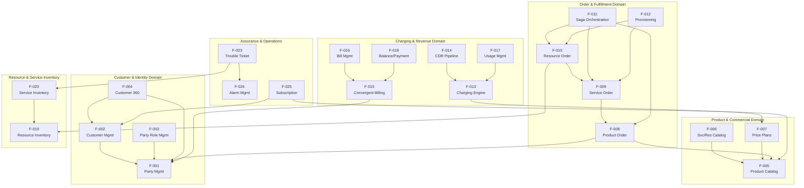

### 2.3.2 نقاط الدمج

يوضح الجدول التالي نقاط الربط الرئيسية بين الميزات المختلفة، وقد تم تحديد هذه النقاط من خلال عمليات الاشتراك في مواضيع كاكاو في `shared/kafka/topic-definitions.yml` ، والعلاقات بين الكيانات في `bss-core/` ، بالإضافة إلى تعريفات سير العمل المختلفة.

| الميزات الخاصة بالمصدر | الميزة المستهدفة/الخاصية المراد تحقيقها | آلية الدمج/التكامل |
| --- | --- | --- |
| F-001 (الحزب/المجموعة) | F-033 (كافكا) | نشر المواضيع ذات الرقم #0 |
| F-005 (الفهرس) | F-033 (كافكا) | نشر المواضيع ذات الرقم #0 |
| F-008 (طلب شراء المنتج) | F-033 (كافكا) | نشر المواضيع ذات الرقم #0 |

| الميزات الخاصة بالمصدر | الميزة المستهدفة/الخاصية المراد تحقيقها | آلية الدمج/التكامل |
| --- | --- | --- |
| F-014 (خط أنابيب نقل البيانات) | F-013 (محرك الشحن) | usage.events الموضوع (12 قسمًا) |
| F-013 (محرك الشحن) | F-018 (الميزانية/الحسابات) | عمليات توازن البيانات في Redis (أقل من 5 مللي ثانية) |
| F-013 (محرك الشحن) | F-033 (كافكا) | نشر المواضيع ذات الرقم #0 |

| الميزات الخاصة بالمصدر | الميزة المستهدفة/الخاصية المراد تحقيقها | آلية الدمج/التكامل |
| --- | --- | --- |
| F-011 (ساجا) | F-031 (محولات/أدوات التوصيل) | سلاسل العمل الزمنية → استدعاءات البرامج المُستخدمة في التكييف. |
| F-011 (ساجا) | F-019 (معلومات الموارد) | حجز موارد Redis Redlock |
| F-024 (نظام الإنذار) | F-023 (طلب حل المشكلة/طلب دعم فني) | الإنشاء التلقائي للتقارير المتعلقة بالتنبيهات الخطيرة |

| الميزات الخاصة بالمصدر | الميزة المستهدفة/الخاصية المراد تحقيقها | آلية الدمج/التكامل |
| --- | --- | --- |
| F-020 (طلب خدمة) | F-023 (طلب حل المشكلة/طلب دعم فني) | Neo4j BFS → قائمة الخدمات المتأثرة |
| F-027 (البوابة) | F-028 (بوابة الوصول) | توجيه الطلبات عبر بروكسيات الـ 57 المختلفة. |
| F-032 (الهجرة) | F-001 (الحزب/المجموعة) | TmfDataTransformer → سجلات الأطراف المعنية |

### 2.3.3 المكونات المشتركة

المكونات المشتركة التالية يتم استخدامها في العديد من الميزات المختلفة، وهو ما يتضح من بيانات الاعتماد الموجودة في `bss-core/pom.xml` ، `charging-engine/go.mod` ، و `shared/kafka/topic-definitions.yml` .

| مكون/عنصر | الميزات المتعلقة باستخدامه | التكنولوجيا |
| --- | --- | --- |
| بوستجريسكيل (سيتوس) | F-001 حتى F-028 (جميع كيانات BSS) | جافا 21 / JPA / هايبرنيت |
| Redis Cluster 7.2 | F-013، F-018، F-011، F-019 | Go-Redis v9.3.1، Jedis |
| أباتشي كافا | F-001، F-005، F-008، F-013، F-014، F-033 | مجمع Confluent 7.5.0 |

| مكون/عنصر | الميزات المتعلقة باستخدامه | التكنولوجيا |
| --- | --- | --- |
| نيو4جي | F-019، F-020، F-024 | استعلامات الرسوم البيانية (BFS) |
| إيلاستيكسيرش | F-004، F-019 | البحث في النص الكامل |
| كيكلاوك | F-027، F-028 | OAuth2/OIDC، JWT |

| مكون/عنصر | الميزات المتعلقة باستخدامه | التكنولوجيا |
| --- | --- | --- |
| Temporal.io | F-011، F-009 | تنسيق الأحداث في السيرة الذاتية/القصة الخاصة بالشخصية |
| القدرة على التكيف4j | F-031، F-028 | قطع الدائرة الكهربائية، الحواجز الواقية |
| أوبا سايدكارز | F-003، F-028 | تطبيق سياسات ABAC |

### 2.3.4 الخدمات الشائعة

| الخدمات | الوصف/الشرح | المستهلكون |
| --- | --- | --- |
| التعامل مع حالات التكرار في التنفيذ | مكتبة البرمجيات المشتركة الخاصة بإزالة البيانات المكررة في عمليات الكتابة على جميع نقاط النهاية. | جميع ميزات الطلبات والفوترة |
| مغلفة CloudEvents | ملف البيانات القياسي الخاص بالرسائل في كافكا (CloudEvents 4.0.1) | جميع الميزات المتعلقة بإنتاج كافكا. |
| الفئات الأساسية في TMF | أنواع الكيانات المشتركة في قاعدة بيانات TMF، مع الحقول القياسية. | جميع تنفيذات واجهة برمجة التطبيقات الخاصة بـ TMF. |

| الخدمات | الوصف/الشرح | المستهلكون |
| --- | --- | --- |
| تسجيل عمليات التدقيق/الفحص | سجل تتبع ثابت، يمكن فقط إضافة بيانات جديدة إليه، مع إمكانية الاحتفاظ به لمدة 7 سنوات. | جميع الخصائص المتعلقة بتغيير الحالة. |
| إخفاء المعلومات الشخصية الثانوية | إخفاء أرقام الهواتف والبريد الإلكتروني والبيانات المتعلقة بالهويات الوطنية في السجلات، باستخدام صيغ نمطية ديناميكية. | جميع الميزات المتعلقة بمعالجة البيانات الشخصية. |
| فحص الصحة | اختبارات قياسية للتحقق من الحالة الصحية/الجاهزية/الحيوية للأجهزة/المستخدمين. | جميع الخدمات المصغرة/الخدمات الرقمية الصغيرة |

* * *

## 2.4 اعتبارات المنفذ/طريقة التنفيذ

### 2.4.1 القيود التقنية

#### قيود بيئة التنفيذ

| قيود/شروط مفروضة | تفاصيل/المعلومات الكاملة |
| --- | --- |
| نموذج النشر/التطبيق | نظام كامل يعمل داخل الشبكة المحلية، ويدعم خاصية العزل الشبكي. |
| كوبرنيتيس | ٣ عقد رئيسية + ٦ عقد عمل (RKE2/k3s، تعمل على أجهزة فعلية أو على بيئة vSphere). |
| سجل الحاويات/Container Registry | Harbor 2.10 مع خاصية المسح الأمني التلقائي من قبل Trivy؛ بالإضافة إلى خاصية النسخ الاحتياطي في بيئة منفصلة عن الشبكة. |
| الاعتمادات على واجهات برمجة التطبيقات الخارجية | لا يسمح بأي خدمات إضافية (يمكن الحصول على جميع الخدمات من خلال Harbor/MinIO). |

#### قيود متعلقة بمجموعة التقنيات المستخدمة

| قيود/شروط مفروضة | تفاصيل/المعلومات الكاملة |
| --- | --- |
| BSS Core Runtime | جافا 21، سبرينج بوت 3.2.0، مافن |
| وقت تشغيل محرك الشحن | Go 1.22 (المسار الحاسم من ناحية الأداء) |
| وقت تنفيذ خط أنابيب CDR | بايثون 3.x |
| وقت تشغيل بوابة الواجهة البرمجية للتطبيقات | TypeScript 5.3+، NestJS 10+، Node.js 20 LTS |

#### قيود طبقة البيانات

| قيود/شروط مفروضة | تفاصيل/المعلومات الكاملة |
| --- | --- |
| قاعدة البيانات الأساسية | PostgreSQL 15 + Citus (مقسمة حسب قيمة المتغير customer\_id؛ نظام Patroni للتوافقية العالية؛ نسخة متزامنة من البيانات). |
| الأرصدة في الوقت الفعلي | Redis Cluster 7.2 (خاصية الحفظ المستمر باستخدام AOF) |
| توبولوجيا الرسم البياني | Neo4j لتحليل بنية المخزون (التجميع السببي للبيانات) |
| تدفق الأحداث/نقل البيانات المتعلقة بالأحداث في الوقت الفعلي | أباتشي كافا 3.6 (وضع KRaft؛ التخزين المتدرج في MinIO) |

### 2.4.2 متطلبات الأداء

| مجال الخصائص/الميزات | الوحدات القياسية | الهدف/الغاية |
| --- | --- | --- |
| الشحن (F-013) | التأخير في التنفيذ: p99 | <50 مللي ثانية> |
| الشحن (F-013) | قدّر الإنتاج | ١٬٢٠٠ حدث في الثانية |
| عمليات إدارة علاقات العملاء (F-001، F-002) | التأخير في التنفيذ: p95 | <200 مللي ثانية> |
| معالجة الطلبات (F-008) | الإنتاجية/القدرة الإنتاجية | ١٠٠٠ طلب في الدقيقة |

| مجال الخصائص/الميزات | الوحدات القياسية | الهدف/الغاية |
| --- | --- | --- |
| ساجا ريكفري (F-011) | وقت التعافي | <30 ثانية> |
| استعلامات الرسوم البيانية (F-019، F-020) | التنقل عبر 5 خطوات | <10 مللي ثانية> |
| فحص الرصيد (F-018) | زمن الاستجابة في عمليات القراءة من قاعدة البيانات Redis | <5 مللي ثانية> |
| خط أنابيب CDR (F-014) | الإنتاجية/القدرة الإنتاجية | ١٬٢٠٠ حدث في الثانية |

| مجال الخصائص/الميزات | الوحدات القياسية | الهدف/الغاية |
| --- | --- | --- |
| العميل رقم 360 (F-004) | حمل اللوحة الرئيسية (النسبة المئوية للقيم في النطاق 95%) | <200 مللي ثانية> |
| كشف الاحتيال (F-029) | الدقة | 95% |
| توقع معدل الانسحاب من الخدمة (F-030) | الدقة | 85% |
| التهيئة التلقائية بدون تدخل يدوي (F-012) | معدل الأتمتة | ≥95% |

### 2.4.3 اعتبارات المرونة في التوسعة

| ميزة/خاصية | استراتيجية القابلية للتوسعة |
| --- | --- |
| F-001 (الطرف المُشارك في العملية) / F-002 (العميل) | تقسيم بيانات PostgreSQL Citus حسب قيمة المتغير customer\_id؛ توسيع النظام أفقيًا عبر عقد العمل المختلفة. |
| F-013 (محرك الشحن) | تقسيم البيانات في كافكا: يتم تقسيم البيانات إلى 12 قسمًا بالنسبة لـ usage.events و charging.events . كما أن استخدام نسخ من لغة Go التي لا تحتفظ بالحالة يسمح بزيادة القدرة الاستيعابية للنظام بشكل أفقي. |
| F-014 (خط أنابيب نقل البيانات) | المعالجة الجماعية مع إمكانية تحديد حجم كل مجموعة من البيانات المراد معالجتها؛ يمكن توسيع قدرة برنامج بايثون على المعالجة حسب عدد الأجزاء التي يتم تقسيم البيانات إليها. |
| F-019 (جرد الموارد) | تجميع البيانات بطريقة سببية في Neo4j لنسخ القراءة؛ استعلامات الرسوم البيانية المُحسّنة لعمليات الزحف من نوع BFS. |

| ميزة/خاصية | استراتيجية القابلية للتوسعة |
| --- | --- |
| F-033 (كافكا باكبون) | وضعية النقل باستخدام 3 وسطاء؛ يتم تخزين البيانات غير المستخدمة بشكل دوري في نظام MinIO؛ يمكن تعديل عدد الأقسام المستخدمة لتخزين البيانات حسب كل موضوع. |
| F-028 (بوابة الواجهة البرمجية) | يتولى Kong Gateway مهمة التوسعة الأفقية للنظام؛ أما NestJS Gateway، فهو نظام لا يحتفظ بالحالة الخاصة بالطلبات، ويمكن استخدام عدة نسخ منه في نفس الوقت. |
| F-015 (الفوترة الموحدة) | يتم معالجة دورة الفوترة على مستوى عقد العمل المختلفة؛ كما يتم استخدام عنقود Redis لإجراء عمليات التوازن اللازمة. |

### 2.4.4 الآثار المتعلقة بالأمان

| نطاق الأمان | المتطلبات/الشروط اللازمة | الميزات المتأثرة |
| --- | --- | --- |
| المصادقة/إثبات الهوية | JWT (مدة صلاحية 15 دقيقة)، OAuth2/OIDC (Keycloak)، FIDO2/WebAuthn لإجراءات المصادقة المتعددة العوامل. | F-027، F-028: جميع الميزات المتعلقة بالواجهة الخارجية للجهاز. |
| التفويض/الإذن | RBAC/ABAC من خلال أدوات OPA Sidecars؛ إمكانية الوصول المحددة حسب المنطقة لفنيي الميدان. | F-003، F-028: جميع نقاط الاتصال الخاصة بالوحدات الخاضعة للتحكم. |
| التشفير (أثناء النقل) | TLS 1.3: خارجي؛ mTLS: داخلي (في وضع Istio الصارم). | جميع الميزات، F-028 |

| نطاق الأمان | المتطلبات/الشروط اللازمة | الميزات المتأثرة |
| --- | --- | --- |
| التشفير (الحالة السلبية/غير النشطة) | AES-256-GCM لحماية بيانات قواعد البيانات | جميع الميزات المتعلقة بحفظ البيانات. |
| حماية البيانات الشخصية | التمويه الديناميكي في السجلات؛ التشفير على مستوى الحقول (Jasypt + Vault) | F-001، F-002، F-004 |
| PCI-DSS المستوى الأول | توكنة بيانات الدفع؛ عزل بيانات بطاقات الائتمان | F-015، F-016، F-018 |

| نطاق الأمان | المتطلبات/الشروط اللازمة | الميزات المتأثرة |
| --- | --- | --- |
| إدارة المفاتيح | HashiCorp Vault مزود بخاصية التدوير التلقائي للمفاتيح؛ كما يحتوي على وحدة معالجة أمنية خاصة لحفظ المفاتيح الرئيسية. | جميع ميزات التشفير |
| سجل المراجعة/التتبع | سجلات التدقيق غير القابلة للتغيير، ويمكن فقط إضافة بيانات جديدة إليها؛ يتم الاحتفاظ بها لمدة 7 سنوات. | جميع الخصائص المتعلقة بتغيير الحالة. |
| فحص نقاط الضعف | لا توجد أي ثغرات خطيرة (وفقًا لأدوات Snyk/Trivy) في جميع نقاط التحقق من الجودة. | جميع الميزات جاهزة للاستخدام قبل التطبيق الفعلي. |

### 2.4.5 متطلبات الصيانة

| الحاجة | تفاصيل/المعلومات الكاملة |
| --- | --- |
| مدى القدرة على المراقبة/الإشراف | التتبع الموزع: نسبة تغطية تزيد عن 95% (Jaeger/Tempo)؛ أكثر من 25 لوحة تحكم من نوع Grafana؛ استخدام أدوات Prometheus وThanos لتخزين البيانات على المدى الطويل. |
| دليل الإجراءات التشغيلية | كل تنبيه يتم توثيقه مع الإجراءات الخاصة به؛ وجميع الوثائق الخاصة بتنفيذ هذه الإجراءات متاحة للاستخدام. |
| استراتيجية النسخ الاحتياطي | بوستجريسكيل: نسخ البيانات من نظام WAL-G إلى MinIO كل ساعة؛ نيو4جي: نسخ البيانات يدويًا بواسطة أداة neo4j-admin يوميًا؛ كما يتم أيضًا نسخ البيانات عبر المواقع المختلفة. |

| الحاجة | تفاصيل/المعلومات الكاملة |
| --- | --- |
| اختبارات الدكتوراه/اختبارات المرحلة الدكتوراهية | تدريبات استعادة القدرة على العمل بشكل دوري كل ربع سنة؛ نقل البيانات تلقائيًا في حالة حدوث أي أعطال؛ مدة استعادة البيانات أقل من 15 دقيقة؛ مدة استعادة الخدمة أقل من 30 دقيقة. |
| استعادة البيانات المفقودة | استعادة الخدمة في حالة فشل الجهاز: أقل من 30 ثانية؛ استعادة البيانات في حالة فشل قاعدة البيانات: أقل من 10 ثوانٍ. |
| قرارات المعمارية | سجل قرارات الهندسة المتعلقة بكل خيار تصميمي رئيسي. |

| الحاجة | تفاصيل/المعلومات الكاملة |
| --- | --- |
| إدارة الهياكل/الأنماط | تم ضمان التوافق العكسي مع النسخ السابقة من البرنامج؛ كما تم التحكم في إصدارات قواعد البيانات. |
| تحسين التكاليف | الضغط على البيانات (استخدام تقنية Zstd مع Kafka وTimescaleDB)؛ التخزين المتدرج حسب الاحتياجات (استخدام وحدات تخزين NVMe للبيانات المستخدمة بشكل متكرر، ووحدات SSD للبيانات التي يتم الوصول إليها بشكل متوسط، ووحدات HDD/S3 للبيانات التي لا يتم الوصول إليها إلا نادرًا). |
| حيادية البائعين | واجهات مجردة (متوافقة مع معيار S3، ولا تعتمد على بروتوكول Kubernetes CNI)؛ بالتالي، لا يوجد أي قيود ناتجة عن اختيار مزود معين. |

* * *

## 2.5 مصفوفة التتبع

### 2.5.1 إمكانية تتبع عمليات نقل البيانات من الميزات المختلفة إلى واجهة برمجة التطبيقات المتعلقة بتحويل النصوص إلى نصوص صوتية.

| معرف الميزة/الخاصية | واجهة برمجة التطبيقات الخاصة بـ TMF | مرحلة التنفيذ | بوابة الجودة |
| --- | --- | --- | --- |
| F-001 | TMF632 إدارة الحفلات/الفعاليات | تم الانتهاء من العمل. | مستوى TMF 3+ ✅ |
| F-002 | إدارة العملاء في TMF629 | المرحلة الأولى (الأسبوعان الأول والثاني) | مستوى TMF 3+ ⏳ |
| F-003 | إدارة أدوار الأشخاص في الحفلات: TMF669 | تم الانتهاء من العمل. | مستوى TMF 3+ ✅ |
| F-005 | كتالوج منتجات TMF620 | تم الانتهاء من العمل. | مستوى TMF 3+ ✅ |

| معرف الميزة/الخاصية | واجهة برمجة التطبيقات الخاصة بـ TMF | مرحلة التنفيذ | بوابة الجودة |
| --- | --- | --- | --- |
| F-006 | TMF633/634: كتالوج الخدمات/الموارد | تم الانتهاء من العمل. | مستوى TMF 3+ ✅ |
| F-008 | طلب شراء المنتج TMF622 | تم الانتهاء من العمل. | مستوى TMF 3+ ✅ |
| F-009 | طلب خدمة TMF641 | تم الانتهاء من العمل. | مستوى TMF 3+ ✅ |
| F-010 | طلب الموارد لـ TMF640 | المرحلة الأولى (الأسبوعان الأول والثاني) | مستوى TMF 3+ ⏳ |

| معرف الميزة/الخاصية | واجهة برمجة التطبيقات الخاصة بـ TMF | مرحلة التنفيذ | بوابة الجودة |
| --- | --- | --- | --- |
| F-015 | حساب الفوترة TMF647 | تم الانتهاء من العمل. | مستوى TMF 3+ ✅ |
| F-016 | إدارة الفواتير: TMF657 | تم الانتهاء من العمل. | مستوى TMF 3+ ✅ |
| F-017 | إدارة الاستخدام في TMF648 | المرحلة الأولى (الأسبوعان الأول والثاني) | مستوى TMF 3+ ⏳ |
| F-018 | TMF650/671 – التوازن/الدفعات | جزئي/غير كامل | مستوى TMF 3+ ⏳ |

| معرف الميزة/الخاصية | واجهة برمجة التطبيقات الخاصة بـ TMF | مرحلة التنفيذ | بوابة الجودة |
| --- | --- | --- | --- |
| F-019 | TMF638 قائمة الموارد | تم الانتهاء من العمل. | مستوى TMF 3+ ✅ |
| F-020 | قائمة خدمات TMF639 | تم الانتهاء من العمل. | مستوى TMF 3+ ✅ |
| F-021 | TMF653: العنوان الجغرافي | تم الانتهاء من العمل. | مستوى TMF 3+ ✅ |
| F-022 | TMF656: الموقع الجغرافي | تم الانتهاء من العمل. | مستوى TMF 3+ ✅ |

| معرف الميزة/الخاصية | واجهة برمجة التطبيقات الخاصة بـ TMF | مرحلة التنفيذ | بوابة الجودة |
| --- | --- | --- | --- |
| F-023 | TMF645 خطاب مشكلة | تم الانتهاء من العمل. | مستوى TMF 3+ ✅ |
| F-024 | إدارة الإنذارات في TMF642 | جزئي/غير كامل | مستوى TMF 3+ ⏳ |

### 2.5.2 إمكانية تتبع العلاقة بين الميزات وقاعدة الكود

| معرف الميزة/الخاصية | الكود الأساسي لقاعدة البيانات |
| --- | --- |
| F-001 | Party.java, customer-management-api.yaml |
| F-002 | Customer.java, customer-management-tmf629-api.yaml |
| F-004 | Customer360.java, CustomerPortalController.java |
| F-005 | product-catalog-api.yaml ، product\_\* جداول |

| معرف الميزة/الخاصية | الكود الأساسي لقاعدة البيانات |
| --- | --- |
| F-008 | Order.java, OrderItem.java, order-management-api.yaml |
| F-009 | ServiceOrder.java, service-order-api.yaml |
| F-010 | ResourceOrder.java, ResourceOrderItem.java |
| F-011 | تعريفات سير العمل في Temporal.io |

| معرف الميزة/الخاصية | الكود الأساسي لقاعدة البيانات |
| --- | --- |
| F-013 | charging-engine/internal/ (الرصيد، البيانات المتبقية، التقييم) |
| F-014 | cdrmspipeline/ (جهاز تنسيق البيانات، جهاز تنظيم البيانات، جهاز إضافة المعلومات إلى البيانات، جهاز إنتاج البيانات) |
| F-015 | ConvergentBillingAccount.java, ConvergentBillingController.java |
| F-016 | Invoice.java, BillingController.java |

| معرف الميزة/الخاصية | الكود الأساسي لقاعدة البيانات |
| --- | --- |
| F-019 | resource-inventory-api.yaml ، network\_elements جدول/قائمة |
| F-020 | service-inventory-api.yaml |
| F-027 | CustomerPortalController.java, frontend/yemen-ptc-portal |
| F-028 | api-gateway/ (57 وحدات بروكسي) |

| معرف الميزة/الخاصية | الكود الأساسي لقاعدة البيانات |
| --- | --- |
| F-031 | docs/adapters/ (مواصفات الأجهزة الستة المستخدمة في عملية التوصيل) |
| F-032 | migration/ (أدوات الاستخراج، أدوات التحويل، أدوات التحقق من الصحة) |
| F-033 | shared/kafka/topic-definitions.yml |

* * *

## 2.6 معايير الجودة

يجب أن تلبي جميع الميزات المذكورة المعايير اللازمة قبل أن يتم استخدامها في الإنتاج، وفقًا لما هو محدد في “تعريف الإنجاز” الخاص بالمشروع.

| البوابة رقم # | المعيار/الشرط | طريقة التحقق/التأكد من الصحة |
| --- | --- | --- |
| QG-1 | مستوى الامتثال لمعايير TMF: 3+ | اختبارات Postman الآلية قد نجحت. |
| QG-2 | تم التحقق من خاصية التكرار دون تغيير في النتيجة (100 محاولة = تأثير جانبي واحد فقط). | اختبار ضغط محسوس |
| QG-3 | فحص الأمان: لا توجد أي نقاط ضعف خطيرة. | فحص خطوط الأنابيب باستخدام أداة Snyk/Trivy |
| QG-4 | الأداء: p95 < 200 مللي ثانية (أثناء القراءة)، p99 < 50 مللي ثانية (أثناء الشحن). | معيار اختبار الأحمال/الأداء |

| البوابة رقم # | المعيار/الشرط | طريقة التحقق/التأكد من الصحة |
| --- | --- | --- |
| QG-5 | تم اختبار النظام: وقت استعادة الحاويات أقل من 30 ثانية؛ ووقت التحويل التلقائي لقاعدة البيانات أقل من 10 ثوانٍ. | اختبارات هندسة الفوضى |
| QG-6 | تم اختبار النظام: الانتقال التلقائي بين المواقع مع الحفاظ على سلامة البيانات. | تدريبات الاستعادة من الكوارث الفصلية |
| QG-7 | قابلية المراقبة: نسبة التتبع الموزع أكثر من 95%؛ المؤشرات المتعلقة بالأعمال متاحة للعرض. | تحليل نطاق التغطية |
| QG-8 | الوثائق الخاصة بالإجراءات المتبعة في حالات اتخاذ القرارات المهمة؛ كما أن دليل التشغيل كامل. | مراجعة الوثائق/المستندات |

* * *

## 2.7 الافتراضات والقيود

### 2.7.1 الافتراضات/المقدمات

| ID | افتراض/تخمين |
| --- | --- |
| A-001 | جميع المحافظات اليمنية الـ19 لديها اتصالات شبكية كافية للوصول إلى مراكز البيانات التي تستضيف المنصة. |
| A-002 | تظل قواعد البيانات التابعة للأنظمة القديمة (مثل TITAN وOracle BRM) قابلة للوصول خلال فترة الانتقال، وذلك من أجل عمليات استخراج البيانات باستخدام أداة ETL. |
| A-003 | يستمر تنفيذ رؤية PTC لعام 2030، حيث يتم تقديم الدعم اللازم من الإدارة العليا لضمان نجاح تنفيذ هذه الخطة على مراحل مختلفة. |
| A-004 | يظل عدد المشتركين البالغ 50 مليون مشترك هو الهدف المستهدف في تخطيط القدرات اللازمة خلال جميع مراحل التنفيذ. |

| ID | افتراض/تخمين |
| --- | --- |
| A-005 | مواصفات واجهة برمجة التطبيقات المفتوحة الخاصة بمنتدى TM Forum ظلت ثابتة خلال فترة التنفيذ، سواء في الإصدارين v4 أو v5، دون أي تغييرات قد تؤثر على أداء النظام. |
| A-006 | تم الانتهاء من تجهيز العتاد الخاص بالبنية التحتية للمواقع الثلاثة في نموذج التشغيل النشط-النشط (3 عقد رئيسية + 6 عقد عمل في كل موقع)، وذلك قبل بدء المرحلة الأولى. |
| A-007 | بيانات تدريب نموذج التعلم الآلي الخاصة بالأنظمة القديمة كافية من حيث الجودة، بحيث يمكنها تحقيق دقة تزيد عن 95% في اكتشاف عمليات الاحتيال، وأكثر من 85% في تحديد حالات التوقف عن الاستخدام. |

### 2.7.2 القيود/الشروط المفروضة

| ID | قيود/شروط مفروضة |
| --- | --- |
| C-001 | يجب أن يكون هناك قدرة على التركيب في بيئة منفصلة عن الشبكة الخارجية: لا يجوز وجود أي اعتمادات على واجهات برمجية خارجية مُعدة مسبقًا؛ يجب أن يتم تقديم جميع الملفات اللازمة من خلال Harbor/MinIO. |
| C-002 | الامتثال لمعايير PCI-DSS من المستوى الأول في جميع عمليات معالجة المدفوعات؛ يجب ألا تصل بيانات حاملي البطاقات إلى خوادم التطبيقات أبدًا. |
| C-003 | ووفقًا لمتطلبات هيئة الاتصالات اليمنية، يجب الاحتفاظ بسجلات CDR لمدة 7 سنوات، مع استخدام أنظمة تخزين من نوع WORM في عملية التخزين. |
| C-004 | حيادية البائعين: واجهات البرنامج مجردة، وهي متوافقة مع معيار S3، لكنها ليست جزءًا من خدمات AWS S3. كما أنها غير مرتبطة ببروتوكول Kubernetes CNI. |

| ID | قيود/شروط مفروضة |
| --- | --- |
| C-005 | معايير النجاح في مرحلة الإطلاق الفعلي: يجب تنفيذ جميع واجهات برمجة التطبيقات الـ 24 المستهدفة في البداية، بالإضافة إلى التحقق من صحتها، قبل الانتقال إلى الاستخدام الفعلي. |
| C-006 | فترة الإنجاز المتبقية لمهام المراحل من 1 إلى 5 هي 8–9 أسابيع، وفقًا لما ذكره IMPLEMENTATION\_COMPLETION\_PLAN.md . |
| C-007 | زمن الاستجابة لمحرك الشحن الحالي P95 هو 92.1 مللي ثانية، وهو ما يتجاوز الحد المسموح به والبالغ 50 مللي ثانية. لذا، من الضروري إجراء تحسينات على أداء المحرك قبل البدء في الاستخدام الفعلي. |

* * *

## 2.8 المراجع/المصادر

#### مراجع

*   `docs/TMF_API_IMPLEMENTATION_STATUS.md` – قائمة كاملة بواجهات برمجة التطبيقات الخاصة بنظام TMF، مع توضيح الحالة لكل واجهة (12 واجهة جاهزة، 3 واجهات غير كاملة، 12 واجهة لا تزال قيد المعالجة). كما تتضمن القائمة معلومات حول نقاط النهاية والهياكل المستخدمة في هذه الواجهات.
*   `IMPLEMENTATION_COMPLETION_PLAN.md` – خطة التنفيذ المكونة من 5 مراحل، هيكل الفريق، الجدول الزمني، معايير النجاح، وشروط البدء في التنفيذ.
*   `IMPLEMENTATION_SUMMARY.md` – نتائج التحقق من الجودة، وبيانات قياس الأداء (معدل نقل البيانات، زمن الاستجابة أثناء عملية الشحن)، بالإضافة إلى مدى جاهزية النظام للاستخدام الفعلي.
*   `docs/GO_LIVE_READINESS_CHECKLIST.md` – قوائم التحقق من جاهزية البنية التحتية والتطبيقات والأنظمة الأمنية، مع معايير التحقق المطلوبة.
*   `docs/data-models/database-schema.sql` – تعريفات هيكل قاعدة البيانات في PostgreSQL (العملاء، الحسابات، المنتجات، عمليات الفوترة، الطلبات، جداول التدقيق، الدوال).
*   `shared/kafka/topic-definitions.yml` – تعريفات المواضيع القياسية في Kafka (10 مواضيع، 4 مجموعات مستهلكين، آليات تقسيم البيانات، سياسات الاحتفاظ بالبيانات)
*   `bss-core/src/main/java/.../entity/Party.java` – نموذج كيان الحزب، مع تخصيص حقوله وفقًا لمعايير TMF632.
*   `bss-core/src/main/java/.../entity/Customer.java` – نموذج كيان العميل، يتضمن حقولًا خاصة بتقسيم العملاء إلى فئات مختلفة، بالإضافة إلى البيانات الخاصة بالتحقق من هوية العميل.
*   `bss-core/src/main/java/.../entity/Customer360.java` – كيان شامل لجميع بيانات العميل، يتضمن مكونات البروفايل المرتبطة به.
*   `bss-core/src/main/java/.../entity/Order.java` – كيان طلب المنتج، يحتوي على آلية لتحديد الحالات المختلفة للطلب، بالإضافة إلى تحديد الأولويات المتعلقة بتنفيذ الطلب.
*   `bss-core/src/main/java/.../entity/ServiceOrder.java` – كيان طلب الخدمة، الذي يحتوي على حقول من نوع CFS/RFS.
*   `bss-core/src/main/java/.../entity/ResourceOrder.java` – كيان يتعلق بطلبات الحصول على الموارد، ويحتوي على 10 حالات مختلفة و8 أنواع من الطلبات.
*   `bss-core/src/main/java/.../entity/Invoice.java` – كيان فواتير، يحتوي على معلومات حول مراحل دورة حياة الفاتورة، بالإضافة إلى العملة المستخدمة في تسجيل الفواتير.
*   `bss-core/src/main/java/.../entity/ConvergentBillingAccount.java` – كيان مالي يقوم بالتحصيل المالي بطرق مختلفة، سواء كان ذلك بنظام الدفع المسبق، أو الدفع بعد الاستخدام، أو النظام الهجين.
*   `bss-core/src/main/java/.../entity/BillingSummary.java` – ملخص فواتير العميل رقم 360
*   `charging-engine/internal/balance/service.go` – خدمة توازن البيانات المدعومة بمنصة Redis (بلغة Go)، وتشمل عمليات الحجز والخصم.
*   `charging-engine/internal/cdr/mediator.go` – برنامج استهلاك بيانات من نوع Kafka، يُستخدم في عمليات التوسط في نقل البيانات، بالإضافة إلى توجيه الأحداث المتعلقة باستخدام المنتجات.
*   `charging-engine/internal/rating/service.go` – نظام تقييم يعمل داخل الذاكرة، مع خيارات دفع حسب الفترة الزمنية، أو حسب الميجابايت، أو كرسوم ثابتة.
*   `cdrmspipeline/orchestrator.py` – أداة لتنسيق عمليات الوساطة في نظام CDR، مع دعم لمعالجة البيانات بشكل جماعي وإجراء فحوصات للحالة الفنية للنظام.
*   `cdrmspipeline/normalizer/schema_normalizer.py` – تعريف مخطط NormalizedCDR وعملية التطبيع الجماعي للبيانات.
*   `cdrmspipeline/enricher/context_enricher.py` — EnrichedCDR: يتضمن خدمات الاشتراك، وخطط الأسعار، بالإضافة إلى إمكانية البحث حسب الموقع الجغرافي.
*   `cdrmspipeline/kafka/producer.py` – مُنتج رسائل لبرنامج Kafka يدعم خاصيات التكرار في إرسال الرسائل، بالإضافة إلى دعم بروتوكول TLS وخاصيات إعادة المحاولة في حالة فشل الإرسال، بالإضافة إلى دعم قائمة الانتظار للرسائل.
*   `docs/adapters/` – مواصفات ستة أنظمة قديمة يجب توافقها مع النظام الجديد: TITAN، Oracle BRM، WHM، ADSL/FTTH، MPLS/PRI، وعناصر الشبكة المختلفة.
*   `migration/` – النظام الفرعي لعمليات استخراج البيانات (أدوات استخراج البيانات من نظامي Oracle BRM وTITAN، بالإضافة إلى أداة TmfDataTransformer وأداة MigrationReconciler).
*   `frontend/yemen-ptc-portal` — بوابة خدمة العملاء الذاتية باستخدام React + TypeScript + Vite
*   `api-gateway/` – بوابة واجهة برمجة التطبيقات الخاصة بـ NestJS، تحتوي على 57 وحدة بروكسي.
*   `docs/api/` — 14 ملفات من نوع YAML تحتوي على مواصفات واجهة برمجة التطبيقات الخاصة بـ TMF API.
*   `docker-compose.yml` – بنية تحتية للتطوير المحلي (PostgreSQL، Redis، Kafka، Elasticsearch)
*   `infrastructure/` – قوالب لتمثيل البنية التحتية ككود (ArgoCD، Istio، Kafka، Kong، Kubernetes)
*   `deployment/` – وصفات إنشاء الحاويات، ملفات Compose، ملفات تكوين Kubernetes، إعدادات المراقبة.
*   `bss-core/pom.xml` – قائمة مكونات الاعتمادات في Maven (Java 21، Spring Boot 3.2.0، Resilience4j، Jasypt، Temporal SDK)
*   `charging-engine/go.mod` – ملف تعريف الوحدات في لغة Go (Go 1.22، Confluent Kafka Go، Gin، go-redis، zerolog)

# 3\. مجموعة التقنيات المستخدمة

تستخدم منصة PTC BSS/OSS في اليمن بنية تحتية قائمة على خدمات صغيرة متعددة اللغات، حيث تم اختيار التقنيات المناسبة لكل مجال تشغيلي على حدة. كل الاختيارات المذكورة في هذا القسم مبنية على الوثائق الفعلية المتعلقة بالكود المستخدم، بالإضافة إلى ملفات تحديد المتطلبات الخاصة بالبنية التحتية، وإعدادات التنفيذ.

يعتبر هذا القسم المرجع الرسمي لجميع القرارات المتعلقة بالتكنولوجيا، والقيود المتعلقة بالإصدارات المختلفة، بالإضافة إلى متطلبات الدمج بين الأجزاء الستة الرئيسية للمنصة: خدمة BSS Core، ووحدة التحصيل، وبوابة الواجهة البرمجية، ونظام توجيه البيانات CDR، وبوابات الواجهة الأمامية، ونظام الهجرة.

> ملاحظة حول الاختلافات في مكونات البنية التحتية الافتراضية: المكونات الافتراضية التي يختارها المستخدم (AWS، Python/Flask، Auth0، MongoDB، TailwindCSS، Terraform، React-Native، Langchain) تمثل نموذجًا أساسيًا للبنية التحتية. لكن التنفيذ الفعلي يختلف كثيرًا عن هذه المكونات الافتراضية، وذلك بسبب المتطلبات الخاصة بالمنصة: الحاجة إلى نشر النظام في بيئة منفصلة عن الشبكة الخارجية (الشرط C-001)، وضرورة أن يكون زمن الاستجابة أقل من 50 مللي ثانية (الشرط C-007)، بالإضافة إلى الحاجة إلى دعم لغات متعددة لأكثر من 50 مليون مشترك، والتوافق مع واجهات برمجة التطبيقات المفتوحة الخاصة بمنظمة TM Forum. يتم شرح كل هذه الاختلافات بالتفصيل في الأقسام المخصصة لها.

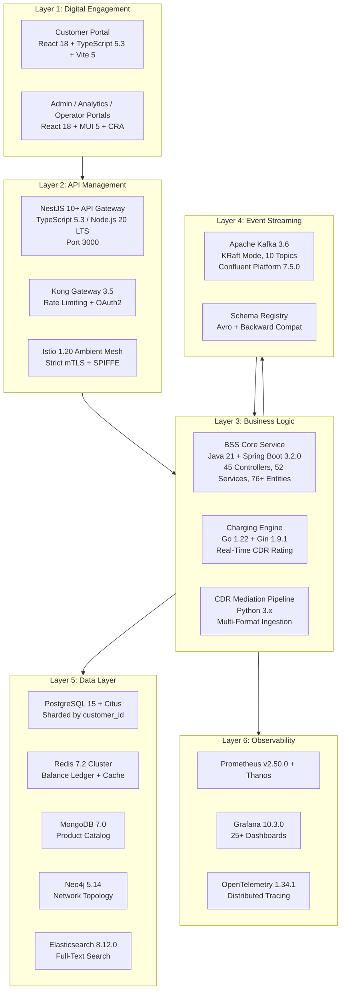

## 3.1 لغات البرمجة

### 3.1.1 استراتيجية اختيار اللغة

تستخدم المنصة أربع لغات برمجة رئيسية، وقد تم اختيار كل لغة بناءً على مزاياها الخاصة في مجال تطبيقها. يعكس هذا النهج المتعدد اللغات قرارًا هندسيًا مدروسًا، بهدف تحقيق أفضل أداء وقابلية للتوسعة، بالإضافة إلى تلبية متطلبات كل نظام فرعي على حدة، بدلاً من استخدام لغة برمجة واحدة في جميع الأنظمة.

| اللغة | النسخة/الإصدار | مكون/عنصر | التبرير/الأسباب الموجبة لذلك | الأدلة/البراهين |
| --- | --- | --- | --- | --- |
| جافا | 21 (LTS) | خدمة النواة الأساسية لنظام BSS، النظام الفرعي المخصص لعمليات الهجرة. | نظام بيئي متكامل للشركات؛ استخدام أداة Spring Boot 3.2 لتطوير واجهات برمجة التطبيقات بسرعة؛ استخدام أدوات JPA/Hibernate لحفظ البيانات في 5 قواعد بيانات مختلفة؛ وجود نظام تصنيف قوي لأكثر من 76 نموذج بيانات. | bss-core/pom.xml (السطر 21: java.version=21 ) |
| اذهب. | 1.22 | محرك التيار | ملفات ثنائية ثابتة بدون حاجة إلى توقف في عملية التشغيل، بحيث يكون وقت الاستجابة أقل من 50 مللي ثانية في 99% من الحالات؛ استخدام آلية التنفيذ المتزامن للجوروتينات لتحقيق معالجة سريعة للبيانات (أكثر من 1,200 حدث في الثانية)؛ حجم صغير جداً للحاوية المستخدمة في التشغيل (Alpine:3.19). | charging-engine/go.mod (السطر 3: go 1.22 ) |
| تايبسكريبت | 5.3+ | بوابة الخدمات البرمجية، بوابة العملاء | تحديد أنواع البيانات بشكل دقيق لـ 57 تعريفًا خاصًا بوحدات البروكسي؛ استخدام أدوات تزيين الكود في نظام NestJS؛ تحديد أنواع البيانات المشتركة بين وحدة البوابة والواجهة الأمامية للتطبيق. | api-gateway/package.json (TS ^5.3.3 )، frontend/package.json (TS ^5.3.0 ) |
| بايثون | 3.x | خطوط إنتاج CDR، تقنيات الذكاء الاصطناعي والتعلم الآلي، معايير الأداء | نظام بيانات متطور للمعالجة؛ دعم من إطار عمل الذكاء الاصطناعي في كشف عمليات الاحتيال (>95% دقة) والتنبؤ بحالات التوقف عن الاشتراك (>85% دقة)؛ إمكانية إنشاء نماذج أولية بسرعة. | cdrmspipeline/orchestrator.py, benchmark/performance\_benchmark.py |

#### معايير الاختيار

إن اختيارات اللغات تخضع لثلاث قيود رئيسية نابعة من متطلبات النظام.

1.  فصل مستويات الأداء (القيد C-007): يتطلب أداء محرك الشحن أن لا يتجاوز زمن الاستجابة 50 مللي ثانية في 99% من الحالات. هذا الشرط يستبعد استخدام اللغات التفسيرية في العمليات الحرجة. أما لغة Go، فإن نموذج تحويلها إلى كود ثنائي يساعد في التحكم في عمليات إدارة الذاكرة بشكل دقيق، وهو ما يساعد في تحقيق هذا الشرط.
2.  نضج النظام البيئي للشركات: يتطلب تنفيذ 45 وحدة تحكم من نوع REST في نظام BSS Core، والتي تستخدم واجهات برمجية مفتوحة من صنع منظمة TM Forum، وجود بنية تحتية قوية لإدارة العلاقات مع قواعد البيانات (أكثر من 76 كيان من نوع JPA)، بالإضافة إلى دعم شامل للبرامج الوسيطة مثل Resilience4j، Temporal SDK، Kafka، وCloudEvents. كما يجب أن تكون البنية الأساسية موثوقة عند التطبيق على نطاق واسع. وهذه المتطلبات يمكن تلبيتها بشكل أفضل من خلال بيئة Java/Spring Boot.
3.  توافقية البيئة الافتراضية (القيد C-001): يجب أن تكون جميع بيئات التشغيل والمكونات اللازمة لتنفيذ البرامج موجودة داخل صور الحاويات الخاصة بـ Harbor، بحيث لا يكون هناك حاجة إلى تنزيل أي حزم خارجية أثناء تنفيذ البرامج.

### 3.1.2 جافا 21 – خدمة النواة الأساسية ونظام الهجرة الخاص بها

تعتبر لغة جافا 21 اللغة الأساسية المستخدمة في تطوير أكثر مكونات النظام تعقيدًا، وهو خدمة BSS Core Service. تقوم هذه الخدمة بتنفيذ معظم الوظائف المتعلقة بواجهة برمجة التطبيقات المفتوحة الخاصة بمنتدى TM Forum.

**تفاصيل أثناء التشغيل:**

*   توزيعة JDK: Eclipse Temurin 21 (القاعدة المستخدمة في التوزيع: `eclipse-temurin:21-jre-alpine` ، كما هو محدد في `deployment/Dockerfile` ).
*   أداة البناء: Apache Maven 3.9، مع بيئة التطوير Eclipse Temurin ومكتبة JDK 21. (مرحلة البناء تتم في `.gitlab-ci.yml` )
*   ضبط إعدادات JVM: يتم استخدام خوارزمية G1GC، مع هدف أقصى لفترة التوقف أثناء عملية التنظيف وقدره 200 مللي ثانية ( `-XX:+UseG1GC -XX:MaxGCPauseMillis=200` ). يمكن تعديل نطاق الذاكرة المستخدمة بين 512 ميجابايت و1 جيجابايت عبر الإعداد `JAVA_OPTS` . أما المنطقة الزمنية، فيتم تحديدها وفقًا للإعدادات المحددة في `Asia/Aden` ، كما هو موضح في `helm/bss-core/values.yaml .`
*   معالجة التعليقات: استخدام أداة Lombok 1.18.32 لتقليل الكود الزائد أثناء عملية التجميع؛ كما يتم استخدام أداة Apache Avro 1.11.3 لإنشاء الكود بناءً على تعريفات البيانات الموجودة في ملفات الـ `src/main/avro` .

**نطاق الاستخدام:**

*   ٤٥ وحدة تحكم من نوع REST في جميع مجالات واجهة برمجة التطبيقات الخاصة بـ TMF: الأطراف المعنية، العملاء، الكتالوجات، الطلبات، التسعير، المخزون، الضمانات، عمليات التوفير، المعلومات الجغرافية.
*   52 خدمة تجارية تُطبق منطق العمل الخاص بكل مجال.
*   ٧٦ كيانًا من كيانات JPA، مع إمكانية التخزين في أنظمة متعددة مثل PostgreSQL، MongoDB، Neo4j، Elasticsearch، وRedis.
*   إدارة هجرة قواعد البيانات باستخدام Flyway 10.6.0
*   خطوط الأنابيب الخاصة بنقل البيانات القديمة باستخدام تقنية ETL ( `migration/` – أدوات استخراج البيانات، وأدوات تحويل البيانات، وأدوات تنسيق البيانات).

**القيود/الشروط:**

*   يتطلب Spring Boot 3.2.0 استخدام لغة جافا إصدار 17 أو أعلى. وقد تم اختيار إصدار جافا 21 كالإصدار المثالي للاستخدام على المدى الطويل، نظرًا لدعمه لميزة الخيوط الافتراضية ولكونه إصدارًا مستقرًا على المدى الطويل.
*   يتطلب تقسيم البيانات بطريقة “Citus” تصميمًا دقيقًا لكيانات JPA، بحيث يتم تضمين الخاصية `customer_id` في جميع الاستعلامات المتعلقة بعملية التقسيم.

### 3.1.3 Go 1.22 – المحرك الأساسي للبرمجة

إن إصدار Go 1.22 يعزز من أداء نظام الشحن الذي يلعب دورًا حيويًا في إدارة بيانات الشحن في الوقت الفعلي، وكذلك في التحكم في توازن الطاقة لدى جميع المشتركين، الذين يبلغ عددهم أكثر من 50 مليون مشترك.

**تفاصيل أثناء التشغيل:**

*   عملية البناء: عملية بناء متعددة المراحل باستخدام Docker – من المرحلة `golang:1.22-alpine` إلى المرحلة `alpine:3.19` ، وفقًا للتعريفات الواردة في `charging-engine/Dockerfile .`
*   تجميع البرنامج: ملف ثنائي ثابت، يستخدم الرمز `CGO_ENABLED=0 GOOS=linux` لتقليل نقاط الضعف المحتملة، كما أنه لا يعتمد على أي مكتبات خارجية أثناء التشغيل.
*   حجم الملف الثنائي: ملف تنفيذي واحد مرتبط بشكل ثابت، يتم نشره داخل حاوية Alpine الأساسية.

**نطاق الاستخدام:**

*   المستهلك الذي يستخدم خدمة الوساطة من نوع CDR، والذي يشترك في مواضيع Kafka التابعة لـ `usage.events` و `catalog.events` ( `internal/cdr/mediator.go` ).
*   محرك تقييم الأسعار المخزن في الذاكرة، مع خاصية تحديد الأسعار حسب فترة الزمن المستخدمة في إرسال الرسائل الصوتية، بالإضافة إلى تحديد الأسعار حسب حجم البيانات المرسلة، وكذلك خاصية الدفع المسبق مقابل إرسال الرسائل النصية ( `internal/rating/service.go` ).
*   سجل موازنة يعتمد على خدمة Redis، ويدعم عمليات الاحتفاظ بالأموال، والخصم، وإعادة التعبئة ( `internal/balance/service.go` )
*   واجهة برمجة التطبيقات HTTP عبر إطار عمل Gin، على المنفذ 8081.

**ملف الأداء:**

*   الإنتاجية المؤكدة: 1,240 حدث في الثانية كمعدل مستمر، و 2,100 حدث في الثانية كحد أقصى.
*   التأخير الحالي: في المتوسط 78.4 مللي ثانية ± 12.3 مللي ثانية؛ أما القيمة في 95% من الحالات فهي 92.1 مللي ثانية. يجري حاليًا العمل على تحسين الأداء، بهدف تحقيق قيمة أقل من 50 مللي ثانية في 99% من الحالات، وفقًا للمتطلبات المحددة في الشرط C-007.
*   الإيقاف السلس عبر إشارات SIGINT/SIGTERM، مع الحفاظ على العمليات الجارية أثناء عملية الإيقاف.

### 3.1.4 TypeScript 5.3+ – بوابات الواجهات البرمجية والواجهات الأمامية للتطبيقات

يوفر TypeScript نظام تحديد أنواع البيانات بشكل دقيق، سواء في طبقة تكوين بوابة الخدمات الخارجية أو في بوابة الخدمات الذاتية للعملاء. وهذا يساعد على تحقيق توحيد في تعريفات أنواع البيانات وفي شروط استخدام الخدمات المقدمة عبر الواجهة البرمجية.

**وقت تشغيل بوابة الواجهة البرمجية للتطبيقات:**

*   Node.js: الإصدار 20 LTS، كما هو محدد في `.github/workflows/ci-cd.yml` و `api-gateway/Dockerfile .`
*   الحاوية: عملية بناء من مرحلتين – أولاً تثبيت المكونات اللازمة ( `npm ci` )، ثم عملية البناء النهائية ( `nest build` )، وبعد ذلك يتم تقديم الخدمة على البورت رقم 3000 ( `dist/main` ).
*   الأمان في نوع البيانات: يتم تنفيذ عملية التجميع بشكل صارم باستخدام أداة TypeScript، بالإضافة إلى استخدام أداتي class-transformer 0.5.1 وclass-validator 0.14.1 للتحقق من صحة بيانات DTO أثناء تنفيذ البرنامج.

**وقت التشغيل للواجهة الأمامية:**

*   أدوات البناء: استخدام Vite 5.0.0 لبناء بوابة العملاء ( `frontend/package.json` )، واستخدام Create React App 5.0.1 لبناء بوابات الإدارة والتحليلات والتشغيل ( `deployment/portal/package.json` ).
*   الخدمة: الملفات الثابتة جاهزة للاستخدام، ويتم تقديمها عبر حاويات `nginx:alpine` ، مع إمكانية التوجيه البديل باستخدام تقنية SPA.

### 3.1.5 بايثون 3.x – خطوط الأنابيب للوساطة والمعالجة الذكية للبيانات في نظام CDR

تُستخدم لغة بايثون في مجالات معالجة البيانات والتعلم الآلي، حيث أن نضج بيئة بايثون في مجال علوم البيانات ومعالجة البيانات الزمنية يفوق متطلبات الأداء الفني.

**نطاق الاستخدام:**

*   خطوط وساطة CDR ( `cdrmspipeline/` ): عملية متكاملة من أربع مراحل – `CDRParser` → `SchemaNormalizer` → `ContextEnricher` → `CDRPipelineProducer` – تشمل معالجة البيانات بشكل جماعي، بالإضافة إلى إجراء فحوصات للنظام وسياسات لإعادة المحاولة في حالة فشل العملية.
*   نماذج التعلم الآلي/الذكاء الاصطناعي: كشف عمليات الاحتيال (بدقة تزيد عن 95%، وفقًا لبيانات نماذج Bronze/Silver/Gold)، بالإضافة إلى التنبؤ بحالات التوقف عن الاشتراك في الخدمات (بدقة تزيد عن 85%).
*   قياس الأداء ( `benchmark/performance_benchmark.py` ): تم إجراء 50 مليون حدث افتراضي، بالإضافة إلى 500 ألف حدث حقيقي، وذلك للتحقق من كفاءة عملية نقل البيانات وزمن الاستجابة في نظام الشحن.

## 3.2 الأطر والمكتبات

### 3.2.1 إطار العمل الخاص بالجزء الخلفي من النظام – Spring Boot 3.2.0

يعتبر Spring Boot 3.2.0 العمود الفقري لخدمة BSS Core. فهو يوفر إدارة المتطلبات الخاصة بالتطبيق، بالإضافة إلى إمكانيات الإعداد التلقائي ونظام الوسائط الوسيطة اللازم لتنفيذ 45 وحدة تحكم من نوع TMF REST، مع دعم أنظمة التخزين المتعددة.

مكونات الإطار الأساسي (من `bss-core/pom.xml` ):

| الإطار العام/الهيكل الأساسي | النسخة/الإصدار | الغرض/الهدف |
| --- | --- | --- |
| spring-boot-starter-parent | 3.2.0 | إدارة الاعتمادات المتبادلة بين العناصر المختلفة في النظام، كجزء من عملية إدارة العناصر الأساسية في النظام. |
| spring-boot-starter-web | تم التحكم في الوضع. | إطار عمل REST API، مدمج مع Tomcat. |
| spring-boot-starter-data-jpa | تم التحكم في الوضع. | أداة JPA/Hibernate لإدارة العلاقات بين كيانات قاعدة البيانات PostgreSQL. |
| spring-boot-starter-data-redis | تم التحكم في الوضع. | دمج Redis لأغراض التخزين المؤقت وإدارة الجلسات. |
| spring-boot-starter-data-elasticsearch | تم التحكم في الوضع. | التكامل مع Elasticsearch لإجراء عمليات بحث في النصوص الكاملة. |
| spring-boot-starter-data-mongodb | تم التحكم في الوضع. | دمج MongoDB في عملية تخزين بيانات كتالوج المنتجات |
| spring-boot-starter-data-neo4j | تم التحكم في الوضع. | دمج Neo4j في نماذج إدارة المخزون القائمة على الرسوم البيانية |
| spring-boot-starter-validation | تم التحكم في الوضع. | التحقق من صحة البيانات المرسلة عبر طلبات واجهة برمجة التطبيقات الخاصة بـ TMF. |
| spring-boot-starter-actuator | تم التحكم في الوضع. | نقاط النهاية المتعلقة بالصحة، والمقاييس، والمعلومات الخاصة بأداة Kubernetes Probes. |
| spring-boot-starter-security | تم التحكم في الوضع. | إطار عمل المصادقة والتفويض |
| spring-boot-starter-oauth2-resource-server | تم التحكم في الوضع. | التحقق من صحة بيانات OAuth2/OIDC JWT باستخدام تقنية Keycloak |
| spring-kafka | تم التحكم في الوضع. | منتج/مستهلك بيانات من نوع Kafka، لـ 10 مواضيع رسائل قياسية. |

**أسباب الاختيار:**

*   Spring Boot 3.2.0 هو أحدث إصدار مستقر في سلسلة إصدارات Spring Boot 3.x. يتطلب استخدامه لغة برمجة Java 17 أو إصدارات أحدث. كما أنه يتوافق مع معايير Jakarta EE.
*   تتيح خاصية التعامل مع أنواع قواعد البيانات المختلفة في مكتبة Spring Data لمطوري البرمجيات استخدام كود واحد للتعامل مع خمس قواعد بيانات مختلفة، وهي: PostgreSQL، MongoDB، Neo4j، Elasticsearch، وRedis. ويتم ذلك من خلال واجهات موحدة للتعامل مع قواعد البيانات.
*   النظام البيئي الواسع الخاص بـ Spring يقلل من الحاجة إلى تطوير برامج وسيطة خاصة لدمج منصة Kafka، أو لضبط إعدادات خوادم الموارد المتعلقة ببروتوكول OAuth2، أو لمراقبة أداء النظام باستخدام أدوات مثل Actuator.

### 3.2.2 مكتبات القدرة على التكيف والتنسيق

تستخدم المنصة عدة أساليب لضمان الاستمرارية في الأداء، وذلك لتحقيق هدف توفر الخدمة بنسبة 99.999% في العمليات الحيوية.

| كتابخانه | النسخة/الإصدار | نمط/شكل معين | الأدلة/البراهين |
| --- | --- | --- | --- |
| resilience4j-spring-boot3 | 2.2.0 | دمج الإطارات العملية المختلفة مع بعضها البعض | bss-core/pom.xml |
| resilience4j-circuitbreaker | 2.2.0 | قطع الاتصال في حالات استدعاء برامج التكيف القديمة | bss-core/pom.xml |
| resilience4j-retry | 2.2.0 | إمكانية إعادة المحاولة بشكل قابل للتخصيص، مع آلية تأخير في عملية إعادة المحاولة. | bss-core/pom.xml |
| resilience4j-bulkhead | 2.2.0 | عزل حوض الخيوط بين المجالات المختلفة | bss-core/pom.xml |
| resilience4j-ratelimiter | 2.2.0 | تحديد الحد الأقصى لمعدل الطلبات على مستوى التطبيق | bss-core/pom.xml |
| resilience4j-timelimiter | 2.2.0 | تطبيق قواعد الوقت المحدد لإنهاء العمليات | bss-core/pom.xml |
| bucket4j-core | 8.1.0 | تقييد معدل الطلبات على نقاط نهاية الخدمة البرمجية عبر استخدام “Token-Bucket”. | bss-core/pom.xml |
| temporal-sdk | 1.22.3 | تنسيق العمليات المصرفية مع إجراء المعاملات التعويضية اللازمة | bss-core/pom.xml |

تم نشر إصدار Resilience4j 2.2.0 في جميع أجهزة الربط الخاصة بالأنظمة القديمة المذكورة في `docs/adapters/` . ويتبع هذا الإصدار نمط الربط الموحد التالي: النظام القديم → طبقة الربط (مع خاصية قطع الاتصال في حالة حدوث أخطاء) → طبقة التحويل القياسية → مستخدمو الخدمات BSS/OSS. كما يقوم Temporal SDK 1.22.3 بتنسيق عمليات التنفيذ المتعلقة بالخدمات المختلفة، مثل طلب “Home Premium Bundle” (خدمات الهاتف الثابت + خدمة FTTH + خدمة 4G + خدمات الاستضافة). ويتم حجز الموارد اللازمة لتنفيذ هذه الخدمات بشكل متزامن، كما يتم تصحيح أي أخطاء قد تحدث خلال أقل من 30 ثانية.

### 3.2.3 مكتبات الأحداث والرسائل

| كتابخانه | النسخة/الإصدار | الغرض/الهدف | الأدلة/البراهين |
| --- | --- | --- | --- |
| cloudevents-core | 4.0.1 | مواصفات CloudEvents لتوحيد صيغة البيانات المتعلقة بالأحداث. | bss-core/pom.xml |
| cloudevents-json-jackson | 4.0.1 | تحويل بيانات CloudEvents إلى صيغة JSON | bss-core/pom.xml |
| cloudevents-kafka | 4.0.1 | وسيلة نقل البيانات في CloudEvents المخصصة لبرنامج Kafka | bss-core/pom.xml |
| avro | 1.11.3 | تسلسل الرسائل في كاكاوا بناءً على مخططات معينة | bss-core/pom.xml |
| kafka-avro-serializer | 7.5.0 | أداة تسلسل/تخزين بيانات من نوع Avro بشكل فعال. | bss-core/pom.xml |

جميع الأحداث المتعلقة بالخدمات المختلفة يتم تخزينها ضمن حزم من نوع CloudEvents 4.0.1، كما يتم تنسيق هذه البيانات باستخدام تنسيق Avro. يتم تطبيق معايير التوافق العكسي من خلال أداة Confluent Schema Registry. يتطلب برنامج تنسيق البيانات باستخدام Avro الوصول إلى مستودع البيانات `https://packages.confluent.io/maven/` ، ويجب أن يتم نسخ هذا المستودع داخل البيئة المعزولة، وفقًا للشرط C-001.

### 3.2.4 إطار عمل بوابة الواجهة البرمجية – NestJS 10+

يوفر NestJS 10+ إطار عمل قائم على الديكوراتورات ومُقسم إلى وحدات منفصلة، وهو ما يساعد في إدارة 57 وحدة بروكسي التي تشكل واجهة API الخاصة بـ TMF.

الاعتمادات الأساسية (من `api-gateway/package.json` ):

| كتابخانه | النسخة/الإصدار | الغرض/الهدف |
| --- | --- | --- |
| @nestjs/common | ^10.3.0 | الديكوراتورات الأساسية في NestJS، بالإضافة إلى أدوات المعالجة والتحكم في البيانات. |
| @nestjs/core | ^10.3.0 | نظام الوحدات، وإدخال الاعتمادات بين الوحدات المختلفة |
| @nestjs/platform-express | ^10.3.0 | محول HTTP السريع |
| @nestjs/axios | ^3.0.1 | وحدة عميل HTTP لخدمات البروكسي الخاصة بالخوادم الخلفية. |
| @nestjs/swagger | ^7.2.0 | توليد وثائق OpenAPI/Swagger تلقائيًا |
| axios | ^1.6.5 | عميل HTTP لإجراء عمليات الاتصال بين الخدمات المختلفة. |
| class-transformer | ^0.5.1 | تحويل البيانات إلى صيغة DTO وتسلسلها |
| class-validator | ^0.14.1 | طلب التحقق من صحة بيانات الحمولة باستخدام الديكوراتورات. |
| rxjs | ^7.8.1 | امتدادات تفاعلية لمعالجة التيارات غير المتزامنة |
| reflect-metadata | ^0.2.1 | انعكاس بيانات التعريف الخاصة بالديكوراتورات |

**أسباب الاختيار:**

*   يتوافق نظام الوحدات في NestJS بشكل طبيعي مع وحدات بروكسي الـ 57 الخاصة بـ TMF API. كل وحدة من هذه الوحدات تتولى مهام التوجيه، والتحقق من صحة البيانات، وتحويل البيانات الخاصة بمجال API المعين.
*   التكامل الداخلي مع أداة Swagger يساعد في إنشاء وثائق من نوع OpenAPI 3.0.3، وهي وثائق تتوافق مع متطلبات مواصفات واجهة برمجة التطبيقات الخاصة بـ TMF.
*   يوفر محول HTTP الخاص بـ Express التوافق مع خدمات البروكسي الخاصة بـ Kong، بالإضافة إلى خدمات الإدخال الجانبي الخاصة بـ Istio.

### 3.2.5 أطر العمل الخاصة بالواجهة الأمامية

تستخدم المنصة تكوينين مختلفين للواجهة الأمامية، وذلك لخدمة مستويات مختلفة من البوابات الإلكترونية.

#### بوابة الخدمة الذاتية للعملاء (مبنية على تقنية Vite)

| كتابخانه | النسخة/الإصدار | الغرض/الهدف | الأدلة/البراهين |
| --- | --- | --- | --- |
| react | ^18.2.0 | إطار عمل مكونات واجهة المستخدم | frontend/package.json |
| react-dom | ^18.2.0 | محرك عرض الصفحات الإلكترونية | frontend/package.json |
| react-router-dom | ^6.20.0 | توجيه الطلبات في الجانب الخاص بالعميل في تطبيقات SPA | frontend/package.json |
| @tanstack/react-query | ^5.12.0 | إدارة حالة الخادم، واسترجاع/تخزين البيانات في الذاكرة المؤقتة. | frontend/package.json |
| axios | ^1.6.2 | عميل HTTP للتواصل مع بوابة الخدمات البرمجية (API Gateway). | frontend/package.json |
| vite | ^5.0.0 | إنشاء أدوات للتطوير باستخدام HMR | frontend/package.json (المطورون) |
| @vitejs/plugin-react | ^6.0.1 | تكامل سريع لوظيفة التحديث التلقائي في React | frontend/package.json (المطورون) |

#### بوابات الإدارة/التحليلات/التشغيل (القائمة على نظام CRA)

| كتابخانه | النسخة/الإصدار | الغرض/الهدف | الأدلة/البراهين |
| --- | --- | --- | --- |
| react | ^18.2.0 | إطار عمل مكونات واجهة المستخدم | deployment/portal/package.json |
| react-scripts | 5.0.1 | أداة بناء تطبيقات React النشطة/القيد الاستخدام حاليًا | deployment/portal/package.json |
| @mui/material | ^5.14.18 | منشورات مكونات Material UI | deployment/portal/package.json |
| @mui/icons-material | ^5.14.18 | مجموعة رموز مواد | deployment/portal/package.json |
| @emotion/react | ^11.11.1 | محرك CSS-in-JS لتطبيقات MUI | deployment/portal/package.json |
| @emotion/styled | ^11.11.0 | نظام العناصر المصنوعة | deployment/portal/package.json |
| chart.js | ^4.4.1 | محرك تصور البيانات | deployment/portal/package.json |
| react-chartjs-2 | ^5.2.0 | روابط ريأكت الخاصة بمكتبة Chart.js | deployment/portal/package.json |

> التباين الافتراضي في طريقة التنسيق: يحدد المستخدم، بشكل افتراضي، استخدام أداة TailwindCSS لتنسيق العناصر الرسومية في الموقع. لكن في الواقع، يتم استخدام أداة Material UI 5 مع أداة Emotion CSS-in-JS لتنسيق العناصر الرسومية في الواجهات الخاصة بالموقع. توفر أداة Material UI عناصر رسومية جاهزة للاستخدام، مثل جداول البيانات والنماذج ولوحات التحكم، مما يسرع عملية تطوير الواجهات الخاصة بالموقع. كما أن دعم أداة Material UI للترتيب الأيمن-إلى-اليسار ضروري لاستخدام الواجهات باللغة العربية في جميع محافظات اليمن الـ19.

### 3.2.6 تحميل مكتبات المحركات (Go)

محرك الشحن القائم على لغة Go يحافظ على حد أدنى من الاعتمادات الخارجية، وهو ما يتوافق مع فلسفة لغة Go في إدارة الاعتمادات الخارجية بطريقة واضحة وبسيطة.

| كتابخانه | النسخة/الإصدار | الغرض/الهدف | الأدلة/البراهين |
| --- | --- | --- | --- |
| confluent-kafka-go/v2 | الإصدار 2.3.0 | مستهلك/منتج بيانات كافكا، لاستخدامه في تسجيل الأحداث وإدارتها. | charging-engine/go.mod |
| gin-gonic/gin | الإصدار 1.9.1 | إطار عمل HTTP API لإجراء فحوصات الحالة وتنفيذ العمليات الإدارية. | charging-engine/go.mod |
| go-redis/v9 | الإصدار 9.3.1 | عميل Redis لإجراء عمليات السجل المالي (<5 مللي ثانية لعمليات القراءة) | charging-engine/go.mod |
| rs/zerolog | الإصدار 1.31.0 | تسجيل البيانات بصيغة JSON، مع عدم تخصيص أي قيم مسبقًا. | charging-engine/go.mod |

### 3.2.7 مكتبات الأمان والتشفير

| كتابخانه | النسخة/الإصدار | الغرض/الهدف | الأدلة/البراهين |
| --- | --- | --- | --- |
| jasypt-spring-boot-starter | 3.0.5 | التشفير على مستوى البيانات للمعلومات الشخصية الحساسة (أرقام الهواتف، أرقام الهوية الوطنية، البريد الإلكتروني) | bss-core/pom.xml |
| spring-vault-core | 3.1.1 | تكامل HashiCorp Vault لإدارة البيانات السرية | bss-core/pom.xml |
| totp | 1.7.1 | كلمة مرور لمرة واحدة قائمة على الوقت، لدعم خاصية التحقق المزدوج من الهوية. | bss-core/pom.xml |
| grpc-netty-shaded | 1.61.0 | وسيلة نقل gRPC لتحقيق التواصل الآمن بين الخدمات المختلفة. | bss-core/pom.xml |

### 3.2.8 مكتبات القابلية للمراقبة

| كتابخانه | النسخة/الإصدار | الغرض/الهدف | الأدلة/البراهين |
| --- | --- | --- | --- |
| opentelemetry-api | 1.34.1 | واجهة برمجة التطبيقات الخاصة بتتبع العمليات المنفذة في النظام (>95% من العمليات يجب أن يتم تتبعها، وفقًا لمعايير QG-7). | bss-core/pom.xml |
| opentelemetry-sdk | 1.34.1 | تتبع تنفيذ حزمة الأدوات SDK | bss-core/pom.xml |
| opentelemetry-spring-boot-starter | 2.1.0-ألفا | الأدوات الآلية لاستخدام مع مشروع Spring Boot | bss-core/pom.xml |
| micrometer-registry-prometheus | تم التحكم في الوضع. | معايير أداء الـ JVM والتطبيقات، يتم تصديرها إلى Prometheus. | bss-core/pom.xml |

### 3.2.9 مكتبات إدارة البيانات

| كتابخانه | النسخة/الإصدار | الغرض/الهدف | الأدلة/البراهين |
| --- | --- | --- | --- |
| flyway-core | 10.6.0 | هجرات قواعد البيانات التي يتم التحكم فيها باستخدام أدوات إدارة الإصدارات. | bss-core/pom.xml |
| flyway-database-postgresql | 10.6.0 | لهجة PostgreSQL المستخدمة في سكريبتات الهجرة. | bss-core/pom.xml |
| springdoc-openapi-starter-webmvc-ui | 2.3.0 | إنشاء واجهات مستخدم من نوع OpenAPI/Swagger لواجهات برمجة التطبيقات الخاصة بـ TMF. | bss-core/pom.xml |
| lombok | 1.18.32 | تقليل الكود الزائد الذي يتم كتابته أثناء عملية التجميع، بالنسبة لأكثر من 76 كيانًا. | bss-core/pom.xml |
| postgresql (مُشغل JDBC) | تم التحكم في الوضع. | الاتصال بقاعدة بيانات PostgreSQL | bss-core/pom.xml |

## 3.3 الاعتمادات المتعلقة بالمصادر المفتوحة

### 3.3.1 ملف تحديد متطلبات جافا (Maven)

يتم إدارة شجرة الاعتمادات الخاصة بخدمات نواة BSS باستخدام أداة Maven. كما يقوم ملف الإعدادات الخاص بـ Spring Boot 3.2.0 بضمان توافق إصدارات الاعتمادات المختلفة. يحتوي ملف الإعدادات `bss-core/pom.xml` على أكثر من 40 اعتمادًا مباشرًا، وهي مُصنفة حسب المجالات المختلفة.

| التصنيف/الفئة | الاعتمادات/المتطلبات الخارجية | عدّ/إحصاء |
| --- | --- | --- |
| مكونات بدء التشغيل في Spring Boot | الويب، data-jpa، data-redis، data-elasticsearch، data-mongodb، data-neo4j، عمليات التحقق من الصحة، أداة Actuator، الأمان، oauth2-resource-server، Kafka | 11 |
| القدرة على التكيف/المرونة | Resilience4j (آليات للتعامل مع الأخطاء: قطع الاتصال في حالة حدوث خطأ، إعادة المحاولة، تحديد حد أقصى لعدد المحاولات، تحديد حد أقصى للزمن المسموح به لإتمام العملية)، Bucket4j-Core | 6 |
| الأحداث والرسائل | CloudEvents (النواة، JSON-Jackson، Kafka)، Avro، Kafka-Avro-Serializer | 5 |
| التنسيق الموسيقي/الترتيب الموسيقي | temporal-sdk | 1 |
| أمن | jasypt-spring-boot-starter، spring-vault-core، totp | 3 |
| قابلية ملاحظة | أدوات قياس الأداء المفتوحة المصدر (API، SDK، Spring-Boot-Starter)، بالإضافة إلى أداة Micrometer-Registry-Prometheus. | 4 |
| قاعدة البيانات | مسار الطيران الأساسي، قاعدة بيانات مسار الطيران المُدارة بواسطة PostgreSQL، برنامج تشغيل PostgreSQL. | 3 |
| وثائق الواجهة البرمجية للتطبيقات | springdoc-openapi-starter-webmvc-ui | 1 |
| التواصل | grpc-netty-shaded | 1 |
| الفائدة/الاستخدام العملي | لومبوك | 1 |
| الاختبارات/التجارب | spring-boot-starter-test، mockito، testcontainers، h2 | 4+ |

### 3.3.2 ملف تحديد متطلبات برنامج Go (Go Modules)

يحافظ محرك الشحن على نسبة اعتماد منخفضة على الموارد، كما هو مذكور في `charging-engine/go.mod` .

```
module charging-engine
go 1.22

require (
    github.com/confluentinc/confluent-kafka-go/v2 v2.3.0
    github.com/gin-gonic/gin                       v1.9.1
    github.com/redis/go-redis/v9                   v9.3.1
    github.com/rs/zerolog                          v1.31.0
)
```

إن هذه المساحة السطحية المنخفضة تقلل من فرص التعرض للمخاطر، كما أنها تسهل عملية نسخ البيانات عبر الشبكات المنفصلة عن بعضها (الشرط C-001).

### 3.3.3 قائمة متطلبات Node.js (npm)

بوابة الواجهة البرمجية للتطبيقات (API Gateway): يوجد 10 اعتمادات في البيئة الإنتاجية و5 اعتمادات في بيئة التطوير، وكل ذلك يتم باستخدام إطار عمل NestJS 10.3.0 مع أداة التجميع TypeScript 5.3.3.

بوابة العملاء ( `frontend/package.json` ): هناك 5 مكونات ضرورية للتشغيل الصحيح للنظام، وهي: React 18، React Router 6، TanStack React Query 5، و axios. كما يتم استخدام أداة Vite 5 في عملية بناء النظام.

بوابات التشغيل ( `deployment/portal/package.json` ): 11 عنصر ضروري للتشغيل، ومن ضمنها مكتبة المكونات MUI 5.14.18، بالإضافة إلى أداة Emotion CSS-in-JS وأداة الرسوم البيانية Chart.js 4.4.1.

### 3.3.4 سجلات الحزم واستراتيجية الفجوة الهوائية

يجب أن يتم نسخ جميع سجلات الحزم في البنية التحتية المحلية، وذلك لدعم عملية النشر في بيئة منفصلة عن الشبكة الخارجية (الشرط C-001).

| السجلات/البيانات المسجلة | URL | المكونات/العناصر | الهدف المنعكس في المرآة |
| --- | --- | --- | --- |
| مركز مافن | repo.maven.apache.org | نواة BSS، عملية الهجرة | بروكسي Maven الداخلي/الخاص بالنظام نفسه |
| Maven المتكامل/المتناغم | packages.confluent.io/maven/ | أداة تسلسل البيانات من نوع Avro، بالإضافة إلى برنامج عميل لإدارة الهياكل البياناتية. | بروكسي Maven الداخلي/الخاص بالنظام نفسه |
| سجل npm | registry.npmjs.org | بوابات الواجهة البرمجية للتطبيقات، بوابات الواجهة الأمامية للمواقع الإلكترونية | بروكسي npm الداخلي/الخاص بالنظام. |
| وكيل وحدات Go (Go Module Proxy) | proxy.golang.org | محرك التيار | بروكسي خاص بلغة Go، سواء كان ضمن النظام نفسه أو خارجه. |
| PyPI | pypi.org | خط أنابيب CDR، نماذج التعلم الآلي | بروكسي PyPI الداخلي/الخاص بالنظام نفسه |
| دوكر هاب | hub.docker.com | الصور الأساسية (Alpine، Nginx، Temurin) | سجل Harbor 2.10 |
| GHCR | ghcr.io/yemenptc | صور حاويات المنصة | سجل Harbor 2.10 |

## 3.4 الخدمات المقدمة من أطراف ثالثة

### 3.4.1 المصادقة والهوية – Keycloak (النسخة المثبتة محليًا)

تستخدم المنصة خدمة Keycloak كمزود لخدمات التحقق من الهوية وفق معايير OAuth2/OIDC. يتم تشغيل خدمة Keycloak بشكل كامل على الخوادم المحلية، وذلك للحفاظ على التوافق مع الأنظمة الأخرى.

| جوانب | تفاصيل/المعلومات الكاملة |
| --- | --- |
| البروتوكول/الإجراءات المتبعة | OAuth2/OIDC با استفادة من رموز JWT كوسيلة لنقل البيانات |
| انتهاء صلاحية الرمز/العملة الرقمية | مدة صلاحية رمز الوصول هي 15 دقيقة فقط. |
| MFA | FIDO2/WebAuthn للعمليات التي تتطلب صلاحيات خاصة (الإدارة، تعديلات الفواتير)؛ كما يدعم خاصية TOTP من خلال مكتبة totp الإصدار 1.7.1. |
| التكامل | spring-boot-starter-oauth2-resource-server للتحقق من صحة رموز JWT الخاصة بنواة BSS؛ برنامج Kong OAuth2 مع نطاقات الوصول tmf:read ، tmf:write ، tmf:admin (مدة صلاحية الرمز: 3600 ثانية). |
| اتحاد الهويات | اتحاد نظامي LDAP/Active Directory لخدمة العملاء من نوع B2B |

> التباين الافتراضي للمكدسات: يحدد الإعداد الافتراضي استخدام خدمة Auth0 (خدمة SaaS مستضافة على السحابة). تم اختيار خدمة Keycloak لأن الشرط C-001 يمنع الاعتماد على أي خدمات سحابية خارجية. توفر خدمة Keycloak نفس وظائف خدمات OAuth2/OIDC، مع إمكانية التركيب المحلي الكامل.

### 3.4.2 خدمات فحص الأمان

يتم تنفيذ عمليات فحص الأمان من خلال دمج عمليات CI/CD مع نقطة التحكم في الجودة رقم QG-3، وذلك لضمان عدم وجود أي ثغرات خطيرة في النظام.

| أداة/وسيلة للقيام بالمهمة. | الغرض/الهدف | التكامل | الأدلة/البراهين |
| --- | --- | --- | --- |
| سنيك | فحص نقاط الضعف المتعلقة بالاعتمادات المتبادلة بين الأنظمة/العناصر المختلفة. | GitHub Actions ( security.yml )، عتبة الخطورة العالية | .github/workflows/security.yml |
| تريفي | فحص صور الحاويات وأنظمة الملفات | Harbor 2.10 (على مستوى السجلات)، GitHub Actions (حالة الخطورة: حرجة/عالية؛ يتم إيقاف التنفيذ في حالة العثور على أخطاء). | .github/workflows/security.yml ، إعدادات الميناء |
| سيمجريب (Semgrep) | اختبار أمان التطبيقات الثابتة (SAST) | GitHub Actions با استفادة من حزم القواعد الخاصة بلغة Java ومكتبة Spring | .github/workflows/security.yml |
| OWASP ZAP | اختبار أمان التطبيقات الديناميكي (DAST) | مرحلة الأمان في نظام GitLab CI (فحص أساسي) | .gitlab-ci.yml |
| OWASP Dependency-Check | اكتشاف نقاط الضعف المعروفة | مرحلة الأمان في نظام GitLab CI | .gitlab-ci.yml |

### 3.4.3 سجل الحاويات – Harbor 2.10

يعمل “Harbor” كسجل خاص للحاويات في المنصة، وهو ما يساعد في إدارة الصور بشكل فعال، وهو أمر ضروري للغاية للالتزام بالشرط C-001.

| ميزة/خاصية | الإعدادات/التكوينات |
| --- | --- |
| عنوان URL الخاص بالسجل | registry.yemenptc.com (من helm/bss-core/values.yaml ) |
| فحص نقاط الضعف | تكامل خدمة Trivy مع ميزة المسح الضوئي عند الضغط على الزر. |
| نسخ البيانات عبر فجوة هوائية | النسخ الاحتياطي في الوضع غير المتصل بالإنترنت، للبيئات التي لا تتوفر فيها خدمة الإنترنت. |
| توقيع الصورة/إضافة توقيع إلى الصورة | الثقة في محتوى سلسلة التوريد من أجل ضمان سلامتها |

### 3.4.4 إدارة الأسرار – HashiCorp Vault

| ميزة/خاصية | الإعدادات/التكوينات | الأدلة/البراهين |
| --- | --- | --- |
| التكامل | spring-vault-core 3.1.1 | bss-core/pom.xml |
| خادم التخزين الخلفي | إجماع الرفوف (نظام التوافق الذاتي للخوادم) | سياق استخدام المستخدم |
| فتح تلقائي للغلاف/إزالة الختم تلقائيًا | دمج نظام HSM من أجل حماية المفتاح الرئيسي. | سياق استخدام المستخدم |
| تغيير مفتاح التشفير بشكل دوري | التدوير التلقائي لبيانات معلومات قاعدة البيانات، ومفاتيح الواجهات البرمجية، وشهادات TLS. | اعتبارات المتعلقة بالتنفيذ |
| التشفير في الميدان | Jasypt 3.0.5، مع استخدام مفاتيح مُدارة بواسطة نظام Vault لتشفير البيانات الشخصية على مستوى الحقول. | bss-core/pom.xml |

## 3.5 قواعد البيانات والتخزين

### 3.5.1 أسباب اختيار قاعدة البيانات المناسبة

تستخدم المنصة استراتيجية تخزين بيانات متعددة اللغات، حيث يتم اختيار كل محرك قاعدة بيانات بناءً على مدى ملاءمته لنمط الوصول إلى البيانات المطلوب. إنها قرار هندسي مدروس، نابع من الاحتياجات المتنوعة لنظام إدارة الخدمات/الشبكات الذي يخدم أكثر من 50 مليون مشترك في مجالات خدمية متعددة.

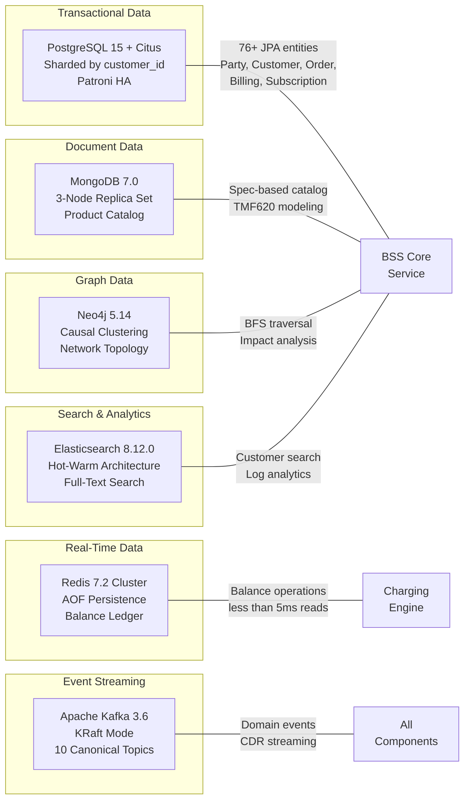

### 3.5.2 PostgreSQL 15 + Citus – قاعدة البيانات المستخدمة لإجراء المعاملات التجارية الأساسية

يعمل PostgreSQL كمخزن موثوق للبيانات في جميع كيانات نطاق BSS/OSS، حيث يتولى معالجة أعقد أنماط البيانات العلاقية في المنصة.

| خاصية/سمة | الإعدادات/التكوينات | الأدلة/البراهين |
| --- | --- | --- |
| النسخة/الإصدار | ١٥ (جبال الألب) | docker-compose.yml: postgres:15-alpine |
| تقسيم البيانات إلى أجزاء صغيرة | امتداد Citus، مقسم إلى أجزاء بواسطة customer\_id . | سياق استخدام المستخدم، helm/citus-postgresql/ |
| التوافر العالي | الباتروني مع النسخ المتزامن | سياق استخدام المستخدم |
| توبولوجيا الهيلم | عقدتان تنسيقيتان (100 جيجابايت) + 3 عقد عمل (500 جيجابايت) | helm/citus-postgresql/ |
| فئة التخزين | fast-ssd | helm/bss-core/values.yaml |
| أداة الهجرة/نقل البيانات | Flyway 10.6.0 مع لغة برمجة PostgreSQL | bss-core/pom.xml |
| المخطط/الهيكل | أكثر من 30 جدولًا: بيانات الحفلات، بيانات العملاء، بيانات الطلبات، الفواتير، بيانات الاشتراكات، بيانات المنتجات، وغير ذلك. | docs/data-models/database-schema.sql |
| النسخ الاحتياطي | WAL-G إلى MinIO (بشكل ساعي) | اعتبارات المتعلقة بالتنفيذ |
| الفهارس/المؤشرات | الرقم الوطني، رقم الهاتف، البريد الإلكتروني، المحافظة، الحالة، النوع، تاريخ الإنشاء | docs/data-models/database-schema.sql |
| الدوال/الوظائف | generate\_invoice\_number(), update\_account\_balance() | docs/data-models/database-schema.sql |

**نطاق التغطية:**

*   سجلات الحزب والعملاء الذهبية (TMF632/629)
*   الأوامر وتاريخ الدولة (TMF622/641/640)
*   حسابات الفوترة والفواتير وعمليات الدفع (TMF647/657/671)
*   الاشتراكات والإضافات
*   العناوين الجغرافية والمواقع الجغرافية (TMF653/656)
*   طلبات الدعم التقني (TMF645)
*   سجلات المراجعة (يجب الاحتفاظ بها لمدة 7 سنوات، وفقًا للشرط C-003)

> التباين الافتراضي في استخدام القواعد البيانات: يحدد الإعداد الافتراضي استخدام قاعدة بيانات MongoDB كقاعدة بيانات رئيسية. تم اختيار مزيج PostgreSQL + Citus لأن مجال الخدمات المالية يتطلب ضمانات قوية فيما يتعلق بخصائص ACID المتعلقة بالمعاملات المالية (الفواتير، المدفوعات)، بالإضافة إلى إمكانية إجراء استعلامات معقدة على أكثر من 76 كيانًا، مع الحفاظ على سلامة البيانات المرتبطة بالمفاتيح الأجنبية. كما يتم استخدام MongoDB لتخزين البيانات المتعلقة بالوثائق، حيث أن المرونة في هيكل البيانات هي الشرط الأساسي في هذه الحالة.

### 3.5.3 Redis 7 – التوازن في الأداء في الوقت الفعلي وخاصية التخزين المؤقت

يوفر Redis مستوى وصول إلى البيانات في غضون جزء من المللي ثانية، وهو ما يعتبر ضروريًا لعمليات حساب الرصيد في الوقت الفعلي، بالإضافة إلى عمليات التخزين المؤقت للبيانات على مستوى المنصة بأكملها.

| خاصية/سمة | الإعدادات/التكوينات | الأدلة/البراهين |
| --- | --- | --- |
| النسخة/الإصدار | 7 (النسخة المخصصة للمناطق الجبلية) / 7.2 (النسخة المخصصة للبيئات الإنتاجية) | deployment/docker-compose.yml: redis:7-alpine |
| الإصرار/المثابرة | ملف من نوع AOF (Append-Only File)، وهو ملف يُستخدم لضمان استمرارية بيانات الحسابات. | deployment/docker-compose.yml الإعدادات/التكوينات |
| سياسة الذاكرة | الحد الأقصى للذاكرة: 512 ميجابايت، ويتم التخلص من البيانات التي لم يتم الوصول إليها مؤخرًا باستخدام آلية allkeys-lru. | deployment/docker-compose.yml الإعدادات/التكوينات |
| وضع الإنتاج | Redis Cluster 7.2 | سياق استخدام المستخدم |
| زمن الاستجابة/التأخير في القراءة | <5 مللي ثانية لإجراء عمليات التحقق من التوازن. | متطلبات محرك الشحن |

**حالات الاستخدام:**

*   سجل ميزانية محرك الشحن: استرجاع البيانات المتعلقة بالميزانية، الحجز بناءً على قيمة TTL، التأكيد، الخصم، وإعادة التعبئة ( `charging-engine/internal/balance/service.go` )
*   القفل الموزع باستخدام تقنية Redis Redlock، وذلك بالنسبة لمنافذ الفايبر، ومجموعات العناوين الIP، ومعرفات VLAN (Saga Orchestration F-011)
*   خادم Kong Gateway المسؤول عن تحديد عدد الطلبات المسموح به في الدقيقة: 10,000 طلب/دقيقة.
*   تخزين البيانات المتعلقة بمصادقة المستخدمين في البوابة الإلكترونية

### 3.5.4 MongoDB 7.0 – نظام لتخزين الوثائق

| خاصية/سمة | الإعدادات/التكوينات | الأدلة/البراهين |
| --- | --- | --- |
| النسخة/الإصدار | 7.0 | deployment/docker-compose.yml: mongo:7.0 |
| وضع الإنتاج | 3-نواة مجموعات مزدوجة | سياق استخدام المستخدم |
| الاستخدام الرئيسي | تخزين كتالوج المنتجات (TMF620) | الميزة رقم F-005 |

يدعم نموذج الوثائق غير المنظم في MongoDB عملية نمذجة بيانات كتالوج المنتجات بطريقة تتوافق مع متطلبات كل نوع من أنواع الخدمات (مثل PSTN، FTTH، 4G، MPLS، الاستضافة على الإنترنت). حيث تختلف مواصفات المنتجات وأسعارها وقواعد تجميعها بشكل كبير بين أنواع الخدمات المختلفة. يسمح النموذج المرن في MongoDB بتطبيق قواعد الخصومات المتعلقة بتجميع المنتجات بين أنواع الخدمات المختلفة، دون الحاجة إلى قيود علاقاتية صارمة.

### 3.5.5 نيو4جي 5.14 – قاعدة بيانات الرسوم البيانية

| خاصية/سمة | الإعدادات/التكوينات | الأدلة/البراهين |
| --- | --- | --- |
| النسخة/الإصدار | 5.14 المجتمع (النسخة التجريبية)، الشركات (النسخة النهائية) | deployment/docker-compose.yml: neo4j:5.14-community |
| وضع الإنتاج | التجميع السببي (الإصدار المؤسسي) | سياق استخدام المستخدم |
| APOC | الإجراءات المطلوبة قد تم تفعيلها. | deployment/docker-compose.yml الإعدادات/التكوينات |
| هدف الاستعلام/الطلب | عملية التنقل باستخدام خوارزمية BFS عبر 5 خطوات: أقل من 10 مللي ثانية. | متطلبات الأداء |

يقوم نموذج Neo4j بمحاكاة تركيبة الشبكة الخاصة بجرد الموارد (TMF638) وجرد الخدمات (TMF639). كما يمثل النموذج مسارات الألياف الضوئية (OLT → PON → Splitter → ONT)، بالإضافة إلى تفاصيل الهياكل الثلاثية الأبعاد وبنية الشبكة الخاصة بنظام OSP (الخنادق والأنابيب المستخدمة في نقل الكابلات). يسمح نموذج الرسوم البيانية بهذا بتحليل التأثيرات الناتجة عن قطع الألياف الضوئية، حيث يمكن لعملية البحث في الشبكة تحديد جميع الخدمات والعملاء المتأثرين في غضون 10 مللي ثانية.

### 3.5.6 Elasticsearch 8.12.0 – البحث في النص الكامل والتحليلات الإحصائية

| خاصية/سمة | الإعدادات/التكوينات | الأدلة/البراهين |
| --- | --- | --- |
| النسخة/الإصدار | 8.12.0 | docker-compose.yml: docker.elastic.co/elasticsearch/elasticsearch:8.12.0 |
| وضع الإنتاج | الهندسة المعمارية الدافئة/المريحة من الناحية الحرارية | سياق استخدام المستخدم |
| التصور البصري/العرض البصري | كيبانا 8.12.0 | deployment/docker-compose.yml: docker.elastic.co/kibana/kibana:8.12.0 |

يوفر Elasticsearch إمكانية البحث في النصوص الكاملة ضمن بيانات العملاء (الاسم، العنوان، رقم الهوية الوطنية)، بالإضافة إلى تجميع السجلات الخاصة بمكتبة ELK، وتحليل البيانات. كما أن الهيكلية المستخدمة في التخزين تساعد في تقليل تكاليف التخزين، من خلال نقل البيانات القديمة إلى العقد الخاصة بالتخزين المؤقت.

### 3.5.7 أباتشي كافا – منصة لمعالجة البيانات الزمنية

يعمل Apache Kafka كالجهاز العصبي المركزي للمنصة، حيث يوفر البنية الأساسية القائمة على التفاعلات المرتبطة بالأحداث، وهو ما يساعد في فصل جميع الخدمات المختلفة عن بعضها البعض.

| خاصية/سمة | الإعدادات/التكوينات | الأدلة/البراهين |
| --- | --- | --- |
| صور التطوير | confluentinc/cp-kafka:7.5.0, confluentinc/cp-zookeeper:7.5.0 | docker-compose.yml |
| وضع الإنتاج | يتم إدارته بواسطة Strimzi، في وضع KRaft (بدون استخدام ZooKeeper). إصدار Kafka المستخدم: 3.6.1 | infrastructure/kafka/kraft-cluster.yaml |
| توبولوجیا | ٣ عقد تحكم + ٣ عقد وسيط (سعة تخزين البيانات لدى العقد الوسيط: ١٠٠ جيجابايت) | infrastructure/kafka/kraft-cluster.yaml |
| سجل النماذج/الهياكل | confluentinc/cp-schema-registry:7.5.0 ، أفرو مع دعم للإصدارات السابقة من البرنامج. | docker-compose.yml, shared/kafka/topic-definitions.yml |
| تخزين مدرج | MinIO لتخزين البيانات غير المستخدمة بشكل مؤقت | سياق استخدام المستخدم |

هيكل الموضوع (من `shared/kafka/topic-definitions.yml` ):

| الموضوع/المحور الرئيسي | التقسيمات/الأقسام | الاحتفاظ بالبيانات/المعلومات | معامل التكاثر | مستوى الإنتاجية/القدرة الاستيعابية |
| --- | --- | --- | --- | --- |
| party.events | 6 | 7 أيام | 3 | قياسي/معياري |
| catalog.events | 6 | 7 أيام | 3 | قياسي/معياري |
| order.events | 6 | 7 أيام | 3 | قياسي/معياري |
| service.events | 6 | 7 أيام | 3 | قياسي/معياري |
| resource.events | 6 | 7 أيام | 3 | قياسي/معياري |
| billing.events | 6 | 7 أيام | 3 | قياسي/معياري |
| usage.events | 12 | 7 أيام | 3 | عالي الإنتاجية/سريع الأداء |
| charging.events | 12 | 7 أيام | 3 | عالي الإنتاجية/سريع الأداء |
| alarm.events | 6 | 3 أيام | 3 | فترة تخزين قصيرة |
| events.dlq | 6 | ٣٠ يومًا | 3 | رسالة بلا معنى/رسالة عديمة الفائدة |

المجموعات الاستهلاكية: `party-mgmt-group` ، `catalog-mgmt-group` ، `order-mgmt-group` ، `charging-engine-group`

### 3.5.8 ملخص استراتيجية الحفاظ على البيانات

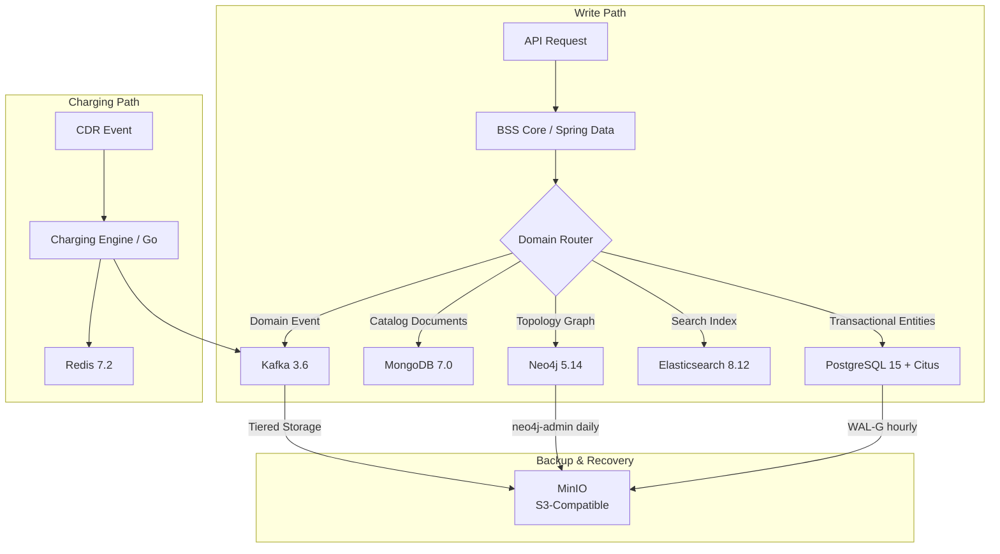

| الاستراتيجية | التنفيذ/التطبيق العملي | RPO | RTO |
| --- | --- | --- | --- |
| النسخ المتزامن | خدمات PostgreSQL Patroni (مجال الفوترة/تحصيل الرسوم) | ١٥ دقيقة | <30 دقيقة> |
| استمرارية البيانات في AOF | ريديس (سجل المعاملات المتوازن) | مستوى الاستقرار في التشغيل لكل ثانية | <10 ثوانٍ> |
| مجموعات النسخ المكررة/المستنسخة | MongoDB، 3 عقدة (كتالوج المنتجات) | قرب الصفر | الإعادة التأهيل الآلي |
| التجميع السببي | Neo4j Enterprise (تخطيط البيانات في نظام الإدارة المستودعات) | قرب الصفر | الإعادة التأهيل الآلي |
| نسخ البيانات في نظام كرافت | كافكا RF=3 (جميع المواضيع) | صفر (لا توجد أحداث مسجلة) | انتخاب القائد تلقائيًا |
| نسخة احتياطية من WAL-G | PostgreSQL → MinIO (كل ساعة) | ساعة واحدة | استعادة البيانات من النسخة الاحتياطية |

## 3.6 التطوير والنشر

### 3.6.1 استراتيجية الحاويات

جميع مكونات المنصة موجودة داخل حاويات باستخدام أداة Docker، ويتم بناء هذه الحاويات عبر عدة مراحل، وذلك لتقليل حجم الصورة الناتجة وبالتالي تقليل فرص التعرض للهجمات.

| جزء | صورة أساسية | المنافذ المكشوفة | بناء الاستراتيجية | الأدلة/البراهين |
| --- | --- | --- | --- | --- |
| خدمة النواة الأساسية لنظام BSS | eclipse-temurin:21-jre-alpine | 8080, 8443, 9090 | مرحلة واحدة (JAR مبتدئ) | deployment/Dockerfile |
| محرك التيار | golang:1.22-alpine → alpine:3.19 | 8081 | متعدد المراحل (نسخة ثنائية ثابتة، CGO\_ENABLED=0) | charging-engine/Dockerfile |
| جهاز رصد | node:20-alpine (2 مراحل) | 3000 | متعدد المراحل: (npm ci → nest build → production) | api-gateway/Dockerfile |
| الساحات المفتوحة | nginx:alpine | 80 (يتم تخصيصه للقيم من 3001 إلى 3004) | ملفات ثابتة مبسطة مسبقة مع ترجيح للاستعمال | deployment/ إعدادات نظام Nginx |
| كينگ غيتا | kong:latest | 8000, 8001, 8444 | الإعدادات الإعلانية ( KONG\_DATABASE: "off" ) | deployment/docker-compose.yml |

**أمن الحاويات:**

*   جميع الصور المستخدمة أثناء التشغيل تعتمد على نظام ألبين لينكس كأساس، وذلك لتقليل مساحة الهجوم المحتملة إلى الحد الأدنى.
*   تم تجميع محرك الشحن كملف ثنائي ثابت، بحيث لا يحتاج إلى أي مكونات إضافية أثناء التشغيل.
*   تنفيذ الحاويات غير الجذرية يتم بشكل إلزامي من خلال ميزة Kubernetes SecurityContext.
*   يتم فحص جميع الصور بشكل دقيق قبل إرسالها إلى الهاربور (سياسة عدم السماح بوجود أي أخطاء من النوع “خطير” أو “عالي”).

### 3.6.2 تنسيق الحاويات – كوبرنيتيس (Kubernetes)

| خاصية/سمة | الإعدادات/التكوينات | الأدلة/البراهين |
| --- | --- | --- |
| توزيع | RKE2/k3s على الأجهزة الفعلية أو على بيئة vSphere. | سياق استخدام المستخدم |
| توبولوجيا العقد | ٣ عقد رئيسية + ٦ عقد عمل في كل موقع. | القيد A-006 |
| متعدد المواقع | بنية توزيعية نشطة-نشطة على 3 مواقع | سياق استخدام المستخدم |
| اسم نطاق | bss-oss مع علامة الحقن الخاصة بـ Istio | infrastructure/kubernetes/ يظهر بشكل واضح. |
| إصدار الـ API | التكيف التلقائي مع الحمل/الإصدار الثاني (HPA)، السياسات المتعلقة بإدارة البيانات/الإصدار الأول (PDB) | infrastructure/kubernetes/ |

موارد كوبرنيتيس (من `infrastructure/kubernetes/` – 5 ملفات من نوع “manifest”):

*   النشرات التي تخضع لقيود على الموارد، بالإضافة إلى اختبارات للتحقق من جاهزية النظام للعمل.
*   الخدمات المتعلقة بتوجيه البيانات بين المكونات المختلفة (ClusterIP، NodePort).
*   HorizontalPodAutoscalers (autoscaling/v2) با آلية التوسعة القائمة على استخدام وحدات المعالجة المركزية.
*   ميزانيات التخفيف من الآثار السلبية الناتجة عن عمليات التحديث التدريجي، من أجل ضمان سلامة هذه العمليات.
*   سياسات الشبكة الخاصة بعزل حركة المرور على مستوى اسم المساحة.
*   ConfigMaps وSecrets لتخزين الإعدادات خارجيًا

إعدادات التوسع التلقائي (من `helm/bss-core/values.yaml` و `infrastructure/kubernetes/` ):

| الخدمات | عدد النسخ المنخفض جداً. | أقصى عدد من نسخ | هدف جهاز الرسومات | KEDA تحرير |
| --- | --- | --- | --- | --- |
| اپی-گایت‌ویچ | 3 | 10 | 70% | پروماتيسم: http\_requests\_total > 1000 |
| بِسِس-كُور | 3 | 20 | 70% | پروماتيسم: hikaricp\_connections\_active > 80 |
| محرك لشحن | 5 | 50 | 60% | كافا لاغ: bss.billing.charges > 100 |
| خدمه العملاء | 3 | 10 | — | HPA فقط. |
| خدمه فحص | 3 | 15 | — | HPA فقط. |
| خدمه حجز | 3 | 15 | — | HPA فقط. |

KEDA (Kubernetes Event-Driven Autoscaling) يعمل على توسيع إمكانيات نظام HPA الأصلي، من خلال استخدام آليات التوسع القائمة على الأحداث. يتم تثبيت KEDA من خلال مستودع `kedacore/keda` Helm، وفقًا للإعدادات المحددة في `helm/deploy.sh` .

### 3.6.3 شبكة الخدمات – Istio 1.20 Ambient

| خاصية/سمة | الإعدادات/التكوينات | الأدلة/البراهين |
| --- | --- | --- |
| الملف الشخصي | بيئة شبكية غير متصلة بأي جهاز إضافي/شبكة بدون أجهزة إضافية. | infrastructure/istio/istio-config.yaml |
| وضعية mTLS | صارم (خاصية PeerAuthentication في مساحة الأسماء bss-oss ) | infrastructure/istio/istio-config.yaml |
| الهوية | SPIFFE: أداة للمصادقة بين الخدمات المختلفة. | infrastructure/istio/istio-config.yaml |
| التفويض/الإذن | بوابة الواجهة البرمجية API Gateway تستخدم نظام SPIFFE لإدارة هويات المستخدمين؛ الطرق المتاحة لإرسال الطلبات هي: GET، POST، PUT، DELETE، PATCH. | infrastructure/istio/istio-config.yaml |
| تتبع/تعقب المسارات/الخطوات المتخذة. | معدل أخذ العينات: 100% | infrastructure/istio/istio-config.yaml |
| سجلات الوصول | تنسيق الإخراج إلى الشاشة/الملف الناتج | infrastructure/istio/istio-config.yaml |
| موارد الطيارين | ٥٠٠ ميجاهرتز من سرعة المعالج، ٢ جيجابايت من الذاكرة. | infrastructure/istio/istio-config.yaml |

### 3.6.4 بوابة الواجهة البرمجية للتطبيقات – Kong 3.5

| خاصية/سمة | الإعدادات/التكوينات | الأدلة/البراهين |
| --- | --- | --- |
| وضعية التنفيذ/الاستخدام | إعلاني/توضيحي ( KONG\_DATABASE: "off" ) | infrastructure/kong/kong-config.yaml |
| تحديد حدود المعدلات/السرعة في الاستخدام | ١٠,٠٠٠ طلب في الدقيقة، مع استخدام نظام التخزين المدعوم بخدمة Redis. | infrastructure/kong/kong-config.yaml |
| OAuth2 | النطاقات: tmf:read ، tmf:write ، tmf:admin ؛ مدة صلاحية الرمز: 3600 ثانية. | infrastructure/kong/kong-config.yaml |
| الدخول/الوصول | المضيف: api.yemenptc.com ، بادئة المسار: / ، الخادم الرئيسي: api-gateway:3000 | infrastructure/kong/kong-config.yaml |

### 3.6.5 أنابيب العمليات CI/CD

تستخدم المنصة نظامين مختلفين لإدارة دورة حياة التطبيقات: GitLab CI كنظام أساسي، وGitHub Actions كنظام ثانوي. هذا يساعد على تحقيق الاستقرار في أداء المنصة، كما يسمح بإدارة مختلف مراحل دورة حياة التطبيقات بشكل فعال.

#### خط أنابيب GitLab CI (الرئيسي)

المصدر: `.gitlab-ci.yml`

| مرحلة | الأنشطة/الفعاليات | الإعدادات الأساسية/التكوينات الأساسية |
| --- | --- | --- |
| بناء | Maven 3.9 + Temurin JDK 21، Docker 24-dind | مخزن بيانات مافن: .m2/repository/ |
| اختبار/تجربة | اختبارات الوحدة ( mvn test )، اختبارات الاندماج | حاويات الخدمات: PostgreSQL، Redis، Kafka |
| الأمن/الحماية | معايير OWASP ZAP الأساسية، فحص الاعتمادات في OWASP | الفشل في تحقيق النتائج الأساسية/الحاسمة. |
| جودة | تحليل SonarQube، معدل تغطية الكود بواسطة أداة JaCoCo | تطبيق معايير الجودة بشكل صارم |
| neghbat-dev | kubectl apply مع التحقق من صحة عملية النشر. | البيئة: بيئة التطوير |
| نشر في المرحلة التجريبية/الاختبارية | kubectl apply مع التحقق من صحة عملية النشر. | البيئة: مرحلة الاختبار. |
| تعميم | kubectl apply مع التحقق من صحة عملية النشر. | البيئة: الإنتاج (التحكم اليدوي في العمليات). |

#### خط أنابيب GitHub Actions (الخط الثانوي)

المصدر: `.github/workflows/ci-cd.yml`

| وظائف | وقت التشغيل/الفترة الزمنية اللازمة لتنفيذ البرنامج. | الأنشطة/الفعاليات |
| --- | --- | --- |
| تجهيز و تجربة جافا | JDK 21 (تيمورين) / مافن | مجموعة أدوات تجميع واختبار نواة BSS |
| ذهب لبناء وتجربة | غو 1.22 | تجميع واختبار محرك الشحن |
| NestJS بیج | نودجس 20 | تجميع واختبار بوابة الواجهة البرمجية للتطبيقات (API Gateway) |
| بناء الواجهة الأمامية باستخدام React | نودجس 20 | بنية إنتاج بوابة العملاء |
| بناء وتحميل دوكر | docker/build-push-action@v5 | بناء صورة مكونة من عناصر متعددة → GHCR ( ghcr.io/yemenptc ) |
| نشر النظام في المرحلة التجريبية. | kubectl | نشر البيئة التجريبية/الاختبارية |

محفزات: إرسال الطلبات إلى الفروع `main` / `develop` ، وإرسال طلبات الدمج إلى `main` . وسم الصورة: `latest` بالإضافة إلى رقم التحديث SHA، وذلك لتسهيل تتبع العمليات.

#### خطوط الأمان/الإجراءات الأمنية

المصدر: `.github/workflows/security.yml`

| أداة/وسيلة للقيام بالمهمة. | جدول | العتبة/الحد الأدنى |
| --- | --- | --- |
| سنيك | 每周 cron + push إلى main/develop | شدة عالية |
| تريفي | 每周 cron + push إلى main/develop | حرج/عالي: النظام سيفشل في العمل إذا تم العثور على هذه المشكلة. |
| سيمجريب (Semgrep) | 每周 cron + push إلى main/develop | حزم قواعد SAST الخاصة بلغة جافا وإطار عمل سبرينج. |

#### خطوط اختبار الأحمال

المصدر: `.github/workflows/load-test.yml`

| اختبار/تجربة | المستخدمون الافتراضيون | مدى | أداة/وسيلة للقيام بالمهمة. |
| --- | --- | --- | --- |
| اختبار تحميل واجهة برمجة التطبيقات الخاصة بالحزب/المنظمة | 100 وحدة تقييم. | 5 دقائق | k6 |
| اختبار تحميل واجهة برمجة التطبيقات | 50 وحدة تقييم. | 5 دقائق | k6 |
| اختبار حمل الـ API أثناء عملية الشحن | 200 وحدة تقييمية | 5 دقائق | k6 |

يتم تنفيذ العملية يوميًا في الساعة 2:00 صباحًا، مع إمكانية التحكم اليدوي في تنفيذ العملية. كما يتم استخدام خطط اختبار Apache JMeter لدعم عملية الاختبار.

### 3.6.6 GitOps والتوصيل المستمر للتغييرات – ArgoCD

| خاصية/سمة | الإعدادات/التكوينات | الأدلة/البراهين |
| --- | --- | --- |
| مجموعة التطبيقات/البرامج | يقوم بإنشاء تطبيقات خاصة بكل من bss-core، وcharging-engine، وapi-gateway. | infrastructure/argocd/appset.yaml |
| سياسة التسويق | تم التشغيل التلقائي باستخدام أدوات prune، selfHeal، وCreateNamespace. | infrastructure/argocd/appset.yaml |
| حاول مرة أخرى. | التأخير التصاعدي | infrastructure/argocd/appset.yaml |
| AppProject | bss-oss مع قيود على الوصول إلى المستودعات وأسماء المساحات. | infrastructure/argocd/appset.yaml |

> التباين الافتراضي في الهيكل الخاص بالبنية التحتية: يحدد الإعداد الافتراضي استخدام أداة Terraform لإدارة البنية التحتية ككود. لكن في الواقع، يتم استخدام أدوات مثل Helm Charts وKubernetes YAML manifests بالإضافة إلى ArgoCD GitOps لإدارة البنية التحتية. وذلك لأن نموذج النشر المستخدم على الأجهزة المحلية أو على منصة vSphere لا يحتوي على واجهة برمجية خاصة بمزود الخدمات السحابية، وهو ما تحتاجه أداة Terraform للعمل بشكل صحيح. توفر أداة ArgoCD طريقة فعالة لإدارة البنية التحتية، حيث تعتمد على أداة Git في إدارة التغييرات، وتعمل ضمن عنقود Kubernetes نفسه.

### 3.6.7 أنظمة البناء/التطوير

| جزء | نظام البناء/التطوير | أمر/تعليمات | إعصار |
| --- | --- | --- | --- |
| الشبكة الأساسية | مافن 3.9 | mvn clean package | target/\*.jar |
| محرك التيار | اذهب وابدأ العمل. | CGO\_ENABLED=0 GOOS=linux go build -o /app ./cmd/server | /app بيانات ثنائية ثابتة |
| جهاز رصد | npm/NestJS CLI | npm ci && nest build | dist/main.js |
| بوابة العملاء | npm/Vite | npm ci && npm run build | dist/ الأصول الثابتة/الموارد الثابتة |
| بوابات المشغلين | npm/CRA | npm ci && npm run build | build/ الأصول الثابتة/الموارد الثابتة |

### 3.6.8 رسومات التوجيه/الإرشادات المتعلقة بالخوذات

يستخدم نموذج النشر رسومات Helm لضمان إصدارات موحدة وقابلة للتكرار في بيئات التطوير والاختبار والإنتاج.

الرسوم البيانية الشاملة (من `helm/` ):

| رسم بياني/جدول بيانات | النسخة/الإصدار | الاعتمادات/المتطلبات الخارجية | الأدلة/البراهين |
| --- | --- | --- | --- |
| bss-core | — | ٣ اعتمادات فرعية للرسوم البيانية الفرعية (الخدمات الأساسية) | helm/bss-core/Chart.yaml |
| monitoring | — | بروميثيوس 25.0.0، جرافانا 7.0.0، أليرتمانيجر 1.0.0 | helm/monitoring/Chart.yaml |
| citus-postgresql | — | توبولوجيا منسق/العامل في نظام Citus | helm/citus-postgresql/ |

مستودعات الهيلم الخارجية (من `helm/deploy.sh` ):

| مستودع البيانات/الملفات | URL | الرسوم البيانية المستخدمة |
| --- | --- | --- |
| مجتمع بروميثيوس | https://prometheus-community.github.io/helm-charts | بروميثيوس v25.0.0، أليرتمانيجر v1.0.0 |
| جرافانا | https://grafana.github.io/helm-charts | جرافانا، الإصدار 7.0.0 |
| كيداكوري | https://kedacore.github.io/charts | كيدا |
| بيتنامي | https://charts.bitnami.com/bitnami | الخدمات المشتركة |

### 3.6.9 بنية التحتية الخاصة بالاختبار وضمان الجودة

| التصنيف/الفئة | أداة/وسيلة للقيام بالمهمة. | النسخة/الإصدار | الغرض/الهدف | الأدلة/البراهين |
| --- | --- | --- | --- | --- |
| اختبار الوحدة | JUnit 5 / ضمان النجاح في التنفيذ | تم التحكم في الوضع. | تنفيذ اختبارات الوحدات في لغة جافا | bss-core/pom.xml |
| اختبار الاندماج | Testcontainers | 1.19.3 | حاويات PostgreSQL وKafka لإجراء اختبارات الاندماج. | bss-core/pom.xml |
| قاعدة بيانات داخلية | H2 | تم التحكم في الوضع. | قاعدة بيانات خفيفة الوزن لاختبارات الوحدات | bss-core/pom.xml |
| السخرية/الاستهزاء | موكيتو | تم التحكم في الوضع. | طبقة الخدمات: عملية محاكاة العمليات المتعلقة بالخدمات. | bss-core/pom.xml |
| اختبارات تحميل | k6 | أحدث/الجديد منها | اختبار أداء الواجهة البرمجية للتطبيق (100–200 وحدة استخدام في الثانية) | .github/workflows/load-test.yml |
| اختبارات تحميل | أپاخي جيتمير | — | خطط تحميل شاملة/خطط لتوزيع الأحمال بشكل كامل | deployment/tests/ |
| هندسة الفوضى | LitmusChaos | — | تجارب متعلقة بعمليات الحذف، وزمن الاستجابة في الشبكة، واستهلاك وحدة المعالجة المركزية. | infrastructure/chaos/chaos-engines.yaml |
| معايير الأداء/مقاييس الأداء | بايثون مخصص/مُعدل حسب الحاجة | — | التحقق من صحة عملية معالجة بيانات الأحداث التي تبلغ قيمتها 50 مليون. | benchmark/performance\_benchmark.py |

تجارب هندسة الفوضى (من `infrastructure/chaos/chaos-engines.yaml` ):

| الهدف/الغاية | تجربة | مدى | ارقام |
| --- | --- | --- | --- |
| بِسِس-كُور | حذف | 60 ثانية | اختبار حالة الاتصال عبر بروتوكول HTTP في حالة حدوث أي أعطال. |
| بِسِس-كُور | بطارية الشبكة | 120 ثانية | زمن الاستجابة: 300 مللي ثانية. |
| بِسِس-كُور | الجهاز المحمول | 60 ثانية | تم استهلاك نواة واحدة فقط. |
| محرك لشحن | حذف | 60 ثانية | التحقق من صحة عملية الاستعادة |
| محرك لشحن | بطارية الشبكة | 120 ثانية | زمن الاستجابة: 100 مللي ثانية. |

### 3.6.10 مكونات نظام القابلية للمراقبة

توفر بنية الرقابة والمراقبة رؤية شاملة لجميع مكونات المنصة، مما يساعد في تحقيق هدف التغطية الكاملة لعمليات المنصة بنسبة تزيد عن 95% (وفقًا لمعايير الجودة QG-7). كما توفر البنية أكثر من 25 لوحة تحكم لمراقبة أداء المنصة.

| جزء | النسخة/الإصدار | الغرض/الهدف | الأدلة/البراهين |
| --- | --- | --- | --- |
| پروماتيسم | الإصدار 2.50.0 | جمع البيانات الإحصائية وإرسال التنبيهات ذات الصلة (يتم الاحتفاظ بالبيانات لمدة 15 يومًا أثناء فترة التطوير، ولمدة 30 يومًا بعد ذلك). | deployment/docker-compose.yml ، helm/monitoring/Chart.yaml (الإصدار 25.0.0) |
| Grafana | 10.3.0 | تصورات البيانات على لوحة التحكم (أكثر من 25 لوحة تحكم خاصة بنظامي BSS وOSS، بالإضافة إلى معدلات تنفيذ الخدمات وفقاً لمعايير SLA). | deployment/docker-compose.yml ، helm/monitoring/Chart.yaml (الإصدار 7.0.0) |
| ألертمانجر | (الرسم البياني، الإصدار 1.0.0) | التوجيه حسب درجة الخطورة: الحالات الخطيرة → PagerDuty، التحذيرات → Slack، المعلومات العادية → SMTP. | helm/monitoring/Chart.yaml |
| كيبانا | 8.12.0 | تصور البيانات واستكشاف محتويات Elasticsearch | deployment/docker-compose.yml |
| OpenTelemetry | 1.34.1 | واجهة برمجة التطبيقات/مجموعة أدوات التطوير الخاصة بالتتبع الموزع، مع خاصية التسجيل التلقائي للبيانات باستخدام أداة Spring Boot. | bss-core/pom.xml |
| ميكرومتر | تم التحكم في الوضع. | تصدير معايير أداء الـ JVM والتطبيقات إلى Prometheus | bss-core/pom.xml |

**إعدادات Grafana:**

*   مصادر البيانات: Prometheus، Loki، Tempo
*   الدخول: `grafana.yemenptc.com` مع إنهاء عملية التواصل باستخدام بروتوكول TLS.
*   أكثر من 25 لوحة تحكم: نظرة عامة على أنظمة BSS/OSS، معدلات تنفيذ الخدمات وفقاً لمعايير SLA، المؤشرات المالية للشركة، أوقات الانتظار في نظام Kafka، وأداء نظام التحصيل.

قواعد التنبيهات الخاصة ببرنامج Prometheus (من `deployment/monitoring/` ):

*   8+ قواعد خاصة بنظام BSS، تتعلق بفشل عمليات الطلبات، وفشل عمليات الدفع، وحالة نظام التحكم في التدفق، وعتبات التأخير في التنفيذ، بالإضافة إلى تأخر استقبال البيانات من خدمة Kafka، واكتظاظ حوض اتصالات قاعدة البيانات.
*   الأهداف المراد استخراج البيانات منها: BSS Core (الجزء المسؤول عن تنفيذ الأوامر)، API Gateway، Kafka (JMX)، PostgreSQL (الجزء المسؤول عن تصدير البيانات)، Redis (الجزء المسؤول أيضًا عن تصدير البيانات).

## 3.7 ملخص مكونات التقنية المستخدمة

### 3.7.1 المصفوفة الكاملة للإصدارات

| التصنيف/الفئة | التكنولوجيا | النسخة/الإصدار | ترخيص/إذن الاستخدام |
| --- | --- | --- | --- |
| اللغات | جافا | 21 (LTS) | GPL الإصدار 2 + CPE |
|  | اذهب. | 1.22 | شروط استخدام BSD، البند الثالث |
|  | تايبسكريبت | 5.3+ | أباتشي 2.0 |
|  | بايثون | 3.x | رخصة PSF |
| الأطر الأساسية/الهياكل الأساسية | سبرينج بوت | 3.2.0 | أباتشي 2.0 |
|  | نست جي اس | 10.3.0+ | MIT |
|  | ريأكت | 18.2.0 | MIT |
|  | جين | 1.9.1 | MIT |
|  | بسرعة. | 5.0.0 | MIT |
| قواعد البيانات | PostgreSQL + Citus | 15 | رخصة استخدام PostgreSQL |
|  | ريديس | 7.2 | شروط استخدام BSD، البند الثالث |
|  | مونجو دي بي | 7.0 | SSPL |
|  | نيو4جي | 5.14 (المجتمع/الشركات) | GPL v3 / الاستخدام التجاري |
|  | إيلاستيكسيرش | 8.12.0 | رخصة إلستيك 2.0 |
| الرسائل النصية/التواصل عبر الرسائل | أباتشي كافا | 3.6.1 (كرافت) | أباتشي 2.0 |
|  | سجل البنية الموحدة للبيانات | 7.5.0 | رخصة مجتمع كونفلوينت |
| التنسيق الموسيقي/الترتيب الموسيقي | Temporal.io | 1.22.3 | MIT |
|  | كوبرنيتيس | 1.29 (RKE2/k3s) | أباتشي 2.0 |
| شبكة الخدمات | إيستيو | 1.20 (البيئة المحيطة) | أباتشي 2.0 |
| جهاز رصد | كونغ | 3.5 | أباتشي 2.0 |
| الهوية | كيكلاوك | (محليًا/داخل الشبكة المحلية) | أباتشي 2.0 |
| أسرار | HashiCorp Vault | (الجزء الخلفي من نظام الرفوف) | BUSL 1.1 |
| السجلات/البيانات المسجلة | ميناء/مرفأ | 2.10 | أباتشي 2.0 |
| جيت أوپس | ArgoCD | — | أباتشي 2.0 |
| التوسع التلقائي للقدرات الحاسوبية | KEDA | — | أباتشي 2.0 |
| قابلية ملاحظة | پروماتيسم | الإصدار 2.50.0 | أباتشي 2.0 |
|  | Grafana | 10.3.0 | AGPL الإصدار 3 |
|  | OpenTelemetry | 1.34.1 | أباتشي 2.0 |
| القدرة على التكيف/المرونة | القدرة على التكيف4j | 2.2.0 | أباتشي 2.0 |
| الفوضى | LitmusChaos | — | أباتشي 2.0 |

### 3.7.2 ملخص تباينات القائمة الافتراضية

يوضح الجدول التالي جميع الاختلافات عن مجموعة التقنيات الافتراضية التي حددها المستخدم، مع تقديم أسباب هذه الاختلافات بناءً على متطلبات المنصة من الناحية التقنية.

| التصنيف/الفئة | المواصفات الافتراضية | التنفيذ الفعلي | التبرير/الأسباب الموجبة لذلك |
| --- | --- | --- | --- |
| منصة السحابة الإلكترونية | AWS | الاستخدام المحلي (الحوسبة المباشرة على الأجهزة/نظام vSphere) | القيد C-001: يجب أن يتم التطبيق في بيئة منفصلة عن الشبكة الخارجية؛ لا يجوز الاعتماد على الخدمات السحابية الخارجية. |
| لغة البرمجة المستخدمة في الجانب الخلفي من النظام | بايثون / فلاسك | جافا 21 / سبرينج بوت 3.2 + جو 1.22 + تايبسكريبت / نيستجيس + بايثون | البنية المعمارية متعددة اللغات: يتم استخدام لغة جافا لتنفيذ منطق الأعمال في النظام (76 كيانًا من نوع JPA)، ولغة Go لتنفيذ عمليات الشحن في أقل من 50 مللي ثانية، ولغة NestJS لتنظيم الواجهات البرمجية الخاصة بالنظام، أما لغة بايثون فهي تُستخدم لمعالجة بيانات العملاء وتطبيقات التعلم الآلي. |
| قاعدة البيانات الأساسية | مونجو دي بي | PostgreSQL 15 + Citus (النظام الأساسي لإدارة البيانات) + MongoDB 7.0 (نظام إدارة الفهارس) + Neo4j 5.14 + Redis 7.2 + Elasticsearch 8.12 | الاستمرارية في التعامل مع البيانات بلغات متعددة: ضمانات معيار ACID للبيانات المالية، واستخدام نموذج الرسوم البيانية لتنظيم البيانات، بالإضافة إلى استخدام خوادم تخزين الوثائق لتحقيق مرونة أكبر في إدارة البيانات. |
| المصادقة/إثبات الهوية | Auth0 | Keycloak (داخل المبنى) | القيد C-001: يمنع الاعتماد على خدمات SaaS في البيئات التي يكون فيها هناك فصل كامل بين الشبكات. |
| إطار عمل CSS | TailwindCSS | MUI 5 + استخدام أنماط CSS داخل كود JS للتحكم في المشاعر/العواطف في التصميم | مكونات جاهزة وسهلة الاستخدام لمواقع الاتصالات؛ دعم اللغة العربية بترتيب الحروف من اليمين إلى اليسار. |
| CI/CD | غيثب أکشنز | GitLab CI (الخيار الأساسي) + GitHub Actions (الخيار الثانوي) | خطوط أنابيب مزدوجة لضمان الاستمرارية في العمليات؛ حيث يُستخدم GitLab CI كخط أنابيب لنشر التطبيقات في البيئة الإنتاجية. |
| IaC | تيرافورم | رسومات Helm + ملفات YAML الخاصة بـ Kubernetes + أداة ArgoCD لإدارة البيانات باستخدام نظام GitOps | لا يوجد واجهة برمجية خاصة بمزودي الخدمات السحابية؛ حيث أن أدوات مثل Helm/ArgoCD جزء أساسي من بيئة Kubernetes نفسها. |
| إطار عمل الذكاء الاصطناعي | لانجتشين | خط أنابيب معالجة البيانات باستخدام لغة بايثون وتقنيات التعلم الآلي، حسب الحاجة. | نماذج للكشف عن عمليات الاحتيال والتنبؤ بانسحاب العملاء، مخصصة لكل منصة على حدة؛ لا حاجة إلى استخدام أنظمة LLM في تنفيذ هذه النماذج. |
| الهواتف المحمولة | ريأكت-نيتيف | لم يتم تطبيقه بعد (فقط عبر البوابات الإلكترونية). | البوابات الإلكترونية عبارة عن تطبيقات تعمل عبر المتصفحات، ولا يوجد حاجة إلى استخدام أجهزة محمولة خاصة لاستخدام هذه التطبيقات في الوقت الحالي. |
| التعبئة في حاويات | دوكر | دوكر (تم التأكيد) | متوافق مع الإعدادات الافتراضية. |
| الواجهة الأمامية/الجزء الظاهر من البرنامج | التفاعل مع TypeScript | ريأكت 18 مع تايبسكريبت 5.3 (مؤكد) | متوافق مع الإعدادات الافتراضية (الإطار العام متشابه، لكن أدوات البناء مختلفة: Vite/CRA مقابل أدوات أخرى غير محددة). |

#### مراجع

*   `bss-core/pom.xml` – قائمة الاعتمادات الخاصة بـ Maven: جافا 21، سبرينج بوت 3.2.0، بالإضافة إلى أكثر من 40 اعتمادًا آخر مع تحديد إصداراتها.
*   `charging-engine/go.mod` — ملف تعريف وحدة البرنامج في لغة Go: إصدار Go 1.22، 4 اعتمادات مباشرة.
*   `charging-engine/Dockerfile` – عملية بناء البرنامج بخطوات متعددة: من إصدار golang:1.22-alpine إلى إصدار alpine:3.19
*   `api-gateway/package.json` – NestJS 10.3.0+ مع TypeScript 5.3.3؛ 10 اعتمادات إنتاجية.
*   `frontend/package.json` — ريك 18.2.0، فيت 5.0.0، تيسلس 5.3.0
*   `deployment/portal/package.json` — MUI 5.14.18، Chart.js 4.4.1، react-scripts 5.0.1
*   `deployment/Dockerfile` — حاوية نواة BSS: eclipse-temurin:21-jre-alpine
*   `deployment/docker-compose.yml` – خدمة كاملة تشمل أكثر من 15 أداة، بالإضافة إلى جميع إصدارات قواعد البيانات.
*   `docker-compose.yml` – البنية التحتية الخاصة بالتطوير: PostgreSQL 15، Redis 7، Kafka 7.5.0، Elasticsearch 8.12.0
*   `shared/kafka/topic-definitions.yml` – 10 مواضيع رئيسية، 4 مجموعات من المستهلكين، سياسات التقسيم والاحتفاظ بالبيانات.
*   `infrastructure/istio/istio-config.yaml` – ملف تعريف الشبكة الخاصة بالبيئة المحيطة، استخدام بروتوكول mTLS بشكل صارم، بالإضافة إلى استخدام بروتوكول SPIFFE لتحديد الهوية.
*   `infrastructure/kafka/kraft-cluster.yaml` — كراكت سريمزي: 3 مراقب + 3 مراقب
*   `infrastructure/kong/kong-config.yaml` — كونگ مبتدئ: قيود مقداری، OAuth2، روتینیت داخلی
*   `infrastructure/kubernetes/` — 5 ملفات توضيحية: ملفات النشر، وملفات HPAs، وملفات PDB، وملفات NetworkPolicies.
*   `infrastructure/argocd/appset.yaml` — تطبيق لتسريع التسجيل في GitOps
*   `infrastructure/chaos/chaos-engines.yaml` – تجارب LitmusChaos المتعلقة بكل من bss-core وcharging-engine
*   `helm/bss-core/Chart.yaml` – رسم بياني شامل 3 عناصر مرتبطة ببعضها البعض.
*   `helm/bss-core/values.yaml` – إعدادات الإنتاج: تعديل إعدادات متصفح التنفيذ JVM، التوسع التلقائي، وإدارة البيانات.
*   `helm/monitoring/Chart.yaml` — Prometheus 25.0.0، Grafana 7.0.0، Alertmanager 1.0.0
*   `helm/deploy.sh` – سكريبت لتسجيل مستودع Helm الخارجي ونشره.
*   `helm/citus-postgresql/` – مسؤول/عامل تنسيق العمليات في Helm Chart
*   `.gitlab-ci.yml` — 7 مرحلة لاستيراد وتصدير البيانات مع مراقبة أمان ومحورات جودة
*   `.github/workflows/ci-cd.yml` — مخزن GitHub Actions متعدد العناصر
*   `.github/workflows/security.yml` – سلسلة العمليات الأمنية المكونة من أدوات Snyk وTrivy وSemgrep
*   `.github/workflows/load-test.yml` — k6 يوميًا اختبارات وزن
*   `cdrmspipeline/orchestrator.py` – أداة لتنسيق عمليات معالجة البيانات باستخدام لغة بايثون وتقنية CDR.
*   `benchmark/performance_benchmark.py` – معيار أداء الأحداث الخاصة بالـ 50 مليون مستخدم
*   `migration/` — النظام الفرعي لمعالجة البيانات في لغة جافا: أدوات استخراج البيانات، وأدوات تحويل البيانات، بالإضافة إلى أدوات تنسيق البيانات.
*   `docs/data-models/database-schema.sql` — تعريفات هيكل قاعدة البيانات PostgreSQL
*   `README.md` – نظرة عامة على التكنولوجيا المستخدمة وهيكل المشروع

# 4\. رسم بياني لتسلسل العمليات

يوفر هذا القسم معلومات شاملة ومرئية حول جميع عمليات التنفيذ داخل منصة PTC BSS/OSS في اليمن. يوضح كل رسم بياني الخطوات التي يتم اتخاذها من بداية العملية حتى انتهائها، بما في ذلك نقاط اتخاذ القرارات، حدود النظام، طرق التعامل مع الأخطاء، التغييرات في حالة النظام، وتسلسل العمليات المختلفة. جميع الرسوم البيانية مبنية على الكود المستخدم في تنفيذ النظام، وهي تعكس بالفعل منطق التنفيذ، وهيكل الأحداث، وأنماط التعامل مع الأخطاء في الوحدات الأربعة التي يتكون منها النظام: BSS Core (Java/Spring Boot)، Charging Engine (Go)، CDR Mediation Pipeline (Python)، وAPI Gateway (NestJS).

* * *

## 4.1 سير العمل في النظام على المستوى العالي

### 4.1.1 هندسة العمليات من البداية إلى النهاية

تعمل المنصة من خلال ثلاث سلاسل عمليات رئيسية، وهي مجتمعة ما يوفر القدرات اللازمة لإدارة شبكات الاتصالات لأكثر من 50 مليون مشترك. هذه السلاسل هي: سلسلة العمليات المتعلقة بطلبات الخدمات وتفعيلها، وسلسلة العمليات المتعلقة باستخدام الخدمات وتحصيل الأموال، بالإضافة إلى سلسلة العمليات المتعلقة بمعالجة المشاكل التي قد تحدث في الشبكة. ترتبط كل هذه السلاسل مع بعضها البعض عبر نظام Apache Kafka، وهو نظام لنقل الرسائل بشكل غير متزامن ومنفصل عن بعضه البعض، كما هو موضح في `shared/kafka/topic-definitions.yml` .

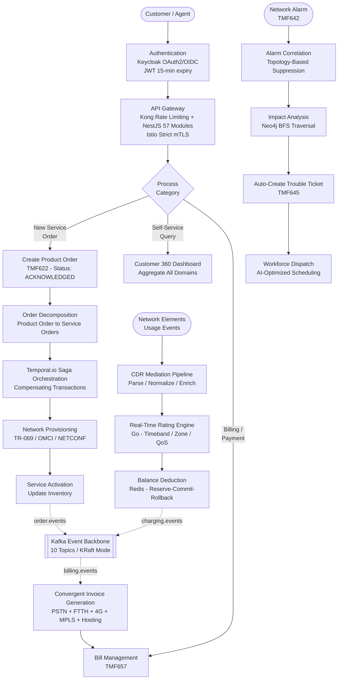

يوضح الرسم البياني أعلاه كيف يتم استقبال طلبات العملاء أو الوكلاء من خلال بوابة الواجهة البرمجية المحمية بواسطة Keycloak (الميزة F-028)، ثم يتم توجيه هذه الطلبات إلى العمليات المناسبة. بعد ذلك، تمر الطلبات عبر سلاسل العمل الخاصة بكل مجال، قبل أن يتم تخزين النتائج في طبقة البيانات المتعددة اللغات، ونشر الأحداث في نظام Kafka. يتم التحكم في سلسلة العمليات المتعلقة بالطلبات من خلال Temporal.io ( `FtthOrderWorkflowImpl.java` )، بينما يتم التحكم في سلسلة العمليات المتعلقة باستخدام الخدمات من خلال محرك الدفع الخاص بلغة Go ( `charging-engine/internal/cdr/mediator.go` ) وأداة Python ( `cdrmspipeline/orchestrator.py` ). أما سلسلة العمليات المتعلقة بالتنبيهات وحل المشكلات، فهي تستخدم أداة Neo4j لتحليل تأثير الأخطاء على العمليات المختلفة (الميزة F-020).

### 4.1.2 حدود النظام وخريطة الأطراف الفاعلة فيه

تحدد المنصة عشر حدود نظامية مختلفة، يمر من خلالها سير العمليات المختلفة. كل حدودة من هذه الحدود تمثل وحدة تنفيذ أو مستوى تكامل معين، ولكل منها مسؤولياته وبروتوكولاته الخاصة، بالإضافة إلى معايير الخدمة المحددة له.

| الحدود/الخطوط الفاصلة | التكنولوجيا | المسؤولية الأساسية | الهدف المتعلق بمستوى الخدمة المتفق عليه |
| --- | --- | --- | --- |
| العميل/المشترك | React + TypeScript + Vite Portal | العمليات ذاتية الخدمة، عرض البيانات على لوحة التحكم | لا يوجد ما يمكن ترجمته. |
| الوكيل/المشغل | بوابة الإدارة في React + MUI | إدارة الطلبات، وإجراءات الموافقة/الرفض | لا يوجد ما يمكن ترجمته. |
| طبقة بوابة الواجهة البرمجية للتطبيقات | Kong 3.5 + NestJS 10 (57 وحدة) | تحديد الحد الأقصى لعدد المعاملات، التحقق من صحة بيانات OAuth2، توجيه الطلبات عبر البروكسي. | p95 < 200 مللي ثانية |
| الشبكة الأساسية | Spring Boot 3.2 / Java 21 (45 وحدة تحكم) | تنفيذات واجهة برمجة التطبيقات الخاصة بـ TMF، والمنطق التجاري المرتبط بها. | معدل توافر الخدمة: 99.99% |
| التنسيق الزمني للعناصر الموسيقية | Temporal.io 1.22.3 | سير العمل المتعلقة بالمعاملات، وتعويضات المعاملات المختلفة. | وقت الاستعادة أقل من 30 ثانية. |
| محرك التيار | Go 1.22، مستهلك بيانات من نظام Kafka، Redis | تقييم CDR، خصم الميزانية المالية | p99 < 50 مللي ثانية |
| خط أنابيب CDR | بايثون 3.x (خطوات المعالجة الأربعة) | تحليل بيانات CDR، وتنظيمها وتحسين جودتها، ثم تسليمها في الشكل المناسب. | ١٬٢٠٠ حدث في الثانية |
| هيكل أحداث كافكا | أباتشي كافا 3.6، نظام KRaft (10 مواضيع) | توزيع الأحداث بشكل غير متزامن، وفصل النطاقات المختلفة عن بعضها البعض. | عدم وجود أي خسائر في الرسائل المرسلة (RF=3) |
| طبقة البيانات | PostgreSQL/Citus، Redis، Neo4j، MongoDB، Elasticsearch | الاستمرارية في التعامل مع اللغات المتعددة، بنية الرسوم البيانية، عمليات البحث. | RPO أقل من 15 دقيقة |
| الأنظمة القديمة/الموروثة | تيتان، أوراكل بي آر إم، ويتش إم (6 أداة توصيل) | ترجمة البروتوكولات، التعايش مع برنامج Strangler Fig | الدائرة الكهربائية معطلة. |

* * *

## 4.2 تدفقات عمليات الأعمال الأساسية

### 4.2.1 تنفيذ طلبات العملاء من البداية إلى النهاية

إن عملية تنفيذ الطلبات هي أهم عملية تجارية في المنصة، حيث تبدأ من لحظة تقديم العميل لطلبه وحتى تفعيل الخدمة المطلوبة. تتكون هذه العملية من أربع مراحل رئيسية: `OrderService.java` لإنشاء الطلب، `OrderDecomposer.java` لتحويل طلب المنتج إلى طلب خدمة، `WorkflowOrchestrator.java` لتنفيذ سلسلة الأنشطة اللازمة، و `FtthOrderWorkflowImpl.java` لتنسيق العمليات الزمنية المتعلقة بتنفيذ الطلب.

#### عملية إنشاء الطلبات وتقسيمها إلى أجزاء مختلفة

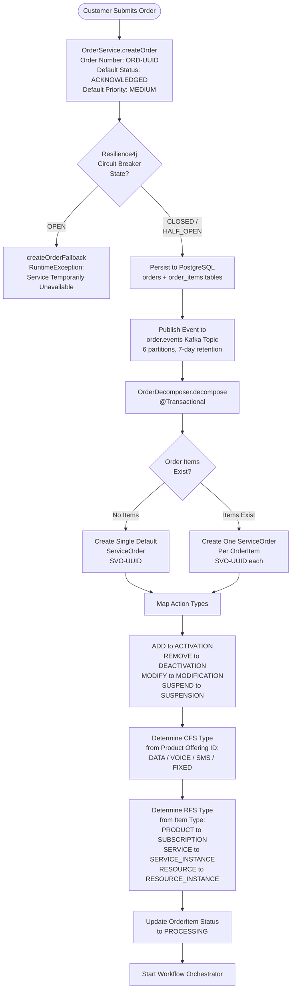

تتم عملية تنفيذ الدالة `OrderDecomposer.decompose()` ضمن حدود النطاق `@Transactional` ، وهو ما يضمن أن يتم إنشاء جميع طلبات الخدمة بشكل كامل، أو ألا يتم إنشاء أي منها على الإطلاق. يتلقى كل طلب رقمًا خاصًا به، وفقًا للتنسيق `SVO-` ، بالإضافة إلى قيمة UUID. كما يكون لكل طلب حالة أولية محددة، وهي `ACKNOWLEDGED` . أما نوع الخدمة من نوع CFS (الخدمة الموجهة للعملاء)، فيتم تحديده بناءً على معرف المنتج المعني، بينما يتم تحديد نوع الخدمة من نوع RFS (الخدمة الموجهة للموارد) بناءً على تصنيف نوع العنصر المعني.

#### سلسلة أنشطة سير العمل

بمجرد إنشاء طلبات الخدمة، يقوم النظام `WorkflowOrchestrator` بتنفيذ آلية معالجة البيانات داخل الذاكرة، حيث يتم معالجة العمليات المختلفة وفقًا لتسلسل محدد مسبقًا. كما يقوم النظام بتخزين حالة التنفيذ في المتغير `ConcurrentHashMap` ، وذلك لضمان سلامة عملية التتبع أثناء تنفيذ الطلبات.

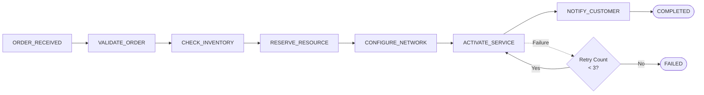

يتم تنفيذ سير العمل وفقًا لسلسلة من الخطوات المحددة بدقة: `ORDER_RECEIVED` → `VALIDATE_ORDER` → `CHECK_INVENTORY` → `RESERVE_RESOURCE` → `CONFIGURE_NETWORK` → `ACTIVATE_SERVICE` → `NOTIFY_CUSTOMER` → `COMPLETED` . تسمح سياسة المحاولات المتكررة بإجراء ثلاث محاولات كحد أقصى لكل خطوة، قبل أن يتم تصنيف سير العمل على أنه `FAILED` . تتطور حالات سير العمل عبر الخطوات التالية: `INITIATED` → `RUNNING` → `COMPLETED` ، `FAILED` ، أو `CANCELLED` .

### 4.2.2 تنسيق العمليات المتكاملة القائمة على السجلات التاريخية/السير الذاتية

في حالة الخدمات المتعددة التي يتم تقديمها في نفس الوقت (مثل “حزمة Home Premium” التي تشمل خدمات الهاتف الثابت + خدمة FTTH + خدمة 4G + خدمات الاستضافة)، فإن المنصة تستخدم أداة Temporal.io 1.22.3 لتنظيم سلسلة من العمليات التي تتكون من خمس خطوات، مع وجود آليات لتصحيح أي أخطاء قد تحدث أثناء تنفيذ هذه العمليات، كما هو موضح في `FtthOrderWorkflowImpl.java` . لكل عملية، هناك حد زمني قدره 30 ثانية من بداية العملية حتى انتهائها، بالإضافة إلى إمكانية إعادة تنفيذ العملية ثلاث مرات كحد أقصى، مع فاصل زمني قدره ثانية واحدة بين كل محاولة لإعادة التنفيذ.

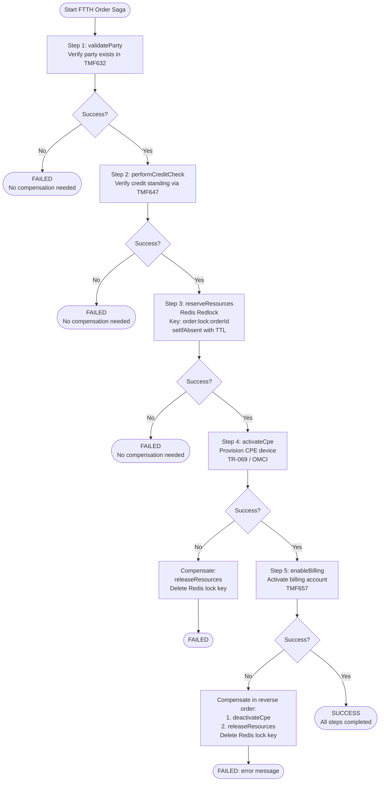

تتبع السلسلة الخطوات التي تم إنجازها، وذلك باستخدام ترتيب محدد مسبقًا: `PARTY_VALIDATED` → `CREDIT_CHECKED` → `RESOURCES_RESERVED` → `CPE_ACTIVATED` → `BILLING_ENABLED` . أما الإجراءات التعويضية، فإنها تُنفذ دائمًا بالترتيب العكسي للخطوات التي تم إنجازها. الخطوتان 1 و2 (التحقق من صحة البيانات والتحقق من الائتمان) هما عمليات لا تتطلب أي إجراءات تعويضية. أما الخطوات من 3 إلى 5، فهناك إجراءات تعويضية محددة لكل خطوة: فالخطوة `RESOURCES_RESERVED` تتطلب إجراء التعويض بالخطوة `releaseResources()` (أي حذف مفتاح القفل في Redis وهو `order:lock:{orderId}` )، والخطوة `CPE_ACTIVATED` تتطلب إجراء التعويض بالخطوة `deactivateCpe()` ، والخطوة `BILLING_ENABLED` تتطلب إجراء التعويض بالخطوة `disableBilling()` . يجب ألا يتجاوز وقت استعادة النظام بعد حدوث أي خلل 30 ثانية من لحظة اكتشاف الخلل.

### 4.2.3 الشحن وتحديد القدرة في الوقت الفعلي

عملية الشحن في الوقت الفعلي تُعتبر من أهم العمليات من حيث الأداء في المنصة. يجب أن لا يتجاوز زمن الاستجابة 50 مللي ثانية في 99% من الحالات. تم تنفيذ هذه العملية بالكامل باستخدام لغة Go ( `charging-engine/internal/` )، وذلك لتحقيق أقصى كفاءة في المعالجة. كما يتم معالجة البيانات الواردة من خدمة Kafka، وتسجيل عمليات الخصم في قاعدة البيانات باستخدام خدمة Redis.

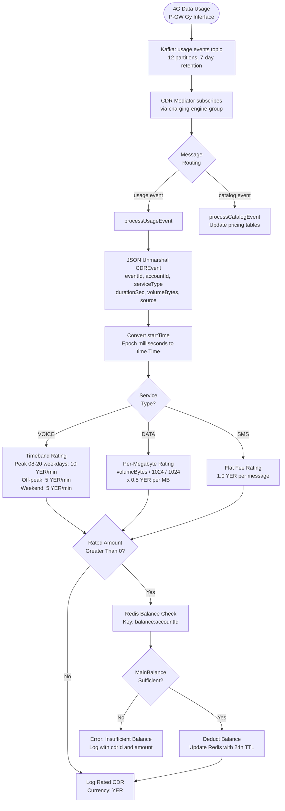

يقوم نظام التسعير في `charging-engine/internal/rating/service.go` بتخزين خطط التسعير في الذاكرة، وهناك ثلاث إعدادات افتراضية: `voice-standard` (حسب فترات الزمن؛ أسعار مختلفة خلال ساعات الذروة، وخارج ساعات الذروة، وفي عطلات نهاية الأسبوع)، `data-standard` (حسب الحجم؛ 0.5 يمني ريال لكل ميجابايت)، و `sms-standard` (رسوم ثابتة؛ 1.0 يمني ريال لكل عملية نقل بيانات). جميع تكاليف نقل البيانات تُحسب باليمني الريال. أما خدمة الحفظ في `charging-engine/internal/balance/service.go` ، فهي تعتمد على نمط “الاحتياطي-التنفيذ-الإلغاء”， وتتضمن العمليات التالية:

| العمليات/الإجراءات المنفذة | نمط مفاتيح Redis | السلوك |
| --- | --- | --- |
| GetBalance | balance:{accountID} | يُرجع الرصيد المتبقي؛ في حالة عدم وجود البيانات المطلوبة، يتم استخدام القيمة الافتراضية وهي 0 يير. |
| Reserve | reservation:{reservationID} | المبلغ المتاح للسحب = الرصيد الرئيسي – المبلغ المحجوز بالكامل؛ يتم إنشاء حجز لمدة 5 دقائق فقط. |
| Confirm | لا يوجد ما يمكن ترجمته. | MainBalance -= amount; ReservedTotal -= amount; يتم حذف مفتاح الحجز المتعلق بهذا المبلغ. |
| Deduct | balance:{accountID} | خصم مباشر، بدون أي شروط أو قيود. |
| TopUp | balance:{accountID} | يتم إضافة المبلغ إلى حساب “MainBalance” أو “BonusBalance”， بناءً على القيمة المحددة في الخاصية المذكورة. |

### 4.2.4 خطوات عملية الوساطة في CDR

يقوم نظام الوساطة في معالجة البيانات من نوع CDR الخاص بـ `cdrmspipeline/orchestrator.py` بتنفيذ عملية معالجة متعددة المراحل. حيث يقوم النظام بجمع البيانات الخام من ثلاث صيغ قديمة: TITAN ASCII، Oracle ASN.1، وIPDR CSV. بعد ذلك، يتم تحويل هذه البيانات إلى صيغة موحدة، كما يتم إضافة المعلومات اللازمة من الخدمات الصغيرة المستخدمة في المعالجة. وأخيرًا، يتم إرسال البيانات إلى نظام Kafka، مع ضمان عدم تكرار عملية الإرسال. تم اختبار النظام، وتبين أنه قادر على معالجة 1,240 حدثًا في الثانية كحد أدنى، وحتى 2,100 حدث في الثانية كحد أقصى.

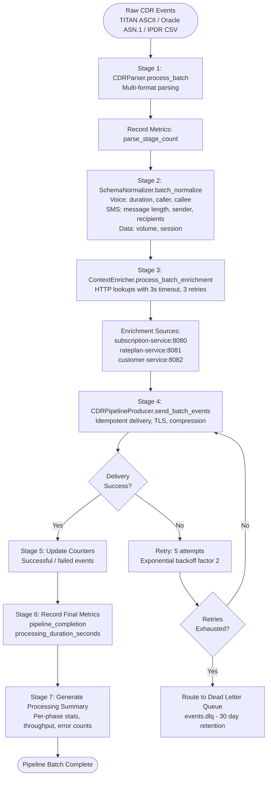

آلية فحص حالة النظام تجمع بيانات الحالة من خمسة مكونات داخلية: أداة التحليل، أداة التنظيم، أداة إضافة المعلومات الإضافية، أداة إرسال البيانات إلى Kafka، وأداة جمع البيانات الإحصائية. تقوم أداة إضافة المعلومات الإضافية بإرسال طلبات HTTP إلى ثلاث خدمات صغيرة، مع مدة زمنية قصوى للطلبات تبلغ 3 ثوانٍ، ويمكن إعادة إرسال الطلبات حتى 3 مرات. ونتيجة لذلك، فإن نسبة نجاح عملية إضافة المعلومات الإضافية تصل إلى 99.8%.

### 4.2.5 الفوترة الموحدة وإصدار الفواتير

يقوم نظام التسعير الموحد بتجميع التكاليف الخاصة بجميع خدمات الشركة (شبكة الهاتف العامة، خدمات الإنترنت عبر الألياف الضوئية، شبكات 4G/LTE، خدمات MPLS، وخدمات الاستضافة) في فاتورة واحدة. هذا هو الهدف الأساسي من النظام الموحد، حيث يحل محل أربعة أنظمة تسعير منفصلة. ترتبط البيانات المتعلقة بالفواتير بجدول `invoices` ، ويتم إنشاء أرقام الفواتير بواسطة دالة قاعدة البيانات PostgreSQL `generate_invoice_number()` ، وفقًا للنمط المحدد في `INV-<YEAR>-<SEQUENCE>` .

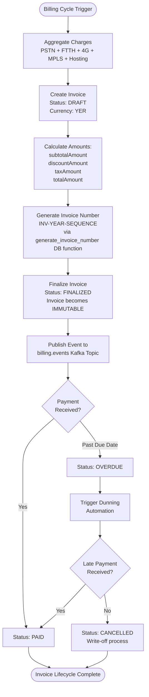

إنها قاعدة أساسية في إدارة الفواتير: بمجرد أن تنتقل الفاتورة إلى الحالة `FINALIZED` ، فإنها تصبح غير قابلة للتعديل. أما الحالة `OVERDUE` ، فهي تظهر تلقائيًا عندما يتجاوز تاريخ استحقاق الفاتورة دون أن يتم دفعها. يقوم نظام إدارة الفواتير في `/tmf-api/customerBillManagement/v5` بمهام إنشاء الفواتير والحصول عليها وعرض قائمة بها، بالإضافة إلى معالجة عمليات الدفع. أما قاعدة البيانات في `update_account_balance()` ، فهي تساعد في تحديث بيانات الفواتير بشكل دقيق، ويتم التحقق من دقة هذه البيانات من خلال اختبارات تُجرى على مدى ثلاثة أشهر، بهدف تحقيق دقة تصل إلى 100% في معالجة 10,000 حالة دفع.

### 4.2.6 تحليل تأثير قطع الألياف

يوضح إجراء تحليل تأثير قطع الألياف الضوئية القدرة التي تمتلكها المنصة على تحديد الخدمات والعملاء المتأثرين، وذلك باستخدام أداة Neo4j لتحليل البيانات الهيكلية. يتم ذلك في غضون 10 مللي ثانية فقط. يشمل هذا الإجراء الخدمات المتعلقة بجرد الخدمات (F-020)، وإدارة الإنذارات (F-024)، وإدارة الشكاوى (F-023)، بالإضافة إلى إدارة العاملين في المنصة.

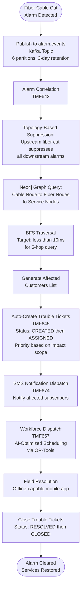

يمثل نموذج الرسوم البيانية في Neo4j مسار الإشارات من جهاز OLT إلى جهاز PON، ثم إلى جهاز الفصل، وأخيرًا إلى جهاز ONT. وهذا يسمح بإجراء عمليات فحص بطريقة منظمة، وفقًا للتسلسل التالي: الكابلات → الألياف الضوئية → الخدمات → العملاء. كما أن منطق معالجة الإنذارات يساعد في تقليل عدد الإنذارات الواردة عند حدوث انقطاع في أحد الألياف الضوئية. من بين التحسينات المستقبلية، استخدام تحليل الأسباب الجذرية باستخدام طريقة بايزيان، لتحسين دقة تحليل البيانات. أما فيما يتعلق بتوزيع الفنيين، فإن التطبيقات الخاصة بذلك تستخدم تقنيات الذكاء الاصطناعي، بالإضافة إلى تطبيقات خاصة بالعمل في الأماكن التي تكون فيها خدمات الإنترنت محدودة.

* * *

## 4.3 رسوم بيانية لانتقال الحالات

جميع آليات إدارة الحالات في منصة PTC BSS/OSS في اليمن تلتزم بقواعد صارمة خاصة بالانتقال بين الحالات المختلفة. في حال حدوث انتقال غير صحيح بين الحالات، يتم إرجاع رد HTTP 409 (Conflict). كما أن خاصية التكرار في عمليات الانتقال تضمن أن 100 محاولة لإعادة الانتقال ستؤدي إلى نتيجة واحدة فقط (وفقًا لمعايير Quality Gate QG-2). يتم تخزين سجلات الحالات في جداول خاصة بالتدقيق، مع تسجيل توقيت العمليات وهوية الجهة التي قامت بها.

### 4.3.1 آلية حالات طلب المنتجات

كيان طلب المنتجات ( `Order.java` → جدول `orders` ) يدعم ثماني حالات مختلفة، بالإضافة إلى خمسة أنواع من الطلبات وأربعة مستويات من الأولوية. يُعتبر هذا الكيان أكثر أنظمة التحكم في الحالات تعقيدًا على المنصة، حيث يتحكم في نقطة البداية لجميع التغييرات التي يقوم بها العملاء في الخدمات المقدمة.

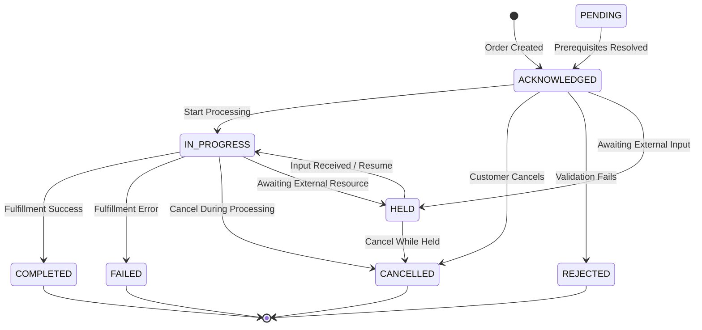

أنواع الطلبات: `ACQUISITION` ، `MODIFICATION` ، `TERMINATION` ، `SUSPENSION` ، `RESUMPTION` . الأولويات: `CRITICAL` ، `HIGH` ، `MEDIUM` (القيمة الافتراضية)، `LOW` . خاصية الاستمرارية في تنفيذ الطلبات: `orders` ، `order_items` ، `order_state_history` . الجداول المستخدمة في قاعدة البيانات PostgreSQL: …

### 4.3.2 آلية حالات طلبات الخدمة

كيان طلب الخدمة ( `ServiceOrder.java` → جدول `service_orders` ) يتولى إدارة دورة حياة تنفيذ الخدمات التقنية، والتي يتم تحديدها أثناء تقسيم طلب الشراء إلى أجزاء مختلفة بواسطة النظام `OrderDecomposer.java` . يحتوي كل طلب خدمة على نوع CFS ونوع RFS، وهما نوعان مشتقان من نوع طلب الشراء الأصلي.

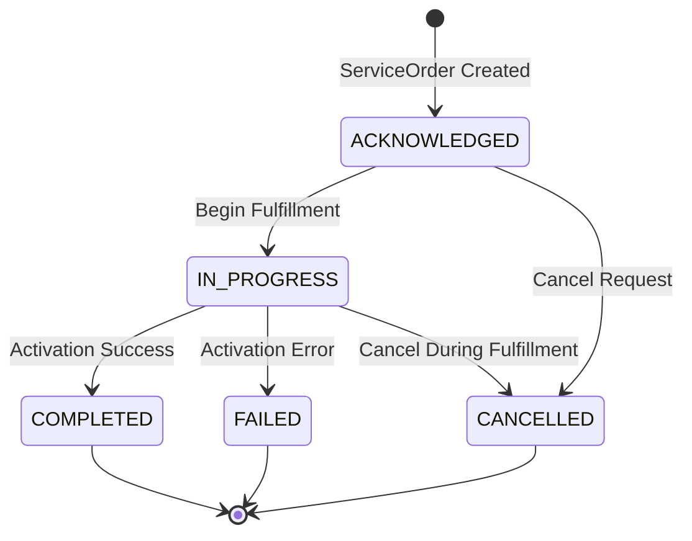

أنواع الطلبات: `ACTIVATION` ، `DEACTIVATION` ، `MODIFICATION` ، `SUSPENSION` (الأنواع الموسعة: `INSTALLATION` ، `TERMINATION` ، `MIGRATION` ، `REPAIR` ) أنواع نظام CFS: `DATA` ، `VOICE` ، `SMS` ، `FIXED` أنواع نظام RFS: `SUBSCRIPTION` ، `SERVICE_INSTANCE` ، `RESOURCE_INSTANCE`

### 4.3.3 آلة الحالات الخاصة بترتيب الموارد

كيان طلبات الموارد ( `ResourceOrder.java` → جدول `resource_orders` ) يمتلك أوسع نطاق من الحالات الممكنة ضمن المنصة؛ حيث يدعم عشر حالات مختلفة وثمانية أنواع من طلبات الموارد. كما يقوم بإدارة عملية قفل الموارد الموزعة باستخدام تقنية Redis Redlock، وذلك بالنسبة لمنافذ الاتصال، ومجموعات العناوين الIP، ومعرفات VLAN، مع مراعاة مدة صلاحية الطلبات.

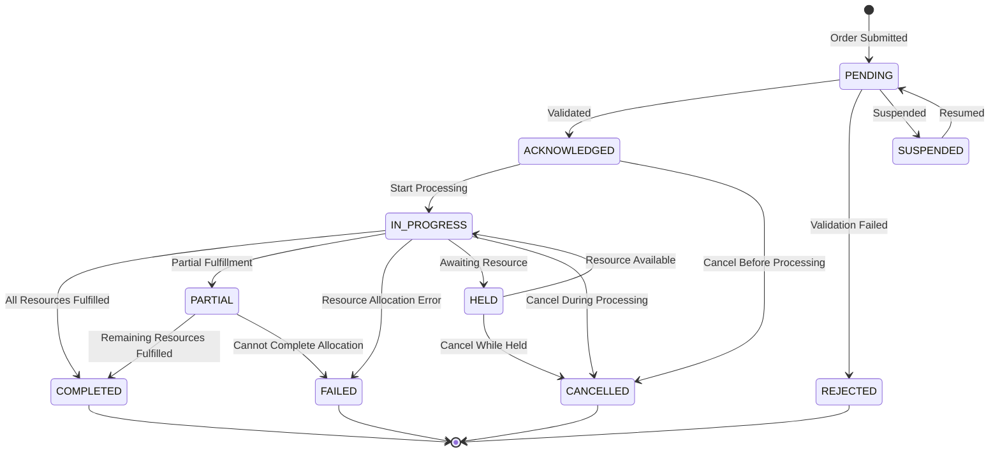

أنواع الطلبات: `INSTALL` ، `MODIFY` ، `REMOVE` ، `UPGRADE` ، `DOWNGRADE` ، `REPAIR` ، `TEST` ، `MIGRATE` أنواع الموارد: `PHYSICAL` ، `LOGICAL` ، `COMPOUND` الأولويات: `CRITICAL` ، `HIGH` ، `NORMAL` ، `LOW`

### 4.3.4 دورة حياة جرد الخدمات

يقوم كشف الخدمات المتاحة ( `ServiceInventory` كيان عبر TMF639) بتوثيق دورة حياة الخدمات النشطة في جميع أنواع الخدمات الثمانية التي تقدمها شركة PTC. تمر الخدمات بمراحل محددة بوضوح، بدءًا من مرحلة التصميم وانتهاءً بمرحلة الإنهاء.

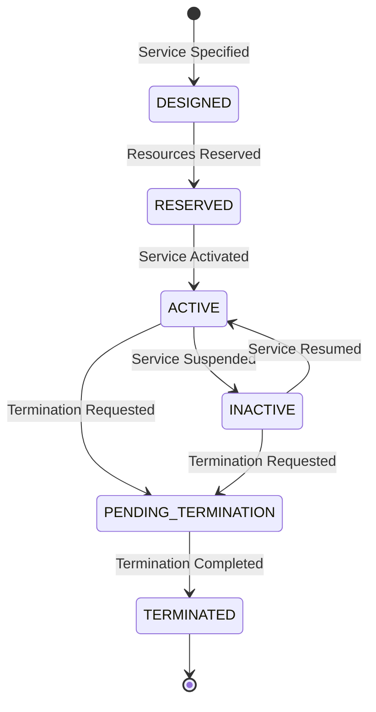

أنواع الخدمات: `FIXED_LINE` ، `MOBILE_CDMA` ، `MOBILE_4G` ، `ADSL` ، `FTTH` ، `MPLS` ، `PRI` ، `HOSTING`

### 4.3.5 دورة حياة الفاتورة

كيان الفاتورة ( `Invoice.java` → جدول `invoices` ) يخضع لقاعدة عدم القابلية للتغيير: بمجرد أن تصل الفاتورة إلى الحالة `FINALIZED` ، لا يمكن تعديل محتوياتها. أما الانتقال إلى الحالة `OVERDUE` ، فيحدث تلقائيًا وفقًا لتاريخ الاستحقاق.

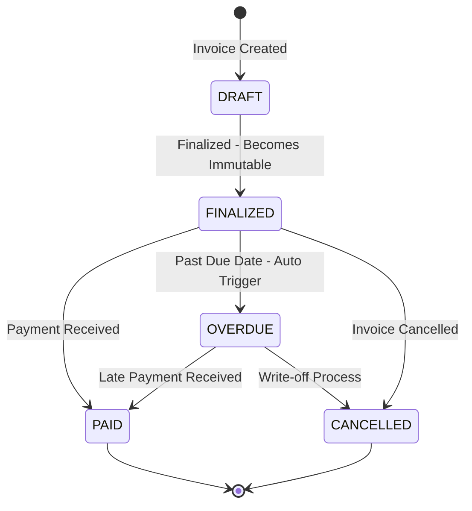

### 4.3.6 دورة حياة العميل

كيان العميل ( `Customer.java` → جدول `customers` ) يمر بأربع حالات خلال دورة حياته، ويجب اجتياز إجراءات التحقق من هوية العميل قبل السماح باستخدام الخدمة.

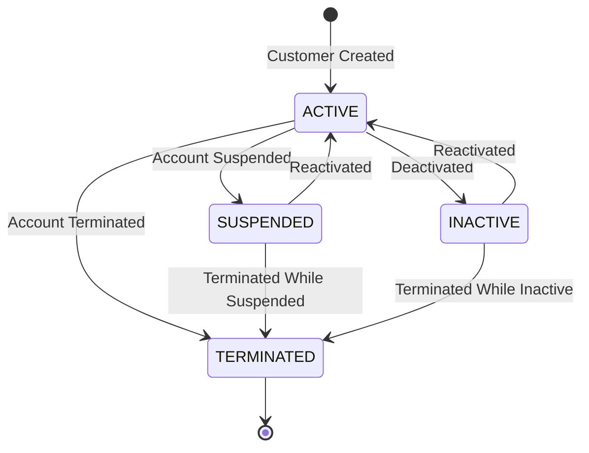

أنواع العملاء: `RESIDENTIAL` ، `BUSINESS` ، `ENTERPRISE` ، `GOVERNMENT` مستويات التحقق من هوية العميل: `BASIC` ، `FULL` ، `PREMIUM` (لا يمكن تفعيل الخدمة في حال عدم استيفاء مستوى التحقق المطلوب من هوية العميل.)

### 4.3.7 دورة حياة طلبات الدعم التقني

تتبع تذاكر الشكاوى (TMF645) دورة حياة إدارة الحوادث الخطية، مع تصنيف الحالات حسب الأولوية. يتم إنشاء هذه التذاكر تلقائيًا بناءً على التنبيهات الخطيرة، ويتم تسجيلها مباشرة في الحالة المناسبة ( `CREATED` ).

```mermaid
stateDiagram-v2
    [*] --> CREATED : Ticket Created or Auto-Created
    CREATED --> ASSIGNED : Assigned to Agent or Team
    ASSIGNED --> IN_PROGRESS : Work Commenced
    IN_PROGRESS --> RESOLVED : Issue Resolved
    RESOLVED --> CLOSED : Resolution Confirmed
    CLOSED --> [*]
```

الأولويات: `CRITICAL` ، `HIGH` ، `MEDIUM` ، `LOW` . محفز التوليد التلقائي: التنبيهات الخطيرة الناتجة عن تحليل حالات قطع الألياف الضوئية.

### 4.3.8 تنفيذ سير العمل وتتبع خطوات العملية بأكملها

آلة حالات تنفيذ سير العمل (التي يتم إدارتها بواسطة `WorkflowOrchestrator.java` ) تقوم بتتبع التقدم العام في سير أعمال تنفيذ الطلبات. أما أداة تتبع خطوات سير العمل، فهي تقوم بمراقبة كل خطوة على حدة ضمن سير العمل الزمني.

```mermaid
stateDiagram-v2
    [*] --> INITIATED : Workflow Created
    INITIATED --> RUNNING : Execution Started
    RUNNING --> RUNNING : Activity Completed / Next Activity
    RUNNING --> COMPLETED : All Activities Finished
    RUNNING --> FAILED : Max 3 Retries Exceeded
    RUNNING --> CANCELLED : Manual Cancellation
    COMPLETED --> [*]
    FAILED --> [*]
    CANCELLED --> [*]
```

أنواع سير العمل: `ORDER_FULFILLMENT` ، `SERVICE_ACTIVATION` خطوات سير العمل المسجلة: `PARTY_VALIDATED` → `CREDIT_CHECKED` → `RESOURCES_RESERVED` → `CPE_ACTIVATED` → `BILLING_ENABLED`

* * *

## 4.4 رسوم بيانية التكامل والتسلسل

### 4.4.1 تسلسل معالجة طلبات بوابة الواجهة البرمجية API Gateway

جميع الطلبات الخارجية تمر عبر أربع طبقات أمنية وعمليات توجيه قبل أن تصل إلى خدمات نواة BSS. يتكون نظام البوابات من برنامج Kong Gateway 3.5 الخاص بإدارة الحركة المرورية الخارجية، وبرنامج NestJS 10 الذي يحتوي على 57 وحدة بروكسي لمعالجة الطلبات والتحقق من صحتها، بالإضافة إلى برنامج Istio 1.20 الخاص بإدارة الاتصالات الداخلية. كما يشمل النظام أيضًا وحدات التحكم الخاصة بنواة BSS.

```mermaid
sequenceDiagram
    participant C as Customer / Agent
    participant K as Kong Gateway
    participant N as NestJS Gateway<br/>Port 3000
    participant I as Istio Mesh<br/>Strict mTLS
    participant B as BSS Core Service<br/>45 Controllers
    participant DB as Data Layer

    C->>K: HTTPS Request
    K->>K: Rate Limiting Check<br/>(10,000 req/min)
    K->>K: OAuth2 Token Validation<br/>(Keycloak OIDC)
    alt Token Invalid or Rate Exceeded
        K-->>C: 401 Unauthorized / 429 Too Many Requests
    end
    K->>N: Forward Request
    N->>N: Swagger Schema Validation
    N->>N: Route via Proxy Module<br/>(1 of 57 modules)
    N->>I: mTLS Encrypted Request
    I->>I: SPIFFE/SPIRE Identity Verification
    I->>B: Authorized Service Request
    B->>DB: Data Operation<br/>(PostgreSQL / Redis / Neo4j)
    DB-->>B: Result
    B-->>I: Service Response
    I-->>N: mTLS Response
    N-->>N: Response Transformation
    N-->>K: Transformed Response
    K-->>C: HTTPS Response
```

### 4.4.2 الاندماج بين النطاقات المختلفة بناءً على الأحداث

البنية الأساسية للأحداث في نظام كافكا، كما هو موضح في `shared/kafka/topic-definitions.yml` ، توفر بنية للتواصل غير المتزامن بين جميع الخدمات المختلفة في النظام. يوجد عشرة مواضيع رئيسية، بالإضافة إلى أربع مجموعات لاستقبال الرسائل، وهو ما يسمح بالتواصل بين جميع أجزاء النظام، بغض النظر عن الحواجز التقنية بينها.

```mermaid
flowchart LR
    subgraph Producers["Event Producers"]
        P_BSS["BSS Core<br/>Spring Boot 3.2"]
        P_CHG["Charging Engine<br/>Go 1.22"]
        P_CDR["CDR Pipeline<br/>Python"]
        P_NE["Network Elements"]
    end

    subgraph Topics["Kafka Backbone - KRaft Mode - RF=3"]
        T_PT["party.events<br/>6p / 7d"]
        T_CT["catalog.events<br/>6p / 7d"]
        T_OT["order.events<br/>6p / 7d"]
        T_ST["service.events<br/>6p / 7d"]
        T_RT["resource.events<br/>6p / 7d"]
        T_BT["billing.events<br/>6p / 7d"]
        T_UT["usage.events<br/>12p / 7d"]
        T_CET["charging.events<br/>12p / 7d"]
        T_AT["alarm.events<br/>6p / 3d"]
        T_DLQ["events.dlq<br/>6p / 30d"]
    end

    subgraph ConsumerGroups["Consumer Groups"]
        CG_PM["party-mgmt-group"]
        CG_CM["catalog-mgmt-group"]
        CG_OM["order-mgmt-group"]
        CG_CE["charging-engine-group"]
    end

    P_BSS --> T_PT
    P_BSS --> T_CT
    P_BSS --> T_OT
    P_BSS --> T_ST
    P_BSS --> T_RT
    P_BSS --> T_BT
    P_CDR --> T_UT
    P_CHG --> T_CET
    P_NE --> T_AT

    T_PT --> CG_PM
    T_CT --> CG_CM
    T_OT --> CG_OM
    T_UT --> CG_CE
    T_CT --> CG_CE
```

المواضيع ذات الإنتاجية العالية ( `usage.events` و `charging.events` ) مُعدة لاستيعاب أكثر من 1,200 حدث في الثانية، ولذلك يتم استخدام 12 قسمًا في هذه المواضيع. أما المواضيع العادية، فيتم استخدام 6 أقسام فيها. جميع المواضيع تستخدم معامل نسخ قدره 3 لضمان الاستقرار في عملية التخزين. كما يتم استخدام تنسيق Avro لتخزين البيانات، مع الحفاظ على التوافق مع الإصدارات السابقة، وذلك من خلال أداة Confluent Schema Registry. أما خادم الرسائل الفاشلة ( `events.dlq` )، فيقوم بتخزين الرسائل الفاشلة لمدة 30 يومًا، مما يوفر فرصة لإعادة معالجة هذه الرسائل لاحقًا.

**نقاط الدمج بين المجالات المختلفة:**

| المصدر/المرجع | هدف | الآلية/الطريقة المستخدمة | التأخير في التنفيذ/الاستجابة |
| --- | --- | --- | --- |
| خط أنابيب CDR → محرك الشحن | usage.events كافكا (12 قسمة) | تيار الأحداث غير المتزامن | أقل من ثانية واحدة |
| محرك الشحن → خدمة التوازن | عمليات Redis | القراءة/الكتابة المتزامنة | < 5 ms |
| مُنسق السجلات → أدوات التكيف القديمة | استدعاءات سير العمل الزمني | الاتصالات عن بُعد مع خاصية قطع الاتصال في حالة حدوث أخطاء. | وقت الانتظار: أقل من 30 ثانية |
| أداة إدارة السجلات → قائمة الموارد | Redis setIfAbsent Redlock | القفل الموزع | < 5 ms |
| إدارة الإنذارات → بطاقات الطلبات/المشاكل | الإنشاء التلقائي للتقارير المتعلقة بالتنبيهات الخطيرة | محفز قائم على الأحداث | أقل من ثانية واحدة |
| جرد الخدمات → تحليل الأثر | تنقل في الرسم البياني من نوع BFS باستخدام Neo4j | استعلام متزامن | < 10 ملی ثانیه |
| بوابة العملاء → بوابة الخدمات البرمجية (API Gateway) | الاتصال عبر بروتوكول HTTP باستخدام 57 وحدة وسيطة. | طلب/استجابة | p95 < 200 مللي ثانية |
| عملية نقل البيانات من نظام ETL إلى نظام إدارة الأطراف المعنية. | TmfDataTransformer البيانات المرسلة/المحملة | عملية معالجة البيانات بشكل جماعي/دفعة واحدة | دفعة واحدة/في كل مرة |

### 4.4.3 نمط دمج المحولات القديمة مع النظام الجديد

جميع برامج التوافق مع الأنظمة القديمة الستة تتبع نمطًا معماريًا موحدًا، وهو ما تم توثيقه في `docs/adapters/adapter-registry.md` . يضمن هذا النمط ترجمة البروتوكولات بشكل موحد، بالإضافة إلى مراقبة حالة الشبكة والقدرة على التعامل مع أي أعطال في الشبكة. ينطبق هذا النمط على أنظمة TITAN (TL1/SNMP)، وOracle BRM (MAP/Diameter S6a)، وWHM (REST)، وأنظمة ADSL/FTTH الداخلية (REST/RADIUS)، وأنظمة MPLS/PRI (NETCONF/SNMP)، بالإضافة إلى عناصر الشبكة الأخرى (TR-069/OMCI).

```mermaid
sequenceDiagram
    participant SAGA as Temporal Saga<br/>Orchestrator
    participant ADAPT as Legacy Adapter<br/>Resilience4j
    participant CB as Circuit Breaker
    participant LEGACY as Legacy System<br/>TITAN / BRM / WHM
    participant KFK as Kafka Backbone

    SAGA->>ADAPT: Invoke adapter operation
    ADAPT->>CB: Check circuit state
    alt Circuit OPEN
        CB-->>ADAPT: Fast-fail rejection
        ADAPT-->>SAGA: Error - trigger compensation
    else Circuit CLOSED or HALF_OPEN
        CB->>LEGACY: Translate protocol<br/>(TL1 / SNMP / Diameter / REST)
        alt Operation Success
            LEGACY-->>CB: Legacy response
            CB-->>ADAPT: Map to canonical format
            ADAPT->>KFK: Publish canonical event
            ADAPT-->>SAGA: Success response
        else Timeout or Error
            LEGACY--xCB: Failure or timeout
            CB->>CB: Record failure - check threshold
            CB-->>ADAPT: Error response
            ADAPT-->>SAGA: Error - trigger compensation
        end
    end
```

يتبع التدفق الموحد للمحولات البرمجية الخطوات التالية: النظام القديم → طبقة المحولات (التي تستخدم أداة Resilience4j لمعالجة المشاكل مثل فشل الاتصالات، وإعادة المحاولات، وعزل الأجزاء المختلفة من النظام عن بعضها) → طبقة التحويل القياسية → المستخدمون النهائيون في نظام BSS/OSS، من خلال نشر البيانات عبر منصة Kafka. يتم دمج أدوات مراقبة الأداء في كل محول، كما يوفر النظام إدارة مركزية لجميع المحولات، بما في ذلك تسجيل المحولات، وتوجيه البيانات، واكتشاف الخدمات المختلفة.

* * *

## 4.5 معالجة الأخطاء وإجراءات التعافي منها

### 4.5.1 نمط مرونة خدمات الطلبات

الطريقة `OrderService.createOrder()` مزودة بثلاثة تعليقات من نوع Resilience4j: `@CircuitBreaker(name = "order-service")` ، `@Retry` ، و `@Bulkhead` . تعمل هذه التعليقات معًا لحماية عملية إنشاء الطلبات من أي أخطاء قد تحدث في النظام.

```mermaid
flowchart TD
    REQ(["Order Request"]) --> CB{"Circuit Breaker<br/>State?"}
    CB -->|"CLOSED"| BH{"Bulkhead<br/>Slot Available?"}
    CB -->|"OPEN"| FALLBACK["Fallback: createOrderFallback<br/>RuntimeException:<br/>Order service temporarily unavailable"]
    CB -->|"HALF_OPEN"| PROBE["Allow Probe Request"]
    BH -->|"Yes"| PROC["Process Order:<br/>createOrder()"]
    BH -->|"No"| REJECT["Reject: Concurrency<br/>Limit Reached"]
    PROC --> RESULT{"Success?"}
    RESULT -->|"Yes"| SUCCESS["Return Order Response<br/>Status: ACKNOWLEDGED"]
    RESULT -->|"No"| RTRY{"Retry<br/>Available?"}
    RTRY -->|"Yes"| PROC
    RTRY -->|"No"| RECFAIL["Record Failure<br/>in Circuit Breaker"]
    RECFAIL --> THRESH{"Failure Threshold<br/>Reached?"}
    THRESH -->|"Yes"| OPEN["Circuit Transitions<br/>to OPEN State"]
    THRESH -->|"No"| ERRCLIENT["Return Error<br/>to Client"]
    PROBE --> PRESULT{"Probe<br/>Success?"}
    PRESULT -->|"Yes"| CLOSE["Circuit Transitions<br/>to CLOSED"]
    PRESULT -->|"No"| REOPEN["Circuit Remains<br/>OPEN"]
```

يمنع جهاز قطع الدائرة التنفيذ المتكرر للطلبات المرسلة إلى الخوادم التي تعاني من أعطال. عند تجاوز حد الأعطال المسموح به، يتم قطع الاتصال بين الخوادم، ويتم توجيه جميع الطلبات التالية إلى الدالة `createOrderFallback()` ، والتي بدورها ترسل رسالة خطأ من نوع `RuntimeException("Order service temporarily unavailable")` . بعد فترة انتظار محددة، يتحول النظام إلى الحالة `HALF_OPEN` ، ويسمح بإرسال طلبات للتحقق من استعادة الخادم لوظائفه الطبيعية.

### 4.5.2 تدفق التعويضات المتعلقة بالفترات الزمنية المختلفة

عندما يفشل أي خطوة من خطوات سير العمل في النموذج الزمني، فإن المنصة تقوم بتنفيذ إجراءات تعويضية بالترتيب العكسي تمامًا للخطوات التي تم إنجازها بالفعل. يتم تنفيذ آلية التعويض هذه باستخدام أداة `FtthOrderWorkflowImpl.java` ، حيث يتم تتبع جميع الخطوات التي تم إنجازها بشكل دقيق.

```mermaid
flowchart TD
    FAIL(["Saga Step Fails"]) --> LOG["Log Error with<br/>Step ID and Exception"]
    LOG --> TRACK["Identify Completed<br/>Saga Milestones"]
    TRACK --> EVAL{"Highest Completed<br/>Milestone?"}
    EVAL -->|"BILLING_ENABLED"| CB["1. disableBilling<br/>2. deactivateCpe<br/>3. releaseResources<br/>Delete Redis lock"]
    EVAL -->|"CPE_ACTIVATED"| CC["1. deactivateCpe<br/>2. releaseResources<br/>Delete Redis lock"]
    EVAL -->|"RESOURCES_RESERVED"| CR["1. releaseResources<br/>Delete Redis lock key<br/>order:lock:orderId"]
    EVAL -->|"CREDIT_CHECKED or<br/>PARTY_VALIDATED"| NONE["No Compensation Needed<br/>Read-only operations"]
    CB --> DONE(["Return FAILED: error"])
    CC --> DONE
    CR --> DONE
    NONE --> DONE
```

يتم تطبيق حد زمني قدره 30 ثانية من بداية النشاط حتى انتهائه، بالإضافة إلى إمكانية إعادة المحاولة ثلاث مرات كحد أقصى، مع فترة انتظار قدرها ثانية واحدة بين كل محاولة إعادة. لا يتم الانتقال إلى خطوات التعويض إلا بعد استنفاد جميع محاولات إعادة المحاولة. الهدف هو إتمام عملية التعويض في أقل من 30 ثانية من لحظة اكتشاف الخطأ.

### 4.5.3 استعادة البيانات في حالة حدوث أخطاء في خطوط نقل البيانات CDR

يقوم نظام التوسط في CDR بمعالجة الأخطاء في كل مرحلة من مراحل المعالجة، وذلك باستخدام استراتيجيات مختلفة للتعامل مع هذه الأخطاء. يتضمن إعداد النظام معاملات `max_retries` ، `retry_backoff_factor` ، و `dead_letter_queue_enabled` .

```mermaid
flowchart TD
    EVENT(["CDR Event"]) --> PARSE["Stage: Parse"]
    PARSE --> PFAIL{"Parse<br/>Error?"}
    PFAIL -->|"Yes"| DLQ["Route to DLQ<br/>events.dlq<br/>30-day retention"]
    PFAIL -->|"No"| NORM["Stage: Normalize"]
    NORM --> NFAIL{"Normalize<br/>Error?"}
    NFAIL -->|"Yes"| DLQ
    NFAIL -->|"No"| ENRICH["Stage: Enrich via HTTP<br/>3s timeout per call"]
    ENRICH --> EFAIL{"Enrichment<br/>Error?"}
    EFAIL -->|"Yes"| ERETRY["Retry: 3 attempts<br/>3s timeout each"]
    ERETRY --> EDONE{"Retry<br/>Successful?"}
    EDONE -->|"No"| DLQ
    EDONE -->|"Yes"| DELIVER["Stage: Kafka Delivery<br/>Idempotent mode"]
    EFAIL -->|"No"| DELIVER
    DELIVER --> DFAIL{"Delivery<br/>Error?"}
    DFAIL -->|"Yes"| DRETRY["Retry: 5 attempts<br/>Exponential backoff x2"]
    DRETRY --> DDONE{"Retry<br/>Successful?"}
    DDONE -->|"No"| DLQ
    DDONE -->|"Yes"| SUCCESS(["Event Processed"])
    DFAIL -->|"No"| SUCCESS
```

#### تسلسل إيقاف التشغيل السلس

يقوم هذا النظام بتنفيذ إجراءات إيقاف سلسة لمنع فقدان البيانات أثناء عمليات النشر أو التوسعة.

1.  توقفوا عن قبول الأحداث الجديدة – مجموعة المستهلكين توقفت عن تخصيص الموارد للأحداث الجديدة.
2.  أوقف عملية إرسال الرسائل من خادم Kafka – قم بتنفيذ عملية إرسال الرسائل المعلقة، مع تأكيد إتمام عملية الإرسال.
3.  تنظيف البيانات المؤقتة: يجب التأكد من تصدير جميع البيانات الإحصائية والرسوم البيانية ذات الصلة.
4.  إجراء فحص نهائي للحالة الصحية للنظام – تقرير شامل عن حالة كل المكونات.
5.  إكمال عملية التسجيل: تسجيل معايير إيقاف التشغيل من أجل التحكم الفعال في العمليات.

### 4.5.4 التعامل مع أعطال محرك الشحن

محرك الشحن القائم على لغة Go في `charging-engine/internal/cdr/mediator.go` يستخدم استراتيجية “التجاهل السريع للأخطاء غير الخطيرة”، وذلك لضمان عدم تأثير أي خطأ على معالجة الأحداث اللاحقة في قسم Kafka المعني.

```mermaid
flowchart TD
    POLL(["Kafka Consumer Poll<br/>Every 100ms"]) --> FATAL{"Fatal<br/>Error?"}
    FATAL -->|"Yes"| EXIT["Exit Consumer Loop<br/>Process Terminates"]
    FATAL -->|"No"| UNMARSHAL["JSON Unmarshal<br/>CDREvent"]
    UNMARSHAL --> UFAIL{"Unmarshal<br/>Error?"}
    UFAIL -->|"Yes"| SKIP1["Log Error<br/>Skip Event"]
    UFAIL -->|"No"| RATE["Rate CDR<br/>via Rating Service"]
    RATE --> RFAIL{"Rating<br/>Error?"}
    RFAIL -->|"Yes"| SKIP2["Log Error with cdrId<br/>Skip Event"]
    RFAIL -->|"No"| DEDUCT["Deduct Balance<br/>via Redis"]
    DEDUCT --> DFAIL{"Deduction<br/>Error?"}
    DFAIL -->|"Yes"| SKIP3["Log Error with cdrId<br/>and Amount<br/>Skip Event"]
    DFAIL -->|"No"| LOG["Log Rated CDR<br/>Continue Processing"]
    SKIP1 --> POLL
    SKIP2 --> POLL
    SKIP3 --> POLL
    LOG --> POLL

    SIG(["SIGINT / SIGTERM"]) --> SHUTDOWN["Signal Handler:<br/>Graceful Shutdown"]
    SHUTDOWN --> CLOSE["Close Kafka Consumer"]
    CLOSE --> CTXDONE["Context Timeout<br/>Process Exit"]
```

يتولى محرك الشحن معالجة إشارات نظام التشغيل ( `SIGINT` ، `SIGTERM` ) من أجل إغلاق النظام بشكل سلس، وإغلاق برنامج استهلاك بيانات كافا، والسماح بإتمام العمليات اللازمة قبل الخروج من النظام. أما الأخطاء غير الخطيرة (مثل أخطاء في تحليل بيانات JSON، أخطاء في حساب النقاط، أخطاء في خصم النقاط من الحساب)، فيتم تسجيلها مع المعلومات المتعلقة بها ( `cdrId` )، ويتم تجاهل هذه الأخطاء حتى يمكن مواصلة عمليات المعالجة.

### 4.5.5 إجراءات الاستعادة التشغيلية

يوفر دليل التشغيل الموجود في `docs/runbooks/order-processing-failures.md` طرقًا منظمة لتشخيص وحل المشاكل الشائعة المتعلقة بمعالجة الطلبات. يلخص الرسم البياني التالي خطوات عملية التشخيص والإصلاح.

```mermaid
flowchart TD
    SYMPTOM(["Symptom: Orders Stuck<br/>IN_PROGRESS greater than 30 min<br/>or Saga failure rate greater than 5%"]) --> DIAG["Begin Diagnosis"]
    DIAG --> D1["SQL: Query stalled orders<br/>in orders table"]
    DIAG --> D2["Check Kafka<br/>consumer lag"]
    DIAG --> D3["Inspect Redis<br/>lock key TTLs"]

    D1 --> ROOT{"Root<br/>Cause?"}
    D2 --> ROOT
    D3 --> ROOT

    ROOT -->|"Stuck Redis Locks"| R1["Inspect lock TTL"]
    R1 --> R2["Delete stale locks<br/>where TTL exceeds 5 min"]
    R2 --> R3["Restart order processing<br/>via API endpoint"]

    ROOT -->|"Kafka Consumer Lag"| K1["kubectl rollout restart<br/>deployment"]

    ROOT -->|"DB Connection<br/>Exhaustion"| DB1["Check pg_stat_activity"]
    DB1 --> DB2["Terminate long-running<br/>sessions"]

    R3 --> PREV["Apply Prevention Measures"]
    K1 --> PREV
    DB2 --> PREV

    PREV --> P1["Alert: Kafka lag > 10K messages"]
    PREV --> P2["Redis lock TTL cap: 5 minutes"]
    PREV --> P3["HPA scale trigger: CPU > 70%"]
```

* * *

## 4.6 عملية نقل البيانات وإجراءات معالجتها

### 4.6.1 خطوط نقل البيانات ثلاثية الأطوار

يقوم نظام نقل البيانات في `migration/` بتنفيذ عملية نقل البيانات عبر ثلاث مراحل: أولاً، يتم استخراج بيانات الأشخاص المسجلين في النظام من الأنظمة القديمة؛ ثانياً، يتم تحويل هذه البيانات إلى صيغة مناسبة للنظام الجديد؛ ثالثاً، يتم التحقق من دقة عملية النقل من خلال مقارنة البيانات الأصلية بالبيانات المنقولة. يدعم هذا النظام استراتيجية النقل التدريجي، حيث يتم استبدال الأنظمة القديمة تدريجياً خلال المراحل من 2 إلى 8 من خطة التنفيذ.

```mermaid
flowchart TD
    subgraph ExtractPhase["Phase 1: Extract"]
        EX1["Oracle BRM Extractor<br/>JDBC queries: accounts,<br/>balances, sessions, rate plans"]
        EX2["TITAN Extractor<br/>JDBC + ASCII CDR parsing:<br/>customers, lines, CDRs, accounts"]
        EX3["WHM Extractor<br/>Status: NOT IMPLEMENTED"]
    end

    subgraph TransformPhase["Phase 2: Transform"]
        TX1["TmfDataTransformer<br/>Normalize to TMF payloads:<br/>TMF632 Party<br/>TMF647 Account<br/>TMF639 Service"]
    end

    subgraph ValidatePhase["Phase 3: Validate"]
        VX1["MigrationReconciler<br/>Compare legacy vs TMF"]
        VX2["Customer count parity check"]
        VX3["Account balance parity check"]
        VX4["Active service count parity check"]
        VX5{"Duplicate rate<br/>below 0.1%?"}
    end

    EX1 --> TX1
    EX2 --> TX1
    TX1 --> VX1
    VX1 --> VX2
    VX1 --> VX3
    VX1 --> VX4
    VX2 --> VX5
    VX3 --> VX5
    VX4 --> VX5
    VX5 -->|"Yes"| PASS(["Migration Validated<br/>Proceed to Cutover"])
    VX5 -->|"No"| RERUN(["Re-extract and<br/>Revalidate"])
    RERUN --> EX1
    RERUN --> EX2
```

يقوم النظام `TmfDataTransformer` بتحويل رموز الحالة الخاصة بالبيانات القديمة، ورموز أنواع البيانات، بالإضافة إلى الخصائص الفرعية المرتبطة بها، إلى ما يعادلها في النظام الجديد، مع الحفاظ على معرفات البيانات الأصلية لتسهيل عملية تتبع البيانات. كما يقوم النظام `MigrationReconciler` بالتحقق من ثلاثة معايير أساسية: عدد العملاء (جميع البيانات القديمة تم نقلها بنجاح)، ورصيد الحسابات (عدم وجود أي خسائر في الإيرادات)، وعدد الخدمات النشطة (عدم فقدان أي خدمة). الهدف هو أن تكون نسبة البيانات المكررة أقل من 0.1% بين 1 مليون سجل للعملاء الذين تم نقل بياناتهم. لم يتم تنفيذ أداة استخراج البيانات الخاصة بخدمات الاشتراك بعد، ويتم تتبع هذا الأمر كنقطة ضعف في النظام.

* * *

## 4.7 قيود التوقيت ومعايير الأداء المتفق عليها

### 4.7.1 أهداف الأداء

يوضح الجدول التالي أهداف الأداء وحالة التحقق من صحتها بالنسبة لكل مسار من مسارات التنفيذ الرئيسية. تم الحصول على هذه الأهداف من كتالوج الميزات (القسم 2.1)، والمتطلبات الوظيفية (القسم 2.2)، بالإضافة إلى المعايير المستخدمة في عملية التحقق من الصحة المذكورة في `IMPLEMENTATION_SUMMARY.md` .

| طريق العملية | متر | هدف | وضع المكان | ميزة/خاصية |
| --- | --- | --- | --- | --- |
| توصيل في الوقت الحقيقي (نوع) | التأخير في التنفيذ: p99 | < 50 ms | المتوسط: 78.4 مللي ثانية، القيمة في النسبة 95%: 92.1 مللي ثانية (التحسينات لا تزال جارية). | F-013 |
| خطوات عملية الوساطة في CDR | قدّر الإنتاج | \> 1,200 حدث/ثانية | تم التحقق من صحتها: 1,240 حالة مستمرة، و2,100 حالة ذروة. | F-014 |
| عمليات إدارة علاقات العملاء | التأخير في التنفيذ: p95 | < 200 ms | المستهدف محدد | F-001، F-002 |
| مقدار حجم سرعة حركة سلع | طلبات في الدقيقة | ١٠٠٠ طلب في الدقيقة | المستهدف محدد | F-008 |
| مسيرة التعافي | وقت التعويض | < 30 ثوان | المستهدف محدد | F-011 |
| استعلامات الرسم البياني في Neo4j (طريقة BFS عبر 5 خطوات) | زمن الاستجابة للاستعلامات | < 10 ملی ثانیه | المستهدف محدد | F-019، F-020 |
| تحقق من التوازن | تأخر القراءة | < 5 ms | تم التحقق من صحته. | F-018 |
| حالة تحميل لوحة التحكم الخاصة بالعميل رقم 360 | التأخير في التنفيذ: p95 | < 200 ms | المستهدف محدد | F-004 |
| التهيئة التلقائية بدون تدخل يدوي | معدل الأتمتة | \>= 95% | قيد المصادقة. | F-012 |
| استنباط CDR ناجح | معدل النجاح | 100% | تم التحقق من صحته. | F-014 |
| نجاح ترميز CDR | معدل النجاح | 100% | تم التحقق من صحته. | F-014 |
| نجاح عملية إثراء البيانات باستخدام تقنية CDR | معدل النجاح | \>= 99.8% | تم التحقق من صحته بنسبة 99.8%. | F-014 |
| ضمان توصيل كافا | سرعة التوصيل | 100% عملية قابلة للتكرار دون تغيير النتيجة. | تم التحقق من صحته. | F-033 |

### 4.7.2 أهداف التوافر والاستعادة

| الدوميني | التوافر المطلوب | ميزانية الأعطال غير المخطط لها | RPO | RTO |
| --- | --- | --- | --- | --- |
| الشحن / الصرف (حاجز) | 99.999% (خمسة نين) | < 5 دقیقه/سال | أقل من 15 دقيقة (نسخ متزامن) | < 30 دقیقه |
| CRM / ترتيبات (أعلى) | 99.99% | < 52 دقيقة/سنة | أقل من ساعة واحدة (احتياطية WAL-G) | < 30 دقیقه |
| OSS / Assurance (الحد الأقصى) | 99.9% | فترات الصيانة المخطط لها مسبقًا | النسخ الاحتياطية اليومية | أقل من ساعتين |
| استعادة النظام بعد فشل الخوادم | لا يوجد ما يمكن ترجمته. | لا يوجد ما يمكن ترجمته. | لا يوجد ما يمكن ترجمته. | < 30 ثوان |
| تقليل عدد أخطاء قاعدة البيانات | لا يوجد ما يمكن ترجمته. | لا يوجد ما يمكن ترجمته. | لا يوجد ما يمكن ترجمته. | < 10 ثوان |

* * *

## 4.8 نقاط التحقق من الصحة والتصريحات اللازمة

### 4.8.1 نقاط التحقق من صحة القواعد التجارية

يوضح الجدول التالي معايير التحقق من صحة البيانات التي يتم تطبيقها في نقاط معينة من سير العملية. لكل معيار من معايير التحقق هناك معايير قبول وإجراءات رفض محددة.

| نقطة تحقق/نقطة فحص | تدفق العمليات | قواعد التحقق من الصحة/قواعد الإثبات | سلوكيات الرفض |
| --- | --- | --- | --- |
| التحقق من هوية العميل | تنفيذ الطلبات (قبل التفعيل) | يجب أن يكون لدى العميل المستوى المطلوب من إجراءات التحقق من الهوية (الأساسي/الكامل/الفاخر). كما يجب أن يكون الرمز kyc\_verified مساويًا للقيمة true . | تم حظر تفعيل الخدمة؛ رمز الخطأ: HTTP 403 |
| فحص السجل الائتماني | الخطوة الثانية من السلسلة | تم تقييم رصيد الحساب والحد الائتماني المسموح به. في حالة تجاوز الحد الائتماني، يتم إرسال إشعار، أما في حالة تجاوز الحد الأقصى المسموح به، فإن الخدمة يتم حظرها. | تم رفض الطلب؛ يجب دفع تعويضات وفقًا للإجراءات المحددة في الخطوة الثانية. |
| تطبيق قواعد آلة الحالات | جميع حالات التحول في الطلبات | يُسمح فقط بالانتقالات بين الحالات المسموح بها، وفقًا لآلية حالات الكيان المعني. | HTTP 409: حدوث تعارض في البيانات. |
| حارس الخصائص القابلة للتكرار/التطبيق المتكرر | جميع نقاط النهاية المخصصة للكتابة. | الطلبات المكررة التي تحمل نفس مفتاح الهوية، تُرجع نفس الاستجابة. | لا توجد آثار جانبية متكررة؛ الاستجابة كانت دائمًا واحدة في جميع الحالات. |
| الامتثال لمعايير TMF | جميع نقاط النهاية الخاصة بواجهة برمجة التطبيقات الخاصة بـ TMF. | اختبارات Postman الآلية من المستوى 3+ تقوم بالتحقق من صحة الهيكل الخاص بالبيانات وسلوك النظام أثناء تنفيذ العمليات المختلفة. | تم منع عملية النشر عند نقطة التحكم في الجودة رقم QG-1. |
| توافر الموارد | حجز الموارد (الخطوة الثالثة من عملية “ساجا”) | يقوم Redis Redlock setIfAbsent بالتحقق من حالة القفل المتعلقة بالموارد؛ كما يساعد مفهوم “TTL” في منع استمرارية القفلات غير الضرورية. | تم رفض الطلب؛ الطلبية معلقة أو لم يتم تنفيذها. |
| التوازن والكفاية | الشحن (خصم من الرصيد) | تم التحقق من صحة البيانات المذكورة قبل إجراء عملية الخصم. | خطأ: “الرصيد غير كافٍ”؛ تم تخطي الحدث. |
| عدم قابلية التغيير في فواتير البيع | تعديل الفواتير بعد إتمام عملية إصدارها نهائيًا | الفواتير التي تم إغلاقها بالفعل لا يمكن تعديلها. | HTTP 409 أو 400؛ رفض التعديلات المطلوبة. |
| كشف النسخ المكررة | إنشاء الأحزاب السياسية (TMF632) | إزالة البيانات المكررة بطريقة غير دقيقة، باستخدام خوارزميتي ليفنشتاين وميتافون؛ البيانات التي تكون قيمة مسافة ليفنشتاين فيها أقل من أو تساوي 2، يتم تمييزها خصيصًا. | تم تمييز العناصر المكررة؛ تم تفعيل إجراءات دمج/تقسيم العناصر المعنية. |
| مبدأ المساواة في الهجرة | مرحلة التحقق من صحة البيانات في خطوة ETL | يجب أن يكون عدد العملاء، وإجمالي الأرصدة، وعدد الخدمات النشطة متطابقة بين النظام القديم ونظام TMF. | فشل عملية النقل؛ يجب إعادة عملية الاستخراج مرة أخرى. |

### 4.8.2 بوابات الأمان والتصريح بالدخول

يتم تطبيق نقاط التحقق من الأمان في عدة مراحل خلال كامل عملية التنفيذ. تساهم هذه النقاط في تطبيق نموذج الأمان “الثقة الصفرية” الخاص بالمنصة.

| طبقة/مستوى | الآلية/الطريقة المستخدمة | نقطة التنفيذ | تفاصيل |
| --- | --- | --- | --- |
| المصادقة الخارجية | OAuth2/OIDC عبر Keycloak | كينگ غيتا | مفتاح التوثيق الخاص بـ JWT له مدة صلاحية 15 دقيقة؛ كما يتم استخدام تقنيات FIDO2/WebAuthn للتحقق المزدوج من الهوية في العمليات التي تتطلب صلاحيات خاصة (مثل إدارة الحسابات أو تعديل بيانات الفواتير). |
| تحديد حدود المعدلات/السرعة في الاستخدام | استخدام “Token-bucket” من خلال أداة Kong ومكتبة Bucket4j. | Kong Gateway + التطبيقات | ١٠,٠٠٠ طلب في الدقيقة لكل عميل؛ وهو ما يساعد في منع أي استغلال أو هجمات من نوع DDoS. |
| مصادقة من خدمة إلى أخرى | Istio: تنفيذ معايير mTLS بشكل صارم | شبكة الخدمات | شهادات المصداقية الخاصة بـ SPIFFE/SPIRE؛ لا يوجد وضع “السماح بالوصول”. |
| سيطرة الوصول القائمة على الخصائص | أجهزة OPA الجانبية (ABAC) | كل خدمة ميكروية على حدة. | الوصول المحدود حسب المنطقة لفنيي الميدان؛ لا يسمح لموظفي التحصيل بتعديل بيانات المخزون. |
| حماية البيانات الشخصية | التمويه الديناميكي + التشفير على مستوى الحقول | طبقة التطبيقات | استخدام صيغ البحث النمطي لإخفاء أرقام الهواتف والبريد الإلكتروني وأرقام الهويات الوطنية في سجلات النظام؛ باستخدام أداة Jasypt 3.0.5 مع مفاتيح التشفير من نوع Vault. |
| مستوى PCI-DSS 1 | توكنة بيانات الدفع | معالجة المدفوعات | بيانات حاملي البطاقات لا تصل أبدًا إلى خوادم التطبيقات؛ بل يتم تخزينها في خوادم مخصصة لذلك. |
| سجل المراجعة/التتبع | سجلات ثابتة، لا يمكن تعديلها، ويتم إضافة البيانات إليها فقط. كما أن هذه السجلات موقعة رقميًا. | جميع عمليات تغيير الحالة. | يجب الاحتفاظ بالبيانات لمدة 7 سنوات، وفقًا للمتطلبات التنظيمية؛ أما استخدام تقنية البلوكشين في هذا الشأن فهو اختياري. |
| فحص نقاط الضعف | فحص خطوط الأنابيب باستخدام أداة Snyk + Trivy | خط الإنتاج CI/CD (قبل عملية النشر) | لا يوجد أي ثغرات خطيرة يجب معالجتها وفقًا لمعايير QG-3. |

* * *

## 4.9 المراجع/المصادر

#### ملفات المصدر مُستعرضة

*   `bss-core/src/.../service/OrderService.java` – دورة حياة إنشاء الطلبات باستخدام تعليقات Resilience4j ( `@CircuitBreaker` ، `@Retry` ، `@Bulkhead` )، بالإضافة إلى الطرق البديلة لحل المشاكل.
*   `bss-core/src/.../orchestration/OrderDecomposer.java` – منطق تحويل طلبات المنتجات إلى طلبات خدمات، مع تحديد نوع الإجراء المطلوب وكذلك عملية التخصيص بين نظامي CFS وRFS.
*   `bss-core/src/.../workflow/WorkflowOrchestrator.java` – آلة حالات لسير العمل داخل الذاكرة، مع إمكانية تتبع تنفيذ الأوامر رقم `ConcurrentHashMap` ، بالإضافة إلى دعم سلسلة من 7 عمليات مختلفة.
*   `bss-core/src/.../temporal/FtthOrderWorkflowImpl.java` – تنفيذ العمليات الزمنية وفقًا لتسلسل من 5 خطوات، مع تنفيذ إجراءات التعويض اللازمة، بالإضافة إلى استخدام آلية Redis Redlock لحجز الموارد اللازمة.
*   `bss-core/src/.../temporal/OrderActivities.java` – تعريف واجهة المستخدم الخاصة بسير العمل الزمني.
*   `bss-core/src/.../temporal/OrderActivitiesImpl.java` – تنفيذ الأنشطة المرتبطة بخطوات السيرة الذاتية، باستخدام Redis كقاعدة بيانات.
*   `bss-core/src/.../service/ServiceOrderService.java` – إدارة دورة حياة طلبات الخدمة وتغييرات حالتها خلال مختلف المراحل.
*   `bss-core/src/.../service/ResourceOrderService.java` – دورة حياة طلبات الموارد، باستخدام آلة حالات مكونة من 10 حالات.
*   `charging-engine/internal/cdr/mediator.go` – برنامج استهلاك رسائل من نوع Kafka، مبني على لغة Go، ويُستخدم لتوجيه الرسائل وإيقاف التطبيق بشكل سلس عبر إشارات SIGINT/SIGTERM.
*   `charging-engine/internal/rating/service.go` – نظام تقييم يعمل داخل الذاكرة، مع إمكانية تتبع وقت المكالمات الصوتية، ومعلومات حول حجم البيانات المستخدمة، بالإضافة إلى خطط أسعار ثابتة لإرسال الرسائل النصية.
*   `charging-engine/internal/balance/service.go` – عمليات التوازن المدعومة بخدمة Redis: GetBalance، Reserve، Confirm، Deduct، TopUp، بالإضافة إلى إدارة مدة صلاحية البيانات (TTL).
*   `cdrmspipeline/orchestrator.py` – أداة لتنسيق عمليات معالجة البيانات باستخدام لغة بايثون، تتضمن 8 مراحل من المعالجة، بالإضافة إلى إمكانية فحص حالة النظام، وجمع البيانات الإحصائية، وإيقاف التطبيق بشكل سلس.
*   `shared/kafka/topic-definitions.yml` – البنية الكاملة لنظام كافكا: 10 مواضيع، 4 مجموعات مستهلكين، بالإضافة إلى إعدادات التقسيم والاحتفاظ بالبيانات.
*   `docs/runbooks/order-processing-failures.md` – دليل التشغيل الخاص بتشخيص وحل المشاكل المتعلقة بمعالجة الطلبات.
*   `docs/adapters/adapter-registry.md` – تسجيل أجهزة الاتصال القديمة، وتوجيه البيانات المرسلة عبرها، بالإضافة إلى مراقبة حالتها الفنية.
*   `docs/data-models/database-schema.sql` – تعريفات هيكل قاعدة البيانات PostgreSQL، بما في ذلك الدوال `generate_invoice_number()` و `update_account_balance()` .
*   `frontend/src/portals/agent/pages/OrderManagement.tsx` – واجهة المستخدم الخاصة بإدارة طلبات الوكلاء في البوابة الإلكترونية للوكلاء.

#### المجلدات المرجعية

*   `bss-core/` — خدمة أساسية من نوع BSS، مبنية على Spring Boot 3.2 وJava 21. تتكون هذه الخدمة من 45 وحدة تحكم و52 خدمة فرعية.
*   `charging-engine/` – محرك شحن في الوقت الفعلي لنسخة Go 1.22، يعمل بالتعاون مع أدوات مثل Kafka وRedis وحزم التقييم المختلفة.
*   `charging-engine/internal/` — الحزم الداخلية: balance، cdr، rating
*   `cdrmspipeline/` – خط أنابيب وساطة CDR في بايثون: أداة لتنسيق البيانات، وتنظيمها، وإضافة معلومات إليها، بالإضافة إلى أداة لإرسال البيانات إلى نظام Kafka.
*   `migration/` — النظام الفرعي لمعالجة البيانات في لغة جافا: أدوات استخراج البيانات (Oracle BRM، TITAN)، أدوات تحويل البيانات، أدوات التحقق من صحة البيانات.
*   `shared/` – إعدادات مشتركة، تشمل تعريفات مواضيع Kafka.
*   `docs/adapters/` — مواصفات ستة أجهزة توصيل قديمة الطراز
*   `docs/runbooks/` – إرشادات التشغيل الخاصة بالتعامل مع الحوادث.
*   `infrastructure/kafka/` — تعريفات عناقيد Strimzi KRaft

#### الأقسام المتعلقة بالمواصفات الفنية والمرتبطة ببعضها البعض

*   القسم 1.2 – نظرة عامة على النظام: الهيكل العام، المكونات الرئيسية، الأساليب التقنية الأساسية
*   القسم 2.1 – كتالوج الميزات: قائمة كاملة بالميزات المتوفرة (من F-001 إلى F-033)، مع بيان حالة كل ميزة والعوامل المرتبطة بها.
*   القسم 2.2 – المتطلبات الوظيفية: متطلبات مفصلة مع معايير القبول وقواعد التحقق من صحتها.
*   القسم 2.3 – العلاقات بين الميزات: خريطة الاعتمادات المتبادلة، نقاط الدمج، المكونات المشتركة
*   القسم 2.4 – اعتبارات التنفيذ: أهداف الأداء، استراتيجيات القابلية للتوسع، الآثار الأمنية
*   القسم 2.6 – معايير الجودة: تعريف معايير الإنجاز (QG-1 إلى QG-8)
*   القسم 3.5 – قواعد البيانات والتخزين: استراتيجيات حفظ البيانات بأشكال مختلفة، إعدادات النسخ الاحتياطي واستعادة البيانات.
*   القسم 3.7 – ملخص مكونات التقنية: جدول شامل بجميع المكونات التقنية وشرح مبررات استخدام كل منها.

# 5\. هيكل النظام

## 5.1 الهيكلية العامة للنظام

### 5.1.1 نظرة عامة على النظام

تستخدم منصة PTC BSS/OSS في اليمن هيكلية خدمات صغيرة الحجم، مبنية على أحداث معينة، وهي هيكلية تهدف إلى استبدال أربعة أنظمة قديمة ومتفرقة، وهي: نظام TITAN (لشبكات الهاتف الثابت)، ونظام Oracle BRM (لشبكات 4G/LTE)، ونظام WHM (لخدمات الاستضافة)، بالإضافة إلى الأنظمة الداخلية الخاصة بالشركة (خدمات البيانات). تعمل هذه المنصة وفقًا لمعايير TM Forum Open API، وتخدم أكثر من 50 مليون مشترك في جميع محافظات اليمن الـ19.

يتكون هذا النظام من ست طبقات منطقية، كل منها يؤدي وظيفة معينة، وتتواصل هذه الطبقات من خلال واجهات محددة بوضوح. يعكس هذا التقسيم الطبقي فكرة فصل المهام المختلفة، وهو أمر ضروري في أي منصة من الطراز الرفيع. فعمليات الشحن والفوترة تتطلب مستوى توافر يصل إلى 99.999%، بينما في نفس الوقت يجب أن يكون من الممكن توسيع نطاق النظام ونشره واختيار التقنيات المناسبة لكل جزء من أجزاء النظام بشكل منفصل.

#### أسباب اختيار الطراز المعماري المعين

تستخدم المنصة بنية ميكروسيرفيسات متعددة اللغات، بدلاً من النهج التقليدي أو النموذج الأحادي في تصميم الأنظمة. والأسباب هي كالتالي:

*   متطلبات التكامل في الخدمات: إن المتطلبات الأساسية للعمليات التجارية تتمثل في إمكانية فوترة الخدمات بشكل موحد، وتجميع المنتجات في حزم واحدة، بالإضافة إلى توفير رؤية شاملة عن العميل. ولتحقيق ذلك، من الضروري استخدام خدمات منفصلة يمكن دمجها بشكل مرن مع خدمات شبكة الهاتف العامة، وخدمات الإنترنت عبر الألياف الضوئية، وخدمات الجيل الرابع/الخامس من الاتصالات، بالإضافة إلى خدمات الاستضافة. أما الهيكل الموحد للخدمات، فإنه سيؤدي إلى تكرار نفس المشاكل التي نحاول حلها.
*   عزل الأداء: يتطلب محرك الشحن في الوقت الفعلي أن يكون زمن الاستجابة أقل من 50 مللي ثانية. ولتحقيق ذلك، من الضروري استخدام خدمة مصممة خصيصًا لهذا الغرض، بحيث تتيح الوصول المباشر إلى قاعدة البيانات Redis. ويجب أن تكون هذه الخدمة منفصلة عن نظام BSS الذي يعتمد على لغة جافا، والذي يتولى معالجة العمليات المعقدة المتعلقة بإدارة البيانات.
*   ملاءمة البيانات مع أنواع قواعد البيانات المختلفة: لكل نوع من أنواع البيانات أساليب استرجاع مختلفة تمامًا. فعلى سبيل المثال، يتم استخدام المعاملات العلاقية لإدارة عمليات الفوترة (PostgreSQL + Citus)، بينما يتم استخدام آليات البحث السريع عن البيانات لمعرفة الأرصدة (Redis). كما يتم استخدام الهياكل الرسومية لتحليل تركيب الشبكات (Neo4j)، ويتم استخدام الوثائق المرنة لإدارة كتالوج المنتجات (MongoDB). أما بالنسبة لسجلات العملاء، فيتم استخدام آليات البحث النصي الكامل (Elasticsearch). لذلك، فإن استخدام قاعدة بيانات واحدة لإدارة كل أنواع البيانات أمر غير مناسب.
*   توافقية البيئة المعزولة عن الشبكة: يتطلب الشرط C-001 أن يتم تنفيذ النظام بشكل كامل داخل البيئة المحلية، دون الحاجة إلى أي واجهات برمجية خارجية. يتم توفير جميع صور الحاويات والحزم والهياكل الخاصة بالنظام من خلال سجلات Harbor وMinIO، وذلك ضمن البيئة المعزولة عن الشبكة.

#### المبادئ الأساسية للتصميم المعماري

| المبدأ/الأساس | التنفيذ/التطبيق العملي |
| --- | --- |
| امتثال واجهة برمجة التطبيقات المفتوحة لمنتدى TM Forum | جميع واجهات البرمجة الخاصة بهذه الخدمات تلتزم بمعايير المستوى 3+، وذلك باستخدام معايير OpenAPI 3.0.3 وCloudEvents 4.0.1. |
| الهيكل الأساسي القائم على الأحداث | يقوم Apache Kafka 3.6 (KRaft) بفصل جميع الخدمات المتعلقة بكل مجال عن بعضها البعض، وذلك من خلال استخدام 10 مواضيع قياسية لتخزين البيانات. |
| أمن الثقة المنعدمة | إن Istio يستخدم بروتوكول mTLS في جميع الحالات، كما يستخدم أيضًا معايير SPIFFE/SPIRE لإدارة الهويات، بالإضافة إلى منصات Keycloak لتطبيق بروتوكولات OAuth2/OIDC. |
| هجرة نبات السترانجلر فيج | الانتقال التدريجي من 4 أنظمة قديمة، من خلال 6 برامج توافق على مستوى البروتوكولات. |

#### الهيكل ذو الست طبقات

يوضح الرسم البياني التالي الهيكل المتعدد الطبقات للمنصة، بالإضافة إلى التقنيات الرئيسية المستخدمة في كل طبقة، وكذلك اتجاه تدفق البيانات بين الطبقات المختلفة.

```mermaid
flowchart TB
    subgraph L1["Layer 1: Digital Engagement"]
        L1_CP["Customer Portal<br/>React + TypeScript + Vite"]
        L1_AP["Admin / Analytics / Operator Portals<br/>React + MUI 5"]
        L1_USSD["USSD Gateway"]
    end

    subgraph L2["Layer 2: API Gateway and Service Mesh"]
        L2_NEST["NestJS Gateway<br/>29 Proxy Modules, Port 3000"]
        L2_KONG["Kong Gateway 3.5<br/>Rate Limiting, OAuth2"]
        L2_ISTIO["Istio 1.20 Ambient Mesh<br/>Strict mTLS"]
    end

    subgraph L3["Layer 3: Event Streaming"]
        L3_KAFKA["Apache Kafka 3.6<br/>KRaft Mode, 10 Topics"]
        L3_SR["Confluent Schema Registry 7.5.0<br/>Avro Serialization"]
    end

    subgraph L4["Layer 4: BSS / OSS Core"]
        L4_BSS["BSS Core Service<br/>Spring Boot 3.2 / Java 21<br/>45 Controllers, 52 Services, 76+ Entities"]
        L4_CHG["Charging Engine<br/>Go 1.22, Redis-Backed Balances"]
        L4_CDR["CDR Mediation Pipeline<br/>Python, Multi-Format Ingestion"]
    end

    subgraph L5["Layer 5: Integration and Orchestration"]
        L5_TEMP["Temporal.io 1.22.3<br/>Saga Orchestration"]
        L5_ADAPT["Legacy System Adapters<br/>6 Adapter Specifications"]
        L5_NE["Network Element Adapters<br/>TR-069, OMCI, NETCONF"]
    end

    subgraph L6["Layer 6: Data and Observability"]
        L6_DB["PostgreSQL 15 + Citus | Redis 7.2<br/>MongoDB 7.0 | Neo4j 5.14<br/>Elasticsearch 8.12.0"]
        L6_OBS["ELK Stack + Prometheus v2.50.0<br/>Grafana 10.3.0, 25+ Dashboards"]
        L6_ML["ML Pipeline<br/>Fraud Detection, Churn Prediction"]
    end

    L1 --> L2
    L2 --> L4
    L2 --> L3
    L3 --> L4
    L4 --> L5
    L4 --> L6
    L5 --> L6
```

### 5.1.2 المكونات الأساسية

تتكون المنصة من ستة مكونات برمجية رئيسية، وقد تم تصميم كل مكون منها خصيصًا للغرض الذي يخدمه. كما تم تنفيذ هذه المكونات باستخدام لغات البرمجة المناسبة لمتطلبات الأداء والتعقيد الخاصة بها.

| جزء | مسؤولية أساسية | الاعتمادات الأساسية/العناصر الضرورية للتنفيذ |
| --- | --- | --- |
| خدمات أساس BSS ( bss-core/ ) | ٤٥ وحدة تحكم من نوع TMF REST، ٥٢ خدمة تجارية، أكثر من ٧٦ كيانًا من نوع JPA، مع إمكانية حفظ البيانات بأكثر من لغة. | سبرينج بوت 3.2 / جافا 21، بوستجريسQL، ريديس، مونجوديبي، نيو4جي، إلستيكسيرش، كافكا |
| مولد لحام ( charging-engine/ ) | تقييم الحالة الفعلية للنظام في الوقت الحقيقي، بالإضافة إلى سجل الميزانية، وفقًا لنموذج “الاحتياطي-الالتزام-الإلغاء”. | Go 1.22، Gin 1.9.1، confluent-kafka-go v2.3.0، go-redis v9.3.1 |
| جهاز رمز ( api-gateway/ ) | طبقة تكوين واجهة برمجة التطبيقات الخاصة بـ TMF، تحتوي على 29 وحدة وكيل، بالإضافة إلى وثائق توضيحية من نوع Swagger، وخاصية توجيه الطلبات. | NestJS 10.3.0+، TypeScript 5.3.3، Node.js 20 LTS، axios، rxjs |
| خط سلسلة التفاوض CDR ( cdrmspipeline/ ) | خطوات المعالجة الأربع: التحليل → التنظيم → إضافة المعلومات الإضافية → التسليم؛ كما يتم استقبال البيانات بصيغ متعددة. | بايثون 3.x، أداة إنتاج البيانات باستخدام كافكا، برامج لمعالجة البيانات عبر بروتوكول HTTP |
| الساحات الافتراضية ( frontend/ , deployment/ ) | بوابة الخدمة الذاتية للعملاء، بالإضافة إلى بوابات الإدارة والتحليلات والتشغيل، كلها تُقدم عبر خادم Nginx. | React 18.2.0، Vite 5.0.0، MUI 5.14.18، Chart.js 4.4.1 |
| نظام الهجرة ( migration/ ) | نظام ETL ثلاثي الأطوار: أدوات استخراج البيانات من Oracle BRM وTITAN → أداة TmfDataTransformer → أداة MigrationReconciler | Java، JDBC، مكتبات معالجة بيانات TMF |

| جزء | نقاط الدمج | اعتبارات هامة يجب أخذها في الاعتبار |
| --- | --- | --- |
| خدمة النواة الأساسية لنظام BSS | كافكا (10 مواضيع)، البيانات الزمنية، أدوات التكيف مع النسخ القديمة من قواعد البيانات، جميع قواعد البيانات الخمس. | هدفنا هو تحقيق معدل تشغيل يصل إلى 99.99%؛ يتم استخدام من 3 إلى 20 نسخة من البيانات لضمان الاستمرارية في العمل؛ كما يتم استخدام تقنية KEDA لضبط عدد النسخ المستخدمة في الاتصالات مع HikariCP. |
| محرك التيار | كافكا ( usage.events ، catalog.events )، سجل الموازنة في ريديس (Redis) | القيمة P99 أقل من 50 مللي ثانية (القيمة الحالية لـ P95 هي 92.1 مللي ثانية؛ لذا هناك حاجة إلى تحسينات وفقًا للمعيار C-007). عدد النسخ المستخدمة: 5 إلى 50 نسخة. |
| جهاز رصد | في الجزء العلوي من الشبكة، يتم التحكم في وحدة BSS Core ووحدة التحصيل عبر عناوين URL المحددة في إعدادات البيئة. | p95 < 200 مللي ثانية؛ بروكسي غير متصل بالخادم الأصلي؛ عدد النسخ: 3–10 نسخ. |
| خطوط التوسط في حل النزاعات التابعة لشركة CDR | كافكا ( usage.events ، events.dlq )، خدمات تحسين بيانات HTTP | يتم الحفاظ على معدل 1,200 حدث في الثانية باستمرار (تم التحقق من صحة هذا الرقم: 1,240 حدث في الثانية في المتوسط، و2,100 حدث في الثانية كحد أقصى). |
| الساحات المفتوحة | بوابة الواجهة البرمجية للتطبيقات ( api-gateway:3000 ) عبر بروتوكول HTTP | دعم الكتابة من اليمين إلى اليسار باللغة العربية؛ طريقة التوجيه البديلة في حالة عدم توفر خاصية الكتابة من اليمين إلى اليسار. |
| نظام الهجرة | قواعد البيانات الخاصة بنظام Oracle BRM/TITAN القديمة (JDBC)، بالإضافة إلى واجهات برمجة التطبيقات الخاصة بنظام BSS Core TMF. | يجب إنجاز ذلك قبل بدء المرحلة الثامنة؛ معتبر أن معدل التكرار أقل من 0.1%. |

### 5.1.3 هندسة تدفق البيانات

تعمل المنصة من خلال ثلاث سلاسل عمليات رئيسية، وهي مجتمعة ما يوفر القدرات اللازمة لنظام إدارة الشبكات والخدمات من الفئة الصناعية. ترتبط هذه السلاسل الثلاث ببعضها البعض عبر نظام Apache Kafka لنقل الرسائل، وهو نظام يوفر إمكانية نقل الرسائل بشكل غير متزامن ومنفصل عن بعضه البعض، كما هو موضح في `shared/kafka/topic-definitions.yml` .

#### مسار من الطلب إلى التفعيل

يحدد مسار تنفيذ الطلبات كيفية تقدم طلبات العملاء أو الوكلاء، بدءًا من تقديم الطلب وحتى توفير الخدمة وإصدار الفواتير المتعلقة بها. يقوم العميل بتسجيل الدخول باستخدام خدمة Keycloak OAuth2/OIDC (حيث يكون مدة صلاحية رمز التحقق 15 دقيقة)، ثم يمر عبر بوابة التحكم في معدل الاستخدام التابعة لخدمة Kong، وطبقة البروكسي الخاصة بخدمة NestJS، وأخيرًا يصل إلى نظام BSS Core. يتم تخزين الطلب في قاعدة بيانات PostgreSQL، ثم يتم نشره على موضوع Kafka رقم `order.events` ، وبعد ذلك يتم تقسيم الطلب إلى طلبات خدمية مفردة بواسطة النظام رقم `OrderDecomposer.java` . يقوم النظام رقم `WorkflowOrchestrator` بتنفيذ سلسلة من الإجراءات المتعلقة بتنفيذ الطلب: التحقق من صحة الطلب → فحص المخزون → حجز الموارد باستخدام خدمة Redis Redlock → تكوين الشبكة اللازمة لتنفيذ الخدمة → تفعيل الخدمة → إخطار العميل. أما بالنسبة للطلبات التي تشمل عدة أقسام، فإن النظام رقم `FtthOrderWorkflowImpl.java` يقوم بتنفيذ سلسلة من الإجراءات التعويضية، والتي تتكون من خمس خطوات: `validateParty` → `performCreditCheck` → `reserveResources` → `activateCpe` (TR-069/OMCI) → `enableBilling` . في حالة حدوث أي خطأ، يتم تنفيذ الإجراءات التعويضية بالترتيب العكسي، وذلك خلال مدة لا تتجاوز 30 ثانية.

#### مسار تحويل الاستخدامات إلى نقد

يتولى مسار “الاستخدام إلى الدفع” معالجة دورة حياة الإيرادات بأكملها، بدءًا من حدوث عمليات الاستخدام على الشبكة وحتى إصدار الفواتير. تقوم عناصر الشبكة بإرسال بيانات الاستخدام بثلاث صيغ قديمة: TITAN ASCII، Oracle ASN.1، وIPDR CSV. تُدخل هذه البيانات إلى نظام معالجة بيانات الاستخدام في لغة بايثون ( `cdrmspipeline/orchestrator.py` ). يقوم النظام بتحليل هذه البيانات وتحويلها إلى صيغة موحدة ( `NormalizedCDR` )، كما يقوم بالحصول على المعلومات الإضافية اللازمة من خدمات الاشتراكات وخطط الأسعار وخدمات العملاء عبر بروتوكول HTTP (مع فترة انتظار 3 ثوانٍ و3 محاولات للحصول على المعلومات). بعد ذلك، يتم إرسال البيانات إلى موضوع Kafka رقم `usage.events` ، مع ضمان عدم تكرار عمليات الإرسال. يقوم محرك الفوترة في لغة Go بالاستفادة من هذه البيانات عبر مجموعة المستهلكين رقم `charging-engine-group` ، ويطبق قواعد تحديد الأسعار حسب الوقت والمنطقة ومستوى الخدمة: (المكالمات الصوتية: 5–10 يير لكل دقيقة؛ البيانات: 0.5 يير لكل ميجابايت؛ الرسائل النصية: 1.0 يير لكل رسالة). كما يقوم المحرك بخصم المبالغ المستحقة من حساب Redis، وينشر البيانات الناتجة في موضوع Kafka رقم `charging.events` . أخيرًا، يقوم محرك الفوترة الموحد بتجميع جميع التكاليف المتعلقة بجميع خدمات الشبكة (PSTN + FTTH + 4G + MPLS + الاستضافة) في فاتورة واحدة، ويتم نشر هذه الفاتورة في موضوع Kafka رقم `billing.events` .

#### مسار الانتقال من حالة الإنذار إلى حالة الحل/التصحيح

يوفر مسار “من الإنذار إلى حل المشكلة” ضمانًا شبكيًا يأخذ في الاعتبار البنية التحتية للشبكة. يتم نشر إشعارات الأعطال في موضوع Kafka رقم `alarm.events` (6 أقسام، مدة تخزين 3 أيام). يقوم محرك معالجة الإشعارات بتطبيق آليات للتعامل مع الأعطال بناءً على البنية التحتية للشبكة؛ فعلى سبيل المثال، إذا تم قطع أحد الكابلات، فإن ذلك سيؤدي إلى إيقاف جميع الإشعارات المتعلقة بالأعطال في الأقسام الأخرى من الشبكة. يقوم نظام Neo4j بتنفيذ عمليات البحث في الشبكة بسرعة 10 مللي ثانية، وذلك من خلال تتبع الروابط بين الكابلات والخدمات والعملاء. يقوم النظام أيضًا تلقائيًا بإنشاء تقارير الأعطال (TMF645)، وإرسال إشعارات نصية (TMF674)، بالإضافة إلى تنظيم جداول عمل الفنيين باستخدام تقنيات الذكاء الاصطناعي، وذلك من خلال تطبيق خاص بالفنيين يعمل حتى في حالة عدم وجود اتصال بالإنترنت.

```mermaid
flowchart TD
    CUS(["Customer / Agent"]) --> AUTH["Authentication<br/>Keycloak OAuth2/OIDC"]
    AUTH --> GW["API Gateway<br/>Kong + NestJS Proxy"]
    GW --> REQ{"Process<br/>Category"}

    REQ -->|"Order"| PO["Product Order<br/>TMF622"]
    REQ -->|"Self-Service"| C360["Customer 360<br/>Dashboard"]
    REQ -->|"Billing"| BILL["Bill Management<br/>TMF657"]

    PO --> SAGA["Temporal Saga<br/>Orchestration"]
    SAGA --> PROV["Network Provisioning<br/>TR-069 / OMCI / NETCONF"]
    PROV -.->|"order.events"| KFK[["Kafka Event Backbone<br/>10 Topics, KRaft Mode"]]

    NE(["Network Elements"]) --> CDR["CDR Mediation Pipeline<br/>Parse / Normalize / Enrich"]
    CDR -.->|"usage.events"| KFK
    KFK -.->|"usage.events"| CHG["Charging Engine<br/>Go Rating + Redis Debit"]
    CHG -.->|"charging.events"| KFK
    KFK -.->|"billing.events"| INV["Convergent Invoice<br/>Generation"]
    INV --> BILL

    ALM(["Network Alarm"]) -.->|"alarm.events"| KFK
    KFK -.->|"alarm.events"| CORR["Alarm Correlation<br/>Topology Suppression"]
    CORR --> IMPACT["Impact Analysis<br/>Neo4j BFS"]
    IMPACT --> TT["Trouble Ticket<br/>TMF645"]
    TT --> WFM["Workforce Dispatch<br/>AI Scheduling"]
```

### 5.1.4 نقاط الربط الخارجية

تتكامل هذه المنصة مع البنية التحتية القديمة التابعة لشركة PTC، وذلك من خلال ستة برامج توافق على مستوى البروتوكولات. تم وصف كل من هذه البرامج في `docs/adapters/` ، وهي تستخدم نمطًا معماريًا موحدًا في عملها: النظام القديم → طبقة التوافق (Resilience4j: آليات التعامل مع الأخطاء، إعادة المحاولات، إلخ) → طبقة التحويل القياسي → المستخدمون النهائيون عبر منصة Kafka.

| النظام | نوع الدمج/التكامل | البروتوكول/التنسيق |
| --- | --- | --- |
| تيتان (مقسمات شبكة الهاتف العامة) | محول تالف/غير قادر على العمل. | TL1، SNMP؛ بيانات ASCII CDR |
| Oracle BRM (HLR/HSS – النواة الأساسية للخدمات المتنقلة) | محول تالف/غير قادر على العمل. | الخريطة، القطر S6a؛ بيانات ASN.1 CDR |
| WHM / cPanel (بنية الاستضافة) | محول تالف/غير قادر على العمل. | API (cPanel) |
| خدمات ADSL/FTTH الداخلية (خدمات نطاق عريض مدفوعة مقدمًا) | محول تالف/غير قادر على العمل. | REST، RADIUS |
| MPLS/PRI (راوترات المؤسسات) | محول تالف/غير قادر على العمل. | NETCONF، SNMP |
| عناصر الشبكة (DSLAM/OLT – CPE) | محول التوفير المباشر | TR-069 (GenieACS)، OMCI |

يقوم جميع المحولات بنشر الأحداث الخاصة بها إلى نظام كافكا بعد تحويل ردود البروتوكولات القديمة إلى صيغة يمكن لنظام كافكا فهمها. يوفر سجل المحولات ( `docs/adapters/adapter-registry.md` ) إمكانية إدارة مركزية لعملية الدمج بين المحولات، حيث يتم تسجيل المحولات وتوجيه البيانات إليها ومراقبة أدائها وتوزيع الأعباء عليها بشكل عادل. خلال عملية الانتقال إلى النظام الجديد، يمكن للمحولات القديمة أن تعمل جنبًا إلى جنب مع الخدمات الجديدة، مما يسمح بالانتقال التدريجي من النظام القديم إلى النظام الجديد، حتى يتم نقل جميع المشتركين البالغ عددهم أكثر من 50 مليون مشترك، ويتم تحويل الأنظمة القديمة إلى أنظمة للاستخدام القراءة فقط.

* * *

## 5.2 تفاصيل المكونات

### 5.2.1 الخدمة الأساسية لنظام BSS

#### الغرض والمسؤوليات

خدمة BSS Core Service ( `bss-core/` ) تُعتبر محرك المنطق الأساسي للعمليات في النظام. فهي تنفذ جميع واجهات برمجية TMF Open API المتعلقة بإدارة العملاء، وتصنيف المنتجات، وتنسيق عمليات الطلبات، وإصدار الفواتير، وإدارة المخزون، والكشف عن عمليات الاحتيال، بالإضافة إلى ضمان الالتزام بمعايير الخدمة. كما أنها تعتبر النظام الرسمي لتخزين جميع البيانات المتعلقة بالعمليات التجارية، وتعمل على التنسيق مع أنظمة إدارة الأحداث، وأنظمة تنسيق سير العمليات، بالإضافة إلى الأنظمة القديمة الأخرى.

#### التكنولوجيا والهيكل الداخلي

تم بناء نظام BSS Core باستخدام لغة البرمجة Java 21 ومكتبة Spring Boot 3.2.0، بالإضافة إلى أداة Maven لإدارة عملية بناء البرنامج. يتم تنظيم مكونات نظام BSS Core ضمن حزمة `com.yemenptc.bss.coreservice` ، وتشمل الحزم الفرعية الرئيسية التالية:

*   **`controller/`** – 45 وحدة تحكم من نوع REST، متوافقة مع معايير TMF. تغطي هذه الوحدات مجالات مثل العملاء، وعمليات الفوترة، والطلبات، والمخزون، والتنبيهات، ومكافحة الاحتيال، ومعايير الخدمة، بالإضافة إلى المجالات ذات الصلة. يتم تقديم واجهة البرمجة الخاصة بهذه الوحدات عبر البوابات التالية: 8080 (HTTP)، 8443 (TLS)، و9090 (للإحصائيات والتحكم في العمليات).
*   `service/` – 52 خدمة تجارية تستخدم أنماط Resilience4j في تنفيذ المنطق المتعلق بالعمليات التجارية؛ حيث يتم استخدام هذه الأنماط في تحسين الطرق الأساسية المستخدمة في تنفيذ العمليات التجارية، مثل الطرق المذكورة في `OrderService.createOrder()` و `BillingService` .
*   **`entity/`** – 76 كيانًا من نوع JPA، وهي تشكل النموذج الكامل للبيانات: `Customer` ، `Account` ، `Invoice` ، `Order` ، `Subscription` ، `NetworkElement` ، `Alarm` . بالإضافة إلى أنواع البيانات الداعمة لهذه الكيانات، وقد تم تخزين هذه البيانات في أكثر من 30 جدولًا في قاعدة بيانات PostgreSQL، وذلك باستخدام أداة Flyway 10.6.0 لعمليات نقل البيانات.
*   **`repository/`** – واجهات Spring Data الخاصة بقاعدة البيانات PostgreSQL (JPA)، بالإضافة إلى واجهات متخصصة لاستخدام قواعد البيانات Elasticsearch ( `es/` )، وMongoDB ( `mongo/` )، وNeo4j ( `neo4j/` ).
*   **`temporal/`** – تكامل مع Temporal.io: يتم استخدام `FtthOrderWorkflowImpl` و `OrderActivitiesImpl` لتنسيق العمليات المتعلقة بعدة مجالات، مع إمكانية تنفيذ عمليات تعويضية في حالة حدوث أخطاء.
*   `orchestration/` – يُستخدم لتحليل طلبات التحويل من المنتجات إلى خدمات. `OrderDecomposer` – يُستخدم أيضًا في عملية تحليل طلبات التحويل من المنتجات إلى خدمات. `ProvisioningOrchestrator` – يُستخدم مع نظام Redis لتتبع حالة الطلبات.
*   `workflow/` – نظام يعمل في ذاكرة الوصول العشوائي، ويُستخدم لتنفيذ خوارزميات إدارة حالات تنفيذ الطلبات، مع استخدام `ConcurrentHashMap` لتسجيل عمليات التنفيذ بشكل آمن عبر الخيوط المختلفة.
*   **`adapter/`** – وحدات دمج الأنظمة القديمة: TITAN، Oracle BRM، بالإضافة إلى أجهزة التوصيل العريض النطاق المصنوعة داخليًا، والتي تستخدم أداة Resilience4j للتحكم في عمليات الانقطاع في الشبكة.
*   **`charging/`** – `RealTimeChargingEngine` و `RealTimeChargingService` ، وهي أجهزة مستخدمة في عمليات الشحن، حيث يتم التنسيق بينها وبين محرك الGo أثناء عمليات الشحن.
*   **`mediation/`** – دعم استيراد بيانات من صيغة CDR: تحليل البيانات، إزالة البيانات المكررة، وإضافة معلومات إضافية إلى البيانات، وذلك ضمن بيئة جافا.
*   **`ocs/`** — `BalanceService` يوفران خدمات متعلقة بحسابات المستخدمين، سواء كانت هذه الخدمات مخزنة مؤقتًا أو بشكل دائم.
*   **`rating/`** — `RatingEngine` ، مع قواعد التسعير ومنطق خصم العروض المجمعة.
*   **`security/`** — `RbacService` ، `RateLimitingFilter` (Bucket4j 8.1.0)، بالإضافة إلى نموذج التصريحات الخاص بتنفيذ عمليات المصادقة.
*   **`config/`** – فئات الإعدادات المتعلقة بعمليات التشفير (Jasypt 3.0.5)، وكذلك إعدادات خدمات Kafka وRedis وOpenAPI والقوالب الخاصة ببروتوكول REST. بالإضافة إلى إعدادات خاصة بخاصية MFA (TOTP 1.7.1)، وكذلك إعدادات المقاييس ومعايير الخدمة.
*   **`kafka/`** – المنتجون والمستهلكون لجميع أنواع الأحداث المتعلقة بالمجالات المختلفة (أحداث الاستخدام، أحداث الدفع، أحداث الطلبات).
*   **`audit/`** — `AuditService` يقوم بنشر سجلات المراجعة الثابتة في نظام كافكا، وذلك للحفاظ عليها وفقًا للمتطلبات التنظيمية لمدة 7 سنوات.
*   **`dto/`** – ثمانية حزم من نوع DTO: Adapter، Billing، Customer، Inventory، Order، Product، Provisioning، و Rating.
*   `sdk/` – كيانات مشتركة يمكن استخدامها في البرمجة: أدوات لتغليف البيانات، وأدوات لتنفيذ العمليات نفسها مرارًا، بالإضافة إلى أدوات لإجراء الاستعلامات على البيانات.

#### استمرارية البيانات

يستخدم نواة BSS جميع محركات قواعد البيانات الخمسة، وذلك من خلال واجهة Spring Data لإدارة قواعد البيانات بطريقة متعددة اللغات.

| قاعدة البيانات | نمط الوصول | نطاق التغطية |
| --- | --- | --- |
| PostgreSQL 15 + Citus | JPA/Hibernate، أداة لإدارة علاقات البيانات، مقسمة إلى وحدات صغيرة باستخدام العلامة customer\_id . | 76 كيانًا: الحزب، العميل، الطلبية، الفاتورة، الاشتراك، التدقيق الحسابي. |
| ريديس 7.2 | Spring Data Redis: التخزين المؤقت وآليات القفل الموزعة | حالة السجلات، تخزين البيانات أثناء الجلسات، استخدام أداة Redlock لحجز الموارد. |
| مونگو دب 7.0 | Spring Data MongoDB | ProductSpecificationDocument لكتالوج TMF620 |
| Neo4j 5.14 | Spring Data Neo4j | ResourceNode ، ServiceNode بالنسبة لرسم بياني التوبولوجيا الخاص بـ TMF638/639 |
| Elasticsearch 8.12.0 | Spring Data Elasticsearch | PartyDocument للبحث الكامل في قاعدة بيانات العملاء |

#### التوسعة والنشر

يتم تشغيل نواة BSS كتطبيق جافا مُعبأ داخل حاويات، على الخادم `eclipse-temurin:21-jre-alpine` . يمكن توسيع عدد نسخ التطبيق من 3 إلى 20 نسخة، مع هدف استخدام 70% من قدرة المعالج. يقوم KEDA بتوسيع خاصية التوسع التلقائي للخدمة باستخدام آليات مبنية على منصة Prometheus، على الخادم `hikaricp_connections_active > 80` . وهذا يضمن أن الخدمة تتوسع تلقائيًا عندما يصل عدد الاتصالات بقاعدة البيانات إلى حد معين. كما أن عمليات التوزيع حسب المناطق (zone-a، zone-b)، بالإضافة إلى قواعد منع التجمع المفرط للبودات واستخدام ميزة PodDisruptionBudgets (الحد الأدنى المسموح به: 2)، كل ذلك يساعد في ضمان توافر الخدمة بشكل مستمر.

### 5.2.2 تشغيل المحرك أثناء عملية الشحن

#### الغرض والمسؤوليات

محرك الشحن ( `charging-engine/` ) هو الجزء الأكثر حساسية من الناحية الزمنية في النظام، وهو المسؤول عن إدارة بيانات الاستخدام في الوقت الفعلي، بالإضافة إلى تحقيق التوازن في استخدام الموارد. يقوم المحرك بالحصول على بيانات الاستخدام من خادم Kafka، وتطبيق سياسات التسعير بناءً على الفترة الزمنية والمنطقة الجغرافية وجودة الخدمة. كما يقوم بخصم المبالغ المستحقة من رصيد المشتركين عبر خادم Redis، بالإضافة إلى نشر بيانات الشحن. الهدف من ذلك هو تحقيق زمن استجابة لا يتجاوز 50 مللي ثانية في 99% من الحالات.

#### التكنولوجيا والهيكل الداخلي

تم تطوير هذا المحرك باستخدام لغة Go 1.22، مع أقل عدد ممكن من المتطلبات الإضافية (4 متطلبات مباشرة فقط). يتكون المحرك من العناصر التالية:

*   **`cmd/server/`** – نقطة الدخول للتطبيق: يقوم بتحميل إعدادات التطبيق، وتهيئة خدمات Redis وKafka، كما يقوم بتكوين مسارات الاتصال عبر بروتوكول HTTP باستخدام أداة Gin على البورت 8081. بالإضافة إلى ذلك، يتولى التطبيق مهمة إيقاف التطبيق بشكل سلس عند استلام إشارات من النظام مثل SIGINT/SIGTERM.
*   **`internal/balance/service.go`** – سجل الحسابات الذي يعتمد على تقنية Redis، ويقوم بتنفيذ خمس عمليات رئيسية: `GetBalance` (المفتاح: `balance:{accountID}` ، مدة صلاحية 24 ساعة)، `Reserve` (المفتاح: `reservation:{reservationID}` ، مدة صلاحية 5 دقائق)، `Confirm` ، `Deduct` ، و `TopUp` . يضمن نمط “Reserve-Commit-Rollback” تنفيذ العمليات بشكل سليم، مع ضمان العزلة اللازمة أثناء تنفيذ هذه العمليات.
*   **`internal/cdr/mediator.go`** – مستهلك من نوع Kafka، يقوم بالاشتراك في المواضيع `usage.events` و `catalog.events` عبر مجموعة المستهلكين `charging-engine-group` . يتم توجيه الرسائل إلى المعالجين `processUsageEvent` أو `processCatalogEvent` . يقوم الوسيط بتنسيق عملية توزيع الرسائل بشكل منظم.
*   **`internal/rating/service.go`** – نظام تحديد الأسعار الذي يعمل في الذاكرة، ويوفر ثلاث خطط افتراضية: `voice-standard` (10 يورو في الدقيقة خلال ساعات الذروة من الاثنين إلى الجمعة، من الساعة 8 صباحًا حتى 8 مساءً؛ و5 يورو في الدقيقة خارج ساعات الذروة)، `data-standard` (0.5 يورو لكل ميجابايت)، و `sms-standard` (1.0 يورو ثابت لكل عملية نقل بيانات). يمكن تحديث خطط التسعير عبر `catalog.events` .

#### معالجة الأخطاء والقدرة على التكيف مع الظروف الصعبة

يتبع محرك الشحن استراتيجية “التجاهل السريع للأخطاء غير الخطيرة”. يتم تسجيل أخطاء فك ترميز البيانات بصيغة JSON، وأخطاء تحديد الدرجات، وأخطاء خصم الأموال، مع توفير معلومات حول الحدث المتعلق بهذه الأخطاء. كما يتم تجاهل هذه الأخطاء لمنع أي خطأ واحد من إعاقة عملية معالجة البيانات. أما الأخطاء الخطيرة، فإنها تؤدي إلى إيقاف دورة المستهلك، مما يؤدي بدوره إلى إعادة تشغيل الخوادم في نظام Kubernetes. أما عملية الإيقاف السلس، فهي تسمح بإغلاق برنامج استهلاك البيانات من نظام Kafka، ويتم ترك وقت كافٍ لإنهاء العمليات الجارية قبل إيقاف البرنامج نهائيًا.

#### الأداء والقدرة على التوسع

يتم تجميع البرنامج كملف ثنائي ثابت ( `CGO_ENABLED=0` ) خلال عملية بناء Docker المتعددة المراحل ( `golang:1.22-alpine` → `alpine:3.19` ). ونتيجة لذلك، يتم إنشاء حاوية بسيطة للغاية، لا تحتاج إلى أي اعتمادات خارجية أثناء التشغيل. يمكن توسيع قدرات هذه الحاوية من 5 إلى 50 نسخة، مع هدف استخدام 60% من قوة المعالجة. يقوم نظام KEDA بتنفيذ عملية التوسيع بناءً على تأخيرات في عملية استقبال البيانات من خادم Kafka ( `bss.billing.charges > 100` ). يبلغ متوسط الأداء الحالي 78.4 مللي ثانية ± 12.3 مللي ثانية، ويبلغ الرقم الخامس والتسعون في التوزيع الإحصائي 92.1 مللي ثانية. من الضروري إجراء تحسينات وفقًا للشرط C-007، حتى يتم تحقيق الهدف المطلوب وهو أن يكون الزمن اللازم لتنفيذ العمليات أقل من 50 مللي ثانية قبل بدء الاستخدام الفعلي.

### 5.2.3 بوابة الواجهة البرمجية للتطبيقات (API Gateway)

#### الغرض والمسؤوليات

يعمل بوابة الواجهة البرمجية للتطبيقات (API Gateway) ( `api-gateway/` ) كنقطة دخول موحدة لجميع طلبات الواجهة البرمجية للتطبيقات المتعلقة بنظام TMF. فهو يستقبل الطلبات القادمة من بوابة Kong Gateway 3.5، ثم يوجهها عبر وحدات الوكيل المناسبة إلى الخدمات الخلفية المطلوبة. كما يوفر هذا النظام وثائق توضيحية لاستخدام الواجهة البرمجية للتطبيقات، وذلك عبر صيغة Swagger/OpenAPI، في العنوان `/api-docs` .

#### التكنولوجيا والهيكل الداخلي

تم بناء هذا الجهاز على أساس NestJS 10.3.0+، مع استخدام TypeScript 5.3.3 وNode.js 20 LTS. يستخدم الجهاز نموذج التوجيه الخالي من الحالات (stateless request-proxying pattern) في تنفيذ وظائفه.

*   **`src/main.ts`** – يقوم بتشغيل تطبيق NestJS باستخدام إعدادات Swagger المسماة “Yemen PTC BSS/OSS API Gateway”. كما يتم ربط التطبيق بالمنفذ رقم 3000.
*   **`src/app.module.ts`** – الوحدة الرئيسية التي تقوم بإدخال البيانات من `HttpModule` (وقت انتظار: 30 ثانية، 5 عمليات إعادة توجيه). كما تقوم هذه الوحدة بإدخال بيانات جميع الوحدات الفرعية الـ29 المتعلقة بخدمات البروكسي.
*   **`src/modules/`** – 29 وحدة بروكسي مخصصة لكل نطاق من نطاقات واجهات برمجة التطبيقات الخاصة بـ TMF. كل وحدة من هذه الوحدات تقوم بمهام التوجيه، والتحقق من صحة البيانات، وتحويل البيانات المطلوبة. وتشمل هذه الوحدات: `party-proxy` ، `customer360-proxy` ، `identity-proxy` ، `catalog-proxy` ، `order-proxy` ، `billing-proxy` ، `charging-proxy` ، `usage-proxy` ، `alarm-proxy` ، `fault-proxy` ، `trouble-ticket-proxy` ، `performance-proxy` ، `notification-proxy` ، `provisioning-proxy` ، `fraud-proxy` ، `analytics-proxy` ، `inventory-proxy` ، `resource-proxy` ، بالإضافة إلى وحدات بروكسي أخرى مخصصة لخدمات/موارد/عمليات بيع/مواعيد محددة.

كل وحدة من وحدات البروكسي تستخدم مكتبة NestJS’s `HttpService` بالإضافة إلى مكتبة rxjs’s `firstValueFrom` لتوجيه الطلبات إلى الخدمات الخلفية، وذلك بناءً على قيم المتغيرات البيئية ( `BSS_CORE_URL` ، `CHARGING_ENGINE_URL` ) وعناوين URL الخاصة بكل خدمة. يتميز هذا النظام بأنه خالٍ تمامًا من البيانات المتعلقة بالحالة الحالية للنظام، كما يتم نشره باستخدام صور الحاويات من نوع `node:20-alpine` . يمكن توسيع قدرات النظام من 3 إلى 10 وحدات، مع هدف استخدام 70% من قدرة المعالج، ويتم التحكم في عملية التوسيع باستخدام أداة KEDA على العنوان `http_requests_total > 1000` .

### 5.2.4 خطوات عملية الوساطة في CDR

#### الغرض والمسؤوليات

يقوم نظام الوساطة CDR Mediation Pipeline ( `cdrmspipeline/` ) بجمع بيانات CDR الخام من ثلاث صيغ قديمة: TITAN ASCII، وOracle ASN.1، وIPDR CSV. بعد ذلك، يقوم النظام بتحويل هذه البيانات إلى صيغة موحدة، كما يضيف إليها معلومات حول المشتركين وخطط الاشتراك. أخيرًا، يتم إرسال هذه البيانات إلى موضوع Kafka `usage.events` ، مع ضمان عدم حدوث تكرار في عملية الإرسال. يُعتبر هذا النظام النقطة الوحيدة لإدخال بيانات استخدام الشبكة إلى منصة BSS.

#### التكنولوجيا ومراحل التنفيذ

تم تنفيذ هذا النظام باستخدام لغة بايثون 3.x. يتم التحكم في سير عمل هذا النظام بواسطة الكود الموجود في `CDMMediationOrchestrator` ، وهو الكود الذي يربط بين أربع مراحل مختلفة من عملية المعالجة.

1.  التحليل النصي ( `CDRParser.process_batch` ) – يتيح التحليل النصي للبيانات الخام المستخرجة من صيغ TITAN ASCII، وOracle ASN.1، وIPDR CSV، وذلك إلى صيغة وسيطة موحدة.
2.  تنظيم البيانات ( `SchemaNormalizer.batch_normalize` ضمن `normalizer/schema_normalizer.py` ) – تخصيص حقول البيانات لفئة البيانات `NormalizedCDR` ، بحيث تتضمن هذه الفئة الحقول الخاصة بكل نوع من أنواع الخدمات: مدة المكالمة/الشخص الذي يتصل/الشخص الذي يتم الاتصال به في حالة المكالمات الصوتية؛ طول الرسالة/الشخص الذي يرسل الرسالة/الأشخاص الذين يتلقون الرسالة في حالة رسائل الـ SMS؛ حجم البيانات المرسلة/عدد الجلسات في حالة نقل البيانات.
3.  عملية التحسين ( `ContextEnricher.process_batch_enrichment` في `enricher/context_enricher.py` ) تتم عن طريق إرسال طلبات HTTP إلى ثلاث خدمات صغيرة: subscription-service:8080، rateplan-service:8081، customer-service:8082. مدة الانتظار بين كل طلب وآخر هي 3 ثوانٍ، كما يتم إعادة إرسال الطلبات ثلاث مرات في حالة فشل الطلب الأول. نسبة نجاح عملية التحسين هي 99.8%.
4.  التسليم ( `CDRPipelineProducer.send_batch_events` إلى `kafka/producer.py` ) – عملية تسليم فعالة من نوع Kafka، مع استخدام تشفير TLS وضغط البيانات وإرسالها على دفعات. في حال فشل عملية التسليم، يتم محاولة إعادة التسليم مرة أخرى (5 محاولات، مع عامل تأخير تصاعدي قدره 2). وفي حال استمرار الفشل، يتم إرسال البيانات إلى قائمة الرسائل المفقودة في `events.dlq` ، حيث يتم الاحتفاظ بها لمدة 30 يومًا.

#### الأداء والعمليات التشغيلية

تم التحقق من صحة أداء النظام، حيث بلغ معدل المعالجة المستمر 1,240 حدثًا في الثانية، بينما بلغ الحد الأقصى لمعدل المعالجة 2,100 حدث في الثانية. تتم عمليات فحص الحالة من خلال خمسة مكونات داخلية: أداة التحليل، أداة التنظيم، أداة إضافة المعلومات الإضافية، أداة إرسال البيانات إلى كاوفا، وأداة جمع البيانات الإحصائية. يتم إيقاف تشغيل النظام بشكل سلس وفقًا لخمس خطوات: إيقاف أداة استقبال البيانات، حفظ البيانات في كاوفا، حفظ البيانات الإحصائية، فحص الحالة، وتسجيل عملية الإيقاف.

### 5.2.5 بوابات الواجهة الأمامية

#### الغرض والمسؤوليات

توفر المنصة أربع بوابات إلكترونية لخدمة مختلف الجهات المعنية: المشتركين من الأفراد والشركات، وموظفي خدمة العملاء، ومهندسي تشغيل الشبكات، ومحللي الأعمال.

*   بوابة الخدمة الذاتية للعملاء ( `frontend/` ): تم بناؤها باستخدام مكتبات React 18.2.0، TypeScript 5.3.0، Vite 5.0.0، React Query 5.12.0، و React Router 6.20.0. توفر البوابة خدمات ذاتية للعملاء، مثل عرض الفواتير، وإجراء عمليات الطلب، وإدارة الحسابات.
*   بوابة الإدارة ( `deployment/admin/` ): يتم استخدام إصدار React 18.2.0 مع MUI 5.14.18 في بوابة الإدارة، وذلك من أجل تسهيل عمليات إدارة نظام إدارة علاقات العملاء، وإجراءات الموافقة على الطلبات، بالإضافة إلى تعديلات الفواتير.
*   بوابة التحليلات الإحصائية ( `deployment/analytics/` ): يستخدم إصدار React 18.2.0 مع مكتبة Chart.js 4.4.1 في إنشاء لوحات المعلومات الخاصة بالأعمال، بالإضافة إلى أدوات لمراقبة مستوى الخدمة وإدارة الحملات التسويقية.
*   بوابة المشغلين ( `deployment/operator/` ): نسخة React 18.2.0 مع إصدار MUI 5.14.18، وهي النسخة المستخدمة في عمليات الشبكة، وإدارة المخزون، ومراقبة الإنذارات.

جميع البوابات يتم تشغيلها عبر خادم Nginx، مع استخدام طريقة التوجيه الخاصة بتقنية SPA. كما يتم تخزين هذه البوابات كملفات ثابتة داخل حاويات `nginx:alpine` (على المنافذ 3001–3004). توفر تقنية MUI 5 دعمًا للغة العربية باتجاه من اليمين إلى اليسار، وهو ما يلبي احتياجات مستخدمي اللغة العربية في اليمن.

### 5.2.6 نظام الهجرة الفرعي

#### الغرض والمسؤوليات

يقوم نظام الهجرة ( `migration/` ) بتنفيذ عملية نقل بيانات المشتركين من الأنظمة القديمة إلى منصة BSS الموحدة، وذلك من خلال عملية تتكون من ثلاث مراحل. يُعتبر هذا النظام عنصرًا مؤقتًا، يعمل خلال مراحل الانتقال من النظام القديم إلى النظام الجديد.

*   المرحلة الأولى: استخراج البيانات: تقوم الأوامر JDBC المتعلقة بالحسابات والأرصدة والجلسات وخطط الأسعار بسحب البيانات من قواعد البيانات القديمة. كما يتم أيضًا سحب البيانات باستخدام أوامر JDBC بالإضافة إلى تقنية تحليل بيانات ASCII CDR.
*   المرحلة الثانية: التحويل: يقوم النظام بتحويل السجلات القديمة إلى بيانات مناسبة لصيغة TMF، بحيث تتوافق مع نموذج البيانات الخاص بـ BSS Core.
*   المرحلة الثالثة: المطابقة بيانات النظام القديم والنظام الجديد: يقوم `MigrationReconciler` بالتحقق من صحة عملية النقل بمقارنة بيانات النظام القديم والنظام الجديد فيما يتعلق بعدد العملاء، وأرصدة الحسابات، والخدمات الفعالة. يجب ألا تتجاوز نسبة البيانات المكررة في النظام الجديد 0.1%، وقد تم التحقق من ذلك على عينة تضم مليون عميل من النظام القديم.

### 5.2.7 رسم بياني لتفاعل المكونات

يوضح الرسم البياني التالي التفاعلات المتزامنة وغير المتزامنة بين المكونات الأساسية للمنصة، أثناء عملية تنفيذ الطلبات.

```mermaid
sequenceDiagram
    participant C as Customer Portal
    participant K as Kong Gateway
    participant N as NestJS Gateway
    participant B as BSS Core Service
    participant T as Temporal.io
    participant R as Redis 7.2
    participant PG as PostgreSQL + Citus
    participant KF as Kafka Backbone
    participant CHG as Charging Engine
    participant NE as Network Elements

    C->>K: HTTPS Order Request
    K->>K: Rate Limit Check (10K req/min)
    K->>K: OAuth2 Token Validation
    K->>N: Forward via Istio mTLS
    N->>N: Route via order-proxy module
    N->>B: Proxy to BSS Core
    B->>PG: Persist Order (ACKNOWLEDGED)
    B->>KF: Publish order.events
    B->>B: OrderDecomposer.decompose()
    B->>T: Start FTTH Order Saga
    T->>B: validateParty
    T->>B: performCreditCheck
    T->>R: reserveResources (Redlock)
    T->>NE: activateCpe (TR-069/OMCI)
    T->>B: enableBilling
    B->>PG: Update Order (COMPLETED)
    B->>KF: Publish order.events (completed)
    B-->>N: Success Response
    N-->>K: Transformed Response
    K-->>C: HTTPS 201 Created
```

### 5.2.8 مخطط حالة تنسيق الساجا

إن عملية إدارة الطلبات المتزامنة في نظام “Temporal Saga” تتضمن خمس مراحل يجب إتمامها. في حال حدوث أي خطأ، يتم تنفيذ الإجراءات اللازمة بالترتيب العكسي تمامًا للخطوات التي تم إتمامها بالفعل.

```mermaid
stateDiagram-v2
    [*] --> PARTY_VALIDATED : validateParty succeeds
    PARTY_VALIDATED --> CREDIT_CHECKED : performCreditCheck succeeds
    CREDIT_CHECKED --> RESOURCES_RESERVED : reserveResources succeeds
    RESOURCES_RESERVED --> CPE_ACTIVATED : activateCpe succeeds
    CPE_ACTIVATED --> BILLING_ENABLED : enableBilling succeeds
    BILLING_ENABLED --> [*] : Saga COMPLETED

    PARTY_VALIDATED --> FAILED_NO_COMP : Failure at step 1 or 2
    CREDIT_CHECKED --> FAILED_NO_COMP : No compensation needed
    RESOURCES_RESERVED --> COMP_RELEASE : Failure at step 4
    CPE_ACTIVATED --> COMP_DEACTIVATE : Failure at step 5

    COMP_RELEASE --> SAGA_FAILED : releaseResources
    COMP_DEACTIVATE --> COMP_RELEASE_2 : deactivateCpe
    COMP_RELEASE_2 --> SAGA_FAILED : releaseResources

    FAILED_NO_COMP --> [*] : FAILED
    SAGA_FAILED --> [*] : FAILED
```

يتم تحديد وقت إنهاء كل نشاط بـ 30 ثانية، كما يُسمح بمحاولتين كحد أقصى لإعادة تنفيذ النشاط، مع فاصل زمني قدره ثانية واحدة بين كل محاولة. لا يتم الانتقال إلى خطوات التعويض إلا بعد استنفاد جميع محاولات إعادة التنفيذ، ويجب إنجاز عملية التعويض خلال 30 ثانية من لحظة اكتشاف الخطأ.

* * *

## 5.3 الهيكل الأساسي القائم على الأحداث

### 5.3.1 بنية مواضيع كافكا

يعمل Apache Kafka 3.6 في وضع KRaft، بدون الحاجة إلى استخدام ZooKeeper، كالجهاز العصبي المركزي للمنصة. فهو يوفر بنية لنقل الرسائل بشكل غير متزامن، مما يساعد على فصل خدمات المنصة عن بعضها البعض. يتم إدارة البنية التحتية للمنصة بواسطة أداة Strimzi، حيث يوجد 3 عقد تحكم و3 عقد وسيط (بسعة تخزين 100 جيجابايت لكل عقد وسيط). يعمل النظام في وضع KRaft، مع معامل نسخ يبلغ 3، وعدد أدنى من النسخ المتزامنة يبلغ 2.

تم تحديد عشرة مواضيع رئيسية في `shared/kafka/topic-definitions.yml` ، وذلك وفقًا لقواعد تسمية الأحداث المتعلقة بكل مجال، وهي قواعد متوافقة مع حدود الكيانات المختلفة في منتدى TM Forum.

| الموضوع/المحور الرئيسي | التقسيمات/الأقسام | الاحتفاظ بالبيانات/المعلومات |
| --- | --- | --- |
| party.events (المفتاح: party\_id ) | 6 | 7 أيام |
| catalog.events (المفتاح: offering\_id ) | 6 | 7 أيام |
| order.events (المفتاح: order\_id ) | 6 | 7 أيام |
| service.events (المفتاح: service\_id ) | 6 | 7 أيام |
| resource.events (المفتاح: resource\_id ) | 6 | 7 أيام |
| billing.events (المفتاح: account\_id ) | 6 | 7 أيام |
| usage.events (المفتاح: account\_id ) | 12 | 7 أيام |
| charging.events (المفتاح: msisdn ) | 12 | 7 أيام |
| alarm.events (المفتاح: alarm\_id ) | 6 | 3 أيام |
| events.dlq (المفتاح: original\_topic ) | 6 | ٣٠ يومًا |

يتم تهيئة المواضيع ذات الإنتاجية العالية ( `usage.events` ، `charging.events` ) بـ 12 قسمًا، وذلك لدعم متطلبات الإنتاجية التي تزيد عن 1,200 حدث في الثانية. أما المواضيع العادية، فإنها تستخدم 6 أقسام فقط. أما خادم “Dead Letter Queue” ( `events.dlq` )، فهو يحتفظ بالأحداث التي فشلت في المعالجة لمدة 30 يومًا، وذلك لتوفير فرصة لإعادة معالجة هذه الأحداث لاحقًا.

هناك أربع مجموعات من المستهلكين المسؤولة عن إدارة عمليات الاشتراك في القنوات المختلفة: `party-mgmt-group` ، `catalog-mgmt-group` ، `order-mgmt-group` ، و `charging-engine-group` .

### 5.3.2 سجل الهياكل وعملية تحويل البيانات إلى صيغة قابلة للتخزين

يطبق Confluent Schema Registry 7.5.0 معيار التنسيق Avro في جميع الحالات، مع الحفاظ على التوافق العكسي مع الإصدارات السابقة. يتم تغليف جميع الأحداث بين الخدمات المختلفة باستخدام صيغة CloudEvents 4.0.1 (من خلال مكتبات `cloudevents-core` ، `cloudevents-json-jackson` ، و `cloudevents-kafka` بإصدار 4.0.1)، كما يتم تنسيق هذه الأحداث باستخدام معايير Avro (إصدار 1.11.3). ووفقًا للشرط C-001، يجب أن يتم نسخ بيانات السجل في بيئة منفصلة عن الشبكة الخارجية، مع تخزين بيانات المستودع `https://packages.confluent.io/maven/` في سجل Harbor الداخلي.

```mermaid
flowchart LR
    subgraph Producers["Event Producers"]
        P_BSS["BSS Core<br/>Spring Boot 3.2"]
        P_CHG["Charging Engine<br/>Go 1.22"]
        P_CDR["CDR Pipeline<br/>Python"]
        P_NE["Network Elements"]
    end

    subgraph KafkaCluster["Kafka 3.6 KRaft Cluster<br/>RF=3, Min ISR=2"]
        T_STD["Standard Topics<br/>6 partitions, 7d retention<br/>party, catalog, order,<br/>service, resource, billing"]
        T_HT["High-Throughput Topics<br/>12 partitions, 7d retention<br/>usage, charging"]
        T_ALM["Alarm Topic<br/>6 partitions, 3d retention"]
        T_DLQ["Dead Letter Queue<br/>6 partitions, 30d retention"]
    end

    subgraph Consumers["Consumer Groups"]
        CG_PM["party-mgmt-group"]
        CG_CM["catalog-mgmt-group"]
        CG_OM["order-mgmt-group"]
        CG_CE["charging-engine-group"]
    end

    P_BSS --> T_STD
    P_CDR --> T_HT
    P_CHG --> T_HT
    P_NE --> T_ALM

    T_STD --> CG_PM
    T_STD --> CG_CM
    T_STD --> CG_OM
    T_HT --> CG_CE
    T_ALM --> CG_PM
    T_DLQ -.->|"Manual reprocessing"| CG_OM
```

### 5.3.3 التخزين المتدرج حسب المستوى

يقوم نظام التخزين المتعدد الطبقات الخاص بكافكا بنقل البيانات غير المستخدمة بشكل متكرر إلى خدمة MinIO (خدمة تخزين البيانات المتوافقة مع معيار S3). وهذا يساعد على الحفاظ على البيانات لفترات طويلة بتكلفة منخفضة، دون زيادة تكاليف التخزين. ويساعد هذا النظام أيضًا في الوفاء بمتطلبات الحفاظ على البيانات لمدة 7 سنوات، وفقًا للمعيار C-003 الخاص بالامتثال التنظيمي.

* * *

## 5.4 هيكل طبقات البيانات

### 5.4.1 استراتيجية الحفظ المتعددة اللغات

تستخدم المنصة استراتيجية تخزين بيانات متعددة اللغات، حيث يتم اختيار كل محرك قاعدة بيانات بناءً على مدى ملاءمته لنمط الوصول إلى البيانات المطلوب. يتم اتخاذ هذا القرار الهندسي بناءً على الاحتياجات المتنوعة لنظام إدارة الشبكات والخدمات الذي يخدم أكثر من 50 مليون مشترك.

| قاعدة البيانات | الغرض/الهدف | إعدادات HA |
| --- | --- | --- |
| PostgreSQL 15 + Citus | متجر لإجراء المعاملات الأساسية (أكثر من 76 كيانًا، أكثر من 30 جدولًا)؛ مقسم إلى أجزاء بواسطة customer\_id . | نظام نسخ متزامن للبيانات؛ 2 جهاز تنسيق (100 جيجابايت) + 3 أجهزة لمعالجة البيانات (500 جيجابايت)؛ فئة التخزين: fast-ssd . |
| ريديس 7.2 | سجل الأرصدة في الوقت الفعلي، أنظمة القفل الموزعة (Redlock)، ذاكرة التخزين المؤقت، خزانة البيانات الخاصة بالجلسات. | استمرارية البيانات في AOF (مدى الاستقرار لكل ثانية)؛ وضع العمل الجماعي؛ إزالة البيانات المخزنة في maxmemory 512mb و allkeys-lru . |
| مونگو دب 7.0 | كتالوج المنتجات (نمذجة قائمة على مواصفات TMF620)؛ هيكل مرن يسمح بدمج الخدمات المختلفة مع بعض. | مجموعة نسخ ثلاثية العقد مع إمكانية التحويل التلقائي في حالة حدوث أعطال. |
| Neo4j 5.14 | رسم بياني لتوبولوجيا الشبكة (TMF638/639)؛ مسارات الألياف الضوئية: OLT → PON → Splitter → ONT؛ تحليل الآثار المترتبة على ذلك. | المجتمعات (التطوير) / الشركات الكبيرة التي تستخدم طريقة التجميع السببي في عمليات الإنتاج؛ مع دعم خاصية APOC. |
| Elasticsearch 8.12.0 | البحث الكامل في بيانات العملاء، تجميع السجلات (ELK)، تحليل البيانات. | بنية معمارية فعالة من حيث التكلفة لإدارة دورة حياة الفهارس بشكل أمثل. |

```mermaid
flowchart TB
    subgraph WritePath["Write Path"]
        W1["API Request"] --> W2["BSS Core<br/>Spring Data"]
        W2 --> W3{"Domain Router"}
        W3 -->|"Transactional<br/>Entities"| PG["PostgreSQL 15<br/>+ Citus"]
        W3 -->|"Catalog<br/>Documents"| MONGO["MongoDB 7.0"]
        W3 -->|"Topology<br/>Graph"| NEO["Neo4j 5.14"]
        W3 -->|"Search<br/>Index"| ES["Elasticsearch 8.12"]
        W3 -->|"Domain<br/>Event"| KFK["Kafka 3.6"]
    end

    subgraph ChargingPath["Charging Path"]
        C1["CDR Event"] --> C2["Charging Engine<br/>Go 1.22"]
        C2 --> REDIS["Redis 7.2"]
        C2 --> KFK
    end

    subgraph BackupPath["Backup and Recovery"]
        PG -->|"WAL-G hourly"| MINIO["MinIO<br/>S3-Compatible"]
        NEO -->|"neo4j-admin daily"| MINIO
        KFK -->|"Tiered Storage"| MINIO
    end
```

### 5.4.2 استراتيجية النسخ الاحتياطي والاستعادة

لكل طبقة من طبقات الاحتفاظ بالبيانات، استراتيجية احتياطية مُعدة بشكل مستقل، وهي استراتيجية تتوافق مع أهداف RPO/RTO الخاصة بالمنصة (RPO أقل من 15 دقيقة، وRTO أقل من 30 دقيقة فيما يتعلق بالعمليات المتعلقة بالتحصيل والفوترة).

| الاستراتيجية | التنفيذ/التطبيق العملي | RPO | RTO |
| --- | --- | --- | --- |
| النسخ المتزامن | خدمات الدفع/الفوترة في PostgreSQL Patroni | < 15 دقیقه | < 30 دقیقه |
| استمرارية البيانات في AOF | قائمة التوازن | أيام | أقل من 10 ثوانٍ |
| مجموعات النسخ المكررة/المستنسخة | MongoDB، 3 عقدة (كتالوج المنتجات) | قرب الصفر | الإعادة التأهيل الآلي |
| التجميع السببي | Neo4j Enterprise (التخطيط الهيكلي للبيانات) | قرب الصفر | الإعادة التأهيل الآلي |
| نسخ البيانات في نظام كرافت | كافكا RF=3 (جميع المواضيع) | صفر (لا توجد أحداث مسجلة) | انتخاب رؤساء الشركات |
| نسخة احتياطية من WAL-G | PostgreSQL → MinIO (كل ساعة) | < 1 ساعت | استعادة البيانات من النسخة الاحتياطية |
| نسخ احتياطي لـ Neo4j-admin | Neo4j → MinIO (يوميًا) | < 24 ساعت | استعادة البيانات من النسخة الاحتياطية |

* * *

## 5.5 البنية التحتية وعمليات النشر

### 5.5.1 تنسيق عمليات كوبرنيتيس (Kubernetes Orchestration)

تعمل هذه المنصة على نظام Kubernetes 1.29 (RKE2/k3s)، وهو مُثبت على أجهزة الحاسوب الخام أو على بيئة vSphere. تُنظم المنصة وفقًا لتوبولوجيا “active-active”، حيث يوجد 3 عقد رئيسية و6 عقد عمل في كل موقع. يتم نشر جميع العمليات ضمن مساحة الاسم `bss-oss` ، مع تفعيل خاصية Istio لتسهيل التواصل بين العناصر المختلفة في المنصة.

الموارد المتعلقة بـ Kubernetes والمحددة في `infrastructure/kubernetes/` (5 ملفات من نوع manifest) تشمل:

*   يتم تنفيذ عمليات النشر مع الأخذ في الاعتبار حدود موارد المعالج والذاكرة، بالإضافة إلى اختبارات للتحقق من جاهزية الخوادم للعمل. كما يتم تنظيم عمليات النشر وفقًا للمناطق المحددة (المنطقة أ، المنطقة ب)، وذلك باستخدام قواعد منع التجمع المفرط للخوادم في نفس المنطقة.
*   الخدمات المتعلقة بتوجيه البيانات بين المكونات المختلفة: ClusterIP، NodePort، LoadBalancer.
*   أداة HorizontalPodAutoscalers (autoscaling/v2)، وهي أداة للتوسع التلقائي بناءً على استخدام وحدة المعالجة المركزية. تم تحسين هذه الأداة بواسطة أداة KEDA، بحيث يمكن استخدامها للتحكم في عمليات التوسع التلقائي بناءً على أحداث معينة.
*   ميزانيات التعطل المسموح بها (الحد الأدنى المطلوب: 2)، وهو ما يضمن سلامة عملية التحديث التدريجي.
*   سياسات الشبكة الخاصة بعزل حركة المرور على مستوى اسم المساحة.

#### إعدادات التوسع التلقائي للقدرات الحاسوبية

| الخدمات | عدد النسخ المنخفض جداً. | أقصى عدد من نسخ | محفز التكبير/التصغير |
| --- | --- | --- | --- |
| اپی-گایت‌ویچ | 3 | 10 | نسبة استخدام وحدة المعالجة المركزية: 70%؛ KEDA: http\_requests\_total > 1000 |
| بِسِس-كُور | 3 | 20 | نسبة استخدام وحدة المعالجة المركزية: 70%؛ KEDA: hikaricp\_connections\_active > 80 |
| محرك لشحن | 5 | 50 | نسبة استخدام وحدة المعالجة المركزية: 60%؛ في نظام KEDA، فإن تأخير نقل البيانات عبر منصة Kafka يزيد عن 100. |
| خدمه العملاء | 3 | 10 | فقط HPA (قائم على وحدة المعالجة المركزية). |
| خدمه فحص | 3 | 15 | فقط HPA (قائم على وحدة المعالجة المركزية). |
| خدمه حجز | 3 | 15 | فقط HPA (قائم على وحدة المعالجة المركزية). |

يتم تثبيت KEDA (Kubernetes Event-Driven Autoscaling) من خلال مستودع `kedacore/keda` Helm. يسمح هذا الإصدار بإجراء عمليات التوسعة والتقليص التلقائي للموارد، بناءً على مقاييس Prometheus وزمن الانتظار في عمليات معالجة البيانات باستخدام Kafka. وبذلك، تضمن الخدمة قدرة المنصة على التعامل مع زيادة حركة المرور عبر بروتوكول HTTP، بالإضافة إلى التعامل مع أي تأخيرات في معالجة البيانات.

### 5.5.2 شبكة الخدمات Istio Service Mesh

يعمل Istio 1.20 في وضع “البيئة الطبيعية” (mesh بدون استخدام أداة Sidecar) ضمن مساحة الأسماء `bss-oss` . يتم تكوين هذا الوضع عبر الإعدادات الموجودة في `infrastructure/istio/istio-config.yaml` .

*   وضعية mTLS: `STRICT` – يتم تشفير جميع حركات المرور بين الخدمات المختلفة ضمن نطاق الاسم هذا، باستخدام تقنية TLS المتبادلة. لا يسمح باستخدام أي طرق أخرى للتشفير.
*   الهوية: هوية الخدمة المبنية على تقنيات SPIFFE/SPIRE. يقوم الرمز `AuthorizationPolicy` بتقييد حركة المرور الداخلية بحيث تقتصر فقط على الطلبات القادمة من الجهاز المسؤول عن إدارة الوصول إلى الخدمة، وذلك بالنسبة لطرق الطلبات مثل GET، POST، PUT، DELETE، وPATCH.
*   معدل أخذ العينات: 100%، حيث يتم تصدير بيانات التتبع إلى نظام قياس الأداء، وذلك لتحقيق هدف تغطية التتبع الشامل لأكثر من 95% من العمليات المنفذة.
*   سجلات الوصول: يتم كتابتها في المخرج القياسي للنظام، حتى يتسنى لمجموعة أدوات ELK جمع هذه البيانات.
*   موارد البرنامج التجريبي: 500 ميجاهرتز من وحدة المعالجة المركزية، و2 جيجابايت من الذاكرة العشوائية، وذلك لتشغيل آلية التحكم الخاصة بـ Istio.

### 5.5.3 بوابة واجهة برمجة التطبيقات الخاصة بـ Kong

يعمل Kong 3.5 في وضع الإعلانات الصريحة ( `KONG_DATABASE: "off"` )، كطبقة لإدارة حركة المرور الخارجية. يتم تكوين هذه الطبقة عبر الإعدادات الموجودة في `infrastructure/kong/kong-config.yaml` .

*   الحد الأقصى لعدد الطلبات: 10,000 طلب في الدقيقة. يتم تنسيق عملية العد بشكل موزع باستخدام خدمة Redis.
*   OAuth2: نطاقات الرموز الإلزامية هي `tmf:read` ، `tmf:write` ، `tmf:admin` ؛ مدة صلاحية هذه الرموز هي 3,600 ثانية. يتم التحقق من صحة هذه الرموز بالاعتماد على نسخة Keycloak الموجودة على الخادم المحلي.
*   الدخول: الخادم `api.yemenptc.com` ، بادئة المسار `/` ، الهدف النهائي `api-gateway:3000` .
*   المنافذ: 8000 (بروكسي)، 8001 (إدارة)، 8444 (إدارة عبر بروتوكول SSL).

### 5.5.4 التسليم المستمر باستخدام GitOps

ArgoCD يدير التوزيع المستمر من خلال عملية تطبيق Git المكتوبة بشكل محدد تكوينها في `infrastructure/argocd/appset.yaml` :

*   ApplicationSet: يقوم بإنشاء تطبيقات خاصة بثلاث خدمات رئيسية، وهي `bss-core` ، `charging-engine` ، و `api-gateway` ، من خلال استخدام قالب واحد فقط.
*   سياسة المزامنة: يتم تنفيذ عملية المزامنة تلقائيًا، بفضل استخدام الخدمات `prune` و `selfHeal` و `CreateNamespace` . وهذا يضمن أن حالة المجموعة تتوافق باستمرار مع حالة مستودع البيانات في Git.
*   استراتيجية المحاولة المتكررة: تأخير تدريجي في المحاولات، بفترة بداية قدرها 5 ثوانٍ، مع زيادة مدة التأخير بمعدل الضعف في كل مرة، ولا يجوز أن تتجاوز مدة التأخير الإجمالية 3 دقائق. يتم إجراء 5 محاولات في المجموع.
*   AppProject: `bss-oss` ، مقتصر على مستودعات PTC في اليمن ومساحة الأسماء `bss-oss` في نظام Kubernetes. يتم تطبيق مبدأ أقل الصلاحيات اللازمة لتنفيذ عمليات GitOps.

### 5.5.5 استراتيجية الاستخدام المتكامل للحاويات

جميع المكونات تستخدم طريقة البناء المتعددة المراحل باستخدام أداة Docker، وذلك على أساس صور لينكس من نوع Alpine Linux. وهذا يساعد في تقليل مساحة الهجوم المحتملة إلى الحد الأدنى.

| جزء | صورة أساسية | ميناء/منفذ الوصول | بناء الاستراتيجية |
| --- | --- | --- | --- |
| الشبكة الأساسية | eclipse-temurin:21-jre-alpine | 8080, 8443, 9090 | مرحلة واحدة (JAR مبتدئ) |
| محرك التيار | golang:1.22-alpine → alpine:3.19 | 8081 | متعدد المراحل (نسخة ثنائية ثابتة، CGO\_ENABLED=0) |
| جهاز رصد | node:20-alpine (2 مراحل) | 3000 | متعدد المراحل: (npm ci → nest build → production) |
| الساحات المفتوحة | nginx:alpine | 80 → 3001–3004 | ملفات ثابتة مبسطة مسبقة مع ترجيح للاستعمال |
| كينگ غيتا | kong:latest | 8000, 8001, 8444 | إعدادات مكتوبة |

يتم ضمان أمان الحاويات من خلال تنفيذ الأوامر بواسطة حسابات غير حساب “الجذر” (Kubernetes SecurityContext)، بالإضافة إلى استخدام أداة Trivy لفحص الحاويات، مع تطبيق سياسة عدم السماح بوجود أي ثغرات خطيرة أو عالية الخطورة. كما يتم توزيع الصور الخاصة بالحاويات باستخدام أداة Harbor 2.10، مع إمكانية نسخ هذه الصور في أماكن مختلفة.

* * *

## 5.6 القرارات التقنية

### 5.6.1 سجلات قرارات الهندسة

يوضح الجدول التالي جميع الاختلافات الجوهرية عن المكونات التقنية القياسية، مع تقديم أسباب هذه الاختلافات بناءً على متطلبات النظام والقيود التشغيلية الخاصة بالمنصة.

| قرار/الاختيار النهائي | التنفيذ الفعلي | السبب |
| --- | --- | --- |
| المنصة السحابية → البيئة المحلية/الخاصة بالشركة | المعدات الأساسية/ vSphere | القيد C-001: يجب أن يتم تنفيذ النظام بشكل منفصل عن الشبكة الخارجية؛ لا يجوز الاعتماد على الخدمات السحابية الخارجية. |
| لغة واحدة للبرمجة الخلفية → استخدام لغات متعددة في البرمجة الخلفية | جافا 21 + جو 1.22 + تايبسكريبت + بايثون | Java لتنفيذ منطق أنظمة إدارة الأعمال في الشركات (أكثر من 76 كيانًا)؛ Go لتنفيذ عمليات الشحن في أقل من 50 مللي ثانية؛ NestJS لتطوير واجهات برمجة التطبيقات؛ Python لمعالجة بيانات CDR وتقنيات الذكاء الاصطناعي. |
| MongoDB الرئيسي → PostgreSQL + Citus | PostgreSQL 15 مقسم إلى عدة أجزاء بواسطة customer\_id . | نظام ACID للمعاملات المالية؛ إمكانية إجراء استعلامات على بيانات 76 كيانًا مختلفًا؛ تقسيم البيانات أفقيًا لدعم أكثر من 50 مليون مشترك. |
| Auth0 → Keycloak | Keycloak المُستخدم محليًا/On-premises Keycloak | الاستخدام في بيئة منفصلة عن الشبكة يمنع استخدام خدمات المصادقة الخاصة بنموذج SaaS. |

| قرار/الاختيار النهائي | التنفيذ الفعلي | السبب |
| --- | --- | --- |
| TailwindCSS → مُـي 5 | MUI 5 + استخدام أنماط CSS داخل كود JS للتحكم في المشاعر/العواطف في التصميم | مكونات اتصالات سهلة الاستخدام؛ دعم للغة العربية في صيغة RTL. |
| GitHub Actions → نظام الاختبار والنشر المزدوج (Dual CI/CD) | GitLab CI (الخيار الأساسي) + GitHub Actions (الخيار الثانوي) | الزيادة في العدد؛ استخدام GitLab CI في عمليات الإنتاج. |
| تيرافورم → هيلم + أرجوسيدي | رسومات Helm + ملفات YAML الخاصة بـ K8s + أداة ArgoCD لإدارة العمليات باستخدام GitOps | لا يوجد واجهة برمجية خاصة بمزودي الخدمات السحابية؛ إنها تقنية IaC الخاصة بنظام كوبرنيتيس. |
| لانجتشين → خوارزميات تعلم آلي مخصصة | خط أنابيب معالجة البيانات باستخدام لغة بايثون وتقنيات التعلم الآلي، حسب الحاجة. | نماذج للكشف عن عمليات الاحتيال أو الانسحاب من الخدمة خاصة بكل منصة؛ لا حاجة إلى استخدام أنظمة LLM في تنفيذ هذه النماذج. |

### 5.6.2 أسباب اتخاذ القرار: الهيكل المتعدد اللغات

إن اتخاذ قرار استخدام مجموعة تقنيات متعددة اللغات، بدلاً من استخدام لغة واحدة فقط، يعتبر أهم قرار هندسي في بنية المنصة. يوضح الرسم البياني التالي شجرة القرارات، بالإضافة إلى العوامل المتعلقة بكل لغة تم اختيارها.

```mermaid
flowchart TD
    START(["Architecture Decision:<br/>Language Selection"]) --> Q1{"Domain<br/>Requirement?"}
    Q1 -->|"Enterprise BSS Logic<br/>76+ entities, TMF APIs"| JAVA["Java 21 + Spring Boot 3.2"]
    Q1 -->|"Real-Time Charging<br/>p99 below 50ms"| GO["Go 1.22 + Gin"]
    Q1 -->|"API Composition<br/>Proxy Routing"| TS["TypeScript + NestJS 10"]
    Q1 -->|"CDR Mediation<br/>ML / Analytics"| PY["Python 3.x"]

    JAVA --> J1["Spring Data polyglot persistence<br/>Resilience4j circuit breaking<br/>Temporal SDK saga orchestration"]
    GO --> G1["Static binary, zero dependencies<br/>Kafka consumer, Redis balance ledger<br/>Minimal GC latency"]
    TS --> T1["NestJS module system maps to<br/>TMF API domains<br/>Swagger auto-generation"]
    PY --> P1["CDR parsing flexibility<br/>ML model training ecosystem<br/>Rapid enrichment pipeline development"]
```

### 5.6.3 أسباب اتخاذ القرار: الاستمرارية في استخدام اللغات المتعددة

اختيار خمسة أنواع من محركات قواعد البيانات يعكس الاختلافات الجوهرية في طرق الوصول إلى البيانات في مجالات BSS/OSS. فاستخدام قاعدة بيانات علاقية واحدة سيؤثر سلبًا على أداء عمليات التنقل عبر البيانات والبحث في النصوص الكاملة. كما أن استخدام مخزن وثائق واحد سيؤدي إلى فقدان الضمانات المتعلقة بصحة العمليات المالية.

```mermaid
flowchart TD
    START(["Data Access<br/>Pattern Analysis"]) --> Q1{"Access Pattern?"}
    Q1 -->|"ACID Transactions<br/>Relational Joins<br/>Financial Data"| PG["PostgreSQL 15 + Citus<br/>Sharded by customer_id"]
    Q1 -->|"Sub-millisecond<br/>Key-Value Lookups<br/>Balance Operations"| REDIS["Redis 7.2 Cluster<br/>AOF Persistence"]
    Q1 -->|"Flexible Schema<br/>Spec-Based Catalog<br/>Varying Attributes"| MONGO["MongoDB 7.0<br/>3-Node Replica Set"]
    Q1 -->|"Graph Traversal<br/>Topology Mapping<br/>Impact Analysis"| NEO["Neo4j 5.14<br/>Causal Clustering"]
    Q1 -->|"Full-Text Search<br/>Log Analytics<br/>Faceted Queries"| ES["Elasticsearch 8.12<br/>Hot-Warm Architecture"]
```

* * *

## 5.7 القضايا المشتركة بين جميع المجالات

### 5.7.1 البنية الأمنية

تطبق المنصة نموذج أمان متعدد الطبقات، يشمل عمليات المصادقة والتصريح بالوصول إلى البيانات، بالإضافة إلى عمليات التشفير والالتزام بالمعايير الأمنية، وذلك في جميع الطبقات الستة الخاصة بالبنية التحتية للمنصة.

#### المصادقة والهوية

*   المصادقة الخارجية: يوفر Keycloak (المثبت على الخادم المحلي) خاصية المصادقة باستخدام بروتوكول OAuth2/OIDC، مع استخدام رموز JWT التي تكون صالحة لمدة 15 دقيقة فقط. يلبي هذا النظام المتطلبات المذكورة في القيد C-001، وذلك من خلال التخلص من الحاجة إلى استخدام خدمات مثل Auth0 أو أي مزودي خدمات هوية سحابية آخرين.
*   المصادقة المتعددة العوامل: يُطلب استخدام معايير FIDO2/WebAuthn لإجراء العمليات التي تتطلب صلاحيات خاصة (مثل الوظائف الإدارية أو تعديلات الفواتير). يحتوي نظام BSS Core على دعم لمكتبة TOTP (الإصدار 1.7.1)، وهي وسيلة لإنشاء كلمات مرور مؤقتة قائمة على الوقت، كخيار إضافي للمصادقة المتعددة العوامل.
*   هوية الخدمات مع بعضها البعض: يضمن نظام Istio القائم على بروتوكول mTLS، بالإضافة إلى استخدام معايير SPIFFE/SPIRE لإدارة الهويات، أن يتم التحقق من هوية جميع الخدمات الداخلية أثناء التواصل فيما بينها. كما أن القيمة `AuthorizationPolicy` في `infrastructure/istio/istio-config.yaml` تحد من حقوق الوصول إلى نظام BSS Core، بحيث يسمح بالوصول فقط للطلبات القادمة من الخدمات التابعة لنظام API Gateway والتي تستخدم معايير SPIFFE لإدارة الهويات.

#### التفويض/الصلاحيات

*   التحكم في الوصول بناءً على الخصائص: تقوم أداة OPA (Open Policy Agent) بتطبيق سياسات التحكم في الوصول بدقة عالية (مثلاً: “لا يمكن لفني الصيانة سوى عرض بيانات المخزون المتعلقة بالمنطقة الجغرافية المخصصة له”).
*   نطاق الوصول على مستوى الـ API: يفرض نظام Kong OAuth2 ثلاثة نطاقات للوصول، وهي `tmf:read` ، `tmf:write` ، `tmf:admin` . يتم التحقق من صحة هذه النطاقات في كل طلب يتم إرساله.
*   التحكم في الوصول على مستوى التطبيقات: توفر وظائف `RbacService` و `RateLimitingFilter` في نظام BSS Core (إصدار Bucket4j 8.1.0) خاصية التحكم في الوصول بناءً على الأدوار المختلفة لكل نقطة نهائية، بالإضافة إلى خاصية تحديد معدل الاستخدام بناءً على الرموز الخاصة بكل نقطة نهائية.

#### التشفير وحماية البيانات

*   في حالة النقل: يتم استخدام بروتوكول TLS 1.3 في جميع الاتصالات الخارجية؛ أما بالنسبة للاتصالات الداخلية بين الخدمات المختلفة، فيتم استخدام بروتوكول mTLS الصارم الخاص بـ Istio.
*   في حالة عدم النشاط: يتم استخدام تقنية AES-256-GCM لتشفير بيانات قواعد البيانات؛ أما بالنسبة للبيانات الشخصية مثل أرقام الهواتف والبطاقات الوطنية والبريد الإلكتروني، فيتم استخدام تقنية Jasypt 3.0.5 لتشفير هذه البيانات على مستوى الحقول داخل نظام BSS Core.
*   إدارة المفاتيح: يتم استخدام خدمة HashiCorp Vault (التي تعتمد على تقنية التخزين Raft)، مع خاصية التدوير التلقائي للمفاتيح، بالإضافة إلى دمجها مع أجهزة HSM لحماية المفاتيح الرئيسية.
*   مستوى PCI-DSS 1: يتم تحويل بيانات الدفع إلى رموز خاصة باستخدام نظام حفظ البيانات الموجود على الخادم المحلي. لا تصل بيانات حاملي البطاقات أبدًا إلى خوادم التطبيقات، وهو ما يلبي المتطلبات المحددة في القاعدة C-002.

### 5.7.2 القابلية للمراقبة

يوفر نظام الرصد هذا رؤية شاملة لجميع مكونات المنصة، ويساعد في تحقيق هدف التتبع الموزع بنسبة تزيد عن 95% (وفقًا لمعايير Quality Gate QG-7). كما يوفر النظام أكثر من 25 لوحة تحكم لإدارة عمليات المنصة.

| طبقة/مستوى | تكنولوجيا | الإعدادات/التكوينات |
| --- | --- | --- |
| المقاييس/المؤشرات | بروميثيوس 2.50.0 + ميكروميتر | فترة الاختبار: 15 يومًا؛ فترة الاستخدام الفعلي: 30 يومًا. عدد قواعد الإشعارات المتعلقة بنظام إدارة الخدمات: أكثر من 8 قواعد. |
| لوحات التحكم/القوائم الإرشادية | جرافانا 10.3.0 | أكثر من 25 لوحة تحكم: نظرة عامة على نظام BSS، معدلات تنفيذ الخدمات وفقاً لاتفاقيات المستوى الخدمي، أوقات الانتظار في نظام Kafka، وأداء عمليات الشحن. |
| تتبع/تعقب المسارات/الخطوات المتخذة. | OpenTelemetry 1.34.1 | معدل أخذ العينات: 100%؛ التجهيز التلقائي للكود بواسطة Spring Boot. |
| تسجيل البيانات/السجلات | مجموعة ELK (ES 8.12 + Kibana 8.12) | إخفاء البيانات الشخصية باستخدام صيغة البحث النمطي (regex)؛ سجلات بصيغة JSON منظمة. |

#### استراتيجية الإخطار/التنبيه

يقوم برنامج Alertmanager بتوجيه الإشعارات، حسب درجة خطورتها، إلى القنوات المناسبة للرد عليها.

*   الحالات الخطيرة (مثل انقطاع التيار الكهربائي، أو توقف محرك الشحن) → يجب إبلاغ PagerDuty فورًا لاتخاذ الإجراءات اللازمة.
*   تحذيرات (مثلاً: تأخير في استقبال البيانات من Kafka أكثر من 10 ألاف وحدة، أو تجاوز حد الانتظار المسموح به) → يتم إرسال هذه التحذيرات إلى فريق العمل عبر منصة Slack.
*   المعلومات المتعلقة بالعمليات المنفذة (مثل إتمام عملية النشر، نجاح عملية النسخ الاحتياطي) → يتم إرسالها عبر بروتوكول SMTP من أجل تسجيلها.

تشمل أهداف جمع البيانات باستخدام أداة Prometheus: BSS Core (Spring Boot Actuator)، وAPI Gateway، وKafka (مع مكتبة JMX Exporter)، وPostgreSQL (مع مكتبة Exporter)، وRedis (مع مكتبة Exporter). توجد ثماني قواعد إنذار خاصة بنظام BSS، وهي تغطي حالات فشل الطلبات، وفشل عمليات الدفع، وتغييرات حالة أجهزة التحكم في التدفق، وتجاوز حدود الزمن المسموح به، بالإضافة إلى تأخر عمليات استهلاك البيانات من قبل أداة Kafka، واكتظاظ حوض اتصالات قاعدة البيانات.

### 5.7.3 طرق التعامل مع الأخطاء والقدرة على التكيف مع الظروف الصعبة

تستخدم المنصة استراتيجية متعددة الطبقات للتعامل مع الأخطاء، حيث يتم التعامل مع كل نوع من أنواع الأخطاء بطريقة خاصة تتناسب مع طبيعة كل مكون في المنصة.

#### نمط قاطع الدائرة (BSS Core)

يقوم برنامج Resilience4j 2.2.0 بإضافة تعليقات من نوع `@CircuitBreaker` ، `@Retry` ، و `@Bulkhead` إلى الدوال الأساسية المسؤولة عن تقديم الخدمة ( `OrderService.createOrder()` ، `BillingService` ، `ProvisioningService` ). عندما يتم تجاوز حد الفشل المسموح به، يتم قطع الاتصال بين الأجزاء المختلفة من النظام، ويتم توجيه جميع الطلبات إلى الدوال البديلة التي ترسل رسالة “الخدمة غير متاحة مؤقتًا”. بعد مرور فترة الانتظار المحددة، ينتقل النظام إلى الوضع المناسب لإعادة التشغيل التلقائي.

#### تعويضات الساجا (الزمنية)

تتبع أنظمة إدارة العمليات المتعددة المجالات المراحل المكتملة من خلال تسلسل محدد مسبقًا. في حال حدوث أي خطأ، يتم تنفيذ الإجراءات التصحيحية بالترتيب العكسي تمامًا: أي أن `BILLING_ENABLED` يؤدي إلى تنفيذ `disableBilling` ، ثم `deactivateCpe` ، ثم `releaseResources` (وهو حذف مفتاح القفل في Redis `order:lock:{orderId}` ). الخطوتان 1 و2 (التحقق من هوية الطرفين، والتحقق من الحالة الائتمانية) هما خطوتان للقراءة فقط، ولا يتطلب تنفيذهما أي إجراءات تصحيحية.

#### استعادة خطوط أنابيب CDR

لكل مرحلة من مراحل العملية، سياسات إعادة المحاولة المستقلة، مع استخدام آلية التأخير التصاعدي في عمليات إعادة المحاولة. في حال فشل أي من المراحل (تحليل البيانات، تنظيمها، إضافة المعلومات إليها، أو تسليم البيانات)، يتم إرسال البيانات إلى قائمة الانتظار `events.dlq` ، حيث يتم الاحتفاظ بها لمدة 30 يومًا لإعادة معالجتها يدويًا. أما في مرحلة التسليم، فيتم إعادة المحاولة 5 مرات، مع استخدام آلية التأخير التصاعدي قبل إرسال البيانات إلى قائمة الانتظار.

#### فشل محرك الشحن بسرعة كبيرة

يتبع محرك الشحن الخاص بـ Go استراتيجية “الفشل السريع وتجاهل الأخطاء”: يتم تسجيل الأخطاء غير الخطيرة (مثل أخطاء في تحويل البيانات إلى صيغة JSON، أو أخطاء في حساب الرصيد) مع توفير معلومات حول سياق حدوث الخطأ، ثم يتم تجاهل هذه الأخطاء. أما الأخطاء الخطيرة فإنها تؤدي إلى إيقاف دورة التنفيذ، مما يؤدي بدوره إلى إعادة تشغيل الخوادم التابعة لـ Kubernetes. كما يمكن إيقاف التطبيق بشكل سلس باستخدام إشارات SIGINT/SIGTERM، مما يسمح بإغلاق خادم Kafka وإتاحة الفرصة لإنهاء العمليات المتبقية في الوقت المناسب.

```mermaid
flowchart TD
    REQ(["Incoming Request"]) --> CB{"Circuit Breaker<br/>State?"}
    CB -->|"CLOSED"| BH{"Bulkhead<br/>Slot Available?"}
    CB -->|"OPEN"| FB["Fallback Response<br/>Service Temporarily Unavailable"]
    CB -->|"HALF_OPEN"| PROBE["Allow Probe Request"]
    BH -->|"Yes"| PROC["Process Request"]
    BH -->|"No"| REJECT["Reject: Concurrency Limit"]
    PROC --> RES{"Success?"}
    RES -->|"Yes"| OK["Return Success"]
    RES -->|"No"| RT{"Retry<br/>Available?"}
    RT -->|"Yes"| PROC
    RT -->|"No"| REC["Record Failure"]
    REC --> TH{"Threshold<br/>Reached?"}
    TH -->|"Yes"| OPEN["Circuit Opens"]
    TH -->|"No"| ERR["Return Error"]
    PROBE --> PR{"Probe<br/>Success?"}
    PR -->|"Yes"| CLOSE["Circuit Closes"]
    PR -->|"No"| REOPEN["Circuit Stays Open"]
```

#### دليل الإجراءات التشغيلية

يتم الاحتفاظ بسبع وثائق إرشادية للتشغيل في `docs/runbooks/` ، وتغطي هذه الوثائق مختلف المشكلات التي قد تحدث أثناء التشغيل، مثل أخطاء في عملية الفوترة، مشاكل في عملية الشحن، مشاكل في اتصال قاعدة البيانات، ارتفاع استهلاك وحدة المعالجة المركزية، مشاكل في نظام كافكا، أخطاء في إتمام الطلبات، بالإضافة إلى انقطاع الخدمة. توفر كل وثيقة إرشادية خطوات واضحة لتشخيص المشكلة، وطرق لحلها، بالإضافة إلى إجراءات وقائية يمكن اتخاذها لتجنب حدوث هذه المشكلات.

### 5.7.4 هندسة الفوضى

تؤكد تجارب LitmusChaos على قدرة المنصة على التكيف مع المتغيرات المختلفة ضمن مساحة الأسماء `bss-oss` . وتركز هذه التجارب على العنصرين الأكثر أهمية في المنصة.

| هدف | تجربة | مدى | ارقام |
| --- | --- | --- | --- |
| بِسِس-كُور | حذف | 60 ثانية | التحقق من صحة طلبات HTTP |
| بِسِس-كُور | بطارية الشبكة | 120 ثانية | زمن الاستجابة: 300 مللي ثانية. |
| بِسِس-كُور | الجهاز المحمول | 60 ثانية | تم استهلاك نواة واحدة فقط. |
| محرك لشحن | حذف | 60 ثانية | التحقق من صحة عملية الاستعادة |
| محرك لشحن | بطارية الشبكة | 120 ثانية | زمن الاستجابة: 100 مللي ثانية. |

تؤكد هذه التجارب استيفاء متطلبات “جودة الخدمة”، حيث يجب أن يتم استعادة النظام في غضون 30 ثانية في حالة حدوث أي أعطال، كما يجب أن يتم التحويل إلى قاعدة بيانات بديلة في غضون 10 ثوانٍ في نفس الظروف.

### 5.7.5 متطلبات الأداء وأهداف مستوى الخدمة المتفق عليها

تحدد المنصة مستويات التوافر والأداء المطلوبة، بحيث تتناسب هذه المستويات مع أهمية كل قطاع على حدة.

#### مستويات التوافر

| الدوميني | التوافر المطلوب | خسارة ميزانية |
| --- | --- | --- |
| الشحن / الصرف (حاجز) | 99.999% (خمسة نين) | < 5 دقیقه/سال |
| CRM / ترتيبات (أعلى) | 99.99% | < 52 دقيقة/سنة |
| OSS / Assurance (الحد الأقصى) | 99.9% | فترات الصيانة المخطط لها مسبقًا |

#### أهداف الأداء

| طريق العملية | متر | هدف | وضع |
| --- | --- | --- | --- |
| توصيل في الوقت الحقيقي (نوع) | التأخير في التنفيذ: p99 | < 50 ms | المتوسط: 78.4 مللي ثانية، القيمة في النسبة 95%: 92.1 مللي ثانية (C-007) |
| خطوات عملية الوساطة في CDR | قدّر الإنتاج | \> 1,200 حدث/ثانية | تم التحقق من صحتها: 1,240 قيمة مستمرة، و2,100 قيمة ذروة. ✓ |
| عمليات إدارة علاقات العملاء | التأخير في التنفيذ: p95 | < 200 ميلي ثانية | المستهدف محدد |
| استعلام BFS عبر 5 خطوات في Neo4j 5 | زمن الاستجابة للاستعلامات | < 10 ms | المستهدف محدد |
| تحقق من التوازن | تأخر القراءة | < 5 ثوان | تم التحقق من صحته ✓ |
| ضمان توصيل كافا | سرعة التوصيل | 100% عملية قابلة للتكرار دون تغيير النتيجة. | تم التحقق من صحته ✓ |
| مقدار حجم سرعة حركة سلع | طلبات في الدقيقة | ١٠٠٠ طلب في الدقيقة | المستهدف محدد |
| مسيرة التعافي | وقت التعويض | < 30 ثوان | المستهدف محدد |

#### أهداف الانتعاش

| الدوميني | RPO | RTO |
| --- | --- | --- |
| الشحن/الفوترة | أقل من 15 دقيقة (نسخ متزامن) | < 30 دقیقه |
| إدارة علاقات العملاء / عمليات الطلبات | أقل من ساعة واحدة (احتياطية WAL-G) | < 30 دقیقه |
| الضمانات/التأكيدات المتعلقة بالخدمات/المنتجات | النسخ الاحتياطية اليومية | أقل من ساعتين |
| فشل محطّة | لا يوجد ما يمكن ترجمته. | < 30 ثوان |
| تقليل عدد أخطاء قاعدة البيانات | لا يوجد ما يمكن ترجمته. | < 10 ثوان |

### 5.7.6 استعادة البيانات في حالات الكوارث

توفر البنية المعمارية المتعددة المواقع للمنصة، والتي تشمل ثلاثة مواقع، الأساس اللازم لاستعادة البيانات في حالات الكوارث، وذلك بفضل الاستراتيجيات المخصصة لكل نطاق من النطاقات المستخدمة في المنصة.

*   توبولوجيا المواقع المتعددة: نظام “النشاط المتزامن” في حالة إدارة الأطراف المشاركة في العمليات التجارية باستخدام أجهزة TMF632، وكذلك في إدارة الحسابات باستخدام جهاز TMF647 (نظام النسخ المتزامن من نوع Patroni). أما فيما يتعلق بمجال التحصيل، فيتم استخدام نظام “النشاط-السلبية”، وذلك باستخدام قاعدة البيانات العالمية التابعة لبرنامج Redis.
*   الانتقال التلقائي إلى الوضع البديل: يتم الانتقال التلقائي إلى الوضع البديل في قواعد البيانات باستخدام أدوات مثل Patroni (في حالة استخدام PostgreSQL)، ومجموعات النسخ الاحتياطي في MongoDB، بالإضافة إلى خوارزميات التجميع السببي في Neo4j. ويكون وقت الانتقال إلى الوضع البديل أقل من 10 ثوانٍ.
*   تدريبات الاستعادة من الكوارث: تُجرى تدريبات ربع سنوية لاختبار قدرة النظام على الانتقال إلى البيانات الاحتياطية في حال حدوث أي أعطال، كما يتم التحقق من سلامة البيانات. وذلك لضمان أن النظام يلبي متطلبات معايير RPO/RTO.
*   أتمتة إجراءات استعادة الخدمات: تم توثيق جميع إجراءات استعادة الخدمات في `docs/runbooks/` ، مع توفير استعلامات تشخيصية قابلة للتنفيذ وخطوات لإصلاح المشاكل.

* * *

## 5.8 إدارة الحالات/الحالات المختلفة للنظام

### 5.8.1 آلات حالة الكيانات

تطبق المنصة قواعد صارمة فيما يتعلق بتغيير الحالات بين جميع الكيانات الرئيسية في النظام. في حال حدوث أي تغيير غير صحيح في الحالة، يتم إرجاع رد HTTP 409 (Conflict). كما أن مبدأ التكرار الآمن يضمن أن 10 محاولات لإجراء نفس العملية ستؤدي إلى نتيجة واحدة فقط (وفقًا لمعيار Quality Gate QG-2). يتم تخزين سجلات الحالات في جداول خاصة، مع تسجيل توقيتات العمليات وهوية الأشخاص الذين قاموا بها.

#### آلة حالات طلب المنتجات

كيان طلب المنتجات يدعم 8 حالات مختلفة، بالإضافة إلى 5 أنواع من الطلبات ( `ACQUISITION` ، `MODIFICATION` ، `TERMINATION` ، `SUSPENSION` ، `RESUMPTION` )، و4 مستويات أولوية ( `CRITICAL` ، `HIGH` ، `MEDIUM` ، `LOW` ). يتم تخزين بيانات هذا الكيان في جداول PostgreSQL المذكورة أعلاه: `orders` ، `order_items` ، `order_state_history` .

```mermaid
stateDiagram-v2
    [*] --> ACKNOWLEDGED : Order Created
    ACKNOWLEDGED --> IN_PROGRESS : Start Processing
    ACKNOWLEDGED --> CANCELLED : Customer Cancels
    ACKNOWLEDGED --> REJECTED : Validation Fails
    ACKNOWLEDGED --> HELD : Awaiting External Input
    PENDING --> ACKNOWLEDGED : Prerequisites Resolved
    IN_PROGRESS --> COMPLETED : Fulfillment Success
    IN_PROGRESS --> FAILED : Fulfillment Error
    IN_PROGRESS --> CANCELLED : Cancel During Processing
    IN_PROGRESS --> HELD : Awaiting Resource
    HELD --> IN_PROGRESS : Resume
    HELD --> CANCELLED : Cancel While Held
    COMPLETED --> [*]
    FAILED --> [*]
    CANCELLED --> [*]
    REJECTED --> [*]
```

#### دورة حياة جرد الخدمات

كيان “خدمات المخزون” (TMF639) يمثل دورة حياة الخدمات النشطة في جميع أنواع الخدمات الثمانية التي تقدمها شركة PTC: ( `FIXED_LINE` ، `MOBILE_CDMA` ، `MOBILE_4G` ، `ADSL` ، `FTTH` ، `MPLS` ، `PRI` ، `HOSTING` ).

```mermaid
stateDiagram-v2
    [*] --> DESIGNED : Service Specified
    DESIGNED --> RESERVED : Resources Reserved
    RESERVED --> ACTIVE : Service Activated
    ACTIVE --> INACTIVE : Suspended
    INACTIVE --> ACTIVE : Resumed
    ACTIVE --> PENDING_TERMINATION : Termination Requested
    INACTIVE --> PENDING_TERMINATION : Termination Requested
    PENDING_TERMINATION --> TERMINATED : Completed
    TERMINATED --> [*]
```

#### دورة حياة الفاتورة

كيان الفاتورة يخضع لقاعدة عدم القابلية للتغيير: بمجرد أن تصل الفاتورة إلى الحالة `FINALIZED` ، لا يمكن تعديل محتوياتها. أرقام الفواتير تتبع النمط `INV-<YEAR>-<SEQUENCE>` ، ويتم توليد هذا النمط بواسطة دالة PostgreSQL المسماة `generate_invoice_number()` .

```mermaid
stateDiagram-v2
    [*] --> DRAFT : Invoice Created
    DRAFT --> FINALIZED : Becomes Immutable
    FINALIZED --> PAID : Payment Received
    FINALIZED --> OVERDUE : Past Due Date
    OVERDUE --> PAID : Late Payment
    OVERDUE --> CANCELLED : Write-off
    FINALIZED --> CANCELLED : Cancelled
    PAID --> [*]
    CANCELLED --> [*]
```

### 5.8.2 آلات الحالة الإضافية

بالإضافة إلى آليات إدارة الحالات الثلاث الرئيسية المذكورة أعلاه، فإن المنصة تتحكم أيضًا في تغييرات الحالات للكيانات التالية:

*   ترتيب الموارد: 10 ولايات، 8 أنواع من أوامر التحكم في الموارد. يتم استخدام تقنية Redis Redlock للتحكم في الموارد المتعلقة بالمنافذ النحاسية، وكتل العناوين الIP، ومعرفات VLAN، مع تحديد مدة صلاحية هذه الموارد.
*   دورة حياة العميل: تتكون من 4 مراحل ( `ACTIVE` ، `SUSPENDED` ، `INACTIVE` ، `TERMINATED` ). كما أن هناك إجراءات تحقق من هوية العميل، ولا يمكن تفعيل الخدمة إلا بعد إتمام هذه الإجراءات.
*   تذكرة الشكاوى: دورة حياة خطية للمشكلة ( `CREATED` → `ASSIGNED` → `IN_PROGRESS` → `RESOLVED` → `CLOSED` )، مع تصعيد مستوى الأولوية وفقًا لمعايير SLA، بالإضافة إلى إنشاء تذكرات الشكاوى تلقائيًا عند حدوث إنذارات خطيرة.
*   تنفيذ سير العمل: هناك 4 حالات نهائية ممكنة ( `INITIATED` → `RUNNING` → `COMPLETED` / `FAILED` / `CANCELLED` )، ويتم التحكم فيها بواسطة `WorkflowOrchestrator.java` ، مع ضمان السلامة في التعامل مع البيانات من خلال استخدام خيوط التنفيذ `ConcurrentHashMap` .
*   خطوات السير في المسار: تقدم خطي في المراحل المختلفة ( `PARTY_VALIDATED` → `CREDIT_CHECKED` → `RESOURCES_RESERVED` → `CPE_ACTIVATED` → `BILLING_ENABLED` ). في حالة الفشل، يتم تعويض ذلك بالعودة إلى المرحلة السابقة.

* * *

## 5.9 القيود والافتراضات المتعلقة بالهندسة المعمارية

### 5.9.1 القيود/الشروط المفروضة

| ID | قيود/شروط مفروضة | التأثير على الهندسة المعمارية |
| --- | --- | --- |
| C-001 | يتم التركيب بطريقة منفصلة عن الشبكة الخارجية؛ لا يوجد أي اعتماد على واجهات برمجية خارجية. | جميع العناصر المتعلقة بـ Harbor/MinIO؛ Keycloak يحل محل Auth0؛ سجل الهياكل المستخدمة في النظام موجود محليًا أيضًا. |
| C-002 | معيار PCI-DSS المستوى 1 لمسارات الدفع | خزنة الرموز الرقمية الموجودة داخل الشبكة المحلية؛ شركة CHD لا تتدخل أبدًا في خوادم التطبيقات. |
| C-003 | الاحتفاظ بالبيانات لمدة 7 سنوات، مع استخدام تقنية التخزين المانعة للتغييرات غير المصرح بها. | كافكا تستخدم نظام التخزين المتعدد المستويات مع MinIO؛ كما أن جداول السجلات تُستخدم فقط للكتابة فيها. |
| C-004 | حيادية البائعين (متوافق مع معيار S3، ولا يعتمد على بروتوكول CNI) | واجهات تخزين مجردة؛ لا توجد واجهات برمجية خاصة بمزودي الخدمات السحابية. |
| C-005 | يتطلب الوضع الفعلي للنظام استخدام 24 واجهة برمجية من نوع TMF. | التنفيذ على مراحل؛ حتى أبريل 2026، تم إنجاز 12 مرحلة بالكامل، و3 مراحل جزئيًا. |
| C-007 | وقت الشحن للجهاز P95 هو 92.1 مللي ثانية، وهو ما يتجاوز الحد المسموح به وهو 50 مللي ثانية. | يجب إجراء عمليات التحسين اللازمة قبل البدء بالإنتاج الفعلي. |

### 5.9.2 الافتراضات المستخدمة في الحسابات

| ID | افتراض/تخمين | الاعتمادات المعمارية/العلاقات بين العناصر المعمارية المختلفة |
| --- | --- | --- |
| A-001 | الاتصال الشبكي في جميع المحافظات الـ19 | جدوى استخدام توبولوجيا النشاط المتزامن في عدة مواقع |
| A-002 | قواعد البيانات القديمة متاحة أثناء عملية النقل. | عملية استخراج البيانات من نظام TITAN/Oracle BRM باستخدام أداة ETL. |
| A-004 | هدف عدد المشتركين: أكثر من 50 مليون مشترك. | استراتيجية تقسيم البيانات في Citus؛ حجم عناقيد Redis؛ عدد أقسام Kafka. |
| A-005 | استقرار واجهات برمجة التطبيقات الخاصة بـ TM Forum، الإصداران v4 وv5 | استقرار عقد OpenAPI 3.0.3؛ شمولي Avro متوافق للاستعمال |
| A-006 | المعدات المُخصصة لكل موقع: 3 أجهزة رئيسية + 6 أجهزة مساعدة. | ترتيب Kubernetes، حواد ضد التقارب، تطبيقات مبنية على منطقة |
| A-007 | جودة بيانات التدريب الخاصة بالذكاء الاصطناعي مقبولة. | هدفنا هو تقليل نسبة الاحتيال إلى أقل من 95%، وكذلك رفع دقة عمليات التحقق من العملاء إلى أكثر من 85%. |

* * *

## 5.10 المراجع/المصادر

#### تم فحص الملفات والمجلدات.

*   `bss-core/pom.xml` – قائمة الاعتمادات الخاصة بـ Maven: جافا 21، سبرينج بوت 3.2.0، بالإضافة إلى أكثر من 40 اعتمادًا آخر، من بينها Resilience4j 2.2.0، Temporal SDK 1.22.3، CloudEvents 4.0.1، وFlyway 10.6.0.
*   `bss-core/src/main/java/com/yemenptc/bss/coreservice/` – الهيكل الكامل لحزمة BSS Core: 45 وحدة تحكم، أكثر من 52 خدمة، أكثر من 76 كيانًا، بالإضافة إلى مستودعات بيانات متعددة اللغات.
*   `charging-engine/go.mod` — ملف تعريف وحدات البرنامج في لغة Go: Go 1.22، confluent-kafka-go v2.3.0، gin v1.9.1، go-redis v9.3.1
*   `charging-engine/internal/` – خدمة التوازن المالي (سجلات Redis)، وسيط معالجة البيانات (مستهلك بيانات Kafka)، خدمة تحديد الدرجات/التقييمات (حساب الأسعار في الذاكرة).
*   `charging-engine/Dockerfile` – عملية بناء متعددة المراحل باستخدام لغة Go: من إصدار golang:1.22-alpine إلى إصدار alpine:3.19، مع تعيين قيمة CGO\_ENABLED=0.
*   `api-gateway/package.json` – NestJS 10.3.0+ مع TypeScript 5.3.3؛ 10 اعتمادات إنتاجية.
*   `api-gateway/src/modules/` — 29 وحدة وظيفية للبروكسي، تغطي جميع مجالات واجهات برمجة التطبيقات الخاصة بـ TMF.
*   `cdrmspipeline/orchestrator.py` – أداة لتنسيق عمليات المعالجة في بيئة Python CDR، وتتكون من 4 مراحل للمعالجة.
*   `cdrmspipeline/enricher/context_enricher.py` – تحسين عملية نقل البيانات عبر بروتوكول HTTP، مع وقت انتظار قدره 3 ثوانٍ وإمكانية إعادة المحاولة 3 مرات.
*   `cdrmspipeline/kafka/producer.py` – إرسال البيانات إلى Kafka بشكل متكرر دون أي مشاكل، مع استخدام طريقة التوجيه DLQ.
*   `frontend/package.json` — React 18.2.0، Vite 5.0.0، TypeScript 5.3.0، React Query 5.12.0
*   `deployment/portal/package.json` — MUI 5.14.18، Chart.js 4.4.1، react-scripts 5.0.1
*   `shared/kafka/topic-definitions.yml` – 10 مواضيع رئيسية، 4 مجموعات من المستهلكين، سياسات التقسيم والاحتفاظ بالبيانات.
*   `infrastructure/istio/istio-config.yaml` – ملف تعريف الشبكة الخاصة بالبيئة المحيطة، إجراءات أمان صارمة، بيانات هوية SPIFFE، سياسات التصريح بالوصول.
*   `infrastructure/kong/kong-config.yaml` — نظام كونغ الإعلاني: يوجد حد أقصى لعدد الطلبات بمعدل 10 آلاف طلب في الدقيقة، بالإضافة إلى دعم خاصيات OAuth2، وتوجيه الطلبات بشكل منظم.
*   `infrastructure/kubernetes/` — 5 ملفات YAML: مساحات الأسماء، عمليات النشر، عمليات النشر الموزعة، الخدمات.
*   `infrastructure/argocd/appset.yaml` – مجموعة التطبيقات الخاصة بنظام GitOps، والتي تسمح بالمزامنة التلقائية مع إمكانية إعادة المحاولة بشكل تدريجي في حالة فشل المحاولة الأولى.
*   `infrastructure/chaos/chaos-engines.yaml` – تجارب LitmusChaos المتعلقة بكل من bss-core وcharging-engine
*   `helm/bss-core/values.yaml` – إعدادات Helm لعمليات الإنتاج: 6 خدمات، خاصية التوسع التلقائي، أداة Citus، أداة Kafka، أدوات لمراقبة الأداء، أداة Istio.
*   `helm/monitoring/Chart.yaml` — Prometheus 25.0.0، Grafana 7.0.0، Alertmanager 1.0.0
*   `helm/citus-postgresql/` – خريطة Helm الخاصة بمنسقي/عمال النظام: 2 منسقين + 3 عمال.
*   `docker-compose.yml` – البنية التحتية الخاصة بالتطوير: PostgreSQL 15، Redis 7، Kafka 7.5.0، Elasticsearch 8.12.0
*   `deployment/docker-compose.yml` – خدمة كاملة تشمل أكثر من 15 أداة، بالإضافة إلى جميع إصدارات قواعد البيانات.
*   `deployment/monitoring/` — قواعد التنبيهات الخاصة ببروميثيوس: أكثر من 8 قواعد متعلقة بخصائص نظام BSS.
*   `docs/adapters/` – مواصفات ستة أنواع من أجهزة التوصيل: TITAN، Oracle BRM، WHM، أجهزة التوصيل الخاصة بشبكات ADSL/FTTH، بالإضافة إلى أجهزة التوصيل الخاصة بتقنيات MPLS/PRI، بالإضافة إلى عناصر الشبكة الأخرى.
*   `docs/runbooks/` – سبعة كتيبات إرشادية للتشغيل: مشاكل في عملية الفوترة، مشاكل في عملية الشحن، مشاكل في الاتصال بقاعدة البيانات، ارتفاع استهلاك وحدة المعالجة المركزية، مشاكل متعلقة ببرنامج Kafka، مشاكل في إدارة الطلبات، وحالات انقطاع الخدمة.
*   `migration/` — النظام الفرعي لمعالجة البيانات في لغة جافا: أدوات استخراج البيانات من نظامي Oracle BRM/TITAN، بالإضافة إلى أداة TmfDataTransformer وأداة MigrationReconciler.

#### الأقسام المتعلقة بالمواصفات الفنية المذكورة في المراجع الأخرى

*   §1.1 ملخص تنفيذي – سياق المشروع، المشكلة التي يهدف المشروع إلى حلها، معايير النجاح
*   §1.2 نظرة عامة على النظام – بنية النظام من ست طبقات، ووصف المكونات المختلفة، بالإضافة إلى البنية القديمة للنظام.
*   §2.7 الافتراضات والقيود – 7 افتراضات (من A-001 إلى A-007)، 7 قيود (من C-001 إلى C-007).
*   §3.2 الأطر والمكتبات – الإصدارات الكاملة من البرامج المطلوبة، أسباب اختيار كل إصدار.
*   §3.5 قواعد البيانات والتخزين – استراتيجيات حفظ البيانات بلغات متعددة، معايير استعادة البيانات في حالات الأعطال: RPO/RTO
*   §3.6 التطوير والنشر – الحاويات، كوبرنيتيس، إيستيو، كونج، أدوات CI/CD، أرجوسي دي، وأدوات قياس الأداء.
*   §3.7 ملخص مكونات التقنية المستخدمة – مصفوفة الإصدارات، والاختلافات في المكونات الافتراضية المستخدمة.
*   §4.1 سير العمل في النظام على المستوى العالي – ثلاث سلاسل من العمليات، حدود النظام، خريطة الأطراف الفاعلة في النظام
*   §4.2 تدفقات العمليات الأساسية في الأعمال التجارية – تنفيذ الطلبات، تحصيل الرسوم، التوسط في حل النزاعات المتعلقة بالفواتير، إعداد الفواتير، وتحليل الآثار الناتجة عن هذه العمليات.
*   §4.3 رسوم بيانية انتقال الحالات – 9 آلات حالات للكيانات، مع قواعد الانتقال بين الحالات
*   §4.4 رسومات التكامل والتسلسل – تسلسل عمليات الـ API Gateway، البنية الأساسية لـ Kafka، نمط التكيف مع الأنظمة القديمة
*   §4.5 إدارة الأخطاء وإجراءات التعافي منها – آليات التوقف التلقائي عند حدوث أخطاء، آليات تعويض الخسائر الناتجة عن الأخطاء، وإجراءات التعامل مع فشل عمليات الشحن.
*   §4.7 القيود المتعلقة بالتوقيت ومعايير الخدمة – أهداف الأداء، مستويات التوافر، أهداف الاستعادة من الأعطال

# 6\. تصميم مكونات النظام

## 6.1 هيكلية الخدمات الأساسية

### 6.1.1 نظرة عامة على البنية التحتية

تستخدم منصة PTC BSS/OSS في اليمن بنية تحتية قائمة على الخدمات المصغرة، حيث يتم التحكم في العمليات من خلال أحداث معينة. تم تصميم هذه البنية لتحل محل أربعة أنظمة قديمة، وهي: TITAN (لشبكات الهاتف الثابت)، وOracle BRM (لشبكات 4G/LTE)، وWHM (لخدمات الاستضافة)، بالإضافة إلى الأنظمة الداخلية المخصصة لمعالجة البيانات. تعمل هذه البنية كمنصة موحدة تتوافق مع معايير TM Forum Open API، وتخدم أكثر من 50 مليون مشترك. تتكون البنية من ست طبقات منطقية، وتتواصل الخدمات الرئيسية فيما بينها عبر بروتوكولات REST السينكرونية وبروتوكول Apache Kafka الأسينكروني. تُدار هذه البنية باستخدام نظام Kubernetes، مع استخدام أداة Istio لتنظيم التواصل بين الخدمات، بالإضافة إلى أداة Kong كبوابة للوصول إلى الخدمات المختلفة.

تعتمد بنية خدمات المنصة المتعددة اللغات على متطلبات الأداء والتعقيد المختلفة في كل مجال من المجالات التي تعمل فيها المنصة. فعلى سبيل المثال، يتم استخدام لغة Java 21 لتنفيذ العمليات المتعلقة بالمعاملات في الشركات الكبيرة (76 كيانًا من نوع JPA، و45 وحدة تحكم من نوع TMF). أما لغة Go 1.22 فهي تُستخدم لتنفيذ عمليات الشحن في الوقت الفعلي، وذلك في غضون 50 مللي ثانية كحد أقصى. كما تُستخدم لغات TypeScript/NestJS لتطوير واجهات البرمجة الخاصة بالخدمات، بينما تُستخدم لغة Python لتنفيذ عمليات التوسط في المعاملات وإدارة البيانات الخاصة بالتعلم الآلي. تعمل كل خدمة ضمن حدود محددة بوضوح، وتتواصل مع الخدمات الأخرى وفقًا لاتفاقيات محددة مسبقًا. كما يمكن توسيع نطاق كل خدمة ونشرها وتحديثها بشكل مستقل، وهو أمر ضروري لتحقيق هدف توفير الخدمات بنسبة 99.999%، وكذلك لتنفيذ استراتيجية الانتقال إلى النسخة الجديدة من المنصة.

```mermaid
flowchart TB
    subgraph Layer1["Layer 1: Digital Engagement"]
        CSP["Customer Self-Service Portal<br/>React 18.2 + Vite 5.0<br/>Port 3001"]
        AdminP["Admin Portal<br/>React + MUI 5<br/>Port 3002"]
        AnalyticsP["Analytics Portal<br/>React + Chart.js 4.4<br/>Port 3003"]
        OperatorP["Operator Portal<br/>React + MUI 5<br/>Port 3004"]
    end

    subgraph Layer2["Layer 2: API Gateway & Service Mesh"]
        Kong["Kong Gateway 3.5<br/>Rate Limiting: 10K req/min<br/>OAuth2 Scopes<br/>Port 8000"]
        NestGW["NestJS API Gateway<br/>29 Proxy Modules<br/>Port 3000"]
        IstioMesh["Istio 1.20 Ambient Mesh<br/>Strict mTLS<br/>SPIFFE/SPIRE Identity"]
    end

    subgraph Layer3["Layer 3: Event Streaming"]
        Kafka["Apache Kafka 3.6 KRaft<br/>10 Topics, RF=3, Min ISR=2<br/>3 Controllers + 3 Brokers"]
        SchemaReg["Confluent Schema Registry 7.5.0<br/>Avro + CloudEvents 4.0.1"]
    end

    subgraph Layer4["Layer 4: BSS/OSS Core Services"]
        BSSCore["BSS Core Service<br/>Java 21, Spring Boot 3.2<br/>45 Controllers, 52 Services<br/>Port 8080"]
        ChgEng["Charging Engine<br/>Go 1.22, Gin 1.9.1<br/>Redis Balance Ledger<br/>Port 8081"]
        CDRPipe["CDR Mediation Pipeline<br/>Python 3.x<br/>4-Stage Processing"]
    end

    subgraph Layer5["Layer 5: Integration & Orchestration"]
        Temporal["Temporal.io 1.22.3<br/>Saga Orchestration<br/>5 Compensatable Steps"]
        LegacyAdapt["Legacy Adapters<br/>6 Protocol-Level Adapters<br/>Resilience4j Wrapped"]
        NEAdapt["Network Element Adapters<br/>TR-069, OMCI, NETCONF"]
    end

    subgraph Layer6["Layer 6: Data & Observability"]
        PG["PostgreSQL 15 + Citus<br/>Patroni HA, Sharded"]
        Redis["Redis 7.2 Cluster<br/>AOF Persistence"]
        Mongo["MongoDB 7.0<br/>3-Node Replica Set"]
        Neo4j["Neo4j 5.14<br/>Causal Clustering"]
        ES["Elasticsearch 8.12<br/>Hot-Warm Architecture"]
        Observ["Prometheus + Grafana + ELK<br/>25+ Dashboards"]
    end

    Layer1 --> Kong
    Kong --> NestGW
    NestGW --> BSSCore
    NestGW --> ChgEng
    IstioMesh -.->|"mTLS Encryption"| NestGW
    IstioMesh -.->|"mTLS Encryption"| BSSCore
    IstioMesh -.->|"mTLS Encryption"| ChgEng
    BSSCore --> Kafka
    BSSCore --> Temporal
    BSSCore --> LegacyAdapt
    ChgEng --> Redis
    ChgEng --> Kafka
    CDRPipe --> Kafka
    Temporal --> NEAdapt
    Temporal --> BSSCore
    BSSCore --> PG
    BSSCore --> Mongo
    BSSCore --> Neo4j
    BSSCore --> ES
    BSSCore --> Redis
    Kafka --> SchemaReg
```

* * *

### 6.1.2 مكونات الخدمة

#### 6.1.2.1 حدود الخدمة والمسؤوليات المرتبطة بها

تتكون المنصة من ستة مكونات خدمية رئيسية، وقد تم تصميم كل مكون منها خصيصًا للغرض الذي يخدمه، مع وجود حدود واضحة بين كل مكون، بالإضافة إلى مخازن بيانات مستقلة وآليات تواصل واضحة بين المكونات المختلفة. يوضح الجدول التالي حدود كل خدمة، والتقنيات المستخدمة في تنفيذها، بالإضافة إلى طرق التكامل بين المكونات المختلفة.

| مكون الخدمة | حدود المجال/النطاق | مجموعة التقنيات المستخدمة |
| --- | --- | --- |
| خدمات أساس BSS ( bss-core/ ) | واجهة برمجة التطبيقات الخاصة بـ TMF، إدارة علاقات العملاء، عمليات الفوترة، عمليات الطلبات، إدارة المخزون، ضمان جودة الخدمة، مكافحة الاحتيال، ومعايير جودة الخدمة. | جافا 21، سبرينج بوت 3.2.0، مي وين |
| مولد لحام ( charging-engine/ ) | تقييم CDR في الوقت الفعلي، سجل الميزانية، عمليات الاحتياطي وإلغائها. | Go 1.22، Gin 1.9.1، confluent-kafka-go v2.3.0 |
| جهاز رمز ( api-gateway/ ) | تكوين واجهة برمجة التطبيقات الخاصة بـ TMF، وإرسال الطلبات نيابة عن المستخدم، بالإضافة إلى الوثائق الخاصة بـ Swagger. | NestJS 10.3.0+، TypeScript 5.3.3، Node.js 20 LTS |
| خط سلسلة التفاوض CDR ( cdrmspipeline/ ) | استقبال ملفات CDR بأشكال متعددة، وتنظيمها وتحسين جودتها، ثم تسليمها في الشكل المناسب. | بايثون 3.x، أداة إنتاج البيانات باستخدام كافكا |
| الساحات الافتراضية ( frontend/ , deployment/ ) | خدمات العملاء الذاتية، إدارة علاقات العملاء، التحليلات الإحصائية، تشغيل الشبكات. | React 18.2.0، Vite 5.0.0، MUI 5.14.18 |
| نظام الهجرة ( migration/ ) | نظام ETL التقليدي: استخراج البيانات من نظام Oracle BRM/TITAN، معالجة البيانات باستخدام أداة TMF، وتحقيق التوافق بين البيانات المختلفة. | جافا، JDBC |

#### خدمة النواة الأساسية لنظام BSS

خدمة النواة الأساسية لنظام BSS ( `bss-core/` ) هي محرك المنطق الأساسي الذي يُستخدم في تنفيذ جميع وظائف واجهة برمجة التطبيقات المفتوحة الخاصة بنظام TMF. تُنظم هذه الخدمة ضمن حزمة `com.yemenptc.bss.coreservice` ، ولها البنية الداخلية التالية:

*   طبقة التحكم ( `controller/` ): يوجد 45 وحدة تحكم من نوع REST، متوافقة مع معيار TMF. هذه الوحدات تغطي مجالات مثل الأطراف المعنية، العملاء، عمليات الفوترة، الطلبات، المخزون، الإنذارات، الاحتيال، ومعايير الخدمة. تتوفر هذه الوحدات على المنافذ التالية: 8080 (HTTP)، 8443 (TLS)، و9090 (للإحصائيات والتحكم في العمليات).
*   طبقة الخدمات ( `service/` ): يوجد أكثر من 52 خدمة تجارية، وقد تم استخدام أدوات Resilience4j لتحسين أداء الدوال الحيوية في هذه الخدمات، ومن ضمن هذه الدوال: `OrderService.createOrder()` ، `BillingService` ، و `ProvisioningService` .
*   طبقة الكيانات ( `entity/` ): يتم تخزين أكثر من 76 كيانًا من نوع JPA ( `Customer` ، `Account` ، `Invoice` ، `Order` ، `Subscription` ، `NetworkElement` ، `Alarm` ) في أكثر من 30 جدولًا في قاعدة بيانات PostgreSQL، وذلك من خلال استخدام أداة Flyway 10.6.0 لعمليات النقل بين قواعد البيانات.
*   طبقة الخزانات البياناتية ( `repository/` ): واجهات Spring Data المخصصة لإدارة البيانات بلغات مختلفة؛ مثل JPA لقاعدة بيانات PostgreSQL، بالإضافة إلى واجهات خاصة لإدارة البيانات في قواعد بيانات Elasticsearch ( `es/` )، وMongoDB ( `mongo/` )، وNeo4j ( `neo4j/` ).
*   التكامل الزمني ( `temporal/` ): يتم استخدام `FtthOrderWorkflowImpl` و `OrderActivitiesImpl` لتنسيق العمليات المختلفة في مختلف المجالات، مع إجراء المعاملات التعويضية وفقًا لنمط “Saga”.
*   التنسيق بين الأنظمة ( `orchestration/` ): يتم استخدام `OrderDecomposer` لتحليل طلبات المنتجات إلى خدمات في نظام CFS/RFS، بينما يتم استخدام `ProvisioningOrchestrator` لتتبع حالة العمليات المختلفة باستخدام قاعدة بيانات Redis.
*   سير العمل ( `workflow/` ): يتم تنفيذ آلية معالجة الطلبات باستخدام `ConcurrentHashMap` ، وذلك لضمان سير العمليات بشكل آمن ومنظم.
*   طبقة التكيف ( `adapter/` ): وحدات لدمج الأنظمة القديمة مع أنظمة TITAN وOracle BRM، بالإضافة إلى الشبكات العريضة النطاق الداخلية. تتم عملية الدمج باستخدام أداة Resilience4j للتحكم في عمليات نقل البيانات.
*   الشحن ( `charging/` ): يتم استخدام الرمزين `RealTimeChargingEngine` و `RealTimeChargingService` لعمليات الشحن التي يتم تنسيقها مع محرك Go.
*   الأمان ( `security/` ): `RbacService` ، `RateLimitingFilter` (Bucket4j 8.1.0)، بالإضافة إلى نموذج التصاريح الخاص بتنفيذ إجراءات المصادقة.
*   كافكا ( `kafka/` ): أدوات لإنشاء البيانات واستقبالها فيما يتعلق بجميع الأحداث المتعلقة بالمجالات المختلفة (أحداث المستخدمين، عمليات الدفع، طلبات الشراء).
*   التدقيق الخاص بـ `audit/` : يقوم `AuditService` بنشر سجلات التدقيق الثابتة في نظام كافكا، وذلك وفقًا للمتطلبات التنظيمية التي تنص على ضرورة الاحتفاظ بهذه السجلات لمدة 7 سنوات، وفقًا للمعيار C-003.
*   SDK ( `sdk/` ): كائنات مجردة مشتركة، تشمل أدوات لتغليف البيانات مثل `BaseTmfEntity` ، `TmfCharacteristics` ، `CloudEvents` ، بالإضافة إلى أدوات أخرى متعلقة بمعالجة العمليات الرياضية.

يستخدم نواة BSS جميع محركات قواعد البيانات الخمسة، وذلك من خلال واجهة Spring Data لإدارة قواعد البيانات بطريقة متعددة اللغات.

| قاعدة البيانات | نمط الوصول | نطاق التغطية |
| --- | --- | --- |
| PostgreSQL 15 + Citus | JPA/Hibernate، أداة لإدارة علاقات البيانات، مقسمة إلى وحدات صغيرة باستخدام العلامة customer\_id . | 76 كيانًا: الحزب، العميل، الطلبية، الفاتورة، الاشتراك، التدقيق الحسابي. |
| ريديس 7.2 | Spring Data Redis: التخزين المؤقت وآليات القفل الموزعة | حالة السجلات، تخزين البيانات أثناء الجلسات، استخدام أداة Redlock لحجز الموارد. |
| مونگو دب 7.0 | Spring Data MongoDB | ProductSpecificationDocument لكتالوج TMF620 |
| Neo4j 5.14 | Spring Data Neo4j | ResourceNode ، ServiceNode بالنسبة لرسم بياني التوبولوجيا الخاص بـ TMF638/639 |
| Elasticsearch 8.12.0 | Spring Data Elasticsearch | PartyDocument للبحث الكامل في قاعدة بيانات العملاء |

#### محرك الشحن

محرك الشحن ( `charging-engine/` ) هو أكثر المكونات حساسية لمسألة التأخير في أداء النظام. تم تطويره باستخدام لغة البرمجة Go 1.22، مع أقل قدر ممكن من المتطلبات الإضافية (4 مكونات فقط: confluent-kafka-go v2.3.0، go-redis v9.3.1، Gin 1.9.1، zerolog). يتكون المحرك من العناصر التالية:

*   نقطة الدخول ( `cmd/server/` ): تقوم بتحميل إعدادات البرنامج، وتهيئة عملاء Redis وKafka. كما تقوم بتكوين مسارات الاتصال عبر بروتوكول HTTP على البوابة رقم 8081. بالإضافة إلى ذلك، فإنها تتعامل مع عمليات إيقاف التشغيل السلس للبرنامج عن طريق إشارات النظام مثل SIGINT وSIGTERM.
*   خدمة الموازنة ( `internal/balance/service.go` ): سجل حسابات يعتمد على تقنية Redis، ويقوم بتنفيذ خمس عمليات نووية: `GetBalance` (المفتاح: `balance:{accountID}` ، مدة صلاحية 24 ساعة)، `Reserve` (المفتاح: `reservation:{reservationID}` ، مدة صلاحية 5 دقائق)، `Confirm` ، `Deduct` ، و `TopUp` . يتم استخدام نموذج “الحجز-التنفيذ-الإلغاء” لضمان عزل المعاملات عن بعضها البعض.
*   CDR Mediator ( `internal/cdr/mediator.go` ): برنامج استهلاك الرسائل من كاكافا، حيث يقوم بالاشتراك في المواضيع `usage.events` و `catalog.events` عبر مجموعة المستهلكين `charging-engine-group` . بعد ذلك، يقوم بتوجيه الرسائل إلى المعالجات المناسبة، وهي `processUsageEvent` أو `processCatalogEvent` .
*   خدمة التقييم ( `internal/rating/service.go` ): نظام تحديد الأسعار الذي يعمل في الذاكرة، ويتوفر به ثلاث خطط افتراضية: `voice-standard` : 10 يورو في الدقيقة خلال ساعات الذروة من الاثنين إلى الجمعة، من الساعة 8 صباحًا حتى 8 مساءً؛ و5 يورو في الدقيقة خلال باقي الأوقات. `data-standard` : 0.5 يورو لكل ميجابايت. `sms-standard` : 1.0 يورو ثابت لكل عملية نقل بيانات. يمكن تحديث هذه الخطط بشكل ديناميكي عبر `catalog.events` .

يتم تجميع البرنامج كملف ثنائي ثابت ( `CGO_ENABLED=0` ) خلال عملية بناء Docker المتعددة المراحل ( `golang:1.22-alpine` → `alpine:3.19` ). ونتيجة لذلك، يتم إنشاء حاوية بسيطة للغاية، لا تحتاج إلى أي اعتمادات خلال تنفيذها، كما أن هناك تأخيرات ضئيلة جدًا في عملية جمع البيانات الزائدة.

> ملاحظات حول الأداء: متوسط زمن الاستجابة الحالي هو 78.4 مللي ثانية ± 12.3 مللي ثانية، بينما يبلغ الزمن الاستجابة في 95% من الحالات 92.1 مللي ثانية. من الضروري إجراء تحسينات وفقًا للشرط C-007، حتى يتم تحقيق هدف أن يكون زمن الاستجابة أقل من 50 مللي ثانية قبل بدء العمليات الإنتاجية الفعلية.

#### بوابة الواجهة البرمجية للتطبيقات

يعمل بوابة الواجهة البرمجية للتطبيقات (API Gateway) ( `api-gateway/` ) كنقطة دخول موحدة لجميع حركات البيانات المتعلقة بواجهات البرمجية للتطبيقات في النظام. تم تطوير هذه البوابة باستخدام تقنية البروكسي للطلبات، وذلك باستخدام مكتبة NestJS 10.3.0+ على نظام Node.js 20 LTS. من العناصر الأساسية في بنية هذه البوابة:

*   Bootstrap ( `src/main.ts` ): يقوم بتهيئة وثائق Swagger/OpenAPI المتعلقة بخدمة “Yemen PTC BSS/OSS API Gateway”، وذلك على العنوان `/api-docs` . كما يتم ربط هذه الوثائق مع المنفذ رقم 3000.
*   الوحدة الأساسية ( `src/app.module.ts` ): تقوم بإدخال البيانات المتعلقة بـ `HttpModule` ، مع استخدام إعدادات مشتركة (وقت انتظار 30 ثانية، عدد مرات إعادة التوجيه الأقصى 5 مرات). كما تشمل الوحدة الأساسية جميع الوحدات الفرعية المتعلقة بخدمات البروكسي، والتي يبلغ عددها 29 وحدة.
*   ٢٩ وحدات بروكسي ( `src/modules/` ): وحدات مرتبطة بنطاقات معينة، وتشمل: `party-proxy` ، `customer360-proxy` ، `identity-proxy` ، `catalog-proxy` ، `order-proxy` ، `billing-proxy` ، `charging-proxy` ، `usage-proxy` ، `alarm-proxy` ، `fault-proxy` ، `trouble-ticket-proxy` ، `performance-proxy` ، `notification-proxy` ، `provisioning-proxy` ، `fraud-proxy` ، `analytics-proxy` ، `inventory-proxy` ، `resource-proxy` . بالإضافة إلى وحدات خدمية/موارد/متعلقة بعمليات البيع/المواعيد.

كل وحدة من هذه الوحدات تستخدم مكتبات NestJS’s `HttpService` مع `firstValueFrom` (rxjs) لإرسال الطلبات إلى الخدمات الخلفية، والتي يتم تحديدها عبر متغيرات البيئة ( `BSS_CORE_URL` ، `CHARGING_ENGINE_URL` ). يتميز البوابة الخاصة بالتطبيق بأنها خالية تمامًا من أي بيانات دائمة، مما يسمح بالتوسعة الأفقية بشكل سلس.

#### خطوط التوسط في حل النزاعات التابعة لشركة CDR

خطوط الوساطة في نظام CDR ( `cdrmspipeline/` ) تمثل النقطة الوحيدة لإدخال بيانات استخدام الشبكة إلى منصة BSS. يتم تنفيذ عملية معالجة البيانات عبر أربع مراحل، ويتم التحكم في هذه العملية بواسطة `CDMMediationOrchestrator` .

| مرحلة | جزء | المسؤولية |
| --- | --- | --- |
| تحليل النص/تفسير محتوى النص | CDRParser.process\_batch | تحليل البيانات بأشكال متعددة: TITAN ASCII، Oracle ASN.1، IPDR CSV |
| 2\. تطبيع القيم. | SchemaNormalizer.batch\_normalize | تخصيص الحقول وفقًا لبيانات الكلاس القياسية NormalizedCDR . |
| 3\. إثراء/تحسين الجودة | ContextEnricher.process\_batch\_enrichment | طلبات HTTP الموجهة إلى الخدمات التالية: subscription-service:8080، rateplan-service:8081، customer-service:8082. مدة الانتظار: 3 ثوانٍ، عدد المحاولات: 3 محاولات. |
| 4\. تسليم الطلبات. | CDRPipelineProducer.send\_batch\_events | خدمة تسليم البيانات في كاكاوا، مع استخدام بروتوكول TLS للأمان، بالإضافة إلى خاصية الضغط على البيانات، وإمكانية إعادة المحاولة خمس مرات (مع استخدام آلية التأخير التصاعدي بمعامل 2). |

الأداء المؤكد: معدل معالجة 1,240 حدث في الثانية، مع وصول الذروة إلى 2,100 حدث في الثانية. كما بلغت نسبة نجاح معالجة البيانات 99.8%. أما الحوادث التي فشلت في المعالجة في أي مرحلة من مراحل المعالجة، فيتم توجيهها إلى الخادم `events.dlq` لإعادة معالجتها يدويًا، ويتم الاحتفاظ بها لمدة 30 يومًا.

#### بوابات الواجهة الأمامية

هناك أربع بوابات إلكترونية مبنية على تقنية React، وهي تخدم مجموعات مختلفة من المستخدمين. جميع هذه البوابات يتم نشرها كملفات ثابتة داخل حاويات `nginx:alpine` ، مع استخدام طريقة التوجيه الخاصة بتقنية SPA في حالة عدم توافر الخدمة.

| بوابة/مدخل | الموقع/المكان | ميناء/منفذ الوصول | العامل المميز/العنصر الذي يحدث الفرق |
| --- | --- | --- | --- |
| خدمة العملاء الذاتية | frontend/ | 3001 | Vite 5.0.0، React Query 5.12.0، نظام الفوترة/الطلبات الذاتي. |
| بوابة الإدارة | deployment/admin/ | 3002 | MUI 5.14.18: يدعم اللغة العربية بترتيب الحروف من اليمين إلى اليسار، كما يدعم عمليات إدارة العلاقات مع العملاء. |
| بوابة التحليلات الإحصائية | deployment/analytics/ | 3003 | Chart.js 4.4.1، لوحات التحكم المتعلقة بمستوى الخدمة، إدارة الحملات الإعلانية |
| بوابة المشغلين | deployment/operator/ | 3004 | MUI 5.14.18، عمليات الشبكة، مراقبة الإنذارات |

#### النظام الفرعي المتعلق بالهجرة

نظام الهجرة ( `migration/` ) هو عنصر مؤقت يعمل خلال مراحل الانتقال من النظام القديم إلى النظام الجديد. يقوم هذا النظام بتنفيذ عمليات استخراج البيانات (Oracle BRM + TITAN عبر JDBC)، ثم معالجة هذه البيانات لتتوافق مع متطلبات النظام الجديد، وأخيرًا التحقق من صحة البيانات المتعلقة بعدد العملاء والأرصدة والخدمات السارية. الهدف هو تقليل نسبة البيانات المكررة إلى أقل من 0.1%، وذلك بالنسبة لمليون عميل تم استيراد بياناتهم من النظام القديم.

#### 6.1.2.2 أنماط التواصل بين الخدمات المختلفة

تستخدم المنصة نموذج اتصال ثنائي القنوات: حيث يتم استخدام بروتوكول REST لعمليات إرسال الطلبات واستقبال الردود (سواء من قبل العملاء أو بين الخدمات المختلفة)، بينما يتم استخدام بروتوكول Kafka لنقل الأحداث بين الأطراف المختلفة. وهذا يساعد على فصل العمليات الزمنية بين الجهات المُرسلة والجهات المستقبلة للبيانات.

```mermaid
flowchart LR
    subgraph SyncPath["Synchronous Communication Path"]
        Client["External Client<br/>HTTPS"] --> KongGW["Kong Gateway 3.5<br/>Port 8000<br/>10K req/min Rate Limit<br/>OAuth2 Validation"]
        KongGW -->|"Istio mTLS"| NestGW2["NestJS API Gateway<br/>Port 3000<br/>30s Timeout"]
        NestGW2 -->|"HTTP Proxy"| BSSCore2["BSS Core<br/>Port 8080"]
        NestGW2 -->|"HTTP Proxy"| ChgEng2["Charging Engine<br/>Port 8081"]
    end

    subgraph AsyncPath["Asynchronous Communication Path"]
        BSSProd["BSS Core<br/>Kafka Producer<br/>acks=all, idempotent"] -->|"CloudEvents Avro"| KafkaBus["Kafka 3.6 KRaft<br/>10 Topics<br/>RF=3, Min ISR=2"]
        CDRProd["CDR Pipeline<br/>Kafka Producer"] -->|"usage.events"| KafkaBus
        KafkaBus -->|"usage.events<br/>catalog.events"| ChgCons["Charging Engine<br/>Consumer Group:<br/>charging-engine-group"]
        KafkaBus -->|"order/party/catalog"| BSSCons["BSS Core<br/>Consumer Groups"]
        KafkaBus -->|"Failed Events"| DLQ["events.dlq<br/>30-day Retention"]
    end

    subgraph SagaPath["Saga Orchestration Path"]
        BSSCore3["BSS Core"] -->|"Start Workflow"| TemporalSrv["Temporal.io 1.22.3<br/>30s Activity Timeout<br/>3 Retries"]
        TemporalSrv -->|"validateParty"| BSSCore3
        TemporalSrv -->|"reserveResources"| RedisLock["Redis Redlock"]
        TemporalSrv -->|"activateCpe"| NEAdapt2["Network Elements<br/>TR-069, OMCI"]
    end
```

#### الاتصال المتزامن

يتبع الاتصال الخارجي سلسلة من الوكلاء المختلفة: العميل → بوابة Kong 3.5 (بروتوكول HTTPS، المنفذ 8000، الخادم `api.yemenptc.com` ) → بوابة NestJS API (المنفذ 3000) → نظام BSS Core (المنفذ 8080) أو نظام التحصيل (المنفذ 8081). يقوم برنامج Kong بتطبيق قيود على عدد الطلبات في الدقيقة (10,000 طلب في الدقيقة)، ويستخدم قاعدة بيانات Redis لتخزين هذه البيانات. كما يقوم ببرنامج Kong أيضًا بالتحقق من صحة رموز OAuth2، حيث أن النطاقات المطلوبة للتحقق هي `tmf:read` ، `tmf:write` ، `tmf:admin` ، ومدة صلاحية الرمز 3,600 ثانية. أما بوابة NestJS، فهي تطبق حدًا زمنيًا قدره 30 ثانية، بالإضافة إلى إمكانية إعادة التوجيه حتى 5 مرات عبر الرابط `HttpModule.register()` . أما عن عناوين URL الخاصة بالخوادم الخلفية، فإنها يتم تحديدها من خلال متغيرات البيئة في نظام Kubernetes ( `BSS_CORE_URL` ، `CHARGING_ENGINE_URL` ).

#### الاتصال غير المتزامن (Kafka Event Backbone)

يعمل Apache Kafka 3.6 (في وضع KRaft، ومدار من قبل Strimzi) كالجهاز العصبي المركزي للمنصة. يتم تحديد 10 مواضيع رئيسية في المنصة باستخدام صيغة `shared/kafka/topic-definitions.yml` . جميع الأحداث التي تحدث بين الخدمات المختلفة يتم تغليفها ضمن حزم من نوع CloudEvents 4.0.1، كما يتم تنسيق هذه البيانات باستخدام صيغة Avro (الإصدار 1.11.3)، وذلك عبر أداة Confluent Schema Registry 7.5.0، مع الحفاظ على التوافق مع الإصدارات السابقة.
| فئة الموضوع | المواضيع | الأقسام | الاحتفاظ | الاستراتيجية الرئيسية |

|---|---|---|---|---|

| النطاق القياسي | `party.events`، `catalog.events`، `order.events`، `service.events`، `resource.events`، `billing.events` | 6 لكل منها | 7 أيام | معرّف الكيان (مثلاً، `party_id`، `order_id`) |

| الإنتاجية العالية | `usage.events`، `charging.events` | 12 لكل منها | 7 أيام | `account_id`، `msisdn` |

| التشغيلية | `alarm.events` | 6 | 3 أيام | `alarm_id` |

| الاسترداد | `events.dlq` | 6 | 30 يومًا | `original_topic` |

#### تنسيق السجلات الزمنية (Temporal.io)

يقوم برنامج Temporal.io 1.22.3 (الذي يتم تشغيله على الخادم الخاص بالمستخدم) بإدارة سير العمليات المتعلقة بالطلبات في عدة نطاقات، وذلك باستخدام نموذج “Saga” مع إجراء عمليات تعويضية في حال حدوث أخطاء. يتتبع نموذج “Saga” الخاص بطلبات FTTH خمس مراحل يجب إتمامها قبل إتمام الطلب: `validateParty` → `performCreditCheck` → `reserveResources` (باستخدام تقنية Redis Redlock) → `activateCpe` (باستخدام تقنيات TR-069/OMCI) → `enableBilling` . يتم تحديد وقت إنجاز كل خطوة بـ 30 ثانية، مع إمكانية إعادة المحاولة ثلاث مرات كحد أقصى، وفترة بين كل محاولة وأخرى تبلغ ثانية واحدة. في حال حدوث خطأ، يتم تنفيذ الإجراءات التعويضية بالترتيب العكسي خلال 30 ثانية من اكتشاف الخطأ. الخطوتان الأولى والثانية (التحقق من هوية الطرف المعني والتحقق من البيانات الائتمانية) هما خطوتان للقراءة فقط، ولا تتطلبان أي إجراءات تعويضية.

#### 6.1.2.3 آليات اكتشاف الخدمات

تستخدم المنصة استراتيجية اكتشاف الخدمات ذات الطبقات الثلاث، وهي: نظام DNS الخاص بـ Kubernetes، وخدمات إدارة الهويات في Istio، بالإضافة إلى نظام التوجيه الخارجي الخاص بـ Kong.

| مستوى الاكتشاف | الآلية/الطريقة المستخدمة | النطاق/الحدود |
| --- | --- | --- |
| داخلي (شرق-غرب) | خدمات Kubernetes ClusterIP مع نظام DNS ( ..svc.cluster.local ) | الخدمات المتبادلة ضمن مساحة الأسماء bss-oss |
| هوية الشبكة | إيستيو 1.20 في وضع البيئة الافتراضية، مع استخدام آليات التحقق من هوية الخدمات القائمة على تقنيات SPIFFE/SPIRE. | المصادقة والتفويض المتبادلان |
| خارجي (شمال-جنوب) | Kong Gateway 3.5 في وضع الإعلانات الوصفية، الخادم: api.yemenptc.com | حركة المرور عبر واجهة برمجة التطبيقات الموجهة للعملاء |
| الإعدادات/التكوينات | متغيرات البيئة وملفات ConfigMaps في بيئة Kubernetes ( BSS\_CORE\_URL ، CHARGING\_ENGINE\_URL ) | حل مشكلة تحديد عناوين URL الخاصة بوحدات البروكسي في NestJS |

يقوم إيستيو بتقييد حركة المرور الداخلية على أن تكون من طلبات مصدرها الكيان المسؤول عن إدارة الوصول في بوابة الـ API، وذلك لتطبيق سياسة التحكم في الوصول القائمة على مبدأ “عدم الثقة”. أما كونج، فإنه يستخدم خاصية `hash_on: consumer` لتوجيه الطلبات إلى بوابة NestJS الخاصة بالخدمات الخارجية، مع مراعاة خصائص كل طلب على حدة.

#### 6.1.2.4 استراتيجية توزيع الأحمال

يعمل توازن الحمل على عدة مستويات، بهدف توزيع حركة المرور بشكل متساوٍ بين المناطق المختلفة ونسخ الخدمات المختلفة.

```mermaid
flowchart TB
    subgraph ExternalLB["External Traffic Distribution"]
        ExtClient["External Clients"] --> KongIngress["Kong Ingress<br/>kubernetes.io/ingress.class: kong<br/>hash_on: consumer"]
        KongIngress --> GWLB["API Gateway Service<br/>ClusterIP"]
    end

    subgraph CrossZoneLB["Cross-Zone Load Balancing"]
        BSSLB["BSS Core LoadBalancer<br/>AWS NLB Type<br/>Cross-Zone Enabled"] --> ZoneA["Zone A Pods<br/>bss-core-zone-a<br/>3 Replicas"]
        BSSLB --> ZoneB["Zone B Pods<br/>bss-core-zone-b<br/>3 Replicas"]
    end

    subgraph MeshLB["Istio Mesh Load Balancing"]
        IstioLB["Istio Service Mesh<br/>Ambient Mode"] --> Svc1["BSS Core ClusterIP<br/>Port 8080"]
        IstioLB --> Svc2["Charging Engine ClusterIP<br/>Port 8081"]
        IstioLB --> Svc3["API Gateway ClusterIP<br/>Port 3000"]
    end

    subgraph PodScheduling["Pod Anti-Affinity Scheduling"]
        AntiAff["preferredDuringScheduling<br/>IgnoredDuringExecution<br/>Weight: 100"] --> TopoKey["topology.kubernetes.io/zone<br/>Cross-Zone Distribution"]
    end

    ExternalLB --> CrossZoneLB
    CrossZoneLB --> MeshLB
```

| طبقة توازن الأحمال | تكنولوجيا | الإعدادات/التكوينات |
| --- | --- | --- |
| الدخول الخارجي | Kong Gateway 3.5 | hash\_on: consumer لتوزيع الجلسات المستمرة/الثابتة. |
| عبر المناطق/خارج الحدود الإقليمية | خدمة AWS NLB (خدمة توزيع الأحمال) | cross-zone-load-balancing-enabled: true تعليق/ملاحظة |
| الشبكة الداخلية | إيستيو 1.20: الوضع البيئي/الخلفي | خدمات Kubernetes ClusterIP مع خاصية التوازن على مستوى الشبكة. |
| جدولة المهام/تنظيم تسلسل تنفيذ المهام | ميزة مكافحة التجمع في كوبرنيتيس (Kubernetes Anti-Affinity) | preferredDuringSchedulingIgnoredDuringExecution ، الوزن: 100 على topology.kubernetes.io/zone . |

#### 6.1.2.5 أنماط قواطع الدائرة الكهربائية

تستخدم المنصة أنماطًا متعددة الطبقات للتعامل مع حالات فشل كل مكون من مكونات الخدمة.

#### BSS Core – أجهزة قطع الدائرة من نوع Resilience4j

يقوم برنامج Resilience4j 2.2.0 بإضافة ثلاثة تعليقات إضافية على الدوال الأساسية الخاصة بخدمات BSS، وذلك لتحسين أداء هذه الخدمات.

*   عندما يتم تجاوز عتبة الفشل، ينتقل النظام إلى الحالة “مفتوح”. جميع الطلبات يتم توجيهها إلى الطرق البديلة، حيث يتم إرجاع رسالة “الخدمة غير متاحة مؤقتًا”. بعد مرور فترة الانتظار المحددة، ينتقل النظام إلى الحالة “نصف مفتوح”، وذلك من أجل إجراء عمليات استعادة النظام بشكل تلقائي.
*   **`@Retry`** : يتم محاولة تنفيذ العمليات الفاشلة مرة أخرى، وذلك عدد مرات محدد مسبقًا، قبل تسجيل هذه العمليات كفشل في نظام التحكم في الأخطاء.
*   **`@Bulkhead`** : حدود عدد الطلبات المتزامنة تساعد في الحفاظ على كفاءة النظام. عند بلوغ هذا الحد، يتم رفض الطلبات فورًا.

الطرق المستخدمة في التزيين تشمل `OrderService.createOrder()` ، `BillingService` ، و `ProvisioningService` . كما أن جميع برامج التوافق مع الأنظمة القديمة الستة (TITAN، Oracle BRM، WHM، Broadband، MPLS/PRI، Network Elements) مزودة أيضًا بأدوات للتحكم في الأخطاء، وذلك لمنع حدوث أخطاء في الأنظمة القديمة من التأثير على منصة BSS.

#### محرك الشحن – وضعية الفشل/التوقف السريع/تخطي الخطوات غير الضرورية

يستخدم محرك الشحن الخاص بـ Go استراتيجية مختلفة تمامًا في التعامل مع الأحداث، وهي استراتيجية مصممة خصيصًا لمعالجة الأحداث بكفاءة عالية.

*   الأخطاء غير القاتلة (مثل أخطاء في تحويل بيانات JSON إلى صيغة قابلة للمعالجة، أو أخطاء في حساب النقاط أو خصم الأموال من الحساب): يتم تسجيل هذه الأخطاء في سياق `cdrId` . بعد ذلك، يتم تجاهل الحدث المرتبط بهذه الأخطاء، ويستمر المعالجة كالمعتاد. وهذا يمنع حدوث أي مشاكل ناتجة عن وجود بيانات غير صحيحة في أحد السجلات، مما قد يعيق عملية المعالجة بأكملها.
*   أخطاء فادحة: ينتهي تنفيذ الحلقة الخاصة بالمستهلك، مما يؤدي إلى إعادة تشغيل الحاوية في Kubernetes بسبب فشل اختبار الحيوية.
*   إيقاف التشغيل بشكل سلس: إشارات SIGINT/SIGTERM → إغلاق برنامج استهلاك بيانات Kafka → إنهاء العمليات المتعلقة بالبرنامج بعد فترة زمنية محددة → إيقاف التشغيل النهائي للبرنامج.

#### خط أنابيب CDR – استعادة البيانات على مراحل منفصلة

لكل من مراحل العملية الأربعة سياسات إعادة محاولة مستقلة، مع استخدام آلية التأخير التصاعدي في عمليات إعادة المحاولة. في حالة حدوث أي خطأ في أي مرحلة، يتم إرسال البيانات إلى `events.dlq` ، حيث يتم الاحتفاظ بها لمدة 30 يومًا. في مرحلة التسليم، يتم إعادة المحاولة 5 مرات، مع استخدام عامل تأخير قدره 2، قبل إرسال البيانات إلى DLQ. هذا النظام يضمن عدم انتقال الأخطاء من مرحلة إلى أخرى.

#### 6.1.2.6 آليات إعادة المحاولة والحلول البديلة

| جزء | استراتيجية المحاولة مرة أخرى | السلوك البديل/السلوك المستخدم في حالة عدم توفر الخيار الأصلي |
| --- | --- | --- |
| نواة BSS (Resilience4j) | @Retry مع إمكانية ضبط عدد المحاولات المسموح بها لكل طريقة في الخدمة. | @CircuitBreaker خيار البديل: “الخدمة غير متاحة مؤقتًا” |
| محرك التيار | لا يتم إعادة المحاولة في حالة الأخطاء غير الخطيرة؛ أما في حالة الأخطاء الخطيرة، فيتم إعادة تشغيل البود. | تجاهل الأحداث غير الصحيحة؛ سجل الأحداث المتعلقة بـ cdrId لأغراض التدقيق. |
| خط أنابيب CDR – تحسين الجودة | ٣ محاولات لإتمام العملية، مع فترة انتظار قدرها ٣ ثوانٍ بين كل محاولة والأخرى. | الطريق إلى events.dlq بعد الإرهاق التام |
| خط أنابيب CDR – التسليم في الوقت المحدد | ٥ محاولات، مع آلية تأخير تزداد تدريجياً (بمعامل ٢). | الطريق إلى events.dlq (الاحتفاظ بالبيانات لمدة 30 يومًا) |
| أنشطة متعلقة بالزمن/السجلات الزمنية | ٣ محاولات، فاصل زمني بين كل محاولة والأخرى دقيقة واحدة، ومدة الانتظار القصوى ٣٠ ثانية. | المعاملات التعويضية بالترتيب العكسي |
| أركو سي دي سينك | ٥ محاولات، وقت بدء كل محاولة ٥ ثوانٍ، يجب استخدام عاملين في الحسابات، والوقت الأقصى لإتمام المهمة هو ٣ دقائق. | التصالح الذاتي في حالة اكتشاف حالات الانحراف. |
| بوابة الواجهة البرمجية للتطبيقات (NestJS) | يمكن إعادة التوجيه حتى 5 مرات كحد أقصى في كل إعدادات HttpModule . | فترة انتظار 30 ثانية؛ تم إرسال رسالة الخطأ إلى العميل. |

* * *

### 6.1.3 تصميم النظام بحيث يكون قابلاً للتوسعة

#### 6.1.3.1 طريقة التكبير والتصغير الأفقي والعمودي

تعتمد المنصة بشكل أساسي على التوسع الأفقي في جميع مكونات الخدمات، وذلك بفضل تصميم الخدمات غير المعتمدة على حالة معينة (مثل بوابات الواجهة الأمامية والخدمات الأخرى)، بالإضافة إلى الأركيتكتورات التي لا تستخدم أي نوع من أنواع التخزين المشترك للبيانات (مثل نظام BSS Core الذي يخزن البيانات في قواعد البيانات الخارجية، ونظام Charging Engine الذي يستخدم قاعدة بيانات Redis لتخزين البيانات). أما التوسع الرأسي، فيتم تطبيقه على طبقة البيانات، حيث تستفيد أنظمة قواعد البيانات من زيادة المساحة المخصصة للذاكرة ووحدة المعالجة المركزية (مثل أنظمة PostgreSQL Citus وKafka brokers).

```mermaid
flowchart TB
    subgraph HorizontalScaling["Horizontal Scaling — Application Layer"]
        direction LR
        APIGW_HPA["API Gateway<br/>3 → 10 Replicas<br/>CPU 70% Target"]
        BSS_HPA["BSS Core<br/>3 → 20 Replicas<br/>CPU 70% Target"]
        CHG_HPA["Charging Engine<br/>5 → 50 Replicas<br/>CPU 60% Target"]
    end

    subgraph KEDAScaling["KEDA Event-Driven Autoscaling"]
        direction LR
        KEDA_API["API Gateway KEDA<br/>Prometheus Trigger<br/>http_requests_total > 1000"]
        KEDA_BSS["BSS Core KEDA<br/>Prometheus Trigger<br/>hikaricp_connections_active > 80"]
        KEDA_CHG["Charging Engine KEDA<br/>Kafka Trigger<br/>Consumer Lag > 100"]
    end

    subgraph VerticalScaling["Vertical Scaling — Data Layer"]
        direction LR
        PG_V["PostgreSQL Citus<br/>Coordinators: 4Gi-8Gi RAM<br/>Workers: 8Gi-16Gi RAM"]
        KAFKA_V["Kafka Brokers<br/>2Gi-4Gi RAM<br/>100Gi-500Gi Storage"]
        REDIS_V["Redis Cluster<br/>512MB maxmemory<br/>6 Nodes"]
    end

    HorizontalScaling --> KEDAScaling
    KEDAScaling -.->|"Extends HPA"| HorizontalScaling
    VerticalScaling -.->|"Supports"| HorizontalScaling
```

#### 6.1.3.2 محفزات وقواعد التوسيع التلقائي

تستخدم المنصة استراتيجية توسيع التشغيل الآلي المزدوجة، حيث يتم دمج خاصية HPA الخاصة بنظام Kubernetes (القائمة على استخدام وحدة المعالجة المركزية) مع خاصية KEDA (خاصية التوسيع الآلي القائمة على الأحداث في نظام Kubernetes). يتم تثبيت خاصية KEDA من خلال مستودع `kedacore/keda` Helm، وهي تساعد في توسيع إمكانيات خاصية HPA.

| الخدمة | الحد الأدنى لعدد النسخ | الحد الأقصى لعدد النسخ | النسبة المئوية المستهدفة لاستخدام وحدة المعالجة المركزية | معيار التحفيز الخاص بـ KEDA | | --- | --- | --- | --- | --- | | api-gateway | 3 | 10 | 70% | Prometheus: `http_requests_total` > 1000 | | bss-core | 3 | 20 | 70% | Prometheus: `hikaricp_connections_active` > 80 | | charging-engine | 5 | 50 | 60% | Kafka: تأخير في استقبال البيانات > 100 | | customer-service | 3 | 10 | HPA فقط | غير متاح | | billing-service | 3 | 15 | HPA فقط | غير متاح | | order-service | 3 | 15 | HPA فقط | غير متاح |

إن دمج نظام KEDA مع أنظمة الشحن أمر بالغ الأهمية. فعندما يزيد التأخير في معالجة الرسائل الواردة عبر نظام Kafka عن 100 رسالة، يقوم نظام KEDA بتنشيط خوادم إضافية لمعالجة هذا العبء. أما بالنسبة لنظام BSS Core، فإن عدد الاتصالات النشطة في حوض الاتصالات HikariCP (الذي يحتوي على 50 مقعدًا كحد أقصى) يشير إلى وجود زحام في قاعدة البيانات. وفي هذه الحالة، يتم إضافة نسخ إضافية من قاعدة البيانات لتقليل الضغط على النظام.

#### 6.1.3.3 استراتيجية تخصيص الموارد

يتم تحديد طلبات الموارد والحدود المتعلقة بها لكل مكون من مكونات الخدمة، وذلك لضمان جودة الخدمة المقدمة، ولمنع حدوث أي تنافس على الموارد داخل عنقود Kubernetes.

| الخدمة | طلب الذاكرة | الحد الأقصى للذاكرة | طلب وحدة المعالجة المركزية | الحد الأقصى لوحدة المعالجة المركزية | | --- | --- | --- | --- | --- | | api-gateway | 512 ميجابايت | 1 جيجابايت | 500 ميجاهرتز | 1000 ميجاهرتز | | bss-core | 1 جيجابايت | 2 جيجابايت | 1000 ميجاهرتز | 2000 ميجاهرتز | | charging-engine | 2 جيجابايت | 4 جيجابايت | 2000 ميجاهرتز | 4000 ميجاهرتز | | customer-service | 512 ميجابايت | 1 جيجابايت | 500 ميجاهرتز | 1000 ميجاهرتز | | billing-service | 1 جيجابايت | 2 جيجابايت | 1000 ميجاهرتز | 2000 ميجاهرتز | | order-service | 1 جيجابايت | 2 جيجابايت | 1000 ميجاهرتز | 2000 ميجاهرتز |

يعكس تخصيص موارد بنية قاعدة البيانات استراتيجية الحفظ المتعددة اللغات.

| مكون البنية التحتية | حالات | التخزين | الذاكرة |
| --- | --- | --- | --- |
| منسقو استخدام PostgreSQL Citus | 2 | 100 جيجابايت لكل منهما ( fast-ssd ) | 4 جيجابايت – 8 جيجابايت |
| عمال PostgreSQL Citus | 3 | 500 جيجابايت لكل منهما. ( fast-ssd ) | 8 جي – 16 جي |
| عقد مجموعة Redis | 6 (من redis-0 إلى redis-5) | لا يوجد ما يمكن ترجمته. | 512 ميجابايت لكل عقدة. |
| مُشغلات كافكا | 3 | 50 جيجابايت لكل منهما. | جزء من توزيع الأدوار بين الوسطاء |
| وكلاء كافكا (Kafka Brokers) | 3 | 500 جيجابايت لكل منهما. | 2 جيجابايت – 4 جيجابايت |
| أستيوز پايلوت | 1 | لا يوجد ما يمكن ترجمته. | 2 جيجا بايت (500 ميجاهرتز لوحدة المعالجة المركزية) |

#### 6.1.3.4 تقنيات تحسين الأداء

تستخدم المنصة تقنيات تحسين مخصصة لكل مجال، وذلك لتحقيق أهداف الأداء الصارمة التي حددتها.

| تقنيات التحسين | خدمات هدف | التنفيذ/التطبيق العملي |
| --- | --- | --- |
| تجميع البيانات الثنائية بشكل ثابت | محرك التيار | CGO\_ENABLED=0: عدم وجود أي اعتمادات أثناء تنفيذ البرنامج، بالإضافة إلى تقليل زمن الاستجابة الخاص بآلية إدارة الذاكرة. |
| محرك تحديد الأسعار المخزن في الذاكرة | محرك التيار | هناك ثلاث خطط افتراضية مخزنة في الذاكرة؛ يمكن تحديثها عبر catalog.events . |
| ميزة تجميع عمليات الاتصال في HikariCP | الشبكة الأساسية | max-pool-size: 50، min-idle: 10، connection-timeout: 30000 مللي ثانية، idle-timeout: 600000 مللي ثانية، max-lifetime: 1800000 مللي ثانية |
| قام Citus بتوزيع عمليات التقسيم إلى أجزاء بشكل فعال. | PostgreSQL | تم تقسيم البيانات بواسطة customer\_id لخدمة أكثر من 50 مليون مشترك. |
| إدارة مدة صلاحية مفاتيح Redis | محرك التيار | مفاتيح التوازن: مدة صلاحية 24 ساعة؛ مفاتيح الحجز: مدة صلاحية 5 دقائق. |
| المواضيع ذات الأقسام الكثيرة | كافكا | ١٢ قسمة لكل من usage.events و charging.events (مقابل ٦ قسمات فقط للمواضيع العادية). |
| allkeys-lru الإخلاء/طرد السكان من المنازل | مجموعة عمل Redis | إزالة المفاتيح التي لم يتم استخدامها مؤخرًا تلقائيًا، عند حدوث ضغط على الذاكرة. |
| الهندسة المعمارية الدافئة/المريحة من الناحية الحرارية | إيلاستيكسيرش | إدارة دورة حياة الفهارس من أجل تحسين كفاءة استخدام مستويات التخزين من حيث التكلفة. |
| نظام التخزين المتعدد المستويات في كافكا | كافكا → مينيو | يتم تخزين البيانات غير المستخدمة في نظام MinIO، الذي يتوافق مع خدمة S3، بهدف الحفاظ عليها لمدة 7 سنوات. |
| ضغط Zstd | كافكا | دفعات الرسائل المضغوطة من أجل توفير النطاق الترددي والمساحة التخزينية. |

#### 6.1.3.5 إرشادات التخطيط للقدرات الإنتاجية

يتم تحديد قدرة المنصة بناءً على المعايير الكمية التالية ومواصفات البنية التحتية الخاصة بها:

| أبعاد السعة/القدرة | المواصفات/الخصائص | أساس تحديد الحجم/المقاس |
| --- | --- | --- |
| السعة الاستيعابية للمشتركين | أكثر من 50 مليون مشترك | استراتيجية تقسيم البيانات في Citus، حجم عناقيد Redis، عدد أقسام Kafka (وفقًا للافتراض A-004) |
| عنقود كوبرنيتيس | ٣ عقد رئيسية + ٦ عقد عمل لكل موقع × ٣ مواقع | الافتراض A-006: يدعم ميزة منع تجمع الحاويات مع بعضها، بالإضافة إلى خاصية جدولة الحاويات حسب المنطقة المحددة. |
| معدل إنتاجية CDR | يتم الحفاظ على معدل 1,200 حدث في الثانية (القيمة المؤكدة: 1,240 من أصل 2,100). | ١٢ قسمة من نوع “كافكا”، للاستخدام في مواضيع المعالجة/التحصيل. |
| مقدار حجم سلسلة التوريد | الهدف هو تنفيذ 1,000 طلب في الدقيقة الواحدة. | نسخ من BSS Core 3–20؛ تنسيق العمليات الزمنية. |
| معدل الشحن | القيمة P99 أقل من 50 مللي ثانية (القيمة الحالية لـ P95: 92.1 مللي ثانية – هناك حاجة إلى تحسينات). | محرك الشحن يمكنه معالجة من 5 إلى 50 نسخة في نفس الوقت؛ يتم توسيع قدرات المحرك بناءً على حجم العبء العمل. |
| تخزين البيانات في PostgreSQL | ٢ منسقين × ١٠٠ جيجابايت + ٣ عمال × ٥٠٠ جيجابايت = ١.٧ تيرابايت | سجل المعاملات المالية، أكثر من 76 جدولًا للكيانات المختلفة. |
| تخزين البيانات في كافكا | ٣ وسطاء × ٥٠٠ جيجابايت + ٣ أجهزة تحكم × ٥٠ جيجابايت = ١.٦٥ تيرابايت | ١٠ مواضيع تتضمن نظام تخزين متعدد المستويات، مع إمكانية تخزين البيانات الزائدة في MinIO. |
| قاعدة بيانات الرسوم البيانية | تجميع البيانات السببية في Neo4j | توبولوجيا الشبكة: OLT → PON → Splitter → ONT، وهي نفس التوبولوجيا المستخدمة في جميع المحافظات الـ19. |

* * *

### 6.1.4 أنماط القدرة على التكيف

#### 6.1.4.1 آليات التحمل تجاه الأخطاء

تستخدم المنصة استراتيجية متعددة الطبقات للتعامل مع الأخطاء، حيث توجد آليات خاصة لكل طبقة من طبقات البنية التحتية للمنصة.

```mermaid
flowchart TB
    subgraph ApplicationLayer["Application Layer Fault Tolerance"]
        CB["Circuit Breaker<br/>Resilience4j 2.2.0<br/>CLOSED → OPEN → HALF_OPEN"]
        BH["Bulkhead Isolation<br/>Concurrency Limits<br/>Immediate Rejection"]
        RT["Retry with Backoff<br/>Configurable per Method<br/>Exponential Strategy"]
        FFAS["Fail-Fast-and-Skip<br/>Charging Engine<br/>Non-Fatal Skip, Fatal Restart"]
    end

    subgraph OrchestrationLayer["Orchestration Layer Fault Tolerance"]
        SAGA["Saga Compensation<br/>Temporal.io 1.22.3<br/>Reverse-Order Rollback"]
        DLQ["Dead Letter Queue<br/>events.dlq<br/>30-Day Retention"]
        IDEM["Idempotency<br/>acks=all, enable.idempotence=true<br/>100 retries = 1 side effect"]
    end

    subgraph InfraLayer["Infrastructure Layer Fault Tolerance"]
        PDB["Pod Disruption Budgets<br/>minAvailable: 2 (BSS Core)<br/>minAvailable: 1 (Global)"]
        MULTIZONE["Multi-Zone Deployment<br/>zone-a: 3 replicas<br/>zone-b: 3 replicas"]
        HEALTH["Health Probes<br/>Readiness + Liveness<br/>Per-Service Endpoints"]
    end

    subgraph DataLayer["Data Layer Fault Tolerance"]
        PATRONI["Patroni Sync Replication<br/>PostgreSQL HA<br/>< 10s Failover"]
        REDISAOF["Redis AOF Persistence<br/>Per-Second Durability<br/>< 10s RTO"]
        MONGORS["MongoDB 3-Node Replica Set<br/>Automatic Failover<br/>Near-Zero RPO"]
        KAFKARF["Kafka RF=3, Min ISR=2<br/>Auto Leader Election<br/>Zero-Loss Committed Events"]
    end

    ApplicationLayer --> OrchestrationLayer
    OrchestrationLayer --> InfraLayer
    InfraLayer --> DataLayer
```

#### نشر الحاويات في مناطق متعددة

يقوم نظام BSS Core بتنفيذ عمليات النشر حسب المناطق المختلفة، وذلك من أجل ضمان التوافر العالي للخدمات، وفقًا لما هو محدد في `infrastructure/kubernetes/bss-core-ha-deployment.yaml` .

| نشر | منطقة/منطقة جغرافية | نسخ/تقليدات | الإعدادات/التكوينات |
| --- | --- | --- | --- |
| bss-core-zone-a | المنطقة أ | 3 | bss.ha.enabled: true, zone-awareness: true, session-replication: true |
| bss-core-zone-b | المنطقة ب | 3 | نفس إعدادات HA ConfigMap؛ تم تفعيل خاصية anti-affinity على البود topology.kubernetes.io/zone . |

تساعد ميزانيات التخطيط للطوارئ في ضمان استمرارية الخدمات: حيث يتم تحديد قيمة ميزانية التخطيط للطوارئ في النظام الأساسي لـ BSS عند القيمة `minAvailable: 2` ، بينما يتم تحديدها في النظام العالمي Helm عند القيمة `minAvailable: 1` . وهذا يضمن توافر الخدمات أثناء عمليات التحديث وصيانة العقد الخاصة بالنظام.

#### فحوصات الصحة

| الخدمات | معرفي | استطلاع مدى حضورك |
| --- | --- | --- |
| محرك التيار | /health (تأخير لمدة 10 ثوانٍ، مع تكرار العملية كل 5 ثوانٍ) | /health (تأخير 15 ثانية، فترة التكرار 10 ثوانٍ) |
| الشبكة الأساسية | نقطة نهاية Actuator في Spring Boot | نقطة نهاية Actuator في Spring Boot |
| جهاز رصد | /api-docs التحقق من الجاهزية للاستخدام | فحص الحالة القياسي لمنصة NestJS |
| خط أنابيب CDR | مجموعة من 5 عناصر: برنامج تحليل النصوص، أداة تنظيم البيانات، أداة إضافة معلومات إلى البيانات، برنامج إرسال البيانات إلى كاوفا، أداة جمع البيانات الإحصائية. | الحالة الصحية الإجمالية كما هي. |

#### 6.1.4.2 إجراءات استعادة البيانات في حالات الكوارث

توفر البنية التحتية للمنصة، المكونة من ثلاثة مواقع، أساسًا متينًا لعمليات استعادة البيانات في حالات الكوارث. كما أن الاستراتيجيات المستخدمة في إدارة النظام مصممة خصيصًا لتحقيق أهداف التوافر المطلوبة.

#### مستويات التوافر وأهداف الاستعادة

| المجال | الهدف المطلوب من مستوى الخدمة | حد الانقطاع المسموح به | معدل استعادة البيانات (RPO) | معدل استعادة الخدمة (RTO) | | --- | --- | --- | --- | --- | | الخدمات المتعلقة بالتحصيل/الفوترة (حيوية) | 99.999% | أقل من 5 دقائق سنويًا | أقل من 15 دقيقة (في حالة النسخ الاحتياطي) | أقل من 30 دقيقة | | خدمات إدارة العلاقات مع العملاء/إدارة الطلبات (مهمة) | 99.99% | أقل من 52 دقيقة سنويًا | أقل من ساعة واحدة (في حالة النسخ الاحتياطي باستخدام WAL-G) | أقل من 30 دقيقة | | الخدمات المتعلقة بالدعم الفني/التأكد من جودة الخدمة (قياسي) | 99.9% | أوقات الصيانة المحددة | نسخ احتياطي يوميًا | أقل من ساعتين | | استعادة الخدمات في حالة فشل الخوادم | غير متاح | غير متاح | غير متاح | أقل من 30 ثانية | | استعادة الخدمات في حالة فشل قاعدة البيانات | غير متاح | غير متاح | غير متاح | أقل من 10 ثوانٍ |

#### استراتيجية النسخ المتعدد للبيانات على مواقع متعددة

*   النمط النشط-النشط: إدارة الأحداث باستخدام أداة TMF632، بالإضافة إلى إدارة الحسابات باستخدام أداة TMF647. يتم ذلك من خلال عملية نسخ المعلومات بشكل متزامن بين المواقع المختلفة، وذلك باستخدام أداة Patroni.
*   الوضع النشط-السلبي: يتم شحن البيانات عبر مخزن البيانات العالمي التابع لـ Redis، مما يضمن استمرارية العمليات أثناء حدوث أي أعطال في الموقع.
*   تدريبات الاستعادة من الكوارث: تُجرى تدريبات ربع سنوية لاختبار قدرات الاستعادة من الكوارث، بالإضافة إلى التحقق من سلامة البيانات وفعالية نظام التحويل التلقائي بين المواقع المختلفة.
*   أتمتة الإجراءات التشغيلية: يوجد سبعة كتيبات إرشادية للتشغيل في `docs/runbooks/` ، تتناول مشاكل في عمليات الفوترة، ومشاكل في عملية الشحن، ومشاكل في اتصال قاعدة البيانات، وارتفاع استهلاك وحدة المعالجة المركزية، بالإضافة إلى مشاكل متعلقة ببرنامج Kafka، ومشاكل في إتمام الطلبات، وانقطاع الخدمة.

#### 6.1.4.3 طريقة التخزين الزائد للبيانات

لكل طبقة من طبقات الاستمرارية، استراتيجية احتياطية ونسخ احتياطي مُعدة بشكل منفصل، وذلك لضمان توفير الاحتياطيات اللازمة وفقًا لمتطلبات كل نطاق عمل.

| قاعدة البيانات | استراتيجية التوافقية | آلية النسخ الاحتياطي | RPO | RTO | | --- | --- | --- | --- | --- | | PostgreSQL + Citus | النسخ المتزامن باستخدام Patroni | نقل البيانات من WAL-G إلى MinIO كل ساعة | أقل من 15 دقيقة | أقل من 30 دقيقة | | Redis 7.2 | الحفظ الدائم للبيانات كل ثانية؛ العمل في وضع العنقود | النسخ الاحتياطي في الذاكرة | أقل من 10 ثوانٍ | | MongoDB 7.0 | مجموعة نسخ من 3 عقد، مع إمكانية التحويل التلقائي في حالة حدوث أخطاء | آلية النسخ الاحتياطي المدمجة | أقل من دقيقة واحدة | التعافي التلقائي من النسخ الاحتياطي | | Neo4j 5.14 | التجميع السببي للبيانات (النسخة المخصصة للشركات) | النسخ الاحتياطي إلى MinIO يوميًا | أقل من 24 ساعة | التعافي من النسخ الاحتياطي | | Kafka 3.6 | عدد العقد المستخدمة في النسخ الاحتياطي: 3؛ اختيار القائد التلقائي | تخزين البيانات في MinIO بطريقة متدرجة | صفر ثوانٍ (بالنسبة للبيانات المحفوظة بشكل نهائي) | اختيار القائد التلقائي | | Elasticsearch 8.12 | هيكلية تخزين فعالة | إدارة دورة حياة الفهارس | على مستوى الفهارس نفسها | إمكانية استعادة البيانات من النسخ الاحتياطي |

#### 6.1.4.4 إعدادات التحويل التلقائي في حالة الفشل

تم تطبيق آليات التحويل التلقائي في عدة مستويات، وذلك لضمان استعادة الخدمات في أقل من 30 ثانية، بالإضافة إلى ضمان أن يتم التحويل إلى قاعدة البيانات البديلة في أقل من 10 ثوانٍ.

*   PostgreSQL: يقوم نظام Patroni بإدارة عملية اختيار القائد التلقائي في الشبكة، مع استخدام آلية النسخ المتزامن للبيانات في مجال عمليات الشحن/الفوترة. وقت الانتقال إلى الوضع البديل: أقل من 10 ثوانٍ.
*   MongoDB: مجموعة نسخ احتياطية مكونة من 3 عقد، مع انتخاب العقدة الرئيسية بشكل تلقائي. مستوى الخسارة في البيانات قريب من الصفر، وذلك بفضل عملية النسخ المتزامن داخل مجموعة النسخ الاحتياطية.
*   Neo4j: خاصية التجميع السببي (في الإصدار المخصص للشركات) توفر نسخًا احتياطية من البيانات، بالإضافة إلى توجيه عمليات الكتابة تلقائيًا إلى العقدة الرئيسية في الشبكة.
*   كافكا: في وضع KRaft، مع وجود 3 وحدات تحكم، يتم اختيار القائد تلقائيًا، سواء بالنسبة لمجموعة وحدات التحكم نفسها أو بالنسبة لقيادة كل منطقة من مناطق تخزين البيانات. يضمن وجود على الأقل وحدتين تحكم انتظام عملية تخزين البيانات، وبالتالي استمرارية توافر البيانات.
*   Redis: في الوضع العنقودي والذي يتكون من 6 عقد (redis-0 إلى redis-5)، يتم إعادة توزيع الفتحات التخزينية تلقائيًا. كما أن استخدام خاصية AOF مع عمليات fsync كل ثانية يضمن وقت استجابة أقل من 10 ثوانٍ.
*   كوبرنيتيس: ميزة مكافحة التجمع بين البودات حسب خصائص التوبولوجيا الخاصة بالمنطقة تساعد على بقاء البودات سليمة في حالة حدوث أعطال في منطقة معينة. أما أداة PDB ( `minAvailable: 2` )، فهي تمنع حدوث عمليات تقليص القدرة الإنتاجية بشكل غير آمن أثناء عمليات الصيانة.

#### 6.1.4.5 سياسات تدهور جودة الخدمة

تتبع المنصة استراتيجية تخفيف الأعباء بشكل تدريجي، بحيث تقوم الأجزاء التي تواجه مشاكل بتقليل الأعباء الملقاة عليها، بدلاً من حدوث فشل متسلسل في جميع الأجزاء.

| محفزات التدهور | السياسة/الإجراءات | تأثير الاستخدام على المستخدمين |
| --- | --- | --- |
| جهاز فصل الدائرة مفتوح. | الرد البديل: “الخدمة غير متاحة مؤقتًا”؛ استعادة الوضع الطبيعي بعد إجراء اختبار HALF\_OPEN. | العمليات المحددة غير متاحة؛ أما العمليات الأخرى فهي لم تتأثر. |
| حد التزامن لعمليات المعالجة عبر الحواجز الفاصلة بين الوحدات المختلفة | رفض أي طلبات زائدة فورًا. | HTTP 429/503؛ يجب على العملاء المحاولة مرة أخرى بعد فترة زمنية معينة. |
| ارتفاع مفاجئ في تأخير استهلاك البيانات بواسطة أداة كافكا. | KEDA يقوم بزيادة عدد نسخ محرك الشحن من 5 إلى 50 نسخة. | تأخير مؤقت في عملية تحديد الدرجات؛ تم تأجيل تحديث الأرصدة. |
| فشل في عملية إثراء بيانات CDR. | تم توجيه الحدث إلى events.dlq (يتم الاحتفاظ به لمدة 30 يومًا). | تم معالجة بيانات CDR دون أي إجراءات إضافية؛ يمكن إعادة معالجة البيانات يدويًا إذا لزم الأمر. |
| محرك الشحن ينتج ملفات CDR غير صالحة. | فشل سريع، ثم تخطي الخطوة التالية؛ يتم تسجيل ذلك باستخدام cdrId . | البيانات الخاصة بكل عنصر على حدة لم يتم معالجتها بعد؛ يمكن التحقق من صحتها لاحقًا. |
| المحول الخاص بالإصدارات القديمة غير متاح. | جهاز قطع الدائرة يعزل النظام القديم عن باقي الأنظمة؛ أما نظام BSS فإنه يواصل عمله على الطريق الجديد. | تراجعت جودة خدمات الإدارة التقليدية؛ أما خدمات نظام إدارة العمليات الجديد فلم تتأثر. |
| نفاد اتصالات قاعدة البيانات | HikariCP: حجم المجموعة القصوى هو 50؛ KEDA يقوم بتنشيط عملية توسيع نطاق وحدة المعالجة الأساسية في نظام BSS. | زيادة مؤقتة في فترة الانتظار؛ تم حل المشكلة عن طريق التعديل التلقائي للإعدادات. |

#### 6.1.4.6 التحقق من فعالية أساليب هندسة الفوضى

تؤكد تجارب LitmusChaos على قدرة المنصة على التكيف مع المتغيرات المختلفة ضمن مساحة الأسماء `bss-oss` . وتركز هذه التجارب على العنصرين الأكثر أهمية في المنصة.

| هدف | تجربة | مدى | معايير التحقق من الصحة/الدقة |
| --- | --- | --- | --- |
| بِسِس-كُور | حذف | 60 ثانية | وقت الاستعادة أقل من 30 ثانية؛ تم استعادة اختبارات الحالة الخاصة ببروتوكول HTTP. |
| بِسِس-كُور | بطارية الشبكة | 120 ثانية | تم تفعيل آلية قطع الدائرة بعد مرور 300 مللي ثانية من بدء عملية الإرسال. |
| بِسِس-كُور | الجهاز المحمول | 60 ثانية | الخدمة لا تزال تعمل بشكل جيد حتى عند استخدام نواة معالج واحدة فقط. |
| محرك لشحن | حذف | 60 ثانية | إعادة توازن مجموعات المستهلكين؛ لا خسائر في الأحداث المتعلقة بذلك. |
| محرك لشحن | بطارية الشبكة | 120 ثانية | تأثير التأخير الناتج عن إضافة 100 مللي ثانية من التأخير إلى النظام. |

تؤكد هذه التجارب بشكل مباشر متطلبات “جودة الخدمة”: يجب ألا يتجاوز وقت استعادة الخدمة في حالة فشل الحاوية 30 ثانية (QG-5)، كما يجب ألا يتجاوز وقت الانتقال إلى قاعدة البيانات البديلة 10 ثوانٍ (QG-5).

* * *

### 6.1.5 الاندماج الخارجي وهندسة أدوات التكامل مع الأنظمة القديمة

تتكامل هذه المنصة مع البنية التحتية القديمة التابعة لشركة PTC، وذلك من خلال ستة برامج توصيل على مستوى البروتوكولات. كل برنامج من هذه البرامج يتبع نمطًا معماريًا موحدًا: النظام القديم → طبقة البرامج التوصيلية (Resilience4j لمعالجة الأخطاء وإعادة المحاولات) → طبقة التحويل القياسية → المستخدمون النهائيون عبر منصة Kafka.

```mermaid
flowchart LR
    subgraph LegacySystems["Legacy Systems"]
        TITAN["TITAN<br/>PSTN Switches<br/>TL1, SNMP"]
        OracleBRM["Oracle BRM<br/>HLR/HSS Mobile Core<br/>MAP, Diameter S6a"]
        WHM["WHM / cPanel<br/>Hosting Infrastructure<br/>REST API"]
        InHouse["In-house Broadband<br/>ADSL/FTTH Prepaid<br/>REST, RADIUS"]
        MPLS["MPLS/PRI<br/>Enterprise Routers<br/>NETCONF, SNMP"]
        NetElem["Network Elements<br/>DSLAM/OLT CPE<br/>TR-069, OMCI"]
    end

    subgraph AdapterLayer["Resilience4j Adapter Layer"]
        A1["TITAN Adapter<br/>Circuit Breaker<br/>Retry + Bulkhead"]
        A2["Oracle BRM Adapter<br/>Circuit Breaker<br/>Retry + Bulkhead"]
        A3["WHM Adapter<br/>Circuit Breaker<br/>Retry + Bulkhead"]
        A4["Broadband Adapter<br/>Circuit Breaker<br/>Retry + Bulkhead"]
        A5["MPLS/PRI Adapter<br/>Circuit Breaker<br/>Retry + Bulkhead"]
        A6["Network Elements Adapter<br/>Direct Provisioning"]
    end

    subgraph CanonicalLayer["Canonical Transform"]
        CT["CloudEvents 4.0.1<br/>Avro Serialization<br/>TMF-Aligned Payloads"]
    end

    KafkaOut["Kafka Event Backbone<br/>Domain Topics"]

    TITAN --> A1
    OracleBRM --> A2
    WHM --> A3
    InHouse --> A4
    MPLS --> A5
    NetElem --> A6
    A1 --> CT
    A2 --> CT
    A3 --> CT
    A4 --> CT
    A5 --> CT
    A6 --> CT
    CT --> KafkaOut
```

يقوم جميع المحولات بنشر الأحداث الخاصة بها إلى نظام كافكا، بعد تحويل ردود البروتوكولات القديمة إلى صيغة يمكن لنظام كافكا فهمها. خلال عملية الانتقال إلى النظام الجديد، يتعايش المحولات القديمة مع خدمات TMF الجديدة، مما يسمح بالانتقال التدريجي من النظام القديم إلى النظام الجديد، حتى يتم نقل جميع المشتركين البالغ عددهم أكثر من 50 مليون مشترك، ويتم تحويل الأنظمة القديمة إلى أنظمة للقراءة فقط.

* * *

### 6.1.6 التكامل بين إمكانيات المراقبة والتتبع

يوفر نظام الرصد هذا رؤية شاملة لجميع مكونات الخدمة، ويساعد في تحقيق هدف التتبع الموزع بنسبة تزيد عن 95% (وفقًا لمعايير Quality Gate QG-7).

| طبقة القابلية للمراقبة | تكنولوجيا | الإعدادات/التكوينات |
| --- | --- | --- |
| جمع المقاييس/البيانات الإحصائية | بروميثيوس 2.50.0 + ميكروميتر | فترة الاختبار: 15 يومًا؛ فترة الاستخدام الفعلي: 30 يومًا. عدد قواعد الإشعارات المتعلقة بنظام إدارة الخدمات: أكثر من 8 قواعد. |
| لوحات التحكم/القوائم الإرشادية | جرافانا 10.3.0 | أكثر من 25 لوحة تحكم: نظرة عامة على نظام BSS، معدلات تنفيذ الخدمات وفقاً لاتفاقيات المستوى الخدمي، أوقات الانتظار في نظام Kafka، وأداء عمليات الشحن. |
| التتبع الموزع | OpenTelemetry 1.34.1 | معدل أخذ العينات: 100%؛ التجهيز التلقائي للكود بواسطة Spring Boot. |
| تجميع السجلات/البيانات المسجلة | مجموعة ELK (ES 8.12 + Kibana 8.12) | إخفاء البيانات الشخصية باستخدام صيغة البحث النمطي (regex)؛ سجلات بصيغة JSON منظمة. |

#### طرق الإخطار/التنبيهات

| الخطورة/درجة الخطورة | أمثلة | قنوات |
| --- | --- | --- |
| خطير | جهاز فصل الدائرة مفتوح، محرك الشحن غير نشط، ونظام استعادة البيانات غير فعال. | بيجردوتي |
| تحذير | تأخير استهلاك البيانات بواسطة Kafka يزيد عن 10 ألاف وحدة، وقد تم تجاوز عتبة التأخير المسموح به. | سلاك |
| معلومات/بيانات | تم إتمام عملية النشر بنجاح، وتم إنشاء نسخة احتياطية أيضًا. | SMTP |

تشمل أهداف جمع البيانات بواسطة Prometheus: BSS Core (Spring Boot Actuator على المنفذ 9090)، وAPI Gateway، وKafka (مع خاصية JMX Exporter)، وPostgreSQL (مع خاصية Exporter)، وRedis (مع خاصية Exporter). كما أن أوامر التوسع التلقائي الخاصة بـ KEDA متكاملة مباشرة مع مقاييس Prometheus، مما يخلق دورة تغذية راجعة فعالة بين عمليات رصد الأداء وعمليات التوسع.

* * *

### 6.1.7 التسليم المستمر باستخدام GitOps

يقوم ArgoCD بإدارة دورة حياة نشر جميع الخدمات الأساسية، وذلك من خلال سير عمل يعتمد على نظام Git، والذي يتم تهيئته في `infrastructure/argocd/appset.yaml` .

*   ApplicationSet: يقوم بإنشاء تطبيقات خاصة بثلاث خدمات رئيسية، وهي `bss-core` ، `charging-engine` ، و `api-gateway` ، استنادًا إلى قالب واحد فقط.
*   سياسة المزامنة: يتم تنفيذ عملية المزامنة تلقائيًا، بفضل استخدام الأدوات `prune` و `selfHeal` و `CreateNamespace` . وهذا يضمن التوافق المستمر مع حالة مستودع البيانات الخاص بـ Git.
*   استراتيجية المحاولة المتكررة: تأخير تدريجي في المحاولات، بفترة بداية قدرها 5 ثوانٍ، مع زيادة مدة التأخير بمعدل الضعف في كل مرة، ولا يجوز أن تتجاوز مدة التأخير الإجمالية 3 دقائق. يتم إجراء 5 محاولات متكررة في المجموع.
*   AppProject: `bss-oss` ، مقتصر على مستودعات PTC في اليمن والمساحة الاسمية `bss-oss` . يتم تطبيق مبدأ الحد الأدنى من الصلاحيات أثناء الوصول إلى هذا البرنامج.

يتم توزيع صور الحاويات عبر برنامج Harbor 2.10، مع استخدام أداة Trivy لفحص الصور من أجل الكشف عن أي ثغرات أمنية. كما يتم تطبيق سياسة عدم وجود أي ثغرات من النوع “CRITICAL” أو “HIGH” في الصور الموزعة. بالإضافة إلى ذلك، يتم نسخ الصور وفقًا للمعايير المحددة في القاعدة C-001.

* * *

### 6.1.8 الأهداف المتعلقة بالأداء والوضع الحالي

| طريق العملية | متر | هدف | وضع المكان |
| --- | --- | --- | --- |
| توصيل في الوقت الحقيقي (نوع) | التأخير في التنفيذ: p99 | < 50 ms | المتوسط: 78.4 مللي ثانية ± 12.3 مللي ثانية، القيمة في النسبة 95%: 92.1 مللي ثانية. (يجب إجراء تحسينات وفقًا للمعايير C-007). |
| خطوات عملية الوساطة في CDR | قدّر الإنتاج | \> 1,200 حدث/ثانية | تم التحقق من صحتها: 1,240 قيمة مستمرة، و2,100 قيمة ذروة. ✓ |
| عمليات إدارة علاقات العملاء | التأخير في التنفيذ: p95 | < 200 ميلي ثانية | المستهدف محدد |
| استعلام BFS عبر 5 خطوات في Neo4j 5 | زمن الاستجابة للاستعلامات | < 10 ms | المستهدف محدد |
| تحقق من التوازن | تأخر القراءة | < 5 ثوان | تم التحقق من صحته ✓ |
| ضمان توصيل كافا | سرعة التوصيل | 100% عملية قابلة للتكرار دون تغيير النتيجة. | تم التحقق من صحته ✓ |
| مقدار حجم سرعة حركة سلع | طلبات/دقیقه | ١٠٠٠ طلب في الدقيقة | المستهدف محدد |
| مسيرة التعافي | وقت التعويض | < 30 ثوان | المستهدف محدد |
| استعادة النظام بعد فشل الخوادم | حان الوقت لإعادة الأمور إلى مجراها الطبيعي. | < 30 ثوان | تم التحقق من صحة أساليب هندسة الفوضى. |
| تقليل عدد أخطاء قاعدة البيانات | حان الوقت لإعادة الأمور إلى مجراها الطبيعي. | < 10 ثوان | نظام التحويل التلقائي للخوادم في Patroni/MongoDB |

* * *

### 6.1.9 القيود المتعلقة بالتصميم المعماري

القيود التالية تؤثر بشكل مباشر على هيكل الخدمات الأساسية:

| ID | قيود/شروط مفروضة | التأثير على الهندسة المعمارية |
| --- | --- | --- |
| C-001 | يتم التركيب بطريقة منفصلة عن الشبكة الخارجية؛ لا يوجد أي اعتماد على واجهات برمجية خارجية. | جميع العناصر المتعلقة بـ Harbor/MinIO؛ Keycloak يحل محل Auth0؛ سجل الهياكل المستخدمة في النظام موجود محليًا أيضًا. |
| C-002 | معيار PCI-DSS المستوى 1 لمسارات الدفع | خزنة الرموز الرقمية الموجودة داخل الشبكة المحلية؛ شركة CHD لا تتدخل أبدًا في خوادم التطبيقات. |
| C-003 | الاحتفاظ بالبيانات لمدة 7 سنوات، مع استخدام تقنية التخزين المانعة للتغييرات غير المصرح بها. | كافكا تستخدم نظام التخزين المتعدد المستويات مع MinIO؛ كما أن جداول السجلات تُستخدم فقط للكتابة فيها. |
| C-004 | حيادية البائعين (متوافق مع معيار S3، ولا يعتمد على بروتوكول CNI) | واجهات تخزين مجردة؛ لا توجد واجهات برمجية خاصة بمزودي الخدمات السحابية. |
| C-007 | وقت الشحن للجهاز P95 هو 92.1 مللي ثانية، وهو ما يتجاوز الحد المسموح به وهو 50 مللي ثانية. | يجب إجراء عمليات التحسين اللازمة قبل البدء بالإنتاج الفعلي. |

* * *

#### مراجع

*   `bss-core/pom.xml` – إعدادات بناء البرنامج باستخدام Maven؛ تفاصيل الاعتمادات الخاصة بمكتبات Spring Boot 3.2.0، Resilience4j، Kafka، بالإضافة إلى مكتبات التخزين المتعددة اللغات.
*   `bss-core/` – مصادر خدمات الشبكة المركزية: وحدات التحكم، الخدمات، الكيانات المختلفة، سلاسل العمل الزمنية، أدوات التوصيل بين الأنظمة، بالإضافة إلى أدوات إنتاج/استهلاك البيانات باستخدام منصة كافكا.
*   `charging-engine/go.mod` – مودول Go 1.22 يحتوي على اعتمادات على مكتبات confluent-kafka-go، go-redis، Gin، وzerolog.
*   `charging-engine/cmd/server/` – نقطة الدخول إلى التطبيق، حيث يتم تنفيذ عمليات التهيئة الخاصة بـ Redis/Kafka، بالإضافة إلى تنفيذ الطرق المرتبطة بمكتبة Gin.
*   `charging-engine/internal/balance/service.go` – سجل موازنة يعتمد على تقنية Redis، ويتبع نمط “الاحتياطي-التنفيذ-الإلغاء”.
*   `charging-engine/internal/cdr/mediator.go` – برنامج استهلاك البيانات من كاكاوا، ويُستخدم لمعالجة الأحداث المتعلقة بالفهرسة.
*   `charging-engine/internal/rating/service.go` – نظام تحديد الأسعار المبني على الذاكرة، يدعم خطط الاتصال الصوتي/نقل البيانات/الرسائل النصية.
*   `charging-engine/Dockerfile` – عملية بناء برنامج Go متعددة المراحل، تنتج ملفًا ثنائيًا ثابتًا على نظام Alpine 3.19.
*   `api-gateway/src/app.module.ts` – وحدة رئيسية في NestJS، تحتوي على 29 وحدة بروكسي، بالإضافة إلى إعدادات خاصة بوحدة HttpModule.
*   `api-gateway/src/main.ts` – تشغيل التطبيق باستخدام إعدادات Swagger/OpenAPI.
*   `api-gateway/package.json` – متطلبات التشغيل الخاصة بـ NestJS 10.3.0+، بالإضافة إلى TypeScript 5.3.3.
*   `shared/kafka/topic-definitions.yml` – 10 مواضيع قياسية في نظام كافكا، 4 مجموعات مستهلكة للبيانات، استراتيجية تقسيم البيانات إلى أجزاء.
*   `infrastructure/kubernetes/bss-core-ha-deployment.yaml` – تطبيقات HA المخصصة لكل منطقة، بالإضافة إلى أدوات مثل LoadBalancer وConfigMap وPDB.
*   `infrastructure/kubernetes/bss-core-deployment.yaml` – ملف توضيحي لتطبيق معايير نواة BSS الأساسية
*   `infrastructure/kubernetes/charging-engine-deployment.yaml` – نشر محركات الشحن، وخدماتها، بالإضافة إلى إعدادات HPA.
*   `infrastructure/kubernetes/api-gateway-deployment.yaml` – نشر بوابة الخدمات البرمجية مع أدوات للتحقق من جاهزية الخدمات.
*   `infrastructure/istio/istio-config.yaml` – وضعية الاستخدام العادي في Istio 1.20، مع تطبيق قواعد MTLS الصارمة، بالإضافة إلى سياسات التصريح الصارمة.
*   `infrastructure/kong/kong-config.yaml` – إعدادات Kong 3.5 الخاصة بتحديد معدل الاستخدام وتطبيق ميزة OAuth2.
*   `infrastructure/kafka/kraft-cluster.yaml` – تعريف عن كلاستر KRaft الذي يتم إدارته بواسطة Strimzi.
*   `infrastructure/argocd/appset.yaml` — مجموعة التطبيقات ArgoCD لتنفيذ عمليات GitOps بشكل فعال.
*   `helm/bss-core/values.yaml` – إعدادات الخدمات المصغرة بشكل كامل: التوسعة، الموارد، قواعد البيانات، الرصد.
*   `helm/bss-core/templates/keda-scaled-object.yaml` – قوالب KEDA ScaledObject للتوسع التلقائي القائم على الأحداث
*   `frontend/` – بوابة الخدمة الذاتية للعملاء (React 18.2.0، Vite 5.0.0)
*   `deployment/admin/` – إعدادات نشر بوابة الإدارة
*   `deployment/analytics/` – إعدادات نشر بوابة التحليلات الإحصائية
*   `deployment/operator/` – إعدادات نشر بوابة المشغلين
*   `migration/` – نظام فرعي لنقل البيانات بين الأنظمة ذات الطور الثلاثي
*   `docs/runbooks/` – سبعة كتيبات إرشادية لتشخيص وحل المشكلات التقنية.
*   `docs/adapters/` — ستة وثائق متعلقة بمواصفات أجهزة التوصيل من الجيل القديم

## 6.2 تصميم قاعدة البيانات

تستخدم منصة PTC BSS/OSS في اليمن استراتيجية تخزين بيانات متعددة اللغات، حيث يتم استخدام ستة أنواع مختلفة من قواعد البيانات. تم اختيار كل نوع من هذه القواعد بناءً على ملاءمته لنمط الوصول إلى البيانات المطلوب. تم اتخاذ هذا القرار الهندسي نظرًا للاحتياجات المتنوعة لمنصة BSS/OSS، التي تخدم أكثر من 50 مليون مشترك عبر شبكات PSTN، FTTH، 4G/LTE، MPLS، DIA، PRI، بالإضافة إلى خدمات الاستضافة. يقدم القسم التالي معلومات شاملة حول كل من الهياكل البياناتية، ونماذج البيانات، والفهارس، والقيود، والسياسات المتعلقة بإدارة البيانات في المنصة.

* * *

### 6.2.1 نظرة عامة على استمرارية استخدام اللغات المتعددة

#### 6.2.1.1 اختيار محرك قاعدة البيانات

تتجنب المنصة استخدام قاعدة بيانات واحدة بشكل متعمد، بل تقوم بتوجيه بيانات كل نطاق إلى النظام الأنسب لخصائص استخدام تلك البيانات. يعمل PostgreSQL مع Citus كنظام أساسي لإدارة العمليات المالية وبيانات إدارة علاقات العملاء، حيث تتطلب هذه البيانات خصائص معينة من حيث الاستقرار والأداء. أما Redis، فهو يساعد في إدارة عمليات الموازنة بسرعة فائقة. ويوفر MongoDB القدرة على التعامل مع الهياكل المرنة الخاصة ببيانات كتالوج المنتجات. كما يقوم Neo4j بنمذجة البنية الشبكية لتسهيل عمليات البحث السريعة. ويعمل Elasticsearch على تسهيل عمليات البحث في النصوص الكاملة المتعلقة بالعملاء. أخيرًا، يشكل Apache Kafka البنية الأساسية لنقل البيانات بين جميع الأنظمة المختلفة.

| محرك قاعدة البيانات | الغرض الأساسي/الهدف الرئيسي | وضعية HA |
| --- | --- | --- |
| PostgreSQL 15 + Citus | متجر للمعاملات التجارية (أكثر من 76 كيان تجاري) | النسخ المتزامن للبيانات من قبل المستخدمين |
| كلاستر Redis 7.2 | سجل الأرصدة في الوقت الفعلي، مع إمكانية قفل البيانات. | استمرارية العمل في نظام AOF، عبر عنقود مكون من 6 عقد. |
| مونگو دب 7.0 | كتالوج المنتجات (TMF620) | 3-نواة مجموعات مزدوجة |
| Neo4j 5.14 | رسم بياني لتوبولوجيا الشبكة (TMF638/639) | التجزئة السببية (الشركات) |
| Elasticsearch 8.12.0 | بحث كامل في بيانات العملاء | الهندسة المعمارية الدافئة/المريحة من الناحية الحرارية |
| أباتشي كافا 3.6 | بنية أساسية لبث الأحداث في الوقت الفعلي | KRaft: قيمة RF تساوي 3، والحد الأدنى لقيمة ISR هو 2. |

يمكن العثور على الأدلة المتعلقة باختيار كل محرك في المصادر التالية: `docker-compose.yml` (صور التطوير)، `helm/citus-postgresql/values.yaml` (الهيكلية الخاصة بالاستخدام الفعلي)، `helm/bss-core/values.yaml` (العلاقات بين الخدمات المختلفة)، و `bss-core/src/main/resources/application.yml` (إعدادات Spring Data لإدارة البيانات المتعددة).

#### 6.2.1.2 توجيه البيانات من المجال إلى قاعدة البيانات

خدمة النواة الأساسية لنظام BSS ( `bss-core/` ) تتصل بجميع محركات قواعد البيانات الخمسة، وذلك من خلال واجهة Spring Data لإدارة البيانات. أما خدمة التحصيل ( `charging-engine/` )، فهي تتواصل فقط مع قاعدة البيانات Redis لإجراء عمليات التوازن في البيانات، كما تتواصل مع نظام Kafka لاستقبال وإرسال البيانات المتعلقة بالأحداث.

```mermaid
flowchart TB
    subgraph WriteRouting["Domain-to-Database Write Routing"]
        API["API Request"] --> BSS["BSS Core<br/>Spring Data Polyglot"]
        BSS --> Router{{"Domain Router"}}
        Router -->|"Party, Order, Billing<br/>Subscription, Audit"| PG["PostgreSQL 15<br/>+ Citus"]
        Router -->|"Product Catalog<br/>TMF620 Specs"| MONGO["MongoDB 7.0"]
        Router -->|"Network Topology<br/>TMF638/639"| NEO["Neo4j 5.14"]
        Router -->|"Customer Search<br/>Index"| ES["Elasticsearch 8.12"]
        Router -->|"Domain Events"| KFK["Kafka 3.6"]
    end

    subgraph ChargingRoute["Charging Engine Path"]
        CDR["CDR / Usage Event"] --> CHG["Charging Engine<br/>Go 1.22"]
        CHG --> REDIS["Redis 7.2<br/>Balance Ledger"]
        CHG --> KFK
    end

    subgraph BackupRoute["Backup Destinations"]
        PG -->|"WAL-G hourly"| MINIO["MinIO<br/>S3-Compatible"]
        NEO -->|"neo4j-admin daily"| MINIO
        KFK -->|"Tiered Storage"| MINIO
    end
```

* * *

### 6.2.2 مخطط البيانات العلاقية في بوستجريسكيل

يعتبر PostgreSQL 15 مع إضافة Citus الحل المثالي لتخزين البيانات المتعلقة بكافة الكيانات في مجالات BSS/OSS. يتم تحديد الهيكل الأساسي لقاعدة البيانات في ملف `docs/data-models/database-schema.sql` ، ويتم تحديث هذا الهيكل باستخدام أداة Flyway الموجودة في ملف `bss-core/src/main/resources/db/migration/` . يتكون الهيكل الأساسي من أكثر من 38 جدولًا موزعة على ثماني مجالات رئيسية، بالإضافة إلى أكثر من 76 كيانًا يتم التعامل معها باستخدام أداة Hibernate ORM.

#### 6.2.2.1 إضافات قواعد البيانات

يجب تثبيت أربعة إضافات خاصة ببرنامج PostgreSQL أثناء عملية الهجرة الأولية باستخدام أداة Flyway ( `V1__initial_schema.sql` ).

| امتداد/توسيع | الغرض/الهدف |
| --- | --- |
| uuid-ossp | إنشاء المفتاح الأساسي من نوع UUID |
| pgcrypto | الدوال التشفيرية المستخدمة في معالجة البيانات الحساسة |
| pg\_trgm | البحث في النصوص الغامضة باستخدام الرموز الثلاثية، فيما يتعلق بأسماء العملاء |
| btree\_gin | دعم مؤشر GIN لأنواع البيانات من نوع B-tree. |

#### 6.2.2.2 نطاق العملاء والحسابات

يتبع هذا القسم من النظام مواصفات TMF632 (إدارة الأطراف المعنية)، وTMF647 (إدارة الحسابات)، وTMF681 (إدارة جهات الاتصال). يشكل هذا القسم الأساس لسجلات العملاء، حيث يوفر دعمًا لإزالة البيانات المكررة، بالإضافة إلى هياكل تنظيمية هرمية للحسابات.

```mermaid
erDiagram
    customers ||--o{ accounts : "owns"
    customers ||--o{ subscriptions : "subscribes"
    customers ||--o{ privacy_consent : "grants"
    customers ||--o{ customer_interactions : "records"
    customers ||--o{ orders : "places"
    customers ||--o{ trouble_tickets : "reports"
    customers ||--o{ agreements : "signs"
    accounts ||--o{ subscriptions : "funds"
    accounts ||--o{ invoices : "receives"
    accounts ||--o{ payments : "makes"
    accounts o|--o| accounts : "parent-child"

    customers {
        uuid id PK
        string external_id UK
        string customer_type
        string status
        string national_id
        string first_name
        string last_name
        string primary_phone
        string email
        string city
        string governorate
        string kyc_level
        decimal churn_risk_score
        decimal lifetime_value
        JSONB characteristics
        int version
    }

    accounts {
        uuid id PK
        string account_number UK
        uuid customer_id FK
        string account_type
        string service_category
        string status
        decimal balance
        decimal credit_limit
        string currency
        uuid parent_account_id FK
        int version
    }

    privacy_consent {
        uuid id PK
        uuid party_id FK
        string consent_type
        boolean granted
        timestamp granted_at
        timestamp revoked_at
        INET ip_address
    }

    customer_interactions {
        uuid id PK
        uuid customer_id FK
        string type
        string subject
        string status
        string priority
        string channel
    }
```

يتم تعريف الجدول `customers` في الوثيقة `V1__initial_schema.sql` ، ويتم توسيع محتوياته في الوثيقة `database-schema.sql` . يعمل هذا الجدول كسجل أساسي للبيانات، حيث يتم التخلص من البيانات المكررة باستخدام فهارس الثلاثيات المتعلقة بأسماء العملاء. يدعم الجدول `accounts` الهياكل الهرمية الذاتية الإشارة، وذلك من خلال الوثيقة `parent_account_id` ، ويتم تخزين الأرصدة في الجدول `NUMERIC(15,2)` ، أما العملة المستخدمة فهي الريال اليمني بشكل افتراضي. يضمن الجدول `privacy_consent` الالتزام بمعايير GDPR، وذلك من خلال الربط مع جدول العملاء في الوثيقة `ON DELETE CASCADE` ، وبالتالي ضمان حق العملاء في محو بياناتهم.

#### 6.2.2.3 مجال المنتجات والاشتراكات

يستخدم قسم المنتجات والاشتراكات في النظام، كل من المعايير TMF620 (فهرس المنتجات) وTMF639 (قائمة الخدمات) لتنظيم بيانات المنتجات. أما التعريفات المعقدة المتعلقة بالمنتجات، فيتم تخزينها في قاعدة بيانات MongoDB (انظر القسم 6.2.4). أما بيانات المنتجات، وأسعارها، وتفاصيل الاشتراكات فيها، فيتم تخزينها في قاعدة بيانات PostgreSQL.

```mermaid
erDiagram
    product_categories o|--o| product_categories : "parent-child"
    product_categories ||--o{ product_offerings : "categorizes"
    product_offerings ||--o{ product_characteristics : "defines"
    product_offerings ||--o{ product_prices : "priced-by"
    product_offerings ||--o{ product_terms : "governed-by"
    product_offerings ||--o{ product_bundles : "bundles"
    product_offerings ||--o{ subscriptions : "instantiated-as"
    subscriptions ||--o{ subscription_addons : "includes"

    product_categories {
        uuid id PK
        string name
        uuid parent_id FK
        int level
        string path
        boolean is_active
    }

    product_offerings {
        uuid id PK
        string name
        string status
        string service_type
        uuid category_id FK
        boolean is_bundle
        string bundle_type
        JSONB characteristics
        int version
    }

    product_prices {
        uuid id PK
        uuid product_offering_id FK
        string price_type
        decimal price
        string currency
    }

    product_bundles {
        uuid id PK
        uuid bundle_offering_id FK
        uuid child_offering_id FK
        boolean is_mandatory
    }

    subscriptions {
        uuid id PK
        string subscription_number UK
        uuid customer_id FK
        uuid account_id FK
        uuid offering_id FK
        string status
        string service_type
        string service_identifier
        decimal monthly_fee
        date start_date
        int version
    }

    subscription_addons {
        uuid id PK
        uuid subscription_id FK
        uuid product_offering_id FK
        decimal price
        string status
    }
```

يستخدم الجدول `product_offerings` البيانات المخزنة في العنصر `JSONB characteristics` لتخزين الخصائص المرنة مثل مستويات النطاق الترددي وحجم البيانات المسموح به، ويتم تنظيم هذه البيانات باستخدام آلية GIN `jsonb_path_ops` . أما الجدول `product_prices` ، فهو يميز بين أنواع التسعير المختلفة وهي `ONE_TIME` ، `RECURRING` ، و `USAGE` . أما الجدول `subscriptions` ، فهو يدعم جميع أنواع الخدمات الثمانية المذكورة في الجدول `V2__subscriptions_and_resources.sql` ، وهي `FIXED_LINE` ، `MOBILE_CDMA` ، `MOBILE_4G` ، `ADSL` ، `FTTH` ، `HOSTING` ، `MPLS` ، `PRI` .

#### 6.2.2.4 مجال إدارة الطلبات

يطبق نظام إدارة الطلبات معايير TMF622 (طلبات المنتجات) وTMF641 (طلبات الخدمات). كما يدعم النظام دورة حياة الطلبات التي تتكون من 8 مراحل، مع تسجيل كامل لتاريخ تنفيذ كل مرحلة من مراحل الدورة.

```mermaid
erDiagram
    orders ||--|{ order_items : "contains"
    orders ||--o{ order_state_history : "tracks"
    orders ||--o{ service_orders : "decomposes-to"
    order_items o|--o| order_items : "parent-child"

    orders {
        uuid id PK
        string order_number UK
        uuid customer_id FK
        string order_type
        string status
        string priority
        string channel
        int version
    }

    order_items {
        uuid id PK
        uuid order_id FK
        uuid parent_item_id FK
        string item_type
        JSONB parameters
        string status
        string action
    }

    order_state_history {
        uuid id PK
        uuid order_id FK
        string from_status
        string to_status
        string reason
        string changed_by
        timestamp changed_at
    }

    service_orders {
        uuid id PK
        string order_number UK
        uuid party_id FK
        uuid product_order_id FK
        string status
        string order_type
        string cfs_type
        string rfs_type
    }
```

يدعم الجدول `orders` خمسة أنواع من الترتيبات ( `ACQUISITION` ، `MODIFICATION` ، `TERMINATION` ، `SUSPENSION` ، `TRANSFER` )، بالإضافة إلى ثمانية حالات مختلفة ( `PENDING` ، `ACKNOWLEDGED` ، `IN_PROGRESS` ، `HELD` ، `COMPLETED` ، `FAILED` ، `CANCELLED` ، `REJECTED` ). أما الجدول `order_items` ، فيستخدم آلية الإشارة الذاتية ( `parent_item_id` ) لتحليل العناصر بشكل هرمي، كما يستخدم آلية `JSONB parameters` لتحديد معايير الترتيب بشكل مرن. يتم تسجيل التغييرات في الحالات بشكل ثابت في الجدول `order_state_history` ، مع تحديد الجهة المسؤولة عن هذه التغييرات باستخدام الجدول `changed_by` . أما الجدول `service_orders` ، فهو يدعم أربعة أنواع من الترتيبات ( `ACTIVATION` ، `DEACTIVATION` ، `MODIFICATION` ، `SUSPENSION` )، وذلك لتحليل البيانات وفق نمط CFS/RFS.

#### 6.2.2.5 مجال الفوترة والإيرادات

يتضمن مجال الفوترة والإيرادات المعايير التالية: TMF657 (الفوترة)، وTMF671 (الدفع)، وTMF648/666 (إدارة الاستخدام)، وTMF650 (إدارة الرصيد). يحتوي هذا المجال على أكثر الجداول استخدامًا في النظام، ومن ضمنها الجدول `usage_events` الذي يتم تقسيم بياناته إلى أجزاء مختلفة.

```mermaid
erDiagram
    billing_cycles ||--o{ invoices : "governs"
    invoices ||--|{ invoice_items : "contains"
    invoices ||--o{ billing_line_items : "details"
    invoices ||--o{ payments : "settled-by"
    accounts ||--o{ invoices : "billed"
    accounts ||--o{ payments : "pays"
    accounts ||--o{ recharges : "topped-up"
    accounts ||--o{ balance_adjustments : "adjusted"
    subscriptions ||--o{ usage_events : "generates"

    invoices {
        uuid id PK
        string invoice_number UK
        uuid account_id FK
        string status
        decimal subtotal_amount
        decimal discount_amount
        decimal tax_amount
        decimal total_amount
        string currency
        date issue_date
        date due_date
        int version
    }

    invoice_items {
        uuid id PK
        uuid invoice_id FK
        string item_type
        uuid subscription_id FK
        int quantity
        decimal unit_price
        decimal amount
    }

    payments {
        uuid id PK
        string payment_reference UK
        uuid account_id FK
        uuid invoice_id FK
        decimal amount
        string payment_method
        string status
    }

    usage_events {
        uuid id PK
        string event_id UK
        uuid subscription_id FK
        string service_type
        string event_type
        string calling_number
        string called_number
        timestamp start_time
        int duration_seconds
        bigint data_volume_bytes
        decimal rated_amount
    }

    recharges {
        uuid id PK
        string transaction_id UK
        uuid account_id FK
        string msisdn
        decimal amount
        decimal bonus_amount
        decimal previous_balance
        decimal new_balance
    }

    balance_adjustments {
        uuid id PK
        string transaction_id UK
        uuid account_id FK
        string adjustment_type
        decimal amount
        string reason
    }
```

يصنف جدول `invoice_items` الرسوم إلى خمس فئات: `RECURRING` ، `USAGE` ، `ONE_TIME` ، `ADJUSTMENT` ، و `DISCOUNT` . أما الجدول `billing_line_items` (المستمد من الجدول `V2__subscriptions_and_resources.sql` )، فيضيف بنودًا خاصة بكل مجال من المجالات المذكورة في الجدول، وهي: `PSTN` ، `FTTH` ، `4G` ، `HOSTING` ، `ENTERPRISE` ، و `MPLS` . يدعم الجدول `payments` ست طرق للدفع: `CASH` ، `CARD` ، `BANK_TRANSFER` ، `CHEQUE` ، `MOBILE_MONEY` ، و `VOUCHER` . أرقام الفواتير تتبع نمطًا تسلسليًا، ويتم توليد هذا النمط بواسطة دالة PostgreSQL المذكورة في الجدول `generate_invoice_number()` .

يتم تقسيم الجدول `usage_events` إلى أقسام شهرية، وذلك باستخدام المعيار `start_time` . على سبيل المثال، الأقسام `usage_events_2024_01` و `usage_events_2024_02` . يتم ذلك للتعامل مع حجم البيانات الكبير الناتج عن عمليات التسجيل في نظام CDR، مع الحفاظ في الوقت نفسه على أداء الاستعلامات الخاصة بتجميع البيانات خلال دورة الفوترة، وفقًا لما هو محدد في المعيار `database-schema.sql` .

#### 6.2.2.6 جرد الشبكة والمجال الجغرافي

يقوم نظام جرد الشبكات والمعلومات الجغرافية بتطبيق المعايير التالية: TMF638 (جرد الموارد)، وTMF672 (عناصر الشبكة)، وTMF699 (إدارة الأرقام)، وTMF653 (العناوين الجغرافية)، وTMF656 (المواقع الجغرافية).

| جدول/قائمة | واجهة برمجة التطبيقات الخاصة بـ TMF | الميزة الرئيسية في التصميم |
| --- | --- | --- |
| network\_elements | TMF672 | عنوان الإنترنت: INET\_ip\_address، معرف الموقع: site\_id FK |
| number\_pool | TMF699 | رقم فريد، 4 حالات ممكنة. |
| resources | TMF638 | هيكلية الإشارة الذاتية، JSONB |
| service\_resources | TMF639 | اشتراك في استخدام الموارد: M:N |
| geographic\_addresses | TMF653 | الإحداثيات الجغرافية، ومعلومات حول نطاق التغطية. |
| geographic\_sites | TMF656 | 6 أنواع من المواقع، بالإضافة إلى هيكلية التصنيف الذاتي. |

جدول `resources` (المأخوذ من `V2__subscriptions_and_resources.sql` ) يدعم نمذجة الموارد بشكل هرمي، وذلك باستخدام الفئات المختلفة مثل `PHYSICAL` ، `LOGICAL` ، `VIRTUAL` ، بالإضافة إلى إمكانيات تخصيصية أخرى. كما يقوم جدول `number_pool` بتتبع أرقام MSISDN، والخطوط الثابتة، والأرقام المجانية، وذلك على مدار أربع مراحل من دورة حياة هذه الأرقام ( `AVAILABLE` ، `RESERVED` ، `ASSIGNED` ، `BLOCKED` )، مع تسجيل تواريخ انتهاء صلاحية هذه الأرقام.

الجدول `geographic_addresses` (المأخوذ من المصدر `V3__geographic_and_service_orders.sql` ) يخزن إحداثيات الخط الطولي والعرضي كما هو موضح في الخانة `NUMERIC(10,7)` . كما يحتوي الجدول على معلومات حول خدمات الاتصالات مثل FTTH وADSL و4G، بالإضافة إلى معلومات حول أقرب نقطة اتصال ومسافة الكابلات بالأمتار، وذلك لتحديد جودة الخدمة المقدمة. أما الجدول `geographic_sites` ، فهو يدعم ستة أنواع من المواقع: `EXCHANGE` ، `DATA_CENTER` ، `TOWER` ، `BUILDING` ، `CUSTOMER_PREMISE` ، و `COLOCATION` .

#### 6.2.2.7 مجال الضمانات والمطالبات المالية

يقوم قسم الضمان بتطبيق المعايير TMF642 (إدارة الإنذارات) وTMF645 (إدارة طلبات التصليح). أما قسم التحصيل، فهو يقوم بأتمتة عمليات التحصيل التلقائية.

| جدول/قائمة | الميزة الرئيسية في التصميم |
| --- | --- |
| alarms | خمسة مستويات من الخطورة، بالإضافة إلى رقم تعريف فريد لكل إشعار. |
| trouble\_tickets | تتبع المواعيد النهائية لاتفاقيات مستوى الخدمة، وإشعارات الإنذار المتعلقة بها. |
| dunning\_stages | 5 مراحل من عملية الزراعة، إجراءات متعلقة بالنصوص/البيانات. |
| dunning\_cases | FK: الحسابات، الفواتير، المراحل المختلفة في عملية التنفيذ. |
| dunning\_actions | سجلات التدقيق الخاصة بكل حالة على حدة |

يقوم جدول `alarms` (المأخوذ من `V1__initial_schema.sql` ) بتصنيف الإنذارات حسب درجة خطورتها ( `CRITICAL` ، `MAJOR` ، `MINOR` ، `WARNING` ، `INDETERMINATE` )، مع تحديد المسؤول عن كل إنذار. كما يربط جدول `trouble_tickets` بين العملاء والإنذارات، مما يسمح بإنشاء سجلات تلقائية للإنذارات الخطيرة، بالإضافة إلى تتبع الإنذارات التي قد تؤثر على مستوى الخدمة المتفق عليه، وذلك من خلال جدول `sla_deadline` .

يتم تهيئة النظام الفرعي المخصص لعمليات التحصيل بخمس مراحل متتالية، وهي بمثابة بيانات أساسية يتم استخدامها في النظام.

| مرحلة | أيام مضت على الموعد | تأثير الخدمة على العملاء/المستخدمين |
| --- | --- | --- |
| 1 - إشعار محبوب | 1-3 أيام | رسائل مبهمة، بريد إلكتروني، إشعارات |
| 2 — تحذير عن الدفع | 4-7 أيام | الاتصالات الآلية، حساب الانتباه |
| 3 — قيود الخدمة | 8-14 يوم | منع النقل، بيانات التحكم |
| 4 — تردد كامل | 15-30 يوم | تعليق كل العمليات المتعلقة بالمجموعات. |
| 5 — إلغاء | 60+ يوم | إلغاء، قانوني، قائمة بالأسود |

#### 6.2.2.8 مجال التدقيق والامتثال

يوفر الجدول `audit_trail` سجلاً ثابتاً لجميع التغييرات التي تحدث في الكيانات المختلفة على مستوى المنصة، وبذلك يتم الوفاء بالشرط C-003 (الاحتفاظ بالسجلات لمدة 7 سنوات، بالإضافة إلى إمكانية مراجعتها في أي وقت).

| عمود/ستون | نوع | الغرض/الهدف |
| --- | --- | --- |
| id | بيجسيريال بي كيه | معرف قابل للزيادة التلقائية |
| entity\_type / entity\_id | VARCHAR | مرجع الكيان المستهدف |
| action | VARCHAR | إنشاء، قراءة، تحديث، حذف |
| old\_value / new\_value | JSONB | الحالة قبل وبعد التطبيق بالكامل. |
| user\_id | VARCHAR | تحديد هوية الممثل/الشخصية التي يلعبها الممثل |
| ip\_address | INET | تتبع عنوان الـ IP الخاص بالمصدر |

يتم تقسيم جدول `audit_trail` إلى أقسام شهرية، وذلك باستخدام معيار التقسيم `created_at` (مثلاً: `audit_trail_2024_01` ). وهذا يتوافق مع استراتيجية التقسيم المستخدمة في `usage_events` . كما أن وجود فهرس مركب على العمود `(entity_type, entity_id)` يساعد في تنفيذ عمليات الفحص بكفاءة. أما العنصر `AuditService` في نظام BSS Core، فهو يقوم بنشر البيانات المتعلقة بعمليات المراجعة إلى نظام Kafka، بالإضافة إلى حفظها في قاعدة البيانات PostgreSQL.

الجدول `agreements` (المأخوذ من `V3__geographic_and_service_orders.sql` ) يطبق معايير TMF684، مع دعم لأنواع الوثائق مثل SLA وMSA وNDA وSERVICE\_AGREEMENT. كما يقوم الجدول بتخزين البيانات المتعلقة بـ `sla_terms` و `penalty_clauses` كوثائق من نوع `JSONB` .

#### 6.2.2.9 الدوال المخزنة والمحفزات

تم تعريف ثلاث دوال مخزنة في `database-schema.sql` ، وذلك لضمان سلامة البيانات وتنفيذ العمليات الشائعة بشكل تلقائي.

| الدالة/الوظيفة | الغرض/الهدف |
| --- | --- |
| update\_timestamp() | إعداد المُحفِز رقم updated\_at = CURRENT\_TIMESTAMP عند تعديل الصفوف. |
| update\_account\_balance(p\_account\_id, p\_amount, p\_type) | عمليات الرصيد الائتماني/السلبي للحسابات على المستوى الذري |
| generate\_invoice\_number() | الترقيم التسلسلي: INV-\- (أرقام من 6 أرقام، مع ملء الفراغات بالأصفار) |

يتم تطبيق محفز `update_timestamp()` على ست جداول أساسية، وهي: `customers` ، `accounts` ، `subscriptions` ، `orders` ، `invoices` ، و `product_offerings` . وهذا يساعد في ضمان تتبع دقيق للبيانات، وذلك من أجل تطبيق آليات القفل الإيجابي وأغراض التدقيق.

#### 6.2.2.10 استراتيجية القفل التفاؤلية

جميع الكيانات الرئيسية تحتوي على عمود `version INTEGER NOT NULL DEFAULT 1` ، وهو مرتبط بتعليقة `@Version` في لغة JPA، وذلك في الكلاسات مثل `Subscription.java` ، `Order.java` ، و `Invoice.java` . تساعد هذه الاستراتيجية في منع فقدان التحديثات أثناء التعديلات المتزامنة، دون الحاجة إلى استخدام آليات قفل قاعدة البيانات الإجبارية. وهذا أمر مهم للغاية في بيئات النشر المتعددة لنظام BSS Core (من 3 إلى 20 نسخة من النظام).

* * *

### 6.2.3 نموذج بيانات REDIS

يعمل نظام Redis 7.2 Cluster كطبقة لتخزين البيانات في الوقت الفعلي، حيث يوفر قراءات دقيقة لبيانات التوازن في غضون أقل من 5 مللي ثانية، وذلك في إطار نموذج العمل المتعلق بعمليات الحفظ والإلغاء المتعلقة بعملية الشحن. يتم تنفيذ خدمة إدارة بيانات التوازن في النظام المذكور.

#### 6.2.3.1 هيكل دفتر الميزانية

يتم تخزين رصيد كل حساب على شكل ملف من نوع JSON، وذلك وفقًا لنمط معين للمفاتيح المستخدمة في تخزين البيانات. يحتوي هيكل الرصيد على حقول خاصة بالبيانات المالية، بالإضافة إلى حقول خاصة بتتبع الحجوزات.

| حقل/مجال | نوع | وصف |
| --- | --- | --- |
| accountId | سلسلة نصية/نص متسلسل | معرف الحساب |
| mainBalance | float64 | الرصيد النقدي الأساسي |
| bonusBalance | float64 | الرصيد الترويجي |
| currency | سلسلة نصية/نص متسلسل | القيمة الافتراضية: “YER” |
| lastUpdated | توقيت المعاملة/الحدث | آخر وقت تم فيه إجراء تعديلات على النص. |
| reservedTotal | float64 | مجموع الحجوزات السارية حاليًا |

عندما لا يكون هناك مفتاح لتحديد الرصيد (في المرة الأولى التي يتم فيها الوصول إلى الحساب)، فإن النظام يعيد بيانات افتراضية، حيث يكون الرصيد صفرًا، والعملة المستخدمة هي عملة YER. وهذا يسمح بإنشاء سجلات الحسابات بشكل تلقائي.

#### 6.2.3.2 الأنماط الرئيسية وإدارة قيم TTL

يستخدم محرك الشحن ثلاثة أنماط رئيسية من الإشارات الكهربائية، ولكل نمط قيمة TTL محددة تخدم هدفًا معينًا.

| النمط الأساسي/الشكل الأساسي | TTL | الغرض/الهدف |
| --- | --- | --- |
| balance:{accountID} | ٢٤ ساعة | دفتر حسابات الرصيد المصرفي |
| reservation:{reservationID} | 5 دقائق | حجز الشحنات الفعالة/المستخدمة حاليًا |
| order:lock:{orderId} | متغير | آلية القفل الموزعة من نوع ساجا (Redlock) |

يقوم سجل الميزانية بتنفيذ خمس عمليات أساسية.

1.  GetBalance – يقرأ القيمة الموجودة في `balance:{accountID}` ، ثم يحولها إلى بيانات تمثل الرصيد المالي.
2.  الحجز: يتم التحقق من الرصيد المتاح ( `MainBalance - ReservedTotal` )، ثم يتم زيادة قيمة `ReservedTotal` ، بالإضافة إلى إنشاء مفتاح حجز يكون ساريًا لمدة 5 دقائق، وذلك بهدف ضمان عدم حدوث تداخل في المعاملات.
3.  تأكيد: يتم خصم المبالغ المذكورة في `MainBalance` ، وتقليل القيم المذكورة في `ReservedTotal` ، بالإضافة إلى حذف مفتاح الحجز المعني.
4.  الخصم المباشر – الخصم من الحساب دون أي تحفظات، في حالات الشحن خارج الشبكة.
5.  الشحن: نقاط `MainBalance` أو `BonusBalance` لأغراض إعادة الشحن.

#### 6.2.3.3 إعدادات الاستمرارية والطرد من النظام

| الإعدادات/التكوينات | قيمة | الأدلة/البراهين |
| --- | --- | --- |
| وضعية الاستمرارية في العمل | ملف الكتابة الفقط (Append-Only File) | docker-compose.yml |
| سياسة Fsync | لكل ثانية (Everysec) | إعدادات AOF الافتراضية |
| أقصى سعة للذاكرة | 512 ميجابايت لكل عقدة. | docker-compose.yml |
| سياسة الإخلاء | allkeys-lru | إعدادات الإنتاج |
| توبولوجيا الإنتاج | عنقود مكون من 6 عقدات (redis-0 إلى redis-5) | helm/bss-core/values.yaml |

تضمن آلية الاستمرارية في AOF استمرارية عمليات تسجيل البيانات كل ثانية، وبالتالي فإنه في حالة حدوث فشل غير متوقع في أحد العقد، فإنه لن يتم فقدان أكثر من ثانية واحدة من البيانات المسجلة. كما أن سياسة إزالة البيانات غير المستخدمة تعمل تلقائيًا على إزالة البيانات التي لم يتم استخدامها مؤخرًا، عندما يتجاوز حجم الذاكرة المستخدمة الحد الأقصى وهو 512 ميجابايت. وهذا يضمن أن النظام يعمل بشكل سلس حتى في حالة نقص الذاكرة، بدلاً من رفض أي عمليات كتابة للبيانات.

* * *

### 6.2.4 نموذج الوثائق في مونغوديبي

يوفر MongoDB 7.0 إمكانية نمذجة بيانات كتالوج المنتجات بناءً على المواصفات المحددة لكل منتج. ويسمح الهيكل المرن للوثائق باستيعاب الاختلافات الكبيرة في خصائص المنتجات، سواء فيما يتعلق بخدمات شبكة الهاتف العامة، أو خدمات الإنترنت عبر الألياف الضوئية، أو خدمات الجيل الرابع، أو خدمات MPLS، أو خدمات الاستضافة.

#### 6.2.4.1 جمع مواصفات المنتجات

تخزن مجموعة `product_specifications` وثائق مواصفات المنتجات التي تتوافق مع معايير TMF620. يتم تحديد نموذج الوثائق في `bss-core/src/main/java/com/yemenptc/bss/coreservice/repository/mongo/ProductSpecificationDocument.java` .

| حقل/مجال | نوع | الغرض/الهدف |
| --- | --- | --- |
| id | السلسلة النصية (@Id) | معرف وثيقة MongoDB |
| name / description | سلسلة نصية/نص متسلسل | بيانات الوصف المتعلقة بالمواصفات |
| brand / version | سلسلة نصية/نص متسلسل | اسم العلامة التجارية للمنتج والمواصفات الخاصة به |
| lifecycleStatus | سلسلة نصية/نص متسلسل | حالة دورة الحياة |
| serviceType | سلسلة نصية/نص متسلسل | شبكة الهاتف العامة، خدمة الألياف الضوئية المنزلية، تقنية 4G، بروتوكول MPLS، خدمات الاستضافة. |
| productSpecCharacteristic | قائمة الخرائط | مصفوفات الخصائص المرنة |
| productOfferingIds | قائمة السلاسل النصية | أرقام منتجات PostgreSQL ذات الصلة |
| bundlingRules | خريطة | قواعد تكوين الحزم/المجموعات |
| constraints | خريطة | بيانات القيود المتعلقة بعملية التحقق من الصحة. |
| createdAt / updatedAt | فورًا/في الحال | تتبع الزمني |

استخدام الرمز `List<Map<String, Object>>` لوصف الخصائص المتعلقة بالمنتجات، والرمز `Map<String, Object>` لوصف قواعد تجميع المنتجات مع بعض، يسمح للكتالوج بتمثيل هياكل المنتجات المعقدة بشكل عشوائي (مثل مستويات عرض النطاق الترددي في تقنية GPON، أنواع توبولوجيا شبكات MPLS، مواصفات موارد الخوادم الافتراضية)، دون الحاجة إلى تغيير الهيكل الأساسي للبيانات.

#### 6.2.4.2 أنماط الوصول إلى الاستعلامات

يوفر `ProductSpecificationRepository` (Spring Data MongoDB) ثلاث طرق رئيسية للوصول إلى البيانات:

| طريقة | نمط الاستعلامات/طريقة إرسال الاستعلامات |
| --- | --- |
| findByServiceType(String) | تصفية حسب نطاق الخدمة |
| findByLifecycleStatus(String) | تصفية حسب حالة دورة الحياة. |
| findByNameContaining(String) | البحث عن اسم الجزء الفرعي من النص |

يوفر مجموعة النسخ المكونة من 3 عقدة قيمة RPO شبه مستقرة، وذلك بفضل عملية النسخ المتزامن وإمكانية التحويل التلقائي في حالة حدوث أي أعطال. يقوم حقل `productOfferingIds` بربط فهرس قاعدة بيانات MongoDB بجدول `product_offerings` في قاعدة بيانات PostgreSQL، مما يسمح بإجراء عمليات الربط بين القواعد المختلفة على مستوى التطبيق.

* * *

### 6.2.5 نموذج الرسم البياني في NEO4J

يقوم نظام Neo4j 5.14 بنمذجة بنية الشبكة الخاصة بكل من TMF638 (قائمة الموارد) وTMF639 (قائمة الخدمات). وهذا يساعد في تحليل التأثيرات الناتجة عن قطع الألياف الضوئية، حيث يقوم النظام بتحديد جميع الخدمات والعملاء المتأثرين في غضون 10 مللي ثانية.

#### 6.2.5.1 أنواع العقد وخصائصها

يتم تعريف علامتين رئيسيتين للعقد في فئات الكيانات الخاصة بـ Spring Data Neo4j:

عقدة الموارد ( `@Node("Resource")` ضمن `ResourceNode.java` ):

| الممتلكات/العقارات | نوع | الغرض/الهدف |
| --- | --- | --- |
| id | السلسلة النصية (@Id) | معرف المورد/المصدر |
| name | سلسلة نصية/نص متسلسل | اسم عرض المورد/المصدر |
| resourceType | سلسلة نصية/نص متسلسل | OLT، PON، أجهزة التقسيم، ONT، وغيرها. |
| status | سلسلة نصية/نص متسلسل | الحالة التشغيلية |
| location | سلسلة نصية/نص متسلسل | الموقع الجغرافي |
| characteristics | خريطة | خريطة الخصائص المرنة |

عقدة الخدمة ( `@Node("Service")` ضمن `ServiceNode.java` ):

| الممتلكات/العقارات | نوع | الغرض/الهدف |
| --- | --- | --- |
| id | السلسلة النصية (@Id) | معرف الخدمة |
| serviceType | سلسلة نصية/نص متسلسل | تصنيف الخدمات |
| status | سلسلة نصية/نص متسلسل | حالة الخدمة |
| customerId | سلسلة نصية/نص متسلسل | امتلاك مراجع من العملاء السابقين/الحاليين |
| characteristics | خريطة | خريطة الخصائص المرنة |

#### 6.2.5.2 أنواع العلاقات

هناك ثلاثة أنواع من العلاقات التي تحدد الاتصالات الفيزيائية والمنطقية في شبكة FTTH:

| العلاقات الشخصية/العلاقات بين الأفراد | الاتجاه/المسار | نمط/شكل معين | الغرض/الهدف |
| --- | --- | --- | --- |
| HAS\_PORT | OUTGOING | المورد → المورد | تخصيص موانئ OLT للاستخدام مع موانئ PON |
| CONNECTS\_TO | OUTGOING | المورد → المورد | الاتصال عبر الألياف الضوئية |
| SERVES | OUTGOING | الموارد → الخدمات | ربط الموارد بالعملاء |

تتبع البنية التحتية القياسية لخدمة FTTH التسلسل التالي: OLT → HAS\_PORT → منفذ PON → منفذ الاتصال → جهاز التقسيم → منفذ الاتصال بجهاز ONT → جهاز ONT نفسه → تقديم الخدمة للمستخدمين.

```mermaid
flowchart LR
    OLT["OLT<br/>Resource Node"] -->|"HAS_PORT"| PON["PON Port<br/>Resource Node"]
    PON -->|"CONNECTS_TO"| SPL["Splitter<br/>Resource Node"]
    SPL -->|"CONNECTS_TO"| ONT["ONT<br/>Resource Node"]
    ONT -->|"SERVES"| SVC["Customer Service<br/>Service Node"]
    SVC -.->|"customerId"| CUST["PostgreSQL<br/>customers table"]
```

#### 6.2.5.3 استعلامات المسح الطوبولوجي

يحدد الـ `ResourceTopologyRepository` خمس استعلامات من نوع Cypher مخصصة، وقد تم تحسينها لتلبية احتياجات الاستخدام العملي.

| استعلام/طلب معلومات | حالات الاستخدام/السيناريوهات المتاحة للاستخدام | تداخلية |
| --- | --- | --- |
| findByResourceType(type) | تصفية الموارد حسب النوع | مسح بواسطة علامة واحدة فقط |
| findByStatus(status) | تصفية حسب الحالة التشغيلية | مرشح الخاصية الفردية |
| findPathBetween(startId, endId) | عبور المسارات باستخدام طريقة BFS المحدودة | الاتصال عبر عدة نقاط وسيطة/الاتصال المتعدد الخطوات |
| findAffectedServices(resourceId) | تحليل تأثير قطع الألياف | يخدم العلاقات بين الأشخاص. |
| findFiberRouteForCustomer(customerId) | المسار الكامل: OLT → ONT → الخدمة المطلوبة. | العبور عبر عدة نقاط وسيطة |

الاستعلام `findAffectedServices` هو الاستعلام الأكثر أهمية من الناحية التشغيلية، حيث يُستخدم في تنفيذ سلسلة العمليات الآلية المتعلقة بإرسال التنبيهات، كما هو موضح في دليل إدارة التنبيهات TMF642. الهدف من حيث الأداء هو إتمام عملية التنقل عبر الشبكة في أقل من 10 مللي ثانية. في البيئات الإنتاجية، يوفر نظام Neo4j Enterprise Edition، مع خاصيات التجميع السببي وإجراءات APOC، نسخًا احتياطية من البيانات اللازمة لتحقيق قابلية التوسع في أداء النظام أثناء تنفيذ الاستعلامات.

* * *

### 6.2.6 تصميم فهرس ElasticSearch

يوفر Elasticsearch 8.12.0 إمكانية البحث في النصوص الكاملة لدى أكثر من 50 مليون مشترك، بالإضافة إلى خاصية تجميع السجلات الخاصة بمكونات مجموعة ELK.

#### 6.2.6.1 رسم خريطة لمؤشرات الأحزاب السياسية

يتم تحديد الفهرس `parties` بواسطة القيمة `PartyDocument.java` في حزمة Elasticsearch.

| حقل/مجال | نوع ES | الغرض/الهدف |
| --- | --- | --- |
| firstName / lastName / fullName | النص (المحلل القياسي) | البحث بالاسم الكامل للنص |
| nationalId | كلمة مفتاحية/الكلمة الرئيسية | البحث الدقيق عن الهوية الحقيقية |
| primaryPhone / email | كلمة مفتاحية/الكلمة الرئيسية | البحث الدقيق عن بيانات الاتصال |
| city / governorate | كلمة مفتاحية/الكلمة الرئيسية | التصفية الجغرافية |
| customerType / status | كلمة مفتاحية/الكلمة الرئيسية | التصفية حسب الفئات/التصنيفات |
| characteristics | شيء/عنصر معين | خصائص الخرائط المرنة/القابلة للتعديل |

يساعد التمييز بين حقول `text` (التي يتم تحليلها لأغراض البحث في النص الكامل) وحقول `keyword` (التي يتم استخدامها فقط في حالات المطابقة الدقيقة) في تحسين أداء الاستعلامات، وذلك من خلال تطبيق استراتيجية الفهرسة المناسبة لكل نوع من الحقول.

#### 6.2.6.2 أنماط الوصول إلى عمليات البحث

يوفر الـ `PartySearchRepository` ست طرق للبحث عن المستخدمين.

| طريقة | نمط/شكل معين |
| --- | --- |
| findByFirstNameContainingOrLastNameContaining | البحث بواسطة الاسم غير الدقيق/الغير واضح |
| findByNationalId | البحث الدقيق عن بيانات الهوية الوطنية |
| findByPrimaryPhone | البحث عن رقم الهاتف |
| findByCity | الفلتر الجغرافي |
| findByCustomerType | فلتر نوع العميل |
| findByFullNameContaining | الجزء الفرعي من الاسم المركب |

تقوم هذه البنية المعمارية بنقل البيانات القديمة إلى العقد الخاصة بالتخزين طويل الأمد، وذلك من خلال إدارة دورة حياة البيانات (ILM). وبذلك، يتم تحسين تكاليف التخزين، مع الحفاظ في نفس الوقت على أداء الاستعلامات المتعلقة ببيانات العملاء النشطين.

* * *

### 6.2.7 استراتيجيات الفهرسة والتقسيم

#### 6.2.7.1 فهارس النص الكامل وفهارس GIN

ثلاثة أنواع من الفهارس المبنية على تقنية GIN توفر إمكانيات بحث متقدمة في قاعدة بيانات PostgreSQL، ويتم تثبيتها عبر الأمر `V1__initial_schema.sql` .

| الفهرس المستهدف | نوع الفهرسة | الاستراتيجية |
| --- | --- | --- |
| customers (first\_name || last\_name) | جين ( gin\_trgm\_ops ) | البحث عن الأسماء باستخدام نظام التريجرام الضبابي |
| customers (characteristics) | جين ( jsonb\_path\_ops ) | استعلامات على خصائص نوع البيانات JSONB |
| product\_offerings (characteristics) | جين ( jsonb\_path\_ops ) | استعلامات خصائص المنتجات بصيغة JSONB |

يسمح مؤشر الثلاثيات الناتج عن دمج أسماء العملاء بتشغيل آلية إزالة التكرارات التلقائية (Levenshtein + Metaphone)، وهي الآلية اللازمة لصيانة السجلات الأساسية وفقًا لمتطلبات نظام إدارة الأطراف في TMF632.

#### 6.2.7.2 فهارس شجرة النوع B حسب المجالات

يتم تعريف فهارس الشجرة من النوع B القياسية في جميع المجالات، سواء في ملفات `database-schema.sql` أو ملفات الهجرة الخاصة بـ Flyway. فيما يلي ملخص لاستراتيجية إنشاء الفهارس في كل مجال:

| الدوميني | الأعمدة المُصنفة/المُرتبة حسب الفهرسة |
| --- | --- |
| عملاء | national\_id, primary\_phone, email, status, customer\_type, governorate, created\_at |
| الحسابات/البيانات المالية | customer\_id, status, account\_type, service\_category, billing\_cycle |
| عروض المنتجات | status, service\_type, category\_id |
| الاشتراكات/الخدمات المدفوعة | customer\_id, account\_id, status, service\_type, service\_identifier, product\_offering\_id |
| الفواتير | account\_id, status, billing\_cycle, due\_date, issue\_date |
| المدفوعات/التسويات المالية | account\_id, invoice\_id, status, created\_at |
| الطلبات/المشتريات | customer\_id, status, order\_type, created\_at |
| أحداث الاستخدام/التفاعل مع المنتج/الخدمة | subscription\_id, start\_time, event\_type, service\_type |
| سجل المراجعة/التتبع | (entity\_type, entity\_id) مركب، user\_id ، created\_at |
| عناصر الشبكة | element\_type, status, site\_id |
| حوض الأرقام | number (فريد من نوعه)، status ، number\_type ، exchange |
| جغرافي | city, governorate, post\_code, site\_type, region |

كما أن تعليقات JPA المتعلقة بالكيانات الموجودة في `NetworkResource.java` تحدد أيضًا فهرسًا مركبًا للبيانات الموجودة في `(siteId, rackId, slotId)` ، وذلك من أجل تسهيل عمليات البحث عن معلومات متعلقة بارتفاع الرفوف الثلاثية الأبعاد داخل مراكز البيانات.

#### 6.2.7.3 استراتيجية تقسيم النطاقات

يستخدم جدولان كبيران الحجم خاصية التقسيم حسب النطاقات الزمنية المحددة مسبقًا في PostgreSQL، وذلك وفقًا للمعايير المحددة في `database-schema.sql` .

| جدول/قائمة | مفتاح التقسيم | الدقة/التفصيل في التنفيذ | الغرض/الهدف |
| --- | --- | --- | --- |
| usage\_events | start\_time | شهريًا | إدارة حجم ملفات CDR |
| audit\_trail | created\_at | شهريًا | إدارة سجلات الامتثال |

الأقسام الشهرية تتبع نظام التسمية `{table}_YYYY_MM` (مثلاً، `usage_events_2024_01` ). يسمح هذا النظام بما يلي:

*   تقليص عدد الأجزاء المستخدمة في الاستعلامات: يتم فحص الأجزاء المتعلقة فقط، بناءً على النطاق الزمني المحدد في الاستعلام.
*   الأرشفة الفعالة: يمكن فصل الأقسام بأكملها ونقلها إلى أماكن التخزين طويل الأمد.
*   العزل أثناء عمليات الصيانة: يتم تنفيذ عمليات الشفط والتحليل على كل جزء على حدة، دون الحاجة إلى قفل الجدول بأكمله.

#### 6.2.7.4 إعدادات تقسيم البيانات في Citus

في مرحلة الإنتاج، يقوم إضافة Citus بتوزيع الجداول المتعلقة بالعملاء على 3 عقدة، بحيث يكون هناك 96 قطعة بيانات في المجموع (32 قطعة لكل عقدة)، وفقًا للإعدادات المحددة في `helm/citus-postgresql/values.yaml` .

الجداول الموزعة (مقسمة حسب `customer_id` ):

| جدول/قائمة | مفتاح التجزئة | السبب |
| --- | --- | --- |
| customers | customer\_id | الكيان الرئيسي/العنصر الأساسي |
| subscriptions | customer\_id | موجود في نفس المكان الذي يتواجد فيه العميل. |
| orders | customer\_id | يتم وضعهم في نفس المكان من أجل تحسين كفاءة العملية. |
| usage\_records | customer\_id | موجود في نفس المكان للرد على استفسارات الفوترة. |
| billing\_records | customer\_id | يتم إجراء عملية إصدار الفواتير في نفس المكان. |
| payments | customer\_id | يتم تنفيذ عملية مطابقة المدفوعات في نفس المكان. |

جداول المراجع (مكررة على جميع العقد):

| جدول/قائمة | السبب |
| --- | --- |
| products | مجموعة بيانات صغيرة، تتكون في الغالب من نصوص. |
| services | بيانات الفهرسة/معلومات الفهرس |
| pricing\_plans | البحث عن الأسعار، عملية تتطلب قراءة كمية كبيرة من المعلومات. |
| geographic\_regions | بيانات الإحداثيات الجغرافية |

تم تحديد معامل نسخ البيانات إلى 2، كما أن استراتيجية توزيع البيانات هي `round-robin` ، وهو ما يضمن توزيع البيانات بشكل متساوٍ على العقد الثلاثة المستخدمة في معالجة البيانات. كما أن وضع الجداول المتعلقة بالعملاء في نفس المجموعة، باستخدام نفس مفتاح التوزيع ( `customer_id` )، يساعد على إجراء عمليات الربط بين البيانات بكفاءة، دون الحاجة إلى نقل البيانات بين المجموعات المختلفة. وهذا أمر مهم للغاية في عمليات الفوترة، حيث يتم ربط بيانات العملاء والاشتراكات وسجلات الاستخدام والمدفوعات معًا.

* * *

### 6.2.8 النسخ الاحتياطي والتوافر العالي للخدمة

#### 6.2.8.1 إعدادات التكامل المتواصل لكل قاعدة بيانات على حدة

لكل محرك قاعدة بيانات استراتيجية خاصة به لضمان التوافر العالي، وهذه الاستراتيجيات مصممة بشكل منفصل بحيث تتوافق مع أهداف التوافر المحددة لكل منصة (99.999% في حالة عمليات الشحن/الفوترة، 99.99% في حالة أنظمة إدارة العلاقات مع العملاء/إدارة الطلبات، 99.9% في حالة أنظمة الدعم الفني/الضمان).

| قاعدة البيانات | استراتيجية HA | RPO | RTO |
| --- | --- | --- | --- |
| PostgreSQL + Citus | نسخ الملفات بشكل متزامن بين الأجهزة المختلفة | < 15 دقیقه | < 30 دقیقه |
| ريديس 7.2 | AOF + مجموعة العقد (6 عقد) | أيام | أقل من 10 ثوانٍ |
| مونگو دب 7.0 | 3-نواة مجموعات مزدوجة | قرب الصفر | تلقائي |
| Neo4j 5.14 | التجزئة السببية (الشركات) | قرب الصفر | تلقائي |
| كافكا 3.6 | RF=3، الحد الأدنى لقيمة ISR=2 | صفر (متوقع) | الانتخاب التلقائي |
| إيلاستيكسيرش 8.12 | ساخن/دافئ + ILM | على مستوى الفهرس/الرقم المرجعي | استعادة البيانات في حالة “اللحظة الزمنية المحددة” |

#### 6.2.8.2 توبولوجيا النسخ المتعددة على المواقع المختلفة

تعمل المنصة وفقًا لتوبولوجيا Kubernetes من نوع “3-سايت أكتيف-أكتيف”， مع استخدام استراتيجيات نسخ البيانات المخصصة لكل نطاق، كما هو موضح في وثائق هندسة البنية التحتية.

```mermaid
flowchart TB
    subgraph Site1["Site 1 — Primary"]
        PG1["PostgreSQL<br/>Patroni Primary"]
        R1["Redis Cluster<br/>Primary"]
        M1["MongoDB<br/>Primary"]
        N1["Neo4j<br/>Leader"]
        K1["Kafka<br/>Broker 1-3"]
    end

    subgraph Site2["Site 2 — Active"]
        PG2["PostgreSQL<br/>Patroni Replica"]
        R2["Redis Cluster<br/>Replica"]
        M2["MongoDB<br/>Secondary"]
        N2["Neo4j<br/>Read Replica"]
        K2["Kafka<br/>Broker 4-6"]
    end

    subgraph Site3["Site 3 — Active"]
        PG3["PostgreSQL<br/>Patroni Replica"]
        R3["Redis Cluster<br/>Global Datastore"]
        M3["MongoDB<br/>Secondary"]
        N3["Neo4j<br/>Read Replica"]
        K3["Kafka<br/>Broker 7-9"]
    end

    PG1 <-->|"Synchronous<br/>Replication"| PG2
    PG1 <-->|"Synchronous<br/>Replication"| PG3
    R1 <-->|"Active-Passive<br/>Global Datastore"| R3
    M1 -->|"Replica Set<br/>Replication"| M2
    M1 -->|"Replica Set<br/>Replication"| M3
    N1 -->|"Causal<br/>Clustering"| N2
    N1 -->|"Causal<br/>Clustering"| N3
    K1 <-->|"ISR<br/>Replication"| K2
    K1 <-->|"ISR<br/>Replication"| K3

    subgraph BackupTarget["Offsite Backup"]
        MINIO["MinIO<br/>S3-Compatible<br/>Object Storage"]
    end

    PG1 -->|"WAL-G hourly"| MINIO
    N1 -->|"neo4j-admin daily"| MINIO
    K1 -->|"Tiered Storage"| MINIO
```

النطاقات ذات الوضع “النشط-النشط”: يستخدم كل من TMF632 لإدارة الأحداث وTMF647 لإدارة الحسابات تقنية النسخ المتزامن عبر المواقع المختلفة، مما يسمح بإجراء عمليات القراءة والكتابة في أي موقع من المواقع.

المجالات النشطة والسلبية: يستخدم مجال المعالجة المالية خدمة Redis Global Datastore بتكوين نشط-سلبي، مما يضمن استمرارية العمليات في حالة حدوث أي أعطال في الموقع الرئيسي. يقوم الموقع الرئيسي بمعالجة جميع عمليات الدفع، بينما تعمل النسخ الاحتياطية كبديل فوري في حالة حدوث أي أعطال.

#### 6.2.8.3 بنية النسخ الاحتياطي

#### نسخ احتياطي لقاعدة بيانات PostgreSQL

الجدول الزمني المحدد في Kubernetes CronJob، والموجود في `deployment/backup/backup-cronjob.yaml` ، يقوم بتنفيذ عملية نسخ احتياطي لقاعدة بيانات PostgreSQL بشكل دوري.

| ارجع | قيمة |
| --- | --- |
| جدول | كل يوم، الساعة 2:00 صباحًا ( 0 2 \* \* \* ) |
| طريقة | pg\_dumpall من postgres-primary |
| الضغط/التقليص في الحجم | gzip |
| الاحتفاظ بالموظفين المحليين | آخر 7 نسخ احتياطية يومية |
| وجهات سياحية خارج المدينة/خارج الموقع الرئيسي للمنتجع السياحي | MinIO المتوافق مع معايير S3 |
| حجم التخزين | 50 جي بي في سي ( bss-backup-pvc ) |
| سياسة التزامن | ممنوع (لا يجوز تنفيذ العملية أكثر من مرة واحدة). |

بالإضافة إلى ذلك، فإن إعدادات النسخ الاحتياطي الخاصة بـ Citus في `helm/citus-postgresql/values.yaml` توفر ما يلي:

| ارجع | قيمة |
| --- | --- |
| الاحتفاظ بالبيانات/المعلومات | ٣٠ يومًا |
| أرشفة WAL | مدعوم بخاصية ضغط البيانات باستخدام تقنية gzip. |
| وقت انتهاء الصلاحية للأرشيفات | 600 ثانية |
| التخزين | 500 جي |

يقوم نظام WAL-G بإرسال البيانات بشكل دوري كل ساعة إلى خدمة MinIO، وذلك من أجل استعادة البيانات في أي وقت محدد. يوفر هذا النظام معدل استعادة البيانات أقل من ساعة واحدة في الحالات غير الحرجة، أما في الحالات الحرجة المتعلقة بعمليات الشحن والفوترة، فيتم الاعتماد على آلية النسخ المتزامن للبيانات.

#### ملخص نسخ البيانات بين قواعد البيانات المختلفة

| قاعدة البيانات | طريقة النسخ الاحتياطي | جدول | الاحتفاظ بالبيانات/المعلومات |
| --- | --- | --- | --- |
| PostgreSQL | WAL-G + pg\_dumpall | بيانات WAL اليومية / عملية تخزين البيانات اليومية | ٣٠ يومًا |
| نيو4جي | نسخ احتياطي لـ neo4j-admin | يوميًا | MinIO خارج الموقع/غير موجود في نفس الموقع الذي يتواجد فيه النظام الأساسي. |
| كافكا | التخزين المتدرج في MinIO | متواصل | 7 أيام (للمواضيع المختلفة) / 30 يومًا (لمؤشر DLQ) |
| مونجو دي بي | عملية نسخ البيانات في مجموعة النسخ الاحتياطي | متواصل | تلقائي |
| ريديس | استمرارية العمليات في AOF + التجميع الخوارزمي للبيانات | أيام | النسخ المؤقت في الذاكرة |

تساعد تدريبات استعادة البيانات الفصلية في التحقق من سلامة عملية نقل البيانات بين المواقع المختلفة، كما تضمن صحة البيانات نفسها. وبذلك، تضمن هذه التدريبات أن النظام يلتزم بمعايير RPO/RTO المحددة.

* * *

### 6.2.9 إدارة البيانات

#### 6.2.9.1 هجرة البنية التحتية (Flyway)

يقوم Flyway 10.6.0 بإدارة تطور هيكل قاعدة البيانات PostgreSQL من خلال عمليات نقل البيانات باستخدام أوامر SQL المرتبطة بكل إصدار من إصدارات PostgreSQL. التكوين الموجود في `bss-core/src/main/resources/application.yml` يحدد كيفية إدارة هذه العمليات.

| ارجع | قيمة |
| --- | --- |
| مكان الهجرة/الانتقال | classpath:db/migration |
| النسخة الأساسية/القياسية | 1 |
| البادئة / الفاصلة / اللاحقة | V / \_ / .sql |
| الأشخاص ذوو الإعاقة يحتاجون إلى رعاية خاصة. | true (يمنع السقوط العرضي للأشياء) |
| الخط الأساسي المتعلق بعملية الهجرة | true |

تم تنفيذ ثلاث ملفات متعلقة بعملية الهجرة:

| النسخة/الإصدار | ملف/مستند | نطاق التغطية |
| --- | --- | --- |
| V1 | V1\_\_initial\_schema.sql | العملاء، موافقة العملاء على معالجة بياناتهم الشخصية، الحسابات، المنتجات والخدمات المقدمة، الطلبات، الفواتير، عمليات الدفع، الإشعارات، طلبات الدعم التقني، بالإضافة إلى الإضافات والفهارس المتعلقة بالنظام. |
| V2 | V2\_\_subscriptions\_and\_resources.sql | الاشتراكات، الموارد (المنظمة هرميًا)، تخصيص الموارد للخدمات المختلفة، بنود الفوترة. |
| V3 | V3\_\_geographic\_and\_service\_orders.sql | العناوين الجغرافية (TMF653)، المواقع الجغرافية (TMF656)، طلبات الخدمة (TMF641)، الاتفاقيات (TMF684) |

كل عملية هجرة مصممة بحيث تكون عملية “متكررة دون أي تأثير” على النظام. إن إعدادات `clean-disabled: true` تمثل آلية أمان حيوية تساعد في منع تدمير الهيكل الخاص بالبيانات بشكل عرضي في البيئات الإنتاجية.

#### 6.2.9.2 هجرة البيانات القديمة (ETL)

يقوم النظام الفرعي `migration/` بتنفيذ عملية استيراد البيانات من الأنظمة القديمة، وذلك باستخدام منهجية ETL ثلاثية المراحل، أثناء عملية الانتقال إلى النظام الجديد.

| مرحلة | جزء | الدالة/الوظيفة |
| --- | --- | --- |
| ١ – مقتطف/جزء من النص | أداة استخراج بيانات Oracle BRM (JDBC) | الحسابات، الأرصدة، الجلسات، خطط الأسعار |
| ١ – مقتطف/جزء من النص | أداة استخراج البيانات من نوع TITAN (JDBC + ASCII CDR) | العملاء، الطوابير، سجلات المكالمات، الحسابات |
| ٢ – التحويل/التغيير الشكلي | TmfDataTransformer | يتم تطبيق المعايير المتعلقة بـ TMF632 “الحفلات”， وTMF647 “الحسابات”， وTMF639 “الخدمات”. |
| ٣ – التحقق من الصحة/الدقة. | MigrationReconciler | عدد العملاء، الرصيد المتبقي، والتحقق من مدى تكافؤ الخدمات المقدمة. |

يؤكد هذا التوافق صحة ثلاثة معايير أساسية: عدد العملاء (جميع البيانات تم نقلها بنجاح)، ورصيد الحسابات (لا يوجد أي فقدان في الإيرادات)، وعدد الخدمات الفعالة (لا يوجد أي خدمات مفقودة). معدل التكرار المسموح به أقل من 0.1% بين مليون عميل تم نقل بياناتهم. لم يتم تنفيذ أداة استخراج البيانات الخاصة بخدمات الاشتراكات بعد، ويتم تسجيل ذلك كنقطة ضعف في النظام.

#### 6.2.9.3 سياسات الأرشفة والاحتفاظ بالبيانات

استراتيجية التقسيم المستخدمة لـ `usage_events` و `audit_trail` تدعم بشكل مباشر عمليات الأرشفة.

| فئة البيانات | فترة الاحتفاظ بالبيانات | مستوى التخزين |
| --- | --- | --- |
| CDRs (الأحداث المتعلقة باستخدام المنتج) | 7 سنوات (متطلبات تنظيمية، وإجراءات مكافحة البرامج الضارة) | ساخن → دافئ → بارد (MinIO) |
| سجل المراجعة/التتبع | 7 سنوات (لا يمكن تغييره، يمكن فقط إضافة بيانات جديدة إليه). | ساخن → بارد (يتم فصله شهريًا) |
| مواضيع كافكا القياسية | 7 أيام | تخزين بيانات بروكير كافكا |
| كافكا دي ل كيو (أحداث دي ل كيو) | ٣٠ يومًا | تخزين بيانات بروكير كافكا |
| أحداث الإنذار/التنبيهات | 3 أيام | تخزين بيانات بروكير كافكا |
| بيانات كافكا غير المستخدمة/البيانات الخاملة | على المدى الطويل | التخزين المتدرج → MinIO |

تسمح حدود الأقسام الشهرية بإجراء عمليات أرشفة فعالة: حيث يتم فصل الأقسام القديمة عن الجدول الأصلي، ثم إما ضغطها لتخزينها على المدى الطويل، أو نقلها إلى خزائن MinIO التي تتوافق مع معايير WORM. كما يقوم نظام التخزين المتدرج في Kafka بنقل البيانات المتعلقة بالمواضيع التي لا يتم استخدامها بشكل متكرر إلى خزائن MinIO، وذلك للحفاظ عليها على المدى الطويل.

#### 6.2.9.4 استراتيجية التخزين المؤقت للبيانات

تستخدم المنصة نهج تخزين المعلومات في عدة مستويات، ويتم تخزين هذه المعلومات في قواعد بيانات Redis وفي ذاكرة الحاسوب.

| طبقة التخزين المؤقت | تكنولوجيا | البيانات المخزنة مؤقتًا | TTL |
| --- | --- | --- | --- |
| دفتر الأرصدة المتوازنة | ريديس 7.2 | أرصدة الحسابات (بصيغة JSON) | ٢٤ ساعة |
| حجز الرحلات/الخدمات المطلوبة | ريديس 7.2 | الحجوزات السارية حاليًا | 5 دقائق |
| عدادات تحديد معدل الاستخدام | ريديس 7.2 | عدد طلبات واجهة برمجة التطبيقات الخاصة بشركة Kong | نافذة زمنية بمقدار دقيقة واحدة |
| خطط التسعير | في الذاكرة (Go) | خطط أسعار المكالمات/نقل البيانات/رسائل الـ SMS | ديناميكي (تحديثات كافكا) |
| حالة الجلسة/المعلومات المتعلقة بالجلسة | ريديس 7.2 | مصادقة البوابة | قابل الضبط/يمكن تعديل إعداداته. |
| ولاية ساجا | ريديس 7.2 | تتبع تقدم القصة/السيرة الذاتية | دورة حياة الطلبية |

يحتفظ محرك تحديد الأسعار الخاص بالمحرك المستخدم في عملية الشحن بثلاث خطط افتراضية ( `voice-standard` ، `data-standard` ، `sms-standard` ). يتم تحديث هذه الخطط بشكل ديناميكي عبر رسائل Kafka المرسلة عبر القناة `catalog.events` ، وفقًا للطريقة الموضحة في `charging-engine/internal/rating/service.go` . هذا الأمر يساعد في تجنب الحاجة إلى الرجوع إلى قاعدة البيانات أثناء عملية تحديد الأسعار، مما يساهم في تحقيق هدف زمن الاستجابة الذي يقل عن 50 مللي ثانية.

* * *

### 6.2.10 الاعتبارات المتعلقة بالامتثال للقوانين/اللوائح

#### 6.2.10.1 قواعد الاحتفاظ بالبيانات

المتطلبات التنظيمية ومتطلبات الاحتفاظ بالبيانات في الأغراض التجارية هي التي تحدد سياسات دورة حياة البيانات في المنصة.

| فئة البيانات | الاحتفاظ بالبيانات/المعلومات | الحاجة |
| --- | --- | --- |
| CDRs (الأحداث المتعلقة باستخدام المنتج) | 7 سنوات | القيد التنظيمي رقم C-003: نظام WORM |
| سجل المراجعة/التتبع | 7 سنوات | ثابت، يمكن فقط إضافة بيانات إليه. |
| السجلات المالية (الفواتير، المدفوعات) | 7 سنوات | الالتزام باللوائح التنظيمية المالية |
| بيانات العملاء الشخصية | حتى يتم إلغاء الموافقة. | المادة 17 من قانون حماية البيانات العامة للاتحاد الأوروبي |
| أحداث نطاق كافكا | 7 أيام | نافذة إعادة التشغيل التشغيلية |
| طابور الرسائل غير المُرسلة/الرسائل المهملة | ٣٠ يومًا | نافذة إعادة المعالجة اليدوية |

يعتمد نظام الاحتفاظ بالبيانات لمدة 7 سنوات على تقنية التخزين المتعدد الطبقات الخاصة بـ Kafka، والتي يتم من خلالها تخزين البيانات في خدمة MinIO. كما يتم تطبيق ميزة التخزين من نوع WORM (كتابة مرة واحدة، قراءة متعددة) لضمان سلامة البيانات. يسمح تقسيم البيانات إلى أقسام شهرية بإدارة البيانات بشكل فعال على مدار 7 سنوات، وذلك عن طريق فصل الأقسام عن بعضها البعض بدلاً من حذف البيانات على مستوى الصفوف.

#### 6.2.10.2 ضوابط الخصوصية

توفر المنصة حماية شاملة للخصوصية، وذلك وفقًا لمتطلبات قانون حماية البيانات الأوروبي (GDPR) واللوائح التنظيمية المحلية.

| التحكم/السيطرة | التنفيذ/التطبيق العملي | الأدلة/البراهين |
| --- | --- | --- |
| إدارة الموافقات | جدول يحتوي على ON DELETE CASCADE . | V1\_\_initial\_schema.sql |
| تشفير البيانات على مستوى الحقول في PII | Jasypt 3.0.5 (AES-256) – مناسب للاستخدام على الهواتف المحمولة، وكذلك لتخزين بيانات الهوية الوطنية والبريد الإلكتروني. | bss-core/config/ |
| إخفاء بيانات الهوية الشخصية | أنماط تعبيرات نمطية ديناميكية للحقول الحساسة | إعدادات تسجيل البيانات |
| الحق في الإزالة | الحذف التدريجي لأكثر من 40 خدمة صغيرة. | المادة 17 من قانون حماية البيانات العامة للاتحاد الأوروبي |
| التشفير أثناء فترة السكون/عدم الاستخدام | استخدام خوارزمية AES-256-GCM لجميع حجمات قواعد البيانات. | سياسة البنية التحتية |
| التشفير أثناء النقل | TLS 1.3 (على المستوى الخارجي)، Istio strict mTLS (على المستوى الداخلي) | istio-config.yaml |

يسجل جدول `privacy_consent` بيانات الموافقة المفصلة لكل نوع من أنواع الخدمات، مع تتبع البيانات من خلال `granted_at` و `revoked_at` و `ip_address` (INET). كما أن القيود المفروضة من قبل `customers` تضمن أنه عندما يمارس العميل حقه في مسح البيانات الخاصة به، يتم حذف جميع سجلات الموافقة تلقائيًا.

#### 6.2.10.3 آليات المراجعة

يوفر نظام التدقيق هذا مسارين لتسجيل عمليات التدقيق:

| المسار/الطريق | تكنولوجيا | الخصائص/السمات |
| --- | --- | --- |
| جدول PostgreSQL audit\_trail | علاقاتي، مقسم إلى أجزاء. | قابل الاستعلام، مُصنف حسب الفهرسة، ويدعم مقارنات بيانات من نوع JSONB. |
| أحداث التدقيق الخاصة بكافكا | تدفق الأحداث/نقل البيانات المتعلقة بالأحداث في الوقت الفعلي | ثابت، موزع على أجهزة مختلفة. |

يتم تسجيل كل تغيير يحدث في البيانات، بالإضافة إلى الحالة السابقة واللاحقة للبيانات، في ملفات من نوع JSONB ( `old_value` ، `new_value` ). كما يتم تسجيل هوية الشخص الذي قام بإجراء التغيير ( `user_id` )، وعنوان الـ IP الخاص بالجهاز المستخدم في إجراء التغيير ( `ip_address` ، بصيغة INET)، بالإضافة إلى نوع العملية المنفذة (إنشاء، قراءة، تحديث، حذف). يتم نشر سجلات المراجعة على خادم Kafka في نفس الوقت الذي يتم فيه حفظ البيانات في قاعدة بيانات PostgreSQL، مما يوفر سجلات مراجعة يمكن الاستعلام عنها، بالإضافة إلى سلسلة من الأحداث التي لا يمكن تغييرها. يساعد تقسيم البيانات شهريًا في الحفاظ على أداء النظام بشكل جيد، بالإضافة إلى تسهيل عملية حفظ البيانات لمدة 7 سنوات وفقًا للمتطلبات التنظيمية.

#### 6.2.10.4 ضوابط الوصول

| طبقة التحكم | الآلية/الطريقة المستخدمة | النطاق/الحدود |
| --- | --- | --- |
| بيانات اعتماد قاعدة البيانات | أسرار كوبرنيتيس (Kubernetes Secrets) | bss\_admin مستخدم PostgreSQL |
| عزل الشبكة | سياسات الشبكة في كوبرنيتيس | عزل مساحات الأسماء bss-oss |
| استخدام بروتوكول TLS في قواعد البيانات | إعدادات بروتوكول Citus TLS القابلة للتخصيص | security.tls.enabled في Helm |
| تفويض استخدام الخدمة/التطبيق | أجهزة OPA الجانبية (ABAC) | مبني على خصائص كل نقطة نهائية على حدة. |
| نطاق استخدام واجهة برمجة التطبيقات/API | Kong OAuth2 | tmf:read, tmf:write, tmf:admin |
| مستوى PCI-DSS 1 | خزنة الرموز الرقمية الموجودة داخل المنشأة نفسها | خدمة CHD لا تُستخدم أبدًا على خوادم التطبيقات. |

يتم تقييد الوصول إلى قاعدة البيانات على اسم المساحة `bss-oss` فقط، وذلك من خلال سياسات الشبكة في Kubernetes. لا يُسمح بأي وصول خارجي إلى قاعدة البيانات بشكل افتراضي. يتم الالتزام بمعايير PCI-DSS المستوى الأول من خلال تشفير جميع بيانات الدفع باستخدام نظام تخزين آمن داخل الشركة؛ بحيث لا تصل بيانات حاملي البطاقات مباشرة إلى خوادم التطبيقات أو قاعدة البيانات.

* * *

### 6.2.11 تحسين الأداء

#### 6.2.11.1 استخدام حوض الاتصالات لإدارة الاتصالات بين الأجهزة

يقوم HikariCP بإدارة حوض الاتصالات الخاص بقاعدة البيانات PostgreSQL، والذي يتم استخدامه في خدمة BSS Core Service. تم تكوين هذا الحوض في الموقع `bss-core/src/main/resources/application.yml` .

| ارجع | قيمة | الغرض/الهدف |
| --- | --- | --- |
| maximum-pool-size | 50 | أقصى عدد من الاتصالات المتزامنة |
| minimum-idle | 10 | الاتصالات الخاملة التي تم تسخينها مسبقًا |
| idle-timeout | 300,000 مللي ثانية (5 دقائق) | استعادة الاتصالات غير المستخدمة |
| connection-timeout | 20,000 مللي ثانية (20 ثانية) | وقت الانتظار لإتمام عملية الاقتناء قد انتهى. |
| max-lifetime | 1,800,000 مللي ثانية (30 دقيقة) | دورة تجديد الاتصال |

تم تحديد حجم المجموعة بحيث يتم تحقيق التوازن بين سرعة إنشاء الاتصالات والعبء الذي يفرضه استخدام ذاكرة الخادم لكل اتصال على حدة في نظام PostgreSQL. عندما يتجاوز عدد الاتصالات النشطة 80 اتصالًا (والحد الأقصى لعدد الاتصالات في المجموعة هو 50 اتصالًا)، يقوم نظام KEDA بتفعيل خاصية التوسع الأفقي للخوادم، وذلك لتوزيع العبء على الخوادم الإضافية.

#### 6.2.11.2 أنماط تحسين عمليات الاستعلامات

تستخدم المنصة عدة تقنيات لتحسين عملية إجراء الاستعلامات.

| التقنية/الأسلوب المستخدم | التطبيق/البرنامج | التأثير/النتائج |
| --- | --- | --- |
| فهارس الثلاثيات في GIN | البحث التقريبي عن اسم العميل | استعلامات إزالة الازدواجية في أقل من ثانية واحدة |
| JSONB jsonb\_path\_ops | استعلامات المتغيرات الخاصة/المميزة | اختبارات فعالة للتحقق من صحة بيانات JSONB |
| تقليص عدد الأجزاء/القسائم المستخدمة في التقسيم | usage\_events, audit\_trail | عمليات البحث حسب النطاق الزمني تقوم فقط بفحص الأجزاء المتعلقة بالنطاق الزمني المحدد. |
| الانضمامات التي تتم في نفس الوقت. | استعلامات موزعة تركز على احتياجات العملاء | يقضي على حاجة نقل البيانات بين الوحدات المختلفة. |
| الفهارس المركبة | (entity\_type, entity\_id) في سجل المراجعة/التتبع | استعلامات تدقيق فعالة على مستوى الكيانات المعنية |
| نسخ جدول المراجع/البيانات المرجعية | المنتجات، الخدمات، الأسعار | الانضمام المحلي لجميع موظفي شركة Citus. |

إن تجميع البيانات في نفس المكان هو أهم عامل من حيث الجانب الهندسي في عملية التحسين: فعند تقسيم البيانات الموجودة في الجداول `customers` ، `subscriptions` ، `orders` ، `usage_records` ، `billing_records` ، و `payments` باستخدام نفس المفتاح ( `customer_id` )، فإن جميع الاستعلامات المتعلقة بالفوترة التي تتطلب الوصول إلى بيانات من هذه الجداول تتم معالجتها محليًا على نفس العقدة، دون الحاجة إلى إرسال البيانات عبر الشبكة.

#### 6.2.11.3 التوسع التلقائي المدعوم بقواعد البيانات

KEDA (Kubernetes Event-Driven Autoscaling) يوسع من إمكانيات نظام HPA الأصلي، من خلال استخدام محفزات مرتبطة بقواعد البيانات.

| الخدمات | محفز/عامل مسبب للتفاعل | العتبة/الحد الأدنى | التأثير/النتيجة |
| --- | --- | --- | --- |
| الشبكة الأساسية | hikaricp\_connections\_active | 80 | المقياس 3 → 20 نسخة مكررة. |
| محرك التيار | تأخير في استهلاك البيانات بواسطة أداة Kafka Consumer | ١٠٠ رسالة | المقياس 5 → 50 نسخة من المنتج. |
| جهاز رصد | http\_requests\_total | ١٠٠٠ | المقياس 3 → 10 نسخ من البيانات. |

مؤشر امتلاء حوض الاتصالات HikariCP في نظام BSS Core يعكس بشكل مباشر مستوى الضغط على قاعدة البيانات، وبالتالي فهو مؤشر دقيق لتحديد الحاجة إلى توسيع النظام. أما بالنسبة لآلية التحصيل، فإن قياس التأخير في معالجة البيانات باستخدام أداة Kafka Consumer يساعد في تحديد الحاجة إلى توسيع النظام خلال ساعات الذروة، حتى يتسنى التعامل مع الزيادة في حجم البيانات المُعالجة.

#### 6.2.11.4 تحسين أداء محرك قاعدة البيانات

تم تهيئة عنقود Citus PostgreSQL للتعامل مع أعباء العمل من الدرجة الاحترافية في `helm/citus-postgresql/values.yaml` .

| ارجع | قيمة | الغرض/الهدف |
| --- | --- | --- |
| maxConnections | 500 | السعة الإجمالية للاتصالات |
| sharedBuffers | 2 جيجابايت | ذاكرة التخزين المؤقت للصفحات في الذاكرة الرئيسية |
| effectiveCacheSize | 6 جيجابايت | نصيحة خاصة بخطة التنفيذ |
| maintenanceWorkMem | 512 ميجابايت | بناء الفهرس/تنظيف ذاكرة النظام باستخدام أمر VACUUM |
| workMem | 128 ميجابايت | ذاكرة العمليات الخاصة بعملية الترتيب. |

تم ضبط هذه القيم بحيث تتناسب مع عقد العمل في نظام Citus (التي تحتوي على 8 جيجابايت إلى 16 جيجابايت من الذاكرة العشوائية)، وكذلك عقد التنسيق في النظام (التي تحتوي على 4 جيجابايت إلى 8 جيجابايت من الذاكرة العشوائية). أما القيمة المحددة بـ 2 جيجابايت، فهي تتوافق مع توصيات PostgreSQL، والتي تنص على استخدام حوالي 25% من الذاكرة العشوائية المتاحة. أما القيمة المحددة بـ 6 جيجابايت، فهي تشمل كلاً من الذاكرة المخصصة للعمليات المشتركة بين العقد، والذاكرة المخصصة لتخزين البيانات في نظام التشغيل.

* * *

### 6.2.12 طبقة بيانات بث الأحداث في نظام كافكا

من الناحية الهيكلية، يعتبر كافكا منصة لتدفق الأحداث، وليس قاعدة بيانات تقليدية. لكنه يعمل كطبقة أساسية لتخزين البيانات في النظام القائم على تدفق الأحداث، حيث يضمن تسليم البيانات بشكل فعال، كما يسمح بضبط مدة تخزين البيانات حسب الحاجة.

#### 6.2.12.1 بنية الموضوع/المحتوى

تم تحديد عشرة مواضيع أساسية في `shared/kafka/topic-definitions.yml` .

| الموضوع/المحور الرئيسي | التقسيمات/الأقسام | الاحتفاظ بالبيانات/المعلومات |
| --- | --- | --- |
| party.events | 6 | 7 أيام |
| catalog.events | 6 | 7 أيام |
| order.events | 6 | 7 أيام |
| service.events | 6 | 7 أيام |
| resource.events | 6 | 7 أيام |
| billing.events | 6 | 7 أيام |
| usage.events | 12 | 7 أيام |
| charging.events | 12 | 7 أيام |
| alarm.events | 6 | 3 أيام |
| events.dlq | 6 | ٣٠ يومًا |

جميع المواضيع تستخدم معامل تكرار قدره 3، بالإضافة إلى حد أدنى من النسخ المتزامنة وهو 2، وذلك لضمان عدم فقدان أي بيانات المتعلقة بالأحداث التي تم تسجيلها. أما المواضيع ذات الإنتاجية العالية ( `usage.events` ، `charging.events` )، فهي تستخدم 12 قسمًا لتخزين البيانات، وهو ضعف العدد القياسي وهو 6 أقسام. وهذا يساعد في دعم معدل نقل البيانات الذي يصل إلى 1,240 حدثًا في الثانية، مع إمكانية الوصول إلى ذروة تصل إلى 2,100 حدث في الثانية. كما يتم استخدام تقنية الضغط Zstd لتوفير استهلاك النطاق الترددي والمساحة التخزينية.

#### 6.2.12.2 مجموعات المستهلكين وعملية التسلسل الرقمي للبيانات

| مجموعة المستهلكين | مواضيع مُتابعة |
| --- | --- |
| party-mgmt-group | party.events |
| catalog-mgmt-group | catalog.events |
| order-mgmt-group | order.events |
| charging-engine-group | usage.events, catalog.events |

جميع الأحداث يتم تغليفها باستخدام تنسيق CloudEvents 4.0.1، كما يتم تنسيق بيانات هذه الأحداث باستخدام مخططات Avro (الإصدار 1.11.3)، وذلك عبر خدمة Confluent Schema Registry 7.5.0، مع الحفاظ على التوافق مع الإصدارات السابقة. يتم استخدام الرموز `acks=all` و `enable.idempotence=true` في إعدادات المنتجات المسؤولة عن إرسال البيانات، وذلك لضمان تسليم البيانات مرة واحدة فقط.

* * *

### 6.2.13 تخصيص موارد البنية التحتية

#### 6.2.13.1 تحديد حجم بنية قاعدة البيانات

إن بنية قاعدة البيانات مصممة لدعم أكثر من 50 مليون مشترك، مع وجود مساحة كافية للنمو في المستقبل.

| جزء | حالات | التخزين |
| --- | --- | --- |
| منسقو Citus | 2 | 100 جي لكل منهما ( fast-ssd ) |
| عمال سيتوس | 3 | 500 جيجابايت لكل منهما ( fast-ssd ) |
| مجموعة عمل Redis | 6 عقدات/نقاط. | في الذاكرة المؤقتة (512 ميجابايت لكل منهما) |
| مُشغلات كافكا | 3 | 50 جي لكل منهما. |
| وكلاء كافكا (Kafka Brokers) | 3 | 500 جي لكل منهما. |

| جزء | نطاق الذاكرة | تخصيص وحدة المعالجة المركزية |
| --- | --- | --- |
| منسقو Citus | 4 جي – 8 جي | وفقًا لقيم هيلم |
| عمال سيتوس | 8 جي – 16 جي | وفقًا لقيم هيلم |
| وكلاء كافكا (Kafka Brokers) | 2 جيجابايت – 4 جيجابايت | وفقًا لقيم هيلم |

إجمالي سعة التخزين المقدرة لقاعدة البيانات يبلغ حوالي 3.35 تيرابايت، وذلك عبر نظامي PostgreSQL وKafka. كما يوفر نظام MinIO خدمات تخزين غير محدودة متوافقة مع معيار S3، وذلك لتخزين ملفات النسخ الاحتياطية لقاعدة البيانات، بالإضافة إلى استخدامه في تخزين بيانات نظام Kafka.

#### 6.2.13.2 إعدادات Patroni HA

إعدادات Patroni الخاصة بتوفير الاستمرارية في العمليات لقاعدة بيانات PostgreSQL في `helm/citus-postgresql/values.yaml` تنص على ما يلي:

| ارجع | قيمة | الغرض/الهدف |
| --- | --- | --- |
| ttl | 30 ثانية | وقت انتظار انتهاء عقد الإيجار لدى القائد |
| loopWait | ١٠ ثوانٍ | فترة أخذ العينات/فترة الاستطلاع |
| retryTimeout | ١٠ ثوانٍ | وقت الانتظار قبل المحاولة مرة أخرى |
| maximumLagOnFailover | ١٬٠٤٨٬٥٧٦ بايت (١ ميجابايت) | أقصى قدر من التأخير في نقل البيانات أثناء حدوث عطل في النظام. |
| masterStartTimeout | ٣٠٠ ثانية | فترة السماح الخاصة بالشركات الناشئة في بداية نشاطها |
| walLevel | replica | قم بتفعيل عملية النسخ الاحتياطي باستخدام نظام WAL. |
| hotStandby | on | قراءة الاستعلامات على النسخ المكررة من البيانات. |
| walKeepSize | 1 جيجابايت | يتم الاحتفاظ بسجلات WAL من أجل إعادة تنفيذ العمليات المطلوبة. |
| maxWalSenders | 10 | اتصالات النسخ المتزامنة |
| maxReplicationSlots | 10 | سعة فترات التكرار/النسخ |

قيمة `maximumLagOnFailover` والتي تساوي 1 ميجابايت، تحدد الحد الأقصى للبيانات التي يمكن أن تضيع أثناء حدوث عملية انتقال تلقائي إلى الخوادم البديلة. وهذا بدوره يساعد في تحديد مستوى RPO بشكل دقيق في نطاق النسخ الاحتياطي المتزامن. أما إعداد `hotStandby: on` ، فهو يسمح بإجراء عمليات القراءة على العقد الاحتياطية، مما يساعد في التعامل مع الأعباء العالية المتعلقة بعمليات القراءة، دون التأثير على أداء الكتابة في الخادم الرئيسي.

* * *

### 6.2.14 نظرة عامة على علاقات الكيانات

يوضح الرسم البياني التالي العلاقات الرئيسية بين مختلف المجالات في هيكل قاعدة البيانات PostgreSQL، وكيف ترتبط هذه المجالات الثمانية مع بعضها البعض من خلال علاقات المفاتيح الأجنبية.

```mermaid
erDiagram
    customers ||--o{ accounts : "owns"
    customers ||--o{ subscriptions : "subscribes"
    customers ||--o{ orders : "places"
    customers ||--o{ trouble_tickets : "reports"
    customers ||--o{ agreements : "signs"
    customers ||--o{ privacy_consent : "grants"
    accounts ||--o{ invoices : "billed"
    accounts ||--o{ payments : "pays"
    accounts ||--o{ dunning_cases : "escalates"
    accounts ||--o{ recharges : "topped-up"
    subscriptions ||--o{ usage_events : "generates"
    subscriptions ||--o{ subscription_addons : "includes"
    subscriptions ||--o{ service_resources : "uses"
    product_offerings ||--o{ subscriptions : "instantiated-as"
    product_offerings ||--o{ product_prices : "priced-by"
    product_offerings ||--o{ product_bundles : "bundles"
    orders ||--|{ order_items : "contains"
    orders ||--o{ order_state_history : "tracks"
    orders ||--o{ service_orders : "decomposes-to"
    invoices ||--|{ invoice_items : "details"
    invoices ||--o{ payments : "settled-by"
    dunning_stages ||--o{ dunning_cases : "governs"
    dunning_cases ||--o{ dunning_actions : "triggers"
    resources ||--o{ service_resources : "supports"
    geographic_addresses ||--o{ geographic_sites : "locates"
    alarms ||--o{ trouble_tickets : "triggers"
    network_elements }o--o{ resources : "contains"
```

* * *

### 6.2.15 المراجع/المصادر

#### الملفات التي تم فحصها

*   `docs/data-models/database-schema.sql` – هيكل بيانات قياسي لنظام PostgreSQL، يتكون من أكثر من 38 جدولًا، بالإضافة إلى فهارس، دوال، أوامر تنفيذية، أجزاء من البيانات المُستخدمة في العمليات الحسابية، بالإضافة إلى بيانات أساسية يتم استخدامها في النظام.
*   `bss-core/src/main/resources/db/migration/V1__initial_schema.sql` — Flyway V1: العملاء، الحسابات، الطلبات، الفواتير، المدفوعات، التنبيهات، طلبات الدعم، الملحقات، والفهارس.
*   `bss-core/src/main/resources/db/migration/V2__subscriptions_and_resources.sql` — Flyway V2: الاشتراكات، الموارد، service\_resources، billing\_line\_items
*   `bss-core/src/main/resources/db/migration/V3__geographic_and_service_orders.sql` — Flyway V3: العناوين الجغرافية، المواقع الجغرافية، طلبات الخدمة، الاتفاقيات
*   `bss-core/src/main/resources/application.yml` – إعدادات Spring Boot: مصادر البيانات، HikariCP، Flyway، Redis، Elasticsearch، Neo4j، MongoDB، Kafka.
*   `helm/citus-postgresql/values.yaml` – توبولوجيا التقسيم السريع للبيانات: الجهات المنسقة، العمال، نظام Patroni HA، إعدادات النسخ الاحتياطي، تحسين أداء قاعدة البيانات.
*   `helm/bss-core/values.yaml` – إعدادات نشر الخدمة: الاعتمادات المتبادلة بين الخدمات، عمليات التوسعة، اتصالات قواعد البيانات، محفزات KEDA.
*   `docker-compose.yml` – بيئة التطوير: PostgreSQL 15، Redis 7، Kafka Confluent 7.5.0، Elasticsearch 8.12.0، MongoDB 7.0، Neo4j 5.14
*   `deployment/backup/backup-cronjob.yaml` – خدمة Kubernetes CronJob لعمل نسخ احتياطي لبيانات قاعدة البيانات PostgreSQL باستخدام أمر pg\_dumpall، ثم رفع هذه النسخ الاحتياطية إلى خدمة MinIO عبر خدمة S3.
*   `charging-engine/internal/balance/service.go` – تنفيذ كامل لوظائف سجل المعاملات في Redis: عمليات الاستعلام عن الرصيد، والحجز، والتأكيد، والخصم، وإضافة الرصيد.
*   `charging-engine/internal/rating/service.go` – نظام تحديد الأسعار يعمل في الذاكرة، ويشمل خطط أسعار خاصة بالمكالمات الصوتية ونقل البيانات والرسائل النصية.
*   `shared/kafka/topic-definitions.yml` – 10 مواضيع كانكا كلاسيكية، مع إعدادات خاصة بالتقسيم والاحتفاظ بالبيانات وإعادة نسخ البيانات.
*   `infrastructure/kafka/kraft-cluster.yaml` – تعريف عن كلاستر KRaft الذي يتم إدارته بواسطة Strimzi.

#### ملفات المصدر الخاصة بالكيانات والمستودعات.

*   `bss-core/src/main/java/com/yemenptc/bss/coreservice/entity/` — 76 كيانًا من كيانات JPA، ومن ضمنها: Subscription، Order، Invoice، Payment، ConvergentBillingAccount، SubscriptionBundle، NetworkElement، NetworkResource، ServiceOrder، ResourceOrder.
*   `bss-core/src/main/java/com/yemenptc/bss/coreservice/repository/neo4j/ResourceNode.java` — كيان عقدة الموارد في Neo4j
*   `bss-core/src/main/java/com/yemenptc/bss/coreservice/repository/neo4j/ServiceNode.java` — كيان عقدة الخدمة في Neo4j
*   `bss-core/src/main/java/com/yemenptc/bss/coreservice/repository/neo4j/ResourceTopologyRepository.java` – استعلامات خاصة لتحليل البنية الهيكلية للشبكة.
*   `bss-core/src/main/java/com/yemenptc/bss/coreservice/repository/mongo/ProductSpecificationDocument.java` — نموذج وثيقة مواصفات منتج MongoDB
*   `bss-core/src/main/java/com/yemenptc/bss/coreservice/repository/es/PartyDocument.java` – تخطيط وثائق الفهرسة في Elasticsearch
*   `bss-core/src/main/java/com/yemenptc/bss/coreservice/repository/es/PartySearchRepository.java` — تعريفات طرق البحث في Elasticsearch

#### الأقسام المتعلقة بالمواصفات الفنية المذكورة في المراجع الأخرى

*   القسم 5.4 – هندسة طبقات البيانات: استراتيجيات حفظ البيانات بأشكال مختلفة، بالإضافة إلى أهداف عمليات النسخ الاحتياطي والاستعادة.
*   القسم 3.5 – قواعد البيانات والتخزين: أسباب اختيار محرك قاعدة البيانات والمعلومات المتعلقة بإعداداته.
*   القسم 5.7 – القضايا المشتركة بين جميع الجوانب: سياسات الأمان، والتشفير، والامتثال للمعايير، واستعادة البيانات في حالات الكوارث
*   القسم 6.1 – هندسة الخدمات الأساسية: حدود الخدمات، أنماط تخزين البيانات، القدرة على التوسع، ومستوى المرونة في التعامل مع المشكلات.
*   القسم 5.8 – إدارة الحالات: آليات إدارة حالات الكيانات وجداول تخزين الحالات
*   القسم 4.6 – عملية نقل البيانات باستخدام أداة ETL: خطوات عملية نقل البيانات المتكونة من ثلاث مراحل، والتي تُستخدم لنقل البيانات من النظم القديمة إلى النظم الجديدة.
*   القسم 5.2 – تفاصيل المكونات: أنماط حفظ بيانات الخدمات وتفاصيل مخازن البيانات المتعددة اللغات
*   القسم 5.5 – البنية التحتية وعملية النشر: استراتيجيات تنظيم العمليات في كوبرنيتيس واستخدام الحاويات في تخزين البيانات.

## 6.3 بنية النظام المتكاملة

تستخدم منصة PTC BSS/OSS في اليمن بنية تكامل متعددة الطبقات، حيث تربط بين ستة مكونات خدمية رئيسية وأربعة نظم قديمة الطراز، بالإضافة إلى عناصر الشبكة والعملاء الخارجيين. يتم تحقيق هذا التكامل من خلال استخدام واجهات برمجية من نوع REST، مع استخدام بوابة ثنائية الطبقات لتوجيه هذه الواجهات (Kong 3.5 + NestJS 10). كما يتم استخدام تقنية تدفق الأحداث غير المتزامنة (Apache Kafka 3.6 KRaft مع 10 مواضيع قياسية)، بالإضافة إلى تقنيات تنسيق سير العمليات الخاصة بالنظام (Temporal.io 1.22.3). جميع عمليات التكامل تتبع معايير TM Forum Open API من الدرجة الثالثة فما فوق، وتُخزن في صيغة CloudEvents 4.0.1، كما يتم تنسيق البيانات باستخدام صيغة Avro (الإصدار 1.11.3)، من خلال Confluent Schema Registry 7.5.0.

تتكون بنية النظام من ثلاث قنوات اتصال رئيسية: الطلبات والردود المتزامنة للتعامل مع طلبات العملاء والاستعلامات بين الخدمات المختلفة؛ وتدفق الأحداث غير المتزامن لنقل البيانات بين الأنظمة المختلفة؛ وسير العمليات المنظمة لإدارة المعاملات عبر الأنظمة المختلفة. كل ذلك يضمن أن يحقق النظام معدل توافر يصل إلى 99.999% في العمليات المتعلقة بالتحصيل والفوترة. بالإضافة إلى ذلك، فإن النظام يدعم استراتيجية الانتقال التدريجي من النظام القديم إلى النظام الجديد.

```mermaid
flowchart TB
    subgraph NorthSouth["North-South Traffic — Client Integration"]
        ExtClient["External Clients<br/>HTTPS / OAuth2 JWT"]
        KongGW["Kong Gateway 3.5<br/>Port 8000<br/>Rate Limiting: 10K req/min<br/>OAuth2 Scopes: tmf:read/write/admin"]
        NestGW["NestJS API Gateway<br/>Port 3000<br/>29 Proxy Modules<br/>30s Timeout"]
    end

    subgraph EastWest["East-West Traffic — Service Mesh"]
        IstioMesh["Istio 1.20 Ambient Mesh<br/>Strict mTLS<br/>SPIFFE/SPIRE Identity"]
        BSSCore["BSS Core Service<br/>Java 21 / Spring Boot 3.2<br/>45 Controllers<br/>Port 8080"]
        ChgEng["Charging Engine<br/>Go 1.22 / Gin 1.9.1<br/>Port 8081"]
    end

    subgraph EventBackbone["Asynchronous Event Backbone"]
        KafkaCluster["Apache Kafka 3.6 KRaft<br/>10 Topics, RF=3, Min ISR=2<br/>3 Controllers + 3 Brokers"]
        SchemaReg["Confluent Schema Registry 7.5.0<br/>Avro + CloudEvents 4.0.1"]
        CDRPipe["CDR Mediation Pipeline<br/>Python — 4-Stage Processing<br/>1,240 events/sec Sustained"]
    end

    subgraph Orchestration["Saga Orchestration & Legacy"]
        TemporalIO["Temporal.io 1.22.3<br/>5-Step FTTH Saga<br/>30s Compensation Target"]
        LegacyAdapters["6 Legacy Adapters<br/>Resilience4j Circuit Breaking<br/>TITAN, Oracle BRM, WHM,<br/>Broadband, MPLS, Network Elements"]
    end

    ExtClient --> KongGW
    KongGW --> NestGW
    NestGW -->|"Istio mTLS"| BSSCore
    NestGW -->|"Istio mTLS"| ChgEng
    IstioMesh -.->|"Zero Trust<br/>SPIFFE Principal"| BSSCore
    IstioMesh -.->|"Zero Trust<br/>SPIFFE Principal"| ChgEng
    BSSCore --> KafkaCluster
    ChgEng --> KafkaCluster
    CDRPipe --> KafkaCluster
    KafkaCluster --> SchemaReg
    BSSCore --> TemporalIO
    TemporalIO --> LegacyAdapters
    LegacyAdapters --> KafkaCluster
```

* * *

### 6.3.1 تصميم واجهة برمجة التطبيقات

توفر هذه المنصة واجهة برمجية موحدة على شكل RESTful API، وهي تتوافق مع معايير Open API الخاصة بمنظمة TM Forum. وبذلك، فإنها توفر أسلوب تفاعل موحد لجميع المستخدمين، سواء كانوا داخليين أو خارجيين. يشمل تصميم الواجهة البرمجية 12 واجهة من نوع TMF API تم تنفيذها بالكامل، بالإضافة إلى 3 واجهات تم تنفيذها جزئيًا، و12 واجهة من المخطط تنفيذها في المراحل القادمة. تم توثيق كل هذه الواجهات في `docs/TMF_API_IMPLEMENTATION_STATUS.md` ، كما تم تحديد مواصفاتها وفقًا لمعايير OpenAPI 3.0.3 في `docs/api/` .

#### 6.3.1.1 مواصفات البروتوكول

تم تصميم ووثيقة جميع واجهات برمجة التطبيقات الخاصة بالمنصة وفقًا لمعيار OpenAPI 3.0.3. كما تم تحديد الشروط الخاصة بهذه الواجهات في الملف الموجود في `docs/api/openapi.yaml` . إصدار واجهات برمجة التطبيقات هو 5.0.0، ويتم تسميتها باسم “Yemen PTC BSS/OSS API Gateway” وفقًا لمعيار Swagger. تدعم هذه الواجهات نقطتين نهائيتين على الخادم: `http://localhost:3000` لاستخدامات البوابة الخاصة بالمنصة، و `https://api.yemenptc.com` لاستخدامات الحركة المرورية الخاصة بالخدمات الفعلية.

تتبع المنصة قواعد عمليات CRUD الخاصة ببروتوكول RESTful، وهي قواعد متوافقة مع أنماط عناوين الروابط في منتدى TM Forum. يتم عرض الموارد في مسارات مثل `/tmf-api/partyManagement/v5/party` و `/tmf-api/productCatalogManagement/v5/productOffering` . تستخدم جميع الأحداث بين الخدمات مواصفات CloudEvents 4.0.1، مع استخدام تنسيق Avro لتخزين البيانات (الإصدار 1.11.3). وهذا يضمن توحيد شكل الرسائل المتبادلة بين الخدمات المختلفة.

| جوانب المواصفات/الخصائص التقنية | الإعدادات/التكوينات |
| --- | --- |
| معايير مواصفات الـ API | OpenAPI 3.0.3 |
| إصدار الـ API | 5.0.0 |
| خادم الإنتاج | https://api.yemenptc.com |
| ملف الفعالية/الحدث | CloudEvents 4.0.1 |
| التسلسلة | Avro 1.11.3 (مجلد قوالب الشكل Confluent 7.5.0) |

يوضح الجدول التالي حالة تنفيذ واجهة برمجة التطبيقات الخاصة بـ TMF، كما هو موثق في `docs/TMF_API_IMPLEMENTATION_STATUS.md` .

| وضع التنفيذ | واجهات برمجة التطبيقات الخاصة بـ TMF |
| --- | --- |
| كامل (12) | TMF620، TMF622، TMF629، TMF632، TMF638، TMF639، TMF641، TMF645، TMF647، TMF653، TMF656، TMF669 |
| جزئي (3) | TMF642 (إنذارات)، TMF650 (التوازن)، TMF671 (الدفعات) |
| المخطط له: (12) | عدد واجهات برمجة التطبيقات المتبقية وفقًا لخطة التنفيذ المرحلية |

يتم الاحتفاظ بأربعة عشر ملفًا منفصلاً لوثائق OpenAPI بصيغة YAML في المجلد `docs/api/` . تشمل هذه الملفات معلومات حول عمليات الفوترة وتقييم الخدمات، وإدارة العملاء، والعناوين الجغرافية، وإدارة الطلبات، وأدوار الأطراف المشاركة في العملية، وكتالوج المنتجات، وقائمة الموارد المتاحة، وطلبات الحصول على الموارد، وقائمة الخدمات المتاحة، وطلبات الحصول على الخدمات، بالإضافة إلى معلومات حول التذاكر الخاصة بالشكاوى والمشاكل التي قد تواجه المستخدمين.

#### 6.3.1.2 طرق المصادقة

تستخدم المنصة استراتيجية متعددة الطبقات للتحقق من الهوية، وهي استراتيجية تشمل التحقق من هوية العملاء الخارجيين، بالإضافة إلى التحقق المتعدد العوامل اللازم لتنفيذ العمليات الحساسة. كما توفر المنصة أيضًا آليات للتحقق من الهوية بين الخدمات المختلفة، وذلك ضمن نظام “عدم الثقة” في التعاملات بين الخدمات المختلفة.

يتم التعامل مع عملية المصادقة الخارجية بواسطة نسخة Keycloak المُثبتة محليًا، حيث توفر هذه النسخة واجهات OAuth2/OIDC بالإضافة إلى رموز التحقق من الهوية من نوع JWT. تكون صلاحية رموز التحقق من الهوية 15 دقيقة، ويتم التحقق من صحتها عند بوابة Kong باستخدام إضافة OAuth2، كما يتم التحقق من صحتها أيضًا في نظام BSS Core. يلبي تثبيت Keycloak محليًا المتطلبات المذكورة في الشرط C-001 (التوافق مع البيئات المحلية)، وذلك بإزالة الحاجة إلى مزودي خدمات المصادقة الموجودين على السحابة.

يتم تطبيق آلية المصادقة المتعددة العوامل (MFA) على العمليات التي تتطلب صلاحيات خاصة، مثل العمليات الإدارية وتعديلات الفواتير. يعتبر معيار FIDO2/WebAuthn الآلية الأساسية للمصادقة المتعددة العوامل، بينما يُستخدم معيار TOTP (الإصدار 1.7.1) كخيار بديل في الحالات التي لا يكون فيها استخدام مفاتيح الأمان الخاصة بالأجهزة عمليًا.

يعتمد نظام المصادقة بين الخدمات على إصدار Istio 1.20 من نظام Ambient Mesh، حيث يعمل هذا النظام في وضع mTLS الصارم ضمن مساحة الأسماء `bss-oss` . يوفر نظام SPIFFE/SPIRE خدمات متعلقة بالتوقيع الرقمي، كما أن القواعد المحددة في `infrastructure/istio/istio-config.yaml` تحد من إمكانية وصول نظام BSS Core إلى الطلبات القادمة من خادم API Gateway فقط. الطرق المسموح بها لنقل البيانات عبر بروتوكول HTTP هي: GET، POST، PUT، DELETE، وPATCH.

توفر خدمة Identity Federation إمكانية المصادقة للعملاء من الشركات الكبيرة عبر بروتوكولات LDAP/Active Directory، وذلك بفضل قدرات Keycloak في إدارة عمليات المصادقة.

| طبقة المصادقة | الآلية/الطريقة المستخدمة | الإعدادات/التكوينات |
| --- | --- | --- |
| العملاء الخارجيون | Keycloak OAuth2/OIDC، JWT | صلاحية رمز الوصول تنتهي بعد 15 دقيقة. |
| العمليات ذات الامتيازات الخاصة | FIDO2/WebAuthn، خيار احتياطي في حالة عدم توافر TOTP. | الإنفاذ أثناء تنفيذ العمليات المختلفة |
| الخدمة إلى الخدمة | Istio: تنفيذ صارم لبروتوكول mTLS، بالإضافة إلى دعم بروتوكولي SPIFFE/SPIRE. | PeerAuthentication: STRICT |
| الشركات من النوع B2B | اتحاد نظامي LDAP/Active Directory | خدمة إدارة الهويات في Keycloak |

#### 6.3.1.3 إطار التفويض/الصلاحيات

يتم تطبيق إجراءات المصادقة على ثلاثة مستويات مختلفة: التحقق من صحة البيانات على مستوى البوابة، ومصادقة الهويات على مستوى الشبكة، بالإضافة إلى التحكم في الوصول بناءً على الأدوار على مستوى التطبيقات. وهذا يساعد في توفير نظام أمني فعال للوصول إلى البيانات.

يقوم نظام Kong OAuth2 Scope Enforcement بالتحقق الإلزامي من نطاق الوصول في كل طلب يتم إرساله إلى الخدمة. هناك ثلاثة أنواع من نطاقات الوصول، ويتم تحديد مدة صلاحية كل نطاق باستخدام القيم `infrastructure/kong/kong-config.yaml` و `mandatory_scope: true` و `token_expiration: 3600` ثانية.

| النطاق/الحدود | مستوى الإذن/الصلاحية |
| --- | --- |
| tmf:read | الوصول إلى موارد TMF للقراءة فقط. |
| tmf:write | عمليات الإنشاء والتحديث |
| tmf:admin | العمليات الإدارية والتدميرية |

يتم تطبيق نظام التحكم في الوصول القائم على الخصائص (ABAC) بواسطة برامج OPA (Open Policy Agent)، والتي تقوم بتقييم السياسات المتعلقة بخصائص الطلبات المقدمة. من أمثلة هذه السياسات: القيود المتعلقة بالمنطقة الجغرافية بالنسبة للفنيين الذين يمكنهم فقط عرض المعلومات المتعلقة بالمنطقة المخصصة لهم؛ كما أن موظفي التسعير لا يمكنهم تعديل بيانات الخدمات.

يتم تطبيق نظام التحكم في الوصول بناءً على الأدوار على مستوى التطبيقات داخل نواة BSS، وذلك باستخدام نموذجي `RbacService` و `Permission` . كما يساعد برنامج `RateLimitingFilter` (Bucket4j 8.1.0) في تحسين عملية التحكم في الوصول، من خلال فرض قيود على عدد المرات التي يمكن لكل مستخدم إجراء الطلبات فيها، وذلك لمنع أي استغلال للنظام، حتى من قبل المستخدمين المصرح لهم بالوصول.

#### 6.3.1.4 استراتيجية تحديد الحد الأقصى لمعدل الاستخدام

يعمل نظام تحديد الحد الأقصى لعدد الطلبات على مستويين متكاملين، وذلك لحماية موارد المنصة من الزيادة المفرطة في حجم البيانات المرسلة إليها، سواء كان ذلك من قبل العملاء الخارجيين أو من خلال التواصل بين الخدمات الداخلية داخل المنصة.

يتم تطبيق قيود معدل الطلبات على مستوى البوابة الرئيسية بواسطة إضافة Kong `rate-limiting` المُضبطة في `infrastructure/kong/kong-config.yaml` . تسمح هذه الإضافة بإرسال 10,000 طلب في الدقيقة لكل مستخدم، ويتم تسجيل هذه الطلبات باستخدام أداة Redis الموزعة في `redis-cluster:6379` لضمان دقة الإحصاءات عبر العمليات المختلفة. أما الطلبات التي تتجاوز هذا الحد، فإنها تتلقى ردًا برمز HTTP 429 (عدد الطلبات المفرط).

يستخدم نظام تحديد السرعة على مستوى التطبيقات في نواة BSS الإصدار Bucket4j 8.1.0، وذلك لتطبيق آلية تحديد السرعة على مستوى نقاط النهاية الخاصة بالبرامج الخاضعة للإدارة. وهذا يسمح بتحكم أدق في سرعة التنفيذ، بشكل مستقل عن طبقة البوابة الخاصة بالشبكة.

| طبقة تحديد الحد الأقصى لمعدل الاستخدام | تكنولوجيا | الإعدادات/التكوينات |
| --- | --- | --- |
| بوابة الوصول (Kong 3.5) | rate-limiting إضافة/برنامج إضافي | ١٠,٠٠٠ طلب في الدقيقة، مع دعم من نظام Redis. |
| التطبيق (نواة BSS) | Bucket4j 8.1.0 | خزانة الرموز المخصصة لكل نقطة نهائية على حدة |

#### 6.3.1.5 طريقة إدارة الإصدارات

يتبع ترقيم إصدارات الواجهات البرمجية للتطبيقات نفس استراتيجية مسارات عناوين URL المتبعة في منصة TM Forum. يتم تضمين رقم الإصدار مباشرةً في مسار الموارد الخاصة بكل واجهة برمجية، مما يسمح بتعايش عدة إصدارات من الواجهات البرمجية خلال مراحل الانتقال إلى إصدارات جديدة، بالإضافة إلى الحفاظ على التوافق مع الإصدارات السابقة.

| نطاق واجهة برمجة التطبيقات الخاصة بـ TMF | المسار المتعدد الإصدارات |
| --- | --- |
| إدارة الحفلات (TMF632) | /tmf-api/partyManagement/v5/party |
| إدارة العملاء (TMF629) | /tmf-api/customerManagement/v4 |
| كتالوج المنتجات (TMF620) | /tmf-api/productCatalogManagement/v5/productOffering |
| جرد الموارد (TMF638) | /tmf-api/resourceInventoryManagement/v4 |
| طلب إصلاح المشكلة (TMF645) | /tmf-api/troubleTicketManagement/v5 |
| إدارة التسعير (TMF657) | /tmf-api/customerBillManagement/v5 |
| إدارة الاستخدام (TMF648) | /tmf-api/usageManagement/v5 |
| إدارة الهويات (TMF720) | /tmf-api/identityManagement/v5 |

يتم تطبيق مفهوم الترقيم الدلالي على وثائق مواصفات الواجهات البرمجية. كما يتم ضمان التوافق العكسي مع أنماط الأحداث غير المتزامنة، وذلك عن طريق وضع خاصية التوافق العكسي في أداة Confluent Schema Registry. وهذا يضمن أن الخدمات المستخدمة في معالجة الأحداث يمكنها الاستمرار في أداء وظائفها، حتى عندما يقوم المُنتجون بإضافة حقول اختيارية إلى أنماط الأحداث.

#### 6.3.1.6 معايير التوثيق

وثائق واجهة برمجة التطبيقات التفاعلية يتم إنشاؤها تلقائيًا، ويتم تقديمها عبر النقطة النهائية `/api-docs` على البورت 3000، باستخدام الوحدة `@nestjs/swagger` (الإصدار 7.2.0)، والتي تم تكوينها في `api-gateway/src/main.ts` . كما أن واجهة Swagger UI تعرض جميع وظائف واجهة برمجة التطبيقات المتعلقة بـ TMF، مع استخدام علامات تصنيف متوافقة مع معايير TMF (مثل TMF632، TMF620، TMF622، TMF647، TMF654، وغيرها من المعايير التي حددتها وحدات التحكم الخاصة بـ TMF).

معيار الاستجابة في حالة حدوث أخطاء: تتبع جميع استجابات الخطأ الصادرة عن الواجهة البرمجية للخدمة (API) نفس هيكل البيانات، ويتضمن هذا الهيكل الحقول التالية: `code` ، `message` ، `details` ، `timestamp` ، `path` . بالإضافة إلى ذلك، يتم تحديد رموز حالة HTTP المناسبة في حالة حدوث أخطاء: رموز 4xx في حالة أخطاء العميل، ورموز 5xx في حالة أخطاء الخادم.

معيار التصفح: نقاط نهاية الجمع تقبل معاملات الاستعلام `page` و `size` ، وتتضمن الاستجابات بيانات التعريف `total` و `page` و `size` ، والتي تساعد في التنقل على جانب العميل.

تنظيم بيانات الاستجابة وفقًا لمعايير TMF: يقوم كل جهاز تحكم بتطبيق عملية تحويل معينة، حيث يتم إضافة الحقول `@type` و `@baseType` إلى بيانات الاستجابة. وذلك لضمان الالتزام بمعايير تصنيف البيانات الخاصة بمنظمة TM Forum.

* * *

### 6.3.2 هندسة بوابة الواجهة البرمجية للتطبيقات

تستخدم المنصة بنية أساسية من نوع “API Gateway” ذات طبقتين، وهو ما يسمح بفصل مسائل إدارة الحركة الخارجية للبيانات (مثل الأمان وتحديد معدلات الاستخدام) عن مسائل تنظيم وتوجيه الطلبات المقدمة عبر الـ API (مثل استخدام البروكسيات، والتحقق من صحة البيانات، وتحويلها). هذا الفصل يسمح بتطوير كل طبقة على حدة بشكل مستقل.

#### 6.3.2.1 هيكل بوابة ذو طبقتين

```mermaid
flowchart LR
    subgraph Tier1["Tier 1 — Kong Gateway 3.5"]
        KongProxy["Kong Proxy<br/>Port 8000<br/>Declarative Mode"]
        KongPlugins["Plugins:<br/>rate-limiting (10K/min)<br/>oauth2 (3 scopes)"]
        KongIngress["KongIngress:<br/>hash_on: consumer<br/>Host: api.yemenptc.com"]
    end

    subgraph Tier2["Tier 2 — NestJS API Gateway"]
        NestApp["NestJS 10.3.0+<br/>Port 3000<br/>TypeScript 5.3.3"]
        HttpMod["HttpModule:<br/>30s timeout<br/>5 max redirects"]
        ProxyMods["29 Proxy Modules<br/>Domain-aligned<br/>TMF routing"]
    end

    subgraph Backends["Backend Services"]
        BSS["BSS Core<br/>Port 8080"]
        CHG["Charging Engine<br/>Port 8081"]
    end

    KongProxy --> KongPlugins
    KongPlugins --> KongIngress
    KongIngress -->|"upstream: api-gateway:3000"| NestApp
    NestApp --> HttpMod
    HttpMod --> ProxyMods
    ProxyMods -->|"BSS_CORE_URL"| BSS
    ProxyMods -->|"CHARGING_ENGINE_URL"| CHG
```

المستوى الأول: يعمل Kong Gateway 3.5 (إدارة الحركة المرورية الخارجية) في وضع التحكم الإعلاني، كما هو محدد في `infrastructure/kong/kong-config.yaml` . يتولى Kong التعامل مع كل الطلبات القادمة من العملاء الخارجيين، ويقوم بتطبيق قيود على معدل الطلبات (10,000 طلب في الدقيقة، باستخدام أداة Redis لتخزين البيانات)، بالإضافة إلى التحقق من صحة رموز OAuth2 (النطاقات الإلزامية، مدة صلاحية 3,600 ثانية). بعد ذلك، يتم إرسال الطلبات المصرح بها إلى بوابة NestJS. يقوم المورد `KongIngress` بتهيئة طريقة توجيه الطلبات بشكل مناسب إلى الهدف المطلوب في `api-gateway:3000` . يتم تهيئة الوصول إلى الخدمة عبر البروتوكول `api.yemenptc.com` ، ويستمع Kong على المنافذ 8000 (للوكالة)، و8001 (للإدارة)، و8444 (للإدارة عبر بروتوكول SSL).

المستوى الثاني: بوابة الخدمات البرمجية في NestJS (API Composition Layer) مبنية على إصدار NestJS 10.3.0+، مع استخدام لغة TypeScript 5.3.3. تعمل هذه البوابة على نظام Node.js 20 LTS، على المنفذ رقم 3000. يتم تشغيل البوابة باستخدام ملفات التكوين الموجودة في `api-gateway/src/main.ts` ، كما يتم تهيئة إعدادات البوابة من خلال الملفات الموجودة في `api-gateway/src/app.module.ts` . يقوم هذا الملف بإدخال الإعدادات المشتركة الخاصة بالبوابة (مثل مدة الانتظار القصوى وعدد المرات القصوى لإعادة التوجيه)، بالإضافة إلى جميع الوحدات الخاصة بوظائف البوابة البالغ عددها 29 وحدة. البوابة خالية تمامًا من أي بيانات دائمة، مما يسمح بزيادة عدد نسخ البوابة من 3 إلى 10 نسخ بسهولة.

#### 6.3.2.2 نمط وحدة التحكم بالبروكسيات

جميع وحدات البروكسي البالغ عددها 29 وحدة في `api-gateway/src/modules/` تتبع نمطًا هندسيًا موحدًا، مما يضمن الاتساق في كافة أجزاء واجهة برمجة التطبيقات الخاصة بـ TMF. كل وحدة من هذه الوحدات مسؤولة عن مهام التوجيه والتحقق من صحة البيانات وتحويلها، وذلك في إطار نطاق واجهة برمجة التطبيقات المعنية.

يتكون نموذج التحكم القياسي من خمسة عناصر:

1.  حل مشكلة عناوين الروابط على مستوى الوحدات: يقوم كل كونترولر بقراءة عنوان الرابط الخاص به من متغيرات بيئة Kubernetes (مثل `BSS_CORE_URL` ، `CHARGING_ENGINE_URL` ، `PARTY_SERVICE_URL` )، وفي حالة عدم توفر هذه المتغيرات، يتم الرجوع إلى القيم المحددة في `http://bss-core:8080` أو `http://bss-core:8080/api/v1` .
2.  حقن خدمة HTTP: يتم حقن القيمة الموجودة في `HttpService` من `@nestjs/axios` ، ويتم استخدامها مع `firstValueFrom()` لتحويل البيانات الناتجة عن عمليات الطلبات في RxJS إلى بيانات من نوع Promise، بالنسبة لكل طلب يتم إرساله عبر الخادم الوسيط.
3.  تنظيم بيانات الاستجابات من قبل TMF: يقوم أداة `mapToTmfResponse()` بإضافة حقول `@type` و `@baseType` إلى جميع بيانات الاستجابات.
4.  تخصيص رموز حالة HTTP: عمليات الإنشاء تستخدم الرمز `@HttpCode(201)` ، بينما تستخدم عمليات الحذف الرمز `@HttpCode(204)` ، وذلك وفقًا لقواعد الاستجابة الخاصة بـ TMF.
5.  تزيين النقاط النهائية: يتم وضع علامات التزيين `@ApiTags` ، `@ApiOperation` ، `@ApiParam` ، و `@ApiQuery` على كل نقطة نهائية، وذلك لتسهيل عملية إنشاء وثائق الواجهة البرمجية OpenAPI تلقائيًا.

الوحدات الـ 29 التابعة لنظام البروكسي تغطي كامل نطاق عمل نظام إدارة العلاقات مع العملاء.

| فئة الوحدة/النموذج | وحدات البروكسي |
| --- | --- |
| مشتري و هويه | PartyProxyModule, Customer360ProxyModule, IdentityProxyModule, UserProxyModule |
| منتج وتجارية | CatalogProxyModule, ResourceCatalogProxyModule, ProductPriceProxyModule, PricePlanProxyModule, CartProxyModule, QuoteProxyModule, SalesProxyModule |
| توصيل وتنفيذ | OrderProxyModule, ServiceOrderProxyModule, ResourceOrderProxyModule, AppointmentProxyModule, ProvisioningProxyModule |
| الشحن والفوترة | ChargingProxyModule, BillingProxyModule, UsageProxyModule |
| المخزون والشبكة | InventoryProxyModule, ResourceProxyModule |
| الضمانات والعمليات التشغيلية | TroubleTicketProxyModule, AlarmProxyModule, FaultProxyModule, PerformanceProxyModule |
| عبر النطاقات/بين النطاقات المختلفة | NotificationProxyModule, FraudProxyModule, AnalyticsProxyModule, PortalProxyModule |

#### 6.3.2.3 اكتشاف الخدمات وتوجيه الحركة المرورية الشبكية

تستخدم المنصة استراتيجية اكتشاف الخدمات المكونة من أربع طبقات، وتجمع بين نظام DNS الخاص بـ Kubernetes، وخدمات إدارة الهويات في Istio، بالإضافة إلى خدمات التوجيه الخارجي التي يوفرها Kong، وكذلك طريقة حل المشكلات المتعلقة بالبيانات الخاصة بالبيئة، وفقًا للمواصفات المحددة في `infrastructure/istio/istio-config.yaml` ، `infrastructure/kong/kong-config.yaml` ، و `api-gateway/src/app.module.ts` .

| مستوى الاكتشاف | الآلية/الطريقة المستخدمة | النطاق/الحدود |
| --- | --- | --- |
| داخلي (شرق-غرب) | خدمات Kubernetes ClusterIP مع نظام DNS ( ..svc.cluster.local ) | الخدمات المتبادلة ضمن مساحة الأسماء bss-oss |
| هوية الشبكة | إيستيو 1.20 في وضع البيئة الافتراضية، مع استخدام تقنيات SPIFFE/SPIRE لإدارة الهويات. | المصادقة المتبادلة والتصريح بالوصول بدقة عالية |
| خارجي (شمال-جنوب) | Kong Gateway 3.5، الوضع الإعلاني، الخادم api.yemenptc.com | حركة المرور عبر واجهة برمجة التطبيقات الموجهة للعملاء |
| الإعدادات/التكوينات | متغيرات البيئة وملفات ConfigMaps في بيئة Kubernetes | حل مشكلة تحديد عناوين URL الخاصة بوحدات البروكسي في NestJS |

يعتمد حل المشاكل المتعلقة بالخدمات الخلفية على مجموعة من متغيرات البيئة التي يتم إدخالها عبر أداة Kubernetes ConfigMaps. ولكل من هذه المتغيرات قيم افتراضية مناسبة لحل المشاكل داخل المجموعة الخاصة بالخدمات الخلفية.

| متغير بيئي | قيمة الافتراضية |
| --- | --- |
| BSS\_CORE\_URL | http://bss-core:8080 |
| CHARGING\_ENGINE\_URL | http://bss-core:8081 |
| PARTY\_SERVICE\_URL | http://bss-core:8080/api/v1 |
| CATALOG\_SERVICE\_URL | http://bss-core:8080/api/v1 |
| ORDER\_SERVICE\_URL | الحل داخل المجموعة نفسها |
| ANALYTICS\_SERVICE\_URL | الحل داخل المجموعة نفسها |

يقوم Istio’s `AuthorizationPolicy` ( `bss-api-policy` ) بتطبيق سياسات التحكم في الوصول على أساس مبدأ “عدم الثقة المطلقة”، وذلك من خلال منع أي حركة مرور داخلية في نظام BSS Core، إلا إذا كانت هذه الحركة مصدرها بوابة API Gateway ووفقًا للمعايير المحددة من قبل SPIFFE principal ( `cluster.local/ns/bss-oss/sa/api-gateway` ). وبذلك، لا يمكن لأي خدمة أن تتجاوز طبقة الأمان الخاصة بالبوابة للوصول مباشرة إلى نظام BSS Core.

* * *

### 6.3.3 معالجة الرسائل

طبقة الدمج غير المتزامنة في هذه المنصة مبنية على أداة Apache Kafka 3.6، وتعمل في وضع KRaft (بدون استخدام ZooKeeper). يتم إدارة هذه الطبقة بواسطة أداة Strimzi. توفر هذه الطبقة البنية الأساسية اللازمة لمعالجة الأحداث، وتساعد في فصل خدمات المنصة المختلفة عن بعضها البعض. تشمل عمليات معالجة الأحداث: معالجة البيانات في الوقت الفعلي (مثل معالجة طلبات الشراء والفوترة)، ونقل الأحداث بين الأنظمة المختلفة، بالإضافة إلى معالجة البيانات بشكل دفعات (مثل نقل البيانات بين الأنظمة المختلفة).

#### 6.3.3.1 أنماط معالجة الأحداث

جميع الأحداث التي تحدث بين الخدمات المختلفة تخضع لنمط معالجة موحد: يتم إنشاء الأحداث في مواضيع Kafka القياسية، ويتم تغليفها باستخدام صيغة CloudEvents 4.0.1. كما يتم تسلسل هذه الأحداث باستخدام صيغة Avro، من خلال أداة Confluent Schema Registry 7.5.0، مع الحفاظ على التوافق مع الإصدارات السابقة. ويتم استهلاك هذه الأحداث من قبل مجموعات مخصصة لاستهلاك الأحداث. تستخدم المنصة ثلاث طرق مختلفة لمعالجة الأحداث.

نشر الأحداث في المجالات المختلفة: يقوم نظام BSS Core (المبني على Spring Boot 3.2 والذي يستخدم الإضافة `spring-kafka` ) بإنتاج أحداث لستة مواضيع قياسية في المجال المعني ( `party.events` ، `catalog.events` ، `order.events` ، `service.events` ، `resource.events` ، `billing.events` ). يتم تسليم هذه الأحداث بطريقة لا تؤدي إلى تكرار نفس الحدث أكثر من مرة ( `acks: all` ، `enable.idempotence: true` ، `retries: 3` ). يحتوي كل حدث على المفتاح الطبيعي للكيان المعني (مثلاً، `party_id` ، `order_id` ) كمفتاح للرسالة في نظام Kafka، وهو ما يساعد في ترتيب الأحداث ذات الصلة ببعضها البعض.

معالجة البيانات الجارية: يقوم نظام CDR Mediation Pipeline (المكتوب بلغة بايثون) ونظام الشحن (المكتوب بلغة Go) بمعالجة البيانات بشكل مستمر. حيث يقومان بالاستهلاك المستمر للبيانات الموجودة في القنوات ذات الإنتاجية العالية ( `usage.events` ، `charging.events` ، بواقع 12 قسمًا لكل منهما)، وإنتاج أحداث جديدة نتيجة لذلك. كما يقوم مجموعة المستهلكين `charging-engine-group` بالاستهلاك المتزامن للبيانات الموجودة في القنوات `usage.events` و `catalog.events` ، مما يسمح بتحديث خطط الأسعار في الوقت الفعلي، وبالتالي التأثير على عمليات الشحن بشكل فوري.

استعادة الرسائل التي فشلت في المعالجة: يتم توجيه الرسائل التي فشلت في أي مرحلة من مراحل المعالجة إلى `events.dlq` (6 أقسام، مدة تخزين 30 يومًا). يتم تسجيل هذه الرسائل بواسطة الرمز `original_topic` لتسهيل تتبعها. يتم استرجاع هذه الرسائل يدويًا وإعادة إدخالها إلى الموضوع الأصلي بعد حل السبب الجذري للمشكلة.

```mermaid
flowchart LR
    subgraph Producers["Event Producers"]
        ProdBSS["BSS Core<br/>Spring Boot 3.2<br/>Idempotent Producer"]
        ProdCDR["CDR Pipeline<br/>Python<br/>1,240 events/sec"]
        ProdCHG["Charging Engine<br/>Go 1.22"]
        ProdNE["Network Elements<br/>Alarm Events"]
    end

    subgraph KafkaTopics["Kafka 3.6 KRaft — 10 Canonical Topics"]
        StdTopics["Standard Domain Topics<br/>6 partitions, 7d retention<br/>party · catalog · order<br/>service · resource · billing"]
        HTTopics["High-Throughput Topics<br/>12 partitions, 7d retention<br/>usage · charging"]
        AlarmTopic["Alarm Topic<br/>6 partitions, 3d retention<br/>alarm.events"]
        DLQTopic["Dead Letter Queue<br/>6 partitions, 30d retention<br/>events.dlq"]
    end

    subgraph ConsumerGrps["Consumer Groups"]
        CGParty["party-mgmt-group<br/>→ party.events"]
        CGCatalog["catalog-mgmt-group<br/>→ catalog.events"]
        CGOrder["order-mgmt-group<br/>→ order.events"]
        CGCharging["charging-engine-group<br/>→ usage.events + catalog.events"]
    end

    ProdBSS --> StdTopics
    ProdCDR --> HTTopics
    ProdCHG --> HTTopics
    ProdNE --> AlarmTopic

    StdTopics --> CGParty
    StdTopics --> CGCatalog
    StdTopics --> CGOrder
    HTTopics --> CGCharging
    StdTopics -.->|"Failed Events"| DLQTopic
    HTTopics -.->|"Failed Events"| DLQTopic
```

#### 6.3.3.2 بنية طابور الرسائل

يتم تعريف توبولوجيا عنقود كافكا في `infrastructure/kafka/kraft-cluster.yaml` على أنه عنقود من نوع KRaft، يتم إدارته بواسطة أداة Strimzi. يعمل هذا العنقود باستخدام إصدار كافكا 3.6.1، مع إصدار البيانات الوصفية 3.6-IV2. تم تهيئة العنقود بحيث يتمتع بمستوى عالٍ من الاستقرار، حيث يتم استخدام عامل تكرار قدره 3، بالإضافة إلى وجود نسختين على الأقل من البيانات المتعلقة بكل موضوع.

#### توبولوجيا المجموعات/العناقيد

| جزء | عدّ/إحصاء | التخزين | الموارد/المصادر |
| --- | --- | --- | --- |
| وحدات التحكم في الطوافات/الزوارق الهوائية | 3 | ٢٠ جي: مستمرون في ذلك دائمًا. | يتم إدارته بواسطة Strimzi. |
| الوسطاء/المتداولون | 3 | ١٠٠ جيجابايت من المساحة التخزينية المستمرة في الاستخدام. | ذاكرة الوصول العشوائي: 2 جيجابايت إلى 4 جيجابايت، عدد وحدات المعالجة المركزية: 1 إلى 2 وحدة. |
| المستمعون/الأشخاص الذين يستمعون إلى البث. | 2 | plain (9092)، tls (9093) | للاستخدام الداخلي فقط. |

#### هندسة الموضوعات/بنية الموضوعات

تم تحديد عشرة مواضيع رئيسية في `shared/kafka/topic-definitions.yml` ، وذلك وفقًا لقواعد تسمية الأحداث المتعلقة بكل مجال، وهي قواعد متوافقة مع حدود الكيانات المختلفة في منتدى TM Forum.

| الموضوع/المحور الرئيسي | التقسيمات/الأقسام | معامل التكاثر | الاحتفاظ بالبيانات/المعلومات | مجال مفتاح | تنسيق منتدى TM Forum |
| --- | --- | --- | --- | --- | --- |
| party.events | 6 | 3 | 7 أيام | party\_id | TMF632 |
| catalog.events | 6 | 3 | 7 أيام | offering\_id | TMF620 |
| order.events | 6 | 3 | 7 أيام | order\_id | TMF622 |
| service.events | 6 | 3 | 7 أيام | service\_id | TMF641 |
| resource.events | 6 | 3 | 7 أيام | resource\_id | TMF640 |
| billing.events | 6 | 3 | 7 أيام | account\_id | TMF657 |
| usage.events | 12 | 3 | 7 أيام | account\_id | TMF648 |
| charging.events | 12 | 3 | 7 أيام | msisdn | الشحن في الوقت الفعلي |
| alarm.events | 6 | 3 | 3 أيام | alarm\_id | TMF642 |
| events.dlq | 6 | 3 | ٣٠ يومًا | original\_topic | استعادة البيانات في حالة حدوث أخطاء |

تم تهيئة المواضيع ذات الإنتاجية العالية ( `usage.events` و `charging.events` ) لتستخدم 12 قسمًا، وذلك لدعم متطلبات الإنتاجية التي تزيد عن 1,200 حدث في الثانية. أما المواضيع العادية، فهي تستخدم 6 أقسام فقط. أما الموضوع `alarm.events` ، فيتم الاحتفاظ بالبيانات فيه لمدة 3 أيام فقط، وذلك نظرًا لطبيعة بيانات الإنذارات. أما الموضوع `events.dlq` ، فيتم الاحتفاظ بالبيانات الخاصة بالأحداث الفاشلة فيه لمدة 30 يومًا، وذلك لتوفير فترة كافية لاستعادة البيانات في حال حدوث أي أخطاء.

#### إعدادات المنتج والمستهلك

| جوانب التكوين/الإعدادات | إعدادات المنتج | إعدادات المستهلك |
| --- | --- | --- |
| ضمان التوصيل | acks: all, enable.idempotence: true | isolation.level: read\_committed |
| سياسة إعادة المحاولة | retries: 3 | auto-offset-reset: earliest |
| سلامة عملية النسخ/التكرار | offsets.topic.replication.factor: 3 | من خلال اشتراك مجموعات المستهلكين |
| أمان المعاملات | transaction.state.log.replication.factor: 3, min.isr: 2 | — |

هناك أربع مجموعات من المستهلكين يقومون بإدارة عمليات الاشتراك في المواضيع المختلفة باستخدام `autoOffsetReset: earliest` .

| مجموعة المستهلكين | مواضيع مُتابعة |
| --- | --- |
| party-mgmt-group | party.events |
| catalog-mgmt-group | catalog.events |
| order-mgmt-group | order.events |
| charging-engine-group | usage.events ، catalog.events (عبر الخطوط/بين القنوات المختلفة) |

#### سجل البنى التحتية والتخزين المتدرج

يطبق Confluent Schema Registry 7.5.0 تنسيق Avro في عملية تخزين البيانات، مع الحفاظ على التوافق مع الإصدارات السابقة من البرنامج. وهذا يضمن قدرة الأجهزة المستقبلة للبيانات على معالجة البيانات الصادرة من الأجهزة التي تستخدم إصدارات أحدث من البرنامج. يتم تخزين بيانات السجل في بيئة منفصلة عن الشبكة، وفقًا للشرط C-001. كما يتم تخزين ملفات البرنامج في مستودع Harbor الداخلي.

يقوم نظام التخزين المتعدد الطبقات الخاص بكافكا بنقل البيانات غير المستخدمة بشكل متكرر إلى خدمة MinIO (خدمة تخزين البيانات المتوافقة مع معيار S3)، مما يساعد على الحفاظ على البيانات لفترات طويلة بتكلفة منخفضة. يلبي هذا النظام متطلبات الحفاظ على البيانات لمدة 7 سنوات وفقًا للوائح الخاصة بالتخزين (الشرط C-003)، دون زيادة تكاليف التخزين. كما يتم استخدام تقنية الضغط Zstd لتوفير استهلاك النطاق الترددي والمساحة التخزينية.

#### 6.3.3.3 تصميم معالجة البيانات الجارية

تستخدم المنصة خطين منفصلين لمعالجة البيانات، حيث تم تحسين كل منهما لتلبية متطلبات الأداء وزمن الاستجابة الخاصة بمجال عمله.

#### خط أنابيب الوساطة في CDR (باستخدام لغة بايثون)

أنبوب الوساطة CDR في `cdrmspipeline/` هو النقطة الوحيدة لإدخال بيانات استخدام الشبكة. يتم تنفيذ عملية معالجة البيانات عبر أربع مراحل، ويتم التحكم في هذه العملية بواسطة `CDMMediationOrchestrator` في `orchestrator.py` .

```mermaid
flowchart TD
    subgraph Stage1["Stage 1: Parse"]
        Parser["CDRParser.process_batch<br/>Multi-format: TITAN ASCII,<br/>Oracle ASN.1, IPDR CSV"]
    end

    subgraph Stage2["Stage 2: Normalize"]
        Normalizer["SchemaNormalizer.batch_normalize<br/>Field mapping to<br/>NormalizedCDR dataclass"]
    end

    subgraph Stage3["Stage 3: Enrich"]
        Enricher["ContextEnricher.process_batch_enrichment<br/>HTTP lookups: subscription:8080,<br/>rateplan:8081, customer:8082<br/>3s timeout, 3 retries"]
    end

    subgraph Stage4["Stage 4: Deliver"]
        Deliverer["CDRPipelineProducer.send_batch_events<br/>Kafka delivery: acks=all,<br/>5 retries, backoff factor 2<br/>TLS + compression"]
    end

    LegacyCDR(["Legacy Network Elements<br/>TITAN · Oracle BRM · IPDR"]) --> Parser
    Parser --> Normalizer
    Normalizer --> Enricher
    Enricher --> Deliverer
    Deliverer --> UsageTopic["usage.events<br/>Kafka Topic"]
    Parser -.->|"Parse Error"| DLQ["events.dlq"]
    Normalizer -.->|"Normalize Error"| DLQ
    Enricher -.->|"Enrichment Failure<br/>(after 3 retries)"| DLQ
    Deliverer -.->|"Delivery Failure<br/>(after 5 retries)"| DLQ
end
```

مُنتج Kafka في `cdrmspipeline/kafka/producer.py` مُعدّ بحيث يستخدم آلية التسليم المتكرر دون أي تأثير سلبي على النظام، بالإضافة إلى 5 محاولات لإرسال البيانات مع عامل تأخير تصاعدي قدره 2. كما يمكن استخدام بروتوكول SSL لتشفير البيانات ( `ca_cert_path` ، `certfile` ، `keyfile` ). تستخدم استراتيجية مفتاح التقسيم قيمة `hash` لضمان تقسيم البيانات بشكل مناسب. تُظهر نتائج الاختبارات أن المعدل الأقصى لإرسال البيانات هو 2,100 حدث في الثانية، بينما المعدل المتوسط هو 1,240 حدث في الثانية. كما أن معدل نجاح عملية إرسال البيانات يصل إلى 99.8%.

#### مستهلك بيانات محرك الشحن (Go)

يستخدم محرك الشحن في `charging-engine/internal/cdr/mediator.go` برنامج استهلاك بيانات من نوع Kafka عالي الأداء، وذلك باستخدام أداة confluent-kafka-go الإصدار 2.3.0. يقوم هذا البرنامج بالاشتراك في مواضيع `usage.events` و `catalog.events` من خلال مجموعة المستهلكين `charging-engine-group` ، حيث يتم إرسال الرسائل إلى البرامج المخصصة لمعالجة كل نوع من أنواع الرسائل: `processUsageEvent` لمعالجة بيانات التقييم والخصومات، و `processCatalogEvent` لتحديث خطط الأسعار في الذاكرة.

يقوم المستهلك بالتعامل مع القيمتين `auto.offset.reset: earliest` و `enable.auto.commit: true` ، مع تطبيق استراتيجية التعامل مع الأخطاء بشكل سريع وفعال: الأخطاء غير الخطيرة (مثل أخطاء في تحويل البيانات إلى صيغة JSON، أو أخطاء في حساب الرصيد) يتم تسجيلها باستخدام القيمة `cdrId` ، ويتم تجاهلها لمنع حدوث أي انسداد في عملية المعالجة. أما الأخطاء الخطيرة، فإنها تؤدي إلى إيقاف دورة عمل المستهلك وإعادة تشغيل الخادم باستخدام آلية التحقق من سلامة الخادم. كما يتم التعامل مع إشارات نظام التشغيل (مثل SIGINT/SIGTERM) بشكل سلس، من خلال إغلاق برنامج المستهلك وإتاحة الوقت اللازم لإنهاء عمليات المعالجة.

#### 6.3.3.4 عمليات المعالجة الجماعية للبيانات

يقوم نظام نقل البيانات ETL في `migration/` بمعالجة البيانات بشكل دفعات، وذلك ضمن استراتيجية نقل البيانات المستخدمة في هذا النظام. كما يساعد هذا النظام في الانتقال التدريجي من النظام القديم إلى النظام الجديد، خلال المراحل من 2 إلى 8.

يقوم أنبوب العمليات ثلاثي الأطوار لعملية ETL بمعالجة بيانات الاشتراكات القديمة بطريقة دفعات.

المرحلة الأولى: استخراج البيانات: يستخدم البرنامج `Oracle BRM Extractor` استعلامات JDBC لاستخراج بيانات الحسابات والأرصدة والجلسات الخاصة بالمستخدمين، بالإضافة إلى معلومات خطط الأسعار من قاعدة بيانات Oracle BRM. أما البرنامج `TITAN Extractor` ، فيقوم بدمج استعلامات JDBC مع عمليات تحليل ملفات ASCII CDR لاستخراج بيانات العملاء والخطوط الخاصة بهم وملفات CDR. أما أداة استخراج البيانات الخاصة بنقل العملاء إلى خدمات الاستضافة، فهي لا تزال قيد التطوير (لم يتم تنفيذها بعد).

المرحلة الثانية: التحويل: يتم تحويل البيانات المستخرجة إلى صيغة تتوافق مع معايير TMF632 (الأطراف المعنية)، وTMF647 (الحسابات)، وTMF639 (الخدمات). كما يتم تحويل رموز الحالة القديمة وأنواع البيانات إلى ما يعادلها في معايير TMF، مع الحفاظ على معرفات المصادر لأغراض التتبع.

المرحلة الثالثة: التحقق من البيانات: يقوم النظام بإجراء ثلاث عمليات تحقق من البيانات: التحقق من عدد العملاء، والتأكد من تطابق رصيد الحسابات (لضمان عدم وجود أي خسائر في الإيرادات)، بالإضافة إلى التحقق من عدد الخدمات الفعالة المقدمة للعملاء. يجب ألا يتجاوز معدل التكرار في بيانات مليون عميل 0.1%. في حالة فشل عملية التحقق، يتم إعادة جمع البيانات وإعادة التحقق منها مرة أخرى.

#### 6.3.3.5 استراتيجية التعامل مع الأخطاء

تتبنى بنية النظام استراتيجية شاملة للتعامل مع الأخطاء، حيث يتم التعامل مع كل مكون على حدة. وذلك بهدف منع حدوث أخطاء متتالية، مع ضمان عدم فقدان أي بيانات. يستخدم كل مكون الأساليب المناسبة لخصائصه التشغيلية.

```mermaid
flowchart TD
    subgraph BSSCoreResilience["BSS Core — Resilience4j 2.2.0"]
        CBCheck{{"Circuit Breaker<br/>State?"}}
        CBCheck -->|"CLOSED"| BHCheck{{"Bulkhead<br/>Slot?"}}
        CBCheck -->|"OPEN"| Fallback["Fallback Response:<br/>Service Temporarily<br/>Unavailable"]
        BHCheck -->|"Available"| Process["Process Request<br/>with @Retry"]
        BHCheck -->|"Full"| Reject["HTTP 429/503<br/>Reject"]
    end

    subgraph ChargingResilience["Charging Engine — Fail-Fast-Skip"]
        PollMsg["Poll Kafka<br/>Every 100ms"]
        PollMsg --> FatalCheck{{"Fatal<br/>Error?"}}
        FatalCheck -->|"Yes"| ExitLoop["Exit → Pod Restart"]
        FatalCheck -->|"No"| SkipLog["Log cdrId →<br/>Skip Event"]
    end

    subgraph CDRResilience["CDR Pipeline — Stage Isolation"]
        StageProc["Process Stage"]
        StageProc --> StageErr{{"Stage<br/>Error?"}}
        StageErr -->|"Retry Exhausted"| DLQRoute["Route to<br/>events.dlq"]
        StageErr -->|"Retry Available"| RetryStage["Exponential<br/>Backoff Retry"]
    end

    subgraph SagaResilience["Temporal Saga — Compensation"]
        SagaStep["Execute Activity<br/>30s timeout, 3 retries"]
        SagaStep --> SagaFail{{"Step<br/>Failed?"}}
        SagaFail -->|"Yes"| Compensate["Reverse-Order<br/>Compensating<br/>Transactions"]
        SagaFail -->|"No"| NextStep["Next Saga Step"]
    end
```

يوضح الجدول التالي مصفوفة التعامل مع الأخطاء بالكامل في جميع مكونات النظام المختلفة.

| جزء | استراتيجية المحاولة مرة أخرى | السلوك البديل/السلوك المستخدم في حالة عدم توفر الخيار الأصلي |
| --- | --- | --- |
| نواة BSS (Resilience4j 2.2.0) | @Retry مع إمكانية ضبط عدد المحاولات المسموح بها لكل طريقة في الخدمة. | @CircuitBreaker خيار البديل: “الخدمة غير متاحة مؤقتًا” |
| محرك الشحن (Go) | لا يتم إعادة المحاولة في حالة الأخطاء غير الخطيرة؛ أما في حالة الأخطاء الخطيرة، فيتم إعادة تشغيل البود. | تجاهل الأحداث غير الصحيحة؛ سجل الأحداث المتعلقة بـ cdrId لأغراض التدقيق. |
| خط أنابيب CDR – تحسين الجودة | ٣ محاولات لإتمام العملية، مع فترة انتظار قدرها ٣ ثوانٍ بين كل محاولة والأخرى. | الطريق إلى events.dlq بعد الإرهاق التام |
| خط أنابيب CDR – التسليم في الوقت المحدد | ٥ محاولات، مع آلية تأخير تزداد تدريجياً (بمعامل ٢). | الطريق إلى events.dlq (الاحتفاظ بالبيانات لمدة 30 يومًا) |
| أنشطة متعلقة بالزمن/السجلات الزمنية | ٣ محاولات، فاصل زمني بين كل محاولة والأخرى دقيقة واحدة، ومدة الانتظار القصوى ٣٠ ثانية. | المعاملات التعويضية بالترتيب العكسي (<30 ثانية كحد أقصى) |
| بوابة الواجهة البرمجية للتطبيقات (NestJS) | يمكن إعادة التوجيه حتى 5 مرات كحد أقصى في كل إعدادات HttpModule . | فترة انتظار 30 ثانية؛ تم إرسال رسالة الخطأ إلى العميل. |
| أركو سي دي سينك | ٥ محاولات، وقت بدء كل محاولة ٥ ثوانٍ، يجب استخدام عاملين في الحسابات، والوقت الأقصى لإتمام المهمة هو ٣ دقائق. | التصالح الذاتي في حالة اكتشاف حالات الانحراف. |

* * *

### 6.3.4 الأنظمة الخارجية

تتكامل هذه المنصة مع البنية التحتية الشبكية الحالية لشركة PTC، بالإضافة إلى الخدمات الداعمة لها، وذلك من خلال استخدام أنماط تكامل موحدة، وآليات للتعامل مع الأعطال، بالإضافة إلى طبقات لترجمة البروتوكولات. كل عمليات التكامل الخارجية تنتج أحداثًا يتم تخزينها في نظام Kafka، مما يساعد على الحفاظ على فصل الأنظمة القديمة عن الخدمات الجديدة في النظام الجديد.

#### 6.3.4.1 أنماط التكامل مع الأطراف الثالثة

يتبع دمج الخدمات الخارجية أنماطًا مختلفة، وذلك بناءً على أهمية الخدمة نفسها وتكرار استخدامها.

الهوية والمصادقة – Keycloak (النسخة المُثبتة محليًا): يتم التعامل مع عمليات إصدار والتحقق من صحة رموز OAuth2/OIDC بواسطة نسخة Keycloak المُثبتة محليًا. يقوم نظام BSS Core بالتحقق من صحة رموز JWT باستخدام واجهة `spring-boot-starter-oauth2-resource-server` ، بينما يقوم برنامج OAuth2 الخاص بـ Kong بالتحقق من صحة الرموز عند نقاط الدخول إلى الشبكة. توفر تقنيات FIDO2/WebAuthn وTOTP طبقة إضافية للحماية، كما يدعم نظام LDAP/Active Directory إدارة هويات الشركات في البيئات B2B.

إدارة الأسرار – HashiCorp Vault: يعمل Vault باستخدام تقنية التخزين Raft في وضع النسخ الاحتياطي الذاتي، ويتم دمجه مع النظام عبر واجهة `spring-vault-core` 3.1.1. تقوم تقنية HSM بحماية المفاتيح الأساسية تلقائيًا، كما يتم تحديث بيانات قواعد البيانات ومفاتيح الواجهات البرمجية وشهادات TLS تلقائيًا. يتم استخدام تقنية التشفير من نوع Jasypt 3.0.5 على مستوى البيانات، مع استخدام المفاتيح الخاصة بـ Vault لحماية البيانات الشخصية مثل أرقام الهواتف والبيانات الشخصية الأخرى.

سجل الحاويات – Harbor 2.10: يتم توزيع جميع صور الحاويات عبر Harbor، مع استخدام أداة Trivy لفحص الصور أثناء عملية النشر، وذلك لضمان عدم وجود أي ثغرات خطيرة أو عالية الخطورة في هذه الصور. كما يدعم نظام النسخ الاحتياطي النشر خارج الشبكة، وفقًا للمتطلبات المحددة في القاعدة C-001.

أنبوبة الفحص الأمني: يقوم نظام CI/CD بدمج خمس أدوات للفحص الأمني، وذلك لضمان الالتزام بمعايير الجودة رقم QG-3.

| أداة/وسيلة للقيام بالمهمة. | نوع المسح الضوئي | نقاط التكامل |
| --- | --- | --- |
| سنيك | فحص نقاط الضعف المتعلقة بالاعتمادات المتبادلة بين الأنظمة/العناصر المختلفة. | غيثب أکشنز |
| تريفي | فحص صور الحاويات وأنظمة الملفات | ميناء 2.10 + GitHub Actions |
| سيمجريب (Semgrep) | اختبار أمان التطبيقات الثابتة (SAST) | غيثب أکشنز |
| OWASP ZAP | اختبار أمان التطبيقات الديناميكي (DAST) | GitLab CI |
| OWASP Dependency-Check | اكتشاف نقاط الضعف المعروفة | GitLab CI |

#### 6.3.4.2 واجهات الأنظمة القديمة/الموروثة

هناك ستة برامج توافق على مستوى البروتوكولات، وهي التي تسمح بدمج المنصة مع الأنظمة القديمة التابعة لشركة PTC. تم وصف كل برنامج من هذه البرامج بشكل منفصل في `docs/adapters/` ، كما تم تسجيلها في النظام المركزي `AdapterRegistry` (كما هو موضح في `docs/adapters/adapter-registry.md` ). جميع برامج التوافق هذه تتبع نفس النمط الموحد: النظام القديم → طبقة برامج التوافق (Resilience4j لمعالجة الأخطاء وإعادة المحاولات) → طبقة التحويل القياسية (CloudEvents 4.0.1 + Avro) → هيكل نقل البيانات في Kafka.

```mermaid
sequenceDiagram
    participant SAGA as Temporal Saga<br/>Orchestrator
    participant REG as Adapter Registry<br/>Service Router
    participant ADAPT as Legacy Adapter<br/>Resilience4j
    participant CB as Circuit Breaker
    participant LEGACY as Legacy System<br/>TITAN / BRM / WHM
    participant KFK as Kafka Backbone

    SAGA->>REG: Route adapter request
    REG->>ADAPT: Dispatch to adapter
    ADAPT->>CB: Check circuit state
    alt Circuit OPEN
        CB-->>ADAPT: Fast-fail rejection
        ADAPT-->>SAGA: Error — trigger compensation
    else Circuit CLOSED or HALF_OPEN
        CB->>LEGACY: Protocol translation<br/>(TL1 / SNMP / Diameter / REST)
        alt Operation Success
            LEGACY-->>CB: Legacy response
            CB-->>ADAPT: Map to canonical format
            ADAPT->>KFK: Publish canonical event<br/>(CloudEvents + Avro)
            ADAPT-->>SAGA: Success response
        else Timeout or Error
            LEGACY--xCB: Failure or timeout
            CB->>CB: Record failure — check threshold
            CB-->>ADAPT: Error response
            ADAPT-->>SAGA: Error — trigger compensation
        end
    end
```

| تصفيق | النظام القديم/النظام الموروث | البروتوكولات/الإجراءات المتبعة | أولوية | النطاق/الحدود |
| --- | --- | --- | --- | --- |
| محول تيتان | الشبكة الورقية | TL1، SNMP، بيانات ASCII CDR | خطير | إدارة أرقام الهواتف الأرضية |
| محول Oracle BRM | HLR/HSS: النواة الأساسية للخدمات المتنقلة | الخريطة، القطر: S6a/Gy/Gx/Ro، الحالة: REST، بيانات ASN.1 CDR. | خطير | تقييم جودة الخدمة 4G/LTE، عملية الشحن، إدارة العملاء |
| محول النطاق العريض الداخلي | خدمة ADSL/FTTH المدفوعة مقدمًا | REST، RADIUS | خطير | خدمة النطاق العريض المدفوعة مقدمًا، AAA، DHCP |
| محول WHM | استضافة cPanel | واجهة برمجة التطبيقات من نوع REST | وسطي | دورة حياة الحساب/النطاق/البريد الإلكتروني |
| محول MPLS/PRI | راوترات الشركات/راوترات المؤسسات | REST، SNMP، NETCONF | وسطي | إدارة شبكات الVPN/الخطوط الاتصالية، ومراقبة مستوى الخدمة المقدمة. |
| محول عناصر الشبكة | DSLAM/OLT/CPE | TR-069 (GenieACS 1.2)، OMCI، TL1، SNMP، Diameter | خطير | التوفير المباشر، مزامنة الإنذارات |

#### هندسة سجل الأدوات/المكونات المستخدمة في التوصيل

واجهة `AdapterRegistry` في لغة جافا، ضمن بيئة `docs/adapters/adapter-registry.md` ، توفر إدارة مركزية لدورة حياة الأدوات المستخدمة في التطبيقات، وذلك من خلال ست مهام رئيسية.

*   التسجيل والاكتشاف: طرق `register()` ، `unregister()` ، `getAdapter()` ، `getAdapterByServiceType()` لإدارة الأدوات الديناميكية.
*   توجيه الطلبات: تقوم مكونات مثل “موجه الخدمات”، و“موجه البروتوكولات”， و“معالج الأولويات”， و“معالج الحالات الطارئة” بتوجيه الطلبات إلى الجهاز المناسب لمعالجتها.
*   مراقبة الحالة الصحية: يقوم أداة فحص الحالة الصحية وأداة إدارة الإشعارات بالتحقق باستمرار من توافر الأجهزة المتصلة عبر `checkHealth()` .
*   طبقة المرونة: يوفر كل من أدوات “قاطع الدائرة”، و“معالج عمليات إعادة المحاولة”， و“معالج وقت التوقف”， و“معالج الحالات الخاصة”، الحماية وإمكانية التعافي لكل محول على حدة.
*   جمع المقاييس: يقوم أداة جمع المقاييس وأداة إدارة السجلات بعرض بيانات أداء الأجهزة المختلفة عبر واجهة `getMetrics()` ، وذلك لكي يتمكن برنامج Prometheus من جمع هذه البيانات.
*   توازن الأحمال: يقوم بتوزيع الطلبات على مختلف وحدات النظام عند تطبيق خاصية التوسع الأفقي.

#### دمج عناصر الشبكة

يدعم الدمج المباشر لعناصر الشبكة عمليات التهيئة والتحقق من صحة البيانات، وذلك من خلال استخدام عدة بروتوكولات في الاتجاه السفلي من الشبكة، وهي البروتوكولات التي يتم استخدامها أثناء عملية التنسيق الزمني للعمليات المختلفة في الشبكة (وخاصة الخطوة رقم `activateCpe` ).

| البروتوكول/الإجراءات المتبعة | تكنولوجيا | حالات الاستخدام/السيناريوهات المتاحة للاستخدام |
| --- | --- | --- |
| TR-069 | جنيوسي اس 1.2 | إدارة CPE: إعدادات الجهاز، تحديثات البرمجيات الثابتة |
| OMCI | OpenOMCI | إعداد أجهزة GPON ONT للاستخدام |
| NETCONF | دمج ConfD مع NSO | تكوين راوتر MPLS |
| TL1/SNMP | محولات البروتوكولات الأصلية | مراقبة أعطال وأداء أجهزة تبديل الشبكات الهاتفية التقليدية، بالإضافة إلى أجهزة DSLAM/OLT. |
| القطر S6a | حفر | إدارة بيانات المشتركين في نظام HLR/HSS |

#### 6.3.4.3 إعدادات بوابة الواجهة البرمجية (API Gateway)

إن إعدادات Kong Gateway 3.5 في `infrastructure/kong/kong-config.yaml` تحدد بشكل كامل إعدادات بوابة الواجهة الخارجية للتطبيقات.

| جوانب التكوين/الإعدادات | الإعدادات/الضبطات |
| --- | --- |
| الوضع/النمط | إعلاني/توضيحي ( KONG\_DATABASE: "off" ) |
| منفذ البروكسي | 8000 |
| منفذ الإدارة | 8001 (HTTP)، 8444 (SSL) |
| مضيف الوصول/الدخول | api.yemenptc.com |
| مسار الدخول | / (نوع البادئة) |
| الهدف في المرحلة الأولى/الهدف الأولي | api-gateway:3000 |
| توجيه الجلسات/تنظيم مسار الجلسات | hash\_on: consumer (جلسات ثابتة/لا تنتهي) |
| إضافة تحديد الحد الأقصى لمعدل الاستخدام | ١٠,٠٠٠ طلب في الدقيقة، وهذا يتوافق مع سياسة Redis في النقطة redis-cluster:6379 . |
| إضافة OAuth2 | النطاقات: tmf:read ، tmf:write ، tmf:admin ؛ مدة الصلاحية: 3,600 ثانية؛ mandatory\_scope: true |

يوضح الرسم البياني التالي عملية معالجة الطلبات بشكل كامل، من البداية إلى النهاية، عبر بوابة الاتصال ذات الطبقتين، وشبكة Istio، وخدمات الخادم الخلفي.

```mermaid
sequenceDiagram
    participant C as External Client
    participant K as Kong Gateway 3.5<br/>Port 8000
    participant N as NestJS Gateway<br/>Port 3000
    participant I as Istio Mesh<br/>Strict mTLS
    participant B as BSS Core<br/>45 Controllers
    participant DB as Data Layer<br/>Polyglot Persistence

    C->>K: HTTPS Request
    K->>K: Rate Limiting Check<br/>(10,000 req/min, Redis)
    K->>K: OAuth2 Token Validation<br/>(Keycloak OIDC, 3 Scopes)
    alt Token Invalid or Rate Exceeded
        K-->>C: 401 Unauthorized / 429 Too Many Requests
    end
    K->>N: Forward to upstream<br/>(hash_on: consumer)
    N->>N: Route via 1 of 29<br/>Proxy Modules
    N->>N: TMF Response Normalization<br/>(mapToTmfResponse)
    N->>I: mTLS Encrypted Request
    I->>I: SPIFFE/SPIRE Identity<br/>Verification
    I->>B: Authorized Service Request
    B->>DB: Data Operation<br/>(PG / Redis / Neo4j / Mongo / ES)
    DB-->>B: Result
    B-->>I: Service Response
    I-->>N: mTLS Response
    N-->>K: Transformed Response
    K-->>C: HTTPS Response
```

#### 6.3.4.4 عقود الخدمات الخارجية

تحدد المنصة عقود خدمة واضحة لجميع نقاط التكامل بين المجالات المختلفة، كما يتم توثيق أوقات الاستجابة المتوقعة أو الفعلية، وذلك من أجل التخطيط السليم والالتزام بمعايير جودة الخدمة.

| المصدر → الهدف | الآلية/الطريقة المستخدمة | التأخير في التنفيذ/الاستجابة |
| --- | --- | --- |
| خط أنابيب CDR → محرك الشحن | usage.events كافكا (12 قسمة) | أقل من ثانية واحدة |
| محرك الشحن → خدمة التوازن | العمليات الذرية في Redis | < 5 ms |
| ساجا → أدوات التكيف مع الإرث الثقافي | عملية نقل البيانات في الوقت الفعلي باستخدام آلية “كسر الدائرة” في حال حدوث أخطاء. | وقت الانتظار: أقل من 30 ثانية |
| السجلات/البيانات → قائمة الموارد | Redis setIfAbsent Redlock (نظام قفل موزع) | < 5 ms |
| إدارة الإنذارات → بطاقات الطلبات/المشاكل | الإنشاء التلقائي للتقارير في حالة حدوث إنذارات خطيرة، بناءً على أحداث معينة. | أقل من ثانية واحدة |
| جرد الخدمات → تحليل الأثر | تنقل في الرسم البياني من نوع BFS باستخدام Neo4j | < 10 ملی ثانیه |
| بوابة العملاء → بوابة الخدمات البرمجية (API Gateway) | الاتصال عبر بروتوكول HTTP باستخدام 29 وحدة وسيطة. | p95 < 200 مللي ثانية |
| عملية نقل البيانات من نظام ETL إلى نظام إدارة الأطراف المعنية. | TmfDataTransformer بيانات الحمولة الخاصة بـ TMF | دفعة واحدة/في كل مرة |

#### حماية البيانات أثناء نقلها وأثناء تخزينها

جميع قنوات الربط تستخدم طرق تشفير مناسبة لحدود الثقة الخاصة بها.

| قنوات | معيار التشفير |
| --- | --- |
| حركة المستخدمين الخارجيين/الزوار من خارج النظام/الموقع. | TLS 1.3 |
| الخدمات الداخلية بين الأنظمة المختلفة | Istio: استخدام بروتوكول mTLS بشكل صارم (في جميع مساحات الأسماء bss-oss ). |
| حجم قواعد البيانات | AES-256-GCM في حالة السكون/عدم الاستخدام |
| حقول المعلومات الشخصية الحساسة | Jasypt 3.0.5: تشفير على مستوى الحقول |
| بيانات الدفع | توكنة المعلومات وفق معايير PCI-DSS المستوى 1 (في البيئة المحلية) |
| كافكا: الاتصال بين الوسطاء المختلفين | مستمع TLS على المنفذ 9093 |

* * *

### 6.3.5 دمج أنظمة ساجا مع بعضها البعض

يوفر Temporal.io 1.22.3 (النسخة المُستضافة محليًا) أداة لتنسيق سير العمليات في بيئات متعددة النطاقات، وهو أكثر أنماط الدمج تعقيدًا ضمن النظام. يوضح مثال “FTTH Order Saga” كيفية تنسيق العمليات بين أجزاء النظام المختلفة، مثل BSS Core، وRedis، وأدوات التواصل الشبكي، بالإضافة إلى نظام التحصيل.

#### 6.3.5.1 إجراءات طلب خدمة FTTH

إن عملية التنفيذ المتعلقة بسلسلة الأحداث الزمنية، والتي تم تطبيقها في الوحدتين `FtthOrderWorkflowImpl` و `OrderActivitiesImpl` ضمن حزمة `temporal/` التابعة لنواة النظام BSS، تتضمن خمس مراحل رئيسية يجب إتمامها بشكل صحيح. هذه المراحل تساهم في دمج النظام بشكل أفضل مع الأنظمة الفرعية الخاصة بالمنصة.

```mermaid
sequenceDiagram
    participant O as Order Service
    participant T as Temporal.io 1.22.3
    participant B as BSS Core
    participant R as Redis 7.2
    participant NE as Network Elements<br/>TR-069 / OMCI
    participant BL as Billing Service

    O->>T: Start FTTH Order Saga
    T->>B: Step 1: validateParty<br/>(read-only, no compensation)
    B-->>T: Party validated

    T->>B: Step 2: performCreditCheck<br/>(read-only, no compensation)
    B-->>T: Credit approved

    T->>R: Step 3: reserveResources<br/>(Redis Redlock: order:lock:{orderId})
    R-->>T: Resources reserved
    Note over T: Compensation: Delete Redis lock key

    T->>NE: Step 4: activateCpe<br/>(TR-069 GenieACS / OMCI)
    NE-->>T: CPE activated
    Note over T: Compensation: deactivateCpe

    T->>BL: Step 5: enableBilling<br/>(TMF657 billing enablement)
    BL-->>T: Billing enabled
    Note over T: Compensation: disableBilling

    T-->>O: Saga COMPLETED

    Note over T: On failure at any step 3-5:<br/>Execute compensations in<br/>strict reverse order<br/>Target: < 30 seconds
```

#### 6.3.5.2 إعدادات نشاط الساجا

تم ضبط معايير المرونة في كل نشاط من أنشطة الساجا بشكل متساوٍ، وذلك لتحقيق التوازن بين الموثوقية والقدرة على الاستجابة السريعة.

| ارجع | قيمة |
| --- | --- |
| فترة الانتظار من بداية العملية حتى انتهائها | 30 ثانية |
| عدد المحاولات القصوى لإعادة التنفيذ | 3 |
| فترة التجربة المبدئية لإعادة المحاولة | ثانية واحدة |
| هدف التعويض/المبلغ المستهدف للتعويض | < 30 ثانية قبل اكتشاف حدوث خلل. |

الخطوتان 1 و2 ( `validateParty` ، `performCreditCheck` ) هما عمليات قراءة فقط، ولا تتطلبان أي تعويضات. أما الخطوات من 3 إلى 5، فهي عمليات تتطلب تعويضات، ويتم تنفيذها بالترتيب العكسي تمامًا: `disableBilling` → `deactivateCpe` → `releaseResources` (حذف مفتاح القفل في Redis: `order:lock:{orderId}` ).

* * *

### 6.3.6 قابلية المراقبة في عملية الدمج

يوفر نظام القابلية للمراقبة رؤية شاملة عبر جميع مسارات الدمج بين الأنظمة المختلفة. كما يساعد هذا النظام في تحقيق هدف تغطية أكثر من 95% من عمليات التتبع الموزعة (وفقًا لمعايير Quality Gate QG-7). بالإضافة إلى ذلك، فإن هذا النظام يسمح بتبادل المعلومات بين مؤشرات القابلية للمراقبة وقرارات التوسع التلقائي للأنظمة.

#### 6.3.6.1 مراقبة عملية الدمج

| طبقة القابلية للمراقبة | تكنولوجيا | نطاق التغطية في عملية الدمج |
| --- | --- | --- |
| المقاييس/المؤشرات | بروميثيوس 2.50.0 + ميكروميتر | محرك تنفيذ BSS الأساسي، بوابة الواجهة البرمجية للتطبيقات، أداة Kafka JMX، أداة تصدير البيانات إلى قاعدة بيانات PostgreSQL، أداة تصدير البيانات إلى قاعدة بيانات Redis. |
| لوحات التحكم/القوائم الإرشادية | جرافانا 10.3.0 | أكثر من 25 لوحة تحكم: نظرة عامة على نظام BSS، معدلات استهلاك الخدمات وفقاً لاتفاقيات المستوى الخدمي، تأخيرات في عملية استقبال البيانات من نظام Kafka، أداء عملية الشحن. |
| تتبع/تعقب المسارات/الخطوات المتخذة. | OpenTelemetry 1.34.1 | معدل أخذ العينات: 100%؛ التجهيز التلقائي للكود بواسطة Spring Boot؛ هدف التغطية: أكثر من 95%. |
| تسجيل البيانات/السجلات | مجموعة ELK (ES 8.12 + Kibana 8.12) | إخفاء البيانات الشخصية باستخدام صيغة البحث النمطي (regex)؛ سجلات بصيغة JSON منظمة. |

#### 6.3.6.2 إشعارات التكامل

يقوم Alertmanager بتوجيه الإشعارات المتعلقة بعمليات الدمج، حسب درجة خطورتها، إلى القنوات المناسبة للرد عليها. كما يوجد أكثر من 8 قواعد خاصة بنظام BSS للتعامل مع الإشعارات المتعلقة بفشل الطلبات، وفشل عمليات الدفع، وتغييرات حالة أجهزة التوجيه، وتجاوز حدود الزمن المسموح به، بالإضافة إلى تأخر عمليات استقبال البيانات من نظام Kafka، واكتظاظ مجموعات اتصال قواعد البيانات.

| الخطورة/درجة الخطورة | أمثلة | قنوات |
| --- | --- | --- |
| خطير | جهاز فصل الدائرة مفتوح، محرك الشحن غير نشط، ونظام استعادة البيانات غير فعال. | بيجردوتي |
| تحذير | تأخير استهلاك البيانات بواسطة Kafka يزيد عن 10 ألاف وحدة، وقد تم تجاوز عتبة التأخير المسموح به. | سلاك |
| معلومات/بيانات | تم إتمام عملية النشر بنجاح، وتم إنشاء نسخة احتياطية أيضًا. | SMTP |

إن ميزة التوسع التلقائي في نظام KEDA متكاملة بشكل مباشر مع مؤشرات أداء Prometheus، مما يخلق دورة تغذية راجعة فعالة بين عمليات مراقبة الأداء وعمليات التوسع. على سبيل المثال، إذا تجاوز عدد الرسائل التي يتم معالجتها بواسطة أداة Kafka 100 رسالة، فإن ذلك يؤدي إلى توسيع نطاق أداة التخزين المؤقت (من 5 إلى 50 نسخة). كما أن امتلاء حوض الاتصالات الخاص بأداة HikariCP يؤدي إلى توسيع نطاق أداة BSS Core (من 3 إلى 20 نسخة). وأخيرًا، إذا تجاوز معدل طلبات HTTP 1000 طلب في الثانية، فإن ذلك يؤدي إلى توسيع نطاق أداة API Gateway (من 3 إلى 10 نسخة).

* * *

### 6.3.7 أهداف أداء الاندماج

يوضح الجدول التالي أهداف أداء عملية الدمج، والحالة الحالية للتحقق من صحة البيانات، بالإضافة إلى القيود المتعلقة بالهيكل المعماري للنظام.

| مسار الدمج/التكامل | متر | هدف | وضع |
| --- | --- | --- | --- |
| توصيل في الوقت الحقيقي (نوع) | التأخير في التنفيذ: p99 | < 50 ms | المتوسط: 78.4 مللي ثانية ± 12.3 مللي ثانية، القيمة في النسبة 95%: 92.1 مللي ثانية. (يجب إجراء تحسينات وفقًا للمعايير C-007). |
| خطوات عملية الوساطة في CDR | قدّر الإنتاج | \> 1,200 حدث/ثانية | تم التحقق من صحتها: 1,240 قيمة مستمرة، و2,100 قيمة ذروة. ✓ |
| عمليات إدارة علاقات العملاء عبر بوابة الاتصال. | التأخير في التنفيذ: p95 | < 200 ms | المستهدف محدد |
| تحليل تأثير نظام Neo4j (طريقة BFS) | زمن الاستجابة للاستعلامات | < 10 ملی ثانیه | المستهدف محدد |
| تحقق من التوازن | تأخر القراءة | < 5 ms | تم التحقق من صحته ✓ |
| ضمان توصيل كافا | سرعة التوصيل | 100% عملية قابلة للتكرار دون تغيير النتيجة. | تم التحقق من صحته ✓ |
| مقدار حجم سرعة حركة سلع | طلبات في الدقيقة | ١٠٠٠ طلب في الدقيقة | المستهدف محدد |
| تعويض ساگا | وقت التعافي | < 30 ثوان | المستهدف محدد |

* * *

#### مراجع

*   `infrastructure/kong/kong-config.yaml` – إعدادات Kong 3.5 الإعلانية: تحديد معدل الاستخدام، نطاقات OAuth2، خدمة KongIngress، وتوجيه الطلبات إلى الخوادم المناسبة.
*   `infrastructure/istio/istio-config.yaml` — وضعية الاستخدام العادي في Istio 1.20: التحقق الصارم من هوية الأطراف المتصلة عبر بروتوكول mTLS، بالإضافة إلى سياسة التصريحات المستندة إلى معايير SPIFFE.
*   `infrastructure/kafka/kraft-cluster.yaml` – عنقود Kafka 3.6.1 المدار بواسطة Strimzi: 3 وحدات تحكم، 3 وحدات وسيط، إعدادات النسخ المتماثل.
*   `shared/kafka/topic-definitions.yml` – 10 مواضيع قياسية في نظام كافكا، 4 مجموعات مستهلكة للبيانات، بالإضافة إلى إعدادات متعلقة بتقسيم البيانات وحفظها.
*   `api-gateway/src/app.module.ts` – الوحدة الرئيسية في NestJS: يتم استيراد 29 وحدة وسيطة، بالإضافة إلى إعدادات وحدة HttpModule (وقت انتظار 30 ثانية، 5 إعادة توجيهات).
*   `api-gateway/src/main.ts` — أداة Bootstrap الخاصة بتنفيذ معايير Swagger/OpenAPI: العنوان، الإصدار 5.0، عناوين الخوادم، ورقم المنفذ 3000.
*   `api-gateway/src/modules/` – 29 وحدات وظيفية للبروكسي: إدارة الأطراف المشاركة في العملية، إدارة الكتالوجات، إدارة الطلبات، عمليات الشحن والفوترة، مراقبة الاستخدام، إرسال التنبيهات، بالإضافة إلى توجيه البيانات وفقًا للنطاقات المحددة.
*   `docs/api/openapi.yaml` — مواصفات Umbrella OpenAPI 3.0.3: 18 علامة API خاصة بـ TMF، بالإضافة إلى تعريفات الخوادم الإنتاجية والمحلية.
*   `docs/api/` – 14 ملفًا منفصلاً بصيغة YAML، تتعلق بمواصفات واجهات برمجة التطبيقات المتعلقة بالفوترة، والعملاء، والمواقع الجغرافية، والطلبات، والمنتجات، والموارد، والخدمات، بالإضافة إلى طلبات الدعم الفني.
*   `docs/TMF_API_IMPLEMENTATION_STATUS.md` – تتبع مدى التوافق مع واجهة برمجة التطبيقات الخاصة بـ TMF: 12 حالة توافق كامل، 3 حالات توافق جزئي، 12 حالة قيد التنفيذ؛ كما يتم الالتزام بمعايير الترقيم وتنظيم البيانات.
*   `docs/adapters/adapter-registry.md` – مواصفات Central AdapterRegistry: واجهة برمجية من نوع Java؛ يتم تسجيل 6 أدوات توجيه في هذا النظام، بالإضافة إلى إمكانيات مراقبة حالة هذه الأدوات.
*   `docs/adapters/` – 6 وثائق مواصفات خاصة بأجهزة التوصيل الفردية: TITAN، Oracle BRM، WHM، Broadband، MPLS/PRI، Network Elements.
*   `cdrmspipeline/orchestrator.py` – أداة تنسيق عمليات المعالجة في نظام CDR Mediation Pipeline: تنسيق العمليات على 4 مراحل.
*   `cdrmspipeline/kafka/producer.py` – مُنتج بيانات Kafka من نوع CDR: خيارات التأكيد على استلام البيانات: all؛ عدد المحاولات المسموح بها: 5 محاولات؛ معامل التأخير في المحاولات التالية: 2؛ إعدادات SSL.
*   `cdrmspipeline/enricher/context_enricher.py` – تحسين عملية نقل البيانات عبر بروتوكول HTTP: 3 عمليات بحث في الخدمات الصغيرة، مع وقت انتظار قدره 3 ثوانٍ، بالإضافة إلى 3 محاولات لإتمام العملية.
*   `cdrmspipeline/normalizer/schema_normalizer.py` — تنظيم البيانات وفقًا للمعايير: إسناد بيانات نوع NormalizedCDR إلى الفئات المناسبة.
*   `charging-engine/internal/cdr/mediator.go` – وسيط CDR: مستهلك بيانات من Kafka (البيانات من الملفات usage.events وcatalog.events). يتم التعامل مع الأخطاء بطريقة فعالة وسريعة.
*   `charging-engine/internal/balance/service.go` – سجل الميزانية المدعوم بخدمة Redis: نمط العمليات Reserve-Commit-Rollback، 5 عمليات نووية.
*   `charging-engine/internal/rating/service.go` – محرك تحديد الأسعار داخل الذاكرة: هناك 3 خطط افتراضية، بالإضافة إلى إمكانية التحديثات الديناميكية عبر ملف catalog.events.
*   `bss-core/` — خدمات الشبكة المركزية: 45 وحدة تحكم، 52 خدمة، أنماط عمل زمنية مختلفة، طبقة التوصيل بين الأجهزة، بالإضافة إلى أدوات إنتاج/استهلاك البيانات باستخدام منصة كافكا.
*   `migration/` – نظام فرعي لنقل البيانات بين الأنظمة ذات الطور الثلاثي: أدوات Oracle BRM وTITAN لاستخراج البيانات، بالإضافة إلى أداة TmfDataTransformer وأداة MigrationReconciler.
*   `helm/bss-core/values.yaml` – إعدادات الخدمات المصغرة بشكل كامل: التوسعة، الموارد المستخدمة، اتصال قواعد البيانات، عمليات المراقبة.
*   `infrastructure/argocd/appset.yaml` — ArgoCD ApplicationSet: نظام توزيع البرمجيات من نوع GitOps، يُستخدم في تطبيقات bss-core وcharging-engine وapi-gateway.
*   `docs/runbooks/` – 7 كتيبات إرشادية للتشغيل: مشاكل في عملية الفوترة، مشاكل في عملية الشحن، مشاكل في الاتصال بقاعدة البيانات، مشاكل متعلقة ببرنامج Kafka، مشاكل في تنفيذ الطلبات.

## 6.4 البنية الأمنية

تطبق منصة PTC BSS/OSS في اليمن نموذج أمان متعدد الطبقات، يشمل عمليات المصادقة والتصريح بالوصول إلى الخدمات، بالإضافة إلى عمليات التشفير والتدقيق والامتثال للمعايير في جميع الطبقات الستة للبنية التحتية. تم تصميم هذا النموذج لحماية بيانات أكثر من 50 مليون مشترك، بالإضافة إلى عمليات الفوترة والبيانات الخاصة بقطاع الاتصالات. يطبق هذا النموذج مبادئ الأمان الصارمة في كل نقطة من نقاط الاتصال، بدءًا من دخول العملاء من الخارج وصولاً إلى طبقة البيانات نفسها. يتم تخزين جميع بيانات إدارة الهويات محلياً، للالتزام بالمعيار C-001 المتعلق بالتوافق مع البيئات المحلية، دون الحاجة إلى استخدام خدمات أمان مقدمة من السحابة.

يوثق هذا القسم كافة جوانب الأمان، ويشمل ذلك سلسلة المصادقة المكونة من أربع طبقات، وإطار عمل التصريح بالوصول المكون من ثلاث طبقات، بالإضافة إلى معايير التشفير المستخدمة في نقل البيانات وتخزينها. كما يتضمن القسم أيضًا نظام تسجيل الأنشطة الأمنية الذي يظل ساريًا لمدة 7 سنوات وفقًا للمتطلبات التنظيمية، بالإضافة إلى إجراءات تعزيز الأمان في الحاويات الإلكترونية، وفحوصات الأمان أثناء عمليات التطوير والنشر، بالإضافة إلى ضوابط الامتثال لمعايير PCI-DSS المستوى 1، وGDPR/CCPA، وETSI Lawful Intercept.

* * *

### 6.4.1 إطار عمل المصادقة

تستخدم المنصة استراتيجية متعددة الطبقات للتحقق من الهوية، وهي استراتيجية تشمل التحقق من هوية العملاء الخارجيين، والتحقق المتعدد العوامل للعمليات التي تتطلب صلاحيات خاصة، بالإضافة إلى التحقق من هوية الخدمات فيما بينها، وكذلك توحيد إجراءات التحقق من الهوية في العمليات بين الشركات. تشمل سلسلة التحقق من الهوية أربعة مستويات مختلفة: الحدود الخارجية للمنصة (Kong)، وتكوين الواجهات البرمجية (NestJS)، وشبكة الخدمات (Istio)، وطبقة التطبيق نفسها (Spring Security). وهذا يضمن عدم إمكانية التحايل على إجراءات التحقق من الهوية، وبالتالي منع أي شخص غير مصرح له من الوصول إلى الخدمات المقدمة من المنصة.

#### 6.4.1.1 إدارة الهويات – Keycloak On-Premises OAuth2/OIDC

يتم التحكم في جميع عمليات المصادقة الخارجية بواسطة نسخة Keycloak المُثبتة محليًا، حيث يوفر هذا النظام وثائق التحقق من الهوية من نوع JWT، ويدعم بروتوكولات OAuth2/OIDC. يؤدي استخدام Keycloak إلى التخلص من الحاجة إلى مزودي خدمات المصادقة القائمين على السحابة مثل Auth0، وبالتالي يتم تلبية المتطلبات المذكورة في الشرط C-001 المتعلق بالتوافق مع البيئات المحلية.

إن قيمة `SecurityConfig.java` في إعدادات `bss-core/src/main/java/com/yemenptc/bss/coreservice/config/SecurityConfig.java` الخاصة بوحدة BSS Core تُساعد في تحقيق التكامل الكامل مع خادم موارد OAuth2.

| معاملات الإعداد/التكوين | قيمة | المصدر/المرجع |
| --- | --- | --- |
| كلاوس كومن (Keycloak Realm) | yemenptc-bss (يمكن ضبطه عبر keycloak.realm ) | SecurityConfig.java |
| عنوان URL الخاص بخادم المصادقة | http://keycloak:8080/ (يمكن ضبطه عبر keycloak.auth-server-url ) | SecurityConfig.java |
| JWK: مجموعة عناوين URI | {authServerUrl}realms/{realm}/protocol/openid-connect/certs | SecurityConfig.java |
| مفكك رموز JWT | تم بناؤه من خلال مجموعة URI الخاصة بـ JWK. | SecurityConfig.java |

يقوم خاصية تخصيص صلاحيات الـ JWT باستخراج الأدوار المتعلقة بالمستخدم من البيانات الموجودة في الحقل `realm_access/roles` ، كما يضيف البادئة `ROLE_` إلى هذه الأدوار. وهذا يسمح بالتكامل السلس مع تعليمات التصريح بالصلاحيات القائمة على الأدوار في إطار Spring Security. أما عملية التحقق من صحة الرمز الخاص بالـ JWT، فهي تتم بواسطة الأداة `spring-boot-starter-oauth2-resource-server` (الإصدار 3.2.0)، كما هو مذكور في الوثيقة `bss-core/pom.xml` .

توفر خدمة Identity Federation إمكانية المصادقة للعملاء من الشركات عبر الإنترنت، وذلك من خلال التكامل مع أنظمة LDAP/Active Directory، باستخدام قدرات Keycloak في إدارة الهويات. كما تدعم الخدمة نماذج التفويض الهرمية (المشترك < مدير الحسابات < مدير الشركة)، وفقًا لمعايير TMF669 المتعلقة بإدارة أدوار الأطراف المشاركة في العملية.

#### 6.4.1.2 المصادقة المتعددة العوامل

يتم تطبيق مفهوم المصادقة المتعددة العوامل على كل عملية يتم تنفيذها، وذلك فيما يتعلق بالعمليات التي تتطلب صلاحيات خاصة. ويتم استخدام آليتين مختلفتين لتحقيق ذلك.

| آلية MFA | تكنولوجيا | حالات الاستخدام/السيناريوهات المتاحة للاستخدام |
| --- | --- | --- |
| الماجستير في الفنون الأدائية، الدرجة الأولى | FIDO2/المعتمد عبر الإنترنت | الوظائف الإدارية، تعديلات الفواتير، العمليات الخاصة/المميزة |
| الدبلوم الثانوي في الفنون الجميلة | TOTP ( dev.samstevens.totp:totp:1.7.1 ) | البيئات التي يكون فيها استخدام مفاتيح الأمان الخاصة بالأجهزة أمرًا غير عملي. |

يعتبر FIDO2/WebAuthn الآلية الأساسية لتطبيق إجراءات التحقق المزدوج، وهي تتوافق مع مواصفات الهوية الرقمية TMF720. كما أن مكتبة TOTP (الإصدار 1.7.1، المذكورة في السطور 267–271 من المصدر المذكور) توفر خيارًا إضافيًا لإنشاء كلمات مرور مؤقتة قائمة على الوقت، وذلك لضمان توافر إجراءات التحقق المزدوج في جميع البيئات التشغيلية، بما في ذلك العمليات التي تتم عن بُعد.

#### 6.4.1.3 إدارة الجلسات

يطبق نظام BSS Core نموذج جلسات غير معتمد على الحالة الخاصة بكل جلسة، وذلك لدعم إمكانية التوسع الأفقي بشكل سلس، كما يساعد ذلك في التخلص من الحاجة إلى تخزين معلومات خاصة بكل جلسة.

| معلمات الجلسة/المتغيرات المستخدمة خلال الجلسة | الإعدادات/التكوينات | السبب |
| --- | --- | --- |
| سياسة الجلسات/إعدادات الجلسات | SessionCreationPolicy.STATELESS | لا يوجد حالة جلسة على جانب الخادم؛ مما يسمح بالتوسعة لاستخدام حتى 20 نسخة من الخادم. |
| حماية من هجمات CSRF | غير قادر | سياق واجهة برمجة التطبيقات بدون حالة، باستخدام رموز JWT كوسيلة لتحديد الهوية. |
| CORS | مفعّل بشكل افتراضي. | يدعم الطلبات المتعددة الأصول من أربعة بوابات أمامية. |

يتم تخزين جميع بيانات المصادقة في رموز JWT. أما مدة صلاحية رمز الوصول، فهي 15 دقيقة، وهي القيمة المحددة على مستوى نظام Keycloak. كما أن إضافة OAuth2 الخاصة بـ Kong تحدد مدة صلاحية رموز التجديد بـ `token_expiration: 3600` ثوانٍ، وفقًا للمعايير المحددة في `infrastructure/kong/kong-config.yaml` .

#### 6.4.1.4 معالجة الرموز/العلامات

إن إدارة دورة حياة الرموز تشمل ثلاث طبقات في المنصة:

| الجانب المتعلق بالرموز/العلامات | الإعدادات/التكوينات | طبقة التنفيذ |
| --- | --- | --- |
| تاريخ انتهاء صلاحية رمز الوصول | ١٥ دقيقة | إعدادات مجال Keycloak |
| تاريخ انتهاء صلاحية رمز التجديد | ٣٬٦٠٠ ثانية (ساعة واحدة) | إضافة Kong لبروتوكول OAuth2 |
| التحقق من صحة الرموز/البيانات المستخدمة | NimbusJwtDecoder عبر JWK Set | نواة BSS ( spring-boot-starter-oauth2-resource-server ) |
| تطبيق النطاق المحدد | tmf:read, tmf:write, tmf:admin | بوابة كونغ (إلزامية) |

يقوم برنامج كونغ لـ OAuth2 بالتحقق من صحة الرموز الخاصة بالمستخدمين في مرحلة أولى، عند نقطة الوصول إلى الشبكة، قبل إرسال الطلبات المصرح بها. أما نظام BSS Core، فيقوم بالتحقق من صحة الرموز الخاصة بالمستخدمين مرة أخرى، باستخدام URI المخصص لمجموعة المفاتيح الخاصة بنظام Keycloak. وهذا يضمن التحقق الرقمي من صحة الرموز، حتى في حال تم تجاوز طبقة الوصول إلى الشبكة عبر طرق داخلية.

#### 6.4.1.5 مصادقة الخدمة إلى الخدمة

يتم تنفيذ عمليات التواصل داخل الخدمات وفقًا لنموذج “الثقة الصفرية”， وذلك بفضل تطبيق Istio 1.20 Ambient Mesh، بالإضافة إلى استخدام بروتوكول TLS المتبادل بشكل صارم، كما هو محدد في الإعدادات الموجودة في `infrastructure/istio/istio-config.yaml` .

| جوانب متعلقة بمصادقة S2S | الإعدادات/التكوينات |
| --- | --- |
| وضعية mTLS | STRICT (لا يوجد خيار بديل مسموح به) |
| نظام التعريف الشخصي/نظام الهوية الشخصية | هوية خدمة التشفير SPIFFE/SPIRE |
| سياسة التصريح بالوصول/سياسة الموافقة على الاستخدام | bss-api-policy يقتصر الوصول إلى نواة BSS على الشخص المخول من قبل API Gateway، وفقًا لمعايير SPIFFE. |
| المستخدمون المسموح لهم باستخدام SPIFFE Principal: | cluster.local/ns/bss-oss/sa/api-gateway |
| الطرق المسموح بها في بروتوكول HTTP | GET، POST، PUT، DELETE، PATCH |

يطبق المورد `PeerAuthentication` معايير أمان صارمة من نوع mTLS على جميع البيانات المتداولة ضمن مساحة الاسم `bss-oss` . وهذا يضمن عدم السماح بأي اتصالات غير مشفرة بين الخدمات المختلفة. كما يقتصر الوصول إلى نواة النظام `AuthorizationPolicy` على الطلبات القادمة من واجهة برمجة التطبيقات الخاصة بالجهاز، وبالتالي لا يمكن لأي خدمة أن تتجاوز طبقة الأمان الخاصة بالواجهة للوصول مباشرة إلى نواة النظام.

```mermaid
flowchart TB
    subgraph ExternalAuth["External Authentication Chain"]
        Client["External Client<br/>HTTPS Request"] --> KongGW["Kong Gateway 3.5<br/>Port 8000"]
        KongGW --> RateCheck{{"Rate Limit<br/>10K req/min?"}}
        RateCheck -->|"Exceeded"| Reject429["HTTP 429<br/>Too Many Requests"]
        RateCheck -->|"Within Limit"| OAuth2Check{{"OAuth2 Token<br/>Valid?"}}
        OAuth2Check -->|"Invalid/Expired"| Reject401["HTTP 401<br/>Unauthorized"]
        OAuth2Check -->|"Valid"| ScopeCheck{{"Mandatory Scope<br/>tmf:read/write/admin?"}}
        ScopeCheck -->|"Missing Scope"| Reject403S["HTTP 403<br/>Insufficient Scope"]
        ScopeCheck -->|"Scope Valid"| NestGW["NestJS API Gateway<br/>Port 3000"]
    end

    subgraph MeshAuth["Service Mesh Authentication"]
        NestGW --> IstioMTLS["Istio Strict mTLS<br/>SPIFFE/SPIRE Identity"]
        IstioMTLS --> SPIFFECheck{{"SPIFFE Principal<br/>Authorized?"}}
        SPIFFECheck -->|"Unauthorized Principal"| RejectMesh["Request Denied"]
        SPIFFECheck -->|"cluster.local/ns/bss-oss<br/>/sa/api-gateway"| BSSCore["BSS Core<br/>Port 8080"]
    end

    subgraph AppAuth["Application Authentication"]
        BSSCore --> JWTDecode["NimbusJwtDecoder<br/>JWK Set Validation"]
        JWTDecode --> RoleExtract["Extract realm_access/roles<br/>Apply ROLE_ Prefix"]
        RoleExtract --> MFACheck{{"Privileged<br/>Operation?"}}
        MFACheck -->|"Yes"| FIDO2["FIDO2/WebAuthn<br/>or TOTP Verification"]
        MFACheck -->|"No"| Authorize["Proceed to<br/>Authorization"]
        FIDO2 --> Authorize
    end
```

* * *

### 6.4.2 نظام المصادقة

يتم تطبيق إجراءات المصادقة على ثلاثة مستويات مختلفة: التحقق من صحة البيانات على مستوى البوابات، ومصادقة الهويات على مستوى الشبكة، بالإضافة إلى التحكم في الوصول بناءً على الأدوار على مستوى التطبيقات. ويساعد استخدام طبقة ABAC إضافية، من خلال أداة OPA Sidecars، في تطبيق سياسات دقيقة ومبنية على خصائص معينة.

#### 6.4.2.1 نموذج المصادقة ذو الطبقات الثلاث

يعمل نموذج التصريحات الخاص بالمنصة كنوع من “المرشحات المتدرجة”، حيث يقوم كل مستوى من هذه المرشحات بتقليص عدد العمليات المسموح بها، قبل أن يصل الطلب إلى منطق التطبيق نفسه.

```mermaid
flowchart TD
    subgraph Layer1Auth["Layer 1 — Gateway Scope Enforcement (Kong)"]
        InReq["Inbound Request"] --> ScopeVal{{"OAuth2 Scope<br/>Validation"}}
        ScopeVal -->|"tmf:read"| ReadOps["Read-Only<br/>TMF Resources"]
        ScopeVal -->|"tmf:write"| WriteOps["Create & Update<br/>Operations"]
        ScopeVal -->|"tmf:admin"| AdminOps["Administrative &<br/>Destructive Operations"]
        ScopeVal -->|"No Valid Scope"| ScopeDeny["HTTP 403<br/>Scope Denied"]
    end

    subgraph Layer2Auth["Layer 2 — Mesh Identity Authorization (Istio)"]
        ReadOps --> SPIFFEVal{{"SPIFFE Principal<br/>Match?"}}
        WriteOps --> SPIFFEVal
        AdminOps --> SPIFFEVal
        SPIFFEVal -->|"Authorized"| PassToApp["Forward to<br/>BSS Core"]
        SPIFFEVal -->|"Unauthorized"| MeshDeny["Request<br/>Denied"]
    end

    subgraph Layer3Auth["Layer 3 — Application RBAC (Spring Security)"]
        PassToApp --> RBACCheck{{"Role-Based<br/>Route Match?"}}
        RBACCheck -->|"Authorized"| OPACheck{{"OPA ABAC<br/>Policy?"}}
        RBACCheck -->|"Unauthorized"| AppDeny["HTTP 403<br/>Forbidden"]
        OPACheck -->|"Permitted"| Execute["Execute<br/>Business Logic"]
        OPACheck -->|"Denied"| ABACDeny["HTTP 403<br/>Policy Violation"]
    end
```

#### الطبقة الأولى: تطبيق قواعد النطاق الخاصة ببوابة كونغ.

إن إضافة Kong لبروتوكول OAuth2 تضمن التحقق الإلزامي من نطاق الطلبات الواردة، وفقًا للإعدادات المحددة في `infrastructure/kong/kong-config.yaml` باستخدام `mandatory_scope: true` .

| نطاق OAuth2 | مستوى الإذن/الصلاحية | أمثلة على العمليات المنفذة |
| --- | --- | --- |
| tmf:read | الوصول إلى موارد TMF للقراءة فقط. | تصفح جميع نقاط النهاية الخاصة بواجهة برمجة التطبيقات الخاصة بـ TMF. |
| tmf:write | عمليات الإنشاء والتحديث | عمليات POST، PUT، وPATCH على موارد TMF |
| tmf:admin | العمليات الإدارية والتدميرية | الحذف، العمليات الجماعية، إعدادات النظام |

#### الطبقة الثانية: تصريح الهوية في نظام Istio Mesh.

المورد `AuthorizationPolicy` الموجود في `infrastructure/istio/istio-config.yaml` يطبق سياسة التحكم في الوصول على أساس مبدأ “عدم الثقة”، وذلك من خلال منع أي حركة مرور داخل نظام BSS Core، إلا إذا كانت هذه الحركة نابعة من خادم API Gateway وباستخدام بروتوكول SPIFFE (المورد `cluster.local/ns/bss-oss/sa/api-gateway` ). الطرق المسموح بها للاتصال هي GET، POST، PUT، DELETE، وPATCH. لا يمكن لأي خدمة أخرى ضمن نطاق الاسم `bss-oss` الوصول مباشرة إلى نظام BSS Core، وهو ما يساعد في منع أي هجمات قد تحدث عبر الشبكة.

#### الطبقة الثالثة: نظام التحكم في الوصول على مستوى التطبيقات

يحدد `SecurityConfig.java` في نواة BSS خمسة أدوار للتطبيقات، مع تحديد طرق المصادقة المتعلقة بهذه الأدوار.

| الدور الثابت/الدور المستمر | قيمة الدور/الوظيفة | نطاق المجال/التطبيق |
| --- | --- | --- |
| ROLE\_CUSTOMER\_SERVICE\_REP | CUSTOMER\_SERVICE\_REP | نظام إدارة علاقات العملاء، عمليات الطلب، بلاغات الأعطال |
| ROLE\_NETWORK\_ENGINEER | NETWORK\_ENGINEER | المخزون، أنظمة الإنذار، إدارة الخدمات |
| ROLE\_BILLING\_ADMIN | BILLING\_ADMIN | الفوترة، فواتير العملاء، إدارة الاستخدام |
| ROLE\_SYSTEM\_OPERATOR | SYSTEM\_OPERATOR | إشعارات، تنبيهات، طلبات المساعدة/الصيانة |
| ROLE\_AUDITOR | AUDITOR | الوصول إلى سجلات التدقيق (للقراءة فقط) |

#### 6.4.2.2 مصفوفة التصريحات القائمة على المسارات

الجدول التالي يوضح قواعد التصريح بالوصول إلى مسارات الـ API بالكامل، وهي القواعد التي يطبقها نظام Spring Security في `SecurityConfig.java` .

| نمط مسار الـ API | الأدوار المطلوبة | نوع الوصول |
| --- | --- | --- |
| /api/v1/health, /api/v1/metrics, /api-docs/\*\*, /swagger-ui/\*\*, /actuator/\*\* | لا يوجد شيء (عام). | permitAll |
| /tmf-api/customerManagement/\*\*, /tmf-api/productOrderingManagement/\*\*, /tmf-api/serviceOrderingManagement/\*\* | خدمة العملاء، إدارة التسويق | الأدوار محددة/الصلاحيات مقيدة. |
| /tmf-api/resourceInventoryManagement/\*\*, /tmf-api/serviceInventoryManagement/\*\* | مهندس شبكات، ممثل خدمة العملاء | الأدوار محددة/الصلاحيات مقيدة. |
| /tmf-api/billing/\*\*, /tmf-api/customerBillManagement/\*\*, /tmf-api/usageManagement/\*\* | BILLING\_ADMIN | الأدوار محددة/الصلاحيات مقيدة. |
| /tmf-api/alarmManagement/\*\*, /tmf-api/troubleTicketManagement/\*\*, /tmf-api/notificationListener/\*\* | مشغل النظام، مهندس الشبكات، ممثل خدمة العملاء | الأدوار محددة/الصلاحيات مقيدة. |
| /audit/\*\* | AUDITOR | الأدوار محددة/الصلاحيات مقيدة. |
| جميع نقاط النهاية الأخرى التي تم التحقق من صحتها. | أي مستخدم مصرح له بالدخول. | authenticated |

#### 6.4.2.3 خدمة RBAC المخزنة في الذاكرة

الرمز `RbacService` في `bss-core/src/main/java/com/yemenptc/bss/coreservice/security/RbacService.java` يوفر إدارة دقيقة للصلاحيات، وذلك باستخدام نمط `resource:action` .

| جانب الحصول على الإذن/الموافقة | التنفيذ/التطبيق العملي |
| --- | --- |
| نمط الإذن/التصريح | resource:action (مثلاً، customer:read ، billing:write ) |
| دعم الرموز البديلة/العشوائية | resource:\* للحصول على إمكانية الوصول الكاملة إلى الموارد؛ \* لصلاحيات المسؤول الأعلى. |
| التخزين | ConcurrentHashMap لضمان سلامة عمليات البحث عن التصاريح في بيئة متعددة المستخدمين. |
| الصلاحيات الافتراضية | customer:read, customer:write, order:read, order:write, billing:read, usage:read, service:read |
| كشف الإداريين/المسؤولين عن النظام | المستخدمون الذين يحملون اسمًا يبدأ بـ “admin” في الحسابات التي تنتهي بـ userId ، يحصلون على صلاحيات استخدام الرمز الخاص \* . |

الكائن `RbacService` يكشف عن الدوال التالية: `createRole()` ، `getRole()` ، `assignRole()` ، و `filterAccessibleResources()` . أما الدالة `filterAccessibleResources()` ، فهي تسمح بتنظيم طريقة عرض البيانات، من خلال فلترة بيانات الواجهة البرمجية بحيث يتم عرض البيانات التي يحق للمستخدم رؤيتها فقط. وهذا يساعد في تطبيق مبدأ “أقل الصلاحيات اللازمة” على مستوى البيانات.

#### 6.4.2.4 التحكم في الوصول بناءً على الخصائص (OPA)

تقوم أداة Open Policy Agent (OPA) بتطبيق سياسات ABAC المفصلة للغاية، حيث تتجاوز هذه السياسات مجرد التحقق من الصلاحيات الخاصة بكل دور، وتقوم أيضًا بتقييم خصائص الطلبات في سياق المنظمة بأكملها.

| مثال على السياسة/الإجراءات المتبعة | التأثير/النتيجة |
| --- | --- |
| قيود المنطقة الجغرافية | يمكن للفنيين الميدانيين فقط عرض بيانات المخزون المتعلقة بالمنطقة الجغرافية المخصصة لهم. |
| فصل النطاقات/المجالات المختلفة | لا يمكن لموظفي التسعير تعديل قائمة الخدمات المتاحة. |
| هيكل التفويضات/السلطات | يمكن لمسؤول الشركة تفويض المهام إلى مسؤولي الحسابات، وفقًا للمعيار TMF669. |

يتم تقييم سياسات OPA على أساس كل طلب على حدة، في كل خدمة فرعية على حدة. وهذا يسمح باتخاذ قرارات دقيقة بشأن الوصول إلى البيانات، مع مراعاة الوحدة التنظيمية للشخص الذي يطلب الوصول، وموقعه الجغرافي، ونطاق عملياته.

#### 6.4.2.5 تحديد الحد الأقصى لمعدل الاستخدام

يعمل نظام الحد من المعدلات على مستويين متكاملين، وذلك لحماية موارد المنصة من الزيادة المفرطة في حركة المرور عليها.

| طبقة تحديد الحد الأقصى لمعدل الاستخدام | تكنولوجيا | الإعدادات/التكوينات | المصدر/المرجع |
| --- | --- | --- | --- |
| بوابة الوصول (Kong 3.5) | rate-limiting إضافة/برنامج إضافي | ١٠,٠٠٠ طلب في الدقيقة لكل مستخدم، مع دعم من نظام Redis. | infrastructure/kong/kong-config.yaml |
| التطبيق (نواة BSS) | Bucket4j 8.1.0 ( RateLimitingFilter ) | تحديد الحد الأقصى لعدد الرسائل المرسلة إلى كل نقطة نهائية | bss-core/pom.xml |

يستخدم نظام الحد من المعدلات على مستوى البوابة الوسيطة عدادات موزعة مدعومة بخدمة Redis، وذلك لضمان دقة عملية الحساب بين المستخدمين المختلفين. أما الطلبات التي تتجاوز الحد المسموح به، فإنها تتلقى ردًا برمز HTTP 429 (“عدد الطلبات المفرط”). أما نظام الحد من المعدلات على مستوى التطبيق، فهو يوفر ضبطًا أدق لمعدل الطلبات، بشكل مستقل عن طبقة البوابة الوسيطة. وهذا يضمن عدم استنزاف موارد الخادم، حتى من قبل المستخدمين المصرح لهم بالوصول إلى الخدمة.

* * *

### 6.4.3 حماية البيانات

توفر المنصة حماية شاملة للبيانات، وتشمل هذه الحماية التشفير أثناء نقل البيانات وأثناء تخزينها، بالإضافة إلى إدارة البيانات السرية، ومعالجة البيانات الشخصية، وتحويل بيانات بطاقات الدفع إلى رموز، بالإضافة إلى إخفاء البيانات المسجلة في السجلات الخاصة بالمنصة.

#### 6.4.3.1 معايير التشفير

#### التشفير أثناء النقل

| قناة الاتصال | معيار التشفير | مصدر الإعدادات/التكوينات |
| --- | --- | --- |
| حركة المستخدمين الخارجيين/الزوار من خارج النظام/الموقع. | TLS 1.3 | كونج إنجريس على api.yemenptc.com |
| الخدمات الداخلية بين الأنظمة المختلفة | Istio: استخدام بروتوكول mTLS بشكل صارم (في جميع مساحات الأسماء bss-oss ). | infrastructure/istio/istio-config.yaml |
| كافكا: الاتصال بين الوسطاء المختلفين | مستمع TLS على المنفذ 9093 | infrastructure/kafka/kraft-cluster.yaml |
| خط أنابيب نقل البيانات من CDR إلى Kafka | سياق SSL اختياري ( ca\_cert ، certfile ، keyfile ) | cdrmspipeline/kafka/producer.py |

يتم تشفير جميع البيانات الخارجية باستخدام بروتوكول TLS 1.3 عند بوابة Kong، قبل أن يتم إرسالها إلى بوابة الخدمات الخاصة بـ NestJS. أما البيانات الداخلية داخل مساحة الاسم `bss-oss` ، فيتم تشفيرها باستخدام بروتوكول Istio’s strict mTLS، دون أي إمكانية للاستخدام البديل لأي بروتوكول آخر. يوفر كلاستر Kafka في `infrastructure/kafka/kraft-cluster.yaml` خدمتين: الخدمة رقم `plain` (على المنفذ 9092)، وهي خدمة داخلية لا تستخدم بروتوكول TLS، والخدمة رقم `tls` (على المنفذ 9093)، وهي خدمة للتواصل بين مساحات الأسماء المختلفة أو لنقل البيانات الحساسة.

#### التشفير أثناء السكون/عدم الاستخدام

| نوع البيانات | معيار التشفير | تكنولوجيا | المصدر/المرجع |
| --- | --- | --- | --- |
| حجم قواعد البيانات | AES-256-GCM | التشفير على مستوى القرص | الالتزام بالشروط المتعلقة بالقيد رقم C-002 |
| حقول المعلومات الشخصية الحساسة (رقم الهاتف، البريد الإلكتروني، رقم الهوية الوطنية) | التشفير على مستوى الحقلات | Jasypt 3.0.5 ( jasypt-spring-boot-starter ) | bss-core/pom.xml (الأسطر 229–231) |
| بيانات الدفع (بيانات حامل البطاقة) | توكنة المعلومات وفق معايير PCI-DSS المستوى 1 | خزنة الرموز الرقمية الموجودة داخل المنشأة نفسها | القيد C-002 |

يقوم Jasypt 3.0.5 بتشفير البيانات الحساسة الخاصة بالمشتركين على مستوى الحقول داخل تطبيق BSS Core، باستخدام مفاتيح التشفير التي تديرها شركة HashiCorp Vault. وهذا يضمن عدم إمكانية الوصول إلى البيانات الحساسة دون استخدام مفاتيح التشفير التي تديرها شركة Vault.

#### 6.4.3.2 إدارة المفاتيح الرئيسية

يوفر HashiCorp Vault إمكانية إدارة البيانات السرية بشكل مركزي، وذلك من خلال التكامل مع نظام BSS Core، كما هو موضح في السطور 153–158 من الوثيقة `bss-core/pom.xml` .

| جوانب إدارة المفاتيح الرئيسية | الإعدادات/التكوينات |
| --- | --- |
| مكتبة التكامل مع نظام Vault | spring-vault-core 3.1.1 |
| خادم التخزين الخلفي | رافت (نظام توزيع الأحمال الموزعة ذاتيًا) |
| حماية مفتاح الجذر | دمج نظام HSM مع خاصية إلغاء الختم التلقائي. |
| الدوران الأوتوماتيكي | بيانات اعتماد قواعد البيانات، مفاتيح الواجهة البرمجية للتطبيقات، شهادات TLS |
| مفاتيح تشفير البيانات الشخصية | المفاتيح التي يتم إدارتها بواسطة خدمة Vault، والتي يستخدمها برنامج Jasypt 3.0.5. |

يعمل نظام Vault في وضع التوافر العالي، باستخدام آلية التوافق Raft، مما يضمن توافر البيانات السرية في جميع المواقع الثلاثة التي يتكون منها النظام. كما أن خاصية الإلغاء التلقائي للختم تساعد على تجنب التدخل اليدوي من قبل المشغلين أثناء عملية إعادة التشغيل، بينما يتم حماية مفتاح التشفير الرئيسي في أجهزة مقاومة لأي تعديات. توفر خاصية Kubernetes Secrets (المخزنة في `bss-secrets` كما هو مذكور في `infrastructure/kubernetes/bss-core-ha-deployment.yaml` ) بيانات الاعتماد الخاصة بقاعدة البيانات، ويتم استخدامها أثناء عملية النشر.

#### 6.4.3.3 قواعد إخفاء البيانات

يساعد إخفاء البيانات الشخصية الحساسة بشكل ديناميكي في منع تسرب هذه البيانات إلى سجلات النشاط، وبيانات التتبع، وأنظمة رصد الأداء.

| إخفاء الهدف | التقنية/الأسلوب المستخدم | نقطة التنفيذ |
| --- | --- | --- |
| أرقام الهواتف | الإخفاء الديناميكي باستخدام النماذج النظامية (Regex) | مجموعة ELK (ES 8.12 + Kibana 8.12) |
| عناوين البريد الإلكتروني | الإخفاء الديناميكي باستخدام النماذج النظامية (Regex) | تجميع سجلات النظام من خلال أداة Grafana وLoki |
| بطاقات الهوية الوطنية | الإخفاء الديناميكي باستخدام النماذج النظامية (Regex) | خط أنابيب لتسجيل البيانات بصيغة JSON المنظمة |
| سجلات التدقيق المتعلقة بالمعلومات الشخصية الحساسة | التشفير على مستوى الحقول (Jasypt 3.0.5) | طبقة التطبيقات، قبل عملية التخزين. |

كل من مجموعة أدوات ELK وأداة Grafana Loki يستخدمان أنماط البحث باستخدام النصوص النمطية (regex patterns) لإخفاء البيانات الشخصية في جميع سجلات النصوص النصية بصيغة JSON، قبل عملية فهرسة هذه السجلات. وهذا يضمن عدم كشف البيانات الشخصية أثناء عمليات البحث أو عرض البيانات على اللوحات الإدارية.

#### 6.4.3.4 الامتثال لمعايير PCI-DSS من المستوى الأول

يتم التعامل مع بيانات الدفع وفقًا لمتطلبات معيار PCI-DSS من المستوى الأول، وذلك من خلال استخدام نظام تشفير صارم يضمن عدم وصول بيانات حاملي البطاقات إلى خوادم التطبيقات أبدًا.

| ضوابط PCI-DSS | التنفيذ/التطبيق العملي |
| --- | --- |
| عزل بيانات حاملي البطاقات | تم تحويل رموز CHD إلى صيغة رقمية عند نقطة الدخول؛ ولم يتم حفظها أبدًا في قواعد بيانات BSS Core. |
| خزنة الرموز/العملات الرقمية | خزنة رموز أمنية مخصصة، موجودة داخل البيئة المحلية (حدود أمنية منفصلة). |
| تقسيم الشبكة إلى أقسام مختلفة | معالجة المدفوعات منفصلة عن حركة المرور العامة للتطبيق. |
| إشباع المقيدات/تحقيق الشروط المفروضة | يفي بشكل مباشر بالمتطلبات المعمارية رقم C-002. |

يقوم نظام تحويل بيانات البطاقات إلى رموز بتوجيه جميع بيانات البطاقات إلى “خزنة الرموز” الموجودة داخل النظام نفسه. تقوم هذه الخزنة بإرجاع رموز غير قابلة للتحليل، ويتم استخدام هذه الرموز في عمليات الفوترة والدفع (TMF671 – إدارة الدفعات). يقوم نظام BSS Core بمعالجة هذه الرموز فقط، مما يؤدي إلى استبعاد بيانات البطاقات الحساسة من نطاق الامتثال الخاص بالتطبيق.

#### 6.4.3.5 بنية الاتصال الآمنة

```mermaid
flowchart TB
    subgraph ExternalZone["External Zone — TLS 1.3"]
        ExtClient["External Clients<br/>HTTPS / TLS 1.3"]
        KongTLS["Kong Gateway<br/>TLS 1.3 Termination<br/>api.yemenptc.com"]
    end

    subgraph MeshZone["Service Mesh Zone — Istio Strict mTLS"]
        NestGW2["NestJS Gateway<br/>Port 3000"]
        BSSCore2["BSS Core<br/>Port 8080"]
        ChgEng2["Charging Engine<br/>Port 8081"]
    end

    subgraph DataZone["Data Zone — Encryption At Rest"]
        PG["PostgreSQL + Citus<br/>AES-256-GCM Volumes<br/>Jasypt Field Encryption"]
        Redis2["Redis Cluster 7.2<br/>AOF Persistence"]
        Neo4j2["Neo4j 5.x Enterprise<br/>Causal Clustering"]
        Mongo2["MongoDB 7.0<br/>3-Node Replica Set"]
    end

    subgraph EventZone["Event Zone — Kafka TLS"]
        KafkaTLS["Apache Kafka 3.6<br/>TLS on Port 9093<br/>Plain on Port 9092"]
    end

    subgraph SecretsZone["Secrets Zone"]
        Vault["HashiCorp Vault<br/>Raft HA + HSM<br/>Auto-Unseal"]
        TokenVault["PCI Token Vault<br/>On-Premises<br/>Isolated Network"]
    end

    ExtClient -->|"TLS 1.3"| KongTLS
    KongTLS -->|"mTLS"| NestGW2
    NestGW2 -->|"mTLS"| BSSCore2
    NestGW2 -->|"mTLS"| ChgEng2
    BSSCore2 -->|"Encrypted"| PG
    BSSCore2 -->|"Encrypted"| Redis2
    BSSCore2 -->|"Encrypted"| Neo4j2
    BSSCore2 -->|"Encrypted"| Mongo2
    BSSCore2 -->|"TLS"| KafkaTLS
    ChgEng2 -->|"Encrypted"| Redis2
    ChgEng2 -->|"TLS"| KafkaTLS
    BSSCore2 -.->|"Secret Fetch"| Vault
    BSSCore2 -.->|"Tokenize/Detokenize"| TokenVault
    Vault -.->|"Key Rotation"| PG
```

* * *

### 6.4.4 بنية سجلات التدقيق

تستخدم المنصة نظام تسجيل البيانات الخاص بالكيانات المزدوجة، وهو نظام يلبي متطلبات الاحتفاظ بالبيانات لمدة 7 سنوات وفقًا للوائح الرقابية (الشرط C-003). يتم تخزين السجلات في قاعدة البيانات العلاقية وكذلك في نظام كافكا لتخزين البيانات الزمنية. وتتميز هذه السجلات بأنها غير قابلة للتغيير، ويتم إضافة البيانات إليها فقط.

#### 6.4.4.1 كيان سجلات التدقيق

الكيان `AuditLog` الموجود في الجدول `bss-core/src/main/java/com/yemenptc/bss/coreservice/entity/AuditLog.java` يظل موجودًا أيضًا في الجدول `audit_logs` .

| حقل/مجال | نوع | الغرض/الهدف |
| --- | --- | --- |
| id | UUID (تم إنشاؤه تلقائيًا) | المفتاح الأساسي |
| principalId | سلسلة نصية (مُرقمة) | هوية المستخدم الوهمية/المزيفة |
| action | سلسلة نصية (مُرقمة) | تم إجراء العملية بنجاح. |
| resourceType | سلسلة نصية/نص متسلسل | نوع الكيان المستهدف |
| resourceId | سلسلة نصية (مُرقمة) | معرف الكيان المستهدف |
| oldValue / newValue | TEXT | لقطات للحالة قبل/بعد التغيير. |
| ipAddress / userAgent | سلسلة نصية/نص متسلسل | سياق العميل/المستخدم |
| result | قائمة بالخيارات: (نجاح/فشل) | نتائج العملية |
| timestamp | فوري/مُسجل في الفهرس على الفور. | توقيت حدوث الحدث/اللحظة الزمنية لحدوث الحدث |
| retentionUntil | فورًا/في الحال | تم حساب مدة الاحتفاظ بالبيانات على مدار 7 سنوات. |

#### 6.4.4.2 كيان أحداث التدقيق (المستند إلى المصدر نفسه للأحداث)

الكيان `AuditEvent` الموجود في الجدول `bss-core/src/main/java/com/yemenptc/bss/coreservice/entity/AuditEvent.java` يظل موجودًا أيضًا في الجدول `audit_events` ، مع وجود بيانات إضافية خاصة به في الجدول `eventId` .

| حقل/مجال | نوع | الغرض/الهدف |
| --- | --- | --- |
| id | UUID (تم إنشاؤه تلقائيًا) | المفتاح الأساسي لقاعدة البيانات |
| eventId | سلسلة نصية/نص متسلسل | معرف الفعالية الموجهة للشركات/القطاع التجاري |
| eventType / action | سلسلة نصية/نص متسلسل | تصنيف الأحداث |
| entityType / entityId | سلسلة نصية (مُرقمة) | مرجع الكيان المستهدف |
| previousState / newState | TEXT | لقطات لحظية لعمليات التحول بين الحالات المختلفة |
| userId / username | سلسلة نصية (مُرقمة) | هوية المستخدم الوهمية/المزيفة |
| correlationId | سلسلة نصية (مُرقمة) | الارتباط في عملية التتبع الموزعة |
| timestamp | فوري/مُسجل في الفهرس على الفور. | تم التهيئة التلقائية عبر @PrePersist . |

#### 6.4.4.3 خدمات التدقيق الخارجي

خدمتا التدقيق هاتان تعملان معًا لضمان الاستمرارية في عملية التدقيق، سواء بشكل متزامن أو غير متزامن.

AuditLogService ( `bss-core/src/main/java/com/yemenptc/bss/coreservice/service/AuditLogService.java` ):

*   يقوم `logAction()` بالاحتفاظ بسجلات التدقيق، ثم ينشرها في موضوع Kafka المخصص، وهو `audit.events` .
*   الاحتفاظ بالبيانات لمدة 7 سنوات: `retentionUntil = Instant.now().plusSeconds(7 * 365 * 24 * 60 * 60)`
*   طرق الاستعلام حسب الصفحات: `findByPrincipalId` ، `findByResource` ، `findByTimeRange` ، `findByAction`
*   التنظيف التلقائي: `@Scheduled(cron = "0 0 3 * * *")` – يتم حذف سجلات التدقيق القديمة يوميًا في الساعة 03:00.

خدمة التدقيق (القائمة على الأحداث) ( `bss-core/src/main/java/com/yemenptc/bss/coreservice/audit/AuditService.java` ):

*   يعمل مع القيمتين `@Async` و `@Transactional(propagation = Propagation.REQUIRES_NEW)` ، وذلك لضمان عزل العمليات التي يقوم بها عن العمليات الأخرى في نفس الصفقة.
*   يتم نشر البيانات على موضوع Kafka `audit.events` بأفضل طريقة ممكنة؛ حيث يتم الحفاظ على البيانات في قاعدة البيانات، حتى في حال فشل عملية إرسال الرسائل.
*   طرق الاستخدام السهلة: `logCreate` ، `logUpdate` ، `logDelete` ، `logAccess` ، `logFailure`
*   الكيانات البيانية المتداخلة: `AuditEventRequest` و `AuditContext` (والتي تحتوي على `userId` ، `userName` ، `ipAddress` ، `userAgent` ، `sessionId` ، `requestId` ).

#### 6.4.4.4 تدفق بيانات التدقيق

```mermaid
flowchart LR
    subgraph TriggerPoints["Audit Trigger Points"]
        StateChange["State-Changing<br/>Operations"]
        AccessEvent["Data Access<br/>Events"]
        AuthEvent["Authentication<br/>Events"]
        FailureEvent["Authorization<br/>Failures"]
    end

    subgraph AuditProcessing["Audit Processing Layer"]
        AuditSvc["AuditService<br/>@Async + REQUIRES_NEW"]
        AuditLogSvc["AuditLogService<br/>logAction()"]
    end

    subgraph PersistenceTargets["Persistence Targets"]
        AuditLogsDB["audit_logs Table<br/>PostgreSQL<br/>7-Year Retention"]
        AuditEventsDB["audit_events Table<br/>PostgreSQL<br/>Indexed + Correlated"]
        KafkaAudit["audit.events<br/>Kafka Topic<br/>Best-Effort Publish"]
    end

    subgraph Consumers["Audit Consumers"]
        SIEM["SIEM Integration<br/>Security Monitoring"]
        Compliance["Compliance<br/>Reporting"]
        WORM["WORM Storage<br/>Regulatory Archive"]
    end

    StateChange --> AuditSvc
    AccessEvent --> AuditSvc
    AuthEvent --> AuditLogSvc
    FailureEvent --> AuditLogSvc
    AuditSvc --> AuditEventsDB
    AuditSvc --> KafkaAudit
    AuditLogSvc --> AuditLogsDB
    AuditLogSvc --> KafkaAudit
    KafkaAudit --> SIEM
    KafkaAudit --> Compliance
    AuditLogsDB --> WORM
```

* * *

### 6.4.5 عملية فحص الأمان

يقوم نظام CI/CD بدمج خمس أدوات لفحص الأمان، وذلك لضمان الالتزام بمعايير Quality Gate QG-3 (عدم وجود أي ثغرات خطيرة قبل نشر المنتج في البيئة الإنتاجية). يعمل هذا النظام على كل من خدمتي GitHub Actions وGitLab CI.

#### 6.4.5.1 سير العمل الأمني في خدمة GitHub Actions

إن عملية فحص الأمان في `.github/workflows/security.yml` تتم تلقائيًا عند إرسال البيانات إلى الفروع `main` و `develop` ، بالإضافة إلى ذلك، يتم إجراء هذا الفحص أسبوعيًا وفقًا لجدول زمني محدد ( `0 0 * * 0` ).

| وظائف | أداة/وسيلة للقيام بالمهمة. | الإعدادات/التكوينات | حجب الرسائل؟ |
| --- | --- | --- | --- |
| snyk-scan | سنيك ( snyk/actions/node@master ) | \--severity-threshold=high | نعم (نتائج إيجابية للغاية) |
| trivy-scan | تريفي ( aquasecurity/trivy-action@master ) | scan-type: 'fs' ، درجة الخطورة: CRITICAL,HIGH ، exit-code: '1' | نعم (فشل في تحقيق النتائج المرجوة). |
| sast-scan | Semgrep ( returntocorp/semgrep-action@v1 ) | حزم القواعد: p/java ، p/spring | نعم (يمكن تعديل الإعدادات). |

#### 6.4.5.2 مرحلة أمان نظام GitLab CI

تتضمن عملية البناء التلقائي في GitLab، في القسم `.gitlab-ci.yml` (الأسطر 97–122)، مرحلة خاصة بالاسم `security` ، وهي تُنفذ على الفرع `main` .

| وظائف | أداة/وسيلة للقيام بالمهمة. | الإعدادات/التكوينات | موقع العرض على المسرح |
| --- | --- | --- | --- |
| security-scan | OWASP ZAP ( owasp/zap2docker-stable ) | فحص أساسي مقارنة بـ http://bss-core:8080 . | البناء → الاختبار → الأمان → الجودة → النشر |
| dependency-check | إضافة OWASP Dependency-Check لبرنامج Maven | org.owasp:dependency-check-maven:check | نفس المرحلة. |

#### 6.4.5.3 بوابة جودة الأمان (QG-3)

| معيار البوابة/شروط الدخول | طريقة التحقق/التأكد من الصحة | السلوكيات المانعة/التي تعيق التقدم |
| --- | --- | --- |
| لا توجد أي نقاط ضعف خطيرة. | فحص خطوط الأنابيب باستخدام أداة Snyk + Trivy | لا يمكن تنفيذ العملية في حالة وجود نتائج حرجة/خطيرة. |
| الامتثال لمعايير SAST | Semgrep با استفادة من قواعد Java/Spring | يفشل البناء في حالة مخالفة القواعد. |
| التحقق من صحة بيانات DAST | فحص الأساسيات باستخدام أداة OWASP ZAP | تم إعداد تقرير الأمان؛ التوصيات الخطيرة في التقرير لم يتم تنفيذها بعد. |
| تقرير مراجعة التأثير | OWASP Dependency-Check | اكتشاف الثغرات الأمنية المعروفة في الاعتماديات التبادلية بين العناصر المختلفة. |

#### 6.4.5.4 أمان صور الحاويات

جميع صور الحاويات تخضع لعملية فحص باستخدام أداة Trivy في نظام Harbor 2.10، وذلك قبل نشرها. ويتم تطبيق سياسة عدم السماح بوجود أي ثغرات من النوع “CRITICAL” أو “HIGH” أثناء عملية الفحص.

| جزء | صورة أساسية | تعزيز الأمان |
| --- | --- | --- |
| الشبكة الأساسية | eclipse-temurin:21-jre-alpine | صورة ألباين الأساسية؛ لا يمكن الوصول إلى الصلاحيات الكاملة باستخدام SecurityContext. |
| محرك التيار | golang:1.22-alpine → alpine:3.19 | عملية بناء متعددة المراحل؛ ملف نصي ثابت ( CGO\_ENABLED=0 )؛ لا يحتاج إلى أي مكونات إضافية أثناء التشغيل. |
| جهاز رصد | node:20-alpine (2 مراحل) | عملية بناء متعددة المراحل؛ يتم استخدام مكونات الإنتاج فقط في المراحل النهائية من العملية. |
| الساحات المفتوحة | nginx:alpine | ملفات ثابتة مع خاصية الاستبدال في حالة فشل الخدمة الخاصة بتقنية SPA؛ استخدام محدود لخدمة Nginx. |

يضمن توزيع الصور عبر نظام Harbor 2.10، مع إمكانية النسخ الاحتياطي، عدم استيراد أي صور للحاويات من السجلات الخارجية أثناء عملية الإنتاج، وبالتالي يتم الوفاء بالشرط C-001.

* * *

### 6.4.6 أمن البنية التحتية

#### 6.4.6.1 إجراءات الأمان في كوبيرنيتيس

بنية Kubernetes في `infrastructure/kubernetes/` تضمن الأمان على مستوى المساحات الاسمية، والحاويات، والشبكات.

| التحكم/السيطرة | التنفيذ/التطبيق العملي | المصدر/المرجع |
| --- | --- | --- |
| عزل المساحات الاسمية | المساحة الاسمية bss-oss مع istio-injection: enabled | infrastructure/kubernetes/namespace.yaml |
| سياسات الشبكة | قواعد عزل حركة المرور على مستوى المساحات الاسمية | infrastructure/kubernetes/ يظهر بشكل واضح. |
| ميزانيات المواجهة في ظل حالات عدم الاستقرار | minAvailable: 2 لنواة BSS | infrastructure/kubernetes/bss-core-ha-deployment.yaml |
| بُدّ أنتي-آفنيتى | جدولة الأنشطة بناءً على معلومات المنطقة في topology.kubernetes.io/zone | ملفات تحديد إعدادات نشر HA |
| إدارة الأسرار/المعلومات السرية | bss-secrets عبر Kubernetes secretKeyRef | infrastructure/kubernetes/bss-core-ha-deployment.yaml (الأسطر 42–45) |
| التنفيذ بدون صلاحيات الروت | سياق الأمان في Kubernetes لجميع البودز. | سياسة أمن الحاويات |

#### 6.4.6.2 أمان كافكا

عنقود كاوكاز الذي يتم إدارته بواسطة Strimzi في `infrastructure/kafka/kraft-cluster.yaml` يوفر مستويات متعددة من الأمان.

| جوانب الأمان في كافكا | الإعدادات/التكوينات |
| --- | --- |
| المستمعون/الأشخاص الذين يستمعون إلى البث. | plain (9092، خاص، بدون استخدام بروتوكول TLS)، tls (9093، خاص، با استخدام بروتوكول TLS) |
| إدارة المستخدمين | استخدم Strimzi entityOperator مع userOperator لإدارة البيانات الخاصة بالمستخدمين. |
| التكاثر/النسخ | العامل رقم 3: يجب أن يكون معدل الاستجابة الدنيا له 2، وذلك لضمان الاستقرار والمتانة في الأداء. |
| سلامة البيانات | المنتجون الذين يقومون بنفس العملية مرارًا وتكرارًا ( enable.idempotence: true )، والمستهلكون الذين يقومون بقراءة البيانات بعد حفظها. |

#### 6.4.6.3 أمان نظام GitOps

يطبق ArgoCD مبدأ التسليم المستمر مع أقل قدر ممكن من الصلاحيات، وفقًا للإعدادات المحددة في `infrastructure/argocd/appset.yaml` .

| ضوابط الأمان في نظام GitOps | التنفيذ/التطبيق العملي |
| --- | --- |
| نطاق مشروع التطبيق | المشروع مقتصر على مستودعات PTC في اليمن، وكذلك على المساحة الاسمية bss-oss . |
| سياسة التسويق | تم التنفيذ تلقائيًا باستخدام prune ، selfHeal ، CreateNamespace . |
| كشف الحركة العشوائية/الحركات غير المنتظمة | التوفيق الذاتي في عملية الإصلاح يمنع حدوث أي اختلافات في الإعدادات. |
| استراتيجية المحاولة مرة أخرى | آلية التأخير التصاعدي: 5 ثوانٍ في البداية، ثم يتم مضاعفة فترة التأخير كل مرة، مع حد أقصى لمدة التأخير هو 3 دقائق. يتم إجراء 5 محاولات في المجموع. |

* * *

### 6.4.7 هندسة منطقة الأمان

تتكون مناطق الأمان في هذه المنصة من ست طبقات هندسية، ولكل طبقة حدود ثقة خاصة بها، بالإضافة إلى معايير تشفير وآليات للتحكم في الوصول إلى البيانات.

#### 6.4.7.1 رسم بياني لمنطقة الأمان

```mermaid
flowchart TB
    subgraph Zone1["Zone 1: External Perimeter"]
        Z1Desc["TLS 1.3 Termination<br/>OAuth2 Token Validation<br/>Rate Limiting: 10K req/min<br/>Mandatory Scope Enforcement"]
        ExtClients["External Clients"] --> KongPerimeter["Kong Gateway 3.5<br/>Port 8000<br/>Host: api.yemenptc.com"]
    end

    subgraph Zone2["Zone 2: API Composition"]
        Z2Desc["Request Proxying<br/>TMF Response Normalization<br/>29 Proxy Modules"]
        KongPerimeter -->|"mTLS"| NestAPI["NestJS API Gateway<br/>Port 3000"]
    end

    subgraph Zone3["Zone 3: Service Mesh (Zero Trust)"]
        Z3Desc["Istio Strict mTLS<br/>SPIFFE/SPIRE Identity<br/>AuthorizationPolicy Enforcement"]
        NestAPI -->|"SPIFFE<br/>Verified"| BSSApp["BSS Core<br/>Spring Security RBAC<br/>OPA ABAC Sidecars<br/>Bucket4j Rate Limiting"]
        NestAPI -->|"SPIFFE<br/>Verified"| ChgApp["Charging Engine<br/>Port 8081"]
    end

    subgraph Zone4["Zone 4: Event Backbone"]
        Z4Desc["Kafka TLS on Port 9093<br/>Avro Schema Enforcement<br/>CloudEvents 4.0.1"]
        BSSApp --> KafkaZone["Apache Kafka 3.6 KRaft<br/>RF=3, Min ISR=2"]
        ChgApp --> KafkaZone
    end

    subgraph Zone5["Zone 5: Data Layer"]
        Z5Desc["AES-256-GCM At Rest<br/>Jasypt Field Encryption<br/>PCI Token Vault"]
        BSSApp --> DataStores["PostgreSQL + Citus<br/>Redis Cluster<br/>MongoDB · Neo4j · ES"]
        ChgApp --> RedisBalance["Redis 7.2<br/>Balance Ledger"]
    end

    subgraph Zone6["Zone 6: Secrets & Compliance"]
        Z6Desc["HSM-Protected Root Keys<br/>Automated Key Rotation<br/>7-Year Audit Retention"]
        VaultHSM["HashiCorp Vault<br/>Raft HA + HSM"]
        PCIVault["PCI Token Vault<br/>Isolated Network"]
        WORMStorage["WORM Storage<br/>CDR Archive"]
    end

    BSSApp -.-> VaultHSM
    DataStores -.-> WORMStorage
```

#### 6.4.7.2 ملخص حدود الثقة

| منطقة/منطقة جغرافية | مستوى الثقة | التشفير | المصادقة/إثبات الهوية | التفويض/الإذن |
| --- | --- | --- | --- | --- |
| المنطقة الأولى: الحدود الخارجية للمنطقة المعنية | غير موثوق به | TLS 1.3 | OAuth2/OIDC JWT | تطبيق النطاق المحدد |
| المنطقة الثانية: تكوين واجهات برمجة التطبيقات | ذو مصداقية جزئية/غير موثوق به تمامًا | استيو مTLS | إعادة توجيه الرموز/البيانات | توجيه الطلبات عبر بروكسيات |
| المنطقة 3: شبكة الخدمات | موثوق به (تم التحقق من مستوى الأمان فيه وفقًا لمعيار “Zero Trust”) | Istio: تنفيذ معايير mTLS بشكل صارم | SPIFFE/SPIRE + JWT | RBAC + ABAC (OPA) |
| المنطقة 4: الهيكل الأساسي للفعاليات | موثوق به داخلياً/مصدر موثوق من الداخل | TLS (المنفذ 9093) | بيانات تسجيل الدخول الخاصة بمستخدمي كافكا | تطبيق مخطط أفرو بشكل صارم |
| المنطقة 5: طبقة البيانات | موثوق به داخلياً/مصدر موثوق من الداخل | AES-256-GCM في حالة السكون/عدم الاستخدام | بيانات اعتماد قاعدة البيانات (Vault) | قواعد التحكم في الوصول على مستوى الصفوف/الحقول |
| المنطقة 6: الأسرار والامتثال للقواعد | أعلى مستوى من الثقة | المفاتيح المحمية بواسطة HSM | HSM: إعادة الختم التلقائية للجهاز. | سياسات الخزن الآمن |

* * *

### 6.4.8 ضوابط الامتثال

#### 6.4.8.1 مصفوفة الامتثال للوائح التنظيمية

يدعم الهيكل الأمني للمنصة بشكل مباشر الالتزام بمتطلبات الرقابة على الاتصالات في مختلف الولايات القضائية.

| مجال الامتثال | الحاجة | التنفيذ/التطبيق العملي |
| --- | --- | --- |
| مستوى PCI-DSS 1 | توكنة بيانات الدفع؛ عزل بيانات بطاقات الائتمان | خزنة الرموز الخاصة بالنظام المحلي؛ شركة CHD لا تتدخل أبدًا في خوادم التطبيقات (C-002) |
| قانون حماية البيانات الشخصية في الاتحاد الأوروبي / قانون حماية الخصوصية في الولايات المتحدة الأمريكية | الحق في الحذف؛ إمكانية نقل البيانات | حذف متسلسل لأكثر من 40 خدمة صغيرة؛ تصدير بيانات TMF632 |
| ETSI TS 101 331 | الامتثال لقواعد التدخل القانوني في الاتصالات | إجراءات إدارة الأوامر؛ التوسط في النزاعات من قبل LI، وذلك فقط داخل الشبكة المحلية. |
| احتفاظ بالبيانات | فترة الاحتفاظ بالسجلات وفقًا للوائح: 7 سنوات | تخزين البيانات بطريقة “WORM”؛ جداول لتسجيل العمليات التي تتم على البيانات (C-003) |
| عدد القدرة على الانتقال | التكامل مع NPDB | تنسيق عمليات الإدخال/الإخراج مع إجراء عمليات التحقق اللازمة. |
| خدمات الطوارئ | دقة تحديد الموقع بواسطة خدمة E911/112: 50 مترًا | أنظمة مكافحة غسل الأموال للأجهزة المحمولة |

#### 6.4.8.2 مصفوفة التحكم الأمني

الجدول التالي يوضح كيف تتوزع إجراءات الأمان على الطبقات المختلفة في البنية التحتية، حيث يتم تطبيق هذه الإجراءات في كل طبقة من هذه الطبقات.

| الرقابة على الأمن | كينگ غيتا | إيستيو ميش (Istio Mesh) | الشبكة الأساسية | طبقة البيانات |
| --- | --- | --- | --- | --- |
| المصادقة/إثبات الهوية | OAuth2/OIDC JWT | SPIFFE/SPIRE mTLS | إعادة التحقق من صحة رمز JWT | بيانات اعتماد قاعدة البيانات |
| التفويض/الإذن | تطبيق النطاق المحدد | على أساس رأس المال/المبلغ المستثمر | RBAC + ABAC (OPA) | على مستوى الصفوف. |
| التشفير | إنهاء عملية التواصل باستخدام بروتوكول TLS 1.3 | معايير MTLS الصارمة | مستوى الحقل في Jasypt | AES-256-GCM |
| تحديد حدود المعدلات/السرعة في الاستخدام | ١٠ ألف طلب في الدقيقة (Redis) | — | Bucket4j لكل نقطة نهائية | — |
| تسجيل عمليات التدقيق/الفحص | سجلات الوصول | سجلات الوصول (المخرجات القياسية) | أحداث التدقيق التي لا يمكن تغييرها | فترة الاحتفاظ بالبيانات: 7 سنوات |
| فحص الضعفات/الثغرات الأمنية | — | — | سنيك/تريفي/سيمغراف | OWASP Dep-Check |

#### 6.4.8.3 الاحتفاظ بالبيانات والحفاظ عليها لأغراض قانونية

| فئة البيانات | فترة الاحتفاظ بالبيانات | نوع التخزين | الاحتفاظ القانوني بالبيانات |
| --- | --- | --- | --- |
| سجلات CDR | 7 سنوات (وفقًا للوائح القانونية) | تخزين البيانات بواسطة الديدان الإلكترونية (MinIO) | الحجز القانوني الآلي |
| سجلات المراجعة/التدقيق | 7 سنوات (وفقًا للوائح القانونية) | جدول PostgreSQL audit\_logs | ملف من نوع “Append-only”، موقع رسميًا. |
| المعاملات المالية | 7 سنوات (وفقًا للوائح القانونية) | برنامج PostgreSQL مع خاصية التشفير من نوع Vault | تثبيت البلوكشين (اختياري) |
| بيانات العملاء الشخصية | مدة الخدمة + الفترة الزمنية المطلوبة وفقًا للوائح/القوانين | الحقول المشفرة باستخدام تقنية Jasypt | حق الشخص في مسح البيانات الشخصية وفقًا للائحة GDPR |

* * *

### 6.4.9 قائمة الاعتمادات الأمنية

يوضح الجدول التالي جميع مكتبات الأمان المستخدمة في البرنامج، مع ذكر إصداراتها والغرض من استخدامها:

| كتابخانه | النسخة/الإصدار | الغرض/الهدف | المصدر/المرجع |
| --- | --- | --- | --- |
| spring-boot-starter-security | مُدار (3.2.0) | إطار عمل Spring Security | bss-core/pom.xml |
| spring-boot-starter-oauth2-resource-server | مُدار (3.2.0) | التحقق من صحة رموز JWT باستخدام Keycloak | bss-core/pom.xml |
| spring-vault-core | 3.1.1 | التكامل مع خدمة HashiCorp Vault | bss-core/pom.xml |
| jasypt-spring-boot-starter | 3.0.5 | تشفير المعلومات الشخصية على مستوى الحقلات البياناتية | bss-core/pom.xml |
| totp (dev.samstevens.totp) | 1.7.1 | دعم خاصية التحقق المزدوج من الهوية باستخدام رمز TOTP. | bss-core/pom.xml |
| bucket4j-core | 8.1.0 | تحديد الحد الأقصى لمعدل الطلبات على مستوى التطبيق | bss-core/pom.xml |
| resilience4j-ratelimiter | 2.2.0 | محدد معدل الاستخدام لـ Resilience4j | bss-core/pom.xml |
| grpc-netty-shaded | 1.61.0 | وسيلة نقل آمنة لبروتوكول gRPC | bss-core/pom.xml |

* * *

#### مراجع

*   `bss-core/src/main/java/com/yemenptc/bss/coreservice/config/SecurityConfig.java` – إعدادات Spring Security الكاملة: أداة فك تشفير رموز JWT، تعريفات الأدوار، تخصيصات المسارات المختلفة، وسياسات إدارة الجلسات.
*   `bss-core/src/main/java/com/yemenptc/bss/coreservice/security/RbacService.java` – نظام تحكم في الوصول إلى الموارد باستخدام الذاكرة، مع تخزين بيانات الصلاحيات في `ConcurrentHashMap` ، ودعم الأنماط المختلفة والكلمات البديلة في `resource:action` .
*   `bss-core/src/main/java/com/yemenptc/bss/coreservice/entity/AuditLog.java` – سجلات التدقيق الخاصة بكيانات JPA: الجدول `audit_logs` ، حساب مدة الاحتفاظ بالبيانات لمدة 7 سنوات، الحقول المُفهرسة.
*   `bss-core/src/main/java/com/yemenptc/bss/coreservice/entity/AuditEvent.java` – كيان التدقيق القائم على المصادر الخاصة بالأحداث: جدول `audit_events` ، رقم الترابط بين البيانات، مراحل دورة حياة البيانات `@PrePersist` .
*   `bss-core/src/main/java/com/yemenptc/bss/coreservice/service/AuditLogService.java` — خدمة تسجيل العمليات المنفذة: نشر البيانات عبر كافكا، إجراء عمليات التنظيف بشكل دوري، وإجراء عمليات البحث بطريقة مُنظمة.
*   `bss-core/src/main/java/com/yemenptc/bss/coreservice/audit/AuditService.java` – خدمة التدقيق غير المتزامنة: `@Async` ، عزل المعاملات `REQUIRES_NEW` ، استخدام تقنية Kafka لنقل البيانات بأفضل طريقة ممكنة.
*   `bss-core/pom.xml` – إعلانات الاعتمادات الأمنية: OAuth2، Vault 3.1.1، Jasypt 3.0.5، TOTP 1.7.1، Bucket4j 8.1.0
*   `infrastructure/istio/istio-config.yaml` — Istio 1.20: `PeerAuthentication` (التوثيق الصارم باستخدام mTLS)، `AuthorizationPolicy` (قيود متعلقة بمبدأ التحكم في الوصول في بروتوكول SPIFFE)
*   `infrastructure/kong/kong-config.yaml` — Kong 3.5: إضافة OAuth2 (3 نطاقات، إلزامية)، بالإضافة إلى إضافة للحد من معدل الطلبات (10 آلاف طلب في الدقيقة، باستخدام Redis).
*   `infrastructure/kafka/kraft-cluster.yaml` — Strimzi Kafka 3.6.1: خادم استماع TLS (رقم المنفذ: 9093)، وكيل المستخدم، وكيل الكيانات.
*   `infrastructure/kubernetes/namespace.yaml` — المساحة الاسمية `bss-oss` مع علامة حقن Istio
*   `infrastructure/kubernetes/bss-core-ha-deployment.yaml` – أسرار كوبرنيتيس (Kubernetes Secrets)، وهي متعلقة بمفتاح السرية المذكور في `bss-secrets` (secretKeyRef). كما أنها تتعلق أيضًا بعمليات النشر المتعلقة بالتوافر العالي للخدمات في كل منطقة على حدة.
*   `infrastructure/argocd/appset.yaml` — تطبيق ArgoCD: قيود على نطاق الاسم، إمكانية التصحيح الذاتي، وإزالة العناصر غير الضرورية.
*   `.github/workflows/security.yml` — خطوط الأمان في GitHub Actions: Snyk، Trivy (رمز الخروج: 1)، Semgrep (قواعد خاصة بلغة Java/Spring)
*   `.gitlab-ci.yml` – مرحلة الأمان في نظام GitLab CI: فحص أساسي باستخدام أداة OWASP ZAP، بالإضافة إلى فحص الاعتمادات بين المكونات المختلفة باستخدام أداة OWASP Dependency-Check.
*   `charging-engine/Dockerfile` – تعزيز أمان الحاوية: عملية بناء متعددة المراحل، ملفات نصية ثابتة، نظام التشغيل Alpine 3.19
*   `cdrmspipeline/kafka/producer.py` — خط أنابيب CDR: سياق SSL اختياري ( `ca_cert` ، `certfile` ، `keyfile` ).

## 6.5 الرصد وإمكانية المراقبة

تقوم منصة PTC BSS/OSS في اليمن بتطبيق نظام مراقبة وتتبع متعدد الطبقات، وهو نظام من الدرجة الصناعية. يهدف هذا النظام إلى توفير رؤية شاملة لجميع العناصر المكونة للنظام، بدءًا من نقطة دخول العملاء الخارجيين، مرورًا بشبكة الخدمات وطبقة البيانات، وصولاً إلى موارد البنية التحتية. إنها منصة مراقبة شاملة للغاية، حيث تغطي أكثر من 95% من عمليات التتبع الموزعة (وفقًا لمعايير Quality Gate QG-7). كما توفر الشاشات التحليلية اللازمة للتحكم في النظام، بالإضافة إلى إشعارات مفصلة حسب درجة الأهمية، بالإضافة إلى إرشادات خاصة بكل حالة طارئة. يتم نشر بنية المراقبة هذه في مساحة اسم Kubernetes مخصصة، بحيث تكون منفصلة عن باقي التطبيقات الموجودة في نفس المساحة. كما يتم تهيئة هذه البنية باستخدام أداة Helm، مع الاعتماد على أدوات مثل Prometheus v25.0.0، وGrafana v7.0.0، وAlertmanager v1.0.0.

تدعم بنية القابلية للمراقبة بشكل مباشر أهداف التوافر المحددة للمنصة: 99.999% فيما يتعلق بعمليات الشحن/الفوترة، و99.99% فيما يتعلق بأنظمة إدارة علاقات العملاء وإدارة الطلبات، و99.9% فيما يتعلق بأنظمة الدعم والضمان. كل مكون من مكونات الخدمة يوفر نقاط اتصال للتحكم في أداء الخدمة، بالإضافة إلى مؤشرات قياسية متوافقة مع أداة Prometheus، ومعلومات حول سير تنفيذ العمليات. وهذا يسمح بتبادل المعلومات بين أنظمة المراقبة وقرارات التوسع التلقائي للخدمات، وذلك من خلال التكامل مع أداة KEDA.

* * *

### 6.5.1 مراقبة البنية التحتية

#### 6.5.1.1 جمع المقاييس/البيانات الإحصائية

#### إعدادات نواة بروميثيوس

يعتبر Prometheus v2.50.0 الأداة الرئيسية لجمع البيانات الإحصائية، ويتم نشره باستخدام ملف التكوين `prometheus-community` Helm chart (الإصدار v25.0.0)، كما هو محدد في `helm/monitoring/Chart.yaml` . يعمل Prometheus بفترة زمنية قدرها 15 ثانية لجمع البيانات، وكذلك فترة تقييم البيانات التي تبلغ 15 ثانية أيضًا، وهو ما تم تحديده في كل من البيئة التطويرية `deployment/monitoring/prometheus/prometheus.yml` والبيئة الإنتاجية `helm/monitoring/values.yaml` .

| معاملات الإعداد/التكوين | تطوير | إنتاج |
| --- | --- | --- |
| فترة الجمع/الاستخراج | ١٥ ثانية | ١٥ ثانية |
| فترة التقييم | ١٥ ثانية | ١٥ ثانية |
| فترة الاحتفاظ بالبيانات | 15 يومًا | ٣٠ يومًا |
| حدود حجم التخزين | القيمة الافتراضية | 450 جيجا |
| تسمية المجموعة الخارجية | yemenptc-bss | yemenptc-bss |
| التخزين الدائم | الحجم المحلي | 500 جيجابايت ( fast-ssd فئة التخزين) |

يتم تخصيص 4 جيجابايت من الذاكرة و2000 ميجاهرتز من قوة المعالجة لعملية التشغيل الخاصة ببرنامج Prometheus، كحد أدنى. أما الحد الأقصى فيكون 8 جيجابايت من الذاكرة و4000 ميجاهرتز من قوة المعالجة. وهذا يضمن توفير قدرة كافية لاستخراج البيانات من جميع الأهداف المتاحة على المنصة.

#### استخراج توبولوجيا الهدف

يقوم بروميثيوس بجمع المقاييس من جميع مكونات المنصة، وذلك من خلال استخدام إعدادات ثابتة لتنفيذ المهام، بالإضافة إلى خدمات Kubernetes لاكتشاف المكونات المختلفة في المنصة. تم تعريف مهام الجمع هذه في `deployment/monitoring/prometheus/prometheus.yml` ، كما تم توسيع تفاصيلها باستخدام قيم Helm.

| مهمة الكشط/جمع البيانات | خدمات هدف | مسار القياسات/المعايير | ميناء/منفذ الوصول |
| --- | --- | --- | --- |
| bss-core | Spring Boot Actuator | /api/v1/actuator/prometheus | 8080 |
| api-gateway | NestJS Gateway | /metrics | 3000 |
| kafka | مُصدر بيانات JMX | /metrics | 9092 |
| postgresql | أداة تصدير بيانات PostgreSQL | /metrics | 5432 |
| redis | أداة تصدير بيانات Redis | /metrics | 6379 |
| citus-postgresql | مصدر للتصدير السريع | /metrics | 9187 |
| kafka-exporter | مُصدر بيانات كافكا | /metrics | 9308 |

في بيئة الإنتاج، يقوم نظام Kubernetes لاكتشاف الخدمات ( `kubernetes_sd_configs` ) بتحديد جميع الحاويات الموجودة في المساحة الاسمية `bss-oss` ، والتي تحتوي على العلامات `prometheus.io/scrape: "true"` . كما يقوم النظام بقراءة العلامات `prometheus.io/path` و `prometheus.io/port` لتحديد مواقع نقاط النهاية. تسمح قواعد إعادة التسمية باستخراج البيانات المتعلقة بالحاويات كعلامات في نظام Prometheus، مما يسمح بفلترة البيانات بدقة عبر مختلف خدمات النظام. يتم تحديد هذه الإعدادات في السطور 42–69 من الملف `helm/monitoring/values.yaml` .

من بين أدوات تصدير البيانات الخاصة بالبنية التحتية، هناك Node Exporter (مفعل) وkube-state-metrics (مفعل)، وهما مخصصان لجمع بيانات موارد الخوادم وموارد نظام Kubernetes على التوالي. أما خدمة Pushgateway، فهي غير مفعلة، لأن جميع الخدمات الأخرى توفر نقاط اتصال لجمع البيانات بطريقة “السحب” (pull-based).

#### مقاييس على مستوى التطبيق (ميكرومتر)

تقوم خدمة BSS Core بعرض مؤشرات أداء التطبيقات من خلال أداة Spring Boot Actuator، وذلك باستخدام سجل البيانات الخاص بأداة Micrometer والذي يتم تكوينه في السطور 90–124 من الكود. يتم تحديد فترة جمع البيانات بمقدار دقيقة واحدة، كما يتم تفعيل إمكانية عرض الرسوم البيانية الخاصة بطلبات الخادم الخاص ببروتوكول HTTP.

| إعدادات القياسات/المعايير | قيمة |
| --- | --- |
| خطوة التصدير | دقيقة واحدة |
| رسم بياني للنسب المئوية | متاحة |
| النسب المئوية المسجلة | p50، p95، p99 |
| سلال سلو Buckets | 50 مللي ثانية، 100 مللي ثانية، 200 مللي ثانية، 500 مللي ثانية |
| رمز التطبيق/البرنامج | bss-core |

يستخدم محرك الشحن ( `charging-engine/cmd/server/main.go` ) تنسيق JSON المنظم لتسجيل البيانات، مع استخدام قيمة “صفر” كقيمة افتراضية في حال عدم وجود بيانات يتم تسجيلها. لكن المحرك لا يوفر نقطة اتصال خاصة ببرنامج Prometheus؛ بل يتم تسجيل البيانات المتعلقة به على مستوى مجموعات المستهلكين في نظام Kafka، من خلال أداة Kafka Exporter، بالإضافة إلى البيانات المتعلقة بموارد نظام Kubernetes.

#### دمج مقاييس KEDA

يقوم KEDA (Kubernetes Event-Driven Autoscaling) بإنشاء نظام تغذية راجعة مغلق بين مقاييس Prometheus وقرارات التوسع التلقائي، وفقًا للإعدادات المحددة في `helm/bss-core/values.yaml` و `helm/bss-core/templates/keda-scaled-object.yaml` .

| الخدمات | نوع محفز KEDA | المعيار/الحد الأدنى المسموح به |
| --- | --- | --- |
| اپی-گایت‌ویچ | پروماتيسم | http\_requests\_total > 1000 |
| بِسِس-كُور | پروماتيسم | hikaricp\_connections\_active > 80 |
| محرك لشحن | تأخير كافكا | bss.billing.charges قيمة الـ lag أكبر من 100 |

يضمن هذا النظام أن إشارات القابلية للمراقبة تؤثر بشكل مباشر على قدرات البنية التحتية، مما يسمح للمنصة بالتعامل مع زيادات الحركة المرورية والمهام المتراكمة دون الحاجة إلى تدخل يدوي.

#### 6.5.1.2 تجميع السجلات/البيانات المسجلة

تستخدم المنصة استراتيجية تجميع السجلات من نوع “دوال-ستاك”، حيث يتم دمج مكتبة ELK Stack لإجراء عمليات البحث في النصوص الكاملة، مع أداة Grafana Loki لتحليل السجلات بشكل فعال، بالإضافة إلى معايير وبيانات أخرى ذات صلة.

#### مكدس ELK (النسخة الأساسية)

يوفر كل من Elasticsearch 8.12.0 وKibana 8.12.0 البنية الأساسية اللازمة لتجميع السجلات، وفقًا لما هو موضح في القسم `deployment/docker-compose.yml` (الأسطر 109–142).

| جزء | النسخة/الإصدار | الإعدادات/التكوينات |
| --- | --- | --- |
| إيلاستيكسيرش | 8.12.0 | اكتشاف العقدة الفردية (في وضع التطوير)؛ خاصية الأمان في Xpack غير مفعلة؛ حجم الذاكرة المخصصة للتخزين: 512 ميجابايت. |
| كيبانا | 8.12.0 | يعتمد الأمر على حالة Elasticsearch؛ يتم عرض المعلومات المتعلقة بها في الموقع /kibana عبر منصة Kong. |

يتم تطبيق إجراءات إخفاء البيانات الشخصية باستخدام أنماط البحث النمطي في عمليات استقبال السجلات. وهذا يضمن أن يتم إخفاء أرقام الهواتف وعناوين البريد الإلكتروني وأرقام الهوية الوطنية بشكل تلقائي قبل تخزينها في قاعدة البيانات. وهذا يتوافق مع قواعد إخفاء البيانات الشخصية الموضحة في الوثائق المتعلقة بالهيكل الأمني (القسم 6.4.3.3). حيث يقوم كل من أدوات ELK وGrafana Loki بتطبيق إجراءات إخفاء البيانات الشخصية باستخدام أنماط البحث النمطي على جميع السجلات النصية بصيغة JSON.

يمكن الوصول إلى Kibana عبر بوابة API الخاصة بـ Kong، وذلك عبر الطريق المحدد في `/kibana` ، كما هو موضح في `deployment/gateway/kong.yml` (الأسطر 59–63). وهذا يوفر نقطة وصول موحدة لاستكشاف السجلات.

#### جرافانا لوكي (النسخة الثانوية)

تم تهيئة Grafana Loki كمصدر ثانوي للسجلات داخل Grafana، في الموقع `http://loki:3100` (الأسطر 200–202 من الكود `helm/monitoring/values.yaml` ). وهذا يسمح بربط السجلات والبيانات الإحصائية وبيانات التتبع معًا داخل واجهة Grafana، دون الحاجة إلى عمليات فهرسة النصوص الكاملة.

#### معايير التسجيل المنظمة

كل مكون من مكونات الخدمة يقوم بتسجيل البيانات بطريقة منظمة، وذلك وفقًا لمعايير قابلية المراقبة الخاصة بالمنصة.

| الخدمات | إطار عمل تسجيل البيانات | التنسيق/الشكل | الإعدادات/التكوينات |
| --- | --- | --- | --- |
| الشبكة الأساسية | Spring Boot Logback | بيانات JSON المنظمة/المُنسقة | الجذر: معلومات؛ com.yemenptc : تفاصيل التشخيص. |
| محرك التيار | زيرولوج (Go) | بيانات JSON بدون أي تخصيصات/إعدادات إضافية | مُنظم وفقًا لسياق cdrId . |
| إيستيو ميش (Istio Mesh) | أرسل سجلات الوصول. | المخرج القياسي | تم جمع البيانات باستخدام أداة ELK Pipeline. |

إن إعدادات التسجيل الخاصة بوحدة BSS Core، في الأسطر 126–129 من الملف `application.yml` ، تحدد مستوى التسجيل الأساسي على “INFO”، بينما يتم استخدام مستوى التسجيل “DEBUG” لعمليات التسجيل المتعلقة بحزمة `com.yemenptc` . وهذا يضمن الحصول على بيانات دقيقة عن أداء التطبيق، دون حدوث أي إزعاج ناتج عن عمليات التسجيل الداخلية للإطار العام للتطبيق. كما يستخدم محرك الشحن برنامج zerolog (الإصدار 1.31.0) لتسجيل البيانات بصيغة JSON المنظمة، وهو أمر ضروري للحفاظ على هدف زمن الاستجابة الذي لا يتجاوز 50 مللي ثانية، وذلك عن طريق تقليل الضغط الناتج عن عمليات جمع البيانات الزائدة.

يتم تسجيل سجلات الوصول الخاصة بـ Istio في المخرج القياسي للنظام ( `infrastructure/istio/istio-config.yaml` ، السطر 11). بعد ذلك، يتم جمع هذه السجلات من قبل أداة تجميع السجلات، وذلك من أجل تحليل حركة المرور في شبكة الخدمات.

#### 6.5.1.3 التتبع الموزع للعمليات

يوفر نظام التتبع الموزع قدرة على رصد جميع الطلبات المرسلة عبر حدود الخدمات المختلفة، بحيث يتم تغطية أكثر من 95% من الطلبات، وهو ما يتوافق مع متطلبات معيار Quality Gate QG-7. يعتمد هذا النظام على أداة OpenTelemetry لجمع البيانات، بالإضافة إلى أداة Istio لتتبع البيانات على مستوى الشبكة، وأداة Grafana Tempo لتخزين البيانات.

#### مكونات تقنية التتبع

| جزء | النسخة/الإصدار | الدور/المهمة |
| --- | --- | --- |
| واجهة برمجة التطبيقات الخاصة بـ OpenTelemetry | 1.34.1 | تتبع مستويات تجريد واجهة برمجة التطبيقات |
| مكتبة OpenTelemetry SDK | 1.34.1 | تنفيذ واجهة برمجة التطبيقات |
| OpenTelemetry Spring Boot Starter | 2.1.0-ألفا | الأتمتة في عملية القياس/التسجيل |
| تتبع العمليات في Istio | 1.20 | انتقال بيانات التتبع في شبكة الخدمات |
| جرافانا تيمبو | — | خادم تخزين البيانات المتعلقة بالتتبع. |

خدمة BSS Core مزودة بأدوات لجمع البيانات تلقائيًا، وذلك باستخدام الإصدار `opentelemetry-spring-boot-starter` (v2.1.0-alpha)، المذكور في `bss-core/pom.xml` . هذه الأدوات تقوم تلقائيًا بتسجيل بيانات الطلبات الخاصة ببروتوكول HTTP، واستعلامات قواعد البيانات، وعمليات Redis، بالإضافة إلى عمليات إرسال واستقبال البيانات عبر منصة Kafka، دون الحاجة إلى أي تدخل يدوي. كما أن واجهة برمجة التطبيقات الخاصة بـ OpenTelemetry (الإصدار v1.34.1) ومكتبة البرمجيات المرتبطة بها (الإصدار v1.34.1) توفر الأدوات الأساسية اللازمة لجمع البيانات.

#### تتبع حركة البيانات في شبكة Istio Mesh

تم ضبط إعدادات Istio 1.20 بحيث يتم أخذ عينات من كل طلب يمر عبر شبكة الخدمات، بنسبة 100% ( `infrastructure/istio/istio-config.yaml` ، السطر 15). وقد تم دمج مكون خاص ببرنامج Prometheus ضمن إعدادات شبكة Istio (الأسطر 17–18)، وذلك لربط المقاييس المتعلقة بشبكة الخدمات ببيانات الطلبات المختلفة.

#### تخزين البيانات المسجلة/البيانات المحفوظة

يعمل Grafana Tempo كخادم لتخزين بيانات التتبع، ويتم تهيئته كمصدر بيانات لـ Grafana في الموقع `http://tempo:3100` (الأسطر 204–207 من الملف `helm/monitoring/values.yaml` ). وهذا يسمح بالاستكشاف السلس لبيانات التتبع، إلى جانب البيانات الخاصة بالمقاييس (Prometheus) والسجلات (Loki)، ضمن واجهة Grafana الموحدة. وبذلك، يتم دعم نمط الترابط بين “الركائز الثلاث لقابلية المراقبة”.

#### 6.5.1.4 إدارة الإنذارات/التحذيرات

يوفر مكون Alertmanager طريقة لتوجيه الإشعارات حسب مستوى الخطورة إلى القنوات المناسبة للرد عليها، وهو ما تم تحديده في الأسطر 87–153 من الملف `helm/monitoring/values.yaml` . تستخدم بنية إدارة الإشعارات ثلاثة مستويات من الخطورة، كل منها يتميز بقنوات إشعار مختلفة، بالإضافة إلى طرق معالجة الإشعارات والاستجابة لها.

#### إعدادات توجيه الرسائل الإخبارية/التنبيهات

| معامل التوجيه | الإعدادات/التكوينات |
| --- | --- |
| تجميع البيانات حسب المجموعة/الفئة | alertname, cluster, service |
| انتظار الجماعة/انتظار الأشخاص معًا | 10 ثوانٍ (القيمة الافتراضية)؛ 0 ثوانٍ بالنسبة لـ ServiceDown . |
| الفترة الزمنية للمجموعة | 5 دقائق |
| فترة التكرار | ١٢ ساعة |

#### قنوات الإنذار حسب درجة الخطورة

| الخطورة/درجة الخطورة | المستقبل/الجهاز المستقبل للإشارات | قنوات | السلوك |
| --- | --- | --- | --- |
| خطير | pagerduty-critical | واجهة برمجة التطبيقات الخاصة بـ PagerDuty | إشعار فوري في حالة الحاجة إلى التدخل الفوري. |
| تحذير | slack-warnings | سلاك #bss-alerts | إشعار الفريق؛ send\_resolved: true |
| معلومات/الإعدادات الافتراضية | default-receiver | SMTP ( ops@yemenptc.com ) | رسائل البريد الإلكتروني المتعلقة بحفظ السجلات/البيانات |

يتم تهيئة المرسل في بروتوكول SMTP على أنه `alerts@yemenptc.com` من خلال `smtp.yemenptc.com:587` . تحتوي إشعارات PagerDuty على بيانات وصفية من نوع “critical”، بالإضافة إلى معلومات حول الفئة والمجموعة المتعلقة بهذه الإشعارات، وهي `bss-platform` و `production` على التوالي.

#### قائمة قواعد التنبيهات

تحدد البوابة حوالي 27 قاعدة إنذار مختلفة، وهي موزعة على ثلاث ملفات تكوين، ويتم تنظيم هذه القواعد في ثلاث مجموعات.

**المجموعة الأولى: `bss-core-alerts`** (من `deployment/monitoring/prometheus-alerts.yml` ، 8 قواعد):

| اسم التنبيه/الإشعار | الشرط (PromQL) | مدى | الخطورة/درجة الخطورة |
| --- | --- | --- | --- |
| معدل الفشل العالي | rate(bss\_orders\_failed\_total\[5m\]) > 0.1 | 2 دقيقة | خطير |
| معدل فشل الدفع المرتفع | rate(bss\_payments\_failed\_total\[5m\]) > 0.05 | 2 دقيقة | خطير |
| CircuitBreakerOpen | resilience4j\_circuitbreaker\_state{state="open"} == 1 | 1 دقيقة | تحذير |
| وقت المعالجة عالي المستوى | histogram\_quantile(0.95, ...) > 1000 | 5 دقائق | تحذير |

| اسم التنبيه/الإشعار | الشرط (PromQL) | مدى | الخطورة/درجة الخطورة |
| --- | --- | --- | --- |
| وقت التخصيص الطويل | avg > 30000ms | ١٠ دقائق | تحذير |
| الطلبات ذات النشاط العالي | bss\_orders\_active > 1000 | 5 دقائق | معلومات/بيانات |
| مشكلة تجاوز حجم المخزن المؤقت للاتصالات بالقاعدة البيانية | active/max > 0.9 | 2 دقيقة | خطير |
| KafkaConsumerLag | kafka\_consumer\_group\_lag > 100 | 5 دقائق | تحذير |

**المجموعة الثانية: `bss-oss-alerts`** (من `deployment/monitoring/prometheus/alerts.yml` ، 10 قواعد):

| اسم التنبيه/الإشعار | الشروط/المتطلبات | مدى | الخطورة/درجة الخطورة |
| --- | --- | --- | --- |
| الخدمة غير متاحة. | up == 0 | 1 دقيقة | خطير |
| معدل الأخطاء المرتفع | معدل الرسائل من نوع HTTP 5xx يزيد عن 5% | 5 دقائق | تحذير |
| زمن الاستجابة الطويل جداً/زمن التأخير العالي | زمن الاستجابة في الصفحة رقم 95 > 1 ثانية | 5 دقائق | تحذير |
| RatingEngineSlowResponse | p95 > 100 مللي ثانية | 2 دقيقة | خطير |

| اسم التنبيه/الإشعار | الشروط/المتطلبات | مدى | الخطورة/درجة الخطورة |
| --- | --- | --- | --- |
| مشكلة تجاوز حجم المخزن المؤقت للاتصالات بالقاعدة البيانية | القيمة النشطة/القصوى > 0.9 | 5 دقائق | تحذير |
| KafkaConsumerLag | التأخير > 10,000 | 5 دقائق | تحذير |
| RedisMemoryHigh | الاستخدام/الحد الأقصى > 0.9 | 5 دقائق | تحذير |
| مساحة القرص منخفضة | الكمية المتاحة/الإجمالي < 0.1 | 5 دقائق | تحذير |
| فشل في معالجة الفواتير | المعدل > 10 مرات في الدقيقة | 5 دقائق | خطير |
| فشل في معالجة الطلبات | معدل النبض أكثر من 5 نبضات في الدقيقة | 5 دقائق | تحذير |

**المجموعة الثالثة: `bss-platform-alerts`** (من `helm/monitoring/values.yaml` ، 9 قواعد):

| اسم التنبيه/الإشعار | الشروط/المتطلبات | مدى | الخطورة/درجة الخطورة |
| --- | --- | --- | --- |
| BSSServiceDown | up{job=~"bss-.\*"} == 0 | 1 دقيقة | خطير |
| معدل الأخطاء المرتفع في BSS | معدل الأخطاء من نوع 5xx أكثر من 5% | 5 دقائق | تحذير |
| RatingEngineSlow | p95 > 100 مللي ثانية | 2 دقيقة | خطير |
| DBConnectionPoolHigh | القيمة النشطة/القصوى > 0.8 | 5 دقائق | تحذير |

| اسم التنبيه/الإشعار | الشروط/المتطلبات | مدى | الخطورة/درجة الخطورة |
| --- | --- | --- | --- |
| KafkaConsumerLagHigh | التأخير > 10,000 | 5 دقائق | تحذير |
| عدم توازن في توزيع CitusShard | (الحد الأقصى – الحد الأدنى)/المتوسط > 50% | ١٠ دقائق | تحذير |
| فشل في معالجة الفواتير | المعدل > 10 مرات في الدقيقة | 5 دقائق | خطير |
| قائمة الانتظار لعمليات الشحن | عمق الطابور أكبر من 10,000. | 5 دقائق | تحذير |
| تأخير في مزامنة بيانات العملاء | تأخير المزامنة > 300 ثانية | 5 دقائق | تحذير |

#### مصفوفة عتبات التنبيهات

الجدول التالي يوضح الحدود الحرجة التي تؤدي إلى إصدار تنبيهات في جميع أنحاء المنصة:

| المجال المتري | أخضر (الحالة الطبيعية) | أصفر (تحذير) | حمراء (خطير) |
| --- | --- | --- | --- |
| تأخير الـ API (النسبة المئوية 95) | < 200 ms | 200 مللي ثانية – 500 مللي ثانية | 500 مللي ثانية |
| معدل الأخطاء (5xx) | أقل من 1% | 1% إلى 5% | 5% |
| محرك التقييم (p95) | < 50 ms | 50 مللي ثانية – 100 مللي ثانية | 100 مللي ثانية |
| خزانة اتصالات DB | أقل من 80% | 80%–90% | 90% |
| تأخير استهلاك البيانات في نظام كافكا | أقل من 1,000 | ١٬٠٠٠ إلى ١٠٬٠٠٠ | ١٠,٠٠٠ |
| استخدام ذاكرة Redis | أقل من 70% | 70%–90% | 90% |
| حصى حافظه | 20% | 10%–20% | أقل من 10% |
| معدل فشل الطلبات | أقل من 0.05/ثانية | 0.05–0.1/ثانية | 0.1/ثانية |
| معدل فشل الدفعات | < 0.02 ثانية/ثانية | 0.02–0.05/ثانية | 0.05/ثانية |

#### 6.5.1.5 تصميم لوحة التحكم

يوفر Grafana 10.3.0 واجهة رسومية موحدة لعرض جميع البيانات المتعلقة بالأداء التشغيلي للنظام. يتم نشر هذا النظام باستخدام نسختين من البيانات، بالإضافة إلى 10 جيجابايت من المساحة التخزينية الدائمة على فئة التخزين `fast-ssd` . يمكن الوصول إلى خادم Grafana عبر العنوان `https://grafana.yemenptc.com` ، مع استخدام بروتوكول TLS للتواصل، وذلك باستخدام بيانات السرية الخاصة بـ Kubernetes الموجودة في `grafana-tls` ، بالإضافة إلى بيانات الاعتماد الخاصة بالمسؤولين الموجودة في `grafana-credentials` . كما يتم تثبيت الإضافة المناسبة لعرض المؤشرات المتعلقة بأداء النظام، وهي الإضافة الموجودة في `grafana-piechart-panel` .

#### مصادر البيانات في Grafana

هناك ثلاثة مصادر بيانات تشكل الأساس لإمكانية مراقبة النظام داخل واجهة Grafana، وقد تم تكوين هذه المصادر في السطور من 189 إلى 208 من الملف `helm/monitoring/values.yaml` .

| مصدر البيانات | نوع | URL | القيمة الافتراضية |
| --- | --- | --- | --- |
| پروماتيسم | بروميثيوس | http://prometheus-server:9090 | نعم |
| لوكي | لوكي | http://loki:3100 | لا. |
| الوقت/الزمن | الوقت/الزمن | http://tempo:3100 | لا. |

#### جدول بيانات المخزون

المنصة تأتي مسبقًا مزودة بثلاث واجهات تحكم رئيسية من نوع Grafana، ويتم توفير هذه الواجهات عبر مزودي الواجهات التحكم `default` و `bss` (الموجودين في مجلد منصة BSS).

لوحة التحكم رقم 1 – لوحة تحكم نظام PTC BSS/OSS في اليمن ( `deployment/monitoring/grafana-dashboard.json` ، UID: `yemenptc-bss-001` ): عرض للبيانات في الوقت الفعلي، مع تحديث كل 5 ثوانٍ ونطاق زمني يمتد لمدة ساعة واحدة. تحتوي اللوحة على 6 أقسام: معدل إصدار الطلبات، معدل الدفع، وقت معالجة الطلبات في النسبتين 95% و99%， العمليات الجارية، حالة أجهزة التحكم في التيار الكهربائي، ووقت إعداد النظام.

لوحة التحكم رقم 2 – نظرة عامة على منصة BSS/OSS ( `deployment/monitoring/grafana/dashboards/bss-overview.json` ): توفر لوحة التحكم هذه معلومات حول حالة المنصة، بشكل دوري كل 30 ثانية، وخلال فترة زمنية تصل إلى 6 ساعات (المنطقة الزمنية: آسيا/عدن). تتكون اللوحة من 10 أقسام: حالة الخدمات، إجمالي عدد العملاء، الاشتراكات النشطة، معدل التأخير في التعاملات، معدل طلبات HTTP، معدل التأخير في التعاملات عبر بروتوكول HTTP (النسب المئوية P50/P95/P99)، تأخير عمليات استقبال البيانات من خادم Kafka، عدد اتصالات قاعدة البيانات (النشطة/غير النشطة/الأقصى)، عمليات الفوترة، ومعالجة الطلبات.

لوحة التحكم رقم 3 – منصة PTC BSS/OSS في اليمن ( `infrastructure/grafana/platform-dashboard.json` ، UID: `yemenptc-bss-oss` ): لوحة تحكم شاملة تتحديث كل 10 ثوانٍ (إطار زمني: آسيا/عدن). تحتوي اللوحة على 11 لوحة فرعية: عدد الطلبات المنفذة، زمن الاستجابة للطلبات عبر واجهة API، عدد السجلات المسجلة في الثانية، زمن الاستجابة لعمليات الشحن، الطلبات النشطة حسب الحالة (بيانات بيانية)، حالة الفواتير (مقياس رقمي)، تأخير استقبال البيانات من نظام Kafka، معدل الأخطاء (%)، عدد اتصالات قاعدة البيانات (مقياس رقمي، الحد الأقصى: 100)، عدد اتصالات نظام Redis، ومقدار الذاكرة المستخدمة من قبل نظام JVM.

#### أنماط ألوان شريط القياسات

يتم تطبيق معايير الرؤية بشكل موحد على جميع أجزاء اللوحة الرقمية، وذلك لتوفير فهم فوري للوضع الحالي.

| معايير اللوحة الإلكترونية | أخضر | أحمر | حمراء |
| --- | --- | --- | --- |
| زمن الاستجابة للواجهة البرمجية للخدمة، عند نسبة 95% من الحالات | < 0.2 ثانية | 0.2 ثانية – 0.5 ثانية | 0.5 ثانية |
| زمن الاستجابة أثناء الشحن، النسبة المئوية 99 | < 50 ms | — | 50 مللي ثانية |
| عدد الطلبات المُنفذة في الثانية/CDRs/sec | أقل من 1,000 | ١٬٠٠٠ | — |
| تأخير استهلاك البيانات في نظام كافكا | أقل من 1,000 | ١٬٠٠٠ إلى ١٠٬٠٠٠ | ١٠,٠٠٠ |
| معدل الأخطاء (%) | أقل من 1% | 1% إلى 5% | 5% |
| اتصالات قاعدة البيانات | < 70 | 70–90 | ٩٠ |

* * *

### 6.5.2 أنماط القابلية للمراقبة

#### 6.5.2.1 الفحوصات الصحية

كل خدمة متاحة على المنصة توفر نقاط اتصال خاصة لفحص الحالة، ويتم استخدام هذه النقاط من قبل أدوات مثل Kubernetes وDocker لفحص حالة الخدمات. تسمح بنية فحص الحالة بالتمييز بين حالة الاستعداد لاستقبال الطلبات، وحالة العمل الطبيعي للخدمة (أي أن الخدمة لا تزال قيد العمل ولا حاجة لإعادة تشغيلها). وهذا يساعد في تسهيل عمليات البدء التدريجي للخدمات، وتحديثات الخدمات بشكل سلس، بالإضافة إلى اكتشاف أي أخطاء قد تحدث في الخدمات.

#### فحوصات صحة الخدمات الأساسية لنظام BSS

تقوم خدمة BSS Core بتوفير نقاط اتصال خاصة بحالة النظام، وذلك من خلال أداة Spring Boot Actuator. كما يتم توفير مؤشرات دقيقة حول حالة النظام، وفقًا للإعدادات المحددة في `bss-core/src/main/resources/application.yml` و `infrastructure/kubernetes/bss-core-deployment.yaml` .

| نوع الجهاز المستخدم في الفحص | مبدا | التأخير الأولي/الوقت اللازم لبدء العملية | فترة/مدة زمنية |
| --- | --- | --- | --- |
| حالة استخدام Docker | curl -f http://localhost:8080/api/v1/actuator/health | الستينيات (الفترة الأولى) | 30 ثانية |
| الجاهزية لاستخدام K8s | GET /actuator/health/readiness (المنفذ 8080) | 30 ثانية | ١٠ ثوانٍ |
| K8s: حالة التشغيل الفعلية للخوادم | GET /actuator/health/liveness (المنفذ 8080) | 60 ثانية | ١٥ ثانية |

يتم تفعيل مؤشرات الحالة الصحية بشكل انتقائي بالنسبة لـ `db` و `redis` و `circuitbreakers` ، بينما يتم تعطيل مؤشرات الحالة الصحية الخاصة بـ `mongo` و `neo4j` . تم ضبط تفاصيل الحالة الصحية على أن تُعرض في `always` ، مما يوفر معلومات تشخيصية كاملة عند الاستعلام عن حالة الحاوية. يستخدم اختبار الحالة الصحية في Docker (السطر رقم 9 من الكود `deployment/Dockerfile` ) فترة انتظار قدرها 10 ثوانٍ، بالإضافة إلى 3 محاولات لإعادة الاختبار، قبل أن يتم اعتبار الحاوية غير صالحة للاستخدام.

#### فحوصات صحة محرك الشحن

يوفر محرك الشحن نقطة نهائية بسيطة عبر بروتوكول Gin، وهي نقطة تُرجع البيانات المطلوبة (الأسطر 76–78 من الكود). كما يقوم المحرك بفحص اتصال Redis أثناء بدء التشغيل؛ فإذا فشل الاتصال، يتم إيقاف التطبيق. وذلك لضمان إمكانية الوصول إلى سجل البيانات قبل قبول أي طلبات من المستخدمين.

| نوع الجهاز المستخدم في الفحص | مبدا | التأخير الأولي/الوقت اللازم لبدء العملية | فترة/مدة زمنية |
| --- | --- | --- | --- |
| الجاهزية لاستخدام K8s | GET /health (المنفذ 8081) | ١٠ ثوانٍ | 5 ثوانٍ |
| K8s: حالة التشغيل الفعلية للخوادم | GET /health (المنفذ 8081) | ١٥ ثانية | ١٠ ثوانٍ |

#### فحص حالة بوابة الخدمات البرمجية (API Gateway Health Check)

يستخدم بوابة الخدمات الخاصة بـ NestJS نقطة الوصول المتعلقة بالوثائق الخاصة بـ Swagger كمؤشر على جاهزية التطبيق للعمل ( `GET /api-docs` )، وذلك وفقًا لما هو محدد في `infrastructure/kubernetes/api-gateway-deployment.yaml` . هذا يضمن أن تطبيق NestJS قد تم تشغيله بشكل كامل، وأن جميع وحدات البروكسي الـ 29 قد تم تهيئتها بشكل صحيح.

#### فحوصات صحة البنية التحتية للخدمات

جميع متطلبات البنية التحتية تشمل عمليات التحقق من سلامة الأنظمة، والتي يتم تحديدها في `deployment/docker-compose.yml` .

| الخدمات | القيادة الصحية | الفترة الزمنية/الفاصل الزمني | استئذان |
| --- | --- | --- | --- |
| PostgreSQL | pg\_isready -U bss\_admin -d bss\_oss | ١٠ ثوانٍ | 5 |
| ريديس | redis-cli ping | ١٠ ثوانٍ | 5 |
| كافكا | kafka-topics --bootstrap-server localhost:9092 --list | 30 ثانية | 5 |
| إيلاستيكسيرش | curl \_cluster/health (green|yellow) | 30 ثانية | 5 |

#### مراقبة حالة النظام/البنية التحتية

يتم التحقق من سلامة مكونات النظام من خلال النقاط النهائية المذكورة أدناه، والتي تم توثيقها في `docs/runbook/operations-runbook.md` (الأسطر 82–89).

| جزء | نقطة نهائية متعلقة بالصحة |
| --- | --- |
| پروماتيسم | curl http://localhost:9090/-/healthy |
| Grafana | curl http://localhost:3000/api/health |

#### 6.5.2.2 معايير الأداء

تحدد المنصة أهداف أداء صارمة، تتوافق مع أهمية كل مجال على حدة، كما هو موضح في القسم 4.7. كما تم التحقق من صحة هذه الأهداف من خلال اختبارات الأحمال وأساليب الهندسة الفوضوية. يتم مراقبة جميع مؤشرات الأداء باستمرار باستخدام منصة Prometheus-Grafana، ويتم عرض هذه المؤشرات على لوحات التحكم المخصصة لذلك.

| طريق العملية | متر | هدف | حالة التحقق من الصحة |
| --- | --- | --- | --- |
| الشحن في الوقت الفعلي | التأخير في التنفيذ: p99 | < 50 ms | المتوسط: 78.4 مللي ثانية، القيمة في النسبة 95%: 92.1 مللي ثانية. (يجري حاليًا تحسين الأداء وفقًا للمعايير C-007). |
| خطوات عملية الوساطة في CDR | قدّر الإنتاج | \> 1,200 حدث/ثانية | تم التحقق من صحتها: 1,240 حالة مستمرة، و2,100 حالة ذروة. |
| عمليات إدارة علاقات العملاء | التأخير في التنفيذ: p95 | < 200 ms | المستهدف محدد |
| استعلام BFS عبر 5 خطوات في Neo4j 5 | زمن الاستجابة للاستعلامات | < 10 ملی ثانیه | المستهدف محدد |
| تحقق من التوازن | تأخر القراءة | < 5 ms | تم التحقق من صحته. |
| تسليم البيانات بواسطة كافكا | سرعة التوصيل | 100% عملية قابلة للتكرار دون تغيير النتيجة. | تم التحقق من صحته. |
| مقدار حجم سرعة حركة سلع | طلبات في الدقيقة | 1,000 | المستهدف محدد |
| مسيرة التعافي | وقت التعويض | أقل من 30 ثانية | المستهدف محدد |
| استعادة النظام بعد فشل الخوادم | حان الوقت لإعادة الأمور إلى مجراها الطبيعي. | أقل من 30 ثانية | تم التحقق من صحة أساليب هندسة الفوضى. |
| تقليل عدد أخطاء قاعدة البيانات | حان الوقت لإعادة الأمور إلى مجراها الطبيعي. | أقل من 10 ثوانٍ | نظام التحويل التلقائي للخوادم في Patroni/MongoDB |

يقوم نظام التكوين الدقيق التابع لوحدة BSS Core بتتبع أوقات استجابة خوادم HTTP عند النسب المئوية 50%، 95%، و99%. كما يتم تسجيل الأوقات في فترات زمنية قدرها 50 مللي ثانية، 100 مللي ثانية، 200 مللي ثانية، و500 مللي ثانية. هذا يوفر التفاصيل اللازمة لمراقبة مدى الالتزام بأهداف أوقات الاستجابة المحددة لكل نطاق. حاليًا، فإن القيمة المسجلة للنسبة المئوية 95% لدى وحدة التحصيل تبلغ 92.1 مللي ثانية، وهي أعلى من الهدف المحدد وهو 50 مللي ثانية. يتم تسجيل ذلك كمشكلة رقم C-007، ويجب حلها قبل بدء العمليات الإنتاجية.

#### 6.5.2.3 المؤشرات التجارية

توفر الفئة `TmfMetricsRegistry` ( `bss-core/src/main/java/com/yemenptc/bss/sdk/config/TmfMetricsRegistry.java` ) سجلاً مركزياً لجميع المقاييس التجارية المتعلقة بمجال عمل TMF. ويتم استخدام أنواع البيانات `Counter` ، `Timer` ، و `Gauge` الخاصة بشركة Micrometer في هذا السجل، كما يتم استخدام تقنية التخزين المؤقت `ConcurrentHashMap` لضمان سلامة عملية استرجاع المقاييس التجارية أثناء تنفيذ العمليات المختلفة. تلبي هذه المقاييس التجارية متطلبات معيار Quality Gate QG-7، والذي ينص على ضرورة “إتاحة المقاييس التجارية للاستخدام”.

#### مقاييس نطاق الطلبات

| اسم الوحدة القياسية | نوع | العلامات/التصنيفات | الغرض/الهدف |
| --- | --- | --- | --- |
| tmf.orders.created | مقابل/ضد | order.type | تتبع حجم الطلبات حسب النوع. |
| tmf.orders.completed | مقابل/ضد | order.type | مراقبة نجاح عملية التنفيذ. |
| tmf.orders.failed | مقابل/ضد | order.type | تنبيهات بشأن معدلات فشل الأجهزة/المكونات المستخدمة في التشغيل |
| tmf.orders.duration | مؤقت/جهاز لقياس الوقت | order.type | زمن الانتظار في معالجة البيانات |

#### مؤشرات الفوترة والدفعات

| اسم الوحدة القياسية | نوع | العلامات/التصنيفات | الغرض/الهدف |
| --- | --- | --- | --- |
| tmf.invoices.created | مقابل/ضد | — | حجم إصدار الفواتير |
| tmf.invoices.finalized | مقابل/ضد | — | مراقبة اكتمال دورة التسعير. |
| tmf.payments.processed | مقابل/ضد | payment.method | تتبع الإيرادات حسب الطريقة المستخدمة في تحصيلها |
| tmf.payments.failed | مقابل/ضد | payment.method | مراقبة حالات فشل الدفع |

#### معايير قياس عملية الشحن

| اسم الوحدة القياسية | نوع | العلامات/التصنيفات | الغرض/الهدف |
| --- | --- | --- | --- |
| tmf.charging.cdrs.processed | مقابل/ضد | service.type | مراقبة معدل نقل البيانات في نظام CDR |
| tmf.charging.duration | مؤقت/جهاز لقياس الوقت | — | زمن الاستجابة لآلية التقييم |
| tmf.balance.current | مقياس/معيار | account.id | إمكانية معرفة الرصيد في الوقت الفعلي |

#### مؤشرات العملاء والكتالوجات

| اسم الوحدة القياسية | نوع | العلامات/التصنيفات | الغرض/الهدف |
| --- | --- | --- | --- |
| tmf.parties.created | مقابل/ضد | — | معدل اكتساب العملاء |
| tmf.parties.dedup.matches | مقابل/ضد | — | فعالية إزالة البيانات المكررة |
| tmf.parties.gdpr.deletions | مقابل/ضد | — | تتبع الامتثال لللوائح التنظيمية |
| tmf.catalog.offerings.created | مقابل/ضد | service.type | تتبع دورة حياة المنتج |

#### مؤشرات الجرد والضمانات

| اسم الوحدة القياسية | نوع | العلامات/التصنيفات | الغرض/الهدف |
| --- | --- | --- | --- |
| tmf.inventory.resources.allocated | مقابل/ضد | resource.type | استخدام الموارد |
| tmf.inventory.resources.released | مقابل/ضد | resource.type | مراقبة معدل دوران الموارد |
| tmf.alarms.raised | مقابل/ضد | severity | مستوى صوت التنبيه حسب درجة الخطورة |
| tmf.alarms.cleared | مقابل/ضد | severity | تتبع حل المشاكل المتعلقة بالإنذارات/التنبيهات |

#### 6.5.2.4 مراقبة مستوى الخدمة المقدمة

تحدد المنصة مستويات التوافر وأهداف الاستعادة، بحيث تتناسب هذه المستويات مع أهمية كل منطقة وظيفية في النظام. يتم مراقبة هذه الأهداف باستمرار باستخدام مؤشرات Prometheus، ولوحات قياس Grafana SLO، بالإضافة إلى قواعد الإنذار الآلية.

#### مستويات التوافر

| الدوميني | توافر | خسارة ميزانية | RPO | RTO |
| --- | --- | --- | --- | --- |
| الشحن / الصرف (حاجز) | 99.999% | < 5 دقیقه/سال | < 15 دقیقه | < 30 دقیقه |
| CRM / ترتيبات (أعلى) | 99.99% | < 52 دقيقة/سنة | < 1 ساعت | < 30 دقیقه |
| OSS / Assurance (الحد الأقصى) | 99.9% | خزانات صيانة | يوميًا | أقل من ساعتين |

#### أهداف زمن التعافي

| حالات فشل | هدف RTO | طريقة التحقق |
| --- | --- | --- |
| فشل محطّة | < 30 ثوان | تجربة LitmusChaos pod-delete |
| تقليل عدد أخطاء قاعدة البيانات | < 10 ثوان | انتخاب قائد حكومة باتاروني |
| استعادة المحرك | مدة الانتظار: 30 ثانية | الاستجابات4ج محاولة مغلقة |
| تعويض ساگا | < 30 ثوان | وقت الانتظار الخاص بالأنشطة الزمنية |

يتم مراقبة معايير الخدمة من خلال مجموعتي القواعد `bss-oss-alerts` و `bss-platform-alerts` . أما التنبيهات المتعلقة بالمعايير `ServiceDown` و `BSSServiceDown` (وكلاهما لمدة دقيقة واحدة)، فهي تساعد في الحفاظ على معايير الخدمة، حيث يتم إرسال إشعارات فورية عبر نظام PagerDuty في حالة عدم إمكانية الوصول إلى أي من خدمات BSS. أما التنبيه المتعلق بالمعيار `RatingEngineSlowResponse` (عندما يتجاوز الزمن المستغرق في تنفيذ العمليات 100 مللي ثانية، ولمدة دقيقتين)، فهو يساعد في مراقبة مدى اقتراب عمليات النظام من حدود معايير الخدمة، قبل أن يتم تجاوز الهدف المحدد وهو 50 مللي ثانية.

#### 6.5.2.5 تتبع القدرة الاستيعابية

يتم تتبع القدرة الاستيعابية للمنصة من خلال نظام التوسع التلقائي القائم على الأحداث الذي يعمل بالتكامل مع مؤشرات أداء Prometheus. وهذا يضمن أن تقوم المنصة بتعديل الموارد المستخدمة بشكل ديناميكي لتلبية الطلبات، دون الحاجة إلى تدخل يدوي من المستخدم.

#### إعدادات التوسع التلقائي للقدرات الحاسوبية

| الخدمات | عدد النسخ المنخفض جداً. | أقصى عدد من نسخ | هدف جهاز الرسومات | KEDA تحرير |
| --- | --- | --- | --- | --- |
| اپی-گایت‌ویچ | 3 | 10 | 70% | پروماتيسم: http\_requests\_total > 1000 |
| بِسِس-كُور | 3 | 20 | 70% | پروماتيسم: hikaricp\_connections\_active > 80 |
| محرك لشحن | 5 | 50 | 60% | كافا لاغ: bss.billing.charges > 100 |
| خدمه العملاء | 3 | 10 | HPA | — |
| خدمه فحص | 3 | 15 | HPA | — |
| خدمه حجز | 3 | 15 | HPA | — |

إن دمج نظام KEDA مع أنظمة الشحن أمر بالغ الأهمية. فعندما يزيد التأخير في معالجة الرسائل الواردة عبر نظام Kafka عن 100 رسالة، يقوم نظام KEDA بتنشيط خوادم إضافية لمعالجة هذا العبء. أما بالنسبة لنظام BSS Core، فإن عدد الاتصالات النشطة في حوض الاتصالات HikariCP (الذي يحتوي على 50 مقعدًا كحد أقصى) يشير إلى وجود زحام في قاعدة البيانات. وفي هذه الحالة، يتم إضافة نسخ إضافية من قاعدة البيانات لتقليل الضغط على النظام.

#### معايير تخطيط القدرات الإنتاجية

| الأبعاد/المقاييس | المواصفات الحالية | معايير المراقبة/القياسات المستخدمة في المراقبة |
| --- | --- | --- |
| السعة الاستيعابية للمشتركين | أكثر من 50 مليون مشترك | أماكن خدمة العملاء وإدارة الحسابات |
| معدل إنتاجية CDR | \> 1,200 حدوثات/ثانية مستمرة | tmf.charging.cdrs.processed المعدل/النسبة |
| مقدار حجم سلسلة التوريد | ١٠٠٠ طلب في الدقيقة | tmf.orders.created المعدل/النسبة |
| تخزين البيانات في PostgreSQL | 1.7 تيرابايت (2 مُنسق + 3 مُستخدمين) | معايير استخدام القرص الصلب |
| تخزين البيانات في كافكا | 1.65 تيرابايت (3 وسطاء + 3 وحدات تحكم) | معايير أداء أقراص بروكسي كافكا |

* * *

### 6.5.3 رسوم بيانية لهيكلية الرصد

#### 6.5.3.1 بنية المراقبة من البداية إلى النهاية

يوضح الرسم البياني التالي مسار بيانات المراقبة بالكامل، ابتداءً من الخدمات المزودة بأجهزة القياس، مروراً بمراحل جمع البيانات وتخزينها وعرضها.

```mermaid
flowchart TB
    subgraph AppLayer["Application Layer (bss-oss namespace)"]
        BSSCore["BSS Core Service<br/>Micrometer + OpenTelemetry<br/>Port 8080/9090"]
        ChgEng["Charging Engine<br/>zerolog + Health Endpoint<br/>Port 8081"]
        APIGw["API Gateway<br/>NestJS Metrics<br/>Port 3000"]
        CDRPipe["CDR Pipeline<br/>Health Aggregator<br/>Python"]
    end

    subgraph Exporters["Infrastructure Exporters"]
        PGExp["PostgreSQL<br/>Exporter<br/>Port 5432"]
        RedisExp["Redis<br/>Exporter<br/>Port 6379"]
        KafkaExp["Kafka<br/>Exporter<br/>Port 9308"]
        NodeExp["Node<br/>Exporter"]
        KSM["kube-state<br/>-metrics"]
    end

    subgraph Collection["Collection Layer (monitoring namespace)"]
        Prom["Prometheus v2.50.0<br/>15s Scrape Interval<br/>500Gi fast-ssd"]
        AlertMgr["Alertmanager<br/>Severity Routing"]
    end

    subgraph Storage["Storage Layer"]
        PromTSDB["Prometheus TSDB<br/>30-day Retention<br/>450Gi Limit"]
        Tempo["Grafana Tempo<br/>Trace Storage"]
        Loki["Grafana Loki<br/>Log Aggregation"]
        ELK["Elasticsearch 8.12<br/>+ Kibana 8.12"]
    end

    subgraph Visualization["Visualization & Access Layer"]
        Grafana["Grafana 10.3.0<br/>25+ Dashboards<br/>2 Replicas"]
        KibanaUI["Kibana<br/>Log Exploration"]
    end

    subgraph Notification["Notification Channels"]
        PD["PagerDuty<br/>Critical Alerts"]
        Slack["Slack #bss-alerts<br/>Warning Alerts"]
        Email["SMTP<br/>ops@yemenptc.com"]
    end

    subgraph Scaling["Autoscaling Feedback"]
        KEDA["KEDA<br/>Event-Driven<br/>Autoscaler"]
    end

    BSSCore -->|"metrics"| Prom
    ChgEng -->|"metrics"| Prom
    APIGw -->|"metrics"| Prom
    PGExp -->|"metrics"| Prom
    RedisExp -->|"metrics"| Prom
    KafkaExp -->|"metrics"| Prom
    NodeExp -->|"metrics"| Prom
    KSM -->|"metrics"| Prom

    BSSCore -->|"traces"| Tempo
    BSSCore -->|"logs"| ELK
    ChgEng -->|"logs"| ELK
    APIGw -->|"logs"| Loki

    Prom --> PromTSDB
    Prom -->|"alert rules"| AlertMgr

    AlertMgr -->|"critical"| PD
    AlertMgr -->|"warning"| Slack
    AlertMgr -->|"info"| Email

    PromTSDB --> Grafana
    Tempo --> Grafana
    Loki --> Grafana
    ELK --> KibanaUI

    Prom -->|"metrics query"| KEDA
    KEDA -->|"scale decisions"| AppLayer
```

#### 6.5.3.2 مخطط تدفق الإنذارات/الرسائل التحذيرية

يوضح رسم بياني لمسار الإنذارات كيفية تطور الإنذار من مرحلة تقييم البيانات الخاصة به، وحتى تسليمه إلى الأشخاص المعنيين.

```mermaid
flowchart LR
    subgraph Detection["Alert Detection"]
        MetricEval["Prometheus<br/>Rule Evaluation<br/>Every 15s"]
        ThresholdCheck{{"Threshold<br/>Breached?"}}
        DurationCheck{{"For Duration<br/>Exceeded?"}}
    end

    subgraph Classification["Alert Classification"]
        SeverityRoute{{"Severity<br/>Level?"}}
        CriticalPath["Critical Path<br/>group_wait: 0s"]
        WarningPath["Warning Path<br/>group_wait: 10s"]
        InfoPath["Info Path<br/>group_wait: 10s"]
    end

    subgraph Delivery["Alert Delivery"]
        PagerDuty["PagerDuty<br/>On-Call SRE"]
        SlackChannel["Slack<br/>#bss-alerts"]
        EmailOps["Email<br/>ops@yemenptc.com"]
    end

    subgraph Response["Incident Response"]
        Runbook["Operational<br/>Runbook"]
        Escalation["Escalation<br/>Matrix"]
        Resolution["Resolution &<br/>Verification"]
    end

    MetricEval --> ThresholdCheck
    ThresholdCheck -->|"No"| MetricEval
    ThresholdCheck -->|"Yes"| DurationCheck
    DurationCheck -->|"No"| MetricEval
    DurationCheck -->|"Yes"| SeverityRoute

    SeverityRoute -->|"Critical"| CriticalPath
    SeverityRoute -->|"Warning"| WarningPath
    SeverityRoute -->|"Info"| InfoPath

    CriticalPath --> PagerDuty
    WarningPath --> SlackChannel
    InfoPath --> EmailOps

    PagerDuty --> Runbook
    SlackChannel --> Runbook
    Runbook --> Escalation
    Escalation --> Resolution
```

#### 6.5.3.3 هيكل تخطيط واجهة المستخدم الرئيسية

يوضح الرسم البياني التالي التنظيم المنطقي لأكثر من 25 لوحة تحكم خاصة ببرنامج Grafana، وذلك في مختلف المجالات التشغيلية.

```mermaid
flowchart TB
    subgraph GrafanaHome["Grafana 10.3.0 — Dashboard Home"]
        HomeNav["Dashboard Navigation<br/>grafana.yemenptc.com"]
    end

    subgraph OperationalDash["Operational Dashboards"]
        BSSOverview["BSS/OSS Platform Overview<br/>10 Panels | 30s Refresh<br/>Service Status, HTTP Rate"]
        RealTimeDash["BSS/OSS Real-Time<br/>6 Panels | 5s Refresh<br/>Orders, Payments, CB States"]
        PlatformDash["Platform Dashboard<br/>11 Panels | 10s Refresh<br/>CDRs, Charging, Kafka Lag"]
    end

    subgraph BusinessDash["Business Metrics Panels"]
        OrderPanel["Order Throughput<br/>& Processing Time"]
        BillingPanel["Invoice Status<br/>& Payment Rate"]
        ChargingPanel["CDR Rate &<br/>Charging Latency"]
        CustomerPanel["Customer Count<br/>& Subscriptions"]
    end

    subgraph InfraDash["Infrastructure Panels"]
        KafkaPanel["Kafka Consumer Lag<br/>Party/Order/Usage"]
        DBPanel["Database Connections<br/>Active/Idle/Max"]
        RedisPanel["Redis Connections<br/>& Memory"]
        JVMPanel["JVM Heap Memory<br/>& GC Metrics"]
    end

    subgraph SLADash["SLA & Resilience Panels"]
        ErrorPanel["Error Rate %<br/>Red > 5%"]
        LatencyPanel["API Latency p95/p99<br/>SLO Buckets"]
        CBPanel["Circuit Breaker<br/>States Tracker"]
        AvailPanel["Service Availability<br/>Uptime Gauges"]
    end

    HomeNav --> OperationalDash
    OperationalDash --> BusinessDash
    OperationalDash --> InfraDash
    OperationalDash --> SLADash
```

* * *

### 6.5.4 الاستجابة للحوادث

#### 6.5.4.1 توجيه الإنذارات/الرسائل الخاصة بالتحذيرات

يتم تنفيذ إرسال الإشعارات من خلال هيكل التوجيه الهرمي الخاص ببرنامج Alertmanager. يقوم هذا الهيكل بتصنيف الإشعارات حسب درجة أهميتها، ثم يرسلها إلى القنوات المناسبة للرد عليها. كما يتم تجميع الإشعارات بطريقة منظمة، وذلك لتقليل عبء استلام الإشعارات المتكررة.

#### هيكل شجرة التوجيه

إن إعدادات توجيه البيانات في أداة Alertmanager (الأسطر 87–153 من الملف @0) تعتمد على نظام توجيه قائم على معايير معينة.

| معايير المطابقة | المستقبل/الجهاز المستقبل للإشارات | انتظار الجماعة/انتظار الأشخاص معًا | كرر العملية مرة أخرى. |
| --- | --- | --- | --- |
| severity: critical | pagerduty-critical | 0 ثوانٍ (الخدمة غير متاحة) | ١٢ ساعة |
| severity: warning | slack-warnings | ١٠ ثوانٍ | ١٢ ساعة |
| القيمة الافتراضية (جميع الخيارات الأخرى) | default-receiver (بروتوكول SMTP) | ١٠ ثوانٍ | ١٢ ساعة |

يتم تجميع الإشعارات حسب العلامات `alertname` و `cluster` و `service` ، مع فترة زمنية قدرها 5 دقائق بين كل مجموعة من الإشعارات. وذلك لتجنب ظهور الكثير من الإشعارات المتتالية في حالة حدوث أخطاء متتالية. كما أن إعدادات `send_resolved: true` في تطبيق Slack تضمن إرسال إشعارات بحل المشاكل تلقائيًا بمجرد اختفاء الظروف التي أدت إلى ظهور التحذيرات.

#### الوصول إلى أدوات المراقبة

تقوم فرق العمليات بالوصول إلى أدوات المراقبة عبر بوابة API الخاصة بـ Kong، كما هو موضح في الأسطر 47–63 من الوثيقة `deployment/gateway/kong.yml` .

| أداة/وسيلة للقيام بالمهمة. | الرابط الداخلي | مسار كونغ |
| --- | --- | --- |
| پروماتيسم | http://bss-prometheus:9090 | /prometheus |
| Grafana | http://bss-grafana:3000 | /grafana |
| كيبانا | http://bss-kibana:5601 | /kibana |

#### 6.5.4.2 إجراءات التصعيد

يحدد إطار التصعيد ثلاثة مستويات من الأولوية، مع تحديد المسؤوليات والإجراءات المطلوبة ومعلومات الاتصال الخاصة بكل مستوى، كما هو موضح في الوثيقتين `docs/runbooks/service-down.md` و `docs/runbook/operations-runbook.md` (الأسطر 168–174).

#### مستويات أولوية التصعيد

| أولوية | عمل | زمن الاستجابة |
| --- | --- | --- |
| P1 – حرج/خطير | يجب إبلاغ فريق الدعم الفني المتاح على مدار الساعة فورًا عبر منصة PagerDuty. | فوريًا/دون تأخير |
| P2 – مرتفع | إنشاء تذكرة في JIRA؛ إرسال إشعارات للفريق عبر Slack. | خلال 30 دقيقة. |
| P3 – المعيار القياسي | الوثيقة موجودة في قناة الفريق؛ يرجى تحديد موعد لحل المشكلة. | اليوم التالي ليوم العمل |

#### جهات الاتصال في حالات التصعيد

| الدور/المهمة | للتواصل معنا: | النطاق/الحدود |
| --- | --- | --- |
| مركز عمليات الشبكة (NOC) | noc@yemen-telecom.ye | التصنيف الأولي للحالات الطبية |
| إدارة قواعد البيانات (DBA) | dba@yemen-telecom.ye | حوادث المستودعات البياناتية |
| هندسة DevOps | devops@yemen-telecom.ye | مشاكل في البنية التحتية |
| خط الطوارئ | +967-1-234567 | تصعيد المستوى P1 |

#### جدول زمني للردود المتوقعة

كل حادثة تحدث وفقًا لجدول زمني منظم، وهو ما يتوافق مع إرشادات التشغيل المحددة في `docs/runbooks/` .

| مرحلة | هدف | الأنشطة/الفعاليات |
| --- | --- | --- |
| الكشف/التحديد | < 30 ثوان | تم إرسال تنبيه من نظام بروميثيوس؛ يقوم نظام Alertmanager بتوجيه هذه الإشعارات إلى الجهات المعنية. |
| الرد/الإجابة | أقل من دقيقة واحدة | الفريق المسؤول عن الاستجابة للحالات الطارئة يتلقى الإشعارات المتعلقة بالحالات الطارئة؛ ثم يقوم بتطبيق الإجراءات اللازمة وفقًا للإرشادات المتاحة. |
| التشخيص | من 1 إلى 10 دقائق | تحليل السجلات، فحص الحاويات، استخدام استعلامات SQL لأغراض التشخيص. |
| القرار/الحل | 10–30 دقيقة | تطبيق الحلول المناسبة: إعادة التشغيل، الرجوع إلى الحالة السابقة، تعديل الإعدادات يدويًا. |
| التحقق/التأكد من الصحة | ما بعد الحل/التسوية | تم التأكد من أن المؤشرات عادت إلى مستوياتها الطبيعية؛ يمكن إغلاق حالة الطوارئ الآن. |

#### 6.5.4.3 كتيبات التنفيذ/إرشادات التشغيل

يتم الاحتفاظ بسبع وثائق إرشادية خاصة بكل حالة على حدة في `docs/runbooks/` ، وكل من هذه الوثائق تتبع منهجية محددة لإدارة العمليات. أما الوثيقة الإرشادية العامة المتعلقة بالعمليات اليومية، فهي موجودة في `docs/runbook/operations-runbook.md` .

#### قائمة جرد كتيبات التعامل مع الحوادث

| دليل التنفيذ/إرشادات التنفيذ | ملف/مستند | التغطية/نطاق الخدمة |
| --- | --- | --- |
| الخدمة غير متاحة حالياً. | docs/runbooks/service-down.md | أخطاء رقم 502/503/504، فشل في الفحص الصحي للخوادم، توقف الخوادم عن العمل. |
| فشل في الاتصال بقاعدة البيانات | docs/runbooks/database-connection-failure.md | 503 أخطاء، نفاد مصادر الاتصال، تأخير في عملية النسخ. |
| مشاكل في استخدام كافكا | docs/runbooks/kafka-issues.md | تأخير من جانب المستهلكين، عدم توافر الوسطاء، أخطاء في سجل البيانات. |
| مشاكل في محرك الشحن | docs/runbooks/charging-engine-issues.md | تأخيرات كبيرة في التنفيذ، فجوات في بيانات السجلات، مشاكل في التوازن بين العناصر المختلفة، مشاكل في استخدام خدمة Redis. |
| فشل في عملية الفوترة | docs/runbooks/billing-failures.md | فواتير غير مدفوعة، أخطاء في عمليات الدفع، فشل في تحصيل المبالغ المستحقة. |
| فشل في معالجة الطلبات | docs/runbooks/order-processing-failures.md | الطلبات المتوقفة، فشل العمليات المتعلقة بنظام Redis، مشاكل في إجراءات القفل المتعلقة بنظام Redis. |
| استخدام عالٍ لوحدة المعالجة المركزية | docs/runbooks/high-cpu-usage.md | اشباع وحدة المعالجة المركزية، بيانات الخيوط المعالجة، تحليل عملية جمع القمامة الخاصة بالذاكرة. |

#### هيكل دليل التنفيذ

يتبع كل دليل إجراءات معياري مكون من ثماني أقسام، وذلك لضمان الاتساق في تنفيذ الإجراءات وتسريع حل المشكلات.

1.  الأعراض – المؤشرات التي يمكن ملاحظتها والتي تدفع إلى تنفيذ إجراءات معينة.
2.  الإجراءات الفورية (0–1 دقيقة) – خطوات التحقق السريعة
3.  خطوات التشخيص (1–10 دقائق) – تحليل السجلات، فحص العناصر المختلفة في النظام، إجراء استعلامات تشخيصية.
4.  خطوات حل المشاكل (10–30 دقيقة): إعادة التشغيل، الرجوع إلى الإعدادات السابقة، تعديل الإعدادات يدويًا.
5.  التحقق: التأكد من أن المؤشرات والخدمات قد عادت إلى حالتها الطبيعية.
6.  التصعيد في مستويات الأولوية: P1/P2/P3، مع تفاصيل جهات الاتصال.
7.  الأهداف المتعلقة بزمن الاستجابة: الكشف عن المشكلات في أقل من 30 ثانية، والاستجابة لها في أقل من دقيقة واحدة، وحل المشكلات في أقل من 30 دقيقة.
8.  الوقاية: توصيات بشأن استخدام أدوات الفحص، وقواعد بيانات التركيب البلوري، ونظام HPA، بالإضافة إلى إجراء اختبارات للكشف عن الأخطاء.

#### دليل الإجراءات العامة للتشغيل

يوفر النظام `docs/runbook/operations-runbook.md` إجراءات تشغيلية يومية شاملة، تشمل ما يلي:

*   أوامر إدارة الخدمات وإجراءات إعادة التشغيل
*   عمليات قاعدة البيانات (النسخ الاحتياطي، استعادة البيانات، الصيانة)
*   عمليات كافكا (إدارة المواضيع، مراقبة مجموعات المستهلكين)
*   فحوصات صحة نظام المراقبة
*   أنماط حل المشكلات الشائعة
*   إجراءات الطوارئ وخطوات نقل البيانات

#### مرجع المؤشرات التشغيلية الرئيسية

ووفقًا لما ذكره `docs/runbook/operations-runbook.md` في الأسطر من 190 إلى 197، فإن الحدود التالية تُستخدم كمعايير لتحديد كيفية الاستجابة في الحالات المختلفة.

| متر | العتبة/الحد الأدنى | الإجراء المطلوب اتخاذه |
| --- | --- | --- |
| تأخير الـ API (النسبة المئوية 95) | 500 مللي ثانية | تقييم أداء الخدمات المقدمة. |
| معدل الأخطاء | 5% | تحديد الأسباب الجذرية للمشكلة وتشخيصها بدقة. |
| اتصالات قاعدة البيانات | 90% من إجمالي العدد. | نسخ من الخدمة على مستوى الشبكة |
| تأخير استهلاك البيانات في نظام كافكا | ١٠,٠٠٠ رسالة | تحقق من صحة المستهلكين. |
| استخدام القرص الصلب | 80% | ابدأ إجراءات التنظيف. |

#### 6.5.4.4 الإجراءات التي تُتخذ بعد الوفاة

تتم عمليات التحليل بعد الحدوث بفضل بنية الرصد الموجودة في المنصة، والتي توفر إمكانيات شاملة لإعادة بناء ما حدث بدقة.

*   الارتباط بين البيانات المسجلة: تسمح بيانات OpenTelemetry (>95% من الحالات) بإعادة بناء مسارات الأخطاء على مستوى الطلبات، وذلك عبر جميع حدود الخدمات المختلفة. كما يقوم Tempo بتخزين هذه البيانات، بينما يقوم Grafana بعرضها بالإضافة إلى المقاييس والسجلات ذات الصلة.
*   ترابط أحداث التدقيق: يحتوي الكيان `AuditEvent` على حقل `correlationId` (مُرقم)، وهو حقل يربط بين معرفات السجلات المتعلقة بالأحداث المختلفة وسجلات التدقيق المتعلقة بالأعمال التجارية. وهذا يسمح بإجراء تحليلات دقيقة للتغييرات التي تحدث أثناء حدوث الأحداث المختلفة.
*   سجل التدقيق الثابت: يتم حفظ جميع العمليات التي تؤدي إلى تغيير حالة البيانات في كل من جداول PostgreSQL `audit_logs` و `audit_events` . كما يتم نشر هذه البيانات في موضوع Kafka `audit.events` . يتم الاحتفاظ بهذه البيانات لمدة 7 سنوات، وذلك لتوفير سجل دقيق يمكن استخدامه في عمليات المراجعة بعد حدوث أي أحداث.
*   لقطات للوحة التحكم: يمكن تعديل نطاقات الزمن في لوحة التحكم الخاصة ببرنامج Grafana بحيث تتوافق مع فترة حدوث الحوادث، وذلك من أجل تحليل اتجاهات البيانات المتعلقة بالحوادث. كما تساعد لوحات التحكم المتعلقة بمعايير الأداء في تحديد مدى تأثير كل حادث على مستوى التوافر.

#### 6.5.4.5 تتبع مستوى التحسينات

يتم تحقيق التحسين المستمر من خلال الآليات التالية، والتي يتم دمجها ضمن نظام المراقبة والتتبع:

*   التحقق من فعالية أساليب إدارة الفوضى: تُستخدم تجارب LitmusChaos في `infrastructure/chaos/chaos-engines.yaml` للتحقق من قدرة النظام على التعامل مع الظروف الصعبة، وذلك من خلال استهداف أهم مكونين في النظام، وهما BSS Core وCharging Engine. تتم هذه الاختبارات باستخدام أساليب مثل حذف الحاويات، وزيادة زمن الاستجابة الشبكية، واستهلاك موارد وحدة المعالجة المركزية. تساعد هذه الاختبارات في التحقق من تحقيق المعايير المطلوبة، وهي: استعادة الحاويات خلال أقل من 30 ثانية، واستعادة البيانات خلال أقل من 10 ثوانٍ.
*   الامتثال لمعايير Quality Gate QG-7: يتم التحقق من مدى تغطية عملية تتبع الطلبات من خلال تحليل البيانات، ويجب أن تزيد نسبة الطلبات التي يتم تتبعها عن 95%. كما يتم التحقق من صحة المؤشرات التجارية من خلال التأكد من أن جميع أنواع المؤشرات البالغ عددها 19 نوعًا قد تم تسجيلها وجمع بياناتها بشكل صحيح.
*   قائمة التحقق من جاهزية النظام للتشغيل الفعلي: يتم في القسم 1.4 تتبع جميع عناصر الجاهزية، ومن ضمنها: جمع بيانات مقاييس الأداء باستخدام أداة Prometheus، واستخدام لوحات التحكم في Grafana، وإشعارات من أداة Alertmanager، وتجميع السجلات باستخدام أداة ELK، بالإضافة إلى إمكانية تتبع العمليات المختلفة على مدار 24 ساعة، وآليات التناوب في العمل، ومصفوفة التعامل مع الحالات الطارئة، بالإضافة إلى قاعدة المعرفة الخاصة بالنظام.
*   فترات الصيانة: الأنشطة المخطط لها خلال هذه الفترات تساعد في تقليل مخاطر حدوث أي اضطرابات، كما هو موضح في الوثيقة `docs/runbook/operations-runbook.md` (الأسطر 179–185).

| أنشطة الصيانة | جدول |
| --- | --- |
| نسخة محفوظة من قاعدة البيانات | يوميًا في الساعة 2:00 صباحًا |
| معدل تكرار السجلات | يوميًا في الساعة 3 صباحًا |
| تحقق الأداء | 每周 — يوم الأحد الساعة 6:00 صباحًا |
| انفجار | أسبوعي — أول يوم الاثنين |

* * *

### 6.5.5 مراقبة القدرة على التكيف/المرونة

#### 6.5.5.1 قابلية مراقبة جهاز قطع الدائرة الكهربائية

جميع عناصر نظام التحكم في الأعطال في BSS Core تسجل مؤشرات الحالة الخاصة بها ( `registerHealthIndicator: true` )، ويتم عرض حالتها من خلال نقطة النهاية المخصصة في Spring Boot Actuator ( `circuitbreakers` ). تُفعّل قاعدة الإنذار المذكورة في `CircuitBreakerOpen` عندما يحدث ما هو مذكور في `resilience4j_circuitbreaker_state{state="open"} == 1` ، مما يؤدي إلى إرسال إشعار فوري بتفعيل نظام التحكم في الأعطال.

#### حالات مفاتيح القطع التي يتم مراقبتها

| مثال/حالة محددة | نافذة منزلقة | عتبة الفشل | مدة الانتظار |
| --- | --- | --- | --- |
| خدمة الطلبات | ١٠ مكالمات | 50% | 30 ثانية |
| خدمة التسعير/إصدار الفواتير | ١٠ مكالمات | 50% | 30 ثانية |
| خدمة التوفير/الإعداد | ١٠ مكالمات | 50% | 30 ثانية |
| خدمة التقييم/التصنيف | ٢٠ مكالمة | 30% | 30 ثانية |

تقوم لوحات التحكم بتتبع الحالة الفعلية لكل قاطع كهربائي في الوقت الفعلي (مغلق، مفتوح، نصف مفتوح). كما تصدر إشعارات عندما يتحول القاطع إلى الحالة المفتوحة، وهو ما يدل على أن الخدمة المرتبطة بهذا القاطع قد تجاوزت حد الأعطال المسموح به، وبالتالي يتم توجيه الطلبات إلى خوادم بديلة لتلبية هذه الطلبات.

#### 6.5.5.2 مراقبة والتحقق من فعالية أساليب هندسة الفوضى

تؤكد تجارب LitmusChaos قدرة نظام المراقبة على اكتشاف أي أعطال في البنية التحتية وإصدار تنبيهات بشأنها.

| هدف | تجربة | مدى | المراقبة والتحقق من الصحة |
| --- | --- | --- | --- |
| بِسِس-كُور | حذف | 60 ثانية | اختبار حالة الاتصال عبر بروتوكول HTTP في العنوان /actuator/health ، كل 5 ثوانٍ. |
| بِسِس-كُور | بطارية الشبكة | 120 ثانية | تفعيل جهاز قطع الدائرة بعد فترة تأخير قدرها 300 مللي ثانية. |
| بِسِس-كُور | الجهاز المحمول | 60 ثانية | استجابة الخدمة عند بلوغ نسبة استخدام النواة الواحدة للمعالج 100% |
| محرك لشحن | حذف | 60 ثانية | إعادة توازن مجموعات المستهلكين؛ لا خسائر في الأحداث المتعلقة بذلك. |
| محرك لشحن | بطارية الشبكة | 120 ثانية | تأثير تأخير الإرسال البالغ 100 مللي ثانية على التقييمات. |

تؤكد هذه التجارب أن نظام المراقبة يكتشف الأعطال بشكل صحيح (حيث يتم إرسال تنبيهات من Prometheus خلال الفترة الزمنية المحددة)، كما أن نظام التوسع التلقائي يعمل بشكل مناسب (حيث يقوم KEDA بتنفيذ عمليات التوسع اللازمة). بالإضافة إلى ذلك، فإن إجراءات حل المشكلات المحددة في دليل التشغيل فعالة في حل المشكلات التي قد تحدث.

* * *

### 6.5.6 النشر والوصول إلى الخدمة

#### 6.5.6.1 مراقبة عملية نشر الحزم البرمجية

يتم نشر بنية المراقبة هذه باستخدام أداة Helm، وذلك من خلال استخدام ملف التكوين `helm/monitoring/` . يتم تنفيذ عملية النشر بواسطة سكريبت النشر الموجود في `helm/deploy.sh` .

```
helm upgrade --install monitoring ./monitoring --namespace monitoring
```

يذكر مخطط Helm ثلاثة اعتمادات شرطية، وكلها مأخوذة من مستودعات Helm الخارجية. يجب تخزين هذه البيانات في الذاكرة المؤقتة لضمان الالتزام بمتطلبات الأمان (القيد C-001).

| رسم بياني/جدول بيانات | النسخة/الإصدار | مستودع البيانات/الملفات |
| --- | --- | --- |
| بروميثيوس | الإصدار: 25.0.0 | مجتمع بروميثيوس |
| جرافانا | الإصدار 7.0.0 | جرافانا |
| alertmanager | الإصدار 1.0.0 | مجتمع بروميثيوس |

#### 6.5.6.2 عزل مساحات الأسماء

| اسم نطاق | أحمال العمل/المهام المطلوب تنفيذها | الغرض/الهدف |
| --- | --- | --- |
| bss-oss | خدمات تطبيقات، قواعد بيانات | أعباء العمل المتعلقة بالإنتاج مع استخدام أداة Istio للتحكم في التدفقات الشبكية. |
| monitoring | بروميثيوس، جرافانا، أليرتمانيجر | بنية التحتية الخاصة بالقدرة على المراقبة |

يضمن هذا الفصل بين أجزاء نظام المراقبة ألا يؤثر فشل أي من مكونات النظام على توافر التطبيقات. كما أن مكونات نظام المراقبة تحصل على حصص مخصصة من الموارد، بشكل منفصل عن حجم العمل الخاص بالتطبيقات.

* * *

### 6.5.7 الامتثال لمعايير الجودة

#### 6.5.7.1 متطلبات القابلية للمراقبة في نظام QG-7

يحدد معيار الجودة QG-7 معيارين يجب تحقيقهما قبل أن يتم إدخال أي خدمة إلى مرحلة الإنتاج الفعلي.

| المعيار/الشرط | هدف | التحقق/التأكد من الصحة |
| --- | --- | --- |
| نطاق التتبع الموزع للعمليات | 95% | تحليل التغطية باستخدام OpenTelemetry وIstio، مع أخذ عينات بنسبة 100%. |
| المؤشرات المتعلقة بالأعمال مكشوفة للجميع. | جميع نطاقات TMF | تم التحقق من 19 نوعًا متريًا في TmfMetricsRegistry باستخدام أداة Prometheus. |

#### 6.5.7.2 الاستعداد لمرحلة المراقبة بعد التشغيل الفعلي

يتابع القسم `docs/GO_LIVE_READINESS_CHECKLIST.md` (القسم 1.4) البنود التالية المتعلقة بجاهزية أنظمة المراقبة:

| عنصر الجاهزية/الاستعداد | وضع |
| --- | --- |
| جمع بيانات مقاييس بروميثيوس | ✅ مكتمل |
| لوحات قيادة Grafana (أكثر من 25 لوحة) | ✅ مكتمل |
| إشعارات من Alertmanager | ✅ مكتمل |
| تجميع السجلات (ELK) | ✅ مكتمل |
| التتبع الموزع (Jaeger/Tempo) | ✅ مكتمل |
| خدمة المراقبة المستمرة على مدار 24 ساعة في اليوم، 7 أيام في الأسبوع. | ✅ مكتمل |
| نظام التناوب أثناء ساعات العمل | ✅ مكتمل |
| مصفوفة التصعيد | ✅ مكتمل |
| قاعدة المعرفة | ✅ مكتمل |

* * *

#### مراجع

*   `deployment/monitoring/prometheus-alerts.yml` – 8 قواعد إنذار خاصة بنواة BSS، باستخدام تعبيرات PromQL (فشل عمليات الطلبات، فشل عمليات الدفع، مشاكل في نقل البيانات، تأخير في التنفيذ، تأخير في نقل البيانات عبر منصة Kafka).
*   `deployment/monitoring/prometheus/prometheus.yml` – إعدادات جمع البيانات باستخدام أداة Prometheus، حيث يتم تنفيذ 5 عمليات جمع بيانات بشكل دوري، كل 15 ثانية.
*   `deployment/monitoring/prometheus/alerts.yml` – 10 قواعد إنذار من نوع BSS-OSS، تتعلق بالعتبات المتعلقة بالبنية التحتية والأنشطة التجارية.
*   `deployment/monitoring/grafana-dashboard.json` – لوحة تحكم Grafana فعالة في الوقت الفعلي، مكونة من 6 أقسام (رقم المستخدم: yemenptc-bss-001)
*   `deployment/monitoring/grafana/dashboards/bss-overview.json` – لوحة معلومات شاملة لمنصة BSS/OSS المكونة من 10 أقسام
*   `infrastructure/grafana/platform-dashboard.json` – لوحة تحكم شاملة مكونة من 11 لوحة عرض (رقم المستخدم: yemenptc-bss-oss)
*   `helm/monitoring/Chart.yaml` – مراقبة بيانات الوصف الخاصة برسومات Helm، بالإضافة إلى الاعتمادات المتعلقة بها (Prometheus v25.0.0، Grafana v7.0.0، Alertmanager v1.0.0).
*   `helm/monitoring/values.yaml` – إعدادات كاملة لنظام المراقبة، بما في ذلك أدوات مثل Prometheus وGrafana وAlertmanager، بالإضافة إلى قواعد الإشعارات ومصادر البيانات وأدوات عرض البيانات.
*   `helm/bss-core/values.yaml` – آليات التعديل التلقائي لعدد الخوادم في نظام KEDA، بالإضافة إلى إعدادات موارد الخدمة.
*   `helm/bss-core/templates/keda-scaled-object.yaml` – قوالب KEDA ScaledObject للتوسع التلقائي القائم على الأحداث
*   `helm/deploy.sh` – سكريبت نشر الأدوات الخاصة بمراقبة عملية تثبيت الأنظمة في المساحة الاسمية `monitoring` .
*   `bss-core/src/main/resources/application.yml` – إعدادات Spring Boot Actuator، وMicrometer، بالإضافة إلى مؤشرات الحالة وأدوات التحكم في سير العمليات.
*   `bss-core/src/main/java/com/yemenptc/bss/sdk/config/TmfMetricsRegistry.java` – سجل معايير أداء الأعمال الخاص بـ TMF (19 نوعًا من المعايير في 7 مجالات)
*   `bss-core/pom.xml` – إعلانات الاعتمادات المتعلقة بـ OpenTelemetry وMicrometer وResilience4j
*   `charging-engine/cmd/server/main.go` – نقطة اتصال للتحقق من حالة المحرك أثناء عملية الشحن، بالإضافة إلى إمكانية إيقاف التشغيل بشكل سلس، وكذلك التحقق من اتصال Redis.
*   `infrastructure/kubernetes/bss-core-deployment.yaml` – إعدادات اختبار جاهزية ونشاط خدمات Kubernetes الخاصة بمكون BSS Core.
*   `infrastructure/kubernetes/charging-engine-deployment.yaml` – اختبارات سلامة نظام كوبرنيتيس وآلية التحكم في الأداء الخاصة بمحرك الشحن.
*   `infrastructure/kubernetes/api-gateway-deployment.yaml` – إعدادات اختبار جاهزية بوابة الواجهة البرمجية للتطبيقات.
*   `infrastructure/istio/istio-config.yaml` – إعدادات Istio لأخذ عينات بنسبة 100%، وتسجيل سجلات الوصول في المخرجات القياسية للنظام، بالإضافة إلى استخدام مكونات Prometheus لتخزين البيانات.
*   `infrastructure/chaos/chaos-engines.yaml` – تجارب LitmusChaos الخاصة بالتحقق من مرونة نظام BSS Core ووحدة التحصيل الخاصة به.
*   `deployment/Dockerfile` – فحص حالة حاوية BSS Core باستخدام أداة Docker.
*   `deployment/docker-compose.yml` – خدمات مراقبة عملية التطوير (Prometheus، Grafana، Elasticsearch، Kibana) بالإضافة إلى فحوصات حالة البنية التحتية.
*   `deployment/gateway/kong.yml` – طرق الوصول إلى خدمات Prometheus وGrafana وKibana عبر بوابة Kong.
*   `docs/runbooks/` – سبعة كتيبات إرشادية خاصة بكل حالة من الحالات التالية: توقف الخدمة، فشل الاتصال بقاعدة البيانات، مشاكل في نظام كافكا، مشاكل في نظام التحصيل، أخطاء في معالجة الطلبات، استهلاك عالٍ لوحدة المعالجة المركزية.
*   `docs/runbook/operations-runbook.md` – إجراءات التشغيل العامة، فحوصات الصيانة الدورية، جهات الاتصال في حالات الطوارئ، فترات الصيانة.
*   `docs/GO_LIVE_READINESS_CHECKLIST.md` – قائمة التحقق من جاهزية النظام للتشغيل الفعلي (القسم 1.4)

## 6.6 استراتيجية الاختبار

تستخدم منصة PTC BSS/OSS في اليمن استراتيجية اختبار متعددة الطبقات وآلية للتحقق من جودة النظام. تهدف هذه الاستراتيجية إلى التأكد من أن النظام يعمل بشكل صحيح، ويخدم أكثر من 50 مليون مشترك عبر شبكات PSTN، FTTH، 4G/LTE، MPLS، DIA، PRI، بالإضافة إلى خدمات الاستضافة. تشمل الاستراتيجية اختبارات وحدية، واختبارات تكامل، واختبارات أداء النظام، بالإضافة إلى اختبارات الأمان والتحقق من صحة البيانات المتعلقة بالإيرادات. يتم تنفيذ كل هذه الاختبارات من خلال نظام CI/CD مزدوج، حيث يكون GitLab CI هو النظام الرئيسي، وGitHub Actions النظام الثانوي. كما يتم تحديد معايير جودة واضحة يجب الوفاء بها قبل أن يتم طرح أي خدمة في الاستخدام الفعلي.

نظرًا للهيكل المتعدد اللغات للمنصة، حيث يتم استخدام لغة Java 21/Spring Boot في تطوير نواة النظام، ولغة Go 1.22 في تطوير أداة التحصيل، ولغة TypeScript/NestJS في تطوير بوابة الواجهات البرمجية، ولغة React في تطوير الواجهات الأمامية للمستخدمين، بالإضافة إلى استخدام لغة Python في تطوير أداة التوسط في عمليات التحصيل، فإن استراتيجية الاختبار تعتمد على أدوات مخصصة لكل مكون من مكونات النظام، بناءً على خصائصه التشغيلية ومستوى أهميته. إن الهدف المتمثل في تحقيق معدل توافر يبلغ 99.999% في عمليات التحصيل والفوترة، بالإضافة إلى متطلبات التحصيل الفوري في أقل من 50 مللي ثانية، يتطلب ليس فقط الدقة في الأداء، ولكن أيضًا قدرة النظام على التعامل مع الأخطاء والحفاظ على كفاءته عند التشغيل على نطاق واسع.

* * *

### 6.6.1 منهجية الاختبار

#### 6.6.1.1 اختبار الوحدات

يُعد اختبار الوحدات الأساس الذي يقوم عليه نظام الاختبارات بأكمله. فهو يساعد في التحقق من صحة كل من طرق تنفيذ الخدمات المختلفة، والقواعد التجارية، ومنطق العمليات المتعلقة بالنظام، بشكل منفصل عن أي اعتمادات خارجية قد يحتاجها النظام.

#### اختبار الوحدات الأساسية لنظام BSS (Java/Spring Boot)

خدمة BSS Core Service تُعتبر محرك المنطق الأساسي للعمليات في النظام. تحتوي هذه الخدمة على 45 وحدة تحكم من نوع TMF، بالإضافة إلى أكثر من 52 خدمة أخرى، وأكثر من 76 كيانًا من نوع JPA. تستخدم خدمة BSS Core Service مجموعة اختبارات شاملة من نوع JUnit 5، وهي مُنظمة ضمن هيكل معين.

| الإطار العام/الأداة المستخدمة | النسخة/الإصدار | الغرض/الهدف | المصدر/المرجع |
| --- | --- | --- | --- |
| جوملت 5 (جوبيتر) | يتم إدارته بواسطة Spring Boot 3.2.0 | محرك تنفيذ الاختبارات | bss-core/pom.xml |
| موكيتو | يتم إدارته بواسطة Spring Boot. | محاكاة واستخدام النماذج الوهمية على مستوى الخدمة | bss-core/pom.xml |
| اختبارات Spring Boot | 3.2.0 | سياق التطبيق ودعم الاندماج مع الأنظمة الأخرى | bss-core/pom.xml |
| قاعدة بيانات H2 | مُدارة (في نطاق التنفيذ) | قاعدة بيانات مخزنة في الذاكرة لأغراض اختبارات الوحدات | bss-core/pom.xml |

**هيكل تنظيمي للوحدة المسؤولة عن إجراء الاختبارات:**

تعكس مجموعة الاختبارات هيكل طبقة الخدمات في نظام BSS Core. وتتكون هذه المجموعة من 12 فئة اختبار خاصة بطبقة الخدمات، بالإضافة إلى 2 حزم اختبار متخصصة.

| حزمة الاختبارات | فصل الاختبارات | نطاق التغطية |
| --- | --- | --- |
| service/ | AccountServiceTest | عمليات إنشاء/تعديل/حذف الحسابات، وعمليات التعامل مع الرصيد. |
| service/ | BillingServiceTest | دورة حياة الفواتير، معالجة عمليات الدفع |
| service/ | CustomerServiceTest | إدارة بيانات العملاء، اكتشاف البيانات المكررة |
| service/ | OrderServiceTest | دورة حياة الطلب، وتغييرات الحالة خلالها |
| service/ | SubscriptionServiceTest | إدارة دورة حياة الاشتراكات |
| service/ | ProductServiceTest | اختبارات المنتجات والكتالوجات |
| service/ | InventoryServiceTest | دورة حياة عناصر الشبكة |
| service/ | ProvisioningServiceTest | توفير طلبات الخدمة |
| service/ | RatingServiceTest | تقييم حدث الاستخدام |
| service/ | NotificationServiceTest | تسليم الإشعارات، منطق إعادة المحاولة |
| service/ | TroubleTicketServiceTest | إدارة دورة حياة التذاكر |
| service/ | CircuitBreakerTest | التحقق من صحة نمط Resilience4j |
| rating/ | RatingEngineTest | التحقق من صحة قواعد العمل (9 اختبارات) |
| benchmark/ | OrderBenchmark | اختبارات الأداء بعد حدوث تراجع في الأداء |

**استراتيجية السخرية/الاستهزاء:**

جميع الفئات الـ 12 المستخدمة في اختبارات الخدمات تتبع نمط عزل موحد، وهو نمط يعتمد على أداة Mockito.

*   **`@ExtendWith(MockitoExtension.class)`** – يحل تكامل دورة حياة مكتبة JUnit 5 مع مكتبة Mockito محل الطريقة التقليدية المعتمدة على استخدام أدوات خاصة لتنفيذ الاختبارات. ويسمح هذا التكامل بإعداد الكائنات المستخدمة في الاختبارات بطريقة بسيطة وواضحة.
*   **`@Mock`** – يتم تطبيق هذا القانون على جميع الاعتمادات المتعلقة بالمستودعات الخاصة بالبيانات (مثل `OrderRepository` ، `InvoiceRepository` ، `PaymentRepository` ). وبذلك، يتم اختبار كل دالة في الخدمة بشكل منفصل تمامًا عن طبقة البيانات.
*   **`@InjectMocks`** – يقوم تلقائيًا بإدخال الاعتماديات المزيفة إلى الخدمة قيد الاختبار، مع الحفاظ على شروط إدخال البيانات في دالات الإنشاء.
*   التحقق من البيانات المدخلة: يتم استخدام `when()` و `thenReturn()` للتحقق من البيانات المدخلة. التحقق من التفاعلات بين الأطراف المختلفة: يتم استخدام `verify()` مع أدوات المطابقة `times()` و `any()` للتحقق من التفاعلات بين الأطراف المختلفة. التحقق من الحالات المختلفة: يتم استخدام `assertNotNull` و `assertEquals` و `assertThrows` و `assertTrue` للتحقق من الحالات المختلفة أثناء تنفيذ العمليات.

يضمن هذا النمط أن تقوم اختبارات الوحدات بالتحقق من صحة المنطق التجاري الخاص بالتطبيق، دون الحاجة إلى التعامل مع قواعد البيانات أو أدوات مثل Kafka أو Redis. وهو ما يسمح بتنفيذ الاختبارات في أقل من ثانية واحدة، في جميع اختبارات النظام.

**نطاق اختبار محرك التقييم:**

تقوم الفئة `RatingEngineTest` بالتحقق من صحة القواعد الأساسية المتعلقة بعمليات الشحن، وذلك من خلال 9 طرق اختبار محددة. كل طريقة من هذه الطرق تغطي سيناريو تسعير معين، وهو أمر ضروري لضمان دقة البيانات المتعلقة بالإيرادات.

| طريقة الاختبار | السيناريو/الخطة المتوقعة | التحقق من الصحة/الدقة |
| --- | --- | --- |
| testRateUsageEvent\_WithValidRule\_ReturnsNonZeroCharge | التقييم في الحالة الأساسية/التقييم المعتاد | تم إرجاع شحنة غير صفرية. |
| testRateUsageEvent\_VolumeBasedCalculation | 100 ميجابايت، بسعر 0.10 دولار لكل ميجابايت. | الانسحاب بالضبط 10.00 معتمد |
| testRateUsageEvent\_WithBundleDeduction | تتبع وحدات الحزمة المشتراة | تم التحقق من أن عدد الوحدات في الحزمة قد انخفض كما هو متوقع. |
| testRateUsageEvent\_NoRules\_ReturnsDefaultCharge | السلوك البديل/السلوك المستخدم في حالة عدم توفر الخيار الأصلي. | الإعارة الافتراضية قد تم تطبيقها |
| testRateUsageEvent\_WithPeakOffPeakRate | تسعيرة زمنيّة (9 صباحاً - 6 مساءً) | اختيار سعر الخدمة في أوقات الذروة/خارج أوقات الذروة |
| testRateUsageEvent\_WithDiscount | 10% خصم | توفير فائدة بأسعار منخفضة |
| testRateUsageEvent\_WithMinCharge | تطبيق الحد الأدنى من الرسوم المطلوبة | الحد الأدنى للقيمة المطلوبة هو 5.00. |
| testRateUsageEvent\_TaxCalculation | ضرائب + مجموع | حساب الضريبة وجميل |
| testRateUsageEvent\_MultipleRulesApplied | تطبيق القواعد المركبة | تجميع القواعد المتعددة |

**اختبار قاطع الدائرة:**

التصنيف `CircuitBreakerTest` يُستند على سلوك `@CircuitBreaker` تعيين `OrderService.createOrder()` على @3#، ويشمل:

*   تثبّت وجود التحرير `@CircuitBreaker` على الطرق المستهدفة.
*   تلقين طريق النجاح من خلال ترتيب التفاعل مع المخزن المطّم.
*   سلوك الترجيح عند `RuntimeException` يمثل عدم استقرار قاعدة البيانات، ويؤكد أن مسار التوقف في مسار الترجيح هو "الخدمة غير متاحة مؤقتًا".

**إدارة بيانات الاختبار:**

*   البناءاء للطابعات — طرق المساعدة الخاصة ( `createTestOrder()` ، `createTestSubscription()` ، `createTestCustomer()` ) تصنع أشياء من الأماكن بوضع محدد متحكم فيه.
*   UUID Identifiers — `UUID.randomUUID()` ينشئ علامات تسلسلة فردية لفصل الكائنات عبر أشعة اختبار متتالية.
*   القيمة المالية — `BigDecimal` لتأكيدات مالية دقيقة تمنع حدوث خطأ تقريب في الحسابات وحسابات التصنيف.
*   قائمة الصفحات — `Page` ، `PageImpl` ، و `PageRequest` من Spring Data لاختبار استجابات repository قائمة الصفحات.
*   إعدادات المفاتيح — `@BeforeEach` لبدء التثبيت المشترك (على سبيل المثال، `RatingEngineTest` يبدأ `UsageEvent.builder()` و `PricingRule.builder()` يمررون).

توضيح تطبيق الاختبار (من `bss-core/src/test/resources/application.yml` ):

| الإعدادات/التكوينات | قيمة | السبب |
| --- | --- | --- |
| قاعدة البيانات | jdbc:h2:mem:testdb;DB\_CLOSE\_DELAY=-1 | قاعدة بيانات في حافظة الأطوال، تستمر لدورة اختبار |
| DDL الخاص بـ Hibernate | create-drop | الهيكل الجديد لكل عملية اختبار. |
| هجرات الطيور أثناء رحلاتها السنوية | enabled: false | تقليل التكاليف المرتبطة بتنفيذ المهاجرين |
| كافكا بوتستراب | localhost:9092 | مكان لوضع معلومات سياق اختبار الوحدة. |
| مضيف Redis | localhost:6379 | مكان لوضع معلومات سياق اختبار الوحدة. |
| مستوى التسجيل | التصحيح الخاص بالقيمتين com.yemenptc و org.hibernate.SQL . | رؤية كاملة للتشخيص |
| أداة أنتي | health , info ظهور | تثبيت الصحة في التكامل |

#### اختبار وحدة محرك الشحن (Go)

المحرك التدريجي ( `charging-engine/` ) يستخدم عبارة `testing` من عبارة Go مع الامر `go test ./...` ، كما هو معمول به في كلتا خطوط التوزيع. كل ثلاثة برامجه الداخلية في المحرك يتطلبان اختبارات محددة:

| بست | المسار/الطريق | نقاط التركيز في الاختبار |
| --- | --- | --- |
| خدمة التوازن المالي | internal/balance/ | عمليات سجل مدعوم من الرمز: GetBalance , Reserve , Confirm , Deduct , TopUp |
| وسيط CDR | internal/cdr/ | استهلاك حادث كافا، استخدام/ routing حادث/ catalog |
| خدمه التصنيف | internal/rating/ | محرك تخصيص الأسعار في حافظة الأطوال: حسابات خطط الصوت والبيانات والرسائل الجماعية |

يعتمد نظام الاختبار في لغة Go على المكتبة القياسية المتاحة في اللغة نفسها؛ لا يتم استخدام أي أدوات اختبار خارجية مثل testify أو gomock. يتم تنفيذ الاختبارات باستخدام أداة `go test ./...` ، وذلك وفقًا لإعدادات `.github/workflows/ci-cd.yml` في إصدار Go 1.22.

#### ثغرات في اختبارات بوابة الخدمات البرمجية والواجهات الأمامية للتطبيقات

| جزء | إطار الاختبارات | سكريبتات الاختبار | وضع |
| --- | --- | --- | --- |
| بوابة الواجهة البرمجية للتطبيقات (NestJS) | لم يتم الإعلان عن أي شيء. | لم يتم تحديد أي قيمة. | لا توجد أي اعتمادات أو ارتباطات متعلقة بالاختبارات أو العمليات التجريبية في api-gateway/package.json . |
| بوابة العملاء (React) | لم يتم الإعلان عن أي شيء. | لم يتم تحديد أي قيمة. | العيب: لا يوجد أي أدوات لاختبار الكود في مكتبة frontend/package.json . |

تمثل هذه الثغرات مجالات تحتاج إلى اهتمام قبل بدء عملية الإنتاج. يقوم API Gateway بدور وكيل بدون حالة، ويتكون من 29 وحدة؛ مما يقلل من حجم الاختبارات اللازمة له. لكن يجب إجراء اختبارات لسلوك الوكيل وكيفية التعامل مع الأخطاء. أما الواجهات الأمامية المستخدمة في خدمات العملاء، وإدارة العلاقات مع العملاء، والتحليلات، وعمليات التشغيل، فيحتاج كل منها إلى اختبارات على مستوى المكونات باستخدام React Testing Library، بالإضافة إلى اختبارات تكاملية باستخدام Vitest أو Jest.

#### 6.6.1.2 اختبارات الاندماج

يقوم اختبار الاندماج بالتحقق من سلامة التفاعلات بين المكونات المختلفة، وعمليات قاعدة البيانات، وسير العمليات القائمة على الأحداث، بالإضافة إلى سلامة اندماج الخدمات الخارجية، وذلك باستخدام نسخ من البنية التحتية المستخدمة في تنفيذ هذه العمليات.

#### اختبارات الاندماج المبنية على Testcontainers

يتم دمج نواة BSS مع أداة Testcontainers 1.19.3، وذلك من أجل إجراء اختبارات الاندماج باستخدام الحاويات. وتوفر هذه الأداة بيئات مؤقتة تشبه البيئة الفعلية المستخدمة في الإنتاج.

| حاوية الاختبار | النسخة/الإصدار | الغرض/الهدف |
| --- | --- | --- |
| testcontainers:postgresql | 1.19.3 | حاوية PostgreSQL لاختبارات الاندماج مع نظام JPA وإدارة البيانات. |
| testcontainers:kafka | 1.19.3 | حاوية كافكا لدمج أجهزة إنتاج/استهلاك الأحداث |
| testcontainers (الجوهر/الأساس) | 1.19.3 | الإطار الأساسي لإدارة دورة حياة الحاويات |
| spring-kafka-test | تم التحكم في الوضع بشكل كامل. | أدوات اختبار كافكا المستخدمة في سيناريوهات البروكسي المدمجة. |

يتم تنفيذ اختبارات الاندماج باستخدام إضافة Maven Failsafe، ضمن الإعدادات المحددة في البروفايل `integration-test` ( `mvn verify -Pintegration-test` ). كما يتم إنشاء تقارير حول نتائج هذه الاختبارات في المكان المحدد في `*/target/failsafe-reports/TEST-*.xml` .

#### بيئة اختبار الاندماج في GitLab CI

توفر أدوات إدارة الحلول التكنولوجية الأساسية حاويات خدمية شاملة لأغراض اختبارات الدمج.

| حاوية الخدمة | صورة/رسم توضيحي | الإعدادات/التكوينات |
| --- | --- | --- |
| PostgreSQL | postgres:15-alpine | DB: bss\_oss\_test ، المستخدم: bss\_admin |
| ريديس | redis:7-alpine | الإعدادات الافتراضية |
| كافكا | confluentinc/cp-kafka:7.5.0 | بوتستراب: kafka:9092 |

متغيرات البيئة تربط تطبيق Spring بحاويات خدمات CI.

*   `SPRING_DATASOURCE_URL`: `jdbc:postgresql://postgres:5432/bss_oss_test`
*   `SPRING_REDIS_HOST`: `redis`
*   `SPRING_KAFKA_BOOTSTRAP_SERVERS`: `kafka:9092`

#### حزمة تكامل التحقق من صحة الإيرادات

إن أداة الاختبار المستقلة في لغة بايثون ( `src/test/revenue-validation-suite.py` ) تقوم بالتحقق من صحة عملية تحصيل الإيرادات من البداية إلى النهاية.

| جوانب | الإعدادات/التكوينات |
| --- | --- |
| حجم الحدث | ١٠,٠٠٠ حدث من نوع CDR اصطناعي |
| نوعيّة الأحداث | الصوت، الرسائل النصية، البيانات، الاتصال أثناء التنقل |
| خط التجهيز/الأنابيب | BillingPipeline, RateEngine, SecurityValidator |
| التحقق من الصحة/الدقة | الإيرادات غير الصفرية، حقول المبالغ المطلوبة، مؤشرات إتمام عملية التحقق من البيانات. |
| إعصار | revenue\_validation\_report.md مع المقاييس الإجمالية |

يقوم هذا النظام بإنشاء بيانات اصطناعية متعلقة بالأحداث المتعلقة بالمبيعات، ثم يقوم بحفظ هذه البيانات في ملفات من نوع CSV. بعد ذلك، يتم إعادة تحميل هذه البيانات ومعالجتها وفقًا لإجراءات التقييم والفوترة الخاصة بالشركة، وذلك للتحقق من دقة البيانات المتعلقة بالإيرادات. وهذا أمر ضروري لضمان صحة عمليات الفوترة.

#### اختبار تسوية المهاجرين

يقوم المكون `MigrationReconciler` ( `migration/validation/MigrationReconciler.java` ) بمقارنة البيانات الموجودة في قواعد البيانات القديمة مع البيانات الموجودة في قواعد البيانات المتوافقة مع معايير TMF.

| التحقق من الصحة/الدقة | طريقة |
| --- | --- |
| عدد العملاء متساوٍ. | عدد قوائم الملفات الورقية vs عدد قوائم الملفات الورقية |
| توضيح حسابك | مقارنة بين المجموعات عبر المنصات |
| مطابقة الخدمات المقدمة مع الاحتياجات الفعلية | توضيح عدد الخدمات |
| تنسيق الناتج | تقرير المصالحة المنظم/المُنسق |

هذا يؤكد صحة مراحل نقل البيانات في نظام “Strangler Fig”， حيث تم تحقيق معدل تكرار بيانات أقل من 0.1% بين أكثر من مليون عميل تم استيراد بياناتهم من النظام القديم.

#### 6.6.1.3 الاختبار من البداية إلى النهاية

#### مقدار اعتماد النظام

السكريبت الشامل للاختبار من البداية إلى النهاية ( `tests/load/load-test.sh` ) يحاكي كامل دورة حياة المشتركين، مع أخذ في الاعتبار عدد المشتركين الذين يصل عددهم إلى 50 مليون مشترك.

| خطوة | نشاط | التحقق من الصحة/الدقة |
| --- | --- | --- |
| 1 | فحص صحي عبر /actuator/health | تم التأكد من جاهزية النظام للاستخدام. |
| 2 | إنشاء حساب مُنفَّذ + مُنفَّذ مسبق (رصيد 1مليون ير) | نجاح إنشاء حساب |
| 3 | أنشئ 10,000 حدث من نوع CDR (باستخدام أداة الإنشاء في لغة بايثون: الأصوات/الرسائل النصية/البيانات). | عملية إنشاء ملفات CDR |
| 4 | نشر إلى كافا عبر kafkacat (اختياري) | توصيل بيانات الأحداث بشكل مستمر |
| 5 | تشغيل سيناريوهات القذافي (مُرطبّة→وسطية→أعلى→توقف التخفيق) | التحميل التدريجي |
| 6 | تأكيد صحة عملية تقييم النجوم/التقييمات. | معالجة بيانات نظام التقييم |
| 7 | تحقق من إلغاءات التوازن | دقت مالي |
| 8 | استعرض مقاييس Prometheus، وقارن قيمة زمن الاستجابة بحيث لا يتجاوز 100 مللي ثانية. | الامتثال لمعايير الأداء |
| 9 | بيانات الاختبار المستخدمة في عملية التنظيف/إزالة البيانات الزائدة. | نظافة البيئة |

يدعم إعداد البيئة استخدام معاملات خارجية في التكوينات.

*   `BASE_URL` ، `KAFKA_BOOTSTRAP` – نقاط نهاية البيئة المستهدفة.
*   `CONCURRENT_USERS` : 1,000 (الافتراضي)
*   `REQUESTS_PER_USER` : 1,000 (الافتراضي)

#### فجوة في أتمتة عمليات التصفح

لا توجد حاليًا أي أدوات لاختبار الوظائف البرمجية من البداية إلى النهاية باستخدام المتصفحات (مثل Cypress، Playwright، Selenium) ضمن المستودع الخاص بالبرنامج. وبالنظر إلى وجود أربع واجهات رئيسية في النظام الخاص بـ React (واجهة خدمة العملاء على الرقم 3001، وواجهة الإدارة على الرقم 3002، وواجهة التحليلات على الرقم 3003، وواجهة المشغلين على الرقم 3004)، فإنه من الضروري تنفيذ اختبارات أوتوماتيكية باستخدام المتصفحات للتحقق من سلامة العمليات التي يقوم بها المستخدمون في النظام الرقمي.

* * *

### 6.6.2 اختبار الأداء واختبار الحمل

اختبار الأداء يُعد جزءًا أساسيًا من استراتيجية الاختبار، حيث يساعد في التحقق من مدى توافق النظام مع المعايير المحددة (مثل أن يكون زمن الاستجابة أقل من 200 مللي ثانية في 95% من الحالات، وأقل من 50 مللي ثانية في 99% من الحالات). كما يساعد اختبار الأداء في تقييم قدرة النظام على خدمة أكثر من 50 مليون مشترك. تستخدم الاستراتيجية ثلاث أدوات لاختبار الأداء: أداة k6 لاختبارات الأحمال على مستوى الواجهات البرمجية، وأداة Apache JMeter لإجراء اختبارات شاملة، بالإضافة إلى أدوات مخصصة بلغة بايثون/جافا لقياس أداء عمليات معالجة الطلبات.

#### 6.6.2.1 اختبارات تحميل واجهة برمجة التطبيقات k6

ثلاثة سكريبتات لاختبار الأحمال من نوع K6 في الهدف `tests/load/` ، تستهدف الواجهات البرمجية الأكثر أهمية في النظام.

| ملاحظة | خدمات هدف | ميناء/منفذ الوصول | ملاحظات VU Ramp | بوابة الجودة |
| --- | --- | --- | --- | --- |
| charging-api.js | محرك التيار | 8081 | 100 إلى 200 إلى 0 | QG-4 (الشحن) |
| order-api.js | ادارة الطلب | 8080 | 30 → 50 → 0 | QG-4 (قراءة) |
| party-api.js | ادارة العملاء | 8080 | 50 إلى 100 إلى 0 | QG-4 (قراءة) |

**نقطة حد لاختبار وزن الشحن:**

| متر | العتبة/الحد الأدنى | السبب |
| --- | --- | --- |
| وقت استجابه p95 | < 200 ms | أهداف عمليات إدارة علاقات العملاء |
| د p99 ځواب وخت | < 500 ms | الحد الأقصى لفترة التأخير في التنفيذ |
| نسبة الإخفاق | < 0.1% | الحد الأقصى لخطأ الشحن قليل |
| التساوي GET latency | < 50 ms | أداء القراءة في Redis (مصدّق على <5 ms) |

اختبار API الشحن يتحقق من كامل دورة حياة التوازن: `GET Balance` → `Reserve` → `Confirm` ، وهو يمثل نموذج التخزين-الإرسال-الإرجاع الذي يستخدم في الشحن المسبق في الوقت الحقيقي.

**حدّاً لاختبارات تحمّل الطلب:**

| متر | العتبة/الحد الأدنى | السبب |
| --- | --- | --- |
| وقت استجابه p95 | < 500 ms | مقدار الانتظار |
| د p99 ځواب وخت | < 1000 ms | تأجيل أطول للفك |
| نسبة الإخفاق | أقل من 1% | ضوابط معالجة الطلب |

اختبار API للطلب يتحقق من دورة حياتية للساعة: إنشاء طلب → الحصول على طلب → تنفيذ طلب، يُثبت حالة `COMPLETED` .

**نقطة حد لاختبار وزن API للفعاليات:**

| متر | العتبة/الحد الأدنى | السبب |
| --- | --- | --- |
| وقت استجابه p95 | < 500 ms | أهداف عمليات إدارة علاقات العملاء |
| د p99 ځواب وخت | < 1000 ms | تأجيل أطول للفك |
| نسبة الإخفاق | أقل من 1% | ضوابط إدارة العملاء |

#### 6.6.2.2 خطط وزن Apache JMeter

متكاملة خطة اختبار JMeter ( `deployment/tests/load-test.jmx` ) تقدم اختبارات تحميل متعددة المواقع مع مجموعات سلسلة تنظيمية قابلة للضبط:

| مجموعة الأفكار | السلسلة | رمال-أحمر | مدى | API هدف |
| --- | --- | --- | --- | --- |
| API للعملاء | 100 | 60 ثانية | 300 | الحصول على العملاء، POST إنشاء، POST البحث |
| API لدفع | 50 | 30 ثانية | 300 | الحصول على حسابك، إرسال إضافة، إرسال شحن |
| واجهة برمجة التطبيقات الخاصة بالطلبات | 30 | 30 ثانية | 300 | الحصول على طلبات، POST إنشاء طلب |

JMeter يُستهدف `localhost:8080` ويوفر إمكانية الاستماع إلى تقرير الإجمالي لجمع ميزات مجموعية. يُعد نموذج النتائج المُستحيلًاًًّاًًّاًًّاًًّاًًّاًًّاًًّاًًّاًًّاًًّاًًّاًًّاًًّاًًّاًًّاًًّاًًّاًًّاًًّاًًّاًًّاًًّاًًّاًًّاًًّاًًّاًًّاًًّاًًّاًًّاًًّاًًّاًًّاًًّاًًّاًًّاًًّاًًّاًًّاًًّاًًّاًًّاًًّاًًّاًًّاًًّاًًّاًًّاًًّاًًّاًًّاًًّاًًّاًًّاًًّاًًّاًًّاًًّاًًّاًًّاًًّاًًّاًًّاًًّاًًّاًًّاًًّاًًّاًًّاًًّاًًّاًًّاًًّاًًّاًًّاًًّاًًّاًًّاًًّاًًّاًًّاًًّاًًّاًًّاًًّاًًّاًًّاًًّاًًّاًًّاًًّاًًّاًًّاًًّاًًّاًًّاًًّاًًّاًًّاًًّاًًّاًًّاًًّاًًّاًًّاًًّاًًّاًًّاًًّاًًّاًًّاًًّاًًّاًًّاًًّاً

#### 6.6.2.3 معايير أداء خطوط التوزيع

النظام المقارن لجهاز CDR المبني على Python ( `benchmark/performance_benchmark.py` ) يحقق كمية النطاق لجهاز CDR الوسيط في ظل ظروف اعتماد مستمرة:

| ارجع | قيمة | السبب |
| --- | --- | --- |
| عدد الحدث | 500,000 (قابل التحكم) | ي模拟持续的生产负荷 |
| عدد الأقوال | 8 (قابل التحكم) | الشُبُعُ المُستَوْكِل |
| خط العتب | 100 مللي ثانية | مقدار الحد الأقصى لمعالجة مرحلة المسرح |
| مرحلة خط أنابيب | CDRParser → SchemaNormalizer → ContextEnricher → CDRPipelineProducer | نظام مفصل 4 مرحلة |

**نتائج الأداء معتمد:**

| متر | هدف | نتيجة معتمدة |
| --- | --- | --- |
| قدّر الإنتاج | \> 1,200 حدث/ثانية | 1,240 حدثات/ثانية ✓ |
| مقدار الانتاج الظاهر | — | 2,100 حدث/ثانية ✓ |
| نسبة نجاح الترفيه | ≥ 99.8% | 99.8% ✓ |
| استنباط CDR ناجح | 100% | 100% ✓ |
| نجاح ترميز CDR | 100% | 100% ✓ |

النماذج المقارنة `benchmark_report.md` و `final_benchmark_summary.json` مع معيار التوزيع الزمني (الوسط، p95) وعدد النجاحات/الفشل. ي模拟 50M طريقة استخدام المشترك عبر نوع الحوادث الصوتية، الرسائل النصية، البيانات، وحوض السفر.

#### 6.6.2.4 معايير معالجة طلبات

الجافا-based `OrderBenchmark` ( `bss-core/src/test/java/com/yemenptc/bss/coreservice/benchmark/OrderBenchmark.java` ) يتحقق من throughput و latency regression للطلب:

| ارجع | قيمة |
| --- | --- |
| مرحلات | 1,000 |
| خيوط التنفيذ الخاصة بالعمال/المستخدمين | 10 |
| عتبة الانحدار | متوسط زمن الاستجابة أقل من 1,000 مللي ثانية. |
| التوافق | ١، ٥، ١٠، ٢٠ خيوط/عمليات متزامنة |
| معايير الأداء/مؤشرات الإنجاز | متوسط زمن الاستجابة (بالمللي ثانية)، ومعدل المعالجة (الطلبات في الثانية) |

قياس التكامل في التسلسل يقيس تطراز throughput عبر عدد الأشخاص المتصلين، ويتحقق من قدرة المنصة على الوصول إلى الهدف المحدد 1000 حركة/ دقيقة تحت ظروف تكاملية.

* * *

### 6.6.3 اختبارات أمنية

اختبارات الأمن تفرض قاعدة الجودة QG-3 (عدم وجود نقاط ضعف خطيرة) من خلال خط سانداق متعدد الأدوات مدمج في نظامين من CI/CD.

#### 6.6.3.1 تقييم أمان التطبيق السطحي (SAST)

| أداة/وسيلة للقيام بالمهمة. | خط التجهيز/الأنابيب | الإعدادات/التكوينات | حجب/منع الوصول |
| --- | --- | --- | --- |
| سيمجريب (Semgrep) | عملاء GitHub ( .github/workflows/security.yml ) | حزم القواعد: p/java ، p/spring | نعم |
| OWASP Dependency-Check | GitLab CI ( .gitlab-ci.yml ) | فحص إضافات Maven | نعم |

Semgrep تحليل مكونات Java و Spring Boot من خلال مجموعة قواعد مصنفة معالجة نماذج أخطاء مشتركة، و أخطاء التسلل، و أخطار أمنية غير محددة. OWASP Dependency-Check يفحص جميع التحويلات المصنفة من Maven للحدوث من أخطاء CVE.

#### 6.6.3.2 اختبار أمان التطبيقات الديناميكي (DAST)

| أداة/وسيلة للقيام بالمهمة. | خط التجهيز/الأنابيب | هدف | الإعدادات/التكوينات |
| --- | --- | --- | --- |
| OWASP ZAP | GitLab CI (مرحلة أمنية) | http://bss-core:8080 | فحص أساسي/فحص الخط الأساسي |

OWASP ZAP يُعدّ تفتيش أمني مُتّبعٍ تلقائيًا ضدّ خدمة BSS Core في حال وجودها، ويرجع ذلك إلى نقاط ضعفٍ مشتركةٍ في تطبيقات الويب (XSS، CSRF، injection) في سطح API TMF. تُنتج تقاريرٌ في الشكل `zap-report.html` .

#### 6.6.3.3 تحليل تكوين البرمجيات (SCA)

| أداة/وسيلة للقيام بالمهمة. | خط التجهيز/الأنابيب | جدول | عتبة الخطورة/الحد الأدنى للخطورة |
| --- | --- | --- | --- |
| سنيك | غيثب أکشنز | 每周 cron + push إلى main/develop | high |
| تريفي | غيثب أکشنز | 每周 cron + push إلى main/develop | CRITICAL,HIGH (رمز الخروج: 1) |

Snyk و Trivy يُعدان من يقومان بفحص أوجه ضعف على مستوى نظام التثبيت. Trivy مُعدّة بـ `exit-code: '1'` ، مما يعني أن أيّ إشارة لخطر كبير أو مرتفع تُفشل فورًا في خطّ التحويل، مما يمنع أن تُظهر أيّ كود مُعرّف ضعفاً في التثبيت. جميع صور الحاويات تُمر أيضًا عبر scan-on-push من Trivy في Harbor 2.10 مع سياسة صفر لخطر الضعف/خطر كبير قبل أن يتم تخزينها في السجل.

#### 6.6.3.4 مصفوفة اختبارات الأمان

| فئة الاختبار | أداة/وسيلة للقيام بالمهمة. | محفز/عامل مسبب للتفاعل | مرحلة | هدف |
| --- | --- | --- | --- | --- |
| SAST (الكود) | سيمجريب (Semgrep) | يتم الدفع إلى الخادم الرئيسي/خادم التطوير، أسبوعيًا. | CI | مصدر الكود الخاص بلغة Java/Spring |
| SAST (الاعتمادات/العلاقات بين العناصر) | OWASP Dep-Check | أرسل إلى القسم الرئيسي. | CI | اعتمادات مافن (Maven Dependencies) |
| SCA (نقاط الضعف) | سنيك | يتم الدفع إلى الخادم الرئيسي/خادم التطوير، أسبوعيًا. | CI | نظام الملفات |
| SCA (الحاوية) | تريفي | يتم الدفع إلى الخادم الرئيسي/خادم التطوير، أسبوعيًا. | CI | نظام الملفات + الصور |
| DAST (واجهة برمجة التطبيقات) | OWASP ZAP | أرسل إلى القسم الرئيسي. | CI | تشغيل نواة BSS |
| فحص الحاويات | الميناء + الترفيه | إرسال الصور | السجلات/البيانات المسجلة | جميع صور الحاويات |

* * *

### 6.6.4 هندسة الفوضى

تساعد تقنيات هندسة الفوضى في التحقق من قدرة المنصة على التعامل مع حالات الفشل الواقعية، وبالتالي فإنها تدعم بشكل مباشر معايير الجودة المطلوبة (استعادة الخدمات في أقل من 30 ثانية، ونقل البيانات إلى نظام بديل في أقل من 10 ثوانٍ). يتم تطبيق أداة LitmusChaos في المساحة الاسمية `bss-oss` ، باستخدام حساب الخدمة `litmus-admin` .

#### 6.6.4.1 قائمة تجارب الفوضى

| هدف | تجربة | مدى | ارقام | معايير التحقق من الصحة/الدقة |
| --- | --- | --- | --- | --- |
| بِسِس-كُور | pod-delete | 60 ثانية | الفاصل الزمني: 10 ثوانٍ، القوة: غير مفعلة. | وقت الاستعادة أقل من 30 ثانية؛ نتيجة اختبار حالة الخادم عبر بروتوكول HTTP ( /actuator/health ) هي 200. |
| بِسِس-كُور | network-latency | 120 ثانية | تم حقن 300 مللي ثانية، عبر الواجهة eth0. | تم تفعيل آلية قطع الخدمة في حالة حدوث أي مشاكل؛ لكن الخدمة ما زالت متاحة. |
| بِسِس-كُور | pod-cpu-hog | 60 ثانية | تم استهلاك نواة واحدة من وحدة المعالجة المركزية. | تم الحفاظ على مستوى الاستجابة للخدمات حتى في ظروف الازدحام الشديد. |
| محرك لشحن | pod-delete | 60 ثانية | الفاصل الزمني: 15 ثانية | إعادة توازن مجموعات المستهلكين؛ لا خسائر في الأحداث المتعلقة بذلك. |
| محرك لشحن | network-latency | 120 ثانية | تم حقن 100 مللي ثانية من البيانات، عبر الواجهة eth0. | تأثير تأخير التقييم ضمن الحدود المقبولة. |

#### 6.6.4.2 ربط بين مستوى الفوضى وجودة النظام

| بوابة الجودة | المعيار/الشرط | تجربة الفوضى | التحقق من الصحة/الدقة |
| --- | --- | --- | --- |
| QG-5 | وقت الاستعادة أقل من 30 ثانية. | pod-delete (bss-core، محرك الشحن) | يتم إعادة التشغيل، كما يتم اجتياز اختبارات الجودة خلال 30 ثانية. |
| QG-5 | انتقال البيانات إلى النظام البديل في أقل من 10 ثوانٍ | فشل عملية التحويل في حالة فقدان القائد الرئيسي | يتم اختيار القائد تلقائيًا في غضون 10 ثوانٍ. |
| QG-6 | توليد تكرار لانقطاع الشبكة عبر موقعين مع نزاهة البيانات | تدريبات الاستعادة من الكوارث الفصلية | تم التحقق من توافق البيانات في جميع المواقع. |

* * *

### 6.6.5 أتمتة الاختبارات

#### 6.6.5.1 دمج عمليات CI/CD في النظام الشامل

توفر بنية الأنابيب المزدوجة لعمليات البناء والاختبار أتمتة شاملة لعمليات الاختبار، مع وجود نظام احتياطي يعمل عبر خدمة GitLab CI (النظام الرئيسي) وخدمة GitHub Actions (النظام الاحتياطي).

```mermaid
flowchart TD
    subgraph Triggers["Test Triggers"]
        Push["Push to<br/>main/develop"]
        PR["Pull Request<br/>to main"]
        Cron["Scheduled<br/>Cron Jobs"]
        Manual["Manual<br/>workflow_dispatch"]
    end

    subgraph GitLabPipeline["GitLab CI Pipeline (Primary)"]
        GLBuild["Build Stage<br/>Maven 3.9 + JDK 21<br/>Docker 24-dind"]
        GLUnit["Unit Tests<br/>mvn test<br/>Surefire Reports"]
        GLInteg["Integration Tests<br/>mvn verify -Pintegration-test<br/>Failsafe Reports"]
        GLSecurity["Security Stage<br/>OWASP ZAP + Dep-Check"]
        GLQuality["Quality Stage<br/>SonarQube + JaCoCo"]
        GLDeployDev["Deploy Dev<br/>kubectl apply"]
        GLDeployStg["Deploy Staging<br/>Manual Gate"]
        GLDeployProd["Deploy Production<br/>Manual Gate"]
    end

    subgraph GitHubPipeline["GitHub Actions Pipeline (Secondary)"]
        GHJava["Java Build & Test<br/>JDK 21 / mvn test"]
        GHGo["Go Build & Test<br/>Go 1.22 / go test ./..."]
        GHNest["NestJS Build<br/>Node.js 20 / npm run build"]
        GHReact["React Build<br/>Node.js 20 / npm run build"]
        GHDocker["Docker Build & Push<br/>ghcr.io/yemenptc"]
        GHDeploy["Deploy Staging<br/>kubectl rollout"]
    end

    subgraph SecurityPipeline["Security Pipeline (GitHub Actions)"]
        SnykScan["Snyk Scan<br/>severity: high"]
        TrivyScan["Trivy Scan<br/>CRITICAL,HIGH<br/>exit-code: 1"]
        SemgrepScan["Semgrep SAST<br/>p/java + p/spring"]
    end

    subgraph LoadPipeline["Load Test Pipeline (GitHub Actions)"]
        PartyLoad["Party API<br/>100 VUs / 5 min"]
        OrderLoad["Order API<br/>50 VUs / 5 min"]
        ChargingLoad["Charging API<br/>200 VUs / 5 min"]
    end

    Push --> GitLabPipeline
    Push --> GitHubPipeline
    Push --> SecurityPipeline
    PR --> GitHubPipeline
    Cron --> LoadPipeline
    Cron --> SecurityPipeline
    Manual --> LoadPipeline

    GLBuild --> GLUnit
    GLUnit --> GLInteg
    GLInteg --> GLSecurity
    GLSecurity --> GLQuality
    GLQuality --> GLDeployDev
    GLDeployDev --> GLDeployStg
    GLDeployStg --> GLDeployProd

    GHJava --> GHDocker
    GHGo --> GHDocker
    GHNest --> GHDocker
    GHReact --> GHDocker
    GHDocker --> GHDeploy
```

#### 6.6.5.2 مراحل اختبار في GitLab CI

يتكون نظام التشغيل الآلي في GitLab CI ( `.gitlab-ci.yml` ) من سبع مراحل، حيث تتم أنشطة الاختبار في المراحل من 2 إلى 4.

| مرحلة | نشاط اختباري/تجريبي | الأدوات/الوسائل المستخدمة | القطع الأثرية/الآثار |
| --- | --- | --- | --- |
| test | اختبارات الوحدات ( mvn test ) | JUnit 5، Mockito، H2 | \*/target/surefire-reports/TEST-\*.xml |
| test | اختبارات الاندماج ( mvn verify -Pintegration-test ) | TestContainers، PostgreSQL، Redis، Kafka | \*/target/failsafe-reports/TEST-\*.xml |
| security | فحص الأساسيات باستخدام أداة OWASP ZAP | ZAP 2.x | zap-report.html |
| security | فحص نقاط الضعف المتعلقة بالاعتمادات المتبادلة بين الأنظمة/العناصر المختلفة. | إضافة OWASP Dependency-Check لبرنامج Maven | dependency-check-report.html |
| quality | التحليل الساكن/التحليل الثابت | SonarQube | تقرير جودة المنتج/الخدمة |
| quality | نسبة تغطية الكود | جاكونو | \*/target/site/jacoco/ |

**قواعد تنشيط اختبارات الاندماج:**

*   انقر على الفروع `develop` أو `main` .
*   مرحلة الاختبار تتطلب إتمام مرحلة `build` بنجاح.
*   يتم توفير حاويات خدمات اختبار الاندماج (PostgreSQL، Redis، Kafka) تلقائيًا.

#### 6.6.5.3 سير العمل الخاص بإجراء الاختبارات في GitHub Actions

| ملف سير العمل/خطوات التنفيذ | محفز/عامل مسبب للتفاعل | أنشطة الاختبار |
| --- | --- | --- |
| ci-cd.yml | إرسال إلى main/develop، إرسال إلى main | جافا mvn test ، جو go test ./... ، بناء تطبيقات باستخدام NestJS، بناء تطبيقات باستخدام React. |
| security.yml | إرسال إلى main/develop، كل أسبوع | Snyk, Trivy, Semgrep اسکین |
| load-test.yml | يوميًا في 2:00 صباحًا، توصيل داخلي | اختبارات وزن ك6 (الحزام، الطلب، وسيلة التحميل) |

#### 6.6.5.4 جدول اختبارات التحميل الآلية

النظام المخصص لاختبار وزن k6 ( `.github/workflows/load-test.yml` ) يُنفذ يوميًا في بيئات التصنيع:

| اختبار/تجربة | المستخدمون الافتراضيون | مدى | العنوان الإلكتروني المستهدف |
| --- | --- | --- | --- |
| واجهة برمجة التطبيقات الخاصة بالحزب/المنظمة | 100 وحدة تقييم. | 5 دقائق | STAGING\_URL سري/خاص |
| واجهة برمجة التطبيقات الخاصة بالطلبات | 50 وحدة تقييم. | 5 دقائق | STAGING\_URL سري/خاص |
| واجهة برمجة التطبيقات الخاصة بعملية الشحن | 200 وحدة تقييمية | 5 دقائق | CHARGING\_URL سري/خاص |

نتائجها يتم إرسالها كأ artifacts من GitHub Actions في شكل JSON، مما يسمح بتحليل الاتجاهات عبر الدورات اليومية. الإجراءات `workflow_dispatch` اليدوية تسمح بالتنفيذ على مدار الساعة لتحقق الامتثال قبل الإصدار.

#### 6.6.5.5 إدارة نتائج الاختبارات

| نوع القطعة الأثرية | التنسيق/الشكل | خط التجهيز/الأنابيب | الاحتفاظ بالبيانات/المعلومات |
| --- | --- | --- | --- |
| تقارير اختبار الوحدات | ملفات JUnit بصيغة XML | GitLab CI، GitHub Actions | لأغراض الاحتفاظ بالبيانات في الخطوط الإنتاجية. |
| تقرير الاختبارات | JUnit XML (وضع الأمان/الحماية من الأخطاء) | GitLab CI | لأغراض الاحتفاظ بالبيانات في الخطوط الإنتاجية. |
| إحصائيات سرعة التسجيل | HTML (ZAP، Dep-Check) | GitLab CI | لأغراض الاحتفاظ بالبيانات في الخطوط الإنتاجية. |
| نسبة تغطية الكود | JaCoCo HTML/XML | GitLab CI | لأغراض الاحتفاظ بالبيانات في الخطوط الإنتاجية. |
| نتائج اختبار التحميل | JSON (k6) | غيثب أکشنز | تم إضافة كأثار |
| أرقام مقارنة | ماركداون + جافا سكريبت | يدوي/مجدول مسبقًا | benchmark\_report.md |

* * *

### 6.6.6 معايير الجودة ونقاط التحكم في الجودة

#### 6.6.6.1 تعاريف سلسلة منتجات الجودة

جميع الخدمات يجب أن تفي بالبوابات الجودة التالية قبل تنفيذ الإنتاج، كما هو محدد في تعريف المنصة بالفعل:

| بوابة/مدخل | المعيار/الشرط | طريقة التحقق/التأكد من الصحة | نوع الاختبار |
| --- | --- | --- | --- |
| QG-1 | مستوى الامتثال لمعايير TMF: 3+ | اختبارات بوساطة الآلي | الامتثال/التوافق |
| QG-2 | الخاصية المتكررة للعملية: 100 محاولة لإتمام العملية = تأثير جانبي واحد فقط. | اختبار ضغط محسوس | التكامل |
| QG-3 | لا توجد أي ثغرات خطيرة. | فحص خطوط الأنابيب باستخدام أداة Snyk/Trivy | أمن |
| QG-4 | p95 < 200ms (قراءة)، p99 < 50ms (شحن) | اختبارات الأحمال باستخدام K6/JMeter | أداء |
| QG-5 | وقت استعادة النظام أقل من 30 ثانية؛ أما وقت التحويل التلقائي لقاعدة البيانات، فهو أقل من 10 ثوانٍ. | تجارب ليموزاوش | الفوضى |
| QG-6 | توليد تكرار لانقطاع الشبكة عبر موقعين مع نزاهة البيانات | تدريبات الاستعادة من الكوارث الفصلية | استعادة الأضرار |
| QG-7 | التبث موزع >95%؛ مؤشرات الأعمال | تحليل نطاق التغطية | قابلية ملاحظة |
| QG-8 | مكتب التسليم + تطبيق التشغيل مُنُقِّح | مراجعة الوثائق/المستندات | الوثائق/المستندات |

#### 6.6.6.2 عتبات اختبار الأداء

| طريق العملية | متر | هدف | وضع المكان |
| --- | --- | --- | --- |
| توصيل في الوقت الحقيقي (نوع) | التأخير في التنفيذ: p99 | < 50 ms | معظم 78.4ms، 95٪ 92.1ms (C-007: تحسينات ضرورية) |
| خطوات عملية الوساطة في CDR | قدّر الإنتاج | \> 1,200 حدث/ثانية | تم التحقق من صحتها: 1,240 قيمة مستمرة، و2,100 قيمة ذروة. ✓ |
| عمليات إدارة علاقات العملاء | التأخير في التنفيذ: p95 | < 200 ms | المستهدف محدد |
| تحقق من التوازن | تأخر القراءة | < 5 ms | تم التحقق من صحته ✓ |
| تسليم البيانات بواسطة كافكا | سرعة التوصيل | 100% عملية قابلة للتكرار دون تغيير النتيجة. | تم التحقق من صحته ✓ |
| مقدار حجم سرعة حركة سلع | الطلبات في الدقيقة | 1,000 | المستهدف محدد |
| مسيرة التعافي | وقت التعويض | < 30 ثوان | المستهدف محدد |
| باسترات 5-هوب بی ایس ایف | زمن الاستجابة للاستعلامات | < 10 ملی ثانیه | المستهدف محدد |

#### 6.6.6.3 نوعية وتشملة الكودي

| متر | أداة/وسيلة للقيام بالمهمة. | الإعدادات/التكوينات | هدف |
| --- | --- | --- | --- |
| نسبة تغطية الكود | جاكونو | mvn jacoco:report | نمط التعبير النمطي المستخدم للتغطية: /Total.\*?(\[0-9\]{1,3})%/ |
| التحليل الساكن/التحليل الثابت | SonarQube | mvn sonar:sonar | تطبيق معايير الجودة (allow\_failure: true) |
| أرقام التغطية | JaCoCo HTML | \*/target/site/jacoco/ | صدر كأ artifacts من CI |

#### 6.6.6.4 التحقق من مستوى التوافر

| الدوميني | التوافر المطلوب | خسارة ميزانية | طريقة التحقق |
| --- | --- | --- | --- |
| الشحن / الصرف (حاجز) | 99.999% | < 5 دقیقه/سال | الكوارث + تدريبات التدريب |
| CRM / ترتيبات (أعلى) | 99.99% | < 52 دقيقة/سنة | كوارث + اختبارات تحميل |
| OSS / Assurance (الحد الأقصى) | 99.9% | خزانات صيانة | اختبارات فعالة |

* * *

### 6.6.7 معماره بيئه الاختبار

النظام يحتفظ بعشرة بيئات اختبار مختلفة، كل منها يوفر مزيداً من الوضوح في التوبيخ الإنتاجي.

#### 6.6.7.1 توبولوجيا البيئة

```mermaid
flowchart TB
    subgraph LocalDev["Local Development Environment"]
        DevH2["H2 In-Memory DB<br/>create-drop DDL"]
        DevFlyway["Flyway: DISABLED"]
        DevKafka["Kafka Placeholder<br/>localhost:9092"]
        DevRedis["Redis Placeholder<br/>localhost:6379"]
        DevNote["Scope: Unit Tests<br/>Sub-second execution"]
    end

    subgraph DockerCompose["Docker Compose Full Stack"]
        CompPG["PostgreSQL 15"]
        CompRedis["Redis 7.2"]
        CompKafka["Kafka + ZooKeeper<br/>+ Schema Registry"]
        CompES["Elasticsearch 8.12<br/>+ Kibana"]
        CompMon["Prometheus<br/>+ Grafana"]
        CompMongo["MongoDB 7.0"]
        CompNeo4j["Neo4j 5.x"]
        CompKong["Kong Gateway"]
        CompBSS["BSS Core<br/>+ API Gateway<br/>+ Frontend Portals"]
        CompNote["Scope: Local Integration<br/>Full polyglot stack"]
    end

    subgraph CIEnvironment["CI Pipeline Environment"]
        CIPGSvc["postgres:15-alpine<br/>DB: bss_oss_test"]
        CIRedisSvc["redis:7-alpine"]
        CIKafkaSvc["confluentinc/cp-kafka:7.5.0"]
        CITestcontainers["Testcontainers 1.19.3<br/>PostgreSQL + Kafka"]
        CINote["Scope: Integration Tests<br/>Service containers"]
    end

    subgraph StagingEnv["Staging Environment (Kubernetes)"]
        StagK8s["Kubernetes (bss-oss namespace)<br/>3 master + 6 worker nodes"]
        StagIstio["Istio 1.20 Ambient Mesh"]
        StagServices["All BSS/OSS Services<br/>Production-equivalent Config"]
        StagLoad["Daily k6 Load Tests<br/>2:00 AM Schedule"]
        StagNote["Scope: Load + Performance<br/>Pre-production validation"]
    end

    subgraph ProdEnv["Production Environment"]
        ProdTopology["3-Site Active-Active<br/>3 master + 6 worker per site"]
        ProdChaos["LitmusChaos Experiments"]
        ProdDR["Quarterly DR Drills"]
        ProdNote["Scope: Chaos + DR<br/>Real failure validation"]
    end

    LocalDev -->|"Unit tests pass"| DockerCompose
    DockerCompose -->|"Local validation"| CIEnvironment
    CIEnvironment -->|"CI tests pass"| StagingEnv
    StagingEnv -->|"Load tests + manual gate"| ProdEnv
```

#### 6.6.7.2 مصفوفة إعدادات البيئة

| بيئة | قاعدة البيانات | حافلة الأحداث/نظام نقل البيانات المتعلقة بالأحداث | الذاكرة المؤقتة/التخزين المؤقت | شبكة الخدمات | الغرض/الهدف |
| --- | --- | --- | --- | --- | --- |
| اختبار الوحدة | H2 في الذاكرة المؤقتة | مجرد نصوص تجريبية/غير حقيقية. | مجرد نصوص تجريبية/غير حقيقية. | لا | عزل منطق الأعمال عن بعضه البعض |
| دوكر كومبوز | بوستجريسكيل 15 | كافكا + زووكيبير | ريديس 7.2 | كينگ غيتا | الاندماج المحلي |
| خط أنابيب CI | postgres:15-alpine | cp-kafka:7.5.0 | redis:7-alpine | لا | التكامل الآلي |
| التنفيذ (K8s) | PostgreSQL + Citus | كافكا 3.6 كرافت | مجموعة عمل Redis | إستيوز 1.20 | الحمل/الأداء |
| الإنتاج (K8s) | PostgreSQL + Citus (3 مواقع) | كافكا 3.6، نظام KRaft (3-DC) | مجموعة عمليات ريديس (على المستوى العالمي) | إستيوز 1.20 | الفوضى/حالات الطوارئ |

* * *

### 6.6.8 إدارة بيانات الاختبار

#### 6.6.8.1 استراتيجية بيانات الاختبار حسب البيئة

```mermaid
flowchart LR
    subgraph UnitTestData["Unit Test Data"]
        Fixtures["Fixture Builders<br/>createTestOrder()<br/>createTestCustomer()"]
        UUIDs["UUID.randomUUID()<br/>Unique Identifiers"]
        BigDec["BigDecimal<br/>Financial Precision"]
        Builders["Builder Patterns<br/>UsageEvent.builder()<br/>PricingRule.builder()"]
    end

    subgraph IntegrationTestData["Integration Test Data"]
        RevVal["Revenue Validation<br/>10,000 Synthetic CDRs<br/>Voice/SMS/Data/Roaming"]
        MigRec["Migration Reconciler<br/>Legacy vs TMF Comparison<br/>1M Customer Parity"]
        H2Schema["H2 create-drop<br/>Fresh Schema per Run"]
    end

    subgraph LoadTestData["Load Test Data"]
        k6Data["k6 Inline Generators<br/>Dynamic Customer/Order Data"]
        CDRGen["Python CDR Generator<br/>10,000 Events per Run"]
        BenchData["Benchmark Suite<br/>500,000 Events<br/>8 Threads"]
    end

    subgraph ChaosTestData["Chaos Test Data"]
        ProdLike["Production-Like State<br/>Active Services + Pods"]
        HealthProbes["HTTP Health Probes<br/>GET /actuator/health"]
    end

    UnitTestData -->|"In-memory, ephemeral"| IntegrationTestData
    IntegrationTestData -->|"Container-scoped"| LoadTestData
    LoadTestData -->|"Staging environment"| ChaosTestData
```

#### 6.6.8.2 مصفوفة حجم بيانات الاختبار

| فئة الاختبار | حجم البيانات | طريقة التوليد | التنظيف/إزالة الفوضى |
| --- | --- | --- | --- |
| اختبارات الوحدة | الأدوات الثابتة المستخدمة مع كل طريقة من الطرق المختلفة. | طرق البناء داخل الكود نفسه | H2 create-drop |
| اختبارات محركات تقييم الجودة | 9 عناصر ثابتة مرتبطة بكل سيناريو على حدة. | @BeforeEach عملية التهيئة الأولية | دورة حياة JUnit |
| تثبيت الإيرادات | ١٠,٠٠٠ حدث من نوع CDR اصطناعي | مولد البيانات في بايثون (ملفات CSV) | تقرير فقط، بدون أي حفظ للبيانات. |
| اختبارات الأحمال (k6) | توليد ديناميكي لكل وحدة مستخدم | k6: كود جافاسكريبت المُدمج في النص. | نقطة نهائية لتنظيف بيانات الـ API |
| اختبارات الأحمال (JMeter) | أخذ عينات عشوائية من الأرقام المعرفية | دوال المتغيرات في JMeter | تقرير موجز فقط. |
| معيار قياس أداء أجهزة CDR | 500,000 من الأحداث/الفعاليات | مولد متعدد الخيوط في لغة بايثون | نتائج تقرير المقارنة مع المعايير المحددة |
| معيار القياس للطلبات | ١٠٠٠ تكرار × ١٠ خيوط معالجة | أداة إنشاء العناصر المستخدمة في الاختبارات، والتي تعتمد على نموذج معين. | دورة حياة JUnit |
| اختبار الأحمال من البداية إلى النهاية | ١٠٬٠٠٠ وحدة CDR + ١ عميل + ١ حساب | مولد البيانات في بايثون + واجهة برمجة التطبيقات REST API | خطوة تنظيف النصوص/الكودات. |
| اختبارات الفوضى/اختبارات الظروف الغير متوقعة | الحالة المشابهة لحالة الإنتاج الفعلي | المراحل/الخطوات الموجودة مسبقًا في عملية الإنتاج. | لا حاجة لأي تنظيف. |

* * *

### 6.6.9 تسلسل تنفيذ الاختبارات

يوضح الرسم البياني التالي سير تنفيذ الاختبارات بالكامل، بدءًا من حفظ الكود وحتى نشره في البيئة الإنتاجية. كما يوضح الرسم كيف يقوم كل نوع من أنواع الاختبارات بالتحقق من صحة الخطوة التالية في عملية الاختبار.

```mermaid
flowchart TD
    subgraph Developer["Developer Workflow"]
        CodeCommit["Code Commit"]
        LocalUnit["Local Unit Tests<br/>mvn test / go test"]
    end

    subgraph CIGate["CI Pipeline Gate"]
        UnitStage["Unit Test Stage<br/>JUnit 5 + Mockito<br/>H2 In-Memory"]
        IntegStage["Integration Test Stage<br/>Testcontainers<br/>PostgreSQL + Kafka + Redis"]
        SecurityStage["Security Scan Stage<br/>Snyk + Trivy + Semgrep<br/>OWASP ZAP + Dep-Check"]
        QualityStage["Quality Gate Stage<br/>SonarQube + JaCoCo"]
    end

    subgraph PreRelease["Pre-Release Validation"]
        LoadTest["Load Test Execution<br/>k6: Party/Order/Charging<br/>JMeter: Multi-domain"]
        Benchmark["Performance Benchmark<br/>CDR Pipeline: 500K events<br/>Order: 1K iterations"]
        RevenueVal["Revenue Validation<br/>10K Synthetic CDRs<br/>Rating Pipeline Accuracy"]
    end

    subgraph ResilienceGate["Resilience Validation"]
        ChaosTest["Chaos Engineering<br/>LitmusChaos Experiments<br/>Pod-delete, Network-latency"]
        DRDrill["DR Drill (Quarterly)<br/>Cross-Site Failover<br/>Data Integrity Check"]
    end

    subgraph ProductionGate["Production Readiness"]
        QGCheck{{"All 8 Quality<br/>Gates Pass?"}}
        ManualApproval["Manual Approval<br/>deploy-staging/deploy-prod"]
        ProdDeploy["Production Deployment<br/>kubectl apply + rollout"]
    end

    CodeCommit --> LocalUnit
    LocalUnit --> UnitStage
    UnitStage -->|"Pass"| IntegStage
    IntegStage -->|"Pass"| SecurityStage
    SecurityStage -->|"0 Critical"| QualityStage
    QualityStage -->|"Gate Pass"| LoadTest
    LoadTest --> Benchmark
    Benchmark --> RevenueVal
    RevenueVal --> ChaosTest
    ChaosTest --> DRDrill
    DRDrill --> QGCheck
    QGCheck -->|"Yes"| ManualApproval
    QGCheck -->|"No"| UnitStage
    ManualApproval --> ProdDeploy
```

* * *

### 6.6.10 مصفوفة استراتيجيات الاختبار

#### 6.6.10.1 مدى تغطية اختبارات مكونات الخدمة

| مكون الخدمة | اختبارات الوحدة | اختبارات الاندماج/التكامل | اختبارات الحمل/اختبارات الأداء تحت الضغط | اختبارات الفوضى |
| --- | --- | --- | --- | --- |
| نواة BSS (Java 21) | ✅ 12 دروس اختبار + 2 مهارات متخصصة | ✅ حاويات الاختبار (PG، Kafka) | ✅ k6 + JMeter | ✅ LitmusChaos |
| محرك الشحن (Go 1.22) | ✅ go test ./... | ✅ حاويات خدمت CI | ✅ k6 (200 وحدة قياسية) | ✅ LitmusChaos |
| CDR Pipeline (Python) | ⚠️ من خلال التحقق من النتائج باستخدام معايير معينة. | ✅ مجموعة أدوات للتحقق من صحة الإيرادات | ✅ معيار أداء يبلغ 500 ألف حدث. | ❌ غير موجه |
| بوابة الواجهة البرمجية للتطبيقات (NestJS) | ❌ لا يوجد إطار عمل لإجراء الاختبارات. | ❌ لا توجد سكريبتات اختبار. | ⚠️ بشكل غير مباشر، من خلال اختبارات الواجهة البرمجية. | ❌ غير موجه |
| الساحات المبسطة (رەكەت) | ❌ لا يوجد إطار عمل لإجراء الاختبارات. | ❌ لا توجد سكريبتات اختبار. | ❌ لا تطبيق تطبيق تطبيق | ❌ غير ملائم |
| نظام الهجرة | ⚠️ اختبارات التقارب | ✅ مقارنة بين قاعدتي البيانات المزدوجتين | ❌ غير ملائم | ❌ غير ملائم |

#### 6.6.10.2 مصفوفة التحقق من جودة المنتج/الخدمة

| بوابة الجودة | وحدة/وحدة واحدة | التكامل | تحميل | أمن | الفوضى | DR تقطير |
| --- | --- | --- | --- | --- | --- | --- |
| مطابقة QG-1 مع معايير TMF | — | ✅ | — | — | — | — |
| QG-2: خاصية الهوية/عدم التغيير | ✅ | ✅ | ✅ | — | — | — |
| QG-3: لا توجد ثغرات خطيرة في الأمان. | — | — | — | ✅ | — | — |
| معايير الأداء لـ QG-4 Performance SLA | ✅ | — | ✅ | — | — | — |
| التحقق من صحة بيانات QG-5 HA | — | — | — | — | ✅ | — |
| QG-6: التحقق من صحة البيانات | — | — | — | — | — | ✅ |
| QG-7: إمكانية المراقبة | — | ✅ | — | — | ✅ | — |
| وثائق QG-8 | — | — | — | — | — | — |

#### 6.6.10.3 ملخص أدوات الاختبار

| تصنيف | أداة/وسيلة للقيام بالمهمة. | النسخة/الإصدار | جزء | خط التجهيز/الأنابيب |
| --- | --- | --- | --- | --- |
| اختبار الوحدة | جوملت 5 (جوبيتر) | يتم إدارته بواسطة Spring Boot. | الشبكة الأساسية | GitLab CI، GitHub Actions |
| السخرية/الاستهزاء | موكيتو | يتم إدارته بواسطة Spring Boot. | الشبكة الأساسية | GitLab CI، GitHub Actions |
| اختبار الوحدة | ذهب testing | Go 1.22 معمم | محرك التيار | غيثب أکشنز |
| قاعدة بيانات داخلية | قاعدة بيانات H2 | يتم إدارته بواسطة Spring Boot. | الشبكة الأساسية | GitLab CI |
| التكامل | Testcontainers | 1.19.3 | الشبكة الأساسية | GitLab CI |
| تغطية الكود/نسبة تغطية الكود بالاختبارات | جاكونو | مافين بروج | الشبكة الأساسية | GitLab CI |
| تحليل سطحية | SonarQube | جانب الخادم | الشبكة الأساسية | GitLab CI |
| اختبارات تحميل | k6 | آخر | كل APIs | غيثب أکشنز |
| اختبارات تحميل | أپاخي جيتمير | 5.5 | كل APIs | إداري |
| SAST | سيمجريب (Semgrep) | آخر | جافا/سِرِنِج | غيثب أکشنز |
| SCA | سنيك | آخر | كل شيء/الجميع | غيثب أکشنز |
| SCA | تريفي | آخر | كل شيء/الجميع | غيثب أکشنز |
| DAST | OWASP ZAP | آخر | الشبكة الأساسية | GitLab CI |
| Dep Scanning | OWASP Dep-Check | مافين بروج | الشبكة الأساسية | GitLab CI |
| الفوضى | LitmusChaos | v1alpha1 | نواة نظام BSS، وحدة المعالجة المسؤولة عن عمليات الشحن. | يدوي/مجدول مسبقًا |
| مقارنة الأداء مع المعايير المحددة | بايثون مخصص/مُعدل حسب الحاجة | پایتون 3.x | خط أنابيب CDR | يدوي/مجدول مسبقًا |
| مقارنة الأداء مع المعايير المحددة | جافا مخصصة/مُعدلة حسب الحاجة | جونيت 5 | معالجة الطلبات | GitLab CI |

* * *

### 6.6.11 الثغرات المعروفة والتوصيات المقترحة

هناك عدة نقاط ضعيفة في استراتيجية الاختبار، ويجب معالجتها قبل الانتقال إلى الاستخدام الفعلي للنظام.

| تفاوت | التأثير/النتائج | الإجراء الموصى به | أولوية |
| --- | --- | --- | --- |
| لا يوجد إطار عمل لإجراء اختبارات الواجهة الأمامية. | العيوب المتعلقة بالعملاء لم يتم اكتشافها. | أضف مكتبتي Vitest و React Testing Library إلى frontend/package.json . | عالي |
| لا توجد اختبارات لبوابة الخدمات البرمجية (API Gateway). | أخطاء توجيه البروكسي غير مكتشفة. | أضف Jest و Supertest إلى api-gateway/package.json . | عالي |
| لا يوجد أي تطبيقات لأتمتة عمليات التصفح من البداية إلى النهاية. | إجراءات العمل الخاصة بالمستخدمين الرئيسيين غير مصدقة/غير مؤكدة صحتها. | قم بتطبيق أداة Playwright في سياق أنشطة العمل الخاصة بالبوابة الإلكترونية رقم 4. | وسطي |
| لم يتم العثور على مجموعات Postman المتوافقة مع معايير TMF. | عملية التحقق من صحة QG-1 غير واضحة. | قم بإنشاء/تحديد مجموعات Postman الخاصة بأكثر من 40 واجهة برمجية من نوع TMF. | عالي |
| وقت التحميل لمحرك P95 يبلغ 92.1 مللي ثانية، وهو ما يتجاوز الحد المستهدف. | QG-4 لم يحقق المعيار المطلوب، حيث كانت قيمة p99 أكبر من 50 مللي ثانية. | تحسين أداء محرك تقييم اللاعبين في لعبة Go، وفقًا للشرط C-007. | خطير |
| لا توجد مكتبات لاختبار الكود من نوع “No Go” (مثل testify/gomock). | التعبير المحدود في الطرح/العبارات المستخدمة. | قم بتقييم نتيجة جمع القيمتين stretchr/testify و go.mod . | منخفض |
| يفتقر نظام CDR Pipeline إلى اختبارات وحدية مخصصة له. | منطق مراحل العملية التنفيذية لم يتم اختباره بشكل منفصل. | أضفوا استخدام لغة بايثون في الكود المتعلق بكل من CDRParser، SchemaNormalizer، وContextEnricher. | وسطي |

* * *

#### مراجع

*   `bss-core/pom.xml` – إعلانات الاعتمادات الخاصة بالاختبارات: JUnit 5، Mockito، H2، Testcontainers 1.19.3 (النسخة الأساسية)، PostgreSQL، Kafka. بالإضافة إلى أداة Spring Kafka Test.
*   `bss-core/src/test/resources/application.yml` – إعدادات بيئة الاختبار: استخدام قاعدة البيانات H2 في الذاكرة، تعطيل أداة Flyway، وتفعيل وضع التسجيل بدرجة عالية من التفصيل (DEBUG).
*   `bss-core/src/test/java/com/yemenptc/bss/coreservice/service/` – 12 فئة اختبار على مستوى الخدمة، باستخدام نمط العزل المقدم من مكتبة Mockito.
*   `bss-core/src/test/java/com/yemenptc/bss/coreservice/rating/RatingEngineTest.java` – اختبارات قواعد العمل الخاصة بنظام تقييم الدرجات رقم 9
*   `bss-core/src/test/java/com/yemenptc/bss/coreservice/service/CircuitBreakerTest.java` – التحقق من صحة آلية “Resilience4j Circuit Breaker”
*   `bss-core/src/test/java/com/yemenptc/bss/coreservice/benchmark/OrderBenchmark.java` – معيار أداء معالجة الطلبات
*   `charging-engine/go.mod` – تعريف وحدة البرمجة في Go 1.22؛ حزمة الاختبارات القياسية المستخدمة.
*   `api-gateway/package.json` – متطلبات تشغيل NestJS 10.3.0؛ لم يتم العثور على أي إطار عمل لإجراء الاختبارات.
*   `frontend/package.json` – متطلبات تشغيل React 18.2؛ لم يتم العثور على أي إطار عمل لإجراء الاختبارات.
*   `tests/load/charging-api.js` – اختبار حمل خدمة الشحن عبر واجهة k6، مع استخدام قيم الحد الأعلى p95 وp99 كمعايير للتقييم.
*   `tests/load/order-api.js` – اختبار تحميل واجهة برمجة التطبيقات الخاصة بطلبات نوع k6، مع التحقق من صحة سلسلة العمليات المتعلقة بهذه الطلبات.
*   `tests/load/party-api.js` – اختبار حمل البيانات في واجهة برمجة التطبيقات الخاصة بالحزب/العميل رقم k6
*   `tests/load/load-test.sh` – سكريبت اختبار الأحمال للنظام بأكمله (محاكاة 50 مليون مشترك)
*   `deployment/tests/load-test.jmx` — خطة اختبار الأحمال المتعددة النطاقات في Apache JMeter
*   `benchmark/performance_benchmark.py` – معيار أداء خطوط المعالجة من نوع CDR (500 ألف حدث، 8 خيوط معالجة)
*   `src/test/revenue-validation-suite.py` – أداة للتحقق من صحة الإيرادات باستخدام لغة بايثون (10 ألاف بيانات CDR اصطناعية)
*   `migration/validation/MigrationReconciler.java` – تسوية عملية نقل البيانات بين قاعدتي البيانات المختلفتين
*   `infrastructure/chaos/chaos-engines.yaml` – تعريفات تجارب LitmusChaos الخاصة بكل من bss-core وcharging-engine
*   `.gitlab-ci.yml` – الخط الأساسي لعمليات CI/CD: يتكون من 7 مراحل (البناء، الاختبار، التحقق من الأمان، التحقق من جودة المنتج، والنشر في البيئات التجريبية/الإنتاجية).
*   `.github/workflows/ci-cd.yml` – خط إنتاج ثانوي لعمليات البناء والاختبار: يتم استخدام هذا الخط لبناء واختبار تطبيقات مكتوبة بلغات Java، Go، NestJS، وReact.
*   `.github/workflows/security.yml` – أدوات فحص الأمان: Snyk، Trivy، Semgrep
*   `.github/workflows/load-test.yml` – خطة اختبار الأحمال لنظام k6 المجدولة مسبقًا (يتم تنفيذ الاختبار يوميًا الساعة 2:00 صباحًا، بالإضافة إلى إمكانية تنفيذ الاختبار يدويًا في أي وقت).

# 7\. تصميم واجهة المستخدم

## 7.1 نظرة عامة

يُعمّم نظام بيبوسي باتس آیى (BSS/OSS) من شركة يمنى (Yemen PTC) نظام متصفح متعدد البوابات، ويرتبط بجهازيات المستخدمين على أساس React، ويعمل على أربع فئات مختلفة من أصحاب المصلحة: المشتركين في المستشفيات والشركات، وسائط خدمة العملاء، ومسؤولي النظام، ومهندسين تشغيل شبكات. ويشمل قطاع التواصل الرقمي -المنطقة الأولى من الأربعة طبقات من الأركيد - طرق تقنية مختارة: تطبيق واحد صفحة واحدة على أساس Vite وبنى TypeScript ( `frontend/` ) يحتوي على أربعة مكونات بوابات مدمجة، وحوالي أربعة بوابات تطبيق إنشاء React App مستقلة ( `deployment/admin|analytics|operator|portal` ) . كل بوابات تصل إلى خدمات backend من نظام تجارة الممتلكات (TMF) عبر REST APIs من خلال طبق خدمة Axios مع تأكيد بريدر بيرتر (Bearer Token) من خلال OAuth2/OIDC، وتم توجيهها من خلال Gateway كونگ (Kong Gateway) و Gateway NestJS.

الواجهة المستخدمة في التطبيق هي منظمة بأساس لسببين استراتيجيين. أولا، فهي تقدم نظام تجارة ذاتية تجارية يحل محل الاعتماد على مركز الاتصالات - وهو شرط أساسي لرؤية التحديث في المنصة. ثانيا، فهي تقدم عرضات لغة عربية من اليمين إلى اليسار (الإشارات اليمينية إلى اليسار) ضرورية لقاعدة المستخدمين الذين يتحدثون اللغة العربية في اليمن في جميع المحافظات الـ 19، مما يدعم مباشرة الالتزام التشغيلي لتقديم تجربة مستخدمية متاحة ومتوفرة.

```mermaid
flowchart TB
    subgraph DigitalEngagement["Layer 1: Digital Engagement"]
        CP["Customer Portal<br/>React + TypeScript + Vite<br/>Port 3000"]
        AgP["Agent Portal<br/>React + TypeScript + Vite<br/>(Embedded)"]
        AdP["Admin Portal<br/>React + MUI 5<br/>Port 3002"]
        AnP["Analytics Portal<br/>React + Chart.js<br/>Port 3003"]
        OpP["Operator Portal<br/>React + Socket.IO<br/>Port 3004"]
        NocP["NOC Portal<br/>React + TypeScript + Vite<br/>(Embedded)"]
    end

    subgraph GatewayLayer["Layer 2: API Gateway & Service Mesh"]
        Kong["Kong Gateway 3.5<br/>TLS 1.3, OAuth2, Rate Limiting"]
        NestGW["NestJS API Gateway<br/>29 Proxy Modules, Port 3000"]
    end

    subgraph BSSCore["Layer 4: BSS/OSS Core"]
        BSS["BSS Core Service<br/>Spring Boot 3.2 / Java 21<br/>45 Controllers"]
    end

    CP --> Kong
    AgP --> Kong
    AdP --> Kong
    AnP --> Kong
    OpP --> Kong
    NocP --> Kong
    Kong --> NestGW
    NestGW --> BSS
```

* * *

## 7.2 التقنيات الأساسية لواجهة المستخدم الرسومية

### 7.2.1 تطبيق مقدم الرأس الأول (SPA مبني على Vite)

التطبيق الموجه الأولي ( `frontend/` ) هو شاشة مرجعية موحدة تضم محاور العملاء، والوظائف، والمسؤولين، ومحور العملاء، حيث أنها مكونات مدمجة موجهة إلى مسار. تم تجميعها ك `yemen-ptc-portal` (الإصدار 1.0.0، الخاص) وتعتمد على نظام Vite لتطوير وبناء الإصدارات.

| كتابخانه | النسخة/الإصدار | الغرض/الهدف | الأدلة/البراهين |
| --- | --- | --- | --- |
| react | ^18.2.0 | إطار عمل مكونات واجهة المستخدم | frontend/package.json |
| react-dom | ^18.2.0 | محرك عرض الصفحات الإلكترونية | frontend/package.json |
| react-router-dom | ^6.20.0 | تسلسل تطبيقات مكتوبة على صفحات الويب من طرف المستخدم مع ترتيبات مترابطة | frontend/package.json |
| @tanstack/react-query | ^5.12.0 | إدارة حالة الخادم، استرجاع البيانات، وإلغاء التخزين | frontend/package.json |
| axios | ^1.6.2 | 客户端 HTTP لاتصالات API TMF | frontend/package.json |
| vite | ^5.0.0 | استخدام أداة إنشاء مع Hot Module Replacement (تطوير) | frontend/package.json |
| @vitejs/plugin-react | ^6.0.1 | تكامل سريع لوظيفة التحديث التلقائي في React (للمطورين) | frontend/package.json |
| typescript | ^5.3.0 | التطوير الآمن من الناحية النوعية (Type-safe development) | frontend/package.json |

**سكريبتات البناء:**

*   `dev` – يبدأ تشغيل خادم التطوير الخاص بـ Vite، مع استخدام تقنية HMR، على المنفذ رقم 3000.
*   `build` — يُستعمل تجميع تيسلس ( `tsc` ) ثم `vite build` للاستخدام العملي
*   `preview` — يُخدم الإنتاجية على الفور للاستعراض

### 7.2.2 بوابات النشر (القائمة على نظام CRA)

أربعة مناجم مستقلة تحت `deployment/` تستخدم Create React App (react-scripts 5.0.1) كأداة لبناء. كل مناجم مصممة خصيصًا لمنطقة عمل معينة وتم تطبيقها كمخزن مستقل لملصقات محتفظة.

#### لوحة التحكم الخاصة بالمسؤولين ( `deployment/admin/` )

| كتابخانه | النسخة/الإصدار | الغرض/الهدف |
| --- | --- | --- |
| react | ^18.2.0 | إطار عمل مكونات واجهة المستخدم |
| react-scripts | 5.0.1 | أداة بناء سلسلة التطوير الخاصة بـ CRA |
| @mui/material | ^5.14.18 | منشورات مكونات Material UI |
| @mui/icons-material | ^5.14.18 | مجموعة رموز مواد |
| @emotion/react | ^11.11.1 | محرك CSS-in-JS لطباعة MUI |
| @emotion/styled | ^11.11.0 | نظام العناصر المصنوعة |
| chart.js | ^4.4.1 | تصور البيانات |
| react-chartjs-2 | ^5.2.0 | ربطات React Chart.js |
| react-admin | ^4.16.0 | إطار عمل إداري لعمليات الإنشاء والتعديل والحذف. |

#### لوحة التحكم الخاصة بالتحليلات الإحصائية ( `deployment/analytics/` )

| كتابخانه | النسخة/الإصدار | الغرض/الهدف |
| --- | --- | --- |
| react | ^18.2.0 | إطار عمل واجهة المستخدم |
| chart.js | ^4.4.1 | إظهار الرسم البياني لجدول الأنشطة |
| react-chartjs-2 | ^5.2.0 | ارتباطات React مع الرسوم البيانية |
| axios | ^1.6.2 | 客户端 HTTP لاتصال API |

#### بوابة المشغلين ( `deployment/operator/` )

| كتابخانه | النسخة/الإصدار | الغرض/الهدف |
| --- | --- | --- |
| react | ^18.2.0 | إطار عمل واجهة المستخدم |
| socket.io-client | ^4.7.2 | التواصل عبر بروتوكول WebSocket في الوقت الفعلي، لنقل بيانات التنبيهات. |
| axios | ^1.6.2 | عميل HTTP |

#### تطبيق بوابة العملاء ( `deployment/portal/` )

| كتابخانه | النسخة/الإصدار | الغرض/الهدف |
| --- | --- | --- |
| react | ^18.2.0 | إطار عمل واجهة المستخدم |
| @mui/material | ^5.14.18 | عناصر Material UI |
| chart.js | ^4.4.1 | تصور البيانات |

### 7.2.3 سبب اختيار التكنولوجيا

اختيارات تكنولوجيا الشبكة العنكبوتية تعكس المتطلبات التشغيلية الخاصة بالشبكة:

*   react 18.2.0 يوفر هيكلًا مبنيًا على العناصر الضروري لبناء أربعة أجزاء مختلفة من المواقع داخل قاعدة مختارة من الكودي، مع قدرة على عرض البيانات المتكررة لصفحات المخططات.
*   مودي 5.14.18 مع Emotion CSS-in-JS يوفر نماذج مكونات قابلة للعثور (جداول بيانات، وطريقة إرسال البيانات، وجدار التحكم) مقدمة مسبقاً، مما يسرّ تطوير بوابات الاتصالات، مع دعم الإشارات الإنجليزية المكتوبة باللغة العربية، الذي يعتبر ضروري لقاعدة المستخدمين في اليمن.
*   @tanstack/react-query 5.12.0 يدار الوضع على الخادم عبر جميع المواقع مع التخزين الذكي، إعادة تحميل في الخلفية، والتحديثات الإيجابية - حيوية لبقاء لوحة المراقبة الحالية مع الإخطار الحاضر وبيانات الأداء.
*   الاستوديو.إيو. client 4.7.2 (للمكاتب الإدارية فقط) يسمح باتصالات WebSocket في الوقت الحقيقي لاستقبال أرقام الإنذار الحاضر وتحديثات حالة الشبكة حيث أن التصويت سيتسبب في تأخير غير مقبول.
*   تقرير البيانات 4.4.1 يوفر محرك تحليل البيانات لجدول التحليل، وجدول معايير الإنجاز، وتوجهات الإيرادات، ورسم أداء الشبكة عبر بوابات الإدارة، التحليل، والتشغيل.

* * *

## 7.3 البنية المعمارية المتعددة البوابات

### 7.3.1 قائمة المواقع ورسم نقابات أصحاب المصلحة

يقوم هذا المنصة بتنفيذ ثمانية تجربة بوابة مختلفة - أربعة مدمجة داخل Vite SPA الرئيسية وأربعة مدمجة كمحطات مستقلة - تخدم مجموعة كاملة من أصحاب المصلحة التنفيذيين في PTC.

```mermaid
flowchart LR
    subgraph PrimarySPA["Primary SPA (frontend/)"]
        CustP["Customer Portal<br/>8 screens"]
        AgentP["Agent Portal<br/>11 screens"]
        AdminP["Admin Portal<br/>21 screens"]
        NOCP["NOC Portal<br/>5 screens"]
    end

    subgraph DeploymentPortals["Deployment Portals (deployment/)"]
        DCust["Customer Portal<br/>Port 3001"]
        DAdmin["Admin Dashboard<br/>Port 3002"]
        DAnalytics["Analytics Dashboard<br/>Port 3003"]
        DOperator["Operator Portal<br/>Port 3004"]
    end

    Subscribers["Residential &<br/>Enterprise Subscribers"] --> CustP
    Subscribers --> DCust
    CSAgents["Customer Service<br/>Agents"] --> AgentP
    SysAdmin["System<br/>Administrators"] --> AdminP
    SysAdmin --> DAdmin
    BizAnalysts["Business<br/>Analysts"] --> DAnalytics
    NetOps["Network Operations<br/>Engineers"] --> NOCP
    NetOps --> DOperator
```

| بوابة/مدخل | اسم البروتوكول | الموقع/المكان | الأطراف المعنية/الجهات ذات العلاقة | عدد الشاشات |
| --- | --- | --- | --- | --- |
| خدمة العملاء الذاتية | yemen-ptc-portal | frontend/src/portals/customer/ | مستخدمون | 8 |
| مساحة عمل الوكيل | yemen-ptc-portal | frontend/src/portals/agent/ | عملاء خدمة العملاء | 11 |
| واجهة الإدارة | yemen-ptc-portal | frontend/src/portals/admin/ | المسؤولون/المديرون | 21 |
| لوحة معلومات NOC | yemen-ptc-portal | frontend/src/portals/noc/ | مهندسو الشبكات | 5 |
| بوابة العملاء (النشر) | yemen-ptc-customer-portal | deployment/portal/ | مستخدمون | SPA |
| لوحة التحكم الخاصة بالمسؤولين (النشر) | yemen-ptc-admin-dashboard | deployment/admin/ | المسؤولون/المديرون | 10 |
| لوحة التحكم الخاصة بالتحليلات الإحصائية | yemenptc-analytics-dashboard | deployment/analytics/ | المحللون/الخبراء في مجال التحليلات | 6 |
| بوابة المشغلين | yemenptc-operator-portal | deployment/operator/ | عمليات شبكات | 6 |

### 7.3.2 ربط التطبيقات الأساسية

الSPA الأساسية ( `frontend/src/App.tsx` ) تنشئ أربعة صفحات مشتركة على مستوى رجعي، مع جميع أجهزة المواقع مثبتة كخانات مختارة:

| طريق | جزء | الغرض/الهدف |
| --- | --- | --- |
| / | Dashboard | مقاييس مجموعات (totalCustomers, activeOrders, pendingPayments, revenue) في صور الإحصاء |
| /customers | Customers | جداول الزبائن مع أسماء، إملا، هاتف، حالة وحذف مع إلغاء السجل |
| /orders | Orders | جداول الطلب مع رقم الطلب، الحالة، المبلغ، المنشورة |
| /billing | Billing | جداول إفواة مع رقم إفواة، مقدار، حالة، تاريخ تسديد |

* * *

## 7.4 مثال استخدام وظائف وسجل لشاشات

### 7.4.1 بوابة الخدمة الذاتية للعملاء

مكان: `frontend/src/portals/customer/CustomerApp.tsx` مرجع مميز: F-027 (البوابة الذاتية للعملاء)

البوابة للمستهلك يحقق مباشرة الهدف الاستراتيجي من تقليل الاعتماد على مركز الاتصالات من خلال تمكين الخدمة الذاتية الرقمية للعمليات الشائعة. `CustomerPortalController.java` في BSS Core يكشف سبعة endpoints في backend `/tmf-api/customerPortal/v5` خاصًا يخدم هذا البوابة: تسجيل الدخول، تسجيل الخروج، الحصول على خريطة، طلب تغيير خطة، طلب إيقاف الخدمة، الحصول على تفاصيل الاستخدام، وحصول على تفاصيل المبلغ.

| طريق | مكونات الشاشة | حالات الاستخدام/السيناريوهات المتاحة للاستخدام |
| --- | --- | --- |
| / | CustomerDashboard | إظهار عرض مفصل للموقع، وعرض مفصل لاستخدام البيانات، وعرض مفصل لعمليات الصرف، وعرض حالة الخدمة. يحتوي على زرّين لإجراء عمليات سريعة: إضافة بيانات، إلغاء الصرف، شراء مساحة، فتح بطاقة |
| /services | MyServices | العثور على الاشتراكات النشطة في شبكة متناسقة مع نوع الخدمة، وشعار الوضع، و buttons "إدارة" لكل خدمة |
| /bills | MyBills | جداول تاريخ فواتير مع قائمة موجزة للإجمالي المقرض وقائمة "دفع الآن"، وعملية "عرض" لكل رأي لتفاصيل فواتير |
| /payment | MakePayment | شكل مقبول للدفع مع إدخال المبلغ وخيارات طريقة الدفع مع دعم البطاقات، البنك، الهاتف المحمول، وطرق التسديد النقدية |
| /usage | UsageHistory | جدول سجلات الاستخدام، يحتوي على معلومات ملخصية توضح مؤشرات الاستخدام الإجمالية، بالإضافة إلى أعمدة توضح التكاليف بشكل منظم. |
| /support | SupportTickets | قائمة الطلبات مع معلومات حول الأولوية والحالة الخاصة بكل طلب، بالإضافة إلى نموذج لإنشاء طلبات جديدة. |
| /cart | ShoppingCart | واجهة إدارة العربات التي تتيح عرض قائمة المنتجات، وتعديل الكميات، بالإضافة إلى إتمام عملية الشراء. |
| /orders | OrderTracking | بطاقات حالة الطلبات، مع جدول زمني بصري يتكون من ثلاث مراحل: “قيد الانتظار” → “قيد المعالجة” → “تم الانتهاء من المعالجة”. |

### 7.4.2 بوابة مساحة عمل الوكيل

**الموقع:** `frontend/src/portals/agent/AgentApp.tsx`

يوفر بوابة الوكلاء لممثلي خدمة العملاء مجموعة كاملة من الأدوات اللازمة لحل المشكلات في المكالمات الأولى، حيث يجمع بين إمكانيات إدارة علاقات العملاء، وإدارة الطلبات، بالإضافة إلى نظرة شاملة عن العميل (F-004)، في بيئة عمل موحدة.

| طريق | مكونات الشاشة | حالات الاستخدام/السيناريوهات المتاحة للاستخدام |
| --- | --- | --- |
| / | AgentDashboard | إظهار مؤشرات KPI: طلبات مفتوحة، طلبات معلقة، اتصالات اليوم، متوسط الوقت الذي يستغرق فيه العمل. يشمل روابط قوس الأيدي لعمليات متكررة |
| /search | CustomerSearch | بحث متعدد المواقع لعملاء بحسب الاسم، الهاتف، البريد الإلكتروني، أو رقم العمل مع إدخال محدود ومحوّل للبحث |
| /customer/:id | CustomerDetail | سجل الزبائن الكامل مع الطلب والبطاقات المرتبطة |
| /orders | OrderManagement | جدول الطلب مع مراقبة حالة، و buttons للعملية التأكيد/الرفض للطلبات غير المسروقة |
| /tickets | TicketQueue | طريقه تذاكر مع ميزة حذف الوضع، تحديث الوضع عبر التحكم في الاختيار |
| /billing | BillingAgent | طريقه معالجة الدفع مع زر "معالجة" لعملية الدفع المعلقة |
| /provisioning | Provisioning | عملية تفعيل/إيقاف سلسلة خدمات مع إلغاء السجلات باستخدام React Query |
| /identity | IdentityVerification | عملية تحقق الهوية لمعالجة بيانات الحسابات المصرفية المقدمة من العملاء (KYC) مع إجراء التحقق |
| /appointments | AppointmentScheduling | إدارة دورة حياة التوقيع: CONFIRMED, COMPLETED, CANCELLED |
| /rating | RatingCharging | جدول تسجيلات التقييم مع مؤشرات موجزة لاستعراض CDR |
| /customer360 | Customer360 | رؤية مشتر واحد تجمع بين التوازن، الخدمات، الاستخدام، القيمة الممتدة، وجدول الأحداث |

### 7.4.3 ساحة إدارة

**الموقع:** `frontend/src/portals/admin/AdminApp.tsx`

البوابة الإدارية هي بوابة أكثر ميزات، حيث تتوفر 21 شاشة، تتيح للمديرين أن يتحكموا بشكل شامل في جميع عمليات منصة BSS/OSS بما في ذلك إدارة المستخدمين، إدارة سجل المنتجات، مراقبة الرسوم، رصد الاحتيال، وتسجيل التدقيق.

| طريق | مكونات الشاشة | الدوميني |
| --- | --- | --- |
| / | AdminDashboard | استعراض موجز بأساس البطاقات مع زرّ إجراءات سريعة |
| /users | UserManagement | مستخدم CRUD مع تغيير حذف وانهيار السجل |
| /catalog | ProductCatalog | قائمة المنتجات من TMF620 API |
| /pricing | ProductPricing | إدارة الأسعار مع إنشاء التغير |
| /price-plans | PricePlans | إنشاء ونشر خطة (TMF655) |
| /sales-leads | SalesLeads | انتقالات وضع الادارة (مُتَيَّقٌ إلى مُستعَدٍ) |
| /quotes | Quotes | تقرير مراحل حياة (TMF648) |
| /analytics | Analytics | قائمة كارديف + ميترات (3 استعلام من مجموعة بيانات متزامنة) |
| /agreements | AgreementManagement | اتفاق CRUD مع إلغاء السجل |
| /notifications | NotificationManagement | عملية إنشاء/إرسال/إذكاء الانتباه |
| /campaigns | CampaignManagement | عملية إنشاء الحملة، وإطلاقها، وإلغائها |
| /sla | SlaManagement | تعريف SLA + رصد عدد الانتهاكات |
| /resources | ResourceInventory | إجمالي عدد الموارد + جدول المخزون (TMF638) |
| /usage | UsageManagement | سجلات الاستخدام + كراسة موجزة (TMF648) |
| /fraud | FraudDetection | قفلة مخاطر الاحتيال مع حسابات درجات الحدة |
| /convergent-billing | ConvergentBilling | قائمة بليغة للبيانات + جدول للعمليات |
| /party | PartyManagement | ادارة بيانات الحفلات من نهاية TMF632 |
| /product-config | ProductConfiguration | بطاقات التحكم في الاعداد مع إدارة العناصر |
| /config | SystemConfig | شكل فارم إعدادات النظام |
| /reports | Reports | تصنيف التقارير + جدول التقارير الحديثة مع إجراء التنزيل |
| /audit | AuditLogs | جدار مكتوب للسجلات (7 سنوات من الاحتفاظ) |

### 7.4.4 مركز عمليات الشبكة (NOC)

**الموقع:** `frontend/src/portals/noc/NocApp.tsx`

يتيح موقعي NOC رصد صحة الشبكة في الوقت الحقيقي، وإدارة الإنذارات، وتقديم تقييم الامتثال لمعايير SLA لمهندسي الشبكة.

| طريق | مكونات الشاشة | حالات الاستخدام/السيناريوهات المتاحة للاستخدام |
| --- | --- | --- |
| / | NocDashboard | 6 كارديرون: إشعارات حاسمة، تحذيرات، % صحة الشبكة، اتصالات فعالة، تدفق بيانات، رسائل إلكترونية/ثانية. يشمل خريطة حركة المرور وقائمة حوادث فعالة |
| /network | NetworkMap | توضيح تكوين الشبكة مع استمارة استبيان عن العناصر ووضعها |
| /alarms | Alarms | قائمة الإنذار مع زرّ إشعار/إزالة، إلغاء خادم React Query على التغييرات |
| /performance | Performance | مقاييس الأداء مع قوائم التقدم مع معايير تشير إلى حالات انتهاك |
| /sla | SlaMonitoring | بطاقات وضع SLA + جدول امتثال درجات الخدمة |

### 7.4.5 مواقع محددة للنشر (العربية ربطية)

السلاسل الافتراضية تحت `deployment/` تتيح عرضات موجهة لغة الإنجليزية العربية لغة الرسمية لغة الإنجليزية العربية لغة الرسمية لغة الإنجليزية العربية لغة الرسمية لغة الإنجليزية العربية لغة الرسمية لغة الإنجليزية العربية لغة الرسمية لغة الإنجليزية العربية لغة الرسمية لغة الإنجليزية العربية لغة الرسمية لغة الإنجليزية العربية لغة الرسمية لغة الإنجليزية العربية لغة الرسمية لغة الإنجليزية العربية لغة الرسمية لغة الإنجليزية العربية لغة الرسمية لغة الإنجليزية العربية لغة الرسمية لغة الإنجليزية العربية لغة الرسمية لغة الإنجليزية العربية لغة الرسمية لغة الإنجليزية العربية لغة الرسمية لغة الإنجليزية العربية لغة الرسمية لغة الإنجليزية العربية لغة الرسمية لغة الإنجليزية العربية لغة الرسمية لغة الإنجليزية العربية لغة الرسمية لغة الإنجليزية العربية لغة الرسمية لغة الإنجليزية العربية لغة الرسمية لغة الإنجليزية العربية لغة الرسمية لغة الإنجليزية العربية لغة الرسمية لغة الإنجليزية العربية لغة الرسمية لغة الإنجليزية العربية لغة الرسمية لغة الإنجليزية العربية لغة الرسمية لغة الإنجليزية العربية لغة الرسمية لغة الإنجليزية العربية لغة الرسمية لغة الإنجليزية العربية لغة الرسمية لغة الإنجليزية العربية لغة الرسمية لغة الإنجليزية العربية لغة الرسمية لغة الإنجليزية العربية لغة الرسمية لغة الإنجليزية العربية لغ

#### لوحة التحكم الخاصة بالتحليلات الإحصائية ( `deployment/analytics/src/App.js` )

| طريق | شاشة | الشعار الإنجليزي |
| --- | --- | --- |
| / | عرض | قائمة مفصلة بالفواتير (إجمالي الإيرادات)، عدد العملاء، معدل الاحتفاظ بالعملاء، كارت KPIs + نماذج تطور |
| /revenue | إيرادات | خانه تحليل ايرادات |
| /customers | عملاء | جدول بيانات الزبائن حسب المنطقة (سانا، تايز، عدن) |
| /usage | طريقة الاستخدام | بيانات استخدام الخدمة |
| /churn | شرن | تحليل استمرار العملاء |
| /forecast | توقع | خانه نمایشگر مدل پیش‌بینی |

#### بوابة المشغلين ( `deployment/operator/src/App.js` )

| طريق | شاشة | الشعار الإنجليزي |
| --- | --- | --- |
| / | لوحة التحكم | محطات فعالة (المحطات العاملة)، خطأ، تحذير (التحذيرات النشطة)، uptime + قائمة التحذيرات الحديثة |
| /provisioning | تخصيص | إدارة الوظائف (تشغيل، إلغاء، تحديث إجراءات) |
| /alarms | النظام | مشاهدة و إدارة الإخطار |
| /inventory | المخزون/البضائع الموجودة في المستودعات | محتوى الموارد |
| /services | خدمات | قائمة الخدمات |
| /quality | جودة | مراقبة نوعية الخدمة |

#### لوحة التحكم الخاصة بالمسؤولين ( `deployment/admin/src/` )

واجهة العربية ريتال مبنية على MUI و react-admin، تتميز بعنصر Sidebar مع علامات ArabicNavLink و علامات SVG، و عنصر TopBar مع تخصيص عنوان الصفحات من pathname. تتضمن المواقع الرئيسية، الزبائن، الاصوات، المنتجات، الادارة، الاشتراكات، الشبكة، التذاكر، التقارير، والميزات.

* * *

## 7.5 UI / محدودية التفاعل في الخلفية

### 7.5.1 أُسسُرُ الاتصال

جميع بوابات frontend تتعامل مع خدمات backend عبر سلسلة بوابات متعددة التي تضمن أمنًا، قيودًا في عدد المستخدمين، وسياسات توجيه. الحدود للتفاعل محددة تمامًا: لا تتفاعل بوابات frontend مباشرة مع BSS Core Service أو أي قاعدة بيانات backend - جميع طلبات تمر عبر سلسلة بوابات.

```mermaid
flowchart LR
    subgraph FrontendLayer["Frontend Portals"]
        Portal["React SPA<br/>(Axios HTTP Client)"]
    end

    subgraph DevProxy["Development"]
        ViteProxy["Vite Dev Proxy<br/>Port 3000 → 8080"]
    end

    subgraph ProdProxy["Production"]
        Nginx["nginx:alpine<br/>SPA Fallback Routing"]
    end

    subgraph GatewayChain["Gateway Chain"]
        KongGW["Kong Gateway 3.5<br/>TLS 1.3 Termination<br/>Rate Limit: 10K req/min<br/>OAuth2 Scope Enforcement"]
        NestJS["NestJS API Gateway<br/>29 Proxy Modules<br/>Port 3000"]
    end

    subgraph Backend["BSS Core"]
        BSSCore["Spring Boot 3.2<br/>45 TMF Controllers<br/>Port 8080"]
    end

    Portal -->|"Development"| ViteProxy
    Portal -->|"Production"| Nginx
    ViteProxy --> BSSCore
    Nginx -->|"/api"| KongGW
    KongGW -->|"mTLS"| NestJS
    NestJS -->|"mTLS"| BSSCore
```

### 7.5.2 URL إعدادات أساسي لـ API

السلاسل الرئيسية لـ SPA و مواقع تطبيق الـ deployment تستخدم عناوين URL أساسيّة مختلفة، والتي تعكس أسلوب إنشاءها المختلف:

| بوابة قطاع | متغير بيئي | قيمة الافتراضية |
| --- | --- | --- |
| الSPA الرئيسية (فيت) | VITE\_API\_URL | http://localhost:8080/tmf-api |
| مواقع تطبيق (CRA) | REACT\_APP\_API\_URL | http://localhost:8000/api/v1 |

### 7.5.3 تطوير تطبيق الربط

الجهاز المطور Vite ( `frontend/vite.config.ts` ) يُعدّ مضيفًا شفافًا لطلبات TMF API:

*   منفذ دب سرور: 3000
*   **طريق الوثيق:** `/tmf-api` → `http://localhost:8080`
*   تغيير المنشأة: مسموح لتطوير مختلط

### 7.5.4 إنشاء وتشغيل (نينج)

يتم استخدام إعدادات البروكسي العكسي لـ Nginx في عمليات الإنتاج ( `deployment/portal/nginx.conf` ).

*   النطاق الاتصال: 3000
*   الملفات الثابتة: يتم تقديمها من `/usr/share/nginx/html .`
*   **خيار البديل في نظام SPA: استخدام** `try_files $uri $uri/ /index.html` لتوجيه الطلبات من جانب العميل.
*   **API Proxy:** `/api` مسار عكسية الموجه `http://bss-core:8080`

### 7.5.5 تكامل التحقق

جميع وحدات خدمات البوابة تستخدم رموز التحقق المخزنة في المتصفح، مع استخدام مفاتيح رموز التحقق الخاصة بكل بوابة على حدة.

| بوابة/مدخل | أولوية تخزين التوكيين | شكل منظوم |
| --- | --- | --- |
| بوابة العملاء | localStorage.token | أوامر تجسسية بدون دولة، 15 دقيقة من تطبيق تجسس |
| بوابة الوكلاء | localStorage.agentToken | أوامر تجسسية بدون دولة، 15 دقيقة من تطبيق تجسس |
| بوابة الإدارة | localStorage.adminToken | أوامر تجسسية بدون دولة، 15 دقيقة من تطبيق تجسس |
| بوابة NOC | localStorage.token | أوامر تجسسية بدون دولة، 15 دقيقة من تطبيق تجسس |

جميع الرموز المستخدمة في عملية المصادقة يتم إصدارها بواسطة نسخة Keycloak المثبتة محليًا (المجال: `yemenptc-bss` )، وذلك باستخدام بروتوكولي OAuth2/OIDC. يقوم نظام BSS Core بتطبيق قواعد المصادقة المحددة في `SessionCreationPolicy.STATELESS` ، مع تفعيل خاصية CORS في جميع البوابات الأمامية. تنتهي صلاحية رموز الوصول بعد 15 دقيقة (وفقًا لإعدادات Keycloak)، بينما تظل رموز التجديد صالحة لمدة ساعة واحدة (وفقًا لإعدادات برنامج Kong OAuth2). كما يتم استخدام تقنيات FIDO2/WebAuthn لتأمين العمليات الحساسة مثل تعديل الفواتير والإجراءات الإدارية.

### 7.5.6 أجزاء من الخدمات API

طبقة خدمات الـ API المركزية ( `frontend/src/services/api.ts` ) توفر 13 وحدة خدمية متوافقة مع معايير TMF، وهي تقوم بتنسيق جميع عمليات الاتصال بين الأجزاء المختلفة من النظام.

| الوحدة/المودول | مسار واجهة برمجة التطبيقات الخاصة بـ TMF | العمليات/الأنشطة التشغيلية |
| --- | --- | --- |
| customerAPI | /customerManagement/v5/customer | CRUD + البحث |
| orderAPI | /productOrderingManagement/v5/order | CRUD |
| billingAPI | /customerBillManagement/v5/bill + /payment | الفواتير، المدفوعات |
| subscriptionAPI | /serviceOrderingManagement/v4/serviceOrder | قائمة، إنشاء |
| productPriceAPI | /productCatalogManagement/v5/productPrice | CRUD |
| pricePlanAPI | /productCatalogManagement/v5/pricePlan | قائمة، إنشاء |
| salesLeadAPI | /salesLeadManagement/v5 | CRUD + تحولات حالة |
| quoteAPI | /quoteManagement/v5/quote | CRUD + تحولات حالة |
| shoppingCartAPI | /shoppingCart/v5/cart | CRUD + حالة |
| analyticsAPI | /analytics/v5/metric + /dashboard + /kpi + /timeSeries | مقاييس وظيفه، KPI |
| identityAPI | /identityManagement/v5/identity | CRUD + تحقق |
| userAPI | /userManagement/v5/user | CRUD |
| appointmentAPI | /appointmentManagement/v5/appointment | CRUD + تحولات حالة |

واجهات برمجة التطبيقات الإضافية الخاصة بكل بوابة على حدة (من ملفات خدمات كل بوابة):

| الوحدة/المودول | مسار واجهة برمجة التطبيقات الخاصة بـ TMF | بوابة/مدخل |
| --- | --- | --- |
| troubleTicketAPI | /troubleTicketManagement/v5/troubleTicket | العميل، الوكيل |
| usageAPI | /usageManagement/v5/usage + /rating | العميل، المسؤول عن الإدارة |
| partyAPI | /partyManagement/v5/party | المسؤول/المدير |
| notificationAPI | نقاط نهاية الإشعارات/نقاط الاتصال لإرسال الإشعارات | المسؤول/المدير |
| inventoryAPI | /productInventory/v5/product | المسؤول عن الإدارة، NOC |
| provisioningAPI | تفعيل/إيقاف طلب الخدمة | الوكيل/الممثل |
| networkAPI | جرد الموارد، الإنذارات، الأداء | NOC |

### 7.5.7 حدود الوصول إلى واجهات برمجة التطبيقات بناءً على الدور

يطبق واجهة المستخدم نظام التحكم في الوصول بناءً على الدور الذي يقوم به المستخدم، وذلك على مستويين: أولاً، على مستوى البوابة الإلكترونية، حيث يتم تحديد الشاشات التي يمكن للمستخدم رؤيتها. ثانياً، على مستوى الخادم الخلفي، حيث يتم التحقق من صلاحيات المستخدم باستخدام واجهة برمجة التطبيقات، وفقاً للأدوار الخمسة المحددة في `SecurityConfig.java` .

| دور البرنامج/التطبيق | الوصول إلى البوابة | طريقة الوصول إلى واجهة برمجة التطبيقات (API) |
| --- | --- | --- |
| CUSTOMER\_SERVICE\_REP | بوابة الوكلاء | /tmf-api/customerManagement/\*\* ، /tmf-api/productOrderingManagement/\*\* ، الجرد، إشعارات الإنذار، التذاكر |
| NETWORK\_ENGINEER | بوابة NOC | /tmf-api/resourceInventoryManagement/\*\* ، /tmf-api/serviceInventoryManagement/\*\* ، إشعارات التنبيه، التذاكر |
| BILLING\_ADMIN | بوابة الإدارة (الفوترة) | /tmf-api/billing/\*\*, /tmf-api/customerBillManagement/\*\*, /tmf-api/usageManagement/\*\* |
| SYSTEM\_OPERATOR | بوابة الإدارة (العمليات) | /tmf-api/alarmManagement/\*\* ، /tmf-api/troubleTicketManagement/\*\* ، إشعارات/رسائل تنبيهية |
| AUDITOR | بوابة الإدارة (التدقيق) | /audit/\*\* (للقراءة فقط) |

* * *

## 7.6 مخطط تصميم واجهة المستخدم وهيكل المكونات

### 7.6.1 نمط قشرة التطبيق (Application Shell Pattern)

جميع البوابات تستخدم نمط واجهة مستخدم موحد، وذلك باستخدام مكونات React Router المتداخلة لإدخال المحتوى. تتكون واجهة المستخدم من شريط تنقل ثابت على الجانب، وعنوان رئيسي للموقع، بالإضافة إلى منطقة لعرض المحتوى الديناميكي.

```mermaid
flowchart TB
    subgraph AppShell["Application Shell (Layout Component)"]
        direction LR
        subgraph SideNav["Sidebar Navigation<br/>Width: 240px<br/>Background: #1a1a2e"]
            Logo["Portal Branding"]
            NavItems["Navigation Links<br/>with Active State"]
            UserArea["User/Logout Area"]
        end
        subgraph ContentArea["Content Area<br/>flex: 1, padding: 20px"]
            Header["Header Bar"]
            Outlet["&lt;Outlet /&gt;<br/>Page Component"]
        end
    end
```

### 7.6.2 المكون الأساسي للتخطيط العام

التخطيط الأساسي ( `frontend/src/components/Layout.tsx` ) هو ما يحدد شكل واجهة التطبيق بالنسبة للصفحات الأساسية فيه.

*   الحاوية: تخطيط من نوع Flexbox، مع استخدام القيمة `min-height: 100vh` لضمان تغطية الشاشة بالكامل.
*   الجانب الجانبي: عرضه 240 بكسل، مع خلفية لونها أزرق داكن، ونصوص باللون الأبيض. يحتوي على عنوان العلامة التجارية “PTC Portal”، بالإضافة إلى أربعة روابط للتنقل: “لوحة التحكم”، “العملاء”， “الطلبات”， “الفواتير”.
*   منطقة العرض: يتم توسيع المساحة المتبقية باستخدام حافة بعرض 20 بكسل، كما يتم عرض الطريق المختار باستخدام الرمز `<Outlet />` .

### 7.6.3 مكونات التصميم الخاصة بكل بوابة إلكترونية

كل بوابة مدمجة تستخدم مكونات تصميم خاصة بها، وذلك وفقًا لنفس النمط المعماري. لكن، يتم تخصيص شكل البوابة وروابط التنقل والميزات الوظيفية الخاصة بها حسب خصائص كل بوابة على حدة.

#### تخطيط العميل

*   العنوان: شعار الموقع الإلكتروني + زر الخروج من الحساب
*   الجانب الجانبي: قائمة تحتوي على أيقونات للوحة التحكم، وخدماتي، وفواتيري، وإجراء الدفعات، وتاريخ الاستخدام، وخدمة الدعم الفني، وعربة التسوق، وتتبع الطلبات.
*   تسليط الضوء على الطريق الحالي المستخدم في التنقل: يتم استخدام الرمز `useLocation()` لتطبيق تصميم خاص على العنصر الحالي في قائمة التنقل.

#### AgentLayout

*   العنوان: منطقة عرض اسم البوابة الإلكترونية + مؤشر حالة الوكيل
*   الجانب الجانبي: لوحة التحكم، البحث عن العملاء، الطلبات، قائمة الطلبات المنتظرة، التسعير، إعداد الحسابات، التحقق من الهوية، حجز المواعيد، التقييم/التسعير، معلومات العميل الشاملة.
*   عدد الروابط المستخدمة في التنقل: 10 روابط رئيسية، تغطي جميع خطوات عمل الوكيل.

#### AdminLayout

*   العنوان: بوابة إدارة PTC، بالإضافة إلى مؤشر هوية المستخدم (“المسؤول: النظام”) وزر الخروج من النظام.
*   الجانب الجانبي: أكثر من 20 عنصر تنقل، تغطي جميع المجالات الإدارية (إدارة المستخدمين، الفهرسة، التسعير، الفوترة، مكافحة الاحتيال، معايير الخدمة، التدقيق، إلخ).
*   النطاق: أكبر سطح للتنقل متوفر في المنصة.

#### NocLayout

*   العنوان: شعار البوابة الإلكترونية + مؤشر حالة الشبكة
*   الجانب الجانبي: لوحة التحكم، خريطة الشبكة، التنبيهات، الأداء، مراقبة مستوى الخدمة.
*   عدد عمليات التنقل: 5 روابط رئيسية متعلقة بعمليات الشبكة.

### 7.6.4 أنماط تركيب الصفحات

جميع صفحات البوابة تتبع أنماط تصميم موحدة، مما يوفر تجربة مستخدم متسقة على مستوى الشبكة الإلكترونية بأكملها.

| نمط/شكل معين | الهيكل/التركيب | يُستخدم في/يُطبق في |
| --- | --- | --- |
| لوحة التحكم | بطاقات ملخص مؤشرات الأداء الرئيسية، مصممة باستخدام تقنية CSS Grid القابلة للتكيف مع الشاشات المختلفة، بالإضافة إلى رسوم بيانية توضح الاتجاهات، وأوامر سريعة لاتخاذ الإجراءات اللازمة. | لوحة تحكم العملاء، لوحة تحكم الوكلاء، لوحة التحكم الإدارية، لوحة التحكم في حالات الطوارئ |
| عرض القائمة | أدوات التصفية + بيانات جدولية مع عناوين الأعمدة + أزرار لتنفيذ العمليات على كل صف على حدة | الطلبات، التذاكر، الفواتير، التنبيهات، الموارد، المستخدمون |
| عرض التفاصيل | أقسام قائمة على البطاقات، تحتوي على لوحات بيانات ذات صلة بالموضوع، بالإضافة إلى أزرار لاتخاذ إجراءات معينة. | تفاصيل العميل، Customer360 |
| طريقة عرض النموذج | مدخلات خاضعة للتحكم + عمليات التحقق من صحة البيانات + آليات التعامل مع التغييرات، بالإضافة إلى إلغاء صلاحية البيانات المخزنة في الذاكرة المؤقتة. | إجراء المدفوعات، إنشاء طلبات الدعم، إعدادات النظام |
| الإدارة | جدول البيانات الخام + إنشاء نموذج/واجهة تفاعلية + أدوات للتحكم في تغيير الحالة. | إدارة المستخدمين، إدارة الاتفاقيات، إدارة الحملات الإعلانية |

* * *

## 7.7 استرجاع البيانات وإدارة الحالة

### 7.7.1 نمط React Query (الاستخدام الأساسي في التطبيقات الويب الواحدة)

يستخدم النظام الأساسي لإدارة الصفحات الديناميكية إصدار `@tanstack/react-query` v5.12.0 في جميع عمليات إدارة حالة الخادم. ويوفر هذا الإصدار خاصيات مثل التخزين المؤقت التلقائي، وإعادة تحميل البيانات في الخلفية، بالإضافة إلى إمكانية تحديث البيانات بشكل تلقائي.

**عمليات القراءة:**

*   تستخدم الاستعلامات مصفوفات وصفية مثل `queryKey` ، `['customers']` ، `['orders']` ، `['alarms']` لتحديد هوية البيانات المخزنة في الذاكرة المؤقتة.
*   تُعرض رسالة “يتم التحميل…” أثناء عملية التحميل.
*   يتم فك تشفير البيانات بشكل آمن، باستخدام آليات الاحتياط في حالة عدم نجاح عملية فك التشفير.

**عمليات الطفرة:**

*   جميع عمليات الكتابة تستخدم الرمز `useMutation` ، مع استخدام برامج التعامل مع البيانات `onSuccess` ، والتي بدورها تستدعي الدالة `queryClient.invalidateQueries()` للحفاظ على تناسق البيانات المخزنة في الذاكرة المؤقتة.
*   عمليات الحذف (مثل حذف العميل من صفحة العملاء) تجعل مفتاح المجموعة الأصلية غير صالح للاستخدام.
*   تغييرات الحالة (مثل الموافقة على الطلب أو رفضه، أو تحديث حالة الطلب) تجعل الاستعلامات المتعلقة بهذه الحالات غير صالحة، وذلك لضمان عكس التغييرات التي تحدث على جانب الخادم.

### 7.7.2 نمط useEffect (بوابات النشر)

تستخدم بوابات النشر نمط React الكلاسيكي في إدارة البيانات، بالإضافة إلى استخدام أداة `useEffect` لاسترجاع البيانات.

*   حالة المكونات يتم إدارتها عبر `useState` ، سواء بالنسبة لمصفوفات البيانات أو مؤشرات التحميل.
*   البيانات التي تم استرجاعها أثناء عملية التثبيت، عبر الرمز `useEffect(() => { fetchData(); }, []) .`
*   تستخدم حدود الأخطاء بيانات بديلة/افتراضية، وذلك لضمان أن يظل واجهة المستخدم تعمل بشكل سليم، حتى في حالة عدم وجود اتصال بالخادم الخلفي.
*   يسمح `Promise.allSettled()` بتحميل البيانات بشكل متوازي، مع الحفاظ على سير العمليات بشكل سلس حتى في حالة حدوث أي أخطاء.

### 7.7.3 استراتيجية البيانات البديلة

البروتوكولات لتنفيذ التخزين تطبق نمط القدرة على التكيف حيث أن إخفاقات API تؤدي إلى تراجع إلى بيانات الافتراض المعتادة بدلاً من حالات نمط UI متدهورة. هذا أمر حيوي بالنسبة لبروتوكولات التشغيلية التي يجب أن تظل قابلة للعمل أثناء إغلاق جزئي للخلفية، مما يضمن أن مديري الشبكة ومسؤولي الإدارة يحتفظون بقدرة على الرصد حتى عندما تكون الخدمات الفردية غير متاحة.

* * *

## 7.8 نظام التصميم البصري

### 7.8.1 لون وتصميم

النظام يستخدم لغة تصميم متسقة في جميع المنصات، ويركز على جانب سفلي أسود مهني مع منطقة محتوى نظيفة:

| عنصر/عنصر أساسي | قيمة | طريقة الاستخدام |
| --- | --- | --- |
| خلفية الجانب الجانبي للصفحة | #1a1a2e | شريط جانبي بلون أزرق داكن في جميع تخطيطات البوابة. |
| الشريط الجانبي عند المرور فوقه بالماوس | #16213e | حالة العنصر أثناء التمرير فوقه بالماوس |
| نص الجانب الجانبي | #ffffff | جميع علامات التبويب وعلامة التصنيف |
| خلفية المحتوى | #f5f5f5 | منطقة محتوى أزرق ناقص |
| خلفية البطاقة | #ffffff | قائمة محتوى، جداول، أقراص إحصائية |
| رطوبت شارع البطاقة | 8px | حفرة متسقة |
| شمعة البطاقة | 0 2px 4px rgba(0,0,0,0.1) | عمق مخفف للكارت |
| عملية أساسية | #e74c3c | أوامر الإجراء (النوع الاحمر) |
| عملية متحرك | #c0392b | حالة تبويب |
| حفرة زر | 4px | حافة زر متوسطة |
| الحذاء الزائد | 8px 16px | بعض عوامل القياس |

### 7.8.2 تقويم الخط

النظام يستخدم مجموعة من الصنف الفردي لتسهيل التمثيل على جميع المنصات:

```
font-family: -apple-system, BlinkMacSystemFont, 'Segoe UI', Roboto, 'Oxygen', 'Ubuntu', 'Cantarell', 'Fira Sans', 'Droid Sans', 'Helvetica Neue', sans-serif;
```

هذا يضمن أن تكون التصنيفية ذات الأصلية على macOS (سان فرانسيسكو)، ويندوز (Segoe UI)، ولينكس (Ubuntu/Cantarell) دون استضافة الصنفية الخارجية - مهمًا في بيئات التوزيع التي لا تتوفر الصنفية من قبل منصة توزيع الإنترنت.

### 7.8.3 دعم اللغة العربية RTL (اليسار إلى اليمين)

دعم اللغة الإنجليزية في الشرق الأوسط هو شرط أساسي لقاعدة المستخدمين الإنجليزية في اليمن، وتم تنفيذه عبر جميع بوابات التنصت:

*   التجربة: مواقع تطبيق الاتصالات تضع `<html lang="ar" dir="rtl">` في رجعي الوثيقة
*   دعم الميزات الإنجليزية: Material UI 5.14.18 يوفر مشاريع مزودة بعرض محايد لجميع العناصر
*   الاستخدام: بوتستر 5 ريلتال: بوتستر 5 ريلتال في صفحة البداية
*   العلامة التجارية العربية: جميع العلامات التجارية التشغيلية ملغومة - مثلا، إجمالي الإيرادات، عدد العملاء، المحطات العاملة، التحذيرات النشطة
*   بوابة التعميم: CSS: يحتوي على أزياء خاصة باللغة الإنجليزية من اليمين لتسديد النص بشكل صحيح، وعكس الحدود، وإيجاد الاتجاه

### 7.8.4 نظام التصميم المتناسق

الSPA الأساسي يُنفّذ تصميم مُتناسق من خلال خوادم CSS مع قيود `auto-fit` :

*   **إسقاط:** `grid-template-columns: repeat(auto-fit, minmax(200px, 1fr))` مع `20px` فجوة — يُعادل من سطر واحد على الهواتف المحمولة إلى سطر أربعة على الكمبيوتر
*   خزانات مائدة: مائدة كاملة مع `border-radius: 8px` و `overflow: hidden` لعرض واضح في جميع الوينفوورت
*   مدير التعميم: يشمل قواعد CSS متناسقة إضافية لشاشات أصغر
*   منطقة محتوى: منطقة رئيسية مرنّة `flex: 1` التي تتوسع لتغطي المساحة المتاحة بغض النظر عن عرض النافذة

### 7.8.5 شكل شعار حالة

لقد استخدمت جميع المنصات نظامًا متسقًا ومرفقًا باللون لوضع الوضع:

| تصنيف | وضع | لون |
| --- | --- | --- |
| درجة خطورة الإنذار | خطير | حمراء |
| درجة خطورة الإنذار | أكبر/تحذير | أورانج |
| درجة خطورة الإنذار | صغير | أخضر |
| حالة الخدمة | فعال | أخضر |
| حالة الخدمة | متوقف | أحمر |
| حالة الخدمة | انتهاء | حمراء |
| وضع حسابك | مُستحقة | أخضر |
| وضع حسابك | في التقدم | أحمر |
| وضع حسابك | متوقع | أحمر |
| وضع حسابك | فشل/إلغاء | حمراء |
| أولوية التذاكر | خطر / عالي | حمراء |
| أولوية التذاكر | وسطي | أورانج |
| أولوية التذاكر | منخفض | أخضر |

هذا النمط من شعار يوفر للفريقين التنفيذيين معرفة بالحالة على الفور، خاصةً في لوحة المكتب، حيث يجب أن يُمكن التعرف على شدة الإصابة على الفور أثناء الاستجابة للاضطراب.

* * *

## 7.9 أُرْقِيْمَةَ تَدْرَجَة

### 7.9.1 تجميع و تخصيص الموانئ

جميع الشبكات الشبكية المكونة من الشبكات الشبكية تُنشر كعناصر ثابتة مُقدَّمة من حاويات `nginx:alpine` . لكل شبكة شبكية حاوية وحوزة مخصصة:

| بوابة/مدخل | قاعدة حاويات | المحرك الداخلي | المنفذ الخارجي | بست |
| --- | --- | --- | --- | --- |
| التجارة الأولية (التطوير) | حذف سرور | 3000 | 3000 | yemen-ptc-portal |
| بوابة العملاء (منتج) | nginx:alpine | 3000 | 3001 | yemen-ptc-customer-portal |
| قفل سطح المكتب | nginx:alpine | 3000 | 3002 | yemen-ptc-admin-dashboard |
| لوحة التحكم الخاصة بالتحليلات الإحصائية | nginx:alpine | 3000 | 3003 | yemenptc-analytics-dashboard |
| بوابة المشغلين | nginx:alpine | 3000 | 3004 | yemenptc-operator-portal |

### 7.9.2 nginx تكوين نمط

كل دوائر نجس تستخدم نفس تكوين nginx:

*   ستمع: 3000 (تم تخصيصه لمنفذ خارجي فريد عن طريق تنظيم الحاويات)
*   **الرئيسي:** `/usr/share/nginx/html`
*   **تتبع الاتصالات:** `try_files $uri $uri/ /index.html` يضمن توجيه الاتصالات على طرف العميل لجميع المسارات
*   **توجيه واجهات برمجة التطبيقات:** `/api` منطقة موقع الـ reverse-proxies إلى `http://bss-core:8080`

### 7.9.3 أمن الحاويات

المحطات المضمنة في Frontend تمتثل لمعايير تطوير المحطات التي وضعها البرنامج:

*   **صورة أساسية:** `nginx:alpine` لسطح هجوم محدود
*   حتى الآن: محتوى ثابت فقط: لا يوجد تشغيل من جانب الخادم - جميع الوجوه التجارية تتم تنفيذها في المتصفح
*   زروة التبعات من وقت التشغيل: لا يوجد تشغيل Node.js في الإنتاج؛ المواقع موزعات متجانسة مزودة بالتجهيزات
*   توزيع مغلق بالهواء: جميع صور الحاويات توزع من خلال Harbor 2.10 مع scan-on-push Trivy وسياسة صفر CRITICAL/HIGH vulnerability

```mermaid
flowchart LR
    subgraph BuildPipeline["Build Pipeline"]
        Source["React Source<br/>TypeScript / JSX"]
        Build["Vite Build<br/>or CRA Build"]
        StaticAssets["Static Assets<br/>HTML, JS, CSS"]
    end

    subgraph ContainerBuild["Container Build"]
        NginxBase["nginx:alpine<br/>Base Image"]
        FinalImage["Portal Container<br/>Static Assets + nginx.conf"]
    end

    subgraph Deployment["Kubernetes Deployment"]
        Pod["nginx Pod<br/>Port 3000"]
        Service["ClusterIP Service<br/>Port 3001-3004"]
    end

    Source --> Build
    Build --> StaticAssets
    StaticAssets --> FinalImage
    NginxBase --> FinalImage
    FinalImage --> Pod
    Pod --> Service
```

* * *

## 7.10 نماذج تفاعل المستخدم

### 7.10.1 تفاعلات المكتب

جميع لوحة المراقبة (عميل، مسؤول، مدير، NOC) يعتمدون على نموذج تفاعل متسق:

*   البطاقات KPI: أقراص موجزة ثابتة تظهر مؤشرات رئيسية مع إعادة تحميل الترجمة التفسيرية بواسطة React Query
*   قفلات إجراءات سريعة: مفاتيح نقل مباشرة إلى عمليات ذات تواتر مرتفع (على سبيل المثال، "إضافة بيانات"، "مدفوعة فاتورة"، "فتح بطاقة" في قسم العملاء)
*   نماذج تطور: نماذج رؤية مصنوعة من Chart.js لرؤوس الأموال، الاتصالات، ومقاييس الأداء
*   قائمة نشطة: قوائم قابلة للتنقل من الأشياء الحديثة (الحوادث، أوامر، تذاكر) مع الانتقال عن طريق الضغط

### 7.10.2 عمليات CRUD

الصفحات الإدارية والإدارة تطبق نمط تفاعل CRUD معيّن:

*   إنشاء: إدخال مبني على شكل مع أجزاء من React مُدارة ومحوّلات
*   قراءة: نمط البيانات المصنوعة بعرضها مع حالات التحميل وتعامل حالات الشبكة
*   تحديث: تحول الوضع عبر التحكم في الاختيار أو زر إجراءات مخصص
*   حذف: حذف مغلق على التأكيد مع إلغاء السجل في React Query

### 7.10.3 تدفق العمل في حالات الانتقال

بعض الشاشات تسمح بانتقالات حالة الكيانات التي تقابل بمحركات حالة backend:

*   إدارة الطلب (Agent): تأكيد/رفض زر للطلبات المعلقة، مما ي触发 ميكانيزم حالة الطلب (أكملت/تتم التحقيق/رفضت)
*   طريقه تذاكر (طاقم): تطبيق تفاصيل حالة التذاكر المستهدفة لطيفي تذاكر (إنشاء → تعيين → متوسطة التقدم → حلقة النهاية → إغلاق)
*   إدارة الإنذارات (NOC): إعارة وإزالة إجراءات الإنذار لطيفه عمره مع إلغاء السجل
*   تخصيص (أجنبي): تفعيل/إيقاف عمليات توصيل الخدمات مع تحديث التخزين الفوري

### 7.10.4 البحث وتصفية النماذج

*   بحث الزبائن (السائق): البحث المزدوج المسيطر مع تحديد السؤال (يجب أن يكون لديك مدخلات كافية قبل البدء في الاتصال بالAPI)
*   سجلات مراجعة (مدير): ميزة البحث والتصفية المدمجة لتنقل بين تاريخ مراجعة مدة سبع سنوات
*   قائمة الطلب/البطاقات: فلترات قائمة بخيارات الوضع التي تؤدي إلى إعادة استلام مع تحديثات عوامل البحث
*   محتوى: حفظ الموارد: حفظ الموارد: حفظ الموارد: حفظ الموارد: حفظ الموارد: حفظ الموارد: حفظ الموارد: حفظ الموارد: حفظ الموارد: حفظ الموارد: حفظ الموارد: حفظ الموارد: حفظ الموارد: حفظ الموارد: حفظ الموارد: حفظ الموارد: حفظ الموارد: حفظ الموارد: حفظ الموارد: حفظ الموارد: حفظ الموارد: حفظ الموارد: حفظ الموارد: حفظ الموارد: حفظ الموارد: حفظ الموارد: حفظ الموارد: حفظ الموارد: حفظ الموارد: حفظ الموارد: حفظ الموارد: حفظ الموارد: حفظ الموارد: حفظ الموارد: حفظ الموارد: حفظ الموارد: حفظ الموارد: حفظ الموارد: حفظ الموارد: حفظ الموارد: حفظ الموارد: حفظ الموارد: حفظ الموارد: حفظ الموارد: حفظ الموارد: حفظ الموارد: حفظ الموارد: حفظ الموارد: حفظ الموارد: حفظ الموارد: حفظ الموارد: حفظ الموارد: حفظ الموارد: حفظ الموارد: حفظ الموارد: حفظ الموارد: حفظ الموارد: حفظ الموارد: حفظ الموارد: حفظ الموارد: حفظ الموارد: حفظ الموارد: حفظ الموارد: حفظ الموارد: حفظ الموارد: حفظ الموارد: حفظ الموارد: حفظ الموارد: حفظ الموارد: حفظ الموارد: حفظ الموارد: حفظ الموارد: حفظ الم

### 7.10.5 نماذج بيانات في الوقت الحقيقي

*   لوحة معلومات NOC: بطاقات المؤشرات الرئيسية التي تتحديث تلقائيًا، وتعرض المعلومات المتعلقة بالحالات الخطيرة، وصحة الشبكة، ومعدلات الأداء، وذلك باستخدام أداة React Query لجمع البيانات.
*   بوابة المشغلين: تحديثات في الوقت الفعلي عبر بروتوكول WebSocket، باستخدام برنامج Socket.IO، لمعرفة حالة الإنذارات في الوقت الفعلي وأي تغييرات تطرأ على حالة المحطات.
*   لوحة معلومات الوكيل: إجراء عمليات استعلام دورية لمعرفة أحدث أرقام الطلبات والتذاكر.

* * *

## 7.11 نمط تفاعل بوتال

يوضح الرسم البياني التالي مسار التفاعل الكامل للمستخدم، بدءًا من تسجيل الدخول إلى البوابة الإلكترونية وانتهاءً بالرد الذي يتم إرساله عبر واجهة برمجة التطبيقات، مع مراعاة جميع الإجراءات الأمنية اللازمة.

```mermaid
sequenceDiagram
    participant U as User / Browser
    participant P as React Portal
    participant LS as localStorage
    participant N as nginx / Vite Proxy
    participant K as Kong Gateway
    participant AG as NestJS Gateway
    participant KC as Keycloak
    participant B as BSS Core

    U->>P: Navigate to Portal
    P->>P: Check localStorage for Token
    alt No Token
        P->>KC: Redirect to Keycloak Login
        KC->>KC: OAuth2/OIDC Authentication
        KC-->>P: JWT Access Token (15-min)
        P->>LS: Store Token
    end

    U->>P: Interact with UI (e.g., View Bills)
    P->>P: Axios Request with Bearer Token
    P->>N: HTTP Request to /tmf-api/*
    N->>K: Forward to Kong (Production)
    K->>K: Rate Limit Check (10K/min)
    K->>K: OAuth2 Token Validation
    K->>K: Scope Check (tmf:read/write/admin)
    K->>AG: Forward via Istio mTLS
    AG->>AG: Route via billing-proxy module
    AG->>B: Proxy to BSS Core
    B->>B: JWT Re-validation + RBAC Check
    B-->>AG: JSON Response
    AG-->>K: Transformed Response
    K-->>N: Forward Response
    N-->>P: HTTP Response
    P->>P: React Query Cache Update
    P-->>U: Render Updated UI
```

* * *

## 7.12 اعتبارات الوصولية والتكيف مع الثقافات المحلية

### 7.12.1 دعم النصوص ذات الاتجاهين

دعم اللغة العربية باتجاه الكتابة العكسي في هذه المنصة لا يقتصر فقط على تغيير اتجاه النصوص باستخدام أوامر CSS، بل يشمل أيضًا التعامل الكامل مع النصوص التي تُكتب باتجاهين مختلفين.

*   **توجيهات على مستوى الوثيقة: يتم تطبيق القيمة** `dir="rtl"` على العنصر الجذري في كود HTML، وذلك من أجل استخدامها في بوابات النشر.
*   ميزة محاكاة التصميم: يقوم نظام MUI 5 تلقائيًا بمحاكاة قيم الفواصل، والأيقونات، وأنماط التنقل في التصاميم الموجهة من اليمين إلى اليسار.
*   العرض الرقمي: تُعرض مبالغ العملات بالريال اليمني (YER)، مع استخدام الأرقام العربية المناسبة في العرض.
*   بيانات إقليمية: يعرض قسم تحليل البيانات بيانات من المحافظات اليمنية (سانا، طائف، عدن) مع علامات عربية

### 7.12.2 حالات التحميل والأخطاء

جميع البوابات تتبع نفس طريقة التعامل مع عمليات التحميل وحالات الأخطاء.

*   حالات التحميل: يتم عرض نص “يتم التحميل…” أثناء عملية استرجاع البيانات.
*   الحالات الفارغة: التعامل السلس مع مصفوفات البيانات الفارغة، مع إرسال رسائل مناسبة في هذه الحالة.
*   مرونة التعامل مع الأخطاء: تستخدم بوابات النشر بيانات احتياطية/افتراضية عبر الرمز `Promise.allSettled()` ، وذلك للحفاظ على توافر واجهة المستخدم في حالة حدوث أعطال جزئية في الخوادم الخلفية.
*   القدرة على العمل بدون اتصال بالإنترنت: تظل الملفات الثابتة الخاصة بالتطبيق قابلة للاستخدام، حتى عندما لا يكون من الممكن الوصول إلى خدمات الخادم مؤقتًا.

* * *

#### مراجع

*   `frontend/src/App.tsx` – الهيكل الأساسي لتوجيه البيانات، والذي يشمل صفحات القائمة الرئيسية، وصفحات المستخدمين، وصفحات الطلبات، وصفحات الفوترة.
*   `frontend/src/services/api.ts` – طبقة خدمات الـ API المركزية، تحتوي على 13 وحدة API متوافقة مع معايير TMF.
*   `frontend/src/components/Layout.tsx` – واجهة المستخدم الرئيسية، تحتوي على شريط تنقل على الجانب، بالإضافة إلى منطقة عرض المحتوى.
*   `frontend/src/portals/customer/CustomerApp.tsx` – مسارات بوابة العملاء، والتي تحدد 8 شاشات لعرض المعلومات.
*   `frontend/src/portals/agent/AgentApp.tsx` – مسارات بوابة الوكيل، والتي تحدد 11 شاشة للعرض.
*   `frontend/src/portals/admin/AdminApp.tsx` — مسارات بوابة الإدارة التي تعطي 21 شاشة
*   `frontend/src/portals/noc/NocApp.tsx` — رoutes في بوابة NOC تحدد 5 أفلام
*   `frontend/src/portals/noc/pages/NocDashboard.tsx` – تنفيذ واجهة المستخدم الخاصة بنظام NOC، مع وجود 6 بطاقات لعرض المؤشرات الرئيسية.
*   `frontend/src/index.css` – أنماط CSS العالمية، بما في ذلك متغيرات نظام التصميم، وتخطيط الشبكة، وخصائص الطباعة.
*   `frontend/package.json` – المكونات الأساسية اللازمة للعمل بالواجهة الأمامية (React 18.2.0، Vite 5.0.0، React Query 5.12.0)
*   `frontend/vite.config.ts` — تكوين سرور Dev server مع proxy API TMF
*   `deployment/portal/package.json` — تطبيقات الاعتماد على تطبيق دعم الزبائن
*   `deployment/portal/nginx.conf` — إعداد nginx لإنتاجية مع إرجاع للاستعمالات
*   `deployment/admin/package.json` — مخاطر لخوادم الإدارة (MUI 5، react-admin 4.16.0)
*   `deployment/analytics/src/App.js` – لوحة تحكم تحليلية بواجهة باللغة العربية وبترتيب الحروف من اليمين إلى اليسار.
*   `deployment/operator/package.json` — تأثيرات بوابة المضيف (客户端 Socket.IO)
*   `deployment/operator/src/App.js` — بوابة موجه للعميل مع عرض عربي مكتوب
*   `bss-core/src/main/java/com/yemenptc/bss/coreservice/controller/CustomerPortalController.java` – وحدة تحكم في البوابة الخلفية، تحتوي على 7 نقاط نهائية للتواصل.
*   `bss-core/src/main/java/com/yemenptc/bss/coreservice/config/SecurityConfig.java` – إعدادات المصادقة والتفويض
*   `frontend/src/portals/customer/` — دليل وحدات بوابة العملاء (الصفحات، الخدمات، التخطيط الشكلي للموقع)
*   `frontend/src/portals/agent/` — دائره موديلات دپورتال د اجگر
*   `frontend/src/portals/admin/` — دليل مكونات بوابة الإدارة (21 صفحة)
*   `frontend/src/portals/noc/` — مُلِكِيَّة دِرِيَّة مُلِكِيَّة النَّصِّ
*   `deployment/` — دليل حزم بوابة النشر

# 8\. البنية التحتية

منصة PTC BSS/OSS في اليمن هي منصة اتصالات متكاملة، تعمل على نظام كوبرنيتيس، ومخصصة للاستخدام من قبل شركات الاتصالات. تم نشر هذه المنصة في ثلاثة مواقع، بحيث تغطي جميع محافظات اليمن الـ19. يقدم هذا القسم وصفًا مفصلاً لبنية المنصة، بما في ذلك بيئة النشر، استراتيجيات استخدام الحاويات، آليات التنسيق بين الخدمات، أنظمة التسليم المستمر، وغير ذلك. تم تصميم جميع مكونات المنصة لتلبية المتطلبات التالية: الالتزام بالمعيار C-001 المتعلق بعدم الاعتماد على السحابة الخارجية، والالتزام بمعايير PCI-DSS من المستوى الأول (C-002)، بالإضافة إلى الحفاظ على البيانات لمدة 7 سنوات باستخدام أنظمة التخزين الآمنة (C-003).

* * *

## 8.1 بيئه تطوير

### 8.1.1 تقييم البيئة المستهدفة

#### نوع البيئة

تعمل المنصة كنظام مستقل، يتم تثبيته على الأجهزة الفعلية أو على بنية تحتية vSphere، دون الحاجة إلى أي خدمات من مزودي السحابة. تم توثيق هذا القرار في وثائق الهندسة (القسم 5.6.1 من المواصفات التقنية)، وهو نتيجة مباشرة للشرط C-001: يجب أن تكون المنصة قادرة على العمل بشكل مستقل، حيث يتم توفير جميع صور الحاويات من خلال Harbor 2.10، وجميع الحزم من المستودعات الداخلية، كما يتم تخزين البيانات باستخدام MinIO (الذي يتوافق مع معيار S3). كما أن شرط الحيادية تجاه البائعين (الشرط C-004) يتطلب استخدام واجهات موحدة، مثل وسائط التخزين المتوافقة مع معيار S3 بدلاً من AWS S3، وشبكات غير مرتبطة بمزودي السحابة، مما يضمن استمرارية عمل المنصة بشكل مستقل وبغض النظر عن مزود السحابة المستخدم.

يستخدم نهج “البنية التحتية ككود” أدوات مثل Helm Charts وKubernetes YAML وArgoCD GitOps، بدلاً من أداة Terraform. وذلك لأن نموذج النشر الخاص بالبيئات المحلية القائمة على الأجهزة الفعلية أو بيئة vSphere لا يوفر واجهة برمجية يمكن لأداة Terraform استخدامها. أما أداة ArgoCD، فهي توفر طريقة إدارة للبنية التحتية قائمة على أوامر Git، وهي طريقة مستقلة ضمن عنقود Kubernetes نفسه. ( `infrastructure/argocd/appset.yaml` )

#### توزيع جغرافيا

الشبكة تطبق هيكلة موزعة 3 مواقع فعالة فعالة تغطي جميع المحافظات اليمنية 19، مع التوبيخ التالي لكل موقع (التقدير A-006):

| خصائص التوپولوژی | على الموقع | المجموع (3 مواقع) |
| --- | --- | --- |
| أولى الشبكات | 3 | 9 |
| أجهزة عملاء | 6 | 18 |
| مناطق توافر | منطقة-أ، منطقه-ب | 6 مناطق |

تُطبق الترتيبات المُتّفق عليها من خلال قواعد عدم التداخل بين الحوادث باستخدام علامات `topology.kubernetes.io/zone` ( `zone-a` ، `zone-b` )، كما هو مُتّبع في `infrastructure/kubernetes/bss-core-ha-deployment.yaml` . هذا يُضمن توزيع نسخة من الخدمات الحاسمة عبر مجالات الخلل، مما يُدعم الهدف من 99.999% (99.999%) للجودة في المسار الحرفي للإرسال والصرف.

جميع الحاويات وقائمة المهام تعمل في المنطقة الزمنية آسيا/أدن، كما هو محدد في Dockerfile الأساسي للBSS ( `deployment/Dockerfile` ، خط 2).

#### فرضية الاتصال بالشبكة

التوحيدية المتعددة الموقعية، التي تتمحور حول الافتراض A-001: اتصال الشبكة عبر جميع 19 المحافظات. تُستند الاتصالات عبر الموقعية على خدمات موزعة التحميل مع إشارات AWS NLB-Style لتسوية التوازن عبر المناطق في الوضع التعبئة ( `infrastructure/kubernetes/bss-core-ha-deployment.yaml` ).

### 8.1.2 احتياجات الموارد الحسابية

#### تخصيص موارد مستويات الخدمة

الموارد التالية معرفة في `helm/bss-core/values.yaml` (الآرخ 46–199) وتعمل على تحديد طلبات وحدود الموارد لـ Kubernetes لكل ميكروسervice:

| الخدمات | طلب عن كم من جهاز الكمبيوتر | حدود سرعة جهاز الكمبيوتر | طلب معلومات | حد حافظة |
| --- | --- | --- | --- | --- |
| اپی-گایت‌ویچ | 500م | 1000م | 512 مي | 1جی |
| بِسِس-كُور | 1000م | 2000م | 1جی | 2 جي |
| محرك لشحن | 2000م | 4000م | 2 جي | 4 جي |
| خدمه العملاء | 500م | 1000م | 512 مي | 1جی |
| خدمه فحص | 1000م | 2000م | 1جی | 2 جي |
| خدمه حجز | 1000م | 2000م | 1جی | 2 جي |

| الخدمات | نسخة أساسية | أقصى عدد من نسخ | سياسة التصنيع |
| --- | --- | --- | --- |
| اپی-گایت‌ویچ | 3 | 10 | HPA + KEDA |
| بِسِس-كُور | 3 | 20 | HPA + KEDA |
| محرك لشحن | 5 | 50 | HPA + KEDA |
| خدمه العملاء | 3 | 10 | HPA فقط. |
| خدمه فحص | 3 | 15 | HPA فقط. |
| خدمه حجز | 3 | 15 | HPA فقط. |

#### تخصيص موارد قاعدة البيانات وتخزين

الاحتياجات من المخزون محددة عبر `helm/citus-postgresql/values.yaml` , `infrastructure/kafka/kraft-cluster.yaml` , و `helm/monitoring/values.yaml` :

| جزء | تخزين لكل استنساخ | حالات | تخزين مجموع |
| --- | --- | --- | --- |
| مقرّر سيتيس | 100Gi (SSD سريان) | 2 | 200 جي |
| سيتاس واركر | 500Gi (SSD سريان سريان) | 3 | 1,500 گی |
| مقررات كافا (KRaft) | 50 جي | 3 | 150 جي |
| كافا بروکر | 500 جي | 3 | 1,500 گی |
| بروميثيوس تي إس دي بي | 500Gi (SSD سريان سريان) | 1 | 500 جي |
| Grafana | 10 جي | 2 | 20 جي |
| كيس ملمس | 50 جي | 1 | 50 جي |

محتويات Citus PostgreSQL (من `helm/citus-postgresql/values.yaml` ، الخطوط 72–79):

| نوع الورقة | طلب | طلب عن كم من جهاز الكمبيوتر | حد | حدود سرعة جهاز الكمبيوتر |
| --- | --- | --- | --- | --- |
| منسق | 2 جي | 1000م | 4 جي | 2000م |
| منسق (مصنع) | 4 جي | 2000م | 8 جي | 4000م |
| عامل | 4 جي | 2000م | 8 جي | 4000م |
| عامل (مصنع) | 8 جي | 4000م | 16جي | 8000م |

مراقبة موارد سكك (من تقنية 6.5.1.1 وقيم helm):

| جزء | طلب عن كم من جهاز الكمبيوتر | حدود سرعة جهاز الكمبيوتر | طلب | حد |
| --- | --- | --- | --- | --- |
| پروماتيسم | 2000م | 4000م | 4 جي | 8 جي |
| أستيوز پايلوت | 500م | — | 2 جي | — |
| كافا بروکر | 1 سلسلة | 2 كاميرات | 2 جي | 4 جي |

### 8.1.3 امتثال ومتطلبات تنظيمية

البنية التحتية الداخلية تتمحور حول متطلبات تنظيمية صارمة في مجال الاتصالات التي تحظر نقل البيانات الخارجية:

| قيود/شروط مفروضة | الحاجة | تأثير على البنية التحتية |
| --- | --- | --- |
| C-001 | نشر مغلق بالهواء | سجل ميني ايو، تخزين ميني ايو، Keycloak IdP |
| C-002 | مستوى PCI-DSS 1 | خزانات تويوتون على المكان؛ عزلة CHD |
| C-003 | تخزين 7 سنوات | تخزين محفوظ؛ جداول تحقق مكتوبة فقط |
| C-004 | مصدريّة عادلة | قابل للاستخدام مع S3 (لم يكن متوافرًا في AWS S3)؛ لا يعترف CNI |

الضوابط الإضافية للامتثال ملزمة على مستوى البنية التحتية:

*   هاءس 256-GCM تشفير في حالة استقرار لجميع حجمات قاعدة البيانات
*   TLS 1.3 لجميع الاتصالات الخارجية عبر Gateway
*   استيتو سريت ميي تلز لجميع الاتصالات الداخلية بين الخدمات داخل نطاق `bss-oss`
*   ETSI TS 101 331 امتثال لقانون التسلل لعملية إدارة الطلب والحوسبة المختلطة
*   حقوق GDPR/CCPA في حذف البيانات عبر 40+ ميكروسيستمز

* * *

## 8.2 إدارة البيئة

### 8.2.1 نهج التصميم بحسب المبنى

النظام يستخدم استراتيجية IaC native Kubernetes مكونة من ثلاثة طبقات متكاملة:

```mermaid
flowchart TB
    subgraph IaCStack["Infrastructure as Code Stack"]
        HelmCharts["Helm Charts<br/>Parameterized Kubernetes Templates<br/>4 Charts: bss-core, citus-postgresql,<br/>kafka-kraft, monitoring"]
        K8sManifests["Kubernetes YAML Manifests<br/>Deployments, Services, NetworkPolicies<br/>5 files in infrastructure/kubernetes/"]
        ArgoCD["ArgoCD GitOps<br/>Declarative Continuous Delivery<br/>ApplicationSet in infrastructure/argocd/"]
    end

    subgraph SecretsMgmt["Secrets Management"]
        Vault["HashiCorp Vault<br/>Raft Storage, HSM Auto-Unseal"]
        K8sSecrets["Kubernetes Secrets<br/>ConfigMaps via Helm values"]
    end

    subgraph Registries["Artifact Registries"]
        Harbor["Harbor 2.10<br/>Container Images<br/>Air-gapped Replication"]
        MinIO["MinIO Object Storage<br/>S3-Compatible<br/>Backups, Tiered Storage"]
        HelmRepo["Helm Repositories<br/>bitnami, prometheus-community,<br/>grafana, kedacore"]
    end

    HelmCharts --> K8sManifests
    K8sManifests --> ArgoCD
    ArgoCD -->|"Sync Policy: prune, selfHeal"| K8sManifests
    Vault -->|"secretKeyRef"| K8sSecrets
    K8sSecrets --> HelmCharts
    Harbor --> ArgoCD
    HelmRepo --> HelmCharts
```

| نظام IaC | تكنولوجيا | الأدلة/البراهين |
| --- | --- | --- |
| محرك محتوى | هلم 3 (4 نماذج) | helm/deploy.sh, helm/bss-core/, helm/citus-postgresql/, helm/kafka-kraft/, helm/monitoring/ |
| تعريفات ملخصة | كُبُرِنِتُس YAML (5 مُنشَّات) | infrastructure/kubernetes/ |
| تسليم مضمون | تطبيق ArgoCD | infrastructure/argocd/appset.yaml |
| إدارة السرية | HashiCorp Vault (Raft + HSM) | خاصیت‌های تکنولوژیکی 5.7.1 |
| الإعدادات/التكوينات | مخططات تكوين، ملفات قيم هلم | helm/bss-core/values.yaml |

### 8.2.2 نظام محاور وادارة المخاطر

جميع عملاء كوكب هيلز موزع في ثلاث نطاقات مع حدود فصلية:

| اسم نطاق | الغرض/الهدف | الإستيشو | العمل المهم |
| --- | --- | --- | --- |
| bss-oss | خدمات تطبيقات، قواعد بيانات | متاحة | كل الخدمات الكبيرة BSS/OSS، Citus، Kafka، Redis |
| monitoring | ستقان مراقبة | غير قادر | Prometheus، Grafana، Alertmanager، KEDA |
| argocd | مخطط التحكم في Gitops | غير قادر | الآرجو CD، ApplicationSets |

تُعَدّ تعاريف المجموعة في `infrastructure/kubernetes/namespace.yaml` ، مع تطبيق العلامات `istio-injection=enabled` و `app.kubernetes.io/part-of: yemenptc-bss` على المجموعة `bss-oss` . مخطط التوزيع `helm/deploy.sh` (الخط 16–17) يُنشئ هذه المجموعات المعرفية بشكل متسق قبل تثبيت الخريطة.

إدارة الوضعية تتمحور حول بنية Kubernetes-native:

*   ConfigMaps: تكوين التطبيق مخالفة من صور الحاويات
*   الأمان: بيانات الاحتفاظ بالبيانات التي يتم إنشاؤها في وقت التنصت عبر `openssl rand -base64` لـ Citus PostgreSQL، Kafka، و Grafana (بشكلٍ محدد في `helm/deploy.sh` )
*   ملفات قيم الهيم: ت overrides المحيط المخصص لحجم الموارد، عدد العناصر، وصفحات

### 8.2.3 استراتيجية تعزيز البيئة

النظام يطبق استراتيجية ترويج ثلاثي البيئات مع تسلسل التصويت، كما هو موضح في `.gitlab-ci.yml` (النصات 152–194):

```mermaid
flowchart LR
    subgraph DevEnv["Development Environment"]
        DevTrigger["Push to develop branch"]
        DevDeploy["kubectl apply<br/>Auto-deploy"]
        DevURL["dev.bss.yemen-telecom.ye"]
    end

    subgraph StagingEnv["Staging Environment"]
        StagTrigger["Push to main branch"]
        StagDeploy["kubectl apply<br/>Manual gate (GitLab)<br/>Auto (GitHub Actions)"]
        StagURL["staging.bss.yemen-telecom.ye"]
    end

    subgraph ProdEnv["Production Environment"]
        ProdTrigger["Manual approval<br/>when: manual"]
        ProdDeploy["kubectl apply<br/>Rollout verification"]
        ProdURL["bss.yemen-telecom.ye"]
    end

    DevTrigger --> DevDeploy --> DevURL
    DevURL -->|"Verified"| StagTrigger
    StagTrigger --> StagDeploy --> StagURL
    StagURL -->|"Verified"| ProdTrigger
    ProdTrigger --> ProdDeploy --> ProdURL
```

| بيئة | محفز/عامل مسبب للتفاعل | نشر | URL |
| --- | --- | --- | --- |
| تطوير | سيارة على الطرد إلى develop | kubectl apply + وضع تطبيق | http://dev.bss.yemen-telecom.ye |
| مراحل | سيارة على الطرد إلى main | kubectl apply + وضع تطبيق | http://staging.bss.yemen-telecom.ye |
| إنتاج | نظام مسح الانتهاك | kubectl apply + وضع تطبيق | http://bss.yemen-telecom.ye |

النظام المدمج يستخدم صورًا `bitnami/kubectl:latest` للكنترولر في جميع البيئات. التحقق من التوزيع ( `kubectl rollout status` ) يضمن النجاح في التوزيع قبل تسمية مرحلة الخطط بالكامل.

### 8.2.4 نسخة احتياطي واعادة انتقال

#### استراتيجية نقل

كل لون حفظة البيانات لديه استراتيجية تأمين مستقلة متماثلة مع أهداف RPO/RTO المتفق عليها من خلال الدرجة. الآلية الأساسية للتثبيت مُنفَّذة في `deployment/backup/backup-cronjob.yaml` كـ CronJob من Kubernetes:

| جزء | طريقة | جدول | الاحتفاظ بالبيانات/المعلومات | RPO |
| --- | --- | --- | --- | --- |
| PostgreSQL (كامل) | pg\_dumpall → gzip → PVC + S3 | يومي 02:00 صباحاً | 7 أيام على البولي فلوريد | < 15 دقیقه |
| PostgreSQL (WAL) | WAL-G إلى MinIO (الحصص) | أعلى | للحسابات الاحتفاظ | < 1 ساعت |
| PostgreSQL (تخزين محفوظ) | مضمون متجدد من WAL | متواصل | بالصور: بفضل بارتوني | قرب الصفر |
| ريديس | استمرار AOF | أيام | داخلية + AOF | أيام |
| مونجو دي بي | 3-نواة مجموعات مزدوجة | النسخة المستمرة | الإعادة التأهيل الآلي | قرب الصفر |
| نيو4جي | neo4j-admin backup | يوميًا | منصة MinIO | < 24 ساعت |
| كافكا | KRaft RF=3، تخزين مدرج لمنصة MinIO | متواصل | 7 أيام (مواضيع)، 30 يومًا (DLQ) | صفر (متوقع) |

#### أرشيف الكوارث

التوحيد الفعال الفعال 3- sites يوفر أساسًا لإنقاذ الكوارث مع الاستراتيجيات المحددة للدومين في تقنية 5.7.6:

| الدوميني | استراتيجية الدكتور/الخبير | ميكانيزم تبديل | هدف RTO |
| --- | --- | --- | --- |
| الحزب/الحساب (TMF632/647) | النمط النشط-النشط (Patroni Sync Replication) | انتخاب القائد تلقائيًا | < 10 ثوان |
| شحن (ريديس) | فعال-متعمد (قاعدة بيانات عالمية) | إعادة تأكيد إخفاء | < 10 ثوان |
| قائمة (MongoDB) | 3-نواة مجموعات مزدوجة | الإعادة التأهيل الآلي | تلقائي |
| توبولوژی (Neo4j) | التجزئة السببية (الشركات) | الإعادة التأهيل الآلي | تلقائي |
| حدث (كافا) | KRaft RF=3، min ISR=2 | انتخاب رؤساء الشركات | تلقائي |

تساعد عمليات التدريب الفصلية على التحقق من سلامة عملية الانتقال إلى البيانات الاحتياطية، بالإضافة إلى التأكد من سلامة البيانات نفسها. وهذا يضمن أن المنصة تلتزم بمعايير RPO/RTO المحددة. تم توثيق جميع إجراءات الاستعادة في سبع وثائق تشغيلية، وهي محفوظة في `docs/runbooks/` .

* * *

## 8.3 خدمات السحاب

الخدمات السحابية غير قابلة للتطبيق في هذا النظام. يتم تشغيل منصة PTC BSS/OSS في اليمن بشكل كامل على الأجهزة المحلية، دون الحاجة إلى أي خدمات سحابية، وذلك وفقًا للمتطلبات المذكورة في المعيار التصميمي رقم C-001 (التشغيل المستقل دون الاعتماد على الخدمات السحابية). جميع الخدمات البنيوية التي يتم تقديمها عادةً عبر الخدمات السحابية، يتم استبدالها بخدمات محلية.

| فئة خدمات السحابة | مطابع معمارية | الأدلة/البراهين |
| --- | --- | --- |
| هوية السحابة (Auth0) | Keycloak (داخل المبنى) | مشخصات تكنولوجية 5.6.1 |
| تخزين عرضية مكتوب (AWS S3) | MinIO (قابل للاستخدام مع S3) | قيود C-004 |
| سجل دعم مصادر البيانات (ECR) | Harbor 2.10 مع أداة Trivy | خاصیت‌های تکنیکی 5.5.5 |
| شبکه‌های کوکیبینر (EKS/GKE) | RKE2/k3s على سطح معدن/vSphere | مشخصات تكنولوجية 5.5.1 |
| مراقبة السحابة (CloudWatch) | بروتوس + غرافانا + إل إي كي | helm/monitoring/ |
| مدير الأمان السحابي | HashiCorp Vault (Raft + HSM) | خاصیت‌های تکنولوژیکی 5.7.1 |

يضمن هذا النهج الاستقلالية التامة في العمليات عن مزودي الخدمات السحابية الخارجيين، كما يدعم نموذج النشر الآمن، حيث يتم توفير جميع البيانات من خلال سجلات Harbor وMinIO داخل البيئة الآمنة.

* * *

## 8.4 مخزن

### 8.4.1 استراتيجية منصة الحاويات والصورة الأساسية

جميع مكونات المنصة موجودة داخل حاويات باستخدام أداة Docker، ويتم بناء هذه الحاويات باستخدام عمليات بناء متعددة المراحل على أساس صورة لينكس Alpine Linux. وذلك بهدف تقليل نقاط الضعف المحتملة وحجم الصورة نفسها. فيما يتعلق بإدارة الحاويات، يتم استخدام أداة Harbor 2.10 كأداة لإدارة الحاويات في البيئة الإنتاجية (مع نسخ البيانات في بيئة منفصلة، بالإضافة إلى إجراء عمليات فحص باستخدام أداة Trivy). أما بالنسبة لعمليات البناء، فيتم استخدام أداة GitHub Container Registry لهذا الغرض.

| جزء | صورة أساسية | بناء الاستراتيجية | المنافذ المكشوفة |
| --- | --- | --- | --- |
| الشبكة الأساسية | eclipse-temurin:21-jre-alpine | مرحلة واحدة (JAR مبتدئ) | 8080, 8443, 9090 |
| محرك التيار | golang:1.22-alpine → alpine:3.19 | متعدد المراحل (ثنائي ثابت) | 8081 |
| جهاز رصد | node:20-alpine (2 مراحل) | مرحلات متعددة (npm ci → nest build) | 3000 |
| الساحات المفتوحة | nginx:alpine | ملفات ثابتة مبسطة | 80 (يتوافق مع الأرقام 3001–3004 في الجدول) |
| كينگ غيتا | kong:latest | إعدادات مكتوبة | 8000, 8001, 8444 |

### 8.4.2 تفاصيل بناء الصورة

#### خدمات أساس BSS ( `deployment/Dockerfile` )

يتم بناء حاوية BSS Core من خلال استخدام `eclipse-temurin:21-jre-alpine` ، مع الإعدادات الأساسية التالية:

*   حزم النظام: تم تثبيت `curl` و `tzdata` لأغراض فحص سلامة النظام ودعم المناطق الزمنية.
*   المنطقة الزمنية: آسيا/عدن، وقد تم تحديدها على مستوى الحاوية نفسها.
*   المستخدمون غير الذين لديهم صلاحيات الروت: `addgroup` / `adduser` ، حيث أن رقم المستخدم ورقم مجموعة المستخدم هو 1000. وهذا يعني أن لديهم أقل قدر ممكن من الصلاحيات أثناء تنفيذ الأوامر.
*   دلائل التطبيقات: تم إنشاء `/app/logs` و `/app/config` بالصلاحيات المناسبة.
*   جاري: `bss-core/target/bss-core-1.0.0.jar` نسخة `app.jar`
*   فحص الحالة الصحية: `curl -f http://localhost:8080/api/v1/actuator/health` ، بفاصل زمني قدره 30 ثانية، ومدة انتظار قدرها 10 ثوانٍ، بالإضافة إلى فترة بدء التنفيذ قدرها 60 ثانية. يتم إعادة المحاولة ثلاث مرات في حالة الفشل.
*   ضبط إعدادات JVM: استخدام الخيار `-XX:+UseG1GC -XX:MaxGCPauseMillis=200` لتحسين عملية جمع القمامة الخاصة بالذاكرة.

#### مولد لحام ( `charging-engine/Dockerfile` )

يستخدم محرك الشحن طريقة بناء متعددة المراحل، مما يؤدي إلى إنشاء حاوية صغيرة الحجم لازمة لعملية الشحن.

*   المرحلة الأولى ( `golang:1.22-alpine` ): تنزيل وحدات Go، ثم تجميعها مع `CGO_ENABLED=0 GOOS=linux` لإنتاج ملف نصي ثابت بالكامل.
*   المرحلة الثانية ( `alpine:3.19` ): تحتوي فقط على `ca-certificates` والملف الثنائي الثابت؛ أي أنه لا توجد أي اعتمادات خلال عملية التنفيذ.
*   النتيجة: حاوية ذات مساحة هجومية محدودة للغاية، ولا تسمح بفتح المنفذ رقم 8081.

### 8.4.3 إدارة إصدارات الصور واستراتيجية السجلات

| خصائص | الإعدادات/التكوينات |
| --- | --- |
| استراتيجية التسمية/الوسم | latest + رقم التحقق من الصفقة (SHA) (مثلاً: ghcr.io/yemenptc/bss-core:abc123f ) |
| علامة تصوير صندوق الإصدارات | $CI\_REGISTRY\_IMAGE:$CI\_COMMIT\_SHA (بيئة التطوير المستمر في GitLab) |
| عملاء GitHub | ghcr.io/yemenptc/{service}:latest + ghcr.io/yemenptc/{service}:{sha} |
| سجل الإنتاج | Harbor 2.10 (نظام معزول عن الشبكة، يقوم بفحص الثغرات التقنية تلقائيًا) |
| سجل CI | ghcr.io (سجل الحاويات في GitHub) |

### 8.4.4 أمان الحاويات

يتم تطبيق إجراءات أمان الحاويات على عدة مستويات:

| الرقابة على الأمن | التنفيذ/التطبيق العملي | الأدلة/البراهين |
| --- | --- | --- |
| التنفيذ بدون صلاحيات الروت | runAsNonRoot: true, runAsUser: 1000, fsGroup: 1000 | deployment/kubernetes/bss-core-deployment.yaml (الأسطر 139–142) |
| استنساخ | خاصية المسح الضوئي التلقائي عند الضغط على الزر (سياسة عدم وجود أخطاء من النوع “حرجة/عالية”) | إدماج Harbor 2.10 |
| صور أساسيّة مُنخفضة | ألباين لينكس في جميع مكوناته | كل ملفات دوكر |
| بنايات ثابتة | CGO\_ENABLED=0 لخدمات Go. | charging-engine/Dockerfile |
| التوزيع عبر شبكة منفصلة عن الإنترنت | النسخة من ميناء، لا تأثيرات خارجية في المنتج | قيود C-001 |

* * *

## 8.5 التنسيق الموسيقي

### 8.5.1 هندسة المنصة والعناقيد الحاسوبية

#### اختيار منصة

منصة الإدارة الموسيقية تعتمد على نظام Kubernetes 1.29 (إصدار RKE2/k3s). يتم تشغيل هذا النظام على أجهزة الكمبيوتر الخاصة أو على بيئة vSphere، وذلك في بنية تحتية تتكون من ثلاثة مواقع، حيث يتم تشغيل النظام في كل المواقع في نفس الوقت. هذا الاختيار يتوافق مع الشروط المطلوبة للتشغيل المحلي (C-001)، كما أنه يوفر الموثوقية اللازمة لضمان توافر الخدمة بنسبة 99.999%.

| خصائص مجموعة | الإعدادات/التكوينات |
| --- | --- |
| توزيع | RKE2/k3s |
| النسخة/الإصدار | كُبُرِنِتُس 1.29 |
| هدف التعميم | بلا فلز أو vSphere |
| توبولوجیا | ٣ مواقع × (٣ خوادم رئيسية + ٦ خوادم فرعية) |
| أوّاقيّة API | التكيف التلقائي مع الحمل/الإصدار الثاني (HPA)، السياسات المتعلقة بإدارة البيانات/الإصدار الأول (PDB) |

#### مخطط للهياكلة العنقودية

```mermaid
flowchart TB
    subgraph Site1["Site 1 — Primary"]
        S1M["3 Master Nodes<br/>etcd, API Server, Scheduler"]
        S1W["6 Worker Nodes<br/>zone-a (3), zone-b (3)"]
        S1M --> S1W
    end

    subgraph Site2["Site 2 — Secondary"]
        S2M["3 Master Nodes<br/>etcd, API Server, Scheduler"]
        S2W["6 Worker Nodes<br/>zone-a (3), zone-b (3)"]
        S2M --> S2W
    end

    subgraph Site3["Site 3 — Tertiary"]
        S3M["3 Master Nodes<br/>etcd, API Server, Scheduler"]
        S3W["6 Worker Nodes<br/>zone-a (3), zone-b (3)"]
        S3M --> S3W
    end

    subgraph SharedInfra["Shared Infrastructure Services"]
        HarborReg["Harbor 2.10<br/>Container Registry"]
        MinIOStore["MinIO<br/>S3-Compatible Storage"]
        VaultSec["HashiCorp Vault<br/>Raft + HSM"]
    end

    Site1 <-->|"Active-Active<br/>Replication"| Site2
    Site2 <-->|"Active-Active<br/>Replication"| Site3
    Site1 <-->|"Active-Active<br/>Replication"| Site3
    S1W --> SharedInfra
    S2W --> SharedInfra
    S3W --> SharedInfra
```

### 8.5.2 استراتيجية تنفيذ الخدمة

جميع عمليات نشر الخدمات تتبع استراتيجية “التحديث التدريجي”， مع ضمان عدم حدوث أي انقطاع في الخدمة أثناء عملية التحديث.

| عامل تنفيذ | قيمة | الأدلة/البراهين |
| --- | --- | --- |
| الاستراتيجية | تغطية | deployment/kubernetes/bss-core-deployment.yaml (الأسطر 123–127) |
| أقصى قوة | 1 | إعدادات التحديث التلقائي |
| المستحيل | 0 | تُضمن تحديثات بدون انقطاع |
| بُدّ أنتي-آفنيتى | الوعي بالمنطقة (إلزامي) | topology.kubernetes.io/zone علامات |
| نوع الخدمة (الافتراضي) | كلاسیپ آی پی | المرور الداخلي |
| نوع الخدمة (HA) | نظام تحديد موقع | تسوية التوازن بين المناطق |

#### تثبيت التحقق من الصحة

كل خدمة توفر بيانات حول حالتها، ويتم استخدام هذه البيانات من قبل Kubernetes لإدارة دورة حياة الخدمات.

| الخدمات | معرفي | استطلاع مدى حضورك |
| --- | --- | --- |
| الشبكة الأساسية | GET /actuator/health/readiness :8080، 30 ثانية تأخير، 5 ثانية فتره | GET /actuator/health/liveness :8080، 60 ثانية تأخير، 10 ثانية فتره |
| محرك التيار | GET /health :8081، 10 ثانية تأخير، 5 ثانية فترة | GET /health :8081، 15 ثانية تأخير، 10 ثانية فتره |
| جهاز رصد | GET /api-docs :3000 | — |

يتم تعريف عمليات فحص حالة البنية التحتية في `deployment/docker-compose.yml` .

| الخدمات | القيادة الصحية | الفترة الزمنية/الفاصل الزمني | استئذان |
| --- | --- | --- | --- |
| PostgreSQL | pg\_isready -U bss\_admin -d bss\_oss | ١٠ ثوانٍ | 5 |
| ريديس | redis-cli ping | ١٠ ثوانٍ | 5 |
| كافكا | kafka-topics --bootstrap-server localhost:9092 --list | 30 ثانية | 5 |
| إيلاستيكسيرش | curl \_cluster/health (green|yellow) | 30 ثانية | 5 |

#### ميزانيات تأثير التخريب

البندات المحددة للاختراق تضمن وجوداً منخفضاً خلال الاختراقات الطوعية:

| جزء | متوفر | الأدلة/البراهين |
| --- | --- | --- |
| الشبكة الأساسية | 2 | deployment/kubernetes/bss-core-deployment.yaml (الأسطر 276–286) |
| عالمي (الهلم الافتراضي) | 1 | helm/bss-core/values.yaml (خط 319) |

#### سياسات الشبكة

يتم تطبيق عملية عزل حركة المرور في الشبكة على مستوى Kubernetes، وذلك من خلال استخدام أداة NetworkPolicies.

سياسة شبكة النواة الخاصة بـ BSS ( `deployment/kubernetes/bss-core-deployment.yaml` ، الأسطر 289–342):

*   الدخول: مسموح به من مساحة الأسماء `ingress-nginx` والحاويات `api-gateway` ، عبر المنفذ رقم 8080.
*   الخروج: مسموح مع PostgreSQL على البوابة رقم 5432، وKafka على البوابة رقم 9092، وRedis على البوابة رقم 6379. كما يسمح الخروج أيضًا عبر خدمة DNS على البوابات 53 TCP/UDP.

سياسة شبكة “جلوبال هيلم” العالمية ( `helm/bss-core/values.yaml` ، الأسطر 300–311):

*   الدخول: مسموح فقط من المساحة الاسمية `bss-oss` .
*   الخروج: فقط إلى مساحة الأسماء `bss-oss` .

### 8.5.3 تكوين التخصيص

تجمع هذه المنصة بين خاصية التوسع التلقائي الخاصة بنظام Kubernetes وخاصية KEDA (نظام التوسع التلقائي القائم على الأحداث في Kubernetes)، وذلك لتحقيق عملية توسع ذكية وفعالة. يتم تثبيت خاصية KEDA من خلال مستودع `kedacore/keda` Helm داخل المساحة الاسمية `monitoring` .

| الخدمات | من | المستوى | هدف جهاز الرسومات | KEDA تحرير | نوع |
| --- | --- | --- | --- | --- | --- |
| اپی-گایت‌ویچ | 3 | 10 | 70% | پروماتيسم: http\_requests\_total > 1000 | HPA + KEDA |
| بِسِس-كُور | 3 | 20 | 70% | پروماتيسم: hikaricp\_connections\_active > 80 | HPA + KEDA |
| محرك لشحن | 5 | 50 | 60% | كافا لاغ: bss.billing.charges > 100 | HPA + KEDA |
| خدمه العملاء | 3 | 10 | — | — | HPA فقط. |
| خدمه فحص | 3 | 15 | — | — | HPA فقط. |
| خدمه حجز | 3 | 15 | — | — | HPA فقط. |

إعدادات سلوك HPA (من `deployment/kubernetes/bss-core-deployment.yaml` ، الأسطر 261–273):

| اتجاه التكبير/التصغير | نافذة التثبيت/الاستقرار | أقصى حد للتغيير | فترة/مدة زمنية |
| --- | --- | --- | --- |
| التوسع في النطاق/زيادة الحجم | 60 ثانية | +2 كبسولات | لمدة 60 ثانية فقط. |
| تقليص الحجم/تقليل النطاق | ٣٠٠ ثانية | −1 كبسولة | لمدة 60 ثانية فقط. |

تساعد سياسة التقليص التدريجي في القدرة الاستيعابية (تثبيت الوضع خلال 5 دقائق، وإضافة وحدة واحدة في كل مرة) على منع حدوث انخفاض غير مبرر في القدرة الاستيعابية أثناء التقلبات في حركة المرور. أما السياسة الأكثر فعالية والتي تتمثل في تثبيت الوضع خلال دقيقة واحدة، وإضافة وحدتين في كل مرة، فهي تساعد على الاستجابة السريعة لأي زيادة مفاجئة في الحمل.

### 8.5.4 شبكة الخدمات – Istio 1.20

يعمل Istio 1.20 في وضع “البيئة الطبيعية” (mesh بدون استخدام أداة Sidecar) ضمن مساحة الأسماء `bss-oss` . يتم تكوين هذا الوضع عبر الإعدادات الموجودة في `infrastructure/istio/istio-config.yaml` .

| خصائص | الإعدادات/التكوينات |
| --- | --- |
| الملف الشخصي | بيئة شبكية غير متصلة بأي جهاز إضافي/شبكة بدون أجهزة إضافية. |
| وضعية mTLS | صارم (مصادقة الأقران) |
| نظام التعريف الشخصي/نظام الهوية الشخصية | SPIFFE/SPIRE |
| معدل أخذ العينات أثناء عملية التتبع | 100% |
| سجلات الوصول | المخرجات القياسية (مجموعة ELK) |
| موارد الطيارين | ٥٠٠ ميجاهرتز من سرعة المعالج، ٢ جيجابايت من الذاكرة. |

الـ `AuthorizationPolicy` ( `bss-api-policy` ) يحد من إمكانية وصول نواة الشبكة BSS إلى بيانات الـ SPIFFE الخاصة ببوابة الخدمات البرمجية API Gateway (الـ `cluster.local/ns/bss-oss/sa/api-gateway` )، وبذلك يتم تطبيق مبدأ “الثقة الصفرية” على مستوى الشبكة بأكملها. الطرق المسموح بها للاتصال عبر بروتوكول HTTP هي: GET، POST، PUT، DELETE، وPATCH.

### 8.5.5 بوابة الواجهة البرمجية للتطبيقات – Kong 3.5

يعمل Kong 3.5 في وضع الإعلانات الصريحة ( `KONG_DATABASE: "off"` )، كطبقة لإدارة حركة المرور الخارجية. يتم تكوين هذه الطبقة عبر الإعدادات الموجودة في `infrastructure/kong/kong-config.yaml` .

| خصائص | الإعدادات/التكوينات |
| --- | --- |
| تحديد حدود المعدلات/السرعة في الاستخدام | ١٠,٠٠٠ طلب في الدقيقة، مع دعم من نظام Redis. ( redis-cluster:6379 ) |
| نطاقات OAuth2 | tmf:read ، tmf:write ، tmf:admin (إلزامي) |
| انتهاء صلاحية الرمز/العملة الرقمية | ٣٬٦٠٠ ثانية |
| مضيف الوصول/الدخول | api.yemenptc.com ، المسار: / ، المصدر: api-gateway:3000 |
| إعدادات المسار/الطريق | strip\_path: false, hash\_on: consumer |
| الموانئ/المنافذ البحرية | 8000 (بروكسي)، 8001 (الإدارة)، 8444 (الإدارة عبر بروتوكول SSL) |

* * *

## 8.6 البنية الأساسية للأحداث – أباتشي كافكا

### 8.6.1 عنقود كاكاوا المستخدم في الإنتاج

الشبكة الكفاغا تديرها Strimzi وتعمل في وضع KRaft (بدون ZooKeeper)، كما هو محدد في `infrastructure/kafka/kraft-cluster.yaml` :

| خصائص | الإعدادات/التكوينات |
| --- | --- |
| إصدار كافكا | 3.6.1 |
| إصدار البيانات الوصفية | 3.6-IV2 |
| الوضع/النمط | كرافت (مدار من قبل ستريمزي) |
| مقررات | ٣ نسخ، بسعة تخزين ٢٠ جيجابايت لكل منها. |
| الوسطاء/المتداولون | ٣ نسخ، بسعة تخزين ١٠٠ جيجابايت لكل منها. |
| معامل التكاثر | 3 (القيمة الافتراضية) |
| نسخ متطابقة من “مين إن-سينك” | 2 |
| المستمعون/الأشخاص الذين يستمعون إلى البث. | الوضع العادي: 9092، داخلي. بروتوكول TLS: 9093، داخلي. |
| مشغل الكيانات/العناصر | تم تفعيل خاصية “topicOperator” وخاصية “userOperator”. |

موارد الوسيط: 2 جيجابايت من الذاكرة/طلب واحد من وحدة المعالجة المركزية → 4 جيجابايت من الذاكرة/حد أقصى 2 وحدة معالجة مركزية.

### 8.6.2 بنية الموضوع/المحتوى

عشرة مواضيع مكتوبة معيّنة تُعرّف في `shared/kafka/topic-definitions.yml` ، وفقًا لاسماء دومين-イベント-المنتدى:

| الموضوع/المحور الرئيسي | التقسيمات/الأقسام | الاحتفاظ بالبيانات/المعلومات | مجال مفتاح |
| --- | --- | --- | --- |
| party.events | 6 | 7 أيام | party\_id |
| catalog.events | 6 | 7 أيام | offering\_id |
| order.events | 6 | 7 أيام | order\_id |
| service.events | 6 | 7 أيام | service\_id |
| resource.events | 6 | 7 أيام | resource\_id |
| billing.events | 6 | 7 أيام | account\_id |
| usage.events | 12 | 7 أيام | account\_id |
| charging.events | 12 | 7 أيام | msisdn |
| alarm.events | 6 | 3 أيام | alarm\_id |
| events.dlq | 6 | ٣٠ يومًا | original\_topic |

تستخدم المواضيع ذات الإنتاجية العالية ( `usage.events` ، `charging.events` ) 12 قسمًا لدعم معدل إنتاجية يزيد عن 1,200 حدث في الثانية. كما يتم تخزين البيانات غير المستخدمة بشكل مؤقت في نظام MinIO، وذلك لتوفير التكاليف وضمان الاحتفاظ بالبيانات على المدى الطويل، وهو ما يتوافق مع المتطلبات التنظيمية المتعلقة بالاحتفاظ بالبيانات لمدة 7 سنوات (C-003).

* * *

## 8.7 سير عمل CI/CD

### 8.7.1 إعداد خط إنتاج - GitLab CI (أصلي)

يتم تحديد خط العمل الأساسي لعمليات CI/CD في `.gitlab-ci.yml` ، وهو يتكون من سبع مراحل.

```mermaid
flowchart LR
    subgraph BuildPipeline["GitLab CI Pipeline Stages"]
        Build["build<br/>Maven + Docker"]
        Test["test<br/>Unit + Integration"]
        Security["security<br/>OWASP ZAP +<br/>Dependency Check"]
        Quality["quality<br/>SonarQube +<br/>JaCoCo"]
        DeployDev["deploy-dev<br/>Auto (develop)"]
        DeployStaging["deploy-staging<br/>Manual (main)"]
        DeployProd["deploy-prod<br/>Manual (main)"]
    end

    Build --> Test --> Security --> Quality --> DeployDev --> DeployStaging --> DeployProd
```

| مرحلة | أداة / صورة | أنشطة أساسية |
| --- | --- | --- |
| بناء | maven:3.9-eclipse-temurin-21, docker:24-dind | مافين صيانة بوكس، داکار بیج + پوش |
| اختبار (وحدات) | maven:3.9-eclipse-temurin-21 | mvn test ، تقارير JUnit، بيانات متعلقة بمستوى التغطية في الاختبارات. |
| اختبار (تكامل) | مافن + حاويات الخدمات | mvn verify -Pintegration-test با استفادة من PostgreSQL 15، Redis 7، وKafka 7.5.0 |
| الأمن/الحماية | OWASP ZAP، OWASP Dependency-Check | فحص أساسي مقارنة بمعايير BSS Core، بالإضافة إلى فحص الاعتمادات المختلفة. |
| جودة | مافين + سوناركوب، جاكونو | تحليل سونار، تقرير تغطية الكود |
| neghbat-dev | bitnami/kubectl:latest | kubectl apply + حالة التوزيع (أوت، develop فرع) |
| نشر في المرحلة التجريبية/الاختبارية | bitnami/kubectl:latest | kubectl apply + حالة التنفيذ (يدويًا، الفرع main ) |
| تعميم | bitnami/kubectl:latest | kubectl apply + حالة التنفيذ (يدويًا، الفرع main ) |

تكوين:

*   مخزن البيانات الخاص بـ Maven: `.m2/repository/` تم تخزين البيانات فيه أثناء تنفيذ عمليات البناء المختلفة.
*   دوكر هوسټ: `tcp://docker:2375` د دوكر-دوكر له لارې
*   علامة الصورة: `$CI_REGISTRY_IMAGE:$CI_COMMIT_SHA`
*   نهاية عمر العنصر: 1 ساعة

### 8.7.2 إنشاء خط البناء – GitHub Actions (خيار ثانوي)

الخط الثانوي في `.github/workflows/ci-cd.yml` يتم تفعيله عند إرسال بيانات إلى `main` أو `develop` ، بالإضافة إلى عند إرسال طلبات الدمج إلى `main` .

| وظائف | وقت التشغيل/الفترة الزمنية اللازمة لتنفيذ البرنامج. | أولوية |
| --- | --- | --- |
| تجهيز و تجربة جافا | JDK 21 (Temurin)، مييفان كيس | bss-core/target/\*.jar |
| ذهب لبناء وتجربة | غو 1.22 | بائنری ثابت charging-engine |
| NestJS بیج | نودجس 20 | npm ci && npm run build |
| الواجهة الأمامية لـ React | نودجس 20 | frontend/dist |
| بناء وتحميل دوكر | docker/build-push-action@v5 | الصور المخصصة لـ ghcr.io/yemenptc/{service} |
| نشر النظام في المرحلة التجريبية. | kubectl | وضع صورة + حالة التردد (الشريحة الرئيسية فقط) |

### 8.7.3 سلسلة مراقبة الأمان

هيئة أمن مخصصة ( `.github/workflows/security.yml` ) تسير على جدول تفعيل و每周:

| أداة/وسيلة للقيام بالمهمة. | محفز/عامل مسبب للتفاعل | العتبة/الحد الأدنى | حجب/منع الوصول |
| --- | --- | --- | --- |
| سنيك | 每周 + إرسال إلى الرئيسية/التطوير | \--severity-threshold=high | نعم |
| تريفي | 每周 + إرسال إلى الرئيسية/التطوير | حرج/عالي، exit-code: 1 | نعم |
| سيمجريب (Semgrep) | 每周 + إرسال إلى الرئيسية/التطوير | p/java ، p/spring حزم القواعد/الإعدادات | نعم |

### 8.7.4 تجربة تحميل خطوط

الاختبارات التلقائية للتحميل ( `.github/workflows/load-test.yml` ) تجري يوميًا وعند الإيقاف اليدوي:

| سيناريو الاختبار | المستخدمون الافتراضيون | مدى | أداة/وسيلة للقيام بالمهمة. |
| --- | --- | --- | --- |
| واجهة برمجة التطبيقات الخاصة بالحزب/المنظمة | 100 | 5 دقائق | k6 |
| واجهة برمجة التطبيقات الخاصة بالطلبات | 50 | 5 دقائق | k6 |
| واجهة برمجة التطبيقات الخاصة بعملية الشحن | 200 | 5 دقائق | k6 |

تُمكّن من تحليل الانتاجية الكاملة من خلال خطط اختبار Apache JMeter في `deployment/tests/` .

### 8.7.5 خطوات التنفيذ – ArgoCD GitOps

ArgoCD يدير التوزيع المستمر من خلال عملية تطبيق Git المكتوبة بشكل محدد تكوينها في `infrastructure/argocd/appset.yaml` :

```mermaid
flowchart TB
    subgraph GitRepo["Git Repository (main branch)"]
        BSSCoreK8s["bss-core/k8s/<br/>Kubernetes manifests"]
        ChargingK8s["charging-engine/k8s/<br/>Kubernetes manifests"]
        GatewayK8s["api-gateway/k8s/<br/>Kubernetes manifests"]
    end

    subgraph ArgoCDControl["ArgoCD Control Plane (argocd namespace)"]
        AppSet["ApplicationSet<br/>Generator: git directories"]
        SyncPolicy["Sync Policy<br/>Automated: prune, selfHeal<br/>CreateNamespace=true"]
        RetryPolicy["Retry Strategy<br/>5 attempts, exponential backoff<br/>5s initial, 2x factor, 3m max"]
    end

    subgraph K8sCluster["Kubernetes Cluster (bss-oss namespace)"]
        BSSCoreDeploy["bss-core<br/>Deployment"]
        ChargingDeploy["charging-engine<br/>Deployment"]
        GatewayDeploy["api-gateway<br/>Deployment"]
    end

    GitRepo --> AppSet
    AppSet --> SyncPolicy
    SyncPolicy --> RetryPolicy
    RetryPolicy -->|"Continuous Reconciliation"| K8sCluster
    K8sCluster -.->|"Drift Detection<br/>selfHeal"| SyncPolicy
```

| خصائص ArgoCD | الإعدادات/التكوينات |
| --- | --- |
| خدمات مراقبة | bss-core، charging-engine، api-gateway |
| مخزن مصادر | https://github.com/yemenptc/bss-oss |
| النسخة المستهدفة | main |
| نمط المسار/الطريقة المتبعة في التنقل | {{path}}/k8s لكل خدمة على حدة |
| الوجهة/المكان المقصود | https://kubernetes.default.svc → bss-oss مساحة الأسماء |
| سياسة التسويق | تلقائي: prune , selfHeal , CreateNamespace=true |
| تكاثر الشجيرات عن طريق القطع | foreground |
| حاول مرة أخرى. | 5 محاولة، 5 ثانية، 2x عامل، 3 مم أقصى |

التطبيق ( `bss-oss` ) يقيد التعميم إلى مصادر PTC في اليمن ( `https://github.com/yemenptc/*` ) و namespace `bss-oss` ، ويفرض الوصول إلى أدنى سلطة لجهاز GitOps.

### 8.7.6 معايير الجودة

قبل أن يتم إدخال أي خدمة إلى الإنتاج، يجب أن يتم الوفاء بالقواعات التالية:

| بوابة/مدخل | المعيار/الشرط | طريقة التحقق/التأكد من الصحة |
| --- | --- | --- |
| QG-1 | مستوى الامتثال لمعايير TMF: 3+ | اختبارات بوساطة الآلي |
| QG-2 | تم التحقق من خاصية التكرار دون تغيير في النتيجة (100 محاولة = تأثير جانبي واحد فقط). | مجموعة اختبارات الاندماج |
| QG-3 | لا توجد أي ثغرات خطيرة. | فحص خطوط الأنابيب باستخدام أداة Snyk + Trivy |
| QG-4 | p95 < 200ms (قراءة)، p99 < 50ms (شحن) | k6 / اختبارات الأحمال باستخدام JMeter |
| QG-5 | وقت استعادة النظام أقل من 30 ثانية، ووقت التحويل التلقائي لقاعدة البيانات أقل من 10 ثوانٍ. | تجارب ليموزاوش |
| QG-6 | توليد تكرار لانقطاع الشبكة عبر موقعين مع نزاهة البيانات | التحقق من صحة بيانات الحفر/الاختبارات المتعلقة بعمليات الحفر. |
| QG-7 | تتبع > 95٪، معايير تجارية مفهومة | التحقق من صحة بيانات بروميثيوس المستخرجة. |
| QG-8 | مهمة الاختيار، رونبوك مكتمل | مراجعة الوثائق/المستندات |

* * *

## 8.8 هيلم شارت أكيدرتشا

### 8.8.1 قائمة المخزون

النظام يستخدم أربعة نماذج هلم لتصنيف الإصدارات المتسقة والقابلة للتحقيق:

| رسم بياني/جدول بيانات | النسخة/الإصدار | إصدار التطبيق | الاعتمادات الأساسية/العناصر الضرورية للتنفيذ |
| --- | --- | --- | --- |
| bss-core | 1.0.0 | 1.0.0 | citus-postgresql، kafka-kraft، أدوات المراقبة (الشرطية). |
| citus-postgresql | 1.0.0 | 15.5 | bitnami/common 2.x.x (حسب الشروط المحددة) |
| kafka-kraft | 1.0.0 | 3.6.1 | لا |
| monitoring | 1.0.0 | 1.0.0 | prometheus v25.0.0، grafana v7.0.0، alertmanager v1.0.0 |

### 8.8.2 مستودعات Helm الخارجية

جميع مصادر السجلات الخارجية يجب أن تكون محفوظة لضمان عدم وجود فجوة بين السجلات (C-001):

| مستودع البيانات/الملفات | URL |
| --- | --- |
| بيتنامي | https://charts.bitnami.com/bitnami |
| مجتمع بروميثيوس | https://prometheus-community.github.io/helm-charts |
| جرافانا | https://grafana.github.io/helm-charts |
| كيداكوري | https://kedacore.github.io/charts |

### 8.8.3 سكريبت تنسيق عملية النشر

النص `helm/deploy.sh` يوفر إمكانيات CLI لإدارة كاملة من عمر المنصة:

| أمر/تعليمات | عمل |
| --- | --- |
| deploy-all | النشر الكامل للمنصة (المتطلبات الأساسية → المستودعات → المساحات الاسمية → KEDA → أدوات المراقبة → Citus → Kafka → BSS Core) |
| deploy | المكونات الفردية: citus، kafka، monitoring، bss-core، keda |
| status | جدول المحتويات لجميع الأسماء الجغرافية |
| logs | سجلات استریم لجزء معين |
| delete | إعادة تشغيل كامل مع تأكيد المستخدم |

الترتيب الترتيبي يضمن أن تكون الابتكارات متاحة قبل الخدمات المتأثرة: يجب أن يكون KEDA يعمل قبل BSS Core (لأغراض ScaledObjects KEDA) و يجب أن تكون Citus + Kafka متاحة قبل الخدمات التطبيقية.

* * *

## 8.9 مراقبة البنية التحتية

### 8.9.1 موجز لاستخدام مركبات التحقق

هيئة الرصد مُنحت مساحة `monitoring` مخصصة، وحفرة من عمل التطبيقات، وتم توفيرها من خلال `helm/monitoring/` تطبيق Helm:

```mermaid
flowchart TB
    subgraph AppLayer["Application Layer — bss-oss namespace"]
        BSSCore["BSS Core<br/>Micrometer + OTEL<br/>:8080"]
        ChgEng["Charging Engine<br/>zerolog<br/>:8081"]
        APIGw["API Gateway<br/>NestJS Metrics<br/>:3000"]
    end

    subgraph Exporters["Infrastructure Exporters"]
        PGExp["PostgreSQL Exporter<br/>:5432"]
        RedisExp["Redis Exporter<br/>:6379"]
        KafkaExp["Kafka Exporter<br/>:9308"]
        CitusExp["Citus Exporter<br/>:9187"]
        NodeExp["Node Exporter"]
        KSM["kube-state-metrics"]
    end

    subgraph MonStack["Monitoring Namespace"]
        Prom["Prometheus v2.50.0<br/>15s scrape, 30d retention<br/>500Gi fast-ssd"]
        AlertMgr["Alertmanager<br/>Severity Routing"]
        KEDA["KEDA<br/>Autoscaling Feedback"]
    end

    subgraph Storage["Observability Storage"]
        Tempo["Grafana Tempo<br/>Trace Storage"]
        Loki["Grafana Loki<br/>Log Aggregation"]
        ELK["Elasticsearch 8.12<br/>Kibana 8.12"]
    end

    subgraph Viz["Visualization"]
        Grafana["Grafana 10.3.0<br/>25+ Dashboards<br/>2 Replicas"]
    end

    subgraph Alerts["Notification Channels"]
        PD["PagerDuty<br/>Critical"]
        Slack["Slack #bss-alerts<br/>Warning"]
        Email["SMTP ops@yemenptc.com<br/>Info"]
    end

    AppLayer -->|"metrics"| Prom
    Exporters -->|"metrics"| Prom
    Prom -->|"alert rules"| AlertMgr
    AlertMgr -->|"critical"| PD
    AlertMgr -->|"warning"| Slack
    AlertMgr -->|"info"| Email
    Prom --> Grafana
    Tempo --> Grafana
    Loki --> Grafana
    ELK --> Viz
    Prom -->|"metrics query"| KEDA
    KEDA -->|"scale decisions"| AppLayer
```

| جزء | النسخة/الإصدار | الغرض/الهدف | التخزين |
| --- | --- | --- | --- |
| پروماتيسم | الإصدار 2.50.0 | جمع البيانات الإحصائية: عملية جمع البيانات تستغرق 15 ثانية فقط. | 500Gi سريان سريان، 30d احتفاظ |
| Grafana | 10.3.0 | أكثر من 25 لوحة تحكم، بالإضافة إلى 2 نسخ من كل لوحة تحكم. | 10 جي: مستمر في العمل بشكل دائم. |
| ألертمانجر | الإصدار 1.0.0 | مسار مبني على الحدة | — |
| إيلاستيكسيرش | 8.12.0 | جمع السجلات، البحث بالنص | الهندسة المعمارية الدافئة/المريحة من الناحية الحرارية |
| كيبانا | 8.12.0 | استكشاف السجلات/البيانات المخزنة | — |
| OpenTelemetry | 1.34.1 | تبعات موزعة | — |
| جرافانا تيمبو | — | تخزين البيانات المتعلقة بالمسارات/الطرق المستخدمة في التنقل. | http://tempo:3100 |
| جرافانا لوكي | — | تجميع السجلات/البيانات | http://loki:3100 |

### 8.9.2 نقاط الهدف لجمع وتجهيز الأرقام

Prometheus يجمع ميزات من جميع مكونات المنصة من خلال تكوينات العمل السطحية وتوثيق خدمة Kubernetes:

| مهمة الكشط/جمع البيانات | هدف | مسار القياسات/المعايير | ميناء/منفذ الوصول |
| --- | --- | --- | --- |
| bss-core | Spring Boot Actuator | /api/v1/actuator/prometheus | 8080 |
| api-gateway | NestJS Gateway | /metrics | 3000 |
| kafka | مُصدر بيانات JMX | /metrics | 9092 |
| postgresql | أداة تصدير بيانات PostgreSQL | /metrics | 5432 |
| redis | أداة تصدير بيانات Redis | /metrics | 6379 |
| citus-postgresql | مصدر للتصدير السريع | /metrics | 9187 |
| kafka-exporter | مُصدر بيانات كافكا | /metrics | 9308 |

Node Exporter و kube-state-metrics مُعالَمَة لقياسات الموارد على مستوى المضيف و Kubernetes. Pushgateway مُغلقٌ بشكلٍ صريح.

### 8.9.3 خطوط اتصال ودرجات خطورة

يتم تكوين طريقة توجيه الرسائل الإخبارية في السطور من 87 إلى 153 من الملف `helm/monitoring/values.yaml` .

| الخطورة/درجة الخطورة | المستقبل/الجهاز المستقبل للإشارات | قنوات | انتظار الجماعة/انتظار الأشخاص معًا |
| --- | --- | --- | --- |
| خطير | pagerduty-critical | PagerDuty (بمجرد الانتظار) | 0 ثوانٍ (الخدمة غير متاحة) |
| تحذير | slack-warnings | سلاك #bss-alerts (send\_resolved: true) | ١٠ ثوانٍ |
| معلومات/الإعدادات الافتراضية | default-receiver | SMTP ( ops@yemenptc.com ) | ١٠ ثوانٍ |

التحذيرات مصنفة حسب `alertname` ، `cluster` ، `service` ب间隔 5 دقائق و 12 ساعة. تحدد المنصة نحو 27 قاعدة للتحذيرات عبر ثلاث مجموعات: `bss-core-alerts` (8 قواعد)، `bss-oss-alerts` (10 قواعد)، و `bss-platform-alerts` (9 قواعد).

#### مصفوفة حدود الإنذار الحراري

| متر | أخضر | أصفر (تحذير) | حمراء (خطير) |
| --- | --- | --- | --- |
| تأخير الـ API (النسبة المئوية 95) | < 200 ms | 200 مللي ثانية – 500 مللي ثانية | 500 مللي ثانية |
| معدل الأخطاء (5xx) | أقل من 1% | 1% إلى 5% | 5% |
| محرك التقييم (p95) | < 50 ms | 50 مللي ثانية – 100 مللي ثانية | 100 مللي ثانية |
| خزانة اتصالات DB | أقل من 80% | 80%–90% | 90% |
| تأخير استهلاك البيانات في نظام كافكا | أقل من 1,000 | ١٬٠٠٠ إلى ١٠٬٠٠٠ | ١٠,٠٠٠ |
| ذاكرة Redis | أقل من 70% | 70%–90% | 90% |
| حصى حافظه | 20% | 10%–20% | أقل من 10% |

### 8.9.4 لوحات التحكم في Grafana

ثلاثة لوحة مفاتيح رئيسية تتيح رؤية تشغيلية متعددة الأطوال:

| لوحة التحكم | الألواح/الوحدات الزجاجية | سرعة تحديث | المؤشرات الرئيسية |
| --- | --- | --- | --- |
| عمليات الوقت الحاضر (رقم: yemenptc-bss-001 ) | 6 | 5 ثوانٍ | الطلبات، المدفوعات، معايير P95/P99، أجهزة قطع التيار الكهربائي |
| نظرة عامة على المنصة | 10 | 30 ثانية | حالة الخدمة، العملاء، معدل نقل البيانات عبر بروتوكول HTTP، تأخير نقل البيانات عبر منصة Kafka |
| منصة شاملة (رقم المستخدم: yemenptc-bss-oss ) | 11 | ١٠ ثوانٍ | CDR/ثانية، تأخير الشحن، معدل الخطأ، JVM |

بيانات: Prometheus (الافتراضي، `http://prometheus-server:9090` )، Loki ( `http://loki:3100` )، Tempo ( `http://tempo:3100` ).

### 8.9.5 رصد أمن

الرصد الأمني مدمج في كل مكون من المبنى:

| المنطقة المراقبة | التنفيذ/التطبيق العملي |
| --- | --- |
| استنساخ | Snyk + Trivy + Semgrep (هفته + لكل تفعيل) |
| استكشاف حاويات | حور 2.10 ترفيق سان-أون-بُح |
| DAST | استنساخ موجز OWASP ZAP (GitLab CI) |
| تقرير مراجعة التأثير | OWASP Dependency-Check (مُلحق مَوَنَّا) |
| مخفیت PII | تعقيم بأساس ريجيكس في خطوط توليد ELK + Loki |
| سجلات مراجعة | محتوى ثابت audit\_logs + audit\_events جداول، كافا audit.events موضوع |
| میلیونی ترافیک لپاره مجازات | وضع Istriksstrict، علامات تابعة لSPIFFE/SPIRE |

### 8.9.6 إصلاح Windows

الصيانة المقررة تقلل من خطر التأثير:

| نشاط | جدول |
| --- | --- |
| نسخة محفوظة من قاعدة البيانات | يوميًا في الساعة 2:00 صباحًا |
| معدل تكرار السجلات | يوميًا في الساعة 3 صباحًا |
| نظافه سجلات المراجعة | يوميًا في 3:00 صباحًا ( @Scheduled cron) |
| تحقق الأداء | 每周 — يوم الأحد الساعة 6:00 صباحًا |
| انفجار | أسبوعي — أول يوم الاثنين |
| DR تقطير | ربع سنوي |

* * *

## 8.10 تأكيد تطوير وتأهيل محركات الاضطراب

### 8.10.1 تجارب ليتمشياو

تقوم LitmusChaos بتجربة تأكيد قدرة المنصة على البقاء داخل نطاق `bss-oss` ، مع التركيز على العناصر الأكثر أهمية، حسبما تعرفه `infrastructure/chaos/chaos-engines.yaml` :

| هدف | تجربة | مدى | ارقام |
| --- | --- | --- | --- |
| بِسِس-كُور | حذف | 60 ثانية | الشآئز=10، قوة=غير مطلوب |
| بِسِس-كُور | بطارية الشبكة | 120 ثانية | NETWORK\_LATENCY=300ms, eth0 |
| بِسِس-كُور | الجهاز المحمول | 60 ثانية | CPU-CoreS=1 |
| محرك لشحن | حذف | 60 ثانية | الخسوف = 15 |
| محرك لشحن | بطارية الشبكة | 120 ثانية | NETWORK\_LATENCY=100ms, eth0 |

تثبيت الاستجابة: تشمل التجربة BSS Core `pod-delete` استجابة HTTP للصحة `/actuator/health` (يُتوقع استجابة 200، فترات 5 ثوان، 3 محاولة)، والتي تثبت أن الخدمة تُستعيد وتصبح صحيًا في نطاق QG-5، الذي يُتوقع أن تُستعيد الخدمة في أقل من 30 ثانية.

### 8.10.2 أهداف تأكيد القدرة على التكيف

| حالات فشل | هدف RTO | طريقة التحقق |
| --- | --- | --- |
| فشل محطّة | < 30 ثوان | لیتموسچاوز pod-delete |
| تقليل عدد أخطاء قاعدة البيانات | < 10 ثوان | انتخاب قائد حكومة باتاروني |
| استعادة المحرك | 30 ثانية من انتظار | الاستجابات4ج محاولة مغلقة |
| تعويض ساگا | < 30 ثوان | وقت الانتظار الخاص بالأنشطة الزمنية |
| كافا تعيد توازن استهلاك | تلقائي | pod-delete في محرك التيار |

* * *

## 8.11 معايير مستوى الخدمة وأهداف الجاهزية للخدمة

### 8.11.1 مستويات التوافر المختلفة

| الدوميني | توافر | خسارة ميزانية | RPO | RTO |
| --- | --- | --- | --- | --- |
| الشحن/الإبلاغ (خطير) | 99.999% | < 5 دقیقه/سال | < 15 دقیقه | < 30 دقیقه |
| إدارة علاقات العملاء/طلبات الشراء (مستوى عالٍ) | 99.99% | < 52 دقيقة/سنة | < 1 ساعت | < 30 دقیقه |
| OSS/Assurance (معدل) | 99.9% | خزانات صيانة | يوميًا | أقل من ساعتين |

### 8.11.2 أهداف الأداء

| طريق العملية | متر | هدف |
| --- | --- | --- |
| الشحن في الوقت الفعلي | التأخير في التنفيذ: p99 | < 50 ms |
| توضيح CDR | قدّر الإنتاج | \> 1,200 حدث/ثانية |
| عمليات إدارة علاقات العملاء | التأخير في التنفيذ: p95 | < 200 ms |
| باسترات 5-هوب بی ایس ایف | زمن الاستجابة للاستعلامات | < 10 ملی ثانیه |
| تحقق من التوازن | تأخر القراءة | < 5 ms |
| مقدار حجم سلسلة التوريد | طلبات/دقیقه | 1,000 |
| السعة الاستيعابية للمشتركين | مجموعه | 50M+ |

### 8.11.3 تقدير تكاليف البنية التحتية

يوفر الجدول التالي إرشادات حول حجم الموارد المطلوبة لتشغيل المنصة بأكملها في المواقع الثلاثة.

| فئة الموارد | تقدير الموقع | المجموع (3 مواقع) |
| --- | --- | --- |
| أحسب الناتج لـ (9 أجهزة رئيسية). | 3 × جهاز احتياطي | 9 أسطول أسطول |
| حساب الناتج لـ (18 عاملاً) | 6 × أشخاص في كل موقع | 18 أشخاص يعملون |
| تخزين سحابي (سيتيز) | ~567Gi لكل موقع | ~1,700 جي |
| تخزين سحابي (كافا) | ~550Gi لكل موقع | ~1,650Gi |
| تخزين ذا اس دي (پروماتس) | 500Gi (مجاناً) | 500 جي |
| شبكة | طول سرعة تبادل البيانات بين مواقع | 3 روابط بين المواقع المختلفة |
| إصدار التصاريح | Neo4j Enterprise، Strimzi | بموجب فريق |

* * *

## 8.12 بيئه التطور

### 8.12.1 داکو کامپوز سٹاک

بيئة التطوير تدير جميع الخدمات من خلال أداة Docker Compose ( `docker-compose.yml` )، وبذلك يتم توفير نسخة محلية من البنية التحتية المستخدمة في البيئة الإنتاجية.

| الخدمات | صورة/رسم توضيحي | ميناء/منفذ الوصول | ملاحظات/تعليقات |
| --- | --- | --- | --- |
| PostgreSQL | postgres:15-alpine | 5432 | نظام أحادي العقدة |
| ريديس | redis:7-alpine | 6379 | AOF: الحد الأقصى للذاكرة المستخدمة هو 512 ميجابايت. |
| زووكيبير/زوكيبيرز | confluentinc/cp-zookeeper:7.5.0 | 2181 | فقط للاستخدام التجاري (الإصدار التجاري يستخدم تقنية KRaft). |
| كافكا | confluentinc/cp-kafka:7.5.0 | 9092 | وضعية ZooKeeper |
| سجل النماذج/الهياكل | confluentinc/cp-schema-registry:7.5.0 | 8081 | التحقق من صحة البيانات/القيم المدخلة |
| إيلاستيكسيرش | 8.12.0 | 9200 | اكتشاف العقدة الفردية |
| كيبانا | 8.12.0 | 5601 | استكشاف السجلات/البيانات المخزنة |
| پروماتيسم | الإصدار 2.50.0 | 9090 | فترة الاحتفاظ بالبيانات: 15 يومًا |
| Grafana | 10.3.0 | 3000 | لوحات التحكم الخاصة بالتطبيقات/الأنظمة |
| مونجو دي بي | mongo:7.0 | 27017 | عقدة واحدة فقط |
| نيو4جي | neo4j:5.14-community | 7474, 7687 | خاصية APOC مفعلة. |
| كونغ | kong:latest | 8000, 8001, 8444 | الوضع الإعلاني/التوضيحي |

> ملاحظة حول الاختلافات في طريقة التشغيل: يستخدم بيئة التطوير نظام Kafka في وضع ZooKeeper ( `confluentinc/cp-kafka:7.5.0` )، بينما يتم استخدام نظام KRaft عبر أداة Strimzi في البيئة الإنتاجية ( `infrastructure/kafka/kraft-cluster.yaml` ). هذا الاختلاف مقبول في بيئة التطوير، لكن يجب أخذه في الاعتبار أثناء اختبارات الدمج.

* * *

## 8.13 السيناريوهات التشغيلية وعملية البدء في التشغيل

### 8.13.1 سكريبتات Bootstrap

تحتوي المجلد `deployment/scripts/` على سكريبتات البدء التشغيلي اللازمة لتهيئة النظام.

| السيناريو/النص المكتوب | الغرض/الهدف |
| --- | --- |
| data-migration.sql | عملية نقل البيانات القديمة من أنظمة TITAN، وOracle BRM، وADSL/FTTH، وWHM، وMPLS/PRI إلى الهيكل المطلوب. |
| kafka-setup.sh | موضوع كافكا للبدء التلقائي في العمل (عملية لا تتأثر بتكرار التنفيذ، مشابهة لعملية --if-not-exists ) |
| setup-elasticsearch.sh | تهيئة فهرس Elasticsearch (العملاء، المنتجات، الطلبات، أحداث الاستخدام، عمليات الفوترة، الإشعارات، موارد الشبكة) |

### 8.13.2 ملخص القرارات الهندسية الرئيسية

| قرار/الاختيار النهائي | التنفيذ/التطبيق العملي | السبب |
| --- | --- | --- |
| السحابة الإلكترونية → البيئة المحلية/الخادمات المحلية | المعدات الأساسية/فيسبيريس | قيد الفجوة الهوائية رقم C-001 |
| تيرافورم → هيلم + أرجوسيدي | رسومات Helm + ملفات YAML الخاصة بـ K8s + أداة ArgoCD | لا يوجد واجهة برمجية خاصة بأي من مزودي الخدمات السحابية التي يمكن الاستفادة منها. |
| Auth0 → Keycloak | Keycloak المُستخدم محليًا/On-premises Keycloak | قيد الفجوة الهوائية رقم C-001 |
| قاعدة بيانات واحدة → لغات متعددة | PostgreSQL، Redis، MongoDB، Neo4j، Elasticsearch | أنماط الوصول المختلفة لكل نطاق. |
| لغة واحدة → متعدد اللغات | جافا 21، جو 1.22، تايبسكريبت، بايثون | تحسين الأداء حسب كل نطاق/مجال على حدة |
| ZooKeeper → KRaft | وضع القارب الخشبي/وضع القارب المصنوع من الخشب | تقليل التعقيدات التشغيلية |

* * *

## 8.14 رسم تخطيطي لبنية البنية التحتية

### 8.14.1 هندسة البنية التحتية من البداية إلى النهاية

```mermaid
flowchart TB
    subgraph External["External Zone — TLS 1.3"]
        Clients["External Clients<br/>HTTPS"]
        KongGW["Kong Gateway 3.5<br/>Rate Limiting: 10K req/min<br/>OAuth2 Scopes<br/>:8000, :8001, :8444"]
    end

    subgraph MeshZone["Service Mesh — Istio 1.20 Strict mTLS"]
        APIGW["NestJS API Gateway<br/>29 Proxy Modules<br/>:3000"]
        BSSCore["BSS Core Service<br/>Spring Boot 3.2 / Java 21<br/>:8080"]
        ChargingEng["Charging Engine<br/>Go 1.22<br/>:8081"]
        CDRPipe["CDR Mediation<br/>Python 3.x"]
    end

    subgraph EventZone["Event Backbone"]
        KafkaCluster["Apache Kafka 3.6.1 KRaft<br/>3 Controllers + 3 Brokers<br/>10 Topics, RF=3"]
        SchemaReg["Schema Registry 7.5.0<br/>Avro, Backward Compat"]
    end

    subgraph DataZone["Data Layer — AES-256-GCM At Rest"]
        CitusDB["PostgreSQL 15 + Citus<br/>2 Coordinators + 3 Workers<br/>Patroni HA"]
        RedisCluster["Redis 7.2 Cluster<br/>AOF Persistence<br/>Balance Ledger"]
        MongoDB["MongoDB 7.0<br/>3-Node Replica Set<br/>Product Catalog"]
        Neo4j["Neo4j 5.14<br/>Causal Clustering<br/>Network Topology"]
        ElasticSearch["Elasticsearch 8.12<br/>Hot-Warm Architecture"]
    end

    subgraph ObsZone["Observability — monitoring namespace"]
        PromStack["Prometheus v2.50.0<br/>Grafana 10.3.0<br/>Alertmanager"]
        ELKStack["Elasticsearch + Kibana<br/>Loki + Tempo"]
        KEDACtrl["KEDA Controller<br/>Event-Driven Autoscaling"]
    end

    subgraph SecZone["Secrets & Compliance"]
        VaultHSM["HashiCorp Vault<br/>Raft HA + HSM Auto-Unseal"]
        HarborReg["Harbor 2.10<br/>Trivy Scanning"]
        MinIOStore["MinIO S3-Compatible<br/>Backups, Tiered Storage"]
    end

    Clients -->|"TLS 1.3"| KongGW
    KongGW -->|"mTLS"| APIGW
    APIGW -->|"SPIFFE"| BSSCore
    APIGW -->|"SPIFFE"| ChargingEng
    BSSCore --> KafkaCluster
    ChargingEng --> KafkaCluster
    CDRPipe --> KafkaCluster
    KafkaCluster --> SchemaReg
    BSSCore --> CitusDB
    BSSCore --> MongoDB
    BSSCore --> Neo4j
    BSSCore --> ElasticSearch
    BSSCore --> RedisCluster
    ChargingEng --> RedisCluster
    MeshZone -->|"metrics"| PromStack
    PromStack -->|"triggers"| KEDACtrl
    KEDACtrl -->|"scale"| MeshZone
    CitusDB -->|"WAL-G"| MinIOStore
    KafkaCluster -->|"Tiered Storage"| MinIOStore
    BSSCore -.->|"secrets"| VaultHSM
    HarborReg -->|"images"| MeshZone
```

### 8.14.2 هيكل الشبكة

```mermaid
flowchart TB
    subgraph Zone1["Zone 1: External Perimeter"]
        ExtClient["External Clients"]
        KongPerimeter["Kong Gateway 3.5<br/>TLS 1.3 Termination<br/>api.yemenptc.com:8000"]
    end

    subgraph Zone2["Zone 2: API Composition"]
        NestProxy["NestJS Gateway<br/>29 Proxy Modules<br/>:3000"]
    end

    subgraph Zone3["Zone 3: Service Mesh — Zero Trust"]
        BSSApp["BSS Core :8080<br/>Spring Security RBAC<br/>OPA ABAC Sidecars"]
        ChgApp["Charging Engine :8081"]
    end

    subgraph Zone4["Zone 4: Event Backbone"]
        KafkaNet["Kafka 3.6 KRaft<br/>Plain :9092 (internal)<br/>TLS :9093 (cross-namespace)"]
    end

    subgraph Zone5["Zone 5: Data Layer"]
        PGNet["PostgreSQL :5432"]
        RedisNet["Redis :6379"]
        MongoNet["MongoDB :27017"]
        Neo4jNet["Neo4j :7687"]
        ESNet["Elasticsearch :9200"]
    end

    subgraph Zone6["Zone 6: Secrets"]
        VaultNet["Vault :8200"]
        PCIVault["PCI Token Vault<br/>Isolated Network"]
    end

    ExtClient -->|"HTTPS"| KongPerimeter
    KongPerimeter -->|"Istio mTLS"| NestProxy
    NestProxy -->|"SPIFFE verified"| BSSApp
    NestProxy -->|"SPIFFE verified"| ChgApp
    BSSApp --> KafkaNet
    ChgApp --> KafkaNet
    BSSApp --> PGNet
    BSSApp --> RedisNet
    BSSApp --> MongoNet
    BSSApp --> Neo4jNet
    BSSApp --> ESNet
    ChgApp --> RedisNet
    BSSApp -.-> VaultNet
    BSSApp -.-> PCIVault
```

* * *

#### مراجع

*   `deployment/Dockerfile` – مواصفات بناء حاوية BSS Core: الصورة الأساسية، فحص الحالة، ضبط إعدادات JVM، استخدام مستخدم غير المسؤول عن النظام.
*   `charging-engine/Dockerfile` – عملية بناء متعددة المراحل لمحرك الشحن (ملف ثنائي ثابت، CGO\_ENABLED=0، Alpine 3.19)
*   `deployment/kubernetes/bss-core-deployment.yaml` – الوثيقة الكاملة الخاصة بنظام Kubernetes (Deployment، Service، HPA، PDB، NetworkPolicy، ConfigMap، Secret)
*   `infrastructure/kubernetes/bss-core-ha-deployment.yaml` – نشر خوادم متوافقة مع الظروف المحيطة، مع منع تجمع البودات مع بعضها البعض.
*   `infrastructure/kubernetes/namespace.yaml` – تعريفات المساحات الاسمية مع علامات الحقن الخاصة بـ Istio
*   `infrastructure/istio/istio-config.yaml` — Istio 1.20 تكوين شبكتي محيط (PeerAuthentication, AuthorizationPolicy, tracing)
*   `infrastructure/kong/kong-config.yaml` — كونگ 3.5 تعریفی گری‌ت‌و‌ای‌تی‌گری‌ت‌و‌ای‌تی‌گری‌ت‌و‌ای‌تی‌گری‌ت‌و‌ای‌تی‌گری‌ت‌و‌ای‌تی‌گری‌ت‌و‌ای‌تی‌گری‌ت‌و‌ای‌تی‌گری‌ت‌و‌ای‌تی‌گری‌ت‌و‌ای‌تی‌گری‌ت‌و‌ای‌تی‌گری‌ت‌و‌ای‌تی‌گری‌ت‌و‌ای‌تی‌گری‌ت‌و‌ای‌تی‌گری‌ت‌و‌ای‌تی‌گری‌ت‌و‌ای‌تی‌گری‌ت‌و‌ای‌تی‌گری‌ت‌و‌ای‌تی‌گری‌ت‌و‌ای‌تی‌گری‌ت‌و‌ای‌تی‌گری‌ت‌و‌ای‌تی‌گری‌ت‌و‌ای‌تی‌گری‌ت‌و‌ای‌تی‌گری‌ت‌و‌ای‌تی‌گری‌ت‌و‌ای‌تی‌گری‌ت‌و‌ای‌تی‌گری‌ت‌و‌ای‌تی‌گری‌ت‌و‌ای‌تی‌گری‌ت‌و‌ای‌تی‌گری‌ت‌و‌ای‌تی‌گری‌ت‌و‌ای‌تی‌گری‌ت‌و‌ای‌تی‌گری‌ت‌و‌ای‌تی‌گری‌ت‌و‌ای‌تی‌گری‌ت‌و‌ای‌تی‌گری‌ت‌و‌ای‌تی‌گری‌ت‌و‌ای‌تی‌گری‌ت‌و‌ای‌تی‌گری‌ت‌و‌ای‌تی‌گ
*   `infrastructure/kafka/kraft-cluster.yaml` – تعريف عن كلاستر Strimzi Kafka KRaft: 3 وحدات تحكم، 3 وحدات وسيط، بالإضافة إلى عدد من المواضيع المستخدمة في التواصل بين العناصر المختلفة في الكلاستر.
*   `infrastructure/argocd/appset.yaml` — تطبيق ArgoCD ApplicationSet و AppProject لتسليم GitOps
*   `infrastructure/chaos/chaos-engines.yaml` — تعاريف التجربة لليتموس تشاؤس لتأكيد القدرة على التكيف
*   `infrastructure/grafana/platform-dashboard.json` – لوحة تحكم شاملة مكونة من 11 لوحة عرض في برنامج Grafana
*   `helm/deploy.sh` — مخطط تنظيم تطبيق هلم (إدارة كاملة الدورة)
*   `helm/bss-core/values.yaml` — ميزات موارد الخدمة، تنظيم التعداد، إشارات KEDA، سياسات الشبكة
*   `helm/bss-core/Chart.yaml` — م metadata و dependencies لـ BSS Core Helm
*   `helm/citus-postgresql/values.yaml` – توبولوجيا عنقود قواعد البيانات PostgreSQL من نوع Citus، بالإضافة إلى ميزات الاستمرارية في العمل والنسخ الاحتياطي وتقسيم البيانات.
*   `helm/kafka-kraft/` — رسم بياني لخدمة Kafka KRaft Helm
*   `helm/monitoring/Chart.yaml` – مراقبة اعتمادات رسومات Helm (Prometheus، Grafana، Alertmanager)
*   `helm/monitoring/values.yaml` – إعدادات جمع البيانات من Prometheus، توجيه الإشعارات عبر Alertmanager، مصادر البيانات في Grafana، قواعد إصدار الإشعارات.
*   `.gitlab-ci.yml` — خطوط توليد ونشر نسبي (7 مراحل، حاويات خدمية، قنوات تطبيق)
*   `.github/workflows/ci-cd.yml` — خطوط إجراءات CI/CD ثانوية (عملاء GitHub، إعدادات متعددة اللغات)
*   `.github/workflows/security.yml` — خطوط سرعة فحص أمنية (Snyk، Trivy، Semgrep)
*   `.github/workflows/load-test.yml` — تطبيق اختبارات تحميل ك6 تلقائي
*   `deployment/backup/backup-cronjob.yaml` – استخدام أداة Kubernetes CronJob لعمليات نسخ احتياطي لقاعدة بيانات PostgreSQL، مع استخدام أدوات PVC وRBAC في إدارة الصلاحيات.
*   `deployment/docker-compose.yml` — توزيع خدمات بيئات التطوير (12 خدمات أساسية)
*   `deployment/monitoring/prometheus-alerts.yml` – قواعد التنبيه الخاصة بنواة BSS (8 قواعد من نوع PromQL)
*   `deployment/monitoring/prometheus/alerts.yml` – قواعد الإنذار الخاصة بنظام BSS-OSS (10 قواعد من نوع PromQL)
*   `deployment/monitoring/grafana-dashboard.json` — لوحة مراقبة تشغيلية في الوقت الحقيقي (6 ألوان)
*   `deployment/monitoring/grafana/dashboards/bss-overview.json` – لوحة معلومات عامة عن المنصة (10 أقسام)
*   `deployment/scripts/` – سكريبتات البدء التشغيلي (نقل البيانات، إعداد Kafka، تهيئة Elasticsearch)
*   `docs/runbooks/` — سبعة تقارير تشغيلية خاصة بالحوادث
*   `docs/runbook/operations-runbook.md` — إجراءات عمليات عامة ومرحلات الصيانة

# 9\. الملاحق/الإضافات

هذه الفرع من المرفقات تجمع مرفقات مرجعية تقنية مكملة لمواصفات التقنية لبيتكوين بات باتجاه مبادئ التصميم. وهي تجمع مجموعات مرجعية وتعريفات وجدول تصفح متجانس يشير إليها في جميع الوثائق ولكن يفيد من عرض مركزي. المرفقات تُعد محفزًا سريعًا للمسائل المهمة لمهندسين ومهندسين وعملياتي يعملون في جميع مجالات المنصة.

* * *

## 9.1 معلومات تقنية إضافية

### 9.1.1 قائمة القيود المعمارية

القيود التالية تطبق على كل سلسلة منظمة وتعمل على جميع القرارات التصميمية، وتكوينات التعميم، ومتطلبات البدء. لكل قيد تخصيصه عنواناً مميزاً للاستجابة عبر أقسام هذا التصميم.

| ID | قيود/شروط مفروضة | مجالات التأثير |
| --- | --- | --- |
| C-001 | النشر بدون اتصال بالشبكة: لا يوجد حاجة إلى استخدام أي واجهات برمجية خارجية؛ جميع الملفات المستخدمة في النشر مأخوذة من Harbor/MinIO. | سجل الحاويات، Keycloak (وليس Auth0)، مستودعات الحزم الداخلية، نسخ احتياطي لسجل الهياكل. |
| C-002 | معيار PCI-DSS المستوى 1: بيانات حاملي البطاقات لا تصل أبدًا إلى خوادم التطبيقات. | خزنة الرموز الرقمية داخل الموقع، تحويل البيانات المالية إلى رموز رقمية، تقسيم الشبكة إلى أقسام منفصلة. |
| C-003 | تقوم تقنية CDR بالاحتفاظ بالبيانات لمدة 7 سنوات، وذلك باستخدام طريقة التخزين من نوع WORM. | تقسيم المساحة التخزينية إلى أقسام usage\_events / audit\_trail ، استخدام تقنية التخزين المتعدد الطبقات من كافكا مع خدمة MinIO للتخزين. |
| C-004 | حيادية البائعين: متوافق مع خدمة S3 (وليس خدمة AWS S3 فقط)، ولا يعتمد على بروتوكول CNI. | MinIO، Helm/ArgoCD (وليس Terraform)، واجهات مجردة/غير مرتبطة بتفاصيل التنفيذ الفعلي. |
| C-005 | يجب تنفيذ 24 واجهة برمجية خاصة بـ TMF قبل بدء العمليات الفعلية. | حتى أبريل 2026، تم إنجاز 12 مشروعًا بالكامل، و3 مشاريع جزئيًا. كما هناك 12 مشروعًا قيد التخطيط. |
| C-006 | فترة الإنجاز المتبقية تتراوح بين 8 إلى 9 أسابيع. | المراحل من 1 إلى 5 وفقًا لـ IMPLEMENTATION\_COMPLETION\_PLAN.md . |
| C-007 | وقت الشحن للمحرك P95 هو 92.1 مللي ثانية، وهو ما يتجاوز الحد المستهدف والبالغ 50 مللي ثانية. | يجب تحسين أداء محرك تقييم النتائج قبل البدء في الاستخدام الفعلي. |

تنبع هذه القيود من القسم 2.7، كما أنها مذكورة أيضًا في القسم 5.9 والقسم 8.1، بالإضافة إلى المتطلبات التجارية التي يحددها المستخدمون. القيد C-001 هو العامل الأساسي الذي يحدد اختيار منصة Keycloak بدلاً من منصة Auth0، واختيار منصة Helm/ArgoCD بدلاً من منصة Terraform، واختيار منصة Harbor/MinIO كوسيلة لتوزيع الملفات.

### 9.1.2 سجل الافتراضات/المعلومات المسبقة

وثيقة الافتراضات تحتوي على الشروط المسبقة التي يتم اعتبارها صحيحة من أجل تحقيق الأهداف المخطط لها، لكن يجب التحقق من صحتها باستمرار. فإذا لم يتم التحقق من صحة أي من هذه الافتراضات، فقد يؤدي ذلك إلى ضرورة تعديل نطاق العمل أو الجدول الزمني المحدد.

| ID | افتراض/تخمين | الاعتمادات المعمارية/العلاقات بين العناصر المعمارية المختلفة |
| --- | --- | --- |
| A-001 | جميع المحافظات اليمنية الـ19 تتمتع باتصالات شبكية كافية للوصول إلى مراكز البيانات الموجودة في تلك المحافظات. | جدوى استخدام توبولوجيا النشاط المتزامن في عدة مواقع |
| A-002 | تظل قواعد البيانات القديمة مثل TITAN وOracle BRM قابلة للوصول إليها خلال فترة نقل البيانات. | عملية استخراج البيانات من نظامي TITAN وOracle BRM. |
| A-003 | يستمر الدعم التنفيذي من قبل PTC Vision 2030 خلال مراحل تنفيذ المشروع المختلفة. | الالتزام المستمر بالميزانية والهيكل التنظيمي |
| A-004 | تم الحفاظ على هدف التخطيط المتمثل في وصول عدد المشتركين إلى أكثر من 50 مليون مشترك. | استراتيجية تقسيم البيانات في Citus، حجم عناقيد Redis، عدد أقسام Kafka |
| A-005 | مواصفات واجهات برمجة التطبيقات المفتوحة الخاصة بمنتدى TM Forum ظلت ثابتة (الإصداران 4 و5)، دون أي تغييرات قد تؤثر على استخدام هذه الواجهات. | استقرار عقد OpenAPI 3.0.3؛ شمولي Avro متوافق للاستعمال |
| A-006 | أجهزة لتوحيد 3 موقع (3 مقر + 6 جهاز K8s عامل لكل موقع) قد تم توفيرها قبل المرحلة 1 | ترتيب Kubernetes، حواد ضد التقارب، تطبيقات مبنية على منطقة |
| A-007 | بيانات التدريب ML من الوراء تمثل وتحتوي على نوعية كافية | هدف >95% من التعرف على الاحتيال و >85% من دقة التنبؤ بالانقطاع |

### 9.1.3 حالة تنفيذ واجهة برمجة التطبيقات الخاصة بـ TMF

قائمة الامتثال لـTM Forum Open API حفظت في `docs/TMF_API_IMPLEMENTATION_STATUS.md` (آخر تحديث في 2026-03-30). في الجدول التالي، يتم تجميع الوضع الكامل لجميع 27 APITMF المستهدفة من قبل المنصة.

| وضع | معرفات واجهة برمجة التطبيقات الخاصة بـ TMF |
| --- | --- |
| كامل (12) | TMF620، TMF622، TMF629، TMF632، TMF638، TMF639، TMF641، TMF645، TMF647، TMF653، TMF656، TMF669 |
| جزئي (3) | TMF642 (إنذارات)، TMF650 (التوازن)، TMF671 (الدفعات) |
| مخطط (12+) | TMF640، TMF648، TMF654، TMF657 (كامل)، TMF672، TMF681، TMF682/683، TMF685، TMF691، TMF696/705، TMF699، TMF720، TMF912/913، TMF921 |

#### تشفير محاكاة API-إلى- endpoints

| واجهة برمجة التطبيقات الخاصة بـ TMF | مسار الرابط حسب الإصدار |
| --- | --- |
| TMF632 إدارة الحفلات/الفعاليات | /tmf-api/partyManagement/v5/party |
| إدارة العملاء في TMF629 | /tmf-api/customerManagement/v4 |
| كتالوج منتجات TMF620 | /tmf-api/productCatalogManagement/v5/productOffering |
| TMF622 طلب المنتج | /tmf-api/productOrderingManagement/v5 |
| TMF638 قائمة الموارد | /tmf-api/resourceInventoryManagement/v4 |
| توفير خدمات TMF641 | /tmf-api/serviceOrderingManagement/v4/serviceOrder |
| TMF645 خطاب مشكلة | /tmf-api/troubleTicketManagement/v5 |
| حساب الفوترة TMF647 | /tmf-api/convergentBilling/v5 |
| إدارة الاستخدام في TMF648 | /tmf-api/usageManagement/v5 |
| إدارة الفواتير: TMF657 | /tmf-api/customerBillManagement/v5 |
| TMF720 إدارة الهويات | /tmf-api/identityManagement/v5 |

جميع APIs مُوثق في شكل OpenAPI 3.0.3، وتم تسهيله بشكل تفاعلي في `/api-docs` على عنوان 3000 عبر `@nestjs/swagger` v7.2.0، وقابل للعمل في الإنتاج في `https://api.yemenptc.com` .

### 9.1.4 سجل ميزات ID

النظام يحدد 33 خاصية محددة (F-001 إلى F-033) في قسم 2.1. الجدول التالي يعرض تصنيفها الأولي للاستعراقة.

| أولوية | رقمات ميزة |
| --- | --- |
| خطير | F-001، F-002، F-005، F-008، F-009، F-010، F-011، F-013، F-014، F-015، F-016، F-028، F-031، F-032، F-033 |
| عالي | F-004، F-006، F-007، F-012، F-017، F-018، F-019، F-020، F-023، F-025، F-027، F-029، F-030 |
| وسطي | F-003، F-021، F-022، F-024، F-026 |

```mermaid
pie title Feature Priority Distribution
    "Critical (15)" : 15
    "High (13)" : 13
    "Medium (5)" : 5
```

### 9.1.5 تعريفات سلسلة التوريد

جميع الخدمات يجب أن تمتثل لثمان نقاط الجودة التالية قبل الدخول إلى الإنتاج، كما هو محدد في تعريف المنصة بالفعل (القسم 2.6).

| بوابة/مدخل | المعيار/الشرط | طريقة التحقق/التأكد من الصحة |
| --- | --- | --- |
| QG-1 | مستوى الامتثال لمعايير TMF: 3+ | اختبارات بوساطة الآلي |
| QG-2 | تم التحقق من خاصية التكرار دون تغيير في النتيجة (100 محاولة = تأثير جانبي واحد فقط). | اختبار ضغط محسوس |
| QG-3 | لا توجد أي نقاط ضعف خطيرة. | فحص خطوط الأنابيب باستخدام أداة Snyk/Trivy |
| QG-4 | p95 < 200 ms (قراءة)، p99 < 50 ms (شحن) | k6 / اختبارات الأحمال باستخدام JMeter |
| QG-5 | وقت استعادة النظام أقل من 30 ثانية؛ ووقت التحويل التلقائي لقاعدة البيانات أقل من 10 ثوانٍ. | تجارب ليموزاوش |
| QG-6 | توليد تكرار لانقطاع الشبكة عبر موقعين مع نزاهة البيانات | تدريبات الاستعادة من الكوارث الفصلية |
| QG-7 | تتبع موزع > 95٪؛ مؤشرات تجارية مفتوحة | تحليل نطاق التغطية |
| QG-8 | مكتب التسليم + تطبيق التشغيل مُنُقِّح | مراجعة الوثائق/المستندات |

#### نماذج نوعية من حفرة إلى اختبار

```mermaid
flowchart LR
    subgraph TestTypes["Test Type"]
        Conformance["Conformance<br/>(Postman)"]
        Integration["Integration<br/>(Testcontainers)"]
        Security["Security<br/>(Snyk/Trivy)"]
        Load["Load/Perf<br/>(k6/JMeter)"]
        Chaos["Chaos<br/>(LitmusChaos)"]
        DR["DR Drill<br/>(Quarterly)"]
        Observability["Observability<br/>(Analysis)"]
        DocReview["Documentation<br/>(Review)"]
    end

    subgraph Gates["Quality Gate"]
        QG1["QG-1"]
        QG2["QG-2"]
        QG3["QG-3"]
        QG4["QG-4"]
        QG5["QG-5"]
        QG6["QG-6"]
        QG7["QG-7"]
        QG8["QG-8"]
    end

    Conformance --> QG1
    Integration --> QG2
    Security --> QG3
    Load --> QG4
    Chaos --> QG5
    DR --> QG6
    Observability --> QG7
    DocReview --> QG8
```

### 9.1.6 سروس بروتوكول وسجل نهاية

الجدول التالي يجمع جميع الشبكات ومحركات الاتصال الرئيسية التي تعرضها خدمات المنصة، كما هو موثق في الفصول 5.5، 6.3، 6.5، و 8.1.

| الخدمات | الموانئ/منافذ الدخول | النقاط الرئيسية/الملاحظات المهمة |
| --- | --- | --- |
| قلب نظام BSS (Spring Boot 3.2) | 8080, 8443, 9090 | /api/v1/actuator/\*, /tmf-api/\* |
| محرك الشحن (Go 1.22) | 8081 | /health, /balance/\*, /rate/\* |
| بوابة واجهة برمجة التطبيقات في NestJS | 3000 | /api-docs (Swagger)، 29 مسارًا وسيطًا لتوجيه الطلبات. |
| كينگ غيتا | 8000 / 8001 / 8444 | بروكسي، إدارة الاتصالات عبر بروتوكول HTTP، إدارة الاتصالات عبر بروتوكول SSL |
| بوابة العملاء (React) | 3001 | SPA – React 18 + Vite |
| بوابة الإدارة | 3002 | SPA – واجهة تحكم في نظام إدارة علاقات العملاء ونظام التحصيل المالي. |
| بوابة التحليلات الإحصائية | 3003 | SPA – لوحات معلومات مؤشرات الأداء الرئيسية |
| بوابة المشغلين | 3004 | SPA – ليلًا/في أوقات عدم العمل/المخزون |
| PostgreSQL + Citus | 5432 | عنقود الخدمات الموزعة الذي يتم إدارته بواسطة المالكين/المشغلين |
| مجموعة عمل Redis | 6379 | عنقود مكون من 6 عقد، مع خاصية الحفظ المستمر للبيانات باستخدام تقنية AOF. |
| أپاخي كافا (مجانا) | 9092 | الاسماء ذات الاسماء ذات الاسماء، غير مشفوعة |
| آپاچا كافا (TLS) | 9093 | مجالس مختلطة، مخفف |
| إيلاستيكسيرش | 9200 / 9300 | الاستراليا |
| پروماتيسم | 9090 | /-/healthy |
| Grafana | 3000 | /api/health, grafana.yemenptc.com |
| كيبانا | 5601 | /kibana من خلال كونگ إينگرسي |

### 9.1.7 سجل موضوع كافا

جميع الموضوعات العشرة المكتوبة بالكامل معرفة في `shared/kafka/topic-definitions.yml` . لكل موضوع يُستخدم عامل التكرار 3 مع أدنى عدد من نسخة التسويق 2. التسجيل يُتبع بعفونات CloudEvents 4.0.1 مع Avro 1.11.3 عبر Registry Schema Confluent 7.5.0.

| الموضوع/المحور الرئيسي | التقسيمات/الأقسام | الاحتفاظ بالبيانات/المعلومات | مجال مفتاح |
| --- | --- | --- | --- |
| party.events | 6 | 7 أيام | party\_id |
| catalog.events | 6 | 7 أيام | offering\_id |
| order.events | 6 | 7 أيام | order\_id |
| service.events | 6 | 7 أيام | service\_id |
| resource.events | 6 | 7 أيام | resource\_id |
| billing.events | 6 | 7 أيام | account\_id |
| usage.events | 12 | 7 أيام | account\_id |
| charging.events | 12 | 7 أيام | msisdn |
| alarm.events | 6 | 3 أيام | alarm\_id |
| events.dlq | 6 | ٣٠ يومًا | original\_topic |

#### سجل المجموعات المستهلكة

| مجموعة المستهلكين | مواضيع مُتابعة |
| --- | --- |
| party-mgmt-group | party.events |
| catalog-mgmt-group | catalog.events |
| order-mgmt-group | order.events |
| charging-engine-group | usage.events, catalog.events |

### 9.1.8 سجل صور الحاويات

جميع الصور مُستَاهَلة في سجل Harbor 2.10 المُستَاهَلة في الموقع `registry.yemenptc.com` مع تطبيق تشفير Trivy scan-on-push سياسة صفر خطورة/خطورة عالية، حسبما هو مُطلوب من قاعدة C-001.

| جزء | صورة أساسية | بناء الاستراتيجية |
| --- | --- | --- |
| الشبكة الأساسية | eclipse-temurin:21-jre-alpine | مرحلة واحدة (JAR مبتدئ) |
| محرك التيار | golang:1.22-alpine → alpine:3.19 | متعدد مرحله (بائنری ثابت، CGO\_ENABLED=0 ) |
| جهاز رصد | node:20-alpine (2 مراحل) | عدة مرحله ( npm ci → nest build → إنتاج) |
| الساحات المفتوحة | nginx:alpine | ملفات ثابتة مبسطة مسبقة مع ترجيح للاستعمال |
| كينگ غيتا | kong:latest | الإعدادات الإعلانية ( KONG\_DATABASE: "off" ) |

### 9.1.9 تكوين مراحل داننگ

النظام الداخلي للدانيين يتم تنشيطه بخمس مراحل متزايدة كبيانات مفترض في `docs/data-models/database-schema.sql` . كل مراحل تحدد حدود التصعيد والإجراءات التلقائية المخزنة في مصفوفات `TEXT[]` في `dunning_stages` .

| مرحلة | أيام مضت على الموعد | إجراءات تلقائية |
| --- | --- | --- |
| 1 - إشعار محبوب | 1-3 أيام | رسائل مبهمة، بريد إلكتروني، إشعارات |
| 2 — تحذير عن الدفع | 4-7 أيام | الاتصالات الآلية، حساب الانتباه |
| 3 — قيود الخدمة | 8-14 يوم | منع النقل، بيانات التحكم |
| 4 — تردد كامل | 15-30 يوم | إيقاف جميع الصفقات، إعارة الصفقات |
| 5 — إلغاء | 60+ يوم | إلغاء، قانوني، قائمة بالأسود |

### 9.1.10 إعداد التصريحات والتشغيل

الوظائف المتكررة التالية تؤدي إلى الحفاظ على سلامة المنصة، ونظافة البيانات، ومستويات الأداء. تحدد الجداول في جميع منظومات Kubernetes CronJobs، وخطوط توليد CI/CD، ومرفقات `@Scheduled` على مستوى التطبيق.

| نشاط | جدول | تكنولوجيا |
| --- | --- | --- |
| تخزين محفوظ من PostgreSQL ( pg\_dumpall ) | يوميًا في 02:00 | كُرِنَجُ كُيُبُرَت ( deployment/backup/backup-cronjob.yaml ) |
| تنظيف سجل المراجعة (سجلات قد تجاوزت مدة وجودها) | يوميًا في 03:00 | @Scheduled في AuditLogService.java |
| WAL-G WAL إلى MinIO | أعلى | تكوين Citus Patroni |
| اختبارات تحميل k6 (الحفلة، الطلب، التيار) | يوميًا في 02:00 | عملاء GitHub ( .github/workflows/load-test.yml ) |
| انشطّة مراقبة أمنية (Snyk، Trivy، Semgrep) | 每周 (الأحد) + لكل إرسال | عملاء GitHub ( .github/workflows/security.yml ) |
| الخزناء DR (الانسحاب من موقع) | ربع سنوي | إمدادات دستورية مع تطبيقات تطبيقات |

### 9.1.11 معلومة عن نقصانات في التنفيذ

البقع التالية تدل على اختلاف بين هياكل الهدف (المنطقة المستهدفة) وقاعدة العملة الحالية، كما هو موثق في الفرع 1.3 و6.6.

| تفاوت | حاله | دولة الهدف |
| --- | --- | --- |
| Apache Flink 1.18 CEP | غير مُنفَع | كشف الاحتيال على أساس CEP (TMF682/683) |
| أپاخي كاساندا 4.1 | استخدم PostgreSQL + ES | تخزين سلسلة زمنية CDR |
| TimescaleDB 2.13 | استخدم Prometheus + Grafana | متغيرات أداء مركبة |
| حفر | موسط معياري عبر Oracle BRM | الاتصالات 4G native Gy / Gz / S6a |
| PostGIS | استخدمت APIs REST من TMF653/656 | المناطق الجغرافية المقبولة |
| جنيوسي اس 1.2 | مراجع ولكن لا يوجد في ملخصات التعميم | ادارة TR-069 CPE |
| ذخیره مهاجرت WHM | غير مُنفَع | استقبال مиграة البيانات ( migration/extractors/ ) |
| مختبر اختبارات مقدم | لم يتم إعلان أي جست/فيتست | اختبارات لـ 4 محاور React |
| اختبارات سلسلة دعم API | لا توجد تبعات اختبار | اختبارات مسار الويب ونقل الخطأ |
| اختبار E2E لبروزر | لا يمتلك صابري/ممثل مسرحية | التحقق من عملاء بوابة |
| توصيل p99 < 50 ms | P95 = 92.1 ms (C-007) | تعتبر تحسين معدّل التصفح ضروري |

### 9.1.12 وثائق مرجعية خارجية

| وثيقة | URL |
| --- | --- |
| TM Forum Open API مطابقة اختبار | https://www.tmforum.org/wp-content/uploads/2026/02/TM-Forum-Open-API-conformance-testing.pdf |
| برنامج Open API لمنتدى TM | https://www.tmforum.org/oda/open-apis/ |
| الساحة الرسمية لليمن | http://ptc.gov.ye/en/about\_us/Definition\_and\_Establishment.aspx |

### 9.1.13 تغطية المحافظة اليمنية

يُحيل الامر إلى المنصة أن تخدم جميع 19 المحافظات اليمنية، كما هو محدد في `docs/PROJECT_DOCUMENTATION.md` و context:

> سنا، عدن، تيز، هدّيّة، إبّ، دهمّار، الحُدّيدّة، حجّة، أمّران، سعدّة، مارّيب، الجَوفّ، البَيّدّة، لحّيّة، عبّيان، شَبّوة، حَدّامّة، مَهرّه، وسّوّتّرا.

جميع ميزات إدارة العنوان والمكان الجغرافي (TMF653، TMF656) تشمل هذه المحافظات في مجالات تأكيد العنوان والقابلية للعمل. تُحتوي جدول `geographic_addresses` على العرضيّة والطوليّة على `NUMERIC(10,7)` مع علامات التغطية المطلقة لمنطقة FTTH، ADSL، و4G لكل عنوان.

### 9.1.14 موجز SLA و مستوى توافر

هذه الجدول المجمّع تُحتوي على أهداف ال availability، recovery، and performance محددة مُرفقة بالمُعرفة في جميع أنحاء التصميم (الاقسام 5.7، 8.11).

| الدوميني | توافر | خسارة ميزانية | RPO | RTO |
| --- | --- | --- | --- | --- |
| الشحن / الصرف (حاجز) | 99.999 % | < 5 دقیقه/سال | < 15 دقیقه | < 30 دقیقه |
| CRM / ترتيبات (أعلى) | 99.99 % | < 52 دقيقة/سنة | < 1 ساعت | < 30 دقیقه |
| OSS / Assurance (الحد الأقصى) | 99.9 % | خزانات صيانة | يوميًا | أقل من ساعتين |

#### تقرير موجز عن الأهداف المحددة

| طريق العملية | متر | هدف |
| --- | --- | --- |
| شحن في الوقت الحقيقي (مولد Go) | التأخير في التنفيذ: p99 | < 50 ms |
| نظام مدّيّج CDR (فيّا) | قدّر الإنتاج | \> 1,200 حدث/ثانية |
| عمليات نظام إدارة المخاطر (سبرينج بوت) | التأخير في التنفيذ: p95 | < 200 ميلي ثانية |
| بُعد 5-خطى من Neo4j | زمن الاستجابة للاستعلامات | < 10 ms |
| تحقق من التوازن | تأخر القراءة | < 5 ثوان |
| مقدار حجم سرعة حركة سلع | طلبات في الدقيقة | 1,000 |
| السعة الاستيعابية للمشتركين | مجموعه | 50 م |

* * *

## 9.2 مفهوم

### 9.2.1 شرطى المنصة واسم نطاق

| اسم | تعريف |
| --- | --- |
| سجل الزهور | سجل واحد وحيد وموحد لفرد عميل، يتم الحفاظ عليه عبر إدارة حزب TMF632 باستخدام التضمين المفتوح باستخدام المسافة ليفنشتين ونظام ميتافون. |
| رؤية 360 للعملاء | رؤية موحدة مجمّعة لعلاقاتك الكاملة مع PTC - الخدمات، الإخطار، التذاكر، التفاعلات - مُنفّذة في Customer360.java . |
| إصدار تكلفة متسقة | الرسالة الفردية تجمع الرسوم من جميع أنواع الخدمات (الشبكة الهاتفية العنكبوتية، الشبكة العنكبوتية العالية السرعة، الشبكة العنكبوتية العالية السرعة، المضيف) في مبلغ واحد، مما يسمح بوجود ConvergentBillingAccount |
| توفير الوصول بدون مساعدة | تشغيل خدمة تلقائي بدون تدخل إداري؛ هدف المنصة هو معدل تطبيق الذكاء الاصطناعي يبلغ 95٪. |
| CFS / RFS | خدمات موجهة نحو العملاء / خدمات موجهة نحو الموارد - الأقمارية الفرعية بين المنتجات التجارية والتنفيذ التقني في نموذج قائمة المصنوعات. |
| SLA مخاطر | حالات حيث يقترب شهادة مشكلة فعالة من الموعد النهائي لجدول زمني SL، مما يؤدي إلى تسلسل تسلسل التحسينات التلقائية في عملية الرعاية. |

### 9.2.2 معايير النمط المعماري

| اسم | تعريف |
| --- | --- |
| القدرة على التحدث بلغات متعددة بشكل مستمر | نمط هندسي يستخدم عدة محركات قواعد بيانات، كل منها مُصمم لتلبية احتياجات معينة في عمليات الوصول إلى البيانات. في هذه المنصة، تشمل محركات قواعد البيانات المستخدمة: PostgreSQL، Redis، MongoDB، Neo4j، وElasticsearch. |
| خنزير مذنب | إنها استراتيجية هجرة الأنظمة القديمة، حيث يتم إضافة وظائف جديدة إلى النظام القديم تدريجياً، مع تحويل حركة المرور إلى المنصة الجديدة بشكل تدريجي أيضاً. |
| طريقه ساجا | نمط المعاملات الموزعة الذي يستخدم معاملات تعويضية لإتمام العمليات في عدة مجالات؛ يتم تنفيذ هذا النمط باستخدام أداة Temporal.io 1.22.3، مع هدف في استعادة البيانات خلال أقل من 30 ثانية. |
| الاحتياطيات – التنفيذ الملزم – الإلغاء | نمط الشحن الذي يتم فيه الاحتفاظ بالتوازن المطلوب قبل الاستخدام، ويتم تأكيد ذلك في حالة النجاح، أو يتم إلغاؤه في حالة الفشل؛ يتم تنفيذ هذا النمط باستخدام سجل التوازن الخاص بـ Redis ( charging-engine/internal/balance/service.go ). |
| مغلق | نمط المرونة (باستخدام أداة Resilience4j 2.2.0): يساعد هذا النمط في منع حدوث أعطال متتالية، وذلك عن طريق قطع الاتصال عند تجاوز عتبة الأعطال المسموح بها، وإعادة توجيه الطلبات إلى خوادم بديلة. |
| مديليون أكاديمية | نموذج تخزين البيانات الذي يتكون من ثلاث مستويات: برونزي/فضي/ذهبي، وذلك لتحسين جودة البيانات تدريجياً. يُستخدم هذا النموذج في أنظمة كشف الاحتيال والتنبؤ بانسحاب العملاء باستخدام تقنيات الذكاء الاصطناعي والتعلم الآلي. |
| شب داک لوازم | تحسين الأداء يتم من خلال جعل الجداول المرتبطة ببعضها البعض ( customers ، subscriptions ، orders ، payments ) تشترك في نفس مفتاح التقسيم ( customer\_id ). وذلك لتسهيل عملية الربط بين البيانات دون الحاجة إلى نقل البيانات بين أجزاء البيانات المختلفة. |

### 9.2.3 مصطلحات البنية التحتية والعمليات

| اسم | تعريف |
| --- | --- |
| هوامش | بيئة التشغيل لا تحتوي على أي اتصال بالإنترنت الخارجي؛ جميع الملفات اللازمة للتشغيل (الصور، الحزم، الهياكل البياناتية) يتم توفيرها من خلال مخازن البيانات الداخلية مثل Harbor وMinIO. |
| طريقه مكتوبه | موضوع كافكا ( events.dlq ): يتم توجيه الأحداث التي فشلت في المعالجة إلى هذا الموضوع، حتى يتسنى معالجتها يدويًا بعد استنفاد جميع محاولات المعالجة الآلية. يتم الاحتفاظ بالأحداث في هذا الموضوع لمدة 30 يومًا. |
| حدث المجال/النطاق | إنه حدث رسمي يتم نشره على منصة Kafka عندما يتغير حالة كيان معين في النظام التجاري (مثلاً، party.events ، order.events ). يتم تغليف هذا الحدث باستخدام تنسيق CloudEvents 4.0.1. |
| تخزين مدرج | تتيح ميزة كافكا نقل بيانات المواضيع “الغير نشطة” إلى خدمة MinIO (المتوافقة مع خدمة S3)، وذلك بهدف تخزين هذه البيانات بشكل فعال من حيث التكلفة على المدى الطويل. وهذا يتوافق مع متطلبات الاحتفاظ بالبيانات لمدة 7 سنوات (C-003). |
| أكاديمية المعماراة الحرجة | إنها استراتيجية لإدارة دورة حياة فهارس Elasticsearch، حيث يتم نقل الفهارس القديمة إلى العقد الخاصة بالتخزين المؤقت، وذلك من أجل توفير تكاليف التخزين. في الوقت نفسه، يتم الاحتفاظ بالبيانات الحديثة على العقد الخاصة بالتخزين الدائم. |
| الوضع KRaft | بروتوكول التوافق في نظام كافكا رافت (الذي يحل محل بروتوكول زووكيبير)، يُستخدم لإدارة البيانات الوصفية. يتم استخدام هذا البروتوكول في عناقيد كافكا 3.6.1 التي يتم إدارتها بواسطة أداة ستريمزي. |
| شبكة البيئة المحيطة | وضعية شبكة الخدمات في Istio 1.20 بدون استخدام حاويات البروكسي الخاصة بكل كبسولة، وهو ما يساعد في تقليل استهلاك الموارد. |
| سرعة حراره | مقياس SLO يقيس معدل استهلاك ميزانية الأخطاء مقارنة بالفترة المستهدفة، ويتم مراقبته عبر لوحات التحكم الخاصة ببرنامج Grafana 10.3.0. |
| متعاطف | إنها خاصية تضمن أن كل 100 محاولة لتنفيذ العملية ستؤدي إلى حدوث تأثير جانبي واحد فقط؛ ويتم تطبيق هذه الخاصية من خلال أداة Quality Gate QG-2 في جميع العمليات التي تؤدي إلى تغيير حالة النظام. |
| تخزين محفوظ | نظام التخزين من نوع “كتابة مرة واحدة، قراءة متعددة”، وهو نظام مصمم للامتثال للوائح التنظيمية. يُستخدم هذا النظام لتخزين السجلات الخاصة بالسنوات السبع الماضية، بالإضافة إلى سجلات عمليات المراجعة الخاصة بهذه الفترة (C-003). |

### 9.2.4 مصطلحات الأمان

| اسم | تعريف |
| --- | --- |
| SPIFFE / SPIRE | إطار عمل هوية الإنتاج الآمن للجميع / بيئة التشغيل SPIFFE: يوفر خدمات تشفيرية لضمان الأمان في عمليات التواصل بين الخدمات المختلفة ضمن مساحة الاسم bss-oss . |
| مستوى الامتثال لمعايير TMF: 3+ | مستوى الامتثال لمعايير API المفتوحة الخاصة بمنتدى TM Forum يتطلب التنفيذ الكامل للمعايير المطلوبة، بالإضافة إلى إجراء عمليات التحقق من صحة التنفيذ. يتم التحقق من ذلك عادةً باستخدام أداة اختبار الامتثال (Conformance Test Kit – CTK). |
| رده | خوارزمية القفل الموزعة في Redis تُستخدم لحجز الموارد مثل منافذ الاتصال، ومجموعات العناوين الIP، ومعرفات VLAN، أثناء عملية تنفيذ الطلبات بواسطة نظام Saga. |
| تحفظ مشرق | التحكم في التزامن عبر عمود @Version في كيانات JPA؛ وهو ما يساعد في منع فقدان التحديثات، دون الحاجة إلى استخدام أنظمة القفل السلبية. وهذا أمر بالغ الأهمية لتطبيق نموذج نشر النسخ من 3 إلى 20 نسخة في نظام BSS Core. |
| تقليص عدد الأجزاء/القسائم المستخدمة في التقسيم | تتمثل طريقة تحسين أداء قاعدة البيانات PostgreSQL في أن الاستعلامات التي تُنفذ باستخدام مفتاح التقسيم تقوم فقط بفحص الأجزاء المتعلقة من الجداول. ويتم تطبيق هذه الطريقة على الجداول usage\_events و audit\_trail ، والتي تُقسم إلى أجزاء شهرية. |

### 9.2.5 شرطى مجالى تليفونى

| اسم | تعريف |
| --- | --- |
| تحليل تأثير قطع الألياف | الإجراءات التلقائية في سير العمل: إشعار بقطع كابلات الألياف الضوئية → عملية مسح البيانات باستخدام أداة Neo4j BFS → تحديد قائمة العملاء المتأثرين → إنشاء طلبات صيانة تلقائيًا (TMF645) → إرسال إشعارات عبر الرسائل النصية القصيرة → توجيه فريق الصيانة إلى الموقع المناسب. |
| وينغري | في اللغة اليابانية، يُقال “one ring and cut”. إنه نمط احتيالي، حيث يقوم شخص ما بإجراء مكالمة من رقم ذو تكلفة عالية، وبذلك يخدع المشترك ليعيد الاتصال به. |
| تنسيق الأوامر المتجانسة/تنظيم العمليات المتشابهة | طلب باقات الخدمات المتعددة (مثل الخط الأرضي + خدمة FTTH + خدمة 4G + خدمات الاستضافة) يتم بشكل منظم باستخدام نموذج Temporal.io Saga، حيث يتم حجز الموارد بشكل متوازٍ، كما يتم تنفيذ العمليات اللازمة لتصحيح أي أخطاء قد تحدث أثناء تنفيذ الطلب. |

### 9.2.6 مسرد المصطلحات المتعلقة بالمنتجات التكنولوجية

| الاسم/الشخصية | وصف |
| --- | --- |
| ArgoCD | أداة GitOps للتوزيع المستمر في بيئة Kubernetes، تُستخدم لعمليات النشر القائمة على التعليمات البرمجية. ( infrastructure/argocd/appset.yaml ) |
| Bucket4j | مكتبة تحديد الحد الأقصى لعدد الطلبات في لغة جافا (الإصدار 8.1.0)، وهي توفر خاصية التحكم في عدد الطلبات المسموح بها لكل نقطة نهائية ضمن نظام BSS Core. |
| سريعًا/في وقت قصير | إضافة خاصة ببرنامج PostgreSQL للقواعد البيانات الموزعة/المقسمة إلى أجزاء؛ حيث يتم تقسيم الجداول إلى 96 جزءًا، ويتم توزيع هذه الأجزاء على 3 أجهزة. |
| جينيإيهسيه | منصة إدارة أجهزة CPE عن بُعد من نوع TR-069، وهي منصة مفتوحة المصدر (تم ذكرها في الوثائق، لكنها لم يتم نشرها بعد). |
| هيكاري سي بي | حوض اتصالات JDBC عالي الأداء؛ تم ضبط إعداداته على أن يكون الحد الأقصى لعدد الاتصالات 50، والحد الأدنى لعدد الاتصالات غير المستخدمة 10، في نظام BSS Core. |
| جاسيبت | مكتبة تشفير مبسطة بلغة جافا (الإصدار 3.0.5)، لتشفير البيانات الشخصية على مستوى الحقول، باستخدام المفاتيح التي يتم إدارتها بواسطة نظام Vault. |
| k6 | أداة اختبار الأحمال مفتوحة المصدر، تقوم بإجراء اختبارات يومية بشكل منتظم على واجهات برمجة التطبيقات المتعلقة بالطلبات وعمليات الشحن. |
| LitmusChaos | إطار عمل هندسة الفوضى في كوبرنيتيس ( litmuschaos.io/v1alpha1 )، والذي يُستخدم لإجراء تجارب متعلقة بحذف البودات، وزمن الاستجابة في الشبكة، واستهلاك وحدة المعالجة المركزية. |
| ميكرومتر | واجهة قياس الأداء الخاصة ببيئة JVM/Spring؛ تعرض مؤشرات الأداء المتوافقة مع منصة Prometheus، والتي يتم جمعها من نظام BSS Core. |
| MinIO | خدمة تخزين البيانات المتوافقة مع معيار S3، والمناسبة لتخزين أرشيفات نظام WAL، بالإضافة إلى بيانات نظام Kafka والنسخ الاحتياطية، وكذلك لتخزين البيانات وفق معيار WORM CDR. |
| الرعاة/الداعمون | مدير عناقيد PostgreSQL الموزعة، مع آلية اختيار القائد التلقائية؛ يتم ضبط مدة الصلاحية على 30 ثانية، والحد الأقصى لفترة التأخير أثناء عملية الانتقال إلى الوضع البديل على 1 ميجابايت. |
| القدرة على التكيف4j | مكتبة تحمل الأخطاء في لغة جافا (الإصدار 2.2.0)، وتوفر وظائف مثل إيقاف التنفيذ في حالة حدوث أخطاء، وإعادة المحاولة، والحد من معدل التنفيذ. |
| ستريمزي | مشغل Kubernetes الخاص بـ Apache Kafka، والذي يقوم بإدارة دورة حياة عنقود KRaft. ( infrastructure/kafka/kraft-cluster.yaml ) |
| Temporal.io | محرك تنفيذ سير العمل المستدام (الإصدار 1.22.3، يعمل بشكل مستقل ويوفر خاصية التوافقية في حالة حدوث أعطال)، ويُستخدم لتنسيق عمليات التنفيذ المختلفة، مع إمكانية تنفيذ عمليات تعويضية في حالة حدوث أخطاء. |
| Testcontainers | مكتبة جافا (الإصدار 1.19.3)، مخصصة لاختبارات الاندماج باستخدام حاويات، وتعمل مع خوادم PostgreSQL وKafka وRedis المؤقتة. |
| ثانوس | حل تخزين طويل الأمد من نوع Prometheus، يتم دعمه بواسطة منصة MinIO لتجميع البيانات من مواقع متعددة. |
| تريفي | أداة فحص أمان الحاويات، متكاملة مع خاصية الفحص التلقائي في نظام Harbor، بالإضافة إلى عمليات البناء والنشر المتواصلة في نظام CI/CD، وذلك لضمان الالتزام بمعايير QG-3. |
| WAL-G | أداة أرشفة واستعادة البيانات في PostgreSQL تقوم بتحميل البيانات إلى MinIO كل ساعة، وذلك لتسهيل عملية استعادة البيانات في أي لحظة معينة. |

* * *

## 9.3 الاختصارات

### 9.3.1 الاختصارات المتعلقة بقطاع الاتصالات

| اختصار/كلمة مختصرة | التوسع/الزيادة في الحجم/النمو |
| --- | --- |
| AAA | التحقق، التمديد، والمحاسبة |
| ADSL | خط الاشتراك الرقمي غير المتماثل |
| AML | تحديد الموقع المتنقل المتقدم |
| ASN.1 | الnotation التسلسلية الإجمالية |
| BFS | بحث من الدرجة الأولى |
| BSS | نظام دعم الأعمال |
| CDR | سجل تفاصيل الاتصال / سجل بيانات الشحن |
| CEP | معالجة الأحداث المعقدة |
| CHD | بيانات حامل البطاقة |
| CPE | معدات المستخدم النهائي/معدات الموجودة في موقع العميل |
| DIA | خدمة الوصول إلى الإنترنت المخصصة/الخاصة |
| DSLAM | جهاز تعدد الوصول عبر خط الاشتراك الرقمي |
| EDR | سجل تفاصيل الحدث |
| eMBB | النطاق العريض المحمول المحسّن |
| FTTH | الألياف الضوئية حتى منازل المواطنين |
| GPON | شبكة الألياف الضوئية السلبية بسرعة جيجابت |
| HLR | الخانة الرئيسية المكان التسجيل |
| HSS | خادم مشتركي الخدمة المنزلية |
| IMSI | رقم الهوية الدولي للمستخدم المحمول |
| IPDR | سجل تفاصيل العنوان الإلكتروني |
| IRSF | الاحتيال في تقاسم الإيرادات الدولية |
| ISDN | شبكة خدمات متكاملة رقمية |
| IVR | الاستجابة الصوتية التفاعلية |
| LI | الاعتراض القانوني |
| LTE | التطور على المدى الطويل |
| LwM2M | أجهزة الاتصال بين الأجهزة خفيفة الوزن |
| MAP | جزء التطبيق المحمول |
| إم إم تي سي | وسائل الاتصال الضخمة من نوع الآلات |
| MPLS | شبكات مزدوجة |
| MSISDN | رقم الاشتراك الدولي للمحطة المتنقلة |
| NEF | دالة التعرض للشبكة |
| NETCONF | بروتوكول إعداد الشبكة |
| NOC | مركز عمليات الشبكة |
| NPDB | قاعدة بيانات نقل الأرقام الهاتفية |
| OLT | نقطة نهائية للخطوط البصرية |
| OMCI | واجهة إدارة وتحكم ONT |
| ONT | محطة شبكة الاتصالات البصرية |
| OSS | نظام دعم العمليات |
| PON | شبكة بصرية مكتسبة |
| POTS | خدمه الاتصالات العادية |
| PRI | النطاق الأساسي |
| PSTN | شبكة الهاتف المغلقة |
| QoD | جودة على الطلب |
| جودة الخدمة | جودة الخدمة |
| RAFM | ضمان الإيرادات وإدارة الاحتيال |
| SIM | وحدة تحديد هوية المشترك |
| SLA | اتفاقية مستويات الخدمة |
| SNMP | بروتوكول إدارة الشبكة البسيط |
| TAP3 | إجراءات نقل الحساب، الإصدار 3 |
| TL1 | لغة المعاملات رقم 1 |
| TR-069 | تقرير تقني 069 (بروتوكول إدارة شبكات ويندوز) |
| uRLLC | اتصالات موثوقية عالية ومتوازنة |
| USSD | بيانات خدمية مرفوعة غير موجزة |
| VLAN | شبكة المنطقة المحلية الافتراضية |
| VPN | الشبكة الخاصة الافتراضية |
| VPS | الخادم الخاص الافتراضي |
| VSAT | أنتارتمان بفتحة صغيرة جدا |
| XGS-PON | شبكة بصرية سلبية متماثلة بسرعة 10 جيجابت |
| YER | الريال اليمني (رمز العملة وفقًا لمعيار ISO 4217) |

### 9.3.2 أكروبيات التكنولوجيا والهندسة

| اختصار/كلمة مختصرة | التوسع/الزيادة في الحجم/النمو |
| --- | --- |
| ABAC | سيطرة الوصول القائمة على الخصائص |
| ACL | قائمة التحكم في الوصول |
| ADR | سجل قرارات الهندسة المعمارية |
| AES | معيار التشفير المتقدم |
| AOF | ملف فقط للاضاف (الحفاظ على ريدس) |
| API | الشبكة البرمجية |
| BUSL | رخصة من مصادر الأعمال |
| CCPA | قانون خصوصية المستهلكين في كاليفورنيا |
| CI/CD | التكامل المستمر/تسليم المستمر |
| CNCF | مؤسسة الحساب الذكي |
| CNI | واجهة شبكات حاويات |
| CRA | إنشاء تطبيق باستخدام React |
| CRUD | إنشاء، قراءة، تحديث، حذف |
| CSRF | الطلب من الموقع المقابل |
| CTK | مجموعة اختبارات الامتثال (TM Forum) |
| CVE | الضعفات ونقاط الضعف الشائعة |
| DAST | اختبار أمان التطبيقات الديناميكية |
| DLQ | طابور الرسائل غير المُرسلة/الرسائل المهملة |
| DNS | نظام اسم نطاق |
| DR | استعادة الأضرار |
| ELK | إيلاستيكسيرش، لوجستاش، كيبانا |
| ETL | استخراج، تحويل، استلام |
| FIDO2 | العثور على هويتك في وقت مبكر 2 |
| FK | أرقام مرجعية أجنبية |
| GCM | طريقة جالوا/الوضع المعاكس (خوارزمية التشفير AES) |
| GDPR | لوائح حماية البيانات العامة |
| GIN | الفهرس المعكوس المعمم (PostgreSQL) |
| gRPC | استدعاء الإجراءات عن بُعد في جوجل |
| HA | التوافر العالي |
| HPA | مقياس التكيف التلقائي للحاويات الأفقية |
| HSM | وحدة أمان الأجهزة |
| HTTP | بروتوكول نقل النصوص التشعبية |
| IaC | بنية تحتية كمكتبة |
| ILM | إدارة دورة حياة دليل (إلكسبريش) |
| ISR | نسخة متزامنة من البيانات (Kafka) |
| JMX | امتدادات إدارة لغة جافا |
| JPA | واجهة برمجة تطبيقات الاستمرارية في لغة جافا |
| JWT | رمز ويب من نوع JSON |
| KEDA | كُبُرِنِتِيَّةِ وَرِجَانِيَّةٌ |
| KPI | مؤشرات الأداء الرئيسية |
| KYC | عرف عميلك |
| LTS | دعم طويل الأجل |
| MFA | المصادقة المتعددة العوامل |
| ML | تعلم الآلة |
| mTLS | منسوب حماية طبق التحديد |
| MUI | مادار-وي (كتابه للكمبيونت الرايك) |
| OIDC | OpenID Connect |
| OPA | Agent من السياسات المفتوحة |
| OPEX | النفقات التشغيلية |
| ORM | ربط عوامل مع الارتباط |
| PCI-DSS | معايير أمان بيانات صناعة البطاقات |
| PDB | ميزانية المواجهة في حالات الاضطرابات/الأزمات |
| PII | بيانات شخصية |
| PK | المفتاح الأساسي |
| PVC | طلب حجم التخزين الدائم |
| RBAC | مسائل الوصول القائمة على الدور |
| RF | معامل التكرار (Kafka) |
| RFM | توقيت، تواتر، مالي (م modelo نموذج تخصيص) |
| RPO | هدف نقطة الاستعادة |
| RTO | هدف وقت الانتعاش |
| RTL | الاتجاه من اليمين إلى اليسار (اتجاه الكتابة في اللغة) |
| SAST | اختبار أمان التطبيقات الثابتة/الغير متغيرة |
| SCA | تحليل تركيب البرمجيات |
| SDK | قلم تطوير البرمجيات |
| SIEM | إدارة المعلومات والأحداث المتعلقة بالأمن |
| SLO | أهداف مستوى الخدمة |
| SPA | تطبيق صفحة واحدة |
| SQL | لغة الاستعلامات المنظمة |
| SRE | هندسة موثوقية المواقع الإلكترونية |
| SWC | جهاز تجميع الويب السريع |
| TLS | بروتوكول أمان طبقة النقل |
| TMF | منتدى TM |
| TOTP | كلمة مرور لمرة واحدة تعتمد على الوقت |
| TSDB | قاعدة بيانات السلاسل الزمنية |
| TTL | وقت البقاء في الشبكة/مدة البقاء في الحالة النشطة |
| UI | واجهة المستخدم |
| UK | كلمة مفتاح فريدة (قيود قاعدة البيانات) |
| UUID | رقم هوية فريدة |
| VU | مستخدم مجازي (اختبارات تحميل) |
| WAL | سجل التقدم |
| WORM | كتابة مرة واحدة، قراءة متعددة المرات |
| XSS | الإعسار عبر الموقع |

### 9.3.3 اختصارات متعلقة بالهوية والأمان

| اختصار/كلمة مختصرة | التوسع/الزيادة في الحجم/النمو |
| --- | --- |
| CIAM | إدارة هوية العملاء والوصول إلى الخدمات |
| SPIFFE | إطار عمل آمن لتحديد هوية المستخدمين، يناسب الجميع. |
| SPIRE | بيئة التشغيل SPIFFE |
| WebAuthn | API التحقق من الشبكة |

### 9.3.4 أسماء المنتجات والأطر العامة للعمل

فيما يلي أسماء منتجات شائعة الاستخدام، وقد يتم الخلط بينها وبين الاختصارات، لكنها في الحقيقة أسماء حقيقية للمنتجات.

| الاسم/الشخصية | مفصلة |
| --- | --- |
| APOC | إجراءات رائعة للتعامل مع Cypher (مكتبة إضافية خاصة بـ Neo4j) |
| KRaft | بروتوكول التوافق في نظام كافكا رافت (يحل محل بروتوكول زووكيبير) |
| نست جي اس | إطار تياسبيستيك الأول لـ Node.js لبناء تطبيقات جانبية |
| زست | Zstandard هو خوارزمية ضغط سريعة وخالية من الخسائر في البيانات، وتُستخدم في أنظمة مثل Kafka وTimescaleDB. |
| زروالوج | مكتبة تسجيل Go مصممة بعناية (v1.31.0) بدون تخصيص |

* * *

## 9.4 فهرس الإحالات المرجعية المتبادلة

يوضح الفهرس التالي العلاقة بين المفاهيم الرئيسية والأقسام المتعلقة بها في هذه المواصفات الفنية، وذلك لتسهيل الوصول إلى المعلومات المطلوبة بسرعة.

| الموضوع/المحور الرئيسي | القسم/الأقسام الرئيسية |
| --- | --- |
| نشر مغلق بالهواء | 2.7 (C-001)، 5.9، 8.1 |
| جهاز رأس المصدر (الذي يحتوي على جهازين) | 6.3.2, 8.4 |
| سجلات مراجعة | 6.4.4, 6.2.2.8 |
| أكاديمية النسخ الاحتياطي | 6.2.8.3, 8.1 |
| صيتس شاردنگ | 6.2.7.4, 6.2.11 |
| المحرك يُشحن | 2.1 (F-013)، 5.2، 6.1 |
| نظام CI/CD (ثنائي) | 6.6.5, 8.7 |
| إصدار تراخيص متسقة | 2.1 (F-015, F-016)، 6.2.2.5 |
| مشتر 360 | 2.1 (F-004)، 7.4 |
| مهاجرة بيانات ETL | 4.6، 6.3.3.4، 2.1 (F-032) |
| أتمتة عمليات الدفع/التسوية المالية | 6.2.2.7 |
| تحليل تأثير قطع الألياف | 4.2, 5.2, 6.2.5 |
| مهاجرات فيليوي | 6.2.9.1 |
| كافاً منظمة | 5.3، 6.3.3، 2.1 (F-033) |
| كلايدرول OAuth2/OIDC | 6.4.1.1, 6.3.1.2 |
| كينگ غيتا | 6.3.4.3, 8.4 |
| أدوات مرجعية | 6.3.4.2، 2.1 (F-031) |
| تجارب ليموزاوش | 6.6.4, 8.10 |
| توبولوژي نيو4ج | 6.2.5, 5.4 |
| ستقان مراقبة | 6.5, 8.9 |
| سياسات OPA ABAC | 6.4.2.4 |
| امتياز PCI-DSS | 6.4.3.4، 2.7 (C-002) |
| استمرار متعدد اللغات | 5.6.3, 6.2.1 |
| أبواب الجودة | 2.6, 6.6.6 |
| قائمة التوازن | 6.2.3, 5.2 |
| تنسيق الأحداث في السيرة الذاتية/القصة الخاصة بالشخصية | 6.3.5، 2.1 (F-011)، 4.2 |
| مناطق أمنية | 6.4.7 |
| انتقالات الدولة | 4.3, 5.8 |
| هجرة الفيغ | 1.2, 4.6 |
| ستقان تكنولوجيا | 3.1–3.7 |
| استراتيجية اختبار | 6.6 |
| حالة API TMF | 1.3, 6.3.1 |

* * *

## 9.5 تاريخ تحرير الوثائق

| النسخة/الإصدار | تاريخ | مؤلف | وصف |
| --- | --- | --- | --- |
| 1.0.0 | أبريل 2026 | فريق الأكاديمية | الشريحة الأولى من التصميم التقني - الاجواء بـ 85 % |

* * *

#### مراجع

في أثناء تجميع هذا الجزء من التذييل، تم تفحص أو مقارنة الملفات والملفات التالية:

*   `README.md` — موجز مشروع، موجز تغطية API للمؤسسة الوطنية للطاقة، مجموعات تقنية
*   `IMPLEMENTATION_COMPLETION_PLAN.md` — مراحل الانتهاء المتبقية وجدول زمني 8-9 أسبوع
*   `IMPLEMENTATION_SUMMARY.md` — نتائج مقارنة الأداء وشهادة التحقق
*   `docs/TMF_API_IMPLEMENTATION_STATUS.md` — سجل امتثال لـTMF API (12 مكتمل، 3 جزئي، 12 مخطط)
*   `docs/PROJECT_DOCUMENTATION.md` — نظام كامل، تغطية جغرافية، نظم عملية
*   `docs/data-models/database-schema.sql` — schema من Canonical PostgreSQL مع 38+ جداول و بيانات مُستَخِذة
*   `docs/adapters/` — ستة مواصفات لمحول نظام مكتسب وملحقات محفوظة
*   `docs/api/openapi.yaml` — معيار @Umbrella OpenAPI 3.0.3
*   `shared/kafka/topic-definitions.yml` — 10 موضوعات كافاً منسجمة، 4 مجموعة مستهلكة، سياسات تقسيم وحفظ
*   `bss-core/pom.xml` — ملخص تبعية ميون: جاوا 21، Spring Boot 3.2.0، 40+ تبعية
*   `charging-engine/go.mod` — اختر 1.22 module manifest مع 4 تبعات مباشرة
*   `api-gateway/package.json` — NestJS 10.3.0+ مع TypeScript 5.3.3
*   `frontend/package.json` — ريك 18.2.0، فيت 5.0.0، تيسلس 5.3.0
*   `infrastructure/istio/istio-config.yaml` — Istio 1.20 شبكته المحيط، mTLS صارم، identity SPIFFE
*   `infrastructure/kafka/kraft-cluster.yaml` — كراكت سريمزي: 3 مراقب + 3 مراقب
*   `infrastructure/kong/kong-config.yaml` — كونگ مبتدئ: قيود مقداری، OAuth2، روتینیت داخلی
*   `infrastructure/kubernetes/` — تطبيقات، HPAs، PDBs، NetworkPolicies
*   `infrastructure/argocd/appset.yaml` — تطبيق لتسريع التسجيل في GitOps
*   `infrastructure/chaos/chaos-engines.yaml` — تجارب ليتموش
*   `helm/bss-core/values.yaml` — تكوين الإنتاج: تكبير، تحسين JVM، registry
*   `helm/citus-postgresql/values.yaml` — توزيع وظائف وظيفيًا ومركز حفظة الأمان Patroni
*   `helm/monitoring/Chart.yaml` — Prometheus 25.0.0، Grafana 7.0.0، Alertmanager 1.0.0
*   `deployment/backup/backup-cronjob.yaml` — PostgreSQL backup CronJob with MinIO upload
*   `.gitlab-ci.yml` — 7 مرحلة لاستيراد وتصدير البيانات مع مراقبة أمان ومحورات جودة
*   `.github/workflows/ci-cd.yml` — مخزن GitHub Actions متعدد العناصر
*   `.github/workflows/security.yml` — سلامة باب السرعة من Snyk, Trivy, Semgrep
*   `.github/workflows/load-test.yml` — k6 يوميًا اختبارات وزن
