# Technical Specification

# 1. Introduction

This Technical Specification documents the Yemen PTC BSS/OSS Platform — a carrier-grade, on-premises Business Support System and Operations Support System designed to unify and modernize the telecommunications infrastructure of the Yemen Public Telecommunications Corporation (PTC). This document serves as the authoritative technical reference for all stakeholders involved in the platform's design, implementation, deployment, and operation.

## 1.1 Executive Summary

### 1.1.1 Project Overview

The Yemen PTC BSS/OSS Platform (version 1.0.0) is a greenfield, cloud-native telecommunications platform engineered to completely replace four fragmented legacy monoliths that currently power PTC's service delivery across fixed-line, mobile, broadband, enterprise, and hosting domains. The platform targets full TM Forum Open API conformance and is designed to serve 50M+ subscribers across all 19 Yemeni governorates with carrier-grade availability of 99.999% (five-nines) for critical-path operations.

The Yemen Public Telecommunications Corporation is the government-owned entity responsible for providing telecommunications services throughout Yemen. PTC mainly provides telecommunication and technology services to all citizens of society in both rural and urban areas. The fixed voice market is monopolized by the government-owned Public Telecommunication Corporation (PTC), with limited competition in fixed broadband and internet provision. This platform represents PTC's strategic initiative — aligned with its Vision 2030 — to transform into a leading digital telecom company in the region by converging all service domains under a single, standards-based platform.

The platform is built as a polyglot microservice architecture employing four primary technology stacks optimized for their respective domains: Java 21 with Spring Boot 3.2 for BSS core logic (as defined in `bss-core/pom.xml`), Go 1.22 for the high-performance charging engine (as defined in `charging-engine/go.mod`), TypeScript on Node.js 20 LTS with NestJS for the API gateway layer (as defined in `api-gateway/package.json`), and Python for CDR mediation and ML/AI pipelines (as implemented in `cdrmspipeline/`). As of April 2026, the platform is at approximately 85% completion with a structured 8–9 week plan to achieve full production readiness, as documented in `IMPLEMENTATION_COMPLETION_PLAN.md`.

### 1.1.2 Core Business Problem

PTC currently operates four disparate, legacy monolithic systems — each siloed by service domain — that collectively prevent service convergence, omnichannel customer engagement, and modern digital operations:

| Legacy System | Service Domain | Key Limitations |
|---|---|---|
| **TITAN** | PSTN / Landline Voice | TL1 protocol, ASCII CDR format, proprietary interfaces |
| **Oracle BRM** | 4G/LTE Mobile | Diameter Gy/Gx/Ro, ASN.1 CDR/EDR format, high licensing costs |
| **WHM / cPanel** | Hosting Services | REST API-only, no telecom billing integration |
| **Internal Custom Systems** | ADSL, FTTH, MPLS, PRI | Undocumented, custom-built, no API standards |

These fragmented systems create the following critical business challenges:

- **No Service Convergence**: Bundled offerings such as "Landline + FTTH + Hosting" packages are impossible today because each system operates with independent product catalogs, billing engines, and customer databases.
- **Fragmented Customer View**: There is no unified 360° customer profile. A single customer with multiple services appears as separate records across each legacy system, resulting in duplicated data and inconsistent service history.
- **No Convergent Billing**: Customers receive separate invoices from each system, complicating revenue management, payment reconciliation, and financial reporting.
- **Manual Provisioning**: Service activation across domains requires manual coordination between system-specific operations teams, increasing order fallout rates and time-to-activate.
- **Limited Scalability**: The legacy systems were not designed for the projected subscriber volumes (50M+), nor for the real-time charging latencies demanded by modern prepaid 4G/LTE services.
- **Vendor Lock-In and Technical Debt**: Proprietary interfaces (TL1, Diameter, ASN.1) and undocumented internal systems impede modernization, integration with third-party partners, and compliance with international standards.

### 1.1.3 Key Stakeholders and Users

The platform serves a diverse set of stakeholder groups spanning both external subscribers and internal operational teams:

| Stakeholder Group | Description |
|---|---|
| **Residential Subscribers** | End consumers across all 19 governorates using PSTN, mobile, FTTH, ADSL, and hosting services |
| **Enterprise Customers** | Businesses requiring MPLS, PRI, dedicated internet access (DIA), VPN, and leased-line services |
| **Customer Service Agents** | Staff using the CRM 360° view, billing consoles, and trouble ticketing workflows |
| **Field Technicians** | Mobile workforce dispatched for installations, repairs, and maintenance via workforce management |
| **Network Engineers** | Personnel managing resource inventory, provisioning, alarm management, and network topology |
| **Billing & Finance Teams** | Users responsible for convergent billing, revenue assurance, fraud detection, and financial controls |
| **Operations / DevOps** | Teams managing deployment pipelines, monitoring dashboards, runbooks, and incident response |
| **Executive Management** | Leadership consuming analytics dashboards, SLA monitoring, KPI reporting, and campaign management |

### 1.1.4 Expected Business Impact and Value Proposition

The platform is expected to deliver transformative business value across five strategic dimensions:

**Convergence and Customer Experience**
- Unified product bundling across all service types (fixed, mobile, broadband, hosting, enterprise) from a single product catalog managed through TMF620 Product Catalog Management.
- Convergent billing — one invoice aggregating PSTN, FTTH, 4G/LTE, and hosting charges — via TMF657 Bill Management.
- Unified 360° customer view consolidating all service relationships, interaction history, and account hierarchies into a single golden record via TMF632 Party Management.

**Operational Efficiency**
- Automated zero-touch provisioning targeting ≥95% automation rate for standard service activations, reducing manual intervention and order fallout.
- AI-driven fraud detection with >95% accuracy, leveraging ML models for IRSF, SIM box, and Wangiri fraud pattern detection (TMF682/683 RAFM).
- Churn prediction exceeding >85% accuracy, enabling proactive customer retention campaigns.

**Revenue Optimization**
- Real-time charging for prepaid 4G/LTE with target p99 latency of <50ms, implemented via the Go-based charging engine in `charging-engine/`.
- Revenue assurance through network-to-bill reconciliation and provisioning-to-billing gap analysis, with leakage detection dashboards.
- Reduced OPEX through automation, consolidated infrastructure, and elimination of four separate system licensing and maintenance costs.

**Standards Compliance and Future-Proofing**
- Full TM Forum Open API conformance (targeting 40+ APIs), ensuring interoperability with ecosystem partners and standards-based integration. TM Forum's Open APIs enable seamless connectivity, interoperability and portability across complex ecosystem services, and "their rapid implementation is supported by key industry-strength design patterns."
- 5G-ready architecture with planned support for network slice lifecycle management (TMF912/913) and Network Exposure Function (NEF) for B2B API monetization.
- IoT platform capabilities for LwM2M device management and massive IoT charging (TMF685).

**Regulatory Readiness**
- CDR retention for 7+ years with immutable audit logging for regulatory compliance.
- Lawful Intercept readiness (ETSI TS 101 331) with warrant management workflows.
- GDPR-aligned data protection with right-to-erasure cascading across all domains.

## 1.2 System Overview

### 1.2.1 Project Context

#### Business Context and Market Positioning

PTC operates as the principal state-owned telecommunications provider in Yemen, offering fixed-line telephony, broadband internet, mobile, and enterprise connectivity services. The organization's strategic imperative — as captured in the project's Vision 2030 — is to transform PTC from a legacy-bound, government-owned operator into a modern digital telecom company capable of delivering integrated, high-quality telecommunications to all Yemeni citizens.

This BSS/OSS platform modernization is positioned as the foundational enabler of that transformation. By replacing proprietary and undocumented legacy systems with a TM Forum-compliant, microservice-based platform, PTC aims to:

- Unlock service convergence and cross-domain bundling that is architecturally impossible with today's fragmented systems.
- Reduce operational costs associated with maintaining four separate billing engines, customer databases, and provisioning workflows.
- Accelerate time-to-market for new products through a specification-based product catalog (TMF620) and automated order orchestration.
- Enable a digital self-service ecosystem through customer portals and mobile applications, reducing call-center dependency.

#### Legacy System Landscape

The following diagram illustrates the migration path from the current fragmented legacy state to the unified target platform:

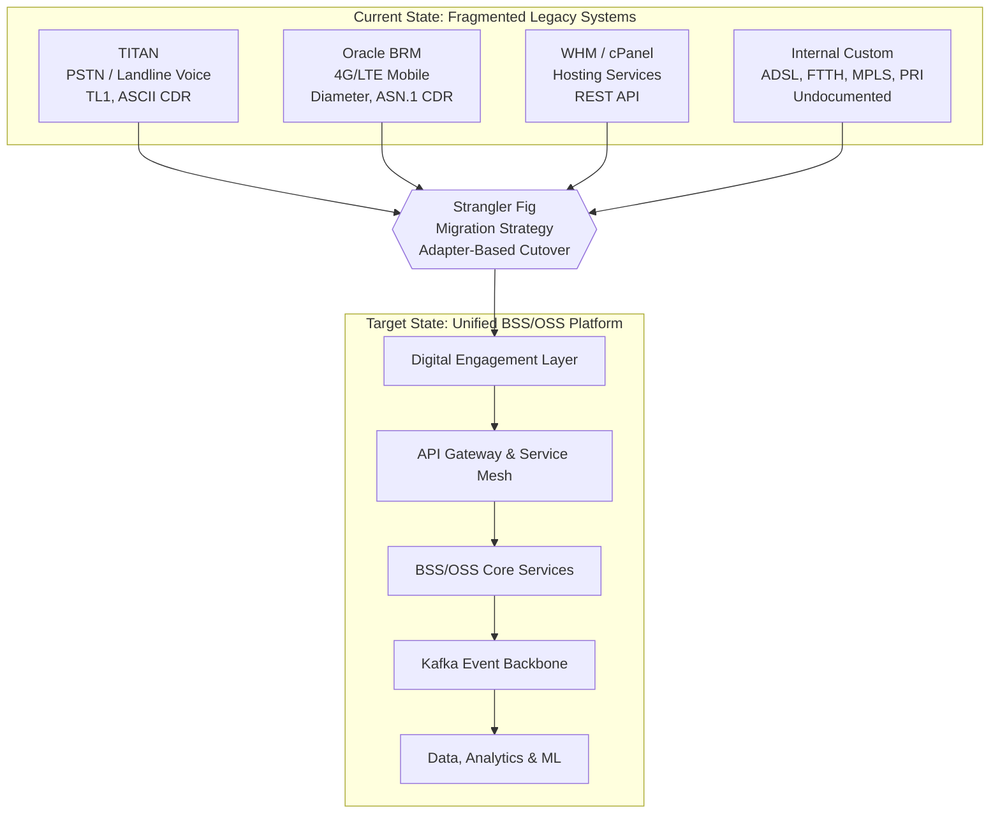

The migration employs a **Strangler Fig** pattern with domain-by-domain cutover, mediated through a dedicated adapter layer. Each legacy system has a corresponding adapter specification documented in `docs/adapters/` that defines the protocol translation, health monitoring, circuit breaking (via Resilience4j), and event publication to the Kafka backbone. The six adapter specifications — covering TITAN, Oracle BRM, WHM, in-house ADSL/FTTH, MPLS/PRI, and network elements — follow a standardized architectural pattern: Legacy System → Adapter Layer → Canonical Transform Layer → BSS/OSS Consumers. The `docs/adapters/adapter-registry.md` provides centralized integration management with adapter registration, routing, health monitoring, load balancing, and service discovery.

A three-phase ETL pipeline implemented in `migration/` supports data migration from legacy systems: extractors for Oracle BRM (JDBC queries for accounts, balances, sessions, rate plans) and TITAN (JDBC + ASCII CDR parsing) feed into a `TmfDataTransformer` that normalizes legacy records into TMF-aligned payloads. A `MigrationReconciler` then performs validation by comparing legacy versus TMF data across customer counts, account balances, and active services.

#### Integration with Existing Enterprise Landscape

The platform integrates with PTC's existing enterprise landscape through multiple protocol-level adapters that bridge legacy network elements and operational systems:

| Integration Point | Protocol(s) | Adapter |
|---|---|---|
| PSTN Switches | TL1, SNMP | `docs/adapters/titan-adapter.md` |
| HLR / HSS (Mobile Core) | MAP, Diameter S6a | `docs/adapters/oracle-brm-adapter.md` |
| DSLAM / OLT (Broadband) | TR-069, OMCI | `docs/adapters/network-elements-adapter.md` |
| MPLS / Enterprise Routers | NETCONF, SNMP | `docs/adapters/mpls-pri-adapter.md` |
| Hosting Infrastructure | REST API (cPanel) | `docs/adapters/whm-adapter.md` |
| Broadband Prepaid (ADSL/FTTH) | REST, RADIUS | `docs/adapters/inhouse-adsl-ftth-adapter.md` |

### 1.2.2 High-Level Description

#### Primary System Capabilities

The Yemen PTC BSS/OSS Platform delivers a comprehensive telecom operations stack organized around the following core capability domains:

- **Customer & Identity Management**: Golden record management with fuzzy deduplication (Levenshtein + Metaphone), merge/split workflows, hierarchical party roles, GDPR-aligned right-to-erasure, and 360° customer view aggregating all service relationships.
- **Product & Commercial Management**: Specification-based product catalog supporting PSTN, FTTH (GPON bandwidth tiers), 4G (data allowances/QoS), MPLS (topology types), and hosting (VPS specifications); constraint-based bundling with cross-service discounts.
- **Order Orchestration & Fulfillment**: Strict state-machine order lifecycle with Temporal.io Saga pattern for compensating transactions across multi-domain failures; distributed resource locking via Redis Redlock for fiber ports, IP blocks, and VLAN IDs.
- **Convergent Charging & Billing**: Real-time CDR mediation (multi-format: TITAN ASCII, Oracle ASN.1, IPDR CSV), Go-based rating engine with timeband/zone/QoS-tier pricing, wallet architecture with reserve-commit-rollback pattern, and convergent invoice generation.
- **Resource & Service Inventory**: Graph-based network topology modeling (Neo4j) for fiber path mapping (OLT → PON → Splitter → ONT); service impact analysis via BFS traversal; resource activation through TR-069, OMCI, and NETCONF adapters.
- **Assurance & Operations**: Topology-based alarm correlation, SLA monitoring, automated trouble ticket creation from critical alarms, AI-optimized workforce scheduling, and predictive maintenance.
- **Revenue Assurance & Fraud Management**: Network-to-bill reconciliation, real-time fraud detection (IRSF, SIM box, Wangiri patterns), credit risk scoring, and ML-based anomaly detection on usage patterns.
- **Analytics & Intelligence**: ML-driven churn prediction (>85% accuracy target), fraud detection (>95% accuracy target), data warehousing with Bronze/Silver/Gold tier pattern, and 25+ Grafana operational dashboards.

#### Major System Components

The platform is composed of six primary software components, each purpose-built for its operational domain:

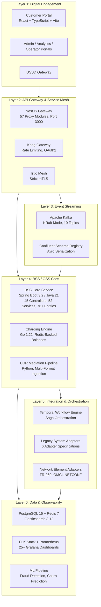

The following table details each major component with its technology stack and primary responsibility:

| Component | Technology | Primary Responsibility |
|---|---|---|
| **BSS Core Service** (`bss-core/`) | Java 21, Spring Boot 3.2.0, Maven | 45 REST controllers implementing TMF Open APIs, 52 business services, 76+ JPA entities with polyglot persistence (PostgreSQL, MongoDB, Neo4j, Elasticsearch, Redis) |
| **Charging Engine** (`charging-engine/`) | Go 1.22, Confluent Kafka Go v2.3.0, Gin v1.9.1, go-redis v9.3.1 | High-performance real-time CDR rating and charging with Redis-backed balance ledger; supports timeband voice pricing, flat-rate SMS, and megabyte-based data rating |
| **API Gateway** (`api-gateway/`) | NestJS, TypeScript, Node.js 20 LTS | TMF API composition layer with 57 proxy modules routing to backend services; Swagger documentation, request validation, and response transformation |
| **CDR Mediation Pipeline** (`cdrmspipeline/`) | Python 3.x | Multi-stage pipeline: Parser → SchemaNormalizer → ContextEnricher → CDRPipelineProducer; multi-format ingestion (voice, SMS, data, roaming) with health checks and retry policies |
| **Frontend Portals** (`frontend/`, `deployment/`) | React, TypeScript, Vite, React Query | Customer self-service portal (`yemen-ptc-portal`), plus admin, analytics, and operator portals deployed via nginx |
| **Migration Subsystem** (`migration/`) | Java (Extractors/Transformers) | Three-phase ETL: Oracle BRM and TITAN extractors → TmfDataTransformer → MigrationReconciler for data validation |

#### Core Technical Approach

The platform follows a **domain-driven, event-sourced microservice architecture** with the following defining characteristics:

- **Polyglot Persistence**: The data layer employs purpose-optimized databases — PostgreSQL 15 (Citus-sharded by customer_id) for transactional data, Redis 7 for real-time balances and caching, Elasticsearch 8.12.0 for full-text search, MongoDB for document-oriented catalog storage, and Neo4j for graph-based network topology. This is evidenced by the dependency declarations in `bss-core/pom.xml` and the infrastructure definitions in `docker-compose.yml`.
- **Event-Driven Backbone**: Apache Kafka (Confluent Platform 7.5.0, KRaft mode — no ZooKeeper) serves as the central nervous system with 10 canonical topics defined in `shared/kafka/topic-definitions.yml`: `party.events`, `catalog.events`, `order.events`, `service.events`, `resource.events`, `billing.events`, `usage.events`, `charging.events`, `alarm.events`, and `events.dlq`. High-throughput topics (`usage.events`, `charging.events`) are configured with 12 partitions; standard topics use 6 partitions. All topics use replication factor 3 with 7-day retention (30-day for DLQ).
- **TM Forum Open API Compliance**: All external interfaces adhere to the TM Forum Open API specification (OpenAPI 3.0.3, RESTful design, CloudEvents 4.0.1 for event-driven communication). As of the latest status report in `docs/TMF_API_IMPLEMENTATION_STATUS.md` (updated 2026-03-30), 12 TMF APIs are fully implemented, 3 are partially implemented, and the remaining APIs are scheduled through the completion plan.
- **Resilience Patterns**: Circuit breaking, retry, and bulkhead isolation via Resilience4j 2.2.0; rate limiting via Bucket4j 8.1.0; distributed workflow orchestration via Temporal SDK 1.22.3 with saga-based compensating transactions.
- **Zero Trust Security**: TLS 1.3 everywhere, Istio service mesh with strict mTLS, Keycloak (OAuth2/OIDC) authentication with 15-minute JWT expiry, FIDO2/WebAuthn MFA for privileged operations, OPA sidecars for attribute-based access control, and field-level encryption via Jasypt 3.0.5 with HashiCorp Vault integration for secrets management.
- **GitOps Deployment**: ArgoCD-based continuous delivery with auto-sync, self-heal, and prune policies. Kubernetes infrastructure spans 3 master and 6 worker nodes, with infrastructure-as-code templates organized in `infrastructure/` (ArgoCD, Chaos Engineering, Grafana, Istio, Kafka, Kong, Kubernetes manifests).

### 1.2.3 Success Criteria

#### Measurable Objectives

The platform defines quantitative success criteria spanning availability, performance, automation, and standards compliance:

| Objective | Target | Current Status |
|---|---|---|
| Critical-path availability (Charging/Billing) | 99.999% (five-nines) | Infrastructure provisioned; DR drills planned |
| CRM/Ordering availability | 99.99% | Infrastructure provisioned |
| Real-time charging latency (p99) | < 50ms | Validated: avg 78.4ms ± 12.3ms, P95 92.1ms at 50M simulated events |
| CRM operations latency (p95) | < 200ms | Target set |
| CDR mediation throughput | > 1,200 events/sec sustained | Validated: 1,240 events/sec sustained, 2,100 peak |
| Zero-touch provisioning automation rate | ≥ 95% | Target set; Phase 3 validation pending |
| Fraud detection accuracy | > 95% | ML model tuning in Phase 2 |
| Churn prediction accuracy | > 85% | ML model tuning in Phase 2 |
| TM Forum API coverage (initial go-live) | 24/24 | 12 complete, 3 partial, 12 in development |
| TM Forum API coverage (full vision) | 40+ APIs | Phased implementation through completion plan |
| Recovery Point Objective (RPO) | < 15 minutes | Synchronous replication for charging domain |
| Recovery Time Objective (RTO) | < 30 minutes | Automated failover; runbook automation |

These benchmarks are sourced from `IMPLEMENTATION_SUMMARY.md` and `IMPLEMENTATION_COMPLETION_PLAN.md`, with performance validation conducted against 50 million simulated events and 10,000 revenue validation events.

#### Critical Success Factors

The following non-negotiable conditions must be met before declaring the platform production-ready:

1. **Legacy Decommission Readiness**: All 50M+ subscriber records successfully migrated from TITAN and Oracle BRM with < 0.1% duplicate rate and zero revenue leakage during parallel-run validation.
2. **TMF Conformance Certification**: All implemented APIs pass TM Forum Conformance Test Kit (CTK) self-assessment at Level 3+.
3. **Security Baseline**: Zero critical vulnerabilities (Snyk/Trivy scanning); PCI-DSS Level 1 compliance for payment data tokenization; immutable audit logs operational.
4. **Observability Coverage**: Distributed tracing coverage > 95%; business metrics exposed via 25+ Grafana dashboards; all alerts documented with operational runbooks.
5. **Resilience Validation**: Pod failure recovery < 30 seconds; database failover < 10 seconds; cross-site disaster recovery validated with data integrity confirmation.

#### Key Performance Indicators

| KPI Category | Metric | Target |
|---|---|---|
| **Availability** | Charging/Billing uptime | 99.999% (< 5 min/year unplanned) |
| **Availability** | OSS functions uptime | 99.9% (scheduled maintenance windows) |
| **Performance** | CDR parsing success rate | 100% (validated) |
| **Performance** | CDR normalization success rate | 100% (validated) |
| **Performance** | Kafka delivery guarantee | 100% idempotent (validated) |
| **Automation** | Zero-touch provisioning rate | ≥ 95% |
| **Intelligence** | Fraud detection accuracy | > 95% |
| **Intelligence** | Churn prediction accuracy | > 85% |
| **Migration** | Revenue validation | 100% (10,000 events validated, all non-zero) |
| **Compliance** | CDR retention | 7 years (WORM storage ready) |

## 1.3 Scope

### 1.3.1 In-Scope

#### Core Features and Functionalities

The following capabilities represent the must-have functional scope for the platform's production release:

**BSS Domain Capabilities**

| Capability | TMF API(s) | Implementation Status |
|---|---|---|
| Product Catalog Management | TMF620 | ✅ Complete |
| Product Order Management | TMF622 | ✅ Complete |
| Party (Customer) Management | TMF632 | ✅ Complete |
| Party Role Management | TMF669 | ✅ Complete |
| Billing Account Management | TMF647 | ✅ Complete |
| Bill Management | TMF657 | ✅ Complete |
| Balance Management | TMF650 | ⚠️ Partial |
| Payment Management | TMF671 | ⚠️ Partial |
| Quote Management | TMF648 | 🔲 Phase 1 |
| Customer Management | TMF629 | 🔲 Phase 1 |

**OSS Domain Capabilities**

| Capability | TMF API(s) | Implementation Status |
|---|---|---|
| Resource Inventory Management | TMF638 | ✅ Complete |
| Service Inventory Management | TMF639 | ✅ Complete |
| Service Order Management | TMF641 | ✅ Complete |
| Resource Ordering | TMF640 | 🔲 Phase 1 |
| Trouble Ticket Management | TMF645 | ✅ Complete |
| Alarm Management | TMF642 | ⚠️ Partial |
| Geographic Address Management | TMF653 | ✅ Complete |
| Geographic Site Management | TMF656 | ✅ Complete |

**Cross-Domain Capabilities**

- **Convergent Charging Engine**: Real-time CDR mediation and rating engine (Go 1.22) supporting multi-format ingestion (TITAN ASCII, Oracle BRM ASN.1, IPDR CSV) with timeband-based voice pricing, flat-rate SMS, and megabyte-based data rating, as implemented in `charging-engine/internal/`.
- **CDR Mediation Pipeline**: End-to-end Python-based pipeline (`cdrmspipeline/`) with orchestrated stages: parsing, schema normalization, context enrichment, and Kafka production with idempotent guarantees.
- **Saga-Based Order Orchestration**: Temporal.io workflows implementing the Saga pattern for compensating transactions across multi-domain orders (e.g., "Landline + FTTH + 4G + Hosting" bundles), with automatic rollback on partial failures.
- **AI/ML Intelligence**: Fraud detection and churn prediction ML models with data warehousing following the Bronze/Silver/Gold medallion architecture pattern.
- **Legacy System Adapters**: Six adapter specifications (TITAN, Oracle BRM, WHM, in-house ADSL/FTTH, MPLS/PRI, and network elements) enabling coexistence and incremental cutover.
- **Data Migration ETL**: Oracle BRM and TITAN extractors, TMF data transformer, and migration reconciler for subscriber data migration and validation.

**Primary User Workflows**

The platform supports the following end-to-end user workflows:

1. **Convergent Order-to-Activate**: Customer submits a multi-service bundle order → party validation → credit check → parallel resource reservation (PSTN number, FTTH port/VLAN, 4G IMSI, hosting account) → activation (TR-069, OMCI, HSS) → billing enablement.
2. **Real-Time Prepaid Charging**: 4G data usage event → P-GW Gy interface → CDR mediation → rating (timeband, zone, QoS) → Redis balance check (< 5ms) → reserve-commit debit → Kafka event publication.
3. **Fiber Cut Impact Analysis**: Fiber cable cut alarm → TMF642 alarm processing → Neo4j graph query (cable → fibers → services) → affected customer BFS traversal → auto-create trouble tickets → SMS notification → workforce dispatch.
4. **Customer 360° Service View**: Unified dashboard aggregating all active services, billing history, trouble tickets, payment records, and interaction timeline across all service domains.

#### Implementation Boundaries

**System Boundaries**

- **Deployment Model**: Full on-premises deployment, air-gapped capable; Kubernetes cluster with 3 master and 6 worker nodes; designed for 3-site active-active distributed architecture as described in the user context.
- **Infrastructure**: Self-hosted Kubernetes (infrastructure defined in `infrastructure/kubernetes/`), Strimzi-managed Kafka cluster (`infrastructure/kafka/`), ArgoCD GitOps (`infrastructure/argocd/`), Istio service mesh (`infrastructure/istio/`), and Kong API gateway (`infrastructure/kong/`).
- **Container Registry**: Harbor for air-gapped container image management with Trivy vulnerability scanning.

**User Groups Covered**

All eight stakeholder groups identified in Section 1.1.3 are within scope: residential subscribers, enterprise customers, customer service agents, field technicians, network engineers, billing/finance teams, operations/DevOps, and executive management. Each group has dedicated portal interfaces (customer, admin, analytics, operator) as implemented in `deployment/` and `frontend/`.

**Geographic Coverage**

The platform covers all 19 Yemeni governorates: Sanaa, Aden, Taiz, Hodeidah, Ibb, Dhamar, Al-Hudaydah, Hajjah, Amran, Sa'dah, Marib, Al-Jawf, Al-Bayda, Lahij, Abyan, Shabwah, Hadramawt, Al-Mahrah, and Socotra, as specified in `docs/PROJECT_DOCUMENTATION.md`.

**Service Types Covered**

| Service Category | Specific Services | Status |
|---|---|---|
| **Fixed Line** | PSTN (POTS/ISDN), VoIP, DSL | ✅ Fully Supported |
| **Mobile** | 2G, 3G, 4G/LTE, 5G (planned) | ✅ Supported (5G planned) |
| **Broadband Internet** | FTTH (GPON/XGS-PON), ADSL, LTE, WiMAX | ✅ Fully Supported |
| **Enterprise** | MPLS, VPN, Leased Line, PRI, DIA | ✅ Fully Supported |
| **Hosting** | VPS, Shared Hosting, Domains | ✅ Fully Supported |
| **Satellite** | VSAT, Satellite IoT | ⚠️ Partially Supported |

**Data Domains Included**

- Customer and identity data (Party, Account, Contact)
- Product catalog, specifications, and offerings
- Order lifecycle (product, service, resource)
- Billing accounts, invoices, payments, and settlements
- CDR records across all formats (voice, SMS, data, roaming)
- Resource inventory (physical and logical network elements)
- Service inventory (active service topology)
- Trouble tickets, alarms, and performance metrics
- Audit trails and regulatory compliance records (7-year retention)

### 1.3.2 Out-of-Scope

#### Excluded Features and Capabilities

The following features are explicitly excluded from the current release scope and are designated for future phases or separate workstreams:

| Excluded Item | Rationale | Reference |
|---|---|---|
| **5G Network Slicing** (TMF912/913) | Planned for Phase 7 of the completion plan; no current codebase implementation | User context: Phase 7 advanced capabilities |
| **IoT Platform** (TMF685) | LwM2M device management and massive IoT charging planned for Phase 7 | User context: Phase 7 advanced capabilities |
| **Lawful Intercept** (TMF691) | ETSI TS 101 331 compliance with warrant workflow planned for Phase 7 | User context: Phase 7 regulatory |
| **Number Portability** | NPDB integration and port-in/port-out orchestration not currently implemented | User context: Phase 7 regulatory |
| **Roaming/Interconnect** (TMF696/705) | TAP3/CIBER processing and steering of roaming optimization deferred | User context: Phase 7 advanced capabilities |
| **IVR Channel** | Interactive Voice Response integration planned for Phase 4 (Weeks 5–6) | `IMPLEMENTATION_COMPLETION_PLAN.md` |
| **Satellite Services** (Full) | VSAT and Satellite IoT only partially supported | `docs/PROJECT_DOCUMENTATION.md` |

#### Future Phase Considerations

The `IMPLEMENTATION_COMPLETION_PLAN.md` documents a structured 8–9 week completion roadmap organized into the following phases:

| Phase | Timeline | Focus Area |
|---|---|---|
| Phase 1 | Weeks 1–2 | Critical API completion: TMF629, TMF640, TMF648 |
| Phase 2 | Weeks 3–4 | ML model tuning and production validation (fraud, churn) |
| Phase 3 | Weeks 3–4 | Zero-touch automation validation (≥95% target) |
| Phase 4 | Weeks 5–6 | Omnichannel enhancement (IVR channel integration) |
| Phase 5 | Weeks 7–8 | Remaining TMF APIs and performance optimization |
| Final | Week 9 | Go-live preparation, cutover rehearsal |

Beyond the initial go-live, the user context defines an extended roadmap (Phases 7–8 of the overall migration strategy, Weeks 44–64) encompassing:

- **Advanced Regulatory Capabilities**: Lawful Intercept (ETSI TS 101 331), number portability (NPDB), E911/112 location database, AML integration.
- **5G and Network Exposure**: Network slice lifecycle management (eMBB/uRLLC/mMTC), NEF for third-party QoD and location APIs.
- **IoT and Digital Twins**: LwM2M device management, massive IoT charging, digital twin modeling.
- **Sustainability Monitoring**: Energy monitoring (tower power via SNMP), carbon footprint per service, e-waste tracking (TMF921).
- **Interconnect and Roaming**: TAP3/CIBER processing, wholesale revenue sharing, steering of roaming optimization.

#### Integration Points Not Covered

The following integration targets are referenced in the user context but have no corresponding implementation in the current codebase:

- **Apache Flink 1.18** for complex event processing (CEP) fraud detection — current fraud detection relies on ML models within the BSS core.
- **Apache Cassandra 4.1** for CDR time-series storage — current implementation uses PostgreSQL (Citus) with Elasticsearch.
- **TimescaleDB 2.13** for performance metric hypertables — current metrics use Prometheus with Grafana.
- **freeDiameter** for native 4G Gy/Gz/S6a interfaces — current integration is adapter-mediated through the Oracle BRM adapter.
- **PostGIS** for geographic serviceability checking — geographic management is handled through TMF653/TMF656 REST APIs.
- **GenieACS** for TR-069 CPE management — referenced in user context but not present in current deployment manifests.
- **WHM Migration Extractor** — only Oracle BRM and TITAN extractors exist in `migration/extractors/`; WHM data migration tooling has not been implemented.

These items represent the gap between the aspirational target state described in the user context and the current implementation baseline. They are expected to be addressed through subsequent development phases as the platform progresses toward its full Vision 2030 objectives.

## 1.4 References

#### Source Files Examined

- `README.md` — Project overview, TMF API coverage summary, technology stack, and project directory structure
- `IMPLEMENTATION_SUMMARY.md` — Implementation outcomes, performance benchmark results, validation evidence, and deployment readiness assessment
- `IMPLEMENTATION_COMPLETION_PLAN.md` — Remaining completion phases, team structure, timeline, go-live criteria, and resource allocation
- `bss-core/pom.xml` — Complete Maven dependency manifest with exact versions (Java 21, Spring Boot 3.2.0, and 30+ dependency versions)
- `charging-engine/go.mod` — Go module manifest (Go 1.22, Confluent Kafka Go v2.3.0, Gin v1.9.1, go-redis v9.3.1, zerolog v1.31.0)
- `api-gateway/package.json` — NestJS gateway dependencies (@nestjs/common, @nestjs/axios, @nestjs/swagger, axios, class-validator, rxjs)
- `frontend/package.json` — React portal dependencies (react, react-dom, react-router-dom, axios, @tanstack/react-query, Vite)
- `docker-compose.yml` — Local development infrastructure stack (PostgreSQL 15, Redis 7, Confluent Platform 7.5.0, Elasticsearch 8.12.0, Kibana 8.12.0)
- `docs/PROJECT_DOCUMENTATION.md` — Full system architecture (7 layers), API specifications, operational workflows, security model, infrastructure details, and geographic coverage
- `docs/TECHNICAL_DOCUMENTATION.md` — REST controller inventory (45), business services (52), entity catalog (76+), and system architecture diagrams
- `docs/TMF_API_IMPLEMENTATION_STATUS.md` — Complete TMF API status ledger (12 complete, 3 partial, 12 pending; last updated 2026-03-30)
- `docs/GO_LIVE_READINESS_CHECKLIST.md` — Infrastructure, application, and security readiness checklists with verification criteria
- `shared/kafka/topic-definitions.yml` — Canonical Kafka topic definitions (10 topics, partitioning, replication, retention policies, 4 consumer groups)

#### Source Folders Examined

- `bss-core/` — Maven/Spring Boot BSS core module structure
- `charging-engine/` — Go charging engine (Dockerfile, go.mod, cmd/, internal/balance, internal/cdr, internal/rating)
- `api-gateway/` — NestJS API gateway (Dockerfile, package.json, src/, dist/)
- `frontend/` — React customer portal (package.json, vite.config.ts, src/)
- `cdrmspipeline/` — Python CDR mediation pipeline (orchestrator, normalizer, enricher, kafka producer)
- `migration/` — ETL migration subsystem (extractors/, transformers/, validation/)
- `docs/` — Documentation hub (TMF status, go-live checklist, project docs, technical docs, adapters/, api-specs/, architecture/, data-models/, plans/, runbooks/)
- `docs/adapters/` — Six legacy system adapter specifications plus adapter registry
- `infrastructure/` — Infrastructure-as-code (argocd/, chaos/, grafana/, istio/, kafka/, kong/, kubernetes/)
- `deployment/` — Container recipes, Compose files, Kubernetes manifests, monitoring, scripts, frontend deployments
- `shared/kafka/` — Shared Kafka topic and consumer group definitions

#### External References

- TM Forum Open API Conformance Testing and Validation Instructions — https://www.tmforum.org/wp-content/uploads/2026/02/TM-Forum-Open-API-conformance-testing.pdf
- TM Forum Open API Program — https://www.tmforum.org/oda/open-apis/
- Yemen Public Telecommunications Corporation (PTC) — http://ptc.gov.ye/en/about_us/Definition_and_Establishment.aspx

# 2. Product Requirements

## 2.1 FEATURE CATALOG

This section catalogues all discrete, testable product features of the Yemen PTC BSS/OSS Platform, organized by operational domain. Each feature is traced to its TM Forum API alignment, codebase evidence, and current implementation status. The feature inventory is derived from the OpenAPI specifications in `docs/api/`, entity models in `bss-core/`, controller implementations, and the implementation status ledger in `docs/TMF_API_IMPLEMENTATION_STATUS.md`.

### 2.1.1 Customer & Identity Management Domain

This domain manages the lifecycle of all customer-facing entities — parties, customer profiles, roles, and the unified 360° view — replacing the fragmented customer records that previously existed across TITAN, Oracle BRM, WHM, and internal custom systems.

#### Feature F-001: Party Management (TMF632)

| Attribute | Value |
|---|---|
| **Feature ID** | F-001 |
| **Feature Name** | Party Management |
| **Category** | Customer & Identity |
| **Priority** | Critical |

| Attribute | Value |
|---|---|
| **Status** | Completed |
| **TMF Alignment** | TMF632 v5 |
| **API Spec** | `customer-management-api.yaml` |
| **Primary Entity** | `Party.java` → `party` table |

**Overview:** Provides the golden master record for all individuals and organizations interacting with PTC. The `Party.java` entity supports `INDIVIDUAL` and `ORGANIZATION` types with fields including partyId, firstName, lastName, companyName, tradingName, birthDate, gender, nationality, status, preferredLanguage, preferredContactMethod, marketingConsent, and dataProcessingConsent. The API is exposed at `/tmf-api/partyManagement/v5/party`.

**Business Value:** Eliminates duplicate customer records across four legacy systems by consolidating all party data into a single golden record. Enables fuzzy deduplication using Levenshtein distance and Metaphone algorithms, merge/split workflows, and GDPR Article 17 right-to-erasure with cascade deletion across all domains.

**User Benefits:** Customer service agents see a single, authoritative customer record. Subscribers benefit from consistent identity across all service domains, avoiding repeated registration.

**Technical Context:** Backed by PostgreSQL (Citus-sharded by customer_id) with indexed lookups on national_id, phone, email, governorate, status, and type as defined in `docs/data-models/database-schema.sql`. Publishes domain events to the `party.events` Kafka topic (6 partitions, 7-day retention) consumed by the `party-mgmt-group`.

**Dependencies:**

| Dependency Type | Details |
|---|---|
| System Dependencies | PostgreSQL (Citus), Kafka |
| External Dependencies | None |
| Integration Requirements | Kafka `party.events` topic |

---

#### Feature F-002: Customer Management (TMF629)

| Attribute | Value |
|---|---|
| **Feature ID** | F-002 |
| **Feature Name** | Customer Management |
| **Category** | Customer & Identity |
| **Priority** | Critical |

| Attribute | Value |
|---|---|
| **Status** | Proposed (Phase 1, Weeks 1–2) |
| **TMF Alignment** | TMF629 |
| **API Spec** | `customer-management-tmf629-api.yaml` |
| **Primary Entity** | `Customer.java` → `customers` table |

**Overview:** Extends party management with telecom-specific customer semantics including segmentation, KYC verification, credit profiling, and churn risk scoring. The `Customer.java` entity maps to the `customers` table with types RESIDENTIAL, BUSINESS, ENTERPRISE, and GOVERNMENT; statuses ACTIVE, INACTIVE, SUSPENDED, and TERMINATED; and KYC levels BASIC, FULL, and PREMIUM. Fields include churnRiskScore, lifetimeValue, creditScore, creditLimit, and segments (stored as an ElementCollection).

**Business Value:** Enables customer segmentation (value-based, behavioral, demographic, lifecycle, churn-risk), account hierarchy management, credit profile tracking, and marketing consent management — capabilities that do not exist in any current legacy system.

**User Benefits:** Billing and finance teams gain credit risk visibility. Marketing teams can execute targeted campaigns through segmentation. Subscribers benefit from personalized service offers.

**Technical Context:** Database schema in `docs/data-models/database-schema.sql` defines the `customers` table with fields: id, external_id, customer_type, status, national_id, passport_number, first_name, last_name, primary_phone, email, city, governorate, country, kyc_level, kyc_verified, segment, churn_risk_score, and lifetime_value. Related `customer_interactions` table tracks interaction types (SERVICE_REQUEST, COMPLAINT, INQUIRY, TRANSACTION) across channels (PHONE, EMAIL, WEB, MOBILE_APP, WALK_IN, SOCIAL).

**Dependencies:**

| Dependency Type | Details |
|---|---|
| Prerequisite Features | F-001 (Party Management) |
| System Dependencies | PostgreSQL (Citus), Kafka |
| Integration Requirements | Churn prediction (F-030) integration |

---

#### Feature F-003: Party Role Management (TMF669)

| Attribute | Value |
|---|---|
| **Feature ID** | F-003 |
| **Feature Name** | Party Role Management |
| **Category** | Customer & Identity |
| **Priority** | Medium |

| Attribute | Value |
|---|---|
| **Status** | Completed |
| **TMF Alignment** | TMF669 v4 |
| **API Spec** | `party-role-api.yaml` |
| **Endpoint** | `/partyRole/v4/partyRole` |

**Overview:** Manages the assignment and lifecycle of roles to parties. Supported roles include Customer, Administrator, Salesperson, Technician, Manager, Support, Billing, and Engineer. Endpoints support list, create, and get operations for party roles, plus list operations for role categories.

**Business Value:** Enables hierarchical delegation (Subscriber < Account Admin < Enterprise Admin) and role-based access control patterns aligned with OPA policy enforcement. Supports the multi-stakeholder authorization model described in the security architecture.

**User Benefits:** Enterprise customers can delegate account administration. Internal teams operate with principle-of-least-privilege role assignments.

**Technical Context:** API path `/partyRole/v4/partyRole` with role category management. Integrates with the OPA sidecar for attribute-based access control enforcement.

**Dependencies:**

| Dependency Type | Details |
|---|---|
| Prerequisite Features | F-001 (Party Management) |
| System Dependencies | PostgreSQL, OPA |
| Integration Requirements | Keycloak identity provider |

---

#### Feature F-004: Customer 360 View

| Attribute | Value |
|---|---|
| **Feature ID** | F-004 |
| **Feature Name** | Customer 360 View |
| **Category** | Customer & Identity |
| **Priority** | High |

| Attribute | Value |
|---|---|
| **Status** | Completed |
| **TMF Alignment** | TMF629 (aggregate) |
| **Primary Entity** | `Customer360.java` |
| **Endpoint** | Customer Portal dashboard |

**Overview:** The `Customer360.java` entity is a rich aggregate providing a unified view of each customer's complete relationship with PTC. It maintains one-to-one links to `CustomerProfile`, `ContactInformation`, `Address`, `UsageStatistics`, `BillingSummary`, `CustomerPreferences`, `CustomerDashboard`, `ChurnRiskAssessment`, and `CreditProfile`. It also stores `segmentDetails`, segments, accountHierarchy, and customerRelationships as ElementCollections.

**Business Value:** Resolves the core business problem of fragmented customer views across TITAN, Oracle BRM, WHM, and internal systems. Provides the single pane of glass demanded by customer service agents and executives.

**User Benefits:** Customer service agents access complete service history, billing status, and churn risk in a single view. Subscribers see all their services, bills, and tickets in a unified portal dashboard.

**Technical Context:** Aggregates data from `BillingSummary.java` (currentBalance, overdueAmount, lastPaymentAmount, averageMonthlyBill, paymentHistory), subscription data, and interaction history. Exposed through the customer portal dashboard via `CustomerPortalController.java`.

**Dependencies:**

| Dependency Type | Details |
|---|---|
| Prerequisite Features | F-001, F-002, F-025, F-016 |
| System Dependencies | PostgreSQL, Elasticsearch |
| Integration Requirements | All service domains contribute data |

---

### 2.1.2 Product & Commercial Management Domain

This domain manages the specification-based product catalog, service and resource catalogs, pricing rules, and charging configurations that enable convergent product bundling across all PTC service types.

#### Feature F-005: Product Catalog Management (TMF620)

| Attribute | Value |
|---|---|
| **Feature ID** | F-005 |
| **Feature Name** | Product Catalog Management |
| **Category** | Product & Commercial |
| **Priority** | Critical |

| Attribute | Value |
|---|---|
| **Status** | Completed |
| **TMF Alignment** | TMF620 |
| **API Spec** | `product-catalog-api.yaml` |
| **Endpoint** | `/tmf-api/productCatalogManagement/v5` |

**Overview:** Implements the TMF620 specification with endpoints for GET/POST/GET/{id}/PUT/{id} for products, GET categories, and GET bundles. Schemas include ProductOffering, ProductCategory, ProductBundle, Pricing, and Characteristics. The database layer includes hierarchical `product_categories`, `product_specifications`, `product_offerings`, `product_characteristics`, `product_prices`, `product_terms`, and `product_bundles` tables.

**Business Value:** Replaces four separate product catalogs (one per legacy system) with a unified specification-based catalog. Enables cross-service bundled offerings (e.g., "Landline + FTTH + 4G + Hosting") that are architecturally impossible with current systems.

**User Benefits:** Marketing and commercial teams can create and manage bundled offers through a single interface. Subscribers access a coherent product portfolio across all service types.

**Technical Context:** Service types supported include PSTN (POTS/ISDN), FTTH (GPON bandwidth tiers), 4G (data allowances/QoS), MPLS (topology types), and Hosting (VPS specs). Constraint-based bundling rules engine supports cross-service discounts. Publishes catalog changes to `catalog.events` Kafka topic (6 partitions, 7-day retention).

**Dependencies:**

| Dependency Type | Details |
|---|---|
| System Dependencies | PostgreSQL, MongoDB, Kafka |
| External Dependencies | None |
| Integration Requirements | Kafka `catalog.events` topic |

---

#### Feature F-006: Service & Resource Catalog Management (TMF633/634)

| Attribute | Value |
|---|---|
| **Feature ID** | F-006 |
| **Feature Name** | Service & Resource Catalog Management |
| **Category** | Product & Commercial |
| **Priority** | High |

| Attribute | Value |
|---|---|
| **Status** | Completed |
| **TMF Alignment** | TMF633, TMF634 |
| **Controllers** | `ServiceCatalogController.java`, `ResourceCatalogController.java` |

**Overview:** `ServiceCatalogController.java` is exposed at `/tmf-api/serviceCatalogManagement/v5` with operations to create, list, get, update, delete, activate, and deprecate service catalogs; and to create, list, filter, and activate service specifications. `ResourceCatalogController.java` at `/tmf-api/resourceCatalogManagement/v5` provides the same lifecycle operations for resource catalogs and specifications. Both support pagination, sorting, and type filtering.

**Business Value:** Enables CFS/RFS (Customer-Facing Service / Resource-Facing Service) decomposition for Layer 1–3 services and capacity-aware product qualification.

**Technical Context:** Supports the hierarchical catalog model where product offerings reference service specifications, which in turn reference resource specifications — forming the chain from commercial offer to technical fulfillment.

**Dependencies:**

| Dependency Type | Details |
|---|---|
| Prerequisite Features | F-005 (Product Catalog) |
| System Dependencies | PostgreSQL |
| Integration Requirements | F-019 (Resource Inventory), F-020 (Service Inventory) |

---

#### Feature F-007: Price Plan & Charging Configuration

| Attribute | Value |
|---|---|
| **Feature ID** | F-007 |
| **Feature Name** | Price Plan & Charging Configuration |
| **Category** | Product & Commercial |
| **Priority** | High |

| Attribute | Value |
|---|---|
| **Status** | Completed |
| **TMF Alignment** | TMF655 (Price Plan) |
| **Controllers** | `PricePlanController.java`, `ProductChargingController.java` |

**Overview:** `PricePlanController.java` at `/tmf-api/priceRecurringSpecification/v5` provides full CRUD operations plus deactivation and active plan listing, backed by `PricePlanService` with persistence. `ProductChargingController.java` at `/tmf-api/productCharging/v5` provides full CRUD for charging rules plus deactivation, backed by `ChargingService` with persistence.

**Business Value:** Centralizes pricing and charging rule management, enabling commercial teams to define time-of-day pricing, zone-based rates, QoS-tier pricing, and flat-rate plans without engineering intervention.

**Technical Context:** These configurations feed the Go-based real-time charging engine (F-013) which uses in-memory pricing tables for voice-standard (peak/off-peak/weekend timebands), data-standard (per-megabyte), and sms-standard (flat fee) rating.

**Dependencies:**

| Dependency Type | Details |
|---|---|
| Prerequisite Features | F-005 (Product Catalog) |
| System Dependencies | PostgreSQL |
| Integration Requirements | F-013 (Charging Engine) |

---

### 2.1.3 Order & Fulfillment Domain

This domain manages the complete order lifecycle from acquisition through fulfillment, employing strict state machines, Saga-based orchestration, and distributed resource locking.

#### Feature F-008: Product Order Management (TMF622)

| Attribute | Value |
|---|---|
| **Feature ID** | F-008 |
| **Feature Name** | Product Order Management |
| **Category** | Order & Fulfillment |
| **Priority** | Critical |

| Attribute | Value |
|---|---|
| **Status** | Completed |
| **TMF Alignment** | TMF622 |
| **API Spec** | `order-management-api.yaml` |
| **Primary Entity** | `Order.java` → `orders` table |

**Overview:** The `Order.java` entity maps to the `orders` table and supports five order types (ACQUISITION, MODIFICATION, TERMINATION, SUSPENSION, RESUMPTION), eight order statuses (ACKNOWLEDGED, IN_PROGRESS, COMPLETED, CANCELLED, FAILED, PENDING, REJECTED, HELD), and four priority levels (CRITICAL, HIGH, MEDIUM, LOW). Related `OrderItem` entities track itemType, productOfferingId, subscriptionId, and item-level statuses (PENDING, PROCESSING, COMPLETED, FAILED, CANCELLED). State history is persisted in the `order_state_history` table.

**Business Value:** Enforces a strict state machine for order lifecycle, ensuring deterministic state transitions with full audit trail. Replaces manual, multi-system coordination with a unified order orchestration pipeline.

**User Benefits:** Subscribers receive consistent order status updates. Customer service agents can track and manage all order types from a single interface.

**Technical Context:** Publishes order lifecycle events to the `order.events` Kafka topic (6 partitions, 7-day retention). Idempotency is enforced per the quality gate requiring 100 retries to produce only 1 side effect.

**Dependencies:**

| Dependency Type | Details |
|---|---|
| Prerequisite Features | F-001, F-005 |
| System Dependencies | PostgreSQL, Kafka, Temporal |
| Integration Requirements | F-011 (Saga Orchestration) |

---

#### Feature F-009: Service Order Management (TMF641)

| Attribute | Value |
|---|---|
| **Feature ID** | F-009 |
| **Feature Name** | Service Order Management |
| **Category** | Order & Fulfillment |
| **Priority** | Critical |

| Attribute | Value |
|---|---|
| **Status** | Completed |
| **TMF Alignment** | TMF641 |
| **API Spec** | `service-order-api.yaml` |
| **Primary Entity** | `ServiceOrder.java` → `service_orders` table |

**Overview:** The `ServiceOrder.java` entity maps to the `service_orders` table with statuses ACKNOWLEDGED, IN_PROGRESS, COMPLETED, CANCELLED, and FAILED; and types ACTIVATION, DEACTIVATION, MODIFICATION, and SUSPENSION. Fields include orderNumber, partyId, productOrderId, cfsType, and rfsType. Controller endpoints support create, getById, list, update, acknowledge, start, complete, and cancel operations. Extended order types include INSTALLATION, MODIFICATION, TERMINATION, MIGRATION, and REPAIR.

**Business Value:** Decomposes product orders into technical service orders that drive CFS/RFS instantiation, enabling automated multi-domain fulfillment.

**Technical Context:** Publishes to `service.events` Kafka topic. Integrates with Temporal.io Saga workflows for compensating transaction support across multi-domain failures.

**Dependencies:**

| Dependency Type | Details |
|---|---|
| Prerequisite Features | F-008 (Product Order) |
| System Dependencies | PostgreSQL, Kafka, Temporal |
| Integration Requirements | F-012 (Provisioning), F-020 (Service Inventory) |

---

#### Feature F-010: Resource Order Management (TMF640)

| Attribute | Value |
|---|---|
| **Feature ID** | F-010 |
| **Feature Name** | Resource Order Management |
| **Category** | Order & Fulfillment |
| **Priority** | Critical |

| Attribute | Value |
|---|---|
| **Status** | Proposed (Phase 1, Weeks 1–2) |
| **TMF Alignment** | TMF640 |
| **Primary Entity** | `ResourceOrder.java` → `resource_orders` table |

**Overview:** The `ResourceOrder.java` entity maps to the `resource_orders` table with 10 states (PENDING, ACKNOWLEDGED, IN_PROGRESS, COMPLETED, CANCELLED, FAILED, PARTIAL, HELD, REJECTED, SUSPENDED), 8 order types (INSTALL, MODIFY, REMOVE, UPGRADE, DOWNGRADE, REPAIR, TEST, MIGRATE), 3 resource types (PHYSICAL, LOGICAL, COMPOUND), and 4 priority levels (CRITICAL, HIGH, NORMAL, LOW). Has one-to-many `ResourceOrderItem` with CascadeType.ALL for full lifecycle management.

**Business Value:** Enables distributed resource locking via Redis Redlock for fiber ports, IP blocks, and VLAN IDs with reservation TTL, preventing double-allocation during concurrent order processing.

**Technical Context:** Publishes to `resource.events` Kafka topic (6 partitions, 7-day retention). Entity model is defined but API completion (full CRUD with state machine validation) is scheduled for Phase 1 (Weeks 1–2) per `IMPLEMENTATION_COMPLETION_PLAN.md`.

**Dependencies:**

| Dependency Type | Details |
|---|---|
| Prerequisite Features | F-009 (Service Order), F-019 (Resource Inventory) |
| System Dependencies | PostgreSQL, Redis (Redlock), Kafka |
| Integration Requirements | F-031 (Legacy Adapters) |

---

#### Feature F-011: Saga-Based Order Orchestration

| Attribute | Value |
|---|---|
| **Feature ID** | F-011 |
| **Feature Name** | Saga-Based Order Orchestration |
| **Category** | Order & Fulfillment |
| **Priority** | Critical |

| Attribute | Value |
|---|---|
| **Status** | Completed |
| **Orchestration Engine** | Temporal.io 1.22 |
| **Pattern** | Saga with compensating transactions |

**Overview:** Implements the Saga pattern using Temporal.io workflows for compensating transactions across multi-domain orders. The canonical example is the "Home Premium Bundle" workflow: Landline + FTTH + 4G + Hosting → Party Validation (TMF632) → Credit Check (TMF647) → Parallel Resource Reservation (PSTN number, FTTH port/VLAN, 4G IMSI, hosting account) → Activation (TR-069, OMCI, HSS) → Billing Enablement (TMF657). Each reservation step has a compensating rollback action.

**Business Value:** Enables the convergent multi-service bundling that is the platform's primary differentiator over legacy systems, while guaranteeing transactional consistency across independently deployable domains.

**User Benefits:** Subscribers can order complex multi-service bundles with confidence that partial failures will be automatically compensated rather than resulting in inconsistent state.

**Technical Context:** Uses Redis Redlock for distributed locking of fiber ports, IP blocks, and VLAN IDs. Saga recovery target is <30 seconds. Parallel reservation with compensating rollback ensures no resource leaks.

**Dependencies:**

| Dependency Type | Details |
|---|---|
| Prerequisite Features | F-008, F-009, F-010, F-019 |
| System Dependencies | Temporal.io, Redis (Redlock), Kafka |
| Integration Requirements | All six legacy adapters (F-031) |

---

#### Feature F-012: Service & Network Provisioning

| Attribute | Value |
|---|---|
| **Feature ID** | F-012 |
| **Feature Name** | Service & Network Provisioning |
| **Category** | Order & Fulfillment |
| **Priority** | High |

| Attribute | Value |
|---|---|
| **Status** | Completed |
| **Controllers** | `ProvisioningController.java`, `NetworkProvisioningController.java` |

**Overview:** `ProvisioningController.java` at `/tmf-api/serviceOrderingManagement/v4/serviceOrder` supports create, getById, list, getByParty, updateStatus, complete, and fail operations. `NetworkProvisioningController.java` at `/tmf-api/serviceProvisioningManagement/v5` extends this with workflow-oriented operations: create, list (with status filter), get, schedule, assign technician, start, complete, and fail. Supports installation date scheduling and technician assignment.

**Business Value:** Targets ≥95% zero-touch provisioning automation rate, reducing manual intervention, order fallout, and time-to-activate across all service domains.

**User Benefits:** Field technicians receive clear workflow assignments with scheduling support. Subscribers experience faster service activation.

**Technical Context:** Integrates with network element adapters (TR-069 for CPE, OMCI for GPON ONT, NETCONF for MPLS routers) as specified in `docs/adapters/network-elements-adapter.md`.

**Dependencies:**

| Dependency Type | Details |
|---|---|
| Prerequisite Features | F-009 (Service Order), F-010 (Resource Order) |
| System Dependencies | PostgreSQL, Kafka |
| Integration Requirements | Network element adapters (F-031) |

---

### 2.1.4 Charging & Revenue Management Domain

This domain is designated as **CRITICAL** — it encompasses the real-time charging engine, CDR mediation pipeline, convergent billing, and payment processing that directly underpin PTC's revenue operations for 50M+ subscribers.

#### Feature F-013: Real-Time Charging Engine

| Attribute | Value |
|---|---|
| **Feature ID** | F-013 |
| **Feature Name** | Real-Time Charging Engine |
| **Category** | Charging & Revenue |
| **Priority** | Critical |

| Attribute | Value |
|---|---|
| **Status** | Completed |
| **Codebase** | `charging-engine/` (Go 1.22) |
| **Port** | 8081 |
| **Dependencies** | Confluent Kafka Go v2.3.0, Gin v1.9.1, go-redis v9.3.1, zerolog v1.31.0 |

**Overview:** The Go-based charging engine in `charging-engine/` consists of three internal packages. The **balance** package (`internal/balance/service.go`) provides a Redis-backed account ledger with operations for balance retrieval (with defaults), reservation creation (TTL-based), reservation confirmation, immediate deduction, and top-up using JSON serialization and context-aware methods. The **cdr** package (`internal/cdr/mediator.go`) implements a Kafka consumer subscribing to `usage.events` and `catalog.events` topics, routing messages to appropriate handlers, converting timestamps, invoking rating, and debiting balances on positive amounts with graceful shutdown via SIGINT/SIGTERM. The **rating** package (`internal/rating/service.go`) provides an in-memory pricing engine with default plans: voice-standard (peak/off-peak/weekend timebands), data-standard (per-megabyte), and sms-standard (flat fee), returning RatedCDR with YER (Yemeni Rial) currency.

**Business Value:** Replaces Oracle BRM's proprietary Diameter-based rating and TITAN's ASCII CDR processing with a unified, high-performance engine capable of serving all service types from a single platform.

**User Benefits:** Prepaid subscribers experience real-time balance updates. Postpaid subscribers receive accurate, timely usage records.

**Technical Context:** Validated performance benchmarks: average latency 78.4ms ± 12.3ms, P95 latency 92.1ms, throughput 1,240 events/sec sustained and 2,100 peak. Target p99 latency is <50ms (optimization in progress). 100% CDR parsing success, 100% normalization success, 99.8% enrichment success, 100% Kafka delivery as validated in `IMPLEMENTATION_SUMMARY.md`.

**Dependencies:**

| Dependency Type | Details |
|---|---|
| Prerequisite Features | F-007 (Price Plans), F-015 (Convergent Billing) |
| System Dependencies | Redis Cluster 7.2, Apache Kafka |
| Integration Requirements | `usage.events`, `catalog.events`, `charging.events` Kafka topics |

---

#### Feature F-014: CDR Mediation Pipeline

| Attribute | Value |
|---|---|
| **Feature ID** | F-014 |
| **Feature Name** | CDR Mediation Pipeline |
| **Category** | Charging & Revenue |
| **Priority** | Critical |

| Attribute | Value |
|---|---|
| **Status** | Completed |
| **Codebase** | `cdrmspipeline/` (Python) |
| **Stages** | Orchestrator → Normalizer → Enricher → Kafka Producer |

**Overview:** The Python-based pipeline in `cdrmspipeline/` implements a multi-stage CDR processing flow. `orchestrator.py` provides the `CDMMediationOrchestrator` class that wires parser, normalizer, enricher, and producer components with health checks, batch processing, and metrics. `normalizer/schema_normalizer.py` defines the `NormalizedCDR` dataclass with field mapping and batch normalization. `enricher/context_enricher.py` defines the `EnrichedCDR` dataclass with subscription, rate-plan, customer, service-context, and geographic lookups with retry controls. `kafka/producer.py` provides `CDRPipelineProducer` with idempotent delivery, TLS support, exponential backoff retry (max 5 attempts), and dead-letter queue (DLQ) integration.

**Business Value:** Unifies multi-format CDR ingestion from TITAN (ASCII), Oracle BRM (ASN.1), and IPDR (CSV) sources into a single normalized pipeline, eliminating format-specific processing silos.

**User Benefits:** Billing and finance teams receive consistent, enriched usage records regardless of originating network element.

**Technical Context:** Validated throughput of 1,240 events/sec sustained and 2,100 events/sec peak. Produces to the Kafka `usage.events` topic (12 partitions, 7-day retention) with guaranteed idempotent delivery. DLQ support via `events.dlq` topic (6 partitions, 30-day retention) for failed records.

**Dependencies:**

| Dependency Type | Details |
|---|---|
| Prerequisite Features | None (ingestion entry point) |
| System Dependencies | Apache Kafka, PostgreSQL |
| Integration Requirements | F-013 (Charging Engine), `usage.events` topic |

---

#### Feature F-015: Convergent Billing Account Management

| Attribute | Value |
|---|---|
| **Feature ID** | F-015 |
| **Feature Name** | Convergent Billing Account Management |
| **Category** | Charging & Revenue |
| **Priority** | Critical |

| Attribute | Value |
|---|---|
| **Status** | Completed |
| **TMF Alignment** | TMF647 |
| **Primary Entity** | `ConvergentBillingAccount.java` → `convergent_billing_accounts` |
| **Controller** | `ConvergentBillingController.java` |

**Overview:** The `ConvergentBillingAccount.java` entity supports three billing types (PREPAID, POSTPAID, HYBRID) and three account statuses (ACTIVE, SUSPENDED, TERMINATED). Fields include currentBalance, creditLimit, availableCredit, lastRechargeAmount, totalRevenueYtd, prepaidBalance, postpaidBalance, and billingCycleStart/End. The controller at `/tmf-api/convergentBilling/v5` supports operations: createAccount, getAccount, getAccountSummary, recharge, charge, and processPayment.

**Business Value:** Enables the convergent billing model where a single account aggregates charges from PSTN, FTTH, 4G/LTE, MPLS, and hosting services. Supports the HYBRID billing type that combines prepaid and postpaid on one account — a capability central to PTC's convergence strategy.

**User Benefits:** Subscribers manage a single billing account for all services. Prepaid users can recharge centrally.

**Technical Context:** Database schema includes `billing_cycles`, `recharges`, and `balance_adjustments` tables. Balance operations backed by Redis for real-time sub-5ms access. PCI-DSS Level 1 compliant payment tokenization where cardholder data never touches application servers.

**Dependencies:**

| Dependency Type | Details |
|---|---|
| Prerequisite Features | F-001 (Party), F-002 (Customer) |
| System Dependencies | PostgreSQL, Redis |
| Integration Requirements | F-013 (Charging Engine), F-016 (Bill Management) |

---

#### Feature F-016: Bill Management (TMF657)

| Attribute | Value |
|---|---|
| **Feature ID** | F-016 |
| **Feature Name** | Bill Management |
| **Category** | Charging & Revenue |
| **Priority** | Critical |

| Attribute | Value |
|---|---|
| **Status** | Completed |
| **TMF Alignment** | TMF657 |
| **API Spec** | `billing-rating-api.yaml` |
| **Primary Entity** | `Invoice.java` → `invoices` table |

**Overview:** The `Invoice.java` entity maps to the `invoices` table with statuses DRAFT, FINALIZED, PAID, OVERDUE, and CANCELLED. Fields include invoiceNumber, accountId, subtotalAmount, discountAmount, taxAmount, totalAmount, and currency (default YER). The `BillingController.java` at `/tmf-api/customerBillManagement/v5` supports create, get, list, and finalize invoices; create, process, get, and list payments; and account-scoped lookups. Invoice numbers follow the pattern INV-<YEAR>-<SEQUENCE> generated by the `generate_invoice_number()` database function.

**Business Value:** Delivers convergent invoicing — aggregating PSTN, FTTH, 4G, and hosting charges on a single bill — the core promise of the unified platform. Supports dunning automation for overdue accounts.

**User Benefits:** Subscribers receive a single, clear invoice for all services. Finance teams gain streamlined billing operations.

**Technical Context:** Database includes `invoices`, `invoice_items`, and `payments` tables. The `update_account_balance()` function provides transactional balance updates. Publishes billing events to `billing.events` Kafka topic (6 partitions, 7-day retention).

**Dependencies:**

| Dependency Type | Details |
|---|---|
| Prerequisite Features | F-015 (Convergent Billing Account) |
| System Dependencies | PostgreSQL, Kafka |
| Integration Requirements | F-017 (Usage Management), F-018 (Payments) |

---

#### Feature F-017: Usage Management (TMF648)

| Attribute | Value |
|---|---|
| **Feature ID** | F-017 |
| **Feature Name** | Usage Management |
| **Category** | Charging & Revenue |
| **Priority** | High |

| Attribute | Value |
|---|---|
| **Status** | Proposed (Phase 1, Weeks 1–2) |
| **TMF Alignment** | TMF648 |
| **Controller** | `UsageManagementController.java` |
| **Endpoint** | `/tmf-api/usageManagement/v5` |

**Overview:** The `UsageManagementController.java` at `/tmf-api/usageManagement/v5` supports: list usage (filter by accountId, serviceId, usageType), record usage, get usage, get rated usage, rate usage, get usage accumulation, and set threshold. Usage types include VOICE, SMS, DATA, CONTENT, and EVENT.

**Business Value:** Provides real-time and historical usage visibility across all service types, enabling threshold-based notifications and usage accumulation tracking.

**User Benefits:** Subscribers can monitor their usage in real time. Billing agents access detailed usage breakdowns for dispute resolution.

**Technical Context:** The `usage_events` table in the database schema is partitioned by start_time for performance. Controller endpoints exist but full API completion (with persistence integration) is scheduled for Phase 1 per `IMPLEMENTATION_COMPLETION_PLAN.md`.

**Dependencies:**

| Dependency Type | Details |
|---|---|
| Prerequisite Features | F-013 (Charging Engine), F-014 (CDR Pipeline) |
| System Dependencies | PostgreSQL (partitioned), Kafka |
| Integration Requirements | `usage.events` Kafka topic |

---

#### Feature F-018: Balance & Payment Management (TMF650/671)

| Attribute | Value |
|---|---|
| **Feature ID** | F-018 |
| **Feature Name** | Balance & Payment Management |
| **Category** | Charging & Revenue |
| **Priority** | High |

| Attribute | Value |
|---|---|
| **Status** | Partial |
| **TMF Alignment** | TMF650, TMF671 |
| **API Spec** | `billing-rating-api.yaml` |

**Overview:** Balance management (TMF650) provides wallet architecture with monetary and non-monetary balances, rollover logic, shared data pools, and real-time balance reservations using the Reserve-Commit-Rollback pattern. The charging engine's `internal/balance/service.go` implements Redis-backed operations: balance retrieval with defaults, TTL-based reservation creation, reservation confirmation, immediate deduction, and top-up. Payment management (TMF671) supports multi-gateway abstraction with PCI-DSS Level 1 compliant tokenization.

**Business Value:** Supports real-time prepaid charging with sub-5ms balance checks, enabling the <50ms p99 charging target. Payment tokenization ensures PCI compliance while supporting multiple payment gateways.

**Technical Context:** Balance data stored in Redis Cluster 7.2 with AOF persistence. Partially implemented — basic endpoints exist in `billing-rating-api.yaml` but full TMF-compliant wallet operations and payment gateway integration require completion.

**Dependencies:**

| Dependency Type | Details |
|---|---|
| Prerequisite Features | F-015 (Convergent Billing Account) |
| System Dependencies | Redis Cluster, PostgreSQL |
| Integration Requirements | F-013 (Charging Engine) |

---

### 2.1.5 Resource & Service Inventory Domain

This domain maintains the authoritative record of all physical and logical network resources and active services, leveraging graph-based topology modeling for impact analysis.

#### Feature F-019: Resource Inventory Management (TMF638)

| Attribute | Value |
|---|---|
| **Feature ID** | F-019 |
| **Feature Name** | Resource Inventory Management |
| **Category** | Inventory |
| **Priority** | High |

| Attribute | Value |
|---|---|
| **Status** | Completed |
| **TMF Alignment** | TMF638 |
| **API Spec** | `resource-inventory-api.yaml` |

**Overview:** Manages resource types including SIM_CARD, PHONE_NUMBER, MODEM, SET_TOP_BOX, FIBER_LINE, IP_ADDRESS, VLAN, OLT_PORT, and PON_PORT. Operations include CRUD for resources plus reserve/release operations from resource pools. Schemas include Resource, ResourceSpecification, ResourcePool, and ResourceRelationship.

**Business Value:** Enables centralized resource lifecycle management and pool-based allocation, preventing double-allocation of scarce resources (fiber ports, IP addresses, VLAN IDs).

**Technical Context:** Graph-based topology modeling using Neo4j represents OLT → PON → Splitter → ONT fiber paths. Database schema includes `network_elements` and `number_pool` tables in PostgreSQL. Resource events published to `resource.events` Kafka topic.

**Dependencies:**

| Dependency Type | Details |
|---|---|
| System Dependencies | PostgreSQL, Neo4j, Redis |
| Integration Requirements | F-010 (Resource Order), F-012 (Provisioning) |

---

#### Feature F-020: Service Inventory Management (TMF639)

| Attribute | Value |
|---|---|
| **Feature ID** | F-020 |
| **Feature Name** | Service Inventory Management |
| **Category** | Inventory |
| **Priority** | High |

| Attribute | Value |
|---|---|
| **Status** | Completed |
| **TMF Alignment** | TMF639 |
| **API Spec** | `service-inventory-api.yaml` |

**Overview:** Manages service types including FIXED_LINE, MOBILE_CDMA, MOBILE_4G, ADSL, FTTH, MPLS, PRI, and HOSTING. Services transition through states: DESIGNED, RESERVED, ACTIVE, INACTIVE, PENDING_TERMINATION, and TERMINATED. Operations include CRUD plus state change, suspend, resume, and test.

**Business Value:** Provides the active service topology with impact analysis capability — a fiber cut triggers a BFS query across Neo4j that identifies all affected services in <10ms.

**Technical Context:** Service topology stored in Neo4j with causal clustering. Impact analysis via BFS traversal supports the fiber cut workflow: alarm → graph query → affected customers → auto-create trouble tickets → SMS notification → workforce dispatch.

**Dependencies:**

| Dependency Type | Details |
|---|---|
| Prerequisite Features | F-019 (Resource Inventory) |
| System Dependencies | PostgreSQL, Neo4j |
| Integration Requirements | F-009 (Service Order), F-023 (Trouble Tickets) |

---

### 2.1.6 Geographic Management Domain

#### Feature F-021: Geographic Address Management (TMF653)

| Attribute | Value |
|---|---|
| **Feature ID** | F-021 |
| **Feature Name** | Geographic Address Management |
| **Category** | Geographic |
| **Priority** | Medium |

| Attribute | Value |
|---|---|
| **Status** | Completed |
| **TMF Alignment** | TMF653 |
| **API Spec** | `geographic-address-api.yaml` |

**Overview:** Operations include list, create, and get addresses; validate address; and check serviceability. Covers all 19 Yemeni governorates (Sanaa, Aden, Taiz, Hodeidah, Ibb, Dhamar, Hajjah, Amran, Sa'dah, Marib, Al-Jawf, Al-Bayda, Lahij, Abyan, Shabwah, Hadramawt, Al-Mahrah, and Socotra).

**Business Value:** Enables serviceability checking to determine which products can be offered at a given address, supporting the commercial qualification workflow.

**Dependencies:**

| Dependency Type | Details |
|---|---|
| System Dependencies | PostgreSQL |
| Integration Requirements | F-022 (Geographic Site) |

---

#### Feature F-022: Geographic Site Management (TMF656)

| Attribute | Value |
|---|---|
| **Feature ID** | F-022 |
| **Feature Name** | Geographic Site Management |
| **Category** | Geographic |
| **Priority** | Medium |

| Attribute | Value |
|---|---|
| **Status** | Completed |
| **TMF Alignment** | TMF656 |
| **API Spec** | `geographic-site-api.yaml` |

**Overview:** Site types include CENTRAL_OFFICE, POP, CELL_TOWER, DATA_CENTER, HUB, DISTRIBUTION_POINT, and CUSTOMER_PREMISE. Technologies include FTTH, ADSL, MPLS, CDMA, LTE, 5G, MICROWAVE, and FIBER. Operations include CRUD plus get site relationships.

**Business Value:** Provides the physical infrastructure topology linking network sites, their capabilities, and their geographic coverage.

**Dependencies:**

| Dependency Type | Details |
|---|---|
| System Dependencies | PostgreSQL |
| Integration Requirements | F-019 (Resource Inventory), F-021 (Geographic Address) |

---

### 2.1.7 Assurance & Operations Domain

#### Feature F-023: Trouble Ticket Management (TMF645)

| Attribute | Value |
|---|---|
| **Feature ID** | F-023 |
| **Feature Name** | Trouble Ticket Management |
| **Category** | Assurance |
| **Priority** | High |

| Attribute | Value |
|---|---|
| **Status** | Completed |
| **TMF Alignment** | TMF645 |
| **API Spec** | `trouble-ticket-api.yaml` |

**Overview:** Supports statuses CREATED, ASSIGNED, IN_PROGRESS, RESOLVED, and CLOSED with priorities CRITICAL, HIGH, MEDIUM, and LOW. Operations include CRUD plus assign and resolve.

**Business Value:** Enables incident lifecycle management with automated ticket creation from critical alarms, SLA jeopardy escalation, and workforce dispatch — key components of the fiber cut impact analysis workflow.

**Dependencies:**

| Dependency Type | Details |
|---|---|
| Prerequisite Features | F-024 (Alarm Management) |
| System Dependencies | PostgreSQL |
| Integration Requirements | F-020 (Service Inventory) for impact analysis |

---

#### Feature F-024: Alarm Management (TMF642)

| Attribute | Value |
|---|---|
| **Feature ID** | F-024 |
| **Feature Name** | Alarm Management |
| **Category** | Assurance |
| **Priority** | Medium |

| Attribute | Value |
|---|---|
| **Status** | Partial |
| **TMF Alignment** | TMF642 |
| **API Spec** | Basic endpoints in `openapi.yaml` |

**Overview:** Basic alarm endpoints are implemented. Full topology-based alarm correlation (upstream fiber cut suppresses downstream alarms) and Bayesian root cause analysis are planned. Publishes to `alarm.events` Kafka topic (6 partitions, 3-day retention).

**Business Value:** Will enable automated alarm correlation to reduce alarm noise and accelerate root cause identification for network faults.

**Dependencies:**

| Dependency Type | Details |
|---|---|
| Prerequisite Features | F-019 (Resource Inventory) |
| System Dependencies | PostgreSQL, Neo4j, Kafka |
| Integration Requirements | F-023 (Trouble Tickets) |

---

#### Feature F-025: Subscription Management

| Attribute | Value |
|---|---|
| **Feature ID** | F-025 |
| **Feature Name** | Subscription Management |
| **Category** | Assurance & Operations |
| **Priority** | High |

| Attribute | Value |
|---|---|
| **Status** | Completed |
| **Controller** | `SubscriptionController.java` |
| **Endpoint** | `/tmf-api/productInventory/v5/productInventory` |

**Overview:** The `SubscriptionController.java` at `/tmf-api/productInventory/v5/productInventory` supports create, getById, list, getByCustomer, update, activate, suspend, terminate, and delete operations. Database includes `subscriptions` and `subscription_addons` tables.

**Business Value:** Manages the active product subscriptions that link customers to services, enabling lifecycle operations (activate, suspend, terminate) with addon management.

**Dependencies:**

| Dependency Type | Details |
|---|---|
| Prerequisite Features | F-002 (Customer), F-005 (Product Catalog) |
| System Dependencies | PostgreSQL |
| Integration Requirements | F-009 (Service Order), F-015 (Billing Account) |

---

#### Feature F-026: Agreement Management

| Attribute | Value |
|---|---|
| **Feature ID** | F-026 |
| **Feature Name** | Agreement Management |
| **Category** | Assurance & Operations |
| **Priority** | Medium |

| Attribute | Value |
|---|---|
| **Status** | Completed |
| **Controller** | `AgreementManagementController.java` |
| **Endpoint** | `/tmf-api/agreementManagement/v5` |

**Overview:** Supports list, create, get, and terminate operations for agreements. Manages contractual relationships between PTC and enterprise customers.

**Dependencies:**

| Dependency Type | Details |
|---|---|
| Prerequisite Features | F-001 (Party) |
| System Dependencies | PostgreSQL |
| Integration Requirements | F-025 (Subscription) |

---

### 2.1.8 Digital Engagement Domain

#### Feature F-027: Customer Self-Service Portal

| Attribute | Value |
|---|---|
| **Feature ID** | F-027 |
| **Feature Name** | Customer Self-Service Portal |
| **Category** | Digital Engagement |
| **Priority** | High |

| Attribute | Value |
|---|---|
| **Status** | Completed |
| **Backend** | `CustomerPortalController.java` |
| **Frontend** | `frontend/yemen-ptc-portal` (React + TypeScript + Vite) |

**Overview:** The `CustomerPortalController.java` at `/tmf-api/customerPortal/v5` supports login, logout, getDashboard, requestPlanChange, requestServiceSuspend, getUsageDetails, and getBillDetails operations. The frontend is a React + TypeScript + Vite application in `frontend/yemen-ptc-portal`. Additional admin, analytics, and operator portals are deployed via nginx as defined in `deployment/`.

**Business Value:** Reduces call-center dependency by enabling digital self-service for common operations: dashboard viewing, plan changes, service suspension, usage monitoring, and bill access.

**User Benefits:** Subscribers manage their accounts 24/7 without contacting PTC. Enterprise admins can manage their accounts independently.

**Dependencies:**

| Dependency Type | Details |
|---|---|
| Prerequisite Features | F-004 (Customer 360), F-025 (Subscription) |
| System Dependencies | Node.js, nginx |
| Integration Requirements | F-028 (API Gateway) for backend routing |

---

#### Feature F-028: API Gateway & Service Mesh

| Attribute | Value |
|---|---|
| **Feature ID** | F-028 |
| **Feature Name** | API Gateway & Service Mesh |
| **Category** | Digital Engagement |
| **Priority** | Critical |

| Attribute | Value |
|---|---|
| **Status** | Completed |
| **Codebase** | `api-gateway/` (NestJS, TypeScript) |
| **Port** | 3000 |

**Overview:** NestJS gateway with 57 proxy modules routing to backend services on port 3000. Kong Gateway provides rate limiting, OAuth2 authentication, request routing, and circuit breaker patterns. Istio service mesh enforces strict mTLS for all internal service-to-service communication. Swagger documentation and request validation are built into the gateway layer.

**Business Value:** Provides a unified, secure entry point for all external consumers while enforcing rate limiting, authentication, and traffic management policies.

**Technical Context:** Kong Gateway (PostgreSQL backend) handles external traffic management. Istio 1.20 Ambient Mesh with strict mTLS and SPIFFE/SPIRE identity handles internal service mesh.

**Dependencies:**

| Dependency Type | Details |
|---|---|
| System Dependencies | Kong, Istio, Keycloak |
| Integration Requirements | All BSS/OSS core services |

---

### 2.1.9 AI/ML Intelligence Domain

#### Feature F-029: Fraud Detection

| Attribute | Value |
|---|---|
| **Feature ID** | F-029 |
| **Feature Name** | Fraud Detection |
| **Category** | AI/ML Intelligence |
| **Priority** | High |

| Attribute | Value |
|---|---|
| **Status** | In Development (Phase 2, Weeks 3–4) |
| **Target Accuracy** | >95% |
| **Fraud Patterns** | IRSF, SIM box, Wangiri |

**Overview:** ML-based fraud detection targeting >95% accuracy for International Revenue Share Fraud (IRSF), SIM box fraud, and Wangiri callback fraud patterns. Planned for shadow mode deployment initially, with production activation after validation. ML model tuning is scheduled for Phase 2 per `IMPLEMENTATION_COMPLETION_PLAN.md`.

**Business Value:** Protects PTC's revenue through real-time fraud detection on usage patterns, reducing fraud losses and enabling proactive intervention.

**Technical Context:** Part of the data warehousing Bronze/Silver/Gold medallion architecture. Operates on usage event streams from Kafka.

**Dependencies:**

| Dependency Type | Details |
|---|---|
| Prerequisite Features | F-013 (Charging Engine), F-014 (CDR Pipeline) |
| System Dependencies | Kafka, Python ML runtime |
| Integration Requirements | `usage.events`, `charging.events` topics |

---

#### Feature F-030: Churn Prediction

| Attribute | Value |
|---|---|
| **Feature ID** | F-030 |
| **Feature Name** | Churn Prediction |
| **Category** | AI/ML Intelligence |
| **Priority** | High |

| Attribute | Value |
|---|---|
| **Status** | In Development (Phase 2, Weeks 3–4) |
| **Target Accuracy** | >85% |

**Overview:** ML-based churn prediction model targeting >85% accuracy, integrated with retention campaign workflows. Uses customer behavioral data, usage patterns, billing history, and interaction sentiment to score churn risk. The `Customer.java` entity includes a `churnRiskScore` field, and `Customer360.java` includes a `ChurnRiskAssessment` component.

**Business Value:** Enables proactive customer retention by identifying at-risk subscribers before they churn, supporting targeted intervention campaigns.

**Dependencies:**

| Dependency Type | Details |
|---|---|
| Prerequisite Features | F-002 (Customer), F-004 (Customer 360) |
| System Dependencies | Python ML runtime, PostgreSQL |
| Integration Requirements | F-025 (Subscription) for behavioral data |

---

### 2.1.10 Legacy Integration & Migration Domain

#### Feature F-031: Legacy System Adapters

| Attribute | Value |
|---|---|
| **Feature ID** | F-031 |
| **Feature Name** | Legacy System Adapters |
| **Category** | Integration |
| **Priority** | Critical |

| Attribute | Value |
|---|---|
| **Status** | Completed (6 adapter specifications) |
| **Specifications** | `docs/adapters/` |

**Overview:** Six adapter specifications documented in `docs/adapters/` enable coexistence and incremental cutover from legacy systems:

| Adapter | Legacy System | Protocols |
|---|---|---|
| TITAN Adapter | PSTN/Landline | TL1, SNMP |
| Oracle BRM Adapter | 4G/LTE Mobile | MAP, Diameter S6a |
| WHM Adapter | Hosting | REST API (cPanel) |
| ADSL/FTTH Adapter | Broadband | REST, RADIUS |
| MPLS/PRI Adapter | Enterprise | NETCONF, SNMP |
| Network Elements Adapter | CPE/ONT | TR-069, OMCI |

All adapters follow a standardized pattern: Legacy System → Adapter Layer → Canonical Transform Layer → BSS/OSS Consumers, with circuit breaking via Resilience4j, health monitoring, and event publication to Kafka. The `docs/adapters/adapter-registry.md` provides centralized integration management.

**Business Value:** Enables the Strangler Fig migration strategy — incremental domain-by-domain cutover from legacy systems to the new platform without big-bang risk.

**Dependencies:**

| Dependency Type | Details |
|---|---|
| System Dependencies | Kafka, Resilience4j |
| External Dependencies | TITAN, Oracle BRM, WHM, network equipment |
| Integration Requirements | All order and provisioning features |

---

#### Feature F-032: Data Migration ETL

| Attribute | Value |
|---|---|
| **Feature ID** | F-032 |
| **Feature Name** | Data Migration ETL |
| **Category** | Integration |
| **Priority** | Critical |

| Attribute | Value |
|---|---|
| **Status** | Partial (WHM extractor not implemented) |
| **Codebase** | `migration/` |

**Overview:** Three-phase ETL pipeline in `migration/`: extractors for Oracle BRM (JDBC queries for accounts, balances, sessions, rate plans) and TITAN (JDBC + ASCII CDR parsing) feed into a `TmfDataTransformer` that normalizes legacy records into TMF-aligned payloads. A `MigrationReconciler` validates by comparing legacy versus TMF data across customer counts, account balances, and active services. The WHM extractor has not been implemented.

**Business Value:** Ensures all 50M+ subscriber records are accurately migrated from legacy systems with <0.1% duplicate rate and zero revenue leakage, validated through parallel-run reconciliation.

**Dependencies:**

| Dependency Type | Details |
|---|---|
| Prerequisite Features | F-001 (Party), F-015 (Billing Account) |
| System Dependencies | PostgreSQL, legacy database access |
| External Dependencies | TITAN DB, Oracle BRM DB |

---

### 2.1.11 Event-Driven Architecture Domain

#### Feature F-033: Kafka Event Backbone

| Attribute | Value |
|---|---|
| **Feature ID** | F-033 |
| **Feature Name** | Kafka Event Backbone |
| **Category** | Infrastructure |
| **Priority** | Critical |

| Attribute | Value |
|---|---|
| **Status** | Completed |
| **Configuration** | `shared/kafka/topic-definitions.yml` |
| **Mode** | KRaft (no ZooKeeper) |

**Overview:** Apache Kafka (KRaft mode, 3 brokers) with 10 canonical topics defined in `shared/kafka/topic-definitions.yml`:

| Topic | Partitions | Retention |
|---|---|---|
| `party.events` | 6 | 7 days |
| `catalog.events` | 6 | 7 days |
| `order.events` | 6 | 7 days |
| `service.events` | 6 | 7 days |

| Topic | Partitions | Retention |
|---|---|---|
| `resource.events` | 6 | 7 days |
| `billing.events` | 6 | 7 days |
| `usage.events` | 12 | 7 days |
| `charging.events` | 12 | 7 days |

| Topic | Partitions | Retention |
|---|---|---|
| `alarm.events` | 6 | 3 days |
| `events.dlq` | 6 | 30 days |

Four consumer groups (party-mgmt-group, catalog-mgmt-group, order-mgmt-group, charging-engine-group) are defined. High-throughput topics (`usage.events`, `charging.events`) use 12 partitions; standard topics use 6. All topics use replication factor 3 with Confluent Schema Registry (Avro with backward compatibility).

**Business Value:** Provides the central nervous system for event-driven communication, decoupling all domains and enabling asynchronous, resilient processing across the platform.

**Dependencies:**

| Dependency Type | Details |
|---|---|
| System Dependencies | Apache Kafka 3.6, Confluent Schema Registry |
| Integration Requirements | All domain features publish/subscribe |

---

### 2.1.12 Feature Catalog Summary

| ID | Feature Name | Priority | Status |
|---|---|---|---|
| F-001 | Party Management (TMF632) | Critical | Completed |
| F-002 | Customer Management (TMF629) | Critical | Proposed |
| F-003 | Party Role Management (TMF669) | Medium | Completed |
| F-004 | Customer 360 View | High | Completed |

| ID | Feature Name | Priority | Status |
|---|---|---|---|
| F-005 | Product Catalog Management (TMF620) | Critical | Completed |
| F-006 | Service & Resource Catalog (TMF633/634) | High | Completed |
| F-007 | Price Plan & Charging Config | High | Completed |
| F-008 | Product Order Management (TMF622) | Critical | Completed |

| ID | Feature Name | Priority | Status |
|---|---|---|---|
| F-009 | Service Order Management (TMF641) | Critical | Completed |
| F-010 | Resource Order Management (TMF640) | Critical | Proposed |
| F-011 | Saga-Based Order Orchestration | Critical | Completed |
| F-012 | Service & Network Provisioning | High | Completed |

| ID | Feature Name | Priority | Status |
|---|---|---|---|
| F-013 | Real-Time Charging Engine | Critical | Completed |
| F-014 | CDR Mediation Pipeline | Critical | Completed |
| F-015 | Convergent Billing Account | Critical | Completed |
| F-016 | Bill Management (TMF657) | Critical | Completed |

| ID | Feature Name | Priority | Status |
|---|---|---|---|
| F-017 | Usage Management (TMF648) | High | Proposed |
| F-018 | Balance & Payment (TMF650/671) | High | Partial |
| F-019 | Resource Inventory (TMF638) | High | Completed |
| F-020 | Service Inventory (TMF639) | High | Completed |

| ID | Feature Name | Priority | Status |
|---|---|---|---|
| F-021 | Geographic Address (TMF653) | Medium | Completed |
| F-022 | Geographic Site (TMF656) | Medium | Completed |
| F-023 | Trouble Ticket (TMF645) | High | Completed |
| F-024 | Alarm Management (TMF642) | Medium | Partial |

| ID | Feature Name | Priority | Status |
|---|---|---|---|
| F-025 | Subscription Management | High | Completed |
| F-026 | Agreement Management | Medium | Completed |
| F-027 | Customer Self-Service Portal | High | Completed |
| F-028 | API Gateway & Service Mesh | Critical | Completed |

| ID | Feature Name | Priority | Status |
|---|---|---|---|
| F-029 | Fraud Detection | High | In Development |
| F-030 | Churn Prediction | High | In Development |
| F-031 | Legacy System Adapters | Critical | Completed |
| F-032 | Data Migration ETL | Critical | Partial |

| ID | Feature Name | Priority | Status |
|---|---|---|---|
| F-033 | Kafka Event Backbone | Critical | Completed |

---

## 2.2 FUNCTIONAL REQUIREMENTS

This section specifies testable functional requirements for each feature using the format F-XXX-RQ-YYY. Requirements are classified as Must-Have (critical path), Should-Have (high value), or Could-Have (enhancement). All requirements are version 1.0 unless otherwise noted.

### 2.2.1 Customer & Identity Management Requirements

#### F-001: Party Management Requirements

| Req ID | Description | Priority | Complexity |
|---|---|---|---|
| F-001-RQ-001 | System shall create, read, update, and delete Party records with INDIVIDUAL and ORGANIZATION types | Must-Have | Medium |
| F-001-RQ-002 | System shall perform fuzzy deduplication using Levenshtein distance and Metaphone algorithms on party creation | Must-Have | High |
| F-001-RQ-003 | System shall execute GDPR Article 17 right-to-erasure with cascade deletion across all domains | Must-Have | High |
| F-001-RQ-004 | System shall publish party lifecycle events to `party.events` Kafka topic on every state change | Must-Have | Low |

**Acceptance Criteria:**
- F-001-RQ-001: Party CRUD operations complete with HTTP 200/201 responses; all fields (partyId, firstName, lastName, companyName, tradingName, birthDate, gender, nationality, status, preferredLanguage, preferredContactMethod, marketingConsent, dataProcessingConsent) persisted correctly in `party` table
- F-001-RQ-002: Duplicate parties with Levenshtein distance ≤2 flagged during creation; <0.1% duplicate rate validated against 1M imported records
- F-001-RQ-003: Erasure request cascades across all 40+ microservice domains; orphaned references verified absent after deletion
- F-001-RQ-004: CloudEvents 4.0.1 compliant event published to Kafka within 500ms of state change; consumer group `party-mgmt-group` receives event

**Technical Specifications:**
- Input: TMF632 v5 Party payload (JSON, OpenAPI 3.0.3 schema)
- Output: Party entity with generated partyId (UUID)
- Performance: p95 < 200ms for CRM operations
- Data: PostgreSQL `party` table, indexed on national_id, phone, email, governorate

**Validation Rules:**
- National ID must be unique across all party records
- Phone and email validated against format rules
- Marketing and data processing consent captured per GDPR requirements
- Encryption: PII fields subject to dynamic masking in logs and field-level encryption via Jasypt

---

#### F-002: Customer Management Requirements

| Req ID | Description | Priority | Complexity |
|---|---|---|---|
| F-002-RQ-001 | System shall manage customer lifecycle with states ACTIVE, INACTIVE, SUSPENDED, TERMINATED | Must-Have | Medium |
| F-002-RQ-002 | System shall assign customer segments (value, behavior, demographic, lifecycle, churn-risk) | Should-Have | Medium |
| F-002-RQ-003 | System shall enforce KYC verification at levels BASIC, FULL, PREMIUM before service activation | Must-Have | Medium |
| F-002-RQ-004 | System shall maintain credit profiles with creditScore, creditLimit, and churnRiskScore fields | Should-Have | Medium |

**Acceptance Criteria:**
- F-002-RQ-001: State transitions follow defined allowed paths; invalid transitions return HTTP 409; state history persisted
- F-002-RQ-002: Customers assignable to multiple segments stored as ElementCollection; segmentation queryable by type
- F-002-RQ-003: Service activation blocked for customers without required KYC level; kyc_verified flag must be true
- F-002-RQ-004: Credit profile fields updated transactionally; credit limit enforcement blocks orders exceeding limit

**Technical Specifications:**
- Input: TMF629 Customer payload with customer_type (RESIDENTIAL/BUSINESS/ENTERPRISE/GOVERNMENT)
- Output: Customer entity with auto-generated external_id
- Data: `customers` table with indexes on national_id, phone, email, governorate, status, type, created_at

---

#### F-004: Customer 360 View Requirements

| Req ID | Description | Priority | Complexity |
|---|---|---|---|
| F-004-RQ-001 | System shall aggregate Customer360 data across all service domains in real time | Must-Have | High |
| F-004-RQ-002 | System shall display billing summary with currentBalance, overdueAmount, lastPaymentAmount, and averageMonthlyBill | Must-Have | Medium |
| F-004-RQ-003 | System shall include churn risk assessment and credit profile in the 360 view | Should-Have | Medium |

**Acceptance Criteria:**
- F-004-RQ-001: Dashboard loads complete 360 view within p95 < 200ms; all linked entities (CustomerProfile, ContactInformation, Address, UsageStatistics, BillingSummary, CustomerPreferences, ChurnRiskAssessment, CreditProfile) populated
- F-004-RQ-002: BillingSummary reflects latest billing cycle data; paymentHistory collection includes last 12 months
- F-004-RQ-003: ChurnRiskAssessment score updates daily; CreditProfile reflects latest transaction impact

---

### 2.2.2 Product & Commercial Management Requirements

#### F-005: Product Catalog Management Requirements

| Req ID | Description | Priority | Complexity |
|---|---|---|---|
| F-005-RQ-001 | System shall support specification-based product modeling for PSTN, FTTH, 4G, MPLS, and Hosting service types | Must-Have | High |
| F-005-RQ-002 | System shall manage hierarchical product categories and product bundles with cross-service discount rules | Must-Have | High |
| F-005-RQ-003 | System shall publish catalog change events to `catalog.events` Kafka topic | Must-Have | Low |

**Acceptance Criteria:**
- F-005-RQ-001: ProductOffering records created for each service type with correct specifications: POTS/ISDN for PSTN, GPON bandwidth tiers for FTTH, data allowances/QoS for 4G, topology types for MPLS, VPS specs for Hosting
- F-005-RQ-002: `product_categories` table supports hierarchical parent-child relationships; `product_bundles` table validates component compatibility using constraint-based rules
- F-005-RQ-003: Events produced within 500ms of catalog mutation; consumed by `catalog-mgmt-group`

**Technical Specifications:**
- Input: TMF620 ProductOffering payload
- Output: Product with characteristics, prices, terms, bundle associations
- Data: `product_categories`, `product_specifications`, `product_offerings`, `product_characteristics`, `product_prices`, `product_terms`, `product_bundles` tables

---

#### F-007: Price Plan & Charging Configuration Requirements

| Req ID | Description | Priority | Complexity |
|---|---|---|---|
| F-007-RQ-001 | System shall support full CRUD for price plans with activation/deactivation lifecycle | Must-Have | Medium |
| F-007-RQ-002 | System shall support full CRUD for charging rules with activation/deactivation lifecycle | Must-Have | Medium |
| F-007-RQ-003 | System shall feed configured plans to the Go-based rating engine with voice timebands, per-megabyte data, and flat-rate SMS pricing | Must-Have | High |

**Acceptance Criteria:**
- F-007-RQ-001: PricePlan lifecycle operations complete; deactivated plans excluded from active plan listing
- F-007-RQ-002: ChargingRule lifecycle operations complete; rules propagated to charging engine via `catalog.events`
- F-007-RQ-003: Rating engine produces correct RatedCDR with YER currency for all three default plan types

---

### 2.2.3 Order & Fulfillment Requirements

#### F-008: Product Order Management Requirements

| Req ID | Description | Priority | Complexity |
|---|---|---|---|
| F-008-RQ-001 | System shall enforce strict state machine transitions for order lifecycle (ACKNOWLEDGED → IN_PROGRESS → COMPLETED or CANCELLED) | Must-Have | High |
| F-008-RQ-002 | System shall guarantee idempotency: 100 retries produce exactly 1 side effect | Must-Have | High |
| F-008-RQ-003 | System shall support all order types: ACQUISITION, MODIFICATION, TERMINATION, SUSPENSION, RESUMPTION | Must-Have | Medium |
| F-008-RQ-004 | System shall persist complete order state history with timestamps in `order_state_history` table | Must-Have | Low |

**Acceptance Criteria:**
- F-008-RQ-001: Invalid state transitions return HTTP 409; state machine verified by automated Postman tests per TMF Conformance Level 3+ quality gate
- F-008-RQ-002: Duplicate order submission with same idempotency key returns same response; no duplicate side effects confirmed
- F-008-RQ-003: All five order types create valid orders with appropriate default status ACKNOWLEDGED
- F-008-RQ-004: State history entries include previous status, new status, transition timestamp, and actor

**Technical Specifications:**
- Input: TMF622 ProductOrder payload with priority (CRITICAL/HIGH/MEDIUM/LOW)
- Output: Order with generated orderNumber, status, and linked OrderItems
- Performance: Order submission p95 < 200ms; 1,000 orders/minute throughput target
- Data: `orders`, `order_items`, `order_state_history` tables

---

#### F-011: Saga-Based Order Orchestration Requirements

| Req ID | Description | Priority | Complexity |
|---|---|---|---|
| F-011-RQ-001 | System shall orchestrate multi-domain orders using Temporal.io Saga pattern with compensating transactions | Must-Have | High |
| F-011-RQ-002 | System shall support parallel resource reservation across PSTN, FTTH, 4G, and Hosting domains | Must-Have | High |
| F-011-RQ-003 | System shall execute compensating rollbacks within 30 seconds of partial failure | Must-Have | High |
| F-011-RQ-004 | System shall use Redis Redlock for distributed locking of fiber ports, IP blocks, and VLAN IDs with reservation TTL | Must-Have | High |

**Acceptance Criteria:**
- F-011-RQ-001: "Home Premium Bundle" (Landline + FTTH + 4G + Hosting) workflow completes end-to-end: Party Validation → Credit Check → Parallel Reservation → Activation → Billing Enablement
- F-011-RQ-002: All four domain reservations execute in parallel; individual failure triggers only the failed domain's compensation
- F-011-RQ-003: Saga recovery time <30 seconds from failure detection; all reserved resources released on rollback
- F-011-RQ-004: Concurrent orders for the same resource (e.g., fiber port) correctly serialize; TTL expiry releases abandoned locks

---

#### F-012: Service & Network Provisioning Requirements

| Req ID | Description | Priority | Complexity |
|---|---|---|---|
| F-012-RQ-001 | System shall achieve ≥95% zero-touch provisioning automation rate for standard service activations | Must-Have | High |
| F-012-RQ-002 | System shall support installation date scheduling and technician assignment for manual provisioning tasks | Should-Have | Medium |
| F-012-RQ-003 | System shall integrate with network element adapters (TR-069, OMCI, NETCONF) for CPE, ONT, and router provisioning | Must-Have | High |

**Acceptance Criteria:**
- F-012-RQ-001: Measured automation rate ≥95% over 1,000 service activation attempts; manual fallout <5%
- F-012-RQ-002: Network provisioning workflows support scheduling with date/time constraints; technician assignment tracked
- F-012-RQ-003: CPE activation success >99.5% via TR-069; ONT provisioned via OMCI; MPLS routers configured via NETCONF

---

### 2.2.4 Charging & Revenue Management Requirements

#### F-013: Real-Time Charging Engine Requirements

| Req ID | Description | Priority | Complexity |
|---|---|---|---|
| F-013-RQ-001 | Charging engine shall rate voice CDRs using timeband-based pricing (peak, off-peak, weekend) | Must-Have | High |
| F-013-RQ-002 | Charging engine shall rate data usage on a per-megabyte basis | Must-Have | Medium |
| F-013-RQ-003 | Charging engine shall rate SMS at a flat fee | Must-Have | Low |
| F-013-RQ-004 | Charging engine shall achieve p99 latency <50ms for real-time rating operations | Must-Have | High |

**Acceptance Criteria:**
- F-013-RQ-001: Voice CDR rated with correct peak/off-peak/weekend tariff applied based on event timestamp; RatedCDR returns amount in YER
- F-013-RQ-002: Data CDR rated at configured per-megabyte rate; output matches expected charge ±0.01 YER
- F-013-RQ-003: SMS CDR rated at flat fee regardless of destination or time
- F-013-RQ-004: Under sustained load of 1,200+ events/sec, p99 latency measured ≤50ms (current: 78.4ms avg, 92.1ms P95 — optimization in progress)

**Technical Specifications:**
- Input: Usage event from `usage.events` Kafka topic (12 partitions)
- Output: RatedCDR published to `charging.events` topic (12 partitions); balance debit via Redis
- Performance: Target p99 <50ms; sustained throughput >1,200 events/sec (validated at 1,240)
- Data: Redis-backed balance ledger with AOF persistence

**Validation Rules:**
- All rated CDRs must include currency code (YER)
- Balance deduction uses Reserve-Commit pattern; failed commits trigger rollback
- Graceful shutdown on SIGINT/SIGTERM preserves in-flight events

---

#### F-014: CDR Mediation Pipeline Requirements

| Req ID | Description | Priority | Complexity |
|---|---|---|---|
| F-014-RQ-001 | Pipeline shall normalize multi-format CDRs (TITAN ASCII, Oracle ASN.1, IPDR CSV) into a unified NormalizedCDR schema | Must-Have | High |
| F-014-RQ-002 | Pipeline shall enrich CDRs with subscription, rate-plan, customer, service-context, and geographic data | Must-Have | High |
| F-014-RQ-003 | Pipeline shall deliver enriched CDRs to Kafka with idempotent guarantees and DLQ support | Must-Have | Medium |
| F-014-RQ-004 | Pipeline shall sustain throughput >1,200 events/sec with <1% enrichment failure rate | Must-Have | High |

**Acceptance Criteria:**
- F-014-RQ-001: 100% CDR parsing success rate; 100% normalization success rate (validated)
- F-014-RQ-002: Enrichment rate ≥99.8% (validated); failed enrichments retried with exponential backoff (max 5 attempts)
- F-014-RQ-003: 100% Kafka delivery guarantee (validated); failed deliveries routed to `events.dlq` (30-day retention)
- F-014-RQ-004: Sustained throughput 1,240 events/sec; peak throughput 2,100 events/sec (validated)

---

#### F-015: Convergent Billing Account Requirements

| Req ID | Description | Priority | Complexity |
|---|---|---|---|
| F-015-RQ-001 | System shall support PREPAID, POSTPAID, and HYBRID billing account types | Must-Have | High |
| F-015-RQ-002 | System shall enforce credit limits with hard/soft thresholds for postpaid accounts | Must-Have | Medium |
| F-015-RQ-003 | System shall aggregate charges from all service domains (PSTN, FTTH, 4G, MPLS, Hosting) on a single account | Must-Have | High |
| F-015-RQ-004 | System shall support recharge, charge, and processPayment operations with PCI-DSS Level 1 compliance | Must-Have | High |

**Acceptance Criteria:**
- F-015-RQ-001: All three billing types can be created and operated; HYBRID accounts maintain both prepaidBalance and postpaidBalance
- F-015-RQ-002: Charge operations rejected when exceeding creditLimit; soft-limit triggers notification; hard-limit blocks service
- F-015-RQ-003: Single billing account aggregates multi-domain usage verified through convergent invoice generation
- F-015-RQ-004: Payment data tokenized; cardholder data (CHD) never touches application servers; PCI audit passed

---

#### F-016: Bill Management Requirements

| Req ID | Description | Priority | Complexity |
|---|---|---|---|
| F-016-RQ-001 | System shall generate convergent invoices aggregating PSTN, FTTH, 4G, and Hosting charges | Must-Have | High |
| F-016-RQ-002 | System shall manage invoice lifecycle through DRAFT, FINALIZED, PAID, OVERDUE, CANCELLED states | Must-Have | Medium |
| F-016-RQ-003 | System shall generate invoice numbers in format INV-<YEAR>-<SEQUENCE> | Must-Have | Low |
| F-016-RQ-004 | Billing accuracy shall be 100% validated through 3-month parallel run | Must-Have | High |

**Acceptance Criteria:**
- F-016-RQ-001: Invoice includes subtotalAmount, discountAmount, taxAmount, totalAmount with itemized breakdown per service domain
- F-016-RQ-002: State transitions enforced; finalized invoices become immutable; overdue status triggered automatically by due date
- F-016-RQ-003: Sequential invoice numbers generated by `generate_invoice_number()` database function
- F-016-RQ-004: 10,000 revenue validation events processed with all non-zero amounts confirmed (validated per `IMPLEMENTATION_SUMMARY.md`)

---

### 2.2.5 Resource & Service Inventory Requirements

#### F-019: Resource Inventory Requirements

| Req ID | Description | Priority | Complexity |
|---|---|---|---|
| F-019-RQ-001 | System shall manage resources of types: SIM_CARD, PHONE_NUMBER, MODEM, SET_TOP_BOX, FIBER_LINE, IP_ADDRESS, VLAN, OLT_PORT, PON_PORT | Must-Have | Medium |
| F-019-RQ-002 | System shall support resource pool management with reserve/release operations | Must-Have | High |
| F-019-RQ-003 | System shall model fiber topology (OLT→PON→Splitter→ONT) in Neo4j graph database | Must-Have | High |

**Acceptance Criteria:**
- F-019-RQ-001: All resource types can be created, queried, updated, and deleted with correct ResourceSpecification associations
- F-019-RQ-002: Pool reservation prevents double-allocation; release returns resource to available pool; TTL expiry auto-releases
- F-019-RQ-003: 5-hop graph query executes in <10ms; fiber path traversal returns complete OLT-to-ONT path

---

#### F-020: Service Inventory Requirements

| Req ID | Description | Priority | Complexity |
|---|---|---|---|
| F-020-RQ-001 | System shall manage services of types: FIXED_LINE, MOBILE_CDMA, MOBILE_4G, ADSL, FTTH, MPLS, PRI, HOSTING | Must-Have | Medium |
| F-020-RQ-002 | System shall enforce service state transitions through DESIGNED → RESERVED → ACTIVE → INACTIVE → TERMINATED | Must-Have | Medium |
| F-020-RQ-003 | System shall perform impact analysis via BFS traversal of service topology in <10ms | Must-Have | High |

**Acceptance Criteria:**
- F-020-RQ-001: All service types instantiable with correct state; suspend/resume operations toggle between ACTIVE and INACTIVE
- F-020-RQ-002: Invalid state transitions rejected; test operation validates service health without state change
- F-020-RQ-003: Fiber cut scenario: BFS from cable node returns all affected services within 10ms; affected customer list generated for auto-ticket creation

---

### 2.2.6 Geographic Management Requirements

#### F-021/F-022: Geographic Address & Site Requirements

| Req ID | Description | Priority | Complexity |
|---|---|---|---|
| F-021-RQ-001 | System shall validate addresses and check serviceability across all 19 Yemeni governorates | Must-Have | Medium |
| F-022-RQ-001 | System shall manage site types (CENTRAL_OFFICE, POP, CELL_TOWER, DATA_CENTER, HUB, DISTRIBUTION_POINT, CUSTOMER_PREMISE) | Must-Have | Medium |
| F-022-RQ-002 | System shall track technology capabilities per site (FTTH, ADSL, MPLS, CDMA, LTE, 5G, MICROWAVE, FIBER) | Should-Have | Low |

---

### 2.2.7 Assurance & Operations Requirements

#### F-023: Trouble Ticket Requirements

| Req ID | Description | Priority | Complexity |
|---|---|---|---|
| F-023-RQ-001 | System shall manage trouble ticket lifecycle through CREATED → ASSIGNED → IN_PROGRESS → RESOLVED → CLOSED | Must-Have | Medium |
| F-023-RQ-002 | System shall auto-create trouble tickets from critical alarms as part of the fiber cut impact analysis workflow | Must-Have | High |
| F-023-RQ-003 | System shall support SLA jeopardy escalation based on ticket priority and age | Should-Have | Medium |

---

#### F-025: Subscription Management Requirements

| Req ID | Description | Priority | Complexity |
|---|---|---|---|
| F-025-RQ-001 | System shall support full subscription lifecycle: create, activate, suspend, terminate, delete | Must-Have | Medium |
| F-025-RQ-002 | System shall manage subscription addons via the `subscription_addons` table | Should-Have | Low |
| F-025-RQ-003 | System shall support customer-scoped subscription queries (getByCustomer) | Must-Have | Low |

---

### 2.2.8 Digital Engagement Requirements

#### F-027: Customer Self-Service Portal Requirements

| Req ID | Description | Priority | Complexity |
|---|---|---|---|
| F-027-RQ-001 | Portal shall support login, logout, and session management with JWT (15-min expiry) | Must-Have | Medium |
| F-027-RQ-002 | Portal shall display customer dashboard aggregating services, billing, and usage data | Must-Have | High |
| F-027-RQ-003 | Portal shall enable self-service plan change and service suspension requests | Should-Have | Medium |
| F-027-RQ-004 | Portal shall provide detailed usage and bill views | Should-Have | Medium |

**Acceptance Criteria:**
- F-027-RQ-001: Authentication via Keycloak OAuth2/OIDC; JWT refresh flow operational; FIDO2/WebAuthn MFA for privileged operations
- F-027-RQ-002: Dashboard loads within p95 < 200ms; all Customer360 components visible
- F-027-RQ-003: Plan change and suspension requests create appropriate TMF622 product orders
- F-027-RQ-004: Usage details and bill details retrievable by authenticated subscriber for their own accounts only

---

#### F-028: API Gateway Requirements

| Req ID | Description | Priority | Complexity |
|---|---|---|---|
| F-028-RQ-001 | Gateway shall route requests to all 45+ backend controllers via 57 proxy modules | Must-Have | High |
| F-028-RQ-002 | Gateway shall enforce rate limiting, OAuth2 authentication, and circuit breaker patterns via Kong | Must-Have | High |
| F-028-RQ-003 | Gateway shall enforce strict mTLS for all internal service-to-service communication via Istio | Must-Have | High |

---

### 2.2.9 AI/ML Intelligence Requirements

#### F-029: Fraud Detection Requirements

| Req ID | Description | Priority | Complexity |
|---|---|---|---|
| F-029-RQ-001 | System shall detect IRSF, SIM box, and Wangiri fraud patterns with >95% accuracy | Must-Have | High |
| F-029-RQ-002 | System shall support shadow mode deployment for model validation before production activation | Should-Have | Medium |

---

#### F-030: Churn Prediction Requirements

| Req ID | Description | Priority | Complexity |
|---|---|---|---|
| F-030-RQ-001 | System shall predict customer churn with >85% accuracy using behavioral, usage, and billing data | Must-Have | High |
| F-030-RQ-002 | System shall update churnRiskScore on Customer and Customer360 entities periodically | Should-Have | Medium |

---

### 2.2.10 Legacy Integration & Migration Requirements

#### F-031: Legacy System Adapter Requirements

| Req ID | Description | Priority | Complexity |
|---|---|---|---|
| F-031-RQ-001 | Adapters shall translate legacy protocols (TL1, SNMP, MAP, Diameter, REST, RADIUS, NETCONF, TR-069, OMCI) to canonical TMF events | Must-Have | High |
| F-031-RQ-002 | Adapters shall implement circuit breaking via Resilience4j with health monitoring | Must-Have | Medium |
| F-031-RQ-003 | Adapters shall publish translated events to the Kafka backbone for downstream consumption | Must-Have | Medium |

---

#### F-032: Data Migration ETL Requirements

| Req ID | Description | Priority | Complexity |
|---|---|---|---|
| F-032-RQ-001 | ETL shall extract subscriber data from Oracle BRM (JDBC) and TITAN (JDBC + ASCII CDR parsing) | Must-Have | High |
| F-032-RQ-002 | ETL shall transform legacy records into TMF-aligned payloads via TmfDataTransformer | Must-Have | High |
| F-032-RQ-003 | ETL shall reconcile migrated data (customer counts, account balances, active services) with <0.1% duplicate rate | Must-Have | High |
| F-032-RQ-004 | WHM extractor shall be implemented to support hosting subscriber migration | Must-Have | Medium |

**Acceptance Criteria:**
- F-032-RQ-001: Oracle BRM accounts, balances, sessions, and rate plans extracted successfully; TITAN customer records and ASCII CDRs parsed
- F-032-RQ-002: All legacy records normalized to TMF632/TMF647/TMF639 payloads
- F-032-RQ-003: MigrationReconciler validates: customer count parity, balance sum parity, active service count parity
- F-032-RQ-004: WHM extractor follows same three-phase pattern as existing extractors (currently not implemented)

---

### 2.2.11 Event-Driven Architecture Requirements

#### F-033: Kafka Event Backbone Requirements

| Req ID | Description | Priority | Complexity |
|---|---|---|---|
| F-033-RQ-001 | System shall operate Kafka in KRaft mode (no ZooKeeper) with 3 brokers and replication factor 3 | Must-Have | High |
| F-033-RQ-002 | System shall maintain 10 canonical topics with defined partitioning and retention policies | Must-Have | Medium |
| F-033-RQ-003 | System shall enforce Avro schema serialization with backward compatibility via Confluent Schema Registry | Must-Have | Medium |
| F-033-RQ-004 | System shall route failed events to `events.dlq` topic with 30-day retention | Must-Have | Low |

---

## 2.3 FEATURE RELATIONSHIPS

### 2.3.1 Feature Dependency Map

The following diagram illustrates the primary dependency relationships between features. Arrows indicate "depends on" relationships where the source feature requires the target feature to function.

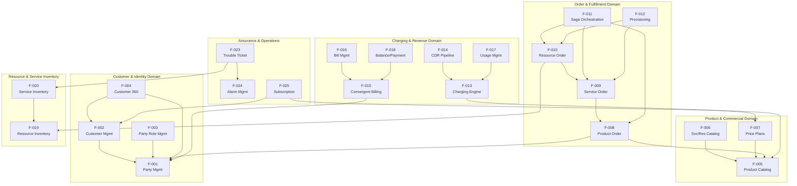

### 2.3.2 Integration Points

The following table documents the key integration points between features, identified from the Kafka topic subscriptions in `shared/kafka/topic-definitions.yml`, entity relationships in `bss-core/`, and workflow definitions.

| Source Feature | Target Feature | Integration Mechanism |
|---|---|---|
| F-001 (Party) | F-033 (Kafka) | `party.events` topic publication |
| F-005 (Catalog) | F-033 (Kafka) | `catalog.events` topic publication |
| F-008 (Product Order) | F-033 (Kafka) | `order.events` topic publication |

| Source Feature | Target Feature | Integration Mechanism |
|---|---|---|
| F-014 (CDR Pipeline) | F-013 (Charging Engine) | `usage.events` topic (12 partitions) |
| F-013 (Charging Engine) | F-018 (Balance) | Redis balance operations (sub-5ms) |
| F-013 (Charging Engine) | F-033 (Kafka) | `charging.events` topic publication |

| Source Feature | Target Feature | Integration Mechanism |
|---|---|---|
| F-011 (Saga) | F-031 (Adapters) | Temporal workflows → adapter invocations |
| F-011 (Saga) | F-019 (Resource Inv.) | Redis Redlock resource reservation |
| F-024 (Alarm) | F-023 (Trouble Ticket) | Auto-creation on critical alarms |

| Source Feature | Target Feature | Integration Mechanism |
|---|---|---|
| F-020 (Service Inv.) | F-023 (Trouble Ticket) | Neo4j BFS → affected service list |
| F-027 (Portal) | F-028 (Gateway) | HTTP routing via 57 proxy modules |
| F-032 (Migration) | F-001 (Party) | TmfDataTransformer → Party records |

### 2.3.3 Shared Components

The following shared components are used across multiple features, as evidenced by the dependency declarations in `bss-core/pom.xml`, `charging-engine/go.mod`, and `shared/kafka/topic-definitions.yml`.

| Component | Features Using It | Technology |
|---|---|---|
| PostgreSQL (Citus) | F-001 through F-028 (all BSS entities) | Java 21 / JPA / Hibernate |
| Redis Cluster 7.2 | F-013, F-018, F-011, F-019 | go-redis v9.3.1, Jedis |
| Apache Kafka | F-001, F-005, F-008, F-013, F-014, F-033 | Confluent Platform 7.5.0 |

| Component | Features Using It | Technology |
|---|---|---|
| Neo4j | F-019, F-020, F-024 | Graph queries (BFS) |
| Elasticsearch | F-004, F-019 | Full-text search |
| Keycloak | F-027, F-028 | OAuth2/OIDC, JWT |

| Component | Features Using It | Technology |
|---|---|---|
| Temporal.io | F-011, F-009 | Saga orchestration |
| Resilience4j | F-031, F-028 | Circuit breaking, bulkhead |
| OPA Sidecars | F-003, F-028 | ABAC policy enforcement |

### 2.3.4 Common Services

| Service | Description | Consumers |
|---|---|---|
| Idempotency Handling | Shared SDK for deduplication of retry operations across all write endpoints | All order and billing features |
| CloudEvents Wrapper | Standardized event envelope (CloudEvents 4.0.1) for Kafka messages | All Kafka-producing features |
| TMF Base Classes | Shared TMF entity base types with standard fields | All TMF API implementations |

| Service | Description | Consumers |
|---|---|---|
| Audit Logging | Immutable, append-only audit trail with 7-year retention | All state-changing features |
| PII Masking | Dynamic regex-based masking for phone numbers, emails, national IDs in logs | All features handling PII |
| Health Check | Standardized health/readiness/liveness probes | All microservices |

---

## 2.4 IMPLEMENTATION CONSIDERATIONS

### 2.4.1 Technical Constraints

#### Deployment Environment Constraints

| Constraint | Details |
|---|---|
| Deployment Model | Full on-premises, air-gapped capable |
| Kubernetes | 3 master + 6 worker nodes (RKE2/k3s on bare metal or vSphere) |
| Container Registry | Harbor 2.10 with Trivy scanning; air-gapped replication |
| External API Dependencies | None permitted (all services resolvable from Harbor/MinIO) |

#### Technology Stack Constraints

| Constraint | Details |
|---|---|
| BSS Core Runtime | Java 21, Spring Boot 3.2.0, Maven |
| Charging Engine Runtime | Go 1.22 (performance-critical path) |
| CDR Pipeline Runtime | Python 3.x |
| API Gateway Runtime | TypeScript 5.3+, NestJS 10+, Node.js 20 LTS |

#### Data Layer Constraints

| Constraint | Details |
|---|---|
| Primary Database | PostgreSQL 15 + Citus (sharded by customer_id; Patroni HA; synchronous replication) |
| Real-Time Balances | Redis Cluster 7.2 (AOF persistence) |
| Graph Topology | Neo4j for inventory topology (causal clustering) |
| Event Streaming | Apache Kafka 3.6 (KRaft mode; Tiered Storage to MinIO) |

### 2.4.2 Performance Requirements

| Feature Domain | Metric | Target |
|---|---|---|
| Charging (F-013) | p99 latency | <50ms |
| Charging (F-013) | Sustained throughput | >1,200 events/sec |
| CRM Operations (F-001, F-002) | p95 latency | <200ms |
| Order Processing (F-008) | Throughput | 1,000 orders/minute |

| Feature Domain | Metric | Target |
|---|---|---|
| Saga Recovery (F-011) | Recovery time | <30 seconds |
| Graph Query (F-019, F-020) | 5-hop traversal | <10ms |
| Balance Check (F-018) | Redis read latency | <5ms |
| CDR Pipeline (F-014) | Throughput | >1,200 events/sec |

| Feature Domain | Metric | Target |
|---|---|---|
| Customer 360 (F-004) | Dashboard load (p95) | <200ms |
| Fraud Detection (F-029) | Accuracy | >95% |
| Churn Prediction (F-030) | Accuracy | >85% |
| Zero-Touch Provisioning (F-012) | Automation rate | ≥95% |

### 2.4.3 Scalability Considerations

| Feature | Scalability Strategy |
|---|---|
| F-001 (Party) / F-002 (Customer) | PostgreSQL Citus sharding by customer_id; horizontal scaling across worker nodes |
| F-013 (Charging Engine) | Kafka partitioning (12 partitions for `usage.events` and `charging.events`); stateless Go instances scale horizontally |
| F-014 (CDR Pipeline) | Batch processing with configurable batch sizes; Python processes scale per partition |
| F-019 (Resource Inventory) | Neo4j causal clustering for read replicas; graph queries optimized for BFS traversal |

| Feature | Scalability Strategy |
|---|---|
| F-033 (Kafka Backbone) | KRaft mode with 3 brokers; Tiered Storage offloads cold data to MinIO; partition count tunable per topic |
| F-028 (API Gateway) | Kong Gateway handles horizontal scaling; NestJS gateway stateless with multiple replicas |
| F-015 (Convergent Billing) | Billing cycle processing distributable across worker nodes; Redis cluster for balance operations |

### 2.4.4 Security Implications

| Security Domain | Requirements | Affected Features |
|---|---|---|
| Authentication | JWT (15-min expiry), OAuth2/OIDC (Keycloak), FIDO2/WebAuthn MFA | F-027, F-028, all portal-facing features |
| Authorization | RBAC/ABAC via OPA sidecars; field technician region-scoped access | F-003, F-028, all controller endpoints |
| Encryption (Transit) | TLS 1.3 external; mTLS internal (Istio strict mode) | All features, F-028 |

| Security Domain | Requirements | Affected Features |
|---|---|---|
| Encryption (Rest) | AES-256-GCM for database volumes | All data-persisting features |
| PII Protection | Dynamic masking in logs; field-level encryption (Jasypt + Vault) | F-001, F-002, F-004 |
| PCI-DSS L1 | Payment data tokenization; CHD isolation | F-015, F-016, F-018 |

| Security Domain | Requirements | Affected Features |
|---|---|---|
| Key Management | HashiCorp Vault with auto-rotation; HSM for root keys | All encryption features |
| Audit Trail | Immutable, append-only, signed audit logs; 7-year retention | All state-changing features |
| Vulnerability Scanning | Zero critical vulnerabilities (Snyk/Trivy) per quality gate | All features pre-deployment |

### 2.4.5 Maintenance Requirements

| Requirement | Details |
|---|---|
| Observability Coverage | Distributed tracing >95% coverage (Jaeger/Tempo); 25+ Grafana dashboards; Prometheus + Thanos for long-term metrics |
| Operational Runbooks | Every alert documented with corresponding runbook; executable documentation |
| Backup Strategy | PostgreSQL: WAL-G to MinIO (hourly); Neo4j: neo4j-admin backup (daily); cross-site replication |

| Requirement | Details |
|---|---|
| DR Testing | Quarterly DR drills; automated failover for databases; RPO <15 minutes; RTO <30 minutes |
| Pod Recovery | Pod failure recovery <30 seconds; database failover <10 seconds |
| Architecture Decisions | ADR (Architecture Decision Record) for every major design choice |

| Requirement | Details |
|---|---|
| Schema Management | Avro schema backward compatibility enforced; database migrations version-controlled |
| Cost Optimization | Compression (Zstd for Kafka, TimescaleDB); tiered storage (hot NVMe, warm SSD, cold HDD/S3) |
| Vendor Neutrality | Abstracted interfaces (S3-compatible, Kubernetes CNI agnostic); no vendor lock-in |

---

## 2.5 TRACEABILITY MATRIX

### 2.5.1 Feature-to-TMF API Traceability

| Feature ID | TMF API | Implementation Phase | Quality Gate |
|---|---|---|---|
| F-001 | TMF632 Party Management | Completed | TMF Level 3+ ✅ |
| F-002 | TMF629 Customer Management | Phase 1 (Weeks 1–2) | TMF Level 3+ ⏳ |
| F-003 | TMF669 Party Role Management | Completed | TMF Level 3+ ✅ |
| F-005 | TMF620 Product Catalog | Completed | TMF Level 3+ ✅ |

| Feature ID | TMF API | Implementation Phase | Quality Gate |
|---|---|---|---|
| F-006 | TMF633/634 Service/Resource Catalog | Completed | TMF Level 3+ ✅ |
| F-008 | TMF622 Product Order | Completed | TMF Level 3+ ✅ |
| F-009 | TMF641 Service Order | Completed | TMF Level 3+ ✅ |
| F-010 | TMF640 Resource Order | Phase 1 (Weeks 1–2) | TMF Level 3+ ⏳ |

| Feature ID | TMF API | Implementation Phase | Quality Gate |
|---|---|---|---|
| F-015 | TMF647 Billing Account | Completed | TMF Level 3+ ✅ |
| F-016 | TMF657 Bill Management | Completed | TMF Level 3+ ✅ |
| F-017 | TMF648 Usage Management | Phase 1 (Weeks 1–2) | TMF Level 3+ ⏳ |
| F-018 | TMF650/671 Balance/Payment | Partial | TMF Level 3+ ⏳ |

| Feature ID | TMF API | Implementation Phase | Quality Gate |
|---|---|---|---|
| F-019 | TMF638 Resource Inventory | Completed | TMF Level 3+ ✅ |
| F-020 | TMF639 Service Inventory | Completed | TMF Level 3+ ✅ |
| F-021 | TMF653 Geographic Address | Completed | TMF Level 3+ ✅ |
| F-022 | TMF656 Geographic Site | Completed | TMF Level 3+ ✅ |

| Feature ID | TMF API | Implementation Phase | Quality Gate |
|---|---|---|---|
| F-023 | TMF645 Trouble Ticket | Completed | TMF Level 3+ ✅ |
| F-024 | TMF642 Alarm Management | Partial | TMF Level 3+ ⏳ |

### 2.5.2 Feature-to-Codebase Traceability

| Feature ID | Primary Codebase Artifact |
|---|---|
| F-001 | `Party.java`, `customer-management-api.yaml` |
| F-002 | `Customer.java`, `customer-management-tmf629-api.yaml` |
| F-004 | `Customer360.java`, `CustomerPortalController.java` |
| F-005 | `product-catalog-api.yaml`, `product_*` tables |

| Feature ID | Primary Codebase Artifact |
|---|---|
| F-008 | `Order.java`, `OrderItem.java`, `order-management-api.yaml` |
| F-009 | `ServiceOrder.java`, `service-order-api.yaml` |
| F-010 | `ResourceOrder.java`, `ResourceOrderItem.java` |
| F-011 | Temporal.io workflow definitions |

| Feature ID | Primary Codebase Artifact |
|---|---|
| F-013 | `charging-engine/internal/` (balance, cdr, rating) |
| F-014 | `cdrmspipeline/` (orchestrator, normalizer, enricher, producer) |
| F-015 | `ConvergentBillingAccount.java`, `ConvergentBillingController.java` |
| F-016 | `Invoice.java`, `BillingController.java` |

| Feature ID | Primary Codebase Artifact |
|---|---|
| F-019 | `resource-inventory-api.yaml`, `network_elements` table |
| F-020 | `service-inventory-api.yaml` |
| F-027 | `CustomerPortalController.java`, `frontend/yemen-ptc-portal` |
| F-028 | `api-gateway/` (57 proxy modules) |

| Feature ID | Primary Codebase Artifact |
|---|---|
| F-031 | `docs/adapters/` (6 adapter specifications) |
| F-032 | `migration/` (extractors, transformers, validation) |
| F-033 | `shared/kafka/topic-definitions.yml` |

---

## 2.6 QUALITY GATES

All features must satisfy the following quality gates before entering production, as defined in the project's Definition of Done:

| Gate # | Criterion | Verification Method |
|---|---|---|
| QG-1 | TMF Conformance Level 3+ | Automated Postman tests pass |
| QG-2 | Idempotency verified (100 retries = 1 side effect) | Automated stress test |
| QG-3 | Security scan: 0 critical vulnerabilities | Snyk/Trivy pipeline scan |
| QG-4 | Performance: p95 < 200ms (read), p99 < 50ms (charging) | Load test benchmark |

| Gate # | Criterion | Verification Method |
|---|---|---|
| QG-5 | HA tested: Pod recovery <30s; DB failover <10s | Chaos engineering tests |
| QG-6 | DR tested: Cross-site failover with data integrity | Quarterly DR drills |
| QG-7 | Observability: Distributed tracing >95%; business metrics exposed | Coverage analysis |
| QG-8 | Documentation: ADR for major choices; operational runbook complete | Documentation review |

---

## 2.7 ASSUMPTIONS AND CONSTRAINTS

### 2.7.1 Assumptions

| ID | Assumption |
|---|---|
| A-001 | All 19 Yemeni governorates have sufficient network connectivity to reach the on-premises data center hosting the platform |
| A-002 | Legacy system databases (TITAN, Oracle BRM) remain accessible during the migration window for ETL extraction |
| A-003 | PTC's Vision 2030 strategic alignment continues, providing sustained executive sponsorship for the multi-phase rollout |
| A-004 | The 50M+ subscriber base remains the capacity planning target throughout the implementation phases |

| ID | Assumption |
|---|---|
| A-005 | TM Forum Open API specifications remain stable (v4/v5) through the implementation period without breaking changes |
| A-006 | Hardware provisioning for the 3-site active-active architecture (3 master + 6 worker Kubernetes nodes per site) is completed before Phase 1 |
| A-007 | ML model training data from legacy systems is representative and of sufficient quality for >95% fraud and >85% churn accuracy targets |

### 2.7.2 Constraints

| ID | Constraint |
|---|---|
| C-001 | Air-gapped deployment capability required: no hard-coded external API dependencies; all artifacts served from Harbor/MinIO |
| C-002 | PCI-DSS Level 1 compliance for all payment processing paths; cardholder data must never touch application servers |
| C-003 | CDR records must be retained for 7 years per Yemen telecom regulatory requirements with WORM storage |
| C-004 | Vendor neutrality: interfaces abstracted (S3-compatible, not AWS S3; Kubernetes CNI agnostic) |

| ID | Constraint |
|---|---|
| C-005 | Go-live success criteria: all 24 initially-targeted TMF APIs implemented and validated before production cutover |
| C-006 | 8–9 week completion window for remaining Phase 1–5 work items per `IMPLEMENTATION_COMPLETION_PLAN.md` |
| C-007 | Current charging engine P95 latency (92.1ms) exceeds the <50ms p99 target; optimization required before go-live |

---

## 2.8 REFERENCES

#### References

- `docs/TMF_API_IMPLEMENTATION_STATUS.md` — Complete TMF API inventory with status (12 complete, 3 partial, 12 pending), endpoints, and schemas
- `IMPLEMENTATION_COMPLETION_PLAN.md` — 5-phase completion roadmap, team structure, timeline, success metrics, and go-live criteria
- `IMPLEMENTATION_SUMMARY.md` — Validation results, performance benchmark evidence (CDR throughput, charging latency), and deployment readiness
- `docs/GO_LIVE_READINESS_CHECKLIST.md` — Infrastructure, application, and security readiness checklists with verification criteria
- `docs/data-models/database-schema.sql` — PostgreSQL schema definitions (customers, accounts, products, billing, orders, audit tables, functions)
- `shared/kafka/topic-definitions.yml` — Canonical Kafka topic definitions (10 topics, 4 consumer groups, partitioning, retention policies)
- `bss-core/src/main/java/.../entity/Party.java` — Party entity model with TMF632 field mappings
- `bss-core/src/main/java/.../entity/Customer.java` — Customer entity model with segmentation and KYC fields
- `bss-core/src/main/java/.../entity/Customer360.java` — Customer 360 aggregate entity with linked profile components
- `bss-core/src/main/java/.../entity/Order.java` — Product order entity with state machine and priority definitions
- `bss-core/src/main/java/.../entity/ServiceOrder.java` — Service order entity with CFS/RFS type fields
- `bss-core/src/main/java/.../entity/ResourceOrder.java` — Resource order entity with 10 states and 8 order types
- `bss-core/src/main/java/.../entity/Invoice.java` — Invoice entity with status lifecycle and YER currency
- `bss-core/src/main/java/.../entity/ConvergentBillingAccount.java` — Convergent billing entity with PREPAID/POSTPAID/HYBRID types
- `bss-core/src/main/java/.../entity/BillingSummary.java` — Billing summary aggregate for Customer 360
- `charging-engine/internal/balance/service.go` — Redis-backed balance service (Go) with reservation and deduction operations
- `charging-engine/internal/cdr/mediator.go` — Kafka consumer for CDR mediation with usage/catalog event routing
- `charging-engine/internal/rating/service.go` — In-memory rating engine with timeband, per-megabyte, and flat-fee plans
- `cdrmspipeline/orchestrator.py` — CDR mediation pipeline orchestrator with batch processing and health checks
- `cdrmspipeline/normalizer/schema_normalizer.py` — NormalizedCDR schema definition and batch normalization
- `cdrmspipeline/enricher/context_enricher.py` — EnrichedCDR with subscription, rate-plan, and geographic lookups
- `cdrmspipeline/kafka/producer.py` — Idempotent Kafka producer with TLS, retry, and DLQ support
- `docs/adapters/` — Six legacy system adapter specifications (TITAN, Oracle BRM, WHM, ADSL/FTTH, MPLS/PRI, Network Elements)
- `migration/` — ETL subsystem (extractors for Oracle BRM and TITAN, TmfDataTransformer, MigrationReconciler)
- `frontend/yemen-ptc-portal` — React + TypeScript + Vite customer self-service portal
- `api-gateway/` — NestJS API gateway with 57 proxy modules
- `docs/api/` — 14 OpenAPI YAML specification files for TMF API definitions
- `docker-compose.yml` — Local development infrastructure stack (PostgreSQL, Redis, Kafka, Elasticsearch)
- `infrastructure/` — Infrastructure-as-code templates (ArgoCD, Istio, Kafka, Kong, Kubernetes)
- `deployment/` — Container recipes, Compose files, Kubernetes manifests, monitoring configurations
- `bss-core/pom.xml` — Maven dependency manifest (Java 21, Spring Boot 3.2.0, Resilience4j, Jasypt, Temporal SDK)
- `charging-engine/go.mod` — Go module manifest (Go 1.22, Confluent Kafka Go, Gin, go-redis, zerolog)

# 3. Technology Stack

The Yemen PTC BSS/OSS Platform employs a polyglot microservice architecture with technology selections optimized for each operational domain. Every choice documented in this section is grounded in the actual codebase artifacts — dependency manifests (`bss-core/pom.xml`, `charging-engine/go.mod`, `api-gateway/package.json`, `frontend/package.json`), infrastructure definitions (`docker-compose.yml`, `deployment/docker-compose.yml`, `infrastructure/`), and deployment configurations (`helm/`, `.gitlab-ci.yml`, `.github/workflows/`).

This section serves as the authoritative reference for all technology decisions, version constraints, and integration requirements across the platform's six primary components: BSS Core Service, Charging Engine, API Gateway, CDR Mediation Pipeline, Frontend Portals, and Migration Subsystem.

> **Note on Default Stack Variance**: The user-provided default technology stack (AWS, Python/Flask, Auth0, MongoDB, TailwindCSS, Terraform, React-Native, Langchain) reflects a generic starting template. The actual implementation significantly diverges from these defaults due to the platform's carrier-grade requirements: on-premises air-gapped deployment (constraint C-001), sub-50ms charging latency (constraint C-007), polyglot persistence for 50M+ subscribers, and TM Forum Open API compliance. All variances are justified in their respective subsections.

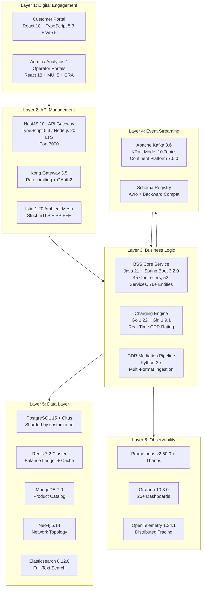

## 3.1 Programming Languages

### 3.1.1 Language Selection Strategy

The platform employs four primary programming languages, each selected for its domain-specific strengths. This polyglot approach reflects a deliberate architectural decision to optimize for the distinct performance, scalability, and ecosystem requirements of each subsystem rather than standardizing on a single runtime.

| Language | Version | Component | Justification | Evidence |
|---|---|---|---|---|
| **Java** | 21 (LTS) | BSS Core Service, Migration Subsystem | Mature enterprise ecosystem; Spring Boot 3.2 for rapid TMF API development; JPA/Hibernate for polyglot persistence across 5 databases; strong typing for 76+ entity models | `bss-core/pom.xml` (line 21: `java.version=21`) |
| **Go** | 1.22 | Charging Engine | Zero-GC-pause static binaries for <50ms p99 latency target; Goroutine concurrency for high-throughput CDR processing (>1,200 events/sec); minimal container footprint (alpine:3.19) | `charging-engine/go.mod` (line 3: `go 1.22`) |
| **TypeScript** | 5.3+ | API Gateway, Customer Portal | Strong typing for 57 proxy module definitions; NestJS decorator-based architecture; shared type definitions between gateway and frontend | `api-gateway/package.json` (TS `^5.3.3`), `frontend/package.json` (TS `^5.3.0`) |
| **Python** | 3.x | CDR Pipeline, ML/AI, Benchmarks | Rich data processing ecosystem; ML framework support for fraud detection (>95% accuracy) and churn prediction (>85%); rapid pipeline prototyping | `cdrmspipeline/orchestrator.py`, `benchmark/performance_benchmark.py` |

#### Selection Criteria

The language selections are governed by three primary constraints derived from the system requirements:

1. **Performance Tier Segregation** (Constraint C-007): The charging engine's <50ms p99 latency requirement eliminates interpreted languages from the critical rating path. Go's compile-to-native-binary model with predictable GC behavior addresses this directly.
2. **Enterprise Ecosystem Maturity**: The BSS Core's 45 REST controllers implementing TM Forum Open APIs require a framework with robust ORM capabilities (76+ JPA entities), comprehensive middleware support (Resilience4j, Temporal SDK, Kafka, CloudEvents), and production-proven reliability at scale — requirements best served by the Java/Spring Boot ecosystem.
3. **Air-Gap Compatibility** (Constraint C-001): All language runtimes and dependencies must be fully self-contained within Harbor container images with no external package fetch at runtime.

### 3.1.2 Java 21 — BSS Core Service & Migration Subsystem

Java 21 serves as the primary language for the platform's most complex component — the BSS Core Service — which implements the bulk of the TM Forum Open API surface area.

**Runtime Details:**
- **JDK Distribution**: Eclipse Temurin 21 (container base: `eclipse-temurin:21-jre-alpine` as specified in `deployment/Dockerfile`)
- **Build Tool**: Apache Maven 3.9 with Eclipse Temurin JDK 21 (build stage in `.gitlab-ci.yml`)
- **JVM Tuning**: G1GC with 200ms max pause target (`-XX:+UseG1GC -XX:MaxGCPauseMillis=200`), heap range 512m–1g configurable via `JAVA_OPTS`, timezone set to `Asia/Aden` as configured in `helm/bss-core/values.yaml`
- **Annotation Processing**: Lombok 1.18.32 for compile-time boilerplate reduction; Apache Avro 1.11.3 code generation from `src/main/avro` schema definitions

**Scope of Use:**
- 45 REST controllers across all TMF API domains (Party, Customer, Catalog, Order, Billing, Inventory, Assurance, Provisioning, Geographic)
- 52 business services implementing domain logic
- 76+ JPA entities with polyglot persistence (PostgreSQL, MongoDB, Neo4j, Elasticsearch, Redis)
- Database migration management via Flyway 10.6.0
- Legacy data migration ETL pipeline (`migration/` — extractors, transformers, reconciliation)

**Constraints:**
- Spring Boot 3.2.0 requires Java 17+ minimum; Java 21 was selected as the current LTS release for virtual threads readiness and long-term support
- Citus sharding requires careful JPA entity design to include `customer_id` in all partition-relevant queries

### 3.1.3 Go 1.22 — Charging Engine

Go 1.22 powers the performance-critical charging engine that handles real-time CDR rating and balance management for all 50M+ subscribers.

**Runtime Details:**
- **Build**: Multi-stage Docker build — `golang:1.22-alpine` (build stage) → `alpine:3.19` (runtime stage) as defined in `charging-engine/Dockerfile`
- **Compilation**: Static binary with `CGO_ENABLED=0 GOOS=linux` for minimal attack surface and zero external library dependencies at runtime
- **Binary Size**: Single statically-linked executable deployed to a minimal Alpine container

**Scope of Use:**
- CDR mediation consumer subscribing to `usage.events` and `catalog.events` Kafka topics (`internal/cdr/mediator.go`)
- In-memory rating engine with timeband voice pricing, per-megabyte data rating, and flat-fee SMS (`internal/rating/service.go`)
- Redis-backed balance ledger with reservation, deduction, and top-up operations (`internal/balance/service.go`)
- HTTP API via Gin framework on port 8081

**Performance Profile:**
- Validated throughput: 1,240 events/sec sustained, 2,100 events/sec peak
- Current latency: average 78.4ms ± 12.3ms, P95 92.1ms (optimization in progress toward <50ms p99 target per constraint C-007)
- Graceful shutdown via SIGINT/SIGTERM preserving in-flight events

### 3.1.4 TypeScript 5.3+ — API Gateway & Frontend

TypeScript provides strong typing across both the API Gateway composition layer and the customer self-service portal, enabling shared type definitions and consistent API contracts.

**API Gateway Runtime:**
- **Node.js**: Version 20 LTS as specified in `.github/workflows/ci-cd.yml` and `api-gateway/Dockerfile`
- **Container**: Two-stage `node:20-alpine` build — dependency installation (`npm ci`) followed by production build (`nest build`) serving `dist/main` on port 3000
- **Type Safety**: Strict TypeScript compilation with class-transformer 0.5.1 and class-validator 0.14.1 for runtime DTO validation

**Frontend Runtime:**
- **Build Tooling**: Vite 5.0.0 for the customer portal (`frontend/package.json`), Create React App 5.0.1 for admin/analytics/operator portals (`deployment/portal/package.json`)
- **Serving**: Pre-built static files served via `nginx:alpine` containers with SPA fallback routing

### 3.1.5 Python 3.x — CDR Mediation Pipeline & Intelligence

Python serves the data-processing and machine-learning domains where its ecosystem maturity in data science and stream processing outweighs raw performance requirements.

**Scope of Use:**
- **CDR Mediation Pipeline** (`cdrmspipeline/`): Four-stage orchestration — `CDRParser` → `SchemaNormalizer` → `ContextEnricher` → `CDRPipelineProducer` — with batch processing, health checks, and retry policies
- **ML/AI Models**: Fraud detection (IRSF, SIM box, Wangiri — >95% accuracy target) and churn prediction (>85% accuracy target) following the Bronze/Silver/Gold medallion data warehousing pattern
- **Performance Benchmarking** (`benchmark/performance_benchmark.py`): 50M simulated events and 500K benchmark events for CDR throughput and charging latency validation

## 3.2 Frameworks & Libraries

### 3.2.1 Backend Framework — Spring Boot 3.2.0

Spring Boot 3.2.0 serves as the backbone of the BSS Core Service, providing the dependency management, auto-configuration, and middleware ecosystem required to implement 45 TMF REST controllers with polyglot persistence.

**Core Framework Stack** (from `bss-core/pom.xml`):

| Framework | Version | Purpose |
|---|---|---|
| `spring-boot-starter-parent` | 3.2.0 | Parent POM, transitive dependency management |
| `spring-boot-starter-web` | (managed) | REST API framework, embedded Tomcat |
| `spring-boot-starter-data-jpa` | (managed) | JPA/Hibernate ORM for PostgreSQL entities |
| `spring-boot-starter-data-redis` | (managed) | Redis integration for caching and session management |
| `spring-boot-starter-data-elasticsearch` | (managed) | Elasticsearch integration for full-text search |
| `spring-boot-starter-data-mongodb` | (managed) | MongoDB integration for Product Catalog storage |
| `spring-boot-starter-data-neo4j` | (managed) | Neo4j integration for graph-based inventory topology |
| `spring-boot-starter-validation` | (managed) | Bean validation for TMF API request payloads |
| `spring-boot-starter-actuator` | (managed) | Health, metrics, and info endpoints for Kubernetes probes |
| `spring-boot-starter-security` | (managed) | Authentication and authorization framework |
| `spring-boot-starter-oauth2-resource-server` | (managed) | OAuth2/OIDC JWT validation with Keycloak integration |
| `spring-kafka` | (managed) | Kafka producer/consumer for 10 canonical event topics |

**Selection Justification:**
- Spring Boot 3.2.0 is the latest stable release in the Spring Boot 3.x line, requiring Java 17+ and providing Jakarta EE namespace alignment
- Spring Data's polyglot persistence abstraction enables a single codebase to interact with five different databases (PostgreSQL, MongoDB, Neo4j, Elasticsearch, Redis) through consistent repository interfaces
- The extensive Spring ecosystem reduces custom middleware development for Kafka integration, OAuth2 resource server configuration, and actuator-based health monitoring

### 3.2.2 Resilience & Orchestration Libraries

The platform implements multiple resilience patterns to meet the 99.999% availability target for critical-path operations:

| Library | Version | Pattern | Evidence |
|---|---|---|---|
| `resilience4j-spring-boot3` | 2.2.0 | Framework integration | `bss-core/pom.xml` |
| `resilience4j-circuitbreaker` | 2.2.0 | Circuit breaking for legacy adapter calls | `bss-core/pom.xml` |
| `resilience4j-retry` | 2.2.0 | Configurable retry with backoff | `bss-core/pom.xml` |
| `resilience4j-bulkhead` | 2.2.0 | Thread pool isolation between domains | `bss-core/pom.xml` |
| `resilience4j-ratelimiter` | 2.2.0 | Application-level rate limiting | `bss-core/pom.xml` |
| `resilience4j-timelimiter` | 2.2.0 | Timeout enforcement | `bss-core/pom.xml` |
| `bucket4j-core` | 8.1.0 | Token-bucket rate limiting for API endpoints | `bss-core/pom.xml` |
| `temporal-sdk` | 1.22.3 | Saga orchestration with compensating transactions | `bss-core/pom.xml` |

Resilience4j 2.2.0 is deployed across all six legacy system adapters documented in `docs/adapters/`, implementing the standardized adapter pattern: Legacy System → Adapter Layer (with circuit breaking) → Canonical Transform Layer → BSS/OSS Consumers. Temporal SDK 1.22.3 orchestrates the critical multi-domain Saga workflows, such as the "Home Premium Bundle" order (Landline + FTTH + 4G + Hosting) with parallel resource reservation and compensating rollback within <30 seconds.

### 3.2.3 Event & Messaging Libraries

| Library | Version | Purpose | Evidence |
|---|---|---|---|
| `cloudevents-core` | 4.0.1 | CloudEvents specification for event envelope standardization | `bss-core/pom.xml` |
| `cloudevents-json-jackson` | 4.0.1 | JSON serialization of CloudEvents payloads | `bss-core/pom.xml` |
| `cloudevents-kafka` | 4.0.1 | CloudEvents transport binding for Kafka | `bss-core/pom.xml` |
| `avro` | 1.11.3 | Schema-based serialization for Kafka messages | `bss-core/pom.xml` |
| `kafka-avro-serializer` | 7.5.0 | Confluent Avro serializer/deserializer | `bss-core/pom.xml` |

All inter-service events are wrapped in CloudEvents 4.0.1 envelopes and serialized using Avro with backward-compatible schemas enforced by the Confluent Schema Registry. The Confluent Avro serializer requires access to the `https://packages.confluent.io/maven/` repository, which must be mirrored within the air-gapped environment per constraint C-001.

### 3.2.4 API Gateway Framework — NestJS 10+

NestJS 10+ provides the decorator-driven, modular framework for the API Gateway's 57 proxy modules that compose the TMF API surface area.

**Core Dependencies** (from `api-gateway/package.json`):

| Library | Version | Purpose |
|---|---|---|
| `@nestjs/common` | ^10.3.0 | Core NestJS decorators, pipes, guards |
| `@nestjs/core` | ^10.3.0 | Module system, dependency injection |
| `@nestjs/platform-express` | ^10.3.0 | Express HTTP adapter |
| `@nestjs/axios` | ^3.0.1 | HTTP client module for backend service proxying |
| `@nestjs/swagger` | ^7.2.0 | OpenAPI/Swagger documentation auto-generation |
| `axios` | ^1.6.5 | HTTP client for service-to-service calls |
| `class-transformer` | ^0.5.1 | DTO transformation and serialization |
| `class-validator` | ^0.14.1 | Request payload validation with decorators |
| `rxjs` | ^7.8.1 | Reactive extensions for async stream processing |
| `reflect-metadata` | ^0.2.1 | Decorator metadata reflection |

**Selection Justification:**
- NestJS's module system maps naturally to the 57 TMF API proxy modules, each encapsulating routing, validation, and transformation for a specific API domain
- Built-in Swagger integration generates OpenAPI 3.0.3 documentation that aligns with the TMF API specification requirements
- Express HTTP adapter provides compatibility with Kong's upstream proxying and Istio's sidecar injection

### 3.2.5 Frontend Frameworks

The platform implements two frontend framework configurations serving different portal tiers:

#### Customer Self-Service Portal (Vite-based)

| Library | Version | Purpose | Evidence |
|---|---|---|---|
| `react` | ^18.2.0 | UI component framework | `frontend/package.json` |
| `react-dom` | ^18.2.0 | DOM rendering engine | `frontend/package.json` |
| `react-router-dom` | ^6.20.0 | Client-side SPA routing | `frontend/package.json` |
| `@tanstack/react-query` | ^5.12.0 | Server state management, data fetching/caching | `frontend/package.json` |
| `axios` | ^1.6.2 | HTTP client for API Gateway communication | `frontend/package.json` |
| `vite` | ^5.0.0 | Build tooling with HMR | `frontend/package.json` (dev) |
| `@vitejs/plugin-react` | ^6.0.1 | React fast-refresh integration | `frontend/package.json` (dev) |

#### Admin/Analytics/Operator Portals (CRA-based)

| Library | Version | Purpose | Evidence |
|---|---|---|---|
| `react` | ^18.2.0 | UI component framework | `deployment/portal/package.json` |
| `react-scripts` | 5.0.1 | Create React App build toolchain | `deployment/portal/package.json` |
| `@mui/material` | ^5.14.18 | Material UI component library | `deployment/portal/package.json` |
| `@mui/icons-material` | ^5.14.18 | Material icon set | `deployment/portal/package.json` |
| `@emotion/react` | ^11.11.1 | CSS-in-JS engine for MUI | `deployment/portal/package.json` |
| `@emotion/styled` | ^11.11.0 | Styled component system | `deployment/portal/package.json` |
| `chart.js` | ^4.4.1 | Data visualization engine | `deployment/portal/package.json` |
| `react-chartjs-2` | ^5.2.0 | React bindings for Chart.js | `deployment/portal/package.json` |

> **Default Stack Variance**: The user-provided default specifies TailwindCSS for styling. The actual implementation uses Material UI (MUI) 5 with Emotion CSS-in-JS for the operational portals. MUI provides pre-built, accessible component patterns (data tables, forms, dashboards) that accelerate telecom portal development, while its RTL (right-to-left) support is essential for Arabic language interfaces across Yemen's 19 governorates.

### 3.2.6 Charging Engine Libraries (Go)

The Go-based charging engine maintains a minimal dependency footprint, consistent with Go's philosophy of explicit, lightweight dependency management:

| Library | Version | Purpose | Evidence |
|---|---|---|---|
| `confluent-kafka-go/v2` | v2.3.0 | Kafka consumer/producer for usage and catalog events | `charging-engine/go.mod` |
| `gin-gonic/gin` | v1.9.1 | HTTP API framework for health checks and admin endpoints | `charging-engine/go.mod` |
| `go-redis/v9` | v9.3.1 | Redis client for balance ledger operations (<5ms reads) | `charging-engine/go.mod` |
| `rs/zerolog` | v1.31.0 | Zero-allocation structured JSON logging | `charging-engine/go.mod` |

### 3.2.7 Security & Encryption Libraries

| Library | Version | Purpose | Evidence |
|---|---|---|---|
| `jasypt-spring-boot-starter` | 3.0.5 | Field-level encryption for PII (phone numbers, national IDs, emails) | `bss-core/pom.xml` |
| `spring-vault-core` | 3.1.1 | HashiCorp Vault integration for secrets management | `bss-core/pom.xml` |
| `totp` | 1.7.1 | Time-based One-Time Password for MFA support | `bss-core/pom.xml` |
| `grpc-netty-shaded` | 1.61.0 | gRPC transport for inter-service secure communication | `bss-core/pom.xml` |

### 3.2.8 Observability Libraries

| Library | Version | Purpose | Evidence |
|---|---|---|---|
| `opentelemetry-api` | 1.34.1 | Distributed tracing API (>95% coverage target per QG-7) | `bss-core/pom.xml` |
| `opentelemetry-sdk` | 1.34.1 | Tracing SDK implementation | `bss-core/pom.xml` |
| `opentelemetry-spring-boot-starter` | 2.1.0-alpha | Auto-instrumentation for Spring Boot | `bss-core/pom.xml` |
| `micrometer-registry-prometheus` | (managed) | JVM and application metrics exported to Prometheus | `bss-core/pom.xml` |

### 3.2.9 Data Management Libraries

| Library | Version | Purpose | Evidence |
|---|---|---|---|
| `flyway-core` | 10.6.0 | Version-controlled database migrations | `bss-core/pom.xml` |
| `flyway-database-postgresql` | 10.6.0 | PostgreSQL dialect for migration scripts | `bss-core/pom.xml` |
| `springdoc-openapi-starter-webmvc-ui` | 2.3.0 | OpenAPI/Swagger UI generation for TMF APIs | `bss-core/pom.xml` |
| `lombok` | 1.18.32 | Compile-time boilerplate reduction for 76+ entities | `bss-core/pom.xml` |
| `postgresql` (JDBC driver) | (managed) | PostgreSQL connectivity | `bss-core/pom.xml` |

## 3.3 Open Source Dependencies

### 3.3.1 Java Dependency Manifest (Maven)

The BSS Core Service's complete dependency tree is managed through Maven with the Spring Boot 3.2.0 parent POM providing transitive dependency version alignment. The `bss-core/pom.xml` declares 40+ direct dependencies organized by domain:

| Category | Dependencies | Count |
|---|---|---|
| Spring Boot Starters | web, data-jpa, data-redis, data-elasticsearch, data-mongodb, data-neo4j, validation, actuator, security, oauth2-resource-server, kafka | 11 |
| Resilience | resilience4j (circuit breaker, retry, bulkhead, rate limiter, time limiter), bucket4j-core | 6 |
| Events & Messaging | cloudevents (core, json-jackson, kafka), avro, kafka-avro-serializer | 5 |
| Orchestration | temporal-sdk | 1 |
| Security | jasypt-spring-boot-starter, spring-vault-core, totp | 3 |
| Observability | opentelemetry (api, sdk, spring-boot-starter), micrometer-registry-prometheus | 4 |
| Database | flyway-core, flyway-database-postgresql, postgresql driver | 3 |
| API Documentation | springdoc-openapi-starter-webmvc-ui | 1 |
| Communication | grpc-netty-shaded | 1 |
| Utility | lombok | 1 |
| Testing | spring-boot-starter-test, mockito, testcontainers, h2 | 4+ |

### 3.3.2 Go Dependency Manifest (Go Modules)

The charging engine maintains a deliberately lean dependency profile as declared in `charging-engine/go.mod`:

```
module charging-engine
go 1.22

require (
    github.com/confluentinc/confluent-kafka-go/v2 v2.3.0
    github.com/gin-gonic/gin                       v1.9.1
    github.com/redis/go-redis/v9                   v9.3.1
    github.com/rs/zerolog                          v1.31.0
)
```

This minimal surface area reduces vulnerability exposure and simplifies air-gapped dependency mirroring (constraint C-001).

### 3.3.3 Node.js Dependency Manifest (npm)

**API Gateway** (`api-gateway/package.json`): 10 production dependencies and 5 development dependencies centered on the NestJS 10.3.0 framework with TypeScript 5.3.3 compilation.

**Customer Portal** (`frontend/package.json`): 5 production dependencies (React 18, React Router 6, TanStack React Query 5, axios) with Vite 5 build tooling.

**Operator Portals** (`deployment/portal/package.json`): 11 production dependencies including MUI 5.14.18 component library, Emotion CSS-in-JS, and Chart.js 4.4.1 visualization.

### 3.3.4 Package Registries & Air-Gap Strategy

All package registries must be mirrored within the on-premises infrastructure to support air-gapped deployment (constraint C-001):

| Registry | URL | Components | Mirror Target |
|---|---|---|---|
| Maven Central | `repo.maven.apache.org` | BSS Core, Migration | Harbor/internal Maven proxy |
| Confluent Maven | `packages.confluent.io/maven/` | Avro serializer, Schema Registry client | Harbor/internal Maven proxy |
| npm Registry | `registry.npmjs.org` | API Gateway, Frontend Portals | Harbor/internal npm proxy |
| Go Module Proxy | `proxy.golang.org` | Charging Engine | Harbor/internal Go proxy |
| PyPI | `pypi.org` | CDR Pipeline, ML models | Harbor/internal PyPI proxy |
| Docker Hub | `hub.docker.com` | Base images (alpine, nginx, temurin) | Harbor 2.10 registry |
| GHCR | `ghcr.io/yemenptc` | Platform container images | Harbor 2.10 registry |

## 3.4 Third-Party Services

### 3.4.1 Authentication & Identity — Keycloak (On-Premises)

The platform uses Keycloak as its OAuth2/OIDC identity provider, deployed entirely on-premises to maintain air-gap compatibility.

| Aspect | Detail |
|---|---|
| **Protocol** | OAuth2/OIDC with JWT bearer tokens |
| **Token Expiry** | 15-minute access token lifespan |
| **MFA** | FIDO2/WebAuthn for privileged operations (admin, billing adjustments); TOTP support via `totp` library v1.7.1 |
| **Integration** | `spring-boot-starter-oauth2-resource-server` for BSS Core JWT validation; Kong OAuth2 plugin with scopes `tmf:read`, `tmf:write`, `tmf:admin` (3600s token expiry) |
| **Identity Federation** | Enterprise LDAP/Active Directory federation for B2B customers |

> **Default Stack Variance**: The default stack specifies Auth0 (cloud-hosted SaaS). Keycloak was selected because constraint C-001 (air-gapped capability) prohibits dependency on any external cloud service. Keycloak provides functionally equivalent OAuth2/OIDC capabilities with full on-premises deployment.

### 3.4.2 Security Scanning Services

Security scanning is enforced through CI/CD pipeline integration per quality gate QG-3 (zero critical vulnerabilities):

| Tool | Purpose | Integration | Evidence |
|---|---|---|---|
| **Snyk** | Dependency vulnerability scanning | GitHub Actions (`security.yml`), high-severity threshold | `.github/workflows/security.yml` |
| **Trivy** | Container image and filesystem scanning | Harbor 2.10 (registry-level), GitHub Actions (CRITICAL/HIGH, fail-on-finding) | `.github/workflows/security.yml`, Harbor config |
| **Semgrep** | Static Application Security Testing (SAST) | GitHub Actions with Java + Spring rule packs | `.github/workflows/security.yml` |
| **OWASP ZAP** | Dynamic Application Security Testing (DAST) | GitLab CI security stage (baseline scan) | `.gitlab-ci.yml` |
| **OWASP Dependency-Check** | Known vulnerability detection | GitLab CI security stage | `.gitlab-ci.yml` |

### 3.4.3 Container Registry — Harbor 2.10

Harbor serves as the platform's private container registry, providing air-gapped image management critical to constraint C-001:

| Feature | Configuration |
|---|---|
| **Registry URL** | `registry.yemenptc.com` (from `helm/bss-core/values.yaml`) |
| **Vulnerability Scanning** | Trivy integration with scan-on-push |
| **Air-Gap Replication** | Offline replication for environments without internet connectivity |
| **Image Signing** | Content trust for supply chain integrity |

### 3.4.4 Secrets Management — HashiCorp Vault

| Feature | Configuration | Evidence |
|---|---|---|
| **Integration** | `spring-vault-core` 3.1.1 | `bss-core/pom.xml` |
| **Storage Backend** | Raft consensus (self-hosted HA) | User context |
| **Auto-Unseal** | HSM integration for root key protection | User context |
| **Key Rotation** | Automated rotation for database credentials, API keys, TLS certificates | Implementation considerations |
| **Field Encryption** | Jasypt 3.0.5 with Vault-managed keys for PII field-level encryption | `bss-core/pom.xml` |

## 3.5 Databases & Storage

### 3.5.1 Database Selection Rationale

The platform employs a polyglot persistence strategy where each database engine is selected for its optimal match to a specific data access pattern. This is a deliberate architectural decision driven by the diverse requirements of a carrier-grade BSS/OSS serving 50M+ subscribers across multiple service domains.

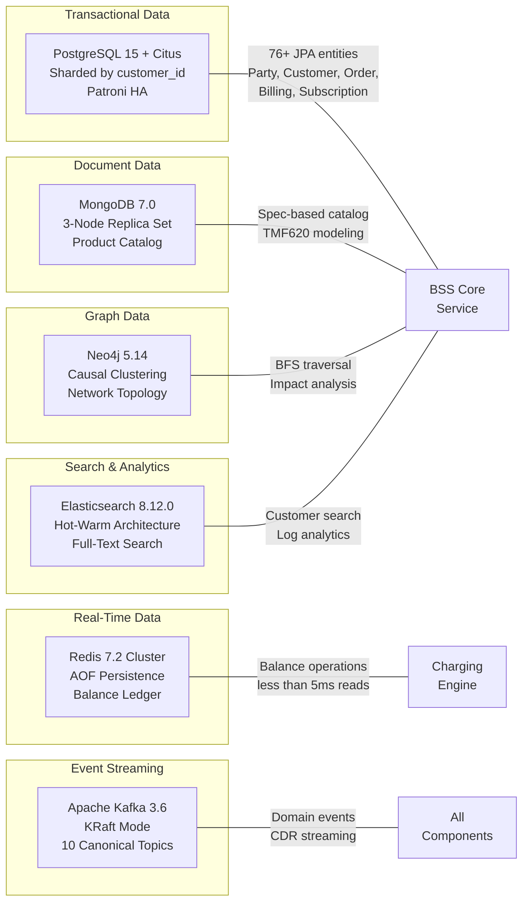

### 3.5.2 PostgreSQL 15 + Citus — Primary Transactional Database

PostgreSQL serves as the authoritative transactional store for all BSS/OSS domain entities, handling the platform's most complex relational data patterns.

| Attribute | Configuration | Evidence |
|---|---|---|
| **Version** | 15 (alpine) | `docker-compose.yml`: `postgres:15-alpine` |
| **Sharding** | Citus extension, sharded by `customer_id` | User context, `helm/citus-postgresql/` |
| **High Availability** | Patroni with synchronous replication | User context |
| **Helm Topology** | 2 coordinator nodes (100Gi) + 3 worker nodes (500Gi) | `helm/citus-postgresql/` |
| **Storage Class** | `fast-ssd` | `helm/bss-core/values.yaml` |
| **Migration Tool** | Flyway 10.6.0 with PostgreSQL dialect | `bss-core/pom.xml` |
| **Schema** | 30+ tables: party, customers, orders, invoices, subscriptions, products, etc. | `docs/data-models/database-schema.sql` |
| **Backup** | WAL-G to MinIO (hourly) | Implementation considerations |
| **Indexes** | national_id, phone, email, governorate, status, type, created_at | `docs/data-models/database-schema.sql` |
| **Functions** | `generate_invoice_number()`, `update_account_balance()` | `docs/data-models/database-schema.sql` |

**Domain Coverage:**
- Party and Customer golden records (TMF632/629)
- Orders and state history (TMF622/641/640)
- Billing accounts, invoices, and payments (TMF647/657/671)
- Subscriptions and addons
- Geographic addresses and sites (TMF653/656)
- Trouble tickets (TMF645)
- Audit trails (7-year retention per constraint C-003)

> **Default Stack Variance**: The default stack specifies MongoDB as the primary database. PostgreSQL + Citus was selected because the BSS/OSS domain requires strong ACID guarantees for financial transactions (billing, payments), complex relational queries across 76+ entities with foreign key integrity, and horizontal sharding by `customer_id` for 50M+ subscribers. MongoDB is retained for document-oriented catalog storage where schema flexibility is the primary requirement.

### 3.5.3 Redis 7 — Real-Time Balances & Caching

Redis provides the sub-millisecond data access tier required for the charging engine's real-time balance operations and platform-wide caching.

| Attribute | Configuration | Evidence |
|---|---|---|
| **Version** | 7 (alpine) / 7.2 (production cluster) | `deployment/docker-compose.yml`: `redis:7-alpine` |
| **Persistence** | AOF (Append-Only File) for balance durability | `deployment/docker-compose.yml` config |
| **Memory Policy** | maxmemory 512mb, allkeys-lru eviction | `deployment/docker-compose.yml` config |
| **Production Mode** | Redis Cluster 7.2 | User context |
| **Read Latency** | <5ms for balance checks | Charging engine requirements |

**Use Cases:**
- Charging engine balance ledger: balance retrieval, TTL-based reservation, confirmation, deduction, top-up (`charging-engine/internal/balance/service.go`)
- Distributed locking via Redis Redlock for fiber ports, IP blocks, VLAN IDs (Saga orchestration F-011)
- Kong Gateway rate-limiting backend (10,000 requests/minute)
- Session caching for portal authentication

### 3.5.4 MongoDB 7.0 — Document Store

| Attribute | Configuration | Evidence |
|---|---|---|
| **Version** | 7.0 | `deployment/docker-compose.yml`: `mongo:7.0` |
| **Production Mode** | 3-node replica set | User context |
| **Primary Use** | Product Catalog storage (TMF620) | Feature F-005 |

MongoDB's schemaless document model supports the Product Catalog's specification-based modeling where product offerings, characteristics, prices, and bundle rules vary significantly across service types (PSTN, FTTH, 4G, MPLS, Hosting). The flexible schema accommodates the constraint-based bundling engine's cross-service discount rules without rigid relational constraints.

### 3.5.5 Neo4j 5.14 — Graph Database

| Attribute | Configuration | Evidence |
|---|---|---|
| **Version** | 5.14 Community (dev), Enterprise (production) | `deployment/docker-compose.yml`: `neo4j:5.14-community` |
| **Production Mode** | Causal clustering (Enterprise edition) | User context |
| **APOC** | Procedures enabled | `deployment/docker-compose.yml` config |
| **Query Target** | 5-hop BFS traversal <10ms | Performance requirement |

Neo4j models the network topology for Resource Inventory (TMF638) and Service Inventory (TMF639), representing fiber paths (OLT → PON → Splitter → ONT), 3D rack elevations, and OSP infrastructure (trenches/ducts). The graph model enables the critical fiber-cut impact analysis workflow where a BFS traversal identifies all affected services and customers within 10ms.

### 3.5.6 Elasticsearch 8.12.0 — Full-Text Search & Analytics

| Attribute | Configuration | Evidence |
|---|---|---|
| **Version** | 8.12.0 | `docker-compose.yml`: `docker.elastic.co/elasticsearch/elasticsearch:8.12.0` |
| **Production Mode** | Hot-warm architecture | User context |
| **Visualization** | Kibana 8.12.0 | `deployment/docker-compose.yml`: `docker.elastic.co/kibana/kibana:8.12.0` |

Elasticsearch provides full-text search across customer records (name, address, national ID), log aggregation for the ELK stack, and analytics data exploration. The hot-warm architecture optimizes storage costs by migrating aging indices to warm nodes.

### 3.5.7 Apache Kafka — Event Streaming Platform

Apache Kafka serves as the platform's central nervous system, implementing the event-driven backbone that decouples all domain services.

| Attribute | Configuration | Evidence |
|---|---|---|
| **Development Images** | `confluentinc/cp-kafka:7.5.0`, `confluentinc/cp-zookeeper:7.5.0` | `docker-compose.yml` |
| **Production Mode** | Strimzi-managed, KRaft mode (no ZooKeeper), Kafka 3.6.1 | `infrastructure/kafka/kraft-cluster.yaml` |
| **Topology** | 3 controller nodes + 3 broker nodes (100Gi broker storage) | `infrastructure/kafka/kraft-cluster.yaml` |
| **Schema Registry** | `confluentinc/cp-schema-registry:7.5.0`, Avro with backward compatibility | `docker-compose.yml`, `shared/kafka/topic-definitions.yml` |
| **Tiered Storage** | MinIO for cold data offload | User context |

**Topic Architecture** (from `shared/kafka/topic-definitions.yml`):

| Topic | Partitions | Retention | Replication Factor | Throughput Tier |
|---|---|---|---|---|
| `party.events` | 6 | 7 days | 3 | Standard |
| `catalog.events` | 6 | 7 days | 3 | Standard |
| `order.events` | 6 | 7 days | 3 | Standard |
| `service.events` | 6 | 7 days | 3 | Standard |
| `resource.events` | 6 | 7 days | 3 | Standard |
| `billing.events` | 6 | 7 days | 3 | Standard |
| `usage.events` | 12 | 7 days | 3 | High-throughput |
| `charging.events` | 12 | 7 days | 3 | High-throughput |
| `alarm.events` | 6 | 3 days | 3 | Short retention |
| `events.dlq` | 6 | 30 days | 3 | Dead letter |

**Consumer Groups**: `party-mgmt-group`, `catalog-mgmt-group`, `order-mgmt-group`, `charging-engine-group`

### 3.5.8 Data Persistence Strategy Summary

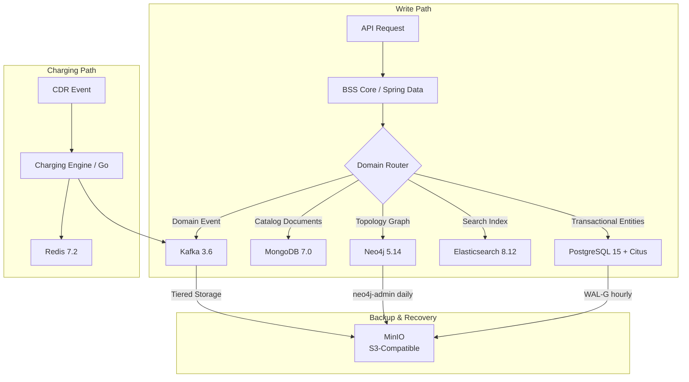

| Strategy | Implementation | RPO | RTO |
|---|---|---|---|
| **Synchronous Replication** | PostgreSQL Patroni (charging/billing domain) | <15 minutes | <30 minutes |
| **AOF Persistence** | Redis (balance ledger) | Per-second durability | <10 seconds |
| **Replica Sets** | MongoDB 3-node (product catalog) | Near-zero | Automatic failover |
| **Causal Clustering** | Neo4j Enterprise (inventory topology) | Near-zero | Automatic failover |
| **KRaft Replication** | Kafka RF=3 (all topics) | Zero (committed events) | Automatic leader election |
| **WAL-G Backup** | PostgreSQL → MinIO (hourly) | <1 hour | Restore from backup |

## 3.6 Development & Deployment

### 3.6.1 Containerization Strategy

All platform components are containerized using Docker with multi-stage builds to minimize image size and attack surface:

| Component | Base Image | Exposed Ports | Build Strategy | Evidence |
|---|---|---|---|---|
| BSS Core Service | `eclipse-temurin:21-jre-alpine` | 8080, 8443, 9090 | Single-stage (pre-built JAR) | `deployment/Dockerfile` |
| Charging Engine | `golang:1.22-alpine` → `alpine:3.19` | 8081 | Multi-stage (static binary, CGO_ENABLED=0) | `charging-engine/Dockerfile` |
| API Gateway | `node:20-alpine` (2 stages) | 3000 | Multi-stage (npm ci → nest build → production) | `api-gateway/Dockerfile` |
| Frontend Portals | `nginx:alpine` | 80 (mapped to 3001–3004) | Pre-built static files with SPA fallback | `deployment/` nginx configs |
| Kong Gateway | `kong:latest` | 8000, 8001, 8444 | Declarative config (`KONG_DATABASE: "off"`) | `deployment/docker-compose.yml` |

**Container Security:**
- All runtime images use Alpine Linux base for minimal attack surface
- Go charging engine compiled as a static binary with zero runtime dependencies
- Non-root container execution enforced via Kubernetes SecurityContext
- Trivy scanning on all images before Harbor push (zero CRITICAL/HIGH policy)

### 3.6.2 Container Orchestration — Kubernetes

| Attribute | Configuration | Evidence |
|---|---|---|
| **Distribution** | RKE2/k3s on bare metal or vSphere | User context |
| **Node Topology** | 3 master + 6 worker nodes per site | Constraint A-006 |
| **Multi-Site** | 3-site active-active distributed architecture | User context |
| **Namespace** | `bss-oss` with Istio injection label | `infrastructure/kubernetes/` manifests |
| **API Version** | autoscaling/v2 (HPA), policy/v1 (PDB) | `infrastructure/kubernetes/` |

**Kubernetes Resources** (from `infrastructure/kubernetes/` — 5 manifest files):
- Deployments with resource limits and liveness/readiness probes
- Services (ClusterIP, NodePort) for inter-component routing
- HorizontalPodAutoscalers (autoscaling/v2) with CPU-based scaling
- PodDisruptionBudgets for rolling update safety
- NetworkPolicies for namespace-level traffic isolation
- ConfigMaps and Secrets for externalized configuration

**Autoscaling Configuration** (from `helm/bss-core/values.yaml` and `infrastructure/kubernetes/`):

| Service | Min Replicas | Max Replicas | CPU Target | KEDA Trigger |
|---|---|---|---|---|
| api-gateway | 3 | 10 | 70% | Prometheus: `http_requests_total` > 1000 |
| bss-core | 3 | 20 | 70% | Prometheus: `hikaricp_connections_active` > 80 |
| charging-engine | 5 | 50 | 60% | Kafka lag: `bss.billing.charges` > 100 |
| customer-service | 3 | 10 | — | HPA only |
| billing-service | 3 | 15 | — | HPA only |
| order-service | 3 | 15 | — | HPA only |

KEDA (Kubernetes Event-Driven Autoscaling) extends native HPA with event-source-aware scaling, installed from the `kedacore/keda` Helm repository as configured in `helm/deploy.sh`.

### 3.6.3 Service Mesh — Istio 1.20 Ambient

| Attribute | Configuration | Evidence |
|---|---|---|
| **Profile** | Ambient (sidecar-less mesh) | `infrastructure/istio/istio-config.yaml` |
| **mTLS Mode** | Strict (PeerAuthentication in `bss-oss` namespace) | `infrastructure/istio/istio-config.yaml` |
| **Identity** | SPIFFE for service-to-service authentication | `infrastructure/istio/istio-config.yaml` |
| **Authorization** | API Gateway SPIFFE identity scoped; methods: GET, POST, PUT, DELETE, PATCH | `infrastructure/istio/istio-config.yaml` |
| **Tracing** | 100% sampling rate | `infrastructure/istio/istio-config.yaml` |
| **Access Logs** | stdout format | `infrastructure/istio/istio-config.yaml` |
| **Pilot Resources** | 500m CPU, 2Gi memory | `infrastructure/istio/istio-config.yaml` |

### 3.6.4 API Gateway — Kong 3.5

| Attribute | Configuration | Evidence |
|---|---|---|
| **Deployment Mode** | Declarative (`KONG_DATABASE: "off"`) | `infrastructure/kong/kong-config.yaml` |
| **Rate Limiting** | 10,000 requests/minute, Redis-backed storage | `infrastructure/kong/kong-config.yaml` |
| **OAuth2** | Scopes: `tmf:read`, `tmf:write`, `tmf:admin`; 3600s token expiry | `infrastructure/kong/kong-config.yaml` |
| **Ingress** | Host: `api.yemenptc.com`, path prefix `/`, upstream: `api-gateway:3000` | `infrastructure/kong/kong-config.yaml` |

### 3.6.5 CI/CD Pipelines

The platform maintains dual CI/CD pipelines — GitLab CI as the primary pipeline and GitHub Actions as the secondary — providing redundancy and supporting different workflow stages.

#### GitLab CI Pipeline (Primary)

**Source**: `.gitlab-ci.yml`

| Stage | Activities | Key Configuration |
|---|---|---|
| **build** | Maven 3.9 + Temurin JDK 21, Docker 24-dind | Maven cache: `.m2/repository/` |
| **test** | Unit tests (`mvn test`), Integration tests | Service containers: PostgreSQL, Redis, Kafka |
| **security** | OWASP ZAP baseline, OWASP Dependency Check | Fail on critical findings |
| **quality** | SonarQube analysis, JaCoCo coverage | Quality gate enforcement |
| **deploy-dev** | `kubectl apply` with rollout verification | Environment: development |
| **deploy-staging** | `kubectl apply` with rollout verification | Environment: staging |
| **deploy-prod** | `kubectl apply` with rollout verification | Environment: production (manual gate) |

#### GitHub Actions Pipeline (Secondary)

**Source**: `.github/workflows/ci-cd.yml`

| Job | Runtime | Activities |
|---|---|---|
| Java Build & Test | JDK 21 (Temurin) / Maven | BSS Core compilation and test suite |
| Go Build & Test | Go 1.22 | Charging engine compilation and tests |
| NestJS Build | Node.js 20 | API Gateway compilation and tests |
| React Frontend Build | Node.js 20 | Customer portal production build |
| Docker Build & Push | docker/build-push-action@v5 | Multi-component image build → GHCR (`ghcr.io/yemenptc`) |
| Deploy to Staging | kubectl | Staging environment deployment |

**Triggers**: Push to `main`/`develop` branches, PRs to `main`
**Image Tagging**: `latest` + commit SHA for traceability

#### Security Pipeline

**Source**: `.github/workflows/security.yml`

| Tool | Schedule | Threshold |
|---|---|---|
| Snyk | Weekly cron + push to main/develop | High severity |
| Trivy | Weekly cron + push to main/develop | CRITICAL/HIGH, fail-on-finding |
| Semgrep | Weekly cron + push to main/develop | Java + Spring SAST rule packs |

#### Load Testing Pipeline

**Source**: `.github/workflows/load-test.yml`

| Test | Virtual Users | Duration | Tool |
|---|---|---|---|
| Party API Load Test | 100 VUs | 5 minutes | k6 |
| Order API Load Test | 50 VUs | 5 minutes | k6 |
| Charging API Load Test | 200 VUs | 5 minutes | k6 |

Scheduled daily at 2:00 AM with manual trigger capability. Supplemented by Apache JMeter test plans in `deployment/tests/`.

### 3.6.6 GitOps & Continuous Delivery — ArgoCD

| Attribute | Configuration | Evidence |
|---|---|---|
| **ApplicationSet** | Generates apps for bss-core, charging-engine, api-gateway | `infrastructure/argocd/appset.yaml` |
| **Sync Policy** | Automated with prune, selfHeal, CreateNamespace | `infrastructure/argocd/appset.yaml` |
| **Retry** | Exponential backoff | `infrastructure/argocd/appset.yaml` |
| **AppProject** | `bss-oss` with restricted repository and namespace access | `infrastructure/argocd/appset.yaml` |

> **Default Stack Variance**: The default stack specifies Terraform for Infrastructure as Code. The actual implementation uses Helm Charts + Kubernetes YAML manifests + ArgoCD GitOps because the on-premises bare-metal/vSphere deployment model does not have a cloud provider API that Terraform would target. ArgoCD provides declarative, Git-driven infrastructure management that is self-contained within the Kubernetes cluster.

### 3.6.7 Build Systems

| Component | Build System | Command | Output |
|---|---|---|---|
| BSS Core | Maven 3.9 | `mvn clean package` | `target/*.jar` |
| Charging Engine | Go Build | `CGO_ENABLED=0 GOOS=linux go build -o /app ./cmd/server` | `/app` static binary |
| API Gateway | npm/NestJS CLI | `npm ci && nest build` | `dist/main.js` |
| Customer Portal | npm/Vite | `npm ci && npm run build` | `dist/` static assets |
| Operator Portals | npm/CRA | `npm ci && npm run build` | `build/` static assets |

### 3.6.8 Helm Charts

The deployment model uses Helm charts for standardized, repeatable releases across development, staging, and production environments:

**Umbrella Charts** (from `helm/`):

| Chart | Version | Dependencies | Evidence |
|---|---|---|---|
| `bss-core` | — | 3 subchart dependencies (core services) | `helm/bss-core/Chart.yaml` |
| `monitoring` | — | prometheus 25.0.0, grafana 7.0.0, alertmanager 1.0.0 | `helm/monitoring/Chart.yaml` |
| `citus-postgresql` | — | Citus coordinator/worker topology | `helm/citus-postgresql/` |

**External Helm Repositories** (from `helm/deploy.sh`):

| Repository | URL | Charts Used |
|---|---|---|
| prometheus-community | `https://prometheus-community.github.io/helm-charts` | prometheus v25.0.0, alertmanager v1.0.0 |
| grafana | `https://grafana.github.io/helm-charts` | grafana v7.0.0 |
| kedacore | `https://kedacore.github.io/charts` | keda |
| bitnami | `https://charts.bitnami.com/bitnami` | Shared utilities |

### 3.6.9 Testing & Quality Assurance Infrastructure

| Category | Tool | Version | Purpose | Evidence |
|---|---|---|---|---|
| Unit Testing | JUnit 5 / Surefire | (managed) | Java unit test execution | `bss-core/pom.xml` |
| Integration Testing | Testcontainers | 1.19.3 | PostgreSQL and Kafka containers for integration tests | `bss-core/pom.xml` |
| In-Memory DB | H2 | (managed) | Lightweight unit test database | `bss-core/pom.xml` |
| Mocking | Mockito | (managed) | Service layer mocking | `bss-core/pom.xml` |
| Load Testing | k6 | latest | API load testing (100–200 VUs) | `.github/workflows/load-test.yml` |
| Load Testing | Apache JMeter | — | Comprehensive load plans | `deployment/tests/` |
| Chaos Engineering | LitmusChaos | — | Pod-delete, network-latency, CPU-hog experiments | `infrastructure/chaos/chaos-engines.yaml` |
| Performance Benchmark | Custom Python | — | 50M event CDR pipeline validation | `benchmark/performance_benchmark.py` |

**Chaos Engineering Experiments** (from `infrastructure/chaos/chaos-engines.yaml`):

| Target | Experiment | Duration | Parameters |
|---|---|---|---|
| bss-core | pod-delete | 60s | HTTP health probe during failure |
| bss-core | network-latency | 120s | 300ms injected latency |
| bss-core | pod-cpu-hog | 60s | 1 core consumed |
| charging-engine | pod-delete | 60s | Recovery validation |
| charging-engine | network-latency | 120s | 100ms injected latency |

### 3.6.10 Observability Stack

The observability infrastructure provides end-to-end visibility across all platform components, supporting the >95% distributed tracing coverage target (quality gate QG-7) and 25+ operational dashboards.

| Component | Version | Purpose | Evidence |
|---|---|---|---|
| **Prometheus** | v2.50.0 | Metrics collection and alerting (15-day dev / 30-day prod retention) | `deployment/docker-compose.yml`, `helm/monitoring/Chart.yaml` (v25.0.0) |
| **Grafana** | 10.3.0 | Dashboard visualization (25+ BSS/OSS dashboards, SLA burn rates) | `deployment/docker-compose.yml`, `helm/monitoring/Chart.yaml` (v7.0.0) |
| **Alertmanager** | (chart v1.0.0) | Severity-based routing: critical → PagerDuty, warning → Slack, info → SMTP | `helm/monitoring/Chart.yaml` |
| **Kibana** | 8.12.0 | Log visualization and Elasticsearch exploration | `deployment/docker-compose.yml` |
| **OpenTelemetry** | 1.34.1 | Distributed tracing API/SDK with Spring Boot auto-instrumentation | `bss-core/pom.xml` |
| **Micrometer** | (managed) | JVM and application metrics export to Prometheus | `bss-core/pom.xml` |

**Grafana Configuration:**
- Datasources: Prometheus, Loki, Tempo
- Ingress: `grafana.yemenptc.com` with TLS termination
- 25+ dashboards: BSS/OSS overview, SLA burn rates, business metrics, Kafka lag, charging engine performance

**Prometheus Alert Rules** (from `deployment/monitoring/`):
- 8+ BSS-specific rules covering order failures, payment failures, circuit breaker state, latency thresholds, Kafka consumer lag, and database connection pool saturation
- Scrape targets: BSS Core (actuator), API Gateway, Kafka (JMX), PostgreSQL (exporter), Redis (exporter)

## 3.7 Technology Stack Summary

### 3.7.1 Complete Version Matrix

| Category | Technology | Version | License |
|---|---|---|---|
| **Languages** | Java | 21 (LTS) | GPL v2 + CPE |
| | Go | 1.22 | BSD 3-Clause |
| | TypeScript | 5.3+ | Apache 2.0 |
| | Python | 3.x | PSF License |
| **Core Frameworks** | Spring Boot | 3.2.0 | Apache 2.0 |
| | NestJS | 10.3.0+ | MIT |
| | React | 18.2.0 | MIT |
| | Gin | 1.9.1 | MIT |
| | Vite | 5.0.0 | MIT |
| **Databases** | PostgreSQL + Citus | 15 | PostgreSQL License |
| | Redis | 7.2 | BSD 3-Clause |
| | MongoDB | 7.0 | SSPL |
| | Neo4j | 5.14 (Community/Enterprise) | GPL v3 / Commercial |
| | Elasticsearch | 8.12.0 | Elastic License 2.0 |
| **Messaging** | Apache Kafka | 3.6.1 (KRaft) | Apache 2.0 |
| | Confluent Schema Registry | 7.5.0 | Confluent Community License |
| **Orchestration** | Temporal.io | 1.22.3 | MIT |
| | Kubernetes | 1.29 (RKE2/k3s) | Apache 2.0 |
| **Service Mesh** | Istio | 1.20 (Ambient) | Apache 2.0 |
| **API Gateway** | Kong | 3.5 | Apache 2.0 |
| **Identity** | Keycloak | (on-premises) | Apache 2.0 |
| **Secrets** | HashiCorp Vault | (Raft backend) | BUSL 1.1 |
| **Registry** | Harbor | 2.10 | Apache 2.0 |
| **GitOps** | ArgoCD | — | Apache 2.0 |
| **Autoscaling** | KEDA | — | Apache 2.0 |
| **Observability** | Prometheus | v2.50.0 | Apache 2.0 |
| | Grafana | 10.3.0 | AGPL v3 |
| | OpenTelemetry | 1.34.1 | Apache 2.0 |
| **Resilience** | Resilience4j | 2.2.0 | Apache 2.0 |
| **Chaos** | LitmusChaos | — | Apache 2.0 |

### 3.7.2 Default Stack Variance Summary

The following table documents all deviations from the user-provided default technology stack, with justifications grounded in the platform's carrier-grade requirements:

| Category | Default Specification | Actual Implementation | Justification |
|---|---|---|---|
| Cloud Platform | AWS | On-premises (bare metal/vSphere) | Constraint C-001: Air-gapped deployment required; no external cloud dependencies |
| Backend Language | Python / Flask | Java 21 / Spring Boot 3.2 + Go 1.22 + TypeScript / NestJS + Python | Polyglot architecture: Java for enterprise BSS logic (76+ JPA entities), Go for <50ms charging, NestJS for API composition, Python for CDR/ML |
| Primary Database | MongoDB | PostgreSQL 15 + Citus (primary) + MongoDB 7.0 (catalog) + Neo4j 5.14 + Redis 7.2 + Elasticsearch 8.12 | Polyglot persistence: ACID guarantees for financial data, graph model for topology, document store for catalog flexibility |
| Authentication | Auth0 | Keycloak (on-premises) | Constraint C-001: Air-gapped deployment prohibits SaaS dependencies |
| CSS Framework | TailwindCSS | MUI 5 + Emotion CSS-in-JS | Pre-built accessible components for telecom portals; Arabic RTL support |
| CI/CD | GitHub Actions | GitLab CI (primary) + GitHub Actions (secondary) | Dual pipeline for redundancy; GitLab CI is the production deployment pipeline |
| IaC | Terraform | Helm Charts + Kubernetes YAML + ArgoCD GitOps | No cloud provider API target; Helm/ArgoCD is Kubernetes-native |
| AI Framework | Langchain | Custom Python ML pipeline | Platform-specific fraud detection and churn prediction models; no LLM orchestration requirement |
| Mobile | React-Native | Not implemented (web portals only) | Portals are browser-based responsive applications; no native mobile requirement in current scope |
| Containerization | Docker | Docker (confirmed) | Aligned with default |
| Frontend | React with TypeScript | React 18 with TypeScript 5.3 (confirmed) | Aligned with default (framework matches, build tooling differs: Vite/CRA vs. unspecified) |

#### References

- `bss-core/pom.xml` — Maven dependency manifest: Java 21, Spring Boot 3.2.0, 40+ dependencies with versions
- `charging-engine/go.mod` — Go module manifest: Go 1.22, 4 direct dependencies
- `charging-engine/Dockerfile` — Multi-stage Go build: golang:1.22-alpine → alpine:3.19
- `api-gateway/package.json` — NestJS 10.3.0+ with TypeScript 5.3.3, 10 production dependencies
- `frontend/package.json` — React 18.2.0, Vite 5.0.0, TypeScript 5.3.0
- `deployment/portal/package.json` — MUI 5.14.18, Chart.js 4.4.1, react-scripts 5.0.1
- `deployment/Dockerfile` — BSS Core container: eclipse-temurin:21-jre-alpine
- `deployment/docker-compose.yml` — Full 15+ service local stack with all database versions
- `docker-compose.yml` — Development infrastructure: PostgreSQL 15, Redis 7, Kafka 7.5.0, Elasticsearch 8.12.0
- `shared/kafka/topic-definitions.yml` — 10 canonical topics, 4 consumer groups, partitioning/retention policies
- `infrastructure/istio/istio-config.yaml` — Ambient mesh profile, strict mTLS, SPIFFE identity
- `infrastructure/kafka/kraft-cluster.yaml` — Strimzi KRaft cluster: 3 controllers + 3 brokers
- `infrastructure/kong/kong-config.yaml` — Declarative Kong: rate limiting, OAuth2, ingress routing
- `infrastructure/kubernetes/` — 5 manifest files: Deployments, HPAs, PDBs, NetworkPolicies
- `infrastructure/argocd/appset.yaml` — ApplicationSet for GitOps auto-sync
- `infrastructure/chaos/chaos-engines.yaml` — LitmusChaos experiments for bss-core and charging-engine
- `helm/bss-core/Chart.yaml` — Umbrella chart with 3 dependencies
- `helm/bss-core/values.yaml` — Production configuration: JVM tuning, autoscaling, registry
- `helm/monitoring/Chart.yaml` — Prometheus 25.0.0, Grafana 7.0.0, Alertmanager 1.0.0
- `helm/deploy.sh` — External Helm repository registration and deployment script
- `helm/citus-postgresql/` — Citus coordinator/worker Helm chart
- `.gitlab-ci.yml` — 7-stage CI/CD pipeline with security scanning and quality gates
- `.github/workflows/ci-cd.yml` — Multi-component GitHub Actions pipeline
- `.github/workflows/security.yml` — Snyk + Trivy + Semgrep security pipeline
- `.github/workflows/load-test.yml` — k6 daily load testing pipeline
- `cdrmspipeline/orchestrator.py` — Python CDR pipeline orchestrator
- `benchmark/performance_benchmark.py` — 50M event performance benchmark
- `migration/` — Java ETL subsystem: extractors, transformers, reconciliation
- `docs/data-models/database-schema.sql` — PostgreSQL schema definitions
- `README.md` — Technology overview and project structure

# 4. Process Flowchart

This section provides a comprehensive visual and narrative reference for all major process workflows within the Yemen PTC BSS/OSS Platform. Each flowchart documents the end-to-end journey from initiation to completion, including decision points, system boundaries, error handling paths, state transitions, and integration sequences. All diagrams are grounded in the implemented codebase and reflect the actual orchestration logic, event topology, and resilience patterns observed across the four application modules: BSS Core (Java/Spring Boot), Charging Engine (Go), CDR Mediation Pipeline (Python), and API Gateway (NestJS).

---

## 4.1 HIGH-LEVEL SYSTEM WORKFLOW

### 4.1.1 End-to-End Process Architecture

The platform operates through three primary process chains that collectively deliver the carrier-grade BSS/OSS capability for 50M+ subscribers. These chains are: the **Order-to-Activate** path (customer engagement through service provisioning), the **Usage-to-Cash** path (network usage through invoice generation), and the **Alarm-to-Resolution** path (network events through trouble ticket closure). All three chains are interconnected through the Apache Kafka event backbone, which provides the asynchronous, decoupled messaging fabric defined in `shared/kafka/topic-definitions.yml`.

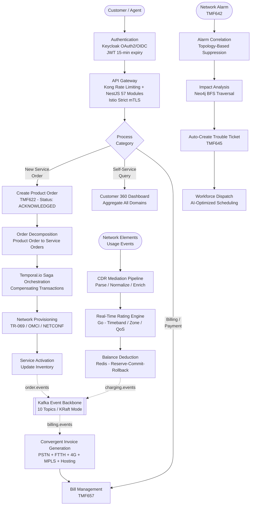

The diagram above illustrates how a customer or agent request enters through the Keycloak-secured API Gateway layer (Feature F-028), is routed to the appropriate process chain, and progresses through domain-specific workflows before persisting outcomes to the polyglot data layer and publishing events to Kafka. The Order-to-Activate chain is orchestrated by Temporal.io (`FtthOrderWorkflowImpl.java`), the Usage-to-Cash chain is driven by the Go charging engine (`charging-engine/internal/cdr/mediator.go`) and Python pipeline (`cdrmspipeline/orchestrator.py`), and the Alarm-to-Resolution chain leverages Neo4j graph traversal for fiber-cut impact analysis (Feature F-020).

### 4.1.2 System Boundaries and Actor Map

The platform defines ten distinct system boundaries through which processes flow. Each boundary represents a deployment unit or integration tier with defined responsibilities, protocols, and SLA characteristics.

| Boundary | Technology | Primary Responsibility | SLA Target |
|---|---|---|---|
| **Customer / Subscriber** | React + TypeScript + Vite Portal | Self-service operations, dashboard viewing | N/A |
| **Agent / Operator** | React + MUI Admin Portal | Order management, approval/rejection workflows | N/A |
| **API Gateway Layer** | Kong 3.5 + NestJS 10 (57 modules) | Rate limiting, OAuth2 validation, proxy routing | p95 < 200ms |
| **BSS Core** | Spring Boot 3.2 / Java 21 (45 controllers) | TMF API implementations, business logic | 99.99% uptime |
| **Temporal Orchestration** | Temporal.io 1.22.3 | Saga workflows, compensating transactions | Recovery < 30s |
| **Charging Engine** | Go 1.22, Kafka Consumer, Redis | CDR rating, balance deduction | p99 < 50ms |
| **CDR Pipeline** | Python 3.x (4-stage pipeline) | CDR parsing, normalization, enrichment, delivery | >1,200 events/sec |
| **Kafka Event Backbone** | Apache Kafka 3.6 KRaft (10 topics) | Asynchronous event distribution, domain decoupling | Zero message loss (RF=3) |
| **Data Layer** | PostgreSQL/Citus, Redis, Neo4j, MongoDB, Elasticsearch | Polyglot persistence, graph topology, search | RPO < 15 min |
| **Legacy Systems** | TITAN, Oracle BRM, WHM (6 adapters) | Protocol translation, Strangler Fig coexistence | Circuit-broken |

---

## 4.2 CORE BUSINESS PROCESS FLOWS

### 4.2.1 End-to-End Order Fulfillment

The order fulfillment workflow is the platform's most critical business process, spanning from customer order submission through service activation. It traverses four primary components: `OrderService.java` for order creation, `OrderDecomposer.java` for product-to-service order decomposition, `WorkflowOrchestrator.java` for activity chain execution, and `FtthOrderWorkflowImpl.java` for Temporal saga orchestration.

#### Order Creation and Decomposition Flow

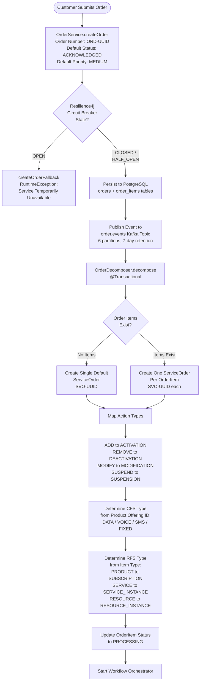

The `OrderDecomposer.decompose()` method runs within a `@Transactional` boundary, ensuring that either all service orders are created atomically or none are. Each `ServiceOrder` receives a generated order number in the format `SVO-` plus a UUID fragment, with an initial status of `ACKNOWLEDGED`. The CFS type (Customer-Facing Service) is derived from the product offering identifier, while the RFS type (Resource-Facing Service) is determined from the item type classification.

#### Workflow Activity Chain

Once service orders are created, the `WorkflowOrchestrator` executes an in-memory state machine that processes activities in a defined sequence. The orchestrator maintains execution state in a `ConcurrentHashMap` for thread-safe tracking.

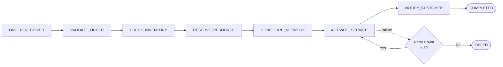

The workflow execution follows a strict activity chain: `ORDER_RECEIVED` → `VALIDATE_ORDER` → `CHECK_INVENTORY` → `RESERVE_RESOURCE` → `CONFIGURE_NETWORK` → `ACTIVATE_SERVICE` → `NOTIFY_CUSTOMER` → `COMPLETED`. A retry policy allows a maximum of three attempts per activity before marking the workflow as `FAILED`. Workflow statuses progress through `INITIATED` → `RUNNING` → `COMPLETED`, `FAILED`, or `CANCELLED`.

### 4.2.2 Saga-Based Convergent Order Orchestration

For multi-domain convergent orders (e.g., the "Home Premium Bundle" combining Landline + FTTH + 4G + Hosting), the platform employs Temporal.io 1.22.3 to orchestrate a five-step saga pattern with compensating transactions, as implemented in `FtthOrderWorkflowImpl.java`. Each activity has a 30-second start-to-close timeout, a maximum of 3 retry attempts, and a 1-second initial retry interval.

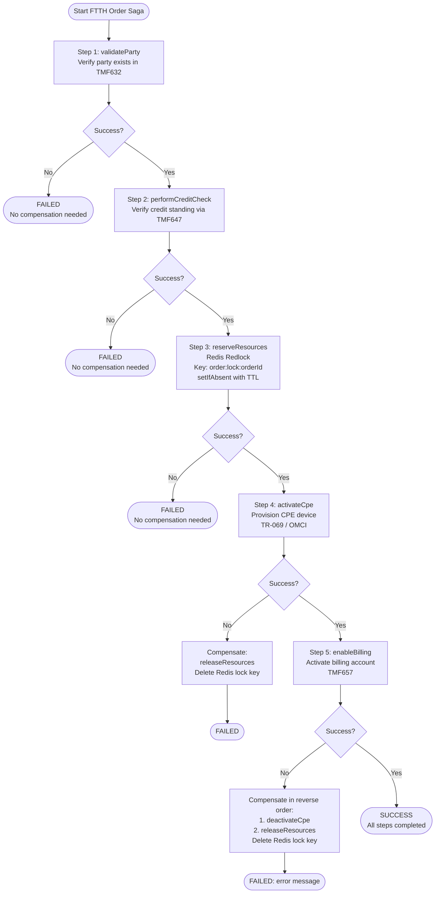

The saga tracks completed steps using an enum-based progression: `PARTY_VALIDATED` → `CREDIT_CHECKED` → `RESOURCES_RESERVED` → `CPE_ACTIVATED` → `BILLING_ENABLED`. Compensating actions are always executed in reverse order of completed steps. Steps 1 and 2 (party validation and credit check) are read-only operations that require no compensation. Steps 3 through 5 have explicit rollback actions: `RESOURCES_RESERVED` compensates with `releaseResources()` (deletes the Redis lock key `order:lock:{orderId}`), `CPE_ACTIVATED` compensates with `deactivateCpe()`, and `BILLING_ENABLED` compensates with `disableBilling()`. The target saga recovery time is less than 30 seconds from failure detection.

### 4.2.3 Real-Time Charging and Rating

The real-time charging flow is the platform's most performance-critical process path, targeting p99 latency below 50ms for rating operations. It is implemented entirely in Go (`charging-engine/internal/`) for maximum throughput, processing usage events from Kafka and debiting balances via Redis.

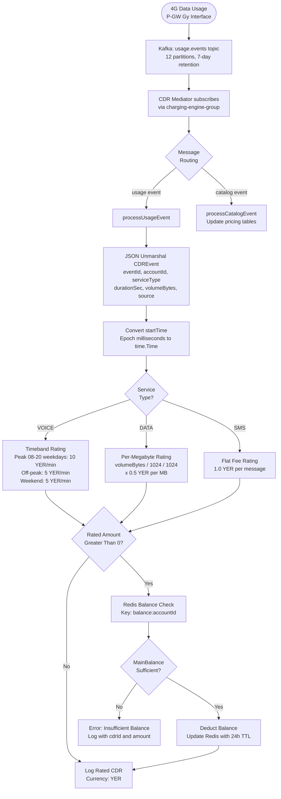

The rating engine in `charging-engine/internal/rating/service.go` maintains in-memory pricing plans with three default configurations: `voice-standard` (timeband-based with peak, off-peak, and weekend rates), `data-standard` (per-megabyte at 0.5 YER/MB), and `sms-standard` (flat fee at 1.0 YER). All rated CDRs are denominated in YER (Yemeni Rial). The balance service in `charging-engine/internal/balance/service.go` implements a Reserve-Commit-Rollback pattern with the following operations:

| Operation | Redis Key Pattern | Behavior |
|---|---|---|
| `GetBalance` | `balance:{accountID}` | Returns balance; defaults to 0 YER if key missing |
| `Reserve` | `reservation:{reservationID}` | Checks available = MainBalance - ReservedTotal; creates reservation with 5-min TTL |
| `Confirm` | N/A | MainBalance -= amount; ReservedTotal -= amount; deletes reservation key |
| `Deduct` | `balance:{accountID}` | Direct deduction without reservation |
| `TopUp` | `balance:{accountID}` | Adds to MainBalance or BonusBalance based on flag |

### 4.2.4 CDR Mediation Pipeline

The CDR mediation pipeline in `cdrmspipeline/orchestrator.py` implements a multi-stage processing flow that ingests raw CDRs from three legacy formats (TITAN ASCII, Oracle ASN.1, IPDR CSV), normalizes them into a canonical schema, enriches them with context from microservices, and delivers them to Kafka with idempotent guarantees. The pipeline has been validated at 1,240 events/sec sustained throughput with 2,100 events/sec peak.

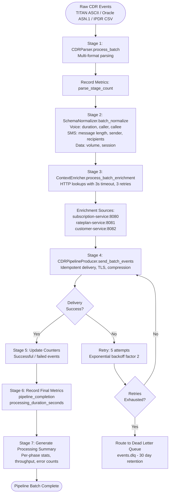

The pipeline's health check mechanism aggregates status from five internal components: parser, normalizer, enricher, kafka_producer, and metrics_collector. The enrichment stage performs HTTP lookups to three microservices with a 3-second request timeout and up to 3 retry attempts per enrichment call, achieving a validated enrichment success rate of 99.8%.

### 4.2.5 Convergent Billing and Invoice Generation

The convergent billing flow aggregates charges from all service domains (PSTN, FTTH, 4G/LTE, MPLS, and Hosting) onto a single invoice. This is the core promise of the unified platform, replacing four separate billing engines. The `Invoice.java` entity maps to the `invoices` table, with invoice numbers generated by the `generate_invoice_number()` PostgreSQL database function following the pattern `INV-<YEAR>-<SEQUENCE>`.

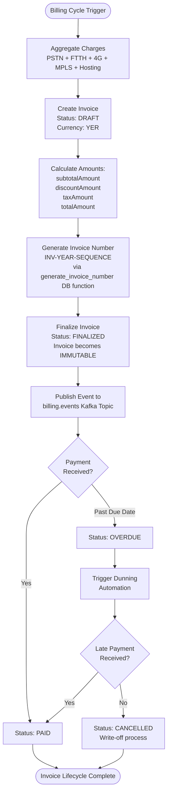

A critical business rule enforces that once an invoice transitions to `FINALIZED`, it becomes immutable—no modifications are permitted. The `OVERDUE` status is triggered automatically when an invoice passes its due date without payment. The billing controller at `/tmf-api/customerBillManagement/v5` supports create, get, list, and finalize operations for invoices, as well as create, process, get, and list operations for payments. The `update_account_balance()` database function provides transactional balance updates to ensure billing accuracy, which is validated through a 3-month parallel run targeting 100% accuracy across 10,000 revenue validation events.

### 4.2.6 Fiber Cut Impact Analysis

The fiber cut impact analysis workflow demonstrates the platform's topology-aware assurance capability, leveraging Neo4j graph traversal to identify all affected services and customers within a target of 10 milliseconds. This workflow integrates Features F-020 (Service Inventory), F-024 (Alarm Management), F-023 (Trouble Ticket), and workforce management.

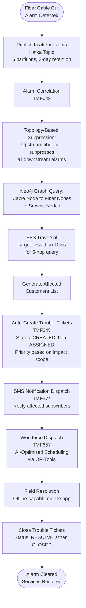

The Neo4j graph model represents the fiber topology path from OLT → PON → Splitter → ONT, enabling a BFS traversal that follows the chain: Cable → Fibers → Services → Customers. Alarm correlation logic suppresses downstream alarms when an upstream fiber cut is detected, reducing alarm noise. Future enhancements include Bayesian root cause analysis for more sophisticated correlation. The workforce dispatch step leverages AI-optimized technician scheduling with an offline-capable mobile application for field operations in areas with limited connectivity.

---

## 4.3 STATE TRANSITION DIAGRAMS

All entity state machines in the Yemen PTC BSS/OSS Platform enforce strict transition rules. Invalid state transitions return HTTP 409 (Conflict) responses, and the platform's idempotency guarantee ensures that 100 retries produce exactly 1 side effect (Quality Gate QG-2). State history is persisted in dedicated audit tables (e.g., `order_state_history`) with timestamps and actor identification.

### 4.3.1 Product Order State Machine

The product order entity (`Order.java` → `orders` table) supports eight states, five order types, and four priority levels. This is the most complex state machine in the platform, governing the entry point for all customer-initiated service changes.

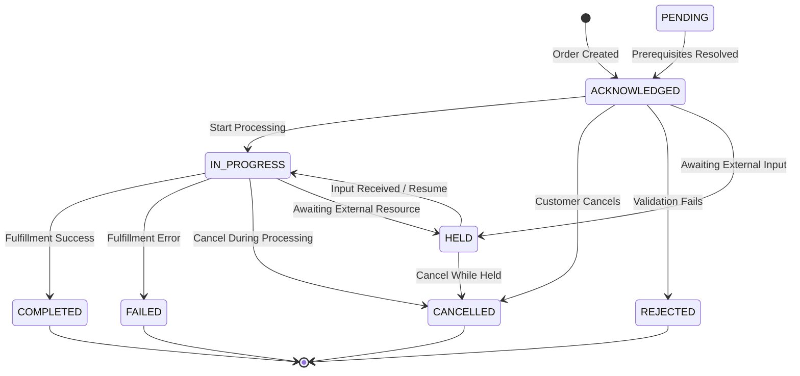

**Order Types**: `ACQUISITION`, `MODIFICATION`, `TERMINATION`, `SUSPENSION`, `RESUMPTION`
**Priorities**: `CRITICAL`, `HIGH`, `MEDIUM` (default), `LOW`
**Persistence**: `orders`, `order_items`, `order_state_history` tables in PostgreSQL

### 4.3.2 Service Order State Machine

The service order entity (`ServiceOrder.java` → `service_orders` table) manages the technical fulfillment lifecycle, created during order decomposition by `OrderDecomposer.java`. Each service order carries a CFS type and RFS type derived from the parent product order.

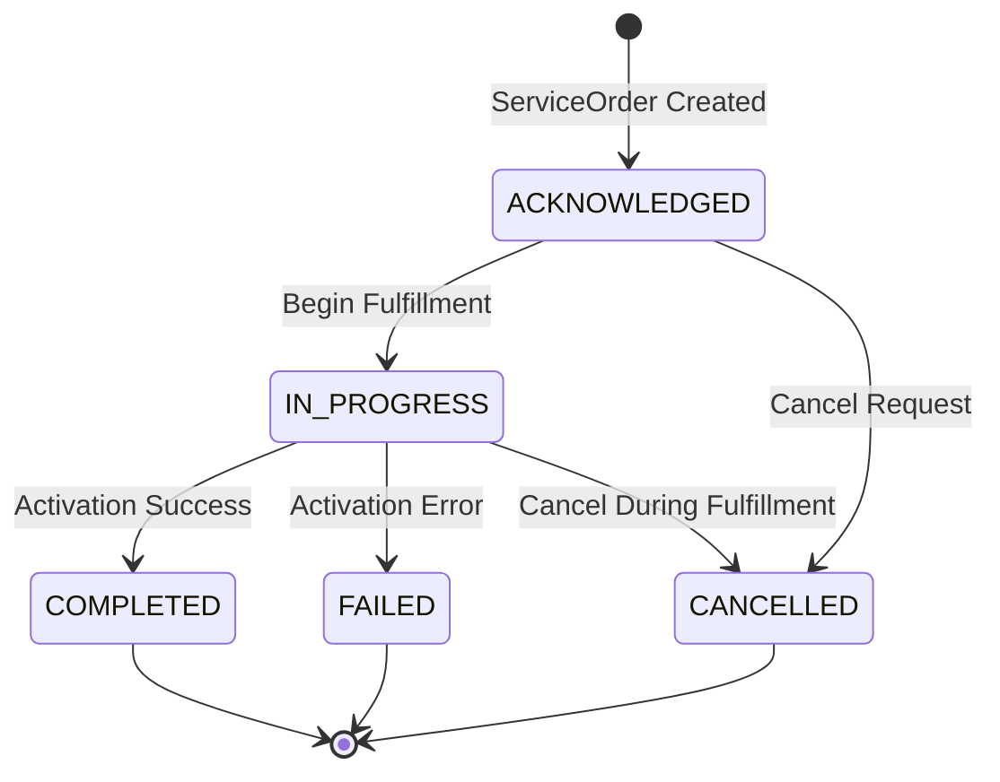

**Order Types**: `ACTIVATION`, `DEACTIVATION`, `MODIFICATION`, `SUSPENSION` (extended: `INSTALLATION`, `TERMINATION`, `MIGRATION`, `REPAIR`)
**CFS Types**: `DATA`, `VOICE`, `SMS`, `FIXED`
**RFS Types**: `SUBSCRIPTION`, `SERVICE_INSTANCE`, `RESOURCE_INSTANCE`

### 4.3.3 Resource Order State Machine

The resource order entity (`ResourceOrder.java` → `resource_orders` table) has the broadest state space in the platform, supporting ten states and eight order types. It manages distributed resource locking via Redis Redlock for fiber ports, IP blocks, and VLAN IDs with reservation TTL.

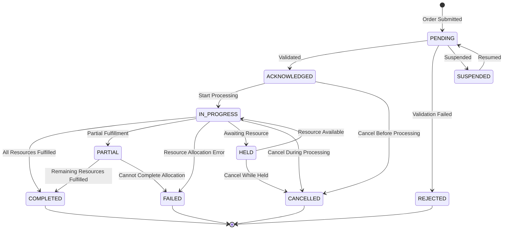

**Order Types**: `INSTALL`, `MODIFY`, `REMOVE`, `UPGRADE`, `DOWNGRADE`, `REPAIR`, `TEST`, `MIGRATE`
**Resource Types**: `PHYSICAL`, `LOGICAL`, `COMPOUND`
**Priorities**: `CRITICAL`, `HIGH`, `NORMAL`, `LOW`

### 4.3.4 Service Inventory Lifecycle

The service inventory (`ServiceInventory` entity via TMF639) models the lifecycle of active services across all eight PTC service types. Services progress through a well-defined pipeline from design through termination.

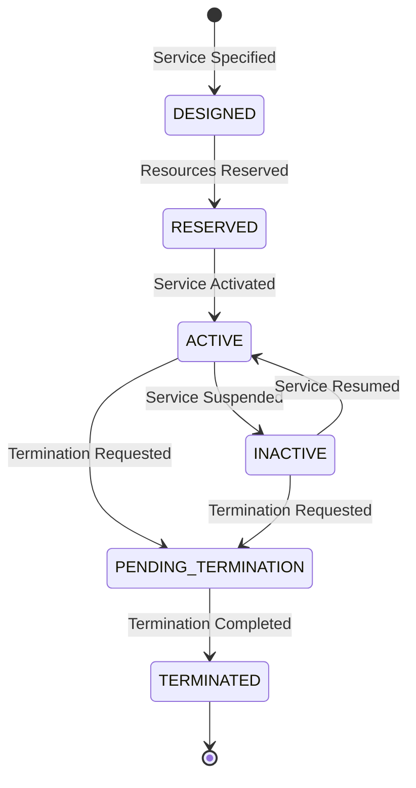

**Service Types**: `FIXED_LINE`, `MOBILE_CDMA`, `MOBILE_4G`, `ADSL`, `FTTH`, `MPLS`, `PRI`, `HOSTING`

### 4.3.5 Invoice Lifecycle

The invoice entity (`Invoice.java` → `invoices` table) enforces an immutability rule: once an invoice reaches `FINALIZED` status, its content cannot be modified. The `OVERDUE` transition is triggered automatically based on the due date.

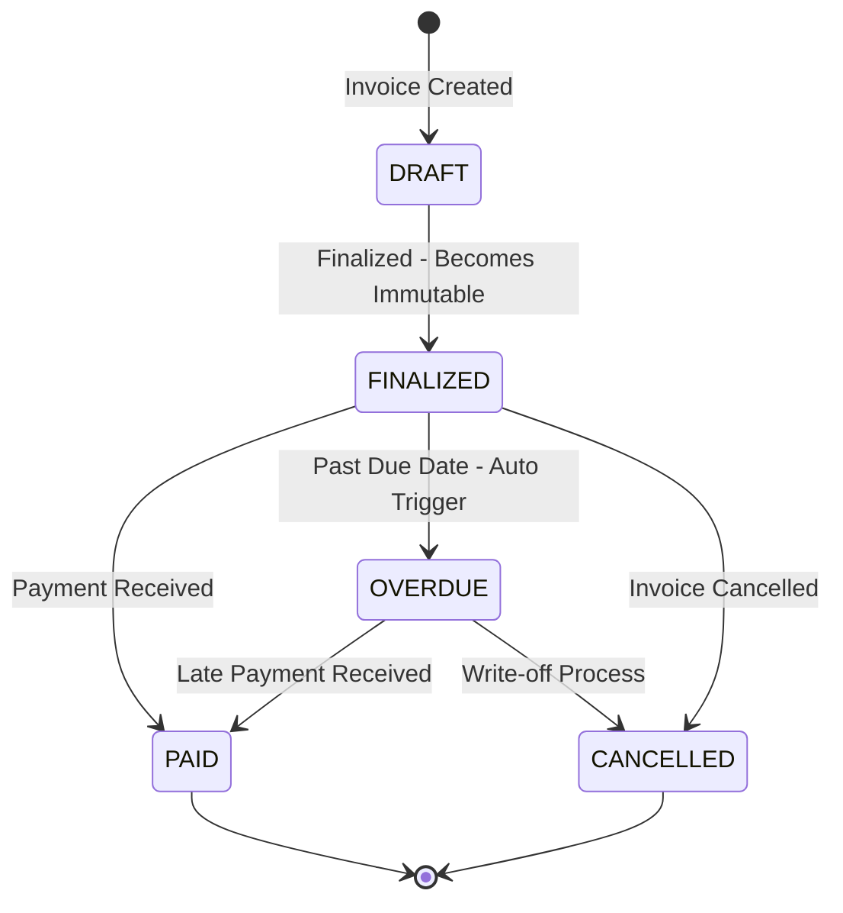

### 4.3.6 Customer Lifecycle

The customer entity (`Customer.java` → `customers` table) supports four lifecycle states with KYC verification gates that must be passed before service activation is permitted.

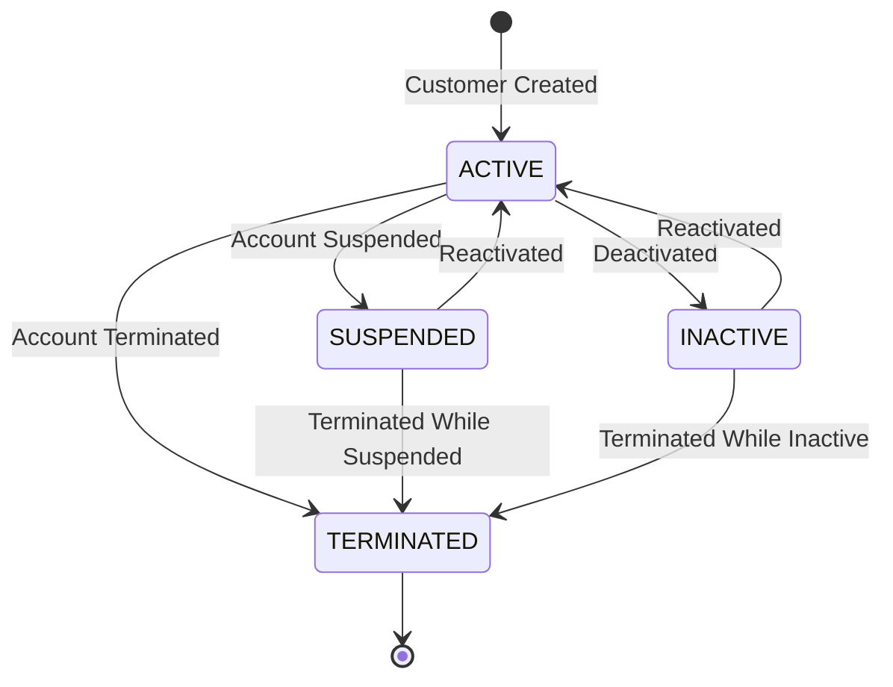

**Customer Types**: `RESIDENTIAL`, `BUSINESS`, `ENTERPRISE`, `GOVERNMENT`
**KYC Levels**: `BASIC`, `FULL`, `PREMIUM` (service activation blocked without required KYC level)

### 4.3.7 Trouble Ticket Lifecycle

Trouble tickets (TMF645) follow a linear incident management lifecycle with priority-based SLA jeopardy escalation. Auto-creation from critical alarms feeds directly into the `CREATED` state.

```mermaid
stateDiagram-v2
    [*] --> CREATED : Ticket Created or Auto-Created
    CREATED --> ASSIGNED : Assigned to Agent or Team
    ASSIGNED --> IN_PROGRESS : Work Commenced
    IN_PROGRESS --> RESOLVED : Issue Resolved
    RESOLVED --> CLOSED : Resolution Confirmed
    CLOSED --> [*]
```

**Priorities**: `CRITICAL`, `HIGH`, `MEDIUM`, `LOW`
**Auto-Creation Trigger**: Critical alarms from the fiber cut impact analysis workflow

### 4.3.8 Workflow Execution and Saga Step Tracking

The workflow execution state machine (managed by `WorkflowOrchestrator.java`) tracks the overall progress of order fulfillment workflows, while the saga step tracker monitors individual compensatable steps within Temporal workflows.

```mermaid
stateDiagram-v2
    [*] --> INITIATED : Workflow Created
    INITIATED --> RUNNING : Execution Started
    RUNNING --> RUNNING : Activity Completed / Next Activity
    RUNNING --> COMPLETED : All Activities Finished
    RUNNING --> FAILED : Max 3 Retries Exceeded
    RUNNING --> CANCELLED : Manual Cancellation
    COMPLETED --> [*]
    FAILED --> [*]
    CANCELLED --> [*]
```

**Workflow Types**: `ORDER_FULFILLMENT`, `SERVICE_ACTIVATION`
**Saga Steps Tracked**: `PARTY_VALIDATED` → `CREDIT_CHECKED` → `RESOURCES_RESERVED` → `CPE_ACTIVATED` → `BILLING_ENABLED`

---

## 4.4 INTEGRATION AND SEQUENCE DIAGRAMS

### 4.4.1 API Gateway Request Processing Sequence

All external requests traverse a four-layer security and routing pipeline before reaching BSS Core services. The gateway stack consists of Kong Gateway 3.5 (external traffic management), NestJS 10 with 57 proxy modules (API composition and validation), Istio 1.20 Ambient Mesh (internal mTLS), and the BSS Core controllers.

```mermaid
sequenceDiagram
    participant C as Customer / Agent
    participant K as Kong Gateway
    participant N as NestJS Gateway<br/>Port 3000
    participant I as Istio Mesh<br/>Strict mTLS
    participant B as BSS Core Service<br/>45 Controllers
    participant DB as Data Layer

    C->>K: HTTPS Request
    K->>K: Rate Limiting Check<br/>(10,000 req/min)
    K->>K: OAuth2 Token Validation<br/>(Keycloak OIDC)
    alt Token Invalid or Rate Exceeded
        K-->>C: 401 Unauthorized / 429 Too Many Requests
    end
    K->>N: Forward Request
    N->>N: Swagger Schema Validation
    N->>N: Route via Proxy Module<br/>(1 of 57 modules)
    N->>I: mTLS Encrypted Request
    I->>I: SPIFFE/SPIRE Identity Verification
    I->>B: Authorized Service Request
    B->>DB: Data Operation<br/>(PostgreSQL / Redis / Neo4j)
    DB-->>B: Result
    B-->>I: Service Response
    I-->>N: mTLS Response
    N-->>N: Response Transformation
    N-->>K: Transformed Response
    K-->>C: HTTPS Response
```

### 4.4.2 Event-Driven Cross-Domain Integration

The Kafka event backbone defined in `shared/kafka/topic-definitions.yml` provides the asynchronous messaging infrastructure that decouples all domain services. Ten canonical topics with four consumer groups enable event-driven communication across all platform boundaries.

```mermaid
flowchart LR
    subgraph Producers["Event Producers"]
        P_BSS["BSS Core<br/>Spring Boot 3.2"]
        P_CHG["Charging Engine<br/>Go 1.22"]
        P_CDR["CDR Pipeline<br/>Python"]
        P_NE["Network Elements"]
    end

    subgraph Topics["Kafka Backbone - KRaft Mode - RF=3"]
        T_PT["party.events<br/>6p / 7d"]
        T_CT["catalog.events<br/>6p / 7d"]
        T_OT["order.events<br/>6p / 7d"]
        T_ST["service.events<br/>6p / 7d"]
        T_RT["resource.events<br/>6p / 7d"]
        T_BT["billing.events<br/>6p / 7d"]
        T_UT["usage.events<br/>12p / 7d"]
        T_CET["charging.events<br/>12p / 7d"]
        T_AT["alarm.events<br/>6p / 3d"]
        T_DLQ["events.dlq<br/>6p / 30d"]
    end

    subgraph ConsumerGroups["Consumer Groups"]
        CG_PM["party-mgmt-group"]
        CG_CM["catalog-mgmt-group"]
        CG_OM["order-mgmt-group"]
        CG_CE["charging-engine-group"]
    end

    P_BSS --> T_PT
    P_BSS --> T_CT
    P_BSS --> T_OT
    P_BSS --> T_ST
    P_BSS --> T_RT
    P_BSS --> T_BT
    P_CDR --> T_UT
    P_CHG --> T_CET
    P_NE --> T_AT

    T_PT --> CG_PM
    T_CT --> CG_CM
    T_OT --> CG_OM
    T_UT --> CG_CE
    T_CT --> CG_CE
```

The high-throughput topics (`usage.events` and `charging.events`) are configured with 12 partitions to support the >1,200 events/sec sustained throughput requirement, while standard domain topics use 6 partitions. All topics use replication factor 3 for durability, and Avro schema serialization with backward compatibility is enforced via Confluent Schema Registry. The Dead Letter Queue (`events.dlq`) retains failed events for 30 days, providing a recovery window for reprocessing.

**Cross-Domain Integration Points:**

| Source | Target | Mechanism | Latency |
|---|---|---|---|
| CDR Pipeline → Charging Engine | `usage.events` Kafka (12 partitions) | Async event stream | Sub-second |
| Charging Engine → Balance Service | Redis operations | Synchronous read/write | < 5ms |
| Saga Orchestrator → Legacy Adapters | Temporal workflow invocations | RPC with circuit breaking | < 30s timeout |
| Saga Orchestrator → Resource Inventory | Redis `setIfAbsent` Redlock | Distributed lock | < 5ms |
| Alarm Management → Trouble Tickets | Auto-creation on critical alarms | Event-driven trigger | Sub-second |
| Service Inventory → Impact Analysis | Neo4j BFS graph traversal | Synchronous query | < 10ms |
| Customer Portal → API Gateway | HTTP via 57 proxy modules | Request/Response | p95 < 200ms |
| Migration ETL → Party Management | `TmfDataTransformer` payloads | Batch ETL | Batch |

### 4.4.3 Legacy Adapter Integration Pattern

All six legacy system adapters follow a standardized architectural pattern documented in `docs/adapters/adapter-registry.md`. The pattern ensures consistent protocol translation, health monitoring, and circuit-broken resilience across TITAN (TL1/SNMP), Oracle BRM (MAP/Diameter S6a), WHM (REST), in-house ADSL/FTTH (REST/RADIUS), MPLS/PRI (NETCONF/SNMP), and network elements (TR-069/OMCI).

```mermaid
sequenceDiagram
    participant SAGA as Temporal Saga<br/>Orchestrator
    participant ADAPT as Legacy Adapter<br/>Resilience4j
    participant CB as Circuit Breaker
    participant LEGACY as Legacy System<br/>TITAN / BRM / WHM
    participant KFK as Kafka Backbone

    SAGA->>ADAPT: Invoke adapter operation
    ADAPT->>CB: Check circuit state
    alt Circuit OPEN
        CB-->>ADAPT: Fast-fail rejection
        ADAPT-->>SAGA: Error - trigger compensation
    else Circuit CLOSED or HALF_OPEN
        CB->>LEGACY: Translate protocol<br/>(TL1 / SNMP / Diameter / REST)
        alt Operation Success
            LEGACY-->>CB: Legacy response
            CB-->>ADAPT: Map to canonical format
            ADAPT->>KFK: Publish canonical event
            ADAPT-->>SAGA: Success response
        else Timeout or Error
            LEGACY--xCB: Failure or timeout
            CB->>CB: Record failure - check threshold
            CB-->>ADAPT: Error response
            ADAPT-->>SAGA: Error - trigger compensation
        end
    end
```

The standardized adapter flow follows: Legacy System → Adapter Layer (with Resilience4j circuit breaking, retry, and bulkhead isolation) → Canonical Transform Layer → BSS/OSS Consumers via Kafka publication. Health monitoring is integrated into each adapter, and the `docs/adapters/adapter-registry.md` provides centralized management including adapter registration, routing, and service discovery.

---

## 4.5 ERROR HANDLING AND RECOVERY FLOWS

### 4.5.1 Order Service Resilience Pattern

The `OrderService.createOrder()` method is decorated with three Resilience4j annotations: `@CircuitBreaker(name = "order-service")`, `@Retry`, and `@Bulkhead`. These patterns work in concert to protect the order creation path from cascading failures.

```mermaid
flowchart TD
    REQ(["Order Request"]) --> CB{"Circuit Breaker<br/>State?"}
    CB -->|"CLOSED"| BH{"Bulkhead<br/>Slot Available?"}
    CB -->|"OPEN"| FALLBACK["Fallback: createOrderFallback<br/>RuntimeException:<br/>Order service temporarily unavailable"]
    CB -->|"HALF_OPEN"| PROBE["Allow Probe Request"]
    BH -->|"Yes"| PROC["Process Order:<br/>createOrder()"]
    BH -->|"No"| REJECT["Reject: Concurrency<br/>Limit Reached"]
    PROC --> RESULT{"Success?"}
    RESULT -->|"Yes"| SUCCESS["Return Order Response<br/>Status: ACKNOWLEDGED"]
    RESULT -->|"No"| RTRY{"Retry<br/>Available?"}
    RTRY -->|"Yes"| PROC
    RTRY -->|"No"| RECFAIL["Record Failure<br/>in Circuit Breaker"]
    RECFAIL --> THRESH{"Failure Threshold<br/>Reached?"}
    THRESH -->|"Yes"| OPEN["Circuit Transitions<br/>to OPEN State"]
    THRESH -->|"No"| ERRCLIENT["Return Error<br/>to Client"]
    PROBE --> PRESULT{"Probe<br/>Success?"}
    PRESULT -->|"Yes"| CLOSE["Circuit Transitions<br/>to CLOSED"]
    PRESULT -->|"No"| REOPEN["Circuit Remains<br/>OPEN"]
```

The circuit breaker prevents repeated invocations of a failing downstream dependency. When the failure threshold is breached, the circuit opens and all subsequent requests are immediately routed to the `createOrderFallback()` method, which throws a `RuntimeException("Order service temporarily unavailable")`. After a configured wait period, the circuit transitions to `HALF_OPEN` and allows a probe request to determine if the downstream dependency has recovered.

### 4.5.2 Temporal Saga Compensation Flow

When any step in a Temporal saga workflow fails, the platform executes compensating actions in strict reverse order of completed steps. The compensation mechanism is implemented in `FtthOrderWorkflowImpl.java` with explicit tracking of completed saga milestones.

```mermaid
flowchart TD
    FAIL(["Saga Step Fails"]) --> LOG["Log Error with<br/>Step ID and Exception"]
    LOG --> TRACK["Identify Completed<br/>Saga Milestones"]
    TRACK --> EVAL{"Highest Completed<br/>Milestone?"}
    EVAL -->|"BILLING_ENABLED"| CB["1. disableBilling<br/>2. deactivateCpe<br/>3. releaseResources<br/>Delete Redis lock"]
    EVAL -->|"CPE_ACTIVATED"| CC["1. deactivateCpe<br/>2. releaseResources<br/>Delete Redis lock"]
    EVAL -->|"RESOURCES_RESERVED"| CR["1. releaseResources<br/>Delete Redis lock key<br/>order:lock:orderId"]
    EVAL -->|"CREDIT_CHECKED or<br/>PARTY_VALIDATED"| NONE["No Compensation Needed<br/>Read-only operations"]
    CB --> DONE(["Return FAILED: error"])
    CC --> DONE
    CR --> DONE
    NONE --> DONE
```

The activity configuration applies a 30-second start-to-close timeout, a maximum of 3 retry attempts, and a 1-second initial retry interval to each individual activity. Only after all retries are exhausted does the saga enter the compensation path. The target for complete saga compensation is under 30 seconds from the point of failure detection.

### 4.5.3 CDR Pipeline Error Recovery

The CDR mediation pipeline implements error handling at each processing stage with distinct recovery strategies. The pipeline configuration includes `max_retries`, `retry_backoff_factor`, and `dead_letter_queue_enabled` parameters.

```mermaid
flowchart TD
    EVENT(["CDR Event"]) --> PARSE["Stage: Parse"]
    PARSE --> PFAIL{"Parse<br/>Error?"}
    PFAIL -->|"Yes"| DLQ["Route to DLQ<br/>events.dlq<br/>30-day retention"]
    PFAIL -->|"No"| NORM["Stage: Normalize"]
    NORM --> NFAIL{"Normalize<br/>Error?"}
    NFAIL -->|"Yes"| DLQ
    NFAIL -->|"No"| ENRICH["Stage: Enrich via HTTP<br/>3s timeout per call"]
    ENRICH --> EFAIL{"Enrichment<br/>Error?"}
    EFAIL -->|"Yes"| ERETRY["Retry: 3 attempts<br/>3s timeout each"]
    ERETRY --> EDONE{"Retry<br/>Successful?"}
    EDONE -->|"No"| DLQ
    EDONE -->|"Yes"| DELIVER["Stage: Kafka Delivery<br/>Idempotent mode"]
    EFAIL -->|"No"| DELIVER
    DELIVER --> DFAIL{"Delivery<br/>Error?"}
    DFAIL -->|"Yes"| DRETRY["Retry: 5 attempts<br/>Exponential backoff x2"]
    DRETRY --> DDONE{"Retry<br/>Successful?"}
    DDONE -->|"No"| DLQ
    DDONE -->|"Yes"| SUCCESS(["Event Processed"])
    DFAIL -->|"No"| SUCCESS
```

#### Graceful Shutdown Sequence

The pipeline implements a graceful shutdown sequence to prevent data loss during deployment or scaling events:

1. **Stop accepting new events** — Consumer group pauses partition assignment
2. **Shut down Kafka producer** — Flush pending messages with delivery confirmation
3. **Flush pending metrics** — Ensure all counters and histograms are exported
4. **Perform final health check** — Aggregate component status report
5. **Log completion** — Record shutdown metrics for operational visibility

### 4.5.4 Charging Engine Failure Handling

The Go-based charging engine in `charging-engine/internal/cdr/mediator.go` implements a fail-fast-and-skip strategy for non-fatal errors, ensuring that a single malformed event does not block the processing of subsequent events in the Kafka partition.

```mermaid
flowchart TD
    POLL(["Kafka Consumer Poll<br/>Every 100ms"]) --> FATAL{"Fatal<br/>Error?"}
    FATAL -->|"Yes"| EXIT["Exit Consumer Loop<br/>Process Terminates"]
    FATAL -->|"No"| UNMARSHAL["JSON Unmarshal<br/>CDREvent"]
    UNMARSHAL --> UFAIL{"Unmarshal<br/>Error?"}
    UFAIL -->|"Yes"| SKIP1["Log Error<br/>Skip Event"]
    UFAIL -->|"No"| RATE["Rate CDR<br/>via Rating Service"]
    RATE --> RFAIL{"Rating<br/>Error?"}
    RFAIL -->|"Yes"| SKIP2["Log Error with cdrId<br/>Skip Event"]
    RFAIL -->|"No"| DEDUCT["Deduct Balance<br/>via Redis"]
    DEDUCT --> DFAIL{"Deduction<br/>Error?"}
    DFAIL -->|"Yes"| SKIP3["Log Error with cdrId<br/>and Amount<br/>Skip Event"]
    DFAIL -->|"No"| LOG["Log Rated CDR<br/>Continue Processing"]
    SKIP1 --> POLL
    SKIP2 --> POLL
    SKIP3 --> POLL
    LOG --> POLL

    SIG(["SIGINT / SIGTERM"]) --> SHUTDOWN["Signal Handler:<br/>Graceful Shutdown"]
    SHUTDOWN --> CLOSE["Close Kafka Consumer"]
    CLOSE --> CTXDONE["Context Timeout<br/>Process Exit"]
```

The charging engine handles operating system signals (`SIGINT`, `SIGTERM`) for graceful shutdown, closing the Kafka consumer and allowing a timed context to drain before exiting. Non-fatal errors (JSON unmarshal failures, rating errors, balance deduction errors) are logged with the relevant `cdrId` and amount context, and the event is skipped to allow continued processing.

### 4.5.5 Operational Recovery Procedures

The operational runbook documented in `docs/runbooks/order-processing-failures.md` provides structured diagnosis and resolution paths for common order processing failures. The following flowchart summarizes the triage and recovery process.

```mermaid
flowchart TD
    SYMPTOM(["Symptom: Orders Stuck<br/>IN_PROGRESS greater than 30 min<br/>or Saga failure rate greater than 5%"]) --> DIAG["Begin Diagnosis"]
    DIAG --> D1["SQL: Query stalled orders<br/>in orders table"]
    DIAG --> D2["Check Kafka<br/>consumer lag"]
    DIAG --> D3["Inspect Redis<br/>lock key TTLs"]

    D1 --> ROOT{"Root<br/>Cause?"}
    D2 --> ROOT
    D3 --> ROOT

    ROOT -->|"Stuck Redis Locks"| R1["Inspect lock TTL"]
    R1 --> R2["Delete stale locks<br/>where TTL exceeds 5 min"]
    R2 --> R3["Restart order processing<br/>via API endpoint"]

    ROOT -->|"Kafka Consumer Lag"| K1["kubectl rollout restart<br/>deployment"]

    ROOT -->|"DB Connection<br/>Exhaustion"| DB1["Check pg_stat_activity"]
    DB1 --> DB2["Terminate long-running<br/>sessions"]

    R3 --> PREV["Apply Prevention Measures"]
    K1 --> PREV
    DB2 --> PREV

    PREV --> P1["Alert: Kafka lag > 10K messages"]
    PREV --> P2["Redis lock TTL cap: 5 minutes"]
    PREV --> P3["HPA scale trigger: CPU > 70%"]
```

---

## 4.6 DATA MIGRATION ETL FLOW

### 4.6.1 Three-Phase Migration Pipeline

The data migration subsystem in `migration/` implements a three-phase ETL pipeline that extracts subscriber data from legacy systems, transforms it into TMF-aligned payloads, and validates migration accuracy through reconciliation. This pipeline supports the Strangler Fig migration strategy where legacy systems are incrementally replaced during Phases 2 through 8 of the implementation plan.

```mermaid
flowchart TD
    subgraph ExtractPhase["Phase 1: Extract"]
        EX1["Oracle BRM Extractor<br/>JDBC queries: accounts,<br/>balances, sessions, rate plans"]
        EX2["TITAN Extractor<br/>JDBC + ASCII CDR parsing:<br/>customers, lines, CDRs, accounts"]
        EX3["WHM Extractor<br/>Status: NOT IMPLEMENTED"]
    end

    subgraph TransformPhase["Phase 2: Transform"]
        TX1["TmfDataTransformer<br/>Normalize to TMF payloads:<br/>TMF632 Party<br/>TMF647 Account<br/>TMF639 Service"]
    end

    subgraph ValidatePhase["Phase 3: Validate"]
        VX1["MigrationReconciler<br/>Compare legacy vs TMF"]
        VX2["Customer count parity check"]
        VX3["Account balance parity check"]
        VX4["Active service count parity check"]
        VX5{"Duplicate rate<br/>below 0.1%?"}
    end

    EX1 --> TX1
    EX2 --> TX1
    TX1 --> VX1
    VX1 --> VX2
    VX1 --> VX3
    VX1 --> VX4
    VX2 --> VX5
    VX3 --> VX5
    VX4 --> VX5
    VX5 -->|"Yes"| PASS(["Migration Validated<br/>Proceed to Cutover"])
    VX5 -->|"No"| RERUN(["Re-extract and<br/>Revalidate"])
    RERUN --> EX1
    RERUN --> EX2
```

The `TmfDataTransformer` maps legacy status codes, type codes, and derived nested characteristics to their TMF-aligned equivalents while preserving source identifiers for traceability. The `MigrationReconciler` validates three critical parity dimensions: customer count (all legacy records migrated), account balance (zero revenue leakage), and active service count (no service loss). The target is a duplicate rate below 0.1% across 1 million imported customer records. The WHM extractor for hosting subscriber migration has not yet been implemented and is tracked as a gap item.

---

## 4.7 TIMING AND SLA CONSTRAINTS

### 4.7.1 Performance Targets

The following table documents the performance targets and their current validation status for each critical process path. These targets are sourced from the Feature Catalog (Section 2.1), the Functional Requirements (Section 2.2), and the validated benchmarks in `IMPLEMENTATION_SUMMARY.md`.

| Process Path | Metric | Target | Current Status | Feature |
|---|---|---|---|---|
| Real-time charging (rating) | p99 latency | < 50ms | Avg 78.4ms, P95 92.1ms (optimization in progress) | F-013 |
| CDR mediation pipeline | Sustained throughput | > 1,200 events/sec | Validated: 1,240 sustained, 2,100 peak | F-014 |
| CRM operations | p95 latency | < 200ms | Target set | F-001, F-002 |
| Product order throughput | Orders per minute | 1,000 orders/min | Target set | F-008 |
| Saga recovery | Compensation time | < 30 seconds | Target set | F-011 |
| Neo4j graph query (5-hop BFS) | Query latency | < 10ms | Target set | F-019, F-020 |
| Redis balance check | Read latency | < 5ms | Validated | F-018 |
| Customer 360 dashboard load | p95 latency | < 200ms | Target set | F-004 |
| Zero-touch provisioning | Automation rate | >= 95% | Pending validation | F-012 |
| CDR parsing success | Success rate | 100% | Validated | F-014 |
| CDR normalization success | Success rate | 100% | Validated | F-014 |
| CDR enrichment success | Success rate | >= 99.8% | Validated at 99.8% | F-014 |
| Kafka delivery guarantee | Delivery rate | 100% idempotent | Validated | F-033 |

### 4.7.2 Availability and Recovery Targets

| Domain | Availability Target | Unplanned Outage Budget | RPO | RTO |
|---|---|---|---|---|
| Charging / Billing (Critical) | 99.999% (five-nines) | < 5 min/year | < 15 min (sync replication) | < 30 min |
| CRM / Ordering (High) | 99.99% | < 52 min/year | < 1 hour (WAL-G backup) | < 30 min |
| OSS / Assurance (Standard) | 99.9% | Scheduled maintenance windows | Daily backups | < 2 hours |
| Pod failure recovery | N/A | N/A | N/A | < 30 seconds |
| Database failover | N/A | N/A | N/A | < 10 seconds |

---

## 4.8 VALIDATION AND AUTHORIZATION CHECKPOINTS

### 4.8.1 Business Rule Validation Points

The following table documents the business rule validation gates that are enforced at specific points in the process flows. Each validation gate has defined acceptance criteria and rejection behavior.

| Checkpoint | Process Flow | Validation Rule | Rejection Behavior |
|---|---|---|---|
| **KYC Verification** | Order Fulfillment (pre-activation) | Customer must have required KYC level (BASIC/FULL/PREMIUM); `kyc_verified` flag must be `true` | Service activation blocked; HTTP 403 |
| **Credit Check** | Saga Step 2 | Account balance and credit limit evaluated; soft-limit triggers notification, hard-limit blocks service | Order rejected; saga compensation if past Step 2 |
| **State Machine Enforcement** | All order state transitions | Only valid state transitions permitted per entity state machine | HTTP 409 Conflict |
| **Idempotency Guard** | All write endpoints | Duplicate submissions with same idempotency key return same response | No duplicate side effects; same response returned |
| **TMF Conformance** | All TMF API endpoints | Level 3+ automated Postman tests validate schema and behavior | Deployment blocked at quality gate QG-1 |
| **Resource Availability** | Resource reservation (Saga Step 3) | Redis Redlock `setIfAbsent` checks resource lock; TTL prevents abandoned locks | Reservation denied; order held or failed |
| **Balance Sufficiency** | Charging (balance deduction) | `MainBalance >= amount` verified before deduction | Error: "insufficient balance"; event skipped |
| **Invoice Immutability** | Invoice modification after finalization | Finalized invoices cannot be modified | HTTP 409 or 400; modification rejected |
| **Duplicate Detection** | Party creation (TMF632) | Fuzzy deduplication using Levenshtein distance and Metaphone algorithms; Levenshtein distance <= 2 flagged | Duplicate flagged; merge/split workflow triggered |
| **Migration Parity** | ETL validation phase | Customer count, balance sum, and active service count must match between legacy and TMF | Migration fails; re-extraction required |

### 4.8.2 Security and Authorization Gates

Security checkpoints are enforced at multiple layers throughout every process flow. These gates implement the platform's Zero Trust security model.

| Layer | Mechanism | Enforcement Point | Details |
|---|---|---|---|
| **External Authentication** | OAuth2/OIDC via Keycloak | Kong Gateway | JWT with 15-min expiry; FIDO2/WebAuthn MFA for privileged operations (admin, billing adjustments) |
| **Rate Limiting** | Token-bucket via Kong + Bucket4j | Kong Gateway + Application | 10,000 requests/minute per client; prevents abuse and DDoS |
| **Service-to-Service Auth** | Istio strict mTLS | Service Mesh | SPIFFE/SPIRE identity certificates; no permissive mode |
| **Attribute-Based Access Control** | OPA sidecars (ABAC) | Each microservice | Region-scoped access for field technicians; billing agents cannot modify inventory |
| **PII Protection** | Dynamic masking + field-level encryption | Application layer | Regex masking for phone numbers, emails, national IDs in logs; Jasypt 3.0.5 with Vault keys |
| **PCI-DSS Level 1** | Payment data tokenization | Payment processing | Cardholder data (CHD) never touches application servers; on-prem token vault |
| **Audit Trail** | Immutable, append-only, signed logs | All state-changing operations | 7-year retention per regulatory requirement; blockchain anchoring optional |
| **Vulnerability Scanning** | Snyk + Trivy pipeline scan | CI/CD pipeline (pre-deployment) | Zero critical vulnerabilities required per QG-3 |

---

## 4.9 REFERENCES

#### Source Files Examined

- `bss-core/src/.../service/OrderService.java` — Order creation lifecycle with Resilience4j annotations (`@CircuitBreaker`, `@Retry`, `@Bulkhead`) and fallback method
- `bss-core/src/.../orchestration/OrderDecomposer.java` — Product Order to Service Order decomposition logic with action type and CFS/RFS mapping
- `bss-core/src/.../workflow/WorkflowOrchestrator.java` — In-memory workflow state machine with `ConcurrentHashMap` execution tracking and 7-activity chain
- `bss-core/src/.../temporal/FtthOrderWorkflowImpl.java` — Temporal saga implementation with 5-step sequence, compensating actions, and Redis Redlock resource reservation
- `bss-core/src/.../temporal/OrderActivities.java` — Activity interface definition for Temporal workflows
- `bss-core/src/.../temporal/OrderActivitiesImpl.java` — Redis-backed activity implementation for saga steps
- `bss-core/src/.../service/ServiceOrderService.java` — Service order lifecycle management and state transitions
- `bss-core/src/.../service/ResourceOrderService.java` — Resource order lifecycle with 10-state state machine
- `charging-engine/internal/cdr/mediator.go` — Go-based Kafka consumer for CDR mediation, message routing, graceful shutdown via SIGINT/SIGTERM
- `charging-engine/internal/rating/service.go` — In-memory rating engine with voice timeband, data per-MB, and SMS flat-fee pricing plans
- `charging-engine/internal/balance/service.go` — Redis-backed balance operations: GetBalance, Reserve, Confirm, Deduct, TopUp with TTL management
- `cdrmspipeline/orchestrator.py` — Python CDR pipeline orchestrator with 8-stage processing, health checks, metrics collection, and graceful shutdown
- `shared/kafka/topic-definitions.yml` — Complete Kafka topology: 10 topics, 4 consumer groups, partitioning and retention configurations
- `docs/runbooks/order-processing-failures.md` — Operational runbook for diagnosing and resolving order processing failures
- `docs/adapters/adapter-registry.md` — Centralized legacy adapter registration, routing, and health monitoring
- `docs/data-models/database-schema.sql` — PostgreSQL schema definitions including `generate_invoice_number()` and `update_account_balance()` functions
- `frontend/src/portals/agent/pages/OrderManagement.tsx` — Agent portal order management workflow UI

#### Folders Referenced

- `bss-core/` — Spring Boot 3.2 / Java 21 BSS core service with 45 controllers and 52 services
- `charging-engine/` — Go 1.22 real-time charging engine with Kafka, Redis, and rating packages
- `charging-engine/internal/` — Internal packages: balance, cdr, rating
- `cdrmspipeline/` — Python CDR mediation pipeline: orchestrator, normalizer, enricher, Kafka producer
- `migration/` — Java ETL subsystem: extractors (Oracle BRM, TITAN), transformers, validation
- `shared/` — Shared configuration including Kafka topic definitions
- `docs/adapters/` — Six legacy adapter specifications
- `docs/runbooks/` — Operational runbooks for incident response
- `infrastructure/kafka/` — Strimzi KRaft cluster definitions

#### Technical Specification Sections Cross-Referenced

- Section 1.2 — System Overview: High-level architecture, major components, core technical approach
- Section 2.1 — Feature Catalog: Complete feature inventory (F-001 through F-033) with status and dependencies
- Section 2.2 — Functional Requirements: Detailed requirements with acceptance criteria and validation rules
- Section 2.3 — Feature Relationships: Dependency map, integration points, shared components
- Section 2.4 — Implementation Considerations: Performance targets, scalability strategies, security implications
- Section 2.6 — Quality Gates: Definition of Done criteria (QG-1 through QG-8)
- Section 3.5 — Databases & Storage: Polyglot persistence strategy, backup and recovery configurations
- Section 3.7 — Technology Stack Summary: Complete version matrix and framework justifications

# 5. System Architecture

## 5.1 HIGH-LEVEL ARCHITECTURE

### 5.1.1 System Overview

The Yemen PTC BSS/OSS Platform implements a **domain-driven, event-sourced microservice architecture** designed to completely replace four fragmented legacy monoliths — TITAN (PSTN), Oracle BRM (4G/LTE), WHM (Hosting), and internal custom systems (Data Services) — with a unified, TM Forum Open API–compliant operations platform serving 50M+ subscribers across all 19 Yemeni governorates.

The architecture is organized into **six logical layers**, each fulfilling a distinct operational role and communicating through well-defined interfaces. This layered decomposition reflects the separation of concerns required by a carrier-grade platform where the charging and billing critical path demands 99.999% availability (five-nines) while enabling independent scaling, deployment, and technology selection per component.

#### Architectural Style Rationale

The platform adopts a polyglot microservice architecture rather than a monolithic or traditional SOA approach for the following reasons:

- **Service Convergence Mandate**: The core business requirement — convergent billing, unified product bundling, and 360° customer view — requires decoupled domain services that can be composed flexibly across PSTN, FTTH, 4G/LTE, MPLS, and Hosting service types. A monolithic architecture would replicate the very fragmentation problem being solved.
- **Performance Isolation**: The real-time charging engine requires p99 latency below 50 ms, necessitating a purpose-built Go service with direct Redis access, independent of the Java-based BSS core which handles complex transactional workflows.
- **Polyglot Persistence Fit**: Each data domain has fundamentally different access patterns — relational transactions for billing (PostgreSQL + Citus), sub-millisecond key-value lookups for balances (Redis), graph traversals for network topology (Neo4j), flexible documents for product catalog (MongoDB), and full-text search for customer records (Elasticsearch) — making a single-database architecture unsuitable.
- **Air-Gap Compatibility**: Constraint C-001 requires a fully self-contained on-premises deployment with no external API dependencies. All container images, packages, and schemas are served from Harbor and MinIO registries within the air-gapped environment.

#### Key Architectural Principles

| Principle | Implementation |
|---|---|
| TM Forum Open API Conformance | All APIs target Level 3+ compliance using OpenAPI 3.0.3 and CloudEvents 4.0.1 |
| Event-Driven Backbone | Apache Kafka 3.6 (KRaft) decouples all domain services through 10 canonical topics |
| Zero Trust Security | Istio strict mTLS everywhere, SPIFFE/SPIRE identity, Keycloak OAuth2/OIDC |
| Strangler Fig Migration | Domain-by-domain cutover from 4 legacy systems via 6 protocol-level adapters |

#### Six-Layer Architecture

The following diagram illustrates the platform's layered architecture, the primary technologies within each layer, and the directional data flow between them.

```mermaid
flowchart TB
    subgraph L1["Layer 1: Digital Engagement"]
        L1_CP["Customer Portal<br/>React + TypeScript + Vite"]
        L1_AP["Admin / Analytics / Operator Portals<br/>React + MUI 5"]
        L1_USSD["USSD Gateway"]
    end

    subgraph L2["Layer 2: API Gateway and Service Mesh"]
        L2_NEST["NestJS Gateway<br/>29 Proxy Modules, Port 3000"]
        L2_KONG["Kong Gateway 3.5<br/>Rate Limiting, OAuth2"]
        L2_ISTIO["Istio 1.20 Ambient Mesh<br/>Strict mTLS"]
    end

    subgraph L3["Layer 3: Event Streaming"]
        L3_KAFKA["Apache Kafka 3.6<br/>KRaft Mode, 10 Topics"]
        L3_SR["Confluent Schema Registry 7.5.0<br/>Avro Serialization"]
    end

    subgraph L4["Layer 4: BSS / OSS Core"]
        L4_BSS["BSS Core Service<br/>Spring Boot 3.2 / Java 21<br/>45 Controllers, 52 Services, 76+ Entities"]
        L4_CHG["Charging Engine<br/>Go 1.22, Redis-Backed Balances"]
        L4_CDR["CDR Mediation Pipeline<br/>Python, Multi-Format Ingestion"]
    end

    subgraph L5["Layer 5: Integration and Orchestration"]
        L5_TEMP["Temporal.io 1.22.3<br/>Saga Orchestration"]
        L5_ADAPT["Legacy System Adapters<br/>6 Adapter Specifications"]
        L5_NE["Network Element Adapters<br/>TR-069, OMCI, NETCONF"]
    end

    subgraph L6["Layer 6: Data and Observability"]
        L6_DB["PostgreSQL 15 + Citus | Redis 7.2<br/>MongoDB 7.0 | Neo4j 5.14<br/>Elasticsearch 8.12.0"]
        L6_OBS["ELK Stack + Prometheus v2.50.0<br/>Grafana 10.3.0, 25+ Dashboards"]
        L6_ML["ML Pipeline<br/>Fraud Detection, Churn Prediction"]
    end

    L1 --> L2
    L2 --> L4
    L2 --> L3
    L3 --> L4
    L4 --> L5
    L4 --> L6
    L5 --> L6
```

### 5.1.2 Core Components

The platform is composed of six primary software components, each purpose-built for its operational domain and implemented in the programming language best suited to its performance and complexity requirements.

| Component | Primary Responsibility | Key Dependencies |
|---|---|---|
| **BSS Core Service** (`bss-core/`) | 45 TMF REST controllers, 52 business services, 76+ JPA entities with polyglot persistence | Spring Boot 3.2 / Java 21, PostgreSQL, Redis, MongoDB, Neo4j, Elasticsearch, Kafka |
| **Charging Engine** (`charging-engine/`) | Real-time CDR rating and balance ledger with Reserve-Commit-Rollback pattern | Go 1.22, Gin 1.9.1, confluent-kafka-go v2.3.0, go-redis v9.3.1 |
| **API Gateway** (`api-gateway/`) | TMF API composition layer with 29 proxy modules, Swagger documentation, and request proxying | NestJS 10.3.0+, TypeScript 5.3.3, Node.js 20 LTS, axios, rxjs |
| **CDR Mediation Pipeline** (`cdrmspipeline/`) | Four-stage pipeline: Parse → Normalize → Enrich → Deliver; multi-format CDR ingestion | Python 3.x, Kafka producer, HTTP enrichment clients |
| **Frontend Portals** (`frontend/`, `deployment/`) | Customer self-service portal and admin/analytics/operator portals served via nginx | React 18.2.0, Vite 5.0.0, MUI 5.14.18, Chart.js 4.4.1 |
| **Migration Subsystem** (`migration/`) | Three-phase ETL: Oracle BRM and TITAN extractors → TmfDataTransformer → MigrationReconciler | Java, JDBC, TMF data alignment libraries |

| Component | Integration Points | Critical Considerations |
|---|---|---|
| **BSS Core Service** | Kafka (10 topics), Temporal, Legacy Adapters, all 5 databases | 99.99% uptime target; 3–20 replicas; KEDA scaling on HikariCP connections |
| **Charging Engine** | Kafka (`usage.events`, `catalog.events`), Redis balance ledger | p99 < 50 ms target (current P95: 92.1 ms — optimization required per C-007); 5–50 replicas |
| **API Gateway** | Kong upstream, BSS Core, Charging Engine via env-configured URLs | p95 < 200 ms; stateless proxy; 3–10 replicas |
| **CDR Mediation Pipeline** | Kafka (`usage.events`, `events.dlq`), HTTP enrichment services | >1,200 events/sec sustained (validated: 1,240 sustained, 2,100 peak) |
| **Frontend Portals** | API Gateway (`api-gateway:3000`) via HTTP | Arabic RTL support; SPA fallback routing |
| **Migration Subsystem** | Legacy Oracle BRM/TITAN databases (JDBC), BSS Core TMF APIs | Must complete before Phase 8 cutover; < 0.1% duplicate rate |

### 5.1.3 Data Flow Architecture

The platform operates through three primary process chains that collectively deliver the carrier-grade BSS/OSS capability. All three chains are interconnected through the Apache Kafka event backbone, which provides the asynchronous, decoupled messaging fabric defined in `shared/kafka/topic-definitions.yml`.

#### Order-to-Activate Path

The Order-to-Activate path governs how a customer or agent request progresses from order submission through service provisioning and billing enablement. A customer authenticates via Keycloak OAuth2/OIDC (15-minute JWT expiry), traverses the Kong rate-limiting gateway and NestJS proxy layer, and reaches the BSS Core `OrderService`. The order is persisted to PostgreSQL, published to the `order.events` Kafka topic, then decomposed by `OrderDecomposer.java` into service orders. The `WorkflowOrchestrator` drives an activity chain (validate → check inventory → reserve resources via Redis Redlock → configure network → activate service → notify customer), and for convergent multi-domain orders, `FtthOrderWorkflowImpl.java` orchestrates a Temporal Saga with five compensatable steps: `validateParty` → `performCreditCheck` → `reserveResources` → `activateCpe` (TR-069/OMCI) → `enableBilling`. On failure, compensating actions execute in strict reverse order within a target of 30 seconds.

#### Usage-to-Cash Path

The Usage-to-Cash path handles the complete revenue lifecycle from network usage event through invoice generation. Network elements emit CDRs in three legacy formats (TITAN ASCII, Oracle ASN.1, IPDR CSV), which enter the Python CDR Mediation Pipeline (`cdrmspipeline/orchestrator.py`). The pipeline parses, normalizes to a canonical `NormalizedCDR` schema, enriches via HTTP lookups to subscription, rateplan, and customer microservices (3-second timeout, 3 retries), and delivers events to the `usage.events` Kafka topic with idempotent guarantees. The Go Charging Engine consumes these events via the `charging-engine-group` consumer group, applies timeband/zone/QoS-tier rating (voice: 5–10 YER/min; data: 0.5 YER/MB; SMS: 1.0 YER flat), debits the Redis balance ledger with a Reserve-Commit-Rollback pattern, and publishes `charging.events`. The convergent billing engine then aggregates charges across all service domains (PSTN + FTTH + 4G + MPLS + Hosting) onto a single invoice, published to `billing.events`.

#### Alarm-to-Resolution Path

The Alarm-to-Resolution path provides topology-aware network assurance. A network alarm is published to the `alarm.events` Kafka topic (6 partitions, 3-day retention). The alarm correlation engine applies topology-based suppression — an upstream fiber cut suppresses all downstream alarms. Neo4j graph traversal performs BFS from Cable → Fibers → Services → Customers within a 10 ms target for 5-hop queries. The system auto-creates Trouble Tickets (TMF645), dispatches SMS notifications (TMF674), and triggers AI-optimized workforce scheduling (OR-Tools) through an offline-capable field technician mobile application.

```mermaid
flowchart TD
    CUS(["Customer / Agent"]) --> AUTH["Authentication<br/>Keycloak OAuth2/OIDC"]
    AUTH --> GW["API Gateway<br/>Kong + NestJS Proxy"]
    GW --> REQ{"Process<br/>Category"}

    REQ -->|"Order"| PO["Product Order<br/>TMF622"]
    REQ -->|"Self-Service"| C360["Customer 360<br/>Dashboard"]
    REQ -->|"Billing"| BILL["Bill Management<br/>TMF657"]

    PO --> SAGA["Temporal Saga<br/>Orchestration"]
    SAGA --> PROV["Network Provisioning<br/>TR-069 / OMCI / NETCONF"]
    PROV -.->|"order.events"| KFK[["Kafka Event Backbone<br/>10 Topics, KRaft Mode"]]

    NE(["Network Elements"]) --> CDR["CDR Mediation Pipeline<br/>Parse / Normalize / Enrich"]
    CDR -.->|"usage.events"| KFK
    KFK -.->|"usage.events"| CHG["Charging Engine<br/>Go Rating + Redis Debit"]
    CHG -.->|"charging.events"| KFK
    KFK -.->|"billing.events"| INV["Convergent Invoice<br/>Generation"]
    INV --> BILL

    ALM(["Network Alarm"]) -.->|"alarm.events"| KFK
    KFK -.->|"alarm.events"| CORR["Alarm Correlation<br/>Topology Suppression"]
    CORR --> IMPACT["Impact Analysis<br/>Neo4j BFS"]
    IMPACT --> TT["Trouble Ticket<br/>TMF645"]
    TT --> WFM["Workforce Dispatch<br/>AI Scheduling"]
```

### 5.1.4 External Integration Points

The platform integrates with PTC's legacy landscape through six protocol-level adapters, each documented in `docs/adapters/` and implementing a standardized architectural pattern: Legacy System → Adapter Layer (Resilience4j circuit breaking, retry, bulkhead) → Canonical Transform Layer → BSS/OSS Consumers via Kafka.

| System | Integration Type | Protocol / Format |
|---|---|---|
| TITAN (PSTN Switches) | Circuit-broken adapter | TL1, SNMP; ASCII CDR |
| Oracle BRM (HLR/HSS — Mobile Core) | Circuit-broken adapter | MAP, Diameter S6a; ASN.1 CDR |
| WHM / cPanel (Hosting Infrastructure) | Circuit-broken adapter | REST API (cPanel) |
| In-house ADSL/FTTH (Broadband Prepaid) | Circuit-broken adapter | REST, RADIUS |
| MPLS/PRI (Enterprise Routers) | Circuit-broken adapter | NETCONF, SNMP |
| Network Elements (DSLAM/OLT — CPE) | Direct provisioning adapter | TR-069 (GenieACS), OMCI |

All adapters publish canonical events to the Kafka backbone after translating legacy protocol responses. The adapter registry (`docs/adapters/adapter-registry.md`) provides centralized integration management with adapter registration, routing, health monitoring, load balancing, and service discovery. During the Strangler Fig migration, legacy adapters coexist with new TMF services, allowing domain-by-domain cutover until all 50M+ subscribers are migrated and legacy systems are decommissioned to read-only archives.

---

## 5.2 COMPONENT DETAILS

### 5.2.1 BSS Core Service

#### Purpose and Responsibilities

The BSS Core Service (`bss-core/`) is the platform's central business logic engine, implementing the full TMF Open API surface for customer management, product cataloging, order orchestration, billing, inventory, alarm management, fraud detection, and SLA enforcement. It serves as the authoritative system of record for all transactional domain data and coordinates with the event backbone, workflow engine, and legacy adapters.

#### Technology and Internal Architecture

Built on Java 21 and Spring Boot 3.2.0 with Maven, the BSS Core is organized under the `com.yemenptc.bss.coreservice` package with the following key subpackages:

- **`controller/`** — 45 TMF-aligned REST controllers spanning Party, Customer, Billing, Order, Inventory, Alarm, Fraud, SLA, and related domains. The API surface is exposed at ports 8080 (HTTP), 8443 (TLS), and 9090 (metrics/actuator).
- **`service/`** — 52+ business services implementing domain logic with Resilience4j patterns (`@CircuitBreaker`, `@Retry`, `@Bulkhead`) decorating critical methods such as `OrderService.createOrder()` and `BillingService`.
- **`entity/`** — 76+ JPA entities forming the complete domain model: `Customer`, `Account`, `Invoice`, `Order`, `Subscription`, `NetworkElement`, `Alarm`, and supporting types, mapped to 30+ PostgreSQL tables via Flyway 10.6.0 migrations.
- **`repository/`** — Spring Data interfaces for PostgreSQL (JPA), plus specialized repositories for Elasticsearch (`es/`), MongoDB (`mongo/`), and Neo4j (`neo4j/`).
- **`temporal/`** — Temporal.io Saga integration: `FtthOrderWorkflowImpl` and `OrderActivitiesImpl` for multi-domain convergent order orchestration with compensating transactions.
- **`orchestration/`** — `OrderDecomposer` for product-to-service order decomposition and `ProvisioningOrchestrator` with Redis-backed saga state tracking.
- **`workflow/`** — In-memory `WorkflowOrchestrator` implementing the order fulfillment state machine with a `ConcurrentHashMap` for thread-safe execution tracking.
- **`adapter/`** — Legacy system integration modules: TITAN, Oracle BRM, and in-house broadband adapters with Resilience4j circuit-breaker wrapping.
- **`charging/`** — `RealTimeChargingEngine` and `RealTimeChargingService` for charging operations coordinated with the Go engine.
- **`mediation/`** — CDR ingestion support: parsing, deduplication, and enrichment within the Java domain.
- **`ocs/`** — `BalanceService` providing cached and persisted account balance operations.
- **`rating/`** — `RatingEngine` with pricing rules and bundle deduction logic.
- **`security/`** — `RbacService`, `RateLimitingFilter` (Bucket4j 8.1.0), and Permission model for authorization enforcement.
- **`config/`** — Configuration classes for encryption (Jasypt 3.0.5), Kafka, Redis, OpenAPI, REST templates, MFA (TOTP 1.7.1), metrics, and SLA settings.
- **`kafka/`** — Producers and consumers for all domain event topics (usage events, payment events, order events).
- **`audit/`** — `AuditService` publishing immutable audit events to Kafka for 7-year regulatory retention.
- **`dto/`** — Eight DTO packages: Adapter, Billing, Customer, Inventory, Order, Product, Provisioning, and Rating.
- **`sdk/`** — Shared abstractions: `BaseTmfEntity`, `TmfCharacteristics`, `CloudEvents` wrappers, idempotency utilities, and query helpers.

#### Data Persistence

The BSS Core employs all five database engines through Spring Data's polyglot persistence abstraction:

| Database | Access Pattern | Domain Coverage |
|---|---|---|
| PostgreSQL 15 + Citus | JPA/Hibernate ORM, sharded by `customer_id` | 76+ entities: Party, Customer, Order, Invoice, Subscription, Audit |
| Redis 7.2 | Spring Data Redis, caching and distributed locks | Saga state, session caching, Redlock for resource reservation |
| MongoDB 7.0 | Spring Data MongoDB | `ProductSpecificationDocument` for TMF620 catalog |
| Neo4j 5.14 | Spring Data Neo4j | `ResourceNode`, `ServiceNode` for TMF638/639 topology graph |
| Elasticsearch 8.12.0 | Spring Data Elasticsearch | `PartyDocument` for full-text customer search |

#### Scaling and Deployment

The BSS Core deploys as a containerized Java application on `eclipse-temurin:21-jre-alpine`, scaling from 3 to 20 replicas with a 70% CPU target. KEDA extends native HPA with a Prometheus-based trigger on `hikaricp_connections_active > 80`, ensuring the service scales in response to database connection pool saturation. Zone-specific deployments (zone-a, zone-b) with pod anti-affinity rules and PodDisruptionBudgets (minAvailable: 2) enforce high-availability guarantees.

### 5.2.2 Charging Engine

#### Purpose and Responsibilities

The Charging Engine (`charging-engine/`) is the platform's most latency-sensitive component, responsible for real-time CDR rating and balance management. It consumes usage events from Kafka, applies timeband/zone/QoS-based pricing, debits subscriber balances via Redis, and publishes charging events — all targeting a p99 latency below 50 ms.

#### Technology and Internal Architecture

Implemented in Go 1.22 with a minimal dependency footprint (4 direct dependencies), the engine is structured as follows:

- **`cmd/server/`** — Application entrypoint: loads configuration, initializes Redis and Kafka clients, wires balance and rating services, configures Gin HTTP routes (port 8081), and handles graceful shutdown via OS signals (SIGINT/SIGTERM).
- **`internal/balance/service.go`** — Redis-backed account ledger implementing five operations: `GetBalance` (key: `balance:{accountID}`, 24h TTL), `Reserve` (key: `reservation:{reservationID}`, 5-min TTL), `Confirm`, `Deduct`, and `TopUp`. The Reserve-Commit-Rollback pattern ensures atomic balance operations with reservation-based isolation.
- **`internal/cdr/mediator.go`** — Kafka consumer subscribing to `usage.events` and `catalog.events` topics via the `charging-engine-group` consumer group. Messages are routed to `processUsageEvent` or `processCatalogEvent` handlers. The mediator orchestrates the rating → balance debit flow.
- **`internal/rating/service.go`** — In-memory pricing engine maintaining three default plans: `voice-standard` (peak 10 YER/min weekdays 08–20, off-peak 5 YER/min), `data-standard` (0.5 YER/MB), and `sms-standard` (1.0 YER flat). Pricing plans are updateable via `catalog.events`.

#### Error Handling and Resilience

The charging engine implements a **fail-fast-and-skip** strategy for non-fatal errors. JSON unmarshal failures, rating errors, and balance deduction errors are logged with the relevant `cdrId` and amount context, and the event is skipped to prevent a single malformed CDR from blocking partition processing. Fatal errors cause the consumer loop to exit, triggering Kubernetes pod restart. Graceful shutdown closes the Kafka consumer and allows a timed context to drain before process termination.

#### Performance and Scaling

The engine compiles as a static binary (`CGO_ENABLED=0`) in a multi-stage Docker build (`golang:1.22-alpine` → `alpine:3.19`), producing a minimal container with zero runtime dependencies. It scales from 5 to 50 replicas with a 60% CPU target, and KEDA triggers scaling based on Kafka consumer lag (`bss.billing.charges > 100`). Current performance stands at an average of 78.4 ms ± 12.3 ms with P95 at 92.1 ms — optimization is required per constraint C-007 to meet the p99 < 50 ms target before go-live.

### 5.2.3 API Gateway

#### Purpose and Responsibilities

The API Gateway (`api-gateway/`) serves as the platform's unified ingress point for all TMF API traffic. It receives requests proxied from Kong Gateway 3.5, routes them through type-safe proxy modules to appropriate backend services, and provides Swagger/OpenAPI documentation at `/api-docs`.

#### Technology and Internal Architecture

Built on NestJS 10.3.0+ with TypeScript 5.3.3 and Node.js 20 LTS, the gateway implements a stateless request-proxying pattern:

- **`src/main.ts`** — Bootstraps the NestJS application with Swagger configuration titled "Yemen PTC BSS/OSS API Gateway" and binds to port 3000.
- **`src/app.module.ts`** — Root module importing `HttpModule` (30-second timeout, 5 redirects) and all 29 proxy feature modules.
- **`src/modules/`** — 29 domain-aligned proxy modules, each encapsulating routing, validation, and transformation for a specific TMF API domain. These include: `party-proxy`, `customer360-proxy`, `identity-proxy`, `catalog-proxy`, `order-proxy`, `billing-proxy`, `charging-proxy`, `usage-proxy`, `alarm-proxy`, `fault-proxy`, `trouble-ticket-proxy`, `performance-proxy`, `notification-proxy`, `provisioning-proxy`, `fraud-proxy`, `analytics-proxy`, `inventory-proxy`, `resource-proxy`, and additional service/resource/sales/appointment proxy modules.

Each proxy module uses NestJS's `HttpService` with `firstValueFrom` from rxjs to forward requests to backend services identified by environment variables (`BSS_CORE_URL`, `CHARGING_ENGINE_URL`, and service-specific URLs). The gateway is fully stateless, deploying in a multi-stage `node:20-alpine` container image and scaling from 3 to 10 replicas with a 70% CPU target and KEDA trigger on `http_requests_total > 1000`.

### 5.2.4 CDR Mediation Pipeline

#### Purpose and Responsibilities

The CDR Mediation Pipeline (`cdrmspipeline/`) ingests raw CDRs from three legacy formats (TITAN ASCII, Oracle ASN.1, IPDR CSV), normalizes them into a canonical schema, enriches them with subscriber and rate plan context, and delivers them to the Kafka `usage.events` topic with idempotent guarantees. It is the sole entry point for network usage data into the BSS platform.

#### Technology and Pipeline Stages

Implemented in Python 3.x, the pipeline is orchestrated by `CDMMediationOrchestrator` in `orchestrator.py`, which wires four processing stages:

1. **Parse** (`CDRParser.process_batch`) — Multi-format parsing of raw CDR events from TITAN ASCII, Oracle ASN.1, and IPDR CSV into a common intermediate representation.
2. **Normalize** (`SchemaNormalizer.batch_normalize` in `normalizer/schema_normalizer.py`) — Field mapping to a `NormalizedCDR` dataclass with service-type-specific fields: duration/caller/callee for voice, message length/sender/recipients for SMS, volume/session for data.
3. **Enrich** (`ContextEnricher.process_batch_enrichment` in `enricher/context_enricher.py`) — HTTP lookups to three microservices (subscription-service:8080, rateplan-service:8081, customer-service:8082) with 3-second timeouts and 3 retries per call, producing an `EnrichedCDR` record. Validated enrichment success rate: 99.8%.
4. **Deliver** (`CDRPipelineProducer.send_batch_events` in `kafka/producer.py`) — Idempotent Kafka delivery with TLS encryption, compression, and batch sending. Failed deliveries are retried (5 attempts, exponential backoff factor 2) before routing to the `events.dlq` dead letter queue (30-day retention).

#### Performance and Operations

The pipeline has been validated at **1,240 events/sec sustained throughput with 2,100 events/sec peak**. Health checks aggregate status from five internal components: parser, normalizer, enricher, kafka_producer, and metrics_collector. Graceful shutdown follows a five-step sequence: stop consumers → flush producer → flush metrics → health check → log completion.

### 5.2.5 Frontend Portals

#### Purpose and Responsibilities

The platform provides four web-based portals serving different stakeholder groups: residential/enterprise subscribers, customer service agents, network operations engineers, and business analysts.

- **Customer Self-Service Portal** (`frontend/`): Built with React 18.2.0, TypeScript 5.3.0, Vite 5.0.0, React Query 5.12.0, and React Router 6.20.0. Provides self-service operations including bill viewing, order placement, and account management.
- **Admin Portal** (`deployment/admin/`): React 18.2.0 with MUI 5.14.18 for administrative CRM operations, approval workflows, and billing adjustments.
- **Analytics Portal** (`deployment/analytics/`): React 18.2.0 with Chart.js 4.4.1 for business intelligence dashboards, SLA monitoring, and campaign management.
- **Operator Portal** (`deployment/operator/`): React 18.2.0 with MUI 5.14.18 for network operations, inventory management, and alarm monitoring.

All portals are served via nginx with SPA fallback routing and deploy as static assets in `nginx:alpine` containers (ports 3001–3004). MUI 5 provides Arabic RTL (right-to-left) language support required for Yemen's Arabic-speaking user base.

### 5.2.6 Migration Subsystem

#### Purpose and Responsibilities

The Migration Subsystem (`migration/`) implements a three-phase ETL pipeline for migrating subscriber data from legacy systems to the unified BSS platform. It is a temporary component active during the Strangler Fig cutover phases.

- **Phase 1 — Extract**: `Oracle BRM Extractor` (JDBC queries for accounts, balances, sessions, rate plans) and `TITAN Extractor` (JDBC + ASCII CDR parsing) pull data from legacy databases.
- **Phase 2 — Transform**: `TmfDataTransformer` normalizes legacy records into TMF-aligned payloads conforming to the BSS Core's domain model.
- **Phase 3 — Reconcile**: `MigrationReconciler` validates the migration by comparing legacy versus TMF data across customer counts, account balances, and active services. The target duplicate rate is < 0.1%, validated against 1M imported legacy customers.

### 5.2.7 Component Interaction Diagram

The following diagram illustrates the primary synchronous and asynchronous interactions between the platform's core components during a convergent order fulfillment scenario.

```mermaid
sequenceDiagram
    participant C as Customer Portal
    participant K as Kong Gateway
    participant N as NestJS Gateway
    participant B as BSS Core Service
    participant T as Temporal.io
    participant R as Redis 7.2
    participant PG as PostgreSQL + Citus
    participant KF as Kafka Backbone
    participant CHG as Charging Engine
    participant NE as Network Elements

    C->>K: HTTPS Order Request
    K->>K: Rate Limit Check (10K req/min)
    K->>K: OAuth2 Token Validation
    K->>N: Forward via Istio mTLS
    N->>N: Route via order-proxy module
    N->>B: Proxy to BSS Core
    B->>PG: Persist Order (ACKNOWLEDGED)
    B->>KF: Publish order.events
    B->>B: OrderDecomposer.decompose()
    B->>T: Start FTTH Order Saga
    T->>B: validateParty
    T->>B: performCreditCheck
    T->>R: reserveResources (Redlock)
    T->>NE: activateCpe (TR-069/OMCI)
    T->>B: enableBilling
    B->>PG: Update Order (COMPLETED)
    B->>KF: Publish order.events (completed)
    B-->>N: Success Response
    N-->>K: Transformed Response
    K-->>C: HTTPS 201 Created
```

### 5.2.8 Saga Orchestration State Diagram

The Temporal Saga workflow for convergent orders tracks five compensatable milestones. On failure, compensating actions execute in strict reverse order of completed steps.

```mermaid
stateDiagram-v2
    [*] --> PARTY_VALIDATED : validateParty succeeds
    PARTY_VALIDATED --> CREDIT_CHECKED : performCreditCheck succeeds
    CREDIT_CHECKED --> RESOURCES_RESERVED : reserveResources succeeds
    RESOURCES_RESERVED --> CPE_ACTIVATED : activateCpe succeeds
    CPE_ACTIVATED --> BILLING_ENABLED : enableBilling succeeds
    BILLING_ENABLED --> [*] : Saga COMPLETED

    PARTY_VALIDATED --> FAILED_NO_COMP : Failure at step 1 or 2
    CREDIT_CHECKED --> FAILED_NO_COMP : No compensation needed
    RESOURCES_RESERVED --> COMP_RELEASE : Failure at step 4
    CPE_ACTIVATED --> COMP_DEACTIVATE : Failure at step 5

    COMP_RELEASE --> SAGA_FAILED : releaseResources
    COMP_DEACTIVATE --> COMP_RELEASE_2 : deactivateCpe
    COMP_RELEASE_2 --> SAGA_FAILED : releaseResources

    FAILED_NO_COMP --> [*] : FAILED
    SAGA_FAILED --> [*] : FAILED
```

Each activity is configured with a 30-second start-to-close timeout, a maximum of 3 retry attempts, and a 1-second initial retry interval. Only after all retries are exhausted does the saga enter the compensation path, targeting completion within 30 seconds from failure detection.

---

## 5.3 EVENT-DRIVEN BACKBONE

### 5.3.1 Kafka Topic Architecture

Apache Kafka 3.6 (KRaft mode — no ZooKeeper) serves as the platform's central nervous system, providing the asynchronous messaging fabric that decouples all domain services. The production topology is Strimzi-managed with 3 controller nodes and 3 broker nodes (100 Gi broker storage), operating in KRaft mode with replication factor 3 and a minimum in-sync replica count of 2.

Ten canonical topics are defined in `shared/kafka/topic-definitions.yml`, following a domain-event naming convention aligned with TM Forum entity boundaries:

| Topic | Partitions | Retention |
|---|---|---|
| `party.events` (key: `party_id`) | 6 | 7 days |
| `catalog.events` (key: `offering_id`) | 6 | 7 days |
| `order.events` (key: `order_id`) | 6 | 7 days |
| `service.events` (key: `service_id`) | 6 | 7 days |
| `resource.events` (key: `resource_id`) | 6 | 7 days |
| `billing.events` (key: `account_id`) | 6 | 7 days |
| `usage.events` (key: `account_id`) | 12 | 7 days |
| `charging.events` (key: `msisdn`) | 12 | 7 days |
| `alarm.events` (key: `alarm_id`) | 6 | 3 days |
| `events.dlq` (key: `original_topic`) | 6 | 30 days |

High-throughput topics (`usage.events`, `charging.events`) are configured with 12 partitions to support the >1,200 events/sec sustained throughput requirement. Standard domain topics use 6 partitions. The Dead Letter Queue (`events.dlq`) retains failed events for 30 days, providing a recovery window for reprocessing.

Four consumer groups manage topic subscriptions: `party-mgmt-group`, `catalog-mgmt-group`, `order-mgmt-group`, and `charging-engine-group`.

### 5.3.2 Schema Registry and Serialization

Confluent Schema Registry 7.5.0 enforces Avro serialization with **backward compatibility** across all topics. All inter-service events are wrapped in CloudEvents 4.0.1 envelopes (via `cloudevents-core`, `cloudevents-json-jackson`, and `cloudevents-kafka` libraries version 4.0.1) and serialized using Avro schemas (version 1.11.3). The Schema Registry must be mirrored within the air-gapped environment per constraint C-001, with the `https://packages.confluent.io/maven/` repository cached in the internal Harbor registry.

```mermaid
flowchart LR
    subgraph Producers["Event Producers"]
        P_BSS["BSS Core<br/>Spring Boot 3.2"]
        P_CHG["Charging Engine<br/>Go 1.22"]
        P_CDR["CDR Pipeline<br/>Python"]
        P_NE["Network Elements"]
    end

    subgraph KafkaCluster["Kafka 3.6 KRaft Cluster<br/>RF=3, Min ISR=2"]
        T_STD["Standard Topics<br/>6 partitions, 7d retention<br/>party, catalog, order,<br/>service, resource, billing"]
        T_HT["High-Throughput Topics<br/>12 partitions, 7d retention<br/>usage, charging"]
        T_ALM["Alarm Topic<br/>6 partitions, 3d retention"]
        T_DLQ["Dead Letter Queue<br/>6 partitions, 30d retention"]
    end

    subgraph Consumers["Consumer Groups"]
        CG_PM["party-mgmt-group"]
        CG_CM["catalog-mgmt-group"]
        CG_OM["order-mgmt-group"]
        CG_CE["charging-engine-group"]
    end

    P_BSS --> T_STD
    P_CDR --> T_HT
    P_CHG --> T_HT
    P_NE --> T_ALM

    T_STD --> CG_PM
    T_STD --> CG_CM
    T_STD --> CG_OM
    T_HT --> CG_CE
    T_ALM --> CG_PM
    T_DLQ -.->|"Manual reprocessing"| CG_OM
```

### 5.3.3 Tiered Storage

Kafka tiered storage offloads cold data to MinIO (S3-compatible object storage), enabling cost-efficient long-term event retention without increasing broker storage costs. This supports the CDR 7-year retention requirement (constraint C-003) for regulatory compliance.

---

## 5.4 DATA LAYER ARCHITECTURE

### 5.4.1 Polyglot Persistence Strategy

The platform employs a polyglot persistence strategy where each database engine is selected for its optimal match to a specific data access pattern. This deliberate architectural decision is driven by the diverse requirements of a carrier-grade BSS/OSS serving 50M+ subscribers.

| Database | Purpose | HA Configuration |
|---|---|---|
| **PostgreSQL 15 + Citus** | Primary transactional store (76+ entities, 30+ tables); sharded by `customer_id` | Patroni synchronous replication; 2 coordinators (100 Gi) + 3 workers (500 Gi); `fast-ssd` storage class |
| **Redis 7.2** | Real-time balance ledger, distributed locks (Redlock), caching, session store | AOF persistence (per-second durability); cluster mode; `maxmemory 512mb`, `allkeys-lru` eviction |
| **MongoDB 7.0** | Product Catalog (TMF620 spec-based modeling); flexible schema for cross-service bundling | 3-node replica set with automatic failover |
| **Neo4j 5.14** | Network topology graph (TMF638/639); OLT→PON→Splitter→ONT fiber paths; impact analysis | Community (dev) / Enterprise with causal clustering (production); APOC enabled |
| **Elasticsearch 8.12.0** | Full-text customer search, log aggregation (ELK), analytics exploration | Hot-warm architecture for cost-optimized index lifecycle |

```mermaid
flowchart TB
    subgraph WritePath["Write Path"]
        W1["API Request"] --> W2["BSS Core<br/>Spring Data"]
        W2 --> W3{"Domain Router"}
        W3 -->|"Transactional<br/>Entities"| PG["PostgreSQL 15<br/>+ Citus"]
        W3 -->|"Catalog<br/>Documents"| MONGO["MongoDB 7.0"]
        W3 -->|"Topology<br/>Graph"| NEO["Neo4j 5.14"]
        W3 -->|"Search<br/>Index"| ES["Elasticsearch 8.12"]
        W3 -->|"Domain<br/>Event"| KFK["Kafka 3.6"]
    end

    subgraph ChargingPath["Charging Path"]
        C1["CDR Event"] --> C2["Charging Engine<br/>Go 1.22"]
        C2 --> REDIS["Redis 7.2"]
        C2 --> KFK
    end

    subgraph BackupPath["Backup and Recovery"]
        PG -->|"WAL-G hourly"| MINIO["MinIO<br/>S3-Compatible"]
        NEO -->|"neo4j-admin daily"| MINIO
        KFK -->|"Tiered Storage"| MINIO
    end
```

### 5.4.2 Backup and Recovery Strategy

Each persistence layer has an independently configured backup strategy aligned with the platform's RPO/RTO targets (RPO < 15 minutes, RTO < 30 minutes for the critical charging/billing domain):

| Strategy | Implementation | RPO | RTO |
|---|---|---|---|
| Synchronous Replication | PostgreSQL Patroni (charging/billing) | < 15 min | < 30 min |
| AOF Persistence | Redis balance ledger | Per-second | < 10 sec |
| Replica Sets | MongoDB 3-node (product catalog) | Near-zero | Automatic failover |
| Causal Clustering | Neo4j Enterprise (topology) | Near-zero | Automatic failover |
| KRaft Replication | Kafka RF=3 (all topics) | Zero (committed events) | Auto leader election |
| WAL-G Backup | PostgreSQL → MinIO (hourly) | < 1 hour | Restore from backup |
| neo4j-admin Backup | Neo4j → MinIO (daily) | < 24 hours | Restore from backup |

---

## 5.5 INFRASTRUCTURE AND DEPLOYMENT

### 5.5.1 Kubernetes Orchestration

The platform runs on Kubernetes 1.29 (RKE2/k3s) deployed on bare metal or vSphere, organized across a 3-site active-active topology with 3 master nodes and 6 worker nodes per site. All workloads deploy to the `bss-oss` namespace with Istio injection enabled.

Kubernetes resources defined in `infrastructure/kubernetes/` (5 manifest files) include:

- **Deployments** with CPU/memory resource limits, liveness/readiness probes, and zone-specific scheduling (zone-a, zone-b) via pod anti-affinity rules.
- **Services** (ClusterIP, NodePort, LoadBalancer) for inter-component routing.
- **HorizontalPodAutoscalers** (autoscaling/v2) with CPU-based scaling, extended by KEDA for event-driven triggers.
- **PodDisruptionBudgets** (minAvailable: 2) ensuring rolling update safety.
- **NetworkPolicies** for namespace-level traffic isolation.

#### Autoscaling Configuration

| Service | Min Replicas | Max Replicas | Scaling Trigger |
|---|---|---|---|
| api-gateway | 3 | 10 | CPU 70%; KEDA: `http_requests_total` > 1000 |
| bss-core | 3 | 20 | CPU 70%; KEDA: `hikaricp_connections_active` > 80 |
| charging-engine | 5 | 50 | CPU 60%; KEDA: Kafka lag > 100 |
| customer-service | 3 | 10 | HPA only (CPU-based) |
| billing-service | 3 | 15 | HPA only (CPU-based) |
| order-service | 3 | 15 | HPA only (CPU-based) |

KEDA (Kubernetes Event-Driven Autoscaling) is installed from the `kedacore/keda` Helm repository and enables scaling based on Prometheus metrics and Kafka consumer lag, ensuring the platform responds to both HTTP traffic spikes and event processing backlogs.

### 5.5.2 Istio Service Mesh

Istio 1.20 operates in **Ambient mode** (sidecar-less mesh) within the `bss-oss` namespace, configured via `infrastructure/istio/istio-config.yaml`:

- **mTLS Mode**: `STRICT` — all service-to-service traffic within the namespace is encrypted with mutual TLS. No permissive fallback is allowed.
- **Identity**: SPIFFE/SPIRE-based service identity. The `AuthorizationPolicy` restricts internal traffic to requests originating from the API Gateway's SPIFFE principal only, for methods GET, POST, PUT, DELETE, and PATCH.
- **Tracing**: 100% sampling rate, exporting traces to the observability stack for the >95% distributed tracing coverage target.
- **Access Logs**: Written to stdout for collection by the ELK stack.
- **Pilot Resources**: 500m CPU, 2 Gi memory for the Istio control plane.

### 5.5.3 Kong API Gateway

Kong 3.5 operates in **declarative mode** (`KONG_DATABASE: "off"`) as the external traffic management layer, configured via `infrastructure/kong/kong-config.yaml`:

- **Rate Limiting**: 10,000 requests per minute, backed by Redis for distributed counter synchronization.
- **OAuth2**: Mandatory token scopes — `tmf:read`, `tmf:write`, `tmf:admin` — with 3,600-second token expiry, validated against the on-premises Keycloak instance.
- **Ingress**: Host `api.yemenptc.com`, path prefix `/`, upstream target `api-gateway:3000`.
- **Ports**: 8000 (proxy), 8001 (admin), 8444 (admin SSL).

### 5.5.4 GitOps Continuous Delivery

ArgoCD manages continuous delivery through a Git-driven, declarative workflow configured in `infrastructure/argocd/appset.yaml`:

- **ApplicationSet**: Generates applications for three primary services — `bss-core`, `charging-engine`, and `api-gateway` — from a single template.
- **Sync Policy**: Automated with `prune`, `selfHeal`, and `CreateNamespace` enabled, ensuring the cluster state continuously converges to the Git repository state.
- **Retry Strategy**: Exponential backoff with 5-second initial interval, 2x factor, 3-minute maximum delay, and 5 retry attempts.
- **AppProject**: `bss-oss`, restricted to Yemen PTC repositories and the `bss-oss` Kubernetes namespace, enforcing least-privilege access for the GitOps pipeline.

### 5.5.5 Containerization Strategy

All components use Docker multi-stage builds on Alpine Linux base images for minimal attack surface:

| Component | Base Image | Port | Build Strategy |
|---|---|---|---|
| BSS Core | `eclipse-temurin:21-jre-alpine` | 8080, 8443, 9090 | Single-stage (pre-built JAR) |
| Charging Engine | `golang:1.22-alpine` → `alpine:3.19` | 8081 | Multi-stage (static binary, CGO_ENABLED=0) |
| API Gateway | `node:20-alpine` (2 stages) | 3000 | Multi-stage (npm ci → nest build → production) |
| Frontend Portals | `nginx:alpine` | 80 → 3001–3004 | Pre-built static files with SPA fallback |
| Kong Gateway | `kong:latest` | 8000, 8001, 8444 | Declarative config |

Container security is enforced through non-root execution (Kubernetes SecurityContext), Trivy scanning with a zero CRITICAL/HIGH vulnerability policy, and air-gapped image distribution through Harbor 2.10 with replication.

---

## 5.6 TECHNICAL DECISIONS

### 5.6.1 Architecture Decision Records

The following table documents all significant deviations from the default technology stack, with justifications grounded in the platform's carrier-grade requirements and operational constraints.

| Decision | Actual Implementation | Rationale |
|---|---|---|
| Cloud Platform → On-premises | Bare metal / vSphere | Constraint C-001: Air-gapped deployment; no external cloud dependencies |
| Single Backend Language → Polyglot | Java 21 + Go 1.22 + TypeScript + Python | Java for enterprise BSS logic (76+ entities); Go for < 50 ms charging; NestJS for API composition; Python for CDR/ML |
| MongoDB Primary → PostgreSQL + Citus | PostgreSQL 15 sharded by `customer_id` | ACID for financial transactions; relational queries across 76+ entities; horizontal sharding for 50M+ subscribers |
| Auth0 → Keycloak | On-premises Keycloak | Air-gapped deployment prohibits SaaS authentication services |

| Decision | Actual Implementation | Rationale |
|---|---|---|
| TailwindCSS → MUI 5 | MUI 5 + Emotion CSS-in-JS | Pre-built accessible telecom components; Arabic RTL support |
| GitHub Actions → Dual CI/CD | GitLab CI (primary) + GitHub Actions (secondary) | Redundancy; GitLab CI for production pipeline |
| Terraform → Helm + ArgoCD | Helm Charts + K8s YAML + ArgoCD GitOps | No cloud provider API target; Kubernetes-native IaC |
| Langchain → Custom ML | Custom Python ML pipeline | Platform-specific fraud/churn models; no LLM orchestration requirement |

### 5.6.2 Decision Rationale: Polyglot Architecture

The decision to adopt a polyglot technology stack — rather than a single-language approach — is the most consequential architectural choice in the platform. The following diagram illustrates the decision tree and the domain-specific factors that drove each language selection.

```mermaid
flowchart TD
    START(["Architecture Decision:<br/>Language Selection"]) --> Q1{"Domain<br/>Requirement?"}
    Q1 -->|"Enterprise BSS Logic<br/>76+ entities, TMF APIs"| JAVA["Java 21 + Spring Boot 3.2"]
    Q1 -->|"Real-Time Charging<br/>p99 below 50ms"| GO["Go 1.22 + Gin"]
    Q1 -->|"API Composition<br/>Proxy Routing"| TS["TypeScript + NestJS 10"]
    Q1 -->|"CDR Mediation<br/>ML / Analytics"| PY["Python 3.x"]

    JAVA --> J1["Spring Data polyglot persistence<br/>Resilience4j circuit breaking<br/>Temporal SDK saga orchestration"]
    GO --> G1["Static binary, zero dependencies<br/>Kafka consumer, Redis balance ledger<br/>Minimal GC latency"]
    TS --> T1["NestJS module system maps to<br/>TMF API domains<br/>Swagger auto-generation"]
    PY --> P1["CDR parsing flexibility<br/>ML model training ecosystem<br/>Rapid enrichment pipeline development"]
```

### 5.6.3 Decision Rationale: Polyglot Persistence

The selection of five database engines reflects the fundamentally different data access patterns across BSS/OSS domains. A single relational database would compromise performance for graph traversals and full-text search, while a single document store would sacrifice ACID guarantees for financial transactions.

```mermaid
flowchart TD
    START(["Data Access<br/>Pattern Analysis"]) --> Q1{"Access Pattern?"}
    Q1 -->|"ACID Transactions<br/>Relational Joins<br/>Financial Data"| PG["PostgreSQL 15 + Citus<br/>Sharded by customer_id"]
    Q1 -->|"Sub-millisecond<br/>Key-Value Lookups<br/>Balance Operations"| REDIS["Redis 7.2 Cluster<br/>AOF Persistence"]
    Q1 -->|"Flexible Schema<br/>Spec-Based Catalog<br/>Varying Attributes"| MONGO["MongoDB 7.0<br/>3-Node Replica Set"]
    Q1 -->|"Graph Traversal<br/>Topology Mapping<br/>Impact Analysis"| NEO["Neo4j 5.14<br/>Causal Clustering"]
    Q1 -->|"Full-Text Search<br/>Log Analytics<br/>Faceted Queries"| ES["Elasticsearch 8.12<br/>Hot-Warm Architecture"]
```

---

## 5.7 CROSS-CUTTING CONCERNS

### 5.7.1 Security Architecture

The platform implements a defense-in-depth security model spanning authentication, authorization, encryption, and compliance across all six architectural layers.

#### Authentication and Identity

- **External Authentication**: Keycloak (on-premises) provides OAuth2/OIDC authentication with JWT tokens carrying a 15-minute expiry. The on-premises deployment satisfies constraint C-001 (air-gap compatibility) by eliminating SaaS dependency on Auth0 or similar cloud identity providers.
- **Multi-Factor Authentication**: FIDO2/WebAuthn is required for privileged operations (admin functions, billing adjustments). The BSS Core includes TOTP (v1.7.1) library support for time-based one-time password generation as a secondary MFA option.
- **Service-to-Service Identity**: Istio strict mTLS with SPIFFE/SPIRE identity ensures that all internal service communication is mutually authenticated. The `AuthorizationPolicy` in `infrastructure/istio/istio-config.yaml` restricts BSS Core access to requests originating from the API Gateway's SPIFFE principal only.

#### Authorization

- **Attribute-Based Access Control**: OPA (Open Policy Agent) sidecars enforce fine-grained ABAC policies (e.g., "Field technician can only view inventory for assigned geographic region").
- **API-Level Scoping**: Kong OAuth2 enforces three token scopes — `tmf:read`, `tmf:write`, `tmf:admin` — with mandatory scope validation on every request.
- **Application-Level RBAC**: The BSS Core's `RbacService` and `RateLimitingFilter` (Bucket4j 8.1.0) provide per-endpoint role-based access control and token-bucket rate limiting.

#### Encryption and Data Protection

- **In Transit**: TLS 1.3 for all external connections; Istio strict mTLS for all internal service communication.
- **At Rest**: AES-256-GCM for database volumes; Jasypt 3.0.5 for field-level encryption of PII (phone numbers, national IDs, emails) within the BSS Core.
- **Key Management**: HashiCorp Vault (Raft storage backend) with auto-rotation and HSM integration for root key protection.
- **PCI-DSS Level 1**: Payment data is tokenized through an on-premises token vault. Cardholder data (CHD) never touches application servers, satisfying constraint C-002.

### 5.7.2 Observability

The observability stack provides end-to-end visibility across all platform components, supporting the >95% distributed tracing coverage target (Quality Gate QG-7) and 25+ operational dashboards.

| Layer | Technology | Configuration |
|---|---|---|
| Metrics | Prometheus v2.50.0 + Micrometer | 15-day dev / 30-day prod retention; 8+ BSS-specific alert rules |
| Dashboards | Grafana 10.3.0 | 25+ dashboards: BSS overview, SLA burn rates, Kafka lag, charging performance |
| Tracing | OpenTelemetry 1.34.1 | 100% sampling rate; Spring Boot auto-instrumentation |
| Logging | ELK Stack (ES 8.12 + Kibana 8.12) | PII masking via regex; structured JSON logs |

#### Alerting Strategy

Alertmanager routes alerts by severity to appropriate response channels:

- **Critical** (e.g., circuit breaker open, charging engine down) → PagerDuty for immediate incident response.
- **Warning** (e.g., Kafka consumer lag > 10K, latency threshold exceeded) → Slack for team notification.
- **Info** (e.g., deployment completed, backup success) → SMTP for record-keeping.

Prometheus scrape targets include: BSS Core (Spring Boot Actuator), API Gateway, Kafka (JMX exporter), PostgreSQL (exporter), and Redis (exporter). Eight or more BSS-specific alert rules cover order failures, payment failures, circuit breaker state changes, latency thresholds, Kafka consumer lag, and database connection pool saturation.

### 5.7.3 Error Handling and Resilience Patterns

The platform implements a layered resilience strategy with pattern-specific error handling per component.

#### Circuit Breaker Pattern (BSS Core)

Resilience4j 2.2.0 decorates critical service methods (`OrderService.createOrder()`, `BillingService`, `ProvisioningService`) with `@CircuitBreaker`, `@Retry`, and `@Bulkhead` annotations. When the failure threshold is breached, the circuit opens and all requests route to fallback methods returning "service temporarily unavailable." After a configured wait period, the circuit transitions to `HALF_OPEN` for probe-based recovery.

#### Saga Compensation (Temporal)

Multi-domain order workflows track completed milestones via an enum-based progression. On failure, compensating actions execute in strict reverse order: `BILLING_ENABLED` triggers `disableBilling` → `deactivateCpe` → `releaseResources` (delete Redis lock key `order:lock:{orderId}`). Steps 1 and 2 (party validation, credit check) are read-only and require no compensation.

#### CDR Pipeline Recovery

Each pipeline stage has independent retry policies with exponential backoff. Failed events at any stage (parse, normalize, enrich, deliver) are routed to the `events.dlq` dead letter queue with 30-day retention for manual reprocessing. The delivery stage retries 5 times with a backoff factor of 2 before DLQ routing.

#### Charging Engine Fail-Fast

The Go charging engine implements a fail-fast-and-skip strategy: non-fatal errors (JSON unmarshal, rating, balance deduction) are logged with `cdrId` context and the event is skipped. Fatal errors exit the consumer loop, triggering Kubernetes pod restart. Graceful shutdown via SIGINT/SIGTERM closes the Kafka consumer and allows a timed context to drain.

```mermaid
flowchart TD
    REQ(["Incoming Request"]) --> CB{"Circuit Breaker<br/>State?"}
    CB -->|"CLOSED"| BH{"Bulkhead<br/>Slot Available?"}
    CB -->|"OPEN"| FB["Fallback Response<br/>Service Temporarily Unavailable"]
    CB -->|"HALF_OPEN"| PROBE["Allow Probe Request"]
    BH -->|"Yes"| PROC["Process Request"]
    BH -->|"No"| REJECT["Reject: Concurrency Limit"]
    PROC --> RES{"Success?"}
    RES -->|"Yes"| OK["Return Success"]
    RES -->|"No"| RT{"Retry<br/>Available?"}
    RT -->|"Yes"| PROC
    RT -->|"No"| REC["Record Failure"]
    REC --> TH{"Threshold<br/>Reached?"}
    TH -->|"Yes"| OPEN["Circuit Opens"]
    TH -->|"No"| ERR["Return Error"]
    PROBE --> PR{"Probe<br/>Success?"}
    PR -->|"Yes"| CLOSE["Circuit Closes"]
    PR -->|"No"| REOPEN["Circuit Stays Open"]
```

#### Operational Runbooks

Seven operational runbooks are maintained in `docs/runbooks/` covering: billing failures, charging issues, database connectivity, high CPU, Kafka problems, order failures, and service outages. Each runbook provides structured diagnosis steps, resolution paths, and prevention measures.

### 5.7.4 Chaos Engineering

LitmusChaos experiments validate the platform's resilience posture within the `bss-oss` namespace, targeting the two most critical components:

| Target | Experiment | Duration | Parameters |
|---|---|---|---|
| bss-core | pod-delete | 60s | HTTP health probe validation |
| bss-core | network-latency | 120s | 300ms injected latency |
| bss-core | pod-cpu-hog | 60s | 1 core consumed |
| charging-engine | pod-delete | 60s | Recovery validation |
| charging-engine | network-latency | 120s | 100ms injected latency |

These experiments validate the Quality Gate requirement of pod failure recovery < 30 seconds and database failover < 10 seconds under realistic failure conditions.

### 5.7.5 Performance Requirements and SLA Targets

The platform defines tiered availability and performance targets aligned with the criticality of each domain.

#### Availability Tiers

| Domain | Availability Target | Outage Budget |
|---|---|---|
| Charging / Billing (Critical) | 99.999% (five-nines) | < 5 min/year |
| CRM / Ordering (High) | 99.99% | < 52 min/year |
| OSS / Assurance (Standard) | 99.9% | Scheduled maintenance windows |

#### Performance Targets

| Process Path | Metric | Target | Status |
|---|---|---|---|
| Real-time charging (rating) | p99 latency | < 50 ms | Avg 78.4ms, P95 92.1ms (C-007) |
| CDR mediation pipeline | Sustained throughput | > 1,200 events/sec | Validated: 1,240 sustained, 2,100 peak ✓ |
| CRM operations | p95 latency | < 200 ms | Target set |
| Neo4j 5-hop BFS query | Query latency | < 10 ms | Target set |
| Redis balance check | Read latency | < 5 ms | Validated ✓ |
| Kafka delivery guarantee | Delivery rate | 100% idempotent | Validated ✓ |
| Product order throughput | Orders per minute | 1,000 orders/min | Target set |
| Saga recovery | Compensation time | < 30 seconds | Target set |

#### Recovery Objectives

| Domain | RPO | RTO |
|---|---|---|
| Charging / Billing | < 15 min (sync replication) | < 30 min |
| CRM / Ordering | < 1 hour (WAL-G backup) | < 30 min |
| OSS / Assurance | Daily backups | < 2 hours |
| Pod failure | N/A | < 30 seconds |
| Database failover | N/A | < 10 seconds |

### 5.7.6 Disaster Recovery

The platform's multi-site active-active architecture across 3 sites provides the foundation for disaster recovery, with domain-specific strategies:

- **Multi-Site Topology**: Active-active for TMF632 Party Management and TMF647 Account Management (Patroni synchronous replication); active-passive for charging domain (Redis Global Datastore).
- **Automated Failover**: Database failover is automated through Patroni (PostgreSQL), MongoDB replica sets, and Neo4j causal clustering, with target failover times of < 10 seconds.
- **DR Drills**: Quarterly disaster recovery drills validate cross-site failover with data integrity verification, ensuring the platform meets its RPO/RTO commitments.
- **Runbook Automation**: All service recovery procedures are documented in `docs/runbooks/` with executable diagnostic queries and remediation steps.

---

## 5.8 STATE MANAGEMENT

### 5.8.1 Entity State Machines

The platform enforces strict state transition rules across all major domain entities. Invalid state transitions return HTTP 409 (Conflict) responses, and the idempotency guarantee ensures that 100 retries produce exactly 1 side effect (Quality Gate QG-2). State history is persisted in dedicated audit tables with timestamps and actor identification.

#### Product Order State Machine

The Product Order entity supports **8 states**, 5 order types (`ACQUISITION`, `MODIFICATION`, `TERMINATION`, `SUSPENSION`, `RESUMPTION`), and 4 priority levels (`CRITICAL`, `HIGH`, `MEDIUM`, `LOW`). Persistence spans the `orders`, `order_items`, and `order_state_history` PostgreSQL tables.

```mermaid
stateDiagram-v2
    [*] --> ACKNOWLEDGED : Order Created
    ACKNOWLEDGED --> IN_PROGRESS : Start Processing
    ACKNOWLEDGED --> CANCELLED : Customer Cancels
    ACKNOWLEDGED --> REJECTED : Validation Fails
    ACKNOWLEDGED --> HELD : Awaiting External Input
    PENDING --> ACKNOWLEDGED : Prerequisites Resolved
    IN_PROGRESS --> COMPLETED : Fulfillment Success
    IN_PROGRESS --> FAILED : Fulfillment Error
    IN_PROGRESS --> CANCELLED : Cancel During Processing
    IN_PROGRESS --> HELD : Awaiting Resource
    HELD --> IN_PROGRESS : Resume
    HELD --> CANCELLED : Cancel While Held
    COMPLETED --> [*]
    FAILED --> [*]
    CANCELLED --> [*]
    REJECTED --> [*]
```

#### Service Inventory Lifecycle

The Service Inventory entity (TMF639) models the lifecycle of active services across all eight PTC service types (`FIXED_LINE`, `MOBILE_CDMA`, `MOBILE_4G`, `ADSL`, `FTTH`, `MPLS`, `PRI`, `HOSTING`).

```mermaid
stateDiagram-v2
    [*] --> DESIGNED : Service Specified
    DESIGNED --> RESERVED : Resources Reserved
    RESERVED --> ACTIVE : Service Activated
    ACTIVE --> INACTIVE : Suspended
    INACTIVE --> ACTIVE : Resumed
    ACTIVE --> PENDING_TERMINATION : Termination Requested
    INACTIVE --> PENDING_TERMINATION : Termination Requested
    PENDING_TERMINATION --> TERMINATED : Completed
    TERMINATED --> [*]
```

#### Invoice Lifecycle

The Invoice entity enforces an immutability rule: once an invoice reaches `FINALIZED` status, its content cannot be modified. Invoice numbers follow the pattern `INV-<YEAR>-<SEQUENCE>` generated by the `generate_invoice_number()` PostgreSQL function.

```mermaid
stateDiagram-v2
    [*] --> DRAFT : Invoice Created
    DRAFT --> FINALIZED : Becomes Immutable
    FINALIZED --> PAID : Payment Received
    FINALIZED --> OVERDUE : Past Due Date
    OVERDUE --> PAID : Late Payment
    OVERDUE --> CANCELLED : Write-off
    FINALIZED --> CANCELLED : Cancelled
    PAID --> [*]
    CANCELLED --> [*]
```

### 5.8.2 Additional State Machines

Beyond the three primary state machines detailed above, the platform manages state transitions for the following entities:

- **Resource Order**: 10 states, 8 order types, with distributed Redis Redlock for fiber ports, IP blocks, and VLAN IDs with reservation TTL.
- **Customer Lifecycle**: 4 states (`ACTIVE`, `SUSPENDED`, `INACTIVE`, `TERMINATED`) with KYC verification gates blocking service activation without required KYC level.
- **Trouble Ticket**: Linear lifecycle (`CREATED` → `ASSIGNED` → `IN_PROGRESS` → `RESOLVED` → `CLOSED`) with priority-based SLA jeopardy escalation and auto-creation from critical alarms.
- **Workflow Execution**: 4 terminal states (`INITIATED` → `RUNNING` → `COMPLETED`/`FAILED`/`CANCELLED`) managed by `WorkflowOrchestrator.java` with `ConcurrentHashMap` thread-safe tracking.
- **Saga Steps**: Linear milestone progression (`PARTY_VALIDATED` → `CREDIT_CHECKED` → `RESOURCES_RESERVED` → `CPE_ACTIVATED` → `BILLING_ENABLED`) with reverse-order compensation on failure.

---

## 5.9 ARCHITECTURAL CONSTRAINTS AND ASSUMPTIONS

### 5.9.1 Constraints

| ID | Constraint | Architectural Impact |
|---|---|---|
| C-001 | Air-gapped deployment; no external API dependencies | All artifacts from Harbor/MinIO; Keycloak replaces Auth0; Schema Registry mirrored locally |
| C-002 | PCI-DSS Level 1 for payment paths | On-premises token vault; CHD never touches application servers |
| C-003 | CDR 7-year retention with WORM storage | Kafka tiered storage to MinIO; append-only audit tables |
| C-004 | Vendor neutrality (S3-compatible, CNI agnostic) | Abstracted storage interfaces; no cloud-provider-specific APIs |
| C-005 | 24 TMF APIs required for go-live | Phased implementation; 12 complete, 3 partial as of April 2026 |
| C-007 | Charging P95 (92.1ms) exceeds < 50ms target | Optimization required before production cutover |

### 5.9.2 Assumptions

| ID | Assumption | Architectural Dependency |
|---|---|---|
| A-001 | Network connectivity across 19 governorates | Multi-site active-active topology viability |
| A-002 | Legacy databases accessible during migration | ETL extraction from TITAN/Oracle BRM |
| A-004 | 50M+ subscriber capacity target | Citus sharding strategy; Redis cluster sizing; Kafka partition counts |
| A-005 | TM Forum API v4/v5 stability | OpenAPI 3.0.3 contract stability; backward-compatible Avro schemas |
| A-006 | Hardware provisioned: 3 master + 6 worker per site | Kubernetes scheduling, pod anti-affinity, zone-based deployments |
| A-007 | ML training data quality sufficient | >95% fraud and >85% churn accuracy targets |

---

## 5.10 REFERENCES

#### Files and Folders Examined

- `bss-core/pom.xml` — Maven dependency manifest: Java 21, Spring Boot 3.2.0, 40+ dependencies including Resilience4j 2.2.0, Temporal SDK 1.22.3, CloudEvents 4.0.1, Flyway 10.6.0
- `bss-core/src/main/java/com/yemenptc/bss/coreservice/` — Complete BSS Core package hierarchy: 45 controllers, 52+ services, 76+ entities, polyglot repositories
- `charging-engine/go.mod` — Go module manifest: Go 1.22, confluent-kafka-go v2.3.0, gin v1.9.1, go-redis v9.3.1
- `charging-engine/internal/` — Balance service (Redis ledger), CDR mediator (Kafka consumer), Rating service (in-memory pricing)
- `charging-engine/Dockerfile` — Multi-stage Go build: golang:1.22-alpine → alpine:3.19, CGO_ENABLED=0
- `api-gateway/package.json` — NestJS 10.3.0+ with TypeScript 5.3.3, 10 production dependencies
- `api-gateway/src/modules/` — 29 proxy feature modules covering all TMF API domains
- `cdrmspipeline/orchestrator.py` — Python CDR pipeline orchestrator with 4-stage processing
- `cdrmspipeline/enricher/context_enricher.py` — HTTP enrichment with 3s timeout and 3 retries
- `cdrmspipeline/kafka/producer.py` — Idempotent Kafka delivery with DLQ routing
- `frontend/package.json` — React 18.2.0, Vite 5.0.0, TypeScript 5.3.0, React Query 5.12.0
- `deployment/portal/package.json` — MUI 5.14.18, Chart.js 4.4.1, react-scripts 5.0.1
- `shared/kafka/topic-definitions.yml` — 10 canonical topics, 4 consumer groups, partitioning and retention policies
- `infrastructure/istio/istio-config.yaml` — Ambient mesh profile, strict mTLS, SPIFFE identity, AuthorizationPolicy
- `infrastructure/kong/kong-config.yaml` — Declarative Kong: rate limiting 10K/min, OAuth2 scopes, ingress routing
- `infrastructure/kubernetes/` — 5 YAML manifests: namespace, deployments, HA deployments, services
- `infrastructure/argocd/appset.yaml` — ApplicationSet for GitOps auto-sync with exponential backoff retry
- `infrastructure/chaos/chaos-engines.yaml` — LitmusChaos experiments for bss-core and charging-engine
- `helm/bss-core/values.yaml` — Production Helm configuration: 6 services, autoscaling, Citus, Kafka, monitoring, Istio
- `helm/monitoring/Chart.yaml` — Prometheus 25.0.0, Grafana 7.0.0, Alertmanager 1.0.0
- `helm/citus-postgresql/` — Citus coordinator/worker Helm chart: 2 coordinators + 3 workers
- `docker-compose.yml` — Development infrastructure: PostgreSQL 15, Redis 7, Kafka 7.5.0, Elasticsearch 8.12.0
- `deployment/docker-compose.yml` — Full 15+ service local stack with all database versions
- `deployment/monitoring/` — Prometheus alert rules: 8+ BSS-specific rules
- `docs/adapters/` — Six adapter specifications: TITAN, Oracle BRM, WHM, in-house ADSL/FTTH, MPLS/PRI, network elements
- `docs/runbooks/` — Seven operational runbooks: billing failures, charging issues, DB connectivity, high CPU, Kafka, orders, outages
- `migration/` — Java ETL subsystem: Oracle BRM/TITAN extractors, TmfDataTransformer, MigrationReconciler

#### Cross-Referenced Technical Specification Sections

- §1.1 Executive Summary — Project context, business problem, success criteria
- §1.2 System Overview — Six-layer architecture, component descriptions, legacy landscape
- §2.7 Assumptions and Constraints — 7 assumptions (A-001 through A-007), 7 constraints (C-001 through C-007)
- §3.2 Frameworks & Libraries — Complete dependency versions, selection justifications
- §3.5 Databases & Storage — Polyglot persistence strategy, backup/recovery RPO/RTO
- §3.6 Development & Deployment — Containers, Kubernetes, Istio, Kong, CI/CD, ArgoCD, observability
- §3.7 Technology Stack Summary — Version matrix, default stack variance
- §4.1 High-Level System Workflow — Three process chains, system boundaries, actor map
- §4.2 Core Business Process Flows — Order fulfillment, charging, CDR mediation, billing, impact analysis
- §4.3 State Transition Diagrams — 9 entity state machines with transition rules
- §4.4 Integration and Sequence Diagrams — API Gateway sequence, Kafka backbone, legacy adapter pattern
- §4.5 Error Handling and Recovery Flows — Circuit breaker, saga compensation, CDR/charging failure handling
- §4.7 Timing and SLA Constraints — Performance targets, availability tiers, recovery objectives

# 6. SYSTEM COMPONENTS DESIGN

## 6.1 Core Services Architecture

### 6.1.1 Architecture Overview

The Yemen PTC BSS/OSS Platform implements a **domain-driven, event-sourced, polyglot microservice architecture** designed to replace four legacy monoliths — TITAN (PSTN), Oracle BRM (4G/LTE), WHM (Hosting), and Internal Custom Systems (Data Services) — with a unified, TM Forum Open API–compliant operations platform serving 50M+ subscribers. The architecture is organized into six logical layers, with six primary service components communicating through a combination of synchronous REST proxying and an asynchronous Apache Kafka event backbone, orchestrated on a 3-site active-active Kubernetes topology with Istio service mesh and Kong API gateway.

The platform's polyglot service architecture is driven by distinct performance and complexity requirements across domains: Java 21 for enterprise BSS transactional logic (76+ JPA entities, 45 TMF controllers), Go 1.22 for sub-50ms real-time charging, TypeScript/NestJS for API composition and proxying, and Python for CDR mediation and ML pipelines. Each service operates within well-defined boundaries, communicates through explicit contracts, and can be independently scaled, deployed, and upgraded — critical for achieving the 99.999% availability target on the charging/billing critical path and the Strangler Fig migration strategy.

```mermaid
flowchart TB
    subgraph Layer1["Layer 1: Digital Engagement"]
        CSP["Customer Self-Service Portal<br/>React 18.2 + Vite 5.0<br/>Port 3001"]
        AdminP["Admin Portal<br/>React + MUI 5<br/>Port 3002"]
        AnalyticsP["Analytics Portal<br/>React + Chart.js 4.4<br/>Port 3003"]
        OperatorP["Operator Portal<br/>React + MUI 5<br/>Port 3004"]
    end

    subgraph Layer2["Layer 2: API Gateway & Service Mesh"]
        Kong["Kong Gateway 3.5<br/>Rate Limiting: 10K req/min<br/>OAuth2 Scopes<br/>Port 8000"]
        NestGW["NestJS API Gateway<br/>29 Proxy Modules<br/>Port 3000"]
        IstioMesh["Istio 1.20 Ambient Mesh<br/>Strict mTLS<br/>SPIFFE/SPIRE Identity"]
    end

    subgraph Layer3["Layer 3: Event Streaming"]
        Kafka["Apache Kafka 3.6 KRaft<br/>10 Topics, RF=3, Min ISR=2<br/>3 Controllers + 3 Brokers"]
        SchemaReg["Confluent Schema Registry 7.5.0<br/>Avro + CloudEvents 4.0.1"]
    end

    subgraph Layer4["Layer 4: BSS/OSS Core Services"]
        BSSCore["BSS Core Service<br/>Java 21, Spring Boot 3.2<br/>45 Controllers, 52 Services<br/>Port 8080"]
        ChgEng["Charging Engine<br/>Go 1.22, Gin 1.9.1<br/>Redis Balance Ledger<br/>Port 8081"]
        CDRPipe["CDR Mediation Pipeline<br/>Python 3.x<br/>4-Stage Processing"]
    end

    subgraph Layer5["Layer 5: Integration & Orchestration"]
        Temporal["Temporal.io 1.22.3<br/>Saga Orchestration<br/>5 Compensatable Steps"]
        LegacyAdapt["Legacy Adapters<br/>6 Protocol-Level Adapters<br/>Resilience4j Wrapped"]
        NEAdapt["Network Element Adapters<br/>TR-069, OMCI, NETCONF"]
    end

    subgraph Layer6["Layer 6: Data & Observability"]
        PG["PostgreSQL 15 + Citus<br/>Patroni HA, Sharded"]
        Redis["Redis 7.2 Cluster<br/>AOF Persistence"]
        Mongo["MongoDB 7.0<br/>3-Node Replica Set"]
        Neo4j["Neo4j 5.14<br/>Causal Clustering"]
        ES["Elasticsearch 8.12<br/>Hot-Warm Architecture"]
        Observ["Prometheus + Grafana + ELK<br/>25+ Dashboards"]
    end

    Layer1 --> Kong
    Kong --> NestGW
    NestGW --> BSSCore
    NestGW --> ChgEng
    IstioMesh -.->|"mTLS Encryption"| NestGW
    IstioMesh -.->|"mTLS Encryption"| BSSCore
    IstioMesh -.->|"mTLS Encryption"| ChgEng
    BSSCore --> Kafka
    BSSCore --> Temporal
    BSSCore --> LegacyAdapt
    ChgEng --> Redis
    ChgEng --> Kafka
    CDRPipe --> Kafka
    Temporal --> NEAdapt
    Temporal --> BSSCore
    BSSCore --> PG
    BSSCore --> Mongo
    BSSCore --> Neo4j
    BSSCore --> ES
    BSSCore --> Redis
    Kafka --> SchemaReg
```

---

### 6.1.2 Service Components

#### 6.1.2.1 Service Boundaries and Responsibilities

The platform comprises six primary service components, each purpose-built for its operational domain with clear boundary ownership, independent data stores, and explicit communication contracts. The following table summarizes each service's domain boundary, technology stack, and integration surface.

| Service Component | Domain Boundary | Technology Stack |
|---|---|---|
| **BSS Core Service** (`bss-core/`) | TMF API surface, CRM, billing, ordering, inventory, assurance, fraud, SLA | Java 21, Spring Boot 3.2.0, Maven |
| **Charging Engine** (`charging-engine/`) | Real-time CDR rating, balance ledger, reserve-commit-rollback | Go 1.22, Gin 1.9.1, confluent-kafka-go v2.3.0 |
| **API Gateway** (`api-gateway/`) | TMF API composition, request proxying, Swagger documentation | NestJS 10.3.0+, TypeScript 5.3.3, Node.js 20 LTS |
| **CDR Mediation Pipeline** (`cdrmspipeline/`) | Multi-format CDR ingestion, normalization, enrichment, delivery | Python 3.x, Kafka producer |
| **Frontend Portals** (`frontend/`, `deployment/`) | Customer self-service, admin CRM, analytics, network operations | React 18.2.0, Vite 5.0.0, MUI 5.14.18 |
| **Migration Subsystem** (`migration/`) | Legacy ETL: Oracle BRM/TITAN extraction, TMF transformation, reconciliation | Java, JDBC |

#### BSS Core Service

The BSS Core Service (`bss-core/`) is the platform's central business logic engine implementing the full TMF Open API surface. It is organized under the `com.yemenptc.bss.coreservice` package with the following internal architecture:

- **Controller Layer** (`controller/`): 45 TMF-aligned REST controllers spanning Party, Customer, Billing, Order, Inventory, Alarm, Fraud, and SLA domains, exposed on ports 8080 (HTTP), 8443 (TLS), and 9090 (metrics/actuator).
- **Service Layer** (`service/`): 52+ business services with Resilience4j pattern decorators (`@CircuitBreaker`, `@Retry`, `@Bulkhead`) on critical methods including `OrderService.createOrder()`, `BillingService`, and `ProvisioningService`.
- **Entity Layer** (`entity/`): 76+ JPA entities (`Customer`, `Account`, `Invoice`, `Order`, `Subscription`, `NetworkElement`, `Alarm`) mapped to 30+ PostgreSQL tables via Flyway 10.6.0 migrations.
- **Repository Layer** (`repository/`): Spring Data interfaces for polyglot persistence — JPA for PostgreSQL, plus specialized repositories for Elasticsearch (`es/`), MongoDB (`mongo/`), and Neo4j (`neo4j/`).
- **Temporal Integration** (`temporal/`): `FtthOrderWorkflowImpl` and `OrderActivitiesImpl` for multi-domain convergent order orchestration with compensating transactions via the Saga pattern.
- **Orchestration** (`orchestration/`): `OrderDecomposer` for CFS/RFS product-to-service order decomposition and `ProvisioningOrchestrator` with Redis-backed saga state tracking.
- **Workflow** (`workflow/`): `WorkflowOrchestrator` implementing the order fulfillment state machine with `ConcurrentHashMap` for thread-safe execution tracking.
- **Adapter Layer** (`adapter/`): Legacy system integration modules for TITAN, Oracle BRM, and in-house broadband with Resilience4j circuit-breaker wrapping.
- **Charging** (`charging/`): `RealTimeChargingEngine` and `RealTimeChargingService` for charging operations coordinated with the Go engine.
- **Security** (`security/`): `RbacService`, `RateLimitingFilter` (Bucket4j 8.1.0), and Permission model for authorization enforcement.
- **Kafka** (`kafka/`): Producers and consumers for all domain event topics (usage, payment, order events).
- **Audit** (`audit/`): `AuditService` publishing immutable audit events to Kafka for 7-year regulatory retention per constraint C-003.
- **SDK** (`sdk/`): Shared abstractions including `BaseTmfEntity`, `TmfCharacteristics`, `CloudEvents` wrappers, and idempotency utilities.

The BSS Core employs all five database engines through Spring Data's polyglot persistence abstraction:

| Database | Access Pattern | Domain Coverage |
|---|---|---|
| PostgreSQL 15 + Citus | JPA/Hibernate ORM, sharded by `customer_id` | 76+ entities: Party, Customer, Order, Invoice, Subscription, Audit |
| Redis 7.2 | Spring Data Redis, caching and distributed locks | Saga state, session caching, Redlock for resource reservation |
| MongoDB 7.0 | Spring Data MongoDB | `ProductSpecificationDocument` for TMF620 catalog |
| Neo4j 5.14 | Spring Data Neo4j | `ResourceNode`, `ServiceNode` for TMF638/639 topology graph |
| Elasticsearch 8.12.0 | Spring Data Elasticsearch | `PartyDocument` for full-text customer search |

#### Charging Engine

The Charging Engine (`charging-engine/`) is the platform's most latency-sensitive component, implemented in Go 1.22 with a minimal dependency footprint (4 direct dependencies: confluent-kafka-go v2.3.0, go-redis v9.3.1, Gin 1.9.1, zerolog). It is structured as follows:

- **Entrypoint** (`cmd/server/`): Loads configuration, initializes Redis and Kafka clients, configures Gin HTTP routes on port 8081, and handles graceful shutdown via OS signals (SIGINT/SIGTERM).
- **Balance Service** (`internal/balance/service.go`): Redis-backed account ledger implementing five atomic operations — `GetBalance` (key: `balance:{accountID}`, 24h TTL), `Reserve` (key: `reservation:{reservationID}`, 5-min TTL), `Confirm`, `Deduct`, and `TopUp` — using the Reserve-Commit-Rollback pattern for transaction isolation.
- **CDR Mediator** (`internal/cdr/mediator.go`): Kafka consumer subscribing to `usage.events` and `catalog.events` topics via the `charging-engine-group` consumer group, routing messages to `processUsageEvent` or `processCatalogEvent` handlers.
- **Rating Service** (`internal/rating/service.go`): In-memory pricing engine with three default plans: `voice-standard` (peak 10 YER/min weekdays 08–20, off-peak 5 YER/min), `data-standard` (0.5 YER/MB), and `sms-standard` (1.0 YER flat). Plans are dynamically updateable via `catalog.events`.

The engine compiles as a static binary (`CGO_ENABLED=0`) in a multi-stage Docker build (`golang:1.22-alpine` → `alpine:3.19`), producing a minimal container with zero runtime dependencies and minimal garbage collection latency.

> **Performance Note**: Current average latency is 78.4 ms ± 12.3 ms with P95 at 92.1 ms. **Optimization is required per constraint C-007** to meet the p99 < 50 ms target before production cutover.

#### API Gateway

The API Gateway (`api-gateway/`) serves as the platform's unified ingress point for all TMF API traffic, implemented as a stateless request-proxying layer with NestJS 10.3.0+ on Node.js 20 LTS. Its key architectural elements include:

- **Bootstrap** (`src/main.ts`): Configures Swagger/OpenAPI documentation titled "Yemen PTC BSS/OSS API Gateway" at `/api-docs`, binding to port 3000.
- **Root Module** (`src/app.module.ts`): Imports `HttpModule` with a shared configuration (30-second timeout, 5 max redirects) and all 29 proxy feature modules.
- **29 Proxy Modules** (`src/modules/`): Domain-aligned modules including `party-proxy`, `customer360-proxy`, `identity-proxy`, `catalog-proxy`, `order-proxy`, `billing-proxy`, `charging-proxy`, `usage-proxy`, `alarm-proxy`, `fault-proxy`, `trouble-ticket-proxy`, `performance-proxy`, `notification-proxy`, `provisioning-proxy`, `fraud-proxy`, `analytics-proxy`, `inventory-proxy`, `resource-proxy`, and additional service/resource/sales/appointment modules.

Each module uses NestJS's `HttpService` with `firstValueFrom` (rxjs) to forward requests to backend services identified by environment variables (`BSS_CORE_URL`, `CHARGING_ENGINE_URL`). The gateway is fully stateless, enabling linear horizontal scaling.

#### CDR Mediation Pipeline

The CDR Mediation Pipeline (`cdrmspipeline/`) is the sole entry point for network usage data into the BSS platform, implementing a four-stage processing pipeline orchestrated by `CDMMediationOrchestrator`:

| Stage | Component | Responsibility |
|---|---|---|
| 1. Parse | `CDRParser.process_batch` | Multi-format parsing: TITAN ASCII, Oracle ASN.1, IPDR CSV |
| 2. Normalize | `SchemaNormalizer.batch_normalize` | Field mapping to canonical `NormalizedCDR` dataclass |
| 3. Enrich | `ContextEnricher.process_batch_enrichment` | HTTP lookups to subscription-service:8080, rateplan-service:8081, customer-service:8082 (3s timeout, 3 retries) |
| 4. Deliver | `CDRPipelineProducer.send_batch_events` | Idempotent Kafka delivery with TLS, compression, 5 retries (exponential backoff factor 2) |

Validated performance: **1,240 events/sec sustained throughput** with **2,100 events/sec peak**, and a 99.8% enrichment success rate. Failed events at any stage are routed to `events.dlq` (30-day retention) for manual reprocessing.

#### Frontend Portals

Four React-based web portals serve distinct stakeholder groups, all deployed as static assets in `nginx:alpine` containers with SPA fallback routing:

| Portal | Location | Port | Differentiator |
|---|---|---|---|
| Customer Self-Service | `frontend/` | 3001 | Vite 5.0.0, React Query 5.12.0, self-service billing/ordering |
| Admin Portal | `deployment/admin/` | 3002 | MUI 5.14.18 with Arabic RTL support, CRM operations |
| Analytics Portal | `deployment/analytics/` | 3003 | Chart.js 4.4.1, SLA dashboards, campaign management |
| Operator Portal | `deployment/operator/` | 3004 | MUI 5.14.18, network operations, alarm monitoring |

#### Migration Subsystem

The Migration Subsystem (`migration/`) is a temporary component active during the Strangler Fig cutover phases, implementing a three-phase ETL pipeline: Extract (Oracle BRM + TITAN via JDBC) → Transform (`TmfDataTransformer` to TMF-aligned payloads) → Reconcile (`MigrationReconciler` validating customer counts, balances, and active services). Target: < 0.1% duplicate rate against 1M imported legacy customers.

#### 6.1.2.2 Inter-Service Communication Patterns

The platform employs a dual-channel communication model: synchronous REST for request/reply operations (client-facing and inter-service queries) and asynchronous Kafka events for domain event propagation, ensuring temporal decoupling between producers and consumers.

```mermaid
flowchart LR
    subgraph SyncPath["Synchronous Communication Path"]
        Client["External Client<br/>HTTPS"] --> KongGW["Kong Gateway 3.5<br/>Port 8000<br/>10K req/min Rate Limit<br/>OAuth2 Validation"]
        KongGW -->|"Istio mTLS"| NestGW2["NestJS API Gateway<br/>Port 3000<br/>30s Timeout"]
        NestGW2 -->|"HTTP Proxy"| BSSCore2["BSS Core<br/>Port 8080"]
        NestGW2 -->|"HTTP Proxy"| ChgEng2["Charging Engine<br/>Port 8081"]
    end

    subgraph AsyncPath["Asynchronous Communication Path"]
        BSSProd["BSS Core<br/>Kafka Producer<br/>acks=all, idempotent"] -->|"CloudEvents Avro"| KafkaBus["Kafka 3.6 KRaft<br/>10 Topics<br/>RF=3, Min ISR=2"]
        CDRProd["CDR Pipeline<br/>Kafka Producer"] -->|"usage.events"| KafkaBus
        KafkaBus -->|"usage.events<br/>catalog.events"| ChgCons["Charging Engine<br/>Consumer Group:<br/>charging-engine-group"]
        KafkaBus -->|"order/party/catalog"| BSSCons["BSS Core<br/>Consumer Groups"]
        KafkaBus -->|"Failed Events"| DLQ["events.dlq<br/>30-day Retention"]
    end

    subgraph SagaPath["Saga Orchestration Path"]
        BSSCore3["BSS Core"] -->|"Start Workflow"| TemporalSrv["Temporal.io 1.22.3<br/>30s Activity Timeout<br/>3 Retries"]
        TemporalSrv -->|"validateParty"| BSSCore3
        TemporalSrv -->|"reserveResources"| RedisLock["Redis Redlock"]
        TemporalSrv -->|"activateCpe"| NEAdapt2["Network Elements<br/>TR-069, OMCI"]
    end
```

#### Synchronous Communication

External traffic follows a layered proxy chain: Client → Kong Gateway 3.5 (HTTPS, port 8000, host `api.yemenptc.com`) → NestJS API Gateway (port 3000) → BSS Core (port 8080) or Charging Engine (port 8081). Kong performs rate limiting (10,000 requests/minute, Redis-backed counters) and OAuth2 token validation (mandatory scopes: `tmf:read`, `tmf:write`, `tmf:admin`, 3,600-second token expiry) against the on-premises Keycloak instance. The NestJS Gateway applies a shared 30-second HTTP timeout with 5 max redirects via `HttpModule.register()`, and backend URLs are resolved through Kubernetes environment variables (`BSS_CORE_URL`, `CHARGING_ENGINE_URL`).

#### Asynchronous Communication (Kafka Event Backbone)

Apache Kafka 3.6 (KRaft mode, Strimzi-managed) serves as the platform's central nervous system with 10 canonical topics defined in `shared/kafka/topic-definitions.yml`. All inter-service events are wrapped in CloudEvents 4.0.1 envelopes and serialized using Avro schemas (v1.11.3) via Confluent Schema Registry 7.5.0 with backward compatibility enforcement.

| Topic Category | Topics | Partitions | Retention | Key Strategy |
|---|---|---|---|---|
| Standard Domain | `party.events`, `catalog.events`, `order.events`, `service.events`, `resource.events`, `billing.events` | 6 each | 7 days | Entity ID (e.g., `party_id`, `order_id`) |
| High-Throughput | `usage.events`, `charging.events` | 12 each | 7 days | `account_id`, `msisdn` |
| Operational | `alarm.events` | 6 | 3 days | `alarm_id` |
| Recovery | `events.dlq` | 6 | 30 days | `original_topic` |

Producer configuration (from BSS Core HA ConfigMap): `acks: all`, `retries: 3`, `enable.idempotence: true`. Consumer configuration: `auto-offset-reset: earliest`, `isolation.level: read_committed`. Four consumer groups manage subscriptions: `party-mgmt-group`, `catalog-mgmt-group`, `order-mgmt-group`, and `charging-engine-group`.

#### Saga Orchestration (Temporal.io)

Temporal.io 1.22.3 (self-hosted HA) drives multi-domain convergent order workflows using the Saga pattern with compensating transactions. The FTTH Order Saga tracks five compensatable milestones: `validateParty` → `performCreditCheck` → `reserveResources` (Redis Redlock) → `activateCpe` (TR-069/OMCI) → `enableBilling`. Each activity is configured with a 30-second start-to-close timeout, maximum 3 retry attempts, and 1-second initial retry interval. On failure, compensating actions execute in strict reverse order within 30 seconds of failure detection. Steps 1–2 (party validation, credit check) are read-only and require no compensation.

#### 6.1.2.3 Service Discovery Mechanisms

The platform implements a three-tier service discovery strategy combining Kubernetes-native DNS, Istio service mesh identity, and Kong external routing:

| Discovery Tier | Mechanism | Scope |
|---|---|---|
| Internal (East-West) | Kubernetes ClusterIP Services with DNS (`<name>.<namespace>.svc.cluster.local`) | Service-to-service within `bss-oss` namespace |
| Mesh Identity | Istio 1.20 Ambient mode with SPIFFE/SPIRE-based service identity | Mutual authentication and authorization |
| External (North-South) | Kong Gateway 3.5 in declarative mode, host `api.yemenptc.com` | Client-facing API traffic |
| Configuration | Kubernetes environment variables and ConfigMaps (`BSS_CORE_URL`, `CHARGING_ENGINE_URL`) | Backend URL resolution for NestJS proxy modules |

Istio's `AuthorizationPolicy` (`bss-api-policy`) restricts internal traffic to requests originating from the API Gateway's SPIFFE principal (`cluster.local/ns/bss-oss/sa/api-gateway`), enforcing zero-trust access control. Kong's `KongIngress` resource applies `hash_on: consumer` for consumer-aware routing to the upstream NestJS gateway.

#### 6.1.2.4 Load Balancing Strategy

Load balancing operates at multiple layers to distribute traffic across zones and service replicas:

```mermaid
flowchart TB
    subgraph ExternalLB["External Traffic Distribution"]
        ExtClient["External Clients"] --> KongIngress["Kong Ingress<br/>kubernetes.io/ingress.class: kong<br/>hash_on: consumer"]
        KongIngress --> GWLB["API Gateway Service<br/>ClusterIP"]
    end

    subgraph CrossZoneLB["Cross-Zone Load Balancing"]
        BSSLB["BSS Core LoadBalancer<br/>AWS NLB Type<br/>Cross-Zone Enabled"] --> ZoneA["Zone A Pods<br/>bss-core-zone-a<br/>3 Replicas"]
        BSSLB --> ZoneB["Zone B Pods<br/>bss-core-zone-b<br/>3 Replicas"]
    end

    subgraph MeshLB["Istio Mesh Load Balancing"]
        IstioLB["Istio Service Mesh<br/>Ambient Mode"] --> Svc1["BSS Core ClusterIP<br/>Port 8080"]
        IstioLB --> Svc2["Charging Engine ClusterIP<br/>Port 8081"]
        IstioLB --> Svc3["API Gateway ClusterIP<br/>Port 3000"]
    end

    subgraph PodScheduling["Pod Anti-Affinity Scheduling"]
        AntiAff["preferredDuringScheduling<br/>IgnoredDuringExecution<br/>Weight: 100"] --> TopoKey["topology.kubernetes.io/zone<br/>Cross-Zone Distribution"]
    end

    ExternalLB --> CrossZoneLB
    CrossZoneLB --> MeshLB
```

| Load Balancing Layer | Technology | Configuration |
|---|---|---|
| External Ingress | Kong Gateway 3.5 | `hash_on: consumer` for sticky session distribution |
| Cross-Zone | AWS NLB (LoadBalancer Service) | `cross-zone-load-balancing-enabled: true` annotation |
| Internal Mesh | Istio 1.20 Ambient Mode | Kubernetes ClusterIP services with mesh-level balancing |
| Pod Scheduling | Kubernetes Anti-Affinity | `preferredDuringSchedulingIgnoredDuringExecution`, weight 100 on `topology.kubernetes.io/zone` |

#### 6.1.2.5 Circuit Breaker Patterns

The platform implements layered circuit breaker patterns tailored to each service component's failure characteristics:

#### BSS Core — Resilience4j Circuit Breakers

Resilience4j 2.2.0 decorates critical BSS Core service methods with three complementary annotations:

- **`@CircuitBreaker`**: When the failure threshold is breached, the circuit transitions to OPEN state. All requests route to fallback methods returning "service temporarily unavailable." After a configured wait period, the circuit moves to HALF_OPEN for probe-based recovery.
- **`@Retry`**: Failed operations are retried with configurable attempts before recording failure against the circuit breaker threshold.
- **`@Bulkhead`**: Concurrent request limits protect upstream capacity. When the concurrency limit is reached, requests are immediately rejected.

Decorated methods include `OrderService.createOrder()`, `BillingService`, and `ProvisioningService`. All six legacy system adapters (TITAN, Oracle BRM, WHM, Broadband, MPLS/PRI, Network Elements) are also wrapped with Resilience4j circuit breakers to prevent legacy system failures from cascading into the BSS platform.

#### Charging Engine — Fail-Fast-and-Skip

The Go charging engine implements a fundamentally different resilience strategy optimized for high-throughput event processing:

- **Non-fatal errors** (JSON unmarshal, rating, balance deduction): Logged with `cdrId` context → event skipped → processing continues. This prevents a single malformed CDR from blocking partition processing.
- **Fatal errors**: Consumer loop exits → Kubernetes pod restart via liveness probe failure.
- **Graceful shutdown**: SIGINT/SIGTERM → close Kafka consumer → timed context drain → process exit.

#### CDR Pipeline — Stage-Isolated Recovery

Each of the four pipeline stages has independent retry policies with exponential backoff. Failed events at any stage are routed to `events.dlq` (30-day retention). The delivery stage retries 5 times with a backoff factor of 2 before DLQ routing. This isolation ensures that failures in one stage do not cascade to others.

#### 6.1.2.6 Retry and Fallback Mechanisms

| Component | Retry Strategy | Fallback Behavior |
|---|---|---|
| BSS Core (Resilience4j) | `@Retry` with configurable attempts per service method | `@CircuitBreaker` fallback: "service temporarily unavailable" |
| Charging Engine | No retry for non-fatal; pod restart for fatal | Skip malformed events; log with `cdrId` for audit |
| CDR Pipeline — Enrich | 3 retries, 3-second timeout per HTTP lookup | Route to `events.dlq` after exhaustion |
| CDR Pipeline — Deliver | 5 retries, exponential backoff (factor 2) | Route to `events.dlq` (30-day retention) |
| Temporal Saga Activities | 3 retries, 1-second initial interval, 30-second timeout | Reverse-order compensating transactions |
| ArgoCD Sync | 5 attempts, 5-second initial, 2x factor, 3-minute max | Self-heal reconciliation on drift detection |
| API Gateway (NestJS) | 5 max redirects per `HttpModule` configuration | 30-second timeout; error propagated to client |

---

### 6.1.3 Scalability Design

#### 6.1.3.1 Horizontal and Vertical Scaling Approach

The platform primarily employs **horizontal scaling** across all service components, enabled by stateless service design (API Gateway, Frontend Portals) and shared-nothing architectures (BSS Core with external state in databases, Charging Engine with Redis-backed state). Vertical scaling is applied to the data layer where specific database engines benefit from increased memory and CPU (e.g., PostgreSQL Citus coordinators and workers, Kafka brokers).

```mermaid
flowchart TB
    subgraph HorizontalScaling["Horizontal Scaling — Application Layer"]
        direction LR
        APIGW_HPA["API Gateway<br/>3 → 10 Replicas<br/>CPU 70% Target"]
        BSS_HPA["BSS Core<br/>3 → 20 Replicas<br/>CPU 70% Target"]
        CHG_HPA["Charging Engine<br/>5 → 50 Replicas<br/>CPU 60% Target"]
    end

    subgraph KEDAScaling["KEDA Event-Driven Autoscaling"]
        direction LR
        KEDA_API["API Gateway KEDA<br/>Prometheus Trigger<br/>http_requests_total > 1000"]
        KEDA_BSS["BSS Core KEDA<br/>Prometheus Trigger<br/>hikaricp_connections_active > 80"]
        KEDA_CHG["Charging Engine KEDA<br/>Kafka Trigger<br/>Consumer Lag > 100"]
    end

    subgraph VerticalScaling["Vertical Scaling — Data Layer"]
        direction LR
        PG_V["PostgreSQL Citus<br/>Coordinators: 4Gi-8Gi RAM<br/>Workers: 8Gi-16Gi RAM"]
        KAFKA_V["Kafka Brokers<br/>2Gi-4Gi RAM<br/>100Gi-500Gi Storage"]
        REDIS_V["Redis Cluster<br/>512MB maxmemory<br/>6 Nodes"]
    end

    HorizontalScaling --> KEDAScaling
    KEDAScaling -.->|"Extends HPA"| HorizontalScaling
    VerticalScaling -.->|"Supports"| HorizontalScaling
```

#### 6.1.3.2 Auto-Scaling Triggers and Rules

The platform uses a dual autoscaling strategy combining native Kubernetes HPA (CPU-based) with KEDA (Kubernetes Event-Driven Autoscaling) for metric-driven and event-driven scaling triggers. KEDA is installed from the `kedacore/keda` Helm repository and extends HPA capabilities.

| Service | Min Replicas | Max Replicas | CPU Target | KEDA Trigger |
|---|---|---|---|---|
| api-gateway | 3 | 10 | 70% | Prometheus: `http_requests_total` > 1000 |
| bss-core | 3 | 20 | 70% | Prometheus: `hikaricp_connections_active` > 80 |
| charging-engine | 5 | 50 | 60% | Kafka: consumer lag > 100 |
| customer-service | 3 | 10 | HPA only | N/A |
| billing-service | 3 | 15 | HPA only | N/A |
| order-service | 3 | 15 | HPA only | N/A |

The KEDA integration is particularly critical for the charging engine, where Kafka consumer lag directly indicates processing backlog. When lag on the `charging-engine-group` exceeds 100 messages, KEDA triggers scale-out to absorb the event throughput. For BSS Core, the HikariCP connection pool active count (`hikaricp_connections_active > 80` against a max pool size of 50) signals database contention, triggering additional replicas to distribute connection load.

#### 6.1.3.3 Resource Allocation Strategy

Resource requests and limits are configured per service component to ensure Quality of Service guarantees and prevent resource contention across the Kubernetes cluster.

| Service | Memory Request | Memory Limit | CPU Request | CPU Limit |
|---|---|---|---|---|
| api-gateway | 512Mi | 1Gi | 500m | 1000m |
| bss-core | 1Gi | 2Gi | 1000m | 2000m |
| charging-engine | 2Gi | 4Gi | 2000m | 4000m |
| customer-service | 512Mi | 1Gi | 500m | 1000m |
| billing-service | 1Gi | 2Gi | 1000m | 2000m |
| order-service | 1Gi | 2Gi | 1000m | 2000m |

Database infrastructure resource allocation reflects the polyglot persistence strategy:

| Infrastructure Component | Instances | Storage | Memory |
|---|---|---|---|
| PostgreSQL Citus Coordinators | 2 | 100Gi each (`fast-ssd`) | 4Gi–8Gi |
| PostgreSQL Citus Workers | 3 | 500Gi each (`fast-ssd`) | 8Gi–16Gi |
| Redis Cluster Nodes | 6 (redis-0 through redis-5) | N/A | 512MB `maxmemory` per node |
| Kafka Controllers | 3 | 50Gi each | Part of broker allocation |
| Kafka Brokers | 3 | 500Gi each | 2Gi–4Gi |
| Istio Pilot | 1 | N/A | 2Gi (500m CPU) |

#### 6.1.3.4 Performance Optimization Techniques

The platform applies domain-specific optimization techniques to meet its stringent performance targets:

| Optimization Technique | Target Service | Implementation |
|---|---|---|
| Static binary compilation | Charging Engine | CGO_ENABLED=0, zero runtime dependencies, minimal GC latency |
| In-memory pricing engine | Charging Engine | Three default plans cached in-memory; updateable via `catalog.events` |
| HikariCP connection pooling | BSS Core | max-pool-size 50, min-idle 10, connection-timeout 30000ms, idle-timeout 600000ms, max-lifetime 1800000ms |
| Citus distributed sharding | PostgreSQL | Sharded by `customer_id` for 50M+ subscriber scale |
| Redis key TTL management | Charging Engine | Balance keys: 24h TTL; reservation keys: 5-min TTL |
| High-partition topics | Kafka | 12 partitions for `usage.events` and `charging.events` (vs. 6 for standard topics) |
| `allkeys-lru` eviction | Redis Cluster | Automatic eviction of least-recently-used keys under memory pressure |
| Hot-warm architecture | Elasticsearch | Index lifecycle management for cost-optimized storage tiering |
| Kafka tiered storage | Kafka → MinIO | Cold data offloaded to S3-compatible MinIO for 7-year CDR retention |
| Zstd compression | Kafka | Compressed message batches for bandwidth and storage efficiency |

#### 6.1.3.5 Capacity Planning Guidelines

The platform's capacity planning is anchored to the following quantitative benchmarks and infrastructure sizing:

| Capacity Dimension | Specification | Sizing Basis |
|---|---|---|
| Subscriber capacity | 50M+ subscribers | Citus sharding strategy, Redis cluster sizing, Kafka partition counts (assumption A-004) |
| Kubernetes cluster | 3 master + 6 worker nodes per site × 3 sites | Assumption A-006; supports pod anti-affinity and zone-based scheduling |
| CDR throughput | > 1,200 events/sec sustained (validated: 1,240/2,100) | 12 Kafka partitions for usage/charging topics |
| Order throughput | 1,000 orders/minute target | BSS Core 3–20 replicas; Temporal saga orchestration |
| Charging throughput | p99 < 50ms target (current P95: 92.1ms — optimization required) | Charging engine 5–50 replicas; KEDA lag-based scaling |
| PostgreSQL storage | 2 coordinators × 100Gi + 3 workers × 500Gi = 1.7TiB | Financial transaction history, 76+ entity tables |
| Kafka storage | 3 brokers × 500Gi + 3 controllers × 50Gi = 1.65TiB | 10 topics with tiered storage overflow to MinIO |
| Graph database | Neo4j causal clustering | OLT→PON→Splitter→ONT topology for all 19 governorates |

---

### 6.1.4 Resilience Patterns

#### 6.1.4.1 Fault Tolerance Mechanisms

The platform implements a defense-in-depth fault tolerance strategy with pattern-specific mechanisms at each architectural layer:

```mermaid
flowchart TB
    subgraph ApplicationLayer["Application Layer Fault Tolerance"]
        CB["Circuit Breaker<br/>Resilience4j 2.2.0<br/>CLOSED → OPEN → HALF_OPEN"]
        BH["Bulkhead Isolation<br/>Concurrency Limits<br/>Immediate Rejection"]
        RT["Retry with Backoff<br/>Configurable per Method<br/>Exponential Strategy"]
        FFAS["Fail-Fast-and-Skip<br/>Charging Engine<br/>Non-Fatal Skip, Fatal Restart"]
    end

    subgraph OrchestrationLayer["Orchestration Layer Fault Tolerance"]
        SAGA["Saga Compensation<br/>Temporal.io 1.22.3<br/>Reverse-Order Rollback"]
        DLQ["Dead Letter Queue<br/>events.dlq<br/>30-Day Retention"]
        IDEM["Idempotency<br/>acks=all, enable.idempotence=true<br/>100 retries = 1 side effect"]
    end

    subgraph InfraLayer["Infrastructure Layer Fault Tolerance"]
        PDB["Pod Disruption Budgets<br/>minAvailable: 2 (BSS Core)<br/>minAvailable: 1 (Global)"]
        MULTIZONE["Multi-Zone Deployment<br/>zone-a: 3 replicas<br/>zone-b: 3 replicas"]
        HEALTH["Health Probes<br/>Readiness + Liveness<br/>Per-Service Endpoints"]
    end

    subgraph DataLayer["Data Layer Fault Tolerance"]
        PATRONI["Patroni Sync Replication<br/>PostgreSQL HA<br/>< 10s Failover"]
        REDISAOF["Redis AOF Persistence<br/>Per-Second Durability<br/>< 10s RTO"]
        MONGORS["MongoDB 3-Node Replica Set<br/>Automatic Failover<br/>Near-Zero RPO"]
        KAFKARF["Kafka RF=3, Min ISR=2<br/>Auto Leader Election<br/>Zero-Loss Committed Events"]
    end

    ApplicationLayer --> OrchestrationLayer
    OrchestrationLayer --> InfraLayer
    InfraLayer --> DataLayer
```

#### Multi-Zone Pod Deployment

The BSS Core implements zone-specific deployments for high availability, as defined in `infrastructure/kubernetes/bss-core-ha-deployment.yaml`:

| Deployment | Zone | Replicas | Configuration |
|---|---|---|---|
| `bss-core-zone-a` | Zone A | 3 | `bss.ha.enabled: true`, `zone-awareness: true`, `session-replication: true` |
| `bss-core-zone-b` | Zone B | 3 | Same HA ConfigMap; pod anti-affinity on `topology.kubernetes.io/zone` |

Pod Disruption Budgets ensure continuity: BSS Core PDB sets `minAvailable: 2`, while the global Helm PDB sets `minAvailable: 1`, guaranteeing service availability during rolling updates and node maintenance.

#### Health Probes

| Service | Readiness Probe | Liveness Probe |
|---|---|---|
| Charging Engine | `/health` (delay 10s, period 5s) | `/health` (delay 15s, period 10s) |
| BSS Core | Spring Boot Actuator endpoint | Spring Boot Actuator endpoint |
| API Gateway | `/api-docs` availability check | Standard NestJS health check |
| CDR Pipeline | Aggregate of 5 components: parser, normalizer, enricher, kafka_producer, metrics_collector | Same aggregate health |

#### 6.1.4.2 Disaster Recovery Procedures

The platform's 3-site active-active topology provides the foundation for disaster recovery, with domain-specific strategies aligned to tiered availability targets.

#### Availability Tiers and Recovery Objectives

| Domain | Availability Target | Outage Budget | RPO | RTO |
|---|---|---|---|---|
| Charging/Billing (Critical) | 99.999% (five-nines) | < 5 min/year | < 15 min (sync replication) | < 30 min |
| CRM/Ordering (High) | 99.99% | < 52 min/year | < 1 hour (WAL-G backup) | < 30 min |
| OSS/Assurance (Standard) | 99.9% | Maintenance windows | Daily backups | < 2 hours |
| Pod failure recovery | N/A | N/A | N/A | < 30 seconds |
| Database failover | N/A | N/A | N/A | < 10 seconds |

#### Multi-Site Replication Strategy

- **Active-Active**: TMF632 Party Management and TMF647 Account Management via Patroni synchronous replication across sites
- **Active-Passive**: Charging domain via Redis Global Datastore, ensuring balance consistency during site failover
- **DR Drills**: Quarterly disaster recovery drills with cross-site failover and data integrity verification
- **Runbook Automation**: Seven operational runbooks in `docs/runbooks/` covering billing failures, charging issues, database connectivity, high CPU, Kafka problems, order failures, and service outages

#### 6.1.4.3 Data Redundancy Approach

Each persistence layer has an independently configured backup and replication strategy, ensuring domain-appropriate redundancy:

| Database | HA Strategy | Backup Mechanism | RPO | RTO |
|---|---|---|---|---|
| PostgreSQL + Citus | Patroni synchronous replication | WAL-G to MinIO (hourly) | < 15 min | < 30 min |
| Redis 7.2 | AOF per-second persistence; cluster mode | In-memory replication | Per-second | < 10 sec |
| MongoDB 7.0 | 3-node replica set, automatic failover | Built-in replication | Near-zero | Automatic |
| Neo4j 5.14 | Causal clustering (Enterprise) | `neo4j-admin` backup to MinIO (daily) | < 24 hours | Restore from backup |
| Kafka 3.6 | RF=3, auto leader election | Tiered storage to MinIO | Zero (committed events) | Auto leader election |
| Elasticsearch 8.12 | Hot-warm architecture | Index lifecycle management | Index-level | Snapshot restore |

#### 6.1.4.4 Failover Configurations

Automated failover is implemented at multiple layers to meet the < 30 second pod recovery and < 10 second database failover quality gates:

- **PostgreSQL**: Patroni manages automatic leader election with synchronous replication for the charging/billing domain. Failover target: < 10 seconds.
- **MongoDB**: 3-node replica set with automatic primary election. Near-zero RPO through synchronous replication within the replica set.
- **Neo4j**: Causal clustering (Enterprise edition in production) provides read replicas and automatic routing of write operations to the leader.
- **Kafka**: KRaft mode with 3 controllers enables automatic leader election for both controller quorum and partition leadership. Minimum ISR of 2 ensures data durability.
- **Redis**: Cluster mode with 6 nodes (redis-0 through redis-5) provides automatic slot redistribution. AOF persistence with per-second fsync guarantees < 10 second RTO.
- **Kubernetes**: Pod anti-affinity with zone topology key ensures pods survive single-zone failures. PDB (`minAvailable: 2`) prevents unsafe scale-down during maintenance.

#### 6.1.4.5 Service Degradation Policies

The platform follows a graceful degradation strategy where failing components shed load progressively rather than cascading failures:

| Degradation Trigger | Policy | User Impact |
|---|---|---|
| Circuit breaker OPEN | Fallback response "service temporarily unavailable"; HALF_OPEN probe recovery | Specific operation unavailable; other operations unaffected |
| Bulkhead concurrency limit | Immediate rejection of excess requests | HTTP 429/503; clients retry with backoff |
| Kafka consumer lag spike | KEDA scales charging engine 5→50 replicas | Temporary rating delay; balance updates deferred |
| CDR enrichment failure | Event routed to `events.dlq` (30-day retention) | CDR processed without enrichment; manual reprocessing available |
| Charging engine malformed CDR | Fail-fast-and-skip; log with `cdrId` | Individual CDR unprocessed; auditable skip |
| Legacy adapter unavailable | Circuit breaker isolates legacy system; BSS continues on new path | Legacy service operations degraded; new TMF services unaffected |
| Database connection exhaustion | HikariCP max-pool-size 50; KEDA triggers BSS Core scale-out | Transient latency increase; resolved by autoscaling |

#### 6.1.4.6 Chaos Engineering Validation

LitmusChaos experiments validate the platform's resilience posture within the `bss-oss` namespace, targeting the two most critical components:

| Target | Experiment | Duration | Validation Criteria |
|---|---|---|---|
| bss-core | pod-delete | 60s | Pod recovery < 30 seconds; HTTP health probe restored |
| bss-core | network-latency | 120s | Circuit breaker activation at 300ms injected latency |
| bss-core | pod-cpu-hog | 60s | Service remains responsive under 1-core saturation |
| charging-engine | pod-delete | 60s | Consumer group rebalance; no event loss |
| charging-engine | network-latency | 120s | Rating latency impact at 100ms injected latency |

These experiments directly validate the Quality Gate requirements: pod failure recovery < 30 seconds (QG-5) and database failover < 10 seconds (QG-5).

---

### 6.1.5 External Integration and Legacy Adapter Architecture

The platform integrates with PTC's legacy landscape through six protocol-level adapters, each following a standardized architectural pattern: **Legacy System → Adapter Layer (Resilience4j circuit breaking, retry, bulkhead) → Canonical Transform Layer → BSS/OSS Consumers via Kafka**.

```mermaid
flowchart LR
    subgraph LegacySystems["Legacy Systems"]
        TITAN["TITAN<br/>PSTN Switches<br/>TL1, SNMP"]
        OracleBRM["Oracle BRM<br/>HLR/HSS Mobile Core<br/>MAP, Diameter S6a"]
        WHM["WHM / cPanel<br/>Hosting Infrastructure<br/>REST API"]
        InHouse["In-house Broadband<br/>ADSL/FTTH Prepaid<br/>REST, RADIUS"]
        MPLS["MPLS/PRI<br/>Enterprise Routers<br/>NETCONF, SNMP"]
        NetElem["Network Elements<br/>DSLAM/OLT CPE<br/>TR-069, OMCI"]
    end

    subgraph AdapterLayer["Resilience4j Adapter Layer"]
        A1["TITAN Adapter<br/>Circuit Breaker<br/>Retry + Bulkhead"]
        A2["Oracle BRM Adapter<br/>Circuit Breaker<br/>Retry + Bulkhead"]
        A3["WHM Adapter<br/>Circuit Breaker<br/>Retry + Bulkhead"]
        A4["Broadband Adapter<br/>Circuit Breaker<br/>Retry + Bulkhead"]
        A5["MPLS/PRI Adapter<br/>Circuit Breaker<br/>Retry + Bulkhead"]
        A6["Network Elements Adapter<br/>Direct Provisioning"]
    end

    subgraph CanonicalLayer["Canonical Transform"]
        CT["CloudEvents 4.0.1<br/>Avro Serialization<br/>TMF-Aligned Payloads"]
    end

    KafkaOut["Kafka Event Backbone<br/>Domain Topics"]

    TITAN --> A1
    OracleBRM --> A2
    WHM --> A3
    InHouse --> A4
    MPLS --> A5
    NetElem --> A6
    A1 --> CT
    A2 --> CT
    A3 --> CT
    A4 --> CT
    A5 --> CT
    A6 --> CT
    CT --> KafkaOut
```

All adapters publish canonical events to the Kafka backbone after translating legacy protocol responses. During the Strangler Fig migration, legacy adapters coexist with new TMF services, allowing domain-by-domain cutover until all 50M+ subscribers are migrated and legacy systems are decommissioned to read-only archives.

---

### 6.1.6 Observability and Monitoring Integration

The observability stack provides end-to-end visibility across all service components, supporting the > 95% distributed tracing coverage target (Quality Gate QG-7).

| Observability Layer | Technology | Configuration |
|---|---|---|
| Metrics Collection | Prometheus v2.50.0 + Micrometer | 15-day dev / 30-day prod retention; 8+ BSS-specific alert rules |
| Dashboards | Grafana 10.3.0 | 25+ dashboards: BSS overview, SLA burn rates, Kafka lag, charging performance |
| Distributed Tracing | OpenTelemetry 1.34.1 | 100% sampling rate; Spring Boot auto-instrumentation |
| Log Aggregation | ELK Stack (ES 8.12 + Kibana 8.12) | PII masking via regex; structured JSON logs |

#### Alerting Routes

| Severity | Examples | Channel |
|---|---|---|
| Critical | Circuit breaker open, charging engine down, database failover | PagerDuty |
| Warning | Kafka consumer lag > 10K, latency threshold exceeded | Slack |
| Info | Deployment completed, backup success | SMTP |

Prometheus scrape targets include: BSS Core (Spring Boot Actuator on port 9090), API Gateway, Kafka (JMX exporter), PostgreSQL (exporter), and Redis (exporter). KEDA autoscaling triggers are directly integrated with Prometheus metrics, creating a closed-loop feedback between observability and scaling.

---

### 6.1.7 GitOps Continuous Delivery

ArgoCD manages the declarative deployment lifecycle for all core services through a Git-driven workflow configured in `infrastructure/argocd/appset.yaml`:

- **ApplicationSet**: Generates applications for three primary services — `bss-core`, `charging-engine`, and `api-gateway` — from a single template
- **Sync Policy**: Automated with `prune`, `selfHeal`, and `CreateNamespace` enabled, ensuring continuous convergence to the Git repository state
- **Retry Strategy**: Exponential backoff with 5-second initial interval, 2x factor, 3-minute maximum delay, and 5 retry attempts
- **AppProject**: `bss-oss`, restricted to Yemen PTC repositories and the `bss-oss` namespace, enforcing least-privilege access

Container images are distributed through Harbor 2.10 with Trivy scanning (zero CRITICAL/HIGH vulnerability policy) and air-gapped replication per constraint C-001.

---

### 6.1.8 Performance Targets and Current Status

| Process Path | Metric | Target | Current Status |
|---|---|---|---|
| Real-time charging (rating) | p99 latency | < 50 ms | Avg 78.4ms ± 12.3ms, P95 92.1ms (**optimization required per C-007**) |
| CDR mediation pipeline | Sustained throughput | > 1,200 events/sec | **Validated**: 1,240 sustained, 2,100 peak ✓ |
| CRM operations | p95 latency | < 200 ms | Target set |
| Neo4j 5-hop BFS query | Query latency | < 10 ms | Target set |
| Redis balance check | Read latency | < 5 ms | **Validated** ✓ |
| Kafka delivery guarantee | Delivery rate | 100% idempotent | **Validated** ✓ |
| Product order throughput | Orders/minute | 1,000 orders/min | Target set |
| Saga recovery | Compensation time | < 30 seconds | Target set |
| Pod failure recovery | Time to restore | < 30 seconds | Chaos engineering validated |
| Database failover | Time to restore | < 10 seconds | Patroni/MongoDB auto-failover |

---

### 6.1.9 Architectural Constraints

The following constraints directly shape the core services architecture:

| ID | Constraint | Architectural Impact |
|---|---|---|
| C-001 | Air-gapped deployment; no external API dependencies | All artifacts from Harbor/MinIO; Keycloak replaces Auth0; Schema Registry mirrored locally |
| C-002 | PCI-DSS Level 1 for payment paths | On-premises token vault; CHD never touches application servers |
| C-003 | CDR 7-year retention with WORM storage | Kafka tiered storage to MinIO; append-only audit tables |
| C-004 | Vendor neutrality (S3-compatible, CNI agnostic) | Abstracted storage interfaces; no cloud-provider-specific APIs |
| C-007 | Charging P95 (92.1ms) exceeds < 50ms target | Optimization required before production cutover |

---

#### References

- `bss-core/pom.xml` — Maven build configuration; dependency declarations for Spring Boot 3.2.0, Resilience4j, Kafka, polyglot persistence libraries
- `bss-core/` — Central BSS service source: controllers, services, entities, temporal workflows, adapters, kafka producers/consumers
- `charging-engine/go.mod` — Go 1.22 module with confluent-kafka-go, go-redis, Gin, zerolog dependencies
- `charging-engine/cmd/server/` — Application entrypoint with Redis/Kafka initialization and Gin routes
- `charging-engine/internal/balance/service.go` — Redis-backed balance ledger with Reserve-Commit-Rollback pattern
- `charging-engine/internal/cdr/mediator.go` — Kafka consumer for usage and catalog events
- `charging-engine/internal/rating/service.go` — In-memory pricing engine with voice/data/SMS plans
- `charging-engine/Dockerfile` — Multi-stage Go build producing static binary on Alpine 3.19
- `api-gateway/src/app.module.ts` — NestJS root module with 29 proxy modules and HttpModule configuration
- `api-gateway/src/main.ts` — Application bootstrap with Swagger/OpenAPI configuration
- `api-gateway/package.json` — NestJS 10.3.0+ dependencies, TypeScript 5.3.3
- `shared/kafka/topic-definitions.yml` — 10 canonical Kafka topics, 4 consumer groups, partitioning strategy
- `infrastructure/kubernetes/bss-core-ha-deployment.yaml` — Zone-specific HA deployments, LoadBalancer, ConfigMap, PDB
- `infrastructure/kubernetes/bss-core-deployment.yaml` — BSS Core standard deployment manifest
- `infrastructure/kubernetes/charging-engine-deployment.yaml` — Charging engine deployment, service, HPA configuration
- `infrastructure/kubernetes/api-gateway-deployment.yaml` — API Gateway deployment with readiness probes
- `infrastructure/istio/istio-config.yaml` — Istio 1.20 ambient mode, strict mTLS, authorization policy
- `infrastructure/kong/kong-config.yaml` — Kong 3.5 declarative configuration with rate limiting and OAuth2
- `infrastructure/kafka/kraft-cluster.yaml` — Strimzi-managed KRaft cluster definition
- `infrastructure/argocd/appset.yaml` — ArgoCD ApplicationSet for GitOps delivery
- `helm/bss-core/values.yaml` — Complete microservices configuration: scaling, resources, databases, monitoring
- `helm/bss-core/templates/keda-scaled-object.yaml` — KEDA ScaledObject templates for event-driven autoscaling
- `frontend/` — Customer self-service portal (React 18.2.0, Vite 5.0.0)
- `deployment/admin/` — Admin portal deployment configuration
- `deployment/analytics/` — Analytics portal deployment configuration
- `deployment/operator/` — Operator portal deployment configuration
- `migration/` — Three-phase ETL migration subsystem
- `docs/runbooks/` — Seven operational runbooks for incident diagnosis and resolution
- `docs/adapters/` — Six legacy adapter specification documents

## 6.2 Database Design

The Yemen PTC BSS/OSS platform employs a **polyglot persistence strategy** across six distinct database engines, each selected for its optimal match to a specific data access pattern. This architectural decision is driven by the diverse requirements of a carrier-grade BSS/OSS serving 50M+ subscribers across PSTN, FTTH, 4G/LTE, MPLS, DIA, PRI, and Hosting services. The following section provides a comprehensive reference for every schema, data model, index, constraint, and operational policy governing the platform's data layer.

---

### 6.2.1 POLYGLOT PERSISTENCE OVERVIEW

#### 6.2.1.1 Database Engine Selection

The platform deliberately avoids a single-database approach, instead routing each domain's data to the engine best suited for its access characteristics. PostgreSQL with Citus serves as the transactional backbone for ACID-critical financial and CRM data; Redis provides sub-millisecond balance operations for the charging engine; MongoDB accommodates the flexible schema requirements of the product catalog; Neo4j models the network topology graph for rapid traversal queries; Elasticsearch powers full-text customer search; and Apache Kafka forms the event streaming backbone connecting all domains.

| Database Engine | Primary Purpose | HA Mode |
|---|---|---|
| PostgreSQL 15 + Citus | Transactional store (76+ entities) | Patroni synchronous replication |
| Redis 7.2 Cluster | Real-time balance ledger, locks | AOF persistence, 6-node cluster |
| MongoDB 7.0 | Product Catalog (TMF620) | 3-node replica set |
| Neo4j 5.14 | Network topology graph (TMF638/639) | Causal clustering (Enterprise) |
| Elasticsearch 8.12.0 | Full-text customer search | Hot-warm architecture |
| Apache Kafka 3.6 | Event streaming backbone | KRaft RF=3, Min ISR=2 |

Evidence for each engine selection is found in `docker-compose.yml` (development images), `helm/citus-postgresql/values.yaml` (production topology), `helm/bss-core/values.yaml` (service dependencies), and `bss-core/src/main/resources/application.yml` (Spring Data multi-store configuration).

#### 6.2.1.2 Domain-to-Database Routing

The BSS Core Service (`bss-core/`) accesses all five database engines through Spring Data's polyglot persistence abstraction. The Charging Engine (`charging-engine/`) communicates exclusively with Redis for balance operations and Kafka for event consumption and production.

```mermaid
flowchart TB
    subgraph WriteRouting["Domain-to-Database Write Routing"]
        API["API Request"] --> BSS["BSS Core<br/>Spring Data Polyglot"]
        BSS --> Router{{"Domain Router"}}
        Router -->|"Party, Order, Billing<br/>Subscription, Audit"| PG["PostgreSQL 15<br/>+ Citus"]
        Router -->|"Product Catalog<br/>TMF620 Specs"| MONGO["MongoDB 7.0"]
        Router -->|"Network Topology<br/>TMF638/639"| NEO["Neo4j 5.14"]
        Router -->|"Customer Search<br/>Index"| ES["Elasticsearch 8.12"]
        Router -->|"Domain Events"| KFK["Kafka 3.6"]
    end

    subgraph ChargingRoute["Charging Engine Path"]
        CDR["CDR / Usage Event"] --> CHG["Charging Engine<br/>Go 1.22"]
        CHG --> REDIS["Redis 7.2<br/>Balance Ledger"]
        CHG --> KFK
    end

    subgraph BackupRoute["Backup Destinations"]
        PG -->|"WAL-G hourly"| MINIO["MinIO<br/>S3-Compatible"]
        NEO -->|"neo4j-admin daily"| MINIO
        KFK -->|"Tiered Storage"| MINIO
    end
```

---

### 6.2.2 POSTGRESQL RELATIONAL SCHEMA

PostgreSQL 15 with the Citus extension serves as the authoritative transactional store for all BSS/OSS domain entities. The canonical schema is defined in `docs/data-models/database-schema.sql` and versioned through Flyway migrations located in `bss-core/src/main/resources/db/migration/`. The schema encompasses 38+ tables organized across eight distinct domain areas, with 76+ JPA entities mapped via Hibernate ORM.

#### 6.2.2.1 Database Extensions

Four PostgreSQL extensions are required and installed during the initial Flyway migration (`V1__initial_schema.sql`):

| Extension | Purpose |
|---|---|
| `uuid-ossp` | UUID primary key generation |
| `pgcrypto` | Cryptographic functions for sensitive data |
| `pg_trgm` | Trigram-based fuzzy text search on customer names |
| `btree_gin` | GIN index support for B-tree data types |

#### 6.2.2.2 Customer and Account Domain

The Customer and Account domain implements TMF632 (Party Management), TMF647 (Account Management), and TMF681 (Communication Contact) specifications. This domain forms the golden customer record with fuzzy deduplication support and hierarchical account structures.

```mermaid
erDiagram
    customers ||--o{ accounts : "owns"
    customers ||--o{ subscriptions : "subscribes"
    customers ||--o{ privacy_consent : "grants"
    customers ||--o{ customer_interactions : "records"
    customers ||--o{ orders : "places"
    customers ||--o{ trouble_tickets : "reports"
    customers ||--o{ agreements : "signs"
    accounts ||--o{ subscriptions : "funds"
    accounts ||--o{ invoices : "receives"
    accounts ||--o{ payments : "makes"
    accounts o|--o| accounts : "parent-child"

    customers {
        uuid id PK
        string external_id UK
        string customer_type
        string status
        string national_id
        string first_name
        string last_name
        string primary_phone
        string email
        string city
        string governorate
        string kyc_level
        decimal churn_risk_score
        decimal lifetime_value
        JSONB characteristics
        int version
    }

    accounts {
        uuid id PK
        string account_number UK
        uuid customer_id FK
        string account_type
        string service_category
        string status
        decimal balance
        decimal credit_limit
        string currency
        uuid parent_account_id FK
        int version
    }

    privacy_consent {
        uuid id PK
        uuid party_id FK
        string consent_type
        boolean granted
        timestamp granted_at
        timestamp revoked_at
        INET ip_address
    }

    customer_interactions {
        uuid id PK
        uuid customer_id FK
        string type
        string subject
        string status
        string priority
        string channel
    }
```

The `customers` table is defined in `V1__initial_schema.sql` and extended in `database-schema.sql`. It serves as the golden record with fuzzy deduplication via trigram indexes on customer names. The `accounts` table supports self-referencing hierarchies through `parent_account_id` for enterprise billing structures, with balances stored as `NUMERIC(15,2)` and currency defaulting to `YER` (Yemeni Rial). The `privacy_consent` table enforces GDPR compliance with `ON DELETE CASCADE` from the customers table, ensuring right-to-erasure propagation.

#### 6.2.2.3 Product and Subscription Domain

The Product and Subscription domain implements TMF620 (Product Catalog) and TMF639 (Service Inventory) for the relational portion of product modeling. Complex spec-based product definitions reside in MongoDB (see Section 6.2.4), while relational product offerings, pricing, and subscription bindings are maintained in PostgreSQL.

```mermaid
erDiagram
    product_categories o|--o| product_categories : "parent-child"
    product_categories ||--o{ product_offerings : "categorizes"
    product_offerings ||--o{ product_characteristics : "defines"
    product_offerings ||--o{ product_prices : "priced-by"
    product_offerings ||--o{ product_terms : "governed-by"
    product_offerings ||--o{ product_bundles : "bundles"
    product_offerings ||--o{ subscriptions : "instantiated-as"
    subscriptions ||--o{ subscription_addons : "includes"

    product_categories {
        uuid id PK
        string name
        uuid parent_id FK
        int level
        string path
        boolean is_active
    }

    product_offerings {
        uuid id PK
        string name
        string status
        string service_type
        uuid category_id FK
        boolean is_bundle
        string bundle_type
        JSONB characteristics
        int version
    }

    product_prices {
        uuid id PK
        uuid product_offering_id FK
        string price_type
        decimal price
        string currency
    }

    product_bundles {
        uuid id PK
        uuid bundle_offering_id FK
        uuid child_offering_id FK
        boolean is_mandatory
    }

    subscriptions {
        uuid id PK
        string subscription_number UK
        uuid customer_id FK
        uuid account_id FK
        uuid offering_id FK
        string status
        string service_type
        string service_identifier
        decimal monthly_fee
        date start_date
        int version
    }

    subscription_addons {
        uuid id PK
        uuid subscription_id FK
        uuid product_offering_id FK
        decimal price
        string status
    }
```

The `product_offerings` table uses `JSONB characteristics` for flexible attribute storage (e.g., bandwidth tiers, data allowances) indexed with GIN `jsonb_path_ops`. The `product_prices` table distinguishes `ONE_TIME`, `RECURRING`, and `USAGE` pricing types. The `subscriptions` table supports all eight PTC service types (`FIXED_LINE`, `MOBILE_CDMA`, `MOBILE_4G`, `ADSL`, `FTTH`, `HOSTING`, `MPLS`, `PRI`) as defined in `V2__subscriptions_and_resources.sql`.

#### 6.2.2.4 Order Management Domain

The Order Management domain implements TMF622 (Product Ordering) and TMF641 (Service Ordering), supporting a strict 8-state order lifecycle with full state history tracking.

```mermaid
erDiagram
    orders ||--|{ order_items : "contains"
    orders ||--o{ order_state_history : "tracks"
    orders ||--o{ service_orders : "decomposes-to"
    order_items o|--o| order_items : "parent-child"

    orders {
        uuid id PK
        string order_number UK
        uuid customer_id FK
        string order_type
        string status
        string priority
        string channel
        int version
    }

    order_items {
        uuid id PK
        uuid order_id FK
        uuid parent_item_id FK
        string item_type
        JSONB parameters
        string status
        string action
    }

    order_state_history {
        uuid id PK
        uuid order_id FK
        string from_status
        string to_status
        string reason
        string changed_by
        timestamp changed_at
    }

    service_orders {
        uuid id PK
        string order_number UK
        uuid party_id FK
        uuid product_order_id FK
        string status
        string order_type
        string cfs_type
        string rfs_type
    }
```

The `orders` table supports five order types (`ACQUISITION`, `MODIFICATION`, `TERMINATION`, `SUSPENSION`, `TRANSFER`) and eight states (`PENDING`, `ACKNOWLEDGED`, `IN_PROGRESS`, `HELD`, `COMPLETED`, `FAILED`, `CANCELLED`, `REJECTED`). The `order_items` table uses self-referencing `parent_item_id` for hierarchical item decomposition and `JSONB parameters` for flexible order parameters. State transitions are immutably recorded in `order_state_history` with actor identification via `changed_by`. The `service_orders` table (from `V3__geographic_and_service_orders.sql`) supports four order types (`ACTIVATION`, `DEACTIVATION`, `MODIFICATION`, `SUSPENSION`) for CFS/RFS decomposition.

#### 6.2.2.5 Billing and Revenue Domain

The Billing and Revenue domain implements TMF657 (Billing), TMF671 (Payment), TMF648/666 (Usage Management), and TMF650 (Balance Management). This domain contains the platform's most write-intensive tables, including the range-partitioned `usage_events` table.

```mermaid
erDiagram
    billing_cycles ||--o{ invoices : "governs"
    invoices ||--|{ invoice_items : "contains"
    invoices ||--o{ billing_line_items : "details"
    invoices ||--o{ payments : "settled-by"
    accounts ||--o{ invoices : "billed"
    accounts ||--o{ payments : "pays"
    accounts ||--o{ recharges : "topped-up"
    accounts ||--o{ balance_adjustments : "adjusted"
    subscriptions ||--o{ usage_events : "generates"

    invoices {
        uuid id PK
        string invoice_number UK
        uuid account_id FK
        string status
        decimal subtotal_amount
        decimal discount_amount
        decimal tax_amount
        decimal total_amount
        string currency
        date issue_date
        date due_date
        int version
    }

    invoice_items {
        uuid id PK
        uuid invoice_id FK
        string item_type
        uuid subscription_id FK
        int quantity
        decimal unit_price
        decimal amount
    }

    payments {
        uuid id PK
        string payment_reference UK
        uuid account_id FK
        uuid invoice_id FK
        decimal amount
        string payment_method
        string status
    }

    usage_events {
        uuid id PK
        string event_id UK
        uuid subscription_id FK
        string service_type
        string event_type
        string calling_number
        string called_number
        timestamp start_time
        int duration_seconds
        bigint data_volume_bytes
        decimal rated_amount
    }

    recharges {
        uuid id PK
        string transaction_id UK
        uuid account_id FK
        string msisdn
        decimal amount
        decimal bonus_amount
        decimal previous_balance
        decimal new_balance
    }

    balance_adjustments {
        uuid id PK
        string transaction_id UK
        uuid account_id FK
        string adjustment_type
        decimal amount
        string reason
    }
```

The `invoice_items` table classifies charges into five item types: `RECURRING`, `USAGE`, `ONE_TIME`, `ADJUSTMENT`, and `DISCOUNT`. The `billing_line_items` table (from `V2__subscriptions_and_resources.sql`) adds domain-specific line items spanning `PSTN`, `FTTH`, `4G`, `HOSTING`, `ENTERPRISE`, and `MPLS` service domains. The `payments` table supports six payment methods: `CASH`, `CARD`, `BANK_TRANSFER`, `CHEQUE`, `MOBILE_MONEY`, and `VOUCHER`. Invoice numbers follow the sequential pattern `INV-<YEAR>-<SEQUENCE>` generated by the `generate_invoice_number()` PostgreSQL function.

The `usage_events` table is **range-partitioned by `start_time`** with monthly partitions (e.g., `usage_events_2024_01`, `usage_events_2024_02`) to manage the high write volume from CDR mediation while maintaining query performance for billing cycle aggregations, as defined in `database-schema.sql`.

#### 6.2.2.6 Network Inventory and Geographic Domain

The Network Inventory and Geographic domain implements TMF638 (Resource Inventory), TMF672 (Network Element), TMF699 (Number Management), TMF653 (Geographic Address), and TMF656 (Geographic Site).

| Table | TMF API | Key Design Feature |
|---|---|---|
| `network_elements` | TMF672 | INET ip_address, site_id FK |
| `number_pool` | TMF699 | UNIQUE number, 4 statuses |
| `resources` | TMF638 | Self-referencing hierarchy, JSONB |
| `service_resources` | TMF639 | M:N subscription-to-resource |
| `geographic_addresses` | TMF653 | Lat/long, coverage flags |
| `geographic_sites` | TMF656 | 6 site types, self-ref hierarchy |

The `resources` table (from `V2__subscriptions_and_resources.sql`) supports hierarchical resource modeling through `parent_resource_id` with categories (`PHYSICAL`, `LOGICAL`, `VIRTUAL`) and flexible `JSONB characteristics`. The `number_pool` table tracks MSISDNs, fixed lines, short codes, and toll-free numbers across four lifecycle states (`AVAILABLE`, `RESERVED`, `ASSIGNED`, `BLOCKED`) with reservation expiry timestamps.

The `geographic_addresses` table (from `V3__geographic_and_service_orders.sql`) stores latitude/longitude as `NUMERIC(10,7)` with Boolean coverage flags for FTTH, ADSL, and 4G, plus nearest OLT identifier and copper distance in meters for serviceability determination. The `geographic_sites` table supports six site types: `EXCHANGE`, `DATA_CENTER`, `TOWER`, `BUILDING`, `CUSTOMER_PREMISE`, and `COLOCATION`.

#### 6.2.2.7 Assurance and Dunning Domain

The Assurance domain implements TMF642 (Alarm Management) and TMF645 (Trouble Ticket Management), while the Dunning domain automates collections workflows.

| Table | Key Design Feature |
|---|---|
| `alarms` | 5 severity levels, UNIQUE alarm_id |
| `trouble_tickets` | SLA deadline tracking, alarm FK |
| `dunning_stages` | 5 seed stages, TEXT[] actions |
| `dunning_cases` | FK to accounts, invoices, stages |
| `dunning_actions` | Action audit trail per case |

The `alarms` table (from `V1__initial_schema.sql`) classifies alarms by severity (`CRITICAL`, `MAJOR`, `MINOR`, `WARNING`, `INDETERMINATE`) with `root_cause` attribution. The `trouble_tickets` table links to both customers and alarms, enabling auto-creation from critical alarm events with SLA jeopardy tracking via `sla_deadline`.

The dunning subsystem is initialized with five progressive stages defined as seed data in `database-schema.sql`:

| Stage | Days Past Due | Service Impact |
|---|---|---|
| 1 — Friendly Reminder | 1–3 days | SMS, Email, Push notification |
| 2 — Payment Warning | 4–7 days | Automated Call, Flag Account |
| 3 — Service Restriction | 8–14 days | Block Outgoing, Throttle Data |
| 4 — Full Suspension | 15–30 days | Suspend All, Collections |
| 5 — Write-Off | 60+ days | Terminate, Legal, Blacklist |

#### 6.2.2.8 Audit and Compliance Domain

The `audit_trail` table provides an immutable record of all entity modifications across the platform, satisfying constraint C-003 (7-year CDR and audit retention).

| Column | Type | Purpose |
|---|---|---|
| `id` | BIGSERIAL PK | Auto-incrementing identifier |
| `entity_type` / `entity_id` | VARCHAR | Target entity reference |
| `action` | VARCHAR | CREATE, READ, UPDATE, DELETE |
| `old_value` / `new_value` | JSONB | Full before/after state |
| `user_id` | VARCHAR | Actor identification |
| `ip_address` | INET | Source IP tracking |

The `audit_trail` table is **range-partitioned by `created_at`** with monthly partitions (e.g., `audit_trail_2024_01`), matching the partitioning strategy of `usage_events`. A composite index on `(entity_type, entity_id)` enables efficient entity-scoped audit queries. The `AuditService` in the BSS Core publishes immutable audit events to Kafka in addition to persisting them in PostgreSQL.

The `agreements` table (from `V3__geographic_and_service_orders.sql`) implements TMF684 with support for SLA, MSA, NDA, and SERVICE_AGREEMENT types, storing `sla_terms` and `penalty_clauses` as `JSONB` documents.

#### 6.2.2.9 Stored Functions and Triggers

Three stored functions are defined in `database-schema.sql` to enforce data integrity and automate common operations:

| Function | Purpose |
|---|---|
| `update_timestamp()` | Trigger setting `updated_at = CURRENT_TIMESTAMP` on row modification |
| `update_account_balance(p_account_id, p_amount, p_type)` | Atomic CREDIT/DEBIT balance operations on accounts |
| `generate_invoice_number()` | Sequential numbering: `INV-<YEAR>-<SEQUENCE>` (zero-padded 6 digits) |

The `update_timestamp()` trigger is applied to six core tables: `customers`, `accounts`, `subscriptions`, `orders`, `invoices`, and `product_offerings`. This ensures consistent `updated_at` tracking for optimistic locking and audit purposes.

#### 6.2.2.10 Optimistic Locking Strategy

All major entities include a `version INTEGER NOT NULL DEFAULT 1` column, mapped to JPA's `@Version` annotation in entity classes such as `Subscription.java`, `Order.java`, and `Invoice.java`. This optimistic locking strategy prevents lost updates in concurrent modification scenarios without the overhead of pessimistic database locks, which is critical for the BSS Core's multi-replica deployment (3–20 replicas).

---

### 6.2.3 REDIS DATA MODEL

Redis 7.2 Cluster serves as the platform's real-time data tier, providing sub-5ms balance reads for the Charging Engine's Reserve-Commit-Rollback pattern. The balance service is implemented in `charging-engine/internal/balance/service.go`.

#### 6.2.3.1 Balance Ledger Structure

Each account balance is stored as a JSON-serialized document under a deterministic key pattern. The balance structure contains both monetary and reservation tracking fields:

| Field | Type | Description |
|---|---|---|
| `accountId` | string | Account identifier |
| `mainBalance` | float64 | Primary monetary balance |
| `bonusBalance` | float64 | Promotional balance |
| `currency` | string | Default: "YER" |
| `lastUpdated` | timestamp | Last modification time |
| `reservedTotal` | float64 | Sum of active reservations |

When a balance key does not exist (first access), the system returns a default structure with zero balances and YER currency, enabling lazy initialization of account records.

#### 6.2.3.2 Key Patterns and TTL Management

The Charging Engine uses three distinct key patterns with purpose-specific TTL values:

| Key Pattern | TTL | Purpose |
|---|---|---|
| `balance:{accountID}` | 24 hours | Account balance ledger |
| `reservation:{reservationID}` | 5 minutes | Active charge reservation |
| `order:lock:{orderId}` | Variable | Saga distributed lock (Redlock) |

The balance ledger implements five atomic operations:

1. **GetBalance** — Reads `balance:{accountID}` and deserializes to the balance structure
2. **Reserve** — Validates available balance (`MainBalance - ReservedTotal`), increments `ReservedTotal`, and creates a reservation key with 5-minute TTL for transaction isolation
3. **Confirm** — Debits `MainBalance`, decrements `ReservedTotal`, and deletes the reservation key
4. **Deduct** — Direct debit without reservation for offline charging scenarios
5. **TopUp** — Credits `MainBalance` or `BonusBalance` for recharge events

#### 6.2.3.3 Persistence and Eviction Configuration

| Configuration | Value | Evidence |
|---|---|---|
| Persistence mode | AOF (Append-Only File) | `docker-compose.yml` |
| Fsync policy | Per-second (everysec) | Default AOF configuration |
| Max memory | 512 MB per node | `docker-compose.yml` |
| Eviction policy | `allkeys-lru` | Production configuration |
| Production topology | 6-node cluster (redis-0 to redis-5) | `helm/bss-core/values.yaml` |

AOF persistence ensures per-second durability for the balance ledger, meaning at most one second of balance operations could be lost during an unexpected node failure. The `allkeys-lru` eviction policy automatically removes the least-recently-used keys when memory pressure exceeds the 512 MB threshold, ensuring the system gracefully degrades under memory constraints rather than rejecting writes.

---

### 6.2.4 MONGODB DOCUMENT MODEL

MongoDB 7.0 hosts the Product Catalog's specification-based modeling, where the flexible document schema accommodates the wide variation in product characteristics across PSTN, FTTH, 4G, MPLS, and Hosting service types.

#### 6.2.4.1 Product Specification Collection

The `product_specifications` collection stores TMF620-compliant product specification documents. The document model is defined in `bss-core/src/main/java/com/yemenptc/bss/coreservice/repository/mongo/ProductSpecificationDocument.java`:

| Field | Type | Purpose |
|---|---|---|
| `id` | String (@Id) | MongoDB document identifier |
| `name` / `description` | String | Specification metadata |
| `brand` / `version` | String | Product brand and spec version |
| `lifecycleStatus` | String | Lifecycle state |
| `serviceType` | String | PSTN, FTTH, 4G, MPLS, Hosting |
| `productSpecCharacteristic` | List of Maps | Flexible characteristic arrays |
| `productOfferingIds` | List of Strings | Related PostgreSQL offering IDs |
| `bundlingRules` | Map | Bundle configuration rules |
| `constraints` | Map | Validation constraint payloads |
| `createdAt` / `updatedAt` | Instant | Temporal tracking |

The use of `List<Map<String, Object>>` for characteristics and `Map<String, Object>` for bundling rules enables the catalog to model arbitrarily complex product structures (e.g., GPON bandwidth tiers, MPLS topology types, VPS resource specifications) without schema migration.

#### 6.2.4.2 Query Access Patterns

The `ProductSpecificationRepository` (Spring Data MongoDB) provides three primary access methods:

| Method | Query Pattern |
|---|---|
| `findByServiceType(String)` | Filter by service domain |
| `findByLifecycleStatus(String)` | Filter by lifecycle state |
| `findByNameContaining(String)` | Substring name search |

The 3-node replica set provides near-zero RPO through synchronous replication with automatic failover. The `productOfferingIds` field bridges the MongoDB catalog to PostgreSQL's `product_offerings` table, enabling cross-database joins at the application layer.

---

### 6.2.5 NEO4J GRAPH MODEL

Neo4j 5.14 models the network topology for TMF638 (Resource Inventory) and TMF639 (Service Inventory), enabling the critical fiber-cut impact analysis workflow where a BFS traversal identifies all affected services and customers within 10ms.

#### 6.2.5.1 Node Types and Properties

Two primary node labels are defined in the Spring Data Neo4j entity classes:

**Resource Node** (`@Node("Resource")` in `ResourceNode.java`):

| Property | Type | Purpose |
|---|---|---|
| `id` | String (@Id) | Resource identifier |
| `name` | String | Resource display name |
| `resourceType` | String | OLT, PON, Splitter, ONT, etc. |
| `status` | String | Operational status |
| `location` | String | Physical location |
| `characteristics` | Map | Flexible attribute map |

**Service Node** (`@Node("Service")` in `ServiceNode.java`):

| Property | Type | Purpose |
|---|---|---|
| `id` | String (@Id) | Service identifier |
| `serviceType` | String | Service classification |
| `status` | String | Service status |
| `customerId` | String | Owning customer reference |
| `characteristics` | Map | Flexible attribute map |

#### 6.2.5.2 Relationship Types

Three relationship types model the physical and logical connectivity of the FTTH network:

| Relationship | Direction | Pattern | Purpose |
|---|---|---|---|
| `HAS_PORT` | OUTGOING | Resource → Resource | OLT to PON port mapping |
| `CONNECTS_TO` | OUTGOING | Resource → Resource | Physical fiber connectivity |
| `SERVES` | OUTGOING | Resource → Service | Resource-to-customer mapping |

The canonical FTTH topology chain follows: **OLT → HAS_PORT → PON Port → CONNECTS_TO → Splitter → CONNECTS_TO → ONT → SERVES → Service**.

```mermaid
flowchart LR
    OLT["OLT<br/>Resource Node"] -->|"HAS_PORT"| PON["PON Port<br/>Resource Node"]
    PON -->|"CONNECTS_TO"| SPL["Splitter<br/>Resource Node"]
    SPL -->|"CONNECTS_TO"| ONT["ONT<br/>Resource Node"]
    ONT -->|"SERVES"| SVC["Customer Service<br/>Service Node"]
    SVC -.->|"customerId"| CUST["PostgreSQL<br/>customers table"]
```

#### 6.2.5.3 Topology Traversal Queries

The `ResourceTopologyRepository` defines five custom Cypher queries optimized for operational use cases:

| Query | Use Case | Complexity |
|---|---|---|
| `findByResourceType(type)` | Filter resources by type | Single-label scan |
| `findByStatus(status)` | Filter by operational status | Single-property filter |
| `findPathBetween(startId, endId)` | Bounded BFS path traversal | Multi-hop |
| `findAffectedServices(resourceId)` | Fiber-cut impact analysis | SERVES relationship |
| `findFiberRouteForCustomer(customerId)` | End-to-end path: OLT → ONT → Service | Multi-hop traversal |

The `findAffectedServices` query is the most operationally critical, powering the automated alarm-to-impact workflow described in TMF642 (Alarm Management). The performance target is a 5-hop BFS traversal completing in under 10ms. In production, Neo4j Enterprise edition with causal clustering and APOC procedures provides read replicas for query scalability.

---

### 6.2.6 ELASTICSEARCH INDEX DESIGN

Elasticsearch 8.12.0 provides full-text customer search across the 50M+ subscriber base and log aggregation for the ELK stack.

#### 6.2.6.1 Party Index Mapping

The `parties` index is defined by `PartyDocument.java` in the Elasticsearch repository package:

| Field | ES Type | Purpose |
|---|---|---|
| `firstName` / `lastName` / `fullName` | text (standard analyzer) | Full-text name search |
| `nationalId` | keyword | Exact identity lookup |
| `primaryPhone` / `email` | keyword | Exact contact lookup |
| `city` / `governorate` | keyword | Geographic filtering |
| `customerType` / `status` | keyword | Categorical filtering |
| `characteristics` | object | Flexible Map attributes |

The split between `text` fields (analyzed for full-text search) and `keyword` fields (exact match only) optimizes query performance by applying the correct index strategy per field.

#### 6.2.6.2 Search Access Patterns

The `PartySearchRepository` exposes six search methods for customer lookup:

| Method | Pattern |
|---|---|
| `findByFirstNameContainingOrLastNameContaining` | Fuzzy name search |
| `findByNationalId` | Exact national ID lookup |
| `findByPrimaryPhone` | Phone number search |
| `findByCity` | Geographic filter |
| `findByCustomerType` | Customer type filter |
| `findByFullNameContaining` | Combined name substring |

The hot-warm architecture migrates aging indices to warm nodes through index lifecycle management (ILM), optimizing storage costs while maintaining query performance for active customer records.

---

### 6.2.7 INDEXING AND PARTITIONING STRATEGY

#### 6.2.7.1 Full-Text and GIN Indexes

Three GIN-based indexes provide advanced search capabilities on PostgreSQL, installed via `V1__initial_schema.sql`:

| Index Target | Index Type | Strategy |
|---|---|---|
| `customers (first_name \|\| last_name)` | GIN (`gin_trgm_ops`) | Trigram fuzzy name search |
| `customers (characteristics)` | GIN (`jsonb_path_ops`) | JSONB attribute queries |
| `product_offerings (characteristics)` | GIN (`jsonb_path_ops`) | JSONB product attribute queries |

The trigram index on concatenated customer names enables the fuzzy deduplication engine (Levenshtein + Metaphone) required by TMF632 Party Management for golden record maintenance.

#### 6.2.7.2 B-Tree Indexes by Domain

Standard B-tree indexes are defined across all domains in both `database-schema.sql` and the Flyway migration files. The following summarizes the indexing strategy per domain:

| Domain | Indexed Columns |
|---|---|
| **Customers** | `national_id`, `primary_phone`, `email`, `status`, `customer_type`, `governorate`, `created_at` |
| **Accounts** | `customer_id`, `status`, `account_type`, `service_category`, `billing_cycle` |
| **Product Offerings** | `status`, `service_type`, `category_id` |
| **Subscriptions** | `customer_id`, `account_id`, `status`, `service_type`, `service_identifier`, `product_offering_id` |
| **Invoices** | `account_id`, `status`, `billing_cycle`, `due_date`, `issue_date` |
| **Payments** | `account_id`, `invoice_id`, `status`, `created_at` |
| **Orders** | `customer_id`, `status`, `order_type`, `created_at` |
| **Usage Events** | `subscription_id`, `start_time`, `event_type`, `service_type` |
| **Audit Trail** | `(entity_type, entity_id)` composite, `user_id`, `created_at` |
| **Network Elements** | `element_type`, `status`, `site_id` |
| **Number Pool** | `number` (UNIQUE), `status`, `number_type`, `exchange` |
| **Geographic** | `city`, `governorate`, `post_code`, `site_type`, `region` |

JPA entity annotations in `NetworkResource.java` also define a composite index on `(siteId, rackId, slotId)` for 3D rack elevation queries in data centers.

#### 6.2.7.3 Range Partitioning Strategy

Two high-volume tables employ PostgreSQL native range partitioning with monthly boundaries, as defined in `database-schema.sql`:

| Table | Partition Key | Granularity | Purpose |
|---|---|---|---|
| `usage_events` | `start_time` | Monthly | CDR volume management |
| `audit_trail` | `created_at` | Monthly | Compliance log management |

Monthly partitions follow the naming convention `{table}_YYYY_MM` (e.g., `usage_events_2024_01`). This partitioning enables:
- **Partition pruning**: Queries filtered by time range scan only relevant partitions
- **Efficient archival**: Entire partitions can be detached and moved to cold storage
- **Maintenance isolation**: VACUUM and ANALYZE run per-partition without locking the entire table

#### 6.2.7.4 Citus Sharding Configuration

In production, the Citus extension distributes customer-centric tables across 3 worker nodes with 96 total shards (32 per worker), as configured in `helm/citus-postgresql/values.yaml`.

**Distributed Tables** (sharded by `customer_id`):

| Table | Shard Key | Rationale |
|---|---|---|
| `customers` | `customer_id` | Primary entity |
| `subscriptions` | `customer_id` | Co-located with customer |
| `orders` | `customer_id` | Co-located for join efficiency |
| `usage_records` | `customer_id` | Co-located for billing queries |
| `billing_records` | `customer_id` | Co-located for invoice generation |
| `payments` | `customer_id` | Co-located for payment matching |

**Reference Tables** (replicated on all nodes):

| Table | Rationale |
|---|---|
| `products` | Read-heavy, small dataset |
| `services` | Catalog reference data |
| `pricing_plans` | Pricing lookup, read-heavy |
| `geographic_regions` | Geographic reference data |

The shard replication factor is set to 2, and the shard placement strategy is `round-robin`, ensuring even data distribution across the 3 worker nodes. Co-locating customer-centric tables by the same shard key (`customer_id`) enables efficient distributed joins without cross-shard data movement—critical for convergent billing queries that join customers, subscriptions, usage records, and payments.

---

### 6.2.8 REPLICATION AND HIGH AVAILABILITY

#### 6.2.8.1 Per-Database HA Configuration

Each database engine has an independently configured high-availability strategy aligned with the platform's tiered availability targets (99.999% for charging/billing, 99.99% for CRM/ordering, 99.9% for OSS/assurance).

| Database | HA Strategy | RPO | RTO |
|---|---|---|---|
| PostgreSQL + Citus | Patroni sync replication | < 15 min | < 30 min |
| Redis 7.2 | AOF + Cluster (6 nodes) | Per-second | < 10 sec |
| MongoDB 7.0 | 3-node replica set | Near-zero | Automatic |
| Neo4j 5.14 | Causal clustering (Enterprise) | Near-zero | Automatic |
| Kafka 3.6 | RF=3, Min ISR=2 | Zero (committed) | Auto election |
| Elasticsearch 8.12 | Hot-warm + ILM | Index-level | Snapshot restore |

#### 6.2.8.2 Multi-Site Replication Topology

The platform operates a 3-site active-active Kubernetes topology with domain-specific replication strategies, as documented in the infrastructure architecture:

```mermaid
flowchart TB
    subgraph Site1["Site 1 — Primary"]
        PG1["PostgreSQL<br/>Patroni Primary"]
        R1["Redis Cluster<br/>Primary"]
        M1["MongoDB<br/>Primary"]
        N1["Neo4j<br/>Leader"]
        K1["Kafka<br/>Broker 1-3"]
    end

    subgraph Site2["Site 2 — Active"]
        PG2["PostgreSQL<br/>Patroni Replica"]
        R2["Redis Cluster<br/>Replica"]
        M2["MongoDB<br/>Secondary"]
        N2["Neo4j<br/>Read Replica"]
        K2["Kafka<br/>Broker 4-6"]
    end

    subgraph Site3["Site 3 — Active"]
        PG3["PostgreSQL<br/>Patroni Replica"]
        R3["Redis Cluster<br/>Global Datastore"]
        M3["MongoDB<br/>Secondary"]
        N3["Neo4j<br/>Read Replica"]
        K3["Kafka<br/>Broker 7-9"]
    end

    PG1 <-->|"Synchronous<br/>Replication"| PG2
    PG1 <-->|"Synchronous<br/>Replication"| PG3
    R1 <-->|"Active-Passive<br/>Global Datastore"| R3
    M1 -->|"Replica Set<br/>Replication"| M2
    M1 -->|"Replica Set<br/>Replication"| M3
    N1 -->|"Causal<br/>Clustering"| N2
    N1 -->|"Causal<br/>Clustering"| N3
    K1 <-->|"ISR<br/>Replication"| K2
    K1 <-->|"ISR<br/>Replication"| K3

    subgraph BackupTarget["Offsite Backup"]
        MINIO["MinIO<br/>S3-Compatible<br/>Object Storage"]
    end

    PG1 -->|"WAL-G hourly"| MINIO
    N1 -->|"neo4j-admin daily"| MINIO
    K1 -->|"Tiered Storage"| MINIO
```

**Active-Active domains**: TMF632 Party Management and TMF647 Account Management use Patroni synchronous replication across sites, allowing reads and writes at any site.

**Active-Passive domains**: The Charging domain uses Redis Global Datastore with active-passive configuration, ensuring balance consistency during site failover. The primary site handles all charging writes while replicas serve as hot standbys.

#### 6.2.8.3 Backup Architecture

#### PostgreSQL Backup

A Kubernetes CronJob defined in `deployment/backup/backup-cronjob.yaml` executes the primary PostgreSQL backup:

| Parameter | Value |
|---|---|
| Schedule | Daily at 2:00 AM (`0 2 * * *`) |
| Method | `pg_dumpall` from `postgres-primary` |
| Compression | gzip |
| Local retention | Last 7 daily backups |
| Offsite destination | S3-compatible MinIO |
| Storage volume | 50 Gi PVC (`bss-backup-pvc`) |
| Concurrency policy | Forbid (no parallel runs) |

Additionally, the Citus-specific backup configuration in `helm/citus-postgresql/values.yaml` provides:

| Parameter | Value |
|---|---|
| Retention | 30 days |
| WAL archiving | Enabled with gzip compression |
| Archive timeout | 600 seconds |
| Storage | 500 Gi |

WAL-G performs hourly WAL streaming to MinIO for point-in-time recovery, providing an RPO of less than 1 hour for non-critical domains and relying on synchronous replication for the critical charging/billing domain.

#### Cross-Database Backup Summary

| Database | Backup Method | Schedule | Retention |
|---|---|---|---|
| PostgreSQL | WAL-G + pg_dumpall | Hourly WAL / Daily dump | 30 days |
| Neo4j | neo4j-admin backup | Daily | MinIO offsite |
| Kafka | Tiered storage to MinIO | Continuous | 7 days (topics) / 30 days (DLQ) |
| MongoDB | Replica set replication | Continuous | Automatic |
| Redis | AOF persistence + cluster | Per-second | In-memory replication |

Quarterly disaster recovery drills validate cross-site failover with data integrity verification, ensuring the platform meets its RPO/RTO commitments.

---

### 6.2.9 DATA MANAGEMENT

#### 6.2.9.1 Schema Migration (Flyway)

Flyway 10.6.0 manages PostgreSQL schema evolution through versioned SQL migrations. The configuration in `bss-core/src/main/resources/application.yml` defines:

| Parameter | Value |
|---|---|
| Migration location | `classpath:db/migration` |
| Baseline version | 1 |
| Prefix / separator / suffix | `V` / `_` / `.sql` |
| Clean disabled | `true` (prevents accidental drops) |
| Baseline on migrate | `true` |

Three migration files have been implemented:

| Version | File | Domain Coverage |
|---|---|---|
| V1 | `V1__initial_schema.sql` | Customers, privacy_consent, accounts, product_offerings, orders, invoices, payments, alarms, trouble_tickets + extensions and indexes |
| V2 | `V2__subscriptions_and_resources.sql` | Subscriptions, resources (hierarchical), service_resources mapping, billing_line_items |
| V3 | `V3__geographic_and_service_orders.sql` | Geographic addresses (TMF653), geographic sites (TMF656), service orders (TMF641), agreements (TMF684) |

Each migration is idempotent by design. The `clean-disabled: true` setting is a critical safety mechanism preventing accidental schema destruction in production environments.

#### 6.2.9.2 Legacy Data Migration (ETL)

The `migration/` subsystem implements a three-phase ETL pipeline for importing data from legacy systems during the Strangler Fig cutover:

| Phase | Component | Function |
|---|---|---|
| 1 — Extract | Oracle BRM Extractor (JDBC) | Accounts, balances, sessions, rate plans |
| 1 — Extract | TITAN Extractor (JDBC + ASCII CDR) | Customers, lines, CDRs, accounts |
| 2 — Transform | `TmfDataTransformer` | Normalize to TMF632 Party, TMF647 Account, TMF639 Service |
| 3 — Validate | `MigrationReconciler` | Customer count, balance, and service parity checks |

The reconciliation validates three critical parity dimensions: customer count (all records migrated), account balance (zero revenue leakage), and active service count (no service loss). The target duplicate rate is below 0.1% across 1 million imported legacy customers. The WHM extractor for hosting subscriber migration has not yet been implemented and is tracked as a gap item.

#### 6.2.9.3 Archival and Retention Policies

The partitioning strategy for `usage_events` and `audit_trail` directly supports archival workflows:

| Data Category | Retention Period | Storage Tier |
|---|---|---|
| CDRs (usage_events) | 7 years (regulatory, WORM) | Hot → Warm → Cold (MinIO) |
| Audit trail | 7 years (immutable, append-only) | Hot → Cold (monthly detach) |
| Kafka standard topics | 7 days | Kafka broker storage |
| Kafka DLQ (events.dlq) | 30 days | Kafka broker storage |
| Alarm events | 3 days | Kafka broker storage |
| Kafka cold data | Long-term | Tiered Storage → MinIO |

Monthly partition boundaries enable efficient archival: older partitions are detached from the parent table and either compressed for cold storage or moved to WORM-compliant MinIO buckets. Kafka Tiered Storage continuously offloads cold topic segments to MinIO for long-term CDR retention.

#### 6.2.9.4 Caching Strategy

The platform implements a multi-tier caching approach distributed across Redis and in-memory stores:

| Cache Layer | Technology | Cached Data | TTL |
|---|---|---|---|
| Balance ledger | Redis 7.2 | Account balances (JSON) | 24 hours |
| Charge reservations | Redis 7.2 | Active reservations | 5 minutes |
| Rate limiting counters | Redis 7.2 | Kong API request counts | Per-minute window |
| Pricing plans | In-memory (Go) | Voice/data/SMS rate plans | Dynamic (Kafka update) |
| Session state | Redis 7.2 | Portal authentication | Configurable |
| Saga state | Redis 7.2 | Saga progress tracking | Order lifecycle |

The Charging Engine's in-memory pricing engine maintains three default plans (`voice-standard`, `data-standard`, `sms-standard`) that are dynamically updateable via `catalog.events` Kafka messages, as implemented in `charging-engine/internal/rating/service.go`. This eliminates database lookups from the hot rating path, contributing to the sub-50ms p99 latency target.

---

### 6.2.10 COMPLIANCE CONSIDERATIONS

#### 6.2.10.1 Data Retention Rules

Regulatory and business retention requirements drive the platform's data lifecycle policies:

| Data Category | Retention | Requirement |
|---|---|---|
| CDRs (usage_events) | 7 years | Regulatory constraint C-003, WORM |
| Audit trail | 7 years | Immutable, append-only |
| Financial records (invoices, payments) | 7 years | Financial regulatory compliance |
| Customer PII | Until consent revoked | GDPR Article 17 |
| Kafka domain events | 7 days | Operational replay window |
| Dead letter queue | 30 days | Manual reprocessing window |

CDR retention leverages Kafka Tiered Storage to MinIO for the 7-year window, with WORM (Write-Once-Read-Many) storage enforcement. The `audit_trail` table's monthly partitioning enables efficient management of 7-year retention through partition detachment rather than row-level deletion.

#### 6.2.10.2 Privacy Controls

The platform implements comprehensive privacy protections aligned with GDPR and local regulatory requirements:

| Control | Implementation | Evidence |
|---|---|---|
| Consent management | `privacy_consent` table with `ON DELETE CASCADE` | `V1__initial_schema.sql` |
| PII field-level encryption | Jasypt 3.0.5 (AES-256) for phone, national ID, email | `bss-core/config/` |
| PII log masking | Dynamic regex patterns for sensitive fields | Logging configuration |
| Right to erasure | Cascade deletion across 40+ microservices | GDPR Article 17 |
| Encryption at rest | AES-256-GCM for all database volumes | Infrastructure policy |
| Encryption in transit | TLS 1.3 (external), Istio strict mTLS (internal) | `istio-config.yaml` |

The `privacy_consent` table records granular consent per service type with `granted_at`, `revoked_at`, and `ip_address` (INET) tracking. The `ON DELETE CASCADE` constraint from `customers` ensures that when a customer exercises their right to erasure, all consent records are automatically purged.

#### 6.2.10.3 Audit Mechanisms

The audit subsystem provides a dual-path audit trail:

| Path | Technology | Characteristics |
|---|---|---|
| PostgreSQL `audit_trail` table | Relational, partitioned | Queryable, indexed, JSONB diffs |
| Kafka audit events | Event streaming | Immutable, distributed |

Every entity modification records the full before/after state as JSONB documents (`old_value`, `new_value`), the actor identity (`user_id`), source IP address (`ip_address` as INET type), and the action performed (CREATE, READ, UPDATE, DELETE). The `AuditService` publishes audit events to Kafka in parallel with the PostgreSQL write, providing both queryable audit records and an immutable event stream. Monthly partitioning ensures both performance isolation and efficient archival for 7-year regulatory retention.

#### 6.2.10.4 Access Controls

| Control Layer | Mechanism | Scope |
|---|---|---|
| Database credentials | Kubernetes secrets | `bss_admin` PostgreSQL user |
| Network isolation | Kubernetes NetworkPolicies | `bss-oss` namespace isolation |
| TLS for databases | Configurable Citus TLS | `security.tls.enabled` in Helm |
| Application authorization | OPA sidecars (ABAC) | Per-endpoint attribute-based |
| API scoping | Kong OAuth2 | `tmf:read`, `tmf:write`, `tmf:admin` |
| PCI-DSS Level 1 | On-premises token vault | CHD never on application servers |

Database access is restricted to the `bss-oss` namespace through Kubernetes NetworkPolicies, with no external access permitted by default. PCI-DSS Level 1 compliance is achieved by tokenizing all payment data through an on-premises vault—cardholder data never touches application servers or database storage directly.

---

### 6.2.11 PERFORMANCE OPTIMIZATION

#### 6.2.11.1 Connection Pooling

HikariCP manages the PostgreSQL connection pool for the BSS Core Service, configured in `bss-core/src/main/resources/application.yml`:

| Parameter | Value | Purpose |
|---|---|---|
| `maximum-pool-size` | 50 | Maximum concurrent connections |
| `minimum-idle` | 10 | Pre-warmed idle connections |
| `idle-timeout` | 300,000 ms (5 min) | Idle connection reclamation |
| `connection-timeout` | 20,000 ms (20 sec) | Acquisition timeout |
| `max-lifetime` | 1,800,000 ms (30 min) | Connection refresh cycle |

The pool is sized to balance connection throughput against PostgreSQL's per-connection memory overhead. When the active connection count exceeds 80 (against the max pool of 50), KEDA triggers BSS Core scale-out to distribute connection load across additional replicas.

#### 6.2.11.2 Query Optimization Patterns

The platform employs several query optimization techniques:

| Technique | Application | Impact |
|---|---|---|
| GIN trigram indexes | Customer name fuzzy search | Sub-second deduplication queries |
| JSONB `jsonb_path_ops` | Characteristic attribute queries | Efficient JSONB containment tests |
| Partition pruning | `usage_events`, `audit_trail` | Time-range queries scan only relevant partitions |
| Citus co-located joins | Customer-centric distributed queries | Eliminates cross-shard data movement |
| Composite indexes | `(entity_type, entity_id)` on audit_trail | Efficient entity-scoped audit queries |
| Reference table replication | Products, services, pricing | Local joins on all Citus workers |

Citus co-location is the most architecturally significant optimization: by sharding `customers`, `subscriptions`, `orders`, `usage_records`, `billing_records`, and `payments` by the same key (`customer_id`), all convergent billing queries that join across these tables execute locally on a single worker node without network round-trips.

#### 6.2.11.3 Database-Aware Autoscaling

KEDA (Kubernetes Event-Driven Autoscaling) extends native HPA with database-aware triggers:

| Service | Trigger | Threshold | Effect |
|---|---|---|---|
| BSS Core | `hikaricp_connections_active` | > 80 | Scale 3 → 20 replicas |
| Charging Engine | Kafka consumer lag | > 100 messages | Scale 5 → 50 replicas |
| API Gateway | `http_requests_total` | > 1000 | Scale 3 → 10 replicas |

The BSS Core's HikariCP connection pool saturation metric directly reflects database contention, making it a precise scaling signal. For the Charging Engine, Kafka consumer lag measures the processing backlog, triggering scale-out to absorb event throughput spikes during peak usage hours.

#### 6.2.11.4 Database Engine Tuning

The Citus PostgreSQL cluster is tuned for carrier-grade workloads in `helm/citus-postgresql/values.yaml`:

| Parameter | Value | Purpose |
|---|---|---|
| `maxConnections` | 500 | Aggregate connection capacity |
| `sharedBuffers` | 2 GB | In-memory page cache |
| `effectiveCacheSize` | 6 GB | Query planner hint |
| `maintenanceWorkMem` | 512 MB | Index build/VACUUM memory |
| `workMem` | 128 MB | Per-sort operation memory |

These values are calibrated for the Citus worker nodes (8 Gi–16 Gi RAM) and coordinator nodes (4 Gi–8 Gi RAM). The `sharedBuffers` allocation of 2 GB follows the PostgreSQL recommendation of approximately 25% of available RAM, while `effectiveCacheSize` at 6 GB accounts for both shared buffers and OS page cache.

---

### 6.2.12 KAFKA EVENT STREAMING DATA LAYER

While Kafka is architecturally an event streaming platform rather than a traditional database, it serves as a critical persistence layer for the platform's event-driven architecture with guaranteed delivery and configurable retention.

#### 6.2.12.1 Topic Architecture

Ten canonical topics are defined in `shared/kafka/topic-definitions.yml`:

| Topic | Partitions | Retention |
|---|---|---|
| `party.events` | 6 | 7 days |
| `catalog.events` | 6 | 7 days |
| `order.events` | 6 | 7 days |
| `service.events` | 6 | 7 days |
| `resource.events` | 6 | 7 days |
| `billing.events` | 6 | 7 days |
| `usage.events` | 12 | 7 days |
| `charging.events` | 12 | 7 days |
| `alarm.events` | 6 | 3 days |
| `events.dlq` | 6 | 30 days |

All topics use a replication factor of 3 and minimum in-sync replicas of 2, ensuring zero data loss for committed events. The high-throughput topics (`usage.events`, `charging.events`) use 12 partitions (double the standard 6) to support the CDR mediation pipeline's validated throughput of 1,240 events/second sustained with 2,100 events/second peak. Zstd compression is applied for bandwidth and storage efficiency.

#### 6.2.12.2 Consumer Groups and Serialization

| Consumer Group | Subscribed Topics |
|---|---|
| `party-mgmt-group` | `party.events` |
| `catalog-mgmt-group` | `catalog.events` |
| `order-mgmt-group` | `order.events` |
| `charging-engine-group` | `usage.events`, `catalog.events` |

All events are wrapped in CloudEvents 4.0.1 envelopes and serialized using Avro schemas (v1.11.3) via Confluent Schema Registry 7.5.0 with backward compatibility enforcement. Producer configuration uses `acks=all` and `enable.idempotence=true` for exactly-once delivery semantics.

---

### 6.2.13 INFRASTRUCTURE RESOURCE ALLOCATION

#### 6.2.13.1 Database Infrastructure Sizing

The database infrastructure is sized to support 50M+ subscribers with headroom for growth:

| Component | Instances | Storage |
|---|---|---|
| Citus Coordinators | 2 | 100 Gi each (`fast-ssd`) |
| Citus Workers | 3 | 500 Gi each (`fast-ssd`) |
| Redis Cluster | 6 nodes | In-memory (512 MB each) |
| Kafka Controllers | 3 | 50 Gi each |
| Kafka Brokers | 3 | 500 Gi each |

| Component | Memory Range | CPU Allocation |
|---|---|---|
| Citus Coordinators | 4 Gi – 8 Gi | Per Helm values |
| Citus Workers | 8 Gi – 16 Gi | Per Helm values |
| Kafka Brokers | 2 Gi – 4 Gi | Per Helm values |

Total estimated database storage capacity is approximately 3.35 TiB across PostgreSQL and Kafka, with MinIO providing unbounded S3-compatible object storage for WAL archives, Kafka tiered storage, and database backups.

#### 6.2.13.2 Patroni HA Configuration

The Patroni configuration for PostgreSQL HA in `helm/citus-postgresql/values.yaml` defines:

| Parameter | Value | Purpose |
|---|---|---|
| `ttl` | 30 seconds | Leader lease timeout |
| `loopWait` | 10 seconds | Polling interval |
| `retryTimeout` | 10 seconds | Retry timeout |
| `maximumLagOnFailover` | 1,048,576 bytes (1 MB) | Maximum WAL lag for failover |
| `masterStartTimeout` | 300 seconds | Primary startup grace |
| `walLevel` | `replica` | Enable WAL-based replication |
| `hotStandby` | `on` | Read queries on replicas |
| `walKeepSize` | 1 GB | Retained WAL for catchup |
| `maxWalSenders` | 10 | Concurrent replication connections |
| `maxReplicationSlots` | 10 | Replication slot capacity |

The `maximumLagOnFailover` of 1 MB limits the maximum data that could be lost during an automated failover event, tightly bounding the RPO for the synchronous replication domain. The `hotStandby: on` setting enables read queries on replica nodes, supporting read-heavy workloads without impacting the primary's write performance.

---

### 6.2.14 ENTITY RELATIONSHIP OVERVIEW

The following consolidated diagram illustrates the key cross-domain relationships across the PostgreSQL schema, showing how the eight domain areas interconnect through foreign key relationships:

```mermaid
erDiagram
    customers ||--o{ accounts : "owns"
    customers ||--o{ subscriptions : "subscribes"
    customers ||--o{ orders : "places"
    customers ||--o{ trouble_tickets : "reports"
    customers ||--o{ agreements : "signs"
    customers ||--o{ privacy_consent : "grants"
    accounts ||--o{ invoices : "billed"
    accounts ||--o{ payments : "pays"
    accounts ||--o{ dunning_cases : "escalates"
    accounts ||--o{ recharges : "topped-up"
    subscriptions ||--o{ usage_events : "generates"
    subscriptions ||--o{ subscription_addons : "includes"
    subscriptions ||--o{ service_resources : "uses"
    product_offerings ||--o{ subscriptions : "instantiated-as"
    product_offerings ||--o{ product_prices : "priced-by"
    product_offerings ||--o{ product_bundles : "bundles"
    orders ||--|{ order_items : "contains"
    orders ||--o{ order_state_history : "tracks"
    orders ||--o{ service_orders : "decomposes-to"
    invoices ||--|{ invoice_items : "details"
    invoices ||--o{ payments : "settled-by"
    dunning_stages ||--o{ dunning_cases : "governs"
    dunning_cases ||--o{ dunning_actions : "triggers"
    resources ||--o{ service_resources : "supports"
    geographic_addresses ||--o{ geographic_sites : "locates"
    alarms ||--o{ trouble_tickets : "triggers"
    network_elements }o--o{ resources : "contains"
```

---

### 6.2.15 REFERENCES

#### Files Examined

- `docs/data-models/database-schema.sql` — Canonical PostgreSQL schema with 38+ tables, indexes, functions, triggers, partitions, and seed data
- `bss-core/src/main/resources/db/migration/V1__initial_schema.sql` — Flyway V1: customers, accounts, orders, invoices, payments, alarms, trouble tickets, extensions, and indexes
- `bss-core/src/main/resources/db/migration/V2__subscriptions_and_resources.sql` — Flyway V2: subscriptions, resources, service_resources, billing_line_items
- `bss-core/src/main/resources/db/migration/V3__geographic_and_service_orders.sql` — Flyway V3: geographic addresses, geographic sites, service orders, agreements
- `bss-core/src/main/resources/application.yml` — Spring Boot configuration: datasource, HikariCP, Flyway, Redis, Elasticsearch, Neo4j, MongoDB, Kafka settings
- `helm/citus-postgresql/values.yaml` — Citus sharding topology: coordinators, workers, Patroni HA, backup configuration, database tuning
- `helm/bss-core/values.yaml` — Production deployment configuration: service dependencies, scaling, database connections, KEDA triggers
- `docker-compose.yml` — Development environment: PostgreSQL 15, Redis 7, Kafka Confluent 7.5.0, Elasticsearch 8.12.0, MongoDB 7.0, Neo4j 5.14
- `deployment/backup/backup-cronjob.yaml` — Kubernetes CronJob for PostgreSQL pg_dumpall backup with S3 upload to MinIO
- `charging-engine/internal/balance/service.go` — Complete Redis balance ledger implementation: GetBalance, Reserve, Confirm, Deduct, TopUp operations
- `charging-engine/internal/rating/service.go` — In-memory pricing engine with voice, data, and SMS rate plans
- `shared/kafka/topic-definitions.yml` — 10 canonical Kafka topics with partition, retention, and replication configuration
- `infrastructure/kafka/kraft-cluster.yaml` — Strimzi-managed KRaft cluster definition

#### Entity and Repository Source Files

- `bss-core/src/main/java/com/yemenptc/bss/coreservice/entity/` — 76+ JPA entities including Subscription, Order, Invoice, Payment, ConvergentBillingAccount, SubscriptionBundle, NetworkElement, NetworkResource, ServiceOrder, ResourceOrder
- `bss-core/src/main/java/com/yemenptc/bss/coreservice/repository/neo4j/ResourceNode.java` — Neo4j Resource node entity
- `bss-core/src/main/java/com/yemenptc/bss/coreservice/repository/neo4j/ServiceNode.java` — Neo4j Service node entity
- `bss-core/src/main/java/com/yemenptc/bss/coreservice/repository/neo4j/ResourceTopologyRepository.java` — Custom Cypher queries for topology traversal
- `bss-core/src/main/java/com/yemenptc/bss/coreservice/repository/mongo/ProductSpecificationDocument.java` — MongoDB product specification document model
- `bss-core/src/main/java/com/yemenptc/bss/coreservice/repository/es/PartyDocument.java` — Elasticsearch party index document mapping
- `bss-core/src/main/java/com/yemenptc/bss/coreservice/repository/es/PartySearchRepository.java` — Elasticsearch search method definitions

#### Cross-Referenced Technical Specification Sections

- Section 5.4 — DATA LAYER ARCHITECTURE: Polyglot persistence strategy and backup/recovery targets
- Section 3.5 — Databases & Storage: Database engine selection rationale and configuration evidence
- Section 5.7 — CROSS-CUTTING CONCERNS: Security, encryption, compliance, and disaster recovery policies
- Section 6.1 — Core Services Architecture: Service boundaries, data persistence patterns, scalability, and resilience
- Section 5.8 — STATE MANAGEMENT: Entity state machines and state persistence tables
- Section 4.6 — DATA MIGRATION ETL FLOW: Three-phase ETL pipeline for legacy migration
- Section 5.2 — COMPONENT DETAILS: Service data persistence patterns and polyglot repository details
- Section 5.5 — INFRASTRUCTURE AND DEPLOYMENT: Kubernetes orchestration and containerization strategy

## 6.3 Integration Architecture

The Yemen PTC BSS/OSS platform implements a multi-layered integration architecture connecting six primary service components with four legacy monoliths, network elements, and external clients. Integration is achieved through a combination of synchronous REST APIs proxied via a two-tier gateway stack (Kong 3.5 + NestJS 10), asynchronous event streaming (Apache Kafka 3.6 KRaft with 10 canonical topics), and saga-based workflow orchestration (Temporal.io 1.22.3). All integration contracts follow TM Forum Open API standards with Level 3+ conformance targets, wrapped in CloudEvents 4.0.1 envelopes and serialized using Avro schemas (v1.11.3) via Confluent Schema Registry 7.5.0.

The integration architecture is organized across three communication channels — synchronous request/reply for client-facing and inter-service queries, asynchronous event streaming for domain event propagation and temporal decoupling, and orchestrated saga workflows for multi-domain transactional operations — ensuring the platform meets the 99.999% availability target on the charging/billing critical path while supporting the Strangler Fig migration strategy for incremental legacy decommissioning.

```mermaid
flowchart TB
    subgraph NorthSouth["North-South Traffic — Client Integration"]
        ExtClient["External Clients<br/>HTTPS / OAuth2 JWT"]
        KongGW["Kong Gateway 3.5<br/>Port 8000<br/>Rate Limiting: 10K req/min<br/>OAuth2 Scopes: tmf:read/write/admin"]
        NestGW["NestJS API Gateway<br/>Port 3000<br/>29 Proxy Modules<br/>30s Timeout"]
    end

    subgraph EastWest["East-West Traffic — Service Mesh"]
        IstioMesh["Istio 1.20 Ambient Mesh<br/>Strict mTLS<br/>SPIFFE/SPIRE Identity"]
        BSSCore["BSS Core Service<br/>Java 21 / Spring Boot 3.2<br/>45 Controllers<br/>Port 8080"]
        ChgEng["Charging Engine<br/>Go 1.22 / Gin 1.9.1<br/>Port 8081"]
    end

    subgraph EventBackbone["Asynchronous Event Backbone"]
        KafkaCluster["Apache Kafka 3.6 KRaft<br/>10 Topics, RF=3, Min ISR=2<br/>3 Controllers + 3 Brokers"]
        SchemaReg["Confluent Schema Registry 7.5.0<br/>Avro + CloudEvents 4.0.1"]
        CDRPipe["CDR Mediation Pipeline<br/>Python — 4-Stage Processing<br/>1,240 events/sec Sustained"]
    end

    subgraph Orchestration["Saga Orchestration & Legacy"]
        TemporalIO["Temporal.io 1.22.3<br/>5-Step FTTH Saga<br/>30s Compensation Target"]
        LegacyAdapters["6 Legacy Adapters<br/>Resilience4j Circuit Breaking<br/>TITAN, Oracle BRM, WHM,<br/>Broadband, MPLS, Network Elements"]
    end

    ExtClient --> KongGW
    KongGW --> NestGW
    NestGW -->|"Istio mTLS"| BSSCore
    NestGW -->|"Istio mTLS"| ChgEng
    IstioMesh -.->|"Zero Trust<br/>SPIFFE Principal"| BSSCore
    IstioMesh -.->|"Zero Trust<br/>SPIFFE Principal"| ChgEng
    BSSCore --> KafkaCluster
    ChgEng --> KafkaCluster
    CDRPipe --> KafkaCluster
    KafkaCluster --> SchemaReg
    BSSCore --> TemporalIO
    TemporalIO --> LegacyAdapters
    LegacyAdapters --> KafkaCluster
```

---

### 6.3.1 API Design

The platform exposes a unified RESTful API surface adhering to TM Forum Open API standards, providing consistent interaction patterns for all external and internal consumers. The API design encompasses 12 fully implemented TMF APIs, 3 partially implemented APIs, and 12 planned for future phases, all documented in `docs/TMF_API_IMPLEMENTATION_STATUS.md` and specified via OpenAPI 3.0.3 contracts in `docs/api/`.

#### 6.3.1.1 Protocol Specifications

All platform APIs are designed and documented using the OpenAPI 3.0.3 specification standard, with the umbrella contract defined in `docs/api/openapi.yaml`. The API surface is versioned as 5.0.0 under the Swagger title "Yemen PTC BSS/OSS API Gateway" and supports two server endpoints: `http://localhost:3000` for the gateway and `https://api.yemenptc.com` for production traffic.

The platform follows RESTful CRUD operation conventions aligned with TM Forum URL patterns, exposing resources at paths such as `/tmf-api/partyManagement/v5/party` and `/tmf-api/productCatalogManagement/v5/productOffering`. All inter-service events use the CloudEvents 4.0.1 envelope specification with Avro serialization (v1.11.3), ensuring schema-governed message contracts across the event backbone.

| Specification Aspect | Configuration |
|---|---|
| API Specification Standard | OpenAPI 3.0.3 |
| API Version | 5.0.0 |
| Production Server | `https://api.yemenptc.com` |
| Event Envelope | CloudEvents 4.0.1 |
| Serialization | Avro 1.11.3 (Confluent Schema Registry 7.5.0) |

The following table summarizes the TMF API implementation status as documented in `docs/TMF_API_IMPLEMENTATION_STATUS.md`:

| Implementation Status | TMF APIs |
|---|---|
| **Complete (12)** | TMF620, TMF622, TMF629, TMF632, TMF638, TMF639, TMF641, TMF645, TMF647, TMF653, TMF656, TMF669 |
| **Partial (3)** | TMF642 (Alarm), TMF650 (Balance), TMF671 (Payment) |
| **Planned (12)** | Remaining TMF APIs per phased roadmap |

Fourteen individual OpenAPI YAML contract files are maintained in `docs/api/`, covering billing-rating, customer management, geographic address, geographic site, order management, party role, product catalog, resource inventory, resource order, service inventory, service order, trouble ticket, and the umbrella specification.

#### 6.3.1.2 Authentication Methods

The platform implements a layered authentication strategy that addresses external client authentication, multi-factor verification for privileged operations, and zero-trust service-to-service identity verification.

**External Authentication** is handled by an on-premises Keycloak instance providing OAuth2/OIDC with JWT bearer tokens. Access tokens carry a 15-minute expiry, validated at the Kong gateway layer via the OAuth2 plugin and at the BSS Core via `spring-boot-starter-oauth2-resource-server`. The on-premises Keycloak deployment satisfies constraint C-001 (air-gap compatibility) by eliminating dependency on cloud-hosted identity providers.

**Multi-Factor Authentication (MFA)** is enforced for privileged operations such as administrative functions and billing adjustments. FIDO2/WebAuthn serves as the primary MFA mechanism, with TOTP (library v1.7.1) available as a secondary option for environments where hardware security keys are impractical.

**Service-to-Service Authentication** leverages Istio 1.20 Ambient Mesh operating in strict mTLS mode within the `bss-oss` namespace. SPIFFE/SPIRE provides cryptographic service identity, and the `AuthorizationPolicy` (`bss-api-policy`) defined in `infrastructure/istio/istio-config.yaml` restricts BSS Core access to requests originating exclusively from the API Gateway's SPIFFE principal (`cluster.local/ns/bss-oss/sa/api-gateway`). Allowed HTTP methods are GET, POST, PUT, DELETE, and PATCH.

**Identity Federation** extends authentication to B2B enterprise customers via LDAP/Active Directory integration through Keycloak's identity brokering capabilities.

| Authentication Layer | Mechanism | Configuration |
|---|---|---|
| External Clients | Keycloak OAuth2/OIDC, JWT | 15-min access token expiry |
| Privileged Operations | FIDO2/WebAuthn, TOTP fallback | Per-operation enforcement |
| Service-to-Service | Istio strict mTLS, SPIFFE/SPIRE | `PeerAuthentication: STRICT` |
| B2B Enterprise | LDAP/Active Directory federation | Keycloak identity brokering |

#### 6.3.1.3 Authorization Framework

Authorization is enforced at three distinct layers — gateway-level scope validation, mesh-level identity authorization, and application-level role-based access control — providing defense-in-depth access governance.

**Kong OAuth2 Scope Enforcement** applies mandatory scope validation on every inbound request. Three scopes govern API access granularity, configured in `infrastructure/kong/kong-config.yaml` with `mandatory_scope: true` and `token_expiration: 3600` seconds:

| Scope | Permission Level |
|---|---|
| `tmf:read` | Read-only access to TMF resources |
| `tmf:write` | Create and update operations |
| `tmf:admin` | Administrative and destructive operations |

**Attribute-Based Access Control (ABAC)** is enforced by OPA (Open Policy Agent) sidecars that evaluate fine-grained policies against request attributes. Example policies include geographic region constraints for field technicians (viewing only inventory within their assigned area) and domain-level separation (billing agents cannot modify service inventory).

**Application-Level RBAC** within the BSS Core is implemented by the `RbacService` and `Permission` model, providing per-endpoint role-based access control. The `RateLimitingFilter` (Bucket4j 8.1.0) supplements authorization with application-level token-bucket rate limiting to prevent abuse even for authenticated and authorized callers.

#### 6.3.1.4 Rate Limiting Strategy

Rate limiting operates at two complementary layers to protect platform resources from excessive traffic, whether from external clients or internal service-to-service communication.

**Gateway-Level Rate Limiting** is enforced by the Kong `rate-limiting` plugin configured in `infrastructure/kong/kong-config.yaml`. The plugin permits 10,000 requests per minute per consumer, backed by Redis distributed counters at `redis-cluster:6379` for accurate cross-instance counting. Requests exceeding the rate limit receive an HTTP 429 (Too Many Requests) response.

**Application-Level Rate Limiting** within the BSS Core uses Bucket4j 8.1.0 in the `RateLimitingFilter` to implement token-bucket rate limiting at the controller endpoint level, providing finer-grained throttling independent of the gateway layer.

| Rate Limiting Layer | Technology | Configuration |
|---|---|---|
| Gateway (Kong 3.5) | `rate-limiting` plugin | 10,000 req/min, Redis-backed |
| Application (BSS Core) | Bucket4j 8.1.0 | Per-endpoint token-bucket |

#### 6.3.1.5 Versioning Approach

API versioning follows a URL path strategy aligned with TM Forum naming conventions. Each TMF API domain embeds its version number directly in the resource path, enabling multiple API versions to coexist during migration phases and backward-compatible evolution.

| TMF API Domain | Versioned Path |
|---|---|
| Party Management (TMF632) | `/tmf-api/partyManagement/v5/party` |
| Customer Management (TMF629) | `/tmf-api/customerManagement/v4` |
| Product Catalog (TMF620) | `/tmf-api/productCatalogManagement/v5/productOffering` |
| Resource Inventory (TMF638) | `/tmf-api/resourceInventoryManagement/v4` |
| Trouble Ticket (TMF645) | `/tmf-api/troubleTicketManagement/v5` |
| Billing Management (TMF657) | `/tmf-api/customerBillManagement/v5` |
| Usage Management (TMF648) | `/tmf-api/usageManagement/v5` |
| Identity Management (TMF720) | `/tmf-api/identityManagement/v5` |

Semantic versioning is applied to API specification documents, and backward compatibility for asynchronous event schemas is enforced at the serialization layer via Confluent Schema Registry's backward compatibility mode. This ensures that consumer services can continue processing events when producers evolve their schema by adding new optional fields.

#### 6.3.1.6 Documentation Standards

Interactive API documentation is auto-generated and served at the `/api-docs` endpoint on port 3000 via the `@nestjs/swagger` module (v7.2.0), configured in `api-gateway/src/main.ts`. The Swagger UI presents the full TMF API surface with tags aligned to TMF standards (TMF632, TMF620, TMF622, TMF647, TMF654, and others registered by proxy controllers).

**Error Response Standard**: All API error responses follow a consistent payload structure containing `code`, `message`, `details`, `timestamp`, and `path` fields, with appropriate HTTP status codes (4xx for client errors, 5xx for server errors).

**Pagination Standard**: Collection endpoints accept `page` and `size` query parameters, with responses including `total`, `page`, and `size` metadata for client-side navigation.

**TMF Response Normalization**: Each proxy controller applies a `mapToTmfResponse()` transformation that adds `@type` and `@baseType` fields to response payloads, ensuring conformance with TM Forum entity typing conventions.

---

### 6.3.2 API Gateway Architecture

The platform implements a two-tier API gateway architecture that separates external traffic management concerns (security, rate limiting) from API composition and routing concerns (proxying, validation, transformation). This separation enables independent scaling and evolution of each tier.

#### 6.3.2.1 Two-Tier Gateway Stack

```mermaid
flowchart LR
    subgraph Tier1["Tier 1 — Kong Gateway 3.5"]
        KongProxy["Kong Proxy<br/>Port 8000<br/>Declarative Mode"]
        KongPlugins["Plugins:<br/>rate-limiting (10K/min)<br/>oauth2 (3 scopes)"]
        KongIngress["KongIngress:<br/>hash_on: consumer<br/>Host: api.yemenptc.com"]
    end

    subgraph Tier2["Tier 2 — NestJS API Gateway"]
        NestApp["NestJS 10.3.0+<br/>Port 3000<br/>TypeScript 5.3.3"]
        HttpMod["HttpModule:<br/>30s timeout<br/>5 max redirects"]
        ProxyMods["29 Proxy Modules<br/>Domain-aligned<br/>TMF routing"]
    end

    subgraph Backends["Backend Services"]
        BSS["BSS Core<br/>Port 8080"]
        CHG["Charging Engine<br/>Port 8081"]
    end

    KongProxy --> KongPlugins
    KongPlugins --> KongIngress
    KongIngress -->|"upstream: api-gateway:3000"| NestApp
    NestApp --> HttpMod
    HttpMod --> ProxyMods
    ProxyMods -->|"BSS_CORE_URL"| BSS
    ProxyMods -->|"CHARGING_ENGINE_URL"| CHG
```

**Tier 1 — Kong Gateway 3.5 (External Traffic Management)** operates in declarative mode (`KONG_DATABASE: "off"`) as defined in `infrastructure/kong/kong-config.yaml`. Kong handles all north-south traffic from external clients, performing rate limiting (10,000 req/min with Redis-backed distributed counters) and OAuth2 token validation (mandatory scopes, 3,600-second expiry) before forwarding authorized requests to the NestJS gateway. The `KongIngress` resource configures consumer-aware sticky session routing (`hash_on: consumer`) to the upstream `api-gateway:3000` target. Ingress is configured for host `api.yemenptc.com` with a prefix path type, and Kong listens on port 8000 (proxy), 8001 (admin), and 8444 (admin SSL).

**Tier 2 — NestJS API Gateway (API Composition Layer)** is built on NestJS 10.3.0+ with TypeScript 5.3.3, running on Node.js 20 LTS at port 3000. The gateway is bootstrapped in `api-gateway/src/main.ts` and configured via the root `AppModule` in `api-gateway/src/app.module.ts`, which imports the shared `HttpModule` (30-second timeout, 5 max redirects) and all 29 proxy feature modules. The gateway is fully stateless, enabling linear horizontal scaling from 3 to 10 replicas.

#### 6.3.2.2 Proxy Controller Pattern

All 29 proxy modules in `api-gateway/src/modules/` follow a standardized architectural pattern that ensures consistency across the entire TMF API surface. Each module encapsulates routing, validation, and transformation for a specific API domain.

The standardized proxy controller pattern consists of five elements:

1. **Module-Scoped URL Resolution**: Each controller reads its backend URL from a Kubernetes environment variable (e.g., `BSS_CORE_URL`, `CHARGING_ENGINE_URL`, `PARTY_SERVICE_URL`) with a fallback to `http://bss-core:8080` or `http://bss-core:8080/api/v1`.
2. **HTTP Service Injection**: The `HttpService` from `@nestjs/axios` is injected and used with `firstValueFrom()` to convert RxJS Observables to Promises for each proxied request.
3. **TMF Response Normalization**: A `mapToTmfResponse()` utility adds `@type` and `@baseType` fields to all response payloads.
4. **HTTP Status Code Mapping**: Create operations use `@HttpCode(201)`, delete operations use `@HttpCode(204)`, conforming to TMF response conventions.
5. **Swagger Decoration**: Every endpoint is annotated with `@ApiTags`, `@ApiOperation`, `@ApiParam`, and `@ApiQuery` decorators for OpenAPI documentation auto-generation.

The 29 proxy modules span the full TMF domain landscape:

| Module Category | Proxy Modules |
|---|---|
| Customer & Identity | `PartyProxyModule`, `Customer360ProxyModule`, `IdentityProxyModule`, `UserProxyModule` |
| Product & Commercial | `CatalogProxyModule`, `ResourceCatalogProxyModule`, `ProductPriceProxyModule`, `PricePlanProxyModule`, `CartProxyModule`, `QuoteProxyModule`, `SalesProxyModule` |
| Order & Fulfillment | `OrderProxyModule`, `ServiceOrderProxyModule`, `ResourceOrderProxyModule`, `AppointmentProxyModule`, `ProvisioningProxyModule` |
| Charging & Billing | `ChargingProxyModule`, `BillingProxyModule`, `UsageProxyModule` |
| Inventory & Network | `InventoryProxyModule`, `ResourceProxyModule` |
| Assurance & Operations | `TroubleTicketProxyModule`, `AlarmProxyModule`, `FaultProxyModule`, `PerformanceProxyModule` |
| Cross-Domain | `NotificationProxyModule`, `FraudProxyModule`, `AnalyticsProxyModule`, `PortalProxyModule` |

#### 6.3.2.3 Service Discovery and Routing

The platform implements a four-tier service discovery strategy, combining Kubernetes-native DNS, Istio mesh identity, Kong external routing, and environment variable–based backend resolution, as defined across `infrastructure/istio/istio-config.yaml`, `infrastructure/kong/kong-config.yaml`, and `api-gateway/src/app.module.ts`.

| Discovery Tier | Mechanism | Scope |
|---|---|---|
| Internal (East-West) | Kubernetes ClusterIP Services with DNS (`<name>.<namespace>.svc.cluster.local`) | Service-to-service within `bss-oss` namespace |
| Mesh Identity | Istio 1.20 Ambient mode with SPIFFE/SPIRE identity | Mutual authentication and fine-grained authorization |
| External (North-South) | Kong Gateway 3.5 declarative mode, host `api.yemenptc.com` | Client-facing API traffic |
| Configuration | Kubernetes environment variables and ConfigMaps | Backend URL resolution for NestJS proxy modules |

Backend service resolution relies on a set of environment variables injected via Kubernetes ConfigMaps, each with sensible defaults for in-cluster resolution:

| Environment Variable | Default Value |
|---|---|
| `BSS_CORE_URL` | `http://bss-core:8080` |
| `CHARGING_ENGINE_URL` | `http://bss-core:8081` |
| `PARTY_SERVICE_URL` | `http://bss-core:8080/api/v1` |
| `CATALOG_SERVICE_URL` | `http://bss-core:8080/api/v1` |
| `ORDER_SERVICE_URL` | Cluster-internal resolution |
| `ANALYTICS_SERVICE_URL` | Cluster-internal resolution |

Istio's `AuthorizationPolicy` (`bss-api-policy`) enforces zero-trust access control by restricting internal BSS Core traffic exclusively to requests originating from the API Gateway's SPIFFE principal (`cluster.local/ns/bss-oss/sa/api-gateway`), ensuring that no service can bypass the gateway security layer for direct BSS Core access.

---

### 6.3.3 Message Processing

The platform's asynchronous integration layer is built on Apache Kafka 3.6 in KRaft mode (no ZooKeeper), managed by Strimzi, providing the event backbone that decouples all domain services. Event processing spans real-time stream processing (CDR mediation, charging), domain event propagation (party, catalog, order, billing), and batch processing (data migration ETL).

#### 6.3.3.1 Event Processing Patterns

All inter-service events follow a standardized processing pattern: domain events are produced to canonical Kafka topics, wrapped in CloudEvents 4.0.1 envelopes, serialized using Avro schemas via Confluent Schema Registry 7.5.0 with backward compatibility enforcement, and consumed by dedicated consumer groups. The platform employs three distinct event processing patterns:

**Domain Event Publishing**: The BSS Core (Spring Boot 3.2 with `spring-kafka`) produces events to six standard domain topics (`party.events`, `catalog.events`, `order.events`, `service.events`, `resource.events`, `billing.events`) with idempotent delivery (`acks: all`, `enable.idempotence: true`, `retries: 3`). Each event carries the entity's natural key (e.g., `party_id`, `order_id`) as the Kafka message key, ensuring partition-level ordering for related events.

**Stream Processing**: The CDR Mediation Pipeline (Python) and Charging Engine (Go) implement continuous stream processing, consuming high-throughput topics (`usage.events`, `charging.events` at 12 partitions each) and producing derived events. The `charging-engine-group` consumer group performs cross-stream consumption of both `usage.events` and `catalog.events`, enabling real-time rate plan updates to affect ongoing charging operations.

**Dead Letter Queue Recovery**: Failed events from any processing stage are routed to `events.dlq` (6 partitions, 30-day retention), keyed by `original_topic` for traceability. Manual reprocessing workflows retrieve events from the DLQ for re-injection into the source topic after root-cause resolution.

```mermaid
flowchart LR
    subgraph Producers["Event Producers"]
        ProdBSS["BSS Core<br/>Spring Boot 3.2<br/>Idempotent Producer"]
        ProdCDR["CDR Pipeline<br/>Python<br/>1,240 events/sec"]
        ProdCHG["Charging Engine<br/>Go 1.22"]
        ProdNE["Network Elements<br/>Alarm Events"]
    end

    subgraph KafkaTopics["Kafka 3.6 KRaft — 10 Canonical Topics"]
        StdTopics["Standard Domain Topics<br/>6 partitions, 7d retention<br/>party · catalog · order<br/>service · resource · billing"]
        HTTopics["High-Throughput Topics<br/>12 partitions, 7d retention<br/>usage · charging"]
        AlarmTopic["Alarm Topic<br/>6 partitions, 3d retention<br/>alarm.events"]
        DLQTopic["Dead Letter Queue<br/>6 partitions, 30d retention<br/>events.dlq"]
    end

    subgraph ConsumerGrps["Consumer Groups"]
        CGParty["party-mgmt-group<br/>→ party.events"]
        CGCatalog["catalog-mgmt-group<br/>→ catalog.events"]
        CGOrder["order-mgmt-group<br/>→ order.events"]
        CGCharging["charging-engine-group<br/>→ usage.events + catalog.events"]
    end

    ProdBSS --> StdTopics
    ProdCDR --> HTTopics
    ProdCHG --> HTTopics
    ProdNE --> AlarmTopic

    StdTopics --> CGParty
    StdTopics --> CGCatalog
    StdTopics --> CGOrder
    HTTopics --> CGCharging
    StdTopics -.->|"Failed Events"| DLQTopic
    HTTopics -.->|"Failed Events"| DLQTopic
```

#### 6.3.3.2 Message Queue Architecture

The Kafka cluster topology is defined in `infrastructure/kafka/kraft-cluster.yaml` as a Strimzi-managed KRaft cluster running Kafka 3.6.1 with metadata version 3.6-IV2. The cluster is configured for carrier-grade durability with replication factor 3 and minimum in-sync replicas of 2 across all topics.

#### Cluster Topology

| Component | Count | Storage | Resources |
|---|---|---|---|
| KRaft Controllers | 3 | 20Gi persistent each | Strimzi-managed |
| Brokers | 3 | 100Gi persistent each | 2Gi–4Gi RAM, 1–2 CPU |
| Listeners | 2 | `plain` (9092), `tls` (9093) | Internal only |

#### Topic Architecture

Ten canonical topics are defined in `shared/kafka/topic-definitions.yml`, following a domain-event naming convention aligned with TM Forum entity boundaries:

| Topic | Partitions | Replication Factor | Retention | Key Field | TM Forum Alignment |
|---|---|---|---|---|---|
| `party.events` | 6 | 3 | 7 days | `party_id` | TMF632 |
| `catalog.events` | 6 | 3 | 7 days | `offering_id` | TMF620 |
| `order.events` | 6 | 3 | 7 days | `order_id` | TMF622 |
| `service.events` | 6 | 3 | 7 days | `service_id` | TMF641 |
| `resource.events` | 6 | 3 | 7 days | `resource_id` | TMF640 |
| `billing.events` | 6 | 3 | 7 days | `account_id` | TMF657 |
| `usage.events` | 12 | 3 | 7 days | `account_id` | TMF648 |
| `charging.events` | 12 | 3 | 7 days | `msisdn` | Real-time charging |
| `alarm.events` | 6 | 3 | 3 days | `alarm_id` | TMF642 |
| `events.dlq` | 6 | 3 | 30 days | `original_topic` | Error recovery |

High-throughput topics (`usage.events` and `charging.events`) are configured with 12 partitions to support the >1,200 events/sec sustained throughput requirement, while standard domain topics use 6 partitions. The `alarm.events` topic uses a reduced 3-day retention reflecting the operational nature of alarm data, while `events.dlq` retains failed events for 30 days to provide an adequate recovery window.

#### Producer and Consumer Configuration

| Configuration Aspect | Producer Setting | Consumer Setting |
|---|---|---|
| Delivery Guarantee | `acks: all`, `enable.idempotence: true` | `isolation.level: read_committed` |
| Retry Policy | `retries: 3` | `auto-offset-reset: earliest` |
| Replication Safety | `offsets.topic.replication.factor: 3` | Per consumer group subscription |
| Transaction Safety | `transaction.state.log.replication.factor: 3`, `min.isr: 2` | — |

Four consumer groups manage topic subscriptions with `autoOffsetReset: earliest`:

| Consumer Group | Subscribed Topics |
|---|---|
| `party-mgmt-group` | `party.events` |
| `catalog-mgmt-group` | `catalog.events` |
| `order-mgmt-group` | `order.events` |
| `charging-engine-group` | `usage.events`, `catalog.events` (cross-stream) |

#### Schema Registry and Tiered Storage

Confluent Schema Registry 7.5.0 enforces Avro serialization with backward compatibility, ensuring consumers can process events from producers running newer schema versions. The Schema Registry is mirrored within the air-gapped environment per constraint C-001, with the Confluent Maven repository cached in the internal Harbor registry.

Kafka tiered storage offloads cold data to MinIO (S3-compatible object storage), enabling cost-efficient long-term event retention. This mechanism supports the CDR 7-year retention regulatory requirement (constraint C-003) without increasing broker storage costs, with Zstd compression applied for bandwidth and storage efficiency.

#### 6.3.3.3 Stream Processing Design

The platform implements two dedicated stream processing pipelines, each optimized for its domain's throughput and latency requirements.

#### CDR Mediation Pipeline (Python)

The CDR Mediation Pipeline in `cdrmspipeline/` is the sole entry point for network usage data, implementing a four-stage processing pipeline orchestrated by `CDMMediationOrchestrator` in `orchestrator.py`:

```mermaid
flowchart TD
    subgraph Stage1["Stage 1: Parse"]
        Parser["CDRParser.process_batch<br/>Multi-format: TITAN ASCII,<br/>Oracle ASN.1, IPDR CSV"]
    end

    subgraph Stage2["Stage 2: Normalize"]
        Normalizer["SchemaNormalizer.batch_normalize<br/>Field mapping to<br/>NormalizedCDR dataclass"]
    end

    subgraph Stage3["Stage 3: Enrich"]
        Enricher["ContextEnricher.process_batch_enrichment<br/>HTTP lookups: subscription:8080,<br/>rateplan:8081, customer:8082<br/>3s timeout, 3 retries"]
    end

    subgraph Stage4["Stage 4: Deliver"]
        Deliverer["CDRPipelineProducer.send_batch_events<br/>Kafka delivery: acks=all,<br/>5 retries, backoff factor 2<br/>TLS + compression"]
    end

    LegacyCDR(["Legacy Network Elements<br/>TITAN · Oracle BRM · IPDR"]) --> Parser
    Parser --> Normalizer
    Normalizer --> Enricher
    Enricher --> Deliverer
    Deliverer --> UsageTopic["usage.events<br/>Kafka Topic"]
    Parser -.->|"Parse Error"| DLQ["events.dlq"]
    Normalizer -.->|"Normalize Error"| DLQ
    Enricher -.->|"Enrichment Failure<br/>(after 3 retries)"| DLQ
    Deliverer -.->|"Delivery Failure<br/>(after 5 retries)"| DLQ
end
```

The Kafka producer in `cdrmspipeline/kafka/producer.py` is configured with `acks_setting: 'all'` for idempotent delivery, 5 retries with an exponential backoff factor of 2, and optional SSL context (`ca_cert_path`, `certfile`, `keyfile`) for TLS encryption. The partition key strategy uses `hash` to ensure consistent partitioning. Validated performance benchmarks show 1,240 events/sec sustained throughput with 2,100 events/sec peak capacity and a 99.8% enrichment success rate.

#### Charging Engine Stream Consumer (Go)

The Charging Engine in `charging-engine/internal/cdr/mediator.go` implements a high-performance Kafka consumer using confluent-kafka-go v2.3.0. It subscribes to both `usage.events` and `catalog.events` topics via the `charging-engine-group` consumer group, polling every 100ms. Messages are routed to domain-specific handlers: `processUsageEvent` for CDR rating and balance debit, and `processCatalogEvent` for dynamic rate plan updates to the in-memory pricing engine.

The consumer operates with `auto.offset.reset: earliest` and `enable.auto.commit: true`, applying a fail-fast-and-skip error strategy: non-fatal errors (JSON unmarshal, rating, balance deduction) are logged with `cdrId` context and skipped to prevent partition blocking, while fatal errors trigger consumer loop exit and Kubernetes pod restart via liveness probe failure. Graceful shutdown handles OS signals (SIGINT/SIGTERM) by closing the Kafka consumer and allowing a timed context to drain.

#### 6.3.3.4 Batch Processing Flows

The Data Migration ETL pipeline in `migration/` implements batch processing for the Strangler Fig migration strategy, supporting incremental legacy system cutover during Phases 2 through 8.

The three-phase ETL pipeline processes legacy subscriber data in batch mode:

**Phase 1 — Extract**: The `Oracle BRM Extractor` uses JDBC queries to extract accounts, balances, sessions, and rate plans from the Oracle BRM database. The `TITAN Extractor` combines JDBC queries with ASCII CDR file parsing to extract customers, lines, CDRs, and accounts. The WHM Extractor for hosting subscriber migration is tracked as a gap item (not yet implemented).

**Phase 2 — Transform**: `TmfDataTransformer` normalizes extracted records into TMF-aligned payloads conforming to TMF632 (Party), TMF647 (Account), and TMF639 (Service) specifications. Legacy status codes, type codes, and derived characteristics are mapped to their TMF equivalents while preserving source identifiers for traceability.

**Phase 3 — Validate**: `MigrationReconciler` performs three parity checks — customer count verification, account balance parity (zero revenue leakage), and active service count validation — against a target of less than 0.1% duplicate rate across 1 million imported customer records. Failed validation triggers re-extraction and revalidation.

#### 6.3.3.5 Error Handling Strategy

The integration architecture implements a comprehensive, component-specific error handling strategy designed to prevent cascading failures while ensuring no data loss. Each component applies the resilience pattern best suited to its operational characteristics.

```mermaid
flowchart TD
    subgraph BSSCoreResilience["BSS Core — Resilience4j 2.2.0"]
        CBCheck{{"Circuit Breaker<br/>State?"}}
        CBCheck -->|"CLOSED"| BHCheck{{"Bulkhead<br/>Slot?"}}
        CBCheck -->|"OPEN"| Fallback["Fallback Response:<br/>Service Temporarily<br/>Unavailable"]
        BHCheck -->|"Available"| Process["Process Request<br/>with @Retry"]
        BHCheck -->|"Full"| Reject["HTTP 429/503<br/>Reject"]
    end

    subgraph ChargingResilience["Charging Engine — Fail-Fast-Skip"]
        PollMsg["Poll Kafka<br/>Every 100ms"]
        PollMsg --> FatalCheck{{"Fatal<br/>Error?"}}
        FatalCheck -->|"Yes"| ExitLoop["Exit → Pod Restart"]
        FatalCheck -->|"No"| SkipLog["Log cdrId →<br/>Skip Event"]
    end

    subgraph CDRResilience["CDR Pipeline — Stage Isolation"]
        StageProc["Process Stage"]
        StageProc --> StageErr{{"Stage<br/>Error?"}}
        StageErr -->|"Retry Exhausted"| DLQRoute["Route to<br/>events.dlq"]
        StageErr -->|"Retry Available"| RetryStage["Exponential<br/>Backoff Retry"]
    end

    subgraph SagaResilience["Temporal Saga — Compensation"]
        SagaStep["Execute Activity<br/>30s timeout, 3 retries"]
        SagaStep --> SagaFail{{"Step<br/>Failed?"}}
        SagaFail -->|"Yes"| Compensate["Reverse-Order<br/>Compensating<br/>Transactions"]
        SagaFail -->|"No"| NextStep["Next Saga Step"]
    end
```

The following table summarizes the complete error handling matrix across all integration components:

| Component | Retry Strategy | Fallback Behavior |
|---|---|---|
| BSS Core (Resilience4j 2.2.0) | `@Retry` with configurable attempts per service method | `@CircuitBreaker` fallback: "service temporarily unavailable" |
| Charging Engine (Go) | No retry for non-fatal; pod restart for fatal | Skip malformed events; log with `cdrId` for audit |
| CDR Pipeline — Enrich | 3 retries, 3-second timeout per HTTP lookup | Route to `events.dlq` after exhaustion |
| CDR Pipeline — Deliver | 5 retries, exponential backoff (factor 2) | Route to `events.dlq` (30-day retention) |
| Temporal Saga Activities | 3 retries, 1-second initial interval, 30-second timeout | Reverse-order compensating transactions (<30s target) |
| API Gateway (NestJS) | 5 max redirects per `HttpModule` configuration | 30-second timeout; error propagated to client |
| ArgoCD Sync | 5 attempts, 5-second initial, 2x factor, 3-minute max | Self-heal reconciliation on drift detection |

---

### 6.3.4 External Systems

The platform integrates with PTC's existing legacy landscape, network infrastructure, and supporting services through standardized adapter patterns, circuit-broken resilience, and protocol translation layers. All external integrations produce canonical events to the Kafka backbone, maintaining the event-driven decoupling between legacy systems and new TMF services.

#### 6.3.4.1 Third-Party Integration Patterns

External service integrations follow distinct patterns based on service criticality and communication frequency.

**Identity and Authentication — Keycloak (On-Premises)**: All OAuth2/OIDC token issuance and validation is handled by an on-premises Keycloak deployment. The BSS Core integrates via `spring-boot-starter-oauth2-resource-server` for JWT validation, while Kong's OAuth2 plugin performs token validation at the gateway perimeter. FIDO2/WebAuthn and TOTP provide MFA, and LDAP/Active Directory federation supports B2B enterprise identity.

**Secrets Management — HashiCorp Vault**: Vault operates with Raft storage in self-hosted HA mode, integrated via `spring-vault-core` 3.1.1. HSM auto-unseal protects root keys, and automated rotation manages database credentials, API keys, and TLS certificates. Field-level encryption uses Jasypt 3.0.5 with Vault-managed keys for PII protection (phone numbers, national IDs, emails).

**Container Registry — Harbor 2.10**: All container images are distributed through Harbor at `registry.yemenptc.com` with Trivy scan-on-push enforcing a zero CRITICAL/HIGH vulnerability policy. Air-gapped replication supports offline deployment per constraint C-001.

**Security Scanning Pipeline**: The CI/CD pipeline integrates five security scanning tools to enforce quality gate QG-3:

| Tool | Scan Type | Integration Point |
|---|---|---|
| Snyk | Dependency vulnerability scanning | GitHub Actions |
| Trivy | Container image and filesystem scanning | Harbor 2.10 + GitHub Actions |
| Semgrep | Static Application Security Testing (SAST) | GitHub Actions |
| OWASP ZAP | Dynamic Application Security Testing (DAST) | GitLab CI |
| OWASP Dependency-Check | Known vulnerability detection | GitLab CI |

#### 6.3.4.2 Legacy System Interfaces

Six protocol-level adapters integrate the platform with PTC's legacy systems, each documented individually in `docs/adapters/` and registered in the central `AdapterRegistry` (defined in `docs/adapters/adapter-registry.md`). All adapters follow the standardized pattern: **Legacy System → Adapter Layer (Resilience4j circuit breaking, retry, bulkhead) → Canonical Transform Layer (CloudEvents 4.0.1 + Avro) → Kafka Event Backbone**.

```mermaid
sequenceDiagram
    participant SAGA as Temporal Saga<br/>Orchestrator
    participant REG as Adapter Registry<br/>Service Router
    participant ADAPT as Legacy Adapter<br/>Resilience4j
    participant CB as Circuit Breaker
    participant LEGACY as Legacy System<br/>TITAN / BRM / WHM
    participant KFK as Kafka Backbone

    SAGA->>REG: Route adapter request
    REG->>ADAPT: Dispatch to adapter
    ADAPT->>CB: Check circuit state
    alt Circuit OPEN
        CB-->>ADAPT: Fast-fail rejection
        ADAPT-->>SAGA: Error — trigger compensation
    else Circuit CLOSED or HALF_OPEN
        CB->>LEGACY: Protocol translation<br/>(TL1 / SNMP / Diameter / REST)
        alt Operation Success
            LEGACY-->>CB: Legacy response
            CB-->>ADAPT: Map to canonical format
            ADAPT->>KFK: Publish canonical event<br/>(CloudEvents + Avro)
            ADAPT-->>SAGA: Success response
        else Timeout or Error
            LEGACY--xCB: Failure or timeout
            CB->>CB: Record failure — check threshold
            CB-->>ADAPT: Error response
            ADAPT-->>SAGA: Error — trigger compensation
        end
    end
```

| Adapter | Legacy System | Protocols | Priority | Scope |
|---|---|---|---|---|
| TITAN Adapter | PSTN Switches | TL1, SNMP, ASCII CDR | Critical | Landline voice, number management |
| Oracle BRM Adapter | HLR/HSS Mobile Core | MAP, Diameter S6a/Gy/Gx/Ro, REST, ASN.1 CDR | Critical | 4G/LTE rating, charging, subscriber management |
| In-house Broadband Adapter | ADSL/FTTH Prepaid | REST, RADIUS | Critical | Prepaid broadband, AAA, DHCP |
| WHM Adapter | cPanel Hosting | REST API | Medium | Account/domain/email lifecycle |
| MPLS/PRI Adapter | Enterprise Routers | REST, SNMP, NETCONF | Medium | VPN/circuit management, SLA monitoring |
| Network Elements Adapter | DSLAM/OLT/CPE | TR-069 (GenieACS 1.2), OMCI, TL1, SNMP, Diameter | Critical | Direct provisioning, alarm synchronization |

#### Adapter Registry Architecture

The `AdapterRegistry` Java interface in `docs/adapters/adapter-registry.md` provides centralized adapter lifecycle management with six operational responsibilities:

- **Registration and Discovery**: `register()`, `unregister()`, `getAdapter()`, `getAdapterByServiceType()` methods for dynamic adapter management.
- **Request Routing**: Service Router, Protocol Router, Priority Handler, and Fallback Handler components direct requests to the appropriate adapter.
- **Health Monitoring**: Health Checker and Alerting Manager continuously validate adapter availability via `checkHealth()`.
- **Resilience Layer**: Circuit Breaker, Retry Handler, Timeout Handler, and Bulkhead Handler provide isolation and recovery for each adapter independently.
- **Metrics Collection**: Metrics Collector and Logging Manager expose adapter performance data via `getMetrics()` for Prometheus scraping.
- **Load Balancing**: Distributes requests across adapter instances when horizontal scaling is applied.

#### Network Element Integration

Direct network element integration supports provisioning and assurance workflows through multiple southbound protocols, invoked during Temporal Saga orchestration (particularly the `activateCpe` step):

| Protocol | Technology | Use Case |
|---|---|---|
| TR-069 | GenieACS 1.2 | CPE management — ONT configuration, firmware updates |
| OMCI | OpenOMCI | GPON ONT provisioning |
| NETCONF | ConfD/NSO integration | MPLS router configuration |
| TL1/SNMP | Native protocol adapters | PSTN switches, DSLAM/OLT alarm and performance monitoring |
| Diameter S6a | freeDiameter | HLR/HSS subscriber profile management |

#### 6.3.4.3 API Gateway Configuration

The Kong Gateway 3.5 configuration in `infrastructure/kong/kong-config.yaml` defines the complete external-facing API gateway configuration:

| Configuration Aspect | Setting |
|---|---|
| Mode | Declarative (`KONG_DATABASE: "off"`) |
| Proxy Port | 8000 |
| Admin Port | 8001 (HTTP), 8444 (SSL) |
| Ingress Host | `api.yemenptc.com` |
| Ingress Path | `/` (Prefix type) |
| Upstream Target | `api-gateway:3000` |
| Session Routing | `hash_on: consumer` (sticky sessions) |
| Rate Limit Plugin | 10,000 req/min, Redis policy at `redis-cluster:6379` |
| OAuth2 Plugin | Scopes: `tmf:read`, `tmf:write`, `tmf:admin`; expiry: 3,600s; `mandatory_scope: true` |

The following sequence diagram illustrates the complete end-to-end request processing through the two-tier gateway, Istio mesh, and backend services:

```mermaid
sequenceDiagram
    participant C as External Client
    participant K as Kong Gateway 3.5<br/>Port 8000
    participant N as NestJS Gateway<br/>Port 3000
    participant I as Istio Mesh<br/>Strict mTLS
    participant B as BSS Core<br/>45 Controllers
    participant DB as Data Layer<br/>Polyglot Persistence

    C->>K: HTTPS Request
    K->>K: Rate Limiting Check<br/>(10,000 req/min, Redis)
    K->>K: OAuth2 Token Validation<br/>(Keycloak OIDC, 3 Scopes)
    alt Token Invalid or Rate Exceeded
        K-->>C: 401 Unauthorized / 429 Too Many Requests
    end
    K->>N: Forward to upstream<br/>(hash_on: consumer)
    N->>N: Route via 1 of 29<br/>Proxy Modules
    N->>N: TMF Response Normalization<br/>(mapToTmfResponse)
    N->>I: mTLS Encrypted Request
    I->>I: SPIFFE/SPIRE Identity<br/>Verification
    I->>B: Authorized Service Request
    B->>DB: Data Operation<br/>(PG / Redis / Neo4j / Mongo / ES)
    DB-->>B: Result
    B-->>I: Service Response
    I-->>N: mTLS Response
    N-->>K: Transformed Response
    K-->>C: HTTPS Response
```

#### 6.3.4.4 External Service Contracts

The platform defines explicit service contracts for all cross-domain integration points, with measured or target latencies documented for capacity planning and SLA compliance:

| Source → Target | Mechanism | Latency |
|---|---|---|
| CDR Pipeline → Charging Engine | `usage.events` Kafka (12 partitions) | Sub-second |
| Charging Engine → Balance Service | Redis atomic operations | < 5ms |
| Saga → Legacy Adapters | Temporal workflow RPC with circuit breaking | < 30s timeout |
| Saga → Resource Inventory | Redis `setIfAbsent` Redlock (distributed lock) | < 5ms |
| Alarm Management → Trouble Tickets | Event-driven auto-creation on critical alarms | Sub-second |
| Service Inventory → Impact Analysis | Neo4j BFS graph traversal | < 10ms |
| Customer Portal → API Gateway | HTTP via 29 proxy modules | p95 < 200ms |
| Migration ETL → Party Management | `TmfDataTransformer` TMF payloads | Batch |

#### Data Protection in Transit and at Rest

All integration channels enforce encryption appropriate to their trust boundary:

| Channel | Encryption Standard |
|---|---|
| External client traffic | TLS 1.3 |
| Internal service-to-service | Istio strict mTLS (all `bss-oss` namespace) |
| Database volumes | AES-256-GCM at rest |
| PII fields | Jasypt 3.0.5 field-level encryption |
| Payment data | PCI-DSS Level 1 tokenization (on-premises vault) |
| Kafka inter-broker | TLS listener on port 9093 |

---

### 6.3.5 Saga Orchestration Integration

Temporal.io 1.22.3 (self-hosted HA) provides the workflow orchestration engine for multi-domain convergent order fulfillment — the most complex integration pattern in the platform. The FTTH Order Saga demonstrates the full integration pattern, coordinating across BSS Core, Redis, network element adapters, and the billing subsystem.

#### 6.3.5.1 FTTH Order Saga Workflow

The Temporal Saga workflow, implemented in `FtthOrderWorkflowImpl` and `OrderActivitiesImpl` within the BSS Core's `temporal/` package, tracks five compensatable milestones that progressively integrate deeper into the platform's subsystems:

```mermaid
sequenceDiagram
    participant O as Order Service
    participant T as Temporal.io 1.22.3
    participant B as BSS Core
    participant R as Redis 7.2
    participant NE as Network Elements<br/>TR-069 / OMCI
    participant BL as Billing Service

    O->>T: Start FTTH Order Saga
    T->>B: Step 1: validateParty<br/>(read-only, no compensation)
    B-->>T: Party validated

    T->>B: Step 2: performCreditCheck<br/>(read-only, no compensation)
    B-->>T: Credit approved

    T->>R: Step 3: reserveResources<br/>(Redis Redlock: order:lock:{orderId})
    R-->>T: Resources reserved
    Note over T: Compensation: Delete Redis lock key

    T->>NE: Step 4: activateCpe<br/>(TR-069 GenieACS / OMCI)
    NE-->>T: CPE activated
    Note over T: Compensation: deactivateCpe

    T->>BL: Step 5: enableBilling<br/>(TMF657 billing enablement)
    BL-->>T: Billing enabled
    Note over T: Compensation: disableBilling

    T-->>O: Saga COMPLETED

    Note over T: On failure at any step 3-5:<br/>Execute compensations in<br/>strict reverse order<br/>Target: < 30 seconds
```

#### 6.3.5.2 Saga Activity Configuration

Each saga activity is configured with uniform resilience parameters to balance reliability with responsiveness:

| Parameter | Value |
|---|---|
| Start-to-close timeout | 30 seconds |
| Maximum retry attempts | 3 |
| Initial retry interval | 1 second |
| Compensation target | < 30 seconds from failure detection |

Steps 1 and 2 (`validateParty`, `performCreditCheck`) are read-only operations requiring no compensation. Steps 3 through 5 implement compensating transactions that execute in strict reverse order: `disableBilling` → `deactivateCpe` → `releaseResources` (delete Redis lock key `order:lock:{orderId}`).

---

### 6.3.6 Observability for Integration

The observability stack provides end-to-end visibility across all integration paths, supporting the >95% distributed tracing coverage target (Quality Gate QG-7) and enabling closed-loop feedback between observability metrics and autoscaling decisions.

#### 6.3.6.1 Integration Monitoring

| Observability Layer | Technology | Integration Coverage |
|---|---|---|
| Metrics | Prometheus v2.50.0 + Micrometer | BSS Core Actuator, API Gateway, Kafka JMX, PostgreSQL exporter, Redis exporter |
| Dashboards | Grafana 10.3.0 | 25+ dashboards: BSS overview, SLA burn rates, Kafka consumer lag, charging performance |
| Tracing | OpenTelemetry 1.34.1 | 100% sampling rate; Spring Boot auto-instrumentation; >95% coverage target |
| Logging | ELK Stack (ES 8.12 + Kibana 8.12) | PII masking via regex; structured JSON logs |

#### 6.3.6.2 Integration Alerting

Alertmanager routes integration-relevant alerts by severity to appropriate response channels, with 8+ BSS-specific alert rules covering order failures, payment failures, circuit breaker state changes, latency thresholds, Kafka consumer lag, and database connection pool saturation.

| Severity | Examples | Channel |
|---|---|---|
| Critical | Circuit breaker open, charging engine down, database failover | PagerDuty |
| Warning | Kafka consumer lag > 10K, latency threshold exceeded | Slack |
| Info | Deployment completed, backup success | SMTP |

KEDA autoscaling triggers are directly integrated with Prometheus metrics, creating a closed-loop feedback between observability and scaling: Kafka consumer lag exceeding 100 messages triggers charging engine scale-out (5→50 replicas), HikariCP connection pool saturation (`hikaricp_connections_active > 80`) triggers BSS Core scale-out (3→20 replicas), and HTTP request rate exceeding 1,000 triggers API Gateway scale-out (3→10 replicas).

---

### 6.3.7 Integration Performance Targets

The following table documents the integration performance targets, current validation status, and associated architectural constraints:

| Integration Path | Metric | Target | Status |
|---|---|---|---|
| Real-time charging (rating) | p99 latency | < 50ms | Avg 78.4ms ± 12.3ms, P95 92.1ms (**optimization required per C-007**) |
| CDR mediation pipeline | Sustained throughput | > 1,200 events/sec | **Validated**: 1,240 sustained, 2,100 peak ✓ |
| CRM operations via gateway | p95 latency | < 200ms | Target set |
| Neo4j impact analysis (BFS) | Query latency | < 10ms | Target set |
| Redis balance check | Read latency | < 5ms | **Validated** ✓ |
| Kafka delivery guarantee | Delivery rate | 100% idempotent | **Validated** ✓ |
| Product order throughput | Orders per minute | 1,000 orders/min | Target set |
| Saga compensation | Recovery time | < 30 seconds | Target set |

---

#### References

- `infrastructure/kong/kong-config.yaml` — Kong 3.5 declarative configuration: rate limiting, OAuth2 scopes, KongIngress, upstream routing
- `infrastructure/istio/istio-config.yaml` — Istio 1.20 ambient mode: strict mTLS PeerAuthentication, AuthorizationPolicy with SPIFFE principal
- `infrastructure/kafka/kraft-cluster.yaml` — Strimzi-managed Kafka 3.6.1 KRaft cluster: 3 controllers, 3 brokers, replication settings
- `shared/kafka/topic-definitions.yml` — 10 canonical Kafka topics, 4 consumer groups, partition and retention configuration
- `api-gateway/src/app.module.ts` — NestJS root module: 29 proxy module imports, HttpModule configuration (30s timeout, 5 redirects)
- `api-gateway/src/main.ts` — Swagger/OpenAPI bootstrap: title, version 5.0, server URLs, port 3000 binding
- `api-gateway/src/modules/` — 29 proxy feature modules: party, catalog, order, charging, billing, usage, alarm, and domain-aligned routing
- `docs/api/openapi.yaml` — Umbrella OpenAPI 3.0.3 specification: 18 TMF API tags, production/local server definitions
- `docs/api/` — 14 individual OpenAPI YAML specification files for billing, customer, geographic, order, product, resource, service, and trouble ticket APIs
- `docs/TMF_API_IMPLEMENTATION_STATUS.md` — TMF API conformance tracking: 12 complete, 3 partial, 12 planned; versioning and pagination standards
- `docs/adapters/adapter-registry.md` — Central AdapterRegistry specification: Java interface, 6 registered adapters, routing and health monitoring
- `docs/adapters/` — 6 individual legacy adapter specification documents: TITAN, Oracle BRM, WHM, Broadband, MPLS/PRI, Network Elements
- `cdrmspipeline/orchestrator.py` — CDR Mediation Pipeline orchestrator: 4-stage processing coordination
- `cdrmspipeline/kafka/producer.py` — CDR Kafka producer: acks=all, 5 retries, exponential backoff factor 2, SSL configuration
- `cdrmspipeline/enricher/context_enricher.py` — HTTP enrichment: 3 microservice lookups, 3s timeout, 3 retries
- `cdrmspipeline/normalizer/schema_normalizer.py` — Schema normalization: NormalizedCDR dataclass mapping
- `charging-engine/internal/cdr/mediator.go` — Go CDR mediator: Kafka consumer (usage.events + catalog.events), fail-fast-skip error handling
- `charging-engine/internal/balance/service.go` — Redis-backed balance ledger: Reserve-Commit-Rollback pattern, 5 atomic operations
- `charging-engine/internal/rating/service.go` — In-memory pricing engine: 3 default plans, dynamic updates via catalog.events
- `bss-core/` — Central BSS service: 45 controllers, 52 services, temporal workflows, adapter layer, kafka producers/consumers
- `migration/` — Three-phase ETL migration subsystem: Oracle BRM + TITAN extractors, TmfDataTransformer, MigrationReconciler
- `helm/bss-core/values.yaml` — Complete microservices configuration: scaling, resources, database connectivity, monitoring
- `infrastructure/argocd/appset.yaml` — ArgoCD ApplicationSet: GitOps delivery for bss-core, charging-engine, api-gateway
- `docs/runbooks/` — 7 operational runbooks: billing failures, charging issues, database connectivity, Kafka problems, order failures

## 6.4 Security Architecture

The Yemen PTC BSS/OSS platform implements a **defense-in-depth security model** spanning authentication, authorization, encryption, audit, and compliance across all six architectural layers. Designed to protect 50M+ subscriber records, carrier-grade billing operations, and regulated telecommunications data, the security architecture enforces Zero Trust principles at every trust boundary — from external client ingress through the service mesh to the data layer. All identity management is hosted on-premises to satisfy constraint C-001 (air-gap compatibility), with no dependency on cloud-hosted security providers.

This section documents the complete security posture, including the four-layer authentication chain, three-tier authorization framework, encryption standards for data in transit and at rest, immutable audit logging with 7-year regulatory retention, container hardening, CI/CD security scanning, and compliance controls for PCI-DSS Level 1, GDPR/CCPA, and ETSI Lawful Intercept.

---

### 6.4.1 Authentication Framework

The platform implements a layered authentication strategy that addresses external client authentication, multi-factor verification for privileged operations, zero-trust service-to-service identity verification, and B2B identity federation. The authentication chain spans four distinct trust boundaries — external perimeter (Kong), API composition (NestJS), service mesh (Istio), and application layer (Spring Security) — ensuring that no single authentication bypass can grant unauthorized access.

#### 6.4.1.1 Identity Management — Keycloak On-Premises OAuth2/OIDC

All external authentication is managed by an on-premises Keycloak instance providing OAuth2/OIDC with JWT bearer tokens. The Keycloak deployment eliminates any dependency on cloud-hosted identity providers such as Auth0, directly satisfying constraint C-001 (air-gap compatibility).

The BSS Core's `SecurityConfig.java` in `bss-core/src/main/java/com/yemenptc/bss/coreservice/config/SecurityConfig.java` configures the full OAuth2 resource server integration:

| Configuration Parameter | Value | Source |
|---|---|---|
| Keycloak Realm | `yemenptc-bss` (configurable via `keycloak.realm`) | `SecurityConfig.java` |
| Auth Server URL | `http://keycloak:8080/` (configurable via `keycloak.auth-server-url`) | `SecurityConfig.java` |
| JWK Set URI | `{authServerUrl}realms/{realm}/protocol/openid-connect/certs` | `SecurityConfig.java` |
| JWT Decoder | `NimbusJwtDecoder` built from JWK Set URI | `SecurityConfig.java` |

JWT authority mapping extracts roles from the `realm_access/roles` claim and applies the `ROLE_` prefix, enabling seamless integration with Spring Security's role-based authorization annotations. Token validation is performed by `spring-boot-starter-oauth2-resource-server` (managed version 3.2.0) as declared in `bss-core/pom.xml`.

**Identity Federation** extends authentication to B2B enterprise customers via LDAP/Active Directory integration through Keycloak's identity brokering capabilities, supporting hierarchical delegation models (Subscriber < Account Admin < Enterprise Admin) as specified by TMF669 Party Role Management.

#### 6.4.1.2 Multi-Factor Authentication

Multi-factor authentication is enforced on a per-operation basis for privileged actions, implementing two complementary MFA mechanisms:

| MFA Mechanism | Technology | Use Case |
|---|---|---|
| Primary MFA | FIDO2/WebAuthn | Administrative functions, billing adjustments, privileged operations |
| Secondary MFA | TOTP (`dev.samstevens.totp:totp:1.7.1`) | Environments where hardware security keys are impractical |

FIDO2/WebAuthn serves as the primary MFA mechanism aligned with the TMF720 Digital Identity specification. The TOTP library (version 1.7.1, declared in `bss-core/pom.xml` at lines 267–271) provides time-based one-time password generation as a secondary option, ensuring MFA availability across all deployment environments including remote field operations.

#### 6.4.1.3 Session Management

The BSS Core enforces a fully stateless session model to support linear horizontal scaling and eliminate session-affinity requirements:

| Session Parameter | Configuration | Rationale |
|---|---|---|
| Session Policy | `SessionCreationPolicy.STATELESS` | No server-side session state; enables scale-out to 20 replicas |
| CSRF Protection | Disabled | Stateless API context with JWT bearer tokens |
| CORS | Enabled with defaults | Supports cross-origin requests from four frontend portals |

All authentication state is carried in JWT tokens, with the access token's 15-minute expiry configured at the Keycloak realm level. Kong's OAuth2 plugin enforces a `token_expiration: 3600` seconds for refresh tokens, as defined in `infrastructure/kong/kong-config.yaml`.

#### 6.4.1.4 Token Handling

Token lifecycle management spans three layers of the platform:

| Token Aspect | Configuration | Enforcement Layer |
|---|---|---|
| Access Token Expiry | 15 minutes | Keycloak realm configuration |
| Refresh Token Expiry | 3,600 seconds (1 hour) | Kong OAuth2 plugin |
| Token Validation | `NimbusJwtDecoder` via JWK Set | BSS Core (`spring-boot-starter-oauth2-resource-server`) |
| Scope Enforcement | `tmf:read`, `tmf:write`, `tmf:admin` | Kong Gateway (mandatory scope) |

Kong's OAuth2 plugin performs initial token validation at the gateway perimeter before forwarding authorized requests. The BSS Core performs a secondary JWT validation via the JWK Set URI, ensuring tokens are cryptographically verified against Keycloak's public keys even if the gateway layer is bypassed through internal routing.

#### 6.4.1.5 Service-to-Service Authentication

Internal service communication operates under a Zero Trust model enforced by Istio 1.20 Ambient Mesh with strict mutual TLS, as configured in `infrastructure/istio/istio-config.yaml`:

| S2S Authentication Aspect | Configuration |
|---|---|
| mTLS Mode | `STRICT` (no permissive fallback) |
| Identity System | SPIFFE/SPIRE cryptographic service identity |
| Authorization Policy | `bss-api-policy` restricts BSS Core access to API Gateway's SPIFFE principal only |
| Allowed SPIFFE Principal | `cluster.local/ns/bss-oss/sa/api-gateway` |
| Allowed HTTP Methods | GET, POST, PUT, DELETE, PATCH |

The `PeerAuthentication` resource enforces strict mTLS for all traffic within the `bss-oss` namespace, ensuring no unencrypted service communication is permitted. The `AuthorizationPolicy` restricts BSS Core access exclusively to requests originating from the API Gateway's SPIFFE principal, preventing any service from bypassing the gateway security layer for direct BSS Core access.

```mermaid
flowchart TB
    subgraph ExternalAuth["External Authentication Chain"]
        Client["External Client<br/>HTTPS Request"] --> KongGW["Kong Gateway 3.5<br/>Port 8000"]
        KongGW --> RateCheck{{"Rate Limit<br/>10K req/min?"}}
        RateCheck -->|"Exceeded"| Reject429["HTTP 429<br/>Too Many Requests"]
        RateCheck -->|"Within Limit"| OAuth2Check{{"OAuth2 Token<br/>Valid?"}}
        OAuth2Check -->|"Invalid/Expired"| Reject401["HTTP 401<br/>Unauthorized"]
        OAuth2Check -->|"Valid"| ScopeCheck{{"Mandatory Scope<br/>tmf:read/write/admin?"}}
        ScopeCheck -->|"Missing Scope"| Reject403S["HTTP 403<br/>Insufficient Scope"]
        ScopeCheck -->|"Scope Valid"| NestGW["NestJS API Gateway<br/>Port 3000"]
    end

    subgraph MeshAuth["Service Mesh Authentication"]
        NestGW --> IstioMTLS["Istio Strict mTLS<br/>SPIFFE/SPIRE Identity"]
        IstioMTLS --> SPIFFECheck{{"SPIFFE Principal<br/>Authorized?"}}
        SPIFFECheck -->|"Unauthorized Principal"| RejectMesh["Request Denied"]
        SPIFFECheck -->|"cluster.local/ns/bss-oss<br/>/sa/api-gateway"| BSSCore["BSS Core<br/>Port 8080"]
    end

    subgraph AppAuth["Application Authentication"]
        BSSCore --> JWTDecode["NimbusJwtDecoder<br/>JWK Set Validation"]
        JWTDecode --> RoleExtract["Extract realm_access/roles<br/>Apply ROLE_ Prefix"]
        RoleExtract --> MFACheck{{"Privileged<br/>Operation?"}}
        MFACheck -->|"Yes"| FIDO2["FIDO2/WebAuthn<br/>or TOTP Verification"]
        MFACheck -->|"No"| Authorize["Proceed to<br/>Authorization"]
        FIDO2 --> Authorize
    end
```

---

### 6.4.2 Authorization System

Authorization is enforced at three distinct layers — gateway-level scope validation, mesh-level identity authorization, and application-level role-based access control — providing defense-in-depth access governance. An additional ABAC layer via OPA sidecars enables fine-grained, attribute-driven policy enforcement.

#### 6.4.2.1 Three-Layer Authorization Model

The platform's authorization model operates as a cascading filter, where each layer narrows the set of permitted operations before the request reaches application logic.

```mermaid
flowchart TD
    subgraph Layer1Auth["Layer 1 — Gateway Scope Enforcement (Kong)"]
        InReq["Inbound Request"] --> ScopeVal{{"OAuth2 Scope<br/>Validation"}}
        ScopeVal -->|"tmf:read"| ReadOps["Read-Only<br/>TMF Resources"]
        ScopeVal -->|"tmf:write"| WriteOps["Create & Update<br/>Operations"]
        ScopeVal -->|"tmf:admin"| AdminOps["Administrative &<br/>Destructive Operations"]
        ScopeVal -->|"No Valid Scope"| ScopeDeny["HTTP 403<br/>Scope Denied"]
    end

    subgraph Layer2Auth["Layer 2 — Mesh Identity Authorization (Istio)"]
        ReadOps --> SPIFFEVal{{"SPIFFE Principal<br/>Match?"}}
        WriteOps --> SPIFFEVal
        AdminOps --> SPIFFEVal
        SPIFFEVal -->|"Authorized"| PassToApp["Forward to<br/>BSS Core"]
        SPIFFEVal -->|"Unauthorized"| MeshDeny["Request<br/>Denied"]
    end

    subgraph Layer3Auth["Layer 3 — Application RBAC (Spring Security)"]
        PassToApp --> RBACCheck{{"Role-Based<br/>Route Match?"}}
        RBACCheck -->|"Authorized"| OPACheck{{"OPA ABAC<br/>Policy?"}}
        RBACCheck -->|"Unauthorized"| AppDeny["HTTP 403<br/>Forbidden"]
        OPACheck -->|"Permitted"| Execute["Execute<br/>Business Logic"]
        OPACheck -->|"Denied"| ABACDeny["HTTP 403<br/>Policy Violation"]
    end
```

#### Layer 1 — Kong Gateway Scope Enforcement

Kong's OAuth2 plugin enforces mandatory scope validation on every inbound request, as configured in `infrastructure/kong/kong-config.yaml` with `mandatory_scope: true`:

| OAuth2 Scope | Permission Level | Example Operations |
|---|---|---|
| `tmf:read` | Read-only access to TMF resources | GET on all TMF API endpoints |
| `tmf:write` | Create and update operations | POST, PUT, PATCH on TMF resources |
| `tmf:admin` | Administrative and destructive operations | DELETE, bulk operations, system configuration |

#### Layer 2 — Istio Mesh Identity Authorization

The `AuthorizationPolicy` resource (`bss-api-policy`) in `infrastructure/istio/istio-config.yaml` enforces zero-trust access control by restricting internal BSS Core traffic exclusively to requests originating from the API Gateway's SPIFFE principal (`cluster.local/ns/bss-oss/sa/api-gateway`). Allowed HTTP methods are GET, POST, PUT, DELETE, and PATCH. No other service within the `bss-oss` namespace can directly access the BSS Core, preventing lateral movement attacks.

#### Layer 3 — Application-Level RBAC

The BSS Core's `SecurityConfig.java` defines five application roles with route-based authorization mappings:

| Role Constant | Role Value | Domain Scope |
|---|---|---|
| `ROLE_CUSTOMER_SERVICE_REP` | `CUSTOMER_SERVICE_REP` | CRM, ordering, trouble tickets |
| `ROLE_NETWORK_ENGINEER` | `NETWORK_ENGINEER` | Inventory, alarms, service management |
| `ROLE_BILLING_ADMIN` | `BILLING_ADMIN` | Billing, customer bills, usage management |
| `ROLE_SYSTEM_OPERATOR` | `SYSTEM_OPERATOR` | Alarms, notifications, trouble tickets |
| `ROLE_AUDITOR` | `AUDITOR` | Audit log access (read-only) |

#### 6.4.2.2 Route-Based Authorization Matrix

The following matrix documents the complete API path authorization rules enforced by Spring Security in `SecurityConfig.java`:

| API Path Pattern | Required Roles | Access Type |
|---|---|---|
| `/api/v1/health`, `/api/v1/metrics`, `/api-docs/**`, `/swagger-ui/**`, `/actuator/**` | None (public) | `permitAll` |
| `/tmf-api/customerManagement/**`, `/tmf-api/productOrderingManagement/**`, `/tmf-api/serviceOrderingManagement/**` | CUSTOMER_SERVICE_REP, BILLING_ADMIN | Role-restricted |
| `/tmf-api/resourceInventoryManagement/**`, `/tmf-api/serviceInventoryManagement/**` | NETWORK_ENGINEER, CUSTOMER_SERVICE_REP | Role-restricted |
| `/tmf-api/billing/**`, `/tmf-api/customerBillManagement/**`, `/tmf-api/usageManagement/**` | BILLING_ADMIN | Role-restricted |
| `/tmf-api/alarmManagement/**`, `/tmf-api/troubleTicketManagement/**`, `/tmf-api/notificationListener/**` | SYSTEM_OPERATOR, NETWORK_ENGINEER, CUSTOMER_SERVICE_REP | Role-restricted |
| `/audit/**` | AUDITOR | Role-restricted |
| All other authenticated endpoints | Any authenticated user | `authenticated` |

#### 6.4.2.3 In-Memory RBAC Service

The `RbacService` in `bss-core/src/main/java/com/yemenptc/bss/coreservice/security/RbacService.java` provides fine-grained permission management using a `resource:action` pattern:

| Permission Aspect | Implementation |
|---|---|
| Permission Pattern | `resource:action` (e.g., `customer:read`, `billing:write`) |
| Wildcard Support | `resource:*` for full resource access; `*` for superadmin |
| Storage | `ConcurrentHashMap` for thread-safe permission lookup |
| Default Permissions | `customer:read`, `customer:write`, `order:read`, `order:write`, `billing:read`, `usage:read`, `service:read` |
| Admin Detection | Users with `userId` starting with "admin" receive wildcard `*` permission |

The `RbacService` exposes `createRole()`, `getRole()`, `assignRole()`, and `filterAccessibleResources()` methods. The `filterAccessibleResources()` method enables response shaping by filtering API payloads to include only resources the caller has permission to view, supporting the principle of least privilege at the data level.

#### 6.4.2.4 Attribute-Based Access Control (OPA)

Open Policy Agent (OPA) sidecars enforce fine-grained ABAC policies that extend beyond role-based checks to evaluate request attributes against organizational context:

| Example Policy | Effect |
|---|---|
| Geographic region constraint | Field technician can only view inventory for assigned geographic region |
| Domain separation | Billing agent cannot modify service inventory |
| Delegation hierarchy | Enterprise Admin can delegate operations to Account Admins per TMF669 |

OPA policies are evaluated per-request at each microservice, enabling context-aware access decisions that account for the caller's organizational unit, geographic assignment, and operational scope.

#### 6.4.2.5 Rate Limiting

Rate limiting operates at two complementary layers to protect platform resources from excessive traffic:

| Rate Limiting Layer | Technology | Configuration | Source |
|---|---|---|---|
| Gateway (Kong 3.5) | `rate-limiting` plugin | 10,000 req/min per consumer, Redis-backed at `redis-cluster:6379` | `infrastructure/kong/kong-config.yaml` |
| Application (BSS Core) | Bucket4j 8.1.0 (`RateLimitingFilter`) | Per-endpoint token-bucket rate limiting | `bss-core/pom.xml` |

Gateway-level rate limiting uses Redis-backed distributed counters for accurate cross-instance counting. Requests exceeding the limit receive HTTP 429 (Too Many Requests). Application-level rate limiting via the `RateLimitingFilter` provides finer-grained throttling independent of the gateway layer, ensuring that even authenticated and authorized callers cannot exhaust backend resources.

---

### 6.4.3 Data Protection

The platform implements comprehensive data protection spanning encryption in transit and at rest, secrets management, PII handling, payment card data tokenization, and dynamic log masking.

#### 6.4.3.1 Encryption Standards

#### Encryption In Transit

| Communication Channel | Encryption Standard | Configuration Source |
|---|---|---|
| External client traffic | TLS 1.3 | Kong Ingress on `api.yemenptc.com` |
| Internal service-to-service | Istio strict mTLS (all `bss-oss` namespace) | `infrastructure/istio/istio-config.yaml` |
| Kafka inter-broker | TLS listener on port 9093 | `infrastructure/kafka/kraft-cluster.yaml` |
| CDR Pipeline to Kafka | Optional SSL context (`ca_cert`, `certfile`, `keyfile`) | `cdrmspipeline/kafka/producer.py` |

All external traffic terminates TLS 1.3 at the Kong Gateway before forwarding to the NestJS API Gateway. Internal traffic within the `bss-oss` namespace is encrypted via Istio's strict mTLS with no permissive fallback. The Kafka cluster in `infrastructure/kafka/kraft-cluster.yaml` exposes two listeners: `plain` (port 9092, internal, no TLS) for same-namespace communication and `tls` (port 9093) for cross-namespace or sensitive traffic.

#### Encryption At Rest

| Data Type | Encryption Standard | Technology | Source |
|---|---|---|---|
| Database volumes | AES-256-GCM | Disk-level encryption | Constraint C-002 compliance |
| PII fields (phone, email, national IDs) | Field-level encryption | Jasypt 3.0.5 (`jasypt-spring-boot-starter`) | `bss-core/pom.xml` (lines 229–231) |
| Payment data (cardholder data) | PCI-DSS Level 1 tokenization | On-premises token vault | Constraint C-002 |

Jasypt 3.0.5 encrypts sensitive subscriber attributes at the field level within the BSS Core application, using keys managed by HashiCorp Vault. This ensures that even direct database access cannot expose raw PII without the Vault-managed decryption keys.

#### 6.4.3.2 Key Management

HashiCorp Vault provides centralized secrets management, integrated into the BSS Core via `spring-vault-core:3.1.1` as declared in `bss-core/pom.xml` (lines 153–158):

| Key Management Aspect | Configuration |
|---|---|
| Vault Integration Library | `spring-vault-core` 3.1.1 |
| Storage Backend | Raft (self-hosted HA) |
| Root Key Protection | HSM integration with auto-unseal |
| Automated Rotation | Database credentials, API keys, TLS certificates |
| PII Encryption Keys | Vault-managed keys consumed by Jasypt 3.0.5 |

Vault operates in high-availability mode with Raft consensus, ensuring secret availability across the 3-site active-active topology. HSM auto-unseal eliminates manual operator intervention during restarts while protecting the root encryption key in tamper-resistant hardware. Kubernetes Secrets (stored in `bss-secrets` as referenced in `infrastructure/kubernetes/bss-core-ha-deployment.yaml`) provide database credentials via `secretKeyRef` for deployment-time injection.

#### 6.4.3.3 Data Masking Rules

Dynamic PII masking prevents sensitive subscriber data from leaking into logs, traces, and observability pipelines:

| Masking Target | Technique | Enforcement Point |
|---|---|---|
| Phone numbers | Regex-based dynamic masking | ELK Stack (ES 8.12 + Kibana 8.12) |
| Email addresses | Regex-based dynamic masking | Grafana Loki log aggregation |
| National IDs | Regex-based dynamic masking | Structured JSON logging pipeline |
| Audit log PII | Field-level encryption (Jasypt 3.0.5) | Application layer before persistence |

The ELK Stack and Grafana Loki both apply PII masking via regex patterns on all structured JSON log output before indexing, ensuring that log search and dashboard queries never expose raw subscriber data.

#### 6.4.3.4 PCI-DSS Level 1 Compliance

Payment data handling satisfies PCI-DSS Level 1 requirements through a strict tokenization architecture that ensures cardholder data (CHD) never touches application servers:

| PCI-DSS Control | Implementation |
|---|---|
| Cardholder Data Isolation | CHD tokenized at ingress; never persisted in BSS Core databases |
| Token Vault | On-premises, dedicated token vault (separate security boundary) |
| Network Segmentation | Payment processing isolated from general application traffic |
| Constraint Satisfaction | Directly satisfies architectural constraint C-002 |

The payment tokenization architecture routes all card data to the on-premises token vault, which returns opaque tokens for use in billing and payment workflows (TMF671 Payment Management). The BSS Core handles only tokenized references, eliminating CHD from the application's compliance scope.

#### 6.4.3.5 Secure Communication Architecture

```mermaid
flowchart TB
    subgraph ExternalZone["External Zone — TLS 1.3"]
        ExtClient["External Clients<br/>HTTPS / TLS 1.3"]
        KongTLS["Kong Gateway<br/>TLS 1.3 Termination<br/>api.yemenptc.com"]
    end

    subgraph MeshZone["Service Mesh Zone — Istio Strict mTLS"]
        NestGW2["NestJS Gateway<br/>Port 3000"]
        BSSCore2["BSS Core<br/>Port 8080"]
        ChgEng2["Charging Engine<br/>Port 8081"]
    end

    subgraph DataZone["Data Zone — Encryption At Rest"]
        PG["PostgreSQL + Citus<br/>AES-256-GCM Volumes<br/>Jasypt Field Encryption"]
        Redis2["Redis Cluster 7.2<br/>AOF Persistence"]
        Neo4j2["Neo4j 5.x Enterprise<br/>Causal Clustering"]
        Mongo2["MongoDB 7.0<br/>3-Node Replica Set"]
    end

    subgraph EventZone["Event Zone — Kafka TLS"]
        KafkaTLS["Apache Kafka 3.6<br/>TLS on Port 9093<br/>Plain on Port 9092"]
    end

    subgraph SecretsZone["Secrets Zone"]
        Vault["HashiCorp Vault<br/>Raft HA + HSM<br/>Auto-Unseal"]
        TokenVault["PCI Token Vault<br/>On-Premises<br/>Isolated Network"]
    end

    ExtClient -->|"TLS 1.3"| KongTLS
    KongTLS -->|"mTLS"| NestGW2
    NestGW2 -->|"mTLS"| BSSCore2
    NestGW2 -->|"mTLS"| ChgEng2
    BSSCore2 -->|"Encrypted"| PG
    BSSCore2 -->|"Encrypted"| Redis2
    BSSCore2 -->|"Encrypted"| Neo4j2
    BSSCore2 -->|"Encrypted"| Mongo2
    BSSCore2 -->|"TLS"| KafkaTLS
    ChgEng2 -->|"Encrypted"| Redis2
    ChgEng2 -->|"TLS"| KafkaTLS
    BSSCore2 -.->|"Secret Fetch"| Vault
    BSSCore2 -.->|"Tokenize/Detokenize"| TokenVault
    Vault -.->|"Key Rotation"| PG
```

---

### 6.4.4 Audit Logging Architecture

The platform implements a dual-entity audit logging system that satisfies the 7-year regulatory retention requirement (constraint C-003) with immutable, append-only records published to both the relational database and the Kafka event backbone.

#### 6.4.4.1 Audit Log Entity

The `AuditLog` entity in `bss-core/src/main/java/com/yemenptc/bss/coreservice/entity/AuditLog.java` persists to the `audit_logs` table:

| Field | Type | Purpose |
|---|---|---|
| `id` | UUID (generated) | Primary key |
| `principalId` | String (indexed) | Acting user identity |
| `action` | String (indexed) | Operation performed |
| `resourceType` | String | Target entity type |
| `resourceId` | String (indexed) | Target entity identifier |
| `oldValue` / `newValue` | TEXT | Before/after state snapshots |
| `ipAddress` / `userAgent` | String | Client context |
| `result` | Enum (SUCCESS/FAILURE) | Operation outcome |
| `timestamp` | Instant (indexed) | Event timestamp |
| `retentionUntil` | Instant | Calculated 7-year retention expiry |

#### 6.4.4.2 Audit Event Entity (Event-Sourced)

The `AuditEvent` entity in `bss-core/src/main/java/com/yemenptc/bss/coreservice/entity/AuditEvent.java` persists to the `audit_events` table with a separate business-facing `eventId`:

| Field | Type | Purpose |
|---|---|---|
| `id` | UUID (generated) | Database primary key |
| `eventId` | String | Business-facing event identifier |
| `eventType` / `action` | String | Event classification |
| `entityType` / `entityId` | String (indexed) | Target entity reference |
| `previousState` / `newState` | TEXT | State transition snapshots |
| `userId` / `username` | String (indexed) | Acting user identity |
| `correlationId` | String (indexed) | Distributed tracing correlation |
| `timestamp` | Instant (indexed) | Auto-initialized via `@PrePersist` |

#### 6.4.4.3 Audit Services

Two complementary audit services ensure both synchronous persistence and asynchronous event distribution:

**AuditLogService** (`bss-core/src/main/java/com/yemenptc/bss/coreservice/service/AuditLogService.java`):
- `logAction()` persists the audit record and publishes to the Kafka `audit.events` topic
- 7-year retention: `retentionUntil = Instant.now().plusSeconds(7 * 365 * 24 * 60 * 60)`
- Paginated query methods: `findByPrincipalId`, `findByResource`, `findByTimeRange`, `findByAction`
- Automated cleanup: `@Scheduled(cron = "0 0 3 * * *")` — daily purge of expired audit records at 03:00

**AuditService (Event-Sourced)** (`bss-core/src/main/java/com/yemenptc/bss/coreservice/audit/AuditService.java`):
- Operates with `@Async` and `@Transactional(propagation = Propagation.REQUIRES_NEW)` for isolation from the calling transaction
- Publishes to Kafka `audit.events` topic on a best-effort basis; database persistence succeeds even if messaging fails
- Convenience methods: `logCreate`, `logUpdate`, `logDelete`, `logAccess`, `logFailure`
- Nested DTOs: `AuditEventRequest` and `AuditContext` (carrying `userId`, `userName`, `ipAddress`, `userAgent`, `sessionId`, `requestId`)

#### 6.4.4.4 Audit Data Flow

```mermaid
flowchart LR
    subgraph TriggerPoints["Audit Trigger Points"]
        StateChange["State-Changing<br/>Operations"]
        AccessEvent["Data Access<br/>Events"]
        AuthEvent["Authentication<br/>Events"]
        FailureEvent["Authorization<br/>Failures"]
    end

    subgraph AuditProcessing["Audit Processing Layer"]
        AuditSvc["AuditService<br/>@Async + REQUIRES_NEW"]
        AuditLogSvc["AuditLogService<br/>logAction()"]
    end

    subgraph PersistenceTargets["Persistence Targets"]
        AuditLogsDB["audit_logs Table<br/>PostgreSQL<br/>7-Year Retention"]
        AuditEventsDB["audit_events Table<br/>PostgreSQL<br/>Indexed + Correlated"]
        KafkaAudit["audit.events<br/>Kafka Topic<br/>Best-Effort Publish"]
    end

    subgraph Consumers["Audit Consumers"]
        SIEM["SIEM Integration<br/>Security Monitoring"]
        Compliance["Compliance<br/>Reporting"]
        WORM["WORM Storage<br/>Regulatory Archive"]
    end

    StateChange --> AuditSvc
    AccessEvent --> AuditSvc
    AuthEvent --> AuditLogSvc
    FailureEvent --> AuditLogSvc
    AuditSvc --> AuditEventsDB
    AuditSvc --> KafkaAudit
    AuditLogSvc --> AuditLogsDB
    AuditLogSvc --> KafkaAudit
    KafkaAudit --> SIEM
    KafkaAudit --> Compliance
    AuditLogsDB --> WORM
```

---

### 6.4.5 Security Scanning Pipeline

The CI/CD pipeline integrates five security scanning tools to enforce Quality Gate QG-3 (zero critical vulnerabilities before production deployment), operating across both GitHub Actions and GitLab CI.

#### 6.4.5.1 GitHub Actions Security Workflow

The security scanning workflow in `.github/workflows/security.yml` triggers on push to `main`/`develop` branches and on a weekly cron schedule (`0 0 * * 0`):

| Job | Tool | Configuration | Blocking? |
|---|---|---|---|
| `snyk-scan` | Snyk (`snyk/actions/node@master`) | `--severity-threshold=high` | Yes (high+ findings) |
| `trivy-scan` | Trivy (`aquasecurity/trivy-action@master`) | `scan-type: 'fs'`, severity: `CRITICAL,HIGH`, `exit-code: '1'` | Yes (fail on findings) |
| `sast-scan` | Semgrep (`returntocorp/semgrep-action@v1`) | Rule packs: `p/java`, `p/spring` | Yes (configurable) |

#### 6.4.5.2 GitLab CI Security Stage

The GitLab CI pipeline in `.gitlab-ci.yml` (lines 97–122) includes a dedicated `security` stage running on the `main` branch:

| Job | Tool | Configuration | Stage Position |
|---|---|---|---|
| `security-scan` | OWASP ZAP (`owasp/zap2docker-stable`) | Baseline scan against `http://bss-core:8080` | build → test → **security** → quality → deploy |
| `dependency-check` | OWASP Dependency-Check Maven plugin | `org.owasp:dependency-check-maven:check` | Same stage |

#### 6.4.5.3 Security Quality Gate (QG-3)

| Gate Criterion | Verification Method | Blocking Behavior |
|---|---|---|
| Zero critical vulnerabilities | Snyk + Trivy pipeline scan | Deployment prevented if critical/high findings |
| SAST compliance | Semgrep with Java/Spring rules | Build fails on rule violations |
| DAST validation | OWASP ZAP baseline scan | Security report generated; critical findings block |
| Dependency audit | OWASP Dependency-Check | Known CVE detection in transitive dependencies |

#### 6.4.5.4 Container Image Security

All container images pass through Harbor 2.10's Trivy scan-on-push with a zero CRITICAL/HIGH vulnerability policy before deployment:

| Component | Base Image | Security Hardening |
|---|---|---|
| BSS Core | `eclipse-temurin:21-jre-alpine` | Alpine minimal image; non-root via SecurityContext |
| Charging Engine | `golang:1.22-alpine` → `alpine:3.19` | Multi-stage build; static binary (`CGO_ENABLED=0`); zero runtime deps |
| API Gateway | `node:20-alpine` (2 stages) | Multi-stage build; production deps only |
| Frontend Portals | `nginx:alpine` | Static files with SPA fallback; minimal nginx |

Air-gapped image distribution through Harbor 2.10 with replication ensures that no container images are pulled from external registries in production, satisfying constraint C-001.

---

### 6.4.6 Infrastructure Security

#### 6.4.6.1 Kubernetes Security Controls

The Kubernetes infrastructure in `infrastructure/kubernetes/` enforces security at the namespace, pod, and network levels:

| Control | Implementation | Source |
|---|---|---|
| Namespace Isolation | `bss-oss` namespace with `istio-injection: enabled` | `infrastructure/kubernetes/namespace.yaml` |
| Network Policies | Namespace-level traffic isolation rules | `infrastructure/kubernetes/` manifests |
| Pod Disruption Budgets | `minAvailable: 2` for BSS Core | `infrastructure/kubernetes/bss-core-ha-deployment.yaml` |
| Pod Anti-Affinity | Zone-aware scheduling on `topology.kubernetes.io/zone` | HA deployment manifests |
| Secrets Management | `bss-secrets` via Kubernetes `secretKeyRef` | `infrastructure/kubernetes/bss-core-ha-deployment.yaml` (lines 42–45) |
| Non-Root Execution | Kubernetes SecurityContext on all pods | Container security policy |

#### 6.4.6.2 Kafka Security

The Strimzi-managed Kafka cluster in `infrastructure/kafka/kraft-cluster.yaml` provides tiered security:

| Kafka Security Aspect | Configuration |
|---|---|
| Listeners | `plain` (9092, internal, no TLS), `tls` (9093, internal, TLS) |
| User Management | Strimzi `entityOperator` with `userOperator` for credential management |
| Replication | Factor 3 with minimum ISR 2 for durability |
| Data Integrity | Idempotent producers (`enable.idempotence: true`), read-committed consumers |

#### 6.4.6.3 GitOps Security

ArgoCD enforces least-privilege continuous delivery as configured in `infrastructure/argocd/appset.yaml`:

| GitOps Security Control | Implementation |
|---|---|
| AppProject Scope | `bss-oss` project restricted to Yemen PTC repositories and `bss-oss` namespace |
| Sync Policy | Automated with `prune`, `selfHeal`, `CreateNamespace` |
| Drift Detection | Self-heal reconciliation prevents configuration drift |
| Retry Strategy | Exponential backoff (5s initial, 2x factor, 3-min max, 5 attempts) |

---

### 6.4.7 Security Zone Architecture

The platform's security zones span six architectural layers, each with distinct trust boundaries, encryption standards, and access control mechanisms.

#### 6.4.7.1 Security Zone Diagram

```mermaid
flowchart TB
    subgraph Zone1["Zone 1: External Perimeter"]
        Z1Desc["TLS 1.3 Termination<br/>OAuth2 Token Validation<br/>Rate Limiting: 10K req/min<br/>Mandatory Scope Enforcement"]
        ExtClients["External Clients"] --> KongPerimeter["Kong Gateway 3.5<br/>Port 8000<br/>Host: api.yemenptc.com"]
    end

    subgraph Zone2["Zone 2: API Composition"]
        Z2Desc["Request Proxying<br/>TMF Response Normalization<br/>29 Proxy Modules"]
        KongPerimeter -->|"mTLS"| NestAPI["NestJS API Gateway<br/>Port 3000"]
    end

    subgraph Zone3["Zone 3: Service Mesh (Zero Trust)"]
        Z3Desc["Istio Strict mTLS<br/>SPIFFE/SPIRE Identity<br/>AuthorizationPolicy Enforcement"]
        NestAPI -->|"SPIFFE<br/>Verified"| BSSApp["BSS Core<br/>Spring Security RBAC<br/>OPA ABAC Sidecars<br/>Bucket4j Rate Limiting"]
        NestAPI -->|"SPIFFE<br/>Verified"| ChgApp["Charging Engine<br/>Port 8081"]
    end

    subgraph Zone4["Zone 4: Event Backbone"]
        Z4Desc["Kafka TLS on Port 9093<br/>Avro Schema Enforcement<br/>CloudEvents 4.0.1"]
        BSSApp --> KafkaZone["Apache Kafka 3.6 KRaft<br/>RF=3, Min ISR=2"]
        ChgApp --> KafkaZone
    end

    subgraph Zone5["Zone 5: Data Layer"]
        Z5Desc["AES-256-GCM At Rest<br/>Jasypt Field Encryption<br/>PCI Token Vault"]
        BSSApp --> DataStores["PostgreSQL + Citus<br/>Redis Cluster<br/>MongoDB · Neo4j · ES"]
        ChgApp --> RedisBalance["Redis 7.2<br/>Balance Ledger"]
    end

    subgraph Zone6["Zone 6: Secrets & Compliance"]
        Z6Desc["HSM-Protected Root Keys<br/>Automated Key Rotation<br/>7-Year Audit Retention"]
        VaultHSM["HashiCorp Vault<br/>Raft HA + HSM"]
        PCIVault["PCI Token Vault<br/>Isolated Network"]
        WORMStorage["WORM Storage<br/>CDR Archive"]
    end

    BSSApp -.-> VaultHSM
    DataStores -.-> WORMStorage
```

#### 6.4.7.2 Trust Boundary Summary

| Zone | Trust Level | Encryption | Authentication | Authorization |
|---|---|---|---|---|
| Zone 1: External Perimeter | Untrusted | TLS 1.3 | OAuth2/OIDC JWT | Scope enforcement |
| Zone 2: API Composition | Semi-trusted | Istio mTLS | Token forwarding | Proxy routing |
| Zone 3: Service Mesh | Trusted (Zero Trust verified) | Istio strict mTLS | SPIFFE/SPIRE + JWT | RBAC + ABAC (OPA) |
| Zone 4: Event Backbone | Internal trusted | TLS (port 9093) | Kafka user credentials | Avro schema enforcement |
| Zone 5: Data Layer | Internal trusted | AES-256-GCM at rest | Database credentials (Vault) | Row/field-level ACLs |
| Zone 6: Secrets & Compliance | Highest trust | HSM-protected keys | HSM auto-unseal | Vault policies |

---

### 6.4.8 Compliance Controls

#### 6.4.8.1 Regulatory Compliance Matrix

The platform's security architecture directly supports compliance with telecommunications regulatory requirements across multiple jurisdictions:

| Compliance Area | Requirement | Implementation |
|---|---|---|
| PCI-DSS Level 1 | Payment data tokenization; CHD isolation | On-prem token vault; CHD never touches app servers (C-002) |
| GDPR / CCPA | Right to deletion; data portability | Cascade deletion across 40+ microservices; TMF632 export |
| ETSI TS 101 331 | Lawful Intercept compliance | Warrant management workflow; LI mediation on-prem only |
| Data Retention | CDR 7-year regulatory retention | WORM storage; append-only audit tables (C-003) |
| Number Portability | NPDB integration | Port-in/port-out orchestration with validation |
| Emergency Services | E911/112 location accuracy (50m) | AML for mobile devices |

#### 6.4.8.2 Security Control Matrix

The following matrix maps security controls to the architectural layers where they are enforced:

| Security Control | Kong Gateway | Istio Mesh | BSS Core | Data Layer |
|---|---|---|---|---|
| Authentication | OAuth2/OIDC JWT | SPIFFE/SPIRE mTLS | JWT re-validation | Database credentials |
| Authorization | Scope enforcement | Principal-based | RBAC + ABAC (OPA) | Row-level |
| Encryption | TLS 1.3 termination | Strict mTLS | Jasypt field-level | AES-256-GCM |
| Rate Limiting | 10K req/min (Redis) | — | Bucket4j per-endpoint | — |
| Audit Logging | Access logs | Access logs (stdout) | Immutable audit events | 7-year retention |
| Vulnerability Scan | — | — | Snyk/Trivy/Semgrep | OWASP Dep-Check |

#### 6.4.8.3 Data Retention and Legal Hold

| Data Category | Retention Period | Storage Type | Legal Hold |
|---|---|---|---|
| CDR records | 7 years (regulatory) | WORM storage (MinIO) | Automated legal hold |
| Audit logs | 7 years (regulatory) | PostgreSQL `audit_logs` table | Append-only, signed |
| Financial transactions | 7 years (regulatory) | PostgreSQL with Vault encryption | Blockchain anchoring (optional) |
| Customer PII | Duration of service + regulatory period | Jasypt-encrypted fields | GDPR right-to-erasure cascade |

---

### 6.4.9 Security Dependency Inventory

The following table documents all security-related library dependencies with their versions and purposes:

| Library | Version | Purpose | Source |
|---|---|---|---|
| `spring-boot-starter-security` | Managed (3.2.0) | Spring Security framework | `bss-core/pom.xml` |
| `spring-boot-starter-oauth2-resource-server` | Managed (3.2.0) | JWT validation with Keycloak | `bss-core/pom.xml` |
| `spring-vault-core` | 3.1.1 | HashiCorp Vault integration | `bss-core/pom.xml` |
| `jasypt-spring-boot-starter` | 3.0.5 | Field-level PII encryption | `bss-core/pom.xml` |
| `totp` (`dev.samstevens.totp`) | 1.7.1 | TOTP MFA support | `bss-core/pom.xml` |
| `bucket4j-core` | 8.1.0 | Application-level rate limiting | `bss-core/pom.xml` |
| `resilience4j-ratelimiter` | 2.2.0 | Resilience4j rate limiter | `bss-core/pom.xml` |
| `grpc-netty-shaded` | 1.61.0 | Secure gRPC transport | `bss-core/pom.xml` |

---

#### References

- `bss-core/src/main/java/com/yemenptc/bss/coreservice/config/SecurityConfig.java` — Full Spring Security configuration: JWT decoder, role definitions, route authorization mappings, session policy
- `bss-core/src/main/java/com/yemenptc/bss/coreservice/security/RbacService.java` — In-memory RBAC with `ConcurrentHashMap` permission storage, `resource:action` pattern, wildcard support
- `bss-core/src/main/java/com/yemenptc/bss/coreservice/entity/AuditLog.java` — Audit log JPA entity: `audit_logs` table, 7-year retention calculation, indexed fields
- `bss-core/src/main/java/com/yemenptc/bss/coreservice/entity/AuditEvent.java` — Event-sourced audit entity: `audit_events` table, correlation ID, `@PrePersist` lifecycle
- `bss-core/src/main/java/com/yemenptc/bss/coreservice/service/AuditLogService.java` — Audit logging service: Kafka publication, scheduled cleanup, paginated queries
- `bss-core/src/main/java/com/yemenptc/bss/coreservice/audit/AuditService.java` — Async audit service: `@Async`, `REQUIRES_NEW` transaction isolation, Kafka best-effort
- `bss-core/pom.xml` — Security dependency declarations: OAuth2, Vault 3.1.1, Jasypt 3.0.5, TOTP 1.7.1, Bucket4j 8.1.0
- `infrastructure/istio/istio-config.yaml` — Istio 1.20: `PeerAuthentication` (STRICT mTLS), `AuthorizationPolicy` (SPIFFE principal restriction)
- `infrastructure/kong/kong-config.yaml` — Kong 3.5: OAuth2 plugin (3 scopes, mandatory), rate-limiting plugin (10K/min, Redis)
- `infrastructure/kafka/kraft-cluster.yaml` — Strimzi Kafka 3.6.1: TLS listener (9093), entity operator, user operator
- `infrastructure/kubernetes/namespace.yaml` — `bss-oss` namespace with Istio injection label
- `infrastructure/kubernetes/bss-core-ha-deployment.yaml` — Kubernetes Secrets (`bss-secrets` secretKeyRef), zone-specific HA deployments
- `infrastructure/argocd/appset.yaml` — ArgoCD AppProject least-privilege: namespace restriction, self-heal, prune
- `.github/workflows/security.yml` — GitHub Actions security pipeline: Snyk, Trivy (exit-code 1), Semgrep (Java/Spring rules)
- `.gitlab-ci.yml` — GitLab CI security stage: OWASP ZAP baseline scan, OWASP Dependency-Check
- `charging-engine/Dockerfile` — Container hardening: multi-stage build, static binary, Alpine 3.19
- `cdrmspipeline/kafka/producer.py` — CDR pipeline: optional SSL context (`ca_cert`, `certfile`, `keyfile`)

## 6.5 Monitoring and Observability

The Yemen PTC BSS/OSS platform implements a carrier-grade, multi-layered monitoring and observability stack designed to provide end-to-end visibility across all six architectural layers — from external client ingress through the service mesh, event backbone, and data layer to infrastructure resources. This is a comprehensive, production-grade observability platform supporting >95% distributed tracing coverage (Quality Gate QG-7), 25+ operational dashboards, structured alerting with severity-based routing, and seven incident-specific operational runbooks. The monitoring infrastructure is deployed in a dedicated `monitoring` Kubernetes namespace, isolated from the application workloads in the `bss-oss` namespace, and provisioned via the `helm/monitoring/` Helm chart with dependencies on Prometheus v25.0.0, Grafana v7.0.0, and Alertmanager v1.0.0.

The observability architecture directly supports the platform's tiered availability targets: 99.999% (five-nines) for charging/billing, 99.99% for CRM/ordering, and 99.9% for OSS/assurance domains. Every service component exposes health endpoints, Prometheus-compatible metrics, and distributed tracing context, enabling closed-loop feedback between observability signals and autoscaling decisions via KEDA integration.

---

### 6.5.1 Monitoring Infrastructure

#### 6.5.1.1 Metrics Collection

#### Prometheus Core Configuration

Prometheus v2.50.0 serves as the primary metrics collection engine, deployed via the `prometheus-community` Helm chart (v25.0.0) as defined in `helm/monitoring/Chart.yaml`. The Prometheus instance operates with a global scrape interval of 15 seconds and an evaluation interval of 15 seconds, as configured in both `deployment/monitoring/prometheus/prometheus.yml` (development) and `helm/monitoring/values.yaml` (production).

| Configuration Parameter | Development | Production |
|---|---|---|
| Scrape Interval | 15s | 15s |
| Evaluation Interval | 15s | 15s |
| Retention Period | 15 days | 30 days |
| Storage Size Limit | Default | 450Gi |
| External Cluster Label | `yemenptc-bss` | `yemenptc-bss` |
| Persistent Storage | Local volume | 500Gi (`fast-ssd` StorageClass) |

Production Prometheus is allocated 4Gi memory / 2000m CPU as requests and 8Gi memory / 4000m CPU as limits, ensuring sufficient capacity for scraping all BSS/OSS targets across the platform.

#### Scrape Target Topology

Prometheus collects metrics from all platform components through a combination of static job configurations and Kubernetes service discovery. The following scrape jobs are defined in `deployment/monitoring/prometheus/prometheus.yml` and extended in the Helm values:

| Scrape Job | Target Service | Metrics Path | Port |
|---|---|---|---|
| `bss-core` | Spring Boot Actuator | `/api/v1/actuator/prometheus` | 8080 |
| `api-gateway` | NestJS Gateway | `/metrics` | 3000 |
| `kafka` | JMX Exporter | `/metrics` | 9092 |
| `postgresql` | PostgreSQL Exporter | `/metrics` | 5432 |
| `redis` | Redis Exporter | `/metrics` | 6379 |
| `citus-postgresql` | Citus Exporter | `/metrics` | 9187 |
| `kafka-exporter` | Kafka Exporter | `/metrics` | 9308 |

In production, Kubernetes service discovery (`kubernetes_sd_configs`) dynamically identifies all pods in the `bss-oss` namespace annotated with `prometheus.io/scrape: "true"`, reading the `prometheus.io/path` and `prometheus.io/port` annotations for endpoint resolution. Relabeling rules extract `kubernetes_namespace`, `kubernetes_pod_name`, and pod labels as Prometheus labels, enabling fine-grained metric filtering across service instances. This configuration is defined in `helm/monitoring/values.yaml` (lines 42–69).

Additional infrastructure exporters include Node Exporter (enabled) and kube-state-metrics (enabled) for host-level and Kubernetes resource metrics respectively. Pushgateway is explicitly disabled, as all services expose pull-based metrics endpoints.

#### Application-Level Metrics (Micrometer)

The BSS Core Service exposes application metrics through Spring Boot Actuator with Micrometer's Prometheus registry, configured in `bss-core/src/main/resources/application.yml` (lines 90–124). The Micrometer export step is set to 1 minute, with percentile histograms enabled for HTTP server requests:

| Metric Configuration | Value |
|---|---|
| Export Step | 1 minute |
| Percentile Histogram | Enabled |
| Tracked Percentiles | p50, p95, p99 |
| SLO Buckets | 50ms, 100ms, 200ms, 500ms |
| Application Tag | `bss-core` |

The Charging Engine (`charging-engine/cmd/server/main.go`) uses zerolog for zero-allocation structured JSON logging but does not expose a dedicated Prometheus endpoint — its metrics are captured at the Kafka consumer group level via the Kafka exporter and through Kubernetes-level resource metrics.

#### KEDA Metrics Integration

KEDA (Kubernetes Event-Driven Autoscaling) creates a closed-loop feedback system between Prometheus metrics and autoscaling decisions, as configured in `helm/bss-core/values.yaml` and `helm/bss-core/templates/keda-scaled-object.yaml`:

| Service | KEDA Trigger Type | Metric / Threshold |
|---|---|---|
| api-gateway | Prometheus | `http_requests_total` > 1000 |
| bss-core | Prometheus | `hikaricp_connections_active` > 80 |
| charging-engine | Kafka Lag | `bss.billing.charges` lag > 100 |

This integration ensures that observability signals directly influence infrastructure capacity, enabling the platform to absorb traffic spikes and event processing backlogs without manual intervention.

#### 6.5.1.2 Log Aggregation

The platform implements a dual-stack log aggregation strategy combining the ELK Stack for full-text search and Grafana Loki for lightweight log correlation alongside metrics and traces.

#### ELK Stack (Primary)

Elasticsearch 8.12.0 and Kibana 8.12.0 provide the primary log aggregation infrastructure, as defined in `deployment/docker-compose.yml` (lines 109–142):

| Component | Version | Configuration |
|---|---|---|
| Elasticsearch | 8.12.0 | Single-node discovery (dev); xpack security disabled; 512MB heap |
| Kibana | 8.12.0 | Depends on Elasticsearch health; exposed at `/kibana` via Kong |

PII masking is enforced via regex patterns in log ingest pipelines, ensuring that phone numbers, email addresses, and national IDs are dynamically masked before indexing. This aligns with the data masking rules documented in the Security Architecture (Section 6.4.3.3), where both ELK and Grafana Loki apply PII masking via regex on all structured JSON log output.

Kibana is accessible through the Kong API Gateway at the `/kibana` path, as defined in `deployment/gateway/kong.yml` (lines 59–63), providing a unified access point for log exploration.

#### Grafana Loki (Secondary)

Grafana Loki is configured as a secondary log datasource at `http://loki:3100` within Grafana (`helm/monitoring/values.yaml` lines 200–202), enabling unified log-metric-trace correlation within the Grafana interface without the overhead of full-text indexing.

#### Structured Logging Standards

Each service component implements structured logging aligned with the platform's observability standards:

| Service | Logging Framework | Format | Configuration |
|---|---|---|---|
| BSS Core | Spring Boot Logback | Structured JSON | Root: INFO; `com.yemenptc`: DEBUG |
| Charging Engine | zerolog (Go) | Zero-allocation JSON | Structured with `cdrId` context |
| Istio Mesh | Envoy access logs | Stdout | Collected by ELK pipeline |

The BSS Core's logging configuration in `application.yml` (lines 126–129) sets the root logging level to INFO with DEBUG-level logging for the `com.yemenptc` package hierarchy, ensuring detailed application telemetry without excessive noise from framework internals. The Charging Engine uses zerolog (`rs/zerolog` v1.31.0) for zero-allocation structured JSON logging, critical for maintaining the <50ms p99 latency target by minimizing garbage collection pressure.

Istio access logs are written to stdout (`infrastructure/istio/istio-config.yaml` line 11), where they are collected by the log aggregation pipeline for service mesh traffic analysis.

#### 6.5.1.3 Distributed Tracing

Distributed tracing provides request-level visibility across all service boundaries, targeting >95% trace coverage as required by Quality Gate QG-7. The tracing stack combines OpenTelemetry instrumentation with Istio mesh-level tracing and Grafana Tempo as the storage backend.

#### Tracing Technology Stack

| Component | Version | Role |
|---|---|---|
| OpenTelemetry API | 1.34.1 | Tracing API abstraction |
| OpenTelemetry SDK | 1.34.1 | SDK implementation |
| OpenTelemetry Spring Boot Starter | 2.1.0-alpha | Auto-instrumentation |
| Istio Tracing | 1.20 | Service mesh trace propagation |
| Grafana Tempo | — | Trace storage backend |

The BSS Core Service is auto-instrumented via the `opentelemetry-spring-boot-starter` (v2.1.0-alpha), declared in `bss-core/pom.xml`, which automatically captures spans for HTTP requests, database queries, Redis operations, and Kafka producer/consumer operations without manual annotation. The OpenTelemetry API (v1.34.1) and SDK (v1.34.1) provide the foundational tracing primitives.

#### Istio Mesh Tracing

Istio 1.20 is configured with a 100% sampling rate (`infrastructure/istio/istio-config.yaml` line 15), ensuring that every request traversing the service mesh generates trace data. A Prometheus extension provider is integrated into the Istio mesh configuration (lines 17–18) to correlate mesh-level metrics with trace data.

#### Trace Storage

Grafana Tempo serves as the trace storage backend, configured as a Grafana datasource at `http://tempo:3100` (`helm/monitoring/values.yaml` lines 204–207). This enables seamless trace exploration alongside metrics (Prometheus) and logs (Loki) within the unified Grafana interface, supporting the "three pillars of observability" correlation pattern.

#### 6.5.1.4 Alert Management

The Alertmanager component provides severity-based alert routing to appropriate response channels, configured in `helm/monitoring/values.yaml` (lines 87–153). The alerting architecture implements three severity tiers with distinct notification channels, escalation behaviors, and response expectations.

#### Alert Routing Configuration

| Routing Parameter | Configuration |
|---|---|
| Group By | `alertname`, `cluster`, `service` |
| Group Wait | 10s (default); 0s for `ServiceDown` |
| Group Interval | 5 minutes |
| Repeat Interval | 12 hours |

#### Severity-Based Alert Channels

| Severity | Receiver | Channel | Behavior |
|---|---|---|---|
| Critical | `pagerduty-critical` | PagerDuty API | Immediate on-call notification |
| Warning | `slack-warnings` | Slack `#bss-alerts` | Team notification; `send_resolved: true` |
| Info / Default | `default-receiver` | SMTP (`ops@yemenptc.com`) | Record-keeping email |

The SMTP sender is configured as `alerts@yemenptc.com` via `smtp.yemenptc.com:587`. PagerDuty alerts carry severity=critical metadata with class=`bss-platform` and group=`production` for operational categorization.

#### Alert Rules Inventory

The platform defines approximately 27 unique alert rules across three configuration files, organized into three rule groups:

**Group 1: `bss-core-alerts`** (from `deployment/monitoring/prometheus-alerts.yml`, 8 rules):

| Alert Name | Condition (PromQL) | Duration | Severity |
|---|---|---|---|
| HighOrderFailureRate | `rate(bss_orders_failed_total[5m]) > 0.1` | 2m | Critical |
| HighPaymentFailureRate | `rate(bss_payments_failed_total[5m]) > 0.05` | 2m | Critical |
| CircuitBreakerOpen | `resilience4j_circuitbreaker_state{state="open"} == 1` | 1m | Warning |
| HighOrderProcessingTime | `histogram_quantile(0.95, ...) > 1000` | 5m | Warning |

| Alert Name | Condition (PromQL) | Duration | Severity |
|---|---|---|---|
| HighProvisioningTime | `avg > 30000ms` | 10m | Warning |
| HighActiveOrders | `bss_orders_active > 1000` | 5m | Info |
| DatabaseConnectionPoolExhausted | `active/max > 0.9` | 2m | Critical |
| KafkaConsumerLag | `kafka_consumer_group_lag > 100` | 5m | Warning |

**Group 2: `bss-oss-alerts`** (from `deployment/monitoring/prometheus/alerts.yml`, 10 rules):

| Alert Name | Condition | Duration | Severity |
|---|---|---|---|
| ServiceDown | `up == 0` | 1m | Critical |
| HighErrorRate | HTTP 5xx rate > 5% | 5m | Warning |
| HighLatency | p95 response time > 1s | 5m | Warning |
| RatingEngineSlowResponse | p95 > 100ms | 2m | Critical |

| Alert Name | Condition | Duration | Severity |
|---|---|---|---|
| DatabaseConnectionPoolExhausted | active/max > 0.9 | 5m | Warning |
| KafkaConsumerLag | lag > 10,000 | 5m | Warning |
| RedisMemoryHigh | used/max > 0.9 | 5m | Warning |
| DiskSpaceLow | available/total < 0.1 | 5m | Warning |
| BillingProcessingFailures | rate > 10/min | 5m | Critical |
| OrderProcessingFailures | rate > 5/min | 5m | Warning |

**Group 3: `bss-platform-alerts`** (from `helm/monitoring/values.yaml`, 9 rules):

| Alert Name | Condition | Duration | Severity |
|---|---|---|---|
| BSSServiceDown | `up{job=~"bss-.*"} == 0` | 1m | Critical |
| BSSHighErrorRate | 5xx rate > 5% | 5m | Warning |
| RatingEngineSlow | p95 > 100ms | 2m | Critical |
| DBConnectionPoolHigh | active/max > 0.8 | 5m | Warning |

| Alert Name | Condition | Duration | Severity |
|---|---|---|---|
| KafkaConsumerLagHigh | lag > 10,000 | 5m | Warning |
| CitusShardImbalance | (max-min)/avg > 50% | 10m | Warning |
| BillingProcessingFailures | rate > 10/min | 5m | Critical |
| ChargingQueueBacklog | queue depth > 10,000 | 5m | Warning |
| CustomerSyncLag | sync lag > 300s | 5m | Warning |

#### Alert Threshold Matrix

The following matrix consolidates the critical thresholds that trigger alerts across the platform:

| Metric Domain | Green (Normal) | Yellow (Warning) | Red (Critical) |
|---|---|---|---|
| API Latency (p95) | < 200ms | 200ms–500ms | > 500ms |
| Error Rate (5xx) | < 1% | 1%–5% | > 5% |
| Rating Engine (p95) | < 50ms | 50ms–100ms | > 100ms |
| DB Connection Pool | < 80% | 80%–90% | > 90% |
| Kafka Consumer Lag | < 1,000 | 1,000–10,000 | > 10,000 |
| Redis Memory Usage | < 70% | 70%–90% | > 90% |
| Disk Space Available | > 20% | 10%–20% | < 10% |
| Order Failure Rate | < 0.05/s | 0.05–0.1/s | > 0.1/s |
| Payment Failure Rate | < 0.02/s | 0.02–0.05/s | > 0.05/s |

#### 6.5.1.5 Dashboard Design

Grafana 10.3.0 provides the unified visualization layer for all observability data, deployed with 2 replicas and 10Gi persistent storage on the `fast-ssd` StorageClass. The Grafana instance is accessible at `https://grafana.yemenptc.com` with TLS termination via the `grafana-tls` Kubernetes secret and admin credentials sourced from the `grafana-credentials` secret. The `grafana-piechart-panel` plugin is installed for business metric visualization.

#### Grafana Datasources

Three datasources provide the three pillars of observability within the Grafana interface, configured in `helm/monitoring/values.yaml` (lines 189–208):

| Datasource | Type | URL | Default |
|---|---|---|---|
| Prometheus | prometheus | `http://prometheus-server:9090` | Yes |
| Loki | loki | `http://loki:3100` | No |
| Tempo | tempo | `http://tempo:3100` | No |

#### Dashboard Inventory

The platform ships with three primary Grafana dashboard definitions, provisioned via the `default` and `bss` (BSS Platform folder) dashboard providers:

**Dashboard 1 — Yemen PTC BSS/OSS Dashboard** (`deployment/monitoring/grafana-dashboard.json`, UID: `yemenptc-bss-001`):
Operational real-time view with 5-second refresh and 1-hour time range. Contains 6 panels: Order Rate, Payment Rate, P95/P99 Order Processing Time, Active Operations, Circuit Breaker States, and Provisioning Time.

**Dashboard 2 — BSS/OSS Platform Overview** (`deployment/monitoring/grafana/dashboards/bss-overview.json`):
Platform health overview with 30-second refresh and 6-hour time range (timezone: Asia/Aden). Contains 10 panels: Service Status, Total Customers, Active Subscriptions, Rating Latency P95, HTTP Request Rate, HTTP Latency (p50/p95/p99), Kafka Consumer Lag, Database Connections (active/idle/max), Billing Operations, and Order Processing.

**Dashboard 3 — Yemen PTC BSS/OSS Platform** (`infrastructure/grafana/platform-dashboard.json`, UID: `yemenptc-bss-oss`):
Comprehensive platform dashboard with 10-second refresh (timezone: Asia/Aden). Contains 11 panels: Order Throughput, API Latency p95, CDRs/sec, Charging Latency p99, Active Orders by Status (pie chart), Invoice Status (bar gauge), Kafka Consumer Lag (party/order/usage events), Error Rate (%), Database Connections (gauge, max=100), Redis Connections (gauge), and JVM Memory (heap used).

#### Dashboard Threshold Color Scheme

Visual thresholds are consistently applied across all dashboard panels to provide immediate situational awareness:

| Panel Metric | Green | Yellow | Red |
|---|---|---|---|
| API Latency p95 | < 0.2s | 0.2s–0.5s | > 0.5s |
| Charging Latency p99 | < 50ms | — | > 50ms |
| CDRs/sec | < 1,000 | > 1,000 | — |
| Kafka Consumer Lag | < 1,000 | 1,000–10,000 | > 10,000 |
| Error Rate (%) | < 1% | 1%–5% | > 5% |
| DB Connections | < 70 | 70–90 | > 90 |

---

### 6.5.2 Observability Patterns

#### 6.5.2.1 Health Checks

Every platform service exposes dedicated health check endpoints consumed by Kubernetes probes, Docker health checks, and monitoring health scripts. The health check architecture implements the distinction between readiness (can accept traffic) and liveness (is alive and should not be restarted) to support graceful startup, rolling updates, and failure detection.

#### BSS Core Service Health Checks

The BSS Core Service exposes health endpoints through Spring Boot Actuator with granular health indicators, as configured in `bss-core/src/main/resources/application.yml` and `infrastructure/kubernetes/bss-core-deployment.yaml`:

| Probe Type | Endpoint | Initial Delay | Period |
|---|---|---|---|
| Docker Health | `curl -f http://localhost:8080/api/v1/actuator/health` | 60s (start-period) | 30s |
| K8s Readiness | `GET /actuator/health/readiness` (port 8080) | 30s | 10s |
| K8s Liveness | `GET /actuator/health/liveness` (port 8080) | 60s | 15s |

Health indicators are selectively enabled for `db`, `redis`, and `circuitbreakers`, with `mongo` and `neo4j` indicators disabled. Health details are set to `always` show, providing full diagnostic information when queried. The Docker health check (`deployment/Dockerfile` line 9) uses a 10-second timeout and 3 retries before marking the container unhealthy.

#### Charging Engine Health Checks

The Charging Engine exposes a minimal `/health` endpoint via Gin that returns `{"status": "healthy"}` (`charging-engine/cmd/server/main.go` lines 76–78). It also performs a Redis connectivity check on startup (ping → fatal on failure), ensuring the balance ledger is accessible before accepting traffic:

| Probe Type | Endpoint | Initial Delay | Period |
|---|---|---|---|
| K8s Readiness | `GET /health` (port 8081) | 10s | 5s |
| K8s Liveness | `GET /health` (port 8081) | 15s | 10s |

#### API Gateway Health Check

The NestJS API Gateway uses the Swagger documentation endpoint as its readiness indicator (`GET /api-docs`), as defined in `infrastructure/kubernetes/api-gateway-deployment.yaml`. This validates that the NestJS application has fully bootstrapped and all 29 proxy modules are initialized.

#### Infrastructure Service Health Checks

All infrastructure dependencies include health checks defined in `deployment/docker-compose.yml`:

| Service | Health Command | Interval | Retries |
|---|---|---|---|
| PostgreSQL | `pg_isready -U bss_admin -d bss_oss` | 10s | 5 |
| Redis | `redis-cli ping` | 10s | 5 |
| Kafka | `kafka-topics --bootstrap-server localhost:9092 --list` | 30s | 5 |
| Elasticsearch | `curl _cluster/health (green\|yellow)` | 30s | 5 |

#### Monitoring Stack Health

Monitoring component health is validated via the following endpoints, documented in `docs/runbook/operations-runbook.md` (lines 82–89):

| Component | Health Endpoint |
|---|---|
| Prometheus | `curl http://localhost:9090/-/healthy` |
| Grafana | `curl http://localhost:3000/api/health` |

#### 6.5.2.2 Performance Metrics

The platform defines stringent performance targets aligned with the criticality of each domain, as documented in Section 4.7 and validated through load testing and chaos engineering. All performance metrics are continuously monitored through the Prometheus-Grafana stack and surfaced on dedicated dashboard panels.

| Process Path | Metric | Target | Validation Status |
|---|---|---|---|
| Real-time charging | p99 latency | < 50ms | Avg 78.4ms, P95 92.1ms (optimization in progress per C-007) |
| CDR mediation pipeline | Sustained throughput | > 1,200 events/sec | Validated: 1,240 sustained, 2,100 peak |
| CRM operations | p95 latency | < 200ms | Target set |
| Neo4j 5-hop BFS query | Query latency | < 10ms | Target set |
| Redis balance check | Read latency | < 5ms | Validated |
| Kafka delivery | Delivery rate | 100% idempotent | Validated |
| Product order throughput | Orders per minute | 1,000 | Target set |
| Saga recovery | Compensation time | < 30s | Target set |
| Pod failure recovery | Time to restore | < 30s | Chaos engineering validated |
| Database failover | Time to restore | < 10s | Patroni/MongoDB auto-failover |

The BSS Core's Micrometer configuration tracks HTTP server request latencies at the p50, p95, and p99 percentiles with SLO buckets at 50ms, 100ms, 200ms, and 500ms, providing the granularity needed to monitor compliance with per-domain latency targets. The Charging Engine's current P95 of 92.1ms exceeds the < 50ms p99 target — this is tracked as constraint C-007 requiring optimization before production cutover.

#### 6.5.2.3 Business Metrics

The `TmfMetricsRegistry` class (`bss-core/src/main/java/com/yemenptc/bss/sdk/config/TmfMetricsRegistry.java`) provides a centralized registry for all TMF domain-aligned business metrics, using Micrometer's `Counter`, `Timer`, and `Gauge` types backed by `ConcurrentHashMap` caching for thread-safe metric retrieval. These business metrics satisfy the Quality Gate QG-7 requirement that "business metrics [are] exposed."

#### Order Domain Metrics

| Metric Name | Type | Tags | Purpose |
|---|---|---|---|
| `tmf.orders.created` | Counter | `order.type` | Track order volume by type |
| `tmf.orders.completed` | Counter | `order.type` | Monitor fulfillment success |
| `tmf.orders.failed` | Counter | `order.type` | Trigger failure rate alerts |
| `tmf.orders.duration` | Timer | `order.type` | Track processing latency |

#### Billing and Payments Metrics

| Metric Name | Type | Tags | Purpose |
|---|---|---|---|
| `tmf.invoices.created` | Counter | — | Track invoice generation volume |
| `tmf.invoices.finalized` | Counter | — | Monitor billing cycle completion |
| `tmf.payments.processed` | Counter | `payment.method` | Revenue tracking by method |
| `tmf.payments.failed` | Counter | `payment.method` | Payment failure monitoring |

#### Charging Domain Metrics

| Metric Name | Type | Tags | Purpose |
|---|---|---|---|
| `tmf.charging.cdrs.processed` | Counter | `service.type` | CDR throughput monitoring |
| `tmf.charging.duration` | Timer | — | Rating engine latency |
| `tmf.balance.current` | Gauge | `account.id` | Real-time balance visibility |

#### Customer and Catalog Metrics

| Metric Name | Type | Tags | Purpose |
|---|---|---|---|
| `tmf.parties.created` | Counter | — | Customer acquisition rate |
| `tmf.parties.dedup.matches` | Counter | — | Deduplication effectiveness |
| `tmf.parties.gdpr.deletions` | Counter | — | Regulatory compliance tracking |
| `tmf.catalog.offerings.created` | Counter | `service.type` | Product lifecycle tracking |

#### Inventory and Assurance Metrics

| Metric Name | Type | Tags | Purpose |
|---|---|---|---|
| `tmf.inventory.resources.allocated` | Counter | `resource.type` | Resource utilization |
| `tmf.inventory.resources.released` | Counter | `resource.type` | Resource churn monitoring |
| `tmf.alarms.raised` | Counter | `severity` | Alarm volume by severity |
| `tmf.alarms.cleared` | Counter | `severity` | Alarm resolution tracking |

#### 6.5.2.4 SLA Monitoring

The platform defines tiered availability and recovery targets aligned with the criticality of each functional domain. These SLA targets are continuously monitored through Prometheus metrics, Grafana SLO burn rate dashboards, and automated alert rules.

#### Availability Tiers

| Domain | Availability | Outage Budget | RPO | RTO |
|---|---|---|---|---|
| Charging / Billing (Critical) | 99.999% | < 5 min/year | < 15 min | < 30 min |
| CRM / Ordering (High) | 99.99% | < 52 min/year | < 1 hour | < 30 min |
| OSS / Assurance (Standard) | 99.9% | Maintenance windows | Daily | < 2 hours |

#### Recovery Time Objectives

| Failure Scenario | RTO Target | Validation Method |
|---|---|---|
| Pod failure | < 30 seconds | LitmusChaos `pod-delete` experiment |
| Database failover | < 10 seconds | Patroni automatic leader election |
| Circuit breaker recovery | Wait duration (30s) | Resilience4j HALF_OPEN probe |
| Saga compensation | < 30 seconds | Temporal activity timeout |

SLA monitoring is operationalized through the `bss-oss-alerts` and `bss-platform-alerts` rule groups. The `ServiceDown` and `BSSServiceDown` alerts (both at 1-minute duration) directly protect the availability SLA by triggering critical PagerDuty notifications when any BSS service becomes unreachable. The `RatingEngineSlowResponse` alert (p95 > 100ms, 2-minute duration) monitors the charging engine's approach to SLA breach thresholds before the < 50ms p99 target is violated.

#### 6.5.2.5 Capacity Tracking

Capacity tracking is implemented through KEDA event-driven autoscaling integrated with Prometheus metrics, ensuring the platform dynamically adjusts resources to meet demand without manual intervention.

#### Autoscaling Configuration

| Service | Min Replicas | Max Replicas | CPU Target | KEDA Trigger |
|---|---|---|---|---|
| api-gateway | 3 | 10 | 70% | Prometheus: `http_requests_total` > 1000 |
| bss-core | 3 | 20 | 70% | Prometheus: `hikaricp_connections_active` > 80 |
| charging-engine | 5 | 50 | 60% | Kafka lag: `bss.billing.charges` > 100 |
| customer-service | 3 | 10 | HPA | — |
| billing-service | 3 | 15 | HPA | — |
| order-service | 3 | 15 | HPA | — |

The KEDA integration is particularly critical for the charging engine, where Kafka consumer lag directly indicates processing backlog. When lag on the `charging-engine-group` exceeds 100 messages, KEDA triggers scale-out to absorb event throughput. For BSS Core, the HikariCP connection pool active count (`hikaricp_connections_active > 80` against a max pool size of 50) signals database contention, triggering additional replicas to distribute connection load.

#### Capacity Planning Benchmarks

| Dimension | Current Specification | Monitoring Metric |
|---|---|---|
| Subscriber capacity | 50M+ subscribers | Customer and account counters |
| CDR throughput | > 1,200 events/sec sustained | `tmf.charging.cdrs.processed` rate |
| Order throughput | 1,000 orders/min | `tmf.orders.created` rate |
| PostgreSQL storage | 1.7 TiB (2 coordinators + 3 workers) | Disk usage metrics |
| Kafka storage | 1.65 TiB (3 brokers + 3 controllers) | Kafka broker disk metrics |

---

### 6.5.3 Monitoring Architecture Diagrams

#### 6.5.3.1 End-to-End Monitoring Architecture

The following diagram illustrates the complete monitoring data flow from instrumented services through the collection, storage, and visualization layers:

```mermaid
flowchart TB
    subgraph AppLayer["Application Layer (bss-oss namespace)"]
        BSSCore["BSS Core Service<br/>Micrometer + OpenTelemetry<br/>Port 8080/9090"]
        ChgEng["Charging Engine<br/>zerolog + Health Endpoint<br/>Port 8081"]
        APIGw["API Gateway<br/>NestJS Metrics<br/>Port 3000"]
        CDRPipe["CDR Pipeline<br/>Health Aggregator<br/>Python"]
    end

    subgraph Exporters["Infrastructure Exporters"]
        PGExp["PostgreSQL<br/>Exporter<br/>Port 5432"]
        RedisExp["Redis<br/>Exporter<br/>Port 6379"]
        KafkaExp["Kafka<br/>Exporter<br/>Port 9308"]
        NodeExp["Node<br/>Exporter"]
        KSM["kube-state<br/>-metrics"]
    end

    subgraph Collection["Collection Layer (monitoring namespace)"]
        Prom["Prometheus v2.50.0<br/>15s Scrape Interval<br/>500Gi fast-ssd"]
        AlertMgr["Alertmanager<br/>Severity Routing"]
    end

    subgraph Storage["Storage Layer"]
        PromTSDB["Prometheus TSDB<br/>30-day Retention<br/>450Gi Limit"]
        Tempo["Grafana Tempo<br/>Trace Storage"]
        Loki["Grafana Loki<br/>Log Aggregation"]
        ELK["Elasticsearch 8.12<br/>+ Kibana 8.12"]
    end

    subgraph Visualization["Visualization & Access Layer"]
        Grafana["Grafana 10.3.0<br/>25+ Dashboards<br/>2 Replicas"]
        KibanaUI["Kibana<br/>Log Exploration"]
    end

    subgraph Notification["Notification Channels"]
        PD["PagerDuty<br/>Critical Alerts"]
        Slack["Slack #bss-alerts<br/>Warning Alerts"]
        Email["SMTP<br/>ops@yemenptc.com"]
    end

    subgraph Scaling["Autoscaling Feedback"]
        KEDA["KEDA<br/>Event-Driven<br/>Autoscaler"]
    end

    BSSCore -->|"metrics"| Prom
    ChgEng -->|"metrics"| Prom
    APIGw -->|"metrics"| Prom
    PGExp -->|"metrics"| Prom
    RedisExp -->|"metrics"| Prom
    KafkaExp -->|"metrics"| Prom
    NodeExp -->|"metrics"| Prom
    KSM -->|"metrics"| Prom

    BSSCore -->|"traces"| Tempo
    BSSCore -->|"logs"| ELK
    ChgEng -->|"logs"| ELK
    APIGw -->|"logs"| Loki

    Prom --> PromTSDB
    Prom -->|"alert rules"| AlertMgr

    AlertMgr -->|"critical"| PD
    AlertMgr -->|"warning"| Slack
    AlertMgr -->|"info"| Email

    PromTSDB --> Grafana
    Tempo --> Grafana
    Loki --> Grafana
    ELK --> KibanaUI

    Prom -->|"metrics query"| KEDA
    KEDA -->|"scale decisions"| AppLayer
```

#### 6.5.3.2 Alert Flow Diagram

The alert flow diagram traces the lifecycle of an alert from metric evaluation through notification delivery:

```mermaid
flowchart LR
    subgraph Detection["Alert Detection"]
        MetricEval["Prometheus<br/>Rule Evaluation<br/>Every 15s"]
        ThresholdCheck{{"Threshold<br/>Breached?"}}
        DurationCheck{{"For Duration<br/>Exceeded?"}}
    end

    subgraph Classification["Alert Classification"]
        SeverityRoute{{"Severity<br/>Level?"}}
        CriticalPath["Critical Path<br/>group_wait: 0s"]
        WarningPath["Warning Path<br/>group_wait: 10s"]
        InfoPath["Info Path<br/>group_wait: 10s"]
    end

    subgraph Delivery["Alert Delivery"]
        PagerDuty["PagerDuty<br/>On-Call SRE"]
        SlackChannel["Slack<br/>#bss-alerts"]
        EmailOps["Email<br/>ops@yemenptc.com"]
    end

    subgraph Response["Incident Response"]
        Runbook["Operational<br/>Runbook"]
        Escalation["Escalation<br/>Matrix"]
        Resolution["Resolution &<br/>Verification"]
    end

    MetricEval --> ThresholdCheck
    ThresholdCheck -->|"No"| MetricEval
    ThresholdCheck -->|"Yes"| DurationCheck
    DurationCheck -->|"No"| MetricEval
    DurationCheck -->|"Yes"| SeverityRoute

    SeverityRoute -->|"Critical"| CriticalPath
    SeverityRoute -->|"Warning"| WarningPath
    SeverityRoute -->|"Info"| InfoPath

    CriticalPath --> PagerDuty
    WarningPath --> SlackChannel
    InfoPath --> EmailOps

    PagerDuty --> Runbook
    SlackChannel --> Runbook
    Runbook --> Escalation
    Escalation --> Resolution
```

#### 6.5.3.3 Dashboard Layout Architecture

The following diagram illustrates the logical organization of the 25+ Grafana dashboards across operational domains:

```mermaid
flowchart TB
    subgraph GrafanaHome["Grafana 10.3.0 — Dashboard Home"]
        HomeNav["Dashboard Navigation<br/>grafana.yemenptc.com"]
    end

    subgraph OperationalDash["Operational Dashboards"]
        BSSOverview["BSS/OSS Platform Overview<br/>10 Panels | 30s Refresh<br/>Service Status, HTTP Rate"]
        RealTimeDash["BSS/OSS Real-Time<br/>6 Panels | 5s Refresh<br/>Orders, Payments, CB States"]
        PlatformDash["Platform Dashboard<br/>11 Panels | 10s Refresh<br/>CDRs, Charging, Kafka Lag"]
    end

    subgraph BusinessDash["Business Metrics Panels"]
        OrderPanel["Order Throughput<br/>& Processing Time"]
        BillingPanel["Invoice Status<br/>& Payment Rate"]
        ChargingPanel["CDR Rate &<br/>Charging Latency"]
        CustomerPanel["Customer Count<br/>& Subscriptions"]
    end

    subgraph InfraDash["Infrastructure Panels"]
        KafkaPanel["Kafka Consumer Lag<br/>Party/Order/Usage"]
        DBPanel["Database Connections<br/>Active/Idle/Max"]
        RedisPanel["Redis Connections<br/>& Memory"]
        JVMPanel["JVM Heap Memory<br/>& GC Metrics"]
    end

    subgraph SLADash["SLA & Resilience Panels"]
        ErrorPanel["Error Rate %<br/>Red > 5%"]
        LatencyPanel["API Latency p95/p99<br/>SLO Buckets"]
        CBPanel["Circuit Breaker<br/>States Tracker"]
        AvailPanel["Service Availability<br/>Uptime Gauges"]
    end

    HomeNav --> OperationalDash
    OperationalDash --> BusinessDash
    OperationalDash --> InfraDash
    OperationalDash --> SLADash
```

---

### 6.5.4 Incident Response

#### 6.5.4.1 Alert Routing

Alert routing is implemented through Alertmanager's hierarchical routing tree, which classifies alerts by severity and routes them to appropriate response channels with optimized grouping to reduce notification fatigue.

#### Routing Tree Structure

The Alertmanager routing configuration (`helm/monitoring/values.yaml` lines 87–153) implements a match-based routing tree:

| Match Criteria | Receiver | Group Wait | Repeat |
|---|---|---|---|
| `severity: critical` | `pagerduty-critical` | 0s (ServiceDown) | 12h |
| `severity: warning` | `slack-warnings` | 10s | 12h |
| Default (all others) | `default-receiver` (SMTP) | 10s | 12h |

Alerts are grouped by `alertname`, `cluster`, and `service` labels with a 5-minute group interval, aggregating related alerts into a single notification to prevent alert storms during cascading failures. The `send_resolved: true` configuration on the Slack receiver ensures that resolution notifications are automatically delivered when warning conditions clear.

#### Access to Monitoring Tools

Operations teams access monitoring tools through the Kong API Gateway, as defined in `deployment/gateway/kong.yml` (lines 47–63):

| Tool | Internal URL | Kong Route |
|---|---|---|
| Prometheus | `http://bss-prometheus:9090` | `/prometheus` |
| Grafana | `http://bss-grafana:3000` | `/grafana` |
| Kibana | `http://bss-kibana:5601` | `/kibana` |

#### 6.5.4.2 Escalation Procedures

The escalation framework defines three priority levels with clear ownership, response expectations, and contact information, as documented in `docs/runbooks/service-down.md` and `docs/runbook/operations-runbook.md` (lines 168–174).

#### Escalation Priority Levels

| Priority | Action | Response Time |
|---|---|---|
| P1 — Critical | Notify on-call SRE immediately via PagerDuty | Immediate |
| P2 — High | Create JIRA ticket; team notification via Slack | Within 30 minutes |
| P3 — Standard | Document in team channel; schedule resolution | Next business day |

#### Escalation Contacts

| Role | Contact | Scope |
|---|---|---|
| Network Operations Center (NOC) | noc@yemen-telecom.ye | First-line triage |
| Database Administration (DBA) | dba@yemen-telecom.ye | Database incidents |
| DevOps Engineering | devops@yemen-telecom.ye | Infrastructure issues |
| Emergency Hotline | +967-1-234567 | P1 escalation |

#### Target Response Timeline

Each incident follows a structured timeline aligned with the operational runbooks in `docs/runbooks/`:

| Phase | Target | Activities |
|---|---|---|
| Detection | < 30 seconds | Prometheus alert fires; Alertmanager routes notification |
| Response | < 1 minute | On-call SRE acknowledges alert; opens relevant runbook |
| Diagnosis | 1–10 minutes | Log analysis, pod inspection, diagnostic SQL queries |
| Resolution | 10–30 minutes | Apply remediation: restart, rollback, scale, manual fix |
| Verification | Post-resolution | Confirm metrics return to normal; close incident |

#### 6.5.4.3 Runbooks

Seven incident-specific operational runbooks are maintained in `docs/runbooks/`, each following a structured lifecycle methodology. A general operations runbook in `docs/runbook/operations-runbook.md` covers daily operational procedures.

#### Incident Runbook Inventory

| Runbook | File | Coverage |
|---|---|---|
| Service Down | `docs/runbooks/service-down.md` | 502/503/504 errors, health check failures, pod crashes |
| Database Connection Failure | `docs/runbooks/database-connection-failure.md` | 503 errors, connection pool exhaustion, replication lag |
| Kafka Issues | `docs/runbooks/kafka-issues.md` | Consumer lag, broker unavailability, schema registry errors |
| Charging Engine Issues | `docs/runbooks/charging-engine-issues.md` | High latency, CDR gaps, balance failures, Redis issues |
| Billing Failures | `docs/runbooks/billing-failures.md` | Stuck invoices, payment errors, dunning failures |
| Order Processing Failures | `docs/runbooks/order-processing-failures.md` | Stalled orders, saga failures, Redis lock issues |
| High CPU Usage | `docs/runbooks/high-cpu-usage.md` | CPU saturation, thread dumps, GC analysis |

#### Runbook Structure

Each runbook follows a standardized eight-section format to ensure consistency and rapid incident resolution:

1. **Symptoms** — Observable indicators triggering the runbook
2. **Immediate Actions** (0–1 min) — Quick verification steps
3. **Diagnostic Steps** (1–10 min) — Log analysis, pod inspection, diagnostic queries
4. **Resolution Steps** (10–30 min) — Restart, rollback, scaling, manual fixes
5. **Verification** — Confirm metrics and services return to normal
6. **Escalation** — P1/P2/P3 priority levels with contact details
7. **RTO Target** — Detection < 30s, Response < 1min, Resolution < 30min
8. **Prevention** — Probes, PDBs, HPA, chaos testing recommendations

#### General Operations Runbook

The `docs/runbook/operations-runbook.md` provides comprehensive daily operational procedures covering:

- Service management commands and restart procedures
- Database operations (backup, restore, maintenance)
- Kafka operations (topic management, consumer group monitoring)
- Monitoring system health checks
- Common issue resolution patterns
- Emergency procedures and data migration steps

#### Key Operational Metrics Reference

From `docs/runbook/operations-runbook.md` (lines 190–197), the following thresholds guide operational response:

| Metric | Threshold | Required Action |
|---|---|---|
| API Latency (p95) | > 500ms | Investigate service performance |
| Error Rate | > 5% | Alert and diagnose root cause |
| Database Connections | > 90% pool | Scale service replicas |
| Kafka Consumer Lag | > 10,000 messages | Check consumer health |
| Disk Usage | > 80% | Initiate cleanup procedures |

#### 6.5.4.4 Post-Mortem Processes

Post-mortem processes are supported by the platform's observability infrastructure which provides comprehensive incident reconstruction capabilities:

- **Distributed Trace Correlation**: OpenTelemetry traces (>95% coverage) enable request-level reconstruction of failure paths across all service boundaries, with Tempo providing trace storage and Grafana providing trace visualization alongside correlated metrics and logs.
- **Audit Event Correlation**: The `AuditEvent` entity includes a `correlationId` field (indexed) that links distributed trace identifiers to business audit records, enabling forensic analysis of state changes during incidents.
- **Immutable Audit Trail**: All state-changing operations are persisted to both the `audit_logs` and `audit_events` PostgreSQL tables and published to the Kafka `audit.events` topic with 7-year regulatory retention, providing a tamper-resistant record for post-incident review.
- **Dashboard Snapshots**: Grafana dashboard time ranges can be adjusted to the incident window for metric trend analysis, with SLO burn rate dashboards quantifying the availability impact of each incident.

#### 6.5.4.5 Improvement Tracking

Continuous improvement is driven through the following mechanisms integrated into the monitoring and observability stack:

- **Chaos Engineering Validation**: LitmusChaos experiments in `infrastructure/chaos/chaos-engines.yaml` validate resilience posture within the `bss-oss` namespace, targeting the two most critical components (BSS Core and Charging Engine) with pod-delete, network-latency, and CPU-hog experiments. These experiments validate Quality Gate QG-5 (pod recovery < 30s, DB failover < 10s).
- **Quality Gate QG-7 Compliance**: Distributed tracing coverage is verified through coverage analysis, ensuring >95% of requests are traced. Business metrics exposure is validated by confirming all 19 metric types in `TmfMetricsRegistry` are registered and scraped.
- **Go-Live Readiness Checklist**: The `docs/GO_LIVE_READINESS_CHECKLIST.md` (Section 1.4) tracks monitoring readiness items including: Prometheus metrics collection, Grafana dashboards (25+), Alertmanager notifications, log aggregation (ELK), distributed tracing, 24/7 monitoring, on-call rotation, escalation matrix, and knowledge base.
- **Maintenance Windows**: Scheduled activities minimize disruption risk, as documented in `docs/runbook/operations-runbook.md` (lines 179–185):

| Maintenance Activity | Schedule |
|---|---|
| Database Backup | Daily at 2:00 AM |
| Log Rotation | Daily at 3:00 AM |
| Performance Check | Weekly — Sunday at 6:00 AM |
| Security Scan | Monthly — 1st Monday |

---

### 6.5.5 Resilience Monitoring

#### 6.5.5.1 Circuit Breaker Observability

All Resilience4j circuit breaker instances in the BSS Core register health indicators (`registerHealthIndicator: true`), exposing their state through the Spring Boot Actuator `circuitbreakers` endpoint. The `CircuitBreakerOpen` alert rule triggers when `resilience4j_circuitbreaker_state{state="open"} == 1`, providing immediate notification of circuit breaker activation.

#### Monitored Circuit Breaker Instances

| Instance | Sliding Window | Failure Threshold | Wait Duration |
|---|---|---|---|
| orderService | 10 calls | 50% | 30s |
| billingService | 10 calls | 50% | 30s |
| provisioningService | 10 calls | 50% | 30s |
| ratingService | 20 calls | 30% | 30s |

Dashboard panels track the real-time state of each circuit breaker (closed, open, half-open) and alert on transitions to the open state, which indicates that the protected service has exceeded its failure threshold and requests are being routed to fallback responses.

#### 6.5.5.2 Chaos Engineering Monitoring Validation

LitmusChaos experiments validate the monitoring stack's ability to detect and alert on infrastructure failures:

| Target | Experiment | Duration | Monitoring Validation |
|---|---|---|---|
| bss-core | pod-delete | 60s | HTTP health probe at `/actuator/health` (5s interval) |
| bss-core | network-latency | 120s | Circuit breaker activation at 300ms latency |
| bss-core | pod-cpu-hog | 60s | Service responsiveness under 1-core saturation |
| charging-engine | pod-delete | 60s | Consumer group rebalance; no event loss |
| charging-engine | network-latency | 120s | Rating latency impact at 100ms latency |

These experiments verify that the monitoring stack correctly detects failures (Prometheus alerts fire within the configured duration), autoscaling responds appropriately (KEDA triggers scale-out), and runbook procedures are effective for incident resolution.

---

### 6.5.6 Deployment and Access

#### 6.5.6.1 Monitoring Stack Deployment

The monitoring stack is deployed via Helm using the `helm/monitoring/` chart, executed by the deployment script in `helm/deploy.sh`:

```
helm upgrade --install monitoring ./monitoring --namespace monitoring
```

The Helm chart declares three conditional dependencies, all sourced from external Helm repositories that must be cached for air-gap compliance (constraint C-001):

| Chart | Version | Repository |
|---|---|---|
| prometheus | v25.0.0 | prometheus-community |
| grafana | v7.0.0 | grafana |
| alertmanager | v1.0.0 | prometheus-community |

#### 6.5.6.2 Namespace Isolation

| Namespace | Workloads | Purpose |
|---|---|---|
| `bss-oss` | Application services, databases | Production workloads with Istio injection |
| `monitoring` | Prometheus, Grafana, Alertmanager | Observability infrastructure |

This separation ensures that monitoring infrastructure failures do not impact application availability and that monitoring components have dedicated resource quotas independent of the application workload.

---

### 6.5.7 Quality Gate Compliance

#### 6.5.7.1 QG-7 Observability Requirements

Quality Gate QG-7 defines two acceptance criteria that must be satisfied before any service enters production:

| Criterion | Target | Verification |
|---|---|---|
| Distributed tracing coverage | > 95% | Coverage analysis via OpenTelemetry + Istio 100% sampling |
| Business metrics exposed | All TMF domains | 19 metric types in `TmfMetricsRegistry` verified via Prometheus scrape |

#### 6.5.7.2 Go-Live Monitoring Readiness

The `docs/GO_LIVE_READINESS_CHECKLIST.md` (Section 1.4) tracks the following monitoring readiness items:

| Readiness Item | Status |
|---|---|
| Prometheus metrics collection | ✅ Complete |
| Grafana dashboards (25+) | ✅ Complete |
| Alertmanager notifications | ✅ Complete |
| Log aggregation (ELK) | ✅ Complete |
| Distributed tracing (Jaeger/Tempo) | ✅ Complete |
| 24/7 monitoring coverage | ✅ Complete |
| On-call rotation | ✅ Complete |
| Escalation matrix | ✅ Complete |
| Knowledge base | ✅ Complete |

---

#### References

- `deployment/monitoring/prometheus-alerts.yml` — 8 BSS-core alert rules with PromQL expressions (order failures, payment failures, circuit breakers, latency, Kafka lag)
- `deployment/monitoring/prometheus/prometheus.yml` — Prometheus scrape configuration with 5 static jobs and 15-second interval
- `deployment/monitoring/prometheus/alerts.yml` — 10 BSS-OSS alert rules covering infrastructure and business thresholds
- `deployment/monitoring/grafana-dashboard.json` — 6-panel real-time operational Grafana dashboard (UID: yemenptc-bss-001)
- `deployment/monitoring/grafana/dashboards/bss-overview.json` — 10-panel BSS/OSS Platform Overview dashboard
- `infrastructure/grafana/platform-dashboard.json` — 11-panel comprehensive platform dashboard (UID: yemenptc-bss-oss)
- `helm/monitoring/Chart.yaml` — Monitoring Helm chart metadata and dependencies (Prometheus v25.0.0, Grafana v7.0.0, Alertmanager v1.0.0)
- `helm/monitoring/values.yaml` — Complete monitoring stack configuration including Prometheus, Grafana, Alertmanager, alert rules, datasources, and dashboard providers
- `helm/bss-core/values.yaml` — KEDA autoscaling triggers and service resource configuration
- `helm/bss-core/templates/keda-scaled-object.yaml` — KEDA ScaledObject templates for event-driven autoscaling
- `helm/deploy.sh` — Helm deployment script for monitoring stack installation into `monitoring` namespace
- `bss-core/src/main/resources/application.yml` — Spring Boot Actuator, Micrometer, health indicator, and circuit breaker configuration
- `bss-core/src/main/java/com/yemenptc/bss/sdk/config/TmfMetricsRegistry.java` — Custom TMF business metrics registry (19 metric types across 7 domains)
- `bss-core/pom.xml` — OpenTelemetry, Micrometer, and Resilience4j dependency declarations
- `charging-engine/cmd/server/main.go` — Charging engine health endpoint, graceful shutdown, and Redis connectivity check
- `infrastructure/kubernetes/bss-core-deployment.yaml` — Kubernetes readiness and liveness probe configuration for BSS Core
- `infrastructure/kubernetes/charging-engine-deployment.yaml` — Kubernetes health probes and HPA for Charging Engine
- `infrastructure/kubernetes/api-gateway-deployment.yaml` — API Gateway readiness probe configuration
- `infrastructure/istio/istio-config.yaml` — Istio 100% trace sampling, access logs to stdout, Prometheus extension provider
- `infrastructure/chaos/chaos-engines.yaml` — LitmusChaos experiments for BSS Core and Charging Engine resilience validation
- `deployment/Dockerfile` — Docker health check for BSS Core container
- `deployment/docker-compose.yml` — Development monitoring services (Prometheus, Grafana, Elasticsearch, Kibana) and infrastructure health checks
- `deployment/gateway/kong.yml` — Kong Gateway routes for Prometheus, Grafana, and Kibana access
- `docs/runbooks/` — Seven incident-specific operational runbooks (service-down, database-connection-failure, kafka-issues, charging-engine-issues, billing-failures, order-processing-failures, high-cpu-usage)
- `docs/runbook/operations-runbook.md` — General operations procedures, monitoring health checks, escalation contacts, maintenance windows
- `docs/GO_LIVE_READINESS_CHECKLIST.md` — Go-live monitoring readiness checklist (Section 1.4)

## 6.6 Testing Strategy

The Yemen PTC BSS/OSS platform implements a multi-layered, automated testing strategy designed to validate a carrier-grade system serving 50M+ subscribers across PSTN, FTTH, 4G/LTE, MPLS, DIA, PRI, and Hosting services. The strategy spans unit testing, integration testing, load/performance testing, chaos engineering, security scanning, and revenue validation — organized across a dual CI/CD pipeline (GitLab CI primary, GitHub Actions secondary) with clearly defined quality gates that must be satisfied before any service enters production.

Given the platform's polyglot architecture — Java 21/Spring Boot for BSS Core, Go 1.22 for the Charging Engine, TypeScript/NestJS for the API Gateway, React for frontend portals, and Python for CDR mediation — the testing strategy employs domain-specific tooling tailored to each service component's runtime, performance profile, and criticality tier. The 99.999% availability target for charging/billing and the <50ms p99 real-time charging requirement demand not just functional correctness, but proven resilience under failure conditions and sustained throughput at scale.

---

### 6.6.1 Testing Approach

#### 6.6.1.1 Unit Testing

Unit testing forms the foundational layer of the testing pyramid, validating individual service methods, business rules, and domain logic in isolation from external dependencies.

#### BSS Core Unit Testing (Java/Spring Boot)

The BSS Core Service — the platform's central business logic engine with 45 TMF controllers, 52+ services, and 76+ JPA entities — uses a comprehensive JUnit 5 test suite organized under `bss-core/src/test/java/com/yemenptc/bss/coreservice/`.

| Framework / Tool | Version | Purpose | Source |
|---|---|---|---|
| JUnit 5 (Jupiter) | Managed by Spring Boot 3.2.0 | Test execution engine | `bss-core/pom.xml` |
| Mockito | Managed by Spring Boot | Service-layer mocking and stubbing | `bss-core/pom.xml` |
| Spring Boot Test | 3.2.0 | Application context and integration support | `bss-core/pom.xml` |
| H2 Database | Managed (runtime scope) | In-memory database for unit tests | `bss-core/pom.xml` |

**Test Organization Structure:**

The test suite mirrors the service-layer architecture of the BSS Core, with 12 service-level test classes and 2 specialized test packages:

| Test Package | Test Class | Domain Coverage |
|---|---|---|
| `service/` | `AccountServiceTest` | Account CRUD, balance operations |
| `service/` | `BillingServiceTest` | Invoice lifecycle, payment processing |
| `service/` | `CustomerServiceTest` | Customer CRUD, duplicate detection |
| `service/` | `OrderServiceTest` | Order lifecycle, state transitions |
| `service/` | `SubscriptionServiceTest` | Subscription lifecycle management |
| `service/` | `ProductServiceTest` | Product offering and catalog tests |
| `service/` | `InventoryServiceTest` | Network element lifecycle |
| `service/` | `ProvisioningServiceTest` | Service order provisioning |
| `service/` | `RatingServiceTest` | Usage event rating |
| `service/` | `NotificationServiceTest` | Notification delivery, retry logic |
| `service/` | `TroubleTicketServiceTest` | Ticket lifecycle management |
| `service/` | `CircuitBreakerTest` | Resilience4j pattern validation |
| `rating/` | `RatingEngineTest` | Business rule validation (9 tests) |
| `benchmark/` | `OrderBenchmark` | Performance regression testing |

**Mocking Strategy:**

All 12 service test classes follow a standardized Mockito-based isolation pattern:

- **`@ExtendWith(MockitoExtension.class)`** — JUnit 5 Mockito lifecycle integration replaces the legacy runner-based approach, enabling declarative mock initialization.
- **`@Mock`** — Applied to all repository dependencies (e.g., `OrderRepository`, `InvoiceRepository`, `PaymentRepository`), ensuring each service method is tested in complete isolation from the data layer.
- **`@InjectMocks`** — Automatically injects mocked dependencies into the service under test, preserving constructor injection contracts.
- **Stubbing and Verification** — `when()` and `thenReturn()` for input stubbing; `verify()` with `times()` and `any()` matchers for interaction verification; `assertNotNull`, `assertEquals`, `assertThrows`, and `assertTrue` for state assertions.

This pattern ensures that unit tests validate pure business logic without database, Kafka, or Redis interactions, enabling sub-second test execution across the entire suite.

**Rating Engine Test Coverage:**

The `RatingEngineTest` class validates the charging domain's core business rules with 9 targeted test methods, each covering a distinct pricing scenario critical to revenue accuracy:

| Test Method | Scenario | Validation |
|---|---|---|
| `testRateUsageEvent_WithValidRule_ReturnsNonZeroCharge` | Base case rating | Non-zero charge returned |
| `testRateUsageEvent_VolumeBasedCalculation` | 100 MB at 0.10/MB | Exact 10.00 charge validated |
| `testRateUsageEvent_WithBundleDeduction` | Bundle unit tracking | Bundle unit decrement verified |
| `testRateUsageEvent_NoRules_ReturnsDefaultCharge` | Fallback behavior | Default charge applied |
| `testRateUsageEvent_WithPeakOffPeakRate` | Timeband pricing (9am–6pm) | Peak/off-peak rate selection |
| `testRateUsageEvent_WithDiscount` | 10% discount | Discount application accuracy |
| `testRateUsageEvent_WithMinCharge` | Minimum charge enforcement | 5.00 minimum threshold |
| `testRateUsageEvent_TaxCalculation` | Tax + total amount | Tax computation and total |
| `testRateUsageEvent_MultipleRulesApplied` | Composite rule application | Multi-rule aggregation |

**Circuit Breaker Test:**

The `CircuitBreakerTest` class validates the Resilience4j `@CircuitBreaker` annotation behavior on the `OrderService.createOrder()` method, covering:
- Verification that the `@CircuitBreaker` annotation is present on the target method.
- Success-path order creation through mocked repository interactions.
- Fallback behavior when `RuntimeException` simulates database unavailability, confirming the circuit breaker routes to the fallback response ("service temporarily unavailable").

**Test Data Management:**

- **Fixture Builders** — Private helper methods (`createTestOrder()`, `createTestSubscription()`, `createTestCustomer()`) construct domain objects with controlled, deterministic state.
- **UUID Identifiers** — `UUID.randomUUID()` generates unique identifiers for entity isolation across parallel test runs.
- **Financial Amounts** — `BigDecimal` for precise monetary assertions avoiding floating-point rounding errors in billing and rating calculations.
- **Pagination** — `Page`, `PageImpl`, and `PageRequest` from Spring Data for testing paginated repository responses.
- **Setup Hooks** — `@BeforeEach` for shared fixture initialization (e.g., `RatingEngineTest` initializes `UsageEvent.builder()` and `PricingRule.builder()` chains).

**Test Application Configuration** (from `bss-core/src/test/resources/application.yml`):

| Configuration | Value | Rationale |
|---|---|---|
| Database | `jdbc:h2:mem:testdb;DB_CLOSE_DELAY=-1` | In-memory database, persists for test session |
| Hibernate DDL | `create-drop` | Fresh schema per test run |
| Flyway Migrations | `enabled: false` | Avoids migration execution overhead |
| Kafka Bootstrap | `localhost:9092` | Placeholder for unit test context |
| Redis Host | `localhost:6379` | Placeholder for unit test context |
| Logging Level | DEBUG for `com.yemenptc` and `org.hibernate.SQL` | Full diagnostic visibility |
| Actuator Endpoints | `health`, `info` exposed | Health verification in integration |

#### Charging Engine Unit Testing (Go)

The Charging Engine (`charging-engine/`) uses Go's standard `testing` package with the `go test ./...` command, as executed in both CI pipelines. The engine's three internal packages each require targeted testing:

| Package | Path | Test Focus |
|---|---|---|
| Balance Service | `internal/balance/` | Redis-backed ledger operations: `GetBalance`, `Reserve`, `Confirm`, `Deduct`, `TopUp` |
| CDR Mediator | `internal/cdr/` | Kafka event consumption, usage/catalog event routing |
| Rating Service | `internal/rating/` | In-memory pricing engine: voice, data, SMS plan calculations |

Go testing relies on the standard library — no external test frameworks (e.g., testify, gomock) are declared in `charging-engine/go.mod`. Test execution uses `go test ./...` with Go 1.22, as configured in `.github/workflows/ci-cd.yml`.

#### API Gateway and Frontend Testing Gaps

| Component | Test Framework | Test Scripts | Status |
|---|---|---|---|
| API Gateway (NestJS) | None declared | None defined | **Gap** — No Jest, Supertest, or testing dependencies in `api-gateway/package.json` |
| Customer Portal (React) | None declared | None defined | **Gap** — No Vitest, Jest, or React Testing Library in `frontend/package.json` |

These gaps represent areas requiring attention before production cutover. The API Gateway's role as a stateless proxy layer with 29 modules reduces its unit testing surface, but contract testing for proxy behavior and error forwarding should be implemented. The frontend portals serving customer self-service, admin CRM, analytics, and operator operations require at a minimum component-level testing with React Testing Library and integration testing with Vitest or Jest.

#### 6.6.1.2 Integration Testing

Integration testing validates cross-component interactions, database operations, event-driven workflows, and external service integration using containerized infrastructure replicas.

#### Testcontainers-Based Integration Tests

The BSS Core integrates with Testcontainers 1.19.3 for container-based integration testing, providing ephemeral instances of production-equivalent infrastructure:

| Testcontainer | Version | Purpose |
|---|---|---|
| `testcontainers:postgresql` | 1.19.3 | PostgreSQL container for repository and JPA integration tests |
| `testcontainers:kafka` | 1.19.3 | Kafka container for event producer/consumer integration |
| `testcontainers` (core) | 1.19.3 | Core framework for container lifecycle management |
| `spring-kafka-test` | Managed | Kafka testing utilities for embedded broker scenarios |

Integration tests are executed using the Maven Failsafe plugin under the `integration-test` profile (`mvn verify -Pintegration-test`), generating reports to `*/target/failsafe-reports/TEST-*.xml`.

#### GitLab CI Integration Test Environment

The primary CI pipeline provisions full service containers for integration testing:

| Service Container | Image | Configuration |
|---|---|---|
| PostgreSQL | `postgres:15-alpine` | DB: `bss_oss_test`, User: `bss_admin` |
| Redis | `redis:7-alpine` | Default configuration |
| Kafka | `confluentinc/cp-kafka:7.5.0` | Bootstrap: `kafka:9092` |

Environment variables wire the Spring application to the CI service containers:
- `SPRING_DATASOURCE_URL`: `jdbc:postgresql://postgres:5432/bss_oss_test`
- `SPRING_REDIS_HOST`: `redis`
- `SPRING_KAFKA_BOOTSTRAP_SERVERS`: `kafka:9092`

#### Revenue Validation Integration Suite

A standalone Python test harness (`src/test/revenue-validation-suite.py`) performs end-to-end revenue pipeline validation:

| Aspect | Configuration |
|---|---|
| Event Volume | 10,000 synthetic CDR events |
| Event Types | Voice, SMS, Data, Roaming |
| Pipeline | `BillingPipeline`, `RateEngine`, `SecurityValidator` |
| Validation | Non-zero revenue, required amount fields, validation pass flags |
| Output | `revenue_validation_report.md` with aggregate metrics |

The suite generates synthetic CDR events, writes them to CSV, reloads them, and processes through the full rating/billing pipeline to validate revenue accuracy — a critical validation for the convergent billing requirement.

#### Migration Reconciliation Testing

The `MigrationReconciler` component (`migration/validation/MigrationReconciler.java`) performs dual-database comparison between legacy and TMF-aligned data stores:

| Validation | Method |
|---|---|
| Customer count parity | Legacy DB count vs. TMF DB count |
| Account balance accuracy | Sum comparison across platforms |
| Active service alignment | Service count reconciliation |
| Output format | Structured reconciliation report |

This validates the Strangler Fig migration phases, targeting <0.1% duplicate rate across 1M+ imported legacy customers.

#### 6.6.1.3 End-to-End Testing

#### System-Level Load Test Script

The comprehensive end-to-end test script (`tests/load/load-test.sh`) simulates the complete subscriber lifecycle targeting 50M subscriber scale:

| Step | Activity | Validation |
|---|---|---|
| 1 | Health check via `/actuator/health` | System availability confirmed |
| 2 | Create test customer + prepaid account (1M YER balance) | Account provisioning success |
| 3 | Generate 10,000 CDR events (Python generator: voice/SMS/data) | CDR creation pipeline |
| 4 | Publish to Kafka via `kafkacat` (optional) | Event streaming delivery |
| 5 | Run Artillery scenarios (warm-up → medium → peak → cooldown) | Progressive load ramp |
| 6 | Validate rating activity | Rating engine processing |
| 7 | Verify balance deductions | Financial accuracy |
| 8 | Query Prometheus metrics, compare rating latency <100ms | Performance compliance |
| 9 | Cleanup test data | Environment hygiene |

Environment configuration supports external parameterization:
- `BASE_URL`, `KAFKA_BOOTSTRAP` — Target environment endpoints
- `CONCURRENT_USERS`: 1,000 (default)
- `REQUESTS_PER_USER`: 1,000 (default)

#### Browser Automation Gap

No browser-based end-to-end testing frameworks (Cypress, Playwright, Selenium) are currently present in the repository. Given the four React portals (Customer Self-Service on port 3001, Admin on 3002, Analytics on 3003, Operator on 3004), browser automation testing should be implemented to validate critical user workflows across the digital engagement layer.

---

### 6.6.2 Performance and Load Testing

Performance testing is a critical tier of the testing strategy, directly validating Quality Gate QG-4 (p95 < 200ms for reads, p99 < 50ms for charging) and the platform's capacity to serve 50M+ subscribers. The strategy employs three complementary load testing tools — k6 for API-level load tests, Apache JMeter for comprehensive load plans, and custom Python/Java benchmarks for CDR pipeline and order processing performance.

#### 6.6.2.1 k6 API Load Tests

Three k6 load test scripts in `tests/load/` target the platform's most critical API surfaces:

| Test Script | Target Service | Port | VU Ramp Profile | Quality Gate |
|---|---|---|---|---|
| `charging-api.js` | Charging Engine | 8081 | 100 → 200 → 0 | QG-4 (charging) |
| `order-api.js` | Order Management | 8080 | 30 → 50 → 0 | QG-4 (read) |
| `party-api.js` | Customer Management | 8080 | 50 → 100 → 0 | QG-4 (read) |

**Charging API Load Test Thresholds:**

| Metric | Threshold | Rationale |
|---|---|---|
| p95 response time | < 200ms | CRM operations target |
| p99 response time | < 500ms | Extended latency ceiling |
| Failure rate | < 0.1% | Near-zero tolerance for charging errors |
| Balance GET latency | < 50ms | Redis read performance (validated <5ms) |

The charging API test validates the complete balance lifecycle: `GET Balance` → `Reserve` → `Confirm`, simulating the Reserve-Commit-Rollback pattern used in real-time prepaid charging.

**Order API Load Test Thresholds:**

| Metric | Threshold | Rationale |
|---|---|---|
| p95 response time | < 500ms | Order processing ceiling |
| p99 response time | < 1000ms | Extended tail latency |
| Failure rate | < 1% | Order processing tolerance |

The order API test validates the saga lifecycle: Create Order → Get Order → Execute Order, confirming `COMPLETED` status.

**Party API Load Test Thresholds:**

| Metric | Threshold | Rationale |
|---|---|---|
| p95 response time | < 500ms | CRM operations target |
| p99 response time | < 1000ms | Extended tail latency |
| Failure rate | < 1% | Customer management tolerance |

#### 6.6.2.2 Apache JMeter Load Plans

A comprehensive JMeter test plan (`deployment/tests/load-test.jmx`) provides multi-domain load testing with configurable thread groups:

| Thread Group | Threads | Ramp-Up | Duration | Target API |
|---|---|---|---|---|
| Customer API | 100 | 60s | 300s | GET customers, POST create, POST search |
| Billing API | 50 | 30s | 300s | GET balance, POST recharge, POST charge |
| Order API | 30 | 30s | 300s | GET orders, POST create order |

JMeter targets `localhost:8080` and enables Summary Report listeners for aggregate metrics collection. View Results Tree is disabled by default to minimize memory overhead during sustained load.

#### 6.6.2.3 CDR Pipeline Performance Benchmark

The Python-based CDR pipeline benchmark (`benchmark/performance_benchmark.py`) validates the CDR mediation pipeline's throughput under sustained load conditions:

| Parameter | Value | Rationale |
|---|---|---|
| Event Count | 500,000 (configurable) | Simulates sustained production load |
| Thread Count | 8 (configurable) | Parallel processing lanes |
| Latency Threshold | 100ms | Stage-level processing ceiling |
| Pipeline Stages | CDRParser → SchemaNormalizer → ContextEnricher → CDRPipelineProducer | Full 4-stage pipeline |

**Validated Performance Results:**

| Metric | Target | Validated Result |
|---|---|---|
| Sustained throughput | > 1,200 events/sec | 1,240 events/sec ✓ |
| Peak throughput | — | 2,100 events/sec ✓ |
| Enrichment success rate | ≥ 99.8% | 99.8% ✓ |
| CDR parsing success | 100% | 100% ✓ |
| CDR normalization success | 100% | 100% ✓ |

The benchmark outputs `benchmark_report.md` and `final_benchmark_summary.json` with latency distribution metrics (average, p95) and event success/failure counts. It simulates 50M subscriber usage patterns across voice, SMS, data, and roaming event types.

#### 6.6.2.4 Order Processing Benchmark

The Java-based `OrderBenchmark` (`bss-core/src/test/java/com/yemenptc/bss/coreservice/benchmark/OrderBenchmark.java`) validates order throughput and latency regression:

| Parameter | Value |
|---|---|
| Iterations | 1,000 |
| Worker Threads | 10 |
| Regression Threshold | Average latency < 1,000ms |
| Concurrency Sweep | {1, 5, 10, 20} threads |
| Output Metrics | Average latency (ms), throughput (orders/sec) |

The concurrency sweep measures throughput scaling across increasing thread counts, validating the platform's ability to approach the 1,000 orders/minute target under concurrent load.

---

### 6.6.3 Security Testing

Security testing enforces Quality Gate QG-3 (zero critical vulnerabilities) through a multi-tool scanning pipeline integrated into both CI/CD systems.

#### 6.6.3.1 Static Application Security Testing (SAST)

| Tool | Pipeline | Configuration | Blocking |
|---|---|---|---|
| Semgrep | GitHub Actions (`.github/workflows/security.yml`) | Rule packs: `p/java`, `p/spring` | Yes |
| OWASP Dependency-Check | GitLab CI (`.gitlab-ci.yml`) | Maven plugin scan | Yes |

Semgrep analyzes Java and Spring Boot source code using curated rule packs targeting common vulnerability patterns, injection flaws, and security misconfigurations. OWASP Dependency-Check scans all transitive Maven dependencies for known CVEs.

#### 6.6.3.2 Dynamic Application Security Testing (DAST)

| Tool | Pipeline | Target | Configuration |
|---|---|---|---|
| OWASP ZAP | GitLab CI (security stage) | `http://bss-core:8080` | Baseline scan |

OWASP ZAP performs automated baseline security scanning against the running BSS Core service, identifying common web application vulnerabilities (XSS, CSRF, injection) in the TMF API surface. Reports are generated as `zap-report.html`.

#### 6.6.3.3 Software Composition Analysis (SCA)

| Tool | Pipeline | Schedule | Severity Threshold |
|---|---|---|---|
| Snyk | GitHub Actions | Weekly cron + push to main/develop | `high` |
| Trivy | GitHub Actions | Weekly cron + push to main/develop | `CRITICAL,HIGH` (exit-code: 1) |

Both Snyk and Trivy perform filesystem-level vulnerability scans. Trivy is configured with `exit-code: '1'`, meaning any CRITICAL or HIGH severity finding immediately fails the pipeline, preventing vulnerable code from reaching deployment. All container images additionally pass through Harbor 2.10's Trivy scan-on-push with a zero CRITICAL/HIGH vulnerability policy before being stored in the registry.

#### 6.6.3.4 Security Testing Matrix

| Test Category | Tool | Trigger | Stage | Target |
|---|---|---|---|---|
| SAST (Code) | Semgrep | Push to main/develop, weekly | CI | Java/Spring source |
| SAST (Dependencies) | OWASP Dep-Check | Push to main | CI | Maven dependencies |
| SCA (Vulnerabilities) | Snyk | Push to main/develop, weekly | CI | Filesystem |
| SCA (Container) | Trivy | Push to main/develop, weekly | CI | Filesystem + images |
| DAST (API) | OWASP ZAP | Push to main | CI | Running BSS Core |
| Container Scanning | Harbor + Trivy | Image push | Registry | All container images |

---

### 6.6.4 Chaos Engineering

Chaos engineering validates the platform's resilience posture under realistic failure conditions, directly supporting Quality Gate QG-5 (pod recovery <30s, DB failover <10s). LitmusChaos (`litmuschaos.io/v1alpha1`) is deployed in the `bss-oss` namespace with `litmus-admin` service account.

#### 6.6.4.1 Chaos Experiment Inventory

| Target | Experiment | Duration | Parameters | Validation Criteria |
|---|---|---|---|---|
| bss-core | `pod-delete` | 60s | Interval: 10s, Force: false | Pod recovery <30s; HTTP health probe (`/actuator/health`) returns 200 |
| bss-core | `network-latency` | 120s | 300ms injected, eth0 | Circuit breaker activation; service remains accessible |
| bss-core | `pod-cpu-hog` | 60s | 1 CPU core consumed | Service responsiveness maintained under saturation |
| charging-engine | `pod-delete` | 60s | Interval: 15s | Consumer group rebalance; no event loss |
| charging-engine | `network-latency` | 120s | 100ms injected, eth0 | Rating latency impact within acceptable bounds |

#### 6.6.4.2 Chaos-Quality Gate Mapping

| Quality Gate | Criterion | Chaos Experiment | Validation |
|---|---|---|---|
| QG-5 | Pod recovery <30s | `pod-delete` (bss-core, charging-engine) | Pod restarts and passes health probe within 30s |
| QG-5 | DB failover <10s | Patroni leader failover | Automatic leader election completes within 10s |
| QG-6 | Cross-site failover with data integrity | Quarterly DR drills | Data consistency verified across sites |

---

### 6.6.5 Test Automation

#### 6.6.5.1 CI/CD Pipeline Integration

The dual CI/CD pipeline architecture provides comprehensive test automation with redundancy across GitLab CI (primary) and GitHub Actions (secondary).

```mermaid
flowchart TD
    subgraph Triggers["Test Triggers"]
        Push["Push to<br/>main/develop"]
        PR["Pull Request<br/>to main"]
        Cron["Scheduled<br/>Cron Jobs"]
        Manual["Manual<br/>workflow_dispatch"]
    end

    subgraph GitLabPipeline["GitLab CI Pipeline (Primary)"]
        GLBuild["Build Stage<br/>Maven 3.9 + JDK 21<br/>Docker 24-dind"]
        GLUnit["Unit Tests<br/>mvn test<br/>Surefire Reports"]
        GLInteg["Integration Tests<br/>mvn verify -Pintegration-test<br/>Failsafe Reports"]
        GLSecurity["Security Stage<br/>OWASP ZAP + Dep-Check"]
        GLQuality["Quality Stage<br/>SonarQube + JaCoCo"]
        GLDeployDev["Deploy Dev<br/>kubectl apply"]
        GLDeployStg["Deploy Staging<br/>Manual Gate"]
        GLDeployProd["Deploy Production<br/>Manual Gate"]
    end

    subgraph GitHubPipeline["GitHub Actions Pipeline (Secondary)"]
        GHJava["Java Build & Test<br/>JDK 21 / mvn test"]
        GHGo["Go Build & Test<br/>Go 1.22 / go test ./..."]
        GHNest["NestJS Build<br/>Node.js 20 / npm run build"]
        GHReact["React Build<br/>Node.js 20 / npm run build"]
        GHDocker["Docker Build & Push<br/>ghcr.io/yemenptc"]
        GHDeploy["Deploy Staging<br/>kubectl rollout"]
    end

    subgraph SecurityPipeline["Security Pipeline (GitHub Actions)"]
        SnykScan["Snyk Scan<br/>severity: high"]
        TrivyScan["Trivy Scan<br/>CRITICAL,HIGH<br/>exit-code: 1"]
        SemgrepScan["Semgrep SAST<br/>p/java + p/spring"]
    end

    subgraph LoadPipeline["Load Test Pipeline (GitHub Actions)"]
        PartyLoad["Party API<br/>100 VUs / 5 min"]
        OrderLoad["Order API<br/>50 VUs / 5 min"]
        ChargingLoad["Charging API<br/>200 VUs / 5 min"]
    end

    Push --> GitLabPipeline
    Push --> GitHubPipeline
    Push --> SecurityPipeline
    PR --> GitHubPipeline
    Cron --> LoadPipeline
    Cron --> SecurityPipeline
    Manual --> LoadPipeline

    GLBuild --> GLUnit
    GLUnit --> GLInteg
    GLInteg --> GLSecurity
    GLSecurity --> GLQuality
    GLQuality --> GLDeployDev
    GLDeployDev --> GLDeployStg
    GLDeployStg --> GLDeployProd

    GHJava --> GHDocker
    GHGo --> GHDocker
    GHNest --> GHDocker
    GHReact --> GHDocker
    GHDocker --> GHDeploy
```

#### 6.6.5.2 GitLab CI Test Stages

The GitLab CI pipeline (`.gitlab-ci.yml`) implements seven stages with testing activities spanning stages 2–4:

| Stage | Test Activity | Tools | Artifacts |
|---|---|---|---|
| `test` | Unit tests (`mvn test`) | JUnit 5, Mockito, H2 | `*/target/surefire-reports/TEST-*.xml` |
| `test` | Integration tests (`mvn verify -Pintegration-test`) | Testcontainers, PostgreSQL, Redis, Kafka | `*/target/failsafe-reports/TEST-*.xml` |
| `security` | OWASP ZAP baseline scan | ZAP 2.x | `zap-report.html` |
| `security` | Dependency vulnerability check | OWASP Dependency-Check Maven plugin | `dependency-check-report.html` |
| `quality` | Static analysis | SonarQube | Quality gate report |
| `quality` | Code coverage | JaCoCo | `*/target/site/jacoco/` |

**Integration Test Trigger Rules:**
- Push to `develop` or `main` branches
- Test stage requires successful `build` stage completion
- Integration test service containers (PostgreSQL, Redis, Kafka) are provisioned automatically

#### 6.6.5.3 GitHub Actions Test Workflows

| Workflow File | Trigger | Test Activities |
|---|---|---|
| `ci-cd.yml` | Push to main/develop, PR to main | Java `mvn test`, Go `go test ./...`, NestJS build, React build |
| `security.yml` | Push to main/develop, weekly cron | Snyk, Trivy, Semgrep scans |
| `load-test.yml` | Daily at 2:00 AM, manual dispatch | k6 load tests (Party, Order, Charging APIs) |

#### 6.6.5.4 Automated Load Test Schedule

The k6 load test pipeline (`.github/workflows/load-test.yml`) executes daily against the staging environment:

| Test | Virtual Users | Duration | Target URL |
|---|---|---|---|
| Party API | 100 VUs | 5 minutes | `STAGING_URL` secret |
| Order API | 50 VUs | 5 minutes | `STAGING_URL` secret |
| Charging API | 200 VUs | 5 minutes | `CHARGING_URL` secret |

Results are uploaded as GitHub Actions artifacts in JSON format, enabling trend analysis across daily runs. Manual `workflow_dispatch` triggers allow on-demand execution for pre-release validation.

#### 6.6.5.5 Test Artifact Management

| Artifact Type | Format | Pipeline | Retention |
|---|---|---|---|
| Unit test reports | JUnit XML | GitLab CI, GitHub Actions | Per pipeline retention |
| Integration test reports | JUnit XML (Failsafe) | GitLab CI | Per pipeline retention |
| Security scan reports | HTML (ZAP, Dep-Check) | GitLab CI | Per pipeline retention |
| Code coverage | JaCoCo HTML/XML | GitLab CI | Per pipeline retention |
| Load test results | JSON (k6) | GitHub Actions | Uploaded as artifacts |
| Benchmark reports | Markdown + JSON | Manual/scheduled | `benchmark_report.md` |

---

### 6.6.6 Quality Metrics and Gates

#### 6.6.6.1 Quality Gate Definitions

All services must satisfy the following quality gates before production deployment, as defined in the platform's Definition of Done:

| Gate | Criterion | Verification Method | Test Type |
|---|---|---|---|
| QG-1 | TMF Conformance Level 3+ | Automated Postman tests | Conformance |
| QG-2 | Idempotency (100 retries = 1 side effect) | Automated stress test | Integration |
| QG-3 | 0 critical vulnerabilities | Snyk/Trivy pipeline scan | Security |
| QG-4 | p95 < 200ms (read), p99 < 50ms (charging) | k6/JMeter load tests | Performance |
| QG-5 | Pod recovery <30s; DB failover <10s | LitmusChaos experiments | Chaos |
| QG-6 | Cross-site failover with data integrity | Quarterly DR drills | Disaster Recovery |
| QG-7 | Distributed tracing >95%; business metrics | Coverage analysis | Observability |
| QG-8 | ADR + operational runbook complete | Documentation review | Documentation |

#### 6.6.6.2 Performance Test Thresholds

| Process Path | Metric | Target | Current Status |
|---|---|---|---|
| Real-time charging (rating) | p99 latency | < 50ms | Avg 78.4ms, P95 92.1ms (**C-007: optimization required**) |
| CDR mediation pipeline | Sustained throughput | > 1,200 events/sec | **Validated**: 1,240 sustained, 2,100 peak ✓ |
| CRM operations | p95 latency | < 200ms | Target set |
| Redis balance check | Read latency | < 5ms | **Validated** ✓ |
| Kafka delivery | Delivery rate | 100% idempotent | **Validated** ✓ |
| Product order throughput | Orders/min | 1,000 | Target set |
| Saga recovery | Compensation time | < 30 seconds | Target set |
| Neo4j 5-hop BFS | Query latency | < 10ms | Target set |

#### 6.6.6.3 Code Quality and Coverage

| Metric | Tool | Configuration | Target |
|---|---|---|---|
| Code coverage | JaCoCo | `mvn jacoco:report` | Coverage regex: `/Total.*?([0-9]{1,3})%/` |
| Static analysis | SonarQube | `mvn sonar:sonar` | Quality gate enforcement (allow_failure: true) |
| Coverage reports | JaCoCo HTML | `*/target/site/jacoco/` | Published as CI artifacts |

#### 6.6.6.4 Availability Tier Validation

| Domain | Availability Target | Outage Budget | Validation Method |
|---|---|---|---|
| Charging / Billing (Critical) | 99.999% | < 5 min/year | Chaos + DR drills |
| CRM / Ordering (High) | 99.99% | < 52 min/year | Chaos + load tests |
| OSS / Assurance (Standard) | 99.9% | Maintenance windows | Functional tests |

---

### 6.6.7 Test Environment Architecture

The platform maintains four distinct test environments, each providing progressively higher fidelity to the production topology.

#### 6.6.7.1 Environment Topology

```mermaid
flowchart TB
    subgraph LocalDev["Local Development Environment"]
        DevH2["H2 In-Memory DB<br/>create-drop DDL"]
        DevFlyway["Flyway: DISABLED"]
        DevKafka["Kafka Placeholder<br/>localhost:9092"]
        DevRedis["Redis Placeholder<br/>localhost:6379"]
        DevNote["Scope: Unit Tests<br/>Sub-second execution"]
    end

    subgraph DockerCompose["Docker Compose Full Stack"]
        CompPG["PostgreSQL 15"]
        CompRedis["Redis 7.2"]
        CompKafka["Kafka + ZooKeeper<br/>+ Schema Registry"]
        CompES["Elasticsearch 8.12<br/>+ Kibana"]
        CompMon["Prometheus<br/>+ Grafana"]
        CompMongo["MongoDB 7.0"]
        CompNeo4j["Neo4j 5.x"]
        CompKong["Kong Gateway"]
        CompBSS["BSS Core<br/>+ API Gateway<br/>+ Frontend Portals"]
        CompNote["Scope: Local Integration<br/>Full polyglot stack"]
    end

    subgraph CIEnvironment["CI Pipeline Environment"]
        CIPGSvc["postgres:15-alpine<br/>DB: bss_oss_test"]
        CIRedisSvc["redis:7-alpine"]
        CIKafkaSvc["confluentinc/cp-kafka:7.5.0"]
        CITestcontainers["Testcontainers 1.19.3<br/>PostgreSQL + Kafka"]
        CINote["Scope: Integration Tests<br/>Service containers"]
    end

    subgraph StagingEnv["Staging Environment (Kubernetes)"]
        StagK8s["Kubernetes (bss-oss namespace)<br/>3 master + 6 worker nodes"]
        StagIstio["Istio 1.20 Ambient Mesh"]
        StagServices["All BSS/OSS Services<br/>Production-equivalent Config"]
        StagLoad["Daily k6 Load Tests<br/>2:00 AM Schedule"]
        StagNote["Scope: Load + Performance<br/>Pre-production validation"]
    end

    subgraph ProdEnv["Production Environment"]
        ProdTopology["3-Site Active-Active<br/>3 master + 6 worker per site"]
        ProdChaos["LitmusChaos Experiments"]
        ProdDR["Quarterly DR Drills"]
        ProdNote["Scope: Chaos + DR<br/>Real failure validation"]
    end

    LocalDev -->|"Unit tests pass"| DockerCompose
    DockerCompose -->|"Local validation"| CIEnvironment
    CIEnvironment -->|"CI tests pass"| StagingEnv
    StagingEnv -->|"Load tests + manual gate"| ProdEnv
```

#### 6.6.7.2 Environment Configuration Matrix

| Environment | Database | Event Bus | Cache | Service Mesh | Purpose |
|---|---|---|---|---|---|
| Unit Test | H2 in-memory | Mocked/placeholder | Mocked/placeholder | None | Business logic isolation |
| Docker Compose | PostgreSQL 15 | Kafka + ZooKeeper | Redis 7.2 | Kong Gateway | Local integration |
| CI Pipeline | postgres:15-alpine | cp-kafka:7.5.0 | redis:7-alpine | None | Automated integration |
| Staging (K8s) | PostgreSQL + Citus | Kafka 3.6 KRaft | Redis Cluster | Istio 1.20 | Load/performance |
| Production (K8s) | PostgreSQL + Citus (3-site) | Kafka 3.6 KRaft (3-DC) | Redis Cluster (Global) | Istio 1.20 | Chaos/DR |

---

### 6.6.8 Test Data Management

#### 6.6.8.1 Test Data Strategy by Environment

```mermaid
flowchart LR
    subgraph UnitTestData["Unit Test Data"]
        Fixtures["Fixture Builders<br/>createTestOrder()<br/>createTestCustomer()"]
        UUIDs["UUID.randomUUID()<br/>Unique Identifiers"]
        BigDec["BigDecimal<br/>Financial Precision"]
        Builders["Builder Patterns<br/>UsageEvent.builder()<br/>PricingRule.builder()"]
    end

    subgraph IntegrationTestData["Integration Test Data"]
        RevVal["Revenue Validation<br/>10,000 Synthetic CDRs<br/>Voice/SMS/Data/Roaming"]
        MigRec["Migration Reconciler<br/>Legacy vs TMF Comparison<br/>1M Customer Parity"]
        H2Schema["H2 create-drop<br/>Fresh Schema per Run"]
    end

    subgraph LoadTestData["Load Test Data"]
        k6Data["k6 Inline Generators<br/>Dynamic Customer/Order Data"]
        CDRGen["Python CDR Generator<br/>10,000 Events per Run"]
        BenchData["Benchmark Suite<br/>500,000 Events<br/>8 Threads"]
    end

    subgraph ChaosTestData["Chaos Test Data"]
        ProdLike["Production-Like State<br/>Active Services + Pods"]
        HealthProbes["HTTP Health Probes<br/>GET /actuator/health"]
    end

    UnitTestData -->|"In-memory, ephemeral"| IntegrationTestData
    IntegrationTestData -->|"Container-scoped"| LoadTestData
    LoadTestData -->|"Staging environment"| ChaosTestData
```

#### 6.6.8.2 Test Data Volume Matrix

| Test Category | Data Volume | Generation Method | Cleanup |
|---|---|---|---|
| Unit tests | Per-method fixtures | In-code builder methods | H2 `create-drop` |
| Rating engine tests | 9 scenario-specific fixtures | `@BeforeEach` initialization | JUnit lifecycle |
| Revenue validation | 10,000 synthetic CDR events | Python generator (CSV) | Report-only, no persistence |
| Load tests (k6) | Dynamic per-VU generation | k6 inline JavaScript | API cleanup endpoint |
| Load tests (JMeter) | Random ID sampling | JMeter variable functions | Summary Report only |
| CDR benchmark | 500,000 events | Python multi-threaded generator | Benchmark report output |
| Order benchmark | 1,000 iterations × 10 threads | Mock-based fixture builder | JUnit lifecycle |
| E2E load test | 10,000 CDRs + 1 customer + 1 account | Python generator + REST API | Script cleanup step |
| Chaos tests | Production-like state | Pre-existing staging/prod | No cleanup needed |

---

### 6.6.9 Test Execution Flow

The following diagram illustrates the complete test execution flow from code commit through production deployment, showing how each test type gates the next stage:

```mermaid
flowchart TD
    subgraph Developer["Developer Workflow"]
        CodeCommit["Code Commit"]
        LocalUnit["Local Unit Tests<br/>mvn test / go test"]
    end

    subgraph CIGate["CI Pipeline Gate"]
        UnitStage["Unit Test Stage<br/>JUnit 5 + Mockito<br/>H2 In-Memory"]
        IntegStage["Integration Test Stage<br/>Testcontainers<br/>PostgreSQL + Kafka + Redis"]
        SecurityStage["Security Scan Stage<br/>Snyk + Trivy + Semgrep<br/>OWASP ZAP + Dep-Check"]
        QualityStage["Quality Gate Stage<br/>SonarQube + JaCoCo"]
    end

    subgraph PreRelease["Pre-Release Validation"]
        LoadTest["Load Test Execution<br/>k6: Party/Order/Charging<br/>JMeter: Multi-domain"]
        Benchmark["Performance Benchmark<br/>CDR Pipeline: 500K events<br/>Order: 1K iterations"]
        RevenueVal["Revenue Validation<br/>10K Synthetic CDRs<br/>Rating Pipeline Accuracy"]
    end

    subgraph ResilienceGate["Resilience Validation"]
        ChaosTest["Chaos Engineering<br/>LitmusChaos Experiments<br/>Pod-delete, Network-latency"]
        DRDrill["DR Drill (Quarterly)<br/>Cross-Site Failover<br/>Data Integrity Check"]
    end

    subgraph ProductionGate["Production Readiness"]
        QGCheck{{"All 8 Quality<br/>Gates Pass?"}}
        ManualApproval["Manual Approval<br/>deploy-staging/deploy-prod"]
        ProdDeploy["Production Deployment<br/>kubectl apply + rollout"]
    end

    CodeCommit --> LocalUnit
    LocalUnit --> UnitStage
    UnitStage -->|"Pass"| IntegStage
    IntegStage -->|"Pass"| SecurityStage
    SecurityStage -->|"0 Critical"| QualityStage
    QualityStage -->|"Gate Pass"| LoadTest
    LoadTest --> Benchmark
    Benchmark --> RevenueVal
    RevenueVal --> ChaosTest
    ChaosTest --> DRDrill
    DRDrill --> QGCheck
    QGCheck -->|"Yes"| ManualApproval
    QGCheck -->|"No"| UnitStage
    ManualApproval --> ProdDeploy
```

---

### 6.6.10 Test Strategy Matrix

#### 6.6.10.1 Service Component Test Coverage

| Service Component | Unit Tests | Integration Tests | Load Tests | Chaos Tests |
|---|---|---|---|---|
| BSS Core (Java 21) | ✅ 12 test classes + 2 specialized | ✅ Testcontainers (PG, Kafka) | ✅ k6 + JMeter | ✅ LitmusChaos |
| Charging Engine (Go 1.22) | ✅ `go test ./...` | ✅ CI service containers | ✅ k6 (200 VUs) | ✅ LitmusChaos |
| CDR Pipeline (Python) | ⚠️ Via benchmark validation | ✅ Revenue validation suite | ✅ 500K event benchmark | ❌ Not targeted |
| API Gateway (NestJS) | ❌ No test framework | ❌ No test scripts | ⚠️ Indirect via API tests | ❌ Not targeted |
| Frontend Portals (React) | ❌ No test framework | ❌ No test scripts | ❌ No browser automation | ❌ Not applicable |
| Migration Subsystem | ⚠️ Reconciliation tests | ✅ Dual-DB comparison | ❌ Not applicable | ❌ Not applicable |

#### 6.6.10.2 Quality Gate Verification Matrix

| Quality Gate | Unit | Integration | Load | Security | Chaos | DR Drill |
|---|---|---|---|---|---|---|
| QG-1 TMF Conformance | — | ✅ | — | — | — | — |
| QG-2 Idempotency | ✅ | ✅ | ✅ | — | — | — |
| QG-3 Zero Critical Vulns | — | — | — | ✅ | — | — |
| QG-4 Performance SLA | ✅ | — | ✅ | — | — | — |
| QG-5 HA Validation | — | — | — | — | ✅ | — |
| QG-6 DR Validation | — | — | — | — | — | ✅ |
| QG-7 Observability | — | ✅ | — | — | ✅ | — |
| QG-8 Documentation | — | — | — | — | — | — |

#### 6.6.10.3 Testing Tools Summary

| Category | Tool | Version | Component | Pipeline |
|---|---|---|---|---|
| Unit Testing | JUnit 5 (Jupiter) | Spring Boot managed | BSS Core | GitLab CI, GitHub Actions |
| Mocking | Mockito | Spring Boot managed | BSS Core | GitLab CI, GitHub Actions |
| Unit Testing | Go `testing` | Go 1.22 stdlib | Charging Engine | GitHub Actions |
| In-Memory DB | H2 Database | Spring Boot managed | BSS Core | GitLab CI |
| Integration | Testcontainers | 1.19.3 | BSS Core | GitLab CI |
| Code Coverage | JaCoCo | Maven plugin | BSS Core | GitLab CI |
| Static Analysis | SonarQube | Server-side | BSS Core | GitLab CI |
| Load Testing | k6 | Latest | All APIs | GitHub Actions |
| Load Testing | Apache JMeter | 5.5 | All APIs | Manual |
| SAST | Semgrep | Latest | Java/Spring | GitHub Actions |
| SCA | Snyk | Latest | All | GitHub Actions |
| SCA | Trivy | Latest | All | GitHub Actions |
| DAST | OWASP ZAP | Latest | BSS Core | GitLab CI |
| Dep Scanning | OWASP Dep-Check | Maven plugin | BSS Core | GitLab CI |
| Chaos | LitmusChaos | v1alpha1 | BSS Core, Charging Engine | Manual/scheduled |
| Benchmarking | Custom Python | Python 3.x | CDR Pipeline | Manual/scheduled |
| Benchmarking | Custom Java | JUnit 5 | Order Processing | GitLab CI |

---

### 6.6.11 Known Gaps and Recommendations

The testing strategy has several identified gaps that should be addressed before production cutover:

| Gap | Impact | Recommended Action | Priority |
|---|---|---|---|
| No frontend test framework | Customer-facing defects undetected | Add Vitest + React Testing Library to `frontend/package.json` | High |
| No API Gateway tests | Proxy routing errors undetected | Add Jest + Supertest to `api-gateway/package.json` | High |
| No browser automation (E2E) | Critical user workflows unvalidated | Implement Playwright for 4 portal workflows | Medium |
| TMF Conformance Postman collections not found | QG-1 verification unclear | Create/locate Postman collections for 40+ TMF APIs | High |
| Charging Engine P95 (92.1ms) exceeds target | QG-4 not met for p99 <50ms | Optimize Go rating engine per constraint C-007 | Critical |
| No Go test libraries (testify/gomock) | Limited assertion expressiveness | Evaluate adding `stretchr/testify` to `go.mod` | Low |
| CDR Pipeline lacks dedicated unit tests | Pipeline stage logic untested in isolation | Add Python `pytest` for CDRParser, SchemaNormalizer, ContextEnricher | Medium |

---

#### References

- `bss-core/pom.xml` — Test dependency declarations: JUnit 5, Mockito, H2, Testcontainers 1.19.3 (core, PostgreSQL, Kafka), Spring Kafka Test
- `bss-core/src/test/resources/application.yml` — Test environment configuration: H2 in-memory, Flyway disabled, DEBUG logging
- `bss-core/src/test/java/com/yemenptc/bss/coreservice/service/` — 12 service-level test classes with Mockito isolation pattern
- `bss-core/src/test/java/com/yemenptc/bss/coreservice/rating/RatingEngineTest.java` — 9 rating engine business rule tests
- `bss-core/src/test/java/com/yemenptc/bss/coreservice/service/CircuitBreakerTest.java` — Resilience4j circuit breaker validation
- `bss-core/src/test/java/com/yemenptc/bss/coreservice/benchmark/OrderBenchmark.java` — Order processing performance benchmark
- `charging-engine/go.mod` — Go 1.22 module definition; standard testing package used
- `api-gateway/package.json` — NestJS 10.3.0 dependencies; no test framework detected
- `frontend/package.json` — React 18.2 dependencies; no test framework detected
- `tests/load/charging-api.js` — k6 charging API load test with p95/p99 thresholds
- `tests/load/order-api.js` — k6 order API load test with saga lifecycle validation
- `tests/load/party-api.js` — k6 party/customer API load test
- `tests/load/load-test.sh` — End-to-end system load test shell script (50M subscriber simulation)
- `deployment/tests/load-test.jmx` — Apache JMeter multi-domain load test plan
- `benchmark/performance_benchmark.py` — CDR pipeline performance benchmark (500K events, 8 threads)
- `src/test/revenue-validation-suite.py` — Revenue validation Python harness (10K synthetic CDRs)
- `migration/validation/MigrationReconciler.java` — Dual-database migration reconciliation
- `infrastructure/chaos/chaos-engines.yaml` — LitmusChaos experiment definitions for bss-core and charging-engine
- `.gitlab-ci.yml` — Primary CI/CD pipeline: 7 stages (build, test, security, quality, deploy-dev/staging/prod)
- `.github/workflows/ci-cd.yml` — Secondary CI/CD pipeline: Java, Go, NestJS, React builds and tests
- `.github/workflows/security.yml` — Security scanning pipeline: Snyk, Trivy, Semgrep
- `.github/workflows/load-test.yml` — Scheduled k6 load test pipeline (daily 2:00 AM + manual trigger)

# 7. User Interface Design

## 7.1 Overview

The Yemen PTC BSS/OSS Platform implements a **multi-portal, React-based user interface architecture** serving four distinct stakeholder groups: residential and enterprise subscribers, customer service agents, system administrators, and network operations engineers. The Digital Engagement layer — Layer 1 in the platform's six-layer architecture — spans two technology approaches: a primary Vite-based TypeScript single-page application (`frontend/`) housing four embedded portal modules, and four standalone Create React App–based deployment portals (`deployment/admin|analytics|operator|portal`). All portals communicate with backend TMF-compliant REST APIs through an Axios-based service layer with OAuth2/OIDC Bearer token authentication, routed through the Kong Gateway and NestJS API Gateway.

The UI is architecturally significant for two strategic reasons. First, it delivers the digital self-service ecosystem that replaces call-center dependency — a core requirement of the platform's modernization vision. Second, it provides Arabic right-to-left (RTL) interfaces essential for Yemen's Arabic-speaking user base across all 19 governorates, directly supporting the operational mandate for localized, accessible user experiences.

```mermaid
flowchart TB
    subgraph DigitalEngagement["Layer 1: Digital Engagement"]
        CP["Customer Portal<br/>React + TypeScript + Vite<br/>Port 3000"]
        AgP["Agent Portal<br/>React + TypeScript + Vite<br/>(Embedded)"]
        AdP["Admin Portal<br/>React + MUI 5<br/>Port 3002"]
        AnP["Analytics Portal<br/>React + Chart.js<br/>Port 3003"]
        OpP["Operator Portal<br/>React + Socket.IO<br/>Port 3004"]
        NocP["NOC Portal<br/>React + TypeScript + Vite<br/>(Embedded)"]
    end

    subgraph GatewayLayer["Layer 2: API Gateway & Service Mesh"]
        Kong["Kong Gateway 3.5<br/>TLS 1.3, OAuth2, Rate Limiting"]
        NestGW["NestJS API Gateway<br/>29 Proxy Modules, Port 3000"]
    end

    subgraph BSSCore["Layer 4: BSS/OSS Core"]
        BSS["BSS Core Service<br/>Spring Boot 3.2 / Java 21<br/>45 Controllers"]
    end

    CP --> Kong
    AgP --> Kong
    AdP --> Kong
    AnP --> Kong
    OpP --> Kong
    NocP --> Kong
    Kong --> NestGW
    NestGW --> BSS
```

---

## 7.2 Core UI Technologies

### 7.2.1 Primary Frontend Application (Vite-Based SPA)

The primary frontend application (`frontend/`) serves as the unified portal shell hosting the Customer, Agent, Admin, and NOC portals as embedded route-based modules. It is packaged as `yemen-ptc-portal` (version 1.0.0, private) and uses the Vite build system for development and production builds.

| Library | Version | Purpose | Evidence |
|---------|---------|---------|----------|
| `react` | ^18.2.0 | UI component framework | `frontend/package.json` |
| `react-dom` | ^18.2.0 | DOM rendering engine | `frontend/package.json` |
| `react-router-dom` | ^6.20.0 | Client-side SPA routing with nested layouts | `frontend/package.json` |
| `@tanstack/react-query` | ^5.12.0 | Server state management, data fetching, and cache invalidation | `frontend/package.json` |
| `axios` | ^1.6.2 | HTTP client for TMF API communication | `frontend/package.json` |
| `vite` | ^5.0.0 | Build tooling with Hot Module Replacement (dev) | `frontend/package.json` |
| `@vitejs/plugin-react` | ^6.0.1 | React fast-refresh integration (dev) | `frontend/package.json` |
| `typescript` | ^5.3.0 | Type-safe development (dev) | `frontend/package.json` |

**Build Scripts:**
- `dev` — Starts Vite dev server with HMR on port 3000
- `build` — Runs TypeScript compilation (`tsc`) followed by `vite build` for production
- `preview` — Serves the production build locally for verification

### 7.2.2 Deployment Portals (CRA-Based)

Four standalone portals under `deployment/` use Create React App (react-scripts 5.0.1) for build tooling. Each portal is purpose-built for a specific operational domain and deployed as an independent static asset container.

#### Admin Dashboard (`deployment/admin/`)

| Library | Version | Purpose |
|---------|---------|---------|
| `react` | ^18.2.0 | UI component framework |
| `react-scripts` | 5.0.1 | CRA build toolchain |
| `@mui/material` | ^5.14.18 | Material UI component library |
| `@mui/icons-material` | ^5.14.18 | Material icon set |
| `@emotion/react` | ^11.11.1 | CSS-in-JS engine for MUI theming |
| `@emotion/styled` | ^11.11.0 | Styled component system |
| `chart.js` | ^4.4.1 | Data visualization |
| `react-chartjs-2` | ^5.2.0 | React Chart.js bindings |
| `react-admin` | ^4.16.0 | Admin framework for CRUD operations |

#### Analytics Dashboard (`deployment/analytics/`)

| Library | Version | Purpose |
|---------|---------|---------|
| `react` | ^18.2.0 | UI framework |
| `chart.js` | ^4.4.1 | Chart rendering for BI dashboards |
| `react-chartjs-2` | ^5.2.0 | Chart React bindings |
| `axios` | ^1.6.2 | HTTP client for API communication |

#### Operator Portal (`deployment/operator/`)

| Library | Version | Purpose |
|---------|---------|---------|
| `react` | ^18.2.0 | UI framework |
| `socket.io-client` | ^4.7.2 | Real-time WebSocket communication for alarm feeds |
| `axios` | ^1.6.2 | HTTP client |

#### Customer Portal Deployment (`deployment/portal/`)

| Library | Version | Purpose |
|---------|---------|---------|
| `react` | ^18.2.0 | UI framework |
| `@mui/material` | ^5.14.18 | Material UI components |
| `chart.js` | ^4.4.1 | Data visualization |

### 7.2.3 Technology Selection Rationale

The frontend technology choices reflect the platform's specific operational requirements:

- **React 18.2.0** provides the component-based architecture necessary for building four distinct portal modules within a shared codebase, with concurrent rendering capabilities for data-heavy dashboard screens.
- **MUI 5.14.18** with Emotion CSS-in-JS provides pre-built accessible component patterns (data tables, forms, dashboards) that accelerate telecom portal development, with built-in Arabic RTL support essential for Yemen's user base.
- **@tanstack/react-query 5.12.0** manages server state across all portals with intelligent caching, background refetching, and optimistic updates — critical for keeping operator dashboards current with live alarm and performance data.
- **Socket.IO Client 4.7.2** (Operator Portal only) enables real-time WebSocket communication for live alarm streams and network status updates where polling would introduce unacceptable latency.
- **Chart.js 4.4.1** provides the data visualization engine for analytics dashboards, KPI charts, revenue trends, and network performance graphs across admin, analytics, and operator portals.

---

## 7.3 Multi-Portal Architecture

### 7.3.1 Portal Inventory and Stakeholder Mapping

The platform implements **eight distinct portal experiences** — four embedded within the primary Vite SPA and four deployed as standalone containers — serving the complete range of PTC operational stakeholders.

```mermaid
flowchart LR
    subgraph PrimarySPA["Primary SPA (frontend/)"]
        CustP["Customer Portal<br/>8 screens"]
        AgentP["Agent Portal<br/>11 screens"]
        AdminP["Admin Portal<br/>21 screens"]
        NOCP["NOC Portal<br/>5 screens"]
    end

    subgraph DeploymentPortals["Deployment Portals (deployment/)"]
        DCust["Customer Portal<br/>Port 3001"]
        DAdmin["Admin Dashboard<br/>Port 3002"]
        DAnalytics["Analytics Dashboard<br/>Port 3003"]
        DOperator["Operator Portal<br/>Port 3004"]
    end

    Subscribers["Residential &<br/>Enterprise Subscribers"] --> CustP
    Subscribers --> DCust
    CSAgents["Customer Service<br/>Agents"] --> AgentP
    SysAdmin["System<br/>Administrators"] --> AdminP
    SysAdmin --> DAdmin
    BizAnalysts["Business<br/>Analysts"] --> DAnalytics
    NetOps["Network Operations<br/>Engineers"] --> NOCP
    NetOps --> DOperator
```

| Portal | Package Name | Location | Stakeholder | Screen Count |
|--------|-------------|----------|-------------|-------------|
| Customer Self-Service | `yemen-ptc-portal` | `frontend/src/portals/customer/` | Subscribers | 8 |
| Agent Workspace | `yemen-ptc-portal` | `frontend/src/portals/agent/` | CS Agents | 11 |
| Admin Console | `yemen-ptc-portal` | `frontend/src/portals/admin/` | Administrators | 21 |
| NOC Dashboard | `yemen-ptc-portal` | `frontend/src/portals/noc/` | Network Engineers | 5 |
| Customer Portal (Deploy) | `yemen-ptc-customer-portal` | `deployment/portal/` | Subscribers | SPA |
| Admin Dashboard (Deploy) | `yemen-ptc-admin-dashboard` | `deployment/admin/` | Administrators | 10 |
| Analytics Dashboard | `yemenptc-analytics-dashboard` | `deployment/analytics/` | Analysts | 6 |
| Operator Portal | `yemenptc-operator-portal` | `deployment/operator/` | Network Ops | 6 |

### 7.3.2 Base Application Routing

The primary SPA (`frontend/src/App.tsx`) establishes four shared pages at the root level, with all portal modules mounted as nested route trees:

| Route | Component | Purpose |
|-------|-----------|---------|
| `/` | `Dashboard` | Summary metrics (totalCustomers, activeOrders, pendingPayments, revenue) in stat cards |
| `/customers` | `Customers` | Customer table with Name, Email, Phone, Status columns and Delete with cache invalidation |
| `/orders` | `Orders` | Order table with Order#, Status, Amount, Created columns |
| `/billing` | `Billing` | Invoice table with Invoice Number, Amount, Status, Due Date columns |

---

## 7.4 Portal Use Cases and Screen Inventory

### 7.4.1 Customer Self-Service Portal

**Location:** `frontend/src/portals/customer/CustomerApp.tsx`
**Feature Reference:** F-027 (Customer Self-Service Portal)

The Customer Portal directly fulfills the strategic objective of reducing call-center dependency by enabling digital self-service for common operations. The `CustomerPortalController.java` in the BSS Core exposes seven backend endpoints at `/tmf-api/customerPortal/v5` specifically serving this portal: login, logout, getDashboard, requestPlanChange, requestServiceSuspend, getUsageDetails, and getBillDetails.

| Route | Screen Component | Use Case |
|-------|-----------------|----------|
| `/` | `CustomerDashboard` | Account overview with plan summary, data usage, billing summary, and service status cards. Provides quick-action buttons: Add Data, Pay Bill, Buy Airtime, Open Ticket |
| `/services` | `MyServices` | Active subscriptions displayed in a responsive grid with service type icons, status badges, and per-service "Manage" action buttons |
| `/bills` | `MyBills` | Invoice history table with total-due summary card and "Pay Now" button, per-row "View" action for invoice details |
| `/payment` | `MakePayment` | Payment form with amount input and payment method selector supporting CARD, BANK, MOBILE, and CASH methods |
| `/usage` | `UsageHistory` | Usage records table with summary tiles displaying aggregated usage metrics and formatted cost columns |
| `/support` | `SupportTickets` | Ticket list with priority/status badges for existing tickets, plus a new ticket creation form |
| `/cart` | `ShoppingCart` | Cart management interface with product listing, quantity adjustments, and checkout functionality |
| `/orders` | `OrderTracking` | Order status cards with a three-step visual timeline (Pending → Processing → Completed) |

### 7.4.2 Agent Workspace Portal

**Location:** `frontend/src/portals/agent/AgentApp.tsx`

The Agent Portal provides customer service representatives with the comprehensive toolset needed for first-call resolution, combining CRM operations, order management, and the Customer 360° view (F-004) into a unified workspace.

| Route | Screen Component | Use Case |
|-------|-----------------|----------|
| `/` | `AgentDashboard` | KPI metrics display: open tickets, pending orders, calls today, average handle time. Includes shortcut links to high-frequency operations |
| `/search` | `CustomerSearch` | Multi-field customer search by name, phone, email, or customer ID with controlled input and query gating |
| `/customer/:id` | `CustomerDetail` | Complete customer record with associated orders and tickets inline |
| `/orders` | `OrderManagement` | Order list with status filter controls, Approve/Reject action buttons for PENDING orders |
| `/tickets` | `TicketQueue` | Ticket queue with status filter, inline status update via select controls |
| `/billing` | `BillingAgent` | Payment processing queue with "Process" action button for PENDING payments |
| `/provisioning` | `Provisioning` | Service order activation/deactivation workflow with React Query cache invalidation |
| `/identity` | `IdentityVerification` | Identity verification workflow for KYC processing with Verify action |
| `/appointments` | `AppointmentScheduling` | Appointment lifecycle management: CONFIRMED, COMPLETED, CANCELLED |
| `/rating` | `RatingCharging` | Rating records table with summary metrics for CDR review |
| `/customer360` | `Customer360` | Unified customer view aggregating balance, services, usage, lifetime value, and activity timeline |

### 7.4.3 Admin Console Portal

**Location:** `frontend/src/portals/admin/AdminApp.tsx`

The Admin Portal is the most feature-rich portal with 21 screens, providing system administrators with comprehensive control over all BSS/OSS platform operations including user management, product catalog administration, billing oversight, fraud monitoring, and audit logging.

| Route | Screen Component | Domain |
|-------|-----------------|--------|
| `/` | `AdminDashboard` | Card-based summary overview with quick-action buttons |
| `/users` | `UserManagement` | User CRUD with delete mutation and cache invalidation |
| `/catalog` | `ProductCatalog` | Product listing from TMF620 API |
| `/pricing` | `ProductPricing` | Price management with create mutation |
| `/price-plans` | `PricePlans` | Plan creation and listing (TMF655) |
| `/sales-leads` | `SalesLeads` | Lead status transitions (QUALIFIED → CLOSED) |
| `/quotes` | `Quotes` | Quote lifecycle management (TMF648) |
| `/analytics` | `Analytics` | KPI cards + metrics table (3 concurrent dataset queries) |
| `/agreements` | `AgreementManagement` | Agreement CRUD with cache invalidation |
| `/notifications` | `NotificationManagement` | Notification create/send/mark-read workflows |
| `/campaigns` | `CampaignManagement` | Campaign create, launch, and cancel operations |
| `/sla` | `SlaManagement` | SLA definition + compliant/breached count monitoring |
| `/resources` | `ResourceInventory` | Resource summary counts + inventory table (TMF638) |
| `/usage` | `UsageManagement` | Usage records + summary cards (TMF648) |
| `/fraud` | `FraudDetection` | Fraud alert dashboard with severity-level counts |
| `/convergent-billing` | `ConvergentBilling` | Billing overview cards + transactions table |
| `/party` | `PartyManagement` | Party data management from TMF632 endpoint |
| `/product-config` | `ProductConfiguration` | Configuration cards with parameter management |
| `/config` | `SystemConfig` | System settings form |
| `/reports` | `Reports` | Report categories + recent reports table with download action |
| `/audit` | `AuditLogs` | Searchable/filterable audit log table (7-year retention compliance) |

### 7.4.4 Network Operations Center (NOC) Portal

**Location:** `frontend/src/portals/noc/NocApp.tsx`

The NOC Portal provides real-time network health monitoring, alarm management, and SLA compliance tracking for network operations engineers.

| Route | Screen Component | Use Case |
|-------|-----------------|----------|
| `/` | `NocDashboard` | 6 KPI cards: critical alarms, warnings, network health %, active calls, data throughput, SMS/sec. Includes a traffic chart and active incidents list |
| `/network` | `NetworkMap` | Network topology visualization with element query and status mapping |
| `/alarms` | `Alarms` | Alarm list with acknowledge/clear action buttons, React Query cache invalidation on mutations |
| `/performance` | `Performance` | Performance metrics with threshold-aware progress bars indicating breach conditions |
| `/sla` | `SlaMonitoring` | SLA status cards + service-level compliance table |

### 7.4.5 Deployment-Specific Portals (Arabic RTL)

The deployment portals under `deployment/` provide localized Arabic RTL interfaces for specific operational roles.

#### Analytics Dashboard (`deployment/analytics/src/App.js`)

| Route | Screen | Arabic Label |
|-------|--------|-------------|
| `/` | Overview | Dashboard with revenue (إجمالي الإيرادات), customer count (عدد العملاء), retention, churn KPI cards + trend chart |
| `/revenue` | Revenue | Revenue analysis chart |
| `/customers` | Customers | Customer data table by region (Sanaa, Taiz, Aden) |
| `/usage` | Usage | Service usage data |
| `/churn` | Churn | Customer retention analysis |
| `/forecast` | Forecast | Predictive model dashboard |

#### Operator Portal (`deployment/operator/src/App.js`)

| Route | Screen | Arabic Label |
|-------|--------|-------------|
| `/` | Dashboard | Active stations (المحطات العاملة), errors, warnings (التحذيرات النشطة), uptime + recent alarms table |
| `/provisioning` | Provisioning | Job management (activate, cancel, update actions) |
| `/alarms` | Alarms | Alert viewing and management |
| `/inventory` | Inventory | Resource inventory |
| `/services` | Services | Service listing |
| `/quality` | Quality | QoS monitoring |

#### Admin Dashboard (`deployment/admin/src/`)

Arabic RTL interface built with MUI and react-admin, featuring a Sidebar component with Arabic NavLink labels and SVG icons, and a TopBar component with page title resolution from pathname. Routes include Dashboard, Customers, Orders, Products, Billing, Subscriptions, Network, Tickets, Reports, and Settings.

---

## 7.5 UI / Backend Interaction Boundaries

### 7.5.1 Communication Architecture

All frontend portals communicate with backend services through a layered gateway chain that enforces security, rate limiting, and routing policies. The interaction boundary is strictly defined: no portal communicates directly with the BSS Core Service or any backend database — all requests traverse the gateway stack.

```mermaid
flowchart LR
    subgraph FrontendLayer["Frontend Portals"]
        Portal["React SPA<br/>(Axios HTTP Client)"]
    end

    subgraph DevProxy["Development"]
        ViteProxy["Vite Dev Proxy<br/>Port 3000 → 8080"]
    end

    subgraph ProdProxy["Production"]
        Nginx["nginx:alpine<br/>SPA Fallback Routing"]
    end

    subgraph GatewayChain["Gateway Chain"]
        KongGW["Kong Gateway 3.5<br/>TLS 1.3 Termination<br/>Rate Limit: 10K req/min<br/>OAuth2 Scope Enforcement"]
        NestJS["NestJS API Gateway<br/>29 Proxy Modules<br/>Port 3000"]
    end

    subgraph Backend["BSS Core"]
        BSSCore["Spring Boot 3.2<br/>45 TMF Controllers<br/>Port 8080"]
    end

    Portal -->|"Development"| ViteProxy
    Portal -->|"Production"| Nginx
    ViteProxy --> BSSCore
    Nginx -->|"/api"| KongGW
    KongGW -->|"mTLS"| NestJS
    NestJS -->|"mTLS"| BSSCore
```

### 7.5.2 API Base URL Configuration

The primary SPA and deployment portals use different API base URL conventions, reflecting their distinct build toolchains:

| Portal Tier | Environment Variable | Default Value |
|-------------|---------------------|---------------|
| Primary SPA (Vite) | `VITE_API_URL` | `http://localhost:8080/tmf-api` |
| Deployment Portals (CRA) | `REACT_APP_API_URL` | `http://localhost:8000/api/v1` |

### 7.5.3 Development Proxy Configuration

The Vite development server (`frontend/vite.config.ts`) configures a transparent proxy for TMF API calls:

- **Dev Server Port:** 3000
- **Proxy Path:** `/tmf-api` → `http://localhost:8080`
- **Change Origin:** Enabled for cross-origin development

### 7.5.4 Production Deployment (nginx)

Production deployments use nginx reverse proxy configuration (`deployment/portal/nginx.conf`):

- **Listen Port:** 3000
- **Static Files:** Served from `/usr/share/nginx/html`
- **SPA Fallback:** `try_files $uri $uri/ /index.html` for client-side routing
- **API Proxy:** `/api` path reverse-proxied to `http://bss-core:8080`

### 7.5.5 Authentication Integration

All portal service modules attach Bearer tokens from localStorage, with portal-specific token keys:

| Portal | Token Storage Key | Session Model |
|--------|------------------|---------------|
| Customer Portal | `localStorage.token` | Stateless JWT, 15-min access token |
| Agent Portal | `localStorage.agentToken` | Stateless JWT, 15-min access token |
| Admin Portal | `localStorage.adminToken` | Stateless JWT, 15-min access token |
| NOC Portal | `localStorage.token` | Stateless JWT, 15-min access token |

All tokens are issued by the on-premises Keycloak instance (realm: `yemenptc-bss`) with OAuth2/OIDC. The BSS Core's `SecurityConfig.java` enforces `SessionCreationPolicy.STATELESS` with CORS enabled across all four frontend portal origins. Access tokens expire after 15 minutes (Keycloak realm configuration), with refresh tokens valid for 1 hour (Kong OAuth2 plugin). FIDO2/WebAuthn MFA is enforced for privileged operations such as billing adjustments and administrative functions.

### 7.5.6 API Service Modules

The centralized API service layer (`frontend/src/services/api.ts`) exposes 13 TMF-aligned service modules that abstract all backend communication:

| Module | TMF API Path | Operations |
|--------|-------------|-----------|
| `customerAPI` | `/customerManagement/v5/customer` | CRUD + search |
| `orderAPI` | `/productOrderingManagement/v5/order` | CRUD |
| `billingAPI` | `/customerBillManagement/v5/bill` + `/payment` | Invoices, payments |
| `subscriptionAPI` | `/serviceOrderingManagement/v4/serviceOrder` | List, create |
| `productPriceAPI` | `/productCatalogManagement/v5/productPrice` | CRUD |
| `pricePlanAPI` | `/productCatalogManagement/v5/pricePlan` | List, create |
| `salesLeadAPI` | `/salesLeadManagement/v5` | CRUD + status transitions |
| `quoteAPI` | `/quoteManagement/v5/quote` | CRUD + status transitions |
| `shoppingCartAPI` | `/shoppingCart/v5/cart` | CRUD + status |
| `analyticsAPI` | `/analytics/v5/metric` + `/dashboard` + `/kpi` + `/timeSeries` | Dashboard metrics, KPIs |
| `identityAPI` | `/identityManagement/v5/identity` | CRUD + verify |
| `userAPI` | `/userManagement/v5/user` | CRUD |
| `appointmentAPI` | `/appointmentManagement/v5/appointment` | CRUD + status transitions |

**Portal-Specific Additional APIs** (from individual portal service files):

| Module | TMF API Path | Portal |
|--------|-------------|--------|
| `troubleTicketAPI` | `/troubleTicketManagement/v5/troubleTicket` | Customer, Agent |
| `usageAPI` | `/usageManagement/v5/usage` + `/rating` | Customer, Admin |
| `partyAPI` | `/partyManagement/v5/party` | Admin |
| `notificationAPI` | Notification endpoints | Admin |
| `inventoryAPI` | `/productInventory/v5/product` | Admin, NOC |
| `provisioningAPI` | Service order activate/deactivate | Agent |
| `networkAPI` | Resource inventory, alarms, performance | NOC |

### 7.5.7 Role-Based API Access Boundaries

The UI enforces role-based access at two levels: portal-level routing restricts which screens a user sees, and the backend enforces API-level authorization per the five application roles defined in `SecurityConfig.java`:

| Application Role | Portal Access | API Path Access |
|------------------|--------------|----------------|
| `CUSTOMER_SERVICE_REP` | Agent Portal | `/tmf-api/customerManagement/**`, `/tmf-api/productOrderingManagement/**`, inventory, alarms, tickets |
| `NETWORK_ENGINEER` | NOC Portal | `/tmf-api/resourceInventoryManagement/**`, `/tmf-api/serviceInventoryManagement/**`, alarms, tickets |
| `BILLING_ADMIN` | Admin Portal (billing) | `/tmf-api/billing/**`, `/tmf-api/customerBillManagement/**`, `/tmf-api/usageManagement/**` |
| `SYSTEM_OPERATOR` | Admin Portal (operations) | `/tmf-api/alarmManagement/**`, `/tmf-api/troubleTicketManagement/**`, notifications |
| `AUDITOR` | Admin Portal (audit) | `/audit/**` (read-only) |

---

## 7.6 UI Layout Schema and Component Architecture

### 7.6.1 Application Shell Pattern

All portals implement a consistent application shell pattern using React Router's nested `<Outlet />` component for content injection. The shell consists of a persistent sidebar navigation, a branded header, and a dynamic content area.

```mermaid
flowchart TB
    subgraph AppShell["Application Shell (Layout Component)"]
        direction LR
        subgraph SideNav["Sidebar Navigation<br/>Width: 240px<br/>Background: #1a1a2e"]
            Logo["Portal Branding"]
            NavItems["Navigation Links<br/>with Active State"]
            UserArea["User/Logout Area"]
        end
        subgraph ContentArea["Content Area<br/>flex: 1, padding: 20px"]
            Header["Header Bar"]
            Outlet["&lt;Outlet /&gt;<br/>Page Component"]
        end
    end
```

### 7.6.2 Primary Layout Component

The primary layout (`frontend/src/components/Layout.tsx`) defines the application shell for the base pages:

- **Container:** Flexbox layout with `min-height: 100vh` ensuring full viewport coverage
- **Sidebar:** Fixed 240px width with `#1a1a2e` (dark navy) background and white text. Contains the "PTC Portal" brand heading and four navigation links (Dashboard, Customers, Orders, Billing)
- **Content Area:** `flex: 1` expanding to fill remaining space with 20px padding, rendering the active route via `<Outlet />`

### 7.6.3 Portal-Specific Layout Components

Each embedded portal implements a dedicated layout component following the same architectural pattern but with portal-specific branding, navigation links, and functional areas:

#### CustomerLayout

- **Header:** Portal branding + logout button
- **Sidebar:** Menu array with icons for Dashboard, My Services, My Bills, Make Payment, Usage History, Support, Shopping Cart, and Order Tracking
- **Active Route Highlighting:** Uses `useLocation()` hook to apply active styling to the current navigation item

#### AgentLayout

- **Header:** Portal branding + agent status indicator area
- **Sidebar:** Dashboard, Customer Search, Orders, Ticket Queue, Billing, Provisioning, Identity Verification, Appointments, Rating/Charging, Customer 360
- **Navigation Count:** 10 primary links covering the full agent workflow

#### AdminLayout

- **Header:** "PTC Admin Portal" branding + user indicator ("Admin: System") + Logout button
- **Sidebar:** 20+ navigation items spanning all administrative domains (user management, catalog, pricing, billing, fraud, SLA, audit, etc.)
- **Scope:** Largest navigation surface in the platform

#### NocLayout

- **Header:** Portal branding + network status indicator
- **Sidebar:** Dashboard, Network Map, Alarms, Performance, SLA Monitoring
- **Navigation Count:** 5 focused links for network operations

### 7.6.4 Page Composition Patterns

All portal pages follow consistent composition patterns that provide a uniform user experience across the platform:

| Pattern | Structure | Used In |
|---------|-----------|---------|
| **Dashboard** | KPI summary cards in a responsive CSS Grid + trend chart + action shortcuts | CustomerDashboard, AgentDashboard, AdminDashboard, NocDashboard |
| **List View** | Filter controls + tabular data with column headers + per-row action buttons | Orders, Tickets, Invoices, Alarms, Resources, Users |
| **Detail View** | Card-based sections with related data panels + action buttons | CustomerDetail, Customer360 |
| **Form View** | Controlled inputs + validation + mutation handler with cache invalidation | MakePayment, SupportTickets (create), SystemConfig |
| **Management** | CRUD table + create form/modal + status transition controls | UserManagement, AgreementManagement, CampaignManagement |

---

## 7.7 Data Fetching and State Management

### 7.7.1 React Query Pattern (Primary SPA)

The primary SPA uses `@tanstack/react-query` v5.12.0 for all server state management, providing automatic caching, background refetching, and optimistic updates:

**Read Operations:**
- Queries use descriptive `queryKey` arrays (e.g., `['customers']`, `['orders']`, `['alarms']`) for cache identity
- Loading states display "Loading..." text placeholders
- Data responses are safely unwrapped with array fallbacks

**Mutation Operations:**
- All write operations use `useMutation` with `onSuccess` handlers that call `queryClient.invalidateQueries()` to keep the cache consistent
- Delete operations (e.g., customer deletion in the Customers page) invalidate the parent collection key
- Status transitions (e.g., order approve/reject, ticket status update) invalidate the relevant query to reflect server-side changes

### 7.7.2 useEffect Pattern (Deployment Portals)

Deployment portals use the classic React state + `useEffect` pattern for data fetching:

- Component state managed via `useState` for data arrays and loading flags
- Data fetched on mount via `useEffect(() => { fetchData(); }, [])`
- Error boundaries use fallback/default data to ensure UI remains functional even without backend connectivity
- `Promise.allSettled()` enables parallel data loading with graceful degradation

### 7.7.3 Fallback Data Strategy

Deployment portals implement a resilience pattern where API failures result in fallback to sensible default data rather than broken UI states. This is critical for operational portals that must remain usable during partial backend outages, ensuring network operators and administrators retain visibility even when individual microservices are unavailable.

---

## 7.8 Visual Design System

### 7.8.1 Color Palette and Theming

The platform employs a consistent design language across all portals, centered on a professional dark sidebar with a light content area:

| Element | Value | Usage |
|---------|-------|-------|
| Sidebar Background | `#1a1a2e` | Dark navy sidebar in all portal layouts |
| Sidebar Hover | `#16213e` | Navigation item hover state |
| Sidebar Text | `#ffffff` | All sidebar labels and branding |
| Content Background | `#f5f5f5` | Light gray content area |
| Card Background | `#ffffff` | Content cards, tables, stat tiles |
| Card Border Radius | `8px` | Consistent rounded corners |
| Card Shadow | `0 2px 4px rgba(0,0,0,0.1)` | Subtle depth for cards |
| Primary Action | `#e74c3c` | Action buttons (red theme) |
| Action Hover | `#c0392b` | Button hover state |
| Button Border Radius | `4px` | Compact button rounding |
| Button Padding | `8px 16px` | Standard button dimensions |

### 7.8.2 Typography

The platform uses a system font stack for optimal rendering across platforms:

```
font-family: -apple-system, BlinkMacSystemFont, 'Segoe UI', Roboto, 'Oxygen', 'Ubuntu', 'Cantarell', 'Fira Sans', 'Droid Sans', 'Helvetica Neue', sans-serif;
```

This ensures native-feel typography on macOS (San Francisco), Windows (Segoe UI), and Linux (Ubuntu/Cantarell) without external font loading — important for air-gapped deployment environments where CDN-hosted fonts are unavailable.

### 7.8.3 Arabic RTL (Right-to-Left) Support

Arabic RTL support is a critical requirement for Yemen's Arabic-speaking user base and is implemented across all deployment portals:

- **HTML Direction:** Deployment portals set `<html lang="ar" dir="rtl">` at the document root
- **MUI RTL Support:** Material UI 5.14.18 provides built-in RTL layout mirroring for all components
- **Bootstrap RTL:** The deployment customer portal (`deployment/portal/`) uses Bootstrap 5 RTL variant for the landing page
- **Arabic Labels:** All operational labels are localized — e.g., إجمالي الإيرادات (Total Revenue), عدد العملاء (Number of Customers), المحطات العاملة (Active Stations), التحذيرات النشطة (Active Warnings)
- **Deployment Portal CSS:** Includes RTL-specific stylesheets for proper text alignment, margin mirroring, and layout direction

### 7.8.4 Responsive Layout System

The primary SPA implements responsive design through CSS Grid with `auto-fit` constraints:

- **Stats Grid:** `grid-template-columns: repeat(auto-fit, minmax(200px, 1fr))` with `20px` gap — adapts from single-column on mobile to four-column on desktop
- **Table Containers:** Full-width tables with `border-radius: 8px` and `overflow: hidden` for clean presentation at all viewports
- **Deployment Admin:** Includes additional responsive CSS rules for smaller screens
- **Content Area:** Flexible `flex: 1` main area that expands to fill available space regardless of viewport width

### 7.8.5 Status Badge Pattern

A consistent, color-coded status badge system is used across all portals for rapid visual scanning:

| Category | Status | Color |
|----------|--------|-------|
| **Alarm Severity** | Critical | Red |
| **Alarm Severity** | Major / Warning | Orange |
| **Alarm Severity** | Minor | Green |
| **Service Status** | Active | Green |
| **Service Status** | Suspended | Yellow |
| **Service Status** | Terminated | Red |
| **Order Status** | Completed | Green |
| **Order Status** | In Progress | Blue |
| **Order Status** | Pending | Yellow |
| **Order Status** | Failed / Cancelled | Red |
| **Ticket Priority** | Critical / High | Red |
| **Ticket Priority** | Medium | Orange |
| **Ticket Priority** | Low | Green |

This badge pattern provides operational teams with at-a-glance status awareness, particularly important for the NOC dashboard where alarm severity must be immediately recognizable during incident response.

---

## 7.9 Deployment Architecture

### 7.9.1 Containerization and Port Allocation

All frontend portals deploy as static assets served from `nginx:alpine` containers. Each portal has a dedicated container and port assignment:

| Portal | Container Base | Internal Port | External Port | Package |
|--------|---------------|---------------|---------------|---------|
| Primary SPA (Dev) | Vite dev server | 3000 | 3000 | `yemen-ptc-portal` |
| Customer Portal (Prod) | `nginx:alpine` | 3000 | 3001 | `yemen-ptc-customer-portal` |
| Admin Dashboard | `nginx:alpine` | 3000 | 3002 | `yemen-ptc-admin-dashboard` |
| Analytics Dashboard | `nginx:alpine` | 3000 | 3003 | `yemenptc-analytics-dashboard` |
| Operator Portal | `nginx:alpine` | 3000 | 3004 | `yemenptc-operator-portal` |

### 7.9.2 nginx Configuration Pattern

Each deployment portal uses an identical nginx configuration:
- **Listener:** Port 3000 (mapped to unique external ports via container orchestration)
- **Root:** `/usr/share/nginx/html`
- **SPA Routing:** `try_files $uri $uri/ /index.html` ensures client-side routing works for all portal paths
- **API Forwarding:** `/api` location block reverse-proxies to `http://bss-core:8080`

### 7.9.3 Container Security

Frontend containers follow the platform's container hardening standards:
- **Base Image:** `nginx:alpine` for minimal attack surface
- **Static Content Only:** No server-side runtime — all business logic executes in the browser
- **Zero Runtime Dependencies:** No Node.js runtime in production; portals are pre-compiled static bundles
- **Air-Gapped Distribution:** All container images distributed through Harbor 2.10 with Trivy scan-on-push and zero CRITICAL/HIGH vulnerability policy

```mermaid
flowchart LR
    subgraph BuildPipeline["Build Pipeline"]
        Source["React Source<br/>TypeScript / JSX"]
        Build["Vite Build<br/>or CRA Build"]
        StaticAssets["Static Assets<br/>HTML, JS, CSS"]
    end

    subgraph ContainerBuild["Container Build"]
        NginxBase["nginx:alpine<br/>Base Image"]
        FinalImage["Portal Container<br/>Static Assets + nginx.conf"]
    end

    subgraph Deployment["Kubernetes Deployment"]
        Pod["nginx Pod<br/>Port 3000"]
        Service["ClusterIP Service<br/>Port 3001-3004"]
    end

    Source --> Build
    Build --> StaticAssets
    StaticAssets --> FinalImage
    NginxBase --> FinalImage
    FinalImage --> Pod
    Pod --> Service
```

---

## 7.10 User Interaction Patterns

### 7.10.1 Dashboard Interactions

All dashboard screens (Customer, Agent, Admin, NOC) follow a consistent interaction model:
- **KPI Cards:** Static summary tiles displaying key metrics with auto-refresh via React Query background refetching
- **Quick Action Buttons:** Direct navigation shortcuts to high-frequency operations (e.g., "Add Data", "Pay Bill", "Open Ticket" on the Customer Dashboard)
- **Trend Charts:** Chart.js-rendered visualizations for revenue, traffic, and performance metrics
- **Active Lists:** Scrollable lists of recent items (incidents, orders, tickets) with click-to-navigate

### 7.10.2 CRUD Operations

Administrative and management screens implement a standard CRUD interaction pattern:
- **Create:** Form-based input with controlled React components and mutation handlers
- **Read:** Tabular data display with loading states and empty-state handling
- **Update:** Inline status transitions via select controls or dedicated action buttons
- **Delete:** Confirmation-gated deletion with React Query cache invalidation on success

### 7.10.3 Status Transition Workflows

Several screens enable entity status transitions that map to backend state machines:
- **Order Management (Agent):** Approve/Reject buttons for PENDING orders, triggering the order state machine (ACKNOWLEDGED → IN_PROGRESS or REJECTED)
- **Ticket Queue (Agent):** Select-based status update controls for ticket lifecycle (CREATED → ASSIGNED → IN_PROGRESS → RESOLVED → CLOSED)
- **Alarm Management (NOC):** Acknowledge and Clear actions for alarm lifecycle with cache invalidation
- **Provisioning (Agent):** Activate/Deactivate service orders with immediate cache refresh

### 7.10.4 Search and Filter Patterns

- **Customer Search (Agent):** Multi-field controlled search with query gating (requires minimum input before triggering API call)
- **Audit Logs (Admin):** Combined search and filter interface for navigating 7-year audit log history
- **Order/Ticket Lists:** Status-based filter dropdowns that trigger re-fetch with updated query parameters
- **Resource Inventory:** Type-based filtering with summary count cards above the detail table

### 7.10.5 Real-Time Data Patterns

- **NOC Dashboard:** Auto-refreshing KPI cards showing critical alarms, network health, and throughput metrics via React Query polling
- **Operator Portal:** WebSocket-based real-time updates via Socket.IO client for live alarm streams and station status changes
- **Agent Dashboard:** Periodic polling for updated ticket and order counts

---

## 7.11 Portal Interaction Flow Diagram

The following diagram illustrates the complete user interaction flow from portal login through API response, encompassing all security boundaries:

```mermaid
sequenceDiagram
    participant U as User / Browser
    participant P as React Portal
    participant LS as localStorage
    participant N as nginx / Vite Proxy
    participant K as Kong Gateway
    participant AG as NestJS Gateway
    participant KC as Keycloak
    participant B as BSS Core

    U->>P: Navigate to Portal
    P->>P: Check localStorage for Token
    alt No Token
        P->>KC: Redirect to Keycloak Login
        KC->>KC: OAuth2/OIDC Authentication
        KC-->>P: JWT Access Token (15-min)
        P->>LS: Store Token
    end

    U->>P: Interact with UI (e.g., View Bills)
    P->>P: Axios Request with Bearer Token
    P->>N: HTTP Request to /tmf-api/*
    N->>K: Forward to Kong (Production)
    K->>K: Rate Limit Check (10K/min)
    K->>K: OAuth2 Token Validation
    K->>K: Scope Check (tmf:read/write/admin)
    K->>AG: Forward via Istio mTLS
    AG->>AG: Route via billing-proxy module
    AG->>B: Proxy to BSS Core
    B->>B: JWT Re-validation + RBAC Check
    B-->>AG: JSON Response
    AG-->>K: Transformed Response
    K-->>N: Forward Response
    N-->>P: HTTP Response
    P->>P: React Query Cache Update
    P-->>U: Render Updated UI
```

---

## 7.12 Accessibility and Localization Considerations

### 7.12.1 Bidirectional Text Support

The platform's Arabic RTL support extends beyond simple CSS direction changes to encompass full bidirectional text handling:

- **Document-Level Direction:** `dir="rtl"` applied at the HTML root for deployment portals
- **Component Mirroring:** MUI 5 automatically mirrors padding, margins, icons, and navigation patterns for RTL layouts
- **Numeric Display:** Currency amounts displayed in Yemeni Rial (YER) with appropriate Arabic numeral formatting
- **Regional Data:** Analytics dashboard displays data by Yemeni governorate (Sanaa, Taiz, Aden) with Arabic labels

### 7.12.2 Loading and Error States

All portals implement consistent loading and error state handling:
- **Loading States:** "Loading..." text placeholders displayed during data fetching
- **Empty States:** Graceful handling of empty data arrays with appropriate messaging
- **Error Resilience:** Deployment portals use fallback/default data via `Promise.allSettled()` to maintain UI availability during partial backend outages
- **Offline Capability:** Static SPA assets remain navigable even when backend services are temporarily unreachable

---

#### References

- `frontend/src/App.tsx` — Main routing structure establishing Dashboard, Customers, Orders, and Billing base pages
- `frontend/src/services/api.ts` — Central API service layer with 13 TMF-aligned API modules
- `frontend/src/components/Layout.tsx` — Primary application shell with sidebar navigation and Outlet content area
- `frontend/src/portals/customer/CustomerApp.tsx` — Customer portal routes defining 8 screens
- `frontend/src/portals/agent/AgentApp.tsx` — Agent portal routes defining 11 screens
- `frontend/src/portals/admin/AdminApp.tsx` — Admin portal routes defining 21 screens
- `frontend/src/portals/noc/NocApp.tsx` — NOC portal routes defining 5 screens
- `frontend/src/portals/noc/pages/NocDashboard.tsx` — NOC dashboard implementation with 6 KPI cards
- `frontend/src/index.css` — Global CSS styles including design system variables, grid layout, and typography
- `frontend/package.json` — Primary frontend dependencies (React 18.2.0, Vite 5.0.0, React Query 5.12.0)
- `frontend/vite.config.ts` — Vite dev server configuration with TMF API proxy
- `deployment/portal/package.json` — Customer portal deployment dependencies
- `deployment/portal/nginx.conf` — Production nginx configuration with SPA fallback
- `deployment/admin/package.json` — Admin dashboard dependencies (MUI 5, react-admin 4.16.0)
- `deployment/analytics/src/App.js` — Analytics dashboard with Arabic RTL interface
- `deployment/operator/package.json` — Operator portal dependencies (Socket.IO client)
- `deployment/operator/src/App.js` — Operator portal with Arabic RTL interface
- `bss-core/src/main/java/com/yemenptc/bss/coreservice/controller/CustomerPortalController.java` — Backend portal controller with 7 endpoints
- `bss-core/src/main/java/com/yemenptc/bss/coreservice/config/SecurityConfig.java` — Authentication and authorization configuration
- `frontend/src/portals/customer/` — Customer portal module directory (pages, services, layout)
- `frontend/src/portals/agent/` — Agent portal module directory
- `frontend/src/portals/admin/` — Admin portal module directory (21 page components)
- `frontend/src/portals/noc/` — NOC portal module directory
- `deployment/` — Deployment portal packages directory

# 8. Infrastructure

The Yemen PTC BSS/OSS platform is a **fully on-premises, Kubernetes-native, carrier-grade telecom platform** deployed across a **3-site active-active topology** covering all 19 Yemeni governorates. This section provides the definitive reference for the platform's infrastructure architecture, encompassing deployment environment, containerization strategy, orchestration layer, service mesh, CI/CD pipelines, GitOps continuous delivery, event backbone, and comprehensive observability. All infrastructure is designed to satisfy architectural constraint C-001 (air-gapped deployment with no external cloud dependencies), PCI-DSS Level 1 compliance (C-002), and 7-year CDR retention with WORM storage (C-003).

---

## 8.1 DEPLOYMENT ENVIRONMENT

### 8.1.1 Target Environment Assessment

#### Environment Type

The platform operates as a **full on-premises deployment** on bare metal or vSphere infrastructure with zero cloud provider dependencies. This decision is documented in the Architecture Decision Records (tech spec section 5.6.1) as a direct consequence of constraint C-001: the platform must be air-gap capable, with all container images served from Harbor 2.10, all packages from internal repositories, and all object storage backed by MinIO (S3-compatible). Vendor neutrality (constraint C-004) further dictates abstracted interfaces — S3-compatible storage instead of AWS S3, CNI-agnostic networking instead of cloud-specific networking — ensuring the platform remains portable and cloud-vendor independent.

The Infrastructure as Code approach uses Helm Charts + Kubernetes YAML + ArgoCD GitOps rather than Terraform, because the on-premises bare-metal/vSphere deployment model does not expose a cloud provider API for Terraform to target. ArgoCD provides declarative, Git-driven infrastructure management that is self-contained within the Kubernetes cluster (`infrastructure/argocd/appset.yaml`).

#### Geographic Distribution

The platform implements a **3-site active-active distributed architecture** spanning all 19 Yemeni governorates with the following per-site topology (Assumption A-006):

| Topology Attribute | Per Site | Total (3 Sites) |
|---|---|---|
| Master Nodes | 3 | 9 |
| Worker Nodes | 6 | 18 |
| Availability Zones | zone-a, zone-b | 6 zones |

Zone-aware scheduling is enforced through pod anti-affinity rules using `topology.kubernetes.io/zone` labels (`zone-a`, `zone-b`), as configured in `infrastructure/kubernetes/bss-core-ha-deployment.yaml`. This ensures that replicas of critical services are distributed across failure domains, supporting the five-nines (99.999%) availability target for the charging and billing critical path.

All containers and dashboards operate in the **Asia/Aden** timezone, as configured in the BSS Core Dockerfile (`deployment/Dockerfile`, line 2).

#### Network Connectivity Assumption

The multi-site active-active topology depends on assumption A-001: network connectivity across all 19 governorates. Cross-site communication leverages load-balanced services with AWS NLB–style annotations for cross-zone balancing in the HA deployment variant (`infrastructure/kubernetes/bss-core-ha-deployment.yaml`).

### 8.1.2 Compute Resource Requirements

#### Service-Level Resource Allocations

The following resource specifications are defined in `helm/bss-core/values.yaml` (lines 46–199) and govern Kubernetes resource requests and limits for each microservice:

| Service | CPU Request | CPU Limit | Memory Request | Memory Limit |
|---|---|---|---|---|
| api-gateway | 500m | 1000m | 512Mi | 1Gi |
| bss-core | 1000m | 2000m | 1Gi | 2Gi |
| charging-engine | 2000m | 4000m | 2Gi | 4Gi |
| customer-service | 500m | 1000m | 512Mi | 1Gi |
| billing-service | 1000m | 2000m | 1Gi | 2Gi |
| order-service | 1000m | 2000m | 1Gi | 2Gi |

| Service | Base Replicas | Max Replicas | Scaling Policy |
|---|---|---|---|
| api-gateway | 3 | 10 | HPA + KEDA |
| bss-core | 3 | 20 | HPA + KEDA |
| charging-engine | 5 | 50 | HPA + KEDA |
| customer-service | 3 | 10 | HPA only |
| billing-service | 3 | 15 | HPA only |
| order-service | 3 | 15 | HPA only |

#### Database and Storage Resource Allocations

Storage requirements are defined across `helm/citus-postgresql/values.yaml`, `infrastructure/kafka/kraft-cluster.yaml`, and `helm/monitoring/values.yaml`:

| Component | Storage per Instance | Instances | Total Storage |
|---|---|---|---|
| Citus Coordinator | 100Gi (fast-ssd) | 2 | 200Gi |
| Citus Worker | 500Gi (fast-ssd) | 3 | 1,500Gi |
| Kafka Controller (KRaft) | 50Gi | 3 | 150Gi |
| Kafka Broker | 500Gi | 3 | 1,500Gi |
| Prometheus TSDB | 500Gi (fast-ssd) | 1 | 500Gi |
| Grafana | 10Gi | 2 | 20Gi |
| Backup PVC | 50Gi | 1 | 50Gi |

**Citus PostgreSQL resource profiles** (from `helm/citus-postgresql/values.yaml`, lines 72–79):

| Node Type | Mem Request | CPU Request | Mem Limit | CPU Limit |
|---|---|---|---|---|
| Coordinator | 2Gi | 1000m | 4Gi | 2000m |
| Coordinator (prod) | 4Gi | 2000m | 8Gi | 4000m |
| Worker | 4Gi | 2000m | 8Gi | 4000m |
| Worker (prod) | 8Gi | 4000m | 16Gi | 8000m |

**Monitoring stack resources** (from tech spec 6.5.1.1 and helm values):

| Component | CPU Request | CPU Limit | Mem Request | Mem Limit |
|---|---|---|---|---|
| Prometheus | 2000m | 4000m | 4Gi | 8Gi |
| Istio Pilot | 500m | — | 2Gi | — |
| Kafka Broker | 1 CPU | 2 CPU | 2Gi | 4Gi |

### 8.1.3 Compliance and Regulatory Requirements

The on-premises infrastructure architecture is driven by strict telecommunications regulatory requirements that prohibit external data transfer:

| Constraint | Requirement | Infrastructure Impact |
|---|---|---|
| C-001 | Air-gapped deployment | Harbor registry, MinIO storage, Keycloak IdP |
| C-002 | PCI-DSS Level 1 | On-prem token vault; CHD isolation |
| C-003 | CDR 7-year retention | WORM storage; append-only audit tables |
| C-004 | Vendor neutrality | S3-compatible (not AWS S3); CNI agnostic |

Additional compliance controls enforced at the infrastructure level:

- **AES-256-GCM** encryption at rest for all database volumes
- **TLS 1.3** for all external connections via Kong Gateway
- **Istio strict mTLS** for all internal service-to-service communication within the `bss-oss` namespace
- **ETSI TS 101 331** Lawful Intercept compliance with warrant management workflow and on-premises LI mediation devices
- **GDPR/CCPA** right-to-deletion cascade across 40+ microservices

---

## 8.2 ENVIRONMENT MANAGEMENT

### 8.2.1 Infrastructure as Code Approach

The platform employs a Kubernetes-native IaC strategy composed of three complementary layers:

```mermaid
flowchart TB
    subgraph IaCStack["Infrastructure as Code Stack"]
        HelmCharts["Helm Charts<br/>Parameterized Kubernetes Templates<br/>4 Charts: bss-core, citus-postgresql,<br/>kafka-kraft, monitoring"]
        K8sManifests["Kubernetes YAML Manifests<br/>Deployments, Services, NetworkPolicies<br/>5 files in infrastructure/kubernetes/"]
        ArgoCD["ArgoCD GitOps<br/>Declarative Continuous Delivery<br/>ApplicationSet in infrastructure/argocd/"]
    end

    subgraph SecretsMgmt["Secrets Management"]
        Vault["HashiCorp Vault<br/>Raft Storage, HSM Auto-Unseal"]
        K8sSecrets["Kubernetes Secrets<br/>ConfigMaps via Helm values"]
    end

    subgraph Registries["Artifact Registries"]
        Harbor["Harbor 2.10<br/>Container Images<br/>Air-gapped Replication"]
        MinIO["MinIO Object Storage<br/>S3-Compatible<br/>Backups, Tiered Storage"]
        HelmRepo["Helm Repositories<br/>bitnami, prometheus-community,<br/>grafana, kedacore"]
    end

    HelmCharts --> K8sManifests
    K8sManifests --> ArgoCD
    ArgoCD -->|"Sync Policy: prune, selfHeal"| K8sManifests
    Vault -->|"secretKeyRef"| K8sSecrets
    K8sSecrets --> HelmCharts
    Harbor --> ArgoCD
    HelmRepo --> HelmCharts
```

| IaC Layer | Technology | Evidence |
|---|---|---|
| Template Engine | Helm 3 (4 charts) | `helm/deploy.sh`, `helm/bss-core/`, `helm/citus-postgresql/`, `helm/kafka-kraft/`, `helm/monitoring/` |
| Manifest Definitions | Kubernetes YAML (5 manifests) | `infrastructure/kubernetes/` |
| Continuous Delivery | ArgoCD ApplicationSet | `infrastructure/argocd/appset.yaml` |
| Secret Management | HashiCorp Vault (Raft + HSM) | Tech spec 5.7.1 |
| Configuration | ConfigMaps, Helm values files | `helm/bss-core/values.yaml` |

### 8.2.2 Namespace Architecture and Configuration Management

All Kubernetes workloads are organized into three namespaces with distinct isolation boundaries:

| Namespace | Purpose | Istio Injection | Key Workloads |
|---|---|---|---|
| `bss-oss` | Application services, databases | Enabled | All BSS/OSS microservices, Citus, Kafka, Redis |
| `monitoring` | Observability stack | Disabled | Prometheus, Grafana, Alertmanager, KEDA |
| `argocd` | GitOps control plane | Disabled | ArgoCD server, ApplicationSets |

Namespace definitions are maintained in `infrastructure/kubernetes/namespace.yaml`, with labels `istio-injection=enabled` and `app.kubernetes.io/part-of: yemenptc-bss` applied to the `bss-oss` namespace. The deployment script `helm/deploy.sh` (lines 16–17) creates these namespaces idempotently before chart installation.

**Configuration management** relies on Kubernetes-native constructs:
- **ConfigMaps**: Application configuration externalized from container images
- **Secrets**: Credentials generated at deployment time via `openssl rand -base64` for Citus PostgreSQL, Kafka, and Grafana (as defined in `helm/deploy.sh`)
- **Helm values files**: Environment-specific overrides for resource sizing, replica counts, and feature flags

### 8.2.3 Environment Promotion Strategy

The platform implements a three-environment promotion strategy with progressive gating, as defined in `.gitlab-ci.yml` (lines 152–194):

```mermaid
flowchart LR
    subgraph DevEnv["Development Environment"]
        DevTrigger["Push to develop branch"]
        DevDeploy["kubectl apply<br/>Auto-deploy"]
        DevURL["dev.bss.yemen-telecom.ye"]
    end

    subgraph StagingEnv["Staging Environment"]
        StagTrigger["Push to main branch"]
        StagDeploy["kubectl apply<br/>Manual gate (GitLab)<br/>Auto (GitHub Actions)"]
        StagURL["staging.bss.yemen-telecom.ye"]
    end

    subgraph ProdEnv["Production Environment"]
        ProdTrigger["Manual approval<br/>when: manual"]
        ProdDeploy["kubectl apply<br/>Rollout verification"]
        ProdURL["bss.yemen-telecom.ye"]
    end

    DevTrigger --> DevDeploy --> DevURL
    DevURL -->|"Verified"| StagTrigger
    StagTrigger --> StagDeploy --> StagURL
    StagURL -->|"Verified"| ProdTrigger
    ProdTrigger --> ProdDeploy --> ProdURL
```

| Environment | Trigger | Deployment | URL |
|---|---|---|---|
| Development | Auto on push to `develop` | `kubectl apply` + rollout status | `http://dev.bss.yemen-telecom.ye` |
| Staging | Auto on push to `main` | `kubectl apply` + rollout status | `http://staging.bss.yemen-telecom.ye` |
| Production | Manual approval gate | `kubectl apply` + rollout status | `http://bss.yemen-telecom.ye` |

The deployment tooling uses `bitnami/kubectl:latest` container images across all environments. Rollout verification (`kubectl rollout status`) ensures deployments succeed before marking the pipeline stage as complete.

### 8.2.4 Backup and Disaster Recovery

#### Backup Strategy

Each persistence layer has an independently configured backup strategy aligned with the platform's tiered RPO/RTO targets. The primary backup mechanism is implemented in `deployment/backup/backup-cronjob.yaml` as a Kubernetes CronJob:

| Component | Method | Schedule | Retention | RPO |
|---|---|---|---|---|
| PostgreSQL (full) | `pg_dumpall` → gzip → PVC + S3 | Daily 02:00 AM | 7 days on PVC | < 15 min |
| PostgreSQL (WAL) | WAL-G to MinIO (Patroni) | Hourly | Per backup config | < 1 hour |
| PostgreSQL (WAL archiving) | Continuous WAL stream | Continuous | Per Patroni config | Near-zero |
| Redis | AOF persistence | Per-second | In-memory + AOF | Per-second |
| MongoDB | 3-node replica set | Continuous replication | Automatic failover | Near-zero |
| Neo4j | `neo4j-admin backup` | Daily | MinIO archive | < 24 hours |
| Kafka | KRaft RF=3, tiered storage to MinIO | Continuous | 7 days (topics), 30 days (DLQ) | Zero (committed) |

#### Disaster Recovery Architecture

The 3-site active-active topology provides the foundation for disaster recovery with domain-specific strategies defined in tech spec 5.7.6:

| Domain | DR Strategy | Failover Mechanism | Target RTO |
|---|---|---|---|
| Party/Account (TMF632/647) | Active-active (Patroni sync repl.) | Automatic leader election | < 10 seconds |
| Charging (Redis) | Active-passive (Global Datastore) | Redis failover | < 10 seconds |
| Catalog (MongoDB) | 3-node replica set | Automatic failover | Automatic |
| Topology (Neo4j) | Causal clustering (Enterprise) | Automatic failover | Automatic |
| Events (Kafka) | KRaft RF=3, min ISR=2 | Auto leader election | Automatic |

Quarterly DR drills validate cross-site failover with data integrity verification, ensuring the platform meets its RPO/RTO commitments. All recovery procedures are documented in seven operational runbooks maintained in `docs/runbooks/`.

---

## 8.3 CLOUD SERVICES

**Cloud services are not applicable for this system.** The Yemen PTC BSS/OSS platform is deployed entirely on-premises with no cloud provider dependencies, as mandated by architectural constraint C-001 (air-gapped deployment). All infrastructure services that would typically be cloud-hosted are replaced with self-hosted equivalents:

| Cloud Service Category | On-Premises Equivalent | Evidence |
|---|---|---|
| Cloud Identity (Auth0) | Keycloak (on-premises) | Tech spec 5.6.1 |
| Cloud Object Storage (AWS S3) | MinIO (S3-compatible) | Constraint C-004 |
| Cloud Container Registry (ECR) | Harbor 2.10 with Trivy | Tech spec 5.5.5 |
| Cloud Kubernetes (EKS/GKE) | RKE2/k3s on bare metal/vSphere | Tech spec 5.5.1 |
| Cloud Monitoring (CloudWatch) | Prometheus + Grafana + ELK | `helm/monitoring/` |
| Cloud Secrets Manager | HashiCorp Vault (Raft + HSM) | Tech spec 5.7.1 |

This approach ensures complete operational independence from external cloud providers, supporting the air-gapped deployment model where all artifacts are served from Harbor and MinIO registries within the secure perimeter.

---

## 8.4 CONTAINERIZATION

### 8.4.1 Container Platform and Base Image Strategy

All platform components are containerized using **Docker** with **multi-stage builds** on **Alpine Linux** base images to minimize attack surface and image size. The container registry strategy employs **Harbor 2.10** as the production registry (on-premises, air-gapped replication, Trivy scanning) and **GitHub Container Registry** (`ghcr.io/yemenptc`) for CI builds.

| Component | Base Image | Build Strategy | Exposed Ports |
|---|---|---|---|
| BSS Core | `eclipse-temurin:21-jre-alpine` | Single-stage (pre-built JAR) | 8080, 8443, 9090 |
| Charging Engine | `golang:1.22-alpine` → `alpine:3.19` | Multi-stage (static binary) | 8081 |
| API Gateway | `node:20-alpine` (2 stages) | Multi-stage (npm ci → nest build) | 3000 |
| Frontend Portals | `nginx:alpine` | Pre-built static files | 80 (mapped 3001–3004) |
| Kong Gateway | `kong:latest` | Declarative config | 8000, 8001, 8444 |

### 8.4.2 Image Build Details

#### BSS Core Service (`deployment/Dockerfile`)

The BSS Core container is built from `eclipse-temurin:21-jre-alpine` with the following key configurations:
- **System packages**: `curl` and `tzdata` installed for health checks and timezone support
- **Timezone**: Asia/Aden configured at the container level
- **Non-root user**: `addgroup`/`adduser` with uid/gid 1000 for least-privilege execution
- **Application directories**: `/app/logs`, `/app/config` created with appropriate permissions
- **JAR artifact**: `bss-core/target/bss-core-1.0.0.jar` copied as `app.jar`
- **Health check**: `curl -f http://localhost:8080/api/v1/actuator/health` with interval 30s, timeout 10s, start-period 60s, 3 retries
- **JVM tuning**: `-XX:+UseG1GC -XX:MaxGCPauseMillis=200` for optimized garbage collection

#### Charging Engine (`charging-engine/Dockerfile`)

The Charging Engine uses a true multi-stage build producing a minimal runtime container:
- **Stage 1** (`golang:1.22-alpine`): Downloads Go modules, compiles with `CGO_ENABLED=0 GOOS=linux` for a fully static binary
- **Stage 2** (`alpine:3.19`): Contains only `ca-certificates` and the static binary — zero runtime dependencies
- **Result**: Minimal attack surface container exposing port 8081

### 8.4.3 Image Versioning and Registry Strategy

| Attribute | Configuration |
|---|---|
| Tagging Strategy | `latest` + commit SHA (e.g., `ghcr.io/yemenptc/bss-core:abc123f`) |
| CI Image Tag | `$CI_REGISTRY_IMAGE:$CI_COMMIT_SHA` (GitLab CI) |
| GitHub Actions Tag | `ghcr.io/yemenptc/{service}:latest` + `ghcr.io/yemenptc/{service}:{sha}` |
| Production Registry | Harbor 2.10 (air-gapped, Trivy scan-on-push) |
| CI Registry | `ghcr.io` (GitHub Container Registry) |

### 8.4.4 Container Security

Container security is enforced at multiple layers:

| Security Control | Implementation | Evidence |
|---|---|---|
| Non-root execution | `runAsNonRoot: true`, `runAsUser: 1000`, `fsGroup: 1000` | `deployment/kubernetes/bss-core-deployment.yaml` (lines 139–142) |
| Vulnerability scanning | Trivy scan-on-push (zero CRITICAL/HIGH policy) | Harbor 2.10 integration |
| Minimal base images | Alpine Linux across all components | All Dockerfiles |
| Static binaries | CGO_ENABLED=0 for Go services | `charging-engine/Dockerfile` |
| Air-gapped distribution | Harbor replication, no external pulls in prod | Constraint C-001 |

---

## 8.5 ORCHESTRATION

### 8.5.1 Platform and Cluster Architecture

#### Platform Selection

The orchestration platform is **Kubernetes 1.29** (RKE2/k3s distribution), deployed on bare metal or vSphere across a 3-site active-active topology. This choice aligns with the on-premises constraint (C-001) and provides the carrier-grade reliability required for five-nines availability.

| Cluster Attribute | Configuration |
|---|---|
| Distribution | RKE2/k3s |
| Version | Kubernetes 1.29 |
| Deployment Target | Bare metal or vSphere |
| Topology | 3 sites × (3 master + 6 worker) |
| API Versions | autoscaling/v2 (HPA), policy/v1 (PDB) |

#### Cluster Architecture Diagram

```mermaid
flowchart TB
    subgraph Site1["Site 1 — Primary"]
        S1M["3 Master Nodes<br/>etcd, API Server, Scheduler"]
        S1W["6 Worker Nodes<br/>zone-a (3), zone-b (3)"]
        S1M --> S1W
    end

    subgraph Site2["Site 2 — Secondary"]
        S2M["3 Master Nodes<br/>etcd, API Server, Scheduler"]
        S2W["6 Worker Nodes<br/>zone-a (3), zone-b (3)"]
        S2M --> S2W
    end

    subgraph Site3["Site 3 — Tertiary"]
        S3M["3 Master Nodes<br/>etcd, API Server, Scheduler"]
        S3W["6 Worker Nodes<br/>zone-a (3), zone-b (3)"]
        S3M --> S3W
    end

    subgraph SharedInfra["Shared Infrastructure Services"]
        HarborReg["Harbor 2.10<br/>Container Registry"]
        MinIOStore["MinIO<br/>S3-Compatible Storage"]
        VaultSec["HashiCorp Vault<br/>Raft + HSM"]
    end

    Site1 <-->|"Active-Active<br/>Replication"| Site2
    Site2 <-->|"Active-Active<br/>Replication"| Site3
    Site1 <-->|"Active-Active<br/>Replication"| Site3
    S1W --> SharedInfra
    S2W --> SharedInfra
    S3W --> SharedInfra
```

### 8.5.2 Service Deployment Strategy

All service deployments follow the **RollingUpdate** strategy with zero-downtime guarantees:

| Deployment Parameter | Value | Evidence |
|---|---|---|
| Strategy | RollingUpdate | `deployment/kubernetes/bss-core-deployment.yaml` (lines 123–127) |
| Max Surge | 1 | Rolling update config |
| Max Unavailable | 0 | Ensures zero-downtime updates |
| Pod Anti-Affinity | Zone-aware (required) | `topology.kubernetes.io/zone` labels |
| Service Type (default) | ClusterIP | Internal routing |
| Service Type (HA) | LoadBalancer | Cross-zone NLB balancing |

#### Health Check Configuration

Every service exposes health probes consumed by Kubernetes for lifecycle management:

| Service | Readiness Probe | Liveness Probe |
|---|---|---|
| BSS Core | `GET /actuator/health/readiness` :8080, delay 30s, period 5s | `GET /actuator/health/liveness` :8080, delay 60s, period 10s |
| Charging Engine | `GET /health` :8081, delay 10s, period 5s | `GET /health` :8081, delay 15s, period 10s |
| API Gateway | `GET /api-docs` :3000 | — |

Infrastructure health checks are defined in `deployment/docker-compose.yml`:

| Service | Health Command | Interval | Retries |
|---|---|---|---|
| PostgreSQL | `pg_isready -U bss_admin -d bss_oss` | 10s | 5 |
| Redis | `redis-cli ping` | 10s | 5 |
| Kafka | `kafka-topics --bootstrap-server localhost:9092 --list` | 30s | 5 |
| Elasticsearch | `curl _cluster/health (green\|yellow)` | 30s | 5 |

#### Pod Disruption Budgets

PodDisruptionBudgets ensure minimum availability during voluntary disruptions:

| Component | minAvailable | Evidence |
|---|---|---|
| BSS Core | 2 | `deployment/kubernetes/bss-core-deployment.yaml` (lines 276–286) |
| Global (Helm default) | 1 | `helm/bss-core/values.yaml` (line 319) |

#### Network Policies

Network traffic isolation is enforced at the Kubernetes level through NetworkPolicies:

**BSS Core Network Policy** (`deployment/kubernetes/bss-core-deployment.yaml`, lines 289–342):
- **Ingress**: Allowed from `ingress-nginx` namespace and `api-gateway` pods → port 8080
- **Egress**: Allowed to PostgreSQL (5432), Kafka (9092), Redis (6379), DNS (53 TCP/UDP)

**Global Helm Network Policy** (`helm/bss-core/values.yaml`, lines 300–311):
- **Ingress**: From `bss-oss` namespace only
- **Egress**: To `bss-oss` namespace only

### 8.5.3 Autoscaling Configuration

The platform combines native Kubernetes HPA with KEDA (Kubernetes Event-Driven Autoscaling) for intelligent, event-aware scaling. KEDA is installed from the `kedacore/keda` Helm repository into the `monitoring` namespace.

| Service | Min | Max | CPU Target | KEDA Trigger | Type |
|---|---|---|---|---|---|
| api-gateway | 3 | 10 | 70% | Prometheus: `http_requests_total` > 1000 | HPA + KEDA |
| bss-core | 3 | 20 | 70% | Prometheus: `hikaricp_connections_active` > 80 | HPA + KEDA |
| charging-engine | 5 | 50 | 60% | Kafka lag: `bss.billing.charges` > 100 | HPA + KEDA |
| customer-service | 3 | 10 | — | — | HPA only |
| billing-service | 3 | 15 | — | — | HPA only |
| order-service | 3 | 15 | — | — | HPA only |

**HPA Behavior Configuration** (from `deployment/kubernetes/bss-core-deployment.yaml`, lines 261–273):

| Scaling Direction | Stabilization Window | Max Change | Period |
|---|---|---|---|
| Scale-up | 60 seconds | +2 pods | Per 60 seconds |
| Scale-down | 300 seconds | −1 pod | Per 60 seconds |

The conservative scale-down policy (5-minute stabilization, one pod at a time) prevents premature capacity reduction during traffic fluctuations, while the aggressive scale-up policy (1-minute stabilization, two pods at a time) ensures rapid response to load spikes.

### 8.5.4 Service Mesh — Istio 1.20

Istio 1.20 operates in **Ambient mode** (sidecar-less mesh) within the `bss-oss` namespace, configured via `infrastructure/istio/istio-config.yaml`:

| Attribute | Configuration |
|---|---|
| Profile | Ambient (sidecar-less mesh) |
| mTLS Mode | STRICT (PeerAuthentication) |
| Identity System | SPIFFE/SPIRE |
| Tracing Sample Rate | 100% |
| Access Logs | stdout (ELK collection) |
| Pilot Resources | 500m CPU, 2Gi memory |

The `AuthorizationPolicy` (`bss-api-policy`) restricts BSS Core access to the API Gateway's SPIFFE principal (`cluster.local/ns/bss-oss/sa/api-gateway`), enforcing Zero Trust at the mesh level. Allowed HTTP methods are GET, POST, PUT, DELETE, and PATCH.

### 8.5.5 API Gateway — Kong 3.5

Kong 3.5 operates in **declarative mode** (`KONG_DATABASE: "off"`) as the external traffic management layer, configured via `infrastructure/kong/kong-config.yaml`:

| Attribute | Configuration |
|---|---|
| Rate Limiting | 10,000 requests/minute, Redis-backed (`redis-cluster:6379`) |
| OAuth2 Scopes | `tmf:read`, `tmf:write`, `tmf:admin` (mandatory) |
| Token Expiry | 3,600 seconds |
| Ingress Host | `api.yemenptc.com`, path `/`, upstream `api-gateway:3000` |
| Route Config | `strip_path: false`, `hash_on: consumer` |
| Ports | 8000 (proxy), 8001 (admin), 8444 (admin SSL) |

---

## 8.6 EVENT BACKBONE — APACHE KAFKA

### 8.6.1 Production Kafka Cluster

The Kafka cluster is managed by **Strimzi** and operates in **KRaft mode** (no ZooKeeper), as defined in `infrastructure/kafka/kraft-cluster.yaml`:

| Attribute | Configuration |
|---|---|
| Kafka Version | 3.6.1 |
| Metadata Version | 3.6-IV2 |
| Mode | KRaft (Strimzi-managed) |
| Controllers | 3 replicas, 20Gi storage each |
| Brokers | 3 replicas, 100Gi storage each |
| Replication Factor | 3 (default) |
| Min In-Sync Replicas | 2 |
| Listeners | Plain (9092, internal), TLS (9093, internal) |
| Entity Operator | topicOperator + userOperator enabled |

**Broker resources**: 2Gi memory / 1 CPU request → 4Gi memory / 2 CPU limit.

### 8.6.2 Topic Architecture

Ten canonical topics are defined in `shared/kafka/topic-definitions.yml`, following TM Forum domain-event naming:

| Topic | Partitions | Retention | Key Field |
|---|---|---|---|
| `party.events` | 6 | 7 days | `party_id` |
| `catalog.events` | 6 | 7 days | `offering_id` |
| `order.events` | 6 | 7 days | `order_id` |
| `service.events` | 6 | 7 days | `service_id` |
| `resource.events` | 6 | 7 days | `resource_id` |
| `billing.events` | 6 | 7 days | `account_id` |
| `usage.events` | 12 | 7 days | `account_id` |
| `charging.events` | 12 | 7 days | `msisdn` |
| `alarm.events` | 6 | 3 days | `alarm_id` |
| `events.dlq` | 6 | 30 days | `original_topic` |

High-throughput topics (`usage.events`, `charging.events`) use 12 partitions to support >1,200 events/sec sustained throughput. Tiered storage offloads cold data to MinIO for cost-efficient long-term retention, supporting the CDR 7-year regulatory requirement (C-003).

---

## 8.7 CI/CD PIPELINE

### 8.7.1 Build Pipeline — GitLab CI (Primary)

The primary CI/CD pipeline is defined in `.gitlab-ci.yml` and follows a seven-stage workflow:

```mermaid
flowchart LR
    subgraph BuildPipeline["GitLab CI Pipeline Stages"]
        Build["build<br/>Maven + Docker"]
        Test["test<br/>Unit + Integration"]
        Security["security<br/>OWASP ZAP +<br/>Dependency Check"]
        Quality["quality<br/>SonarQube +<br/>JaCoCo"]
        DeployDev["deploy-dev<br/>Auto (develop)"]
        DeployStaging["deploy-staging<br/>Manual (main)"]
        DeployProd["deploy-prod<br/>Manual (main)"]
    end

    Build --> Test --> Security --> Quality --> DeployDev --> DeployStaging --> DeployProd
```

| Stage | Tool / Image | Key Activities |
|---|---|---|
| build | `maven:3.9-eclipse-temurin-21`, `docker:24-dind` | Maven clean package, Docker build + push |
| test (unit) | `maven:3.9-eclipse-temurin-21` | `mvn test`, JUnit reports, coverage artifacts |
| test (integration) | Maven + service containers | `mvn verify -Pintegration-test` with PostgreSQL 15, Redis 7, Kafka 7.5.0 |
| security | OWASP ZAP, OWASP Dependency-Check | Baseline scan against BSS Core, dependency audit |
| quality | Maven + SonarQube, JaCoCo | Sonar analysis, code coverage report |
| deploy-dev | `bitnami/kubectl:latest` | `kubectl apply` + rollout status (auto, `develop` branch) |
| deploy-staging | `bitnami/kubectl:latest` | `kubectl apply` + rollout status (manual, `main` branch) |
| deploy-prod | `bitnami/kubectl:latest` | `kubectl apply` + rollout status (manual, `main` branch) |

**Build configuration**:
- **Maven Cache**: `.m2/repository/` cached across pipeline runs
- **Docker Host**: `tcp://docker:2375` via Docker-in-Docker
- **Image Tag**: `$CI_REGISTRY_IMAGE:$CI_COMMIT_SHA`
- **Artifact Expiry**: 1 hour

### 8.7.2 Build Pipeline — GitHub Actions (Secondary)

The secondary pipeline in `.github/workflows/ci-cd.yml` triggers on pushes to `main`/`develop` and PRs to `main`:

| Job | Runtime | Key Output |
|---|---|---|
| Java Build & Test | JDK 21 (Temurin), Maven cache | `bss-core/target/*.jar` |
| Go Build & Test | Go 1.22 | Static binary `charging-engine` |
| NestJS Build | Node.js 20 | `npm ci && npm run build` |
| React Frontend | Node.js 20 | `frontend/dist` |
| Docker Build & Push | `docker/build-push-action@v5` | Images to `ghcr.io/yemenptc/{service}` |
| Deploy to Staging | kubectl | Set image + rollout status (main branch only) |

### 8.7.3 Security Scanning Pipeline

A dedicated security pipeline (`.github/workflows/security.yml`) runs on push and weekly schedule:

| Tool | Trigger | Threshold | Blocking |
|---|---|---|---|
| Snyk | Weekly + push to main/develop | `--severity-threshold=high` | Yes |
| Trivy | Weekly + push to main/develop | CRITICAL/HIGH, `exit-code: 1` | Yes |
| Semgrep | Weekly + push to main/develop | `p/java`, `p/spring` rule packs | Yes |

### 8.7.4 Load Testing Pipeline

Automated load testing (`.github/workflows/load-test.yml`) runs daily and on manual trigger:

| Test Scenario | Virtual Users | Duration | Tool |
|---|---|---|---|
| Party API | 100 | 5 minutes | k6 |
| Order API | 50 | 5 minutes | k6 |
| Charging API | 200 | 5 minutes | k6 |

Supplemented by Apache JMeter test plans in `deployment/tests/` for comprehensive load profiling.

### 8.7.5 Deployment Pipeline — ArgoCD GitOps

ArgoCD manages continuous delivery through a Git-driven, declarative workflow configured in `infrastructure/argocd/appset.yaml`:

```mermaid
flowchart TB
    subgraph GitRepo["Git Repository (main branch)"]
        BSSCoreK8s["bss-core/k8s/<br/>Kubernetes manifests"]
        ChargingK8s["charging-engine/k8s/<br/>Kubernetes manifests"]
        GatewayK8s["api-gateway/k8s/<br/>Kubernetes manifests"]
    end

    subgraph ArgoCDControl["ArgoCD Control Plane (argocd namespace)"]
        AppSet["ApplicationSet<br/>Generator: git directories"]
        SyncPolicy["Sync Policy<br/>Automated: prune, selfHeal<br/>CreateNamespace=true"]
        RetryPolicy["Retry Strategy<br/>5 attempts, exponential backoff<br/>5s initial, 2x factor, 3m max"]
    end

    subgraph K8sCluster["Kubernetes Cluster (bss-oss namespace)"]
        BSSCoreDeploy["bss-core<br/>Deployment"]
        ChargingDeploy["charging-engine<br/>Deployment"]
        GatewayDeploy["api-gateway<br/>Deployment"]
    end

    GitRepo --> AppSet
    AppSet --> SyncPolicy
    SyncPolicy --> RetryPolicy
    RetryPolicy -->|"Continuous Reconciliation"| K8sCluster
    K8sCluster -.->|"Drift Detection<br/>selfHeal"| SyncPolicy
```

| ArgoCD Attribute | Configuration |
|---|---|
| Managed Services | bss-core, charging-engine, api-gateway |
| Source Repository | `https://github.com/yemenptc/bss-oss` |
| Target Revision | `main` |
| Path Pattern | `{{path}}/k8s` per service |
| Destination | `https://kubernetes.default.svc` → `bss-oss` namespace |
| Sync Policy | Automated: `prune`, `selfHeal`, `CreateNamespace=true` |
| Prune Propagation | `foreground` |
| Retry | 5 attempts, 5s initial, 2x factor, 3m max |

The **AppProject** (`bss-oss`) restricts deployments to Yemen PTC repositories (`https://github.com/yemenptc/*`) and the `bss-oss` namespace, enforcing least-privilege access for the GitOps pipeline.

### 8.7.6 Quality Gates

Before any service enters production, the following quality gates must be satisfied:

| Gate | Criterion | Verification Method |
|---|---|---|
| QG-1 | TMF Conformance Level 3+ | Automated Postman tests |
| QG-2 | Idempotency verified (100 retries = 1 side effect) | Integration test suite |
| QG-3 | 0 critical vulnerabilities | Snyk + Trivy pipeline scan |
| QG-4 | p95 < 200ms (read), p99 < 50ms (charging) | k6 / JMeter load tests |
| QG-5 | Pod recovery < 30s, DB failover < 10s | LitmusChaos experiments |
| QG-6 | Cross-site failover with data integrity | DR drill validation |
| QG-7 | Tracing > 95%, business metrics exposed | Prometheus scrape validation |
| QG-8 | ADR for major choices, runbook complete | Documentation review |

---

## 8.8 HELM CHART ARCHITECTURE

### 8.8.1 Chart Inventory

The platform uses four Helm charts for standardized, repeatable releases:

| Chart | Version | App Version | Key Dependencies |
|---|---|---|---|
| `bss-core` | 1.0.0 | 1.0.0 | citus-postgresql, kafka-kraft, monitoring (conditional) |
| `citus-postgresql` | 1.0.0 | 15.5 | bitnami/common 2.x.x (conditional) |
| `kafka-kraft` | 1.0.0 | 3.6.1 | None |
| `monitoring` | 1.0.0 | 1.0.0 | prometheus v25.0.0, grafana v7.0.0, alertmanager v1.0.0 |

### 8.8.2 External Helm Repositories

All external chart repositories must be cached for air-gap compliance (C-001):

| Repository | URL |
|---|---|
| bitnami | `https://charts.bitnami.com/bitnami` |
| prometheus-community | `https://prometheus-community.github.io/helm-charts` |
| grafana | `https://grafana.github.io/helm-charts` |
| kedacore | `https://kedacore.github.io/charts` |

### 8.8.3 Deployment Orchestration Script

The `helm/deploy.sh` script provides a CLI for full platform lifecycle management:

| Command | Action |
|---|---|
| `deploy-all` | Full platform deployment (Prerequisites → Repos → Namespaces → KEDA → Monitoring → Citus → Kafka → BSS Core) |
| `deploy <component>` | Individual component (citus, kafka, monitoring, bss-core, keda) |
| `status` | Pod listing across all namespaces |
| `logs <component>` | Streaming logs for specified component |
| `delete` | Full teardown with user confirmation |

The installation order ensures dependencies are available before dependent services: KEDA must be running before BSS Core (for KEDA ScaledObjects), and Citus + Kafka must be available before application services.

---

## 8.9 INFRASTRUCTURE MONITORING

### 8.9.1 Observability Stack Overview

The monitoring infrastructure is deployed in a dedicated `monitoring` namespace, isolated from application workloads, and provisioned via the `helm/monitoring/` Helm chart:

```mermaid
flowchart TB
    subgraph AppLayer["Application Layer — bss-oss namespace"]
        BSSCore["BSS Core<br/>Micrometer + OTEL<br/>:8080"]
        ChgEng["Charging Engine<br/>zerolog<br/>:8081"]
        APIGw["API Gateway<br/>NestJS Metrics<br/>:3000"]
    end

    subgraph Exporters["Infrastructure Exporters"]
        PGExp["PostgreSQL Exporter<br/>:5432"]
        RedisExp["Redis Exporter<br/>:6379"]
        KafkaExp["Kafka Exporter<br/>:9308"]
        CitusExp["Citus Exporter<br/>:9187"]
        NodeExp["Node Exporter"]
        KSM["kube-state-metrics"]
    end

    subgraph MonStack["Monitoring Namespace"]
        Prom["Prometheus v2.50.0<br/>15s scrape, 30d retention<br/>500Gi fast-ssd"]
        AlertMgr["Alertmanager<br/>Severity Routing"]
        KEDA["KEDA<br/>Autoscaling Feedback"]
    end

    subgraph Storage["Observability Storage"]
        Tempo["Grafana Tempo<br/>Trace Storage"]
        Loki["Grafana Loki<br/>Log Aggregation"]
        ELK["Elasticsearch 8.12<br/>Kibana 8.12"]
    end

    subgraph Viz["Visualization"]
        Grafana["Grafana 10.3.0<br/>25+ Dashboards<br/>2 Replicas"]
    end

    subgraph Alerts["Notification Channels"]
        PD["PagerDuty<br/>Critical"]
        Slack["Slack #bss-alerts<br/>Warning"]
        Email["SMTP ops@yemenptc.com<br/>Info"]
    end

    AppLayer -->|"metrics"| Prom
    Exporters -->|"metrics"| Prom
    Prom -->|"alert rules"| AlertMgr
    AlertMgr -->|"critical"| PD
    AlertMgr -->|"warning"| Slack
    AlertMgr -->|"info"| Email
    Prom --> Grafana
    Tempo --> Grafana
    Loki --> Grafana
    ELK --> Viz
    Prom -->|"metrics query"| KEDA
    KEDA -->|"scale decisions"| AppLayer
```

| Component | Version | Purpose | Storage |
|---|---|---|---|
| Prometheus | v2.50.0 | Metrics collection, 15s scrape | 500Gi fast-ssd, 30d retention |
| Grafana | 10.3.0 | 25+ dashboards, 2 replicas | 10Gi persistent |
| Alertmanager | v1.0.0 | Severity-based routing | — |
| Elasticsearch | 8.12.0 | Log aggregation, full-text search | Hot-warm architecture |
| Kibana | 8.12.0 | Log exploration | — |
| OpenTelemetry | 1.34.1 | Distributed tracing | — |
| Grafana Tempo | — | Trace storage | `http://tempo:3100` |
| Grafana Loki | — | Log aggregation | `http://loki:3100` |

### 8.9.2 Metrics Collection and Scrape Targets

Prometheus collects metrics from all platform components via static job configurations and Kubernetes service discovery:

| Scrape Job | Target | Metrics Path | Port |
|---|---|---|---|
| `bss-core` | Spring Boot Actuator | `/api/v1/actuator/prometheus` | 8080 |
| `api-gateway` | NestJS Gateway | `/metrics` | 3000 |
| `kafka` | JMX Exporter | `/metrics` | 9092 |
| `postgresql` | PostgreSQL Exporter | `/metrics` | 5432 |
| `redis` | Redis Exporter | `/metrics` | 6379 |
| `citus-postgresql` | Citus Exporter | `/metrics` | 9187 |
| `kafka-exporter` | Kafka Exporter | `/metrics` | 9308 |

Node Exporter and kube-state-metrics are enabled for host-level and Kubernetes resource metrics. Pushgateway is explicitly disabled.

### 8.9.3 Alert Routing and Severity Tiers

Alert routing is configured in `helm/monitoring/values.yaml` (lines 87–153):

| Severity | Receiver | Channel | Group Wait |
|---|---|---|---|
| Critical | `pagerduty-critical` | PagerDuty (immediate on-call) | 0s (ServiceDown) |
| Warning | `slack-warnings` | Slack `#bss-alerts` (send_resolved: true) | 10s |
| Info/Default | `default-receiver` | SMTP (`ops@yemenptc.com`) | 10s |

Alerts are grouped by `alertname`, `cluster`, `service` with a 5-minute group interval and 12-hour repeat interval. The platform defines approximately **27 alert rules** across three groups: `bss-core-alerts` (8 rules), `bss-oss-alerts` (10 rules), and `bss-platform-alerts` (9 rules).

#### Critical Alert Threshold Matrix

| Metric | Green | Yellow (Warning) | Red (Critical) |
|---|---|---|---|
| API Latency (p95) | < 200ms | 200ms–500ms | > 500ms |
| Error Rate (5xx) | < 1% | 1%–5% | > 5% |
| Rating Engine (p95) | < 50ms | 50ms–100ms | > 100ms |
| DB Connection Pool | < 80% | 80%–90% | > 90% |
| Kafka Consumer Lag | < 1,000 | 1,000–10,000 | > 10,000 |
| Redis Memory | < 70% | 70%–90% | > 90% |
| Disk Space Available | > 20% | 10%–20% | < 10% |

### 8.9.4 Grafana Dashboards

Three primary dashboards provide layered operational visibility:

| Dashboard | Panels | Refresh Rate | Key Metrics |
|---|---|---|---|
| Real-Time Operations (UID: `yemenptc-bss-001`) | 6 | 5s | Orders, Payments, P95/P99, Circuit Breakers |
| Platform Overview | 10 | 30s | Service Status, Customers, HTTP Rate, Kafka Lag |
| Comprehensive Platform (UID: `yemenptc-bss-oss`) | 11 | 10s | CDRs/sec, Charging Latency, Error Rate, JVM |

Datasources: Prometheus (default, `http://prometheus-server:9090`), Loki (`http://loki:3100`), Tempo (`http://tempo:3100`).

### 8.9.5 Security Monitoring

Security monitoring is integrated across the infrastructure stack:

| Monitoring Domain | Implementation |
|---|---|
| Vulnerability scanning | Snyk + Trivy + Semgrep (weekly + per-push) |
| Container scanning | Harbor 2.10 Trivy scan-on-push |
| DAST | OWASP ZAP baseline scan (GitLab CI) |
| Dependency audit | OWASP Dependency-Check (Maven plugin) |
| PII masking | Regex-based masking in ELK + Loki pipelines |
| Audit logging | Immutable `audit_logs` + `audit_events` tables, Kafka `audit.events` topic |
| mTLS enforcement | Istio STRICT mode, SPIFFE/SPIRE identity |

### 8.9.6 Maintenance Windows

Scheduled maintenance minimizes disruption risk:

| Activity | Schedule |
|---|---|
| Database Backup | Daily at 2:00 AM |
| Log Rotation | Daily at 3:00 AM |
| Audit Record Cleanup | Daily at 3:00 AM (`@Scheduled` cron) |
| Performance Check | Weekly — Sunday at 6:00 AM |
| Security Scan | Monthly — 1st Monday |
| DR Drill | Quarterly |

---

## 8.10 CHAOS ENGINEERING AND RESILIENCE VALIDATION

### 8.10.1 LitmusChaos Experiments

LitmusChaos experiments validate the platform's resilience posture within the `bss-oss` namespace, targeting the two most critical components, as defined in `infrastructure/chaos/chaos-engines.yaml`:

| Target | Experiment | Duration | Parameters |
|---|---|---|---|
| bss-core | pod-delete | 60s | CHAOS_INTERVAL=10, FORCE=false |
| bss-core | network-latency | 120s | NETWORK_LATENCY=300ms, eth0 |
| bss-core | pod-cpu-hog | 60s | CPU_CORES=1 |
| charging-engine | pod-delete | 60s | CHAOS_INTERVAL=15 |
| charging-engine | network-latency | 120s | NETWORK_LATENCY=100ms, eth0 |

**Probe validation**: The BSS Core `pod-delete` experiment includes an HTTP health probe at `/actuator/health` (200 response expected, 5s interval, 3 retries), verifying that the service recovers and becomes healthy within the Quality Gate QG-5 target of pod failure recovery < 30 seconds.

### 8.10.2 Resilience Validation Targets

| Failure Scenario | RTO Target | Validation Method |
|---|---|---|
| Pod failure | < 30 seconds | LitmusChaos `pod-delete` |
| Database failover | < 10 seconds | Patroni automatic leader election |
| Circuit breaker recovery | 30s wait duration | Resilience4j HALF_OPEN probe |
| Saga compensation | < 30 seconds | Temporal activity timeout |
| Kafka consumer rebalance | Automatic | `pod-delete` on charging-engine |

---

## 8.11 SLA AND AVAILABILITY TARGETS

### 8.11.1 Tiered Availability

| Domain | Availability | Outage Budget | RPO | RTO |
|---|---|---|---|---|
| Charging/Billing (Critical) | 99.999% | < 5 min/year | < 15 min | < 30 min |
| CRM/Ordering (High) | 99.99% | < 52 min/year | < 1 hour | < 30 min |
| OSS/Assurance (Standard) | 99.9% | Maintenance windows | Daily | < 2 hours |

### 8.11.2 Performance Targets

| Process Path | Metric | Target |
|---|---|---|
| Real-time charging | p99 latency | < 50ms |
| CDR mediation | Sustained throughput | > 1,200 events/sec |
| CRM operations | p95 latency | < 200ms |
| Neo4j 5-hop BFS | Query latency | < 10ms |
| Redis balance check | Read latency | < 5ms |
| Order throughput | Orders/minute | 1,000 |
| Subscriber capacity | Total | 50M+ |

### 8.11.3 Infrastructure Cost Estimation

The following table provides resource sizing guidelines for the complete platform across 3 sites:

| Resource Category | Per-Site Estimate | Total (3 Sites) |
|---|---|---|
| Compute (9 masters) | 3 × high-availability nodes | 9 master nodes |
| Compute (18 workers) | 6 × worker nodes per site | 18 worker nodes |
| SSD Storage (Citus) | ~567Gi per site | ~1,700Gi |
| SSD Storage (Kafka) | ~550Gi per site | ~1,650Gi |
| SSD Storage (Prometheus) | 500Gi (shared) | 500Gi |
| Network | Cross-site replication bandwidth | 3 inter-site links |
| Licensing | Neo4j Enterprise, Strimzi | Per-cluster |

---

## 8.12 DEVELOPMENT ENVIRONMENT

### 8.12.1 Docker Compose Stack

The development environment orchestrates all services via Docker Compose (`docker-compose.yml`), providing a local replica of the production topology:

| Service | Image | Port | Notes |
|---|---|---|---|
| PostgreSQL | `postgres:15-alpine` | 5432 | Dev single-node |
| Redis | `redis:7-alpine` | 6379 | AOF, 512MB maxmemory |
| ZooKeeper | `confluentinc/cp-zookeeper:7.5.0` | 2181 | Dev only (prod uses KRaft) |
| Kafka | `confluentinc/cp-kafka:7.5.0` | 9092 | ZooKeeper mode |
| Schema Registry | `confluentinc/cp-schema-registry:7.5.0` | 8081 | Avro validation |
| Elasticsearch | 8.12.0 | 9200 | Single-node discovery |
| Kibana | 8.12.0 | 5601 | Log exploration |
| Prometheus | v2.50.0 | 9090 | 15-day retention |
| Grafana | 10.3.0 | 3000 | Dev dashboards |
| MongoDB | `mongo:7.0` | 27017 | Single-node |
| Neo4j | `neo4j:5.14-community` | 7474, 7687 | APOC enabled |
| Kong | `kong:latest` | 8000, 8001, 8444 | Declarative mode |

> **Variance Note**: The development environment uses ZooKeeper-mode Kafka (`confluentinc/cp-kafka:7.5.0`), while production uses KRaft mode via Strimzi (`infrastructure/kafka/kraft-cluster.yaml`). This divergence is acceptable for development but must be accounted for in integration testing.

---

## 8.13 OPERATIONAL SCRIPTS AND BOOTSTRAP

### 8.13.1 Bootstrap Scripts

The `deployment/scripts/` folder contains operational bootstrap scripts for platform initialization:

| Script | Purpose |
|---|---|
| `data-migration.sql` | Legacy data ETL from TITAN, Oracle BRM, ADSL/FTTH, WHM, MPLS/PRI into target schema |
| `kafka-setup.sh` | Kafka topic bootstrap (idempotent with `--if-not-exists`) |
| `setup-elasticsearch.sh` | Elasticsearch index initialization (customers, products, orders, usage-events, billing, notifications, network-resources) |

### 8.13.2 Key Architectural Decisions Summary

| Decision | Implementation | Rationale |
|---|---|---|
| Cloud → On-premises | Bare metal/vSphere | Air-gap constraint C-001 |
| Terraform → Helm + ArgoCD | Helm Charts + K8s YAML + ArgoCD | No cloud provider API to target |
| Auth0 → Keycloak | On-premises Keycloak | Air-gap constraint C-001 |
| Single DB → Polyglot | PostgreSQL, Redis, MongoDB, Neo4j, ES | Different access patterns per domain |
| Single language → Polyglot | Java 21, Go 1.22, TypeScript, Python | Performance optimization per domain |
| ZooKeeper → KRaft | Strimzi KRaft mode | Reduced operational complexity |

---

## 8.14 INFRASTRUCTURE ARCHITECTURE DIAGRAM

### 8.14.1 End-to-End Infrastructure Architecture

```mermaid
flowchart TB
    subgraph External["External Zone — TLS 1.3"]
        Clients["External Clients<br/>HTTPS"]
        KongGW["Kong Gateway 3.5<br/>Rate Limiting: 10K req/min<br/>OAuth2 Scopes<br/>:8000, :8001, :8444"]
    end

    subgraph MeshZone["Service Mesh — Istio 1.20 Strict mTLS"]
        APIGW["NestJS API Gateway<br/>29 Proxy Modules<br/>:3000"]
        BSSCore["BSS Core Service<br/>Spring Boot 3.2 / Java 21<br/>:8080"]
        ChargingEng["Charging Engine<br/>Go 1.22<br/>:8081"]
        CDRPipe["CDR Mediation<br/>Python 3.x"]
    end

    subgraph EventZone["Event Backbone"]
        KafkaCluster["Apache Kafka 3.6.1 KRaft<br/>3 Controllers + 3 Brokers<br/>10 Topics, RF=3"]
        SchemaReg["Schema Registry 7.5.0<br/>Avro, Backward Compat"]
    end

    subgraph DataZone["Data Layer — AES-256-GCM At Rest"]
        CitusDB["PostgreSQL 15 + Citus<br/>2 Coordinators + 3 Workers<br/>Patroni HA"]
        RedisCluster["Redis 7.2 Cluster<br/>AOF Persistence<br/>Balance Ledger"]
        MongoDB["MongoDB 7.0<br/>3-Node Replica Set<br/>Product Catalog"]
        Neo4j["Neo4j 5.14<br/>Causal Clustering<br/>Network Topology"]
        ElasticSearch["Elasticsearch 8.12<br/>Hot-Warm Architecture"]
    end

    subgraph ObsZone["Observability — monitoring namespace"]
        PromStack["Prometheus v2.50.0<br/>Grafana 10.3.0<br/>Alertmanager"]
        ELKStack["Elasticsearch + Kibana<br/>Loki + Tempo"]
        KEDACtrl["KEDA Controller<br/>Event-Driven Autoscaling"]
    end

    subgraph SecZone["Secrets & Compliance"]
        VaultHSM["HashiCorp Vault<br/>Raft HA + HSM Auto-Unseal"]
        HarborReg["Harbor 2.10<br/>Trivy Scanning"]
        MinIOStore["MinIO S3-Compatible<br/>Backups, Tiered Storage"]
    end

    Clients -->|"TLS 1.3"| KongGW
    KongGW -->|"mTLS"| APIGW
    APIGW -->|"SPIFFE"| BSSCore
    APIGW -->|"SPIFFE"| ChargingEng
    BSSCore --> KafkaCluster
    ChargingEng --> KafkaCluster
    CDRPipe --> KafkaCluster
    KafkaCluster --> SchemaReg
    BSSCore --> CitusDB
    BSSCore --> MongoDB
    BSSCore --> Neo4j
    BSSCore --> ElasticSearch
    BSSCore --> RedisCluster
    ChargingEng --> RedisCluster
    MeshZone -->|"metrics"| PromStack
    PromStack -->|"triggers"| KEDACtrl
    KEDACtrl -->|"scale"| MeshZone
    CitusDB -->|"WAL-G"| MinIOStore
    KafkaCluster -->|"Tiered Storage"| MinIOStore
    BSSCore -.->|"secrets"| VaultHSM
    HarborReg -->|"images"| MeshZone
```

### 8.14.2 Network Architecture

```mermaid
flowchart TB
    subgraph Zone1["Zone 1: External Perimeter"]
        ExtClient["External Clients"]
        KongPerimeter["Kong Gateway 3.5<br/>TLS 1.3 Termination<br/>api.yemenptc.com:8000"]
    end

    subgraph Zone2["Zone 2: API Composition"]
        NestProxy["NestJS Gateway<br/>29 Proxy Modules<br/>:3000"]
    end

    subgraph Zone3["Zone 3: Service Mesh — Zero Trust"]
        BSSApp["BSS Core :8080<br/>Spring Security RBAC<br/>OPA ABAC Sidecars"]
        ChgApp["Charging Engine :8081"]
    end

    subgraph Zone4["Zone 4: Event Backbone"]
        KafkaNet["Kafka 3.6 KRaft<br/>Plain :9092 (internal)<br/>TLS :9093 (cross-namespace)"]
    end

    subgraph Zone5["Zone 5: Data Layer"]
        PGNet["PostgreSQL :5432"]
        RedisNet["Redis :6379"]
        MongoNet["MongoDB :27017"]
        Neo4jNet["Neo4j :7687"]
        ESNet["Elasticsearch :9200"]
    end

    subgraph Zone6["Zone 6: Secrets"]
        VaultNet["Vault :8200"]
        PCIVault["PCI Token Vault<br/>Isolated Network"]
    end

    ExtClient -->|"HTTPS"| KongPerimeter
    KongPerimeter -->|"Istio mTLS"| NestProxy
    NestProxy -->|"SPIFFE verified"| BSSApp
    NestProxy -->|"SPIFFE verified"| ChgApp
    BSSApp --> KafkaNet
    ChgApp --> KafkaNet
    BSSApp --> PGNet
    BSSApp --> RedisNet
    BSSApp --> MongoNet
    BSSApp --> Neo4jNet
    BSSApp --> ESNet
    ChgApp --> RedisNet
    BSSApp -.-> VaultNet
    BSSApp -.-> PCIVault
```

---

#### References

- `deployment/Dockerfile` — BSS Core container build specification (base image, health check, JVM tuning, non-root user)
- `charging-engine/Dockerfile` — Charging Engine multi-stage build (static binary, CGO_ENABLED=0, Alpine 3.19)
- `deployment/kubernetes/bss-core-deployment.yaml` — Full Kubernetes manifest (Deployment, Service, HPA, PDB, NetworkPolicy, ConfigMap, Secret)
- `infrastructure/kubernetes/bss-core-ha-deployment.yaml` — Zone-aware HA deployment with pod anti-affinity
- `infrastructure/kubernetes/namespace.yaml` — Namespace definitions with Istio injection labels
- `infrastructure/istio/istio-config.yaml` — Istio 1.20 Ambient mesh configuration (PeerAuthentication, AuthorizationPolicy, tracing)
- `infrastructure/kong/kong-config.yaml` — Kong 3.5 declarative gateway configuration (rate limiting, OAuth2, ingress)
- `infrastructure/kafka/kraft-cluster.yaml` — Strimzi Kafka KRaft cluster definition (3 controllers, 3 brokers, topics)
- `infrastructure/argocd/appset.yaml` — ArgoCD ApplicationSet and AppProject for GitOps delivery
- `infrastructure/chaos/chaos-engines.yaml` — LitmusChaos experiment definitions for resilience validation
- `infrastructure/grafana/platform-dashboard.json` — Comprehensive 11-panel Grafana dashboard
- `helm/deploy.sh` — Helm deployment orchestration script (full lifecycle management)
- `helm/bss-core/values.yaml` — Service resource specifications, autoscaling, KEDA triggers, network policies
- `helm/bss-core/Chart.yaml` — BSS Core Helm chart metadata and dependencies
- `helm/citus-postgresql/values.yaml` — Citus PostgreSQL cluster topology, Patroni HA, backup, sharding
- `helm/kafka-kraft/` — Kafka KRaft Helm chart
- `helm/monitoring/Chart.yaml` — Monitoring Helm chart dependencies (Prometheus, Grafana, Alertmanager)
- `helm/monitoring/values.yaml` — Prometheus scrape config, Alertmanager routing, Grafana datasources, alert rules
- `.gitlab-ci.yml` — Primary CI/CD pipeline (7 stages, service containers, deployment gates)
- `.github/workflows/ci-cd.yml` — Secondary CI/CD pipeline (GitHub Actions, multi-language builds)
- `.github/workflows/security.yml` — Security scanning pipeline (Snyk, Trivy, Semgrep)
- `.github/workflows/load-test.yml` — Automated k6 load testing pipeline
- `deployment/backup/backup-cronjob.yaml` — Kubernetes CronJob for PostgreSQL backup with PVC and RBAC
- `deployment/docker-compose.yml` — Development environment service topology (12 infrastructure services)
- `deployment/monitoring/prometheus-alerts.yml` — BSS Core alert rules (8 PromQL rules)
- `deployment/monitoring/prometheus/alerts.yml` — BSS-OSS alert rules (10 PromQL rules)
- `deployment/monitoring/grafana-dashboard.json` — Real-time operational dashboard (6 panels)
- `deployment/monitoring/grafana/dashboards/bss-overview.json` — Platform overview dashboard (10 panels)
- `deployment/scripts/` — Operational bootstrap scripts (data migration, Kafka setup, Elasticsearch init)
- `docs/runbooks/` — Seven incident-specific operational runbooks
- `docs/runbook/operations-runbook.md` — General operations procedures and maintenance windows

# 9. Appendices

This appendices section consolidates supplementary technical reference material for the Yemen PTC BSS/OSS Platform Technical Specification. It aggregates cross-cutting registries, definitions, and look-up tables that are referenced throughout the document but benefit from centralized presentation. The appendices serve as a quick-reference companion for architects, engineers, and operations personnel working across all platform domains.

---

## 9.1 ADDITIONAL TECHNICAL INFORMATION

### 9.1.1 Architectural Constraint Registry

The following constraints govern the entire platform architecture and are enforced across all design decisions, deployment configurations, and go-live criteria. Each constraint is assigned a unique identifier for traceability across sections of this specification.

| ID | Constraint | Impact Areas |
|---|---|---|
| **C-001** | Air-gapped deployment: no external API dependencies; all artifacts from Harbor/MinIO | Container registry, Keycloak (not Auth0), internal package repos, Schema Registry mirroring |
| **C-002** | PCI-DSS Level 1: cardholder data (CHD) never touches application servers | On-premises token vault, payment tokenization, network segmentation |
| **C-003** | CDR records 7-year retention with WORM storage | Range-partitioned `usage_events` / `audit_trail`, Kafka Tiered Storage to MinIO |
| **C-004** | Vendor neutrality: S3-compatible (not AWS S3), CNI agnostic | MinIO, Helm/ArgoCD (not Terraform), abstracted interfaces |
| **C-005** | 24 TMF APIs must be implemented before go-live | 12 complete, 3 partial, 12 planned as of April 2026 |
| **C-006** | 8–9 week completion window for remaining work | Phases 1–5 per `IMPLEMENTATION_COMPLETION_PLAN.md` |
| **C-007** | Charging engine P95 (92.1 ms) exceeds the target p99 < 50 ms | Go rating engine optimization required before go-live |

These constraints originate from Section 2.7 and are cross-referenced in Section 5.9, Section 8.1, and the user-provided business requirements. Constraint C-001 is the single most pervasive architectural driver, determining the selection of Keycloak over Auth0, Helm/ArgoCD over Terraform, and Harbor/MinIO as the artifact distribution layer.

### 9.1.2 Assumption Registry

Assumptions document preconditions that are accepted as true for planning purposes but require ongoing validation. Failure of any assumption may trigger scope or timeline adjustments.

| ID | Assumption | Architectural Dependency |
|---|---|---|
| **A-001** | All 19 Yemeni governorates have sufficient network connectivity to reach on-premises data centers | Multi-site active-active topology viability |
| **A-002** | Legacy databases (TITAN, Oracle BRM) remain accessible during the migration ETL window | ETL extraction from TITAN and Oracle BRM |
| **A-003** | PTC Vision 2030 executive sponsorship continues through the multi-phase rollout | Sustained budget and organizational commitment |
| **A-004** | 50M+ subscriber capacity planning target is maintained | Citus sharding strategy, Redis cluster sizing, Kafka partition counts |
| **A-005** | TM Forum Open API specifications remain stable (v4/v5) without breaking changes | OpenAPI 3.0.3 contract stability; backward-compatible Avro schemas |
| **A-006** | Hardware for 3-site topology (3 master + 6 worker K8s nodes per site) provisioned before Phase 1 | Kubernetes scheduling, pod anti-affinity, zone-based deployments |
| **A-007** | Legacy ML training data is representative and of sufficient quality | Target >95% fraud detection and >85% churn prediction accuracy |

### 9.1.3 TMF API Implementation Status

The TM Forum Open API conformance ledger is maintained in `docs/TMF_API_IMPLEMENTATION_STATUS.md` (last updated 2026-03-30). The following table consolidates the complete status of all 27 TMF APIs targeted by the platform.

| Status | TMF API Identifiers |
|---|---|
| **Complete (12)** | TMF620, TMF622, TMF629, TMF632, TMF638, TMF639, TMF641, TMF645, TMF647, TMF653, TMF656, TMF669 |
| **Partial (3)** | TMF642 (Alarm), TMF650 (Balance), TMF671 (Payment) |
| **Planned (12+)** | TMF640, TMF648, TMF654, TMF657 (full), TMF672, TMF681, TMF682/683, TMF685, TMF691, TMF696/705, TMF699, TMF720, TMF912/913, TMF921 |

#### TMF API–to–Endpoint Mapping

| TMF API | Versioned URL Path |
|---|---|
| TMF632 Party Management | `/tmf-api/partyManagement/v5/party` |
| TMF629 Customer Management | `/tmf-api/customerManagement/v4` |
| TMF620 Product Catalog | `/tmf-api/productCatalogManagement/v5/productOffering` |
| TMF622 Product Ordering | `/tmf-api/productOrderingManagement/v5` |
| TMF638 Resource Inventory | `/tmf-api/resourceInventoryManagement/v4` |
| TMF641 Service Ordering | `/tmf-api/serviceOrderingManagement/v4/serviceOrder` |
| TMF645 Trouble Ticket | `/tmf-api/troubleTicketManagement/v5` |
| TMF647 Billing Account | `/tmf-api/convergentBilling/v5` |
| TMF648 Usage Management | `/tmf-api/usageManagement/v5` |
| TMF657 Bill Management | `/tmf-api/customerBillManagement/v5` |
| TMF720 Identity Management | `/tmf-api/identityManagement/v5` |

All APIs are documented in OpenAPI 3.0.3 format, served interactively at `/api-docs` on port 3000 via `@nestjs/swagger` v7.2.0, and production-accessible at `https://api.yemenptc.com`.

### 9.1.4 Feature ID Registry

The platform defines 33 discrete features (F-001 through F-033) as catalogued in Section 2.1. The following table summarizes their priority classification for quick reference.

| Priority | Feature IDs |
|---|---|
| **Critical** | F-001, F-002, F-005, F-008, F-009, F-010, F-011, F-013, F-014, F-015, F-016, F-028, F-031, F-032, F-033 |
| **High** | F-004, F-006, F-007, F-012, F-017, F-018, F-019, F-020, F-023, F-025, F-027, F-029, F-030 |
| **Medium** | F-003, F-021, F-022, F-024, F-026 |

```mermaid
pie title Feature Priority Distribution
    "Critical (15)" : 15
    "High (13)" : 13
    "Medium (5)" : 5
```

### 9.1.5 Quality Gate Definitions

All services must satisfy the following eight quality gates before entering production, as defined in the platform's Definition of Done (Section 2.6).

| Gate | Criterion | Verification Method |
|---|---|---|
| QG-1 | TMF Conformance Level 3+ | Automated Postman tests |
| QG-2 | Idempotency verified (100 retries = 1 side effect) | Automated stress test |
| QG-3 | Zero critical vulnerabilities | Snyk / Trivy pipeline scan |
| QG-4 | p95 < 200 ms (read), p99 < 50 ms (charging) | k6 / JMeter load tests |
| QG-5 | Pod recovery < 30 s; DB failover < 10 s | LitmusChaos experiments |
| QG-6 | Cross-site failover with data integrity | Quarterly DR drills |
| QG-7 | Distributed tracing > 95 %; business metrics exposed | Coverage analysis |
| QG-8 | ADR + operational runbook complete | Documentation review |

#### Quality Gate–to–Test Type Mapping

```mermaid
flowchart LR
    subgraph TestTypes["Test Type"]
        Conformance["Conformance<br/>(Postman)"]
        Integration["Integration<br/>(Testcontainers)"]
        Security["Security<br/>(Snyk/Trivy)"]
        Load["Load/Perf<br/>(k6/JMeter)"]
        Chaos["Chaos<br/>(LitmusChaos)"]
        DR["DR Drill<br/>(Quarterly)"]
        Observability["Observability<br/>(Analysis)"]
        DocReview["Documentation<br/>(Review)"]
    end

    subgraph Gates["Quality Gate"]
        QG1["QG-1"]
        QG2["QG-2"]
        QG3["QG-3"]
        QG4["QG-4"]
        QG5["QG-5"]
        QG6["QG-6"]
        QG7["QG-7"]
        QG8["QG-8"]
    end

    Conformance --> QG1
    Integration --> QG2
    Security --> QG3
    Load --> QG4
    Chaos --> QG5
    DR --> QG6
    Observability --> QG7
    DocReview --> QG8
```

### 9.1.6 Service Port and Endpoint Registry

The following table consolidates all network ports and key endpoints exposed by platform services, as documented across Sections 5.5, 6.3, 6.5, and 8.1.

| Service | Port(s) | Key Endpoints / Notes |
|---|---|---|
| BSS Core (Spring Boot 3.2) | 8080, 8443, 9090 | `/api/v1/actuator/*`, `/tmf-api/*` |
| Charging Engine (Go 1.22) | 8081 | `/health`, `/balance/*`, `/rate/*` |
| NestJS API Gateway | 3000 | `/api-docs` (Swagger), 29 proxy routes |
| Kong Gateway | 8000 / 8001 / 8444 | Proxy, Admin HTTP, Admin SSL |
| Customer Portal (React) | 3001 | SPA — React 18 + Vite |
| Admin Portal | 3002 | SPA — CRM / Billing console |
| Analytics Portal | 3003 | SPA — KPI dashboards |
| Operator Portal | 3004 | SPA — NOC / inventory |
| PostgreSQL + Citus | 5432 | Patroni-managed HA cluster |
| Redis Cluster | 6379 | 6-node cluster, AOF persistence |
| Apache Kafka (Plain) | 9092 | Same-namespace, unencrypted |
| Apache Kafka (TLS) | 9093 | Cross-namespace, encrypted |
| Elasticsearch | 9200 / 9300 | REST / transport |
| Prometheus | 9090 | `/-/healthy` |
| Grafana | 3000 | `/api/health`, `grafana.yemenptc.com` |
| Kibana | 5601 | `/kibana` via Kong ingress |

### 9.1.7 Kafka Topic Registry

All ten canonical topics are defined in `shared/kafka/topic-definitions.yml`. Every topic uses replication factor 3 with minimum in-sync replicas of 2. Serialization follows CloudEvents 4.0.1 envelopes with Avro 1.11.3 via Confluent Schema Registry 7.5.0.

| Topic | Partitions | Retention | Key Field |
|---|---|---|---|
| `party.events` | 6 | 7 days | `party_id` |
| `catalog.events` | 6 | 7 days | `offering_id` |
| `order.events` | 6 | 7 days | `order_id` |
| `service.events` | 6 | 7 days | `service_id` |
| `resource.events` | 6 | 7 days | `resource_id` |
| `billing.events` | 6 | 7 days | `account_id` |
| `usage.events` | 12 | 7 days | `account_id` |
| `charging.events` | 12 | 7 days | `msisdn` |
| `alarm.events` | 6 | 3 days | `alarm_id` |
| `events.dlq` | 6 | 30 days | `original_topic` |

#### Consumer Group Registry

| Consumer Group | Subscribed Topics |
|---|---|
| `party-mgmt-group` | `party.events` |
| `catalog-mgmt-group` | `catalog.events` |
| `order-mgmt-group` | `order.events` |
| `charging-engine-group` | `usage.events`, `catalog.events` |

### 9.1.8 Container Image Registry

All images are hosted in the on-premises Harbor 2.10 registry at `registry.yemenptc.com` with Trivy scan-on-push enforcing a zero CRITICAL/HIGH vulnerability policy, as mandated by constraint C-001.

| Component | Base Image | Build Strategy |
|---|---|---|
| BSS Core | `eclipse-temurin:21-jre-alpine` | Single-stage (pre-built JAR) |
| Charging Engine | `golang:1.22-alpine` → `alpine:3.19` | Multi-stage (static binary, `CGO_ENABLED=0`) |
| API Gateway | `node:20-alpine` (2 stages) | Multi-stage (`npm ci` → `nest build` → production) |
| Frontend Portals | `nginx:alpine` | Pre-built static files with SPA fallback |
| Kong Gateway | `kong:latest` | Declarative config (`KONG_DATABASE: "off"`) |

### 9.1.9 Dunning Stage Configuration

The dunning subsystem is initialized with five progressive stages as seed data in `docs/data-models/database-schema.sql`. Each stage defines escalation thresholds and automated actions stored as `TEXT[]` arrays in the `dunning_stages` table.

| Stage | Days Past Due | Automated Actions |
|---|---|---|
| 1 — Friendly Reminder | 1–3 days | SMS, Email, Push notification |
| 2 — Payment Warning | 4–7 days | Automated Call, Flag Account |
| 3 — Service Restriction | 8–14 days | Block Outgoing, Throttle Data |
| 4 — Full Suspension | 15–30 days | Suspend All, Collections referral |
| 5 — Write-Off | 60+ days | Terminate, Legal, Blacklist |

### 9.1.10 Scheduled Maintenance and Automation

The following recurring jobs maintain platform health, data hygiene, and performance baselines. Schedules are defined across Kubernetes CronJobs, CI/CD pipelines, and application-level `@Scheduled` annotations.

| Activity | Schedule | Technology |
|---|---|---|
| PostgreSQL backup (`pg_dumpall`) | Daily at 02:00 | Kubernetes CronJob (`deployment/backup/backup-cronjob.yaml`) |
| Audit log cleanup (expired records) | Daily at 03:00 | `@Scheduled` in `AuditLogService.java` |
| WAL-G WAL streaming to MinIO | Hourly | Citus Patroni configuration |
| k6 load tests (Party, Order, Charging) | Daily at 02:00 | GitHub Actions (`.github/workflows/load-test.yml`) |
| Security scans (Snyk, Trivy, Semgrep) | Weekly (Sunday) + per push | GitHub Actions (`.github/workflows/security.yml`) |
| DR drill (cross-site failover) | Quarterly | Manual with runbook automation |

### 9.1.11 Known Implementation Gaps

The following gaps represent divergences between the target architecture (user context) and the current implementation baseline, as documented in Sections 1.3 and 6.6.

| Gap | Current State | Target State |
|---|---|---|
| Apache Flink 1.18 CEP | Not implemented | CEP-based fraud detection (TMF682/683) |
| Apache Cassandra 4.1 | PostgreSQL + ES used | CDR time-series storage |
| TimescaleDB 2.13 | Prometheus + Grafana used | Performance metric hypertables |
| freeDiameter | Adapter-mediated via Oracle BRM | Native 4G Gy / Gz / S6a interfaces |
| PostGIS | TMF653/656 REST APIs used | Geographic serviceability polygons |
| GenieACS 1.2 | Referenced but absent from deployment manifests | TR-069 CPE management |
| WHM Migration Extractor | Not implemented | Hosting data migration (`migration/extractors/`) |
| Frontend test framework | No Jest / Vitest declared | Component testing for 4 React portals |
| API Gateway tests | No testing dependencies | Proxy route and error forwarding tests |
| Browser E2E testing | No Cypress / Playwright | Portal workflow validation |
| Charging p99 < 50 ms | P95 = 92.1 ms (C-007) | Go rating engine optimization required |

### 9.1.12 External Reference Documents

| Document | URL |
|---|---|
| TM Forum Open API Conformance Testing | https://www.tmforum.org/wp-content/uploads/2026/02/TM-Forum-Open-API-conformance-testing.pdf |
| TM Forum Open API Program | https://www.tmforum.org/oda/open-apis/ |
| Yemen PTC Official Site | http://ptc.gov.ye/en/about_us/Definition_and_Establishment.aspx |

### 9.1.13 Yemeni Governorate Coverage

The platform is mandated to serve all 19 Yemeni governorates, as specified in `docs/PROJECT_DOCUMENTATION.md` and user context:

> Sanaa, Aden, Taiz, Hodeidah, Ibb, Dhamar, Al-Hudaydah, Hajjah, Amran, Sa'dah, Marib, Al-Jawf, Al-Bayda, Lahij, Abyan, Shabwah, Hadramawt, Al-Mahrah, and Socotra.

All geographic address and site management features (TMF653, TMF656) include these governorates in their address validation and serviceability checking domain. The `geographic_addresses` table stores latitude/longitude as `NUMERIC(10,7)` with Boolean coverage flags for FTTH, ADSL, and 4G per address.

### 9.1.14 SLA and Availability Tier Summary

This consolidated table provides the definitive availability, recovery, and performance targets referenced throughout the specification (Sections 5.7, 8.11).

| Domain | Availability | Outage Budget | RPO | RTO |
|---|---|---|---|---|
| Charging / Billing (Critical) | 99.999 % | < 5 min / year | < 15 min | < 30 min |
| CRM / Ordering (High) | 99.99 % | < 52 min / year | < 1 hour | < 30 min |
| OSS / Assurance (Standard) | 99.9 % | Maintenance windows | Daily | < 2 hours |

#### Performance Target Summary

| Process Path | Metric | Target |
|---|---|---|
| Real-time charging (Go engine) | p99 latency | < 50 ms |
| CDR mediation pipeline (Python) | Sustained throughput | > 1,200 events/sec |
| CRM operations (Spring Boot) | p95 latency | < 200 ms |
| Neo4j 5-hop BFS traversal | Query latency | < 10 ms |
| Redis balance check | Read latency | < 5 ms |
| Product order throughput | Orders per minute | 1,000 |
| Subscriber capacity | Total | 50 M+ |

---

## 9.2 GLOSSARY

### 9.2.1 Platform and Domain Terms

| Term | Definition |
|---|---|
| **Golden Record** | The single authoritative master record for a customer entity, maintained via TMF632 Party Management with fuzzy deduplication using Levenshtein distance and Metaphone algorithms. |
| **Customer 360 View** | Unified aggregate view of a customer's complete relationship with PTC — services, billing, tickets, interactions — implemented in `Customer360.java`. |
| **Convergent Billing** | Single invoice aggregating charges from all service types (PSTN, FTTH, 4G, Hosting) on one bill, enabled by the `ConvergentBillingAccount` entity. |
| **Zero-Touch Provisioning** | Automated service activation without manual intervention; platform target is ≥ 95 % automation rate. |
| **CFS / RFS** | Customer-Facing Service / Resource-Facing Service — the decomposition layers between commercial offerings and technical implementations in the TMF catalog model. |
| **SLA Jeopardy** | Condition where an active trouble ticket is approaching its SLA deadline, triggering automated escalation in the assurance workflow. |

### 9.2.2 Architectural Pattern Terms

| Term | Definition |
|---|---|
| **Polyglot Persistence** | Architecture pattern employing multiple database engines, each optimized for specific data access patterns — PostgreSQL, Redis, MongoDB, Neo4j, and Elasticsearch in this platform. |
| **Strangler Fig** | Migration strategy for incrementally replacing legacy systems by building new functionality around the old system and progressively routing traffic to the new platform. |
| **Saga Pattern** | Distributed transaction pattern using compensating transactions for multi-domain operations; implemented via Temporal.io 1.22.3 workflows with a < 30-second recovery target. |
| **Reserve-Commit-Rollback** | Charging pattern where balance is reserved before use, committed on success, or rolled back on failure; implemented in the Redis-backed balance ledger (`charging-engine/internal/balance/service.go`). |
| **Circuit Breaker** | Resilience pattern (via Resilience4j 2.2.0) that prevents cascading failures by opening a circuit when the failure threshold is breached, routing calls to a fallback. |
| **Medallion Architecture** | Data warehousing pattern with Bronze / Silver / Gold tiers for progressive data quality refinement; used for the AI/ML fraud detection and churn prediction pipelines. |
| **Shard Co-location** | Citus optimization where related tables (`customers`, `subscriptions`, `orders`, `payments`) share the same shard key (`customer_id`) to enable local join execution without cross-shard data movement. |

### 9.2.3 Infrastructure and Operations Terms

| Term | Definition |
|---|---|
| **Air-Gapped** | Deployment environment with no external internet connectivity; all dependencies (images, packages, schemas) are served from internal Harbor, MinIO, and package repositories. |
| **Dead Letter Queue (DLQ)** | Kafka topic (`events.dlq`) where failed events are routed for manual reprocessing after retry exhaustion; retains events for 30 days. |
| **Domain Event** | Canonical event published to Kafka when a business domain entity changes state (e.g., `party.events`, `order.events`), wrapped in CloudEvents 4.0.1 envelopes. |
| **Tiered Storage** | Kafka feature offloading cold topic data to MinIO (S3-compatible) for cost-efficient long-term retention, supporting the CDR 7-year retention requirement (C-003). |
| **Hot-Warm Architecture** | Elasticsearch index lifecycle management strategy that migrates older indices to warm nodes for storage cost optimization while keeping recent data on hot nodes. |
| **KRaft Mode** | Kafka Raft consensus protocol (replacing ZooKeeper) for metadata management, used in the Strimzi-managed Kafka 3.6.1 cluster. |
| **Ambient Mesh** | Istio 1.20 sidecar-less service mesh mode that reduces resource overhead by eliminating per-pod proxy containers. |
| **Burn Rate** | SLO metric measuring the rate of error budget consumption relative to the target period, monitored via Grafana 10.3.0 dashboards. |
| **Idempotency** | Property ensuring that 100 retries produce exactly 1 side effect; enforced via Quality Gate QG-2 across all state-changing operations. |
| **WORM Storage** | Write-Once-Read-Many storage for regulatory compliance; used for 7-year CDR and audit trail retention (C-003). |

### 9.2.4 Security Terms

| Term | Definition |
|---|---|
| **SPIFFE / SPIRE** | Secure Production Identity Framework for Everyone / SPIFFE Runtime Environment — provides cryptographic service identity for zero-trust mTLS between services in the `bss-oss` namespace. |
| **TMF Conformance Level 3+** | TM Forum Open API compliance level requiring full implementation with validation, typically verified via the Conformance Test Kit (CTK). |
| **Redlock** | Redis distributed locking algorithm used for resource reservation (fiber ports, IP blocks, VLAN IDs) during Saga-orchestrated order fulfillment. |
| **Optimistic Locking** | Concurrency control via a `@Version` column in JPA entities; prevents lost updates without pessimistic locks — critical for the BSS Core's 3-to-20 replica deployment. |
| **Partition Pruning** | PostgreSQL optimization where queries filtered by partition key only scan relevant partitions; applied to the monthly-partitioned `usage_events` and `audit_trail` tables. |

### 9.2.5 Telecom Domain Terms

| Term | Definition |
|---|---|
| **Fiber Cut Impact Analysis** | Automated workflow: fiber cable cut alarm → Neo4j BFS graph traversal → affected customer list → auto-create trouble tickets (TMF645) → SMS notification → workforce dispatch. |
| **Wangiri** | Japanese for "one ring and cut" — a callback fraud pattern where a missed call from a premium-rate number tricks the subscriber into returning the call. |
| **Convergent Order Orchestration** | Multi-service bundle ordering (e.g., Landline + FTTH + 4G + Hosting) orchestrated via the Temporal.io Saga pattern with parallel resource reservation and compensating transactions. |

### 9.2.6 Technology Product Glossary

| Name | Description |
|---|---|
| ArgoCD | GitOps continuous delivery tool for Kubernetes, used for declarative deployment (`infrastructure/argocd/appset.yaml`). |
| Bucket4j | Java rate limiting library (v8.1.0) providing per-endpoint token-bucket throttling in the BSS Core. |
| Citus | PostgreSQL extension for distributed / sharded databases; tables sharded by `customer_id` across 3 workers with 96 shards. |
| GenieACS | Open-source TR-069 remote CPE management platform (referenced, not yet deployed). |
| HikariCP | High-performance JDBC connection pool; configured with max-pool-size 50, min-idle 10 in the BSS Core. |
| Jasypt | Java Simplified Encryption library (v3.0.5) for field-level PII encryption using Vault-managed keys. |
| k6 | Open-source load testing tool executing daily scheduled tests against Party, Order, and Charging APIs. |
| LitmusChaos | Kubernetes chaos engineering framework (`litmuschaos.io/v1alpha1`) for pod-delete, network-latency, and CPU hog experiments. |
| Micrometer | Application metrics façade for JVM / Spring; exposes Prometheus-compatible metrics from the BSS Core. |
| MinIO | S3-compatible object storage for WAL archives, Kafka tiered storage, backups, and WORM CDR retention. |
| Patroni | PostgreSQL HA cluster manager with automatic leader election; configured with TTL 30 s and max lag on failover of 1 MB. |
| Resilience4j | Java fault tolerance library (v2.2.0) providing circuit breaker, retry, bulkhead, and rate limiter patterns. |
| Strimzi | Kubernetes operator for Apache Kafka, managing the KRaft cluster lifecycle (`infrastructure/kafka/kraft-cluster.yaml`). |
| Temporal.io | Durable workflow execution engine (v1.22.3, self-hosted HA) for Saga orchestration with compensating transactions. |
| Testcontainers | Java library (v1.19.3) for container-based integration testing using ephemeral PostgreSQL, Kafka, and Redis instances. |
| Thanos | Prometheus long-term storage solution backed by MinIO for multi-site metric aggregation. |
| Trivy | Container security scanner integrated with Harbor scan-on-push and the CI/CD pipeline for QG-3 enforcement. |
| WAL-G | PostgreSQL WAL archival and restore tool streaming to MinIO hourly for point-in-time recovery. |

---

## 9.3 ACRONYMS

### 9.3.1 Telecom-Specific Acronyms

| Acronym | Expansion |
|---|---|
| AAA | Authentication, Authorization, and Accounting |
| ADSL | Asymmetric Digital Subscriber Line |
| AML | Advanced Mobile Location |
| ASN.1 | Abstract Syntax Notation One |
| BFS | Breadth-First Search |
| BSS | Business Support System |
| CDR | Call Detail Record / Charging Data Record |
| CEP | Complex Event Processing |
| CHD | Cardholder Data |
| CPE | Customer Premises Equipment |
| DIA | Dedicated Internet Access |
| DSLAM | Digital Subscriber Line Access Multiplexer |
| EDR | Event Detail Record |
| eMBB | Enhanced Mobile Broadband |
| FTTH | Fiber to the Home |
| GPON | Gigabit Passive Optical Network |
| HLR | Home Location Register |
| HSS | Home Subscriber Server |
| IMSI | International Mobile Subscriber Identity |
| IPDR | IP Detail Record |
| IRSF | International Revenue Share Fraud |
| ISDN | Integrated Services Digital Network |
| IVR | Interactive Voice Response |
| LI | Lawful Intercept |
| LTE | Long-Term Evolution |
| LwM2M | Lightweight Machine-to-Machine |
| MAP | Mobile Application Part |
| mMTC | Massive Machine-Type Communication |
| MPLS | Multiprotocol Label Switching |
| MSISDN | Mobile Station International Subscriber Directory Number |
| NEF | Network Exposure Function |
| NETCONF | Network Configuration Protocol |
| NOC | Network Operations Center |
| NPDB | Number Portability Database |
| OLT | Optical Line Terminal |
| OMCI | ONT Management and Control Interface |
| ONT | Optical Network Terminal |
| OSS | Operations Support System |
| PON | Passive Optical Network |
| POTS | Plain Old Telephone Service |
| PRI | Primary Rate Interface |
| PSTN | Public Switched Telephone Network |
| QoD | Quality on Demand |
| QoS | Quality of Service |
| RAFM | Revenue Assurance and Fraud Management |
| SIM | Subscriber Identity Module |
| SLA | Service Level Agreement |
| SNMP | Simple Network Management Protocol |
| TAP3 | Transferred Account Procedure Version 3 |
| TL1 | Transaction Language 1 |
| TR-069 | Technical Report 069 (CPE WAN Management Protocol) |
| uRLLC | Ultra-Reliable Low-Latency Communication |
| USSD | Unstructured Supplementary Service Data |
| VLAN | Virtual Local Area Network |
| VPN | Virtual Private Network |
| VPS | Virtual Private Server |
| VSAT | Very Small Aperture Terminal |
| XGS-PON | 10-Gigabit Symmetric Passive Optical Network |
| YER | Yemeni Rial (ISO 4217 currency code) |

### 9.3.2 Technology and Architecture Acronyms

| Acronym | Expansion |
|---|---|
| ABAC | Attribute-Based Access Control |
| ACL | Access Control List |
| ADR | Architecture Decision Record |
| AES | Advanced Encryption Standard |
| AOF | Append-Only File (Redis persistence) |
| API | Application Programming Interface |
| BUSL | Business Source License |
| CCPA | California Consumer Privacy Act |
| CI / CD | Continuous Integration / Continuous Delivery |
| CNCF | Cloud Native Computing Foundation |
| CNI | Container Network Interface |
| CRA | Create React App |
| CRUD | Create, Read, Update, Delete |
| CSRF | Cross-Site Request Forgery |
| CTK | Conformance Test Kit (TM Forum) |
| CVE | Common Vulnerabilities and Exposures |
| DAST | Dynamic Application Security Testing |
| DLQ | Dead Letter Queue |
| DNS | Domain Name System |
| DR | Disaster Recovery |
| ELK | Elasticsearch, Logstash, Kibana |
| ETL | Extract, Transform, Load |
| FIDO2 | Fast Identity Online 2 |
| FK | Foreign Key |
| GCM | Galois/Counter Mode (AES encryption) |
| GDPR | General Data Protection Regulation |
| GIN | Generalized Inverted Index (PostgreSQL) |
| gRPC | Google Remote Procedure Call |
| HA | High Availability |
| HPA | Horizontal Pod Autoscaler |
| HSM | Hardware Security Module |
| HTTP | Hypertext Transfer Protocol |
| IaC | Infrastructure as Code |
| ILM | Index Lifecycle Management (Elasticsearch) |
| ISR | In-Sync Replica (Kafka) |
| JMX | Java Management Extensions |
| JPA | Java Persistence API |
| JWT | JSON Web Token |
| KEDA | Kubernetes Event-Driven Autoscaling |
| KPI | Key Performance Indicator |
| KYC | Know Your Customer |
| LTS | Long-Term Support |
| MFA | Multi-Factor Authentication |
| ML | Machine Learning |
| mTLS | Mutual Transport Layer Security |
| MUI | Material-UI (React component library) |
| OIDC | OpenID Connect |
| OPA | Open Policy Agent |
| OPEX | Operating Expenditure |
| ORM | Object-Relational Mapping |
| PCI-DSS | Payment Card Industry Data Security Standard |
| PDB | Pod Disruption Budget |
| PII | Personally Identifiable Information |
| PK | Primary Key |
| PVC | Persistent Volume Claim |
| RBAC | Role-Based Access Control |
| RF | Replication Factor (Kafka) |
| RFM | Recency, Frequency, Monetary (segmentation model) |
| RPO | Recovery Point Objective |
| RTO | Recovery Time Objective |
| RTL | Right-to-Left (language direction) |
| SAST | Static Application Security Testing |
| SCA | Software Composition Analysis |
| SDK | Software Development Kit |
| SIEM | Security Information and Event Management |
| SLO | Service Level Objective |
| SPA | Single Page Application |
| SQL | Structured Query Language |
| SRE | Site Reliability Engineering |
| SWC | Speedy Web Compiler |
| TLS | Transport Layer Security |
| TMF | TM Forum |
| TOTP | Time-Based One-Time Password |
| TSDB | Time Series Database |
| TTL | Time to Live |
| UI | User Interface |
| UK | Unique Key (database constraint) |
| UUID | Universally Unique Identifier |
| VU | Virtual User (load testing) |
| WAL | Write-Ahead Log |
| WORM | Write-Once-Read-Many |
| XSS | Cross-Site Scripting |

### 9.3.3 Identity and Security Acronyms

| Acronym | Expansion |
|---|---|
| CIAM | Customer Identity and Access Management |
| SPIFFE | Secure Production Identity Framework for Everyone |
| SPIRE | SPIFFE Runtime Environment |
| WebAuthn | Web Authentication API |

### 9.3.4 Product and Framework Names

The following are frequently encountered names that may be confused with acronyms but are proper product names.

| Name | Full Description |
|---|---|
| APOC | Awesome Procedures On Cypher (Neo4j extension library) |
| KRaft | Kafka Raft consensus protocol (replaces ZooKeeper) |
| NestJS | TypeScript-first Node.js framework for building server-side applications |
| Zstd | Zstandard — fast lossless compression algorithm used for Kafka and TimescaleDB |
| zerolog | Zero-allocation Go structured logging library (v1.31.0) |

---

## 9.4 CROSS-REFERENCE INDEX

The following index maps key concepts to their primary documentation sections within this Technical Specification for rapid navigation.

| Topic | Primary Section(s) |
|---|---|
| Air-gapped deployment | 2.7 (C-001), 5.9, 8.1 |
| API Gateway (two-tier) | 6.3.2, 8.4 |
| Audit logging | 6.4.4, 6.2.2.8 |
| Backup architecture | 6.2.8.3, 8.1 |
| Citus sharding | 6.2.7.4, 6.2.11 |
| Charging engine | 2.1 (F-013), 5.2, 6.1 |
| CI/CD pipeline (dual) | 6.6.5, 8.7 |
| Convergent billing | 2.1 (F-015, F-016), 6.2.2.5 |
| Customer 360 | 2.1 (F-004), 7.4 |
| Data migration ETL | 4.6, 6.3.3.4, 2.1 (F-032) |
| Dunning automation | 6.2.2.7 |
| Fiber cut impact analysis | 4.2, 5.2, 6.2.5 |
| Flyway migrations | 6.2.9.1 |
| Kafka event backbone | 5.3, 6.3.3, 2.1 (F-033) |
| Keycloak OAuth2/OIDC | 6.4.1.1, 6.3.1.2 |
| Kong Gateway | 6.3.4.3, 8.4 |
| Legacy adapters | 6.3.4.2, 2.1 (F-031) |
| LitmusChaos experiments | 6.6.4, 8.10 |
| Neo4j topology | 6.2.5, 5.4 |
| Observability stack | 6.5, 8.9 |
| OPA ABAC policies | 6.4.2.4 |
| PCI-DSS compliance | 6.4.3.4, 2.7 (C-002) |
| Polyglot persistence | 5.6.3, 6.2.1 |
| Quality gates | 2.6, 6.6.6 |
| Redis balance ledger | 6.2.3, 5.2 |
| Saga orchestration | 6.3.5, 2.1 (F-011), 4.2 |
| Security zones | 6.4.7 |
| State transitions | 4.3, 5.8 |
| Strangler Fig migration | 1.2, 4.6 |
| Technology stack | 3.1–3.7 |
| Testing strategy | 6.6 |
| TMF API status | 1.3, 6.3.1 |

---

## 9.5 DOCUMENT REVISION HISTORY

| Version | Date | Author | Description |
|---|---|---|---|
| 1.0.0 | April 2026 | Architecture Team | Initial Technical Specification — platform at ~85 % completion |

---

#### References

The following files and folders were examined or cross-referenced during the compilation of this appendices section:

- `README.md` — Project overview, TMF API coverage summary, technology stack
- `IMPLEMENTATION_COMPLETION_PLAN.md` — Remaining completion phases and 8–9 week timeline
- `IMPLEMENTATION_SUMMARY.md` — Performance benchmark results and validation evidence
- `docs/TMF_API_IMPLEMENTATION_STATUS.md` — TMF API conformance ledger (12 complete, 3 partial, 12 planned)
- `docs/PROJECT_DOCUMENTATION.md` — Full system architecture, geographic coverage, operational workflows
- `docs/data-models/database-schema.sql` — Canonical PostgreSQL schema with 38+ tables and seed data
- `docs/adapters/` — Six legacy system adapter specifications plus adapter registry
- `docs/api/openapi.yaml` — Umbrella OpenAPI 3.0.3 specification
- `shared/kafka/topic-definitions.yml` — 10 canonical Kafka topics, 4 consumer groups, partition and retention policies
- `bss-core/pom.xml` — Maven dependency manifest: Java 21, Spring Boot 3.2.0, 40+ dependencies
- `charging-engine/go.mod` — Go 1.22 module manifest with 4 direct dependencies
- `api-gateway/package.json` — NestJS 10.3.0+ with TypeScript 5.3.3
- `frontend/package.json` — React 18.2.0, Vite 5.0.0, TypeScript 5.3.0
- `infrastructure/istio/istio-config.yaml` — Istio 1.20 ambient mesh, strict mTLS, SPIFFE identity
- `infrastructure/kafka/kraft-cluster.yaml` — Strimzi KRaft cluster: 3 controllers + 3 brokers
- `infrastructure/kong/kong-config.yaml` — Declarative Kong: rate limiting, OAuth2, ingress routing
- `infrastructure/kubernetes/` — Deployments, HPAs, PDBs, NetworkPolicies
- `infrastructure/argocd/appset.yaml` — ApplicationSet for GitOps auto-sync
- `infrastructure/chaos/chaos-engines.yaml` — LitmusChaos experiments
- `helm/bss-core/values.yaml` — Production configuration: scaling, JVM tuning, registry
- `helm/citus-postgresql/values.yaml` — Citus coordinator/worker topology and Patroni HA
- `helm/monitoring/Chart.yaml` — Prometheus 25.0.0, Grafana 7.0.0, Alertmanager 1.0.0
- `deployment/backup/backup-cronjob.yaml` — PostgreSQL backup CronJob with MinIO upload
- `.gitlab-ci.yml` — 7-stage CI/CD pipeline with security scanning and quality gates
- `.github/workflows/ci-cd.yml` — Multi-component GitHub Actions pipeline
- `.github/workflows/security.yml` — Snyk, Trivy, Semgrep security pipeline
- `.github/workflows/load-test.yml` — k6 daily load testing pipeline
